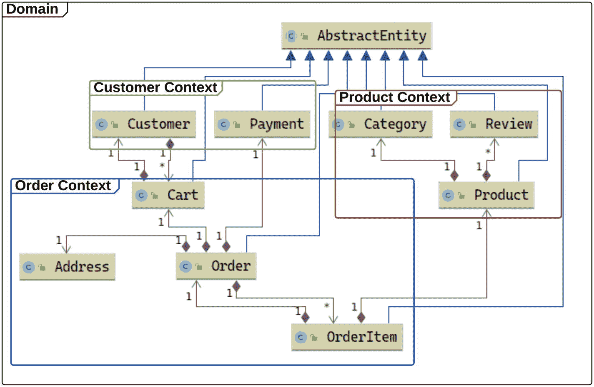
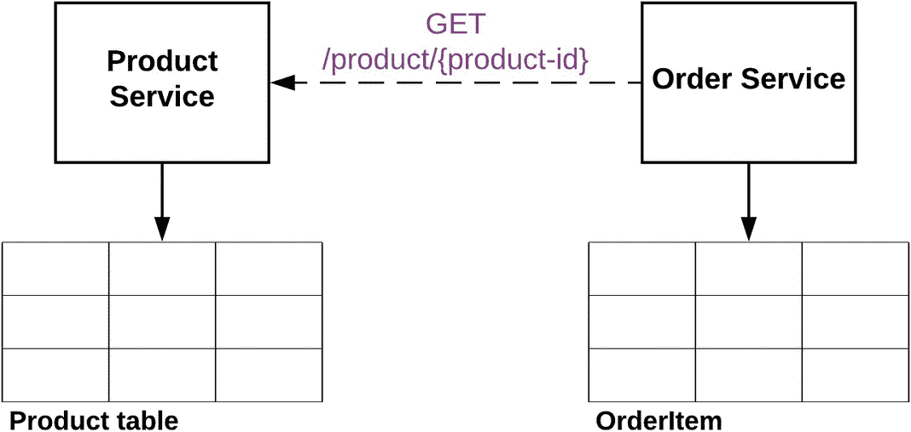

# 8.分裂巨石:轰击领域

## 介绍

我们已经定义了什么是微服务架构，并讨论了它所解决的问题。我们还了解了采用微服务架构的诸多优势。但是，如何将您的单片应用迁移到微服务架构呢？如何应用这种模式？如何在不重写整个应用的情况下拆分你的 monolith？

本章回答了这些问题。我们将使用领域驱动设计作为分割 QuarkuShop 整体的方法。领域驱动设计(DDD)是一种简化软件建模和设计的软件开发方法。

## 什么是领域驱动设计？

领域驱动的设计有很多优点:

*   关注核心业务领域和业务逻辑。

*   确保设计基于领域模型的最佳方式。

*   技术和业务团队之间的紧密合作。

要理解领域驱动设计，你需要理解它的许多概念。

### 语境

语境是一个特定的环境，在这个环境中，一个动作或一个术语有特定的含义。在不同的环境中，这个意思会发生变化。

### 领域

领域是软件开发所针对的一组知识和规范。

### 模型

模型是领域中参与者和组件的抽象表示。

### 普遍存在的语言

公司中不同角色的人对他们面临的业务问题有不同的认识。例如，如果您正在开发一个交易平台，您通常会有一个由项目经理、开发人员、开发人员、测试人员和业务分析师组成的团队。通常，业务分析师是具有业务知识的人，在这种情况下是交易，他们的角色是为不一定精通经济和金融的其他团队成员翻译业务规范和需求。

这种行话将保证所有团队成员对业务环境有相同的理解。

演讲、会议、用户故事和门票中使用的语言/行话被称为*通用语言* *。*

### 战略设计

战略设计是领域驱动设计世界中最重要的范例之一。这有助于将总是复杂的领域分割成更小的部分。这种分裂可能是危险的，可能会改变业务逻辑中的关键概念。战略设计的力量来了:它带来了许多方法和原则，保证了主要领域的完全完整性。

您将在接下来的章节中发现战略设计的主要组成部分。

#### 限界上下文

一个*有界上下文*是属于同一个业务子域的组件的逻辑集合。每个子域由一个专门的团队处理，这将优化新的开发和错误修复。加工小零件比加工大块零件容易。

一个*有界的上下文*有一个定义的范围，它将覆盖所有相关的模型。每个元素只需要归属于一个特定的有界上下文。从语义上来说，一个元素可以属于两个或更多的有界上下文，但是需要做出一个决定来将其归属于主有界上下文。

让我们检查一下我们一直在使用的表预订示例。当您开始设计系统时，您会看到客人会访问应用，并请求在选定的餐馆、日期和时间预订桌子。后端系统通知餐馆预订信息。类似地，假设餐馆也可以预订桌子，那么餐馆会用桌子预订来更新他们的系统。因此，当您查看系统的细微之处时，您会看到三个领域模型:

*   `Product`领域模型

*   `Order`领域模型

*   `Customer`领域模型



它们有自己的有界上下文，您需要确保它们之间的接口工作正常。

## 轰炸采石场

在这里，您将学习如何将 QuarkuShop 应用分成许多步骤。

### 代码库

第一步是为每个有界上下文创建一个包。然后，您将把每个类移动到它相关的有界上下文包中。使用 NetBeans(和其他 ide)，只需点击几下鼠标，就可以轻松地移动和重构代码。在移动代码时，您可能会发现一些您错过的新的有界上下文。

此时，保证重构不会破坏应用的唯一方法就是通过测试！

此任务是前面步骤中创建的设计的直接应用。在这个例子中，这个任务看起来很简单。但是当处理大型应用时，这将是困难的，并且需要几周甚至几个月的时间。为了优化重组操作，可以使用 Stan4j 和 Structure101 等结构分析工具。

## 依赖性和共有性

当您将部分代码移动到相应的包中时，您会看到一些公共类(如实用程序类)。这些常用的类必须移动到一个专用的`COMMONS`包中。

在这一点上，结构分析工具非常方便。

下一节将介绍域分割的最重要的元素:实体和关系。

## 实体

在这一层，您正在拆分源代码。因为 Java 实体被映射到 SQL 表，所以您也需要拆分数据库。

对于数据库访问代码，每个实体都有一个存储库。实体之间的关系揭示了表之间的外键关系，这代表了数据库级的约束。

在 QuarkuShop 中，一个给定的实体将属于一个特定的有界上下文。但是将实体转移到单独的包中并不是最后一步。您需要通过打破属于不同有界上下文的表之间的关系来打破 JPA 映射关系。您将通过示例了解如何在尊重应用业务逻辑完整性的同时做到这一点。

### 示例:断开外键关系

QuarkuShop 应用将产品信息存储在一个专用的表中，该表由 ORM 进行映射和管理。`OrderItem`对象将订购产品的参考和订购数量存储在一个专用表中。在`OrderItem`表中对`Product`记录的引用由一个外键约束组成。

那么怎么才能打破这种关系呢？

答案很容易。

首先，您需要将`OrderItem`中的`Product`引用从`Product`改为`Long`，这是`Product`实体的主键类型。

原始代码如下:

```java
@ManyToOne(fetch = FetchType.LAZY)
private Product product;

```

重构之后，看起来是这样的:

```java
private Long product;

```

`@ManyToOne`注释是无用的，因为没有目标 JPA 实体。现在只是一个`Long`属性。

这一修改将限制`OrderItem`对产品的“知识”量。因此，当您读取`OrderItem`记录时，您需要在`Order`服务中有一个组件，它从`Product`服务中读取给定产品 ID 的数据。服务之间的这种通信将使用 REST 来完成，因为这是一种同步通信。

此交换在此架构中表示:



您有两个数据库调用，而不是一个，因为这两个微服务是分开的，而您在 monolith 中只有一个调用。也许你想知道性能问题？额外的调用将花费一些额外的时间，但这并不重要。如果您在分割之前测试性能，那么您应该在进行更改时具有可见性。

因为外键关系已从代码中删除，所以 SQL 数据库中没有约束。我知道许多数据库管理员对数据完整性不满意。别难过，伙计们！您总是可以开发一个验证批次，确保数据是构建良好的，并且不受约束地不被破坏。删除一个`Product`也需要考虑这一点。您需要想出一个关于存储在`OrderItem`记录中的`Product`id 的策略。

每个微服务都可以自由地存储它的表。它可以使用所有微服务共享的相同数据库/模式，或者您甚至可以为每个微服务创建一个专用的数据库服务器实例。

## 结论

在这一章中，你学习了如何根据领域驱动的设计原则来拆分 QuarkuShop 应用。每个微服务代表一个有界的上下文。这项任务是巨大的，但是循序渐进地做将会减少达到目标所需的努力。

微服务在那里。您只需要在生产环境中解决它们，在那里它们将被消费。在下一章中，您将发现部署的世界。