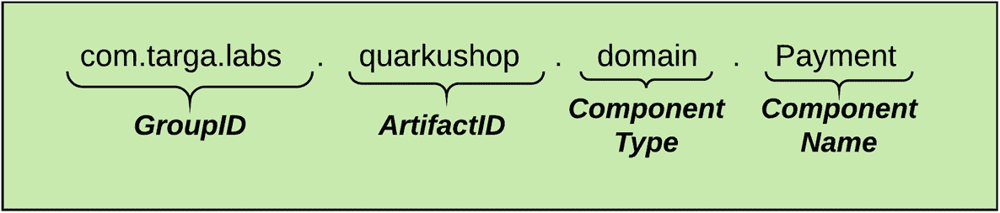
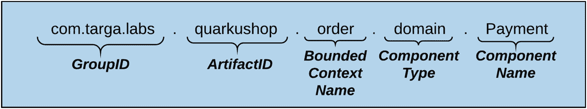
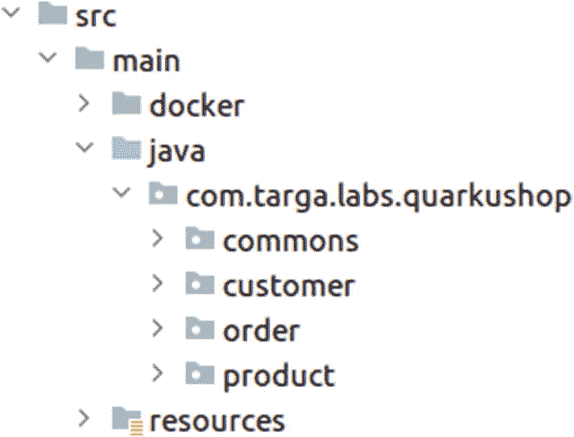
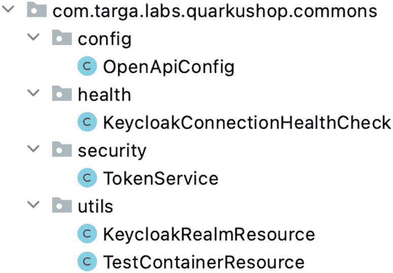
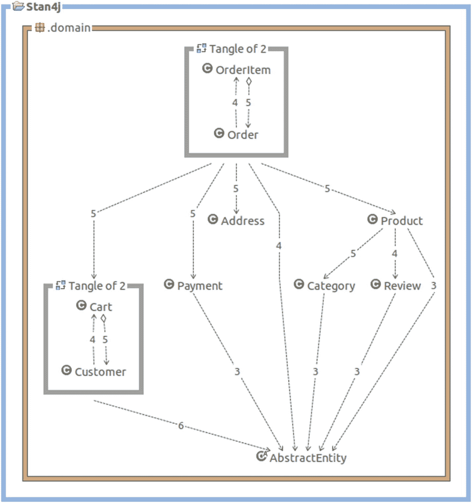
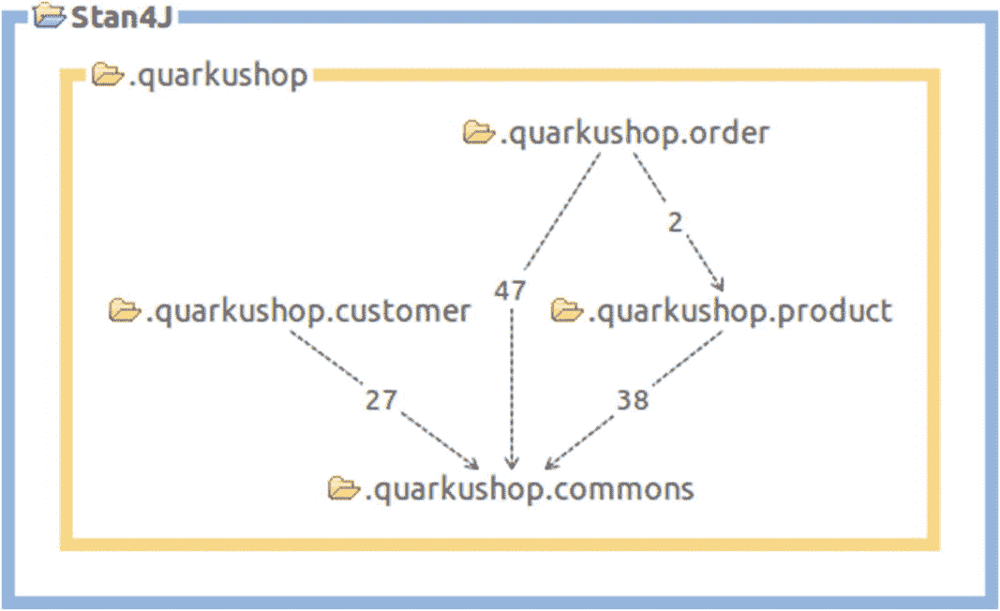

# 9.将 DDD 应用于代码

在前一章中，你学习了如何使用领域驱动设计(DDD)将你的领域分割成有界的上下文。

在这一章中，你将学习如何使用上一章定义的切割线来分割你的代码。

## 将有界上下文应用于 Java 包

我们的类已经按照组件类型进行了分类，比如*存储库*、*服务*等。

我们将把每个组件移动到一个新的包中，这个包包含了绑定的上下文名称。每个组件的名称具有以下格式:



重构后，命名格式将为:



重命名所有组件后，您将得到如下所示的项目树:



等等！您可能想知道`commons`和`configuration`包包含什么。让我们现在讨论一下。

### 公地一揽子计划的诞生

回想一下，公共组件必须被收集到一个专用的`commons`包中，该包将由所有有界上下文共享。以下是我的`commons`包里的东西:



请注意，这些类由配置和实用程序类组成。可以把它们想象成 Apache Commons 库，你可以在几乎每个 Java 项目中直接找到，或者通过某个依赖项间接获得。这个`commons`库由四个包组成:

*   `config`:包含用于配置 OpenAPI 实现和 Swagger UI 的`OpenApiConfig`。

*   `health`:包含自定义键盘锁健康检查。

*   `security`:包含用于抓取 JWT 令牌的`TokenService`。

*   `utils`:包含为测试提供 Keycloak 和 PostgreSQL 的实用程序类。

请注意，所有组件都需要这些实用程序类，对于给定的微服务没有特定的风格。但是你可以随时去掉`commons`库。

我有一个在`commons`项目中分享 dto 的坏习惯。但是，我们伟大的技术评论家圣乔治·安德里亚纳基斯建议我停止这样做！我考虑了一下，我同意这是一个坏主意，即使对于概念验证项目也是如此。

我们在讲微服务的时候说过，拆分之后，微服务之间可以互相对话。所以，想象一下这种情况:`Order`想要使用给定的`Product ID`从`Product`微服务获得一个`Product`。`Product`中的 REST API 将返回一个由`Product`记录的数据填充的`ProductDTO`对象，该对象将被序列化为 JSON 并返回给请求服务`Order`。在这个层次上，每个微服务都有一个`Product`的定义。基于许多元素，如项目规范、文档，甚至通过 OpenAPI 资源，不同的微服务可以轻松地进行通信。如果 dto 在`commons`库中共享，我们可能会失去微服务的一个好处:摆脱紧耦合。

### 定位有界上下文关系

这一步旨在打破有界上下文(BCs)之间的依赖关系。为了能够打破它们，您需要首先找到这些依赖关系。有很多方法可以找到他们。例如，通过查看类图、源代码等。在前一章中，我们谈到了可以帮助你突出你的 monolith 块之间的依赖关系的工具。

我主要用的是 STAN (STAN4J)，一个强大的 Java 结构分析工具。STAN 支持一套精心选择的度量标准，适合于覆盖结构质量的最重要的方面。特别关注视觉依赖分析，这是结构分析的关键。

STAN 有两种型号:

*   作为 Windows 和 macOS 的独立应用程序，面向通常不使用 IDE 的架构师和项目经理。

*   作为 Eclipse 集成开发环境(IDE)的扩展，它允许开发人员快速探索任何代码束的结构。

我们将使用第二种选择。我获得了 Eclipse IDE 的全新安装，并按照 [`http://stan4j.com/download/ide/`](http://stan4j.com/download/ide/) 中的描述安装了 IDE 扩展。

我们的 monolith 是一个基于 Maven 的项目，所以它可以很容易地导入到 Eclipse IDE 中。导入后，只需遵循以下步骤:

1.  右键单击该项目。

2.  选择作为➤ Maven Build 运行。

3.  选择 Maven 配置，如果您已经有一个的话。

4.  在目标中，只需输入`clean install -DskipTests`并选择运行。

5.  你完蛋了！

接下来，创建项目的结构分析:

1.  右键单击该项目。

2.  选择“作为➤结构分析运行”。

3.  耶！结构图在这里！



### 打破 BC 关系

现在，您将打破有界上下文之间的关系。您可以从实体之间的关系开始。通常，数据库中的表之间的关系更有效。这里，实体类被视为关系表(JPA 概念)，因此实体类之间的关系如下:

*   `@ManyToOne`关系

*   `@OneToMany`关系

*   `@OneToOne`关系

*   `@ManyToMany`关系

更准确地说，您不会破坏属于同一个 BC 的实体之间的关系，但是会破坏 BC 间的关系。例如，考虑属于`Order Context`的`OrderItem`和属于`Product Context`的`Product`之间的关系。

在 Java 中，这种关系由以下内容表示:

```java
public class OrderItem extends AbstractEntity {
    @NotNull
    @Column(name = "quantity", nullable = false)
    private Long quantity;

    @ManyToOne
    private Product product;

    @ManyToOne
    private Order order;
}

```

注释`product`字段的`@` `ManyToOne`是这里的目标。

你怎么打破这种关系？很简单，这个街区:

```java
@ManyToOne
private Product product;

```

将被更改如下:

```java
private Long productId;

```

所以，你可能想知道为什么我们用`Long`类型替换`Product`类型？很简单。`Long`是`Product's` ID 的类型。

太好了。如果`OrderItem`和`Product`之间的关系是双向关系，你必须对`Product`类做同样的事情。

当您尝试使用`mvn clean install`构建项目时，会遇到编译问题。这是显而易见的，因为您编辑了`OrderItem`，所以许多使用这个类的组件必须知道这些修改。在这里，`OrderItemService`才是问题所在。

让我们看看`OrderItemService`类中有错误的块。这是第一个:

```java
public OrderItemDto create(OrderItemDto orderItemDto) {
    log.debug("Request to create OrderItem : {}", orderItemDto);

    var order = this.orderRepository
          .findById(orderItemDto.getOrderId())
          .orElseThrow(() -> new IllegalStateException("The Order does not exist!"));

    var product = this.productRepository
          .findById(orderItemDto.getProductId())
          .orElseThrow(() -> new IllegalStateException("The Product does not exist!"));

    return mapToDto(
        this.orderItemRepository.save(
            new OrderItem(
                    orderItemDto.getQuantity(),
                    product,
                    order
            )));
}

```

我们从`ProductRepository`中获取一个`Product`实例，并将它传递给`OrderItem`构造函数。在`OrderItem`类中不再有`Product`字段(您将其改为`Product ID` **)** ，因此您需要将 ID 传递给`OrderItem`构造函数，而不是`Product`。

因此，`Product`对象不再存在于`Order`有界上下文中。现在怎么处理`Product`和`ProductRepository`这两个职业？

你忘了吗？在`Order`有界上下文的范围内，我们有`commons`模块，它包含了`ProductDTO`，我们可以免费使用！

对于`ProductRepository`，显而易见。它将被一个 REST 客户端取代，该客户端将从`Product`微服务收集`Product`数据，并在需要时填充已知的`ProductDTO`对象。但是在这里，我们只需要用`Product ID`来创建`OrderItem`实例。所以，在这种情况下，我们不需要获取`Product`记录。

第二个块是将`OrderItem`映射到`OrderItemDto`的方法:

```java
public static OrderItemDto mapToDto(OrderItem orderItem) {
        return new OrderItemDto(
                orderItem.getId(),
                orderItem.getQuantity(),
                orderItem.getProductId(),
                orderItem.getOrder().getId()
        );
    }

```

必须从这个方法中删除对`Product`的引用，因为它已经从`OrderItem`类中删除了。我们没有产品作为成员，但是我们有`OrderItem`类中的`Product ID`。所以`orderItem.getProduct().getId()`指令必须改为`orderItem.getProductId()`。为了从订单总价中增加/减去产品价格，我们在`OrderItemService`中注入`ProductRepository`。

产生的`OrderItemService`将如下所示:

```java
@Slf4j
@ApplicationScoped
@Transactional
public class OrderItemService {

    @Inject OrderItemRepository orderItemRepository;
    @Inject OrderRepository orderRepository;
    @Inject ProductRepository productRepository;

    public static OrderItemDto mapToDto(OrderItem orderItem) {
        return new OrderItemDto(orderItem.getId(),
                orderItem.getQuantity(), orderItem.getProductId(),
                orderItem.getOrder().getId());
    }

    public OrderItemDto findById(Long id) {
        log.debug("Request to get OrderItem : {}", id);
        return this.orderItemRepository.findById(id)
                    .map(OrderItemService::mapToDto).orElse(null);
    }

    public OrderItemDto create(OrderItemDto orderItemDto) {
        log.debug("Request to create OrderItem : {}", orderItemDto);
        var order = this.orderRepository
                .findById(orderItemDto.getOrderId()).orElseThrow(() ->
                    new IllegalStateException("The Order does not exist!"));

        var orderItem = this.orderItemRepository.save(
                new OrderItem(orderItemDto.getQuantity(),
                        orderItemDto.getProductId(), order
                ));

        var product = this.productRepository.getOne(orderItem.getProductId());

        order.setPrice(order.getPrice().add(product.getPrice()));
        this.orderRepository.save(order);

        return mapToDto(orderItem);
    }

    public void delete(Long id) {
        log.debug("Request to delete OrderItem : {}", id);

        var orderItem = this.orderItemRepository.findById(id)
                .orElseThrow(() ->
                    new IllegalStateException("The OrderItem does not exist!"));

        var order = orderItem.getOrder();
        var product = this.productRepository.getOne(orderItem.getProductId());

        order.setPrice(order.getPrice().subtract(product.getPrice()));

        this.orderItemRepository.deleteById(id);

        order.getOrderItems().remove(orderItem);
        this.orderRepository.save(order);
    }

    public List<OrderItemDto> findByOrderId(Long id) {
        log.debug("Request to get all OrderItems of OrderId {}", id);
        return this.orderItemRepository.findAllByOrderId(id)
                .stream()
                .map(OrderItemService::mapToDto)
                .collect(Collectors.toList());
    }
}

```

在这个重构之后，您可以使用 STAN 这个伟大的工具来看看这些修改是如何改变项目的结构的。

经过一些检查后，剩下要做的修改是:

*   在`order`包装中:
    1.  `Order`:`private Cart cart;`将变为`private Long cartId;`

    2.  `OrderService`:`Cart`参考将变为`CartDto`

*   在`customer`包装中:
    1.  `Cart`:第`private Order order`；会改成`private Long orderId`；

    2.  `CartService`:`Order`参考将变为`OrderDto`

在这些修改之后，我们在`CartService`中仍然有一个`OrderService`引用。如前所述，这个`OrderService`将被一个 REST 客户端取代，该客户端将调用由`Order`微服务公开的 API。在分析结构之前，您可以引用`OrderService`来注释这些行。

在这次重构之后，以下是这些修改如何改变了项目的结构:



你没有完全切断`order`和`product`包之间的联系。这是因为，要计算订单总额，您需要有产品价格。您将在以后的步骤中看到如何处理这个链接。

## 结论

这很好！您刚刚完成了迁移过程中最繁重的任务之一！

接下来，您可以开始构建独立的微服务。在此之前，您需要了解更多关于最佳实践和微服务模式的信息。