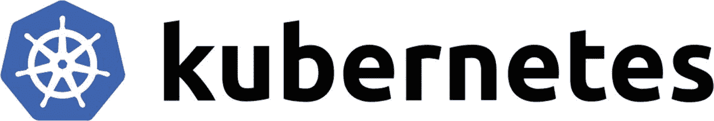
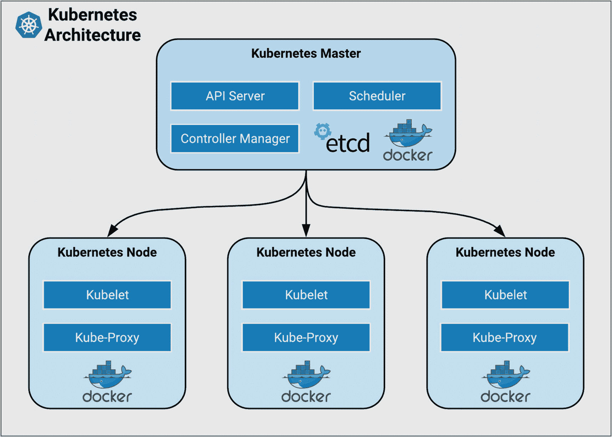
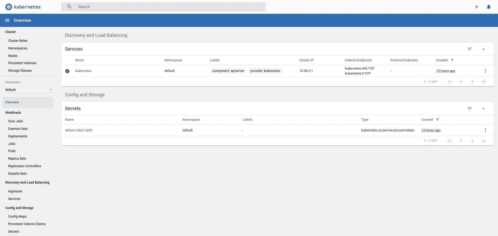
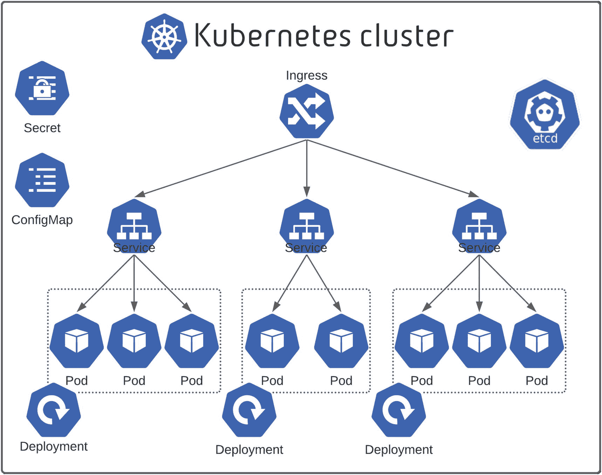
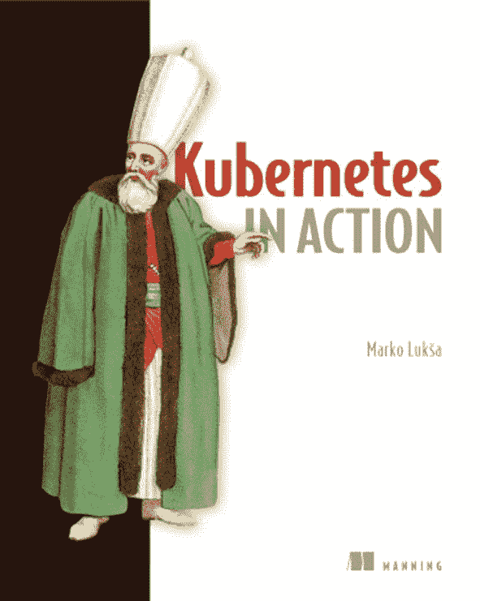
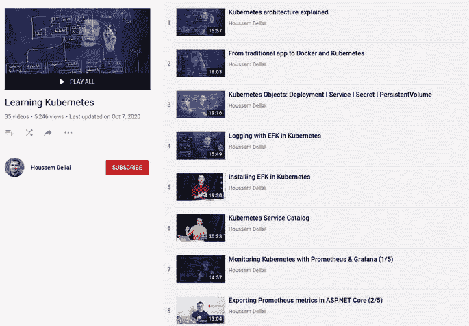

# 十一、Kubernetes 入门

## 介绍

为了部署我们的(如此庞大的)应用，我们将使用 Docker。我们将在一个容器中部署我们的代码，因此我们可以享受由 Docker 提供的强大功能。

Docker 已经成为开发和运行容器化应用的标准。

使用 Docker 非常简单，尤其是在开发阶段。在同一个服务器中部署容器(`docker-machine`)很简单，但是当您需要将许多容器部署到许多服务器时，事情就变得复杂了(管理服务器、管理容器状态等等。).

这就是编排系统发挥作用的时候，它提供了许多出色的功能:

*   在运行的任务之间协调资源

*   基于许多因素，如资源需求、相似性要求等，调度容器并使其与机器匹配。

*   处理复制

*   处理故障

对于本教程，我们使用 Kubernetes，容器编排之星。

## 什么是 Kubernetes？

Kubernetes(又名 K8s)是一个从 Google 分离出来的项目，是一个开源的下一代容器调度器。它是利用从开发和管理博格和欧米茄中学到的经验设计的。



Kubernetes 被设计成具有松散耦合的组件，以部署、维护和扩展应用为中心。K8s 抽象了节点的底层基础设施，并为部署的应用提供了统一的层。

### 永恒的建筑

Kubernetes 集群由两项组成:

*   **主节点**:Kubernetes 的主控制平面。它包含一个 API 服务器、一个调度器、一个控制器管理器(K8s 集群管理器)和一个用于保存集群状态的数据存储库`Etcd`。

*   **Worker node** :运行 *pod* 的单个主机，物理或虚拟机。它由主节点管理。

让我们看看主节点的内部:

*   **Kube API-Server** :允许通过 REST APIs，在主节点和它的客户端之间进行通信，例如工作节点、`kube-cli`等。

*   Kube 调度器(Kube Scheduler):调度器就像一个餐厅服务员，根据特定的逻辑(也就是一个策略)给你分配“第一个可用”的桌子。Kube 调度器根据特定的策略将新成员分配到最合适的节点。

*   **Kube 控制器管理器**:一个永久运行的进程，负责确保 Kubernetes 集群状态与管理员请求的状态相同。如果管理员发出了一些配置命令，Kube 控制器管理器负责验证这些命令是否应用于整个集群。

*   `Etcd`:Kubernetes 用来保存集群配置的键值数据库。

让我们看看 worker 节点的内部:

*   **Kubelet** :在集群中每个节点上运行的代理。它确保节点在主节点中正确注册，并验证 POD 运行正常。

*   **Kube-Proxy** :集群中每个节点上运行的代理。它确保网络规则在节点中正确应用。



我们使用的容器运行时是 Docker。Kubernetes 兼容很多其他的，比如`cri-o`、`rkt`等。

### 不可思议的核心概念

K8s 生态系统涵盖了很多概念和组件。下一节将简要讨论它们。

#### 库布特雷

`kubectl`是一个 CLI，用于在已配置的 Kubernetes 集群上执行命令。

#### 串

一个*集群*是集合了它们的资源(CPU、RAM、磁盘等)的主机的集合。)放入一个公共的可用池中，然后由集群资源共享(和控制)。

#### 命名空间

将*名称空间*想象成一个用来保存不同种类资源的文件夹。这些资源可以被一个或多个用户使用。

要列出所有的名称空间，可以使用`kubectl get namespace`或`kubectl get ns`命令。

#### 标签

标识和选择相关对象集的键值对。标签有严格的语法和定义的字符集。

#### 豆荚

一个 *pod* 是 Kubernetes 的基本工作单元。pod 代表共享资源(如 IP 地址和存储)的容器集合。见清单 [11-1](#PC1) 。

```java
apiVersion: v1
kind: Pod
metadata:
  name: example-pod
  labels:
    app: example
spec:

  containers:
  - name: example-container
    image: busybox
    command: ['sh', '-c', 'echo Hello World :) !']

Listing 11-1Pod Example

```

要列出所有窗格，运行`kubectl get pod`或`kubectl get po`命令。

#### replication set-复制集

该组件负责在任何给定时间运行所需数量的副本容器。参见清单 [11-2](#PC2) 。

```java
apiVersion: apps/v1
kind: ReplicaSet
metadata:
  name: mongodb
  labels:
    app: mongodb
spec:
  replicas: 2
  selector:
    matchLabels:
      app: mongodb
  template:
    metadata:
      labels:
        app: mongodb
    spec:
      containers:
      - name: mongodb
        image: mongo:4.4
        imagePullPolicy: Always

Listing 11-2ReplicaSet Example

```

要列出所有副本集，请运行`kubectl get replicaset`或`kubectl get rs`命令。

#### 部署

这包括 pod 模板和副本字段。Kubernetes 将确保实际状态(副本的数量和 pod 模板)总是与期望的状态相匹配。当您更新部署时，它将执行“滚动更新”参见清单 [11-3](#PC3) 。

```java
apiVersion: apps/v1
kind: Deployment
metadata:
  name: nginx-deployment
  labels:
    app: nginx
spec:
  replicas: 3
  selector:
    matchLabels:
      app: nginx
  template:
    metadata:
      labels:
        app: nginx
    spec:
      containers:
      - name: nginx
        image: nginx:1.9.1
        ports:
        - containerPort: 80

Listing 11-3Deployment Example

```

要列出所有部署，使用`kubectl get deployment`命令。

#### 有状态任务

该组件负责管理必须保持或维护状态的 pod。包括主机名、网络和存储在内的 pod 标识将被保留。参见清单 [11-4](#PC4) 。

```java
apiVersion: apps/v1
kind: StatefulSet
metadata:
  name: web
spec:
  selector:
    matchLabels:
      app: nginx
  serviceName: "nginx"
  replicas: 3
  template:
    metadata:
      labels:
        app: nginx
    spec:
      terminationGracePeriodSeconds: 10
      containers:
      - name: nginx
        image: k8s.gcr.io/nginx-slim:0.8
        ports:
        - containerPort: 80
          name: web
        volumeMounts:
        - name: www
          mountPath: /usr/share/nginx/html
  volumeClaimTemplates:
  - metadata:
      name: www
    spec:
      accessModes: [ "ReadWriteOnce" ]
      storageClassName: "my-storage-class"
      resources:
        requests:
          storage: 1Gi

Listing 11-4StatefulSet Example

```

要列出所有状态集，运行`kubectl get statefulset`命令。

#### 达蒙塞特

该组件在集群中的所有(或部分)节点上创建每个 pod 的实例。参见清单 [11-5](#PC5) 。

```java
apiVersion: apps/v1
kind: DaemonSet
metadata:
  name: fluentd-elasticsearch
  namespace: kube-system
  labels:
    k8s-app: fluentd-logging
spec:
  selector:
    matchLabels:
      name: fluentd-elasticsearch
  template:
    metadata:
      labels:
        name: fluentd-elasticsearch
    spec:
      tolerations:
        - key: node-role.kubernetes.io/master
          effect: NoSchedule
      containers:
        - name: fluentd-elasticsearch
          image: gcr.io/google-containers/fluentd-elasticsearch:1.20
      terminationGracePeriodSeconds: 30

Listing 11-5DaemonSet Example

```

要列出所有 DaemonSets，请运行`kubectl get daemonset`或`kubectl get ds`命令。

#### 服务

这定义了一个 IP/端口组合，提供对一组 pod 的访问。它使用标签选择器将多组 pod 和端口映射到一个集群独有的虚拟 IP。参见清单 [11-6](#PC6) 。

```java
apiVersion: v1
kind: Service
metadata:
  name: my-nginx
  labels:
    run: my-nginx
spec:
  ports:
    - port: 80
      protocol: TCP
  selector:
    run: my-nginx

Listing 11-6Service Example

```

要列出所有服务，运行`kubectl get service`或`kubectl get svc`命令。

#### 进入

入口控制器是向外界公开集群服务(通常是`http`)的主要方法。这些是负载平衡器或路由器，通常提供 SSL 终端、基于名称的虚拟主机等。见清单 [11-7](#PC7) 。

```java
apiVersion: networking.k8s.io/v1
kind: Ingress
metadata:
  name: test-ingress
  annotations:
    nginx.ingress.kubernetes.io/rewrite-target: /
spec:
  rules:
    - http:
        paths:
          - path: /testpath
            backend:
              service:
                name: test
                port:
                  number: 80

Listing 11-7Ingress Example

```

要列出所有入口，请使用`kubectl get ingress`。

#### 卷

这表示与 pod 生命周期相关的存储，可由 pod 中的一个或多个容器使用。

#### 持久卷

持久卷(PV)代表一种存储资源。PVs 通常链接到后备存储资源，如 NFS、GCEPersistentDisk、RBD 等。、和是提前配置的。它们的生命周期独立于 pod 进行处理。

要列出所有持久卷，请运行`kubectl get persistentvolume`或`kubectl get pv`命令。

#### PersistentVolumeClaim

PersistentVolumeClaim (PVC)是满足一组要求的存储请求。它通常用于动态调配的存储。

要列出所有 PersistentVolumeClaims，请使用`kubectl get persistentvolumeclaim`或`kubectl get pvc`命令。

#### 存储类

存储类是对外部存储资源的抽象。它们包括置备程序、置备程序配置参数和 PV `reclaimPolicy`。

要列出所有存储类，请运行`kubectl get storageclass`或`kubectl get sc`。

#### 职位

作业控制器确保一个或多个 pod 被执行并成功终止。它将这样做，直到它满足完成和/或并行条件。

要列出所有作业，运行`kubectl get job`。

#### 克朗乔布

作为作业控制器的扩展，CronJob 提供了一种按照类似 cron 的时间表执行作业的方法。

要列出所有 CronJobs，运行`kubectl get cronjob`。

#### ConfigMap(配置地图)

ConfigMap 是存储在 Kubernetes 中的外部化数据，可以作为命令行参数或环境变量引用，或者作为文件注入到卷挂载中。它们是实现外部配置存储模式的理想选择。

要列出所有配置图，运行`kubectl get configmap`或`kubectl get cm`。

#### 秘密

功能上与 ConfigMaps 相同，但存储编码为 base64，静态加密(如果已配置)。

要列出所有秘密，运行`kubectl get secret`。

## 在本地运行 Kubernetes

对于本教程，我们不会构建一个真正的 Kubernetes 集群。我们使用 Minikube。

Minikube 用于在本地运行单节点 Kubernetes 集群，没有任何痛苦。这个工具非常有用，尤其是对于开发。

如需安装 Minikube，请访问 [`https://github.com/kubernetes/minikube`](https://github.com/kubernetes/minikube) 。

安装完成后，运行以下命令启动 Minikube:

```java
minikube start

```

当运行 Minikube 时，一个新的 Kubernetes 上下文被创建并可用。`minikube start`命令创建一个名为`minikube`的`kubectl context`。

Kubernetes 上下文包含与 Kubernetes 集群通信所需的配置。

要访问 Kubernetes 仪表板，请运行:

```java
minikube dashboard

```

仪表板将在您的默认浏览器中打开，如下所示:



这些`minikube`命令特别有用:

*   `minikube stop`:停止 K8s 集群并关闭 Minikube 虚拟机，而不会丢失集群内容。

*   `minikube delete:`删除 K8s 集群和 Minikube 虚拟机。

您可以使用以下命令为`minikube`分配资源:

```java
minikube config set memory 8192                 ①
minikube config set cpus 4                      ②
minikube config set kubernetes-version 1.16.2   ③
minikube config set vm-driver kvm2              ④
minikube config set container-runtime crio      ⑤

```

每行定义:

*   ①分配的内存为 8192MB (8GB)

*   ②分配给 4 个 CPU

*   ③kubler 版本至 1.16.2

*   ④虚拟机驱动程序到`kvm2`。要了解更多关于司机的信息，请访问 [`https://minikube.sigs.k8s.io/docs/drivers/`](https://minikube.sigs.k8s.io/docs/drivers/)

*   ⑤容器运行时使用`crio`而不是 Docker(默认选择)

在设置新配置之前，您需要删除当前的`minikube`集群实例。

要检查配置是否正确保存，只需运行`minikube config view`:

```java
$ minikube config view

- cpus: 4
- kubernetes-version: 1.16.2
- memory: 8192
- vm-driver: kvm2
- container-runtime: crio

```

## 实践总结和结论

Kubernetes 是市场上使用最广泛的容器 orchestrator。许多解决方案现在都基于它，比如 OpenShift 容器平台和 Rancher Kubernetes 引擎。Kubernetes 成为了云原生架构和基础设施的标准。几乎所有的云提供商都管理 Kubernetes 托管以下内容:

*   蓝色忽必烈服务

*   亚马逊弹性库柏服务

*   谷歌库比厄引擎

*   IBM 云库服务

*   用于 Kubernetes 的 Oracle 容器引擎

*   阿里巴巴容器服务公司

甚至 OVH 和数字海洋也加入了提供托管 Kubernetes 托管解决方案的竞赛。

如本章第一部分所列，有许多 Kubernetes 对象。每一种都可以用来满足特定的需求。在下一节中，我们将看看这些对象如何满足我们的需求。



QuarkuShop 被打包成一个 Docker 容器。在 Kubernetes 中，我们的应用将在 pod 对象中运行，这是最基本的 Kubernetes 对象！对于给定的微服务，我们可能希望有多个 pod。为了避免手动管理它们，您可以使用 Deployment 对象，该对象将处理每个 pod 集。它还将确保有所需数量的实例，以防您希望某个特定 pod 有许多实例。

要存储这些属性，可以使用 ConfigMap。要存储凭证，可以使用`SECRET`对象。要访问它们，您需要与 Kubernetes API 服务器通信，以获取/读取所需的数据。

当我们将单体应用拆分为微服务时，我们说它们之间的通信是基于 HTTP 协议的(直接或间接)。每个微服务都在一个 pod 内运行，它将拥有一个专用的动态 IP 地址。因此，例如，如果`Order`微服务与`Product`微服务通信，它就无法猜测其目标的 IP 地址。我们需要使用类似 DNS 的解决方案，使用域名而不是 IP 地址，让系统动态解析域名。这正是 K8s 服务所做的。属于同一个服务的所有单元在同一个 DNS 名称下共享它们的 IP 地址，在那里你可以对它们进行负载平衡。

除了动态 IP 地址解析，该服务还包括负载平衡功能。

要在集群外部公开 QuarkuShop，请使用`INGRESS`对象。它对外公开了一个 Kubernetes 服务，并具有许多优秀的特性，包括负载平衡、SSL 等。

## 附加阅读

我无法在一章中完全涵盖 Kubernetes。这一章只是对 Kubernetes 世界的一个小介绍。我建议你读读马尔科·卢卡写的、曼宁出版社出版的《Kubernetes在行动中的 T2》。我个人认为这是Kubernetes写的最好的书。



如果你更喜欢视频，我推荐这个伟大的 Kubernetes 学习 YouTube 播放列表，它是由我的朋友 Houssem Dellai 制作的，他是微软的云工程师。

