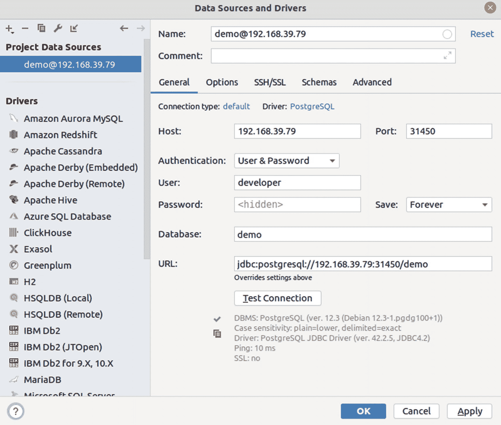
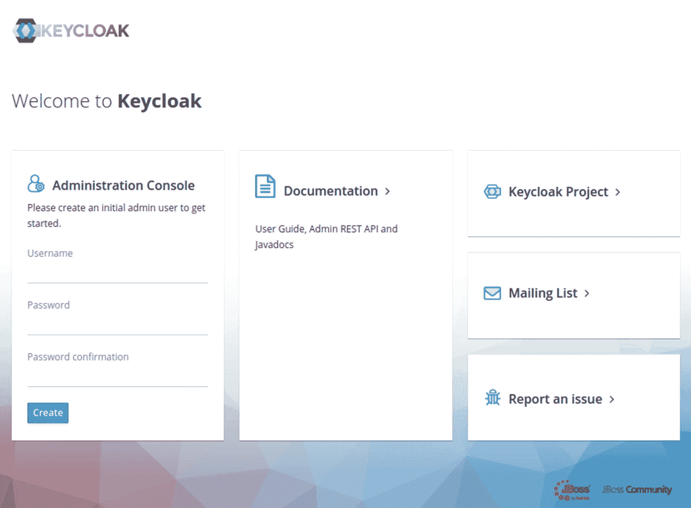
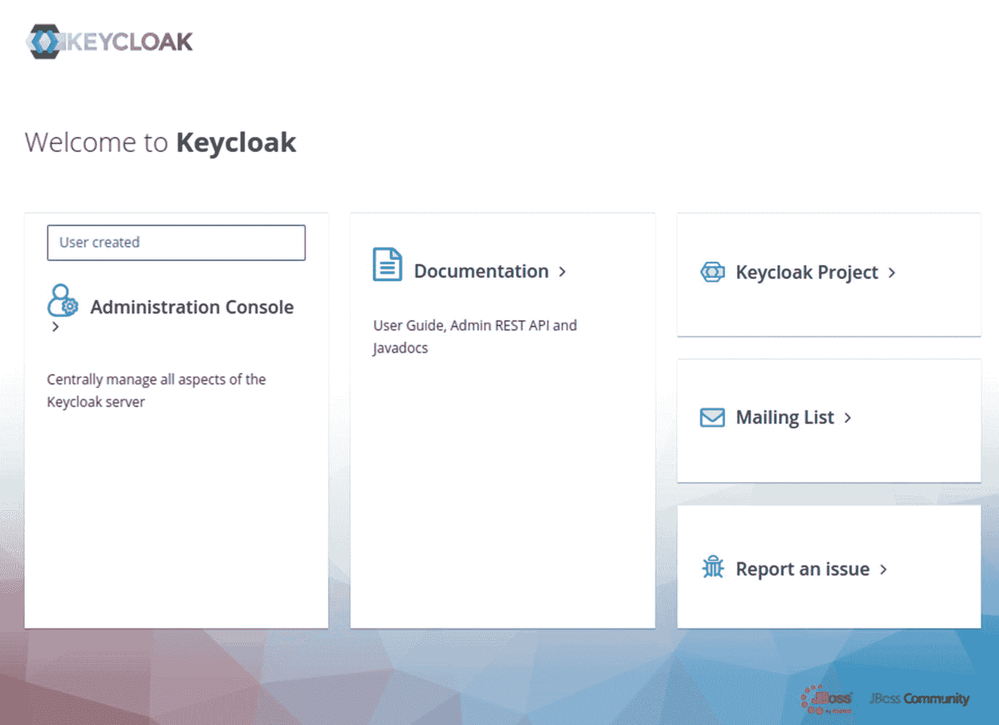
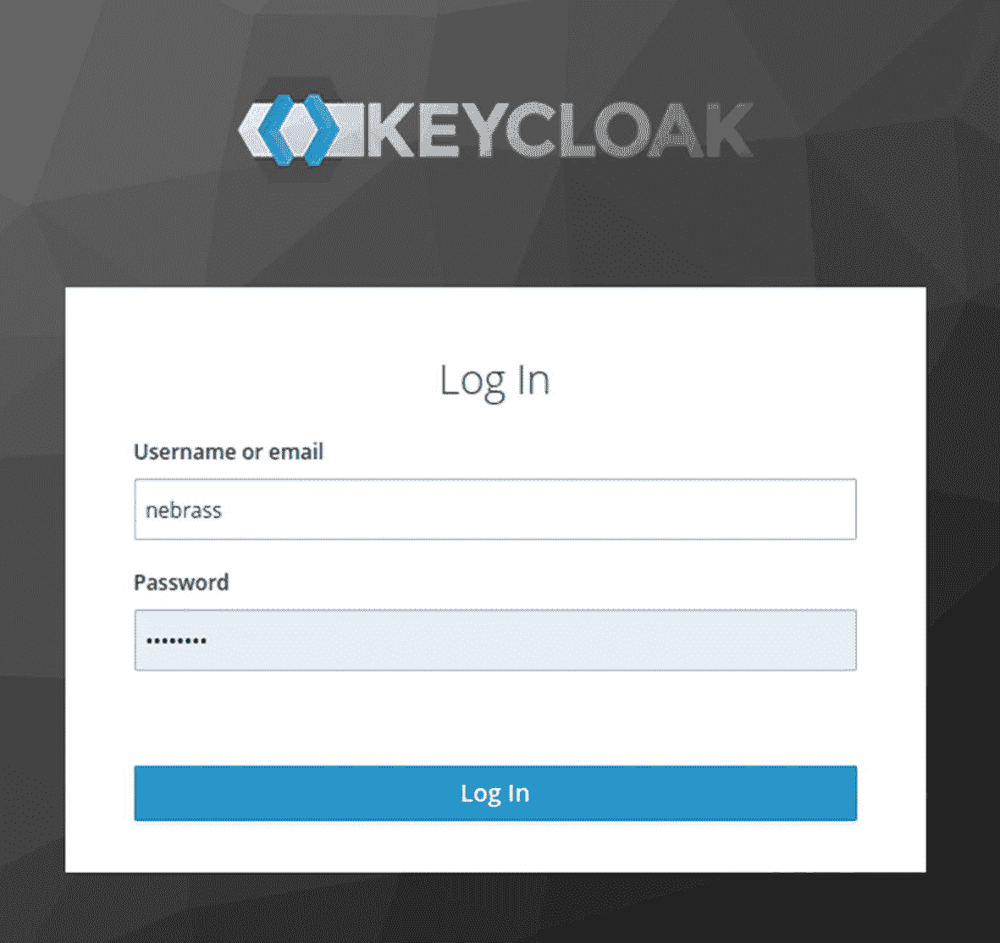
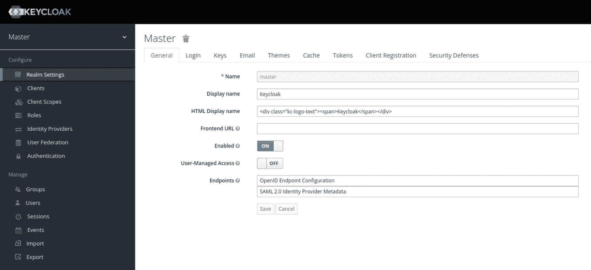
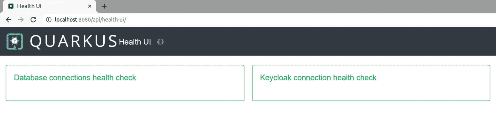
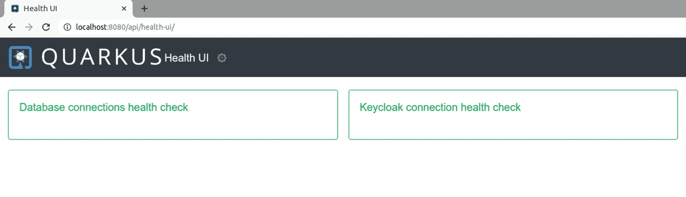

# 十二、实现云模式

## 介绍

你已经知道你将在本书中使用 Kubernetes 作为云平台。在前一章中，您学习了将与 QuarkuShop 一起使用的 Kubernetes 对象。在这一章中，您将开始实现一些云模式，并将 monolithic universe(monolithic application、PostgreSQL 和 Keycloak)引入 Kubernetes。

## 将庞大的宇宙带到 Kubernetes

在开始处理应用代码之前，您需要将 PostgreSQL 数据库和 Keycloak 放到 Kubernetes 集群中。

### 将 PostgreSQL 部署到 Kubernetes

要将一个 PostgreSQL 数据库实例部署到 Kubernetes，您将使用:

*   存储 PostgreSQL 用户名和数据库名的`ConfigMap`

*   存储 PostgreSQL 密码的`Secret`

*   一个为 PostgreSQL pods 请求存储空间的`PersistentVolumeClaim`

*   一个`Deployment`提供了想要的 PostgreSQL pods 的描述

*   用作指向 PostgreSQL pods 的 DNS 名称的`Service`

PostgreSQL 的`ConfigMap`如清单 12-1 所示。

```java
apiVersion: v1
kind: ConfigMap
metadata:
  name: postgres-config
  labels:
    app: postgres
data:
  POSTGRES_DB: demo
  POSTGRES_USER: developer

Listing 12-1postgres-cm.yaml

```

PostgreSQL 密码存储在一个`Secret`中。该值需要编码为 Base64。您可以在本地使用`openssl`库对`p4SSW0rd`字符串进行编码:

```java
echo -n 'p4SSW0rd' | openssl base64

```

结果是`cDRTU1cwcmQ=`。你在`Secret`对象内部使用它，如清单 12-2 所示。

```java
apiVersion: v1
kind: Secret
metadata:
  name: postgres-secret
  labels:
    app: postgres
type: Opaque
data:
  POSTGRES_PASSWORD: cDRTU1cwcmQ=

Listing 12-2postgres-secret.yaml

```

清单 12-3 显示了用于请求 PostgreSQL 存储访问的`PersistentVolumeClaim`。

*   PVC 名称。

*   ②访问类型。许多 pod 可以在这个 PVC 中同时读写。

*   ③所需的 PVC 存储。

```java
apiVersion: v1
kind: PersistentVolumeClaim
metadata:
  name: postgres-pvc        ①
  labels:
    app: postgres
spec:
  accessModes:
    - ReadWriteMany         ②
  resources:
    requests:
      storage: 2Gi          ③

Listing 12-3postgres-pvc.yaml

```

清单 12-4 展示了 PostgreSQL `Deployment`文件。

```java
apiVersion: apps/v1
kind: Deployment
metadata:
  name: postgres
spec:
  replicas: 1                         ①
  selector:
    matchLabels:
      app: postgres                   ②
  template:
    metadata:
      labels:
        app: postgres
    spec:
      volumes:                        ③
        - name: data                  ③
          persistentVolumeClaim:      ③
            claimName: postgres-pvc   ③
      containers:
        - name: postgres
          image: postgres:12.3
          envFrom:
            - configMapRef:           ④
                name: postgres-config ④
            - secretRef:              ④
                name: postgres-secret ④
          ports:
            - containerPort: 5432
          volumeMounts:               ③
            - name: data              ③
              mountPath: /var/lib/postgresql/data
              subPath: postgres
          resources:
            requests:
              memory: '512Mi'           ⑤
              cpu: '500m'               ⑤
            limits:
              memory: '1Gi'             ⑥
              cpu: '1'                  ⑥

Listing 12-4postgres-deployment.yaml

```

此`deployment`资源将使用以下内容部署 PostgreSQL:

*   ①一个 pod 实例。

*   ②瞄准带有`app=postgres`标签的单元。

*   ③将`postgres-pvc`定义为持久性卷。

*   ④从`postgres-config`和`postgres-secret`加载环境变量。

*   ⑤每个 pod 所需的最低资源是 512MB 和 0.5 个 CPU 单元。

*   ⑥每个 pod 允许的最大资源是 1GB 和 1 个 CPU 单元。

PostgreSQL `Service`文件如清单 12-5 所示。

```java
apiVersion: v1
kind: Service
metadata:
  name: postgres
  labels:
    app: postgres
spec:
  selector:
    app: postgres
  ports:
   - port: 5432
  type: LoadBalancer

Listing 12-5postgres-svc.yaml

```

我们正在创建一个类型为`LoadBalancer`的`Service`。在支持负载平衡器的云提供商上，将提供一个外部 IP 地址来访问`Service`。当我们在`minikube`时，`LoadBalancer`类型使`Service`可以通过`minikube service`命令访问:

`minikube service SERVICE_NAME`

接下来，我们使用 IntelliJ 数据库浏览器测试已部署的 PostgreSQL 实例。

首先获取 PostgreSQL Kubernetes 服务 URL。您可以使用这个命令从 Minikube 集群获取 Kubernetes 服务 URL:

```java
$ minikube service postgres --url

http://192.168.39.79:31450

```

该命令将返回 Minikube 集群中服务的 Kubernetes URL。如果有很多 URL，将一次打印一个。

我们将使用以下内容:

*   `192.168.39.79:31450`作为数据库的 URL

*   `developer`作为用户

*   `p4SSW0rd`作为密码

*   `demo`作为数据库名称

只需点击测试连接，以验证一切正常。如果没问题，您将得到一个确认连接成功的。



### 将 Keycloak 部署到 Kubernetes

为了将 Keycloak 部署到 Kubernetes 集群，我们将使用 Helm。

What is Kubernetes Helm?

Helm 是 Kubernetes 的一个包管理器，允许开发人员和操作人员更容易地将应用和服务打包、配置和部署到 Kubernetes 集群上。

Helm 现在是 Kubernetes 的一个官方项目，也是 Cloud Native Computing Foundation 的一部分，这是一个支持 Kubernetes 生态系统内外开源项目的非营利组织。

舵柄可以:

*   安装软件。

*   自动安装软件依赖项。

*   升级软件。

*   配置软件部署。

*   从存储库中获取软件包。

Helm 通过以下组件提供此功能:

*   一个名为`helm`的命令行工具，提供了所有舵功能的用户界面。

*   一个名为`tiller`的配套服务器组件运行在您的 Kubernetes 集群上，监听来自`helm`的命令，并处理集群上软件版本的配置和部署。

*   舵的包装格式，称为*图表*。

What is a Helm Chart ?

Helm 包被称为 *charts* ，它们由几个 YAML 配置文件和一些呈现在 Kubernetes 清单文件中的模板组成。

`helm`命令可以从本地目录安装图表，或者从这个目录结构的`.tar.gz`打包版本安装图表。这些打包的图表也可以从图表存储库或 repos 自动下载和安装。

要安装 Helm CLI，只需转到本指南: [`helm.sh/docs/intro/install`](https://helm.sh/docs/intro/install/)

安装 Helm CLI 后，您可以将 Keycloak Helm chart 安装到 Kubernetes 集群中。

您需要安装的 Keycloak helm 图表可以在`codecentric`存储库中找到，因此您需要将其添加到 helm 存储库中:

```java
helm repo add codecentric https://codecentric.github.io/helm-charts

```

接下来，创建一个 Kubernetes 名称空间来安装 Keycloak:

```java
$ kubectl create namespace keycloak

namespace/keycloak created

```

接下来，使用这个 Helm 命令安装 Keycloak:

```java
helm install keycloak --namespace keycloak codecentric/keycloak

```

要列出在`keycloak`名称空间中创建的对象，使用`kubectl get all -n keycloak`命令:

```java
NAME                        READY   STATUS    RESTARTS
pod/keycloak-0              1/1     Running   0
pod/keycloak-postgresql-0   1/1     Running   0

NAME                                   TYPE        CLUSTER-IP      PORT(S)
service/keycloak-headless              ClusterIP   None            80/TCP
service/keycloak-http                  ClusterIP   10.96.104.85    80/TCP 8443/TCP 9990/TCP
service/keycloak-postgresql            ClusterIP   10.107.175.90   5432/TCP
service/keycloak-postgresql-headless   ClusterIP   None            5432/TCP

NAME                                   READY
statefulset.apps/keycloak              1/1
statefulset.apps/keycloak-postgresql   1/1

```

请注意，我们有两个 pod:

*   `keycloak-0`:包含 Keycloak 应用

*   `keycloak-postgresql-0`:包含一个专用于 Keycloak 应用的 PostgreSQL 数据库实例

现在你需要像在第五章中一样配置 Keycloak 实例。要访问键盘锁盒，使用*端口转发*从盒到`localhost`:

```java
kubectl -n keycloak port-forward service/keycloak-http 8080:80

```

现在，访问`localhost:8080/auth`上的钥匙锁控制台:



在此屏幕中，您可以创建管理员用户:



接下来，单击管理控制台以访问登录屏幕:



登录后，您将进入 Keycloak 管理控制台:



你现在可以使用与第五章相同的步骤来创建钥匙锁领域。

### 将单块夸库商店部署到库贝内特斯

在将 PostgreSQL 数据库和 Keycloak 引入 Kubernetes 之后，您可以继续将 monolithic QuarkuShop 应用部署到 Kubernetes。这个练习对于学习如何只将一个应用部署到 Kubernetes 非常有用。

我们首先向 quark shop`pom.xml`添加两个依赖项，如下所示:

```java
<dependency>
  <groupId>io.quarkus</groupId>
  <artifactId>quarkus-kubernetes</artifactId>
</dependency>
<dependency>
  <groupId>io.quarkus</groupId>
  <artifactId>quarkus-container-image-jib</artifactId>
</dependency>

```

当使用 Maven 构建项目时，这两个库将:

*   为应用创建 Docker 图像

*   生成部署应用所需的 Kubernetes 对象描述符

为了验证我说的是事实，让我们构建应用并检查它:

```java
$ mvn clean install -Dquarkus.container-image.build=true

```

在`target`目录中，有两个新文件夹——`jib`和`kubernetes`。要检查它们的内容，请运行以下命令:

*   ①生成 Docker 映像时 JIB 使用的目录。

*   ②用于存储生成的 Kubernetes 描述符的目录。相同的内容以两种格式生成:YAML 和 JSON。

```java
$ ls -l target/jib target/kubernetes

target/jib:         ①
total 32
-rw-rw-r-- 1 nebrass nebrass 1160 sept.  8 21:01 application.properties
-rw-rw-r-- 1 nebrass nebrass  427 sept.  8 21:01 banner.txt
drwxrwxr-x 3 nebrass nebrass 4096 sept.  8 21:01 com
drwxrwxr-x 3 nebrass nebrass 4096 sept.  8 21:01 db
drwxrwxr-x 7 nebrass nebrass 4096 sept.  8 21:01 io
drwxrwxr-x 7 nebrass nebrass 4096 sept.  8 21:01 javax
drwxrwxr-x 7 nebrass nebrass 4096 sept.  8 21:01 META-INF
drwxrwxr-x 4 nebrass nebrass 4096 sept.  8 21:01 org

target/kubernetes:  ②
total 12
-rw-rw-r-- 1 nebrass nebrass 5113 sept.  8 21:01 kubernetes.json
-rw-rw-r-- 1 nebrass nebrass 3478 sept.  8 21:01 kubernetes.yml

```

如果希望基于本机二进制文件构建 Docker 映像，请运行以下命令:

```java
mvn clean install -Pnative -Dquarkus.native.container-build=true -Dquarkus.container-image.build=true

```

您还可以验证本地是否有新创建的 Docker 映像:

```java
$ docker images

REPOSITORY           TAG              IMAGE ID       CREATED          SIZE
nebrass/quarkushop   1.0.0-SNAPSHOT   eb2c67d7fa27   21 minutes ago   244MB

```

接下来，将该图像推送到 Docker Hub:

```java
$ docker push nebrass/quarkushop:1.0.0-SNAPSHOT

```

在导入 Kubernetes 描述符之前，您需要做一个小的修改。该应用当前指向本地 PostgreSQL 和 Keycloak 实例。你有两个选择:

*   更改硬编码的属性。

*   使用环境变量覆盖这些属性。这是最好的解决方案，因为它不需要新的版本。

为了覆盖这些属性，我们将使用环境变量。例如，要将`quarkus.http.port`属性的值覆盖为`9999`，您可以创建一个名为`QUARKUS_HTTP_PORT=9999`的环境变量。正如您所注意到的，这是一个带下划线而不是分隔点`.`的大写字符串，在本例中，我们想要覆盖这些属性:

*   `quarkus.datasource.jdbc.url`:指向 PostgreSQL URL。其对应的环境变量将是`QUARKUS_DATASOURCE_JDBC_URL`

*   `mp.jwt.verify.publickey.location`:指向 Keycloak 网址。其对应的环境变量将是`MP_JWT_VERIFY_PUBLICKEY_LOCATION`

*   `mp.jwt.verify.issuer:`指向 Keycloak 网址。其对应的环境变量将是`MP_JWT_VERIFY_ISSUER`

这三个属性指向`localhost`作为 PostgreSQL 和 Keycloak 实例的主机。我们希望它们现在指向 PostgreSQL 和 Keycloak 各自的 pod。

如前一章所述，K8s 服务对象可以用作每组 pod 的 DNS 名称。

让我们列出集群中可用的`Service`对象:

*   ①PostgreSQL`Service`在`default`名称空间中可用。

*   ②我们在`keycloak`名称空间中有几个 Keycloak `Service`对象:
    *   指向 Keycloak pods 的无头 Kubernetes 服务。无头服务用于实现与匹配 pod 的直接通信，而无需中间层。通信中不涉及代理或路由层。无头服务列出所有选定的后备 pod，而其他服务类型将呼叫转发到随机选择的 pod。

    *   Kubernetes 服务，为 Keycloak pods 提供负载平衡路由器。

    *   Kubernetes 服务，为 PostgreSQL pods 提供负载平衡路由器。

    *   `keycloak-postgresql-headless:`指向 PostgreSQL pods 的无头 Kubernetes 服务。

```java
$ kubectl get svc --all-namespaces

NAMESPACE             NAME                          PORT(S)
default               kubernetes                    443/TCP
default               postgres                      5432:31450/TCP              ①
keycloak              keycloak-headless             80/TCP                      ②
keycloak              keycloak-http                 80/TCP,8443/TCP,9990/TCP    ②
keycloak              keycloak-postgresql           5432/TCP                    ②
keycloak              keycloak-postgresql-headless  5432/TCP                    ②
kube-system           kube-dns                      53/UDP,53/TCP,9153/TCP
kubernetes-dashboard  dashboard-metrics-scraper     8000/TCP
kubernetes-dashboard  kubernetes-dashboard          80/TCP

```

在这种情况下，我们将不会使用 headless 服务，因为我们希望实现请求负载平衡，并且我们不需要直接与 pod 通信。

`quarkus.datasource.jdbc.url`属性包含`jdbc:postgresql://localhost:5432/demo`。我们将使用来自`default`名称空间的端口 5432 的`postgres`服务，而不是`localhost`。因此，新的属性定义将是:

```java
quarkus.datasource.jdbc.url=jdbc:postgresql://postgres:5432/demo

```

环境变量将是:

```java
QUARKUS_DATASOURCE_JDBC_URL=jdbc:postgresql://postgres:5432/demo

```

很好！我们将对`mp.jwt.verify.publickey.location`和`mp.jwt.verify.issuer`属性应用相同的逻辑。

```java
1 mp.jwt.verify.publickey.location=http://localhost:9080/auth/realms/quarkushop-realm/protocol/openid-connect/certs
2 mp.jwt.verify.issuer=http://localhost:9080/auth/realms/quarkushop-realm

```

我们将使用来自`keycloak`名称空间的端口 80 的`keycloak-http`来代替`localhost`。新的`properties`值将为:

```java
1 mp.jwt.verify.publickey.location=http://keycloak-http.keycloak/auth/realms/quarkushop-realm/protocol/openid-connect/certs
2 mp.jwt.verify.issuer=http://keycloak-http.keycloak/auth/realms/quarkushop-realm

```

注意，为了可见性，我们在 Keycloak 服务的`service name`后面附加了`namespace name`，但是我们没有为 PostgreSQL 服务这样做。这是因为在我们部署应用的`default`名称空间中存在 PostgreSQL 服务。Keycloak 服务在`keycloak`名称空间中可用。

`MP JWT`环境变量将是:

```java
1 MP_JWT_VERIFY_PUBLICKEY_LOCATION=http://keycloak-http.keycloak/auth/realms/quarkushop-realm/protocol/openid-connect/certs
2 MP_JWT_VERIFY_ISSUER=http://keycloak-http.keycloak/auth/realms/quarkushop-realm

```

现在我们需要将这些新的环境变量添加到 Kubernetes 描述符中，该描述符是由 Quarkus Kubernetes 扩展在`target/kubernetes/`目录中生成的。

在 Kubernetes 世界中，如果我们想要将环境变量传递给 pod，我们使用 Kubernetes Deployment 对象在`spec.template.spec.containers.env`部分传递它们。

`Kubernetes.json`描述符文件中更新后的`Deployment`对象如清单 12-6 所示。

```java
{
  "apiVersion": "apps/v1",
  "kind": "Deployment",
  "metadata": { ...,
    "name": "quarkushop"
  },
  "spec": {
    "replicas": 1,
    "selector": ...,
    "template": {
      "metadata": {
        "annotations": ...,
        "labels": {
          "app.kubernetes.io/name": "quarkushop",
          "app.kubernetes.io/version": "1.0.0-SNAPSHOT"
        }
      },
      "spec": {
        "containers": [
          {
            "env": [
              { "name": "KUBERNETES_NAMESPACE",
                "valueFrom": {
                  "fieldRef": { "fieldPath": "metadata.namespace" }
                }
              },
              { "name": "QUARKUS_DATASOURCE_JDBC_URL",
                "value": "jdbc:postgresql://postgres:5432/demo"
              },
              { "name": "MP_JWT_VERIFY_PUBLICKEY_LOCATION",
                "value": "http://keycloak-http.keycloak/auth/realms/quarkushop-realm/protocol/openid-connect/certs"
              },
              { "name": "MP_JWT_VERIFY_ISSUER",
                "value": "http://keycloak-http.keycloak/auth/realms/quarkushop-realm"
              }
            ],
            "image": "nebrass/quarkushop:1.0.0-SNAPSHOT",
            "imagePullPolicy": "IfNotPresent",
  ...
}

Listing 12-6target/kubernetes/kubernetes.json

```

每次都必须添加这些值是很烦人的，尤其是在每次构建代码时都删除目标文件夹的情况下。这就是为什么 Quarkus 团队为 Kubernetes 描述符添加了一个新的环境变量定义机制。您可以在 [`https://quarkus.io/guides/deploying-to-kubernetes#env-vars`](https://quarkus.io/guides/deploying-to-kubernetes%2523env-vars) 了解更多信息。

您可以使用带有前缀`quarkus.kubernetes.env.vars.`的`application.properties`文件为每个环境变量添加相同的环境变量:

```java
1 quarkus.kubernetes.env.vars.quarkus-datasource-jdbc-url=jdbc:postgresql://postgres:5432/demo
2 quarkus.kubernetes.env.vars.mp-jwt-verify-publickey-location=http://keycloak-http.keycloak/auth/realms/quarkushop-realm/protocol/openid-connect/certs
3 quarkus.kubernetes.env.vars.mp-jwt-verify-issuer=http://keycloak-http.keycloak/auth/realms/quarkushop-realm

```

要导入生成的 Kubernetes 描述符，请使用:

```java
$ kubectl apply -f target/kubernetes/kubernetes.json

serviceaccount/quarkushop created
service/quarkushop created
deployment.apps/quarkushop created

```

要验证 QuarkuShop 是否正确部署到 Kubernetes，只需列出当前(`default`)名称空间中的所有对象，如下所示:

```java
$ kubectl get all

NAME                              READY   STATUS    RESTARTS
pod/postgres-69c47c748-pnbbf      1/1     Running   3
pod/quarkushop-78c67844ff-7fzbv   1/1     Running   0

NAME                 TYPE           CLUSTER-IP    PORT(S)
service/kubernetes   ClusterIP      10.96.0.1     443/TCP
service/postgres     LoadBalancer   10.106.7.15   5432:31450/TCP
service/quarkushop   ClusterIP      10.97.230.13  8080/TCP

NAME                         READY   UP-TO-DATE   AVAILABLE
deployment.apps/postgres     1/1     1            1
deployment.apps/quarkushop   1/1     1            1

NAME                                    DESIRED   CURRENT   READY
replicaset.apps/postgres-69c47c748      1         1         1
replicaset.apps/quarkushop-78c67844ff   1         1         1

```

在资源列表中，有一个名为`quarkushop-78c67844ff-7fzbv`的 pod。为了检查一切是否正常，您需要访问打包在其中的应用。为此，您从`quarkushop-78c67844ff-7fzbv` pod 的端口 8080 到`localhost`的端口 8080 执行一次`port-forward`。

```java
$ kubectl port-forward quarkushop-78c67844ff-7fzbv 8080:8080

Forwarding from 127.0.0.1:8080 -> 8080
Forwarding from [::1]:8080 -> 8080

```

现在打开`http://localhost:8080/api/health-ui`，如截图所示:



您可以看到，运行状况检查验证了 PostgreSQL 数据库和 Keycloak 是可访问的。

使用`application.properties`定义环境变量并不总是一个好主意。例如，如果您想要更改/添加一个属性，您需要构建并重新部署应用。有一种替代方法，不需要所有这些努力，就可以使用`ConfigMaps`为应用提供额外的`properties`。应用将`ConfigMap`内容解析为环境变量，这是将属性传递给应用的一种很好的方式。

为此，您需要另一个 Maven 依赖项:

```java
<dependency>
    <groupId>io.quarkus</groupId>
    <artifactId>quarkus-kubernetes-config</artifactId>
</dependency>

```

您需要删除之前添加的`ENV VARs`属性:

```java
quarkus.kubernetes.env.vars.quarkus-datasource-jdbc-url=jdbc:postgresql://postgres: ...
quarkus.kubernetes.env.vars.mp-jwt-verify-publickey-location=http://keycloak-http.k...
quarkus.kubernetes.env.vars.mp-jwt-verify-issuer=http://keycloak-http.keycloak/a...

```

接下来，您启用 Kubernetes `ConfigMap`访问，并告诉应用哪个`ConfigMap`具有您需要的属性:

```java
quarkus.kubernetes-config.enabled=true
quarkus.kubernetes-config.config-maps=quarkushop-monolith-config

```

清单 12-7 展示了如何定义新的`ConfigMap`称为`quarkushop-monolith-config`。

```java
1 apiVersion: v1
2 kind: ConfigMap
3 metadata:
4   name: quarkushop-monolith-config
5 data:
6   application.properties: |-
7     quarkus.datasource.jdbc.url=jdbc:postgresql://postgres:5432/demo
8     mp.jwt.verify.publickey.location=http://keycloak-http.keycloak/auth/realms/quarkushop-realm/protocol/openid-connect/certs
9     mp.jwt.verify.issuer=http://keycloak-http.keycloak/auth/realms/quarkushop-realm

Listing 12-7quarkushop-monolith-config.yml

```

您只需将`quarkushop-monolith-config.yml`导入到 Kubernetes 集群中:

```java
kubectl apply -f quarkushop-monolith-config.yml

```

现在，如果您再次构建 QuarkuShop 应用，您会注意到在生成的 Kubernetes 描述符中，有一个新的`RoleBinding`对象。这个对象由`quarkus-kubernetes-config` Quarkus 扩展生成。

*   ①当前对象是`RoleBinding`。

*   ②`RoleBinding`对象名称为`quarkushop:view`。

*   ③这将把`ClusterRole`与`view`角色绑定，以读取`ConfigMaps`和`Secrets`。

*   ④这个`RoleBinding`应用于`quarkus-kubernetes`扩展产生的`ServiceAccount`称为`quarkushop`。

```java
{
  "apiVersion" : "rbac.authorization.k8s.io/v1",
  "kind" : "RoleBinding",                             ①
  "metadata" : {
    "annotations" : {
      "prometheus.io/path" : "/metrics",
      "prometheus.io/port" : "8080",
      "prometheus.io/scrape" : "true"
    },
    "labels" : {
      "app.kubernetes.io/name" : "quarkushop",
      "app.kubernetes.io/version" : "1.0.0-SNAPSHOT"
    },
    "name" : "quarkushop:view"                        ②
  },
  "roleRef" : {
    "kind" : "ClusterRole",                           ③
    "apiGroup" : "rbac.authorization.k8s.io",
    "name" : "view"                                   ③
  },
  "subjects" : [ {
    "kind" : "ServiceAccount",                        ④
    "name" : "quarkushop"                             ④
  } ]
}

```

让我们构建并打包应用映像，并将其再次部署到 K8s 集群:

```java
mvn clean install -DskipTests -DskipITs -Pnative \
      -Dquarkus.native.container-build=true \
      -Dquarkus.container-image.build=true

```

接下来，推送图片:

```java
docker push nebrass/quarkushop:1.0.0-SNAPSHOT

```

接下来，再次将应用部署到 Kubernetes:

```java
kubectl apply -f target/kubernetes/kubernetes.json

```

现在要测试应用，只需在 QuarkuShop pod 上执行`port-forward`:

```java
$ kubectl get pods

NAME                          READY   STATUS    RESTARTS   AGE
postgres-69c47c748-pnbbf      1/1     Running   5          19d
quarkushop-77dcfc7c45-tzmbs   1/1     Running   0          73m

$ kubectl port-forward quarkushop-77dcfc7c45-tzmbs 8080:8080
Forwarding from 127.0.0.1:8080 -> 8080
Forwarding from [::1]:8080 -> 8080

```

然后打开`http://localhost:8080/api/health-ui/`，如截图所示:



太棒了！您了解了如何将单体应用引入 Kubernetes。在下一章中，您将使用相同的步骤来创建微服务并将其引入 Kubernetes 集群。

## 结论

本章试图介绍一些基于 Kubernetes 生态系统的云模式。将单体应用及其依赖项引入 Kubernetes 的练习是创建和部署微服务的第一步。