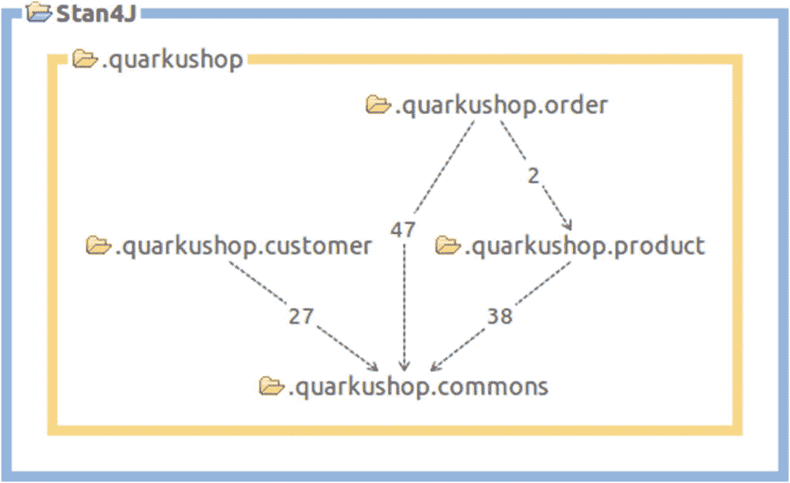
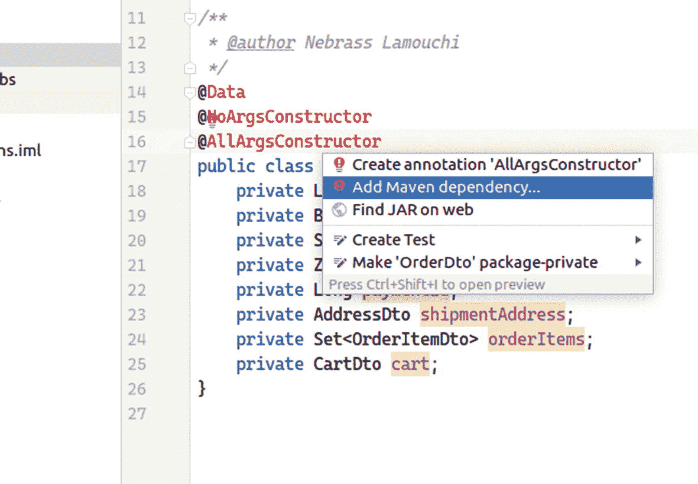
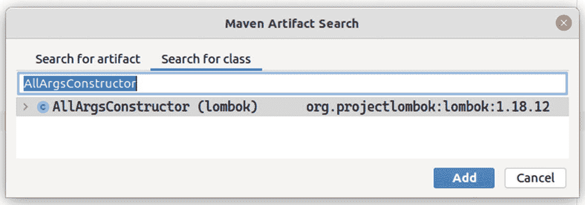
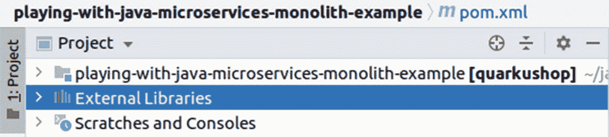
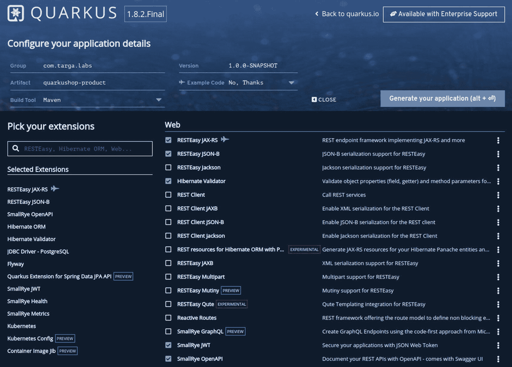
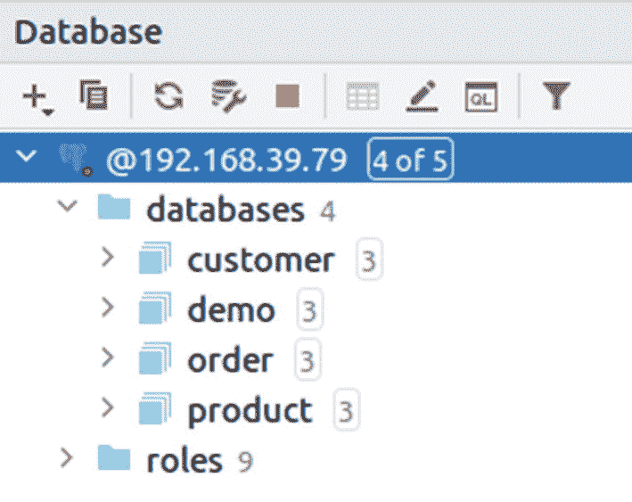
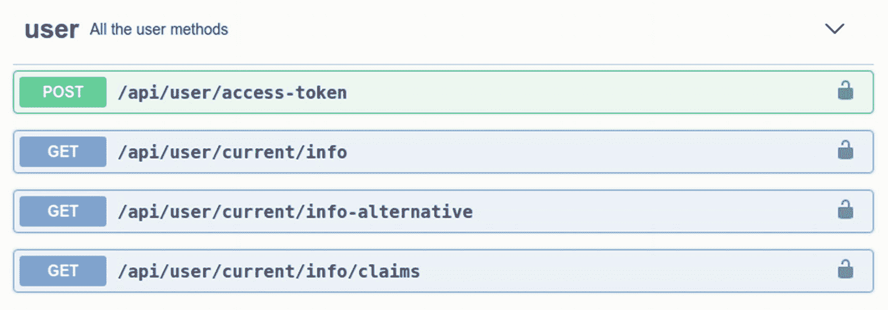
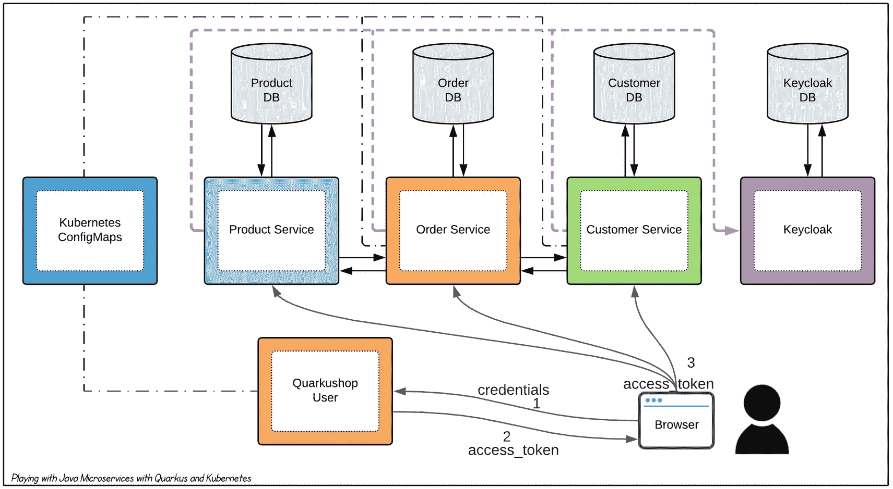

# 13.构建 Kubernetized 微服务

## 介绍

第 8 章讨论了如何将数据驱动设计(DDD)应用到单片应用中。我们打破了在分析项目时揭示的边界上下文之间的关系。在 Stan4J 中，最终的代码结构如下所示:



在本章中，您将实现三个微服务— `Product`、`Order`和`Customer`。这些包依赖于`commons`包，因此，您需要在实现三个微服务之前实现它。

## 创建公共图书馆

`commons` JAR 库将包装`commons`包的内容。

我们将生成一个简单的 Maven 项目，其中我们将复制`commons`包的内容。

```java
mvn archetype:generate -DgroupId=com.targa.labs.commons -DartifactId=quarkushop-commons \
    -DarchetypeArtifactId=maven-archetype-quickstart \
    -DarchetypeVersion=1.4 -DinteractiveMode=false

```

该命令生成一个包含以下内容的简单项目:

```java
project
|-- pom.xml
`-- src
    |-- main/java
    |       `-- com.targa.labs.commons
    |           `-- App.java
    `-- test/java
            `-- com.targa.labs.commons
                `-- AppTest.java

```

我们将删除`App.java`和`AppTest.java`，因为我们不再需要它们。

然后，我们将`commons`包的内容从单片应用复制/粘贴到我们的`quarkushop-commons`项目中。

不要害怕！当您粘贴复制的类时，您会看到许多错误和警告，但是下一步是添加缺少的依赖项以使 IDE 满意。

让我们打开`pom.xml`文件并开始进行更改:

1.  首先将`maven.compiler.source`和`maven.compiler.target`从`1.7`改为`11`。

2.  如下定义依赖关系:

    ```java
    <dependencies>
        <dependency>
            <groupId>org.slf4j</groupId>
            <artifactId>slf4j-api</artifactId>
            <version>1.7.30</version>
        </dependency>
        <dependency>
            <groupId>javax.validation</groupId>
            <artifactId>validation-api</artifactId>
            <version>2.0.1.Final</version>
        </dependency>
        <dependency>
            <groupId>org.eclipse.microprofile.openapi</groupId>
            <artifactId>microprofile-openapi-api</artifactId>
            <version>1.1.2</version>
        </dependency>
        <dependency>
            <groupId>org.jboss.spec.javax.ws.rs</groupId>
            <artifactId>jboss-jaxrs-api_2.1_spec</artifactId>
            <version>2.0.1.Final</version>
        </dependency>
        <dependency>
            <groupId>jakarta.persistence</groupId>
            <artifactId>jakarta.persistence-api</artifactId>
            <version>2.2.3</version>
        </dependency>
        <dependency>
            <groupId>jakarta.enterprise</groupId>
            <artifactId>jakarta.enterprise.cdi-api</artifactId>
            <version>2.0.2</version>
        </dependency>
        <dependency>
            <groupId>org.eclipse.microprofile.health</groupId>
            <artifactId>microprofile-health-api</artifactId>
            <version>2.2</version>
        </dependency>

        <dependency>
            <groupId>org.eclipse.microprofile.config</groupId>
            <artifactId>microprofile-config-api</artifactId>
            <version>1.4</version>
        </dependency>
        <dependency>
            <groupId>org.eclipse.microprofile.metrics</groupId>
            <artifactId>microprofile-metrics-api</artifactId>
            <version>2.3</version>
        </dependency>
        <dependency>
            <groupId>com.fasterxml.jackson.core</groupId>
            <artifactId>jackson-databind</artifactId>
            <version>2.11.2</version>
        </dependency>
        <dependency>
            <groupId>io.quarkus.security</groupId>
            <artifactId>quarkus-security</artifactId>
            <version>1.1.2.Final</version>
        </dependency>
        <dependency>
            <groupId>org.projectlombok</groupId>
            <artifactId>lombok</artifactId>
            <version>1.18.16</version>
        </dependency>
        <dependency>
            <groupId>org.testcontainers</groupId>
            <artifactId>postgresql</artifactId>
            <version>1.15.3</version>
        </dependency>
        <dependency>
            <groupId>io.quarkus</groupId>
            <artifactId>quarkus-test-common</artifactId>
            <version>1.13.3.Final</version>
        </dependency>
    </dependencies>

    ```

哇哦！这些依赖来自哪里？我敢肯定你和我一样，不喜欢写自己不懂的东西。不过不用担心，这些依赖项都是来自 Quarkus 框架。我使用 IDE 添加了缺少的依赖项:



将出现 Maven 工件搜索窗口，如下所示:



那么，您应该选择给定依赖项的哪个版本呢？您可以使用 IntelliJ 来确定在单片应用中使用哪些外部库:



展开该部分并滚动以找到所需的库。版本将显示在`groupId`和`artifactId`之后，如下所示:


在这里，您可以看到单片应用正在使用`Lombok v1.18.12`，因此在`Commons`项目中，您需要选择相同的版本。

为了避免冲突，请确保`quarkus-test-common`依赖项与微服务具有相同的 Quarkus 版本。

最后，您需要使用`mvn clean install`构建 Maven 项目。这个命令将构建 JAR，并使它在本地`.m2`目录中可用。这使您能够在以后的步骤中将它用作依赖项。

等等！你还没说完呢！你需要考虑一下测试！您需要将`utils`包从测试类复制到`quarkushop-commons`项目的主类中。

为了能够在`quarkushop-commons`库之外重用这些类，您需要将它们放在主目录中，就像任何其他普通类一样。属于测试目录的类只是用于测试目的，它们不打算被重用。

## 实施产品微服务

在这一部分，您开始做严肃的工作:创建`Product`微服务。让我们从[代码中生成一个名为`quarkushop-product`的新 Quarkus 应用。夸库斯。io](https://code.quarkus.io/) :



以下是选定的扩展:

*   RESTEasy JAX-RS

*   塞西·JSON-b

*   SmallRye OpenAPI

*   冬眠的奥姆

*   Hibernate 验证程序

*   JDBC 驱动程序- PostgreSQL

*   候鸟迁徙所经的路径

*   spring 数据 jpa api 的 quartus 扩展

*   小 jj 小 jj 小 jj 小 jj 小 jj 小 jj 小 jj 小 jj 小 jj 小 jj 小 jj 小 jj 小 jj 小 jj 小 jj 小 jj 小 jj 小 jj 小 jj 小 jj 小 jj 小 jj 小 jj 小 jj 小 jj 小 jj 小 jj 小 jj 小 jj

*   SmallRye 健康

*   忽必烈忽必烈忽必烈忽必烈忽必烈忽必烈忽必烈忽必烈忽必烈忽必烈

*   库比涅斯配置

*   集装箱图像悬臂

通过单击 Generate Your Application 下载生成的应用 skull。

然后将代码导入您的 IDE。打开`pom.xml`文件，向其中添加 Lombok 和 TestContainers 依赖项:

```java
<dependencies>
    <dependency>
        <groupId>org.projectlombok</groupId>
        <artifactId>lombok</artifactId>
        <version>1.18.16</version>
    </dependency>

    <dependency>
        <groupId>org.testcontainers</groupId>
        <artifactId>junit-jupiter</artifactId>
        <version>1.15.3</version>
        <scope>test</scope>
    </dependency>
    <dependency>
        <groupId>org.testcontainers</groupId>
        <artifactId>postgresql</artifactId>
        <version>1.15.3</version>
        <scope>test</scope>
    </dependency>

    <dependency>
        <groupId>org.assertj</groupId>
        <artifactId>assertj-core</artifactId>
        <scope>test</scope>
    </dependency>
</dependencies>

```

接下来，添加最重要的依赖项——`quarkushop-commons`:

```java
<dependency>
    <groupId>com.targa.labs</groupId>
    <artifactId>quarkushop-commons</artifactId>
    <version>1.0-SNAPSHOT</version>
</dependency>

```

将代码从`product`包复制到`quarkushop-product`微服务。

不要忘记将 banner.txt 文件从单片应用复制到`Product`微服务的`src/main/resources`目录中。

下一步是填充`application.properties`:

```java
 1 # Datasource config properties
 2 quarkus.datasource.db-kind=postgresql
 3 quarkus.datasource.username=developer
 4 quarkus.datasource.password=p4SSW0rd
 5 quarkus.datasource.jdbc.url=jdbc:postgresql://localhost:5432/product
 6 # Flyway minimal config properties
 7 quarkus.flyway.migrate-at-start=true
 8 # HTTP config properties
 9 quarkus.http.root-path=/api
10 quarkus.http.access-log.enabled=true
11 %prod.quarkus.http.access-log.enabled=false
12 # Swagger UI
13 quarkus.swagger-ui.always-include=true
14 # Datasource config properties
15 %test.quarkus.datasource.db-kind=postgresql
16 # Flyway minimal config properties
17 %test.quarkus.flyway.migrate-at-start=true
18 # Define the custom banner
19 quarkus.banner.path=banner.txt
20 ### Security
21 quarkus.http.cors=true
22 quarkus.smallrye-jwt.enabled=true
23 # Keycloak Configuration
24 keycloak.credentials.client-id=quarkushop
25 # MP-JWT Config
26 mp.jwt.verify.publickey.location=http://localhost:9080/auth/realms/quarkushop-realm/protocol/openid-connect/certs
27 mp.jwt.verify.issuer=http://localhost:9080/auth/realms/quarkushop-realm
28 ### Health Check
29 quarkus.smallrye-health.ui.always-include=true
30 # Kubernetes ConfigMaps
31 quarkus.kubernetes-config.enabled=true
32 quarkus.kubernetes-config.config-maps=quarkushop-product-config

```

这些属性与单片应用几乎相同，这是合乎逻辑的，因为微服务是从单片应用上切下的一片。

我更改了数据库的名称(第 5 行)和`ConfigMap`(第 34 行)。

回想一下，我们更改了`ConfigMap`，所以现在我们需要创建它。见清单 [13-1](#PC7) 。

```java
1 apiVersion: v1
2 kind: ConfigMap
3 metadata:
4   name: quarkushop-product-config
5 data:
6   application.properties: |-
7     quarkus.datasource.jdbc.url=jdbc:postgresql://postgres:5432/product
8     mp.jwt.verify.publickey.location=http://keycloak-http.keycloak/auth/realms/quarkushop-realm/protocol/openid-connect/certs
9     mp.jwt.verify.issuer=http://keycloak-http.keycloak/auth/realms/quarkushop-realm

Listing 13-1quarkushop-product-config.yml

```

我还在这个`ConfigMap`中更改了数据库的名称(第 7 行)。

我更改了数据库名称，因为正如您在第 [9](09.html) 章中了解到的，每个微服务拥有一个数据库是明智的。这就是我为每个微服务创建专用模式的原因:



因为我们在数据库上下文中，我们需要将 Flyway 脚本`V1.0__Init_app.sql`和`V1.1__Insert_samples.sql`从单片应用复制到`Product`微服务的`src/main/resources/db/migration`目录中。我们还需要清理 SQL 脚本，只保留产品绑定的上下文相关对象和样本数据。

确保正确清理脚本，否则部署将在应用引导过程中失败。

接下来，有一个非常重要的任务要做:将`quarkushop-commons`项目标识到`quarkushop-product`的 Quarkus 索引。

What is the Quarkus Index?

Quarkus 自动索引当前模块。但是，当您拥有包含 CDI beans、实体和序列化为 JSON 的对象的外部模块时，您需要显式地对它们进行索引。

可以通过多种方式建立索引:

*   使用 Jandex Maven 插件

*   添加一个空的`META-INF/beans.xml`文件

*   使用 Quarkus 索引依赖属性，这是我最喜欢的选择

可以使用`application.properties`值完成该索引:

```java
quarkus.index-dependency.commons.group-id=com.targa.labs
quarkus.index-dependency.commons.artifact-id=quarkushop-commons

```

没有这个`index-dependency`配置，您就无法构建应用的本机二进制文件。

在构建项目之前，我们需要将相关测试从 monolith 复制到`quarkushop-product`微服务:

*   `CategoryResourceIT`

*   `CategoryResourceTest`

*   `ProductResourceIT`

*   `ProductResourceTest`

*   `ReviewResourceIT`

*   `ReviewResourceTest`

我们还需要将 Keycloak Docker 文件从`src/main/docker`复制到`quarkushop-product`微服务:

*   `keycloak-test.yml`文件

*   `realms`目录

为了能够执行测试，我们需要在`test`环境/概要文件中禁用 Kubernetes 支持:

```java
%test.quarkus.kubernetes-config.enabled=false
quarkus.test.native-image-profile=test

```

我们将原生映像测试配置文件定义为`test`，以便禁用 Kubernetes 对原生映像测试的支持。

接下来，我们需要执行测试，构建并推送`quarkushop-product`映像:

```java
mvn clean install -Pnative \
    -Dquarkus.native.container-build=true \
    -Dquarkus.container-image.build=true

```

然后，我们将`quarkushop-product`图像推送到容器注册表，如下所示:

```java
docker push nebrass/quarkushop-product:1.0.0-SNAPSHOT

```

我们现在创建`quarkushop-product-config ConfigMap`:

```java
kubectl apply -f quarkushop-product/quarkushop-product-config.yml

```

并将`Product`微服务部署到 Kubernetes 集群:

```java
kubectl apply -f quarkushop-product/target/kubernetes/kubernetes.json

```

太棒了！现在我们可以列出 pod 了:

```java
$ kubectl get pods

NAME                                  READY   STATUS
postgres-69c47c748-pnbbf              1/1     Running
quarkushop-product-7748f9f74c-dqnqk   1/1     Running

```

我们可以在`quarkushop-product`上使用`port-forward`来测试应用:

```java
$ kubectl port-forward quarkushop-product-7748f9f74c-dqnqk 8080:8080

Forwarding from 127.0.0.1:8080 -> 8080
Forwarding from [::1]:8080 -> 8080
Handling connection for 8080
Handling connection for 8080

```

然后一个`curl`命令可以计算存储在数据库中的产品数量:

```java
$ curl -X GET "http://localhost:8080/api/products/count"

4

```

很好！对数据库的访问工作正常。我们还可以通过使用`curl -X GET "http://localhost:8080/api/health"`命令来运行健康检查，以确保正确到达键盘锁:

```java
{
    "status": "UP",
    "checks": [
        {
            "name": "Keycloak connection health check",
            "status": "UP"
        },
        {
            "name": "Database connections health check",
            "status": "UP"
        }
    ]
}

```

太棒了！一切都在按预期工作！ 我们现在可以转移到`Order`微服务。

## 实施订单微服务

在本节中，我们将生成与`Product`微服务具有相同扩展的`Order`微服务，并增加一个扩展:REST 客户端扩展。

我们知道`Order`微服务对`Product`微服务有通信依赖。这种通信可以作为从`Order`微服务到`Product`微服务的 REST API 调用来实现。这就是为什么我们在选择的依赖项中包含 REST 客户端扩展。

生成项目后，我们将运行与使用`Product`微服务时相同的任务:

*   将代码从单片应用中的`order`包复制到新的`Order`微服务中

*   添加 Lombok、AssertJ 和 TestContainers 依赖项

*   添加`quarkushop-commons`依赖项

*   从 monolith 复制`banner.txt`文件

*   添加`application.properties`并更改数据库和`ConfigMap`名称

*   创建`quarkushop-product-config ConfigMap`文件

*   复制 Flyway 脚本并清理不相关的对象和数据

*   在`application.properties`中添加`quarkushop-commons`的 Quarkus 索引依赖关系

此时，我们需要修复代码，因为我们在`OrderItemService`类中仍然有一个`ProductRepository`引用。

`OrderItemService`使用`ProductRepository`查找使用给定 ID 的产品。这个编程调用将被对`Product`微服务的 REST API 调用所取代。为此，我们需要创建一个`ProductRestClient`类，它将使用给定的 ID 获取产品数据:

*   ①`ProductRestClient`将指向`/products` URI。

*   ②`@RegisterRestClient`允许 Quarkus 知道这个接口可以作为 REST 客户端用于 CDI 注入。

*   ③`findById()`方法将在`/products` URI 上进行 HTTP GET。

```java
@Path("/products")                              ①
@RegisterRestClient                             ②
public interface ProductRestClient {

    @GET
    @Path("/{id}")
    ProductDto findById(@PathParam Long id);    ③
}

```

但是`Product`微服务 API 的基 URL 是什么？为了正常工作，需要对`ProductRestClient`进行配置。可以使用这些属性完成配置:

*   ①`ProductRestClient`的基本 URL 配置。

*   ②将`ProductRestClient` bean 的范围定义为`Singleton`。

```java
1 product-service.url=http://quarkushop-product:8080/api
2 com.targa.labs.quarkushop.order.client.ProductRestClient/mp-rest/url=${product-service.url}     ①
3 com.targa.labs.quarkushop.order.client.ProductRestClient/mp-rest/scope=javax.inject.Singleton   ②

```

我们将重构`OrderItemService`类来改变:

```java
@Inject
ProductRepository productRepository;

```

敬新的:

```java
@RestClient
ProductRestClient productRestClient;

```

 `@RestClient`用于注入一个 REST 客户端。

然后，我们将`productRepository.getOne()`调用更改为`productRestClient.findById()`。JPA 存储库获取已经被 REST API 调用所取代。

因为我们对`Product`微服务有一个外部依赖，所以我们需要创建一个健康检查来验证`Product`微服务是否可达，就像我们对 PostgreSQL 和 Keycloak 所做的一样。`ProductServiceHealthCheck`看起来是这样的:

```java
@Slf4j
@Liveness
@ApplicationScoped
public class ProductServiceHealthCheck implements HealthCheck {

    @ConfigProperty(name = "product-service.url", defaultValue = "false")
    Provider<String> productServiceUrl;

    @Override
    public HealthCheckResponse call() {

        HealthCheckResponseBuilder responseBuilder =
                HealthCheckResponse.named("Product Service connection health check");

        try {

            productServiceConnectionVerification();
            responseBuilder.up();

        } catch (IllegalStateException e) {
            responseBuilder.down().withData("error", e.getMessage());
        }

        return responseBuilder.build();
    }

    private void productServiceConnectionVerification() {
        HttpClient httpClient = HttpClient.newBuilder()
                .connectTimeout(Duration.ofMillis(3000))
                .build();

        HttpRequest request = HttpRequest.newBuilder()
                .GET()
                .uri(URI.create(productServiceUrl.get() + "/health"))
                .build();

        HttpResponse<String> response = null;

        try {
            response = httpClient.send(request, HttpResponse.BodyHandlers.ofString());
        } catch (IOException e) {
            log.error("IOException", e);
        } catch (InterruptedException e) {
            log.error("InterruptedException", e);
            Thread.currentThread().interrupt();
        }

        if (response == null || response.statusCode() != 200) {
            throw new IllegalStateException("Cannot contact Product Service");
        }
    }
}

```

我们需要将这些相关测试从 monolith 复制到`quarkushop-order`微服务:

*   `AddressServiceUnitTest`

*   `CartResourceIT`

*   `CartResourceTest`

*   `OrderItemResourceIT`

*   `OrderItemResourceTest`

*   `OrderResourceIT`

*   `OrderResourceTest`

我们还需要将 Keycloak Docker 文件从`src/main/docker`复制到`quarkushop-order`微服务:

*   `keycloak-test.yml`文件

*   `realms`目录

然后我们添加执行测试所需的属性:

```java
%test.quarkus.kubernetes-config.enabled=false
quarkus.test.native-image-profile=test

```

`quarkushop-product`不依赖任何其他微服务，所以我们为`quarkushop-order`所做的修改对`quarkushop-product`来说已经足够了。然而，`quarkushop-product`微服务上的`quarkushop-order`回复意味着测试也依赖于`quarkushop-product`微服务。

我们有许多解决方案，以下是我的两个选择:

*   嘲笑`RestClient`

*   添加一个`quarkushop-product`的测试实例

我将为`quarkushop-order`使用第二种选择，并为`quarkushop-customer`模拟`RestClient`，因为它在另一个微服务上回复。

回想一下，我们使用 TestContainers 框架为集成测试提供了一个 Keycloak 实例。该供应是使用一个`docker-compose`文件进行的，其中创建了一个`keycloak`服务。我们可以使用相同的方法来提供一个`quarkushop-product`实例，使用相同的`docker-compose`文件。但是我们必须首先创建一个新的`QuarkusTestResourceLifecycleManager`类，而不是使用`KeycloakRealmResource`，因为它只提供 Keycloak。

让我们将`src/main/docker/keycloak-test.yml`文件重命名为`src/main/docker/context-test.yml`。然后我们可以添加两个服务:`quarkushop-product`和`postgresql-db`。

我们为什么要增加`postgresql-db`服务？答案很简单；这是`quarkushop-product`所需要的(我们的微服务需要数据库存储和一个 Keycloak 租户来工作)。

`src/main/docker/` `context-test.yml`的内容如下:

```java
version: '3'
services:
  keycloak:
    image: jboss/keycloak:latest
    command:
      [
        '-b','0.0.0.0',
        '-Dkeycloak.migration.action=import',
        '-Dkeycloak.migration.provider=dir',
        '-Dkeycloak.migration.dir=/opt/jboss/keycloak/realms',
        '-Dkeycloak.migration.strategy=OVERWRITE_EXISTING',
        '-Djboss.socket.binding.port-offset=1000',
        '-Dkeycloak.profile.feature.upload_scripts=enabled',
      ]
    volumes:
      - ./realms-test:/opt/jboss/keycloak/realms
    environment:
      - KEYCLOAK_USER=admin
      - KEYCLOAK_PASSWORD=admin
      - DB_VENDOR=h2
    ports:
      - 9080:9080
      - 9443:9443
      - 10990:10990
  quarkushop-product:
    image: nebrass/quarkushop-product:1.0.0-SNAPSHOT
    environment:
      - QUARKUS_PROFILE=test
      - QUARKUS_DATASOURCE_JDBC_URL=jdbc:postgresql://postgresql-db:5432/product
      - MP_JWT_VERIFY_PUBLICKEY_LOCATION=http://keycloak:9080/auth/realms/quarkushop-realm/protocol/openid-connect/certs
      - MP_JWT_VERIFY_ISSUER=http://keycloak:9080/auth/realms/quarkushop-realm
    depends_on:
      - postgresql-db
      - keycloak
    ports:
      - 8080:8080
  postgresql-db:
    image: postgres:13
    volumes:
      - /opt/postgres-volume:/var/lib/postgresql/data
    environment:
      - POSTGRES_USER=developer
      - POSTGRES_PASSWORD=p4SSW0rd
      - POSTGRES_DB=product
      - POSTGRES_HOST_AUTH_METHOD=trust
    ports:
      - 5432:5432

```

注意，通过`quarkushop-product`的环境变量使用了可用的 Keycloak 实例。

太棒了！现在，`TestContainers`将提供 Keycloak/PostgreSQL/ `quarkushop-product`实例，这是`quarkushop-order`在这些集成测试中所需要的。 

接下来，我们需要创建一个新的`QuarkusTestResourceLifecycleManager`类，名为`ContextTestResource`。这个类将提供 Keycloak 和`quarkushop-product`,并将它们的属性传递给应用。见清单 [13-2](#PC25) 。

*   ①定义提供的服务。

*   ②定义 Keycloak 和`quarkushop-product`需要的属性。

```java
public class ContextTestResource implements QuarkusTestResourceLifecycleManager {

    @ClassRule
    public static DockerComposeContainer ECOSYSTEM = new DockerComposeContainer(
            new File("src/main/docker/context-test.yml"))
            .withExposedService("quarkushop-product_1", 8080,   ①
                    Wait.forListeningPort().withStartupTimeout(Duration.ofSeconds(30)))
            .withExposedService("keycloak_1", 9080,             ①
                    Wait.forListeningPort().withStartupTimeout(Duration.ofSeconds(30)));

    @Override
    public Map<String, String> start() {
        ECOSYSTEM.start();

        String jwtIssuerUrl = String.format("http://%s:%s/auth/realms/quarkus-realm",
                ECOSYSTEM.getServiceHost("keycloak_1", 9080),
                ECOSYSTEM.getServicePort("keycloak_1", 9080)
        );

        TokenService tokenService = new TokenService();
        Map<String, String> config = new HashMap<>();

        try {

            String adminAccessToken = tokenService.getAccessToken(jwtIssuerUrl,
                    "admin", "test", "quarkus-client", "mysecret");
            String testAccessToken = tokenService.getAccessToken(jwtIssuerUrl, "test", "test", "quarkus-client", "mysecret");

            config.put("quarkus-admin-access-token", adminAccessToken);
            config.put("quarkus-test-access-token", testAccessToken);

        } catch (IOException | InterruptedException e) {
            e.printStackTrace();
        }

        config.put("mp.jwt.verify.publickey.location", jwtIssuerUrl
                                  + "/protocol/openid-connect/certs");    ②

        config.put("mp.jwt.verify.issuer", jwtIssuerUrl);                  ②

        String productServiceUrl = String.format("http://%s:%s/api",
                ECOSYSTEM.getServiceHost("quarkushop-product_1", 8080),
                ECOSYSTEM.getServicePort("quarkushop-product_1", 8080)
        );
        config.put("product-service.url", productServiceUrl);              ②

        return config;
    }

    @Override
    public void stop() {
        ECOSYSTEM.stop();
    }

}

Listing 13-2src/test/java/com/targa/labs/quarkushop/order/util/ContextTestResource.java

```

然后我们重构测试以包含`ContextTestResource`:

```java
@DisabledOnNativeImage
@QuarkusTest
@QuarkusTestResource(TestContainerResource.class)
@QuarkusTestResource(ContextTestResource.class)
class CartResourceTest {
...
}

```

当运行重构步骤时，我删除了客户创建。我用的是随机生成的客户 ID。

让我们仔细看看微服务的创建过程:

*   构建`quarkushop-order`映像并将其推送到容器注册表中:

*   创建`quarkushop-order-config ConfigMap`文件:

```java
$ mvn clean install -Pnative \
    -Dquarkus.native.container-build=true \
    -Dquarkus.container-image.build=true

$ docker push nebrass/quarkushop-order:1.0.0-SNAPSHOT

```

*   在 Kubernetes 中创建`quarkushop-order-config ConfigMap`:

```java
1 apiVersion: v1
2 kind: ConfigMap
3 metadata:
4   name: quarkushop-order-config
5 data:
6   application.properties: |-
7     quarkus.datasource.jdbc.url=jdbc:postgresql://postgres:5432/order
8     mp.jwt.verify.publickey.location=http://keycloak-http.keycloak/auth/realms/quarkushop-realm/protocol/openid-connect/certs
9     mp.jwt.verify.issuer=http://keycloak-http.keycloak/auth/realms/quarkushop-realm

```

*   将`quarkushop-order`应用部署到 Kubernetes:

```java
kubectl apply -f quarkushop-order/quarkushop-order-config.yml

```

*   使用健康检查、一个`port-forward`和一个简单的`curl` GET 命令对`/health` API 检查`quarkushop-order` pod:

```java
kubectl apply -f quarkushop-order/target/kubernetes/kubernetes.json

```

```java
{
    "status": "UP",
    "checks": [
        {
            "name": "Keycloak connection health check",
            "status": "UP"
        },
        {
            "name": "Product Service connection health check",
            "status": "UP"
        },
        {
            "name": "Database connections health check",
            "status": "UP"
        }
    ]
}

```

很好！`Order`微服务工作正常。接下来，我们对`Customer`微服务做同样的事情。

## 实施客户微服务

为了实现`Customer`微服务，我们将应用与`Order`微服务相同的步骤。同样，我们将:

*   将代码从单片应用中的`customer`包复制到新的`Customer`微服务中

*   添加 Lombok、AssertJ 和 TestContainers 依赖项

*   添加`quarkushop-commons`依赖项

*   从 monolith 复制`banner.txt`文件

*   添加`application.properties`并更改数据库和`ConfigMap`名称

*   复制 Flyway 脚本并清理不相关的对象和数据

*   在`application.properties`中添加`quarkushop-commons`的 Quarkus 索引依赖关系

然后，我们需要将这些相关测试从 monolith 复制到`quarkushop-customer`微服务:

*   `CustomerResourceIT`

*   `CustomerResourceTest`

*   `PaymentResourceIT`

*   `PaymentResourceTest`

我们还需要将 Keycloak Docker 文件从`src/main/docker`复制到`quarkushop-order`微服务:

*   `keycloak-test.yml`文件

*   `realms`目录

然后我们添加执行测试所需的属性:

```java
%test.quarkus.kubernetes-config.enabled=false
quarkus.test.native-image-profile=test

```

接下来，我们嘲弄一下`OrderRestClient`。我们创建一个名为`MockOrderRestClient`的新类，如清单 [13-3](#PC33) 所示。

*   ①用于模拟测试中注入的 beans 的注释。

*   ②`Mock`类实现了`RestClient`接口。

*   ③实现了`Mock`方法，以返回适合测试的结果。

```java
@Mock                                                           ①
@ApplicationScoped
@RestClient
public class MockOrderRestClient implements OrderRestClient {   ②

    @Override
    public Optional<OrderDto> findById(Long id) {               ③
        OrderDto order = new OrderDto();
        order.setId(id);
        order.setTotalPrice(BigDecimal.valueOf(1000));
        return Optional.of(order);
    }

    @Override
    public Optional<OrderDto> findByPaymentId(Long id) {
        OrderDto order = new OrderDto();
        order.setId(5L);
        return Optional.of(order);
    }

    @Override
    public OrderDto save(OrderDto order) {
        return order;
    }
}

Listing 13-3src/test/java/com/targa/labs/quarkushop/customer/utils/MockOrderRestClient.java

```

仅此而已！模仿是非常容易的，被模仿的组件会被自动注入到测试中。微服务创建流程如下:

*   构建`quarkushop-customer`映像并将其推送到容器注册表中

*   创建`quarkushop-customer-config ConfigMap`文件

*   在 Kubernetes 中创建`quarkushop-customer-config ConfigMap`

*   使用健康检查、`port-forward`和简单的`curl` GET 命令对`/health` API 检查`quarkushop-customer` pod

你会在本书的 GitHub 资源库中找到所有的代码和资源。

## 实施用户微服务

什么，额外的微服务？我知道我在这一章的开始没有提到这一点。

别担心，这不是一个巨大的微服务。它用于身份验证，并将保存 Quarkushop Swagger UI monolith 中列出的`user`部分 REST APIs:



让我们用这些扩展生成一个新的 Quarkus 应用:

*   RESTEasy JAX-RS

*   塞西·JSON-b

*   SmallRye OpenAPI

*   小 jj 小 jj 小 jj 小 jj 小 jj 小 jj 小 jj 小 jj 小 jj 小 jj 小 jj 小 jj 小 jj 小 jj 小 jj 小 jj 小 jj 小 jj 小 jj 小 jj 小 jj 小 jj 小 jj 小 jj 小 jj 小 jj 小 jj 小 jj 小 jj

*   SmallRye 健康

*   忽必烈忽必烈忽必烈忽必烈忽必烈忽必烈忽必烈忽必烈忽必烈忽必烈

*   库比涅斯配置

*   集装箱图像悬臂

没有与持久性相关的扩展，因为在这个微服务中你不会与数据库交互。

实施`User`微服务的步骤如下:

*   复制用户相关内容。这个微服务非常少，所以只会装`UserResource`级。

*   添加 Lombok 依赖项。

*   添加`quarkushop-commons`依赖项。

*   从 monolith 复制`banner.txt`文件。

*   添加`application.properties`，更改`ConfigMap`名称，并删除所有数据持久性属性(Flyway、JPA 等。).

*   在`application.properties`中添加`quarkushop-commons`的 Quarkus 索引依赖关系。

*   构建`quarkushop-user`映像并将其推送到容器注册中心。

*   创建`quarkushop-user-config ConfigMap`文件。

*   在 Kubernetes 中创建`quarkushop-user-config ConfigMap`。

*   使用健康检查、`port-forward`和简单的`curl` GET 命令对`/health` API 检查`quarkushop-user` pod。

你会在本书的 GitHub 资源库中找到所有的代码和资源。

在部署了`quarkushop-user`微服务之后，您可以使用它来获得一个`access_token`,并与其他三个微服务的安全 API 进行通信:



很好！微服务已正确部署并正常工作！

## 结论

在本章中，您学习了如何创建微服务并将它们部署到 Kubernetes。在这个繁重的任务中，您实现了在第 [9](09.html) 章中介绍的模式。但是您没有实现最需要的模式。这是你在下一章要做的。