# 14.与夸尔库斯和库伯内特一起飞遍天空

## 介绍

从第 [9](09.html) 章开始，您学习了云原生模式，甚至实现了其中的一些模式:

*   **服务发现和注册**:使用 Kubernetes `Deployment`和`Service`对象完成

*   **外部化配置**:使用 Kubernetes `ConfigMap`和`Secret`对象制作

*   **每个服务的数据库**:在使用 DDD 概念分割整体代码库时创建的

*   **应用度量**:使用 SmallRye Metrics Quarkus 扩展实现

*   **健康检查 API** :使用 SmallRye Health Quarkus 扩展实现

*   服务间的安全性:使用 SmallRye JWT 夸库扩展和 Keycloak 实现

在本章中，您将学习如何实现更流行的模式:

*   断路器

*   日志聚合

*   分布式跟踪

*   应用编程接口网关

## 实现断路器模式

断路器模式对于使用错误通信协议(如 HTTP)的弹性微服务非常有用。该模式的思想是处理微服务之间的任何通信问题。

断路器模式的这种实现只会影响`Order`和`Customer`微服务，其中我们使用 REST 客户端进行外部调用。

在基于 Quarkus 的应用中实现这种模式非常容易。第一步是将这个依赖项添加到`pom.xml`文件中:

```java
<dependency>
    <groupId>io.quarkus</groupId>
    <artifactId>quarkus-smallrye-fault-tolerance</artifactId>
</dependency>

```

现在，我们在 REST 客户端组件上启用断路器特性。假设我们希望 REST 客户机停止调用 API 15 秒钟，如果我们在最近 10 次请求中有 50%的请求失败。这可以使用下面这行代码来完成:

```java
@CircuitBreaker(requestVolumeThreshold = 10, failureRatio = 0.5, delay = 15000)

```

在`Order`微服务中:

```java
@Path("/products")
@RegisterRestClient
public interface ProductRestClient {

    @GET
    @Path("/{id}")
    @CircuitBreaker(requestVolumeThreshold = 10, failureRatio = 0.5, delay = 15000)
    ProductDto findById(@PathParam Long id);
}

```

`@CircuitBreaker`有许多属性:

*   `failOn`:应被视为失败的异常类型列表；默认值为`{Throwable.class}`。由带注释的方法抛出的继承自`Throwable`的所有异常都被认为是失败的。

*   `skipOn`:不应被视为失败的异常类型列表；默认值为`{}`。

*   `delay`:开路转变为半开状态的延迟时间；默认值为`5000`。

*   `delayUnit`:延时的单位。默认值为`ChronoUnit.MILLIS`。

*   `requestVolumeThreshold`:滚动窗口中连续请求的数量。默认值为`20`。

*   `failureRatio`:滚动窗口内使电路跳闸断开的故障比率。默认值为`0.50`。

*   `successThreshold`:半开电路再次闭合前成功执行的次数。默认值为`1`。

断路器模式有三种状态:

*   所有的请求都是正常的

*   `Half-open`:进行验证以检查问题是否仍然出现的过渡状态

*   `Open`:所有请求都被禁用，直到延迟到期

在`Customer`微服务中:

```java
@Path("/orders")
@RegisterRestClient
public interface OrderRestClient {

    @GET
    @Path("/{id}")
    @CircuitBreaker(requestVolumeThreshold = 10, delay = 15000)
    Optional<OrderDto> findById(@PathParam Long id);

    @GET
    @Path("/payment/{id}")
    @CircuitBreaker(requestVolumeThreshold = 10, delay = 15000)
    Optional<OrderDto> findByPaymentId(Long id);

    @POST
    @CircuitBreaker(requestVolumeThreshold = 10, delay = 15000)
    OrderDto save(OrderDto order);
}

```

SmallRye 容错扩展提供了许多其他有用的选项来处理故障，以便成为具有强大弹性的微服务。例如，我们有这些机制:

*   **重试机制**:用于调用失败时重试的次数；

```java
@Path("/products")
@RegisterRestClient
public interface ProductRestClient {

    @GET
    @Path("/{id}")
    @CircuitBreaker(requestVolumeThreshold = 10, delay = 15000)
    @Retry(maxRetries = 4)
    ProductDto findById(@PathParam Long id);
}

```

如果调用失败， `@Retry(maxRetries = 4)`将运行最多四次重试。

*   **超时机制**:用于定义方法执行超时。这很容易实现:

```java
@Path("/products")
@RegisterRestClient
public interface ProductRestClient {

    @GET
    @Path("/{id}")
    @CircuitBreaker(requestVolumeThreshold = 10, delay = 15000)
    @Retry(maxRetries = 4)
    @Timeout(500)
    ProductDto findById(@PathParam Long id);
}

```

如果`findById()`调用超过 500 毫秒，那么 `@Timeout(500)`会让应用抛出一个`TimeoutException`。

*   **回退机制**:用于在主方法失败时调用回退(或备份)方法。这里有一个注释来完成这项工作:

```java
public class SomeClass {

    @Inject
    @RestClient
    ProductRestClient productRestClient;

    @Fallback(fallbackMethod = "fallbackFetchProduct")
    List<ProductDto> findProductsByCategory(String category){
        return productRestClient.findProductsByCategory(category);
    }

    public List<ProductDto> fallbackFetchProduct(String category) {
        return Collections.emptyList();
    }
}

```

如果`productRestClient.findProductsByCategory()`失败，您将从`fallbackFetchProduct()`方法而不是`findProductsByCategory()`获得响应。您可以进一步调整这个强大的机制。例如，您可以将其配置为在定义异常或特定超时后切换到回退方法。

请注意，断路器模式和容错模式在 Quarkus 框架中得到了完美的实现。

## 实现日志聚合模式

对于日志聚合模式，我们使用著名的 ELK(弹性搜索、日志存储和 Kibana)堆栈。这是三个开源项目:

*   Elasticsearch 是一个搜索和分析引擎。

*   Logstash 是一个服务器端数据处理管道，它同时从多个来源获取数据，对其进行转换，然后将其发送到 Elasticsearch 这样的“stash”。

*   Kibana 允许用户在 Elasticsearch 中用图表和图形可视化数据。

总之，这些工具最常用于集中和分析分布式系统中的日志。ELK 堆栈很受欢迎，因为它满足了日志分析领域的需求。

本章中 ELK 堆栈的使用案例如下:

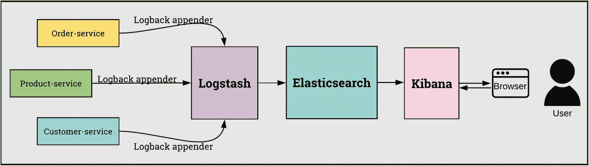

所有的微服务都会将各自的日志推送到 Logstash，Logstash 会使用 Elasticsearch 对它们进行索引。索引日志可以在以后被 Kibana 使用。

Quarkus 有一个很棒的扩展叫做`quarkus-logging-gelf`，它被描述为“使用 Graylog 扩展日志格式的日志，并将您的日志集中在埃尔克或 EFK。”

What is the Graylog Extended log Format?

基于 [`Graylog.org`](https://graylog.org) 网站:“Graylog 扩展日志格式(GELF)是一种独特方便的日志格式，旨在解决传统普通系统日志的所有缺点。这一企业功能允许您从任何地方收集结构化事件，然后在眨眼之间压缩并分块它们。”

很好！Logstash 本身支持 Graylog 扩展日志格式。你只需要在配置过程中激活它。

### 步骤 1:将 ELK 栈部署到 Kubernetes

如何在 Kubernetes 集群中安装 ELK 堆栈？这是个大问题！

这是一个极其简单的任务:正如我们对 Keycloak 所做的那样，我们将使用 Helm 来安装 ELK 堆栈。

首先将官方 ELK Helm 图表库添加到我们的 Helm 客户端:

```java
helm repo add elastic https://helm.elastic.co

```

接下来，我们需要更新引用:

```java
helm repo update

```

如果你像我一样在 Minikube 上，你需要创建一个`elasticsearch-values.yaml`文件，你将使用它来定制`helm install`。见清单 [14-1](#PC10) 。

```java
# Permit co-located instances for solitary minikube virtual machines.
antiAffinity: "soft"

# Shrink default JVM heap.
esJavaOpts: "-Xmx128m -Xms128m"

# Allocate smaller chunks of memory per pod.
resources:
  requests:
    cpu: "100m"
    memory: "512M"
  limits:
    cpu: "1000m"
    memory: "512M"

# Request smaller persistent volumes.
volumeClaimTemplate:
  accessModes: [ "ReadWriteOnce" ]
  storageClassName: "standard"
  resources:
    requests:
      storage: 100M

Listing 14-1elasticsearch-values.yaml

```

该配置文件是在 Minikube 上安装 Elasticsearch 时推荐使用的配置: [`https://github.com/elastic/helm-charts/blob/master/elasticsearch/examples/minikube/values.yaml`](https://github.com/elastic/helm-charts/blob/master/elasticsearch/examples/minikube/values.yaml)

现在我们安装 Elasticsearch:

```java
helm install elasticsearch elastic/elasticsearch -f ./elasticsearch-values.yaml

```

我们可以看到使用该命令创建了什么:

```java
$ kubectl get all -l release=elasticsearch

NAME                         READY   STATUS    RESTARTS
pod/elasticsearch-master-0   1/1     Running   0
pod/elasticsearch-master-1   1/1     Running   0
pod/elasticsearch-master-2   1/1     Running   0

NAME                                    TYPE        CLUSTER-IP    PORT(S)
service/elasticsearch-master            ClusterIP   10.103.91.46  9200/TCP,9300/TCP
service/elasticsearch-master-headless   ClusterIP   None          9200/TCP,9300/TCP

NAME                                    READY
statefulset.apps/elasticsearch-master   3/3

```

这三个主机是为了实现高可用性。我知道我们现在没有问题，但是想想黑色星期五！

pod 处于运行状态，因此我们可以测试 Elasticsearch 9200 端口。我们可以做一个`port-forward`和一个`curl`:

```java
$ kubectl port-forward service/elasticsearch-master 9200
Forwarding from 127.0.0.1:9200 -> 9200
Forwarding from [::1]:9200 -> 9200

$ curl localhost:9200
{
  "name" : "elasticsearch-master-1",
  "cluster_name" : "elasticsearch",
  "cluster_uuid" : "UkYbL4KsSeK4boVr4rOe2w",
  "version" : {
    "number" : "7.9.2",
    ...
    "lucene_version" : "8.6.2",
    "minimum_wire_compatibility_version" : "6.8.0",
    "minimum_index_compatibility_version" : "6.0.0-beta1"
  },
  "tagline" : "You Know, for Search"
}

```

太棒了！我们可以部署基巴纳:

```java
helm install kibana elastic/kibana --set fullnameOverride=quarkushop-kibana

```

我们可以看到使用该命令创建了什么:

```java
$ kubectl get all -l release=kibana

NAME                                     READY   STATUS
pod/quarkushop-kibana-696f869668-5tcvz   1/1     Running

NAME                        TYPE        CLUSTER-IP     EXTERNAL-IP   PORT(S)
service/quarkushop-kibana   ClusterIP   10.107.223.6   <none>        5601/TCP

NAME                                READY   UP-TO-DATE   AVAILABLE
deployment.apps/quarkushop-kibana   1/1     1            1

NAME                                           DESIRED   CURRENT   READY
replicaset.apps/quarkushop-kibana-696f869668   1         1         1

```

我们将在 Kibana 服务上做一个`port-forward`:

```java
kubectl port-forward service/quarkushop-kibana 5601

```

然后打开 Kibana UI，检查一切是否正常工作:

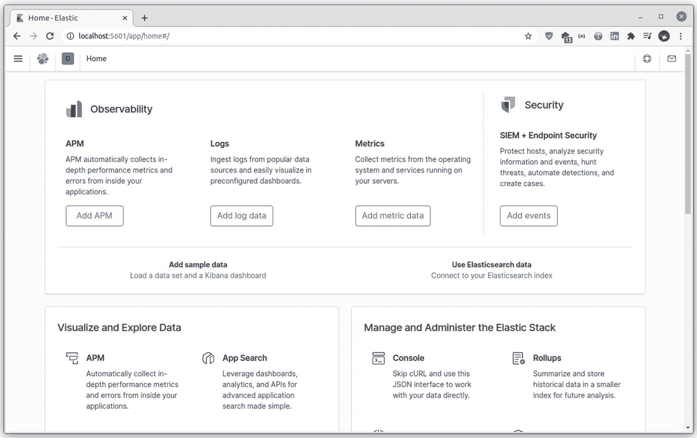

很好！我们需要安装 Logstash，但是我们需要使用 Helm `logstash-values.yaml`文件定制安装；见清单 [14-2](#PC17) 。

```java
logstashConfig:
  logstash.yml: |
    http.host: "0.0.0.0"
    xpack.monitoring.elasticsearch.hosts: [ "http://elasticsearch-master:9200" ]
    xpack.monitoring.enabled: true
  pipelines.yml: |
    - pipeline.id: custom
      path.config: "/usr/share/logstash/pipeline/logstash.conf"
logstashPipeline:
  logstash.conf: |
    input {
      gelf {
        port => 12201
        type => gelf
      }
    }

    output {
      stdout {}
      elasticsearch {
        hosts => ["http://elasticsearch-master:9200"]
        index => "logstash-%{+YYYY-MM-dd}"
      }
    }
service:
  annotations: {}
  type: ClusterIP
  ports:
    - name: filebeat
      port: 5000
      protocol: TCP
      targetPort: 5000
    - name: api
      port: 9600
      protocol: TCP
      targetPort: 9600
    - name: gelf
      port: 12201
      protocol: UDP
      targetPort: 12201

Listing 14-2logstash-values.yaml

```

该`values.yaml`文件用于配置:

*   Logstash 管道。启用`gelf`插件，公开默认的 12201 端口，并定义 Logstash 输出模式和到 Elasticsearch 实例的流

*   Logstash 服务定义和公开的端口

现在，让我们安装 Logstash:

```java
helm install -f ./logstash-values.yaml logstash elastic/logstash \
      --set fullnameOverride=quarkushop-logstash

```

要列出创建的对象，请运行以下命令:

```java
$ k get all -l chart=logstash

NAME                        READY   STATUS    RESTARTS
pod/quarkushop-logstash-0   1/1     Running   0

NAME                                   TYPE        CLUSTER-IP      PORT(S)
service/quarkushop-logstash            ClusterIP   10.107.204.49   5000/TCP,9600/TCP,12201/UDP
service/quarkushop-logstash-headless   ClusterIP   None            5000/TCP,9600/TCP,12201/UDP

NAME                                   READY
statefulset.apps/quarkushop-logstash   1/1

```

太棒了！现在，ELK 堆栈已正确部署。下一步是配置微服务以登录到 ELK 堆栈。

### 步骤 2:配置微服务以登录 ELK 堆栈

我们将在此步骤中进行的修改适用于:

*   `quarkushop-product`

*   `quarkushop-order`

*   `quarkushop-customer`

*   `quarkushop-user`

让我们给`pom.xml`文件添加扩展名:

```java
<dependency>
    <groupId>io.quarkus</groupId>
    <artifactId>quarkus-logging-gelf</artifactId>
</dependency>

```

我们需要为每个微服务`ConfigMap`文件定义 Logstash 服务器属性，如清单 [14-3](#PC21) 所示。

*   ①Logstash 主机是公开 log stash 的 Kubernetes 服务。

*   ②Logstash 端口在 Logstash Kubernetes 服务中定义。

```java
apiVersion: v1
kind: ConfigMap
metadata:
  name: quarkushop-order-config
data:
  application.properties: |-
    quarkus.datasource.jdbc.url=jdbc:postgresql://postgres:5432/order
    mp.jwt.verify.publickey.location=http://keycloak-http.keycloak/auth/realms/quarkushop-realm/protocol/openid-connect/certs
    mp.jwt.verify.issuer=http://keycloak-http.keycloak/auth/realms/quarkushop-realm
    quarkus.log.handler.gelf.enabled=true
    quarkus.log.handler.gelf.host=quarkushop-logstash     ①
    quarkus.log.handler.gelf.port=12201                   ②

Listing 14-3quarkushop-order-config.yml

```

让我们构建、推送容器，并再次部署到我们的 Kubernetes 集群。我们需要再次导入`ConfigMaps`来更新它们。

### 步骤 3:收集日志

一旦部署和配置好一切，我们需要访问 Kibana UI 来解析收集到的日志:

```java
kubectl port-forward service/quarkushop-kibana 5601

```

转到管理➤堆栈管理➤指数管理➤基巴纳➤指数模式:

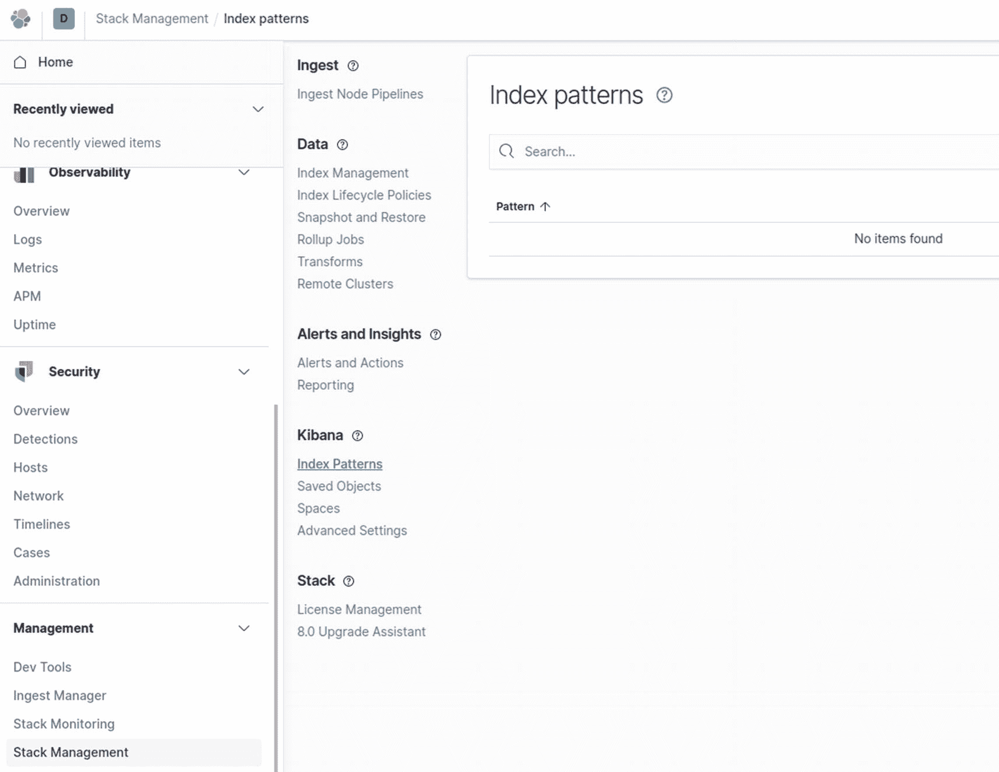

从这里，单击创建索引模式以创建新的索引模式。将出现一个新屏幕:

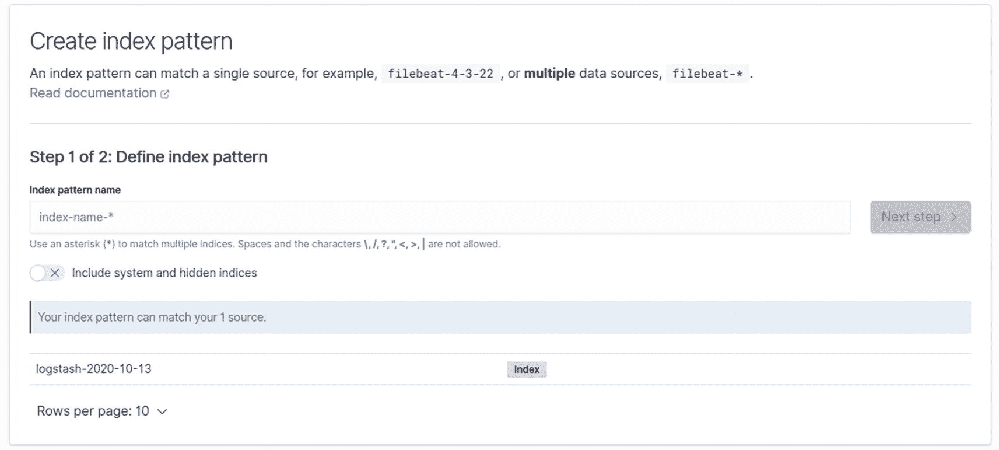

用`logstash-*`填充索引模式名称字段，并点击下一步:

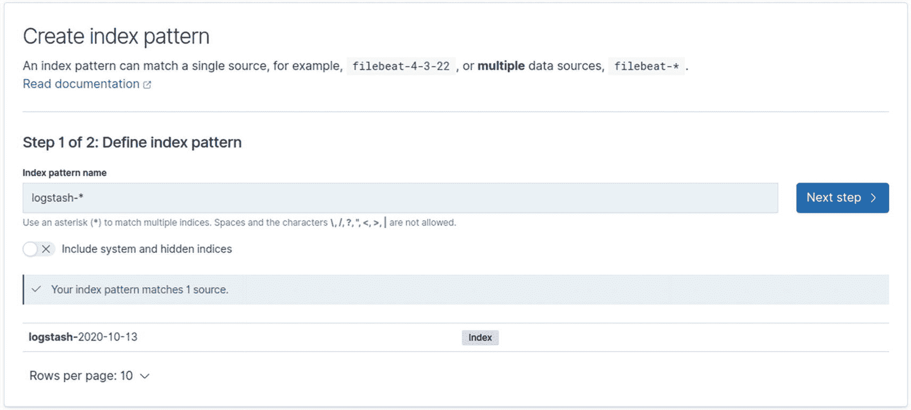

在下一个屏幕上，为时间字段选择`@timestamp`,并点击创建索引模式:

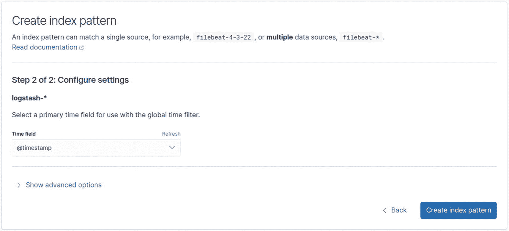

将创建一个新的索引模式，并出现一个确认屏幕:

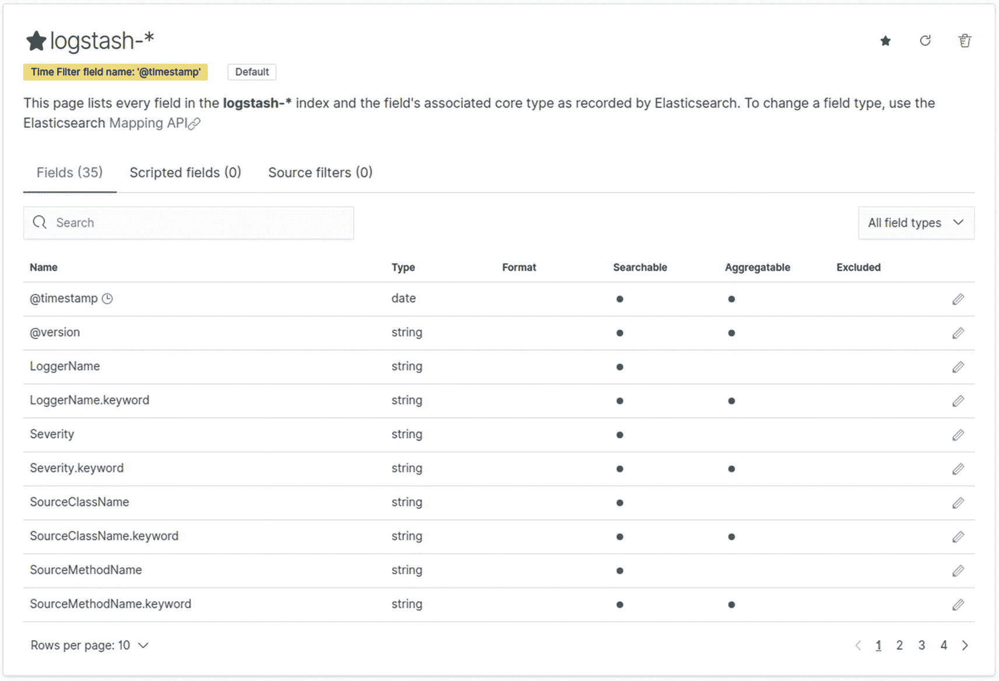

现在，如果您单击 Kibana 部分中的 Discover 菜单，您将看到日志列表:

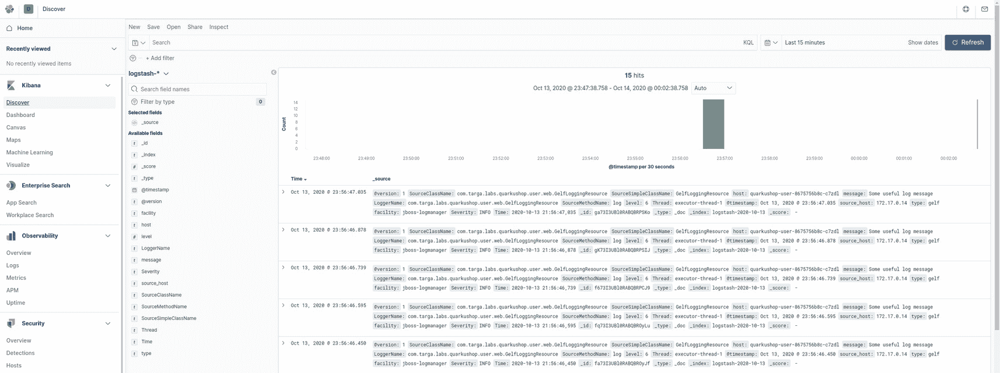

太棒了。现在，我们可以密切关注所有微服务中生成的所有日志。我们可以享受 ELK stack 的强大功能。例如，我们可以创建一个自定义查询来监控日志流中特定种类的错误。

## 实现分布式跟踪模式

分布式跟踪模式在 Quarkus 中有一个名为`quarkus-smallrye-opentracing`的专用扩展。就像日志聚合模式一样，我们需要一个分布式跟踪模式的分布式跟踪系统。

*分布式跟踪系统*用于收集和存储微服务架构中监控通信请求所需的定时数据，以便检测延迟问题。市面上有很多分布式追踪系统，比如 Zipkin 和 Jaeger。在本书中，我们将使用 Jaeger，因为它是由`quarkus-smallrye-opentracing`扩展支持的默认跟踪器。

我们需要安装 Jaeger 并配置微服务来支持它，以便收集请求跟踪。

在开始安装之前，以下是 Jaeger 生态系统的组成部分:

*   Jaeger Client :包含用于分布式跟踪的 OpenTracing API 的特定语言实现。

*   **Jaeger Agent** :监听 UDP 上发送的 SPANS 的网络守护程序。

*   **Jaeger Collector** :接收跨度并将其放入队列进行处理。这允许收集器立即返回到客户端/代理，而不是等待 SPAN 进入存储。

*   **查询**:从存储中检索踪迹的服务。

*   Jaeger 控制台:一个用户界面，让你可视化你的分布式追踪数据。

Jaeger 组件架构如下所示:

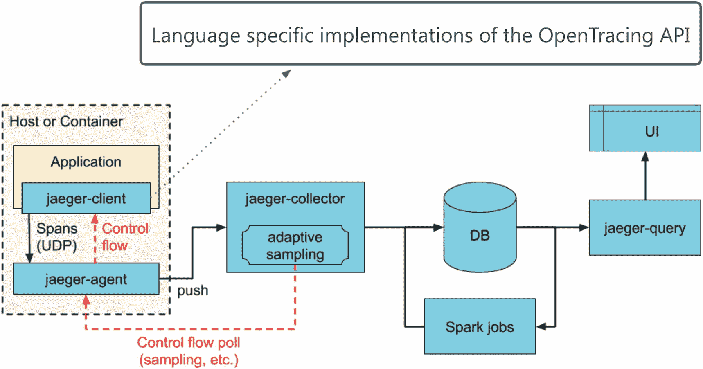

### 步骤 1:将 Jaeger 一体机部署到 Kubernetes

我们首先用清单 [14-4](#PC23) 中显示的内容创建`jaeger-deployment.yml`文件。

```java
apiVersion: apps/v1
kind: Deployment
metadata:
    labels:
        app: jaeger
        app.kubernetes.io/component: all-in-one
        app.kubernetes.io/name: jaeger
    name: jaeger
spec:
    progressDeadlineSeconds: 2147483647
    replicas: 1
    revisionHistoryLimit: 2147483647
    selector:
        matchLabels:
            app: jaeger
            app.kubernetes.io/component: all-in-one
            app.kubernetes.io/name: jaeger
    strategy:
        type: Recreate
    template:
        metadata:
            annotations:
                prometheus.io/port: "16686"
                prometheus.io/scrape: "true"
            labels:
                app: jaeger
                app.kubernetes.io/component: all-in-one
                app.kubernetes.io/name: jaeger
        spec:
            containers:
                - env:
                      - name: COLLECTOR_ZIPKIN_HTTP_PORT
                        value: "9411"
                  image: jaegertracing/all-in-one
                  imagePullPolicy: Always
                  name: jaeger
                  ports:
                      - containerPort: 5775
                        protocol: UDP
                      - containerPort: 6831
                        protocol: UDP
                      - containerPort: 6832
                        protocol: UDP
                      - containerPort: 5778
                        protocol: TCP
                      - containerPort: 16686
                        protocol: TCP
                      - containerPort: 9411
                        protocol: TCP
                  readinessProbe:
                      failureThreshold: 3
                      httpGet:
                          path: /
                          port: 14269
                          scheme: HTTP
                      initialDelaySeconds: 5
                      periodSeconds: 10
                      successThreshold: 1
                      timeoutSeconds: 1
                  resources: {}
                  terminationMessagePath: /dev/termination-log
                  terminationMessagePolicy: File
            dnsPolicy: ClusterFirst
            restartPolicy: Always
            schedulerName: default-scheduler
            securityContext: {}
            terminationGracePeriodSeconds: 30

Listing 14-4jaeger/jaeger-deployment.yml

```

接下来，将该文件导入 Kubernetes 集群:

```java
kubectl apply -f jaeger/jaeger-deployment.yml

```

这个`Deployment`资源将在一个容器中部署所有 Jaeger 后端组件和 UI。

我们现在需要创建一个名为`jaeger-query`的负载平衡的 Kubernetes 服务对象，如清单 [14-5](#PC25) 所示。

```java
apiVersion: v1
kind: Service
metadata:
    name: jaeger-query
    labels:
        app: jaeger
        app.kubernetes.io/name: jaeger
        app.kubernetes.io/component: query
spec:
    ports:
        - name: query-http
          port: 80
          protocol: TCP
          targetPort: 16686
    selector:
        app.kubernetes.io/name: jaeger
        app.kubernetes.io/component: all-in-one
    type: LoadBalancer

Listing 14-5jaeger/jaeger-query-service.yml

```

我们还需要创建另一个名为`jaeger-collector`的服务，如清单 [14-6](#PC26) 所示。

```java
apiVersion: v1
kind: Service
metadata:
    name: jaeger-collector
    labels:
        app: jaeger
        app.kubernetes.io/name: jaeger
        app.kubernetes.io/component: collector
spec:
    ports:
        - name: jaeger-collector-tchannel
          port: 14267
          protocol: TCP
          targetPort: 14267
        - name: jaeger-collector-http
          port: 14268
          protocol: TCP
          targetPort: 14268
        - name: jaeger-collector-zipkin
          port: 9411
          protocol: TCP
          targetPort: 9411
    selector:
        app.kubernetes.io/name: jaeger
        app.kubernetes.io/component: all-in-one
    type: ClusterIP

Listing 14-6jaeger/jaeger-collector-service.yml

```

清单 [14-7](#PC27) 显示了我们需要创建的最后一个，名为`jaeger-agent`。

```java
apiVersion: v1
kind: Service
metadata:
    name: jaeger-agent
    labels:
        app: jaeger
        app.kubernetes.io/name: jaeger
        app.kubernetes.io/component: agent
spec:
    ports:
        - name: agent-zipkin-thrift
          port: 5775
          protocol: UDP
          targetPort: 5775
        - name: agent-compact
          port: 6831
          protocol: UDP
          targetPort: 6831
        - name: agent-binary
          port: 6832
          protocol: UDP
          targetPort: 6832
        - name: agent-configs
          port: 5778
          protocol: TCP
          targetPort: 5778
    clusterIP: None
    selector:
        app.kubernetes.io/name: jaeger
        app.kubernetes.io/component: all-in-one

Listing 14-7jaeger/jaeger-agent-service.yml

```

我们通过 TCP 和 UDP 协议为 Jaeger 代理公开了许多端口。UDP 上的 6831 消耗跨度。这是我们用来和杰格特工联系的。

接下来，让我们创建 Kubernetes 对象:

```java
kubectl apply -f jaeger/jaeger-query-service.yml
kubectl apply -f jaeger/jaeger-collector-service.yml
kubectl apply -f jaeger/jaeger-agent-service.yml

```

现在很好，让我们检查一下 Jaeger 是否安装正确。我们需要对`jaeger-query`服务执行`port-forward`:

```java
kubectl port-forward service/jaeger-query 8888:80

```

然后打开`localhost:8888`，如截图所示:

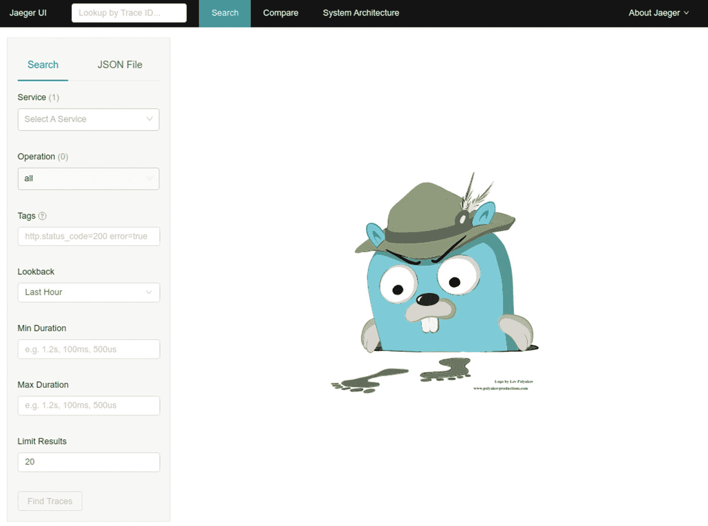

太棒了。我们现在可以转到微服务配置。

### 步骤 2:在我们的微服务中启用 Jaeger 支持

第一步是将`quarkus-smallrye-opentracing`依赖性添加到我们的微服务中:

```java
<dependency>
    <groupId>io.quarkus</groupId>
    <artifactId>quarkus-smallrye-opentracing</artifactId>
</dependency>

```

然后，我们需要定义每个微服务的 Jaeger 配置:

```java
 1 apiVersion: v1
 2 kind: ConfigMap
 3 metadata:
 4   name: quarkushop-user-config
 5 data:
 6   application.properties: |-
 7     mp.jwt.verify.publickey.location=http://keycloak-http.keycloak/auth/realms/quarkushop-realm/protocol/openid-connect/certs
 8     mp.jwt.verify.issuer=http://keycloak-http.keycloak/auth/realms/quarkushop-realm
 9     quarkus.log.handler.gelf.enabled=true
10     quarkus.log.handler.gelf.host=quarkushop-logstash
11     quarkus.log.handler.gelf.port=12201
12     quarkus.jaeger.service-name=quarkushop-user
13     quarkus.jaeger.sampler-type=const
14     quarkus.jaeger.sampler-param=1
15     quarkus.log.console.format=%d{HH:mm:ss} %-5p traceId=%X{traceId}, spanId=%X{spanId}, sampled=%X{sampled} [%c{2.}] (%t) %s%e%n
16     quarkus.jaeger.agent-host-port=jaeger-agent:6831

```

新的 Jaeger 特性如下:

*   `quarkus.jaeger.service-name`:服务名，是微服务用来向 Jaeger 服务器呈现自己的名称。

*   `quarkus.jaeger.sampler-type`:示例中的采样器类型为`const`。我们将不断发送`quarkus.jaeger.sampler-param`中定义的配额。

*   `quarkus.jaeger.sampler-param`:在 0 和 1 之间定义的样本配额，其中 1 表示 100%的请求。

*   `quarkus.log.console.format`:在日志消息中添加跟踪 id。

*   `quarkus.jaeger.agent-host-port`:通过 UDP 与 Jaeger 代理通信的主机名和端口。我们将它指向作为主机的`jaeger-agent`和作为端口的 6831。

很好。让我们构建、推送容器，并再次将它们部署到我们的 Kubernetes 集群。我们还需要再次导入`ConfigMaps`来更新它们。

### 步骤 3:收集痕迹

部署 Jaeger 服务器和更新微服务后，我们需要发出一些请求来生成踪迹。然后我们就能看到耶格在抓什么了。

例如，我们可以使用`quarkushop-user`向 Keycloak 请求一个`access_token`:

```java
kubectl port-forward service/quarkushop-user 8080

```

然后运行一个`curl`向`quarkushop-user`微服务请求`access_token`:

```java
curl -X POST "http://localhost:8080/api/user/access-token?password=password&username=nebrass"

```

很好！让我们做一个`port-forward`并访问 Jaeger，看看那里发生了什么:

```java
kubectl port-forward service/jaeger-query 8888:80

```

然后打开`localhost:8888`，如截图所示:

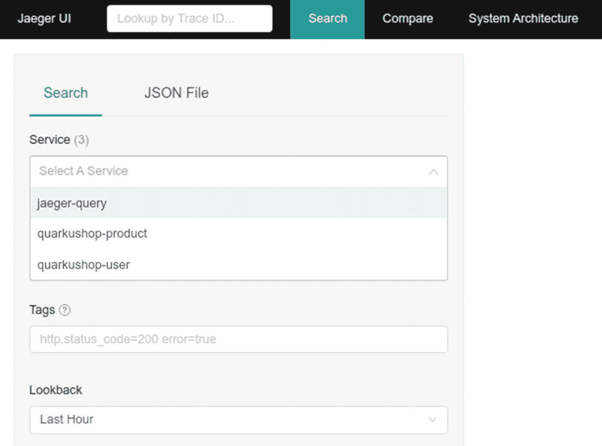

正如您在服务部分看到的，有三个元素。只需选择`quarkushop-user`并点击查找痕迹:

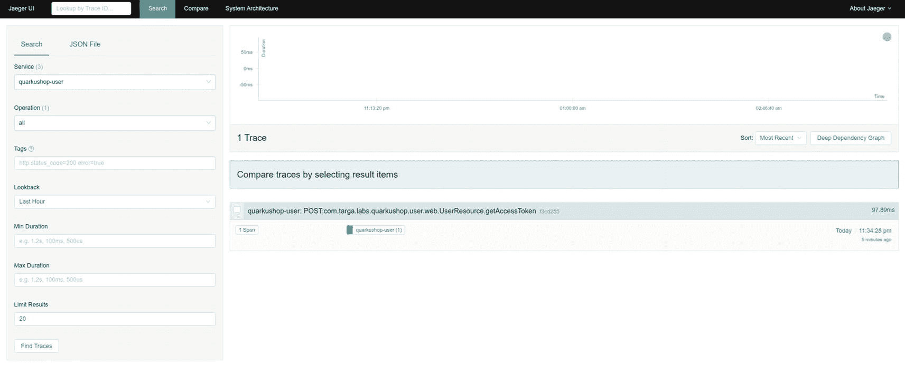

显示了一个跨度:

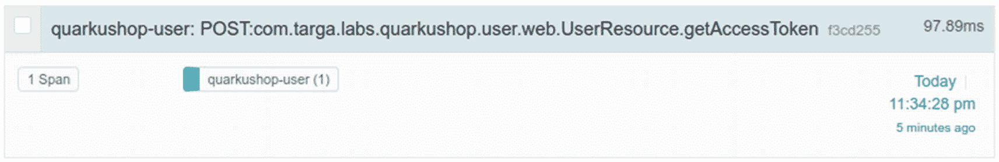

如果您点按它，会出现更多详细信息:

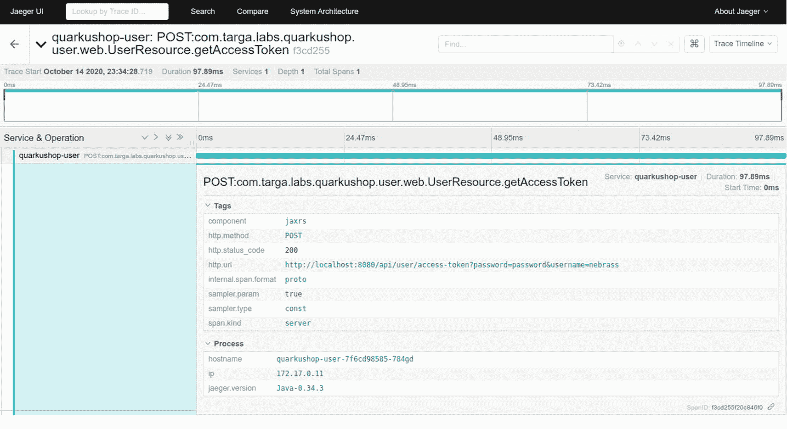

您可以看到此处显示了请求的所有详细信息:

*   网址

*   HTTP 动词

*   持续时间

*   诸如此类；一切都在这里

搞定了。我们以一种非常有效和简单的方式在 Quarkus 中实现了分布式跟踪模式！我真的很开心！

## 实现 API 网关模式

一个 *API 网关*是一个位于 API 前面的编程门面，充当一组定义的微服务的单一入口点。

为了实现 Kubernetes，一个*入口*管理对集群中服务的外部访问，通常是`facadeHTTP`。Ingress 可以提供负载平衡、SSL 终止和基于名称的虚拟主机。

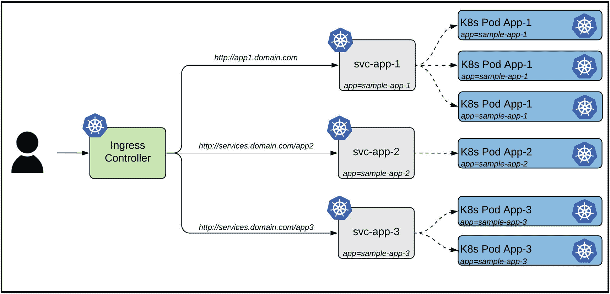

一个*入口*是允许入站连接到达集群服务的规则集合。它可以被配置为向服务提供外部可达的 URL、负载平衡的流量、终止 SSL、基于名称的虚拟主机等等。

一个*入口控制器*负责实现入口，通常带有一个负载平衡器，尽管它也可以配置您的边缘路由器或附加前端，以帮助以高可用性的方式处理流量。

让我们将 API 网关模式引入 Kubernetes。

### 步骤 1:在 Minikube 中启用入口支持

第一步是在 Minikube 中启用入口支持。对于那些使用真正的 Kubernetes 集群的人(幸运的人)来说，这一步是不需要的。

要在 Minikube 中启用入口支持，只需启动您的`minikube`实例，然后运行以下命令:

```java
minikube addons enable ingress

```

Ingress 是 Minikube 的附加产品。

我们需要一个入口域名；让我们使用`quarkushop.io`域名。我们通过键入以下命令获得 Minikube 的 IP 地址:

```java
$ minikube ip
192.168.39.243

```

然后，我们需要在这个 IP 地址的`/etc/hosts`文件中添加一个新条目，以便将其用于我们的自定义域`quarkushop.io`:

```java
192.168.39.243  quarkushop.io

```

该自定义内部 DNS 条目将对目标`192.168.39.243`进行任何调用。

### 步骤 2:创建 API 网关入口

Ingress 将指向我们的四种微服务:

*   `quarkushop-product`

*   `quarkushop-order`

*   `quarkushop-customer`

*   `quarkushop-user`

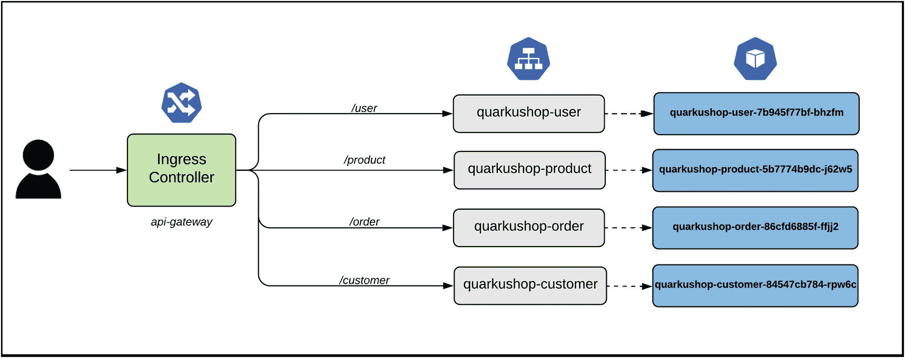

入口描述符如清单 [14-8](#PC38) 所示。

```java
apiVersion: networking.k8s.io/v1
kind: Ingress
metadata:
  name: api-gateway
  annotations:
    nginx.ingress.kubernetes.io/rewrite-target: /$1
spec:
  rules:
  - http:
      paths:
      - path: /user
        pathType: Prefix
        backend:
          service:
            name: quarkushop-user
            port:
              number: 8080
      - path: /product
        pathType: Prefix
        backend:
          service:
            name: quarkushop-product
            port:
              number: 8080
      - path: /order
        pathType: Prefix
        backend:
          service:
            name: quarkushop-order
            port:
              number: 8080
      - path: /customer
        pathType: Prefix
        backend:
          service:
            name: quarkushop-customer
            port:
              number: 8080

Listing 14-8api-gateway-ingress.yml

```

只需将该内容保存到`api-gateway-ingress.yml`并使用以下命令创建资源:

```java
kubectl create -f api-gateway-ingress.yml

```

入口已成功创建！让我们检查一下:

```java
$ kubectl get ingress

NAME          CLASS    HOSTS           ADDRESS          PORTS   AGE
api-gateway   <none>   quarkushop.io   192.168.39.243   80      7m46s

```

太棒了！如你所见，`ADDRESS`与 Minikube IP 相同。

### 步骤 3:测试入口

现在我们可以享受我们的入口了。我们可以用它向`quarkushop-user`微服务请求一个`access_token`:

```java
$ curl -X POST "http://quarkushop.io/user/api/user/access-token?password=password&username=nebrass"

eyJhbGciOiJSUzI1NiIsIn...

```

万岁！我们收到了`access_token`请求！ Ingress 非常好用！

## 结论

在这一章中，我们使用不同的 Quarkus 扩展和 Kubernetes 对象实现了许多模式。这个任务非常简单，特别是因为我们将许多任务委托给了 Kubernetes。

Hakuna matata！我们成功实施了云原生微服务。我对可用的扩展和提供的优秀文档感到非常高兴。