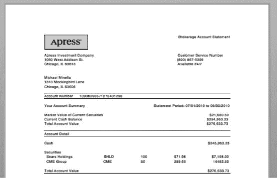
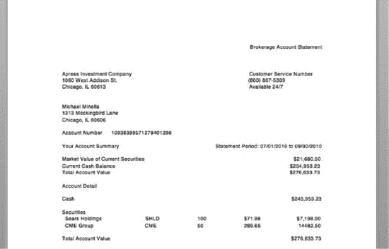
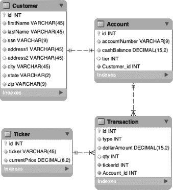

# 三、示例作业

这本书不仅解释了 Spring Batch 的许多特性是如何工作的，还详细演示了它们。每章都包括一些例子，展示每个特性是如何工作的。然而，旨在传达单个概念和技术的示例可能不是展示这些技术如何在真实世界的示例中协同工作的最佳方式。因此，在第十章中，你创建了一个用来模拟真实场景的示例应用。

我选择的场景很简单:一个你很容易理解的领域，但是它提供了足够的复杂性，所以使用 Spring Batch 是有意义的。银行对账单是常见批处理的一个例子。这些流程每晚运行，根据上个月的交易生成报表。这个例子是标准银行对账单的一个衍生物:经纪对账单。经纪对账单批处理流程展示了如何将 Spring Batch 的以下功能结合使用来实现结果:

> *各种输入和输出选项:*Spring Batch 最重要的特性之一是从各种来源读取和写入的良好抽象的选项。代理语句从平面文件、数据库和 web 服务获得输入。在输出端，您可以写入数据库和平面文件。利用了各种各样的读取器和写入器。
> 
> *错误处理:*维护批处理过程最糟糕的部分是当它们中断时，通常是在凌晨 2:00，而你是接到电话来解决问题的人。因此，健壮的错误处理是必须的。示例语句过程涵盖了许多不同的场景，包括日志记录、跳过有错误的记录和重试逻辑。
> 
> *可伸缩性:*在现实世界中，批处理过程需要能够容纳大量数据。在本书的后面，您将使用 Spring Batch 的可伸缩性特性来调整批处理过程，以便它可以处理数百万个客户。

为了构建我们的批处理作业，我们需要一组工作需求。因为我们将使用用户故事来定义我们的需求，所以我们将在下一节中从整体上来看敏捷开发过程。

### 了解敏捷开发

在本章深入探讨你在第十章中开发的批处理过程的个别需求之前，让我们花点时间回顾一下你使用的方法。在我们的行业中，关于各种敏捷过程已经说了很多；因此，不要指望你以前对主题的任何了解，让我们从建立*敏捷*和开发过程对本书的意义开始。

敏捷过程有 12 条原则，实际上它的所有变体都规定了这些原则。它们如下:

*   客户满意来自工作软件的快速交付。
*   无论发展到什么阶段，变化都是受欢迎的。
*   经常交付工作软件。
*   商业和发展必须每天携手合作。
*   与积极的团队一起构建项目。给他们工具，相信他们能完成工作。
*   面对面的交流是最有效的形式。
*   工作软件是衡量成功的第一标准。
*   努力实现可持续发展。团队的所有成员都应该能够无限期地保持开发速度。
*   继续追求卓越的技术和优秀的设计。
*   通过消除不必要的工作来减少浪费。
*   自组织团队产生最好的需求、架构和设计。
*   定期让团队反思，以确定如何改进。

不管你是在使用极限编程(XP)、Scrum 还是任何其他当前流行的变体。关键是这十几条原则仍然适用。

请注意，并不是所有的都适用于你的情况。和一本书面对面工作很难。你可能会独自完成这些例子，所以团队激励方面也不完全适用。然而，有些部分确实适用。一个例子是工作软件的快速交付。这会驱使你读完这本书。您将通过构建应用的小部分，验证它们与单元测试一起工作，然后添加到它们上面来完成它。

即使有例外，敏捷的原则也为任何开发项目提供了一个坚实的框架，本书尽可能多地应用了这些原则。让我们通过检查您记录样例工作:用户故事的需求的方式来开始了解它们是如何应用的。

#### 用用户故事捕捉需求

用户故事是记录需求的敏捷方法。作为客户对应用应该做什么的看法，故事的目标是传达用户将如何与系统交互，并记录交互的可测试结果。用户故事有三个主要部分:

*   标题:标题应该简单明了地陈述故事的内容。*加载交易文件。计算费用等级。生成打印文件。所有这些都是故事标题的好例子。您会注意到这些标题不是特定于 GUI 的。仅仅因为你没有 GUI 并不意味着你不能在用户之间进行交互。在这种情况下，用户是您正在记录的批处理过程或您与之交互的任何外部系统。*
*   *叙述:*这是对你所记录的交互的简短描述，从用户的角度来写。通常，格式类似于“给定情况 Y，X 做了一些事情，然后发生了其他事情。”在接下来的章节中，您将看到如何处理批处理的故事(假设它们本质上是纯技术性的)。
*   *验收标准:*验收标准是可测试的需求，可以用来识别一个故事何时完成。前面陈述中的重要词是*可测试的*。为了使验收标准有用，它必须能够以某种方式进行验证。这些不是主观的需求，而是开发人员可以用来说“是的，它确实这样做了”或“不，它没有”的硬性要求

让我们看一个通用遥控器的用户故事作为例子:

*   标题:打开电视
*   *叙述:*作为用户，在关闭电视、接收器和有线电视盒的情况下，我将能够按下我的通用遥控器上的电源按钮。然后，遥控器将打开电视、接收器和有线电视盒，并对它们进行配置以观看电视节目。
*   *验收标准:*
    *   在万能遥控器上有一个电源按钮。
    *   当用户按下电源按钮时，将发生以下情况:
        1.  电视机将打开电源。
        2.  AV 接收器将通电。
        3.  有线电视盒将通电。
        4.  有线电视盒将被设置到频道 187。
        5.  AV 接收器将被设置为 SAT 输入。
        6.  电视机将被设置为视频 1 输入。

“打开电视”用户故事以简短的描述性标题“打开电视”开始。它继续叙述。在这种情况下，叙述提供了当用户按下电源按钮时会发生什么的描述。最后，验收标准列出了开发人员和 QA 的可测试需求。请注意，每个标准都是开发人员可以轻松检查的:他们可以看着他们开发的产品说是或不是，他们写的东西是否符合标准。

**用户故事与用例**

用例是需求文档的另一种常见形式。类似于用户故事，它们以演员为中心。用例是 Rational 统一过程(RUP)选择的文档形式。它们旨在记录参与者和系统之间交互的每个方面。正因为如此，他们过度以文档为中心的焦点(为了文档而写文档)，以及他们臃肿的格式，用例已经失宠，在敏捷开发中被用户故事所取代。

用户故事标志着开发周期的开始。让我们继续看看在这个周期的剩余时间里使用的一些其他工具。

#### 用测试驱动的开发来捕获设计

测试驱动开发(TDD)是另一种敏捷实践。当使用 TDD 时，开发人员首先编写一个失败的测试，然后实现代码使测试通过。TDD(也称为测试优先开发)旨在要求开发人员在编码之前考虑他们试图编码什么，已经被证明可以使开发人员更有效率，更少地使用他们的调试器，并最终得到更干净的代码。

TDD 的另一个优点是测试可以作为可执行的文档。与由于缺乏维护而变得陈旧的用户故事或其他形式的文档不同，自动化测试总是作为代码持续维护的一部分进行更新。如果您想了解一段代码是如何工作的，您可以查看单元测试，了解开发人员打算使用他们的代码的场景的完整情况。

尽管 TDD 有许多优点，但在本书中你不会经常用到它。这是一个很好的开发工具，但它不是解释事物如何工作的最佳工具。然而，第十二章着眼于所有类型的测试，从单元测试到功能测试，使用开源工具包括 JUnit、Mockito 和 Spring 中的测试附件。

#### 使用源代码控制系统

在第二章中，当您使用 Git 检索 Spring Batch 的源代码时，您快速浏览了一下源代码控制。尽管这不是一个必要条件，但是强烈建议您在所有的开发中使用源代码控制系统。无论您选择建立一个中央 Subversion 存储库还是在本地使用 Git，源代码控制提供的特性对于高效的编程都是必不可少的。

你可能在想，“为什么我要对那些我在学习时要扔掉的代码使用源代码控制？”这是我能想到的使用它的最强有力的理由。通过使用版本控制系统，你给自己一个安全网去尝试一些事情。提交您的工作代码；尝试一些可能不起作用的东西。如果是，提交新的修订。如果没有，回滚到前一个版本，不会造成任何伤害。想一想你最近一次在没有版本控制的情况下学习新技术的情形。我敢肯定，有时你会沿着一条没有成功的道路编码，然后因为没有先前的工作副本而不得不调试。通过使用版本控制，你可以在一个受控的环境中避免犯错误。

#### 使用真实的开发环境

在敏捷环境中，还有许多其他方面需要开发。给自己找个好主意。因为这本书是有意为 IDE 不可知论者而写的，所以它不会深入讨论每本书的优点和缺点。但是，一定要有一个好的，并且学好，包括键盘快捷键。

虽然在学习某项技术时，花费大量时间建立持续集成环境对您来说可能没有意义，但为了您的个人发展，建立一个用于一般用途的环境可能是值得的。你永远不知道你正在开发的小部件什么时候会成为下一件大事，当事情开始变得令人兴奋时，你会讨厌不得不回去设置源代码控制和持续集成等。有几个不错的持续集成系统是免费的，但是我强烈推荐 Hudson(或者它的兄弟 Jenkins)。它们都易于使用且高度可扩展，因此您可以配置各种附加功能，包括与 Sonar 和其他代码分析工具集成以及执行自动化功能测试。

### 理解陈述工作的要求

现在您已经看到了在学习 Spring Batch 时鼓励您使用的开发过程的各个部分，让我们看看您将在本书中开发什么。图 3-1 显示了你期望每个季度从你的股票经纪人那里收到的作为你的经纪账户对账单的邮件。

***图 3-1。**经纪声明，格式化并打印在信笺上*

如果你分解一下这个陈述是如何产生的，实际上有两个部分。第一张不过是一张漂亮的纸，第二张就印在上面。这是你在本书中创作的第二件作品，如图 3-2 所示。

***图 3-2。**纯文本经纪声明*

通常，语句创建如下。批处理会创建一个仅包含文本的打印文件。然后，打印文件被发送到打印机，打印机将文本打印到装饰纸上，生成最终报表。打印文件是您使用 Spring Batch 创建的部分。您的批处理将执行以下功能:

1.  导入客户信息和相关交易的文件。
2.  从 web 服务中检索数据库中所有股票的收盘价格。
3.  将先前下载的股票价格导入数据库。
4.  计算每个账户的定价水平。
5.  根据上一步计算的水平，计算每笔交易的交易费。
6.  打印上个月经纪账户的文件。

让我们来看看这些特性都需要什么。为您的工作提供了一个客户事务平面文件，其中包含有关客户及其当月事务的信息。您的作业更新现有的客户信息，并将他们的交易添加到数据库中。当交易被导入后，作业从 web 服务获取数据库中每只股票的最新价格，以便计算每个账户的当前价值。该作业将下载的价格导入数据库。

初始导入完成后，您的工作可以开始计算交易费用。经纪公司通过对每笔交易收取费用来赚钱。这些费用是基于客户一个月的交易量。客户的交易越多，每次交易收取的费用就越少。计算交易费用的第一步是确定用户属于哪个级别或阶层；然后，您可以计算客户交易的价格。当所有的计算都完成后，就可以生成用户的月结单了。

这个特性列表旨在提供一个完整的视图，展示 Spring Batch 在现实问题中是如何使用的。在整本书中，您将了解 Spring Batch 提供的特性，这些特性可以帮助您开发类似于这个场景所需的批处理过程。在第十章中，您实现了批处理作业，以满足以下用户案例中概述的需求:

> *导入交易:*作为批处理，我会将客户信息及其相关交易导入到数据库中，以供将来处理。验收标准:
> 
> 批处理作业将预定义的客户/交易文件导入数据库表格。
> 
> 文件导入后，将被删除。
> 
> 客户/交易文件将有两种记录格式。首先是识别后续交易所属的客户。第二个是个人交易记录。
> 
> 客户记录的格式是以下字段的逗号分隔记录:

<colgroup><col align="left" valign="top" width="40%"> <col align="left" valign="top" width="30%"> <col align="left" valign="top" width="20%"></colgroup> 
| **名称** | **必需的** | **格式** |
| :-- | :-- | :-- |
| 客户税务 ID | 真实的 | \d{9} |
| 客户名字 | 错误的 | \w+ |
| 客户姓氏 | 错误的 | \w+ |
| 客户地址 1 | 错误的 | \w+ |
| 客户城市 | 错误的 | \w+ |
| 客户状态 | 错误的 | [A-Z]{2} |
| 客户邮政编码 | 错误的 | \d{4} |
| 客户账号 | 错误的 | \d{16} |

> 客户记录将如下所示:

`205866465,Joshua,Thompson,3708 Park,Fairview,LA,58517,3276793917668488`

> 交易记录的格式为以下字段的逗号分隔记录:

<colgroup><col align="left" valign="top" width="30%"> <col align="left" valign="top" width="15%"> <col align="left" valign="top" width="15%"> <col align="left" valign="top" width="20%"></colgroup> 
| **名称** | **必需的** | **格式** |  |
| :-- | :-- | :-- | :-- |
| 客户账号 | 真实的 | \d{16} |  |
| 股票代码 | 真实的 | \w+ |  |
| 真实数量 |  | \d+ |  |
| 真实价格 |  | \d+\。\d{2} |  |
| 交易时间戳 | True MM\DD\YYYY | 时:分:秒 |

> 事务记录如下所示:

`3276793917668488,KSS,5767,7074247,2011-04-02 07:00:08`

> 所有交易将作为新交易导入。
> 
> 将创建一个包含无效客户记录的错误文件。
> 
> 任何无效的交易记录将与客户记录一起写入错误文件
> 
> *获取股票收盘价:A* 在批处理过程中，在预定的执行时间，我将查询 Yahoo stock web 服务以获取我们的客户在上个月持有的所有股票的收盘价。我将用这些数据构建一个文件，以便将来导入。验收准则
> 
> 该进程每次运行时都会输出一个文件。
> 
> 文件将由每个股票代码的一个记录组成。
> 
> 文件中的每条记录都有以下以逗号分隔的字段:

<colgroup><col align="left" valign="top" width="30%"> <col align="left" valign="top" width="30%"> <col align="left" valign="top" width="30%"></colgroup> 
| **名称** | **必需的** | **格式** |
| :-- | :-- | :-- |
| 股票代码 | 真实的 | \w+ |
| 收盘价格 | 真实的 | \d+\。\d{，2} |

> 股票报价文件将从 URL `[`download.finance.yahoo.com/d/quotes.csv?s=<QUOTES>&f=sl1`](http://download.finance.yahoo.com/d/quotes.csv?s=<QUOTES>&f=sl1)`获得，其中`<QUOTES>`是由加号(+)分隔的股票代码列表，`sl1`表示我想要股票代码和最近的交易价格。?? 1

__________

1 你可以在`[www.gummy-stuff.org/Yahoo-data.htm](http://www.gummy-stuff.org/Yahoo-data.htm).`找到关于这项网络服务的更多信息

> 使用 URL `[`download.finance.yahoo.com/d/quotes.csv?s=HD&f=sl1`](http://download.finance.yahoo.com/d/quotes.csv?s=HD&f=sl1)`返回的一个示例记录是:`"HD",31.46`。
> 
> *导入股票价格:*作为批处理，当我收到股票价格文件时，我会将该文件导入到数据库中以供将来处理。验收标准:
> 
> 该过程将读取作业中上一步下载的文件。
> 
> 每只股票的股价将储存在数据库中，供每笔交易参考。
> 
> 文件成功导入后，将被删除。
> 
> 文件的记录格式可以在 story Get 股票收盘价中找到。
> 
> 任何格式错误的记录都将记录在单独的错误文件中，以供将来分析。
> 
> *计算定价等级:*作为批处理，在导入所有输入后，我将计算每个客户所处的定价等级，并将其存储起来以备将来使用。验收标准:
> 
> 该流程将根据客户在一个月内的交易次数来计算每笔交易的价格。
> 
> 每个等级将由以下阈值决定:

<colgroup><col align="left" valign="top" width="30%"> <col align="left" valign="top" width="30%"></colgroup> 
| **层** | **交易** |
| :-- | :-- |
| 我< = | Ten |
| II <= | One hundred |
| III <=1， | 000 |
| 四> | Ten thousand |

> 将存储与客户相关的等级值，用于未来的费用计算。
> 
> *计算每笔交易的费用:*作为批处理，在我完成计算定价层级后，我将计算客户将被收取的每笔交易的经纪费。验收标准:
> 
> 该流程将根据客户所在的层级计算每笔交易的费用(在计算定价层级故事中计算)。
> 
> 计算每笔交易价格的公式如下:

<colgroup><col align="left" valign="top" width="30%"> <col align="left" valign="top" width="30%"></colgroup> 
| **梯队** | **公式** |
| :-- | :-- |
| 我 | 9 美元+购买额的 0.1% |
| 二 3 美元 |  |
| 三 2 美元 |  |
| 四 1 美元 |  |

> *打印账户摘要:*作为批处理，所有计算完成后，我会为每个客户打印一份摘要。该摘要将提供客户账户的概述，以及构成其投资组合总价值的细分。验收标准:
> 
> 该流程将为每个客户生成一个文件。
> 
> 摘要将以一行文字开始，说明以下内容，并完全对齐

`Your Account Summary                  Statement Period:<BEGIN_DATE> to <END_DATE>`

> 其中，开始日期是上个月的第一个日历日期，结束日期是上个月的最后一个日历日期。
> 
> 在摘要标题之后，每种证券类型(证券和现金)将有一个单独的行项目，以及该账户的当前价值。
> 
> 在每一个明细项目之后，将打印一个总的账户值。以下是该部分的一个示例:

`Your Account Summary                    Statement Period: 07/01/2010 to 09/30/2010
Market Value of Current Securities
$21,680.50
Current Cash Balance                                                   $254,953.23
Total Account Value                                                    $276,633.73`

> *打印账户明细:*作为批处理，在每个账户汇总后，我将打印每个账户的明细构成。账户详情将为客户提供其账户构成的详细信息，以及他们的投资情况。验收标准:
> 
> 账户详情将被附加到每个客户的账户摘要中。
> 
> 详细信息将以标题“账户详细信息”开始，左对齐。
> 
> 在新的一行，将指定账户的现金余额。
> 
> 在现金余额下方，将显示一个标题，说明“证券”,靠左对齐。
> 
> 对于客户持有的每种股票，将显示以下字段:

<colgroup><col align="left" valign="top" width="30%"> <col align="left" valign="top" width="30%"> <col align="left" valign="top" width="30%"></colgroup> 
| **姓名** | **必需的** | **格式** |
| :-- | :-- | :-- |
| 股票代码 | 真实的 | \w+ |
| 真实数量 |  | \d+ |
| 真实价格 |  | \d+\。\d{2} |
| 总值 | 真实的 | 数量*美元格式的价格 |

> 下面是这部分的一个例子。

`Account Detail
Cash                                                             $245,953.23

Securities
        SHLD    100    $71.98  $7,198.00
        CME     50     289.65  14482.50

Total Account Value    $276,633.73`

> *打印报表表头:*作为批处理，我会在每页的顶部打印一个表头。这将提供关于账户、客户和经纪公司的一般信息。验收标准:
> 
> 除了客户的地址和账号之外，标题都是静态文本。
> 
> 下面是一个标题示例，其中 Michael Minella 的姓名和地址是客户的姓名和地址，帐号是客户的帐号:

`Brokerage Account Statement

Apress Investment Company                    Customer Service Number
1060 West Addison St.                        (800) 867-5309
Chicago, IL 60613                            Available 24/7

Michael Minella
1313 Mockingbird Lane
Chicago, IL 60606

Account Number      10938398571278401298`

这就满足了需求。如果你现在头晕，没关系。在下一节中，您将开始概述如何使用 Spring Batch 处理这个语句过程。然后，在本书的其余部分，您将学习如何实现使其工作所需的各个部分。

### 设计批处理作业

如前所述，这个项目的目标是利用 Spring Batch 提供的特性来创建一个健壮的、可维护的解决方案。为了实现这个目标，这个例子包含了现在看起来有点复杂的元素，比如标题、多种文件格式导入和包含副标题的复杂输出。原因是 Spring Batch 恰恰为这些特性提供了便利。让我们通过概述作业和描述其步骤来深入了解如何构建这个批处理过程。

#### 职位描述

为了实现语句生成过程，您需要构建一个包含六个步骤的作业。图 3-3 显示了该流程的批处理作业流程，以下章节描述了这些步骤。

***图 3-3。**股票对账单工作流*

##### 导入客户交易数据

要开始这项工作，首先要导入客户和交易数据。该数据包含在平面文件中，具有由两种记录类型组成的复杂格式。第一种记录类型是客户的记录类型，由客户的姓名、地址和帐户信息组成。第二种记录类型由每笔交易的详细信息组成，包括股票代码、支付的价格、购买或出售的数量以及交易发生时的时间戳。使用 Spring Batch 读取多行记录的能力允许您用最少的代码处理这个文件。您为导入数据的 JDBC 持久化编写一个数据访问对象(DAO)，如清单 3-1 所示。

***清单 3-1。**客户/交易输入文件*

`392041928,William,Robinson,9764 Jeopardy Lane,Chicago,IL,60606
HD,31.09,200,08:38:05
WMT,53.38,500,09:25:55
ADI,35.96,-300,10:56:10
REGN,29.53,-500,10:56:22
938472047,Robert,Johnson,1060 Addison St,Chicago,IL,60657
CABN,0.890,10000,14:52:15
NUAN,17.11,15000,15:02:45`

##### 检索股票收盘价

导入客户信息和交易后，您继续获取股票价格信息。这是一个简单的步骤，检索前一个月交易的股票的所有收盘价。为此，您创建一个 tasklet(正如您在上一章中对 Hello，World 批处理过程所做的那样)来调用需求中指定的 Yahoo web 服务，并下载一个包含所需股票数据的 CSV。这一步将输出写入一个类似于清单 3-2 中的文件，供下一步处理。

***清单 3-2。**股票收盘价输入文件*

`SHLD,71.98` `CME,289.65
GOOG,590.83
F,16.28`

##### 将股票价格导入数据库

这一步读取文件并将数据导入数据库。这一步展示了 Spring Batch 提供的声明式 I/O 的优势。这项工作的输入和输出都不需要您编写代码。Spring Batch 提供了通过框架的股票组件读取您在上一步中下载的 CSV 文件以及更新数据库的能力。

你可能想知道为什么不直接导入数据。原因是错误处理。您正在导入由第三方来源提供给您的数据。因为您不能确定数据的质量，所以您需要能够处理导入过程中可能出现的任何错误。通过将数据写入文件供以后的步骤处理，您可以重新启动该步骤，而不必重新下载股票价格。

##### 计算交易费用等级

到目前为止，您还没有对正在读取和写入的数据进行任何真正的处理。您所做的只是将数据从一个文件传输到一个数据库(为了更好地测量，进行了一些验证)。完成所需数据的导入后，开始进行所需的计算。你的经纪公司根据客户的交易量收取费用。客户交易越多，每次交易收取的费用就越少。通过层级分配向客户收取的金额；每一层都由前一个月的交易数量定义，并有一个与之相关的金额。

在这一步中，您将在读取器和写入器之间引入一个项目处理器，以确定客户所属的层。您通过 XML 声明读取器来加载客户的交易信息，声明写入器来以相同的方式更新客户的帐户。

##### 计算交易费用

当你确定了每个客户的等级，你就可以计算每笔交易的费用。在上一步中，您在客户级别处理了记录，每个客户都被分配了一个层。在此步骤中，您在单个事务级别处理记录。可以想象，您在这一步中处理的记录比之前的任何一步都多；稍后，当本书谈到可伸缩性选项时，您将更详细地研究这一步。然而，首先，这一步看起来与前一步几乎完全一样，但是对于读取器来说使用了不同的 SQL，对于条目处理器来说使用了不同的逻辑，对于写入器来说又使用了另一个`JdbcItemWriter`。

##### 生成客户月报表

最后一步似乎是最复杂的——但正如你所知，外表可能具有欺骗性。这一步包括语句本身的生成。它展示了将解耦解决方案应用于批处理问题的一些好处。通过提供自定义编码的格式化程序，您可以用一个简单的类完成几乎所有的工作。这一步还使用了头的回调。

所有这些在理论上听起来都很棒，但留下了许多有待回答的问题。很好。在本书的剩余部分，您将研究如何在流程中实现这些特性，以及检查异常处理和重启/重试逻辑等内容。不过，在继续之前，您应该熟悉的最后一个项目是数据模型。这将有助于澄清这个系统是如何构建的。让我们来看看。

#### 了解数据模型

在本书中，你已经看到了你所创造的工作的所有不同部分。在您进入实际开发之前，让我们进入最后一个难题。批处理是数据驱动的。由于没有用户界面，各种数据存储最终成为该流程唯一的外部交互。这一节着眼于示例应用所使用的数据模型。

图 3-4 概述了该批处理过程的特定应用表。明确地说，这个图表并没有包含运行这个批处理作业所需的所有表。第二章简要地看了一下 Spring Batch 在作业存储库中使用的表。除了这些表之外，所有这些表都将存在于数据库中。因为单独部署批处理模式并不少见，而且你在上一章已经回顾过了，所以我选择不在图 3-4 中提及它。

***图 3-4。**样本应用数据模型*

对于批处理应用，您有四个表:Customer、Account、Transaction 和 Ticker。当您查看表中的数据时，请注意您没有存储生成语句所需的所有字段。有些字段(如帐户摘要中的总计)需要在处理过程中进行计算。除此之外，数据模型应该看起来相对简单:

*   *客户:*该记录包含所有特定于客户的信息，包括姓名和税务标识号。
*   *账号*。每个客户都有一个账户。出于您的目的，每个帐户都有一个号码和一个流动现金余额，根据需要从中扣除费用。客户的交易费用层也存储在这一层。
*   *交易*。每笔交易在交易表中都有相应的记录。这里的数据用于确定账户的当前状态(持有多少股份等等)。
*   *跑马灯*。对于经纪公司的客户交易的每只股票，该表中都有一条记录，其中包含股票的报价机和最近的收盘价。

### 总结

本章讨论了敏捷开发过程以及如何将它应用到批量开发中。本章继续沿着这些思路，通过用户故事为你在本书的整个过程中构建的示例应用定义需求。从这一点上，这本书从《SpringBatch》的“是什么”和“为什么”切换到了“如何”

在下一章中，您将深入探究 Spring Batch 的作业和步骤概念，并查看许多其他特定的示例。