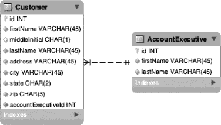
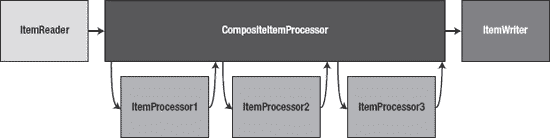
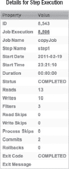

# 八、项目处理器

在前一章中，您学习了如何使用 Spring Batch 的组件读取各种类型的输入。显然，获取任何软件的输入都是项目的一个重要方面；但是，如果你不利用它做点什么，它的意义并不大。项目处理器是 Spring Batch 中的组件，您可以在其中处理输入。在本章中，您将看到 ItemProcessor 接口，并了解如何使用它来开发您自己的批处理项目。

*   在“ItemProcessors 简介”一节中，您将从快速概述什么是 ItemProcessor 以及它如何适应一个步骤的流程开始。
*   Spring Batch 提供了实用的 ItemProcessor，比如 ItemProcessorAdapter，它使用现有的服务作为您的 item processor 实现。在“使用 Spring Batch 的 ItemProcessors”一节中，您将深入了解框架提供的每个处理器。
*   在许多情况下，您会希望开发自己的 ItemProcessor 实现。在“编写自己的 ItemProcessors”一节中，您将看到在实现一个示例 ItemProcessor 时的不同考虑。
*   ItemProcessor 的一个常见用途是过滤掉由 ItemReader 读入的项目，使其不被步骤的 ItemWriter 写入。在“过滤项目”一节中，您将看到一个如何实现这一点的示例。

### 物品处理器简介

在第 7 章中，你看到了 ItemReaders，你在 Spring Batch 中使用的输入工具。一旦收到您的输入，您有两个选择。第一种方法是把它写出来，就像你在上一章的例子中所做的那样。很多时候这是有意义的。将数据从一个系统迁移到另一个系统，或者最初将数据加载到数据库中，这两个例子说明了直接读取输入并将其写入而无需任何额外的处理是有意义的。

然而，在大多数情况下，您需要对读入的数据做一些事情。Spring Batch 分解了一个步骤的各个部分，以便很好地分离读取、处理和写入之间的关系。这样做可以让你有机会做一些独特的事情，例如:

*   *验证输入*:在 Spring Batch 的最初版本中，通过子类化`ValidatingItemReader`类在 ItemReader 进行验证。这种方法的问题是提供的阅读器都没有子类化`ValidatingItemReader`类，所以如果你想要验证，你不能使用任何包含的阅读器。将验证步骤移到 ItemProcessor 允许在处理之前对对象进行验证，而不管输入方法如何。从关注点划分的角度来看，这更有意义。
*   *重用现有的服务*:就像你在[第 7 章](07.html#ch7)中看到的 ItemReaderAdapter 一样，为了重用你输入的服务，Spring Batch 出于同样的原因提供了一个 ItemProcessorAdapter。
*   *Chain ItemProcessors* :有些情况下，您会希望在同一个事务中对一个项目执行多个操作。虽然您可以编写自己的定制 ItemProcessor 来处理单个类中的所有逻辑，但这会将您的逻辑耦合到框架中，这是您希望避免的。相反，Spring Batch 允许您创建一个 ItemProcessors 列表，该列表将针对每个项目按顺序执行。

为了实现这一点，`org.springframework.batch.item.ItemProcessor`接口由清单 8-1 所示的单一方法过程组成。它从 ItemReader 中读取一个项目，然后返回另一个项目。

***清单 8-1。**项目处理器接口*

`package org.springframework.batch.item;

public interface ItemProcessor<I, O> {

    O process(I item) throws Exception;
}`

需要注意的是，ItemProcessor 作为输入接收的类型不需要与它返回的类型相同。该框架允许您读入一种类型的对象，并将其传递给 ItemProcessor，然后让 ItemProcessor 返回不同类型的对象进行写入。有了这个特性，您应该注意到最终 ItemProcessor 返回的类型必须是 ItemWriter 作为输入的类型。您还应该知道，如果 ItemProcessor 返回 null，对该项的所有处理都将停止。换句话说，不会调用该项的任何进一步的 ItemProcessors，也不会调用该步骤的 ItemWriter。但是，与从 ItemReader 返回 null(这向 Spring Batch 表明所有输入都已用尽)不同，当 ItemProcessor 返回 null 时，其他项目的处理将继续。

 **注意**item processor 返回的类型不需要与它接受的输入类型相同。

让我们看看如何在您的工作中使用 ItemProcessors。首先，您将深入研究框架提供的那些。

### 使用 Spring Batch 的项目处理器

当您之前查看 ItemReaders 时，关于 Spring Batch 提供了什么，有很多内容需要讨论，因为输入和输出是两个相对标准的东西。从文件中读取在大多数情况下是相同的。写入数据库的工作方式与大多数数据库相同。但是，根据您的业务需求，您对每个项目的处理是不同的。这就是每份工作的不同之处。因此，框架只能为您提供实现自己的逻辑或包装现有逻辑的工具。本节将介绍 Spring Batch 框架中包含的 ItemProcessors。

#### validation item processor

您将从第 7 章中离开的地方开始查看 Spring Batch 的 ItemProcessor 实现。以前，您负责为您的工作获取输入；但是，你能看懂不代表它有效。关于类型和格式的数据验证可以在 ItemReader 中进行；然而，一旦构建了项目，最好还是通过业务规则进行验证。这就是为什么 Spring Batch 提供了一个名为 ValidatingItemProcessor 的用于验证输入的 ItemProcessor 实现。在这一节中，您将看到如何使用它来验证您的输入。

##### 输入验证

`org.springframework.batch.item.validator.ValidatingItemProcessor`是 ItemProcessor 接口的一个实现，它允许您设置 Spring Batch 的验证器接口 [1](#CHP-8-FN-1) 的一个实现，用于在处理之前验证传入的项目。如果项目通过验证，它将被处理。如果没有，抛出一个`org.springframework.batch.item.validator.ValidationException`，导致正常的 Spring 批处理错误处理开始。

JSR 303 是用于 bean 验证的 Java 规范。因为它在 2009 年末才问世，所以还没有像我希望的那样被广泛集成；然而，我认为它是大多数 Spring 批处理文档中显示的 Spring 模块 [2](#CHP-8-FN-2) 的更好的替代。通过`javax.validation.*`代码执行的验证通过注释进行配置。有一个预先定义验证函数的注释集合；您还可以创建自己的验证函数。让我们从如何验证类似清单 8-2 中的`Customer`类开始。

***清单 8-2。** `Customer`类*

`package com.apress.springbatch.chapter8;

public class Customer {
    private String firstName;
    private String middleInitial;
    private String lastName;
    private String address;
    private String city;` `    private String state;
    private String zip;

    // Getters & setters go here
…
}`

虽然 Spring 确实有自己的验证器接口，但是 ValidatingItemProcessor 使用了 Spring Batch 中的一个。

2010 年末，Spring 模块项目退出，取而代之的是 Spring 扩展项目。

如果您查看清单 8-2 中的[类，您可以快速确定一些基本的验证规则。](#list_8_2)

*   非空:名、姓、地址、城市、州、邮政编码。
*   字母:名，中间名，姓，城市，州。
*   数字:zip。
*   Size: middleInitial 不应超过一个字符；州不应超过两个字符；邮政编码不能超过五个字符。

如果邮政编码是城市和州的有效邮政编码，您可以对数据执行进一步的验证。但是，这为您提供了一个良好的开端。既然您已经确定了想要验证的东西，那么您可以通过`Customer`对象上的注释向您的验证器描述它们。具体来说，您将为这些规则使用`@NotNull`、`@Size`和`@Pattern`注释。要使用这些，您需要更新您的 pom 来引用一个新的库。您将使用 JSR 303 注释的 Hibernate 实现，因此您需要将它添加到您的项目中。[清单 8-3](#list_8_3) 显示了你需要添加的依赖关系。

***清单 8-3。**JSR 303 依赖的 Hibernate 实现*

`<dependency>
    <groupId>org.hibernate</groupId>
    <artifactId>hibernate-validator</artifactId>
    <version>4.0.2.GA</version>
</dependency>`

有了依赖关系，实际上就可以更新代码来使用注释了。清单 8-4 展示了它们在`Customer`对象上的使用。

***清单 8-4。** `Customer`带验证注释的对象*

`package com.apress.springbatch.chapter8;

import javax.validation.constraints.NotNull;
import javax.validation.constraints.Pattern;
import javax.validation.constraints.Size;

public class Customer {

    @NotNull
    @Pattern(regexp="[a-zA-Z]+")
    private String firstName;

    @Size(min=1, max=1)` `    private String middleInitial;

    @NotNull
    @Pattern(regexp="[a-zA-Z]+")
    private String lastName;

    @NotNull
    @Pattern(regexp="[0-9a-zA-Z\\. ]+")
    private String address;

    @NotNull
    @Pattern(regexp="[a-zA-Z\\. ]+")
    private String city;

    @NotNull
    @Size(min=2,max=2)
    @Pattern(regexp="[A-Z]{2}")
    private String state;

    @NotNull
    @Size(min=5,max=5)
    @Pattern(regexp="\\d{5}")
    private String zip;

    // Accessors go here
…
}`

快速浏览一下[清单 8-4](#list_8_4) 中定义的规则，你可能会问为什么同时使用`@Size`注释和`@Pattern`注释，而在`@Pattern`中定义的正则表达式可以同时满足两者。你是正确的。但是，每个注释都允许您指定一个唯一的错误消息(如果您愿意的话)；此外，能够识别字段是错误的大小还是错误的格式在将来可能会很有帮助。

此时，您已经定义了将用于您的`Customer`项目的验证规则。然而，Spring 中还没有处理这些规则执行的验证器实现。因此，您必须创建自己的。幸运的是，只需要几行代码就可以为基本的 JSR 303 验证创建一个通用的验证器。为此，您将实现 Spring Batch 的`org.springframework.batch.item.validator.Validator`接口，并使用 Hibernate 的`javax.validation.Validator`实现来验证您的项目。清单 8-5 展示了验证器的代码。

***清单 8-5。** BeanValidator*

`package com.apress.springbatch.chapter8;

import java.util.Set;

import javax.validation.ConstraintViolation;
import javax.validation.Validation;
import javax.validation.ValidatorFactory;` 
`import org.springframework.batch.item.validator.ValidationException;
import org.springframework.batch.item.validator.Validator;
import org.springframework.beans.factory.InitializingBean;

@SuppressWarnings("rawtypes")
public class BeanValidator implements Validator, InitializingBean {

    private javax.validation.Validator validator;

    public void afterPropertiesSet() throws Exception {
        ValidatorFactory validatorFactory = Validation.buildDefaultValidatorFactory();
        validator = validatorFactory.usingContext().getValidator();
    }

    public void validate(Object target) throws ValidationException {

        Set<ConstraintViolation<Object>> constraintViolations = validator.validate(target);

        if(constraintViolations.size() > 0) {
            buildValidationException(constraintViolations);
        }
    }

    private void buildValidationException(
            Set<ConstraintViolation<Object>> constraintViolations) {
        StringBuilder message = new StringBuilder();

        for (ConstraintViolation<Object> constraintViolation : constraintViolations) {
            message.append(constraintViolation.getMessage() + "\n");
        }

        throw new ValidationException(message.toString());
    }
}`

实现 Spring Batch 的 Validator 接口以及 Spring 的`org.springframework.beans.factory.InitializingBean`接口允许您在`afterPropertiesSet`方法中获得 Java validator 的实例，并在`validate`方法中执行验证。一旦验证了对象，如果有任何属性验证失败，就可以从收到的消息中构造一个`ValidationException`。

 **注意**Spring 批处理框架中包含的验证器接口与作为核心 Spring 框架一部分的验证器接口不同。Spring Batch 提供了一个适配器类`SpringValidator`来处理这些差异。

让我们通过创建一个工作来使用它们，看看所有这些是如何协同工作的。你的任务将把一个逗号分隔的文件读入你的`Customer`对象，然后这个文件将被确认为`ValidatingItemProcessor`的一部分，并写出到`csv,`，就像你在[第 7 章](07.html#ch7)中所做的那样。首先，[清单 8-6](#list_8_6) 展示了一个你将要处理的输入的例子。

***清单 8-6。**T4`customer.csv`*

`Richard,N,Darrow,5570 Isabella Ave,St. Louis,IL,58540
Warren,L,Darrow,4686 Mt. Lee Drive,St. Louis,NY,94935
Barack,G,Donnelly,7844 S. Greenwood Ave,Houston,CA,38635
Ann,Z,Benes,2447 S. Greenwood Ave,Las Vegas,NY,55366
Laura,**9S**,Minella,8177 4th Street,Dallas,FL,04119
Erica,Z,Gates,3141 Farnam Street,Omaha,CA,57640
Warren,M,Williams,6670 S. Greenwood Ave,Hollywood,FL,37288
Harry,T,Darrow,3273 Isabella Ave,Houston,FL,97261
Steve,O,Darrow,8407 Infinite Loop Drive,Las Vegas,WA,90520
Erica,Z,Minella,513 S. Greenwood Ave,Miami,IL,12778`

请注意，在您输入的第 5 行，中间的初始字段是 9S，这是无效的。这会导致您的验证在此时失败。定义输入文件后，您可以配置作业。您将运行的作业将由一个步骤组成，该步骤读入输入，将其传递给`ValidatingItemProcessor`的一个实例，然后将其写入输出文件。[清单 8-7](#list_8_7) 显示了作业的配置。

***清单 8-7。**T4`copyJob.xml`*

`<?xml version="1.0" encoding="UTF-8"?>
<beans:beans
    xmlns:beans="http://www.springframework.org/schema/beans"
    xmlns:util="http://www.springframework.org/schema/beans"
    xmlns:xsi="http://www.w3.org/2001/XMLSchema-instance"
    xsi:schemaLocation="http://www.springframework.org/schema/beans
        http://www.springframework.org/schema/beans/spring-beans-3.0.xsd
        http://www.springframework.org/schema/util
        http://www.springframework.org/schema/util/spring-util.xsd
        http://www.springframework.org/schema/batch
        http://www.springframework.org/schema/batch/spring-batch-2.1.xsd">

    <beans:import resource="../launch-context.xml"/>

    <beans:bean id="customerFile" class="org.springframework.core.io.FileSystemResource" scope="step">
        <beans:constructor-arg value="#{jobParameters[customerFile]}"/>
    </beans:bean>

    <beans:bean id="customerFileReader" class="org.springframework.batch.item.file.FlatFileItemReader">
        <beans:property name="resource" ref="customerFile" />
        <beans:property name="lineMapper">
            <beans:bean class="org.springframework.batch.item.file.mapping.DefaultLineMapper">
                <beans:property name="lineTokenizer">
                    <beans:bean class="org.springframework.batch.item.file.transform.DelimitedLineTokenizer">
                        <beans:property name="names"` `                            value="firstName,middleInitial,lastName,address,city,state,zip"/>
                        <beans:property name="delimiter" value=","/>
                    </beans:bean>
                </beans:property>
                <beans:property name="fieldSetMapper">
                    <beans:bean class="org.springframework.batch.item.file.mapping.BeanWrapperFieldSetMapper">
                        <beans:property name="prototypeBeanName" value="customer"/>
                    </beans:bean>
                </beans:property>
            </beans:bean>
        </beans:property>
    </beans:bean>

    <beans:bean id="customer" class="com.apress.springbatch.chapter8.Customer" scope="prototype"/>

    <beans:bean id="outputFile" class="org.springframework.core.io.FileSystemResource" scope="step">
        <beans:constructor-arg value="#{jobParameters[outputFile]}"/>
    </beans:bean>

    <beans:bean id="outputWriter" class="org.springframework.batch.item.file.FlatFileItemWriter">
        <beans:property name="resource" ref="outputFile" />
        <beans:property name="lineAggregator">
            <beans:bean class="org.springframework.batch.item.file.transform.PassThroughLineAggregator"/>
        </beans:property>
    </beans:bean>

    <beans:bean id="customerValidatingProcessor"
        class="org.springframework.batch.item.validator.ValidatingItemProcessor">
        <beans:property name="validator">
            <beans:bean class="com.apress.springbatch.chapter8.BeanValidator"/>
        </beans:property>
    </beans:bean>

    <step id="copyFileStep">
        <tasklet>
            <chunk reader="customerFileReader" processor="customerValidatingProcessor"
                writer="outputWriter" commit-interval="10"/>
        </tasklet>
    </step>

    <job id="copyJob">
        <step id="step1" parent="copyFileStep"/>
    </job>
</beans:beans>`

为了浏览在[清单 8-7](#list_8_7) 中列出的`copyJob.xml`文件，让我们从输入文件和阅读器的定义开始。这个阅读器是一个简单的分隔文件阅读器，它将文件的字段映射到您的`Customer`对象。接下来是输出配置，包括定义文件及其编写器。定义了输入和输出后，bean customerValidatingProcessor 将充当您的 ItemProcessor。默认情况下，ValidatingItemProcessor 只是将项目从 ItemReader 传递到 ItemWriter，这在本例中是可行的。您为 ItemProcessor 注入的惟一依赖项是对您在[清单 8-5](#list_8_5) 中编写的 BeanValidator 的引用。定义了所有的 beans 之后，您就可以构建您的步骤了，这是文件的下一部分。对于您的步骤，您所需要的是定义读取器、处理器和写入器。定义好步骤后，通过配置作业本身来完成文件。

要运行该作业，请从项目的目标目录使用清单 8-8 中的命令。

***清单 8-8。**运行复印作业*

`java -jar itemProcessors-0.0.1-SNAPSHOT.jar jobs/copyJob.xml copyJob customerFile=/tmp/customer.csv outputFile=/tmp/output.csv`

如前所述，您有一些无法通过验证的错误输入。当您运行作业时，它会由于引发的 ValidationException 而失败。为了让作业成功完成，您必须修复您的输入以通过验证。[清单 8-9](#list_8_9) 显示了当输入没有通过验证时你的作业的结果。

***清单 8-9。**复印输出*

* * *

`2011-02-13 16:31:11,030 DEBUG main [org.springframework.batch.core.step.tasklet.TaskletStep] - <Applying contribution: [StepContribution: read=10, written=0, filtered=0, readSkips=0, writeSkips=0, processSkips=0, exitStatus=EXECUTING]>
2011-02-13 16:31:11,031 DEBUG main [org.springframework.batch.core.step.tasklet.TaskletStep] - <Rollback for RuntimeException: org.springframework.batch.item.validator.ValidationException: size must be between 1 and 1
>
2011-02-13 16:31:11,031 DEBUG main [org.springframework.batch.repeat.support.RepeatTemplate] - <Handling exception: org.springframework.batch.item.validator.ValidationException, caused by: org.springframework.batch.item.validator.ValidationException: size must be between 1 and 1
>
2011-02-13 16:31:11,031 DEBUG main [org.springframework.batch.repeat.support.RepeatTemplate] - <Handling fatal exception explicitly (rethrowing first of 1): org.springframework.batch.item.validator.ValidationException: size must be between 1 and 1
>
2011-02-13 16:31:11,032 ERROR main [org.springframework.batch.core.step.AbstractStep] - <Encountered an error executing the step>
org.springframework.batch.item.validator.ValidationException: size must be between 1 and 1

        at
com.apress.springbatch.chapter8.BeanValidator.buildValidationException(BeanValidator.java:40
)
        at com.apress.springbatch.chapter8.BeanValidator.validate(BeanValidator.java:28)
        at
org.springframework.batch.item.validator.ValidatingItemProcessor.process(ValidatingItemProcessor.java:77)`

* * *

这就是在 Spring Batch 中向作业添加项目验证所需的全部内容。JSR 303 提供了添加自定义检查以及大量开箱即用的附加注释的能力，从而能够创建更加健壮的验证。要阅读更多关于 JSR 303 和在 Spring 应用中使用它进行验证的信息，请访问位于`http://static.springsource.org/spring/docs/current/spring-framework-reference/html/validation.html`的 Spring 文档。

然而，在继续之前，前面的例子只对输入应用了验证本身。一旦通过验证，它不会对项目进行任何处理。下一节将介绍如何在项目通过验证后应用业务逻辑。

##### 划分 ValidatingItemProcessor 的子类

虽然在上一节中，您能够执行项目验证，但是一旦项目通过验证，您实际上并没有处理它。在这一节中，您将看到如何子类化`ValidatingItemProcessor`以在每个项目通过验证时对其应用逻辑。

通过子类化`ValidatingItemProcessor`类，您可以覆盖 process 方法来将您的逻辑应用到每一项。如果您使用与验证相同的示例，那么您可以在您的实现中添加输出客户姓名和号码记录的功能。[清单 8-10](#list_8_10) 显示了`CustomerValidatingItemProcessor`的代码。

***清单 8-10。**T4`CustomerValidatingItemProcessor`*

`package com.apress.springbatch.chapter8;

import org.springframework.batch.item.validator.ValidatingItemProcessor;

public class CustomerValidatingItemProcessor extends ValidatingItemProcessor<Customer> {

    private int recordCount = 0;

    @Override
    public Customer process(Customer customer) {
        recordCount++;

        System.out.println(customer.getFirstName() + " " +
                                       customer.getLastName() + " was record number " +
                                       recordCount + " in your file.");

        return customer;
    }
}`

有了已经用你的`BeanValidator`类和`Customer`类上的注释解决的验证逻辑，`CustomerValidatingItemProcessor`只需要关心这个步骤所需的实际逻辑。在这种情况下，您需要对收到的物品数量进行连续计数，并将它们打印到每个物品的标准输出中。要使用您的`ValidatingItemProcessor`实现，您需要做的唯一配置更改是更新 customerValidatingProcessor bean 中标识的类。[清单 8-11](#list_8_11) 显示了更新后的配置。

***清单 8-11。**更新了客户验证处理器 Bean 的配置*

`…
<beans:bean id="customerValidatingProcessor"
    class="com.apress.springbatch.chapter8.CustomerValidatingItemProcessor">
    <beans:property name="validator">
        <beans:bean class="com.apress.springbatch.chapter8.BeanValidator"/>
    </beans:property>
</beans:bean>
…`

当您使用新的配置运行作业，并且通过从第五条记录的 middleInitial 字段中删除 9 来更新您的输入以通过验证时，[清单 8-12](#list_8_12) 显示了您得到的结果。

***清单 8-12。**新逻辑应用于客户项目的结果*

* * *

`2011-02-13 17:35:00,234 DEBUG main [org.springframework.batch.repeat.support.RepeatTemplate] - <Repeat operation about to start at count=9>
2011-02-13 17:35:00,234 DEBUG main [org.springframework.batch.repeat.support.RepeatTemplate] - <Repeat operation about to start at count=10>
2011-02-13 17:35:00,234 DEBUG main [org.springframework.batch.repeat.support.RepeatTemplate] - <Repeat is complete according to policy and result value.>
Richard Darrow was record number 1 in your file.
Warren Darrow was record number 2 in your file.
Barack Donnelly was record number 3 in your file.
Ann Benes was record number 4 in your file.
Laura Minella was record number 5 in your file.
Erica Gates was record number 6 in your file.
Warren Williams was record number 7 in your file.
Harry Darrow was record number 8 in your file.
Steve Darrow was record number 9 in your file.
Erica Minella was record number 10 in your file.
2011-02-13 17:35:00,235 DEBUG main [org.springframework.batch.item.file.FlatFileItemWriter] - <Writing to flat file with 10 items.>
2011-02-13 17:35:00,236 DEBUG main [org.springframework.batch.core.step.item.ChunkOrientedTasklet] - <Inputs not busy, ended: false>`

* * *

`ValidatingItemProcessor`对于能够在项目被处理时对其进行验证非常有用。但是，它只是 Spring Batch 提供的 ItemProcessor 接口的三个实现之一。在下一节中，您将看到 ItemProcessorAdapter，以及它如何允许您将现有服务用作项目处理器。

#### ItemProcessorAdapter

在第 7 章中，您将 ItemReaderAdapter 视为一种使用现有服务为您的工作提供输入的方式。Spring Batch 还允许您通过使用`org.springframework.batch.item.adapter.ItemProcessorAdapter`来使用您已经作为项目处理器开发的各种服务。在本节中，您将查看 ItemProcessorAdapter，并了解它如何让您将现有服务用作批处理作业项目的处理器。

让我们举一个例子，您读入客户，使用 ItemProcessor 查找他们的客户经理，并将`AccountExecutive`对象传递给 ItemWriter。在进入代码本身之前，让我们看一下显示`AccountExecutive`和`Customer`之间关系的更新数据模型。[图 8-1](#fig_8_1) 显示了更新后的数据模型。

***图 8-1。**客户-账户管理关系的数据模型*

这些表都需要一个域对象。虽然您之前使用的`Customer`对象在添加了 ID 字段和`accountExecutive`引用后可以很好地工作，但是您需要创建一个新的`AccountExecutive`域对象。清单 8-13 显示了两个域对象的代码。

***清单 8-13。** `Customer`和`AccountExecutive`域对象*

`Customer
package com.apress.springbatch.chapter8;

import javax.validation.constraints.NotNull;
import javax.validation.constraints.Pattern;
import javax.validation.constraints.Size;

public class Customer {

    private long id;

    @NotNull
    @Pattern(regexp="[a-zA-Z]+")
    private String firstName;

    @Size(min=1, max=1)
    private String middleInitial;

    @NotNull
    @Pattern(regexp="[a-zA-Z]+")
    private String lastName;` 
`@NotNull
    @Pattern(regexp="[0-9a-zA-Z\\. ]+")
    private String address;

    @NotNull
    @Pattern(regexp="[a-zA-Z\\. ]+")
    private String city;

    @NotNull
    @Size(min=2,max=2)
    @Pattern(regexp="[A-Z]{2}")
    private String state;

    @NotNull
    @Size(min=5,max=5)
    @Pattern(regexp="\\d{5}")
    private String zip;

    private AccountExecutive accountExecutive;

    // Accessors go here
    …

    @Override
    public String toString() {
        StringBuilder output = new StringBuilder();
        output.append(firstName);
        output.append(" ");
        output.append(middleInitial);
        output.append(" ");
        output.append(lastName);
        output.append(" lives at ");
        output.append(address);
        output.append(" ");
        output.append(city);
        output.append(", ");
        output.append(state);
        output.append(" ");
        output.append(zip);
        output.append(" and has ");

        if(accountExecutive != null) {
            output.append(accountExecutive.getFirstName());
            output.append(" ");
            output.append(accountExecutive.getLastName());
            output.append(" as their account exec");
        } else {
            output.append("no account exec");
        }

        return output.toString();
    }` `}

**AccountExecutive**
package com.apress.springbatch.chapter8;

public class AccountExecutive {

    private long id;
    private String firstName;
    private String lastName;

    // Accessors go here
    …
}`

为了支持从该表中读取数据的需求，您将实现一个新的 DAO，它扩展了 Spring 的 JdbcTemplate。这个 DAO 将有一个方法，用于根据提供的`Customer`从数据库中获取一个`AccountExecutive`对象。[清单 8-14](#list_8_14) 展示了`AccountExecutiveDaoImpl`的实现。

***清单 8-14。**accounexecutivedaoimpl*

`package com.apress.springbatch.chapter8;

import java.sql.ResultSet;
import java.sql.SQLException;

import org.springframework.jdbc.core.JdbcTemplate;
import org.springframework.jdbc.core.RowMapper;

public class AccountExecutiveDaoImpl extends JdbcTemplate implements
        AccountExecutiveDao {

    private String BY_CUSTOMER = "select a.* from accountExecutive a inner join " +
        "customer c on a.id = c.accountExecutiveId where c.id = ?";

    public AccountExecutive getAccountExecutiveByCustomer(Customer customer) {
        return (AccountExecutive) queryForObject(BY_CUSTOMER,
                                                   new Object [] {customer.getId()},
                                                   new RowMapper()
               {
                 public Object mapRow(ResultSet rs, int arg1) throws SQLException {
                   AccountExecutive result = new AccountExecutive();

                 result.setFirstName(rs.getString("firstName"));
                 result.setLastName(rs.getString("lastName"));
                 result.setId(rs.getLong("id"));

                 return result;
               }
            });
    }` `}`

如清单 8-14 中的[所示，`AccountExecutiveDaoImpl`由一个通过`Customer's`信息查找`AccountExecutive`的方法组成。您接收回的结果集由您内联编码的 RowMapper 实现进行映射。](#list_8_14)

要使用这把刀，你可以做两件事。第一个是实现`ItemProcessor`接口，并在那里执行查找`AccountExecutive`的逻辑。然而，在批处理作业之外重用这些代码时，这并没有提供任何可移植性。相反，您将实现一个可以用 ItemProcessorAdapter 包装并在非 Spring 批处理应用中使用的服务。[清单 8-15](#list_8_15) 显示了您将使用的服务的代码。

***清单 8-15。**T4`CustomerServiceImpl`*

`package com.apress.springbatch.chapter8;

public class CustomerServiceImpl {

    private AccountExecutiveDao acctExecDao;

    public AccountExecutive getAccountExecutiveForCustomer(Customer customer) {
        return acctExecDao.getAccountExecutiveByCustomer(customer);
    }

    public void setAcctExecDao(AccountExecutiveDao execDao) {
        acctExecDao = execDao;
    }
}`

为了使用这个服务，您可以配置 ItemProcessorAdapter 来调用`getAccountExecutiveForCustomer`方法。默认情况下，Spring Batch 将使用 ItemProcessor 在其 process 方法被调用时接收的项目，作为您调用的服务上的方法的参数。在这种情况下，您配置的 ItemProcessor 将接收一个`Customer`对象作为`process`方法的参数。Spring Batch 将获取那个`Customer`对象，并以该对象作为参数调用您的服务。要实现这一点，您需要配置您的 ItemProcessor 以使用 ItemProcessorAdapter 作为类，并满足两个必需的依赖关系:

*   *targetObject* :包含要调用的方法的对象。
*   *targetMethod* :要调用的方法的名称(字符串形式)。

其配置如清单 8-16 中的[所示。](#list_8_16)

***清单 8-16。**项目处理器配置*

`…
<beans:bean id=”accountExecutiveDao” class=”com.apress.springbatch.chapter8.AccountExecutiveDaoImpl”>
    <beans:property name=”dataSource” ref=”dataSource”/>
</beans:bean>

<beans:bean id=”customerService” class=”com.apress.springbatch.chapter8.CustomerServiceImpl”>
    <beans:property name=”acctExecDao” ref=”accountExecutiveDao”/>` `</beans:bean>

<beans:bean id="customerProcessor"
    class="org.springframework.batch.item.adapter.ItemProcessorAdapter">
    <beans:property name="targetObject" ref=”customerService”/>
    <beans:property name="targetMethod" value=”getAccountExecutiveForCustomer”/>
</beans:bean>

<step id="copyFileStep">
    <tasklet>
        <chunk reader="customerFileReader" processor="accountExecutiveItemProcessor" writer="outputWriter"    
            commit-interval="10"/>
    </tasklet>
</step>

<job id="copyJob">
    <step id="step1" parent="copyFileStep"/>
</job>
…`

当作业被配置为使用新的 ItemProcessor，ItemProcessorAdapter 时，您的作业将使用您输入的每个`Customer`项调用 CustomerServiceImpl，并将返回的`AccountExecutive`对象传递给 ItemWriter。如前所述，框架允许 ItemProcessor 接受一种类型作为输入，另一种类型作为输出。

在某些情况下，将单个操作应用于事务中的一个项目的想法可能会受到限制。例如，如果您有一组需要在某些项目上完成的计算，您可能想要过滤掉那些不需要处理的计算。在下一节中，您将了解如何配置 Spring Batch，以便在一个步骤中对每个项目执行 ItemProcessors 列表。

#### 复合处理器

您将一个步骤分解为三个阶段(读取、处理和编写),以便在组件之间划分职责。然而，需要应用于给定项目的业务逻辑耦合到单个 ItemProcessor 中可能没有意义。Spring Batch 通过将 ItemProcessors 链接在一个步骤中，允许您在业务逻辑中保持相同的职责划分。在本节中，您将了解如何使用 Spring Batch 的 CompositeItemProcessor 在一个步骤中链接 ItemProcessor。

`org.springframework.batch.item.support.CompositeItemProcessor`是 ItemProcessor 接口的一个实现，它按顺序将处理委托给一系列 ItemProcessor 实现中的每一个。当每个处理器返回其结果时，该结果被传递到下一个处理器，直到它们都被调用。不管返回的类型是什么，都会出现这种模式，所以如果第一个 ItemProcessor 接受一个字符串作为输入，只要下一个 ItemProcessor 接受一个`Product`作为输入，它就可以返回一个`Product`对象作为输出。最后，结果被传递给为该步骤配置的 ItemWriter。重要的是要注意，就像任何其他 ItemProcessor 一样，如果这个委托的任何一个处理器返回 null，这个项目将不会被进一步处理。[图 8-2](#fig_8_2) 显示了 CompositeItemProcessor 中的处理是如何发生的。

***图 8-2。**复合处理器处理*

如图 8-2 所示，CompositeItemProcessor 作为多个 ItemProcessor 的包装器，按顺序调用它们。当一个函数完成时，调用下一个函数，并返回上一个函数返回的项。让我们看看这在实践中是怎样的。

在本例中，您将从一个输入文件中读取一个`Customer`条目，在数据库中查找它，以在第一个 ItemProcessor 中获得它的数据库 ID，然后将它传递到第二个 ItemProcessor 中，以查找它的 AccountExecutive。您将使用其`AccountExecutive`引用更新`Customer`对象，并将其传递给 writer 以写入文件。

本例中的数据模型与您在 ItemProcessorAdapter 示例中使用的数据模型相同，由两个表组成:一个 customer 表，包含所有基本的客户信息(姓名和地址)以及一个对客户经理的引用。对于本例，客户经理将只包含其姓名。

如前所述，这一步将首先查找客户并设置客户的 ID，然后查找客户的客户经理并更新商品。在这两种情况下，ItemProcessor 实际上只做了一个数据库查找并适当地更新项目。让我们看看第一个 ItemProcessor，CustomerItemProcessor。清单 8-17 显示了相关的代码。

***清单 8-17。**客户处理员*

`package com.apress.springbatch.chapter8;

import org.springframework.batch.item.ItemProcessor;

public class CustomerItemProcessor implements ItemProcessor<Customer, Customer> {

    private CustomerDao customerDao;

    public Customer process(Customer customer) {
        Customer currentCustomer =
          customerDao.getCustomerByNameAndZip(customer.getFirstName(),
                                                 customer.getLastName(),
                                                 customer.getZip());

        customer.setId(currentCustomer.getId());

        return customer;
    }

    public void setCustomerDao(CustomerDao customerDao) {` `        this.customerDao = customerDao;
    }
}`

正如你在[清单 8-17](#list_8_17) 中看到的，CustomItemProcessor 实现了 ItemProcessor 接口，接受并返回一个`Customer`对象作为条目。当处理器收到商品时，它通过姓名和邮政编码查找客户，并用数据库中的 ID 更新您收到的商品。然后将`Customer`返回给下一个 ItemProcessor 进行处理，在这种情况下，它就是[清单 8-18](#list_8_18) 中所示的 AccountExecutiveItemProcessor。

***清单 8-18。**accountexecutivetempprocessor*

`package com.apress.springbatch.chapter8;

import org.springframework.batch.item.ItemProcessor;

public class AccountExecutiveItemProcessor implements ItemProcessor<Customer, Customer> {

    private AccountExecutiveDao accountExecutiveDao;

    public Customer process(Customer customer) {
      customer.setAccountExecutive(
         accountExecutiveDao.getAccountExecutiveByCustomer(customer));

      return customer;
    }

    public void setAccountExecutiveDao(AccountExecutiveDao accountExecutiveDao) {
        this.accountExecutiveDao = accountExecutiveDao;
    }
}`

同样的过程，不同的领域。在 AccountExecutiveItemProcessor 中，您再次将一个`Customer`对象作为输入。但是，这一次您要查找它与哪个 AccountExecutive 相关联，并用正确的关联来更新该项。然后返回同一个`Customer`对象，并将其写入输出文件。

从代码的角度来看，这个难题的最后一部分是您在 ItemProcessors 中使用的两个 Dao:customer Dao 和 AccountExecutiveDao。在每种情况下，您都扩展了 Spring 的 JdbcTemplate，使访问数据库变得更加容易。您所需要做的就是定义您的查询，注入参数，并构建一个 RowMapper 实现。[清单 8-19](#list_8_19) 有定制道的实现。

***清单 8-19。**T4`CustomerDao`*

`package com.apress.springbatch.chapter8;

import java.sql.ResultSet;
import java.sql.SQLException;

import org.springframework.jdbc.core.JdbcTemplate;
import org.springframework.jdbc.core.RowMapper;` 
`public class CustomerDaoImpl extends JdbcTemplate implements CustomerDao {

    private static final String BY_ATTRIBUTES =
       "select * from customer where firstName = ? " +
       "and lastName = ? and zip = ?";

    @SuppressWarnings("unchecked")
    public Customer getCustomerByNameAndZip(String firstName, String lastName, String zip) {
        List<Customer> customers = query(BY_ATTRIBUTES,
                                           new Object []{
                                             firstName,
                                             lastName,
                                             zip},
                                           new RowMapper() {

            public Object mapRow(ResultSet rs, int arg1) throws SQLException {
              Customer result = new Customer();

            result.setFirstName(rs.getString("firstName"));
            result.setLastName(rs.getString("lastName"));
            result.setAddress(rs.getString("address"));
            result.setCity(rs.getString("city"));
            result.setState(rs.getString("state"));
            result.setZip(rs.getString("zip"));
            result.setId(rs.getLong("id"));

            return result;
          }});

        if(customers != null && customers.size() > 0) {
            return customers.get(0);
        } else {
            return null;
        }
    }
}`

CustomerDao 通过名字、姓氏和邮政编码查询 Customer 表，以找到您收到的客户。从那里，它使用 Spring 的 RowMapper 创建一个新的包含查询结果的`Customer`对象。虽然在这种情况下您可能不需要返回完整的对象，因为`Customer`对象不是一个非常大的对象，但是将整个对象传递回来可以让这个方法更容易重用。

AccountExecutiveDao 是您正在使用的另一个 Dao，列在[清单 8-20](#list_8_20) 中。

***清单 8-20。**T4`AccountExecutiveDao`*

`package com.apress.springbatch.chapter8;

import java.sql.ResultSet;
import java.sql.SQLException;` 
`import org.springframework.jdbc.core.JdbcTemplate;
import org.springframework.jdbc.core.RowMapper;

public class AccountExecutiveDaoImpl extends JdbcTemplate implements
        AccountExecutiveDao {

    private String BY_CUSTOMER = "select a.* from accountExecutive a inner join customer c " +
                                 "on a.id = c.accountExecutiveId where c.id = ?";

    public AccountExecutive getAccountExecutiveByCustomer(Customer customer) {
        return (AccountExecutive) queryForObject(BY_CUSTOMER,
                                                    new Object [] {
                                                      customer.getId()},
                                                    new RowMapper() {
            public Object mapRow(ResultSet rs, int arg1) throws SQLException {
                AccountExecutive result = new AccountExecutive();

                result.setFirstName(rs.getString("firstName"));
                result.setLastName(rs.getString("lastName"));
                result.setId(rs.getLong("id"));

                return result;
            }
        });
    }
}`

正如您在清单 8-19 的[中的`CustomerDaoImpl`中所做的那样，`AccountExecutiveDaoImpl`使用 Spring 的 JdbcTemplate 查询数据库。使用 Spring 的 RowMapper 工具，您可以将查询结果映射到新的`AccountExecutive`对象，并将其返回给您的 ItemProcessor。](#list_8_19)

有了编写的代码，您可以连接这个作业并查看它是如何运行的。这个作业的配置——包括两个 Dao、两个 ItemProcessors、一个 reader、一个 writer、步骤和作业——都可以在清单 8-21 中找到。

***清单 8-21。**用复合处理器配置步骤*

`<?xml version="1.0" encoding="UTF-8"?>
<beans:beans
    xmlns:beans="http://www.springframework.org/schema/beans"
    xmlns:util="http://www.springframework.org/schema/beans"
    xmlns:xsi="http://www.w3.org/2001/XMLSchema-instance"
    xsi:schemaLocation="http://www.springframework.org/schema/beans
        http://www.springframework.org/schema/beans/spring-beans-3.0.xsd
        http://www.springframework.org/schema/util
        http://www.springframework.org/schema/util/spring-util.xsd
        http://www.springframework.org/schema/batch
        http://www.springframework.org/schema/batch/spring-batch-2.1.xsd">

    <beans:import resource="../launch-context.xml"/>

    <beans:bean id="customerFile" class="org.springframework.core.io.FileSystemResource" scope="step">` `<beans:constructor-arg value="#{jobParameters[customerFile]}"/>
    </beans:bean>

    <beans:bean id="customerFileReader" class="org.springframework.batch.item.file.FlatFileItemReader">
        <beans:property name="resource" ref="customerFile" />
        <beans:property name="lineMapper">
            <beans:bean class="org.springframework.batch.item.file.mapping.DefaultLineMapper">
                <beans:property name="lineTokenizer">
                    <beans:bean class="org.springframework.batch.item.file.transform.DelimitedLineTokenizer">
                        <beans:property name="names"
                            value="firstName,middleInitial,lastName,address,city,state,zip"/>
                        <beans:property name="delimiter" value=","/>
                    </beans:bean>
                </beans:property>
                <beans:property name="fieldSetMapper">
                    <beans:bean class="org.springframework.batch.item.file.mapping.BeanWrapperFieldSetMapper">
                        <beans:property name="prototypeBeanName" value="customer"/>
                    </beans:bean>
                </beans:property>
            </beans:bean>
        </beans:property>
    </beans:bean>

    <beans:bean id="customer" class="com.apress.springbatch.chapter8.Customer" scope="prototype"/>

    <beans:bean id="outputFile" class="org.springframework.core.io.FileSystemResource" scope="step">
        <beans:constructor-arg value="#{jobParameters[outputFile]}"/>
    </beans:bean>

    <beans:bean id="outputWriter" class="org.springframework.batch.item.file.FlatFileItemWriter">
        <beans:property name="resource" ref="outputFile" />
        <beans:property name="lineAggregator">
            <beans:bean class="org.springframework.batch.item.file.transform.PassThroughLineAggregator"/>
        </beans:property>
    </beans:bean>

    <beans:bean id="accountExecutiveDao"
        class="com.apress.springbatch.chapter8.AccountExecutiveDaoImpl">
        <beans:property name="dataSource" ref="dataSource"/>
    </beans:bean>

    <beans:bean id="customerDao" class="com.apress.springbatch.chapter8.CustomerDaoImpl">
        <beans:property name="dataSource" ref="dataSource"/>
    </beans:bean>` 
`    <beans:bean id="customerIdItemProcessor"
        class="com.apress.springbatch.chapter8.CustomerItemProcessor">
        <beans:property name="customerDao" ref="customerDao"/>
    </beans:bean>

    <beans:bean id="accountExecutiveItemProcessor"
        class="com.apress.springbatch.chapter8.AccountExecutiveItemProcessor">
        <beans:property name="accountExecutiveDao" ref="accountExecutiveDao"/>
    </beans:bean>

    <beans:bean id="completeItemProcessor"
        class="org.springframework.batch.item.support.CompositeItemProcessor">
        <beans:property name="delegates">
            <util:list>
                <beans:ref bean="customerIdItemProcessor"/>
                <beans:ref bean="accountExecutiveItemProcessor"/>
            </util:list>
        </beans:property>
    </beans:bean>

    <step id="copyFileStep">
        <tasklet>
            <chunk reader="customerFileReader" processor="completeItemProcessor" writer="outputWriter"
                commit-interval="10"/>
        </tasklet>
    </step>

    <job id="copyJob">
        <step id="step1" parent="copyFileStep"/>
    </job>
</beans:beans>`

这里有很多 XML，所以让我们从顶部开始。从普通的 Spring 配置文件导入和普通的`launch-context.xml`文件开始，这个文件包含 10 个唯一配置的 bean(不包括实际步骤或作业的嵌套 bean)。[表 8-1](#tab_8_1) 遍历了该文件中配置的每个 beans。

***表 8-1。**为 CompositeItemProcessor 配置的 Beans 示例*

<colgroup><col align="left" valign="top" width="30%"> <col align="left" valign="top" width="30%"> <col align="left" valign="top" width="30%"></colgroup> 
| 豆 | 描述 | 属国 |
| :-- | :-- | :-- |
| 客户文件 | 要读取的输入文件(实际文件名将作为作业的参数传入)。 | 没有人 |
| customerFileReader | 用于此作业中的步骤的 FlatFileItemReader。 | customerFile(该阅读器要读取的文件) |
|  |  | 线路映射器实施 |
| 客户 | ItemReader 将为每个记录读取返回的 bean。 | 没有人 |
| 输出文件 | 要写入的输出文件(实际文件名将作为作业的参数传入)。 | 没有人 |
| 输出记录器 | 用于此作业中的步骤的 FlatFileItemWriter | outputFile(此编写器要写入的文件)。线性聚合器的实现。 |
| accountExecutiveDao | DAO 实现用于从数据库中查找
AccountExecutive。 | JdbcTemplate 要使用的数据源。 |
| 顾客岛 | 用于从数据库中查找客户的 DAO 实现。 | JdbcTemplate 要使用的数据源 |
| customerIdItemProcessor | ItemProcessor 接口的实现，您将使用它来填充客户的数据库 ID 字段。 | 顾客岛 |
| accountExecutiveItemProcessor | ItemProcessor 接口的实现，您将使用该接口将客户与其 AccountExecutive 相关联。 | accountExecutiveDao |
| completeItemProcessor | 这将按顺序执行提供给它的每个 ItemProcessor 实现。 | 要按顺序执行的 ItemProcessor 实现的列表。 |
| 复制文件步骤 | Spring 批处理步骤，用于配置要在单个事务中执行的 ItemReader、ItemProcessor 和 ItemWriter。 | customerFileReader、completeItemProcessor 和 outputWriter。 |

即使是简单的 CompositeItemProcessor 作业的配置也不短。然而，您需要开发的代码量——更重要的是，您需要编写的依赖于 Spring Batch 的代码量——很少甚至没有 [3](#CHP-8-FN-3) 。

通过执行这个作业，Spring Batch 将把您的每条客户记录读入到`Customer`对象中，应用两个 ItemProcessors 的逻辑，并把`Customer`对象写出到您的输出文件中。这个批处理作业生成的输出的例子可以在[清单 8-22](#list_8_22) 中找到。

***清单 8-22。**compositetempprocessor 示例的示例输出*

* * *

`Richard N Darrow lives at 5570 Isabella Ave St. Louis, IL 58540 and has Manuel Castro as their account exec
Warren L Darrow lives at 4686 Mt. Lee Drive St. Louis, NY 94935 and has Manuel Castro as their account exec
Ann Z Benes lives at 2447 S. Greenwood Ave Las Vegas, NY 55366 and has Manuel Castro as their account exec
Laura S Johnson lives at 8177 4th Street Dallas, FL 04119 and has Manuel Castro as their account exec
Erica Z Gates lives at 3141 Farnam Street Omaha, CA 57640 and has Manuel Castro as their account exec
Harry T Darrow lives at 3273 Isabella Ave Houston, FL 97261 and has Anita Jordan as their account exec`

* * *

CompositeItemProcessor 允许您将多个逻辑流式应用于事务中的每个项目。这种方法使您有机会将逻辑关注点分开，以便于维护和重用。

在下一节中，您将看到如何编写自己的 ItemProcessor 来过滤 ItemWriter 中的条目。尽管您在本节中编写了自己的 ItemProcessors，但是到目前为止，您已经将收到的所有记录传递给了编写器。在下一节中，您将看到如何改变这种情况。

### 编写自己的项目处理器

ItemProcessor 确实是 Spring Batch 框架中最容易自己实现的部分。这是故意的。输入和输出是跨环境和业务案例的标准。无论文件包含金融数据还是科学数据，读取文件都是一样的。不管对象看起来像什么，写入数据库都是一样的。然而，ItemProcessor 是您的流程的业务逻辑所在之处。因此，您几乎总是需要创建它们的定制实现。在这一节中，您将了解如何创建一个定制的 ItemProcessor 实现来过滤从 begin written 开始读取的某些项。

_______________

您可以将 CustomerItemProcessor 和 AccountExecutiveItemProcessors 实现为服务，并使用 ItemProcessorAdapter 来引用它们。这种方法会将您的代码与 Spring Batch 框架完全隔离开来。

#### 过滤项目

在上一节中，您创建了两个自己的 ItemProcessor:一个 CustomerItemProcessor 用相应的数据库 ID 更新它接收到的项，另一个 AccountExecutiveItemProcessor 将客户的`AccountExecutive`与`Customer`项相关联，以便可以将有关客户和客户经理的信息写入输出文件。

但是，在前面的例子中，您没有很好地处理错误。如果没有找到客户，并且没有在 CustomerItemProcessor 中更新 ID，会发生什么情况？在这种情况下，您可能希望过滤掉该项，这样作业就不会尝试 account executive 查找。那么，如何告诉 Spring Batch 不再处理该项目呢？

SpringBatch 已经覆盖了你。告诉 Spring Batch 不要继续处理某个项目实际上非常容易。为此，ItemProcessor 不返回项目，而是返回 null。因此，在这种情况下，如果您在数据库中找不到客户，您将希望 CustomerItemProcessor 返回 null，以便 AccountExecutiveItemProcessor 不会因为没有`Customer`来查找而引发异常。更新后的代码如清单 8-23 所示。

***清单 8-23。**处理不存在的客户的 CustomerItemProcessor】*

`package com.apress.springbatch.chapter8;

import org.springframework.batch.item.ItemProcessor;

public class CustomerItemProcessor implements ItemProcessor<Customer, Customer> {

    private CustomerDao customerDao;

    public Customer process(Customer customer) {
        Customer currentCustomer =
          customerDao.getCustomerByNameAndZip(customer.getFirstName(),
                                                 customer.getLastName(),
                                                 customer.getZip());
        if(currentCustomer != null) {
            customer.setId(currentCustomer.getId());
            return customer;
        } else {
            return null;
        }
    }

    public void setCustomerDao(CustomerDao customerDao) {
        this.customerDao = customerDao;
    }
}`

只需对您的工作进行这一小小的更改，您现在就可以运行它，而不用担心 AccountExecutiveItemProcessor 会因为没有要查找的客户号而失败。如果您使用数据库中没有的客户的输入文件运行这个作业，Spring Batch 将(像往常一样)跟踪被读取和写入的项目，以及被 ItemProcessor 过滤的项目。在图 8-3 中通过 Spring Batch Admin 查看您的作业结果，您可以看到这一点。

***图 8-3。**过滤了三个项目的作业的结果*

在第 4 章的[中，您学习了跳过项目，这使用异常来标识不需要处理的记录。这两种方法的区别在于，这种方法适用于技术上有效的记录。您的客户没有 customerFileReader 无法解析为对象的记录。相反，您的业务规则阻止您处理该记录，因此您决定将其从步骤结果中过滤出来。](04.html#ch4)

尽管是一个简单的概念，但 ItemProcessors 是 Spring Batch 框架的一部分，任何批处理开发人员都将在其中花费大量时间。这是业务逻辑存在的地方，并应用于正在处理的项目。

### 总结

ItemProcessors 是可以将业务逻辑应用于作业中正在处理的项目的地方。Spring Batch 没有试图帮助您，而是为框架的这一部分做了它应该做的事情:它避开您的方式，让您决定如何根据需要应用您的业务逻辑。在下一章中，您将通过深入研究 ItemWriters 来完成对 Spring Batch 核心组件的了解。