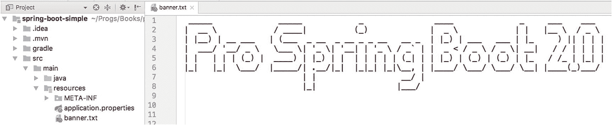

# 三、Spring Boot 内部结构和特点

在前一章，我简要介绍了 Spring Boot，创建 Spring Boot 应用的主要组件，并讨论了使用 Spring Initializr 创建 Spring Boot 项目是多么容易。

在这一章中，我将向您展示当 Spring Boot 启动您的应用时，在幕后发生了什么。一切都是关于自动配置！我从 Groovy 脚本开始(同样，您可以跳到附录部分并安装 Spring Boot CLI)。我使用一个普通的 Java 项目，就像第二章中的 Spring Boot 应用一样。让我们从学习自动配置是如何工作的开始。

## 自动配置

自动配置是 Spring Boot 的重要特性之一，因为它根据类路径、注释和任何其他配置声明(如 JavaConfig 类或 XML)来配置您的 Spring Boot 应用。

清单 3-1 是前几章中的同一个例子，但是在这种情况下，我用它来解释当 Spring Boot 运行它时在幕后发生了什么。

```java
@RestController
class WebApp{

    @GetMapping('/')
    String index(){
        "Spring Boot Rocks"
   }
}

Listing 3-1app.groovy

```

您可以使用 Spring Boot CLI(命令行界面)运行此程序

```java
$ spring run app.groovy

```

Spring Boot 不会生成任何源代码，但它会动态添加一些。这是 Groovy 的优势之一:您可以在运行时访问 AST(抽象语法树)。Spring Boot 从导入缺失的依赖项开始，比如`org.springframework.web.bind.annotation.RestController`注释，以及其他导入。

接下来，它确定您需要一个 *spring-boot-starter-web* (我将在接下来的章节中详细讨论)，因为您分别用`@RestController`和`@GetMapping`注释标记了您的类和方法。它给代码添加了`@Grab("spring-boot-web-starter")`注释(对于 Groovy 脚本中的导入很有用)。

接下来，它添加了触发自动配置的必要注释，即`@EnableAutoConfiguration`注释(稍后，我会谈到这个注释，它恰好是 Spring Boot 背后的*魔法)，然后它添加了作为应用入口点的 main 方法。您可以在清单 3-2 中看到结果代码。*

```java
import org.springframework.web.bind.annotation.RestController

// Other Imports

@Grab("spring-boot-web-starter")

@EnableAutoConfiguration

@RestController
class WebApp{
   @GetMapping("/")
    String greetings(){
        "Spring Boot Rocks"
   }

   public static void main(String[] args) {
        SpringApplication.run(WebApp.class, args);
   }
}

Listing 3-2app.groovy Modified by Spring Boot

```

清单 3-2 显示了 Spring Boot 运行的实际修改后的程序。您可以看到自动配置是如何工作的，但是通过运行带有- debug 参数的清单 3-1 。让我们来看看。

```java
$ spring run app.groovy --debug
...
DEBUG 49009 --- [] autoConfigurationReportLoggingInitializer :
=========================
AUTO-CONFIGURATION REPORT
=========================

Positive matches:
-----------------
//You will see all the conditions that were met to enable a Web application. And this is because you have the //@RestController annotation.

Negative matches:
-----------------
//You will find all the conditions that failed. For example you will find that the ActiveMQAutoConfiguration class did //not match, because you don't have any reference of the ActiveMQConnectionFactory.

```

在终端中查看该命令的输出。请注意 Spring Boot 在运行这个简单的应用之前所做的所有正面和负面匹配。因为您正在运行 Spring Boot CLI，所以它会尝试猜测您想要运行哪种应用。当你创建一个 Maven 或者 Gradle 项目，并且你指定了依赖关系(`pom.xml`或者`build.gradle`)，你就在帮助 Spring Boot 根据你的依赖关系做出决定。

### 禁用特定的自动配置

在第二章中，我谈到了`@SpringBootApplication`注释，它是 Spring Boot 应用的主要组件之一。这个注释相当于声明了`@Configuration`、`@ComponentScan`和`@EnableAutoConfiguration`注释。我为什么要提这个？因为您可以通过在类中使用`@EnableAutoConfiguration`或`@SpringBootApplication`注释添加`exclude`参数来禁用特定的自动配置。让我们看看清单 3-3 中 Groovy 脚本的一个例子。

```java
import org.springframework.boot.autoconfigure.jms.activemq.ActiveMQAutoConfiguration

@RestController
@EnableAutoConfiguration(exclude=[ActiveMQAutoConfiguration.class])
class WebApp{

    @RequestMapping("/")
        String greetings(){
             "Spring Boot Rocks"
        }
}

Listing 3-3
app.groovy

```

清单 3-3 显示了具有 exclude 参数的`@EnableAutoConfiguration`注释。此参数接收自动配置类的数组。如果您使用下面的代码再次运行此操作，您会看到您所做的操作被排除。

```java
$ spring run app.groovy --debug
...
Exclusions:
-----------

   org.springframework.boot.autoconfigure.jms.activemq.ActiveMQAutoConfiguration
...

```

当您希望 Spring Boot 跳过某些不必要的自动配置 *s* 时，这对于 Groovy 脚本来说是一项非常有用的技术。

让我们看看如何在 Java Spring Boot 应用上使用它(参见清单 3-4 )。

```java
package com.example;

import org.springframework.boot.SpringApplication;
import org.springframework.boot.autoconfigure.SpringBootApplication;
import org.springframework.boot.autoconfigure.jdbc.DataSourceAutoConfiguration;
import org.springframework.boot.autoconfigure.jms.activemq.ActiveMQAutoConfiguration;

@SpringBootApplication(exclude={ActiveMQAutoConfiguration.class,DataSourceAutoConfiguration.class})

public class DemoApplication {

      public static void main(String[] args) {
            SpringApplication.run(DemoApplication.class, args);
      }
}

Listing 3-4DemoApplication.java: Spring Boot Snippet

```

清单 3-4 显示了一个 Java 版本；在这个例子中，主类只声明了`@SpringBootApplication`注释，在这个注释中，您可以排除自动配置类。清单 3-4 显示了两个被排除的类:`ActiveMQAutoConfiguration`和`DataSourceAutoConfiguration`。为什么不使用`@EnableAutoConfiguration`标注？记住，`@SpringBootApplication`注释继承了`@EnableAutoConfiguration`、`@Configuration`和`@ComponentScan`，这就是为什么您可以在`@SpringBootApplication`注释中使用 exclude 参数。

当使用 debug 选项运行 Maven 或 Gradle 项目(使用示例清单 3-4 )时，您会在控制台输出中看到如下内容:

```java
...
Exclusions:
-----------

   org.springframework.boot.autoconfigure.jms.activemq.ActiveMQAutoConfiguration
   org.springframework.boot.autoconfigure.jdbc.DataSourceAutoConfiguration
...

```

### @EnableAutoConfiguration 和@Enable <technology>批注</technology>

Spring 框架及其部分模块，如 Spring Data、Spring AMQP、Spring Integration，提供了`@Enable<Technology>`注解；例如，`@EnableTransactionManagement`、`@EnableRabbit`和`@EnableIntegration`就是上述模块的一部分。在 Spring 应用中，您可以使用这些注释来遵循配置模式上的*约定，使您的应用更容易开发和维护，而不必太担心它的配置。*

Spring Boot 利用这些注释，在`@EnableAutoConfiguration`注释中使用它们来进行自动配置。让我们仔细看看`@EnableAutoConfiguration`注释，看看它背后的逻辑以及`@Enable<Technology>`注释适合在哪里(参见清单 3-5 )。

```java
...
@AutoConfigurationPackage
@Import(AutoConfigurationImportSelector.class)
public @interface EnableAutoConfiguration {

      Class<?>[] exclude() default {};

      String[] excludeName() default {};

}

Listing 3-5org.springframework.boot.autoconfigure.EnableAutoConfiguration.java

```

清单 3-5 显示了`@EnableAutoConfiguration`标注；正如您已经知道的，这个类试图配置您的应用可能需要的 beans。自动配置类是基于*类路径*和应用定义的 beans 来应用的，但是这使得寻找所有必要配置类的`org.springframework.boot.autoconfigure.AutoConfigurationImportSelector`类更加强大。

`AutoConfigurationImportSelector`类有几个方法，但是对于自动配置最重要的一个是`getCandidateConfigurations`方法(参见清单 3-6 )。

```java
...
protected List<String> getCandidateConfigurations(AnnotationMetadata metadata,
                  AnnotationAttributes attributes) {
  List<String> configurations = SpringFactoriesLoader.loadFactoryNames(
      getSpringFactoriesLoaderFactoryClass(),
                                          getBeanClassLoader());
      Assert.notEmpty(configurations,
"No auto configuration classes found in META-INF/spring.factories. If you
are using a custom packaging, make sure that file is correct.");
      return configurations;
}
...

Listing 3-6org.springframework.boot.autoconfigure.AutoConfigurationImportSelector Snippet

```

清单 3-6 展示了`AutoConfigurationImportSelector`类的一个片段，其中`getCandidateConfigurations`方法返回一个`SpringFactoriesLoader.loadFactoryNames`。`SpringFactoriesLoader.loadFactoryNames`寻找`spring-boot-autoconfigure` jar 中定义的`META-INF/spring.factories`(参见清单 3-7 了解其内容)。

```java
# Initializers
org.springframework.context.ApplicationContextInitializer=\
org.springframework.boot.autoconfigure.SharedMetadataReaderFactoryContextInitializer,\
org.springframework.boot.autoconfigure.logging.ConditionEvaluationReportLoggingListener

# Application Listeners
org.springframework.context.ApplicationListener=\
org.springframework.boot.autoconfigure.BackgroundPreinitializer

# Auto Configure
org.springframework.boot.autoconfigure.EnableAutoConfiguration=\
org.springframework.boot.autoconfigure.admin.SpringApplicationAdminJmxAutoConfiguration,\
org.springframework.boot.autoconfigure.aop.AopAutoConfiguration,\
org.springframework.boot.autoconfigure.amqp.RabbitAutoConfiguration,\
org.springframework.boot.autoconfigure.MessageSourceAutoConfiguration,\
org.springframework.boot.autoconfigure.PropertyPlaceholderAutoConfiguration,\
org.springframework.boot.autoconfigure.batch.BatchAutoConfiguration,\
org.springframework.boot.autoconfigure.cache.CacheAutoConfiguration,\
org.springframework.boot.autoconfigure.cassandra.CassandraAutoConfiguration,\
org.springframework.boot.autoconfigure.cloud.CloudAutoConfiguration,\
....
....

Listing 3-7spring-boot-autoconfigure-<version>.jar/META-INF/spring.factories Snippet

```

从清单 3-7 中可以看出，`spring.factories`定义了所有的自动配置类，用于设置应用运行所需的任何配置。让我们来看看`CloudAutoConfiguration`级(见清单 3-8 )。

```java
package org.springframework.boot.autoconfigure.cloud;

import org.springframework.boot.autoconfigure.AutoConfigureOrder;
import org.springframework.boot.autoconfigure.EnableAutoConfiguration;
import org.springframework.boot.autoconfigure.condition.ConditionalOnClass;
import org.springframework.boot.autoconfigure.condition.ConditionalOnMissingBean;
import org.springframework.boot.autoconfigure.condition.ConditionalOnProperty;
import org.springframework.cloud.Cloud;
import org.springframework.cloud.app.ApplicationInstanceInfo;
import org.springframework.cloud.config.java.CloudScan;
import org.springframework.cloud.config.java.CloudScanConfiguration;
import org.springframework.context.annotation.Configuration;
import org.springframework.context.annotation.Import;
import org.springframework.context.annotation.Profile;
import org.springframework.core.Ordered;

@Configuration
@Profile("cloud")
@AutoConfigureOrder(CloudAutoConfiguration.ORDER)
@ConditionalOnClass(CloudScanConfiguration.class)
@ConditionalOnMissingBean(Cloud.class)
@ConditionalOnProperty(prefix = "spring.cloud", name = "enabled", havingValue = "true", matchIfMissing = true)
@Import(CloudScanConfiguration.class)
public class CloudAutoConfiguration {

      // Cloud configuration needs to happen early (before data, mongo etc.)
      public static final int ORDER = Ordered.HIGHEST_PRECEDENCE + 20;

}

Listing 3-8org.springframework.boot.autoconfigure.cloud.CloudAutoConfiguration.java

```

清单 3-8 向您展示了`CloudAutoConfiguration`类。如您所见，这是一个非常短的类，但是如果它在应用类路径中找到 spring-cloud 类，它就配置了一个云应用，但是如何配置呢？它使用`@ConditionalOnClass`和`@ConditionalOnMissingBean`注释来决定应用是否是云应用。不要太担心这个，因为在本书的章节*扩展 Spring Boot* 中，当你创建自己的自动配置类时，你会用到这些注释。

在清单 3-8 中要看到的另一件事是`@ConditionalOnProperty`注释的使用，这仅在属性`spring.cloud`被启用时才适用。值得一提的是，这种自动配置是在云配置文件中执行的，由`@Profile`标注表示。只有当其他注释满足它们的条件时，才会应用`@Import`注释(使用`(@Conditional*`注释)，这意味着如果类路径中有`spring-cloud-*`类，就会执行`CloudScanConfiguration`类的导入。我会在第十三章中详细介绍。现在，您需要理解自动配置使用您的类路径来决定为您的应用配置什么。这就是为什么我们说 Spring Boot 是一个*固执己见的运行时*，还记得吗？

## Spring Boot 特色

在这一部分，我将向您展示 Spring Boot 的一些特性。Spring Boot 是高度可定制的，从设置应用的自动配置(基于类路径)到定制它如何启动、显示什么以及基于它自己的属性启用或禁用什么。因此，让我们来了解一些定制您的 Spring 应用的 Spring Boot 功能。

让我们使用 Spring Boot 的 Initializr 创建一个 Spring Boot Java 项目。打开浏览器，进入 [`https://start.spring.io`](https://start.spring.io) 。将以下值添加到字段中。请确保单击“切换到完整版本”字段，以便您可以修改软件包名称。

*   组:`com.apress.spring`

*   神器:`spring-boot-simple`

*   名称:`spring-boot-simple`

*   包名:`com.apress.spring`

您可以选择 Maven 或 Gradle 项目类型。然后点击 Generate Project 按钮，下载一个 ZIP 文件。将它解压缩到您喜欢的任何地方，并将其导入到您喜欢的 IDE 中(参见图 3-1 )。


图 3-1

Spring Boot 项目

### 注意

您可以从 Apress 网站下载源代码，在每个项目中您都可以找到 Maven pom.xml 和 Gradle build.gradle 文件，因此您可以选择您想要使用的构建工具。

现在，运行 Spring Boot 应用。如果您使用的是 Maven，请使用您的 IDE 或打开一个终端并执行以下命令。

```java
$ ./mvnw spring-boot:run

```

如果你使用的是 Gradle，你可以执行

```java
$ ./gradlew bootRun

  .   ____          _            __ _ _
 /\\ / ___'_ __ _ _(_)_ __  __ _ \ \ \ \
( ( )\___ | '_ | '_| | '_ \/ _` | \ \ \ \
 \\/  ___)| |_)| | | | | || (_| |  ) ) ) )
  '  |____| .__|_| |_|_| |_\__, | / / / /
 =========|_|==============|___/=/_/_/_/
 :: Spring Boot ::        (v2.0.0.RELEASE)

INFO 10669 --- [    main] c.a.spring.SpringBootSimpleApplication   : Starting SpringBootSimpleApplication on ...
INFO 10669 --- [    main] c.a.spring.SpringBootSimpleApplication   : No active profile set, falling back to default profiles: default
INFO 10669 --- [    main] s.c.a.AnnotationConfigApplicationContext : Refreshing org.springframework.context.annotation...
INFO 10669 --- [    main] o.s.j.e.a.AnnotationMBeanExporter        : Registering beans for JMX exposure on startup
INFO 10669 --- [    main] c.a.spring.SpringBootSimpleApplication   : Started SpringBootSimpleApplication in 1.582 seconds (JVM running for 4.518)
INFO 10669 --- [Thread-3] s.c.a.AnnotationConfigApplicationContext : Closing org.springframework.context.annotation...
INFO 10669 --- [Thread-3] o.s.j.e.a.AnnotationMBeanExporter        : Unregistering JMX-exposed beans on shutdown

```

您应该会看到类似于以下输出的内容。它展示了一面旗帜(Spring Boot)和一些日志。让我们看看清单 3-9 中的主要应用。

```java
package com.apress.spring;

import org.springframework.boot.SpringApplication;
import org.springframework.boot.autoconfigure.SpringBootApplication;

@SpringBootApplication
public class SpringBootSimpleApplication {

      public static void main(String[] args) {
            SpringApplication.run(SpringBootSimpleApplication.class, args);
      }
}

Listing 3-9src/main/java/com/apress/spring/SpringBootSimpleApplication.java

```

清单 3-9 显示了主应用。您已经从上一章了解了 Spring Boot 组件，但是让我们再回顾一下。

*   `@SpringBootApplication`。这个注释实际上是`@ComponentScan`、`@Configuration`和`@EnableAutoConfiguration`注释。从前面的章节中你已经了解了关于`@EnableAutoConfiguration`的一切。

*   `SpringApplication`。这个类为在 main 方法中执行的 Spring Boot 应用提供了引导。您需要传递被执行的类。

现在，您可以开始定制 Spring Boot 应用了。

### SpringApplication 类

您可以使用`SpringApplication`进行更高级的配置，因为您可以用它创建一个实例并做更多的事情(参见清单 3-10 )。

```java
package com.apress.spring;

import org.springframework.boot.SpringApplication;
import org.springframework.boot.autoconfigure.SpringBootApplication;

@SpringBootApplication
public class SpringBootSimpleApplication {

    public static void main(String[] args) {

      SpringApplication app =
            new SpringApplication(SpringBootSimpleApplication.class);
            //add more features here.
           app.run(args);
      }
}

Listing 3-10src/main/java/com/apress/spring/SpringBootSimpleApplication.java Version 2

```

`SpringApplication`允许你配置你的应用的行为方式，并且你可以控制所有 Spring beans 使用的主`ApplicationContext`。如果你需要了解更多关于`ApplicationContext`以及如何使用它，我推荐*Pro Spring Framework 5*(a press，2017)，其中作者解释了关于 Spring 的一切。在这种情况下，我们重点关注 Spring Boot 的一些特性。让我们从酷的东西开始。

### 自定义横幅

每次运行应用时，您都会在应用的开头看到一个横幅。它可以用不同的方式定制。

实现`org.springframework.boot.Banner`接口(参见清单 3-11 )。

```java
package com.apress.spring;

import java.io.PrintStream;

import org.springframework.boot.Banner;
import org.springframework.boot.SpringApplication;
import org.springframework.boot.autoconfigure.SpringBootApplication;
import org.springframework.core.env.Environment;

@SpringBootApplication
public class SpringBootSimpleApplication {

    public static void main(String[] args) {

      SpringApplication app = new SpringApplication(SpringBootSimpleApplication.class);
      app.setBanner(new Banner() {
            @Override
            public void printBanner(Environment environment, Class<?> sourceClass, PrintStream out) {
            out.print("\n\n\tThis is my own banner!\n\n".toUpperCase());
            }
      });
               app.run(args);
    }
}

Listing 3-11src/main/java/com/apress/spring/SpringBootSimpleApplication.java Version 3

```

当您运行该应用时，您会看到类似这样的内容:

```java
$ ./mvnw spring-boot:run

      THIS IS MY OWN BANNER!

INFO[main] c.a.spring.SpringBootSimpleApplication   : Starting SpringBootSimpleApplication ...
...
...
INFO[main] c.a.spring.SpringBootSimpleApplication   : Started SpringBootSimpleApplication in 0.789seconds (JVM running for 4.295)
INFO[Th-1] s.c.a.AnnotationConfigApplicationContext : Closing org.springframework.context.annotation.AnnotationConfigApplicationContext@203f6b5: startup date [Thu Feb 25 19:00:34 MST 2016]; root of context hierarchy
INFO[Th-1] o.s.j.e.a.AnnotationMBeanExporter        : Unregistering JMX-exposed beans on shutdown

```

您可以创建自己的 ASCII 横幅并显示它。怎么做？有一个很酷的站点，从文本( [`http://patorjk.com`](http://patorjk.com) )创建 ASCII 艺术，如图 3-2 。


图 3-2

文本到 ASCII 艺术生成器

图 3-2 所示为 [`http://patorjk.com`](http://patorjk.com) 的网站。点击*文本到 ASCII 艺术生成器*链接。然后，在文本字段中添加 **Pro Spring Boot 2.0** (或者任何你想要的东西)。然后，点击*测试所有*以查看所有 ASCII 艺术(参见图 3-3 )。


图 3-3

ASCII 类型

图 3-3 显示了所有的 ASCII 艺术(约 314)。现在，您可以选择一个。点击选择文本按钮，复制(Ctrl+C Windows/Cmd+C macOS)它，在`src/main/resources/`目录下创建一个名为`banner.txt`的文件(见图 3-4 )。



图 3-4

src/main/resource/banner.txt 内容

您可以再次运行您的应用。

```java
$ ./mvnw spring-boot:run

```

您会看到您在`banner.txt`文件中添加的 ASCII 图片。如果您使用清单 3-11 (您设置横幅的地方)运行您的应用，它会覆盖它并使用您的类路径中的`banner.txt`文件；这是默认的。

默认情况下，Spring Boot 在类路径中查找`banner.txt`文件。但是你可以改变它的位置。在`src/main/resources/META-INF/`目录下创建另一个`banner.txt`文件(或者复制你已经有的文件)。通过传递一个`-D`参数来运行应用。如果您使用的是 Maven，请执行以下命令。

```java
$ ./mvnw spring-boot:run -Dspring.banner.location=classpath:/META-INF/banner.txt

```

如果你正在使用 Gradle，你需要首先在`build.gradle`文件的末尾添加这个配置。

```java
bootRun {
    systemProperties = System.properties
}

```

执行以下命令。

```java
$ ./gradlew bootRun -Dspring.banner.location=classpath:/META-INF/banner.txt

```

这个命令使用标志`-D`来传递指向新的类路径位置`/META-INF/banner.txt`的`spring.banner.location`属性。您可以在`src/main/resources/application.properties`文件中声明这个属性，如下所示。

```java
spring.banner.location=classpath:/META-INF/banner.txt

```

如果使用 Maven，就像这样运行它:

```java
$ ./mvnw spring-boot:run

```

如果您使用的是 Gradle，请像这样运行它:

```java
$ ./gradlew bootRun

```

设置`banner.txt`文件有几个选项。

您可以完全移除横幅。你可以在`src/main/resources/application.properties`中这样定义它:

```java
spring.main.banner-mode=off

```

该命令优先于位于`classpath:banner.txt`位置的默认`banner.txt`文件。此外，您可以通过编程来实现(只需记住注释掉该属性)(参见清单 3-12 )。

```java
package com.apress.spring;

import org.springframework.boot.Banner;
import org.springframework.boot.SpringApplication;
import org.springframework.boot.autoconfigure.SpringBootApplication;

@SpringBootApplication
public class SpringBootSimpleApplication {

      public static void main(String[] args) {
            SpringApplication app = new SpringApplication(SpringBootSimpleApplication.class);
              app.setBannerMode(Banner.Mode.OFF);
              app.run(args);
      }
}

Listing 3-12src/main/java/com/apress/spring/SpringBootSimpleApplication.java Version 4

```

### SpringApplicationBuilder

`SpringApplicationBuilder`类提供了一个流畅的 API，并且是`SpringApplication`和`ApplicationContext`实例的构建器。它还提供了层次支持，并且我到目前为止向你展示的所有东西(用`SpringApplication`)都可以用这个构建器来设置(见清单 3-13 )。

```java
package com.apress.spring;

import org.springframework.boot.Banner;
import org.springframework.boot.autoconfigure.SpringBootApplication;
import org.springframework.boot.builder.SpringApplicationBuilder;

@SpringBootApplication
public class SpringBootSimpleApplication {

      public static void main(String[] args) {
        new SpringApplicationBuilder()
            .bannerMode(Banner.Mode.OFF)
            .sources(SpringBootSimpleApplication.class)
            .run(args);
      }
}

Listing 3-13src/main/java/com/apress/spring/SpringBootSimpleApplication.java Version 5

```

清单 3-13 展示了`SpringAplicationBuilder` fluent API。接下来，我们来看更多的例子。

创建 Spring 应用时，可以有一个层次结构。(如果想了解更多 Spring 的应用上下文，我推荐 *Pro Spring* 第五版。)可以用 SpringApplicationBuilder 创建。

```java
new SpringApplicationBuilder(SpringBootSimpleApplication.class)
            .child(OtherConfig.class)
            .run(args);

```

如果您有一个 web 配置，请确保它被声明为子配置。此外，父节点和子节点必须共享相同的`org.springframework.core.env.Environment`接口(这代表当前应用运行的环境；它与概要文件和属性声明相关)。

您可以在启动时记录信息；默认情况下，它被设置为 true。

```java
new SpringApplicationBuilder(SpringBootSimpleApplication.class)
            .logStartupInfo(false)
            .run(args);

```

您可以激活配置文件。

```java
new SpringApplicationBuilder(SpringBootSimpleApplication.class)
            .profiles("prod","cloud")
            .run(args);

```

稍后，我将向您展示概要文件，以便您能够理解前面的行。

您可以为一些`ApplicationEvent`事件附加监听器。

```java
Logger log = LoggerFactory.getLogger(SpringBootSimpleApplication.class);
new SpringApplicationBuilder(SpringBootSimpleApplication.class)
      .listeners(new ApplicationListener<ApplicationEvent>() {
      @Override
      public void onApplicationEvent(ApplicationEvent event) {
                   log.info("#### > " + event.getClass().getCanonicalName());
             }

            })
      .run(args);

```

当您运行应用时，您应该会看到以下输出。

```java
...
#### > org.springframework.boot.context.event.ApplicationPreparedEvent
...
#### > org.springframework.context.event.ContextRefreshedEvent
#### > org.springframework.boot.context.event.ApplicationReadyEvent
...
#### > org.springframework.context.event.ContextClosedEvent
...

```

您的应用可以添加必要的逻辑来处理这些事件。您还可以拥有这些额外的事件:`ApplicationStartedEvent`(这在开始时发送)、`ApplicationEnvironmentPreparedEvent`(这在环境已知时发送)、`ApplicationPreparedEvent`(这在 bean 定义之后发送)、`ApplicationReadyEvent`(这在应用准备就绪时发送)、以及`ApplicationFailedEvent`(这在启动期间出现异常时发送)。我向您展示了输出中的另一个(与 Spring 容器更相关)。

您可以阻止任何 web 环境自动配置的发生。请记住，Spring Boot 根据类路径猜测您正在运行哪种应用。对于一个 web app 来说，算法很简单；但是想象一下，你使用的库实际上是在没有 web 环境的情况下运行的，你的应用不是 web 应用，但是 Spring Boot 把它配置成 web 应用。

```java
new SpringApplicationBuilder(SpringBootSimpleApplication.class)
            .web(WebApplicationType.NONE)
            .run(args);

```

你发现`WebApplicationType`是一个枚举。您的应用可以配置为`WebApplicationType.NONE`、`WebApplicationType.SERVLET`和`WebApplicationType.REACTIVE`。如你所见，它的意思很简单。

### 应用参数

Spring Boot 允许您将参数传递给应用。当您拥有`SpringApplication.run(SpringBootSimpleApplication.class, args)`时，您可以访问 beans 中的参数(参见清单 3-14 )。

```java
package com.apress.spring;

import java.io.IOException;
import java.util.List;

import org.slf4j.Logger;
import org.slf4j.LoggerFactory;
import org.springframework.beans.factory.annotation.Autowired;
import org.springframework.boot.ApplicationArguments;
import org.springframework.boot.SpringApplication;
import org.springframework.boot.autoconfigure.SpringBootApplication;
import org.springframework.stereotype.Component;

@SpringBootApplication
public class SpringBootSimpleApplication {

      public static void main(String[] args) throws IOException {
            SpringApplication.run(SpringBootSimpleApplication.class, args);
      }
}

@Component
class MyComponent {

   private static final Logger log = LoggerFactory.getLogger(MyComponent.class);

   @Autowired
   public MyComponent(ApplicationArguments args) {
        boolean enable = args.containsOption("enable");
        if(enable)
            log.info("## > You are enabled!");

        List<String> _args = args.getNonOptionArgs();
           log.info("## > extra args ...");
        if(!_args.isEmpty())
           _args.forEach(file -> log.info(file));
   }
}

Listing 3-14src/main/java/com/apress/spring/SpringBootSimpleApplication.java -version 6

```

当您执行`containsOption`时，它期望参数是`--<arg>`。在清单 3-14 中，期待的是`--enable`的说法；`getNonOptionArgs`接受其他参数。要测试它，您可以执行下面的命令。

```java
$ ./mvnw spring-boot:run -Dspring-boot.run.arguments="--enable"

```

你应该看看`## > You are enabled`。

此外，您可以像这样运行它:

```java
$ ./mvnw spring-boot:run -Dspring-boot.run.arguments="arg1,arg2"

```

如果你正在使用 Gradle(在撰写本文时)，你需要等待一段时间，因为传递参数仍然是一个问题(见[`https://github.com/spring-projects/spring-boot/issues/1176`](https://github.com/spring-projects/spring-boot/issues/1176))；但是您可以在可执行的 jar 中传递一个参数，我将在下一节中对此进行描述。

#### 使用可执行 JAR 访问参数

您可以选择创建一个独立的应用——一个可执行的 JAR(您将了解到更多相关内容)。要创建一个可执行的 JAR，如果您使用的是 Maven，请执行下面的命令。

```java
$ ./mvnw package

```

这个命令在`target`目录中创建可执行的 JAR。

或者，如果您使用的是 Gradle，您可以执行

```java
$./gradlew build

```

这个命令在`build/libs`目录中创建一个可执行的 JAR。

现在您可以运行可执行的 JAR 了。

```java
$ java -jar spring-boot-simple-0.0.1-SNAPSHOT.jar

```

您可以像这样传递参数:

```java
$ java -jar spring-boot-simple-0.0.1-SNAPSHOT.jar --enable arg1 arg2

```

您应该得到相同的文本作为参数`enable`和列表`arg1`和`arg2`。

## ApplicationRunner 和 CommandLineRunner

如果你在执行完`SpringApplication`后注意到 Spring Boot，它就结束了。如果您很好奇，在这个类被执行后，您不能使用 beans，但是有一个解决方案。Spring Boot 有公开运行方法的`ApplicationRunner`和`CommandLineRunner`接口(参见清单 3-15 )。

```java
package com.apress.spring;

import java.io.IOException;

import org.slf4j.Logger;
import org.slf4j.LoggerFactory;
import org.springframework.beans.factory.annotation.Autowired;
import org.springframework.boot.ApplicationArguments;
import org.springframework.boot.ApplicationRunner;
import org.springframework.boot.CommandLineRunner;
import org.springframework.boot.SpringApplication;
import org.springframework.boot.autoconfigure.SpringBootApplication;
import org.springframework.context.annotation.Bean;

@SpringBootApplication
public class SpringBootSimpleApplication implements CommandLineRunner, ApplicationRunner{
      private static final Logger log = LoggerFactory.getLogger(SpringBootSimpleApplication.class);

      public static void main(String[] args) throws IOException {

            SpringApplication.run(SpringBootSimpleApplication.class, args);

      }

@Bean
      String info(){
            return "Just a simple String bean";
      }

      @Autowired
      String info;

      @Override
      public void run(ApplicationArguments args) throws Exception {
            log.info("## > ApplicationRunner Implementation...");
            log.info("Accessing the Info bean: " + info);
            args.getNonOptionArgs().forEach(file -> log.info(file));
      }
      @Override
      public void run(String... args) throws Exception {
            log.info("## > CommandLineRunner Implementation...");
            log.info("Accessing the Info bean: " + info);
            for(String arg:args)
                  log.info(arg);
      }
}

Listing 3-15src/main/java/com/apress/spring/SpringBootSimpleApplication.java Version 7

```

清单 3-15 显示了`CommandLineRunner`和`ApplicationRunner`以及它们的实现。`CommandLineRunner`曝光`public void run(String... args)`方法，`ApplicationRunner`曝光`public void run(ApplicationArguments args)`方法。他们实际上是一样的。没有必要同时实现这两者。清单 3-16 显示了使用`CommandLineRunner`接口的另一种方式。

```java
package com.apress.spring;

import java.io.IOException;

import org.slf4j.Logger;
import org.slf4j.LoggerFactory;
import org.springframework.beans.factory.annotation.Autowired;
import org.springframework.boot.CommandLineRunner;
import org.springframework.boot.SpringApplication;
import org.springframework.boot.autoconfigure.SpringBootApplication;
import org.springframework.context.annotation.Bean;

@SpringBootApplication
public class SpringBootSimpleApplication {
      private static final Logger log = LoggerFactory.getLogger(SpringBootSimpleApplication.class);

      public static void main(String[] args) throws IOException {

            SpringApplication.run(SpringBootSimpleApplication.class, args);

      }

      @Bean
      String info(){
            return "Just a simple String bean";
      }

      @Autowired
      String info;

      @Bean
      CommandLineRunner myMethod(){
            return args -> {
                  log.info("## > CommandLineRunner Implementation...");
                  log.info("Accessing the Info bean: " + info);
                  for(String arg:args)
                        log.info(arg);
            };
      }
}

Listing 3-16src/main/java/com/apress/spring/SpringBootSimpleApplication.java Version 8

```

清单 3-16 显示了一个用`@Bean`注释的方法，返回一个`CommandLineRunner`实现。这个例子使用 Java 8 语法(lambda)进行返回。您可以添加任意多的返回`CommadLineRunner`的方法。如果您想以某种顺序执行，您可以使用`@Order`注释。

### 应用配置

我们开发人员知道我们永远不会摆脱应用配置。我们总是寻找持久存储的位置，例如 URL、IP、凭证、数据库信息等等——我们通常在应用中经常使用的数据。我们知道，作为一种最佳实践，我们需要避免对这种配置信息进行硬编码。我们需要外部化，以便它可以安全、易于使用和部署。

使用 Spring，您可以选择使用 XML 和`<context:property-placeholder/>`标签，或者您可以使用`@PropertySource`注释来声明您的属性，并指向声明它们的文件。Spring Boot 为你提供了同样的机制，但有更多的改进。

*   Spring Boot 为您提供了不同的选项来保存您的应用配置。
    *   您可以使用名为`application.properties`的文件，该文件应该位于应用的根类路径中。(您可以在更多选项中添加该文件，稍后我将向您展示。)

    *   您可以使用名为`application.yml`的 YAML 符号文件，该文件也需要位于根类路径中。(您可以在更多选项中添加该文件，稍后我将向您展示。)

    *   您可以使用环境变量。这正在成为云场景的默认实践。

    *   您可以使用命令行参数。

请记住，Spring Boot 是一种固执己见的技术。它的大部分应用配置都是基于一个通用的`application.properties`或`application.yml`文件。如果没有指定，它已经将这些属性值作为默认值。您可以在 [`https://docs.spring.io/spring-boot/docs/current/reference/html/common-application-properties.html`](https://docs.spring.io/spring-boot/docs/current/reference/html/common-application-properties.html) 获得常用应用属性的完整列表。

Spring(和 Spring Boot)最好的特性之一是通过使用`@Value`注释(带有属性名)来访问属性值。或者可以从从`org.springframework.core.env.PropertyResolver`接口扩展而来的`org.springframework.core.env.Environment`接口访问它们。例如，如果您有一个带有

```java
data.server=remoteserver:3030

```

您可以通过使用`@Value`注释来访问应用中的`data.server`属性，如下面的代码片段所示。

```java
//...
@Service
public class MyService {

@Value("${data.server}")
private String server;

      //...
}

```

这段代码片段展示了`@Value`注释的用法。Spring Boot 将来自`application.properties`文件的`data.server`属性值注入到带有值`remoteserver:3030`的服务器变量中。

如果您不想使用`application.properties`，您可以选择通过命令行注入属性。

```java
$ java -jar target/myapp.jar --data.server=remoteserver:3030

```

你会得到同样的结果。如果您不喜欢`application.properties`文件或者您讨厌 YAML 语法，您可以使用一个名为`SPRING_APPLICATION_JSON`的专用环境变量来公开相同的属性及其值。

```java
$ SPRING_APPLICATION_JSON='{ "data":{"server":"remoteserver:3030"}}' java -jar target/myapp.jar

```

同样，你会得到同样的结果。(Windows 用户应该先使用`SET`指令设置环境变量。)因此，Spring Boot 为您提供了公开应用属性的选项。

### 配置属性示例

让我们创建一个简单的项目，帮助您更好地理解应用配置。打开浏览器，进入 [`https://start.spring.io`](https://start.spring.io) 。使用下列字段值。

*   组:`com.apress.spring`

*   ArtifactId: `spring-boot-config`

*   包名:`com.apress.spring`

*   名称:`spring-boot-config`

你可以选择任何你觉得舒服的项目类型。单击 Generate Project 按钮，保存 ZIP 文件，将其解压缩并导入到您喜欢的 IDE 中。

在继续项目之前，如果要覆盖应用配置属性，您必须知道 Spring Boot 使用了一个顺序:

*   命令行参数

*   SPRING _ 应用 _JSON

*   JNDI (java:comp/env)

*   System.getProperties()

*   操作系统环境变量

*   RandomValuePropertySource(随机值)。*)

*   特定于配置文件(应用-{profile})。jar)在包 jar 之外。

*   特定于配置文件(应用-{profile})。jar)在包装罐的内部。

*   包 jar 外部的应用属性(application.properties)。

*   包 jar 中的应用属性(application.properties)。

*   @财产来源

*   spring application . set default properties

如您所见，这是覆盖应用属性的顺序。先说几个例子。

#### 命令行参数

转到您的项目，编辑主类，看起来像清单 3-17 。

```java
package com.apress.spring;

import org.slf4j.Logger;
import org.slf4j.LoggerFactory;
import org.springframework.beans.factory.annotation.Value;
import org.springframework.boot.CommandLineRunner;
import org.springframework.boot.SpringApplication;
import org.springframework.boot.autoconfigure.SpringBootApplication;
import org.springframework.context.annotation.Bean;

@SpringBootApplication
public class SpringBootConfigApplication {

      private static Logger log = LoggerFactory.getLogger(SpringBootConfigApplication.class);

      public static void main(String[] args) {
            SpringApplication.run(SpringBootConfigApplication.class, args);
      }

      @Value("${server.ip}")
      String serverIp;

      @Bean
      CommandLineRunner values(){
            return args -> {
                  log.info(" > The Server IP is: " + serverIp);
            };
      }

}

Listing 3-17src/main/java/com/apress/spring/SpringBootConfigApplication.java

```

清单 3-17 显示了主类。如您所见，它使用了`@Value("${server.ip}")`注释。这个注释翻译文本`"${server.ip}"`。它按照我之前提到的顺序查找这个属性及其值。

您可以通过在项目的根目录下执行以下命令来运行此示例。

```java
$ ./mvnw spring-boot:run -Dserver.ip=192.168.12.1

```

如果您首先打包您的应用(创建一个可执行的 JAR ),然后如下运行它。

```java
$ /.mvnw package
$ java -jar target/spring-boot-config-0.0.1-SNAPSHOT.jar --server.ip=192.168.12.1

```

在这两种情况下，您都会看到类似于下面的输出。

```java
  .   ____          _            __ _ _
 /\\ / ___'_ __ _ _(_)_ __  __ _ \ \ \ \
( ( )\___ | '_ | '_| | '_ \/ _` | \ \ \ \
 \\/  ___)| |_)| | | | | || (_| |  ) ) ) )
  '  |____| .__|_| |_|_| |_\__, | / / / /
 =========|_|==============|___/=/_/_/_/
 :: Spring Boot ::        (v2.0.0.RELEASE)

INFO - [main] c.a.spring.SpringBootConfigApplication   : Starting SpringBootConfigApplication v0.0..
INFO - [main] c.a.spring.SpringBootConfigApplication   : No active profile set, falling back to de..
INFO - [main] s.c.a.AnnotationConfigApplicationContext : Refreshing org.springframework.context.an..
INFO - [main] o.s.j.e.a.AnnotationMBeanExporter        : Registering beans for JMX exposure on sta..
INFO - [main] c.a.spring.SpringBootConfigApplication   : Started SpringBootConfigApplication in 0...
INFO - [main] c.a.spring.SpringBootConfigApplication   :  > The Server IP is: 192.168.34.56
INFO - [main] c.a.spring.SpringBootConfigApplication   :  > App Name: My Config App
INFO - [main] c.a.spring.SpringBootConfigApplication   :  > App Info: This is an example
INFO - [ T-2] s.c.a.AnnotationConfigApplicationContext : Closing org.springframework.context.annot..
INFO - [ T-2] o.s.j.e.a.AnnotationMBeanExporter        : Unregistering JMX-exposed beans on shutdo...

```

从输出中可以看到这个:`> The Server IP is: 1921.68.12.1`。

现在，让我们创建`application.properties`文件(参见清单 3-18 了解其内容)。

```java
server.ip=192.168.23.4

Listing 3-18src/main/resources/application.properties

```

如果您使用相同的命令行参数运行应用，您会看到参数优先于来自`application.properties`文件的参数，但是如果您不使用参数运行它，如下所示。

```java
$ ./mvnw spring-boot:run

```

或者

```java
$ /.mvnw package
$ java -jar target/spring-boot-config-0.0.1-SNAPSHOT.jar

```

你得到了`textThe Server IP is: 192.168.3.4`。如果您做了大量的 JSON 格式化工作，也许您会对以这种格式传递属性感兴趣。您可以使用`spring.application.json`属性。所以，你可以这样运行它:

```java
$ ./mvnw spring-boot:run -Dspring.application.json='{"server":{"ip":"192.168.145.78"}}'

```

或者

```java
$ java -jar target/spring-boot-config-0.0.1-SNAPSHOT.jar --spring.application.json='{"server":{"ip":"192.168.145.78"}}'

```

您也可以将其作为环境变量添加。

```java
$ SPRING_APPLICATION_JSON='{"server":{"ip":"192.168.145.78"}}' java -jar target/spring-boot-config-0.0.1-SNAPSHOT.jar

```

你看正文`> The Server IP is: 192.168.145.78`。是的，您可以添加引用您的属性的环境变量，如下所示:

```java
$ SERVER_IP=192.168.150.46 ./mvnw spring-boot:run

```

或者

```java
$ SERVER_IP=192.168.150.46 java -jar target/spring-boot-config-0.0.1-SNAPSHOT.jar

```

你看正文`> The Server IP is: 192.168.150.46`。

### 注意

请记住，对于 Windows 用户，您需要使用`SET`指令来使用环境变量。

Spring Boot 如何知道环境变量与属性`server.ip`相关？

#### 宽松约束

Spring Boot 使用宽松的装订规则(见表 3-1 )。

表 3-1

Spring Boot 放松了约束

<colgroup><col class="tcol1 align-left"> <col class="tcol2 align-left"></colgroup> 
| 

财产

 | 

描述

 |
| --- | --- |
| message.destinationName | 标准骆驼箱 |
| 消息.目的地名称 | 虚线表示法，这是在 application.properties 或 YML 文件中添加的推荐方法。 |
| 消息目的地名称 | 大写，这是操作系统环境变量的推荐用法 |

表 3-1 显示了适用于酒店名称的宽松规则。这就是为什么在前面的例子中，`server.ip`属性也被识别为`SERVER_IP`。这个宽松的规则与`@ConfigurationProperties`注释及其前缀有关，您将在后面的章节中看到。

#### 更改位置和名称

Spring Boot 接到命令要找到`application.properties`或 YAML 的档案。

1.  它查看位于当前目录中的`/config`子目录。

2.  当前目录

3.  类路径/配置包

4.  类路径根

您可以通过在当前目录下创建一个`/config`子目录并添加一个新的`application.properties`来进行测试，并测试顺序是否正确。记住，您应该已经在类路径根(`src/main/resources`)中有了一个`application.properties`文件。

Spring Boot 允许您更改属性文件的名称及其位置。所以举个例子，假设你使用的是`/config`子目录，属性文件的名字现在是`mycfg.properties`(其内容:`server.ip=127.0.0.1`)。然后，您可以使用以下命令运行该应用。

```java
$./mvnw spring-boot:run -Dspring.config.name=mycfg

```

或者

```java
$ java -jar target/spring-boot-config-0.0.1-SNAPSHOT.jar --spring.config.name=mycfg

```

或者

```java
$ SPRING_CONFIG_NAME=mycfg java -jar target/spring-boot-config-0.0.1-SNAPSHOT.jar

```

你应该看到正文:`> The Server IP is: 127.0.0.1`。没有必要在名称中包含`.properties`；它会自动使用它。你也可以改变它的位置。比如创建一个名为`app`的子目录，添加一个`mycfg.properties`文件(其内容:`server.ip=localhost`)。然后，您可以运行或执行您的应用

```java
$ ./mvnw spring-boot:run -Dspring.config.name=mycfg -Dspring.config.location=file:app/

```

或者

```java
$ java -jar target/spring-boot-config-0.0.1-SNAPSHOT.jar --spring.config.location=file:app/ --spring.config.name=mycfg

```

或者您可以在`src/main/resources/META-INF/conf`中添加`mycfg.properties`(您可以创建它)并执行以下命令:

```java
$ mkdir -p src/main/resources/META-INF/conf
$ cp config/mycfg.properties src/main/resources/META-INF/conf/
$ ./mvnw clean spring-boot:run -Dspring.config.name=mycfg -Dspring.config.location=classpath:META-INF/conf/

```

您应该会看到文本`> The Server IP is: 127.0.0.1`。尝试更改该属性值，这样您就可以看到它实际上正在类路径中查找。

Spring Boot 也有搜索属性文件的命令。

1.  类路径

2.  类路径：/配置

3.  文件:

4.  文件:配置/

除非用`spring.config.location`属性来改变它，否则要设置哪个环境变量来改变属性文件的位置呢？就是`SPRING_CONFIG_LOCATION`。

#### 基于配置文件

如果我没弄错的话，从 3.1 版本开始，Spring 框架增加了一个很酷的特性，允许开发人员基于概要文件创建自定义属性和 beans。这是一种分离环境的有用方法，无需重新编译或打包 Spring 应用。唯一要做的事情是用`@ActiveProfiles`注释指定活动概要文件，或者获取当前环境并使用`setActiveProfiles`方法。或者你可以使用环境变量`SPRING_PROFILES_ACTIVE`，或者`spring.profiles.active`属性。

您可以使用以下格式的属性文件:`application-{profile}.properties`。让我们在你的`config/`子目录中创建两个文件:`application-qa.properties`和`application-prod.properties`。让我们看看每一个的内容。

*   应用-质量保证.属性

    ```java
    server.ip=localhost

    ```

*   应用产品属性

    ```java
    server.ip=http://my-remote.server.com

    ```

现在，您可以使用

```java
$ ./mvnw clean spring-boot:run -Dspring.profiles.active=prod

```

当您执行这个命令时，请看一下日志的开头。您应该会看到类似下面的输出。

```java
...
INFO 58270 --- [main] c.a.spring... : The following profiles are active: prod
...
INFO 58270 --- [main] c.a.spring... :  > The Server IP is: http://my-remote.server.com
INFO 58270 --- [main] c.a.spring... :  > App Name: Super App
INFO 58270 --- [main] c.a.spring... :  > App Info: This is production

```

您应该看到图例、`The following profiles are active: prod`，当然还有 profile 应用属性 active ( `application-prod.properties`)值:`> The Server IP is:` [`http://my-remote.server.com`](http://my-remote.server.com) 。作为练习，尝试将`application-prod.properties`的名称改为`mycfg-prod.properties`，将`application-qa.properties`的名称改为`mycfg-qa.properties`。使用获得新名称的 Spring 属性。如果您没有设置任何活动的概要文件，它将使用默认值，这意味着它会抓取`application.properties`。

### 自定义属性前缀

Spring Boot 允许你为你的属性编写和使用你自己的自定义属性前缀。您唯一需要做的事情就是用`@ConfigurationPropertie` s 注释进行注释，这是一个 Java 类，它的属性是 setters 和 getters。

如果您正在使用 STS IDE，我建议在您的`pom.xml`或`build.gradle`文件中包含一个依赖项(取决于您正在使用哪个依赖项管理器)。这种依赖关系创建了一个代码洞察，它触发了属性编辑器的代码完成。所以如果你使用 Maven，你可以在你的`pom.xml`文件中添加下一个依赖项。

```java
<dependency>
      <groupId>org.springframework.boot</groupId>
      <artifactId>spring-boot-configuration-processor</artifactId>
      <optional>true</optional>
</dependency>

```

如果您正在使用 Gradle，您可以将以下依赖项添加到您的`build.gradle`文件中。

```java
dependencies {
      optional "org.springframework.boot:spring-boot-configuration-processor"
}

compileJava.dependsOn(processResources)

```

这种依赖关系允许您处理自定义属性并完成代码。现在，让我们看看这个例子。修改您的`src/main/resource/application.properties`文件，看起来像清单 3-19 。

```java
server.ip=192.168.3.5

myapp.server-ip=192.168.34.56
myapp.name=My Config App
myapp.description=This is an example

Listing 3-19src/main/resources/application.properties

```

清单 3-19 显示了`application.properties`文件。第二块是新的。它定义了以`myapp`为前缀的自定义属性。打开您的主应用类，将其编辑成清单 3-20 所示的样子。

```java
package com.apress.spring;

import org.slf4j.Logger;
import org.slf4j.LoggerFactory;
import org.springframework.beans.factory.annotation.Autowired;
import org.springframework.beans.factory.annotation.Value;
import org.springframework.boot.CommandLineRunner;
import org.springframework.boot.SpringApplication;
import org.springframework.boot.autoconfigure.SpringBootApplication;
import org.springframework.boot.context.properties.ConfigurationProperties;
import org.springframework.context.annotation.Bean;
import org.springframework.stereotype.Component;

@SpringBootApplication
public class SpringBootConfigApplication {

      private static Logger log = LoggerFactory.getLogger(SpringBootConfigApplication.class);

      public static void main(String[] args) {
            SpringApplication.run(SpringBootConfigApplication.class, args);
      }

      @Value("${myapp.server-ip}")
      String serverIp;

      @Autowired
      MyAppProperties props;

      @Bean
      CommandLineRunner values(){
            return args -> {
                  log.info(" > The Server IP is: " + serverIp);
                  log.info(" > App Name: " + props.getName());
                  log.info(" > App Info: " + props.getDescription());
            };
      }

      @Component
      @ConfigurationProperties(prefix="myapp")
      public static class MyAppProperties {
            private String name;
            private String description;
            private String serverIp;

            public String getName() {
                  return name;
            }
            public void setName(String name) {
                  this.name = name;
            }
            public String getDescription() {
                  return description;
            }

            public void setDescription(String description) {
                  this.description = description;
            }
            public String getServerIp() {
                  return serverIp;
            }
            public void setServerIp(String serverIp) {
                  this.serverIp = serverIp;
            }
      }

}

Listing 3-20src/main/java/com/apress/spring/SpringBootConfigApplication.java Version 9

```

清单 3-19 显示了主应用类。让我们检查一下。

*   `@Value("${myapp.server-ip}")`。现在注释有了一个 myapp.server-ip，这意味着该值等于 1921.68.34.56。

*   `@Autowired MyAppProperties`道具。这创建了一个`MyAppProperties`类型的实例。

*   `@Component @ConfigurationProperties(prefix="myapp")`。`@ConfigurationProperties`注释告诉 Spring Boot，该类用于前缀为`myapp`的`application.properties`文件中定义的所有属性。这意味着当你有`myapp.serverIp`(或`myapp.server-ip`)`myapp.name`和`myapp.description`时，它会识别。`@Component`注释只确保该类作为 bean 被拾取。

Spring Boot 使用宽松的规则将`Environment`属性绑定到`@ConfigurationProperties`bean，所以没有任何冲突名称。

现在，如果您运行您的应用，您应该会看到您所有的`myapp`属性。

```java
$ ./mvnw clean spring-boot:run
...
> The Server IP is: 192.168.34.56
> App Name: My Config App
> App Info: This is an example
...

```

正如您所看到的，您有很多使用应用配置属性的选项，如果您想使用 YAML 语法，请参考 Spring Boot 文档中的示例。

通过提供有助于属性完成的元数据信息，可以向 IDE 添加命中。看看 [`https://docs.spring.io/spring-boot/docs/current/reference/html/configuration-metadata.html`](https://docs.spring.io/spring-boot/docs/current/reference/html/configuration-metadata.html) 上关于如何创建元数据的参考文档。

## 摘要

本章通过解释自动配置特性，包括`@EnableAutoConfiguration`注释如何在幕后工作，向您展示了 Spring Boot 洞察。您还学习了如何排除一些自动配置类。

您了解了一些 Spring Boot 功能以及如何使用应用配置属性。您还了解了如何通过添加前缀来自定义您的应用配置属性。

在下一章中，你将通过 Spring Boot 学习更多关于 web 应用的知识。