# 十一、Spring Boot、Spring Integration 和 Spring Cloud Stream

在这一章中，我将向您展示 Java 社区的最佳集成框架之一:Spring Integration project，它基于 Spring 框架。我也呈现一下 Spring Cloud Stream，它是基于 Spring Integration 的。它创建了连接到共享消息传递系统的强大且可扩展的事件驱动微服务——所有这些都是通过 Spring Boot 完成的。

如果我们看看软件开发和业务需求，作为一名开发人员或架构师，我们总是在考虑如何集成组件和系统，无论是我们架构的内部还是外部，并探索什么是功能完整、高度可用、易于维护和增强的。

以下是开发人员或架构师通常面临的主要用例。

*   创建一个可靠的文件传输或文件分析系统。大多数应用需要从文件中读取信息，然后对其进行处理，因此我们需要创建健壮的文件系统来保存和读取数据，同时还要共享和处理文件的大小。

*   在共享环境中使用数据的能力，在这种环境中，多个客户端(系统或用户)需要访问同一个数据库或同一个表，执行操作并处理不一致、重复等问题。

*   远程访问不同的系统，从执行远程程序到发送大量信息。我们总是希望以实时和异步的方式实现这一点。尽可能快地获得响应的能力，而不忘记远程系统总是需要可到达的；换句话说，具有所需的容错和高可用性。

*   消息传递—从基本的内部呼叫到每秒向远程代理发送数十亿条消息。通常，我们以异步方式进行消息传递，因此我们需要处理并发性、多线程、速度(网络延迟)、高可用性、容错等。

我们如何解决或实现所有这些用例？大约 15 年前，软件工程师 Gregor Hohpe 和 Bobby Woolf 写了*企业集成模式:设计、构建和部署消息传递解决方案* (Addison-Wesley，2003)。这本书揭示了解决我提到的用例所需的所有消息传递模式。它让您更好地理解系统如何互连和工作，以及如何使用应用架构、面向对象设计和面向消息创建健壮的集成系统。

在接下来的小节中，我将使用 Spring 框架中的 Spring Integration 项目向您展示其中的一些模式。

## Spring Integration 底漆

Spring Integration 是实现企业集成解决方案的简单模型。它促进了 Spring Boot 应用中的异步和消息驱动。它实现了所有的企业集成模式，用于创建企业的、健壮的、可移植的集成解决方案。

Spring Integration 项目提供了一种让组件松散耦合以实现模块化和可测试性的方法。它有助于加强业务和集成逻辑之间的关注点分离。

Spring Integration 公开了以下主要组件。

*   *消息*。这是任何 Java 对象的通用包装器。它由报头和有效载荷组成。标头通常包含重要的信息，如 ID、时间戳、相关 ID 和返回地址；当然，你也可以添加你自己的。有效负载可以是任何类型的数据，从字节数组到自定义对象。您可以在`org.springframework.messaging`包的 spring-messaging 模块中找到它的定义。

    ```java
    public interface Message<T> {
          T getPayload();
          MessageHeaders getHeaders();
    }

    ```

    如你所见，定义中没有什么花哨的东西。


图 11-1

信息通道

*   *消息通道*。管道和过滤器架构，非常类似于您在 UNIX 系统中使用的命令。要使用它，你需要有生产者和消费者；生产者将消息发送到消息通道，消费者接收消息(参见图 11-1 )。

这个消息通道遵循消息传递模式，例如点对点和发布/订阅模型。Spring Integration 提供了几个消息通道，比如可轮询通道(允许在队列中缓冲消息)或用户可订阅通道。

*   *消息端点*。将应用代码连接到消息传递框架的过滤器。大多数端点都是*企业集成模式*实现的一部分。
    *   *滤镜*。消息过滤器确定消息何时应该传递到输出通道。

    *   *变压器*。消息转换器修改消息的内容或结构，并将其传递到输出通道。

    *   *路由器*。消息路由器根据规则决定做什么以及将消息发送到哪里。这些规则可以在报头中，也可以在相同的有效载荷中。这个消息路由器有许多可以应用的模式。我至少会给你看其中一个。

    *   *分割器*。消息拆分器接受一条消息(输入通道)，并拆分和返回新的多条消息(输出通道)。

    *   *服务激活器*。这是一个端点，通过接收消息(输入通道)并处理它来充当服务。它可以结束集成流程，也可以返回相同的消息或全新的消息(输出通道)。

    *   *聚合器*。此消息端点接收到多条消息(输入通道)；它将它们组合成一个新的单一消息(基于发布策略)并将其发送出去(输出通道)。

    *   *通道适配器*。这是将消息通道连接到其他系统或传输的特定端点。Spring Integration 提供入站或出站适配器。如果需要响应，它会提供一个网关适配器。你看这些是最常用的。为什么呢？如果您的解决方案希望连接到 RabbitMQ、JMS、FTP、文件系统、HTTP 或任何其他技术，Spring Integration 有适配器可以连接到它，而无需您编写任何客户端。

关于 Spring Integration 和消息模式、消息通道、适配器等等，可能需要写一整本书，但是如果你对这项技术感兴趣，我推荐雷颂德博士写的*Pro Spring Integration*(a press，2011)。

在下一节中，我将向您展示一些组件和模式，它们足以让您入门。

### 编程 Spring Integration

使用 Spring Integration，有几种方法可以配置所有组件(消息、消息通道和消息端点):XML、JavaConfig 类、注释和新的集成 DSL。

#### 与 Spring Integration 的 ToDo 应用

先说大家熟知的 ToDo App，马上用 Spring Integration。您可以从头开始，也可以跟随下一部分来了解您需要做什么。如果您是从零开始，那么您可以转到 Spring Initializr ( [`https://start.spring.io`](https://start.spring.io) )并将以下值添加到字段中。

*   组:`com.apress.todo`

*   神器:`todo-integration`

*   名称:`todo-integration`

*   包名:`com.apress.todo`

*   依赖关系:`Spring Integration, Lombok`

您可以选择 Maven 或 Gradle 作为项目类型。然后，您可以按下 Generate Project 按钮，这将下载一个 ZIP 文件。将其解压缩，并在您喜欢的 IDE 中导入项目(参见图 11-2 )。


图 11-2

Spring 初始化 zr

从依赖关系中可以看出，我们现在使用的是 Spring Integration。您可以重用或复制`ToDo`类(参见清单 11-1 )。

```java
package com.apress.todo.domain;

import lombok.Data;
import java.time.LocalDateTime;
import java.util.UUID;

@Data
public class ToDo {

    private String id;
    private String description;
    private LocalDateTime created;
    private LocalDateTime modified;
    private boolean completed;

    public ToDo(){
        this.id = UUID.randomUUID().toString();
        this.created = LocalDateTime.now();
        this.modified = LocalDateTime.now();
    }

    public ToDo(String description){
        this();
        this.description = description;
    }

    public ToDo(String description,boolean completed){
        this(description);
        this.completed = completed;

    }

}

Listing 11-1com.apress.todo.domain.ToDo.java

```

清单 11-1 向您展示众所周知的`ToDo`级。这没什么新鲜的。接下来，让我们使用 DSL 创建一个具有第一个 Spring Integration 流的`ToDoIntegration`类(参见清单 11-2 )。

```java
package com.apress.todo.integration;

import com.apress.todo.domain.ToDo;
import org.springframework.context.annotation.Bean;
import org.springframework.context.annotation.Configuration;
import org.springframework.integration.channel.DirectChannel;
import org.springframework.integration.config.EnableIntegration;
import org.springframework.integration.dsl.IntegrationFlow;
import org.springframework.integration.dsl.IntegrationFlows;
import org.springframework.integration.dsl.channel.MessageChannels;

@EnableIntegration

@Configuration
public class ToDoIntegration {

    @Bean
    public DirectChannel input(){
        return MessageChannels.direct().get();
    }

    @Bean
    public IntegrationFlow simpleFlow(){
        return IntegrationFlows
              .from(input())
              .filter(ToDo.class, ToDo::isCompleted)
              .transform(ToDo.class,
                  toDo -> toDo.getDescription().toUpperCase())
              .handle(System.out::println)
                   .get();
     }
}

Listing 11-2com.apress.todo.integration.ToDoIntegration.java

```

清单 11-2 显示了一个基本的例子。此示例从输入通道(ToDo 实例)接收消息，如果只有 ToDo 完成，则过滤此消息，然后通过大写描述转换消息，并通过在控制台上打印来处理它。所有这些被称为一个*集成流程*。但是让我们更深入地看看里面。

*   `IntegrationFlow`。将 DSL 公开为 bean(需要有一个`@Bean`注释)。这个类是`IntegrationFlowBuilder`的工厂，定义了集成的流程。它注册所有组件，如消息通道、端点等。

*   `IntegrationFlows`。这个类公开了一个帮助构建集成流程的 fluent API。很容易合并端点，如转换、过滤、处理、分割、聚合、路由、桥接。有了这些端点，就可以使用任何 Java 8(及更高版本)lambda 表达式作为参数。

*   `from`。这是一个重载方法，通常传递消息源；在这种情况下，我们调用通过`MessageChannels` fluent API 返回一个`DirectChannel`实例的`input`方法。

*   `filter`。这个重载的方法填充了`MessageFilter`。`MessageFilter`委托给`MessageSelector`，如果选择器接受消息，?? 将消息发送到过滤器的输出通道。

*   `transform`。这个方法可以接收一个 lambda 表达式，但实际接收的是`GenericTransformer<S,T>`，其中`S`是源，`T`是它要转换成的类型。这里我们可以使用开箱即用的变压器，如`ObjectToJsonTransformer`、`FileToStringTransformer`等等。在这个例子中，我们是类类型(`ToDo`)，执行了一个 lambda 在这种情况下，获取 ToDo 的描述并将其转换为大写。

*   `handle`。这是一个填充`ServiceActivatingHandler`的重载方法。通常，我们可以使用一个 POJO，它允许您接收消息并返回新消息或触发另一个呼叫。这是一个有用的端点，我们将在本章和下一章中看到它是一个服务激活器端点。

*   `@EnableIntegration`。这里我们使用了一个新的注释，它设置了我们的流所需的所有 Spring Integration beans。这个注释注册了不同的 beans，比如`errorChannel`、`LoggingHandler`、`taskScheduler`等等。这些 beans 在集成解决方案中补充了我们的流程。在 Spring Boot 应用中使用 Java 配置、注释和 DSL 时，这个注释是必需的。

如果这看起来与您过去使用集成解决方案所做的不同，不要太担心。您将会对我接下来向您展示的所有示例更加熟悉，并且会变得更加容易。

接下来，让我们创建一个`ToDoConfig`类，在其中通过输入通道发送一个 ToDo(参见清单 11-3 )。

```java
package com.apress.todo.config;

import com.apress.todo.domain.ToDo;
import org.springframework.boot.ApplicationRunner;
import org.springframework.context.annotation.Bean;
import org.springframework.context.annotation.Configuration;
import org.springframework.messaging.MessageChannel;
import org.springframework.messaging.support.MessageBuilder;

@Configuration
public class ToDoConfig {

    @Bean
    public ApplicationRunner runner(MessageChannel input){
        return args -> {
            input.send(
            MessageBuilder
                  .withPayload(new ToDo("buy milk today",true))
                  .build());
        };
    }
}

Listing 11-3com.apress.todo.config.ToDoConfig.java

```

清单 11-3 显示了`ApplicationRunner` bean，当应用启动时它被执行(看到`MessageChannel`被注入了——在`ToDoIntegration`类中声明的那个)。这个方法使用了一个`MessageBuilder`类，它提供了一个创建消息的流畅 API。在这种情况下，这个类使用了`withPayload`方法来创建一个新的`ToDo`实例，标记为完成。

现在是时候运行我们的应用了。如果运行它，您应该会看到类似下面的输出。

```java
...
INFO 39319 - [main] o.s.i.e.EventDrivenConsumer: started simpleFlow.org.springframework.integration.config.ConsumerEndpointFactoryBean#2
INFO 39319 - [main] c.a.todo.TodoIntegrationApplication      : Started TodoIntegrationApplication in 0.998 seconds (JVM running for 1.422)

GenericMessage [payload=BUY MILK TODAY, headers={id=c245b7a3-3191-641b-7ad8-1f6eb950f62e, timestamp=1535772540543}]

...

```

请记住，消息是关于*头*和*有效载荷*的，这就是为什么我们得到了具有有效载荷的`GenericMessage`类，其中最后的消息是“今天买牛奶”,头包括 ID 和时间戳。这是应用过滤器并转换消息的结果。

### 使用 XML

接下来，让我们修改类以使用另一种类型的配置，XML，并看看如何配置您的集成流。创建`src/main/resources/META-INF/spring/integration/todo-context.xml`文件(见清单 11-4 )。

```java
<?xml version="1.0" encoding="UTF-8"?>
<beans xmlns:="http://www.springframework.org/schema/beans"
       xmlns:xsi="http://www.w3.org/2001/XMLSchema-instance" xmlns:int="http://www.springframework.org/schema/integration"
       xsi:schemaLocation="http://www.springframework.org/schema/beans
       http://www.springframework.org/schema/beans/spring-beans.xsd
       http://www.springframework.org/schema/integration http://www.springframework.org/schema/integration/spring-integration.xsd">

    <int:channel id="input" />
    <int:filter input-channel="input"
                expression="payload.isCompleted()"

                output-channel="filter" />
    <int:channel id="filter" />
    <int:transformer input-channel="filter"
                     expression="payload.getDescription().toUpperCase()"
                     output-channel="log" />
    <int:channel id="log" />
    <int:logging-channel-adapter channel="log" />

</beans>

Listing 11-4src/main/resources/META-INF/spring/integration/todo-context.xml

```

清单 11-4 显示了配置 ToDo 集成流的 XML 版本。我认为这很简单。如果你正在使用 STS IDE，你可以使用 Spring Integration 流的拖放面板(集成图)，或者如果你正在使用 IDEA IntelliJ，生成图(参见图 11-3 )。

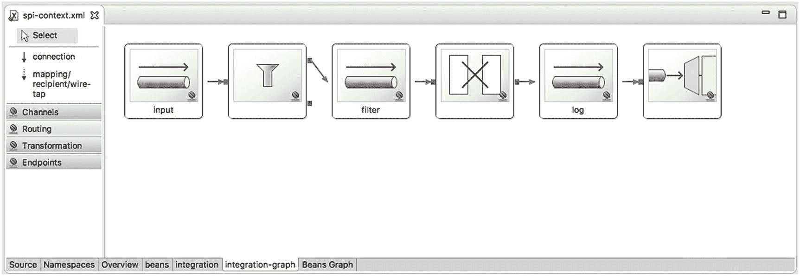

图 11-3

STS 中的 spring integration-图形面板

图 11-3 显示了 integration-graph 面板，在这里您可以通过使用拖放组件来图形化地创建您的流程。此功能仅适用于 STS IDE。IDEA IntelliJ 基于 XML 生成一个图表(右键单击)。

正如你在图 11-X 中看到的，有通道、路由、转换、端点等等。图 11-3 实际上是 XML 的翻译；换句话说，您可以从使用 XML 开始，如果您切换到集成图，它会显示到目前为止您所拥有的，反之亦然。您可以使用这个特性并切换到源代码来获得 XML。这是一种非常酷的创造流量的方式，你不觉得吗？

要运行这个例子，有必要注释掉来自`ToDoIntegration`类的所有 bean 声明。然后，您需要使用`@ImportResource`注释来指示您创建的 XML 所在的位置。它应该类似于清单 11-5 中所示的代码片段。

```java
package com.apress.todo.integration;

import org.springframework.context.annotation.Configuration;
import org.springframework.context.annotation.ImportResource;
import org.springframework.integration.config.EnableIntegration;

@ImportResource("META-INF/spring/integration/todo-context.xml")

@EnableIntegration
@Configuration
public class ToDoIntegration {

}

Listing 11-5com.apress.todo.integration.ToDoIntregration.java – v2

```

清单 11-5 展示了`ToDoIntegration`类的新版本(实际上没有代码)。我们添加了`@ImportResource`注释。这告诉 Spring Boot 有一个配置文件需要处理。如果您运行它，您应该有以下输出。

```java
...
INFO 43402 - [main] o.s.i.channel.PublishSubscribeChannel    : Channel 'application.errorChannel' has 1 subscriber(s).
2018-09-01 07:23:20.668  INFO 43402 --- [           main] o.s.i.endpoint.EventDrivenConsumer       : started _org.springframework.integration.errorLogger
INFO 43402 - [main] c.a.todo.TodoIntegrationApplication      : Started TodoIntegrationApplication in 1.218 seconds (JVM running for 1.653)

INFO 43402 - [main] o.s.integration.handler.LoggingHandler   : BUY MILK TODAY

...

```

### 使用注释

Spring Integration 具有集成注释，可以帮助您使用 POJO (Plain Old Java Object)类，因此您可以向您的流添加更多的业务逻辑，并有更多的控制。

让我们修改`ToDoIntegration`类，看起来像清单 11-6 。

```java
package com.apress.todo.integration;

import com.apress.todo.domain.ToDo;
import org.slf4j.Logger;
import org.slf4j.LoggerFactory;
import org.springframework.context.annotation.Bean;
import org.springframework.context.annotation.Configuration;
import org.springframework.integration.annotation.Filter;
import org.springframework.integration.annotation.MessageEndpoint;
import org.springframework.integration.annotation.ServiceActivator;
import org.springframework.integration.annotation.Transformer;
import org.springframework.integration.channel.DirectChannel;
import org.springframework.integration.config.EnableIntegration;
import org.springframework.integration.dsl.channel.MessageChannels;
import org.springframework.messaging.MessageChannel;

@EnableIntegration
@Configuration
public class ToDoIntegration {

    @Bean
    public MessageChannel input(){
        return new DirectChannel();
    }

    @Bean
    public MessageChannel toTransform(){
        return new DirectChannel();
    }

    @Bean
    public MessageChannel toLog(){
        return new DirectChannel();
    }

    @MessageEndpoint
    class SimpleFilter {
        @Filter(inputChannel="input"
                        ,outputChannel="toTransform")
        public boolean process(ToDo message){
            return message.isCompleted();
        }
    }

    @MessageEndpoint
    class SimpleTransformer{
        @Transformer(inputChannel="toTransform"
                        ,outputChannel="toLog")
        public String process(ToDo message){
            return message.getDescription().toUpperCase();
        }
    }

    @MessageEndpoint
    class SimpleServiceActivator{
        Logger log = LoggerFactory
                  .getLogger(SimpleServiceActivator.class);
        @ServiceActivator(inputChannel="toLog")
        public void process(String message){
            log.info(message);
        }
    }
}

Listing 11-6com.apress.todo.integration.ToDoIntegration.java – v3

```

清单 11-6 向您展示了与之前相同的流程，现在我们使用集成注释。还可以看看内部类来简化这个例子。我们来详细看看这段代码。

*   `MessageChannel`。这是一个定义发送消息的方法的接口。

*   `DirectChannel`。这是一个消息通道，为发送的每条消息调用一个订户。它通常在不需要任何消息队列时使用。

*   `@MessageEndpoint`。这是一个有用的注释，它将类标记为端点。

*   `@Filter`。这个注释标记了一个实现消息过滤器功能的方法。通常，您需要返回一个布尔值。

*   `@Transformer`。这个注释标记了一个方法来完成转换消息、消息头和/或有效负载的功能。

*   `@ServiceActivator`。这个注释标记了一个能够处理消息的方法。

要运行这个例子，注释掉`@ImportResource`注释。就这样。您应该有类似于以下输出的日志。

```java
 ...
INFO 43940 - [main] c.a.todo.TodoIntegrationApplication      : Started TodoIntegrationApplication in 1.002 seconds (JVM running for 1.625)

INFO 43940 - [main] i.ToDoIntegration$SimpleServiceActivator : BUY MILK TODAY

...

```

### 使用 JavaConfig

JavaConfig 与我们刚刚做的非常相似。我们接下来要做的是改变流程的最后一部分。因此，注释掉`SimpleServiceActivator`内部类消息端点，并用下面的代码替换它。

```java
@Bean
@ServiceActivator(inputChannel = "toLog")
public LoggingHandler logging() {
    LoggingHandler adapter = new
                  LoggingHandler(LoggingHandler.Level.INFO);
    adapter.setLoggerName("SIMPLE_LOGGER");
    adapter.setLogExpressionString
("headers.id + ': ' + payload");
    return adapter;
}

```

这段代码创建了一个`LoggingHandler`对象，它实际上是 XML 从`logging-channel-adapter`标签生成的同一个对象。它记录了带有报头 ID 和有效载荷的`SIMPLE_LOGGER`消息，在本例中是“今天买牛奶”消息。

同样，我知道这只是一个微不足道的例子，但至少它让您了解了 Spring Integration 是如何工作的，以及如何配置它。客户经常问我是否有可能混合配置。绝对的！我们很快就会看到这一点。

### 文件集成待办事项

接下来，我们来看看如何整合文件读取。集成系统是一项非常常见的任务。这是最常用的用例之一。让我们首先创建一个`ToDoProperties`类来帮助外部属性读取文件的路径和名称(参见清单 11-7 )。

```java
package com.apress.todo.config;

import lombok.Data;
import org.springframework.boot.context.properties.ConfigurationProperties;

@Data
@ConfigurationProperties(prefix="todo")
public class ToDoProperties {

    private String directory;
    private String filePattern;

}

Listing 11-7com.apress.todo.config.ToDoProperties.java

```

正如你在清单 11-7 中看到的，没有什么新的东西。因为这个应用从文件中读取，所以需要创建一个转换器来读取一个字符串条目，解析它，并返回一个新的`ToDo`实例。创建`ToDoConverter`类(参见清单 11-8 )。

```java
package com.apress.todo.integration;

import com.apress.todo.domain.ToDo;
import org.springframework.core.convert.converter.Converter;
import org.springframework.stereotype.Component;

import java.util.List;
import java.util.stream.Collectors;
import java.util.stream.Stream;

@Component
public class ToDoConverter implements Converter<String, ToDo> {
    @Override
    public ToDo convert(String s) {
        List<String> fields = Stream.of(s.split(",")).map(String::trim).collect(Collectors.toList());
        return new ToDo(fields.get(0),Boolean.parseBoolean(fields.get(1)));
    }
}

Listing 11-8com.apress.todo.integration.ToDoConverter.java

```

清单 11-8 没有什么特别的。这里唯一的要求是实现通用的`Converter`接口。我会在下一节讲。另一个必要的类是处理`ToDo`实例的处理器。创建`ToDoMessageHandler`类(参见清单 11-9 )。

```java
package com.apress.todo.integration;

import com.apress.todo.domain.ToDo;
import org.slf4j.Logger;
import org.slf4j.LoggerFactory;
import org.springframework.stereotype.Component;

@Component
public class ToDoMessageHandler {
    private Logger log = LoggerFactory.getLogger(ToDoMessageHandler.class);

    public void process(ToDo todo){
        log.info(">>> {}", todo);
         // More process...
    }
}

Listing 11-9com.apress.todo.integration.ToDoMessageHandler.java

```

清单 11-9 是一个简单的 POJO 类；接收`ToDo`实例的方法。

接下来，让我们创建主流程。创建`ToDoFileIntegration`类(参见清单 11-10 )。

```java
package com.apress.todo.integration;

import com.apress.todo.config.ToDoProperties;
import org.springframework.boot.context.properties.EnableConfigurationProperties;
import org.springframework.context.annotation.Bean;
import org.springframework.context.annotation.Configuration;
import org.springframework.integration.dsl.IntegrationFlow;
import org.springframework.integration.dsl.IntegrationFlows;
import org.springframework.integration.dsl.Pollers;
import org.springframework.integration.dsl.Transformers;
import org.springframework.integration.file.dsl.Files;
import org.springframework.integration.file.splitter.FileSplitter;

import java.io.File;

@EnableConfigurationProperties(ToDoProperties.class)
@Configuration
public class ToDoFileIntegration {

    private ToDoProperties props;
    private ToDoConverter converter;

    public ToDoFileIntegration(ToDoProperties props,
ToDoConverter converter){
        this.props = props;
        this.converter = converter;
    }

    @Bean
         public IntegrationFlow fileFlow(){
              return IntegrationFlows
                .from(
            Files.inboundAdapter(
                        new File(this.props.getDirectory()))
                 .preventDuplicates(true)
                  .patternFilter(this.props.getFilePattern())
                        , e ->
                              e.poller(Pollers.fixedDelay(5000L))
                )
                .split(Files.splitter().markers())
                .filter(
                  p -> !(p instanceof FileSplitter.FileMarker))
                .transform(Transformers.converter(converter))

                .handle("toDoMessageHandler","process")
                .get();

    }
}

Listing 11-10com.apress.todo.integration.ToDoFileIntegration.java

```

清单 11-10 显示了主要的集成流程，它读取文件的内容(从文件系统中)，将内容转换成对象(在本例中，使用`ToDoConverter`类转换成`ToDo`对象)，并处理任何额外逻辑的消息。我们来详细分析一下这个。

*   `from`。这是一个重载的方法，通常传递`MessageSource`；在这种情况下，我们传递两个值:`Files.inboundAdapter`(我将在下面解释)和一个接收`SourcePollingChannelAdapterSpec`的消费者；在本例中，我们使用一个 lambda 表达式，通过使用`Pollers`类，每 5 秒钟在文件系统中轮询一次新文件。

*   `Files`. This is a protocol adapter that works out of the box; you just need to configure it. This adapter is used to pick up files from the file system. The `Files` class belongs to the Spring Integration Java DSL and provides several useful methods:
    *   `inboundAdapter`。这个适配器带来了一个返回`FileInboundChannelAdapterSpec`的流畅 API，该 API 有如下方法

    *   `preventDuplicates`。这意味着您可以通过将此设置为 true 来避免多次读取同一个文件。

    *   `patternFilter`。这将查找命名模式的文件。

    在这个例子中，我们从目录(从`todo.directory`属性值)和基于模式的名称(从`todo.file-pattern`属性值)中读取，两者都来自`ToDoProperties`类。

*   `split`。该方法调用表明所提供的参数(可能是 bean、服务、处理程序等。)可以拆分单个消息或消息有效载荷，并产生多个消息或有效载荷；在这种情况下，我们使用的是`FileMarker`，当有顺序文件进程时，它对文件数据进行定界。

*   `filter`。因为我们使用标记来查看每个消息的开始和结束，我们接收文件的内容作为`FileMarker`开始，然后是实际内容，最后是`FileMarker`结束，所以这就是为什么我们在这里说，“传递给我有效载荷或内容，而不是标记。”

*   `transform`。这里我们使用了一个带有几个实现的`Transformers`类来转换消息和转换器(一个定制的转换器，`ToDoConverter`类，参见清单 11-8 )。

*   `handle`。这里，我们使用一个类来处理消息，将 bean 的名称(`toDoMessageHandler`)和处理消息过程的方法作为第一个参数传递(查看`ToDoMessageHandler`类中的代码，参见清单 11-9 )。`ToDoMessageHandler`类是一个使用`@Component`注释标记的 POJO。

### 注意

Spring Integration Java DSL 支持(暂时)以下协议适配器类:AMQP、JMS、文件、SFTP、FTP、HTTP、Kafka、邮件、脚本和 Feed。这些类在 org . spring framework . integration . DSL . *包中。

在`application.properties`中，添加以下内容。

```java
todo.directory=/tmp/todo
todo.file-pattern=list.txt

```

当然，您可以添加任何目录和/或文件模式。`list.txt`可以是你想要的任何东西。如果您查看了`ToDoConverter`，它只需要两个值:描述和布尔值。所以，`list.txt`的文件是这样的:

```java
buy milk today, true
read a book, false
go to the movies, true
workout today, false
buy some bananas, false

```

要运行代码，注释掉`ToDoIntegration`类中的所有代码。一旦您运行它，您应该得到类似于下面的输出。

```java
INFO 47953 - [           main] c.a.todo.TodoIntegrationApplication      : Started TodoIntegrationApplication in 1.06 seconds (JVM running for 1.633)
INFO 47953 - [ask-scheduler-1] c.a.todo.integration.ToDoMessageHandler  : >>> ToDo(id=3037a45b-285a-4631-9cfa-f89251e1a634, description=buy milk today, created=2018-09-01T19:29:38.309, modified=2018-09-01T19:29:38.310, completed=true)
INFO 47953 - [ask-scheduler-1] c.a.todo.integration.ToDoMessageHandler  : >>> ToDo(id=7eb0ae30-294d-49d5-92e2-d05f88a7befd, description=read a book, created=2018-09-01T19:29:38.320, modified=2018-09-01T19:29:38.320, completed=false)
INFO 47953 - [ask-scheduler-1] c.a.todo.integration.ToDoMessageHandler  : >>> ToDo(id=5380decb-5a6f-4463-b4b6-1567361c37a7, description=go to the movies, created=2018-09-01T19:29:38.320, modified=2018-09-01T19:29:38.320, completed=true)
INFO 47953 - [ask-scheduler-1] c.a.todo.integration.ToDoMessageHandler  : >>> ToDo(id=ac34426f-83fc-40ae-b3a3-0a816689a99a, description=workout today, created=2018-09-01T19:29:38.320, modified=2018-09-01T19:29:38.320, completed=false)
INFO 47953 - [ask-scheduler-1] c.a.todo.integration.ToDoMessageHandler  : >>> ToDo(id=4d44b9a8-92a1-41b8-947c-8c872142694c, description=buy some bananas, created=2018-09-01T19:29:38.320, modified=2018-09-01T19:29:38.320, completed=false)

```

正如您所看到的，这是一种非常简单的方式来集成文件、读取其内容以及使用数据进行任何业务逻辑。

还记得之前我告诉过你，你可以混合配置 Spring Integration 的方式吗？那么，如果您想使用实际的注释来处理消息，您需要做什么呢？您可以使用`@ServiceActivator`注释作为配置的一部分。

```java
@ServiceActivator(inputChannel="input")
public void process(ToDo message){

}

```

要使用这种服务激活器方法，您需要更改流程。替换此行:

```java
handle("toDoMessageHandler","process")

```

有了这个:

```java
.channel("input")

```

如果您重新运行该示例，您会得到相同的结果。您是否意识到没有定义输入通道？最棒的是，Spring Integration 发现您需要这个通道，并在幕后为您创建了一个通道。

它需要一本完整的书来解释所有 Spring Integration 的好处；当然，这本书是一本入门书——对集成多个系统的能力的基本介绍。

## SpringCloudStream

到目前为止，您已经看到了所有可用的消息传递技术，使用 Spring 框架和 Spring Boot 可以让开发人员和架构师轻松创建非常健壮的消息传递解决方案。在这一节中，我们向前迈出了新的一步；我们进入云原生应用开发，这是下一章的介绍。

在下一节中，我将讨论 Spring Cloud Stream 以及这项新技术如何帮助我们编写消息驱动的微服务应用。

### SpringCloud

在我开始说 Spring Cloud Stream 内部和用法之前，先说一下它的保护伞项目 Spring Cloud。

Spring Cloud 是一组工具，允许开发人员创建使用分布式系统中所有常见模式的应用:配置管理、服务发现、断路器、智能路由、微代理、控制总线、全局锁、分布式会话、服务对服务调用、分布式消息传递等等。

基于 Spring Cloud 有几个项目，包括 Spring Cloud Config、Spring Cloud 网飞、Spring Cloud Bus、Spring Cloud for Cloud Foundry、Spring Cloud Cluster、Spring Cloud Stream、Spring Cloud Stream App Starters。

如果您想从这些技术开始，如果您使用的是 Maven，那么您可以将以下部分和依赖项添加到您的`pom.xml`文件中。

*   添加带有 GA 版本的`<dependencyManagement/>`标签；例如

    ```java
    <dependencyManagement>
        <dependencies>
            <dependency>
                <groupId>org.springframework.cloud</groupId>
                <artifactId>spring-cloud-dependencies</artifactId>
                <version>Finchley.SR1</version>
                <type>pom</type>
                <scope>import</scope>
            </dependency>
        </dependencies>
    </dependencyManagement>

    ```

*   在`<dependencies/>`标签中添加您想要使用的技术；例如，

    ```java
    <dependencies>
     <dependency>
       <groupId>org.springframework.cloud</groupId>
       <artifactId>spring-cloud-starter-stream-rabbit</artifactId>
     </dependency>

     <!—MORE Technologies here -->

    </dependencies>

    ```

如果您使用的是 Gradle，您可以将以下内容添加到您的`build.gradle`文件中。

```java
ext {
      springCloudVersion = 'Finchley.SR1'
}
dependencyManagement {
         imports {
        mavenBom "org.springframework.cloud:spring-cloud-dependencies:${springCloudVersion}"
        }
}

dependencies {
      // ...
      compile ('org.springframework.cloud:spring-cloud-starter-stream-rabbit')
      // ...
}

```

如果深入研究 Spring Cloud 注释的`pom.xml`文件，您会发现命名约定现在是`spring-cloud-starter-<technology to use>`。还要注意，我们添加了一个依赖管理标签，允许您处理传递性依赖和库版本管理。

### SpringCloudStream

该说 SpringCloudStream 了。为什么我没有介绍其他技术？它有什么特别之处？嗯，Spring Cloud Stream 是一个轻量级的消息驱动的微服务框架，基于 Spring Integration 和 Spring Boot(提供自以为是的运行时，便于配置)。您可以轻松创建企业就绪的消息传递和集成解决方案应用。它为使用 RabbitMQ 或 Apache Kafka 发送和接收消息提供了一个简单的声明性模型。

我认为 Spring Cloud Stream 最重要的特性之一是通过创建可以开箱即用的绑定来分离生产者和消费者之间的消息传递。换句话说，您不需要向您的应用添加任何特定于代理的代码来生成或使用消息。向您的应用添加所需的绑定(我将在后面解释)依赖项，Spring Cloud Stream 负责消息传递连接和通信。

所以，让我们来看看 Spring Cloud Stream 的主要组件，并学习如何使用这个框架。

#### SpringCloudStream 概念

以下是 SpringCloudStream 的主要组成部分。

*   *应用模型*。应用模型是一个中间件中立的核心，这意味着应用通过 binder 实现使用输入和输出通道与外部代理通信(作为一种传输消息的方式)。

*   *活页夹抽象*。Spring Cloud Stream 提供了 Kafka 和 RabbitMQ 绑定器实现。这种抽象使得 Spring Cloud Stream 应用连接到中间件成为可能。但是，这个抽象是如何知道目的地的呢？它可以在运行时根据频道动态选择目的地。通常，我们需要通过`application.properties`文件将它作为`spring.cloud.stream.bindings.[input|ouput].destination`属性提供。当我们看例子的时候，我会讨论这个问题。

*   *持续发布/订阅*。应用通信是通过众所周知的发布/订阅模型进行的。如果使用 Kafka，它遵循自己的主题/订阅者模型，如果使用 RabbitMQ，它为每个队列创建一个主题交换和必要的绑定。这个模型降低了生产者和消费者的复杂性。

*   *消费群体*。你发现你的消费者可能需要在某个时候能够扩大规模。这就是为什么可伸缩性是使用消费者组的概念来实现的(这类似于 Kafka 消费者组特性)，其中您可以在一个组中有多个消费者来实现负载平衡场景，这使得可伸缩性非常容易设置。

*   *分区支持*。Spring Cloud Stream 支持数据分区，允许多个生产者向多个消费者发送数据，并确保公共数据由相同的消费者实例处理。这有利于数据的性能和一致性。

*   *绑定 API* 。Spring Cloud Stream 提供了一个 API 接口——Binder SPI(服务提供者接口),您可以通过修改原始代码来扩展核心，因此很容易实现特定的 Binder，如 JMS、WebSockets 等。

在本节中，我们将更多地讨论编程模型和绑定器。如果你想了解更多关于其他概念的知识，可以看看 Spring Cloud Stream 参考。这个想法是向您展示如何开始使用 Spring Cloud Stream 创建事件驱动的微服务。为了向您展示我们将要涵盖的内容，请看图 11-4 。

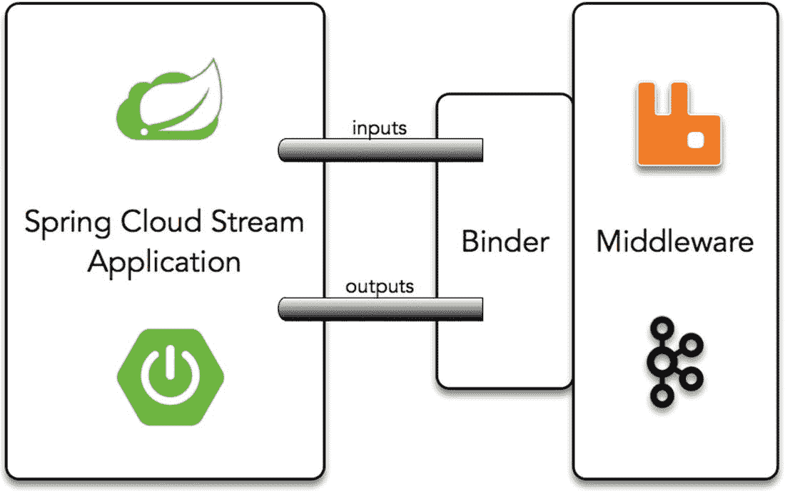

图 11-4

SpringCloudStream 式应用

#### SpringCloudStream 编程

看图 11-4 创建一个 SpringCloudStream app 需要什么？

*   `<dependencyManagement/>`。您需要使用最新的 Spring Cloud 库依赖项添加这个标签。

*   *装订器*。你需要选择你需要哪种活页夹。
    *   *卡夫卡*。如果您选择 Kafka 作为您的绑定器，那么如果您使用 Maven，您需要在您的`pom.xml`中添加以下依赖项。

        ```java
        <dependency>
          <groupId>org.springframework.cloud</groupId>
          <artifactId>spring-cloud-starter-stream-kafka</artifactId>
        </dependency>

        ```

        如果你使用的是 Gradle，那么你需要在`build.gradle`文件中添加以下依赖项。

        ```java
        compile('org.springframework.cloud:spring-cloud-starter-stream-kafka')

        ```

    *   *RabbitMQ* 。如果您选择 RabbitMQ 作为绑定器，那么如果您使用 Maven，您需要在您的`pom.xml`中添加以下依赖项。

        ```java
        <dependency>
          <groupId>org.springframework.cloud</groupId>
          <artifactId>spring-cloud-starter-stream-rabbit</artifactId>
        </dependency>

        ```

        如果你使用的是 Gradle，那么你需要在`build.gradle`文件中添加以下依赖项。

        ```java
        compile('org.springframework.cloud:spring-cloud-starter-stream-rabbit')

        ```

启动并运行 Kafka 或 RabbitMQ。你能同时使用两者吗？是的，你可以。您可以在`application.properties`文件中配置它们。

*   `@EnableBinding`。这是一个 Spring Boot 应用，所以添加`@EnableBinding`足以将应用转换为 Spring Cloud 流。

在接下来的小节中，我们使用 RabbitMQ 作为传输层，在不知道任何关于代理 API 的细节或者如何配置生产者或消费者消息的情况下，从一个应用向另一个应用发送和接收消息。

Spring Cloud Stream 使用通道(输入/输出)作为发送和接收消息的机制。Spring Cloud Stream 应用可以有任意数量的通道，因此它定义了两个注释，`@Input`和`@Output`，用于标识消费者和生产者。通常情况下，`SubscribableChannel`类用`@Input`标注来监听传入的消息，`MessageChannel`类用`@Output`标注来发送消息。

还记得我跟你说过，SpringCloudStream 是基于春集成的吗？

如果您不想直接处理这些通道和注释，Spring Cloud Stream 通过添加三个接口来简化事情，这三个接口涵盖了最常见的消息传递用例:`Source`、`Processor`和`Sink`。在幕后，这些接口拥有您的应用需要的通道(输入/输出)。

*   `Source`。`Source`用于从外部系统获取数据的应用中(通过监听队列、REST 调用、文件系统、数据库查询等)。)并通过输出通道发送它。这是来自 Spring Cloud Stream 的实际界面:

    ```java
    public interface Source {

      String OUTPUT = "output";

      @Output(Source.OUTPUT)
      MessageChannel output();

    }

    ```

*   `Processor`。当您想要开始监听来自输入通道的新的输入消息，对接收的消息进行处理(增强、转换等)时，您可以在应用中使用`Processor`。)，并向输出通道发送新消息。这是 Spring Cloud Stream 中的实际界面:

    ```java
    public interface Processor extends Source, Sink {

    }

    ```

*   `Sink`。当您想要开始监听来自输入通道的新消息、进行处理和结束流程(保存数据、启动任务、登录控制台等)时，可以使用`Sink`应用。).这是 Spring Cloud Stream 中的实际界面:

    ```java
    public interface Sink {

      String INPUT = "input";

      @Input(Sink.INPUT)
      SubscribableChannel input();

    }

    ```

图 11-5 和 11-6 是我们使用的模型。


图 11-6

源➤处理器➤接收器

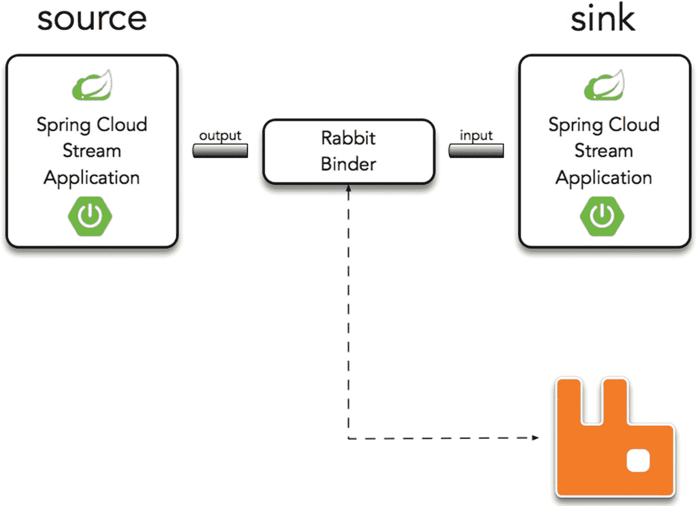

图 11-5

源➤汇

#### 带 SpringCloudStream 的 ToDo App

这个项目的目的是展示如何创建一个`Source`接口，并通过它的输出通道发送消息；一个`Processor`接口以及如何分别从输入和输出通道接收和发送消息；和一个`Sink`接口以及如何从输入通道接收消息。我展示的是图 11-6 描述的内容，但每次只展示一个流式应用。

目前，这些应用之间的通信是手动的，这意味着我们需要在它们之间执行一些步骤，因为我希望您了解每个应用是如何工作的。在下一节中，我们将看到整个流程是如何工作的。

您可以从头开始，也可以跟随下一部分来了解您需要做什么。如果您是从零开始，那么您可以转到 Spring Initializr 并向字段中添加以下值。

*   组:`com.apress.todo`

*   神器:`todo-cloud`

*   名称:`todo-cloud`

*   包名:`com.apress.todo`

*   依赖关系:`Cloud Stream, Lombok`

您可以选择 Maven 或 Gradle 作为项目类型。然后，您可以按下 Generate Project 按钮，这将下载一个 ZIP 文件。将其解压缩，并在您喜欢的 IDE 中导入项目(参见图 11-7 )。

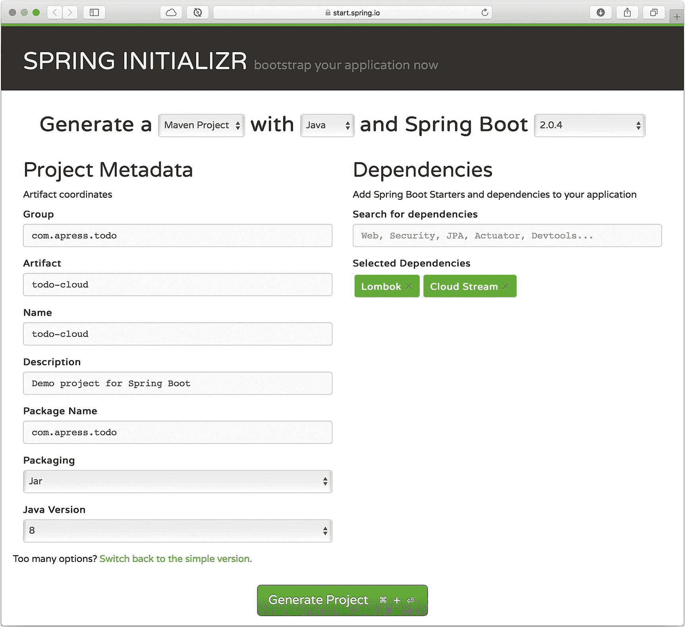

图 11-7

Spring 初始化 zr

您可以使用之前的`todo-integration`项目中的`ToDo`域类(参见清单 11-1 )。

##### 来源

我们将从定义一个`Source`开始。记住这个组件有一个输出通道。创建`ToDoSource`类。它应该看起来像清单 11-11 。

```java
package com.apress.todo.cloud;

import com.apress.todo.domain.ToDo;
import org.springframework.cloud.stream.annotation.EnableBinding;
import org.springframework.cloud.stream.messaging.Source;
import org.springframework.context.annotation.Bean;
import org.springframework.integration.annotation.InboundChannelAdapter;
import org.springframework.integration.core.MessageSource;
import org.springframework.messaging.support.MessageBuilder;

@EnableBinding(Source.class)

public class ToDoSource {

    @Bean
    @InboundChannelAdapter(channel=Source.OUTPUT)
    public MessageSource<ToDo> simpleToDo(){
        return () -> MessageBuilder
                .withPayload(new ToDo("Test Spring Cloud Stream"))
                .build();
    }

}

Listing 11-11com.apress.todo.cloud.ToDoSource.java

```

清单 11-11 展示了你可以拥有的最简单的`Source`流式应用。让我们来看看。

*   `@EnableBinding`。该注释将该类作为 Spring Cloud Stream 应用，并通过提供的绑定器对发送或接收消息进行必要的配置。

*   `Source`。该接口将 Spring Cloud Stream app 标记为`Source`流。它创造了必要的渠道；在这种情况下，输出通道向绑定器提供发送消息。

*   `@InboundChannelAdapter`。这个注释是 Spring Integration 框架的一部分。它每秒轮询一次`simpleToDo`方法，这意味着每秒发送一条新消息。您实际上可以通过添加轮询器和修改默认设置来更改消息的频率和数量；例如，

    ```java
    @InboundChannelAdapter(value = Source.OUTPUT, poller = @Poller(fixedDelay = "5000", maxMessagesPerPoll = "2"))

    ```

    这个声明中的重要部分是通道，这里指向`Source.OUTPUT`意味着它使用输出通道(`MessageChannel output()`)。

*   `MessageSource`。这是一个发回`Message<T>`的接口，它是一个包含有效载荷和报头的包装器。

*   `MessageBuilder`。你已经熟悉这个类了，它发送一个`MessageSource`类型；在这种情况下，我们发送一个`ToDo`实例消息。

在运行这个例子之前，请记住有必要拥有 binder 依赖项，因为我们将使用 RabbitMQ，所以如果您使用 Maven，有必要将它添加到您的`pom.xml`文件中。

```java
<dependency>
  <groupId>org.springframework.cloud</groupId>
  <artifactId>spring-cloud-starter-stream-rabbit</artifactId>
</dependency>

```

如果您使用的是 Gradle，将下面的依赖项添加到您的`build.gradle`文件中。

```java
compile('org.springframework.cloud:spring-cloud-starter-stream-rabbit')

```

确保您已经启动并运行了 RabbitMQ。接下来，运行示例。你可能看不到多少，但它确实在做一些事情。现在，我们进入 RabbitMQ。

1.  在浏览器中打开 RabbitMQ Web 管理。转到`http://localhost:15672`。用户名是`guest`，密码是`guest`。

2.  Go to the Exchanges tab (see Figure 11-8).

    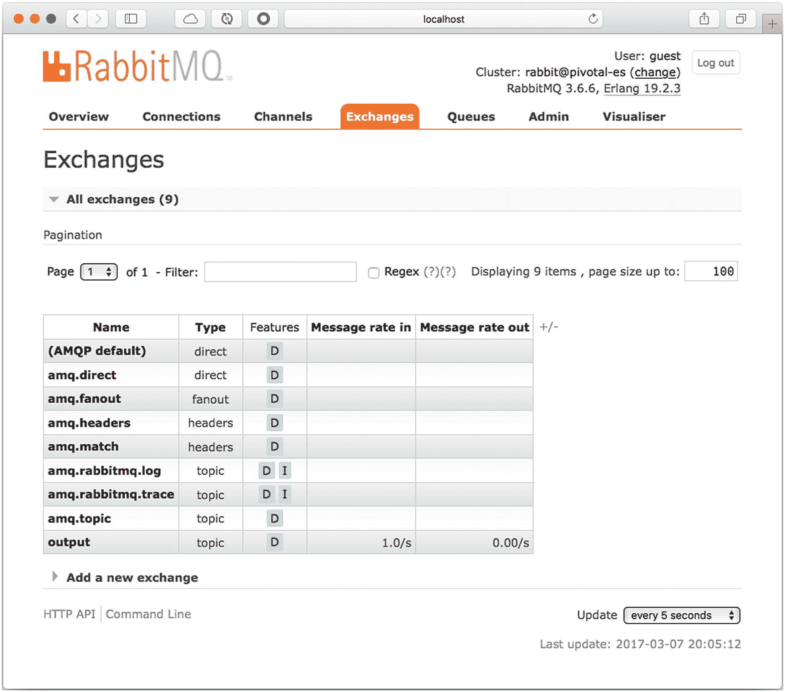

    图 11-8

    RabbitMQ 交换选项卡

    请注意，创建了一个输出(主题交换),消息速率为 1.0/s。

1.  Next, let’s bind this exchange to a queue; but first, let’s create a queue. Go to the Queues tab and create a new queue named `my-queue` (see Figure 11-9).

    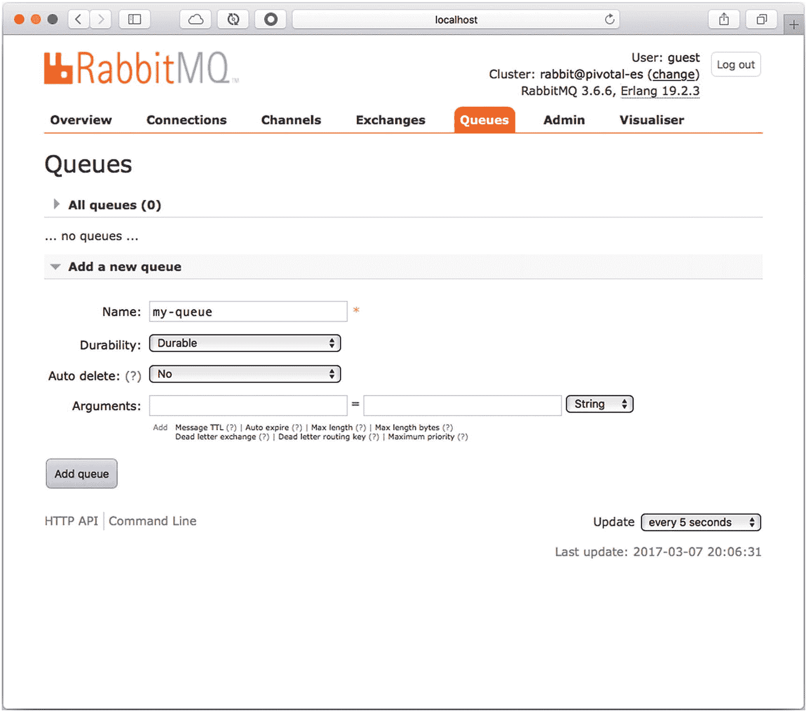

    图 11-9

    创建队列:我的队列

2.  Once the queue is created, it appears in the list. Click my-queue. Go to the Bindings section and add the binding. See Figure 11-10 for the values.

    

    图 11-10

    绑定器

3.  在 From Exchange 字段中填入值 **output** (这是交换的名称)。路由关键字字段的值为 **#** ，允许任何消息进入我的队列。

4.  After you bind the output exchange to my-queue, you start seeing several messages. Open the Overview panel (see Figure 11-11).

    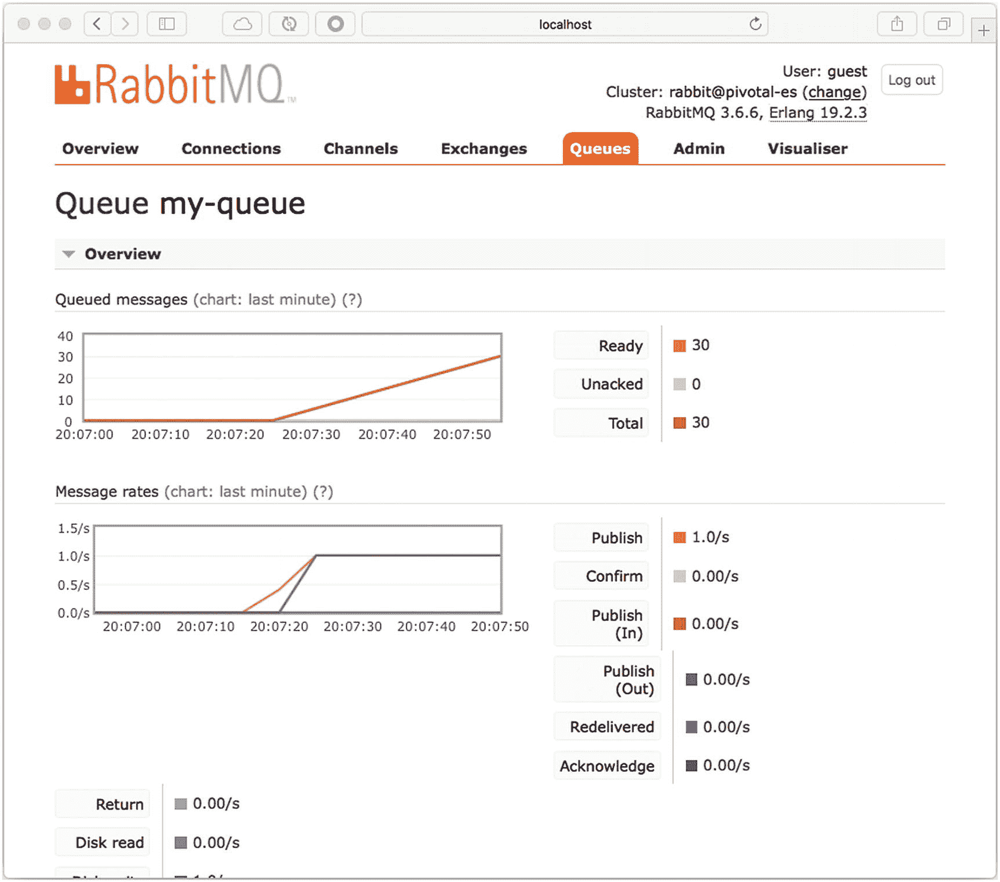

    图 11-11

    概观

5.  Let’s review a message by opening the Get Messages panel. You can get any number of messages and see its contents (see Figure 11-12).

    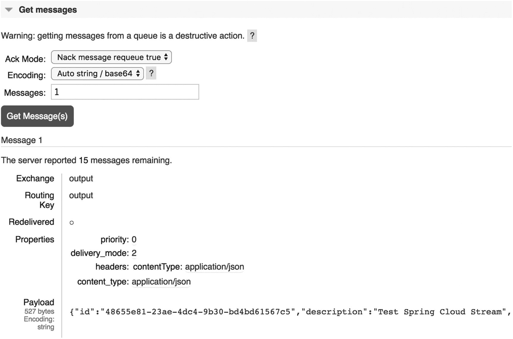

    图 11-12

    获取消息

如果您选择了几条消息，请查看有效负载。你每秒钟都有一条信息。(注意，默认格式是 JSON 有效负载。还要注意消息有属性，比如带有`contentType: application/json`和`delivery_mode: 2`的头，这意味着消息正在被持久化。Spring Cloud Stream 和它的 binder 就是这样连接 RabbitMQ 发布消息的。

如果您看一下消息，您会看到日期和所有细节都暴露出来了。

```java
{"id":"68d4100a-e706-4a51-a254-d88545ffe7ef","description":"Test Spring Cloud Stream","created":{"year":2018,"month":"SEPTEMBER","hour":21,"minute":9,"second":5,"nano":451000000,"monthValue":9,"dayOfMonth":2,"dayOfWeek":"SUNDAY","dayOfYear":245,"chronology":{"id":"ISO","calendarType":"iso8601"}},"modified":{"year":2018,"month":"SEPTEMBER","hour":21,"minute":9,"second":5,"nano":452000000,"monthValue":9,"dayOfMonth":2,"dayOfWeek":"SUNDAY","dayOfYear":245,"chronology":{"id":"ISO","calendarType":"iso8601"}},"completed":false}

```

您可以看到非常冗长的日期序列化，但是如果您使用 Maven，可以通过在`pom.xml`文件中添加以下依赖项来改变这种情况。

```java
<dependency>
    <groupId>com.fasterxml.jackson.datatype</groupId>
    <artifactId>jackson-datatype-jsr310</artifactId>
</dependency>

```

如果您正在使用 Gradle，将下面的依赖项添加到`build.gradle`文件中。

```java
compile('com.fasterxml.jackson.datatype:jackson-datatype-jsr310')

```

重新运行应用。现在，您应该会看到以下消息。

```java
{"id":"37be2854-91b7-4007-bf3a-d75c805d3a0a","description":"Test Spring Cloud Stream","created":"2018-09-02T21:12:12.415","modified":"2018-09-02T21:12:12.416","completed":false}

```

##### 处理器

该部分使用一个`Listener`作为通道输入(所有新的输入消息都到达这里)。它得到一个`ToDo`消息。它转换为大写描述，将 ToDo 标记为已完成，然后将其发送到输出通道。

创建`ToDoProcessor`类。它应该看起来像清单 11-12 。

```java
package com.apress.todo.cloud;

import com.apress.todo.domain.ToDo;
import org.slf4j.Logger;
import org.slf4j.LoggerFactory;
import org.springframework.cloud.stream.annotation.EnableBinding;
import org.springframework.cloud.stream.annotation.StreamListener;
import org.springframework.cloud.stream.messaging.Processor;
import org.springframework.messaging.handler.annotation.SendTo;

import java.time.LocalDateTime;

@EnableBinding(Processor.class)

public class ToDoProcessor {

    private Logger log = LoggerFactory.getLogger(ToDoProcessor.class);

    @StreamListener(Processor.INPUT)
         @SendTo(Processor.OUTPUT)
    public ToDo transformToUpperCase(ToDo message) {
        log.info("Processing >>> {}", message);
        ToDo result = message;
        result.setDescription(message.getDescription().toUpperCase());
        result.setCompleted(true);
        result.setModified(LocalDateTime.now());
        log.info("Message Processed >>> {}", result);
        return result;
    }
}

Listing 11-12com.apress.todo.cloud.ToDoProcessor.java

```

清单 11-12 显示了一个简单的`Processor`流。我们来复习一下。

*   `@EnableBinding`。该注释使该类成为 Spring Cloud Stream 应用。它支持通过提供的绑定器发送或接收消息的必要配置。

*   `Processor`。该接口将 Spring Cloud Stream app 标记为`Processor`流。它创造了必要的渠道；在这种情况下，输入通道(用于监听新的传入消息)和输出通道(用于将消息发送到提供的绑定器)。

*   `@StreamListener`。这个注释是 Spring Cloud Stream 框架的一部分，非常类似于`@RabbitListener`或者`@JmsListener`。它在`Processor.INPUT`信道(`SubscribableChannel input()`)中监听新的输入消息。

*   `@SendTo`。您已经知道这个注释；它与前一章中使用的是同一个。它的任务是一样的；你可以看做是回复，也可以看做是制作人。它向`Processor.OUTPUT`通道(`MessageChannel output()`)发送一条消息。

我认为这是一个关于你可以用一个`Processor`流做什么的平凡但很好的例子。所以在运行它之前，请确保从`ToDoSource`类中注释掉`@EnableBinding`注释，并删除输出交换和`my-queue`队列。

运行示例。还是那句话，应用没有做太多，但是让我们去 RabbitMQ web management。

1.  进入你的浏览器，点击`http://localhost:15672`(用户名:`guest`，密码:`guest`)。

2.  Click the Exchanges tab, and you see the same output exchange and a new input exchange being created. Remember that the `Processor` stream uses input and output channels (see Figure 11-13).

    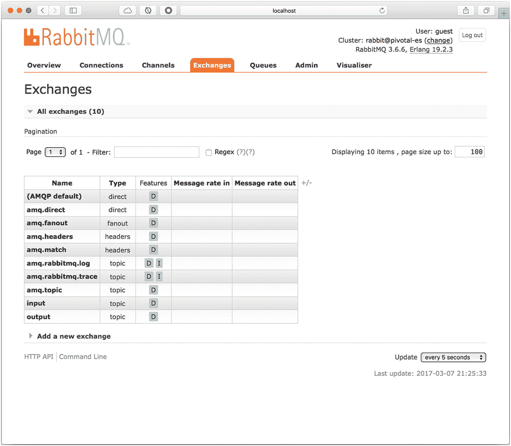

    图 11-13

    交换

    请注意，现在在任何新的交换中都没有消息速率。

1.  Next, go to the Queues tab. You notice a new queue named input.anonymous and random text has been created (see Figure 11-14).

    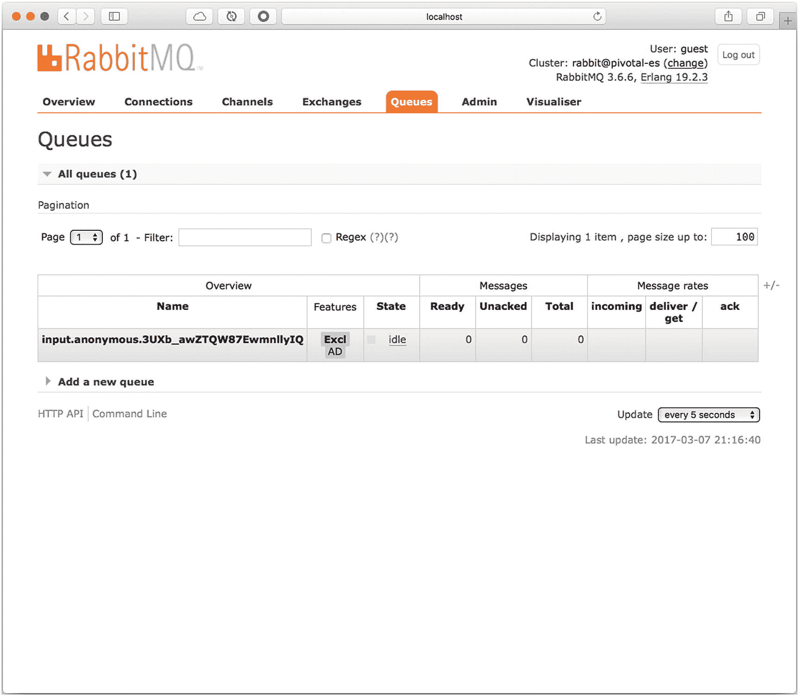

    图 11-14

    行列

    就这样。ToDoProcessor 流创建输出交换和`input.anonymous.*`队列，这意味着流连接到绑定器，在本例中是 RabbitMQ。现在的问题是如何传递信息，对吗？有不同的方法可以做到这一点:使用 RabbitMQ 模拟消息，或者以编程方式实现。我们将双管齐下。

    我们将创建一个名为`my-queue`的队列，并将其绑定到输出，这与我们在`Source`流部分中所做的非常相似。

1.  转到 Queues 选项卡，创建一个名为`my-queue`的队列，并用路由关键字`#`将其绑定到输出交换。这类似于`Source`流中的步骤 2 和 3。还要注意的是，`input.anonymous.*`队列绑定到输入交换。

2.  现在，我们将使用输入交换发送一条消息。转到交换选项卡。单击输入交换并选择发布消息面板。

3.  Enter the following in the Payload field.

    ```java
    {"id":"37be2854-91b7-4007-bf3a-d75c805d3a0a","description":"Test Spring Cloud Stream","created":"2018-09-02T21:12:12.415","modified":"2018-09-02T21:12:12.416","completed":false}

    ```

    Enter **content-type=application/json** in the Properties field (see Figure 11-15).

    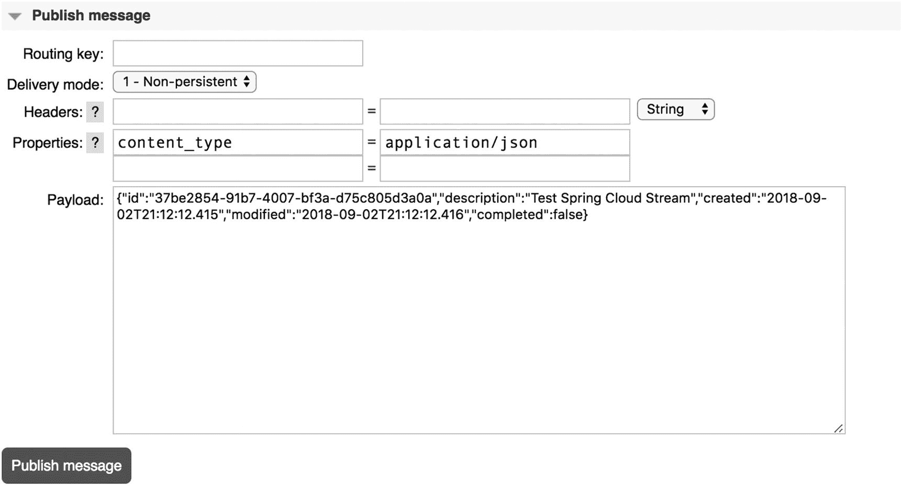

    图 11-15

    发布消息

    然后单击“发布消息”按钮。它应该显示为“消息已发布”的消息


图 11-16

获取消息

1.  Next, take a look at the app’s logs. You should have something similar to the following output.

    ```java
    ...
    Processing >>> ToDo(id=37be2854-91b7-4007-bf3a-d75c805d3a0a, description=Test Spring Cloud Stream, created=2018-09-02T21:12:12.415, modified=2018-09-02T21:12:12.416, completed=false)
    Message Processed >>> ToDo(id=37be2854-91b7-4007-bf3a-d75c805d3a0a, description=TEST SPRING CLOUD STREAM, created=2018-09-02T21:12:12.415, modified=2018-09-02T21:54:55.048, completed=true)
    ...

    ```

    如果你看一看`my-queue`队列，并得到消息，你应该看到几乎相同的结果(见图 11-16 )。

这很简单，但不是正确的方法。您永远不会使用 RabbitMQ 控制台发送消息，除了一个小测试。

我提到过我们能够以编程方式发送消息。创建`ToDoSender`类(参见清单 11-13 )。

```java
package com.apress.todo.sender;

import com.apress.todo.domain.ToDo;
import org.springframework.boot.ApplicationRunner;
import org.springframework.context.annotation.Bean;
import org.springframework.context.annotation.Configuration;
import org.springframework.messaging.MessageChannel;
import org.springframework.messaging.support.MessageBuilder;

@Configuration
public class ToDoSender {

    @Bean
    public ApplicationRunner send(MessageChannel input){
        return args -> {
            input
                 .send(MessageBuilder
                 .withPayload(new ToDo("Read a Book"))
                 .build());

        };
    }
}

Listing 11-13com.apress.todo.sender.ToDoSender.java

```

如果您运行应用，现在您有一个用大写字母描述的 ToDo，并在日志和`my-queue`队列中设置为完成。如你所见，我们使用了一个你从 Spring Integration 中了解到的类，并使用了`MessageChannel`接口。有意思的是，Spring 知道该从哪个渠道注入。记住,`@Processor`注释公开了输入通道。

##### 水槽

`Sink`流创建一个输入通道来监听新的输入消息。让我们创建`ToDoSink`类(参见清单 11-14 )。

```java
package com.apress.todo.cloud;

import com.apress.todo.domain.ToDo;
import org.slf4j.Logger;
import org.slf4j.LoggerFactory;
import org.springframework.cloud.stream.annotation.EnableBinding;
import org.springframework.cloud.stream.annotation.StreamListener;
import org.springframework.cloud.stream.messaging.Sink;

@EnableBinding(Sink.class)

public class ToDoSink {

    private Logger log = LoggerFactory.getLogger(ToDoSink.class);

    @StreamListener(Sink.INPUT)
    public void process(ToDo message){
        log.info("SINK - Message Received >>> {}",message);
    }

}

Listing 11-14com.apress.todo.cloud.ToDoSink.java

```

清单 11-14 显示了一个`Sink`流，您已经知道了注释。`@EnableBinding`将这个类转换成一个`Source`流，并通过`@StreamListener`和`Sink.INPUT`通道监听新的输入消息。`Sink.INPUT`创建一个输入通道(`SubscribableChannel input()`)。

如果您使用清单 11-13 注释掉`ToDoProcessor`类中的`@EnableBinding`并运行应用，看看 RabbitMQ 管理，您会看到输入交换和`input.anonymous.*`被创建并相互绑定。对于`Sink`日志，您应该得到相同的 ToDo。

请记住，接收流对收到的消息做了额外的工作，但它结束了流。

到目前为止，我所解释的并没有太多概念上的探索，实际上这是我的意图，因为我想让你们了解内部是如何工作的。现在，让我们使用一个真实的场景，其中我们实际上创建了一个完整的流，并查看这些流如何在不进入 RabbitMQ 管理的情况下相互通信。

#### 微服务

我想谈谈这种使用微服务创建可扩展和高可用性应用的新方法。本节最重要的部分是使用消息传递在流之间进行通信的能力。最后，您应该将每个流(源、处理器和接收器)视为一个微服务。

##### 待办事项:一个完整的流程

让我们列出这个新的 ToDo 应用的一些要求。

*   创建一个`Source`来读取从文件中声明的任何 ToDo，并过滤那些已完成的 ToDo 实例。

*   创建一个接受 ToDo 并创建文本消息的`Processor`。

*   创建一个接收文本并向收件人发送电子邮件的`Sink`。

你认为你能做到吗？参见图 11-17 。


图 11-17

所有的流量

图 11-17 显示真实流程(注意每个部分都是独立的 app)。换句话说，你创建了`todo-source`、`todo-processor`和`todo-sink`。

看看第十一章的源代码，找到每个项目。这是你的家庭作业。让它们发挥作用。根据您的设置更改属性，在本例中，是在`todo-sink`项目中。

### SpringCloudStream 式应用首发

如果我告诉你，我们可以避免创建前面的例子，而使用 Spring Cloud Stream 应用启动器，会怎么样？

Spring Cloud Stream 提供了开箱即用的应用启动器。Spring Cloud 团队已经实现了大约 52 个应用，您可以下载、配置和执行它们。这些应用启动器按`Source`、`Processor`和`Sink`型号划分。

*   `Source`:文件、ftp、gemfire、gemfire-cq、http、jdbc、jms、负载生成器、日志聚合器、邮件、mongodb、rabbit、s3、sftp、syslog、tcp、tcp-client、时间、触发器、triggertask、twitterstream

*   `Processor`:桥、过滤器、groovy-过滤器、groovy-转换、httpclient、pmml、脚本化转换、分离器、TCP-客户端、转换等等

*   `Sink` : aggregate-counter、cassandra、counter、field-value-counter、file、ftp、gemfire、gpfdist、hdfs、hdfs-dataset、jdbc、log、rabbit、redis-pubsub、router、s3、sftp、task-launcher-local、task-launcher-yarn、tcp、throughput、websocket 等等

### 注意

如果您需要获得最新版本的应用启动器，您可以从 [`http://repo.spring.io/libs-release/org/springframework/cloud/stream/app/`](http://repo.spring.io/libs-release/org/springframework/cloud/stream/app/) 获得。

如果你想使用其他的 Spring Cloud Stream 应用启动器，看看它们的配置，看看 [`http://docs.spring.io/spring-cloud-stream-app-starters/docs/current/reference/html/`](http://docs.spring.io/spring-cloud-stream-app-starters/docs/current/reference/html/) 作为参考。

## 摘要

在本章中，您学习了如何在 Spring Boot 中使用 Spring Integration 和 Spring Cloud Stream。

您了解了 Spring Integration 如何帮助您创建可以与其他系统集成的健壮且可伸缩的应用。

您了解了 Spring Cloud Stream 如何提供轻松创建微服务的工具。你学会了如何使用这个框架和任何你想要的传输方法。它是一个不可知的传输协议框架，隐藏了所有的消息细节；换句话说，你不需要学习 RabbitMQ 或者 Kafka 来使用这个框架。

在下一章，你将看到 Spring Boot 如何生活在云中。