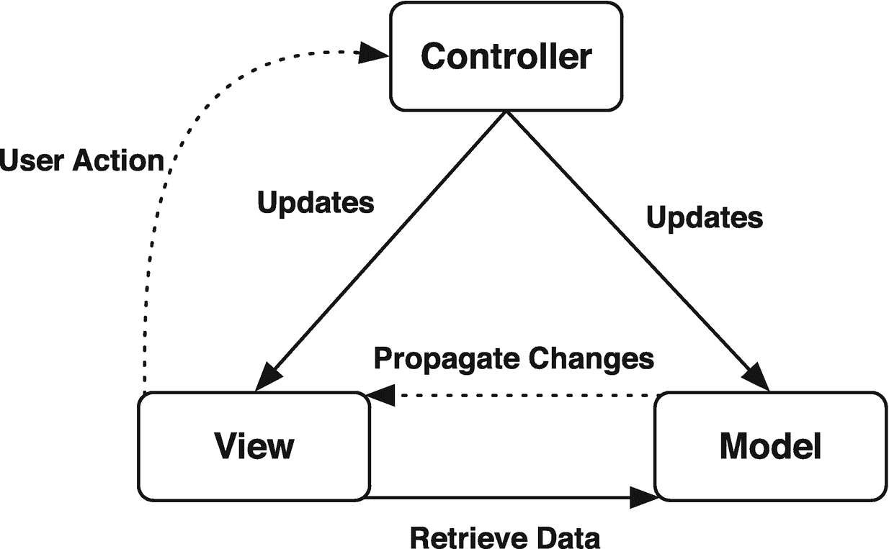
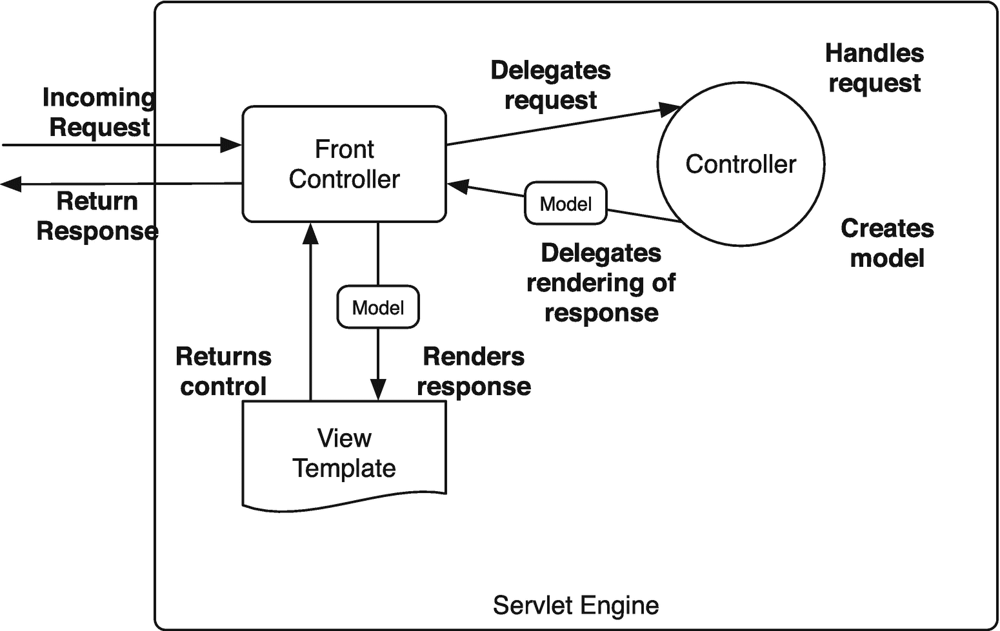
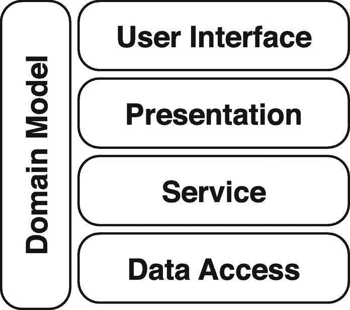
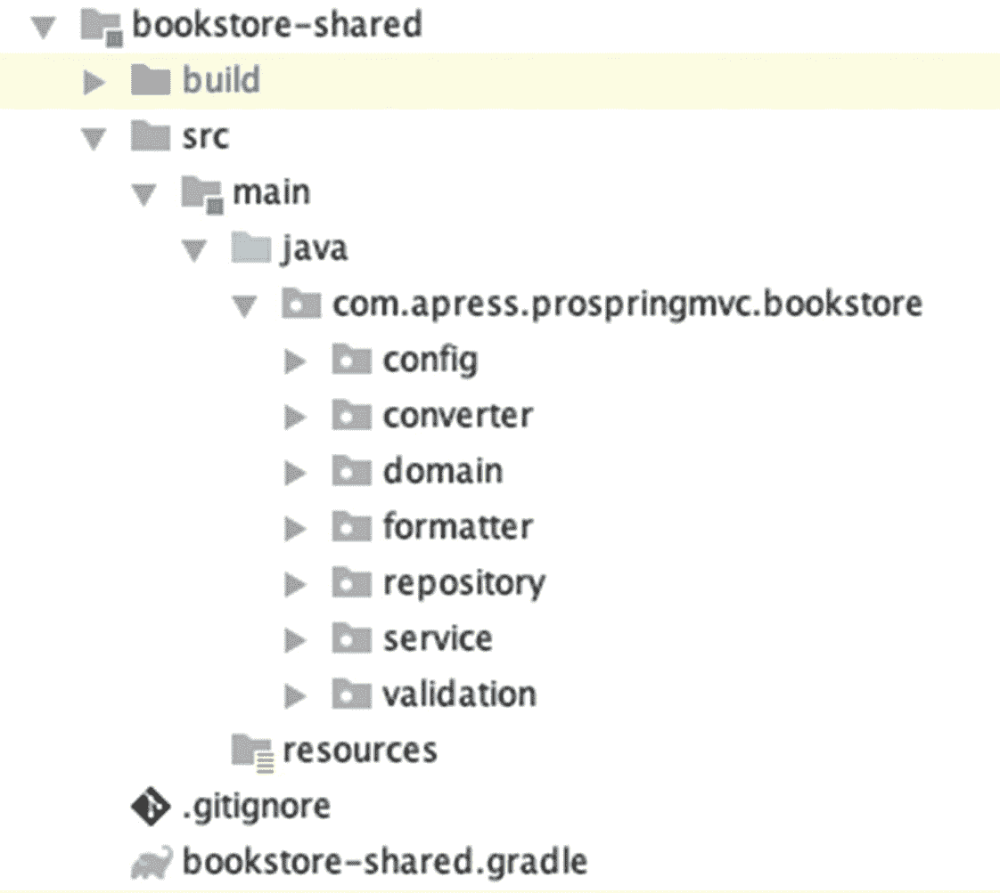

# 三、Web 应用架构

在我们开始 Spring MVC 内部的旅程之前，我们首先需要理解 web 应用的不同层。我们将从简单介绍 MVC 模式开始讨论，包括它是什么以及为什么我们应该使用它。我们还将介绍 Spring 框架提供的一些接口和类，以表达 MVC 模式的不同部分。

在回顾了 MVC 模式之后，我们将浏览 web 应用中的不同层，看看每一层在应用中扮演什么角色。我们还探索了 Spring 框架如何在不同的层中帮助我们，并利用它们为我们服务。

## MVC 模式

模型视图控制器模式(MVC 模式)最初是由 Trygve Reenskaug 在 Xerox 从事 Smalltalk 工作时描述的。当时，该模式针对的是桌面应用。这种模式将表示层分成不同种类的组件。每个组件都有自己的职责。视图使用模型来呈现自己。基于用户操作，视图触发控制器，控制器反过来更新模型。然后模型通知视图(重新)呈现自己(见图 [3-1](#Fig1) )。



图 3-1

MVC 模式

MVC 模式完全是关于关注点的分离。每个组件都有自己的角色(见表 [3-1](#Tab1) )。关注点的分离在表示层中很重要，因为它有助于我们保持不同组件的整洁。这样，我们就不会给实际视图增加业务逻辑、导航逻辑和模型数据的负担。遵循这种方法可以很好地将一切分开，这使得维护和测试我们的应用更加容易。

表 3-1

简言之，MVC

<colgroup><col class="tcol1 align-left"> <col class="tcol2 align-left"></colgroup> 
| 

**组件**

 | 

**描述**

 |
| --- | --- |
| 模型 | 模型是视图需要的数据，这样它就可以被渲染。它可能是用户下的订单或请求的图书列表。 |
| 视角 | 视图是实际的实现，它使用模型在 web 应用中呈现自己。这可能是 JSP 或 JSF 页面，但也可能是资源的 PDF、XML 或 JSON 表示。 |
| 控制器 | 控制器是负责响应用户动作的组件，比如表单提交或单击链接。控制器更新模型并采取其他所需的行动，比如调用服务方法来下订单。 |

MVC 模式的经典实现(如图 [3-1](#Fig1) 所示)包括用户触发一个动作。这将提示控制器更新模型，从而将更改推回到视图中。然后视图用来自模型的更新数据更新自己。这是 MVC 模式的理想实现，例如，它在基于 Swing 的桌面应用中工作得非常好。然而，由于 HTTP 协议的性质，这种方法在 web 环境中是不可行的。对于 web 应用，用户通常通过发出请求来启动操作。这将提示应用更新和呈现视图，并将其发送回用户。这意味着在 web 环境中我们需要一个稍微不同的方法。我们需要从服务器中提取更改，而不是将更改推送到视图中。

这种方法似乎可行，但是在 web 应用中应用起来并不像人们想象的那样简单。Web(或 HTTP)在设计上是无状态的，所以保持一个模型是很困难的。对于 Web，MVC 模式被实现为模型 2 架构(见图 [3-2](#Fig2) )。 <sup>[1](#Fn1)</sup> 原始模式(模型 1 如图 [3-1](#Fig1) 所示)与修改后的模式的区别在于，它加入了一个*前端控制器*，将传入的请求分派给其他控制器。这些控制器处理传入的请求，返回模型，并选择视图。



图 3-2

模型 2 MVC 模式

前端控制器是处理传入请求的组件。首先，它将请求委托给合适的控制器。当该控制器完成处理和更新模型时，前端控制器根据结果确定渲染哪个视图。在大多数情况下，这个前端控制器被实现为一个`javax.servlet.Servlet` servlet(例如，JSF 的`FacesServlet`)。在 Spring MVC 中，这个前端控制器是`org.springframework.web.servlet.DispatcherServlet`。

## 应用分层

在简介中，我们提到了一个应用由几层组成(见图 [3-3](#Fig3) )。我们喜欢把层看作是应用关注的领域。因此，我们也使用分层来实现关注点的分离。例如，视图不应该负担业务或数据访问逻辑，因为这些都是不同的关注点，通常位于不同的层。


图 3-3

典型应用分层

层应该被认为是概念上的边界，但是它们不必彼此物理隔离(在另一个虚拟机中)。对于 web 应用，这些层通常运行在同一个虚拟机中。Rod Johnson 的书，*专家一对一的 J2EE 设计和开发* (Wrox，2002)，对应用的分布和扩展进行了很好的讨论。

图 [3-3](#Fig3) 是应用各层的高度概括视图。数据访问在应用的底部，表示在顶部，服务(实际的业务逻辑)在中间。这一章着眼于这个架构，以及一切是如何组织的。表 [3-2](#Tab2) 提供了不同层的简要描述。

表 3-2

层的简要概述

<colgroup><col class="tcol1 align-left"> <col class="tcol2 align-left"></colgroup> 
| 

**层**

 | 

**描述**

 |
| --- | --- |
| 陈述 | 这很可能是一个基于网络的解决方案。表示层应该尽可能薄。还应该有可能提供替代的表示层，如 web 前端或 web 服务外观。这些都应该在设计良好的服务层上运行。 |
| 服务 | 包含业务逻辑的实际系统的入口点。它提供了一个粗粒度的接口，支持系统的使用。这一层也应该是系统的事务边界(可能也是安全边界)。这一层不应该知道任何关于持久性或所使用的视图技术的事情(或者知道得越少越好)。 |
| 数据存取 | 基于接口的层提供了对底层数据访问技术的访问，而无需将其暴露给上层。这一层抽象了实际的持久性框架(例如，JDBC、JPA 或类似 MongoDB 的东西)。注意，这一层不应该包含业务逻辑。 |

各层之间的交流是自上而下的。服务层可以访问数据访问层，但数据访问层不能访问服务层。如果您看到这种循环依赖悄悄进入您的应用，请后退几步，重新考虑您的设计。循环依赖(或自下而上的依赖)几乎总是糟糕设计的标志，并导致复杂性增加和更难维护的应用。

Note

有时候，你会遇到术语，*层*。许多人交替使用 tier 和 layer 然而，将它们分开有助于讨论应用架构或其部署。我们喜欢使用*层*来表示应用中的概念层，而*层*表示部署时不同机器上的层的物理分离。在*层*中思考有助于软件开发人员，而在*层*中思考有助于系统管理员。

尽管图 [3-3](#Fig3) 给出了一个 web 应用各层的概述，我们可以进一步细分。在一个典型的 web 应用中，我们可以识别五个概念层(见图 [3-4](#Fig4) )。我们可以将表示层分为 web 和用户界面层，但是应用还包括一个域层(参见本章后面的“Spring MVC 应用层”一节)。通常，领域层跨越所有层，因为从数据访问层到用户界面，它无处不在。



图 3-4

Web MVC 应用层

Note

分层架构并不是唯一的应用架构；然而，它是 web 应用最常遇到的架构。

如果你看一下样例应用，图 [3-4](#Fig4) 中显示的架构在包结构中变得清晰。这些包可以在*书店共享*项目中找到(见图 [3-5](#Fig5) )。主要包包括以下内容。

*   `com.apress.prospringmvc.bookstore.domain`:畴层

*   `com.apress.prospringmvc.bookstore.service`:服务层

*   `com.apress.prospringmvc.bookstore.repository`:数据访问层

其他包是 web 层的支持包，`com.apress.prospringmvc.bookstore.config`包包含根应用上下文的配置类。我们在本书的过程中构建的用户界面和 web 层，这些层在用户界面所需的`com.apress.prospringmvc.bookstore.web`包和百里香 <sup>[2](#Fn2)</sup> 模板中。



图 3-5

书店包装概述

## 关注点分离

正如在第 [2](02.html) 章中提到的，清楚地分离关注点是很重要的。如果你看图 [3-4](#Fig4) 中的架构，关注点的分离出现在层中。将关注点分成不同的层有助于我们实现清晰的设计和灵活且可测试的应用。

创建或检测图层可能很困难。一个经验法则是，如果一个层对其他层有太多的依赖，您可能希望引入另一个层来合并所有的依赖。另一方面，如果您在不同的层中看到一个单独的层，您可能想要重新考虑这个层，并使它成为应用的一个方面。在这种情况下，我们可以使用 Spring 框架的 AOP 功能在运行时应用这些方面(参见第 [2](02.html) 章)。

耦合层——例如，服务层需要与数据访问层对话——是通过定义清晰的接口来实现的。定义接口和接口编程减少了与具体实现的实际耦合。耦合性和复杂性的降低使得应用更易于测试和维护。使用接口的另一个好处是，Spring 可以使用 JDK 动态代理 <sup>[3](#Fn3)</sup> 来创建代理并应用 AOP。Spring 还可以使用字节码生成库(cglib)在基于类的代理上应用 AOP，该库以重新打包的形式随 Spring 框架一起提供。

要点是:应用中的分层导致更易维护和测试的应用。关注点的清晰分离也导致良好的应用架构。

## Spring MVC 应用层

您可能想知道所有的层如何适应 Spring MVC 应用，以及所有不同的层如何帮助我们构建 Spring MVC 应用。本节着眼于图 [3-4](#Fig4) 中描绘的五层。我们特别关注不同层所扮演的角色以及每一层中应该包含的内容。

### 领域层

领域是应用中最重要的一层。它是我们正在解决的业务问题的代码表示，并且包含我们领域的业务规则。这些规则可能会检查我们是否有足够的资金从我们的帐户转账，或者确保字段是唯一的(例如，我们系统中的用户名)。

确定领域模型的一个流行技术是使用用例描述中的名词作为领域对象(例如，`Account`或`Transaction`)。这些对象包含状态(例如，`Account`的用户名)和行为(例如，`Account`上的`credit`方法)。这些方法通常比服务层中的方法更细粒度。例如，在第 [2](02.html) 章的货币转移示例中，`com.apress.prospringmvc.moneytransfer.domain.Account`对象有一个`debit`和`credit`方法。credit 方法包含一些业务逻辑，用于检查我们的帐户中是否有足够的资金来转账。

在第 [2](02.html) 章中，`com.apress.prospringmvc.moneytransfer.service.MoneyTransferService`的实现使用这些支持方法来实现一个用例(在这个例子中，它将钱从一个账户转移到另一个账户)。这不要与贫血的域模型 <sup>[4](#Fn4)</sup> 相混淆，在这种模型中，我们的域对象只有状态，没有行为。

一般来说，你的领域模型不需要依赖注入；但是，这样做还是有可能的。例如，可以使用 Spring 框架和 AspectJ 在我们的域对象中实现依赖注入。在这种情况下，我们会给我们的域类加上`org.springframework.beans.factory.annotation.Configurable`注释。接下来，我们需要设置加载时编织或编译时编织，并注入我们的依赖关系。关于这个主题的更多信息，请参阅 Spring 框架文档。 <sup>[5](#Fn5)</sup>

### 用户界面层

用户界面层将应用呈现给用户。该层将服务器生成的响应呈现为用户客户端请求的类型。例如，web 浏览器可能会请求 HTML 文档，web 服务可能需要 XML 文档，而另一个客户端可能会请求 PDF 或 Excel 文档。

我们将表示层分为用户界面层和 web 层，因为尽管有各种不同的视图技术，我们还是希望尽可能多地重用代码。我们的目标是只重新实现用户界面。有许多不同的视图技术，包括 JSF、JSP(X)、FreeMarker 和百里香叶等等。在理想的情况下，我们可以在不改变应用后端的情况下切换用户界面。

Spring MVC 帮助我们将用户界面与系统的其他部分隔离开来。在 Spring 中，视图由一个界面表示:`org.springframework.web.servlet.View`。这个接口负责将来自用户的动作结果(模型)转换成用户请求的响应类型。`View`接口是通用的，它不依赖于特定的视图技术。Spring 框架或视图技术为每种支持的视图技术提供了一个实现。开箱即用，Spring 支持以下视图技术。

*   JSP

*   便携文档格式

*   超过

*   FreeMarker

*   胸腺泡

*   瓷砖 3

*   XML(封送处理、XSLT 或普通)

*   JSON(使用 Jackson 或 GSON)

*   Groovy 标记

*   脚本视图(车把、ERB、科特林脚本模板)

通常，用户界面依赖于领域层。有时候，直接暴露和呈现领域模型是很方便的。当我们开始在应用中使用表单时，这尤其有用。例如，这将让我们直接处理域对象，而不是额外的间接层。一些人认为这在层之间产生了不必要的或不想要的耦合。然而，仅仅为了从视图中分离域而创建另一层会导致不必要的复杂性和重复。在任何情况下，重要的是要记住 Spring MVC 不要求我们直接向视图公开域模型——我们是否这样做完全取决于我们自己。

### Web 层

web 层有两个职责。第一个责任是引导用户通过 web 应用。二是做服务层和 HTTP 之间的集成层。

在网站中导航用户可以像将 URL 映射到视图或像 Spring Web Flow 这样的成熟页面流解决方案一样简单。导航通常只绑定到 web 层，在域或服务层中没有任何导航逻辑。

作为集成层，web 层应该尽可能的薄。应该是这个层将传入的 HTTP 请求转换为服务层可以处理的内容，然后将来自服务器的结果(如果有)转换为用户界面的响应。web 层不应该包含任何业务逻辑，这是服务层的唯一目的。

web 层也由 cookies、HTTP 头和可能的 HTTP 会话组成。一致和透明地管理所有这些事情是 web 层的责任。不同的 HTTP 元素不应该渗入我们的服务层。如果他们这样做，整个服务层(以及我们的应用)就会与 web 环境联系在一起。这样做会增加维护和测试应用的难度。保持服务层的整洁还允许我们为不同的通道重用相同的服务。例如，它使我们能够添加 web 服务或 JMS 驱动的解决方案。web 层应该被视为连接到服务层并向最终用户公开的客户端或代理。

在 Java web 开发的早期，servlets 或 JavaServer Pages 主要实现这一层。servlets 负责处理请求并将其转换成服务层可以理解的内容。通常情况下，servlets 会将所需的 HTML 直接写回客户机。这种实现很快变得难以维护和测试。几年后，Model 2 MVC 模式出现了，我们最终拥有了高级的 Web MVC 功能。

像 Spring MVC、Struts、JSF 和 Tapestry 这样的框架为这种模式提供了不同的实现，它们都以不同的方式工作。然而，我们可以确定两种主要类型的 web 层实现:请求/响应框架(例如，struts 和 Spring MVC)和基于组件的框架(例如，JSF 和 Tapestry)。请求/响应框架对`javax.servlet.ServletRequest`和`javax.servlet.ServletResponse`对象进行操作。因此，他们在 Servlet API 上操作的事实并没有真正对用户隐藏。基于组件的框架提供了一个完全不同的编程模型。他们试图对程序员隐藏 Servlet API，并提供基于组件的编程模型。使用基于组件的框架感觉很像使用 Swing 桌面应用。

这两种方法各有利弊。Spring MVC 功能强大，在两者之间取得了很好的平衡。它可以隐藏使用 Servlet API 的事实；但是，访问该 API 很容易(尤其是)。

web 层依赖于领域层和服务层。在大多数情况下，您希望将传入的请求转换成一个域对象，并调用服务层上的方法来处理该域对象(例如，更新客户或创建订单)。Spring MVC 使得将传入的请求映射到对象变得很容易，我们可以使用依赖注入来访问服务层。

在 Spring MVC 中，web 层由带有`org.springframework.stereotype.Controller`注释的`org.springframework.web.servlet.mvc.Controller`接口或类表示。基于接口的方法是有历史的，从一开始它就是 Spring 框架的一部分；然而，它现在被认为是过时的。不管怎样，它对于简单的用例仍然有用，Spring 提供了一些现成的方便的实现。新的基于注释的方法比原来的基于接口的方法更加强大和灵活。本书的重点是基于注释的方法。

在执行一个控制器后，基础设施(参见第 [4 章](04.html)了解更多关于这个主题的信息)期待一个`org.springframework.web.servlet.ModelAndView`类的实例。这个类包含了模型(以`org.springframework.ui.ModelMap`的形式)和要呈现的视图。这个视图可以是一个实际的`org.springframework.web.servlet.View`实现或者一个视图的名称。

Caution

不要在带有`Controller`接口的类上使用`Controller`注释。这些是以不同的方式处理的，混合使用这两种策略会导致令人惊讶和不希望的结果！

### 服务层

服务层在应用的架构中非常重要。它被认为是我们应用的核心，因为它向用户公开了系统的功能(用例)。它通过提供一个粗粒度的 API 来做到这一点(如表 [3-2](#Tab2) 中所述)。清单 [3-1](#PC1) 描述了一个粗粒度的服务接口。

```java
package com.apress.prospringmvc.bookstore.service;

import com.apress.prospringmvc.bookstore.domain.Account;

public interface AccountService {

  Account save(Account account);

  Account login(String username, String password) throws AuthenticationException;

  Account getAccount(String username);

}

Listing 3-1A Coarse-Grained Service Interface

```

这个清单被认为是粗粒度的，因为它需要从客户端调用一个简单的方法来完成一个用例。这与清单 [3-2](#PC2) (细粒度服务方法)中的代码形成对比，后者需要几次调用来执行一个用例。

```java
package com.apress.prospringmvc.bookstore.service;

import com.apress.prospringmvc.bookstore.domain.Account;

public interface AccountService {

  Account save(Account account);

  Account getAccount(String username);

  void checkPassword(Account account, String password);

  void updateLastLogin(Account account);

}

Listing 3-2A Fine-Grained Service Interface

```

如果可能的话，我们不应该调用一系列方法来执行一个系统函数。我们应该尽可能地屏蔽用户的数据访问和 POJO 交互。在理想情况下，粗粒度函数应该代表一个成功或失败的工作单元。用户可以使用不同的客户端(例如，网络应用、网络服务或桌面应用)；然而，这些客户端应该执行相同的业务逻辑。因此，服务层应该是我们实际系统(即业务逻辑)的单一入口点。

在服务层使用单一入口点和粗粒度方法的额外好处是，我们可以在这一层简单地应用事务和安全性。我们不必让应用的不同客户端承担安全和事务性需求。它现在是系统核心的一部分，一般通过 AOP 来应用。

在基于 web 的环境中，我们可能有多个用户同时操作服务。服务必须是无状态的，因此将服务设为单例是一个好的做法。在领域模型中，应该尽可能地保留状态。保持服务层的无状态提供了一个额外的好处:它还使得服务层是线程安全的。

将服务层保持在单个入口点，保持层的无状态，并在该层上应用事务和安全性，这使得 Spring 框架的其他特性能够将服务层公开给不同的客户端。例如，我们可以使用配置轻松地通过 RMI 或 JMS 公开我们的服务层。有关 Spring Framework 远程支持的更多信息，我们建议使用 *Pro Spring 5* (Apress，2017)或在线 Spring Framework 文档。 <sup>[6](#Fn6)</sup>

在我们的书店示例应用中，`com.apress.prospringmvc.bookstore.service.BookstoreService`接口(参见清单 [3-3](#PC3) )充当我们的服务层的接口(还有几个其他接口，但这是最重要的一个)。这个接口包含几个粗粒度的方法。在大多数情况下，执行一个用例需要一个方法调用(例如，createOrder)。

```java
package com.apress.prospringmvc.bookstore.service;

import java.util.List;

import com.apress.prospringmvc.bookstore.domain.Account;
import com.apress.prospringmvc.bookstore.domain.Book;
import com.apress.prospringmvc.bookstore.domain.BookSearchCriteria;
import com.apress.prospringmvc.bookstore.domain.Cart;
import com.apress.prospringmvc.bookstore.domain.Category;
import com.apress.prospringmvc.bookstore.domain.Order;

public interface BookstoreService {

  List<Book> findBooksByCategory(Category category);

  Book findBook(long id);

  Order findOrder(long id);

  List<Book> findRandomBooks();

  List<Order> findOrdersForAccount(Account account);

  Order store(Order order);

  List<Book> findBooks(BookSearchCriteria bookSearchCriteria);

  Order createOrder(Cart cart, Account account);

  List<Category> findAllCategories();

}

Listing 3-3The BookstoreService Interface

```

如清单 [3-3](#PC3) 所示，服务层依赖于领域层来执行业务逻辑。然而，它也依赖于数据访问层来存储和检索底层数据存储中的数据。服务层可以作为一个或多个域对象之间的绑定器来执行业务功能。服务层应该协调它需要哪些域对象，以及它们如何相互作用。

Spring 框架没有帮助我们实现服务层的接口；然而，这并不奇怪。服务层是我们的应用的基础；事实上，它是专门为我们的应用。然而，Spring 框架可以帮助我们构建架构和编程模型。我们可以使用依赖注入和应用方面来驱动我们的事务。所有这些对我们的编程模型都有积极的影响。

### 数据访问层

数据访问层负责与底层的持久性机制进行交互。这一层知道如何在数据存储中存储和检索对象。它这样做是因为服务层不知道使用了哪个底层数据存储。(数据存储可以是数据库，但也可以由文件系统上的平面文件组成。)

创建单独的数据访问层有几个原因。首先，我们不想让服务层知道我们使用的数据存储类型；我们希望透明地处理持久性。在我们的示例应用中，我们使用内存数据库和 JPA (Java 持久性 API)来存储数据。现在想象一下，我们的 com . a press . prospring MVC . book store . domain . account 不是来自数据库，而是来自活动目录服务。我们可以简单地创建一个新的接口实现，它知道如何处理 Active Directory——而不需要改变我们的服务层。理论上，我们可以很容易地交换实现；例如，我们可以在不改变服务层的情况下从 JDBC 切换到 Hibernate。不太可能出现这种情况，但是有这种能力还是不错的。

这种方法最重要的原因是它简化了应用的测试。一般来说，数据访问很慢，所以我们必须尽可能快地运行我们的测试。一个单独的数据访问层使得创建我们的数据访问层的存根或模拟实现变得容易。

Spring 对数据访问层有很好的支持。例如，它提供了一种一致且透明的方式来处理各种数据访问框架(例如，JDBC、JPA 和 Hibernate)。对于这些技术中的每一项，Spring 都提供了对以下能力的广泛支持。

*   事务管理

*   资源处理

*   异常翻译

事务管理在其支持的每种技术中都是透明的。事务管理器处理事务，它支持 JTA (Java Transaction API ),支持分布式或全局事务(跨越多个资源的事务，如数据库和 JMS 代理)。这种出色的事务支持意味着事务管理器也可以为您管理资源。我们不再担心数据库连接或文件句柄被关闭；这都是为你处理的。支持的实现可以在`org.springframework.jdbc`和`org.springframework.orm`包中找到。

Tip

Spring Data 项目 <sup>[7](#Fn7)</sup> 提供了与几种技术的更深层次的集成。在一些用例中，它消除了编写我们自己的数据访问对象(DAO)或存储库的实现的需要。

Spring 框架包含了另一个强大的特性，作为其数据访问支持的一部分:异常翻译。Spring 为其支持的所有技术提供了广泛的异常翻译支持。这个特性将特定于技术的异常转换成`org.springframework.dao.DataAccessException`的子类。对于数据库驱动技术，它考虑数据库供应商、版本和从数据库接收的错误代码。异常层次从`java.lang.RuntimeException`开始扩展；因此，它不必被捕获，因为它不是一个检查过的异常。有关数据访问支持的更多信息，请参见 *Pro Spring 5* (Apress，2017)或在线 Spring 框架文档。

清单 [3-4](#PC4) 展示了数据访问对象或存储库的外观。注意，该接口没有引用或提及我们使用的任何数据访问技术(我们在示例应用中使用 JPA)。此外，服务层不关心数据是如何持久存储的，也不关心数据在哪里持久存储；它只是想知道如何存储或检索它。

```java
package com.apress.prospringmvc.bookstore.repository;

import com.apress.prospringmvc.bookstore.domain.Account;

public interface AccountRepository extends CrudRepository<Account, Long> {

  Account findByUsername(String username);

}

Listing 3-4A Sample AccountRepository using Spring Data

```

## 更多通往罗马的道路

这里讨论的架构并不是唯一的应用架构。哪种架构最适合给定的应用取决于应用的大小、开发团队的经验以及应用的生命周期。团队越大或者应用存在的时间越长，具有独立层的干净架构就变得越重要。

从单个静态页面开始的 web 应用可能不需要任何架构。然而，随着应用的增长，越来越重要的是，我们不要试图把所有东西都放在一个页面上，因为这将使维护或理解应用变得非常困难，更不用说测试了。

随着应用的规模和年龄的增长，我们需要重构它的设计，并记住每一层或每一个组件都应该有一个单独的职责。如果我们发现一些关注点应该在不同的层或者涉及多个组件，我们应该把它转换成应用的一个方面(横切关注点),并使用 AOP 把它应用到代码中。

当决定如何构建我们的层时，我们应该尝试为我们的系统确定一个清晰的 API(通过 Java 接口公开)。为我们的系统考虑一个 API 让我们考虑我们的设计和一个有用的和可用的 API。一般来说，如果一个 API 很难使用，它也很难测试和维护。因此，干净的 API 非常重要。此外，使用不同层之间的接口允许单独的层被独立地构建和测试。这在较大的开发团队(或者由多个较小的团队组成的团队)中是一个很大的优势。它允许我们专注于我们正在处理的功能，而不是底层或更高级别的组件。

在设计和构建应用时，使用良好的面向对象实践和模式来解决问题也很重要。例如，我们应该利用多态和继承，我们应该使用 AOP 来应用系统范围的关注点。Spring 框架还可以帮助我们在运行时将应用连接在一起。总的来说，本章描述的特性和方法可以帮助我们保持代码的整洁，并为我们的应用实现最佳的架构。

## 摘要

在这一章中，我们讨论了 MVC 模式，包括它的起源和它解决的问题。我们还简要讨论了 MVC 模式的三个组成部分:模型、视图和控制器。接下来，我们讨论了 Model 2 MVC 模式，以及使用前端控制器如何将其与 Model 1 MVC 模式区别开来。在 Spring MVC 中，这个前端控制器是`org.springframework.web.servlet.DispatcherServlet`。

接下来，我们简要介绍了一般的 web 应用架构。我们确定了 web 应用中通常可用的五个不同的层:域、用户界面、web、服务和数据访问。这些层在我们的应用中扮演着重要的角色，我们讨论了这些角色是什么以及它们是如何组合在一起的。我们还介绍了 Spring 如何在应用的不同层帮助我们。

本章的主要内容是 MVC 模式中的各种层和组件可以分离不同的关注点。每一层都应该有一个单一的职责，无论是业务逻辑还是 HTTP 世界和服务层之间的绑定器。关注点的分离有助于我们实现一个干净的架构和创建可维护的代码。最后，清晰的分层使得测试我们的应用更加容易。

下一章将深入探讨 Spring MVC。具体来说，它探索了`DispatcherServlet` servlet，包括它如何工作以及如何配置它。它还进一步研究了本章中描述的不同组件在 Spring MVC 应用中是如何工作的。

<aside aria-label="Footnotes" class="FootnoteSection" epub:type="footnotes">Footnotes [1](#Fn1_source)

[T2`https://en.wikipedia.org/wiki/JSP_model_2_architecturel`](https://en.wikipedia.org/wiki/JSP_model_2_architecturel)

  [2](#Fn2_source)

[T2`https://www.thymeleaf.org`](https://www.thymeleaf.org)

  [3](#Fn3_source)

[T2`https://docs.oracle.com/javase/8/docs/technotes/guides/reflection/proxy.html`](https://docs.oracle.com/javase/8/docs/technotes/guides/reflection/proxy.html)

  [4](#Fn4_source)

[T2`https://martinfowler.com/bliki/AnemicDomainModel.html`](https://martinfowler.com/bliki/AnemicDomainModel.html)

  [5](#Fn5_source)

[T2`https://docs.spring.io/spring/docs/current/spring-framework-reference/core.html#aop-atconfigurable`](https://docs.spring.io/spring/docs/current/spring-framework-reference/core.html%2523aop-atconfigurable)

  [6](#Fn6_source)

[T2`https://docs.spring.io/spring/docs/current/spring-framework-reference/index.html`](https://docs.spring.io/spring/docs/current/spring-framework-reference/index.html)

  [7](#Fn7_source)

[T2`https://spring.io/projects/spring-data`](https://spring.io/projects/spring-data)

 </aside>