# 四、Spring MVC 架构

本章深入 Spring MVC 的内部，仔细观察`org.springframework.web.servlet.DispatcherServlet`。首先，学习 servlet 如何处理传入的请求，并确定哪些组件在请求处理中起作用。在确定了这些组件之后，我们将更深入地研究它们的角色、功能和实现。您还将学习如何配置`org.springframework.web.servlet.DispatcherServlet`，部分是通过检查 Spring Boot 的默认配置和扩展配置。

## DispatcherServlet 请求处理工作流

在前一章中，你学习了前端控制器在 Model 2 MVC 模式中扮演的重要角色。前端控制器负责将传入的请求分派给正确的处理程序，并准备将响应呈现为用户希望看到的内容。Spring MVC 中前端控制器的角色由`org.springframework.web.servlet.` `DispatcherServlet`扮演。这个 servlet 使用几个组件来完成它的角色。所有这些组件都表示为接口，对于这些接口，有一个或多个实现是可用的。下一节将探讨这些组件在请求处理工作流中扮演的一般角色。下一节将介绍接口的不同实现。

我们特意使用了**处理者**这个术语。DispatcherServlet 非常灵活且可定制，它可以处理比`org.springframework.web.servlet.mvc.Controller`实现或`org.springframework.stereotype.Controller`注释类更多类型的处理程序。

### 工作流程

图 [4-1](#Fig1) 显示了请求处理工作流程的高级概述。

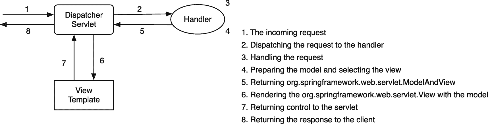

图 4-1

请求处理工作流

在前面的章节中，您学习了关注点分离的重要性。在 Spring 框架中，应用了相同的规则。考虑到可扩展性和关注点的分离，许多支持组件被设计为接口。虽然图 [4-1](#Fig1) 中的高层概述是正确的，但幕后发生的更多。图 [4-2](#Fig2) 显示了请求处理工作流程的完整视图。

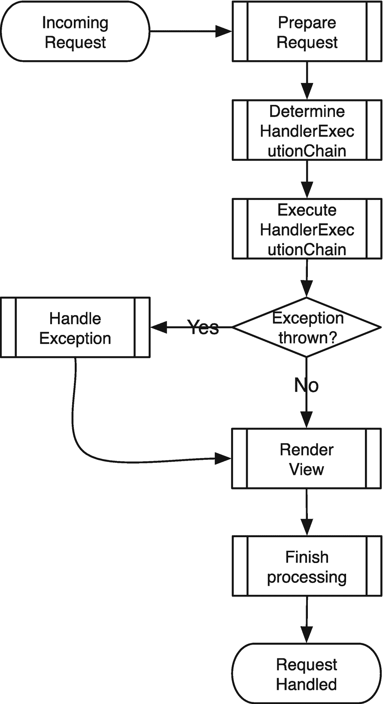

图 4-2

请求处理工作流

图 [4-2](#Fig2) 提供了`DispatcherServlet`内部请求处理工作流程的全局概览。以下部分将详细介绍这个流程中的不同步骤。

#### 准备请求

在`DispatcherServlet`开始分派和处理请求之前，它准备并预处理请求。servlet 通过使用`org.springframework.web.servlet.LocaleResolver`确定和公开当前请求的当前`java.util.Locale`来启动。接下来，它在`org.springframework.web.context.request.RequestContextHolder`中准备并公开当前请求。这使得框架代码很容易访问当前请求，而不是传递它。

接下来，servlet 构造了`org.springframework.web.servlet.FlashMap implementation`。它通过调用试图解析输入`FlashMap`的`org.springframework.web.servlet.FlashMapManager`来做到这一点。这个映射包含在前一个请求中显式存储的属性。一般来说，这在重定向到下一页时使用。这个主题将在第 5 章中进行深入讨论。

接下来，检查传入的请求以确定它是否是一个多部分 HTTP 请求(这在进行文件上传时使用)。如果是这样，请求通过一个`org.springframework.web.multipart.MultipartResolver`组件被包装在`org.springframework.web.multipart.MultipartHttpServletRequest`中。在此之后，请求准备好被分派给正确的处理程序。图 [4-3](#Fig3) 显示了请求处理工作流程第一部分的流程图。

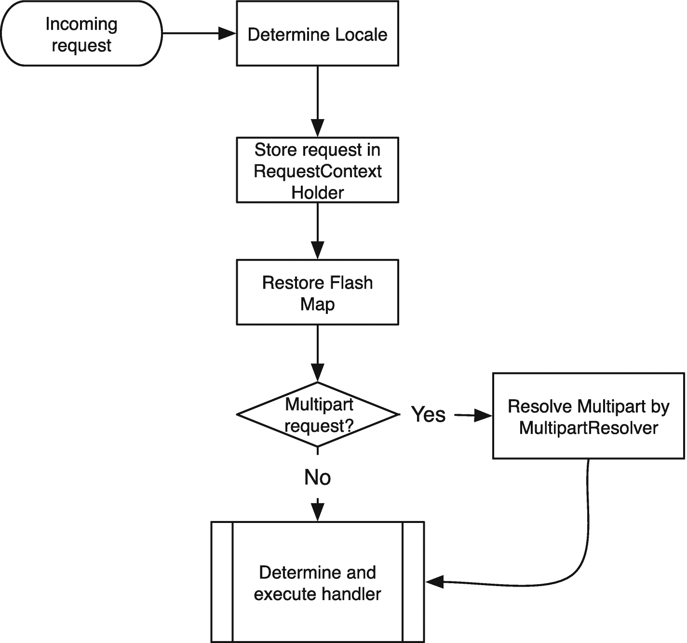

图 4-3

请求处理流程的开始

#### 确定处理程序执行链

几个组件参与分派请求(见图 [4-4](#Fig4) )。当请求准备好分派时，`DispatcherServlet`咨询一个或多个`org.springframework.web.servlet.HandlerMapping`实现来确定哪个处理程序可以处理该请求。如果没有找到处理程序，HTTP 404 响应将被发送回客户端。HandlerMapping 返回`org.springframework.web.servlet.HandlerExecutionChain`(您将在下一节了解更多)。当处理程序确定后，servlet 试图找到`org.springframework.web.servlet.HandlerAdapter`来执行找到的处理程序。如果找不到合适的`HandlerAdapter`，则抛出`javax.servlet.ServletException`。

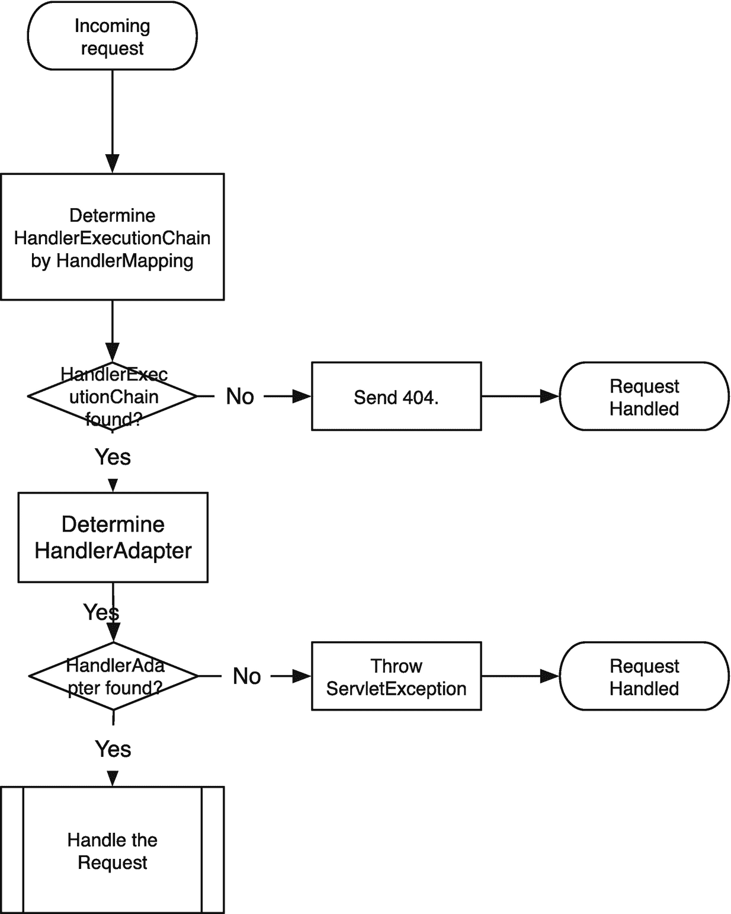

图 4-4

分派请求

#### 执行处理程序执行链

为了处理请求，`DispatcherServlet`使用`HandlerExecutionChain class`来决定执行什么。该类包含对需要调用的实际处理程序的引用；然而，它也(可选地)引用在处理程序执行之前(`preHandle`方法)和之后(`postHandle`方法)执行的`org.springframework.web.servlet.HandlerInterceptor`实现。这些拦截器可以应用横切功能(参见第 [6](06.html) 章了解更多关于这个主题的信息)。如果代码执行成功，拦截器会以相反的顺序再次被调用；最后，当需要时，视图被渲染(见图 [4-5](#Fig5) )。

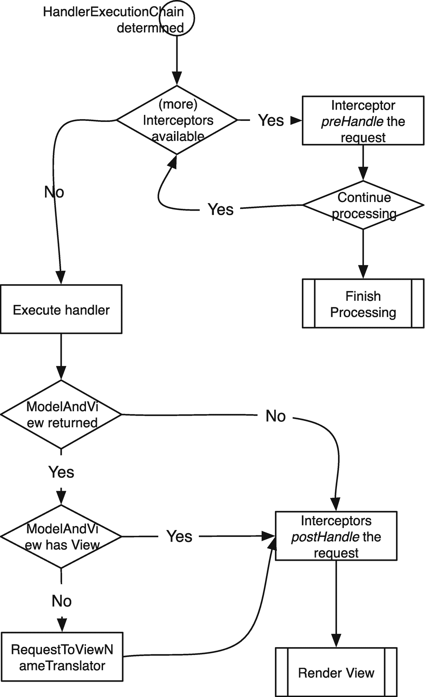

图 4-5

处理请求

处理程序的执行被委托给在上一步中确定的选定的`HandlerAdapter`。它知道如何执行选定的处理程序，并将响应翻译成`org.springframework.web.servlet.ModelAndView`。

如果返回的`model and view`中没有视图，则根据传入的请求查询`org.springframework.web.servlet.RequestToViewNameTranslator`以生成视图名称。

#### 处理程序异常

当在处理请求的过程中抛出异常时，`DispatcherServlet`咨询已配置的`org.springframework.web.servlet.HandlerExceptionResolver`实例来处理抛出的异常。解析器可以将异常转换成视图向用户显示。例如，如果有一个与数据库错误相关的异常，您可以显示一个页面，指示数据库关闭。如果异常没有得到解决，它将被重新抛出并由 servlet 容器处理，这通常会导致 HTTP 500 响应代码(内部服务器错误)。图 [4-6](#Fig6) 显示了请求处理工作流程的这一部分。

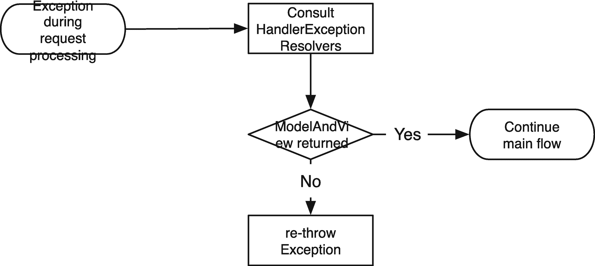

图 4-6

异常处理

#### 渲染视图

如果在请求处理工作流程中选择了一个视图，`DispatcherServlet`首先检查它是否是一个视图引用(如果视图是`java.lang.String`就是这种情况)。如果是这样的话，那么将参考已配置的`org.springframework.web.servlet.ViewResolver`bean 来解析对实际`org.springframework.web.servlet.View`实现的视图引用。如果没有观点和一个不能解决，`javax.servlet.ServletException`被抛出。图 [4-7](#Fig7) 显示了视图渲染过程。

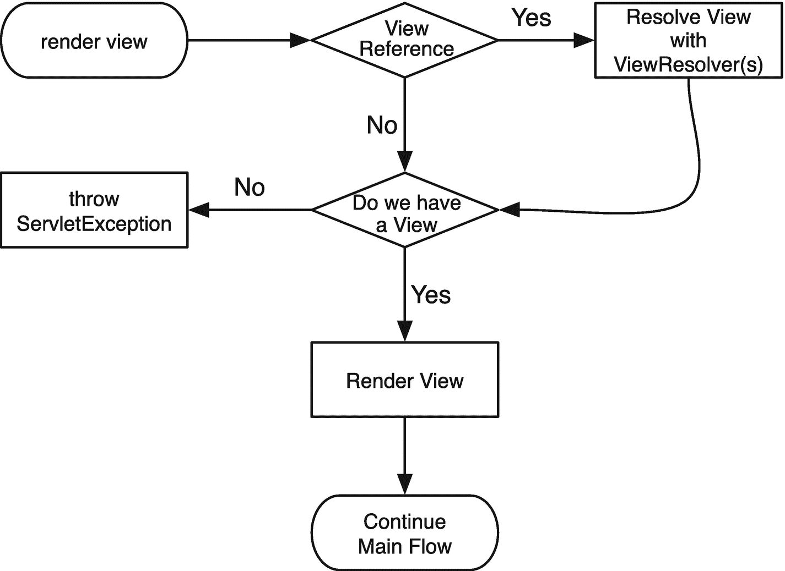

图 4-7

视图渲染过程

#### 完成加工

每个传入的请求都经过请求处理流程的这一步，不管是否有异常。如果一个`handler execution chain`可用，拦截器的`afterCompletion`方法被调用。只有成功调用了`preHandle`方法的拦截器才会调用它们的`afterCompletion`方法。接下来，这些拦截器以调用它们的`preHandle`方法的相反顺序执行。这模拟了 servlet 过滤器中的行为，其中第一个被调用的过滤器也是最后一个被调用的过滤器。

最后，`DispatcherServlet`使用 Spring 框架中的事件机制来触发`org.springframework.web.context.support.RequestHandledEvent`(见图 [4-8](#Fig8) )。您可以创建并配置`org.springframework.context.ApplicationListener`来接收和记录这些事件。

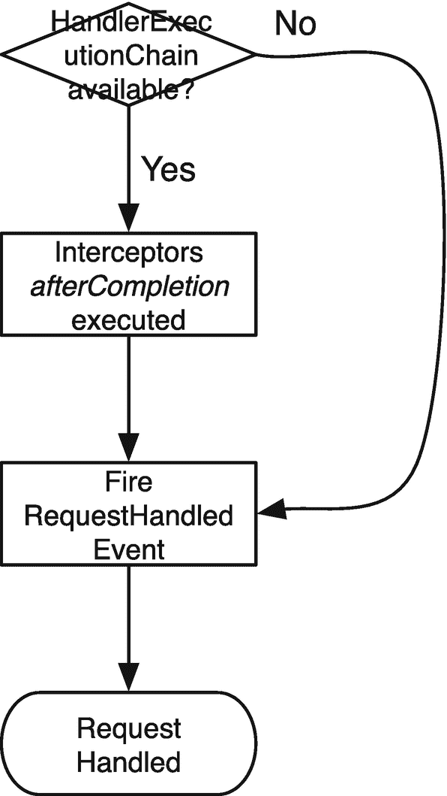

图 4-8

完成加工

### 请求处理摘要

`DispatcherServlet`是使用 Spring MVC 处理请求的关键组件。它也是高度灵活和可配置的。这种灵活性来自于这样一个事实，即 servlet 使用许多不同的组件来完成它的角色，并且这些组件被表示为接口。表 [4-1](#Tab1) 给出了请求处理工作流中涉及的所有主要组件类型的概述。

表 4-1

请求处理工作流中使用的 DispatcherServlet 组件

<colgroup><col class="tcol1 align-left"> <col class="tcol2 align-left"></colgroup> 
| 

组件类型

 | 

描述

 |
| --- | --- |
| `org.springframework.web.multipart.MultipartResolver` | 处理多部分表单处理的策略接口 |
| `org.springframework.web.servlet.LocaleResolver` | 区域解析和修改策略 |
| `org.springframework.web.servlet.ThemeResolver` | 主题解析和修改的策略 |
| `org.springframework.web.servlet.HandlerMapping` | 将传入请求映射到处理程序对象的策略 |
| `org.springframework.web.servlet.HandlerAdapter` | 处理程序对象类型执行处理程序的策略 |
| `org.springframework.web.servlet.HandlerExceptionResolver` | 处理处理程序执行期间引发的异常的策略 |
| `org.springframework.web.servlet.RequestToViewNameTranslator` | 处理程序返回 none 时确定视图名称的策略 |
| `org.springframework.web.servlet.ViewResolver` | 将视图名称转换为实际视图实现的策略 |
| `org.springframework.web.servlet.FlashMapManager` | 模拟 flash 范围的策略 |

在接下来的章节中，您将看到如何配置`DispatcherServlet`。您还将进一步了解各种组件的不同实现。

## 前端控制器

像任何 servlet 一样，`org.springframework.web.servlet.DispatcherServlet`需要进行配置，以便 web 容器可以引导和映射 servlet。这样，它可以处理请求。配置`DispatcherServlet`是一个双向过程。首先，您需要告诉容器加载一个 servlet，并将其映射到一个或多个 URL 模式。

在引导之后，servlet 使用创建的`org.springframework.web.context.WebApplicationContext`来配置自己。servlet 试图从这个应用上下文中检测所需的组件，如果没有找到，它将使用默认值(在大多数情况下)。

### 引导调度程序 Servlet

servlet 规范(从版本 3.0 开始)有几个配置和注册 servlet 的选项。

*   选项 1:使用一个`web.xml`文件(参见清单 [4-1](#PC1) )。

*   选项 2:使用一个`web-fragment.xml`文件(参见清单 [4-2](#PC2) )。

*   选项 3:使用`javax.servlet.ServletContainerInitializer`(见清单 [4-3](#PC3) )。

*   选项 4:示例应用使用 Spring 5.2，因此您可以通过实现`org.springframework.web.WebApplicationInitializer`接口获得第四个选项。

*   选项 5:使用 Spring Boot 自动配置`DispatcherServlet.`

dispatcher servlet 需要一个`web application context`,它应该包含使 dispatcher servlet 能够配置自身的所有 beans。默认情况下，dispatcher servlet 创建`org.springframework.web.context.support.XmlWebApplicationContext`。

接下来的部分中的所有样本加载`org.springframework.web.servlet.DispatcherServlet`并将其映射到所有传入的请求(`/`)。所有这些配置都导致 servlet 的相同运行时设置。只是你做这件事的机制不同。本书的其余部分使用选项 4 来配置示例应用。

 `org.springframework.web.context.WebApplicationContext`是`org.springframework.context.ApplicationContext`的专门扩展，在网络环境中是需要的(更多信息见第 [2 章](02.html))。

您在本书中构建的示例应用尽可能多地使用选项 5 来配置环境和应用。然而，您将学习配置 servlet 的所有四个选项的基本设置。

#### 使用 web.xml

自从 servlet 规范出现以来,`web.xml`文件就一直存在。它是一个 XML 文件，包含引导 servlet、监听器和/或过滤器所需的所有配置。清单 [4-1](#PC1) 显示了引导`DispatcherServlet`所需的最小 web.xml 配置。`web.xml`文件必须在 web 应用的`WEB-INF`目录中(这由 servlet 规范决定)。

```java
<web-app xmlns:="http://xmlns.jcp.org/xml/ns/javaee"
  xmlns:xsi="http://www.w3.org/2001/XMLSchema-instance"
  xsi:schemaLocation="http://xmlns.jcp.org/xml/ns/javaee
                      http://xmlns.jcp.org/xml/ns/javaee/web-app_4_0.xsd"
  version="4.0" metadata-complete="true">

  <servlet>
    <servlet-name>bookstore</servlet-name>
    <servlet-class>org.springframework.web.servlet.DispatcherServlet</servlet-class>
    <load-on-startup>1</load-on-startup>
  </servlet>

  <servlet-mapping>
    <servlet-name>bookstore</servlet-name>
    <url-pattern>/</url-pattern>
  </servlet-mapping>

</web-app>

Listing 4-1The web.xml Configuration (Servlet 4.0)

```

默认情况下，dispatcher servlet 从`WEB-INF`目录加载一个名为`[servletname]-servlet.xml`的文件。

web-app 元素中的`metadata-complete`属性指示 servlet 容器不要扫描`javax.servlet.ServletContainerInitializer`实现的类路径；它也不扫描`web-fragment.xml`文件。将这个属性添加到您的`web.xml`中会大大增加启动时间，因为它会扫描类路径，这在大型应用中需要时间。

#### 使用 web-fragment.xml

web-fragment.xml 特性从 servlet 规范的 3.0 版本开始就可用了，它允许对 web 应用进行更加模块化的配置。`web-fragment.xml`必须在 jar 文件的`META-INF`目录中。它不会在 web 应用的`META-INF`中被检测到；它必须在一个 jar 文件中。`web-fragment.xml`可以包含与`web.xml`相同的元素(参见清单 [4-2](#PC2) )。

这种方法的好处是打包成 jar 文件的每个模块都有助于 web 应用的配置。这也被认为是一个缺点，因为现在你已经将你的配置分散到你的代码库，这在更大的项目中可能是麻烦的。

```java
<web-fragment xmlns:="http://java.sun.com/xml/ns/javaee"
              xmlns:xsi="http://www.w3.org/2001/XMLSchema-instance"
              xsi:schemaLocation="http://xmlns.jcp.org/xml/ns/javaee http://xmlns.jcp.org/xml/ns/javaee/web-fragment_4_0.xsd"
              version="4.0" metadata-complete="true">

  <servlet>
    <servlet-name>bookstore</servlet-name>
    <servlet-class>org.springframework.web.servlet.DispatcherServlet</servlet-class>
    <load-on-startup>1</load-on-startup>
  </servlet>

  <servlet-mapping>
    <servlet-name>bookstore</servlet-name>
    <url-pattern>/*</url-pattern>
  </servlet-mapping>

</web-fragment>

Listing 4-2The web-fragment.xml Configuration (Servlet 4.0)

```

#### 使用 ServletContainerInitializer

servlet 规范的 3.0 版本引入了使用基于 Java 的方法来配置 web 环境的选项(参见清单 [4-3](#PC3) )。Servlet 3.0+兼容容器扫描类路径，寻找实现`javax.servlet.ServletContainerInitializer`接口的类，并调用这些类的`onStartup`方法。通过在这些类上添加一个`javax.servlet.annotation.HandlesTypes`注释，您还可以得到进一步配置 web 应用所需的类(这是允许第四个选项使用`org.springframework.web.WebApplicationInitializer`的机制)。

像 web 片段一样，`ServletContainerInitializer`允许 web 应用的模块化配置，但是现在是以基于 Java 的方式。使用 Java 给你带来了使用 Java 语言代替 XML 的所有好处。此时，您有了强类型，可以影响 servlet 的构造，并且有了配置 servlet 的更简单的方法(在 XML 文件中，这是通过在 XML 文件中添加 init-param 和/或 context-param 元素来完成的)。

```java
package com.apress.prospringmvc.bookstore.web;

import java.util.Set;

// javax.servlet imports omitted.

import org.springframework.web.servlet.DispatcherServlet;

public class BookstoreServletContainerInitializer
  implements ServletContainerInitializer {

  @Override
  public void onStartup(Set<Class<?>> classes, ServletContext servletContext)
  throws ServletException {

    ServletRegistration.Dynamic registration;
    registration = servletContext.addServlet("ds", DispatcherServlet.class);
    registration.setLoadOnStartup(1);
    registration.addMapping("/");
  }
}

Listing 4-3A Java-based Configuration

```

#### 使用 WebApplicationInitializer

现在是时候看看在使用 Spring 时配置应用的选项 4 了。Spring 提供了一个`ServletContainerInitializer`实现(`org.springframework.web.SpringServletContainerInitializer)`，让生活变得更简单一些(参见清单 [4-4](#PC4) )。Spring 框架提供的实现检测并实例化所有实例`of org.springframework.web.` `WebApplicationInitializer` `and calls the onStartup`这些实例的方法。

```java
package com.apress.prospringmvc.bookstore.web;

// javax.servlet imports omitted

import org.springframework.web.WebApplicationInitializer;
import org.springframework.web.servlet.DispatcherServlet;

public class BookstoreWebApplicationInitializer
  implements WebApplicationInitializer {

  @Override
  public void onStartup(ServletContext servletContext)
  throws ServletException {

    ServletRegistration.Dynamic registration
    registration = servletContext.addServlet("dispatcher", DispatcherServlet.class);
    registration.addMapping("/");
    registration.setLoadOnStartup(1);
  }
}

Listing 4-4The WebApplicationInitializer Configuration

```

使用这个特性会影响应用的启动时间！首先，servlet 容器需要扫描所有`javax.servlet.ServletContainerInitializer`实现的类路径。其次，扫描类路径中的`org.springframework.web.WebApplicationInitializer`实现。在大型应用中，这种扫描可能需要一些时间。

不要直接实现`WebApplicationInitializer,`,而是使用 Spring 的一个类。

#### 使用 Spring Boot

使用 Spring Boot 时，不需要手动配置`DispatcherServlet`。Spring Boot 根据检测到的配置自动进行配置。表 [4-2](#Tab2) 中提到的属性大多可以通过`spring.mvc`名称空间中的属性进行配置。基本样品见清单 [4-5](#PC5) 。

```java
package com.apress.prospringmvc.bookstore;

@SpringBootApplication
public class BookstoreApplication {

  public static void main(String[] args) {
    SpringApplication.run(BookstoreApplication.class, args);
  }
}

Listing 4-5BookstoreApplication Using Spring Boot

```

在经典的战争应用中使用 Spring Boot 时，需要一个专门的`WebApplicationInitializer`。Spring Boot 为此提供了`SpringBootServletInitializer`。样本见清单 [4-6](#PC6) 。

```java
package com.apress.prospringmvc.bookstore;

@SpringBootApplication
public class BookstoreApplication extends SpringBootServletInitializer {

  public static void main(String[] args) {
    SpringApplication.run(BookstoreApplication.class, args);
  }

  @Override
  protected SpringApplicationBuilder configure(SpringApplicationBuilder builder) {
        return builder.sources(BookstoreApplication.class);
    }
}

Listing 4-6BookstoreApplication Using Spring Boot in a WAR

```

### 配置 DispatcherServlet

配置`org.springframework.web.servlet.DispatcherServlet`是一个两步过程。第一步是通过直接在 dispatcher servlet(声明)上设置属性来配置 servlet 的行为。第二步是在应用上下文中配置组件(初始化)。

dispatcher servlet 附带了许多组件的默认设置。这使您不必为基本行为做大量的配置，并且您可以根据需要覆盖和扩展配置。除了 dispatcher servlet 的默认配置之外，Spring MVC 也有一个默认配置。这可以通过使用`org.springframework.web.servlet.config.annotation.EnableWebMvc`注释来启用(参见第 [2](02.html) 章中的“启用功能”一节)。

使用 Spring Boot 时，不需要添加`@EnableWebMvc`，因为当 Spring Boot 在类路径上检测到 Spring MVC 时，它默认是启用的。

#### DispatcherServlet 属性

dispatcher servlet 有几个可以设置的属性。所有这些属性都有一个 setter 方法，并且都可以通过编程或包含 servlet 初始化参数来设置。表 [4-2](#Tab2) 列出并描述了 dispatcher servlet 上可用的属性。

表 4-2

DispatcherServlet 的属性

<colgroup><col class="tcol1 align-left"> <col class="tcol2 align-left"> <col class="tcol3 align-left"></colgroup> 
| 

财产

 | 

默认

 | 

描述

 |
| --- | --- | --- |
| `cleanupAfterInclude` | 真实的 | 指示是否在包含请求后清除请求属性。通常，缺省值就足够了，只有在特殊情况下才应该将该属性设置为 false。 |
| `contextAttribute` | 空 | 存储此 servlet 的应用上下文。如果应用上下文是通过 servlet 本身之外的某种方式创建的，这将非常有用。 |
| `contextClass` | `org.springframework.web.context.support.XmlWebApplicationContext` | 配置 servlet 要构造的`org.springframework.web.context.WebApplicationContext`的类型(它需要一个默认的构造函数)。使用给定的`contextConfigLocation`进行配置。如果使用构造函数传入应用上下文，则不需要它。 |
| `contextConfigLocation` | `[servlet-name]-servlet.xml` | 指示指定应用上下文类的配置文件的位置。 |
| `contextId` | 空 | 提供应用上下文 ID。例如，这在上下文被记录或发送到`System.out`时使用。 |
| `contextInitializerscontextInitializerClasses` | `Null` | 使用可选的`org.springframework.context.ApplicationContextInitializer`类为应用上下文执行一些初始化逻辑，比如激活某个概要文件。 |
| `detectAllHandlerAdapters` | `True` | 从应用上下文中检测所有的`org.springframework.web.servlet.HandlerAdapter`实例。当设置为`false`时，使用特殊名称`handlerAdapter`检测单个信号。 |
| `detectAllHandlerExceptionResolvers` | `True` | 从应用上下文中检测所有的`org.springframework.web.servlet.HandlerExceptionResolver`实例。当设置为`false`时，使用特殊名称`handlerExceptionResolver`检测单个信号。 |
| `detectAllHandlerMappings` | `True` | 从应用上下文中检测所有的`org.springframework.web.servlet.HandlerMapping`bean。当设置为`false`时，使用特殊名称`handlerMapping`检测单个信号。 |
| `detectAllViewResolvers` | `True` | 从应用上下文中检测所有的`org.springframework.web.servlet.ViewResolver`bean。当设置为`false`时，使用特殊名称`viewResolver`检测单个信号。 |
| `dispatchOptionsRequest` | `False` | 指示是否处理 HTTP 选项请求。默认为`false`；当设置为`true`时，还可以处理 HTTP OPTIONS 请求。 |
| `dispatchTraceRequest` | `False` | 指示是否处理 HTTP 跟踪请求。默认值为 false 当设置为`true`时，还可以处理 HTTP 跟踪请求。 |
| `environment` | `org.springframework.web.context.support.StandardServletEnvironment` | 为这个 servlet 配置`org.springframework.core.env.Environment`。环境指定哪个配置文件是活动的，并且可以保存特定于该环境的属性。 |
| 命名空间 | `[servletname]-servlet` | 使用此命名空间来配置应用上下文。 |
| `publishContext` | `True` | 指示 servlet 的应用上下文是否被发布到`javax.servlet.ServletContext`。对于生产，我们建议您将此设置为`false`。 |
| `publishEvents` | `True` | 指示请求处理后是否触发`org.springframework.web.context.support.ServletRequestHandledEvent`。您可以使用`org.springframework.context.ApplicationListener`来接收这些事件。 |
| `threadContextInheritable` | `False` | 指示是否向从请求处理线程创建的子线程公开`LocaleContext`和`RequestAttributes`。 |

#### 应用上下文

`org.springframework.web.servlet.DispatcherServlet`需要`org.springframework.web.context.WebApplicationContext`用需要的组件来配置自己。您可以让 servlet 自己构造一个，或者使用构造函数来传递应用上下文。在基于 XML 的配置文件中，使用第一个选项(因为无法构造应用上下文)。在基于 Java 的配置中，使用第二个选项。

在示例应用中，`com.apress.prospringmvc.bookstore.web.BookstoreWebApplicationInitializer class`引导应用。要启用基于 Java 的配置，您需要指示 servlet 使用基于 Java 的应用上下文(默认情况下是基于 XML 的上下文),并向它传递配置类。您使用`org.springframework.web.context.support.AnnotationConfigWebApplicationContext`类来设置应用和配置 servlet。清单 [4-7](#PC7) 中的变更以粗体突出显示。

```java
package com.apress.prospringmvc.bookstore.web;

// javax.servlet imports omitted.

import org.springframework.web.WebApplicationInitializer;
import org.springframework.web.context.WebApplicationContext;
import org.springframework.web.context.support.AnnotationConfigWebApplicationContext;
import org.springframework.web.servlet.DispatcherServlet;
import com.apress.prospringmvc.bookstore.web.config.WebMvcContextConfiguration;

public class BookstoreWebApplicationInitializer implements WebApplicationInitializer {

  @Override
  public void onStartup(final ServletContext servletContext) throws ServletException {
    registerDispatcherServlet(servletContext);
  }

  private void registerDispatcherServlet(final ServletContext servletContext) {
    WebApplicationContext dispatcherContext = createContext(WebMvcContextConfiguration.class);
    DispatcherServlet dispatcherServlet = new DispatcherServlet(dispatcherContext);
    ServletRegistration.Dynamic dispatcher;
    dispatcher = servletContext.addServlet("dispatcher", dispatcherServlet);

    dispatcher.setLoadOnStartup(1);
    dispatcher.addMapping("/");
  }

  private WebApplicationContext createContext(final Class<?>... annotatedClasses) {

    AnnotationConfigWebApplicationContext
       context = new AnnotationConfigWebApplicationContext();
    context.register(annotatedClasses);
    return context;
  }
}

Listing 4-7The BookstoreWebApplicationInitializer with ApplicationContext

```

清单 [4-7](#PC7) 展示了如何构造`org.springframework.web.servlet.DispatcherServlet`并传递给它一个应用上下文。这是配置 servlet 的最基本的方式。

第 [2 章](02.html)封面人物简介。要选择一个概要文件，您可以包含一个 servlet 初始化参数(参见第 [2](02.html) 章)；然而，为了更加动态，您可以使用`org.springframework.context.ApplicationContextInitializer`。这种初始化器在加载所有 beans 之前初始化应用上下文。

当您想要配置或设置想要使用的配置文件时，这在 web 应用中非常有用(更多信息，请参见第 [2](02.html) 章)。例如，您可能需要设置一个自定义系统属性。或者，您可以通过读取文件系统上的某个文件或选择基于操作系统的配置文件来检测配置文件。你有几乎无限多的选择。

```java
packag* org.cloudfoundry.reconfiguration.spring;

// Other imports omitted

import org.cloudfoundry.runtime.env.CloudEnvironment;
import org.springframework.context.ApplicationContextInitializer;
import org.springframework.context.ConfigurableApplicationContext;
import org.springframework.core.Ordered;
import org.springframework.core.env.ConfigurableEnvironment;
import org.springframework.core.env.EnumerablePropertySource;
import org.springframework.core.env.PropertiesPropertySource;
import org.springframework.core.env.PropertySource;

public final class CloudApplicationContextInitializer
implements ApplicationContextInitializer<ConfigurableApplicationContext>, Ordered {

  private static final Log logger = LogFactory.getLog(CloudApplicationContextInitializer.class);

  private static final int DEFAULT_ORDER = 0;
  private ConfigurableEnvironment springEnvironment;
  private CloudEnvironment cloudFoundryEnvironment;

  public CloudApplicationContextInitializer() {
    cloudFoundryEnvironment = new CloudEnvironment();
  }

  @Override
  public void initialize(ConfigurableApplicationContext applicationContext) {

    if (!cloudFoundryEnvironment.isCloudFoundry()) {
      logger.info("Not running on Cloud Foundry.");
      return;
    }

    try {
      logger.info("Initializing Spring Environment for Cloud Foundry");
      springEnvironment = applicationContext.getEnvironment();
      addPropertySource(buildPropertySource());
      addActiveProfile("cloud");
    } catch(Throwable t) {
      // be safe
      logger.error("Unexpected exception on initialization: " + t.getMessage**(), t);
    }
  }

// Other methods omitted
}

Listing 4-8The CloudApplicationContextInitializer

```

#### 组件分辨率

当 servlet 被配置时，它从 servlet 容器接收一个初始化请求。当 servlet 初始化时，它使用逻辑来检测所需的组件(参见图 [4-9](#Fig9) )。

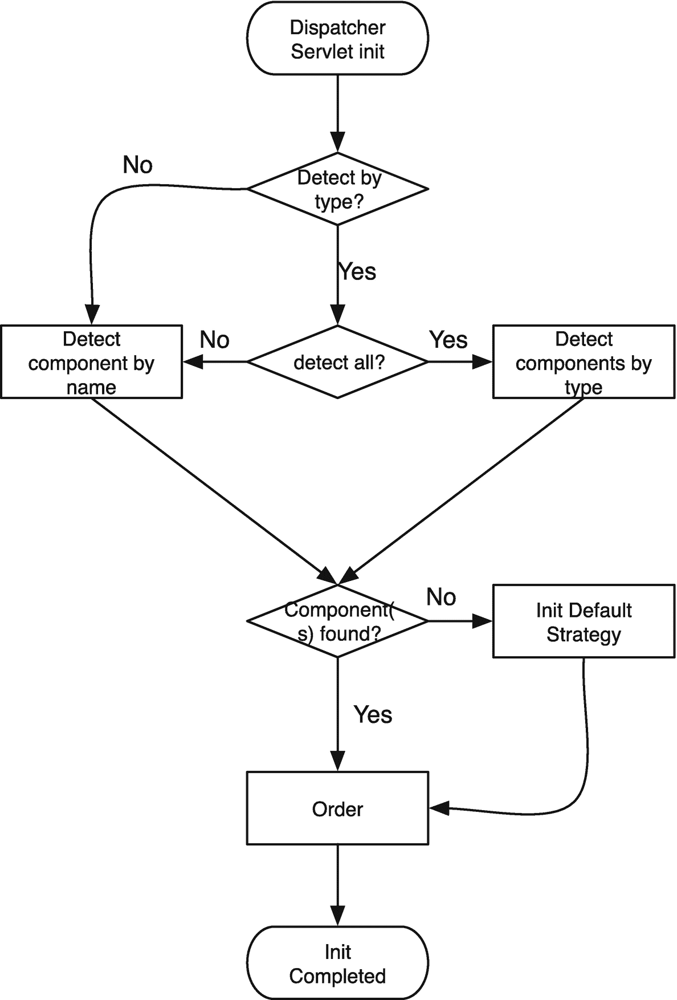

图 4-9

DispatcherServlet 的组件发现

有些组件是通过类型来检测的，而有些是通过名称来检测的。对于类型可检测的组件，您可以指定(见表 [4-2](#Tab2) )您不想这样做。在这种情况下，组件由一个众所周知的名称来检测。表 [4-3](#Tab3) 列出了请求处理中涉及的不同组件以及用于检测它的 bean 名称。该表还指示 dispatcher servlet 是否自动检测多个实例(如果可以禁用 yes，则按照表中指定的名称检测单个 bean)。

表 4-3

组件及其名称

<colgroup><col class="tcol1 align-left"> <col class="tcol2 align-left"> <col class="tcol3 align-left"></colgroup> 
| 

成分

 | 

默认 Bean 名称

 | 

检测多个

 |
| --- | --- | --- |
| `org.springframework.web.multipart.MultipartResolver` | `multipartResolver` | 不 |
| `org.springframework.web.servlet.LocaleResolver` | `localeResolver` | 不 |
| `org.springframework.web.servlet.ThemeResolver` | `themeResolver` | 不 |
| `org.springframework.web.servlet.HandlerMapping` | `handlerMapping` | 是 |
| `org.springframework.web.servlet.HandlerAdapter` | `handlerAdapter` | 是 |
| `org.springframework.web.servlet.HandlerExceptionResolver` | `handlerExceptionResolver` | 是 |
| `org.springframework.web.servlet.RequestToViewNameTranslator` | `requestToViewNameTranslator` | 不 |
| `org.springframework.web.servlet.ViewResolver` | `viewResolver` | 是 |
| `org.springframework.web.servlet.FlashMapManager` | `flashMapManager` | 不 |

#### DispatcherServlet 的默认配置

您可能会对处理请求所涉及的所有组件感到有点不知所措。您甚至可能想知道是否需要显式地配置它们。幸运的是，Spring MVC 有一些合理的缺省值，在很多情况下，这些缺省值足够了——或者至少足够开始使用了。正如您在表 [4-4](#Tab4) 中看到的，dispatcher servlet 有一些默认设置。您可以在下一节找到关于不同实现的更多信息。

表 4-4

DispatcherServlet 的默认组件

<colgroup><col class="tcol1 align-left"> <col class="tcol2 align-left"></colgroup> 
| 

成分

 | 

默认实施

 |
| --- | --- |
| `MultipartResolver` | 不需要默认的显式配置 |
| `LocaleResolver` | `org.springframework.web.servlet.i18n.AcceptHeaderLocaleResolver` |
| `ThemeResolver` | `org.springframework.web.servlet.theme.FixedThemeResolver` |
| `HandlerMapping` | `org.springframework.web.servlet.handler.BeanNameUrlHandlerMapping`、`org.springframework.web.servlet.mvc.method.annotation.RequestMappingHandlerMapping`、`org.springframework.web.servlet.function.support.RouterFunctionMapping` |
| `HandlerAdapter` | `org.springframework.web.servlet.mvc.HttpRequestHandlerAdapter`、`org.springframework.web.servlet.mvc.SimpleControllerHandlerAdapter`、`org.springframework.web.servlet.mvc.method.annotation.RequestMappingHandlerAdapter`、`org.springframework.web.servlet.function.support.HandlerFunctionAdapter` |
| `HandlerExceptionResolver` | `org.springframework.web.servlet.mvc.method.annotation.ExceptionHandlerExceptionResolver`、`org.springframework.web.servlet.mvc.annotation.ResponseStatusExceptionResolver`、`org.springframework.web.servlet.mvc.support.DefaultHandlerExceptionResolver` |
| `RequestToViewNameTranslator` | `org.springframework.web.servlet.view.DefaultRequestToViewNameTranslator` |
| `ViewResolver` | `org.springframework.web.servlet.view.InternalResourceViewResolver` |
| `FlashMapManager` | `org.springframework.web.servlet.support.SessionFlashMapManager` |

#### Spring Boot 违约

Spring Boot 继承了上一节提到的大部分默认配置。然而，它在某些部分确实有所不同。

Spring Boot 默认使能`org.springframework.web.multipart.support.StandardServletMultipartResolver`。这可以通过声明自己的`MultipartResolver`或将`spring.servlet.multipart.enabled`属性设置为`false`来禁用。`spring.servlet.multipart`名称空间中的其他属性可以配置文件上传。

接下来，它向列表中添加了两个`ViewResolver`。它增加了`org.springframework.web.servlet.view.BeanNameViewResolver`和`org.springframework.web.servlet.view.ContentNegotiatingViewResolver`。它仍然有`InternalResourceViewResolver`，可以通过使用`spring.mvc.view.prefix`和`spring.mvc.view.suffix`属性对其进行部分配置。

## Spring MVC 组件

在前面的章节中，您了解了请求处理工作流以及其中使用的组件。您还学习了如何配置`org.springframework.web.servlet.DispatcherServlet`。在本节中，您将仔细查看请求处理工作流中涉及的所有组件。例如，您探索不同组件的 API，并查看 Spring 框架附带了哪些实现。

### 的配置

`Handler mapping`决定将传入的请求分派给哪个处理程序。可以用来映射传入请求的标准是 URL 然而，实现(见图 [4-10](#Fig10) )可以自由选择使用什么标准来确定映射。

`org.springframework.web.servlet.` `HandlerMapping`的 API 由一个方法组成(参见清单 [4-9](#PC9) )。这个方法被`DispatcherServlet`调用来确定`org.springframework.web.servlet.HandlerExecutionChain`。可以配置多个处理程序映射。servlet 依次调用不同的处理程序映射，直到其中一个不返回 null。

```java
package org.springframework.web.servlet;

import javax.servlet.http.HttpServletRequest;

public interface HandlerMapping {

  HandlerExecutionChain getHandler(HttpServletRequest request)
  throws Exception;

}

Listing 4-9The HandlerMapping API

```

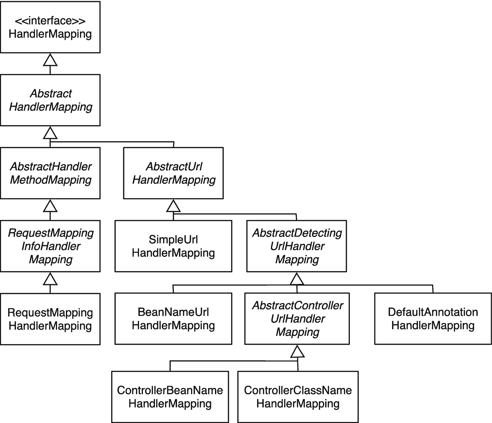

图 4-10

`HandlerMapping`实施

开箱即用，Spring MVC 提供了四种不同的实现。大多数都是基于 URL 映射的。其中一个实现提供了更复杂的映射策略，稍后您将了解到这一点。然而，在查看不同的实现之前，请仔细查看 URL，看看哪些部分是重要的。

请求 URL 由几个部分组成。我们来解剖一下 [`http://www.example.org/bookstore/app/home`](http://www.example.org/bookstore/app/home) 这个网址。一个 URL 由四部分组成(见图 [4-11](#Fig11) )。


图 4-11

URL 映射

1.  服务器的主机名，由协议+ `://` +主机名或域名+ `:` +端口组成

2.  应用的名称(如果是根应用，则为 none)

3.  servlet 映射的名称(在示例应用中，它被映射到/)

4.  servlet 内部的路径

默认情况下，所有提供的处理程序映射实现都使用 servlet 内部相对于 servlet 上下文的路径(servlet 上下文相对路径)来解析处理程序。将`alwaysUseFullPath`属性设置为 true 可以改变这种行为。然后包含 servlet 映射，这(对于手边的例子)导致 */app/home* 解析请求处理程序；否则，使用 */home* 。

所有实现共有的最后一个特性是可以配置默认的处理程序。这是通过设置`defaultHandler`属性来完成的。当找不到传入请求的处理程序时，它总是被映射到默认处理程序。这是可选的，应该谨慎使用，尤其是在链接多个处理程序映射时。只有最后一个处理程序映射应该指定一个默认的处理程序，否则链会断开。

#### beannomeler 映射

`org.springframework.web.servlet.handler.BeanNameUrlHandlerMapping`实现是 dispatcher servlet 使用的默认策略之一。该实现将任何名称以/开头的 bean 视为潜在的请求处理程序。一个 bean 可以有多个名称，名称也可以包含一个通配符，用*表示。

这个实现使用 ant 样式的正则表达式将传入请求的 URL 与 bean 的名称进行匹配。它遵循这个算法。

1.  尝试精确匹配；如果找到，退出。

2.  在所有注册的路径中搜索匹配项；最具体的获胜。

3.  如果没有找到匹配项，则返回映射到/*或默认处理程序(如果已配置)的处理程序。

    bean 的名称不同于 ID。过去，它是由 XML 规范定义的，不能包含特殊字符，如/。这意味着您需要使用 bean 的名称。您可以通过在`org.springframework.context.annotation.Bean`注释上设置 name 属性来提供 bean 的名称。一个 bean 可以有多个名字，名字可以写成 ant 风格的正则表达式。

清单 [4-10](#PC10) 展示了如何使用 bean 名称并将其映射到`/index.htm` URL。在示例应用中，您现在可以使用 http://localhost:8080/chapter 4-book store/index . htm 来调用这个控制器。

```java
package com.apress.prospringmvc.bookstore.web.config;

import java.util.Properties;
import org.springframework.context.annotation.Bean;
import org.springframework.context.annotation.Configuration;
import com.apress.prospringmvc.bookstore.web.IndexController;

@Configuration
public class WebMvcContextConfiguration {

  @Bean(name = { "/index.htm" })
  public IndexController indexController() {
    return new IndexController();
  }
}

Listing 4-10The BeanNameUrlHandlerMapping

sample Configuration

```

#### SimpleUrlHandlerMapping

与`org.springframework.web.servlet.handler.BeanNameUrlHandlerMapping`相反，这种实现需要显式配置，并且它不会自动检测映射。清单 [4-11](#PC11) 显示了一个示例配置。同样，将控制器映射到/index.htm。

```java
package com.apress.prospringmvc.bookstore.web.config;

// Other imports omitted see Listing 4-10

import org.springframework.web.servlet.HandlerMapping;
import org.springframework.web.servlet.handler.SimpleUrlHandlerMapping;

@Configuration
public class WebMvcContextConfiguration {

  @Bean
  public IndexController indexController() {
    return new IndexController();
  }

  @Bean
  public HandlerMapping simpleUrlHandlerMapping() {
    var mappings = new Properties();
    mappings.put("/index.htm", "indexController");
    var urlMapping = new SimpleUrlHandlerMapping();
    urlMapping.setMappings(mappings);
    return urlMapping;
  }
}

Listing 4-11The SimpleUrlHandlerMapping

Sample Configuration

```

您需要显式配置`SimpleUrlHandlerMapping`并向其传递映射(参见粗体代码)。您将`/index.htm` URL 映射到名为 indexController 的控制器。如果您有很多控制器，这种配置会大大增加。这种方法的优点是所有的映射都在一个位置。

#### RequestMappingHandlerMapping

`RequestMappingHandlerMapping`的实现更加复杂。它使用注释来配置映射。注释可以在类和/或方法级别。为了将`com.apress.prospringmvc.bookstore.web.IndexController`映射到`/index.htm`，您需要添加`@RequestMapping`注释。清单 [4-12](#PC12) 是控制器，清单 [4-13](#PC13) 显示了示例配置。

```java
package com.apress.prospringmvc.bookstore.web.config;

// Other imports omitted see Listing 4-10

@Configuration
public class WebMvcContextConfiguration {

  @Bean
  public IndexController indexController() {
    return new IndexController();
  }
}

Listing 4-13An annotation-based sample Configuration

```

```java
package com.apress.prospringmvc.bookstore.web;

import org.springframework.stereotype.Controller;
import org.springframework.web.bind.annotation.RequestMapping;
import org.springframework.web.servlet.ModelAndView;

@Controller
public class IndexController {

  @RequestMapping(value = "/index.htm")
  public ModelAndView indexPage() {
    return new ModelAndView("/WEB-INF/views/index.jsp");
  }
}

Listing 4-12The IndexController with RequestMapping

```

#### RouterFunctionMapping

`org.springframework.web.servlet.function.support.HandlerFunctionAdapter`实现是定义处理程序的函数方式。清单 [4-14](#PC14) 展示了编写处理程序来呈现索引页面的函数风格。

```java
package com.apress.prospringmvc.bookstore.web.config;

// Other imports omitted see Listing 4-10
import org.springframework.web.servlet.function.RouterFunction;
import org.springframework.web.servlet.function.ServerRequest;
import org.springframework.web.servlet.function.ServerResponse;

@Configuration
public class WebMvcContextConfiguration {

  @Bean
  public RouterFunction<ServerResponse> routes() {
    return route()
      .GET("/", response -> ok().render("index"))
      .build();
  }
}

Listing 4-14A Functional-Style Sample Configuration

```

### 处理器适配器

`org.springframework.web.servlet.` `HandlerAdapter`是 dispatcher servlet 和所选 handler 之间的绑定器。它从 dispatcher servlet 中删除了实际的执行逻辑，这使得 dispatcher servlet 具有无限的可扩展性。将该组件视为 servlet 和实际处理程序实现之间的绑定器。清单 [4-15](#PC15) 显示了`HandlerAdapter` API。

```java
package org.springframework.web.servlet;

import javax.servlet.http.HttpServletRequest;
import javax.servlet.http.HttpServletResponse;

public interface HandlerAdapter {

  boolean supports(Object handler);
  ModelAndView handle(HttpServletRequest request, HttpServletResponse response, Object handler) throws Exception;
  long getLastModified(HttpServletRequest request, Object handler);
}

Listing 4-15The HandlerAdapter API

```

如清单 [4-15](#PC15) 所示，API 由三个方法组成。dispatcher servlet 在上下文中的每个处理程序上调用`supports`方法；这样做是为了确定哪个`HandlerAdapter`可以执行所选的处理程序。如果处理程序适配器可以执行该处理程序，则调用`handle`方法来执行所选的处理程序。处理程序的执行会导致`org.springframework.web.servlet.ModelAndView`被返回。然而，一些实现总是返回`null`，表明响应已经发送到客户端。

如果传入的请求是 GET 或 HEAD 请求，则调用`getLastModified`方法来确定底层资源最后一次被修改的时间(–1 表示总是重新生成内容)。结果作为`Last-Modified`请求头发送回客户端，并与`If-Modified-Since`请求头进行比较。如果有修改，内容会重新生成并重新发送给客户端；否则，HTTP 响应代码 304(未修改)被发送回客户端。这在 dispatcher servlet 提供静态资源时特别有用，这样可以节省带宽。

开箱即用，Spring MVC 提供了 HandlerAdapter 的五个实现(见图 [4-12](#Fig12) )。

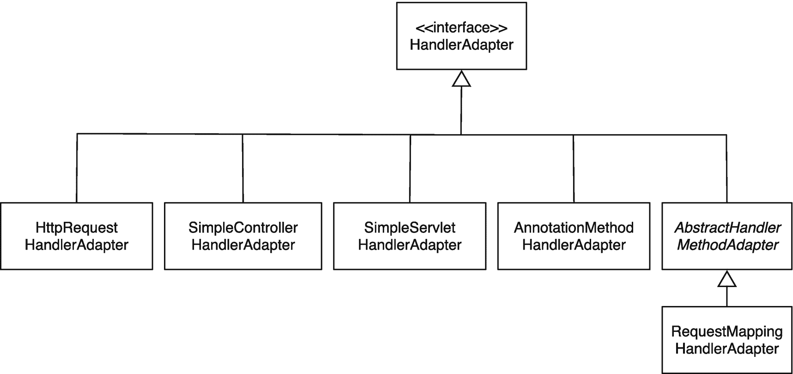

图 4-12

HandlerAdapter 实现

#### HttpRequestHandlerAdapter

`org.springframework.web.servlet.mvc.` `HttpRequestHandlerAdapter`知道如何执行`org.springframework.web.HttpRequestHandler`实例。Spring Remoting 主要使用这个处理程序适配器来支持一些 HTTP remoting 选项。然而，您也可以使用`org.springframework.web.HttpRequestHandler`接口的两个实现。一个服务静态资源，另一个将传入的请求转发给 servlet 容器的默认 servlet(更多信息见第 [5](05.html) 章)。

#### SimpleControllerHandlerAdapter

`org.springframework.web.servlet.mvc.` `SimpleControllerHandlerAdapter`知道如何执行`org.springframework.web.servlet.mvc.Controller`实现。它从控制器实例的`handleRequest`方法中返回`org.springframework.web.servlet.ModelAndView`。

#### simplieservlethandleradapter

在应用上下文中配置`javax.servlet.Servlet`实例并把它们放在 dispatcher servlet 后面会很方便。要执行这些 servlets，您需要`org.springframework.web.servlet.handler.` `SimpleServletHandlerAdapter`。它知道如何执行`javax.servlet.Servlet`，并且总是返回`null`，因为它期望 servlet 自己处理响应。

#### HandlerFunctionAdapter

`org.springframework.web.servlet.function.support.` `HandlerFunctionAdapter`知道如何执行`org.springframework.web.servlet.function.HandlerFunction`实例。它根据 h `andler function`的`org.springframework.web.servlet.function.ServerResponse`返回`org.springframework.web.servlet.ModelAndView`。

#### requestmappingchandleradapter

`org.springframework.web.servlet.mvc.method.annotation.` `RequestMappingHandlerAdapter`执行用`org.springframework.web.bind.annotation.RequestMapping`标注的方法。它转换方法参数并提供对请求参数的简单访问。方法的返回值被转换或添加到这个处理程序适配器内部创建的`org.springframework.web.servlet.ModelAndView`实现中。整个绑定和转换过程是可配置的、灵活的；在第 [5](05.html) 和 [6](06.html) 章节中解释了这些可能性。

### 多重解析器

`org.springframework.web.multipart.` `MultipartResolver`策略接口确定传入请求是否是多部分文件请求(用于文件上传)，如果是，它将传入请求包装在`org.springframework.web.multipart.MultipartHttpServletRequest`中。包装后的请求可以轻松地从表单访问底层的多部分文件。文件上传在第 [7](07.html) 章中说明。清单 [4-16](#PC16) 显示了`MultipartResolver` API。

```java
package org.springframework.web.multipart;

import javax.servlet.http.HttpServletRequest;

public interface MultipartResolver {

  boolean isMultipart(HttpServletRequest request);

  MultipartHttpServletRequest resolveMultipart(HttpServletRequest request)

  throws MultipartException;

  void cleanupMultipart(MultipartHttpServletRequest request);

}

Listing 4-16The MultipartResolver API

```

在准备和清理请求的过程中，会调用`org.springframework.web.multipart.MultipartResolver`组件`’s`的三个方法。调用`isMultipart`方法来确定一个传入的请求是否是一个多部分请求。如果是，那么调用`resolveMultipart`方法，将原始请求包装在`MultipartHttpServletRequest`中。最后，当请求被处理后，调用`cleanupMultipart`方法来清理所有被使用的资源。图 [4-13](#Fig13) 显示了`MultipartResolver`的两种现成实现。

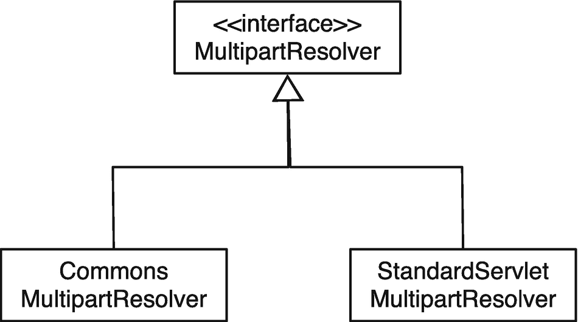

图 4-13

多解析器实现

#### CommonsMultipartResolver

`org.springframework.web.multipart.commons.` `CommonsMultipartResolver`使用 Commons FileUpload 库 <sup>[1](#Fn1)</sup> 来处理多部分文件。它可以轻松配置 Commons FileUpload 库的几个方面。

#### StandardServletMultipartResolver

Servlet 3.0 规范引入了处理多部分表单的标准方式。`org.springframework.web.multipart.support.` `StandardServletMultipartResolver`仅仅作为这个标准方法的包装器，所以它是透明公开的。

### LocaleResolver

`org.springframework.web.servlet.` `LocaleResolver`策略接口决定哪个`java.util.Locale`渲染页面。在大多数情况下，它解析应用中的验证消息或标签。不同的实现如图 [4-14](#Fig14) 所示，并在以下小节中描述。

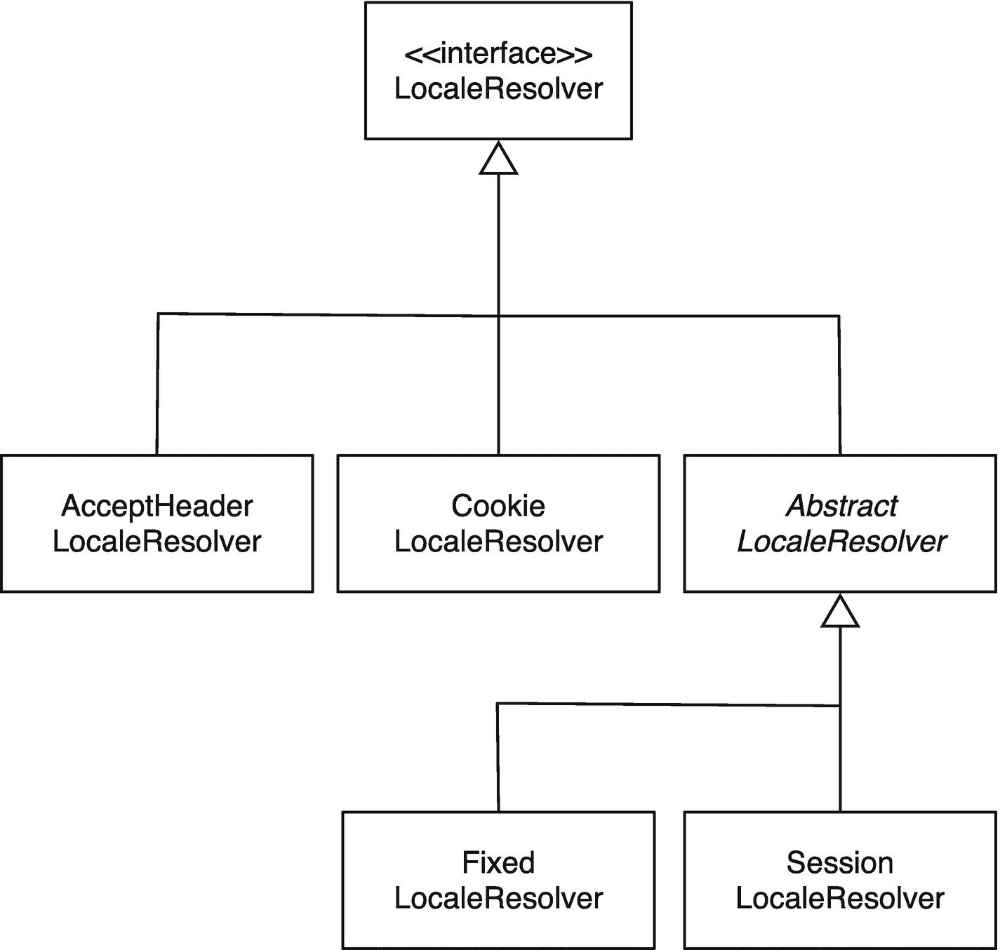

图 4-14

LocaleResolver 实现

清单 [4-17](#PC17) 显示了 org . spring framework . web . servlet . locale solver 的 API。

```java
package org.springframework.web.servlet;

import java.util.Locale;
import javax.servlet.http.HttpServletRequest;
import javax.servlet.http.HttpServletResponse;

public interface LocaleResolver {

  Locale resolveLocale(HttpServletRequest request);
  void setLocale(HttpServletRequest request,HttpServletResponse response,
                 Locale locale);
}

Listing 4-17The LocaleResolver API

```

API 由两个方法组成，每个方法都在存储和检索当前的`java.util.Locale`中发挥作用。当您想要更改当前的语言环境时，会调用`setLocale`方法。如果实现不支持这一点，就会抛出`java.lang.UnsupportedOperationException`。`Spring Framework uses the resolveLocale method`——通常在内部——解析当前的语言环境。

#### AcceptHeaderLocaleResolver

`org.springframework.web.servlet.i18n.` AcceptHeaderLocaleResolver 实现简单地委托给当前`javax.servlet.HttpServletRequest`的`getLocale`方法。它使用`Accept-Language` HTTP 头来确定语言。客户端设置此头值；此解析程序不支持更改区域设置。

#### 库克埃勒索尔弗

`org.springframework.web.servlet.i18n.CookieLocaleResolver`实现使用`javax.servlet.http.Cookie`来存储要使用的语言环境。这在您希望应用尽可能无状态的情况下特别有用。实际值存储在客户端，并在每次请求时发送给您。这个解析器允许更改区域设置(你可以在第 [6](06.html) 章找到更多信息)。这个解析器还允许您配置 cookie 的名称和要使用的默认区域设置。如果不能为当前请求确定任何值(即，既没有 cookie 也没有默认的区域设置)，这个解析器就退回到请求的区域设置(见`AcceptHeaderLocaleResolver`)。

#### FixedLocaleResolver

`org.springframework.web.servlet.i18n.` `FixedLocaleResolver`是`org.springframework.web.servlet.LocaleResolver`的最基本实现。它允许您配置在整个应用中使用的区域设置。这种配置是固定的；因此，这是无法改变的。

#### SessionLocaleResolver

`org.springframework.web.servlet.i18n.SessionLocaleResolver`实现使用`javax.servlet.http.HttpSession`来存储区域设置的值。可以配置属性的名称以及默认的语言环境。如果不能为当前请求确定任何值(即，既没有值存储在会话中，也没有默认的区域设置)，那么它将返回到请求的区域设置(见`AcceptHeaderLocaleResolver`)。这个解析器还允许你改变区域设置(更多信息见第 [6](06.html) 章)。

### 主题解析器

`org.springframework.web.servlet.` `ThemeResolver`策略界面决定页面呈现哪个主题。有几种实现方式；这些如图 [4-15](#Fig15) 所示，并在以下小节中解释。如何应用主题在第 8 章[中有解释。如果没有主题名称可以解析，那么这个解析器使用硬编码的默认主题。](08.html)

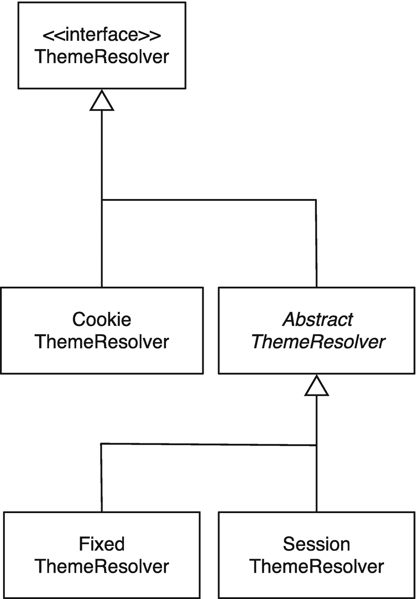

图 4-15

`ThemeResolver`实施

清单 [4-18](#PC18) 显示了`org.springframework.web.servlet.ThemeResolver`的 API，它类似于`org.springframework.web.servlet.LocaleResolver` API。

```java
package org.springframework.web.servlet;

import javax.servlet.http.HttpServletRequest;
import javax.servlet.http.HttpServletResponse;

public interface ThemeResolver {

  String resolveThemeName(HttpServletRequest request);
  void setThemeName(HttpServletRequest request, HttpServletResponse response,
 String themeName);
}

Listing 4-18The ThemeResolver API

```

当你想改变当前的主题时，调用`setThemeName`方法。如果不支持改变主题，它抛出`java.lang.UnsupportedOperationException`。Spring 框架在需要解析当前主题时会调用`resolveThemeName`方法。这主要是通过使用主题 JSP 标签来完成的。

#### CookieThemeResolver

`org.springframework.web.servlet.theme.` `CookieThemeResolver`使用`javax.servlet.http.Cookie`来存储要使用的主题。这在您希望应用尽可能无状态的情况下特别有用。实际值存储在客户端，并在每次请求时发送给您。此解析程序允许更改主题；你可以在第 [6](06.html) 和 [8](08.html) 章节中找到更多相关信息。这个解析器还允许您配置 cookie 的名称和要使用的主题区域设置。

#### FixedThemeResolver

`org.springframework.web.servlet.theme.` `FixedThemeResolver`是`org.springframework.web.servlet.ThemeResolver`的最基本实现。它允许你配置一个在整个应用中使用的主题。这种配置是固定的；因此，这是无法改变的。

#### SessionThemeResolver

`org.springframework.web.servlet.theme.` `SessionThemeResolver`使用`javax.servlet.http.HttpSession`存储主题的值。可以配置属性的名称和默认主题。

### 处理器异常解析器

在大多数情况下，您希望控制如何处理请求处理过程中发生的异常。您可以为此使用一个`HandlerExceptionResolver`。API(参见清单 [4-19](#PC19) )由一个方法组成，这个方法在由 dispatcher servlet 检测到的`org.springframework.web.servlet.` `HandlerExceptionResolvers`上被调用。解析器可以选择自己处理异常，或者返回一个包含要呈现的视图和模型的`org.springframework.web.servlet.ModelAndView implementation`(通常包含抛出的异常)。

```java
package org.springframework.web.servlet;

import javax.servlet.http.HttpServletRequest;
import javax.servlet.http.HttpServletResponse;

public interface HandlerExceptionResolver {

  ModelAndView resolveException(HttpServletRequest request,
                                HttpServletResponse response, Object handler,
 Exception ex);
}

Listing 4-19The HandlerExceptionResolver API

```

图 4-16 显示了 Spring 框架提供的不同实现。每个都以稍微不同的方式工作，就像每个都有不同的配置一样(更多信息见第 [6](06.html) 章)。

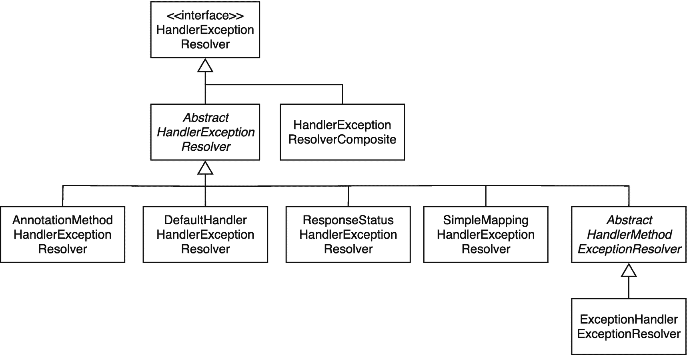

图 4-16

HandlerExceptionResolver 实现

`org.springframework.web.servlet.handler.HandlerExceptionResolverComposite`实现由 Spring MVC 内部使用。它将几个`org.springframework.web.servlet.HandlerExceptionResolver`实现链接在一起。此解析程序不提供实际的实现或附加功能；相反，它仅仅充当多个实现的包装器(当配置了多个实现时)。

### RequestToViewNameTranslator

当处理程序没有返回视图实现或视图名称，并且没有向客户端发送响应本身时，那么`org.springframework.web.servlet.` `RequestToViewNameTranslator`试图从传入的请求中确定视图名称。默认的实现(见图[4-17](#Fig17))`org.springframework.web.servlet.view.DefaultRequestToViewNameTranslator`只是简单地获取 URL，去掉后缀和上下文路径，然后使用剩余部分作为视图名(即`http://localhost:8080/bookstore/admin/index.html`变成了`admin/index`)。你可以在第 [8](08.html) 章找到更多关于视图的信息。

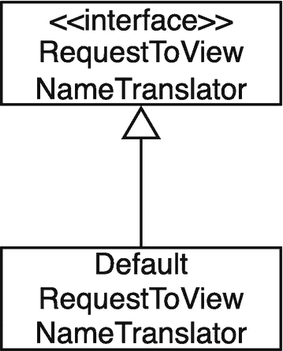

图 4-17

RequstToViewNameTranslator 层次结构

清单 [4-20](#PC20) 中显示了`RequestToViewNameTranslator` API。

```java
package org.springframework.web.servlet;

import javax.servlet.http.HttpServletRequest;

public interface RequestToViewNameTranslator {

  String getViewName(HttpServletRequest request) throws Exception;

}

Listing 4-20The RequestToViewNameTranslator API

```

### 视图解析器

Spring MVC 提供了非常灵活的视图解析机制。它只是获取从处理程序返回的视图名称，并尝试将其解析为实际的视图实现(如果没有返回具体的`org.springframework.web.servlet.View`)。实际的实现可以是 JSP，但也可以是 Excel 电子表格或 PDF 文件。有关视图解析的更多信息，请参阅第 [8 章](08.html)。

这个 API(参见清单 [4-21](#PC21) )非常简单，由一个方法组成。该方法采用视图名称和当前选择的区域设置(参见`LocaleResolver`)。这可以解析一个实际的视图实现。当配置了多个`org.springframework.web.servlet.ViewResolvers`时，dispatcher servlet 依次调用它们，直到其中一个返回一个视图进行渲染。

```java
package org.springframework.web.servlet;

import java.util.Locale;

public interface ViewResolver {

  View resolveViewName(String viewName, Locale locale) throws Exception;

}

Listing 4-21The ViewResolver API

```

`ViewResolver`的实现如图 [4-18](#Fig18) 所示。开箱即用，Spring 提供了几个实现(更多信息参见第 8 章)。


图 4-18

ViewResolver 实现

### FlashMapManager

`org.springframework.web.servlet.` `FlashMapManager`在 Spring MVC 应用中启用 flash“作用域”。您可以使用这种机制将属性放在一个 flash map 中，然后在重定向后检索这些属性(flash map 在请求/响应周期后仍然存在)。渲染视图后，会清除 flash 贴图。Spring 提供了一个单一的实现，`org.springframework.web.servlet.support.SessionFlashMapManager`(参见图 [4-19](#Fig19) )。

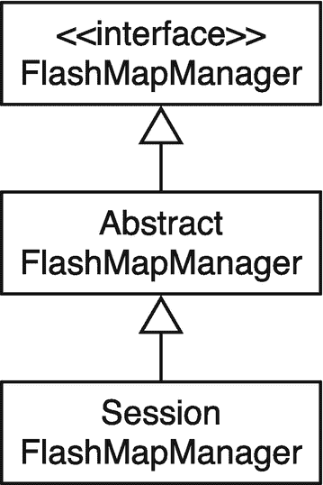

图 4-19

FlashMapManager 层次结构

清单 [4-22](#PC22) 显示了`FlashMapManager` API。

```java
package org.springframework.web.servlet;

import javax.servlet.http.HttpServletRequest;
import javax.servlet.http.HttpServletResponse;

public interface FlashMapManager {

  FlashMap retrieveAndUpdate(HttpServletRequest request,
                             HttpServletResponse response);

  void saveOutputFlashMap(FlashMap flashMap, HttpServletRequest request,
                          HttpServletResponse response);

}

Listing 4-22The FlashMapManager API

```

## 摘要

本章从查看请求处理工作流开始，确定哪些组件起作用。可以认为`DispatcherServlet`是 Spring MVC 中的主要组件。它扮演着最重要的角色——前端控制器。Spring MVC 中的 MVC 模式是显式的；您有一个模型、一个视图和一个控制器(处理程序)。控制器处理请求，填充模型，并选择要呈现的视图。

在处理请求时，`DispatcherServlet`使用许多不同的组件来扮演它的角色。最重要的部件是`HandlerMapping`和`HandlerAdapter`；这些组件分别是用于映射和处理请求的核心组件。要应用横切关注点，可以使用`HandlerInterceptor`。处理完请求后，需要呈现一个视图。一个处理程序可以返回一个`View`或者一个要渲染的视图的名称。在后一种情况下，这个名称被传递给一个`ViewResolver`来解析一个实际的视图实现。

还有对 flash 范围的变量的基本支持。要让这成为可能，就有`FlashMapManager`。有时，请求处理不会按照您希望的方式进行。例如，您可能会遇到异常。要处理这些，您可以使用`HandlerExceptionResolver`。最后起作用的组件是`LocaleResolver`和`ThemeResolver`。总之，这些支持应用中的国际化和主题化。

接下来的章节将解释如何构建控制器来处理请求，并进一步研究如何通过 Spring Boot 来配置 Spring MVC。

<aside aria-label="Footnotes" class="FootnoteSection" epub:type="footnotes">Footnotes [1](#Fn1_source)

[T2`https://commons.apache.org/fileupload/`](https://commons.apache.org/fileupload/)

 </aside>