# 五、实现控制器

控制器在 web 应用中起着至关重要的作用:它们执行实际的请求，准备模型，并选择要呈现的视图。结合 dispatcher servlet，控制器在请求处理工作流中也起着至关重要的作用。控制器是核心应用和应用的 web 界面之间的绑定器。本章着眼于两种不同的控制器方法，并涵盖了由 Spring 框架提供并由 Spring Boot 配置的开箱即用的实现。

本章还介绍了请求处理的支持组件。例如，我们将介绍表单提交以及如何应用国际化(I18N)。

在本章中，我们使用百里香 HTML 模板。使用 Apache Tiles 的 Spring MVC 支持 JSP 视图，但是我们不建议您在使用 Spring Boot 和嵌入式容器时使用 JSP 视图。 <sup>1</sup>

## 控制器简介

控制器是负责响应用户动作的组件。该操作可以是提交表单、单击链接或简单地访问页面。控制器选择或更新视图所需的数据。它还选择要渲染的视图的名称，或者可以自己渲染视图。使用 Spring MVC，我们在编写控制器时有两种选择。我们既可以实现一个接口，也可以在类上添加一个注释。界面是`org.springframework.web.servlet.mvc.Controller`，标注是`org.springframework.stereotype.Controller`。这本书的主要焦点是编写控制器的基于注释的方法。但是，我们觉得还是需要提一下基于接口的方法。

虽然这两种方法都是为了实现控制器，但是它们之间有两个主要的区别。第一个区别是灵活性，第二个区别是将 URL 映射到控制器。基于注释的控制器允许非常灵活的方法签名，而基于接口的方法在接口上有一个我们必须实现的预定义方法。接触其他有趣的合作者更加困难(但不是不可能！).

对于基于接口的方法，我们必须进行 URL 到这些控制器的显式外部映射；一般来说，这种方法与`org.springframework.web.servlet.handler.SimpleUrlHandlerMapping`相结合，这样所有的 URL 都在一个位置。将所有的 URL 放在一个位置是基于接口的方法优于基于注释的方法的一个优点。基于注释的方法将其映射分散在整个代码库中，这使得很难看出哪个 URL 映射到哪个请求处理方法。基于注释的控制器的优势在于，当您打开控制器时，您可以看到它映射到了哪些 URL。

本节展示了如何编写这两种类型的控制器，以及如何配置基本的视图控制器。

### 基于接口的控制器

要编写基于接口的控制器，我们需要创建一个实现`org.springframework.web.servlet.mvc.Controller`接口的类。清单 5-1 显示了该接口的 API。在实现这个接口时，我们必须实现`handleRequest`方法。当控制器自己处理响应时，该方法需要返回一个`org.springframework.web.servlet.ModelAndView`对象或`null`。

```java
package org.springframework.web.servlet.mvc;

import javax.servlet.http.HttpServletRequest;
import javax.servlet.http.HttpServletResponse;
import org.springframework.web.servlet.ModelAndView;

@FunctionalInterface
public interface Controller {

  ModelAndView handleRequest(HttpServletRequest request, HttpServletResponse response) throws Exception;

}

Listing 5-1The Controller Interface

```

我们来看一个小样本。如果我们用`com.apress.prospringmvc.bookstore.web.IndexController`创建一个基于接口的控制器，它看起来会像清单 5-2 中的样子。我们实现了`handleRequest`方法并返回了一个带有视图名的`ModelAndView`实例。

```java
package com.apress.prospringmvc.bookstore.web;

// javax.servlet imports omitted

import org.springframework.web.servlet.ModelAndView;
import org.springframework.web.servlet.mvc.Controller;

public class IndexController implements Controller {

  @Override
  public ModelAndView handleRequest(HttpServletRequest request,
                                    HttpServletResponse response)
  throws Exception {
    return new ModelAndView("index");
  }
}

Listing 5-2An Interface-based IndexController

```

除了编写这个控制器，我们还需要配置一个`org.springframework.web.servlet.HandlerMapping`的实例来将`/index.htm`映射到这个控制器上(更多信息参见第三章)。我们还需要确保`org.springframework.web.servlet.mvc.SimpleControllerHandlerAdapter`被注册来执行基于接口的控制器(这是默认注册的)。

这里给出的例子很简单。现在想象一个有一些页面流的控制器。在这种情况下，我们需要检查请求是 GET 还是 POST 请求；基于此，我们需要执行不同的控制器逻辑。对于大型控制器，这可能会变得很麻烦。

表 5-1 展示了框架附带的`Controller`实现。

表 5-1

现有控制器实现的列表

<colgroup><col class="tcol1 align-left"> <col class="tcol2 align-left"></colgroup> 
| 

控制器实现

 | 

描述

 |
| --- | --- |
| `UrlFilenameViewController` | 一个控制器实现，它接受 URL 的路径并将其转换为视图名。它可以配置为在视图名称后添加前缀和/或后缀。 |
| `ParameterizableViewController` | 返回已配置视图名称的控制器。 |
| `ServletForwardingController` | 一个控制器实现，将请求转发给一个命名的 servlet，它可以是一个没有任何映射的 servlet。如果您想使用 Spring MVC 基础设施来分派请求和应用拦截器，这是非常有用的。 |
| `ServletWrappingController` | 包装和管理 servlet 实现的控制器实现。如果您想使用 Spring MVC 基础设施来分派请求和应用拦截器，这是非常有用的。 |

表 5-1 中列出的所有控制器都位于`org.springframework.web.servlet.mvc`包中。

### 基于注释的控制器

要编写基于注释的控制器，我们需要编写一个类，并将`org.springframework.stereotype.Controller`注释放在该类上。此外，我们需要给类和/或方法添加一个`org.springframework.web.bind.annotation.RequestMapping`注释。清单 5-3 展示了我们的`IndexController`基于注释的方法。

```java
package com.apress.prospringmvc.bookstore.web;

import org.springframework.stereotype.Controller;
import org.springframework.web.bind.annotation.RequestMapping;
import org.springframework.web.servlet.ModelAndView;

@Controller
public class IndexController {

  @RequestMapping(value = "/index.htm")
  public ModelAndView indexPage() {
    return new ModelAndView("index");
  }
}

Listing 5-3An Annotation-based IndexController

```

控制器包含一个带有`@RequestMapping`注释的方法，它指定它应该被映射到`/index.htm` URL，这是请求处理方法。方法没有必需的参数，我们可以返回任何我们想要的；现在，我们想还一个`ModelAndView`。

映射在控制器定义中，我们需要一个`org.springframework.web.servlet.mvc.method.annotation.RequestMappingHandlerMapping`的实例来解释这些映射(默认注册)。

### 配置视图控制器

到目前为止，我们编写的两个控制器样本被称为*视图控制器*。他们不选择数据；相反，他们只选择要渲染的视图名称。如果我们有一个包含更多这些视图的大型应用，维护和编写这些视图会变得很麻烦。Spring MVC 可以在这里帮助我们。使我们能够简单地将`org.springframework.web.servlet.mvc.ParameterizableViewController`添加到我们的配置中，并对其进行相应的配置。我们需要配置一个实例来返回作为视图名称的`index`,并将其映射到`/index.htm` URL。清单 5-4 显示了需要添加什么来使其工作。

```java
package com.apress.prospringmvc.bookstore.web.config;

import org.springframework.web.servlet.mvc.ParameterizableViewController;

// Other imports omitted

@Configuration
public class WebMvcContextConfiguration implements WebMvcConfigurer {

// Other methods omitted

  @Bean(name = "/index.htm")
  public Controller index() {

    ParameterizableViewController index = new ParameterizableViewController();
    index.setViewName("index");
    return index;
  }
}

Listing 5-4A ParameterizableViewController Configuration

```

那么它是如何工作的呢？我们创建控制器，将视图名称设置为 return，然后显式地将其命名为`/index.htm`(参见突出显示的部分)。显式命名使得`org.springframework.web.servlet.handler.BeanNameUrlHandlerMapping`能够获取我们的控制器并将其映射到 URL。然而，如果它变得非常大，那么我们就需要创建一些这样的方法。同样，Spring MVC 是来帮助我们的。我们可以覆盖`addViewControllers`方法(`org.springframework.web.servlet.config.annotation.WebMvcConfigurer`的方法之一),简单地将我们的视图名称注册到某些 URL。清单 5-5 展示了如何做到这一点。

```java
package com.apress.prospringmvc.bookstore.web.config;

import org.springframework.web.servlet.config.annotation.ViewControllerRegistry;
import org.springframework.web.servlet.config.annotation.WebMvcConfigurer;

// Other imports omitted

@Configuration
public class WebMvcContextConfiguration implements WebMvcConfigurer {

// Other methods omitted

  @Override
  public void addViewControllers(final ViewControllerRegistry registry) {
    registry.addViewController("/index.htm").setViewName("index");
  }
}

Listing 5-5A ViewController Configuration

```

结果是一样的。`ParameterizableViewController`被创建并映射到`/index.htm` URL(见图 5-1 )。然而，第二种方法比第一种方法更容易使用，也不那么麻烦。

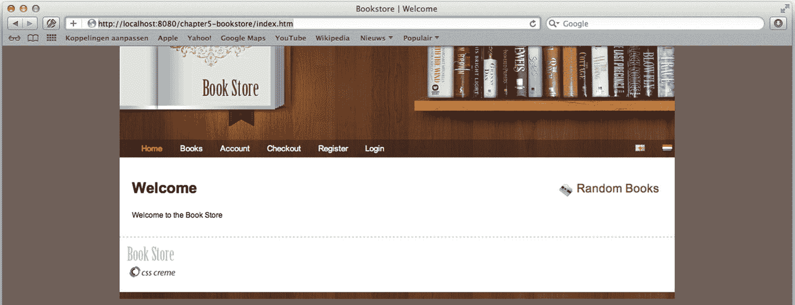

图 5-1

索引页

## 请求处理方法

编写请求处理方法可能是一项挑战。例如，一个方法应该如何映射到一个传入的请求？这里可能有几个因素，包括 URL、使用的方法(例如 GET 或 POST)、 <sup>2</sup> 参数或 HTTP 头的可用性、 <sup>3</sup> 甚至请求内容类型或要生成的内容类型(例如 XML、JSON 或 HTML)。这些以及更多因素会影响选择哪种方法来处理请求。

编写请求处理方法的第一步是在方法上放置一个`org.springframework.web.bind.annotation.RequestMapping`注释。这个映射由`org.springframework.web.servlet.mvc.method.annotation.RequestMappingHandlerMapping`检测，以创建传入 URL 到正确方法的映射(参见第四章中的“Spring MVC 组件”一节以获得更多关于处理程序映射的信息)。接下来，我们需要指定我们希望哪个 web 请求执行指定的处理程序。

注释可以放在类型(控制器)和方法级别。我们可以使用类型级别的注释进行粗粒度映射(例如 URL)，然后使用方法级别的注释进一步指定何时执行方法(例如 GET 或 POST 请求)。

表 5-2 显示了可以在 RequestMapping 注释上设置的属性，以及它们如何影响映射。

表 5-2

`RequestMapping`属性

<colgroup><col class="tcol1 align-left"> <col class="tcol2 align-left"> <col class="tcol3 align-left"></colgroup> 
| 

属性

 | 

描述

 |   |
| --- | --- | --- |
| `name` | 用于此映射的名称。该名称可与`MvcUriComponentsBuilder`一起使用，以生成动态链接。 |   |
| `value`或`path` | 指定控制器对哪个或哪些 URL 做出反应，例如`/order.htm`。我们也可以使用 ant 风格的表达式来指定 URL。 |   |
| `method` | 将方法绑定到特定的 HTTP 方法。支持的方法包括 GET、POST、PUT、DELETE、HEAD、OPTIONS 和 TRACE。默认情况下，选项和跟踪由`org.springframework.web.servlet.DispatcherServlet`处理。为了将这些方法传递给控制器，我们需要在 servlet 上分别将`dispatchOptionsRequest`和/或`dispatchTraceRequest`设置为`true`。 |   |
| `params` | 缩小请求参数存在与否的范围。支持的表达式包括: |   |
|   | `param-name=param-value` | 指定的参数必须有特定的值 |
|   | `param-name!=param-value` | 指定的参数不能有特定值。 |
|   | `!param-name` | 请求中必须没有指定的参数。 |
| `headers` | 缩小 HTTP 请求头存在与否的范围。 <sup>4</sup> 支持的表达式包括以下几种: |   |
|   | `header-name=header-value` | 指定的标头必须有特定的值。 |
|   | `header-name!=header-value` | 指定的头不能有特定的值。 |
|   | `!header-name` | 请求标头中必须没有指定的标头。 |
|   | 表达式中的值还可以在 Content-Type 或 Accept 头中包含通配符(*)(即 content-type="text/* "将匹配所有基于文本的内容类型)。 |   |
| `consumes` | 指定映射请求的可消费媒体类型。我们用这个来缩小主映射的范围。例如，`text/xml`映射所有对 XML 内容类型的请求，但是我们也可以指定`text/*`来匹配所有文本内容类型。我们也可以否定它:`!text/xml`匹配除此之外的所有内容类型。该参数优于使用 headers 参数来指定一个`Content-Type`头，因为它更明确。 |   |
| `produces` | 指定此请求处理方法接受的可生成的媒体类型。它缩小了主要映射的范围。适用于 consumes 参数的相同规则也适用于此参数。此参数比使用 headers 参数指定 Accept 标头更可取，因为它更显式。 |   |

在表 5-3 中，有几个示例映射也显示了类级和方法级匹配的效果。如上所述，类上的 RequestMapping 注释适用于控制器中的所有*方法。这种机制可以在类级别进行粗粒度映射，在方法级别进行细粒度映射。*

表 5-3

示例映射

<colgroup><col class="tcol1 align-left"> <col class="tcol2 align-left"> <col class="tcol3 align-left"></colgroup> 
| 

班级

 | 

方法

 | 

描述

 |
| --- | --- | --- |
|   | `@RequestMapping(value="/order.htm")` | 映射到 order.htm URL 上的所有请求 |
| `@RequestMapping("/order.htm")` | `@RequestMapping(method=RequestMethod.GET)` | 映射到 order.html URL 的所有 GET 请求 |
| `@RequestMapping("/order.*")` | `@RequestMapping(method={RequestMethod.PUT, RequestMethod.POST})` | 映射到订单的所有 PUT 和 POST 请求。*网址。*表示任何后缀或扩展名，例如。htm，。医生。xls 等等 |
| `@RequestMapping(value="/customer.htm", consumes="application/json")` | `@RequestMapping(produces="application/xml")` | 映射到所有发送 JSON 并接受 XML 作为响应的请求 |
| `@RequestMapping(value="/order.htm")` | `@RequestMapping(params="add-line", method=RequestMethod.POST`) | 映射到所有包含 add-line 参数的 order.htm URL 的 POST 请求 |
| `@RequestMapping(value="/order.htm")` | `@RequestMapping(headers="!VIA")` | 映射到不包含 VIA HTTP 头的 order.htm URL 的所有请求 |

### 支持的方法参数类型

请求处理方法可以有各种方法参数和返回值。表 5-4 中提到的大多数参数可以任意顺序使用。然而，该规则有一个例外:`org.springframework.validation.BindingResult`参数。该参数必须遵循我们用来绑定请求参数的模型对象。

表 5-4

支持的方法参数类型

<colgroup><col class="tcol1 align-left"> <col class="tcol2 align-left"></colgroup> 
| 

参数类型

 | 

描述

 |
| --- | --- |
| `javax.servlet.ServletRequest` | 触发此方法的请求对象。 |
| `javax.servlet.http.HttpServletRequest` | 触发此方法的 HTTP 请求对象。 |
| `org.springframework.web.multipart.MultipartRequest` | 触发此方法的请求对象仅适用于多部分请求。该包装器允许轻松访问上传的文件。仅公开用于多部分文件访问的方法。 |
| `org.springframework.web.multipart.MultipartHttpServletRequest` | `MultipartHttpServletRequest`公开了`HttpServletRequest`和`MultipartRequest`方法。 |
| `javax.servlet.ServletResponse` | 与请求相关联的响应。如果我们需要自己编写响应，这是很有用的。 |
| `javax.servlet.http.HttpServletResponse` | 与请求相关联的响应。如果我们需要自己编写响应，这是很有用的。 |
| `javax.servlet.http.HttpSession` | 基础 http 会话。如果不存在会话，则启动一个会话。因此，这个论点永远不会`null`。 |
| `org.springframework.web.context.request.WebRequest` | 允许对请求和会话属性进行更通用的访问，而不依赖于底层的本机 API(例如，Servlet 或 JSF)。 |
| `org.springframework.web.context.request.NativeWebRequest` | WebRequest 扩展，具有用于基础请求和响应的访问器方法。 |
| `java.util.Locale` | 由配置的`org.springframework.web.servlet.LocaleResolver`确定的当前选择的区域设置。 |
| `java.io.InputStream` | 由`ServletRequest`上的`getInputStream`方法公开的流 |
| `java.io.Reader` | 由`ServletRequest`上的`getReader`方法公开的读取器。 |
| `java.io.OutputStream` | 由`ServletResponse`上的`getOutputStream`方法公开的响应流。它可以直接给用户写一个响应。 |
| `java.io.Writer` | 由`ServletResponse`上的`getWriter`方法公开的响应编写器。它可以直接给用户写一个响应。 |
| `javax.security.Principal` | 当前认证的用户(可以是`null`)。 |
| `java.util.Map` | 属于该控制器/请求的隐式模型。 |
| `org.springframework.ui.Model` | 属于该控制器/请求的隐式模型。模型实现有向模型添加对象的方法，以增加便利性。添加对象时允许方法链接，因为每个方法都返回模型。 |
| `org.springframework.ui.ModelMap` | 属于该控制器/请求的隐式模型。ModelMap 是一个 Map 实现，它包括一些向模型添加对象的方法，以增加便利性。 |
| `org.springframework.web.multipart.MultipartFile` | 将上传的文件绑定到方法参数(只有 Spring 的多部分支持才支持多个文件)。只有当请求是多部分表单提交时，它才起作用。要使用的请求属性的名称要么取自可选的`org.springframework.web.bind.annotation.RequestPart`注释，要么来自参数的名称(后者只有在该信息在类中可用时才有效)。 |
| `javax.servlet.http.Part` | 将上传的文件绑定到方法参数(只有 Spring 的多部分支持才支持多个文件)。只有当请求是多部分表单提交时，它才起作用。要使用的请求属性的名称要么取自可选的`org.springframework.web.bind.annotation.RequestPart`注释，要么来自参数的名称(后者只有在该信息在类中可用时才有效)。 |
| `org.springframework.web.servlet.mvc.support.RedirectAttributes` | 如果您想发出重定向，可以指定属性的确切列表。它还可以添加 flash 属性。此参数用于替代重定向中的隐式模型。 |
| `org.springframework.validation.Errors` | 在模型对象之前的*的绑定和验证结果。* |
| `org.springframework.validation.BindingResult` | 在模型对象之前的*的绑定和验证结果。具有模型的访问器方法和用于类型转换的基础结构。(对于大多数用例来说，这是不需要的，而是使用错误)。* |
| `org.springframework.web.bind.support.SessionStatus` | 用于将处理标记为完成的处理程序，它触发对由`org.springframework.web.bind.annotation.SessionAttributes`指示的会话属性的清除。有关详细信息，请参阅本章后面的“使用会话属性”一节。 |
| `org.springframework.web.util.UriComponentsBuilder` | URI 生成器，用于准备相对于当前请求 URL 的 URL。 |
| `org.springframework.http.HttpEntity<?>` | 表示 HTTP 请求或响应实体。它由请求或响应的头部和主体组成。 |
| 表单对象 | 使用类型转换将请求参数绑定到 bean 属性。这些对象作为模型属性公开。可以选择用`org.springframework.web.bind.annotation.ModelAttribute`进行注释。 |
| 请求正文对象 | 使用消息转换将请求体绑定到 bean 属性。这些对象需要用`org.springframework.web.bind.annotation.RequestBody.`进行注释 |

#### 重定向属性

与表 5-4 中显示的内容相比，`org.springframework.web.servlet.mvc.support.` `RedirectAttributes`需要更多的解释。使用`RedirectAttributes`，可以准确地声明重定向需要哪些属性。默认情况下，在进行重定向时，所有模型属性都是公开的。因为重定向总是导致 GET 请求，所以所有的原语模型属性(或者原语的集合/数组)都被编码为请求参数。然而，使用带注释的控制器，模型中有一些对象(比如路径变量和其他隐式值)不需要公开，并且在我们的控制之外。

这里的`RedirectAttributes`可以帮助我们。如果这是一个方法参数，并且发出了重定向，则只有添加到 RedirectAttributes 实例的属性才会添加到 URL。

除了指定编码在 URL 中的属性之外，还可以指定 *flash 属性*，这些属性在重定向之前被存储，在重定向之后被检索并作为模型属性可用。这是通过使用已配置的`org.springframework.web.servlet.FlashMapManager`来完成的。Flash 属性对于无法编码的对象(非基本对象)或保持 URL 干净非常有用。

#### UriComponentsBuilder

`UriComponentsBuilder`提供了一种构建和编码 URIs 的机制。它可以采用 URL 模式，替换或扩展变量。这可以针对相对或绝对 URL 来完成。这种机制在创建 URL 时特别有用，而不是在我们需要考虑编码参数或自己进行字符串连接的情况下。这个组件始终为我们处理这些事情。清单 5-6 中的代码创建了/book/detail/42 URL。

```java
UriComponentsBuilder
  .fromPath("/book/detail/{bookId}")
  .buildAndExpand("42")
  .encode();

Listing 5-6The UriComponentsBuilder Sample Code

```

给出的例子很简单；但是，可以指定更多的变量(例如，`bookId`)并替换它们(例如，指定端口或主机)。还有`ServletUriComponentsBuilder`子类，我们可以用它来操作当前请求。例如，我们不仅可以用它来替换路径变量，还可以替换请求参数。

### 支持的方法参数注释

除了显式支持的类型(如前一节所述)，我们还可以使用一些注释来注释我们的方法参数(见表 5-5 )。其中一些也可用于表 5-4 中提到的方法参数类型。在这种情况下，它们指定请求、cookie、头或响应中属性的名称，以及该参数是否是必需的。

表 5-5

支持的方法参数注释

<colgroup><col class="tcol1 align-left"> <col class="tcol2 align-left"></colgroup> 
| 

参数类型

 | 

描述

 |
| --- | --- |
| `RequestParam` | 将参数绑定到单个请求参数或所有请求参数。 |
| `RequestHeader` | 将参数绑定到单个请求头或所有请求头。 <sup>5</sup> |
| `RequestBody` | 获取带有此批注的参数的请求正文。该值使用 org . spring framework . http . converter . http message converter 进行转换。 |
| `RequestPart` | 将参数绑定到多部分表单提交的一部分。 |
| `ModelAttribute` | 使用此批注绑定和验证参数。来自传入请求的参数被绑定到给定的对象。 |
| `PathVariable` | 将方法参数绑定到 URL 映射中指定的路径变量(`RequestMapping`注释的 value 属性)。 |
| `CookieValue` | 将方法参数绑定到一个`javax.servlet.http.Cookie`。 |
| `SessionAttribute` | 将方法参数绑定到会话属性。 |
| `RequestAttribute` | 将方法参数绑定到请求属性(不要与请求参数混淆)。 |
| `MatrixVariable` | 将方法参数绑定到路径段内的名称-值对。 |

通过使用类型转换，所有参数值都被转换为参数类型。类型转换系统使用`org.springframework.core.convert.converter.Converter`或`java.beans.PropertyEditor`将`String`类型转换为实际类型。

所有的注释都存在于`org.springframework.web.bind.annotation`包中。

所有这些不同的方法参数类型和注释允许我们编写非常灵活的请求处理方法。然而，我们可以通过扩展框架来扩展这个机制。解析这些方法参数类型是由各种`org.springframework.web.method.support.HandlerMethodArgumentResolver`实现完成的。清单 5-7 显示了那个界面。如果需要，我们可以创建自己的接口实现，并将其注册到框架中。你可以在第七章中找到更多相关信息。

```java
package org.springframework.web.method.support;

import org.springframework.core.MethodParameter;
import org.springframework.web.bind.WebDataBinder;
import org.springframework.web.bind.support.WebDataBinderFactory;
import org.springframework.web.context.request.NativeWebRequest;

public interface HandlerMethodArgumentResolver {

  boolean supportsParameter(MethodParameter parameter);

  Object resolveArgument(MethodParameter parameter,
                            ModelAndViewContainer mavContainer,
                            NativeWebRequest webRequest,
                            WebDataBinderFactory binderFactory)
  throws Exception;
}

Listing 5-7The HandlerMethodArgumentResolver Interface

```

让我们仔细看看我们可以使用的所有不同的注释类型。所有这些注释都有一些我们可以设置的属性，这些属性有默认值或者可能是必需的。

表 5-5 中的所有注释都有一个值属性。这个值属性指的是要使用的对象的名称(它适用于什么取决于注释)。如果没有填充这个值，那么回退将使用方法参数的名称。仅当使用参数信息编译类时，这种回退才可用。 <sup>6</sup> 使用`ModelAttribute`注释时，此规则会出现一个例外。它不使用方法参数的名称，而是使用简单的类名作为参数名称，从参数的类型中推断出名称。如果类型是数组或集合，它会通过添加 List 使其成为复数。如果我们用我们的`com.apress.prospringmvc.bookstore.domain.Book`作为一个参数，名字将是`book`；如果是数组或者集合，就会变成`bookList`。

#### 他们要求停止

`@RequestParam`注释可以放在请求处理方法中的任何参数上。如果存在，它从请求中检索一个参数。当放上一个`map`时，有一些特殊的处理，这取决于是否设置了 name 属性。如果设置了名称，则检索值并转换成一个`map`。对于转换(参见“数据绑定”部分和表 5-6 了解更多信息)，如果没有给出名称，所有请求参数都作为键/值对添加到映射中。

表 5-6

RequestParam 属性

<colgroup><col class="tcol1 align-left"> <col class="tcol2 align-left"> <col class="tcol3 align-left"></colgroup> 
| 

属性

 | 

缺省值

 | 

描述

 |
| --- | --- | --- |
| `required` | `true` | 指示参数是否是必需的。如果它是必需的并且参数丢失，那么抛出`org.springframework.web.bind.MissingServletRequestParameterException`。 |
| `defaultValue` | `null` | 指示当请求中缺少参数时要使用的默认值。设置默认值就是隐式地将 required 设置为 false。该值可以是硬编码值，也可以是 SpEL 表达式。 |
| `value`或`name` | 空字符串 | 指示要从请求中查找的参数的名称。如果没有指定名称，则该名称是从方法参数名称派生的。如果找不到名字，抛出`java.lang.IllegalArgumentException`。 |

#### 请求标题

`@RequestHeader`注释可以放在任何方法参数上。它将方法参数绑定到请求头。当放在`map`上时，所有可用的请求头都作为键/值对放在 map 上。如果将该值放在另一种类型的参数上，则使用`org.springframework.core.convert.converter.Converter`或`PropertyEditor`将该值转换为该类型(有关更多信息，请参见“数据绑定”一节和表 5-7 )。

表 5-7

请求标头属性

<colgroup><col class="tcol1 align-left"> <col class="tcol2 align-left"> <col class="tcol3 align-left"></colgroup> 
| 

属性

 | 

缺省值

 | 

描述

 |
| --- | --- | --- |
| `required` | 真实的 | 指示参数是否是必需的。如果它是必需的并且缺少参数，则抛出`org.springframework.web.bind.ServletRequestBindingException`。设置为`false`时，`null`作为数值；或者，在指定时使用`defaultValue`。 |
| `defaultValue` | `Null` | 指示当请求中缺少参数时要使用的默认值。设置默认值就是隐式地将 required 设置为 false。该值可以是硬编码值，也可以是 SpEL 表达式。 |
| `value`或`name` | 空字符串 | 指示要绑定到的请求标头的名称。如果没有指定名称，则该名称是从方法参数名称派生的。如果找不到名字，抛出`java.lang.IllegalArgumentException`。 |

#### 主体数据

`@RequestBody`注释标记了我们想要绑定到 web 请求主体的方法参数。通过定位和调用`org.springframework.http.converter.HttpMessageConverter`将主体转换为方法参数类型。这个转换器是根据请求内容类型选择的。如果没有找到转换器，抛出`org.springframework.web.HttpMediaTypeNotSupportedException`。默认情况下，这会导致向客户端发送代码为 415 ( `SC_UNSUPPORTED_MEDIA_TYPE`)的响应。

或者，也可以用 javax.validation.Valid 或 org . spring framework . validation . annotation . validated 对方法参数进行注释，以便对创建的对象进行验证。您可以在本章后面的“模型属性的验证”一节中找到更多关于验证的信息。

#### 请求部分

当`@RequestPart`注释被放在类型为`javax.servlet.http.Part`、`org.springframework.web.multipart.MultipartFile`的方法参数上时(或者放在后者的集合或数组上)，我们将注入该文件(或文件组)的内容。如果将其放在任何其他参数类型上，内容将通过在文件上检测到的内容类型的`org.springframework.http.converter.HttpMessageConverter`进行传递。如果没有找到合适的转换器，则抛出`org.springframework.web.HttpMediaTypeNotSupportedException`。(更多信息参见“数据绑定”部分和表 5-8 )。

表 5-8

RequestPart 属性

<colgroup><col class="tcol1 align-left"> <col class="tcol2 align-left"> <col class="tcol3 align-left"></colgroup> 
| 

属性

 | 

缺省值

 | 

描述

 |
| --- | --- | --- |
| `required` | `true` | 指示参数是否是必需的。如果它是必需的并且缺少参数，则抛出`org.springframework.web.bind.ServletRequestBindingException`。当设置为`false`时，`null`作为一个值；或者，指定时使用`defaultValue`。 |
| `value`或`name` | 空字符串 | 要绑定到的请求标头的名称。如果没有指定名称，该名称将从方法参数名称中派生。如果没有找到名字，抛出`java.lang.IllegalArgumentException`。 |

#### 模型属性

`@ModelAttribute`注释可以放在方法参数上，也可以放在方法上。当放置在方法参数上时，它将该参数绑定到模型对象。当放在一个方法上时，该方法构造一个模型对象，并且在调用任何请求处理方法之前调用该方法。这些方法可以创建要在表单中编辑的对象，或者提供表单呈现自身所需的数据。(更多信息参见“数据绑定”部分和表 5-9 )。表 9

表 5-9

模型属性

<colgroup><col class="tcol1 align-left"> <col class="tcol2 align-left"> <col class="tcol3 align-left"></colgroup> 
| 

属性

 | 

缺省值

 | 

描述

 |
| --- | --- | --- |
| `value`或`name` | 空字符串 | 要绑定到的模型属性的名称。如果没有指定名称，则该名称是从方法参数类型派生的。 |

#### 路径变量

`@PathVariable`注释可以和路径变量一起使用。可以在 URL 模式中使用路径变量将 URL 绑定到变量。在我们的 URL 映射中，路径变量被表示为`{name}`。如果我们使用`/book/{isbn}/image`的 URL 映射，`ISBN`将作为路径变量可用。(更多信息参见“数据绑定”部分和表 5-10 )。

#### 烹饪价值

这个`@CookieValue`注释可以放在请求处理方法中的任何参数上。当存在时，它检索一个 cookie。当放在类型为`javax.servlet.http.Cookie`的参数上时，我们得到完整的 cookie 否则，cookie 的值将被转换为参数类型。(更多信息参见“数据绑定”部分和表 5-11 )。

#### 会话属性

这个`@SessionAttribute`注释可以放在请求处理方法中的任何参数上。当存在时，它从`HttpSession`中检索一个属性。(更多信息参见“数据绑定”部分和表 5-12 )。

#### 请求属性

这个`@RequestAttribtue`注释可以放在请求处理方法中的任何参数上。当存在时，它从`HttpServletRequest`中检索一个属性。属性是使用请求的`getAttribute`方法获得的，不应该与参数混淆。对于后者，使用`@RequestParam`注释。(更多信息参见“数据绑定”部分和表 5-13 )。

### 支持的方法返回值

除了所有不同的方法参数类型之外，一个请求处理方法还可以有几个不同的返回值。表 5-14 列出了请求处理方法的默认支持和处理方法返回值。

当一个任意的对象被返回，并且没有`ModelAttribute`注释存在时，框架试图为模型中的对象确定一个名称。它采用简单的类名(没有包的类名),首字母小写——例如，我们的 com . a press . prospring MVC . book . domain . book 的名称变成了`book`。当返回类型是集合或数组时，它变成类的简单名称，后缀是 List。因此，`Book`对象的集合变成了`bookList`。

当我们使用一个`Model`或`ModelMap`来添加没有明确名称的对象时，同样的逻辑也适用。这也有使用特定对象的优点，而不是简单的`Map`来获得对底层隐式模型的访问。

虽然支持的返回值列表已经很广泛了，但是我们可以利用框架的灵活性和可扩展性来创建我们自己的处理程序。该方法的返回值由`org.springframework.web.method.support.HandlerMethodReturnValueHandler`接口的实现来处理(参见清单 5-8 )。

表 5-10

PathVariable 属性

<colgroup><col class="tcol1 align-left"> <col class="tcol2 align-left"> <col class="tcol3 align-left"></colgroup> 
| 

属性

 | 

缺省值

 | 

描述

 |
| --- | --- | --- |
| `value`或`name` | 空字符串 | 要绑定到的路径变量的名称。如果没有指定名称，则该名称是从方法参数名称派生的。如果没有找到名字，抛出`java.lang.IllegalArgumentException`。 |

```java
package org.springframework.web.method.support;

import org.springframework.core.MethodParameter;
import org.springframework.web.context.request.NativeWebRequest;

public interface HandlerMethodReturnValueHandler {

  boolean supportsReturnType(MethodParameter returnType);

  void handleReturnValue(Object returnValue,
                        MethodParameter returnType,
                        ModelAndViewContainer mavContainer,
                        NativeWebRequest webRequest)
                          throws Exception;

}

Listing 5-8The HandlerMethodReturnValueHandler Interface

```

## 编写基于注释的控制器

让我们把目前为止我们开发的一些理论应用到我们的控制器上。例如，我们页面上的所有菜单选项都会导致 404 错误，这表明无法找到该页面。

在本节中，我们将向应用添加一些控制器和视图。我们首先创建一个简单的登录控制器，使用请求和请求参数进行操作。接下来，我们添加一个使用对象的图书搜索页面。最后，我们通过构建一个控制器来检索和显示一本书的细节。

### 一个简单的登录控制器

在我们开始编写控制器之前，我们需要有一个登录页面。在`WEB-INF/views`目录中，我们创建一个名为`login.html`的文件。最终的结构应该如图 5-2 所示。

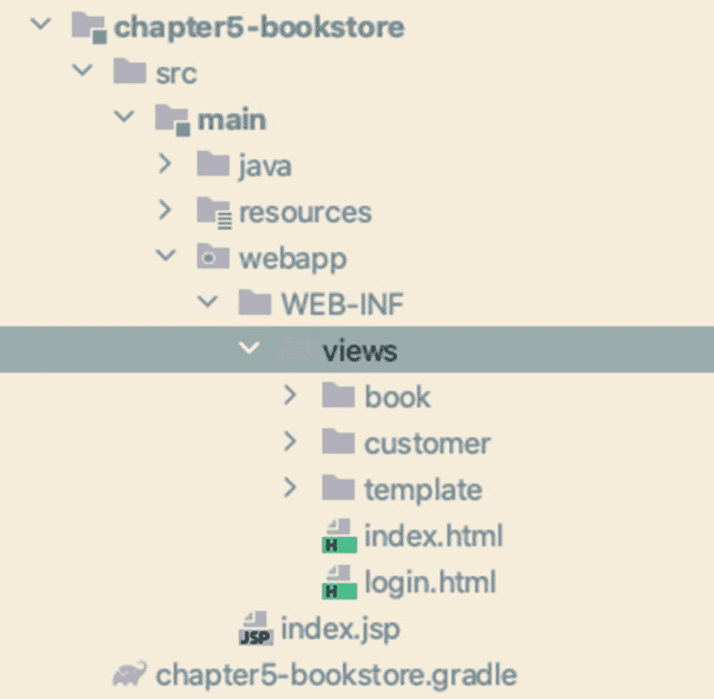

图 5-2

添加`login.html`后的目录结构

表 5-11

CookieValue 属性

<colgroup><col class="tcol1 align-left"> <col class="tcol2 align-left"> <col class="tcol3 align-left"></colgroup> 
| 

属性

 | 

缺省值

 | 

描述

 |
| --- | --- | --- |
| `required` | `true` | 指示参数是否是必需的。如果它是必需的并且缺少参数，则抛出`org.springframework.web.bind.ServletRequestBindingException`。当设置为`false`时，`null`作为一个值；或者，指定时使用`defaultValue`。 |
| `defaultValue` | `null` | 指示当请求中缺少参数时要使用的默认值。设置默认值就是隐式地将 required 设置为 false。该值可以是硬编码值，也可以是 SpEL 表达式。 |
| `value`或`name` | 空字符串 | 指示要绑定到的 cookie 的名称。如果没有指定名称，该名称将从方法参数名称中派生。如果没有找到名字，抛出`java.lang.IllegalArgumentException`。 |

登录页面需要一些内容。站点所有页面共有的内容在`template/layout.html`模板中声明。声明`login.html`继承了一些内容，并使用特殊的百里香结构(如`th:fragment`和`th:replace`)替换了一些内容。`login.html`页面最重要的部分是登录表单，如清单 5-9 所示。

表 5-12

会话属性属性

<colgroup><col class="tcol1 align-left"> <col class="tcol2 align-left"> <col class="tcol3 align-left"></colgroup> 
| 

属性

 | 

缺省值

 | 

描述

 |
| --- | --- | --- |
| `required` | `true` | 指示参数是否是必需的。如果它是必需的并且缺少参数，则抛出`org.springframework.web.bind.ServletRequestBindingException`。当设置为`false`时，`null`用作一个值。 |
| `value`或`name` | 空字符串 | 指示要绑定到的 cookie 的名称。如果没有指定名称，该名称将从方法参数名称中派生。如果没有找到名字，抛出`java.lang.IllegalArgumentException`。 |

```java
<form action="#" th:action="@{/login}" method="POST" id="loginForm">
    <fieldset>
        <legend>Login</legend>
        <table>
            <tr>
                <td>Username</td>
                <td>
                    <input type="text" id="username" name="username"
                      placeholder="Username"/>
                </td>
            </tr>
            <tr>

                <td>Password</td>
                <td>
                    <input type="password" id="password" name="password"
                    placeholder="Password"/>
                </td>
            </tr>
            <tr>
                <td colspan="2" align="center">
                    <button id="login">Login</button>
                </td>
            </tr>
        </table>
    </fieldset>
</form>

Listing 5-9The Login Page, login.html

```

除了页面，我们还需要有一个控制器，并将其映射到`/login`。让我们创建`com.apress.prospringmvc.bookstore.web.controller.LoginController`并让它呈现我们的页面(参见清单 5-10 )。

表 5-24

LocaleResolver 概述

<colgroup><col class="tcol1 align-left"> <col class="tcol2 align-left"></colgroup> 
| 

班级

 | 

描述

 |
| --- | --- |
| `FixedLocaleResolver` | 总是解析为固定的区域设置。我们网站的所有用户都使用相同的区域设置，因此不支持更改区域设置。 |
| `SessionLocaleResolver` | 解析(并存储)用户的`HttpSession`中的区域设置。属性存储可以配置的区域设置，以及在没有区域设置时使用的默认区域设置。这样做的缺点是，区域设置不会在两次访问之间存储，因此必须在用户的会话中至少设置一次。 |
| `AcceptHeaderLocaleResolver` | 使用 HTTP accept 标头解析区域设置。通常，这是用户操作系统的区域设置，因此不支持更改区域设置。它也是`DispatcherServlet`使用的默认`LocalResolver`。 |
| `CookieLocaleResolver` | 使用 cookie 存储用户的区域设置。这个解析器的优点是区域设置保存在客户端的机器上，因此在以后访问网站时可以使用。可以配置 cookie 名称和超时，以及默认的区域设置。 |

表 5-23

消息源概述

<colgroup><col class="tcol1 align-left"> <col class="tcol2 align-left"></colgroup> 
| 

班级

 | 

描述

 |
| --- | --- |
| `ResourceBundleMessageSource` | 使用 JVM 上可用的`ResourceBundle`工具。它只能从类路径加载资源。 |
| `ReloadableResourceBundleMessageSource` | 工作方式与`ResourceBundleMessageSource`类似，但是增加了重载和缓存功能。它允许资源在文件系统的任何地方；它使用 Spring 中的资源加载机制。 |

表 5-22

JSR-303 注释的字段错误的错误代码

<colgroup><col class="tcol1 align-left"> <col class="tcol2 align-left"></colgroup> 
| 

模式

 | 

例子

 |
| --- | --- |
| 注释名称+对象名称+字段 | `NotEmpty.newOrder.name` |
| 注释名称+字段 | `NotEmpty.name` |
| 注释名称+字段类型 | `NotEmpty.java.lang.String` |
| 注释名称 | `NotEmpty` |

表 5-21

字段错误的错误代码

<colgroup><col class="tcol1 align-left"> <col class="tcol2 align-left"></colgroup> 
| 

模式

 | 

例子

 |
| --- | --- |
| 代码+对象名称+字段 | `required.newOrder.name` |
| 代码+字段 | `required.name` |
| 代码+字段类型 | `required.java.lang.String` |
| 密码 | `required` |

表 5-20

Spring MVC 使用的 Spring 默认属性编辑器

<colgroup><col class="tcol1 align-left"> <col class="tcol2 align-left"></colgroup> 
| 

班级

 | 

说明

 |
| --- | --- |
| `ByteArrayPropertyEditor` | 一个用于字节数组的编辑器，可以将字符串转换成相应的字节表示形式。 |
| `CharterEditor` | 用于`Character`或`char`字段的编辑器。它将(Unicode)字符串转换为字符。如果不止一个字符被解析，抛出`java.lang.IllegalArgumentException`。默认注册。 |
| `CharsetEditor` | 一个用于`java.nio.charset.Charset`的编辑器，它需要与`java.nio.charset.Charset`的命名方法相同的命名语法。 |
| `ClassEditorClassArrayEditor` | 将表示类的字符串解析成实际类的编辑器，反之亦然。当找不到类时，抛出`java.lang.IllegalArgumentException`。 |
| `CurrencyEditor` | 将货币代码翻译成`Currency`对象的货币编辑器。它还将货币代码公开为一个`Currency`对象的文本表示。 |
| `CustomBooleanEditor` | 用于`Boolean`属性的可定制属性编辑器。 |
| `CustomCollectionEditor` | 一个用于集合的属性编辑器，可以将任何源`Collection`转换成给定的目标集合类型。 |
| `CustomMapEditor` | 将任何源`Map`转换成给定目标`Map`类型的`Map`属性编辑器。 |
| `CustomDateEditor` | 支持定制`DateFormat`的`java.util.Date`的可定制属性编辑器。默认情况下是*而不是*注册的，用户必须根据需要以适当的格式注册。 |
| `CustomNumberEditor` | 任何`Number`子类的可定制属性编辑器，如`Integer`、`Long`、`Float`等等。默认情况下，它是注册的，但可以通过将其自定义实例注册为自定义编辑器来重写。 |
| `FileEditor` | 能够将字符串解析为`java.io.File`对象的编辑器。它是默认注册的。 |
| `InputStreamEditor` | 一个单向属性编辑器，能够接受文本字符串并产生`java.io.InputStream`，因此`InputStream`属性可以直接设置为字符串。注意，默认用法不会为你关闭`InputStream`！它是默认注册的。 |
| `LocaleEditor` | 能够解析到`Locale`对象的编辑器，反之亦然(字符串格式为*【国家】*【变量】，这与`Locale`的`toString()`方法提供的行为相同)。它是默认注册的。 |
| `PatternEditor` | 一个能够将字符串解析为 JDK 1.5 `Pattern`对象的编辑器，反之亦然。 |
| `PropertiesEditor` | 一个能够将字符串(使用 Javadoc 中为 Properties 类定义的格式进行格式化)转换为`Properties`对象的编辑器。它是默认注册的。 |
| `StringTrimmerEditor` | 修剪字符串的属性编辑器。可选地，它允许将空字符串转换为空值。默认注册的是*不是*；它必须由用户根据需要进行注册。 |
| `TimeZoneEditor` | 将时区 id 转换成时区对象的编辑器。注意，它不公开 TimeZone 对象的文本表示。 |
| `URIEditor` | 一个用于`java.net.URI`的编辑器，它直接填充 URI 属性，而不是使用字符串属性作为桥梁。默认情况下，该编辑器将字符串编码为 URIs。 |
| `URLEditor` | 能够将 URL 的字符串表示解析为实际的`java.net.URL`对象的编辑器。它是默认注册的。 |
| `UUIDEditor` | 默认情况下，将字符串转换为`java.util.UUID`，反之亦然。 |
| `ZoneId` | 默认情况下，将字符串转换为`java.time.ZoneId`，反之亦然。 |

表 5-19

书店项目中使用的百里香表达式。

<colgroup><col class="tcol1 align-left"> <col class="tcol2 align-left"></colgroup> 
| 

表示

 | 

描述

 |
| --- | --- |
| `<head th:replace="~{template/layout :: head('Search books')}"></head>` | 可参数化的片段表达式:当前模板中的`<head../>`元素被替换为来自`template/layout.html`的元素，参数值被注入到这个`<head../>`元素声明中需要的地方。 |
| `<div id="header" th:replace="~{template/layout :: header}" ></div>` | 片段表达式:这个 div 元素被模板`template/layout.html`中具有相同 ID 的元素替换。 |
| `<h1 id="pagetitle" th:text="#{book.search.title}">SEARCH TITLE</h1>` | 消息表达式:`<h1>`元素的值被替换为与`book.search.title`消息键匹配的消息值。产生的 HTML 元素，对于和 EN 区域设置是`<h1 id="pagetitle">Search Books</h1>`。 |
| `th:action="@{/book/search}"` | 链接表达式:通过在作为参数提供的值前面添加协议、域名和应用上下文来生成完整的 URL(例如，`http://localhost:8080/chapter5-bookstore/book/search`)。它为表单提供了一个 POST 端点。 |
| `th:object="${bookSearchCriteria}"` | 变量表达式:声明用于收集表单数据的模型对象。 |
| `<th:block th:each="book : ${bookList}"> </th:block>` | 变量表达式–迭代:块中的内容对于`bookList`中的每个元素都是重复的 |
| `<td><input type="text" th:field="{title}"/><span th:if="${#fields.hasErrors('title')}"   class="error" th:errors="{title}"></span></td>` | 变量表达式–验证:在`bean-backed form,`中，辅助元素可以显示验证错误。一般来说，如果用户输入的标题违反了`@Valid`约束，它会返回到这个页面并显示错误消息。 |

表 5-18

百里香叶标准表达类型。

<colgroup><col class="tcol1 align-left"> <col class="tcol2 align-left"> <col class="tcol3 align-left"></colgroup> 
| 

建造

 | 

表达式类型

 | 

评论

 |
| --- | --- | --- |
| `${...` `}` | 变量表达式。 | OGNL 表达式或 Spring EL 在*模型属性*上执行。 |
| `*{...` `}` | 选择表达式。 | 对先前用变量表达式选择的对象执行的 OGNL 表达式或 Spring EL。 |
| `#{...` `}` | 消息(i18n)表达式。 | 也称为*国际化表达式*以允许检索特定于地区的消息。 |
| `@{...` `}` | 链接(URL)表达式。 | 构建 URL 并添加有用的上下文和会话信息。 |
| `~{...` `}` | 片段表达式。 | 表示标记片段并在模板中移动它们的简单方法。可以指定模板元素的继承或重写。 |

表 5-17

会话属性属性

<colgroup><col class="tcol1 align-left"> <col class="tcol2 align-left"></colgroup> 
| 

参数名称

 | 

描述

 |
| --- | --- |
| `value` | 应存储在会话中的模型属性的名称。 |
| `types` | 模型属性的完全限定类名(类型)应该存储在会话中。这种类型的模型中的所有属性都存储在会话中，不管它们的名称如何。 |

表 5-16

`WebDataBinder`属性。

<colgroup><col class="tcol1 align-left"> <col class="tcol2 align-left"></colgroup> 
| 

属性

 | 

描述

 |
| --- | --- |
| `allowedFields` | 指定允许绑定的字段。是白名单；只有包含在此列表中的字段用于绑定。字段名还可以包含一个星号(`*`)，用于将字段名与特定模式相匹配。默认情况下，允许所有字段。有关从绑定中排除字段的信息，请参见`disallowedFields`属性。 |
| `autoGrowCollectionLimit` | 设置绑定时自动增大集合的最大大小。此设置可以防止在绑定大型集合时出现内存不足的错误。默认情况下，它设置为 256。 |
| `autoGrowNestedPaths` | 如果设置为`true`，用默认对象值填充包含`null`值的路径，而不是引发异常。这个默认的对象值用于表达式的进一步遍历。当访问越界索引时，该属性还控制集合的自动增长。默认情况下，它被设置为`true`。 |
| `bindEmptyMultipartFiles` | 默认情况下，如果用户在没有选择不同文件的情况下重新提交多部分表单，会用空的多部分文件夹替换已绑定的多部分文件。如果这不是你想要的，而你想要的是`null`，那么关闭这个属性。 |
| `bindingErrorProcessor` | 设置`org.springframework.validation.BindingErrorProcessor`执行。Spring 提供了`org.springframework.validation.DefaultBindingErrorProcessor`作为默认实现。 |
| `conversionService` | 设置 org . spring framework . core . convert . conversion service。 |
| `disallowedFields` | 指定不允许绑定的字段。这是绑定期间要忽略的请求参数名称的黑名单。一般来说，将 ID 和版本字段放在那里是明智的。和`allowedFields`一样，这个属性可以包含一个*来匹配具有特定模式的字段名。 |
| `extractOldValueForEditor` | 指定是否提取编辑器和转换器的旧值。默认情况下，旧值保留在绑定结果中。如果不希望这样，将该属性设置为`false`。如果您有带副作用的 getters(例如，它们设置其他属性或默认值)，将这个设置为`false`也是有用的。 |
| `fieldDefaultPrefix` | 指定前缀以标识包含空字段默认值的参数。默认值为！。 |
| `fieldMarkerPrefix` | 指定前缀以标识标记未提交字段的参数。通常，这对于复选框很有用。未选中的复选框不会作为请求的一部分提交。注意，这个机制仍然让我们接收一个值。默认标记是 _(下划线)。 |
| `ignoreInvalidFields` | 如果设置为`true`，忽略无效字段。我们应该忽略模型对象中对应字段的绑定参数，但是这些参数是不可访问的吗？一般来说，当嵌套路径的一部分解析为`null`时，就会发生这种情况。默认值为 false(即*而不是*忽略这些字段)。 |
| `ignoreUnknownFields` | 指示是否忽略未在模型对象上表示为参数的参数。当设置为`false`时，提交的所有参数必须在我们的模型对象上表示。默认为`true`。 |
| `messageCodesResolver` | 设置`org.springframework.validation.MessageCodesResolver`。Spring 提供了`org.springframework.validation.DefaultMessageCodesResolver`作为默认实现。 |
| `requiredFields` | 设置必填字段。如果未设置必填字段，这将导致绑定错误。 |
| `validator` | 设置`org.springframework.validation.Validator`执行。 |

表 5-15

configurablewebbindininitializer 属性

<colgroup><col class="tcol1 align-left"> <col class="tcol2 align-left"></colgroup> 
| 

属性

 | 

描述

 |
| --- | --- |
| `autoGrowNestedPaths` | 如果设置为 true，则包含空值的路径将由默认对象值填充，而不会导致异常。此外，这个默认值用于表达式的进一步遍历。当访问越界索引时，该属性还控制集合的自动增长。默认值为 true。 |
| `bindingErrorProcessor` | 设置 org . spring framework . validation . bindingerrorprocessor 实现。 |
| `conversionService` | 设置`org.springframework.core.convert.ConversionService`的实例。 |
| `directFieldAccess` | 当设置为`true`时，我们不需要编写 getter/setter 来访问字段。默认为`false`。 |
| `messageCodesResolver` | sets org . springframework . validation . message codes resolve。 |
| `propertyEditorRegistrar propertyEditorRegistrars` | 注册一个或多个`org.springframework.beans.PropertyEditorRegistrars`。当我们想要使用旧式的`PropertyEditors`进行类型转换时，这是很有用的。 |
| `Validator` | 设置`org.springframework.validation.Validator`执行。 |

表 5-14

受支持的方法返回值

<colgroup><col class="tcol1 align-left"> <col class="tcol2 align-left"></colgroup> 
| 

参数类型

 | 

描述

 |
| --- | --- |
| `org.springframework.web.servlet.ModelAndView` | 当`ModelAndView`返回时，按原样使用。它应该包含要使用的完整模型和要渲染的视图(或`View`)的名称(后者是可选的)。 |
| `org.springframework.ui.Model` | 指示此方法返回了一个模型。该模型中的对象被添加到控制器的隐式模型中，并可用于视图渲染。视图的名称由`org.springframework.web.servlet.RequestToViewNameTranslator`决定。 |
| `java.util.Maporg.springframework.ui.ModelMap` | 地图元素被添加到控制器的隐式模型中，并可用于视图渲染。视图的名称由`org.springframework.web.servlet.RequestToViewNameTranslator`决定。 |
| `org.springframework.web.servlet.View` | 要呈现的视图。 |
| `java.lang.CharSequence`(一般为`java.lang.String`) | 要呈现的视图的名称。如果用`@ModelAttribute`标注，它将被添加到模型中。 |
| `java.lang.Void` | 控制器已经准备好模型，视图的名称由`org.springframework.web.servlet.RequestToViewNameTranslator.`决定 |
| `org.springframework.http.HttpEntity<?>org.springframework.http.ResponseEntity<?>` | 指定返回给用户的标题和实体主体。实体体通过`org.springframework.http.converter.HttpMessageConverter`被转换并发送给响应流。可选地，`HttpEntity`也可以设置一个状态码发送给用户。 |
| `org.springframework.http.HttpHeaders` | 指定要返回给用户的标头。 |
| `org.springframework.web.servlet.mvc.method.annotation.StreamingResponseBody` | 将结果异步写入客户端。需要启用异步处理(默认情况下打开)。 |
| `org.springframework.web.context.request.async.DeferredResultorg.springframework.util.concurrent.ListenableFuturejava.util.concurrent.CompletionStagejava.util.concurrent.Callable` | 异步处理环境中使用的异步结果类型。需要启用异步处理(默认情况下打开)。 |
| 任何其他返回类型 | 所有其他返回类型都用作模型属性。该名称源自返回类型或在`org.springframework.web.bind.annotation.ModelAttribute`中指定的名称。除非方法返回值用`@ResponseBody`标注，否则它会使用`HttpMessageConverter`写入客户端，而不是用作模型属性。更多细节，请参见关于休息控制器的第七章。 |

表 5-13

`RequestAttribtue`属性

<colgroup><col class="tcol1 align-left"> <col class="tcol2 align-left"> <col class="tcol3 align-left"></colgroup> 
| 

属性

 | 

缺省值

 | 

描述

 |
| --- | --- | --- |
| `required` | `true` | 指示参数是否是必需的。如果它是必需的并且缺少参数，则抛出`org.springframework.web.bind.ServletRequestBindingException`。当设置为`false`时，`null`用作一个值。 |
| `value`或`name` | 空字符串 | 指示要绑定到的 cookie 的名称。如果没有指定名称，该名称将从方法参数名称中派生。如果没有找到名字，抛出`java.lang.IllegalArgumentException`。 |

```java
package com.apress.prospringmvc.bookstore.web.controller;

import org.springframework.stereotype.Controller;
import org.springframework.web.bind.annotation.GetMapping;
import org.springframework.web.bind.annotation.RequestMapping;
import org.springframework.web.bind.annotation.RequestMethod;

@Controller
@RequestMapping("/login")
public class LoginController {

  @GetMapping
  public String login() {
    return "login";
  }
}

Listing 5-10The Initial LoginController

```

重启应用后，我们点击登录按钮，我们应该会看到如图 5-3 所示的页面。

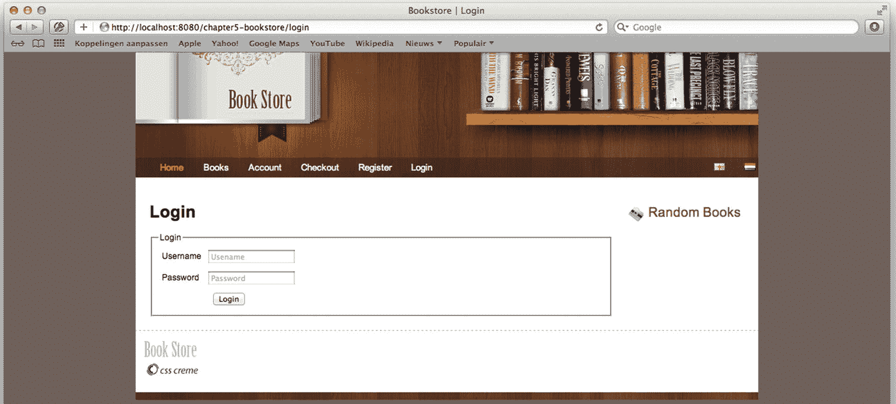

图 5-3

登录页面

如果我们现在输入用户名和密码(jd/secret)并按下 Login 按钮，我们会看到一个错误页面(错误代码 405 ),指出不支持该方法(POST)。这是正确的，因为我们的控制器还没有处理 POST 请求的方法。因此，让我们在控制器中添加一个方法来处理我们的登录。清单 5-11 显示了修改后的控制器。

```java
package com.apress.prospringmvc.bookstore.web.controller;

import com.apress.prospringmvc.bookstore.domain.Account;

import org.springframework.stereotype.Controller;
import org.springframework.web.bind.annotation.*;
import org.springframework.web.servlet.mvc.support.RedirectAttributes;

import javax.servlet.http.HttpSession;

@Controller
@RequestMapping("/login")
public class LoginController {

  private static final String ACCOUNT_ATTRIBUTE = "account";

  private final AccountService accountService;

  public LoginController(AccountService accountService) {
    this.accountService = accountService;
  }

  @GetMapping
  public String login() {
    return "login";
  }

  @PostMapping
  public String handleLogin(HttpServletRequest request, HttpSession session) {
    try {
      var username = request.getParameter("username");
      var password = request.getParameter("password");
      var account = this.accountService.login(username, password);
      session.setAttribute(ACCOUNT_ATTRIBUTE, account);
      return "redirect:/index.htm";
    } catch (AuthenticationException ae) {
      request.setAttribute("exception", ae);
      return "login";
    }
  }
}

Listing 5-11The Modified LoginController

```

在我们继续之前，让我们深入了解一下`handleLogin`方法是如何工作的。从请求中检索`username`和`password`参数；他们把`AccountService`上的`login`方法叫做。如果提供了正确的凭证，我们将获得用户的一个`Account`实例(存储在会话中)，然后重定向到索引页面。如果凭证不正确，服务抛出一个`authentication exception`，现在由控制器处理。异常存储为请求属性，我们将用户返回到登录页面。

尽管当前控制器完成了它的工作，我们仍然直接在`HttpServletRequest`上操作。这是一种麻烦(但有时是必要的)的方法；然而，我们通常希望避免这种情况，并使用灵活的方法签名来简化我们的控制器。记住这一点，让我们修改控制器，限制直接访问请求的使用(参见清单 5-12 )。

```java
package com.apress.prospringmvc.bookstore.web.controller;

import org.springframework.web.bind.annotation.RequestParam;

// Other imports omitted, see Listing 5-11

@Controller
@RequestMapping(value = "/login")
public class LoginController {

// Other methods omitted

  @PostMapping
  public String handleLogin(@RequestParam String username, @RequestParam String password,
 HttpServletRequest request, HttpSession session)
                            throws AuthenticationException {
    try {
      var account = this.accountService.login(username, password);
      session.setAttribute(_ACCOUNT_ATTRIBUTE_, account);
      return "redirect:/index.htm";
    } catch (AuthenticationException ae) {
      request.setAttribute("exception", ae);
      return "login";
    }
  }
}

Listing 5-12The LoginController with RequestParam

```

使用`@RequestParam`注释简化了我们的控制器。然而，我们的异常处理规定我们仍然需要访问请求。这将在下一章我们实现异常处理时改变。

这种方法有一个缺点:在浏览器中缺乏对后退按钮的支持。如果我们返回一页，我们会得到一个漂亮的弹出窗口，询问我们是否要重新提交表单。常见的方法是在发出 <sup>7</sup> 请求后进行重定向；这样，我们可以解决双重提交的问题。在 Spring 中，我们可以通过使用`RedirectAttributes`来解决这个问题。清单 5-13 用粗体突出显示了对我们控制器的最终修改。

```java
package com.apress.prospringmvc.bookstore.web.controller;

// Other imports omitted, see Listing 5-11

import org.springframework.web.servlet.mvc.support.RedirectAttributes;

@Controller
@RequestMapping(value = "/login")
public class LoginController {

// Other methods omitted

  @PostMapping
  public String handleLogin(@RequestParam String username,
                            @RequestParam String password,
                            RedirectAttributes redirect,
                            HttpSession session)
                             throws AuthenticationException {

    try {
      var account = this.accountService.login(username, password);
      session.setAttribute(ACCOUNT_ATTRIBUTE, account);
      return "redirect:/index.htm";
    } catch (AuthenticationException ae) {
      redirect.addFlashAttribute("exception", ae);
      return "redirect:/login";
    }
  }
}

Listing 5-13The LoginController with RedirectAttributes

```

当应用被重新部署，并且我们登录时，输入错误的用户名/密码组合会引发一条错误消息；但是，当我们按下 Back 按钮时，弹出的表单提交请求消失了。

直到现在，我们所做的一切都是低水平的。我们的解决方案包括直接处理请求和/或响应，或者通过使用`org.springframework.web.bind.annotation.RequestParam`进行一点抽象。然而，我们使用面向对象的编程语言，在可能的情况下，我们希望使用对象。我们将在下一节探讨这一点。

### 图书搜索页面

我们有一家书店，我们想卖书。然而，目前我们的 web 应用中还没有允许用户搜索甚至查看图书列表的功能。让我们通过创建一个图书搜索页面来解决这个问题，以便我们的应用用户可以搜索图书。

首先，我们在`/WEB-INF/views`目录中创建一个目录`book`。在这个目录中，我们创建了一个名为`search.html`的文件。这个文件是我们的搜索表单，它也显示搜索的结果。搜索表单和结果表的代码可以在清单 5-14 中看到。

```java
<form action="#" th:action="@{/book/search}"
            method="GET" id="bookSearchForm">
    <fieldset>
        <legend>Search Criteria</legend>
        <table>
            <tr>
                <td><label>Title</label></td>
                <td><input type="text"/></td>
            </tr>
        </table>
    </fieldset>
    <button id="search"">Search</button>
</form>
<!-- other HTML and JavaScript code omitted -->

<table id="bookSearchResults">
    <thead>
        <tr>
            <th>Title</th>
            <th>Description</th>
            <th>Price</th>
        </tr>
    </thead>
    <tbody>
    <th:block th:each="book : ${bookList}">
        <tr>
            <td th:text="${book.title}"></td>
            <td th:text="${book.description}"></td>
            <td th:text="${book.price}"></td>
        </tr>
    </th:block>
    </tbody>
</table>

Listing 5-14The Search Page Form

```

该页面包含一个表单，其中有一个字段用于填写搜索书籍的(部分)标题。当有结果时，我们向用户显示一个包含结果的表格。现在我们有了一个页面，我们还需要一个控制器来处理请求。清单 5-15 显示初始`com.apress.prospringmvc.bookstore.web.controller.BookSearchController`。

```java
package com.apress.prospringmvc.bookstore.web.controller;

import org.springframework.beans.factory.annotation.Autowired;
import org.springframework.stereotype.Controller;
import org.springframework.ui.Model;
import org.springframework.web.bind.annotation.RequestMapping;
import org.springframework.web.bind.annotation.RequestMethod;
import com.apress.prospringmvc.bookstore.domain.BookSearchCriteria;
import com.apress.prospringmvc.bookstore.service.BookstoreService;
import javax.servlet.http.HttpServletRequest;

@Controller
public class BookSearchController {

  private final BookstoreService bookstoreService;

  public BookSearchController(BookstoreService bookstoreService) {
    this.bookstoreService=bookstoreService;
  }

  @GetMapping("/book/search")
  public String list(Model model, HttpServletRequest request) {
    var criteria = new BookSearchCriteria();
    criteria.setTitle(request.getParameter("title"));
    model.addAttribute(this.bookstoreService.findBooks(criteria));
    return "book/search";
  }
}

Listing 5-15The BookSearchController with Search

```

控制器对 URL 做出反应，从请求中检索 title 参数(这是我们页面中字段的名称，如清单 5-13 所示)，最后继续搜索。搜索的结果被放入模型中。最初，它显示所有的书；然而，一旦输入了标题，它就会限制基于该标题的结果(参见图 5-4 )。

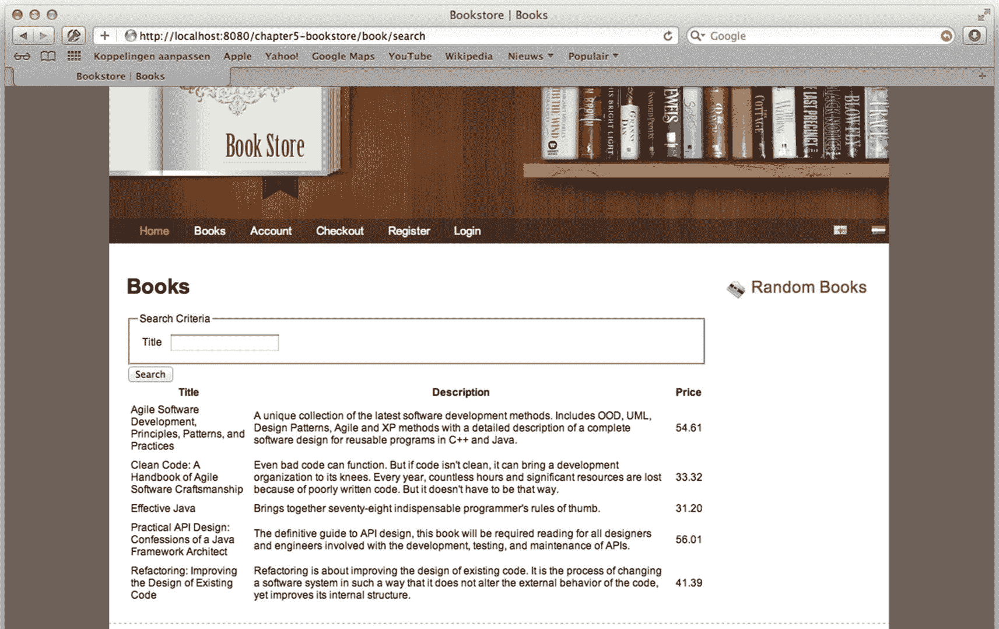

图 5-4

显示结果的图书搜索页面

如前所述，在大多数情况下，直接使用`HttpServletRequest`是不必要的。让我们把`com.apress.prospringmvc.bookstore.domain.BookSearchCriteria`放在方法参数列表中，让我们的搜索方法简单一点(参见清单 5-16 )。

```java
package com.apress.prospringmvc.bookstore.web.controller;

import org.springframework.web.bind.annotation.RequestParam;

// Other imports omitted, see listing 5-15

@Controller
public class BookSearchController {

  @GetMapping("/book/search")
  public String list(Model model, BookSearchCriteria criteria) {
    model.addAttribute(this.bookstoreService.findBooks(criteria));
    return "book/search";
  }
}

Listing 5-16The BookSearchController with BookSearchCriteria as a Method Argument

```

在 Spring MVC 中，这被称为*数据绑定*。为了启用数据绑定，我们需要修改`com.apress.prospring.bookstore.web.controller.BookSearchController,`，使其使用方法参数，而不是直接处理请求(参见清单 5-14 )。或者，它可以使用`RequestParam`来检索参数并在对象上设置它们。这迫使 Spring 在 criteria 方法参数上使用数据绑定。这样做将所有与我们的对象属性同名的请求参数映射到该对象(即，请求参数`title`被映射到属性`title`)。使用数据绑定简化了我们的控制器(您可以在本章的“数据绑定”一节中找到更深入的信息)。

我们可以做得更好！我们可以返回别的东西，而不是返回一个`String`。例如，让我们修改控制器来返回一组书籍。这个集合以名称`bookList`添加到模型中，如本章前面所解释的。清单 5-16 显示了这个控制器，但是我们在哪里选择视图来渲染呢？它没有被明确地指定。在第四章[中，我们提到如果没有明确提到的视图需要渲染，那么`org.springframework.web.servlet.RequestToViewNameTranslator`就会起作用。我们看到这种机制在这里发挥作用。它取 URL(`http://[server]:[port]/chapter5-bookstore/book/search`)；去掉服务器、端口和应用名称。删除后缀(如果有)；然后使用剩下的`book/search`作为视图名称进行渲染(这正是我们一直在返回的)。](04.html)

```java
package com.apress.prospringmvc.bookstore.web.controller;

// Other imports omitted, see listing 5-15

@Controller
public class BookSearchController {

  @GetMapping(value = "/book/search")
  public Collection<Book> list(BookSearchCriteria criteria ) {
    return this.bookstoreService.findBooks(criteria);
  }
}

Listing 5-17The BookSearchController Alternate Version

```

### 图书详细信息页面

现在让我们在搜索页面中加入更多的功能。例如，让我们将一本书的标题设置为一个链接，该链接可以导航到一本书的详细信息页面，该页面显示了该书的图片和一些信息。我们首先修改我们的`search.html`并添加链接(参见清单 5-18 )。

```java
<form action="#" th:action="@{/book/search}"
            method="GET" id="bookSearchForm">
    <fieldset>
        <legend >Search Criteria</legend>
        <table>
            <tr>
                <td><label for="title">Title</label></td>
                <td><input type="text" th:field="*{title}"/></td>
            </tr>
        </table>
    </fieldset>
    <button id="search">Search</button>
</form>
<!-- other HTML and JavaScript code omitted -->

<table id="bookSearchResults">
    <thead>
        <tr>
            <th>Title</th>
            <th>Description</th>
            <th>Price</th>
        </tr>
    </thead>
    <tbody>
    <th:block th:each="book : ${bookList}">
        <tr>
            <td><a th:href="@{/book/detail/} + ${book.id}"
                th:text="${book.title}"></a></td>
            <td th:text="${book.description}"></td>
            <td th:text="${book.price}"></td>
        </tr>
    </th:block>
    </tbody>
</table>

Listing 5-18The Modified Search Page

```

突出显示的行是我们需要对该页面进行的唯一更改。此时，我们已经基于书的 ID 生成了一个 URL，所以我们应该得到一个类似于`/book/detail/4`的 URL，它向我们显示了 ID 为 4 的书的详细信息。让我们创建一个控制器来对这个 URL 做出反应，并从 URL 中提取 ID(参见清单 5-19 )。

```java
package com.apress.prospringmvc.bookstore.web.controller;

import org.springframework.beans.factory.annotation.Autowired;
import org.springframework.stereotype.Controller;
import org.springframework.ui.Model;
import org.springframework.web.bind.annotation.GetMapping;
import org.springframework.web.bind.annotation.PathVariable;

import com.apress.prospringmvc.bookstore.domain.Book;
import com.apress.prospringmvc.bookstore.service.BookstoreService;

@Controller
public class BookDetailController {

  @GetMapping(value = "/book/detail/{bookId}")
  public String details(@PathVariable("bookId") long bookId, Model model) {
    var book = this.bookstoreService.findBook(bookId);
    model.addAttribute(book);
    return "book/detail";
  }
}

Listing 5-19The BookDetailController

```

突出显示的代码使得提取 ID 成为可能。这是`org.springframework.web.bind.annotation.PathVariable`在起作用。URL 映射包含`{bookId}`部分，它告诉 Spring MVC 将 URL 的这一部分绑定到一个名为`bookId`的路径变量。然后，我们可以使用注释再次检索路径变量。除了控制器，我们还需要一个 HTML 页面来显示细节。清单 5-20 中的代码在图书目录中创建了一个`detail.html`。

```java

<table>
    <tr>
        <td>Title</td>
        <td th:text="${book.title}"></td>
    </tr>
    <tr>
        <td >Description</td>
        <td th:text="${book.description}"></td>
    </tr>
    <tr>
        <td>Author</td>
        <td th:text="${book.author}"></td>
    </tr>
    <tr>
        <td>Year</td>
        <td th:text="${book.year}"></td>
    </tr>
    <tr>
        <td>ISBN</td>
        <td th:text="${book.isbn}"></td>
    </tr>
    <tr>
        <td >Price</td>
        <td th:text="${book.price}"></td>
    </tr>
</table>

Listing 5-20The Book’s detail.html Page

```

如果我们在重新部署后点击搜索页面中的一个链接，我们应该会看到一个显示图书图片和一些信息的详细页面(见图 5-5 )。

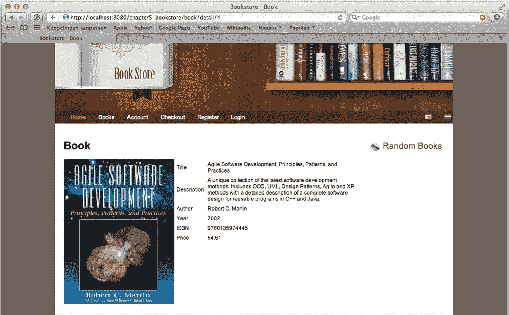

图 5-5

图书的详细信息页面

## 数据绑定

本节探讨使用数据绑定的好处，包括如何配置和扩展它。然而，我们从解释数据绑定的基础开始。清单 5-21 显示了我们的`com.apress.prospringmvc.bookstore.domain.BookSearchCriteria`类。它是一个简单的对象，有两个属性:`title`和`category`。

```java
package com.apress.prospringmvc.bookstore.domain;

public class BookSearchCriteria {

private String title;
private Category category;

  public String getTitle() {
    return this.title;
  }

  public void setTitle(String title) {
    this.title = title;
  }

  public void setCategory(Category category) {
    this.category = category;
  }

  public Category getCategory() {
    return this.category;
  }
}

Listing 5-21The BookSearchCriteria JavaBean

```

假设我们收到以下请求:`http://localhost:8080/chapter5-bookstore/book/search?title=Agile`。在这种情况下,“标题”属性的值为“Agile”。在幕后，Spring 调用 JavaBean 上的`setTitle`方法，我们在控制器的 list 方法中将它指定为方法参数。如果请求中有一个名为 category 的参数，Spring 将调用 setCategory 方法；然而，它会首先尝试将参数(总是一个`String`)转换成`com.apress.prospring.bookstore.domain.Category` JavaBean。

然而，数据绑定并不局限于简单的 setter 方法。我们还可以绑定到嵌套属性，甚至是索引集合，比如映射、数组和列表。当参数名包含一个*点*时，就会发生嵌套绑定。);例如，`address.street=Somewhere`导致`getAddress().setStreet("Somewhere")`。

为了绑定到索引集合，我们必须使用带方括号的符号将索引括起来。使用地图时，该索引不必是数字。例如，`list[2].name`将在列表的第三个元素上绑定一个 name 属性。类似地，`map['foo'].name`会将 name 属性绑定到 map 中 foo 键下的值。

### 自定义数据绑定

我们有两个选项来定制数据绑定的行为:全局或每个控制器。我们可以通过执行全局设置来混合这两种策略，然后对每个控制器进行微调。

#### 全球定制

为了全局定制数据绑定，我们需要创建一个实现`org.springframework.web.bind.support.WebBindingInitializer`接口的类。Spring MVC 提供了这个接口的可配置实现，`org.springframework.web.bind.support.ConfigurableWebBindingInitializer`。接口的实例必须向要使用的处理程序映射实现注册。在创建了一个`org.springframework.web.bind.WebDataBinder`的实例后，调用`org.springframework.web.bind.support.WebBindingInitializer`的`initBinder`方法。

所提供的实现允许我们设置几个属性。当属性未设置时，它使用由`org.springframework.web.bind.WebDataBinder`指定的默认值。如果我们想要指定更多的属性，很容易扩展默认实现并添加所需的行为。这里可以设置与控制器相同的属性(见表 5-15 )。

Spring Boot 让配置和重用`ConfigurableWebBindingInitializer`变得更加容易。它检测特定类型的 bean，并使用它来进一步配置处理程序适配器。

```java
@Bean
public ConfigurableWebBindingInitializer configurableWebBindingInitializer(
          Validator mvcValidator,
          FormattingConversionService conversionService) {
  var initializer = new ConfigurableWebBindingInitializer();
  initializer.setDirectFieldAccess(true);
  initializer.setValidator(mvcValidator);
  initializer.setConversionService(conversionService);
  return initializer;
}

Listing 5-22Configure the ConfigurableWebBindingInitializer

```

注意方法签名中的验证器和 FormattingConversionService 依赖关系。这些是启用从传入字符串参数到实际所需类型的验证和类型转换所必需的。

### 每个控制器定制

对于每控制器选项，我们必须在控制器中实现一个方法，并将`org.springframework.web.bind.annotation.InitBinder`注释放在该方法上。该方法必须没有返回值(`void`)并且至少有`org.springframework.web.bind.WebDataBinder`作为方法参数。方法*可以和请求处理方法*有相同的参数。但是，它*不能有带`org.springframework.web.bind.annotation.ModelAttribute`注释的*方法参数。这是因为模型在绑定后是可用的，在这个方法中，我们配置我们绑定的方式。

`org.springframework.web.bind.annotation.InitBinder`注释有一个名为 value 的属性，它可以接受这个 init-binder 方法所应用的模型属性名或请求参数名。默认情况下，应用于所有模型属性和请求参数。

为了定制绑定，我们需要配置我们的`org.springframework.web.bind.WebDataBinder`。这个对象有几个我们可以使用的配置选项(setter 方法)，如表 5-16 所示。

除了设置这些属性，我们还可以告诉`org.springframework.web.bind.WebDataBinder`使用 bean 属性访问(默认)或直接字段访问。这可以通过调用`initBeanPropertyAccess`或`initDirectFieldAccess`方法来分别设置属性访问或直接字段访问来实现。直接字段访问的优点是，我们不必为每个要用于绑定的字段编写 getter/setter。清单 5-23 展示了一个 init-binder 方法的例子。

```java
package com.apress.prospringmvc.bookstore.web.controller;

//Imports omitted

@Controller
@RequestMapping("/customer")
public class RegistrationController {

// Other methods omitted

  @InitBinder
  public void initBinder(WebDataBinder binder) {
    binder.initDirectFieldAccess();
    binder.setDisallowedFields("id");
    binder.setRequiredFields("username", "password", "emailAddress");
  }
}

Listing 5-23An Example init-binder Method

```

### 模型属性

为了充分利用数据绑定，我们必须使用模型属性。此外，我们应该使用这些模型属性之一作为表单字段绑定的对象。在我们的`com.apress.prospringmvc.bookstore.web.controller.BookSearchController`中，我们添加了一个对象作为方法参数，Spring 使用它作为绑定请求参数的对象。然而，对我们的对象和我们如何创建对象有更多的控制是可能的。为此，我们可以使用`org.springframework.web.bind.annotation.ModelAttribute`注释。这种注释既可以放在方法上，也可以放在方法参数上。

#### 在方法上使用 ModelAttribute

我们可以在方法上使用`@ModelAttribute`注释来创建一个要在表单中使用的对象(例如，在编辑或更新时)或者获取引用数据(例如，需要将表单呈现为类别列表的数据)。让我们修改我们的控制器，向模型添加一个类别列表和一个`com.apress.prospring.bookstore.domain.BookSearchCriteria`对象的实例(参见清单 5-24 )。

当一个`@ModelAttribute`注释放在一个方法上时，这个方法在请求处理方法被调用之前被调用！

```java
package com.apress.prospringmvc.bookstore.web.controller;

// Other imports omitted.

import org.springframework.web.bind.annotation.ModelAttribute;

@Controller
public class BookSearchController {

  private final BookstoreService bookstoreService;

  @ModelAttribute
  public BookSearchCriteria criteria() {
    return new BookSearchCriteria();
  }

  @ModelAttribute("categories")
  public List<Category> getCategories() {
    return this.bookstoreService.findAllCategories();
  }

  @GetMapping("/book/search")
  public Collection<Book> list(BookSearchCriteria criteria) {
    return this.bookstoreService.findBooks(criteria);
  }
}

Listing 5-24The BookSearchController with ModelAttribute Methods

```

用`@ModelAttribute`标注的方法在方法参数类型上与请求处理方法具有相同的灵活性。当然，它们不应该对响应进行操作，也不能有`@ModelAttribute`注释方法参数。我们也可以让方法返回`void`；然而，我们需要包含`org.springframework.ui.Model`、`org.springframework.ui.ModelMap,`或`java.util.Map`作为方法参数，并显式地将其值添加到模型中。

该注释也可以放在请求处理方法上，表明该方法的返回值是一个模型属性。然后视图的名称从使用已配置的`org.springframework.web.servlet.RequestToViewNameTranslator`的请求中派生出来。

#### 在方法参数上使用 ModelAttribute

当在方法参数上使用注释时，从模型中查找参数。如果没有找到，则使用默认构造函数创建该参数类型的实例。

清单 5-25 显示了带有注释的`com.apress.prospring.bookstore.web.controller.BookSearchController`。

```java
package com.apress.prospringmvc.bookstore.web.controller;

// Imports omitted see listing 5-22

@Controller
public class BookSearchController {

// Methods omitted see listing 5-22

  @GetMapping("/book/search")
  public Collection<Book> list(@ModelAttribute("bookSearchCriteria")
    BookSearchCriteria criteria) {
    return this.bookstoreService.findBooks(criteria);
  }
}

Listing 5-25The BookSearchController with ModelAttribute Annotation on a Method Argument

```

#### 使用会话属性

在请求之间的会话中存储模型属性可能是有益的。例如，假设我们需要编辑一个客户记录。第一个请求从数据库中获取客户。然后在应用中对其进行编辑，并将更改提交给客户。如果我们不在会话中存储客户，那么必须从数据库中检索客户记录。这可能不方便。

在 Spring MVC 中，您可以告诉框架在会话中存储某些模型属性。为此，可以使用`org.springframework.web.bind.annotation.` `SessionAttributes`注释(见表 5-17 )。您应该使用这个注释来存储会话中的模型属性，以便在多个 HTTP 请求中存活。但是，您不应该使用这个注释在会话中存储一些东西，然后使用`javax.servlet.http.HttpSession`来检索它。会话属性也只能在同一个控制器中使用，因此您不应该将它们用作在控制器之间移动对象的传输工具。如果你需要的话，我们建议你直接进入`HttpSession`。

当使用`org.springframework.web.bind.annotation.SessionAttributes`注释在会话中存储模型属性时，我们还需要告诉框架何时删除这些属性。为此，我们需要使用`org.springframework.web.bind.support.SessionStatus`接口(参见清单 5-26 )。当我们使用完属性后，我们需要在接口上调用`setComplete`方法。要访问该接口，我们可以简单地将其作为方法参数(见表 5-4 )。

```java
package org.springframework.web.bind.support;

public interface SessionStatus {

  void setComplete();
  boolean isComplete();

}

Listing 5-26The SessionStatus Interface

```

#### 胸腺泡表达

为了使用框架提供的所有数据绑定特性，我们依赖于视图技术，在本例中是百里香。百里香叶解析`search.html`模板并评估各种模板表达式来呈现表单。Spring 框架可以用于 JSP 视图，在这种情况下，Spring 标记库可以编写表单并将表单元素绑定到 Spring 对象。

使用百里香叶视图时，无论模板类型(HTML、文本等。)，您可以使用五种类型的标准表达式(或构造)。它们在表 5-18 中列出。

本章的例子中使用了许多这样的表达方式。表 5-19 列出了其中的一些，并对每一个做了简短的解释。

给定所有关于百里香表达式的信息，如果我们加载搜索页面并发出搜索，我们会看到我们的标题字段保持先前输入的值(见图 5-6 )。这是因为我们结合百里香表达式使用了数据绑定。

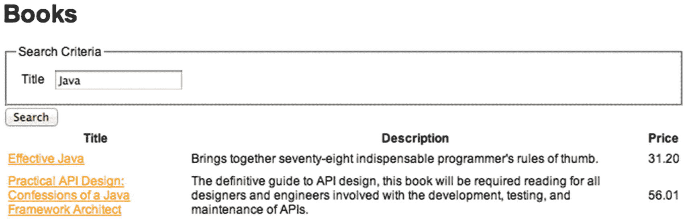

图 5-6

“标题”字段保持填充状态

现在是时候通过添加一个下拉框(一个 HTML select)来选择除标题之外要搜索的类别，让事情变得有趣一点了。首先，我们的模型中已经有了类别(参见清单 5-27 )。

```java
package com.apress.prospringmvc.bookstore.web.controller;
// other import statements omitted

@Controller
public class BookSearchController {

    @ModelAttribute("categories")
    public Iterable<Category> getCategories() {
        return this.bookstoreService.findAllCategories();
    }
    // other code omitted
}

Listing 5-27Adding Categories to the search.html Model

```

我们只想添加一个下拉菜单，并将其绑定到`category’s` ID 字段(参见清单 5-28 )。我们添加一个 select 标记，并告诉它哪个模型属性包含要呈现的项目。我们还为每个项目指定要显示的值和标签。该值绑定到用于表单的模型属性。

```java
<form action="#" th:action="@{/book/search}"
        th:object="${bookSearchCriteria}"
        method="GET" id="bookSearchForm">
    <fieldset>
        <legend>Search Criteria</legend>
        <table>
            <tr>
                <td>
                    <label for="title">Title</label>
                </td>
                <td><input type="text" th:field="*{title}"/></td>
            </tr>
            <tr>
                <td>
                    <label for="category">Category</label>
                </td>
                <td>
                    <select th:field="*{category}">
                        <option th:each="c : ${categories}"
                                th:value="${c.id}" th:text="${c.name}"
                                th:selected="${c.id==1}">
                        </option>
                    </select>
                </td>
            </tr>
        </table>
    </fieldset>
    <button id="search">Search</button>
</form>

// Result table omitted

Listing 5-28The Search Page with a Category Drop-down Element

```

### 类型变换

数据绑定的一个重要部分是类型转换。当我们收到请求时，我们唯一拥有的就是字符串实例。然而，在现实世界中，我们使用许多不同的对象类型，不仅仅是文本表示。因此，我们希望将那些字符串实例转换成我们可以使用的东西，这就是类型转换的用武之地。使用 Spring，有三种方法可以进行类型转换。

*   属性编辑器

*   转换器

*   格式化程序

属性编辑器是旧式的类型转换，而转换器和格式化程序是新的方式。转换器和格式化程序更加灵活；因此，它们也比属性编辑器更强大。此外，依赖属性编辑器会拉入整个`java.beans`包，包括它的所有支持类，这在 web 环境中是不需要的。

#### 属性编辑器

从一开始，对属性编辑器的支持就是 Spring 框架的一部分。为了使用这种类型转换，我们创建了一个 PropertyEditor 实现(通常通过子类化`PropertyEditorSupport`)。属性编辑器获取一个`String`并将其转换为强类型对象，反之亦然。Spring 提供了几个现成的实现来完成这个任务(见表 5-20 )。

所有的属性编辑器都在 org . spring framework . beans . property editors 包中。

#### 转换器

Spring 中的转换器 API 是一个通用的类型转换系统。在 Spring 容器中，这个系统作为属性编辑器的替代，将 bean 属性值字符串转换成所需的属性类型。每当我们需要进行类型转换时，我们也可以在应用中使用这个 API。转换器系统是一个强类型转换系统，并使用泛型来实现这一点。

四个不同的接口可以实现一个转换器，它们都在 org . spring framework . core . convert . converter 包中。

*   `Converter`

*   `ConverterFactory`

*   `GenericConverter`

*   `ConditionalGenericConverter`

让我们来探索四种不同的 API。

清单 5-29 显示了`Converter` API，非常简单。它只有一个`convert`方法，接受源参数并将其转换成目标参数。源和目标类型由`S`和`T`通用类型参数表示。

```java
package org.springframework.core.convert.converter;

public interface Converter<S, T> {

  T convert(S source);

}

Listing 5-29The Converter API

```

清单 5-30 展示了`ConverterFactory` API，当你需要一个完整的类层次结构的转换逻辑时，这很有用。为此，我们可以将`S`参数化为我们要转换的类型(源)，并将`R`参数化为我们要转换的基本类型。然后，我们可以在该工厂的实现中创建适当的转换器。

```java
package org.springframework.core.convert.converter;

public interface ConverterFactory<S, R> {

  <T extends R> Converter<S, T> getConverter(Class<T> targetType);

}

Listing 5-30The ConverterFactory API

```

当我们需要更复杂的转换逻辑时，我们可以使用`org.springframework.core .convert.converter.GenericConverter`(参见清单 5-31 )。与以前的转换器类型相比，它更灵活，但类型化程度较低。它支持多个源和目标类型之间的转换。在转换过程中，我们可以访问源和目标类型描述，这对复杂的转换逻辑很有用。这也允许类型转换由注释驱动(即，我们可以在运行时解析注释以确定需要做什么)。

```java
package org.springframework.core.convert.converter;

import org.springframework.core.convert.TypeDescriptor;
import org.springframework.util.Assert;
import java.util.Set;

public interface GenericConverter {

  Set<ConvertiblePair> getConvertibleTypes();
  Object convert(Object source, TypeDescriptor sourceType, TypeDescriptor targetType);

}

Listing 5-31The GenericConverter API

```

这种类型的转换逻辑的一个例子是从数组转换为集合的转换器。转换器首先检查要转换的元素的类型，以便对不同的元素应用附加的转换逻辑。

清单 5-32 显示了`GenericConverter`的一个特殊版本，它允许我们为它何时执行指定一个条件。例如，我们可以创建一个转换器，它使用 BigDecimals `valueOf`方法之一来转换一个值，但这只有在我们可以用给定的`source type`调用该方法时才有用。

```java
package org.springframework.core.convert.converter;

import org.springframework.core.convert.TypeDescriptor;

  boolean matches(TypeDescriptor sourceType, TypeDescriptor targetType);

}

Listing 5-32The ConditionalGenericConverter API

```

转换器在`org.springframework.core.convert.ConversionService`接口后执行(见清单 5-33)；该接口的典型实现还实现了`org.springframework.core.convert.converter.ConverterRegistry`接口，该接口可以轻松注册额外的转换器。当使用 Spring MVC 时，有一个预配置的`org.springframework.format.support.DefaultFormattingConversionService`实例(它也允许执行和注册格式化程序)。

```java
package org.springframework.core.convert;

public interface ConversionService {

  boolean canConvert(Class<?> sourceType, Class<?> targetType);
  boolean canConvert(TypeDescriptor sourceType, TypeDescriptor targetType);
  <T> T convert(Object source, Class<T> targetType);
  Object convert(Object source, TypeDescriptor sourceType, TypeDescriptor targetType);

}

Listing 5-33The ConversionService API

```

#### 格式化程序

转换器 API 是一个通用的类型转换系统。它是强类型的，可以从任何对象类型转换为另一种对象类型(如果有转换器可用的话)。然而，这不是我们在 web 环境中需要的东西，因为我们只处理字符串对象。另一方面，我们可能希望将对象以字符串的形式呈现给客户端，甚至可能希望以本地化的方式来实现。这就是格式化程序 API 的用武之地(参见清单 5-34 )。它提供了一种简单而可靠的机制来将字符串转换为强类型对象。它是属性编辑器的替代品，但也更轻便(例如，它不依赖于`java.beans`包)和更灵活(例如，它可以访问本地化内容的语言环境)。

```java
package org.springframework.format;

public interface Formatter<T> extends Printer<T>, Parser<T> {

}

import java.util.Locale

public interface Printer<T> {

  String print(T object, Locale locale);

}

import java.util.Locale

import java.text.ParseException;

public interface Parser<T> {

  T parse(String text, Locale locale) throws ParseException;

}

Listing 5-34The Formatter API

```

为了创建一个格式化程序，我们需要实现`org.springframework.format.Formatter`接口并将类型`T`指定为我们想要转换的类型。例如，假设我们有一个可以将`java.util.Date`实例转换成文本的格式化程序，反之亦然。我们将指定`T`为`Date`，并使用`Locale`来确定执行转换的具体日期格式(参见清单 5-35 )。

```java
package com.apress.prospringmvc.bookstore.formatter;

// java.text and java.util imports omitted

import org.springframework.format.Formatter;

import org.springframework.util.StringUtils;

public class DateFormatter implements Formatter<Date> {

  private String format;

  @Override
  public String print(Date object, Locale locale) {
    return getDateFormat(locale).format(object);
  }

  @Override
  public Date parse(String text, Locale locale) throws ParseException {
    return getDateFormat(locale).parse(text);
  }

  private DateFormat getDateFormat(Locale locale) {
    if (StringUtils.hasText(this.format)) {
      return new SimpleDateFormat(this.format, locale);
    } else {
      return SimpleDateFormat.getDateInstance(SimpleDateFormat.MEDIUM, locale);
    }
  }

  public void setFormat(String format) {
    this.format = format;
  }
}

Listing 5-35The Sample DateFormatter

```

格式化程序也可以由注释驱动，而不是由字段类型驱动。如果我们想将一个格式化程序绑定到一个注释，我们必须实现`org.springframework.format.AnnotationFormatterFactory`(参见清单 5-36 )。

```java
package org.springframework.format;

public interface AnnotationFormatterFactory<A extends Annotation> {

  Set<Class<?>> getFieldTypes();
  Printer<?> getPrinter(A annotation, Class<?> fieldType);
  Parser<?> getParser(A annotation, Class<?> fieldType);

}

Listing 5-36The AnnotationFormatterFactory

Interface

```

我们需要用我们想要关联的注释类型来参数化`A`。`getPrinter`和`getParser`方法应该分别返回`org.springframework.format.Printer`和`org.springframework.format.Parser`。然后，我们可以使用它们在注释类型之间进行转换。假设我们有一个`com.apress.prospringmvc.bookstore.formatter.DateFormat`注释，可以用来设置日期字段的格式。然后我们可以实现清单 5-37 中所示的工厂。

```java
package com.apress.prospringmvc.bookstore.formatter;

import java.util.Date;
import java.util.Set;
import org.springframework.format.AnnotationFormatterFactory;
import org.springframework.format.Parser;
import org.springframework.format.Printer;

public class DateFormatAnnotationFormatterFactory
    implements AnnotationFormatterFactory<DateFormat> {

  @Override
  public Set<Class<?>> getFieldTypes() {
    return Set.of(Date.class);
  }

  @Override
  public Printer<?> getPrinter(DateFormat annotation, Class<?> fieldType) {
    return createFormatter(annotation);
  }

  @Override
  public Parser<?> getParser(DateFormat annotation, Class<?> fieldType) {
    return createFormatter(annotation);
  }

  private DateFormatter createFormatter(DateFormat annotation) {
    var formatter = new DateFormatter();
    formatter.setFormat(annotation.format());
    return formatter;
  }
}

Listing 5-37The DateFormatAnnotationFormatterFactory Class

```

#### 配置类型转换

如果我们想在 Spring MVC 中使用`org.springframework.core.convert.converter.Converter`或者`org.springframework.format.Formatter`，那么我们需要增加一些配置。

`org.springframework.web.servlet.config.annotation.WebMvcConfigurerAdapter`对此有办法。可以覆盖`addFormatters`方法来注册额外的转换器和/或格式化程序。这个方法有`org.springframework.format.FormatterRegistry`(见清单 5-38 )作为参数，它可以注册额外的转换器和/或格式化程序。(`FormatterRegistry`扩展了`org.springframework.core.convert.converter.ConverterRegistry`，为`Converter`实现提供了相同的功能)。

```java
package org.springframework.format;

import java.lang.annotation.Annotation;

import org.springframework.core.convert.converter.ConverterRegistry;

public interface FormatterRegistry extends ConverterRegistry {

void addFormatter(Formatter<?> formatter);

void addFormatterForFieldType(Class<?> fieldType, Formatter<?> formatter);

void addFormatterForFieldType(Class<?> fieldType, Printer<?> printer, Parser<?> parser);

void addFormatterForFieldAnnotation(AnnotationFormatterFactory
     <? extends Annotation> annotationFormatterFactory);

}

Listing 5-38The FormatterRegistry Interface

```

为了从一个`String`转换到一个`com.apress.prospringmvc.bookstore.domain.Category`，我们实现了`org.springframework.core.convert.converter.GenericConverter`(参见清单 5-39 )并在我们的配置中注册它(参见清单 5-40 )。`com.apress.prospringmvc.bookstore.converter.StringToEntityConverter`将一个`String`作为其来源，并将其转换成一个可配置的实体类型。然后使用一个`javax.persistence.EntityManager`从数据库中加载记录。

```java
package com.apress.prospringmvc.bookstore.web.config;
// other imports omitted

@Configuration
public class WebMvcContextConfiguration implements WebMvcConfigurer {

// other code omitted

  @Bean
  public StringToEntityConverter categoryConverter() {
    return new StringToEntityConverter(Category.class);
  }

  @Override
  public void addFormatters(final FormatterRegistry registry) {
    registry.addConverter(categoryConverter());
    registry.addFormatter(new DateFormatter("dd-MM-yyyy"));
  }
}

Listing 5-40The CategoryConverter Configuration

```

```java
package com.apress.prospringmvc.bookstore.converter;

import org.springframework.core.convert.TypeDescriptor;
import org.springframework.core.convert.converter.GenericConverter;
import org.springframework.util.ReflectionUtils;
import org.springframework.util.StringUtils;

import javax.persistence.EntityManager;
import javax.persistence.PersistenceContext;
import java.util.Set;

public class StringToEntityConverter implements GenericConverter {

    private static final String ID_FIELD = "id";

    private final Class<?> clazz;

    @PersistenceContext
    private EntityManager em;

    public StringToEntityConverter(Class<?> clazz) {
        super();
        this.clazz = clazz;
    }

    @Override
    public Set<ConvertiblePair> getConvertibleTypes() {
        return Set.of(
                new ConvertiblePair(String.class, this.clazz),
                    new ConvertiblePair(this.clazz, String.class));
    }

    @Override
    public Object convert(Object source, TypeDescriptor sourceType, TypeDescriptor targetType) {
        if (String.class.equals(sourceType.getType())) {
            if (!StringUtils.hasText((String) source)) {
                return null;
            }
            var id = Long.parseLong((String) source);
            return this.em.find(this.clazz, id);
        } else if (this.clazz.equals(sourceType.getType())) {
                if (source == null) {
                        return "";
                } else {
                        var field = ReflectionUtils.findField(source.getClass(), ID_FIELD);
                        if (field != null) {
                            ReflectionUtils.makeAccessible(field);
                            return ReflectionUtils.getField(field, source);
                        }
                }
        }
        throw new IllegalArgumentException("Cannot convert " + source + " into a suitable type!");
    }
}

Listing 5-39The StringToEntityConverter

```

除了类别转换，我们还需要进行日期转换。因此，清单 5-38 也包含带有日期转换模式的`org.springframework.format.datetime.DateFormatter`。

#### 使用类型转换

现在我们已经讨论了类型转换，让我们看看它的实际应用。我们创建了用户注册页面，允许我们输入`com.apress.prospringmvc.bookstore.domain.Account`对象的详细信息。首先，我们需要一个`WEB-INF/views`下的网页。接下来，我们需要创建一个客户目录，并在其中放置一个`register.html`文件。清单 5-41 中包含的内容已经被简化，因为在这个页面上有很多不同字段的重复内容。

```java
<html xmlns:th="http://www.thymeleaf.org">
<head th:replace="~{template/layout :: head('Register')}"></head>
<!-- other HTML elements omitted -->

<form action="#" th:action="@{/customer/register}"
  th:object="${account}" method="POST" id="registerForm">
<fieldset>
<legend >Personal</legend>
<table>
    <tr>
        <td><label for="firstName">Firstname</label></td>
        <td><input type="text" th:field="*{firstName}"/>
            <span th:if="${#fields.hasErrors('firstName')}"
                class="error" th:errors="*{firstName}"></span>
        </td>
    </tr>
    <tr>
        <td><label for="lastName" >Lastname</label></td>
        <td><input type="text" th:field="*{lastName}"/>
            <span th:if="${#fields.hasErrors('lastName')}"
                class="error" th:errors="*{lastName}"></span>
        </td>
    </tr>
<tr>
        <td><label for="title" >date of Birth</label></td>
        <td><input type="date" th:field="*{dateOfBirth}"/>
            <span th:if="${#fields.hasErrors('dateOfBirth')}"
                class="error" th:errors="*{dateOfBirth}"></span>
        </td>
    </tr>
</table>
 <button id="search" >Save</button>
<!-- other form elements omitted -->

</fieldset>
</form>

Listing 5-41The Registration Page

```

为此我们还需要一个控制器，所以我们创建了`com.apress.prospringmvc.bookstore.web.controller.RegistrationController`。在这个控制器中，我们使用了一些数据绑定特性。首先，我们不允许提交一个`ID`字段(以防止有人编辑另一个用户)。然后，我们根据当前的地区预先选择用户的国家。清单 5-42 显示了我们的控制器。

```java
package com.apress.prospringmvc.bookstore.web.controller;

import java.util.Locale;
import java.util.Map;
import java.util.TreeMap;
import org.springframework.beans.factory.annotation.Autowired;
import org.springframework.stereotype.Controller;
import org.springframework.validation.BindingResult;
import org.springframework.web.bind.WebDataBinder;
import org.springframework.web.bind.annotation.InitBinder;
import org.springframework.web.bind.annotation.ModelAttribute;
import org.springframework.web.bind.annotation.RequestMapping;
import org.springframework.web.bind.annotation.RequestMethod;
import com.apress.prospringmvc.bookstore.domain.Account;

@Controller
@RequestMapping("/customer/register")
public class RegistrationController {

    private final AccountService accountService;

    public RegistrationController(AccountService accountService) {
        this.accountService = accountService;
    }

  @ModelAttribute("countries")
  public Map<String, String> countries(Locale currentLocale) {
    var countries = new TreeMap<String,String>();
    for (var locale : Locale.getAvailableLocales()) {
      countries.put(locale.getCountry(), locale.getDisplayCountry(currentLocale));
    }
    return countries;
  }

  @InitBinder
  public void initBinder(WebDataBinder binder) {
    binder.setDisallowedFields("id");
    binder.setRequiredFields("username","password","emailAddress");
  }

  @GetMapping
  @ModelAttribute
  public Account register(Locale currentLocale) {
    var account = new Account();
    account.getAddress().setCountry(currentLocale.getCountry());
    return account;
  }

  @RequestMapping(method = { RequestMethod.POST, RequestMethod.PUT })
  public String handleRegistration(@ModelAttribute Account account, BindingResult result) {
    if (result.hasErrors()) {
      return "customer/register";
    }
    this.accountService.save(account);
    return "redirect:/customer/account/" + account.getId();
  }

}

Listing 5-42The RegistrationController

```

控制器有很多事情要做。例如，`initBinder`方法配置我们的绑定。它不允许设置`ID`属性，并设置了一些必填字段。我们还有一种方法，通过将 JDK 中所有可用的国家添加到模型中来准备我们的模型。最后，我们有两个请求处理方法，一个用于 GET 请求(进入页面时的初始请求)，一个用于提交表单时的 POST/PUT 请求。注意模型属性旁边的`org.springframework.validation.BindingResult`属性。这就是我们可以用来检测错误，并在此基础上，我们可以重新显示原始页面。另外，请记住，百里香模板中的错误表达式显示了字段或对象的错误消息(这将在接下来的章节中介绍)。当应用被重新部署时，您点击注册链接，您应该看到如图 5-7 所示的页面。

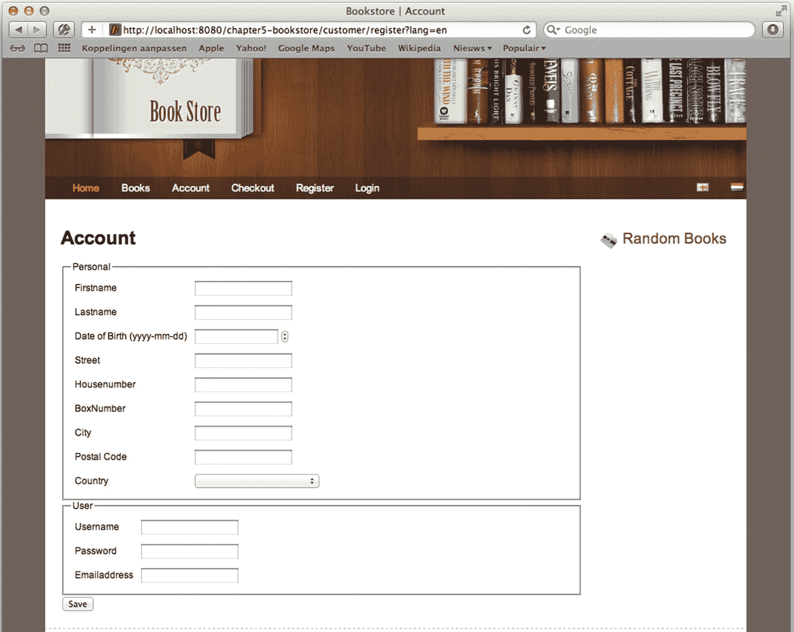

图 5-7

帐户注册页面

如果我们现在输入一个无效日期，将用户名、密码和电子邮件地址字段留空，然后提交表单，同一页面会重新显示一些错误消息(参见图 5-8 )。

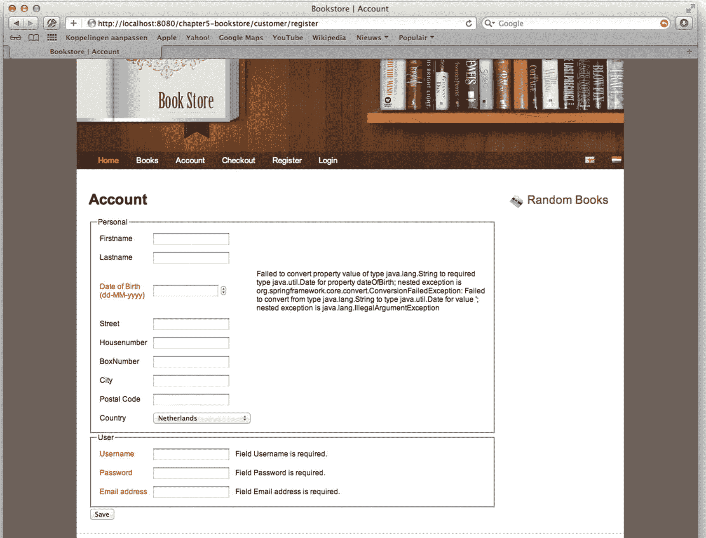

图 5-8

帐户注册页面显示一些错误

错误消息是由 Spring MVC 中的数据绑定工具创建的。在本章的后面，你会看到我们如何影响显示的信息。现在，让我们让它们保持完整。如果我们填写正确的信息并单击 Save，我们将被重定向到一个帐户页面(我们已经提供了基本的控制器和实现)。

### 验证模型属性

我们已经多次提到验证。我们也多次提到了`org.springframework.validation`包。通过 Spring 框架中的验证抽象，验证我们的模型属性很容易完成。验证不绑定到 web 它是关于验证对象的。因此，验证也可以在 web 层之外使用；其实在哪里都可以用。

验证的主要抽象是`org.springframework.validation.Validator`接口。这个接口有两个回调方法。`supports`方法确定验证器实例是否可以验证对象。`validate`方法验证对象(参见清单 5-43 )。

```java
package org.springframework.validation;

public interface Validator {

  boolean supports(Class<?> clazz);
  void validate(Object target, Errors errors);
}

Listing 5-43The Validator Interface

```

调用 supports 方法来查看验证器是否可以验证当前的对象类型。如果返回 true，框架用要验证的对象和一个`org.springframework.validation.Errors`接口实现的实例调用 validate 方法。绑定时，这是`org.springframework.validation.BindingResult`的一个实现。在进行验证时，最好包含一个`Errors`或`BindingResult`(后者扩展了错误)方法属性。这样，我们可以处理绑定或验证错误的情况。如果不是这样，`org.springframework.validation.BindException`就扔了。

当使用 Spring MVC 时，我们有两个触发验证的选项。第一种是将验证器注入到我们的控制器中，并在验证器上调用 validate 方法。第二个是向我们的方法属性添加`javax.validation.Valid` (JSR-303)或`org.springframework.validation.annotation.Validated`注释。来自 Spring 框架的注释比来自 javax.validation 包的注释更强大。Spring 注释使我们能够指定*提示*；当与 JSR-303 验证器(例如 hibernate-validation)结合使用时，我们可以指定验证组。

验证和绑定错误会导致向`Errors`实例注册消息代码。一般来说，简单地向用户显示错误代码并不能提供太多信息，所以代码必须被解析为消息。这就是`org.springframework.context.MessageSource`发挥作用的地方。错误代码作为消息代码传递给已配置的消息源，并检索消息。如果我们不配置消息源，我们会得到一个很好的堆栈跟踪，表明找不到错误代码的消息。因此，在我们继续之前，让我们配置清单 5-44 中所示的`MessageSource`。

```java
package com.apress.prospringmvc.bookstore.web.config;

import org.springframework.context.support.ResourceBundleMessageSource;

// Other imports omitted

@Configuration
public class WebMvcContextConfiguration extends WebMvcConfigurer {

  @Bean
  public MessageSource messageSource() {
    var messageSource = new ResourceBundleMessageSource();
    messageSource.setBasename("messages");
    messageSource.setUseCodeAsDefaultMessage(true);
    return messageSource;
  }

// Other methods omitted

}

Listing 5-44The MessageSource Configuration

Bean

```

我们配置一个消息源，然后将它配置为加载一个包含 basename 消息的资源包(在本章后面的“国际化”一节中，您将了解到更多相关内容)。当找不到消息时，我们将代码作为消息返回。这在开发过程中特别有用，因为我们可以很快看到资源包中缺少哪些消息代码。

让我们为我们的`com.apress.prospringmvc.bookstore.domain.Account`类实现验证。我们想要验证帐户是否有效，为此，我们需要用户名、密码和有效的电子邮件地址。为了处理运输，我们还需要一个地址、城市和国家。没有这些信息，帐户无效。现在让我们看看如何利用验证框架。

#### 实现我们的验证器

我们从实现我们自己的验证器开始。在这种情况下，我们创建一个`com.apress.prospringmvc.bookstore.validation.AccountValidator`(参见清单 5-45 )并使用 init-binder 方法来配置它。

```java
package com.apress.prospringmvc.bookstore.validation;

import java.util.regex.Pattern;
import org.springframework.validation.Errors;
import org.springframework.validation.ValidationUtils;
import org.springframework.validation.Validator;
import com.apress.prospringmvc.bookstore.domain.Account;

public class AccountValidator implements Validator {

private static final String EMAIL_PATTERN = "^[_A-Za-z0-9-]+(\\.[_A-Za-z0-9-]+)*@"
  +"[A-Za-z0-9]+(\\.[A-Za-z0-9]+)*(\\.[A-Za-z]\{2,})$";

  @Override
  public boolean supports(Class<?> clazz) {
    return Account.class.isAssignableFrom(clazz);
  }

  @Override
  public void validate(Object target, Errors errors) {
    ValidationUtils.rejectIfEmpty(errors, "username","required", new Object[] {"Username"});
    ValidationUtils.rejectIfEmpty(errors, "password","required", new Object[] {"Password"});
    ValidationUtils.rejectIfEmpty(errors, "emailAddress","required", new Object[] {"Emailaddress"});
    ValidationUtils.rejectIfEmpty(errors, "address.street","required", new Object[] {"Street"});
    ValidationUtils.rejectIfEmpty(errors, "address.city","required", new Object[] {"City"});
    ValidationUtils.rejectIfEmpty(errors, "address.country","required", new Object[] {"Country"});

    if (!errors.hasFieldErrors("emailAddress")) {
      var account = (Account) target;
      var email = account.getEmailAddress();
      if (!emai.matches(EMAIL_PATTERN)) {
        errors.rejectValue("emailAddress", "invalid");
      }
    }
  }
}

Listing 5-45The AccountValidator Implementation

```

在`org.springframework.web.bind.WebDataBinder`上指定`requiredFields`将导致与`ValidationUtils.rejectIfEmptyOrWhiteSpace`相同的验证逻辑。然而，在我们的例子中，我们将所有的验证逻辑放在一个地方，而不是分散在两个地方。

这个验证器实现检查字段是否不为空。如果该字段为空，它会为给定的字段记录一个错误。错误是由`org.springframework.validation.MessageCodesResolver`实现确定的消息代码的集合。默认实现`org.springframework.validation.DefaultMessageCodesResolver`解析为四种不同的代码(见表 5-21 )。表中的顺序也是错误代码解析为正确消息的方式。

验证的最后一部分是我们需要配置我们的验证器，并告诉控制器在提交时验证我们的模型属性。在清单 5-46 中，我们展示了修改后的顺序控制器。我们只想在表单的最终提交时触发验证。

```java
package com.apress.prospringmvc.bookstore.web.controller;

import com.apress.prospringmvc.bookstore.domain.AccountValidator;

import javax.validation.Valid;
// Other imports omitted

@Controller

@RequestMapping("/customer/register")
public class RegistrationController {

  @InitBinder
  public void initBinder(WebDataBinder binder) {
    binder.setDisallowedFields("id");
    binder.setValidator(new AccountValidator());
  }

  @RequestMapping(method = { RequestMethod._POST_, RequestMethod._PUT_ })
  public String handleRegistration(@Valid @ModelAttribute Account account, BindingResult result) {
    if (result.hasErrors()) {
      return "customer/register";
    }
    this.accountService.save(account);
    return "redirect:/customer/account/" + account.getId();
  }

// Other methods omitted

}

Listing 5-46The RegistrationController with Validation

```

如果我们在重新部署后提交非法值，我们会收到一些错误代码，如图 5-9 所示。

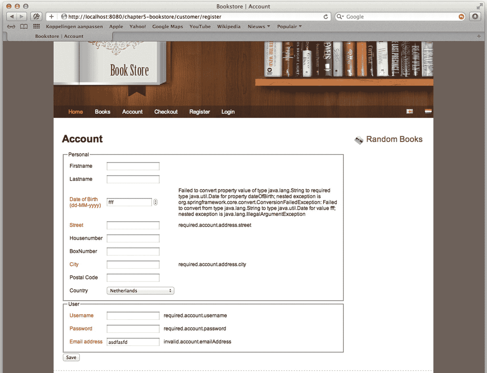

图 5-9

带有错误代码的注册页面

#### 使用 JSR-303 验证

除了实现我们自己的验证器，我们还可以使用 JSR-303 注释来添加验证。为此，我们只需要用 JSR-303 注释来注释我们的`com.apress.prospringmvc.bookstore.domain.Account`对象(参见清单 5-47 )，然后保留`javax.validation.Valid`注释。当使用这些注释时，使用的错误代码与我们的自定义验证器中使用的略有不同(见表 5-22 )。但是，注册页面不需要改变，所以它仍然和以前一样。我们的 init-binder 方法不需要设置验证器，因为支持 JSR-303 的验证器会被自动检测到(示例项目使用 Hibernate 中的验证器)。

```java
package com.apress.prospringmvc.bookstore.domain;

import java.io.Serializable;
import java.util.ArrayList;
import java.util.Date;
import java.util.List;
import javax.persistence.*;
import javax.validation.Valid;
import javax.validation.constraints.Email;
import javax.validation.constraints.NotEmpty;

@Entity
public class Account {

  @Id
  @GeneratedValue(strategy = GenerationType.AUTO)
  private Long id;

  private String firstName;
  private String lastName;
  private Date dateOfBirth;

  @Embedded
  @Valid
  private Address address = new Address();

  @NotEmpty
  @Email
  private String emailAddress;

  @NotEmpty
  private String username;

  @NotEmpty
  private String password;

// getters and setters omitted

}

Listing 5-47An Account with JSR-303 Annotations

```

当使用 JSR-303 注释时，如果我们提交带有无效值的表单，我们会得到如图 5-10 所示的结果。如您所见，显示的是消息而不是代码。这怎么可能？我们使用的验证器实现附带了一些默认消息。如果我们想要的话，我们可以通过在资源包中指定表 5-22 中的一个代码来覆盖这些代码(见下一节)。

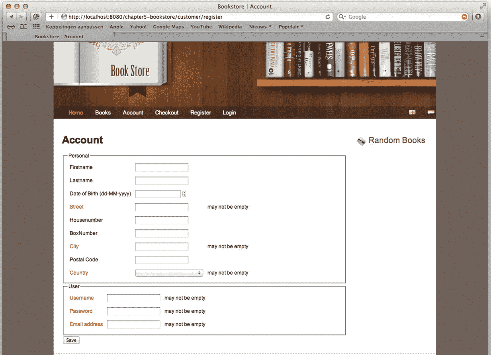

图 5-10

带有错误消息的注册页面

## 国际化

为了实现国际化，我们需要配置不同的组件来基于用户的语言(地区)解析消息。例如，有`org.springframework.context.MessageSource`，它让我们根据消息代码和地区来解析消息。为了解析语言环境，我们还需要`org.springframework.web.servlet.LocaleResolver`。最后，为了改变区域设置，我们还需要配置`org.springframework.web.servlet.i18n.LocaleChangeInterceptor`(下一章将更深入地讨论拦截器)。

### 信息源

消息源是根据代码和地区解析消息的组件。Spring 提供了几个`org.springframework.context.MessageSource`接口的实现。其中两个实现是我们可以使用的实现，而另一个实现只是委托给另一个消息源。

Spring 框架提供的两个实现在`org.springframework.context.support`包中。表 5-23 简要描述了两者。

我们以大致相同的方式配置这两个 beans。我们需要一个名为`messageSource`的 bean。我们选择哪个实现并不重要。例如，我们甚至可以创建自己的实现，使用数据库来加载消息。

清单 5-48 中的配置配置`org.springframework.context.support.ReloadableResourceBundleMessageSource,`，它从类路径中加载一个名为 *messages.properties* 的文件。它还试图加载我们当前用来解析消息的`locale`的`messages_[locale].properties`。

```java
package com.apress.prospringmvc.bookstore.web.config;

import org.springframework.context.support.ReloadableResourceBundleMessageSource;

// Other imports omitted

@Configuration
public class WebMvcContextConfiguration extends WebMvcConfigurer {

  @Bean
  public MessageSource messageSource() {
    var messageSource = new ReloadableResourceBundleMessageSource();
    messageSource.setBasename("classpath:/messages");
    messageSource.setUseCodeAsDefaultMessage(true);
    return messageSource;
  }

}

Listing 5-48The MessageSource Configuration in WebMvcContext

```

下面的代码片段显示了加载的两个属性文件(资源包)。 *messages.properties* (参见清单 5-49 )文件中的消息被视为默认值，它们可以在特定语言的 *messages_nl.properties* 文件中被覆盖(参见清单 5-50 )。

```java
home.title=Welkom
invalid.account.emailaddress=Ongeldig emailadres.
required=Veld {0} is verplicht.

Listing 5-50messages_nl.properties

```

```java
home.title=Welcome
invalid.account.emailaddress=Invalid email address.
required=Field {0} is required.

Listing 5-49The messages.properties Snippet

```

### LocaleResolver

为了让消息源正确地工作，我们还需要配置`org.springframework.web.servlet.LocaleResolver`(这可以在`org.springframework.web.servlet.i18n`包中找到)。Spring 附带了几个实现，可以让我们的生活更加轻松。语言环境解析器是一种检测哪个`Locale`的策略。不同的实现使用不同的方式来解析区域设置(见表 5-24 )。

### LocaleChangeInterceptor

如果我们希望我们的用户改变区域设置，我们需要配置`org.springframework.web.servlet.i18n.` `LocaleChangeInterceptor`(参见清单 5-51 )。这个拦截器检查当前传入的请求，并检查请求中是否有一个名为 locale 的参数。如果存在这种情况，拦截器将使用之前配置的语言环境解析器来更改当前用户的语言环境。可以配置参数名称。

```java
package com.apress.prospringmvc.bookstore.web.config;

import org.springframework.context.MessageSource;
import org.springframework.context.support.ReloadableResourceBundleMessageSource;
import org.springframework.web.servlet.HandlerInterceptor;
import org.springframework.web.servlet.LocaleResolver;
import org.springframework.web.servlet.config.annotation.InterceptorRegistry;
import org.springframework.web.servlet.config.annotation.ResourceHandlerRegistry;
import org.springframework.web.servlet.i18n.CookieLocaleResolver;
import org.springframework.web.servlet.i18n.LocaleChangeInterceptor;

// Other imports omitted

@Configuration
public class WebMvcContextConfiguration implements WebMvcConfigurer {

  @Override
  public void addInterceptors(InterceptorRegistry registry) {
    registry.addInterceptor(localeChangeInterceptor());
  }

  @Bean
  public HandlerInterceptor localeChangeInterceptor() {

    var localeChangeInterceptor = new LocaleChangeInterceptor();
    localeChangeInterceptor.setParamName("lang");
    return localeChangeInterceptor;
  }

  @Bean

  public LocaleResolver localeResolver() {
    return new CookieLocaleResolver();
  }
}

Listing 5-51The Full Internationalization Configuration

```

一般来说，让`LocaleChangeInterceptor`作为首批拦截者之一是个好主意。如果出现问题，我们希望用正确的语言通知用户。

如果我们重新部署我们的应用，当我们切换语言时，我们应该得到本地化的错误消息(当然，这只有在我们向资源包添加适当的错误代码时才有效)。然而，对错误消息使用`MessageSource`并不是它唯一的用途；我们还可以使用`MessageSource`从资源包中检索标签、标题、错误消息等等。我们可以用百里香的信息表达来说明这一点。清单 5-52 显示了一个修改过的图书搜索页面，它使用消息表达式来填充标签、标题和标题。如果我们切换语言，我们应该得到本地化的信息(见图 5-11 和 5-12 )。

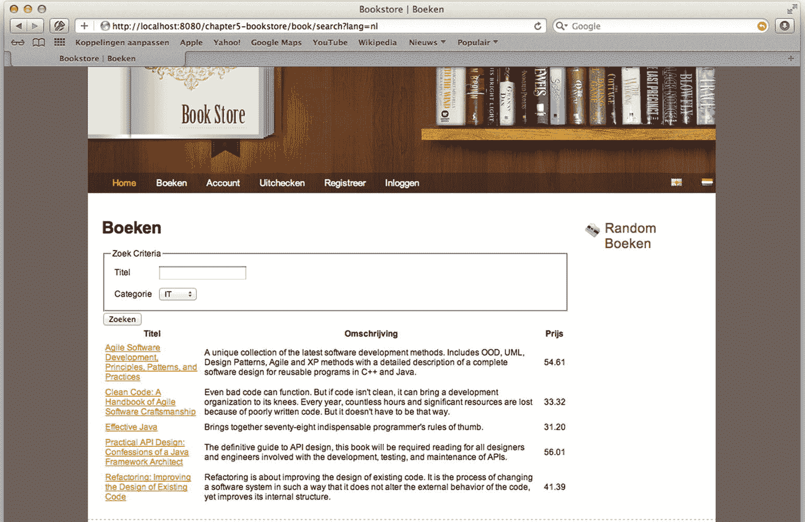

图 5-12

荷兰语图书搜索页面

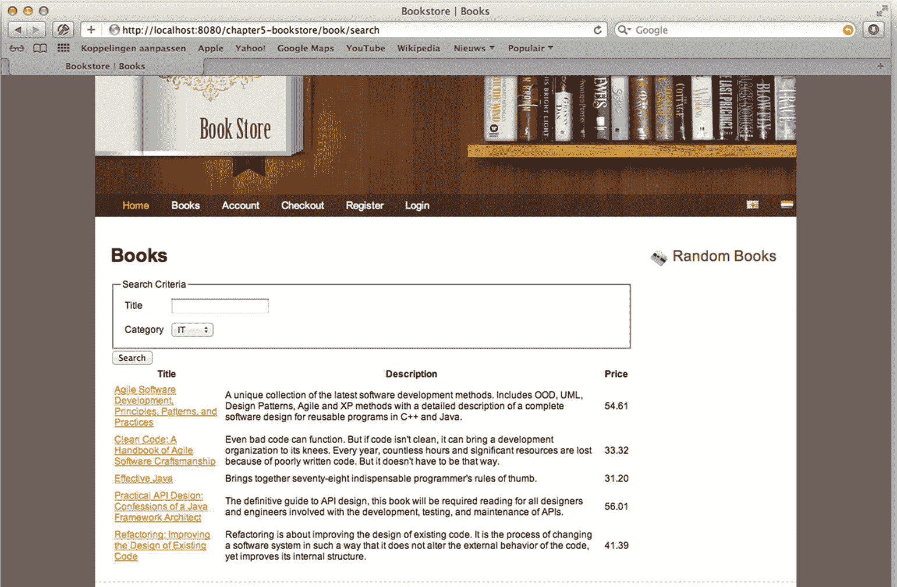

图 5-11

英文图书搜索页面

```java
<form action="#" th:action="@{/book/search}"
    th:object="${bookSearchCriteria}"
    method="GET" id="bookSearchForm">
    <fieldset>
        <legend th:text="#{book.searchcriteria}">SEARCH CRITERIA</legend>
        <table>
            <tr>
                <td><label for="title" th:text="#{book.title}">TITLE</label></td>
                <td><input type="text" th:field="*{title}"/></td>
            </tr>
            <tr>
                <td><label for="category" th:text="#{book.category}">CATEGORY</label></td>
                <td>
                    <select th:field="*{category}">
                        <option th:each="c : ${categories}" th:value="${c.id}"
                                th:text="${c.name}" th:selected="${c.id==1}">
                        </option>
                    </select>
                </td>
            </tr>
        </table>
    </fieldset>
    <button id="search" th:text="#{button.search}">SEARCH</button>
</form>

 <table id="bookSearchResults">
    <thead>
    <tr>
        <th th:text="#{book.title}">TITLE</th>
        <th th:text="#{book.description}">DESCRIPTION</th>
        <th th:text="#{book.price}">PRICE</th>
        <th></th>
    </tr>
    </thead>
    <tbody>
    <th:block th:each="book : ${bookList}">
        <tr>
            <td><a th:href="@{/book/detail/} + ${book.id}"
                th:text="${book.title}">TITLE</a></td>
            <td th:text="${book.description}">DESC</td>
            <td th:text="${book.price}">PRICE</td>
            <td><a th:href="@{/cart/add/} + ${book.id}"
                th:text="#{book.addtocart}">CART</a></td>
        </tr>
    </th:block>
    </tbody>
</table>

Listing 5-52The Book Search Page with the Message Tag

```

## 摘要

这一章涵盖了我们需要编写控制器和处理表单的所有内容。我们首先探索了`@RequestMapping`注释，以及它如何将请求映射到处理请求的方法。我们还探索了灵活的方法签名，并介绍了哪些方法参数类型和返回值是开箱即用的。

接下来，我们深入其中，开始编写控制器并修改现有代码。我们还介绍了表单对象，并讲述了如何将属性绑定到字段。我们解释了数据绑定，探索了 Spring 的类型转换系统，以及它如何与某些对象相互转换。我们还编写了自己的转换器实现，将文本转换成类别对象。

除了类型转换，我们还探索了验证。有两种验证方式:我们可以创建自己的`Validator`接口实现，或者在我们想要验证的对象上使用 JSR-303 注释。启用验证是通过`@Valid`或`@Validated`注释完成的。

为了更容易地将某些字段绑定到表单对象的属性，Spring Form 标签库帮助我们编写 HTML 表单。这个库还帮助我们向用户显示绑定和验证错误。

最后，我们讨论了如何在我们的 web 页面上实现国际化，以及如何将验证和错误代码转换成适当的消息以显示给最终用户。

在下一章，我们将探索 Spring MVC 的一些更高级的特性。在这个过程中，您将看到如何进一步扩展和定制现有的基础设施。

<aside aria-label="Footnotes" class="FootnoteSection" epub:type="footnotes">Footnotes 1

[`https://docs.spring.io/spring-boot/docs/current/reference/htmlsingle/#boot-features-jsp-limitations`](https://docs.spring.io/spring-boot/docs/current/reference/htmlsingle/%2523boot-features-jsp-limitations)

  2

[`http://www.w3.org/Protocols/rfc2616/rfc2616-sec9.html`](http://www.w3.org/Protocols/rfc2616/rfc2616-sec9.html)

  3

[`http://www.w3.org/Protocols/rfc2616/rfc2616-sec14.html`](http://www.w3.org/Protocols/rfc2616/rfc2616-sec14.html)

  4

[`http://www.w3.org/Protocols/rfc2616/rfc2616-sec14.html`](http://www.w3.org/Protocols/rfc2616/rfc2616-sec14.html)

  5

[`http://en.wikipedia.org/wiki/List_of_HTTP_header_fields`](http://en.wikipedia.org/wiki/List_of_HTTP_header_fields)

  6

[`http://docs.oracle.com/javase/6/docs/technotes/tools/windows/javac.html`](http://docs.oracle.com/javase/6/docs/technotes/tools/windows/javac.html)

  7

[`www.theserverside.com/news/1365146/Redirect-After-Post`](http://www.theserverside.com/news/1365146/Redirect-After-Post)

 </aside>