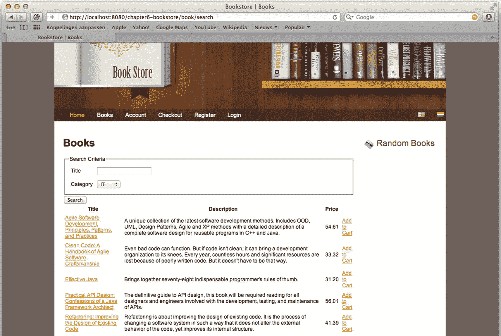
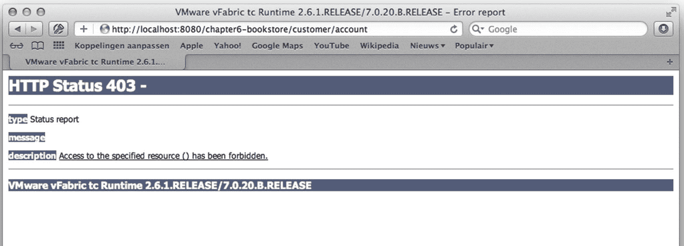
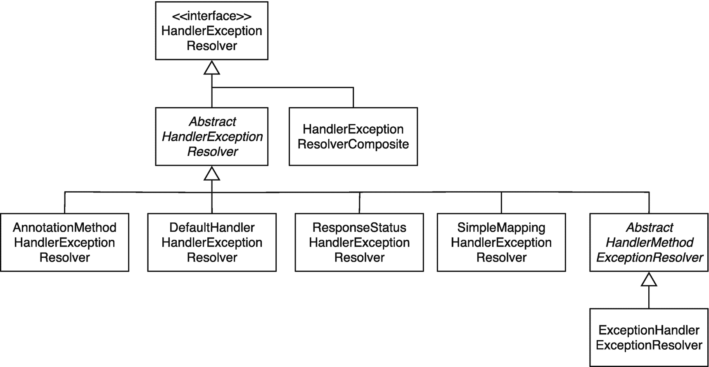
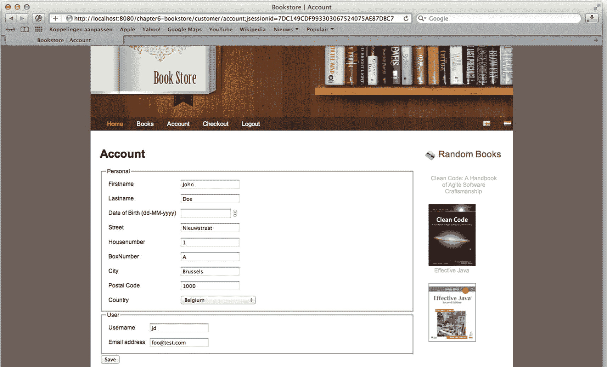

# 六、实现控制器：高级

本章着眼于 Spring MVC 的一些更高级的部分，然后展示如何利用这个框架来扩展它以满足我们的需求。

我们从检查作用域 beans 以及如何利用它们为我们服务开始。接下来，我们探索如何将通用功能(横切关注点)添加到我们的应用中。为此，我们来看看拦截器，包括如何创建它们以及如何将它们连接到我们的应用中。

无论我们的应用是多么健壮或经过深思熟虑的，总有一天我们的应用会表现得不像预期的那样(例如，可能有人通过网络连接到我们的数据库服务器)，这会导致我们的应用出现异常。一般来说，我们希望防止用户看到模糊的堆栈跟踪；为此，我们探索 Spring MVC 中的异常处理机制。

在我们涵盖了所有这些主题之后，我们深入 Spring @MVC 的内部，探索几个我们可以扩展的 APIs 然后，我们使用这些扩展的 API 来增强框架的功能。

## 使用作用域 Beans

在第二章中，我们提到了 Spring 框架支持的 beans 的不同范围。表 6-1 再次列出。这一节使用范围对我们有利。具体来说，我们将通过一个实际的例子来利用一个限定了作用域的 bean 来创建一个在线购物车。

表 6-1

范围概述

<colgroup><col class="tcol1 align-left"> <col class="tcol2 align-left"></colgroup> 
| 

前缀

 | 

描述

 |
| --- | --- |
| `singleton` | 默认范围。创建一个 bean 实例，并在整个应用中共享。bean 的生命周期与构造它的应用上下文相关联。 |
| `prototype` | 每次需要某个 bean 时，都会返回该 bean 的一个新实例。 |
| `thread` | bean 在需要时创建，并绑定到当前执行的线程。如果线程死了，bean 就被破坏了。 |
| `request` | bean 在需要时创建，并绑定到传入的`javax.servlet.ServletRequest`的生命周期。如果请求结束，bean 实例被销毁。 |
| `session` | bean 在需要时创建并存储在`javax.servlet.http.HttpSession`中。当会话被销毁时，bean 实例也被销毁。 |
| `application` | 这个作用域非常类似于单例作用域。主要的区别在于，具有该范围的 beans 也在`javax.servlet.ServletContext`中注册。 |

我们已经使用了 singleton 范围——因为这是 Spring 框架中 bean 创建的默认范围。`org.springframework.context.annotation.Scope`注释指定了 bean 的范围；其性能列于表 6-2 中。

表 6-2

范围批注属性

<colgroup><col class="tcol1 align-left"> <col class="tcol2 align-left"></colgroup> 
| 

财产

 | 

描述

 |
| --- | --- |
| `value` + `scopeName` | 要使用的范围的名称(见表 6-1 )。默认为 singleton。 |
| `proxyMode` | 指示是否应创建作用域代理以及由哪种代理机制创建。除非通过组件扫描标记或注释设置了另一个默认代理模式，否则此属性默认为“否”。 |

该注释可以用作类型级或方法级注释。当您使用`Scope`作为类型级注释时，该类型的所有 beans 都具有注释指定的范围。当您将它用作方法级注释时，由这个带注释的方法创建的 beans 具有由注释指定的范围。您必须将它放在用`org.springframework.context.annotation.Bean`注释标注的方法上。

### 向购物车中添加东西

这部分迈出了让网站访问者从我们的书店购买书籍的第一步。具体来说，我们实现了允许我们将书籍添加到购物车中的逻辑。为此，我们首先需要定义一个会话范围的购物车 bean。

清单 6-1 展示了如何用会话范围定义一个 bean(我们的购物车)。这个 bean 可以被注入到其他 bean 中，就像框架中的任何其他 bean 一样。Spring 处理管理 bean 生命周期的复杂性。bean 的生命周期取决于 bean 的范围(参见表 6-1 )。例如，单例范围的 bean(默认)与应用上下文的生命周期相关联，而会话范围的 bean 与`javax.servlet.http.HttpSession`对象的生命周期相关联。

```java
package com.apress.prospringmvc.bookstore.web.config;

//Other imports omitted

import org.springframework.context.annotation.Scope;
import org.springframework.context.annotation.ScopedProxyMode;
import com.apress.prospringmvc.bookstore.domain.Cart;

@Configuration
public class WebMvcContextConfiguration implements WebMvcConfigurer {

//Other methods omitted

  @Bean
  @Scope(value = "session", proxyMode = ScopedProxyMode.TARGET_CLASS)
  public Cart cart() {
    return new Cart();
  }

}

Listing 6-1Cart Session Scoped Bean

```

在这种情况下，我们有一个带有注释的 bean 声明，并且我们使用会话范围。我们希望使用基于类的代理(`com.apress.prospringmvc.bookstore.domain.Cart`没有实现接口，所以我们需要基于类的代理)。我们现在可以简单地将这个 bean 注入到其他 bean 中，并像使用任何其他 bean 一样使用它。让我们创建一个使用这个 bean 的控制器:`com.apress.prospringmvc.bookstore.web.controller.CartController`(参见清单 6-2 )。

```java
package com.apress.prospringmvc.bookstore.web.controller;

import com.apress.prospringmvc.bookstore.domain.Book;
import com.apress.prospringmvc.bookstore.domain.Cart;
import com.apress.prospringmvc.bookstore.service.BookstoreService;
import org.springframework.stereotype.Controller;
import org.springframework.web.bind.annotation.PathVariable;
import org.springframework.web.bind.annotation.PostMapping;
import org.springframework.web.bind.annotation.RequestHeader;

@Controller
public class CartController {

    private final Cart cart;
    private final BookstoreService bookstoreService;

    public CartController(Cart cart, BookstoreService bookstoreService) {
        this.cart = cart;
        this.bookstoreService = bookstoreService;
    }

    @PostMapping("/cart/add/{bookId}")
    public String addToCart(@PathVariable("bookId") long bookId,
                            @RequestHeader("referer") String referer) {
        Book book = this.bookstoreService.findBook(bookId);
        this.cart.addBook(book);
        return "redirect:" + referer;
    }
}

Listing 6-2The CartController Bean

```

在这种情况下，我们简单地自动连接会话范围的 bean cart，就像我们对任何其他 bean 所做的那样。`addToCart`方法包含将一本书添加到购物车的逻辑。添加完图书后，我们会重定向到我们来的页面(referer 请求标题)。

这个控制器被映射到 URL，`/cart/add/{bookId}`；然而，目前没有任何东西调用我们的控制器，因为我们没有任何东西指向那个 URL。让我们修改我们的图书搜索页面，并添加一个链接，将一本书添加到我们的购物车中(参见清单 6-3 )。粗体突出显示的部分显示了更改。

```java
<%@ taglib prefix="c" uri="http://java.sun.com/jsp/jstl/core"%>
<%@ taglib prefix="spring" uri="http://www.springframework.org/tags" %>
<%@ taglib prefix="form" uri="http://www.springframework.org/tags/form" %>

// Search Form Omitted

<c:if test="${not empty bookList}">
<table>
<tr>
    <th><spring:message code="book.title"/></th>
    <th><spring:message code="book.description"/></th>
    <th><spring:message code="book.price" /></th>
    <th></th>
</tr>

<c:forEach items="${bookList}" var="book">
    <tr>
        <td>
            <a href="<c:url value="/book/detail/${book.id}"/>">${book.title}</a>
        </td>
        <td>${book.description}</td>
        <td>${book.price}</td>
        <td>
            <a href="<c:url value="/cart/add/${book.id}"/>">
                <spring:message code="book.addtocart" />
            </a>
        </td>
    </tr>
</c:forEach>
</table>
</c:if>

Listing 6-3The Book Search Page with an Add to Cart Link

```

重启我们的应用后，我们应该在图书页面上有一个添加到购物车的链接(见图 6-1 )。如果我们点击那个链接，我们应该停留在图书页面。然而，我们确实往购物车里添加了一些东西。



图 6-1

带有添加到购物车链接的图书搜索

### 实现结帐

为了最终完成订购流程，我们允许客户检查他们的购物车。这在数据库中创建了一个实际的`com.apress.prospringmvc.bookstore.domain.Order`对象和条目。结帐是我们在前一章和前一节中讨论的许多事情的组合。控制器是`com.apress.prospringmvc.bookstore.web.controller.CheckoutController`(见清单 6-4 )，它包含很多逻辑。`checkout.jsp`文件是包含我们屏幕的 JSP 可以在`/WEB-INF/views/cart`中找到。

```java
package com.apress.prospringmvc.bookstore.web.controller;

//Other imports omitted

import com.apress.prospringmvc.bookstore.validation.OrderValidator;

@Controller
@SessionAttributes(types = { Order.class })
@RequestMapping("/cart/checkout")
public class CheckoutController {

    private final Cart cart;
    private final BookstoreService bookstoreService;

    public CheckoutController(Cart cart, BookstoreService bookstoreService) {
        this.cart = cart;
        this.bookstoreService = bookstoreService;
    }

    @ModelAttribute("countries")
    public Map<String, String> countries(Locale currentLocale) {
        var countries = new TreeMap<String, String>();
        for (Locale locale : Locale.getAvailableLocales()) {
            countries.put(locale.getCountry(),locale.getDisplayCountry(currentLocale));
        }
        return countries;
    }

    @GetMapping
    public void show(HttpSession session, Model model) {
        var account = (Account) session.getAttribute(LoginController.ACCOUNT_ATTRIBUTE);
        var order = this.bookstoreService.createOrder(this.cart, account);
        model.addAttribute(order);
    }

    @PostMapping(params = "order")
    public String checkout(SessionStatus status,
                        @Validated @ModelAttribute Order order, BindingResult errors) {

        if (errors.hasErrors()) {
            return "cart/checkout";
        } else {
            this.bookstoreService.store(order);
            status.setComplete(); //remove order from session
            this.cart.clear(); // clear the cart
            return "redirect:/index.htm";
        }
    }

    @PostMapping(params = "update")
    public String update(@ModelAttribute Order order) {
        order.updateOrderDetails();
        return "cart/checkout";
    }

    @InitBinder
    public void initBinder(WebDataBinder binder) {
        binder.setValidator(new OrderValidator());
    }
}

Listing 6-4The CheckoutController

```

当我们单击 checkout 时，在控制器上调用的第一个方法是 show 方法。它获取我们的购物车，并使用存储在会话中的`account`来创建订单，并将其添加到模型中。订单存储在请求之间的会话中；这要归功于`SessionAttributes`的使用。当这些完成后，结账页面被渲染(见图 6-2 )。


图 6-2

结账页面

填写表单时，客户可以做两件事:他可以按订购按钮或更新按钮。当按下 update 按钮时，将调用 Update 方法。这将提交表单，然后更新订单(并重新计算总价)。按下订单按钮时，订单被提交，然后由`com.apress.prospringmvc.bookstore.validation.OrderValidator`确认。出现错误时，页面会重新显示，并向客户显示错误消息。有趣的部分发生在没有错误的时候。首先，订单存储在数据库中。当我们完成订单时，我们需要从会话中删除它，这是通过调用`org.springframework.web.bind.support.SessionStatus`对象上的`setComplete`方法来完成的(参见第五章的“支持的方法参数类型”一节)。最后，在再次重定向到索引页面之前，我们需要清空购物车。我们这样做是为了让顾客可以在购物车中添加新书。因为我们不能简单地替换会话范围的对象，所以我们需要调用一个方法来清除它。如果我们要用一个新的实例替换 cart，我们将销毁作用域代理对象。

## 贯穿各领域的问题

在开发企业应用时，我们经常面临横切关注点的挑战。这些是影响许多对象和动作的关注点。横切关注点的例子包括事务管理和安全性，以及为每个传入的 web 请求公开通用数据之类的操作。

一般来说，使用传统的面向对象方法很难在我们的代码库中实现这些问题。如果我们用传统的方式实现它们，将会导致代码重复和难以维护的代码。对于我们的一般对象，我们可以使用面向方面编程(AOP)来解决这些横切关注点；然而，在将它应用于请求时，我们需要一种稍微不同的方法。

Spring MVC 给了我们两种实现横切关注点的方法。第一种方法使用*拦截器*来实现通用逻辑，而第二种方法依赖于异常处理。这一节将介绍在我们的 web 应用中应用横切关注点的两种技术。

### 截击机

拦截器对于请求处理程序就像过滤器对于 servlets 一样。根据 servlet 规范， <sup>1</sup> 过滤器是一段可重用的代码，可以转换 HTTP 请求、响应和头信息的内容。过滤器修改或调整对资源的请求，并修改或调整来自资源的响应。过滤的例子包括认证、审计和加密。

过滤器和拦截器都实现了通用的功能(横切关注点),以应用于所有(或部分)传入的 HTTP 请求。过滤器比拦截器更强大，因为它们可以替换(或包装)传入的请求/响应，而拦截器不能做到这一点。另一方面，拦截器比过滤器有更多的生命周期方法(见表 6-3 )。

表 6-3

拦截器回调

<colgroup><col class="tcol1 align-left"> <col class="tcol2 align-left"></colgroup> 
| 

方法

 | 

描述

 |
| --- | --- |
| `preHandle` | 在调用处理程序之前调用。 |
| `postHandle` | 当处理程序方法被成功调用时，在呈现视图之前调用。它可以在模型中放置共享对象。 |
| `afterCompletion` | 在视图呈现之后，请求处理完成时调用。这个方法总是在成功调用 preHandle 方法的拦截器上调用，即使在请求处理过程中出现错误。它可以清理资源。 |

Spring MVC 有两种拦截器策略。

*   `org.springframework.web.servlet.HandlerInterceptor`(见清单 6-5 )

*   `org.springframework.web.context.request.WebRequestInterceptor`(见清单 6-6 )

```java
package org.springframework.web.context.request;

import org.springframework.ui.ModelMap;

public interface WebRequestInterceptor {

    void preHandle(WebRequest request) throws Exception;

    void postHandle(WebRequest request, ModelMap model) throws Exception;

    void afterCompletion(WebRequest request, Exception ex) throws Exception;

}

Listing 6-6The WebRequestInterceptor Interface (in module spring-web)

```

```java
package org.springframework.web.servlet;

import javax.servlet.http.HttpServletRequest;
import javax.servlet.http.HttpServletResponse;

public interface HandlerInterceptor {

    boolean preHandle(HttpServletRequest request,
                      HttpServletResponse response, Object handler) throws Exception;

    void postHandle(HttpServletRequest request, HttpServletResponse response,
                    Object handler, ModelAndView modelAndView) throws Exception;

    void afterCompletion(HttpServletRequest request, HttpServletResponse response,
 Object handler, Exception ex) throws Exception;

}

Listing 6-5The HandlerInterceptor Interface (in module spring-webmvc)

```

正如 Spring 框架中经常出现的情况，这两种策略都被表示为提供实现的接口。这两种策略的主要区别在于`WebRequestInterceptor`独立于底层技术。它可以在 JSF 或 Servlet 环境中使用，而无需更改实现。一个`handler interceptor`只能在 Servlet 环境中使用。`HandlerInterceptor`的一个优点是我们可以用它来防止处理程序被调用。我们通过从`preHandle`方法返回`false`来做到这一点。

#### 配置拦截器

要使用拦截器，您需要在配置中配置它。配置拦截器包括两个步骤。

1.  配置拦截器。

2.  将它连接到处理程序。

将拦截器连接到我们的处理程序有两种方式。可以同时使用这两种方法，但我们不推荐这样做。首先，我们可以使用`BeanPostProcessor`显式地将拦截器添加到我们的处理程序映射中。第二，我们可以使用`org.springframework.web.servlet.config.annotation.InterceptorRegistry`来添加拦截器。

一般来说，最好使用`InterceptorRegistry`来添加拦截器，因为这是一种非常方便的添加方式。限制拦截器匹配的 URL 也非常容易(在关于`InterceptorRegistry`的部分中解释)。)

##### 使用 BeanPostProcessor 显式配置带有拦截器的处理程序映射

为了用处理程序映射注册拦截器，我们首先需要包含处理程序映射。为此，我们需要显式地添加它们或者扩展 Spring 基类来获得对它们的引用(参见清单 6-7 )。接下来，我们简单地将所有拦截器添加到实例中。使用多个处理程序映射可能会很麻烦，尤其是如果我们只想将拦截器应用于某些 URL。

```java
package com.apress.prospringmvc.bookstore.web.config;

import org.springframework.beans.BeansException;
import org.springframework.beans.factory.config.BeanPostProcessor;
import org.springframework.web.servlet.HandlerInterceptor;
import org.springframework.web.servlet.mvc.method.annotation.RequestMappingHandlerMapping;

import java.util.List;

public class InterceptorAddingPostProcessor implements BeanPostProcessor {

    private final List<HandlerInterceptor> interceptors;

    public InterceptorAddingPostProcessor(List<HandlerInterceptor> interceptors) {
        this.interceptors = interceptors;
    }

    @Override
    public Object postProcessBeforeInitialization(Object bean, String beanName) throws BeansException {
        if (bean instanceof RequestMappingHandlerMapping) {
            RequestMappingHandlerMapping handlerMapping = (RequestMappingHandlerMapping) bean;
            handlerMapping.setInterceptors(this.interceptors);
        }
        return bean;
    }
}

Listing 6-7A Sample of Explicit HandlerMapping BeanPostProcessor for Interceptors

```

##### 使用拦截注册表

一种更强大、更灵活的注册拦截器的方法是使用`org.springframework.web.servlet.config.annotation.InterceptorRegistry`。添加到这个注册表中的拦截器被添加到所有已配置的处理程序映射中。此外，使用这种方法很容易映射到某些 URL。为了访问注册表，我们需要在配置 web 资源的配置类上实现`org.springframework.web.servlet.config.annotation.WebMvcConfigurer`接口。这个接口有几个回调方法，在 Spring MVC 的配置过程中被调用。

`InterceptorRegistry`有两个方法(每种拦截器类型一个)可以用来添加拦截器(参见清单 6-8 )。这两个方法都返回了一个`org.springframework.web.servlet.config.annotation.InterceptorRegistration`的实例，我们可以用它来微调拦截器的映射。我们可以使用蚂蚁风格的路径模式 <sup>2</sup> 来为注册的拦截器配置细粒度的映射。如果我们不提供模式，拦截器将应用于所有传入的请求。

```java
package org.springframework.web.servlet.config.annotation;

import java.util.ArrayList;
import java.util.List;
import org.springframework.web.context.request.WebRequestInterceptor;
import org.springframework.web.servlet.HandlerInterceptor;
import org.springframework.web.servlet.handler.WebRequestHandlerInterceptorAdapter;

public class InterceptorRegistry {

    public InterceptorRegistration addInterceptor(HandlerInterceptor interceptor) { .. }

    public InterceptorRegistration addWebRequestInterceptor(WebRequestInterceptor interceptor) { ..
}

}

Listing 6-8The InterceptorRegistry Interface

```

清单 6-9 显示了我们当前的配置。此时，我们已经配置了一个拦截器来更改区域设置，这个拦截器应用于所有传入的请求(我们没有指定匹配的 URL 模式)。接下来，我们配置拦截器并使用`addInterceptor`方法将其添加到注册表中。该框架负责用已配置的处理程序映射注册拦截器的附加细节。

```java
package com.apress.prospringmvc.bookstore.web.config;

//Other imports omitted

import org.springframework.web.servlet.HandlerInterceptor;
import org.springframework.web.servlet.config.annotation.InterceptorRegistry;

@Configuration
public class WebMvcContextConfiguration implements WebMvcConfigurer {

  @Override
  public void addInterceptors(InterceptorRegistry registry) {
    registry.addInterceptor(localeChangeInterceptor());
  }

  @Bean
  public HandlerInterceptor localeChangeInterceptor() {
    var localeChangeInterceptor = new LocaleChangeInterceptor();
    localeChangeInterceptor.setParamName("lang");
    return localeChangeInterceptor;
  }

//... Other methods omitted
}

Listing 6-9Using the InterceptorRegistry to Add Interceptors

```

清单 6-10 显示了一段代码，其中我们将所有 URL 的映射改为只有以`/customers`开头的 URL。

```java
package com.apress.prospringmvc.bookstore.web.config;

//Imports omitted

@Configuration
public class WebMvcContextConfiguration implements WebMvcConfigurer {

  @Override
  public void addInterceptors(InterceptorRegistry registry) {
      var registration = registry.addInterceptor(localeChangeInterceptor());
      registation.addPathPatterns("/customers/**");
  }

//Other methods omitted

}

Listing 6-10Limiting an Interceptor to Certain URLs

```

#### 实现拦截器

到目前为止，我们已经介绍了不同类型的拦截器以及如何注册它们以供使用。现在让我们为我们的存储实现拦截器。我们实现了两种不同的拦截器。第一个将一些常用的数据添加到我们的模型中，以显示给用户。第二个解决了一个安全需求:我们希望只有注册用户才能访问帐户和结帐页面。

##### 实现 WebRequestInterceptor

在本节中，我们实现`org.springframework.web.context.request.` `WebRequestInterceptor`。如果你在图 6-3 中查看我们的网页，你会看到一个随机图书区。到目前为止，我们网页上的这一部分仍然是空的。现在我们创建一个拦截器，向模型中添加一些随机书籍。为此，我们实现了后处理方法(参见清单 6-11 )。


图 6-3

没有列出随机书籍的欢迎页面

在一个真实的网上商店中，你可能会称这个部分为“新书”或“推荐书籍”

```java
package com.apress.prospringmvc.bookstore.web.interceptor;

import com.apress.prospringmvc.bookstore.service.BookstoreService;
import org.springframework.ui.ModelMap;
import org.springframework.web.context.request.WebRequest;
import org.springframework.web.context.request.WebRequestInterceptor;

public class CommonDataInterceptor implements WebRequestInterceptor {

    private final BookstoreService bookstoreService;

    public CommonDataInterceptor(BookstoreService bookstoreService) {
        this.bookstoreService = bookstoreService;
    }

    @Override
    public void preHandle(WebRequest request) throws Exception {
    }

    @Override
    public void postHandle(WebRequest request, ModelMap model) throws Exception {
        if (model != null) {
            model.addAttribute("randomBooks", this.bookstoreService.findRandomBooks());
        }
    }

    @Override
    public void afterCompletion(WebRequest request, Exception ex) throws Exception {
    }
}

Listing 6-11The CommonDataInterceptor

```

`postHandle`方法向模型中添加一些随机的书籍，但是只有当这个模型可用时。这就是为什么我们的代码包含了一个`null`检查。当我们使用 AJAX 或自己编写响应时，模型可以是`null`。

为了将拦截器应用于传入的请求，我们需要注册它。拦截器需要为每个传入的请求调用，所以它不需要太多额外的配置(参见清单 6-12 中突出显示的行)。

```java
package com.apress.prospringmvc.bookstore.web.config;

import org.springframework.web.context.request.WebRequestInterceptor;
import org.springframework.web.servlet.config.annotation.InterceptorRegistry;

com.apress.prospringmvc.bookstore.web.interceptor.CommonDataInterceptor;

// Other imports omitted

@Configuration
public class WebMvcContextConfiguration implements WebMvcConfigurer {

  private final BookstoreService bookstoreService;

  public WebMvcContextConfiguration(BookstoreService bookstoreService) {
    this.bookstoreService = bookstoreService;
  }

  @Override
  public void addInterceptors(InterceptorRegistry registry) {
    registry.addInterceptor(localeChangeInterceptor());
    registry.addWebRequestInterceptor(commonDataInterceptor());
  }

  @Bean
  public WebRequestInterceptor commonDataInterceptor() {
    return new CommonDataInterceptor(this.bookstoreService);
  }

// Other methods omitted
}

Listing 6-12The CommondDataInterceptor Configuration

```

现在，当我们重新部署我们的应用并访问一个页面时，我们应该看到随机书籍显示在页面的随机书籍部分(见图 6-4 )。(我们模板中用于选择随机书籍的逻辑如清单 6-13 所示。)


图 6-4

欢迎页面，标题在随机书籍部分

```java
<div class="right_box">
    <div class="title">
        <span class="title_icon">
            " alt="" title="" />
        </span>
        <spring:message code="main.title.randombooks"/>
    </div>

    <c:forEach items="${randomBooks}" var="book">
        <div class="new_prod_box">
            <c:url value="/book/detail/${book.id}" var="bookUrl" />
            <a href="${bookUrl}">${book.title}</a>
            <div class="new_prod_img">
                <c:url value="/resourcimg/${book.isbn}/book_front_cover.png" var="bookImage"/>
                    <a href="${bookUrl}">
                        
                    </a>
            </div>
        </div>
    </c:forEach>
</div>

Listing 6-13The Random Books Section from the Template

```

##### 实现处理程序拦截器

目前，我们的帐户页面不安全。例如，某人可以简单地更改 URL 中的 ID 来查看另一个帐户的内容。让我们使用拦截器方法将安全性应用到我们的页面。我们将创建一个拦截器来检查我们是否已经登录(我们的帐户在 HTTP 会话中是可用的)。如果没有，它抛出`com.apress.prospringmvc.bookstore.service.AuthenticationException`(参见清单 6-14 )。我们还将原始 URL 存储在会话属性中；这样，我们可以在用户登录后将他重定向到他想要访问的 URL。

在为应用实现或添加安全性时，通常最好使用像 Spring Security <sup>3</sup> (参见第十二章)或阿帕奇·希罗 <sup>4</sup> 这样的框架，而不是推出自己的安全解决方案！

```java
package com.apress.prospringmvc.bookstore.web.interceptor;

// javax.servlet imports omitted

import org.springframework.web.servlet.HandlerInterceptor;
import org.springframework.web.servlet.handler.HandlerInterceptorAdapter;
import org.springframework.web.util.WebUtils;
import com.apress.prospringmvc.bookstore.domain.Account;
import com.apress.prospringmvc.bookstore.service.AuthenticationException;
import com.apress.prospringmvc.bookstore.web.controller.LoginController;

public class SecurityHandlerInterceptor implements HandlerInterceptor {

  @Override
  public boolean preHandle(HttpServletRequest request, HttpServletResponse response,
 Object handler) throws Exception {
    var account= (Account) WebUtils.getSessionAttribute(request, LoginController.ACCOUNT_ATTRIBUTE);
    if (account == null) {
      //Retrieve and store the original URL.
      var url = request.getRequestURL().toString();
      WebUtils.setSessionAttribute(request, LoginController.REQUESTED_URL, url);
      throw new AuthenticationException("Authentication required.", "authentication.required");
    }

    return true;
  }
}

Listing 6-14SecurityHandlerInterceptor

```

对于这个拦截器，我们的配置稍微复杂一些，因为我们想要将它映射到某些 URL(参见清单 6-15 中突出显示的部分)。

```java
package com.apress.prospringmvc.bookstore.web.config;

import com.apress.prospringmvc.bookstore.web.interceptor.SecurityHandlerInterceptor;

//Other imports omitted

@Configuration
public class WebMvcContextConfiguration extends WebMvcConfigurerAdapter {

  @Override
  public void addInterceptors(InterceptorRegistry registry) {
    registry.addInterceptor(localeChangeInterceptor());
    registry.addWebRequestInterceptor(commonDataInterceptor());
    registry.addInterceptor(new SecurityHandlerInterceptor()).
        addPathPatterns("/customer/account*", "/cart/checkout");

  }

// Other methods omitted

}

Listing 6-15SecurityHandlerInterceptor Configuration

```

最后，我们还需要对我们的`com.apress.prospringmvc.bookstore.web.controller.AccountController`进行修改。目前，我们希望 URL 中包含一个 ID。但是，我们不是从数据库中检索帐户，而是从会话中恢复它。清单 6-16 显示了必要的修改。

```java
package com.apress.prospringmvc.bookstore.web.controller;

// Imports omitted

@Controller
@RequestMapping("/customer/account")
@SessionAttributes(types = Account.class)
public class AccountController {

//Fields and other methods omitted

    @GetMapping
    public String index(Model model, HttpSession session) {
        var account = (Account) session.getAttribute(LoginController.ACCOUNT_ATTRIBUTE);
        model.addAttribute(account);
        model.addAttribute("orders", this.orderRepository.findByAccount(account));
        return "customer/account";
    }

    @PostMapping
    @PutMapping
    public String update(@ModelAttribute Account account) {
        this.accountRepository.save(account);
        return "redirect:/customer/account";
    }
}

Listing 6-16The AccountController

```

当我们重新部署应用并单击菜单栏中的 Account 时，我们会看到一个错误页面(参见图 6-5 )。我们使用默认的异常处理机制将错误代码发送回客户端，以便浏览器可以对其进行操作。在下一节中，我们将更详细地讨论异常处理。



图 6-5

单击安全链接后出现 403 错误页面

虽然我们已经保护了我们的资源，但如果能向用户显示登录页面，并提示她需要登录才能看到所请求的页面，那就更好了。这是我们在下一节要做的。

### 异常处理

正如第四章中提到的，当请求处理过程中发生异常时，Spring 会尝试处理该异常。为了给我们一种处理异常的通用方法，Spring 使用了另一种策略，可以通过实现`org.springframework.web.servlet.HandlerExceptionResolver`接口来利用这种策略。

`org.springframework.web.servlet.HandlerExceptionResolver`为 dispatcher servlet 提供了一个回调方法(参见清单 6-17 )。当请求处理工作流中发生异常时，将调用此方法。该方法可以返回`org.springframework.web.servlet.ModelAndView`，也可以选择自己处理异常。

```java
package org.springframeowork.web.servlet;

import javax.servlet.http.HttpServletRequest;
import javax.servlet.http.HttpServletResponse;

public interface HandlerExceptionResolver {
    ModelAndView resolveException(HttpServletRequest request, HttpServletResponse response,
 Object handler, Exception ex);

}

Listing 6-17The HandlerExceptionResolver Interface

```

默认情况下，DispatcherServlet 在类型为`org.springframework.web.servlet.HandlerExceptionResolver`的应用上下文中查找所有 beans(参见第四章中的“配置 dispatcher servlet”一节)。当检测到多个解析器时，dispatcher servlet 会查询它们，直到返回 viewname 或写入响应。如果异常不能被处理，那么异常被重新抛出，以便 servlet 容器可以处理它。servlet 容器使用其配置中的错误页面配置，或者简单地将异常传播给用户。(在大多数情况下，您会在屏幕上看到一个错误 500 和一个堆栈跟踪。)

Spring MVC 附带了几个`org.springframework.web.servlet.HandlerExceptionResolver`接口的实现，如图 6-6 所示。请注意，这些实现的工作方式各不相同。表 6-4 给出了不同实现如何工作的简要概述。

表 6-4

HandlerExceptionResolver 实现

<colgroup><col class="tcol1 align-left"> <col class="tcol2 align-left"></colgroup> 
| 

处理器异常解析器

 | 

描述

 |
| --- | --- |
| `ExceptionHandlerExceptionResolver` | 在当前控制器中搜索用`@ExceptionHandler`标注的方法，并选择最佳的异常处理方法来处理异常。然后它调用选定的方法。 |
| `DefaultHandlerExceptionResolver` | 将众所周知的异常转换为对客户端的正确响应。返回一个空的`ModelAndView`并将适当的 HTTP 响应代码发送给客户机。 |
| `ResponseStatusExceptionResolver` | 查找异常上的`org.springframework.web.bind.annotation.ResponseStatus`注释，并使用它向客户端发送响应。 |
| `SimpleMappingExceptionResolver` | 通过异常类名或该类名的一部分(子字符串)将异常映射到视图名。这种实现既可以全局配置，也可以针对某些控制器进行配置。 |
| `HandlerExceptionResolverComposite` | 由 MVC 配置在内部用来链接异常解析器。只有框架可以使用它。 |



图 6-6

HandlerExceptionResolver 层次结构

如图 6-6 中的类图所示，大多数解决异常的可用实现都扩展了`org.springframework.web.servlet.handler.AbstractHandlerExceptionResolver`。这是一个方便的超类，为所有实现提供了通用的特性和配置选项。表 6-5 列出并简要描述了其通用属性。

表 6-5

公共抽象处理程序 exception 解析属性

<colgroup><col class="tcol1 align-left"> <col class="tcol2 align-left"></colgroup> 
| 

财产

 | 

描述

 |
| --- | --- |
| `mappedHandlerClasses` | 一组`HandlerExceptionResolver`应该处理异常的处理程序类。从不在集合中的类型的处理程序传播的异常不由这个`HandlerExceptionResolver`处理。 |
| `mappedHandlers` | 类似于`mappedHandlerClasses`，但是它包含实际的处理程序(在本例中是控制器)，而不是类。 |
| `preventResponseCaching` | 使我们能够防止缓存由此`HandlerExceptionResolver`解析的视图。默认值是`false`，允许浏览器缓存错误页面。 |
| `warnLogCategory` | 设置用于记录异常的类别(日志级别为 WARN)。缺省值是 no category，这意味着没有日志记录。 |

所有属性都在`AbstractHandlerExceptionResolver`上定义。

#### DefaultHandlerExceptionResolver

`DefaultHandlerExceptionResolver`实现总是返回一个空的`ModelAndView`，并向客户端发送一个 HTTP 响应代码。在表 6-6 中，您可以看到 HTTP 响应代码和描述映射的异常。

表 6-6

异常 HTTP 响应代码映射

<colgroup><col class="tcol1 align-left"> <col class="tcol2 align-left"> <col class="tcol3 align-left"></colgroup> 
| 

例外

 | 

HTTP 代码

 | 

描述

 |
| --- | --- | --- |
| `NoSuchRequestHandlingMethodException` | Four hundred and four | 未发现 |
| `HttpRequestMethodNotSupportedException` | Four hundred and five | 不允许的方法 |
| `HttpMediaTypeNotSupportedException` | Four hundred and fifteen | 不支持的媒体类型 |
| `HttpMediaTypeNotAcceptableException` | Four hundred and six | 不可接受 |
| `ConversionNotSupportedExceptionHttpMessageNotWritableException` | Five hundred | 内部服务器错误 |
| `MissingServletRequestParameterExceptionServletRequestBindingExceptionTypeMismatchExceptionHttpMessageNotReadableExceptionMethodArgumentNotValidExceptionMissingServletRequestPartException` | four hundred | 错误的请求 |

#### ResponseStatusExceptionResolver

`ResponseStatusExceptionResolver`检查抛出的异常是否用`org.springframework.web.bind.annotation.ResponseStatus`注释进行了注释(参见清单 6-18 )。如果是这种情况，它会处理异常，将来自注释的 HTTP 响应代码发送到客户端，然后返回一个空的`ModelAndView`,指示异常已被处理。如果该注释不存在，它只是返回`null`来表明异常没有被处理。

```java
package com.apress.prospringmvc.bookstore.service;

import org.springframework.http.HttpStatus;
import org.springframework.web.bind.annotation.ResponseStatus;

@ResponseStatus(value = HttpStatus.FORBIDDEN)
public class AuthenticationException extends Exception {

    private final String code;

    public AuthenticationException(String message, String code) {
        super(message);
        this.code = code;
    }

    public String getCode() {
        return this.code;
    }
}

Listing 6-18Handling an AuthenticationException

```

当我们抛出这个异常时，`org.springframework.web.servlet.mvc.annotation.ResponseStatusExceptionResolver`检测到它已经用`org.springframework.web.servlet.bind.annotation.ResponseStatus`进行了注释。这是我们用来让框架处理`com.apress.prospringmvc.bookstore.service.AuthenticationException`的机制。这个注释有两个属性可以用来指定信息(见表 6-7 )。

表 6-7

`ResponseStatus`属性

<colgroup><col class="tcol1 align-left"> <col class="tcol2 align-left"></colgroup> 
| 

财产

 | 

描述

 |
| --- | --- |
| `Value` | 发送要发送给客户端的 HTTP 响应代码。这是必须的。 |
| `Reason` | 将原因发送给客户端。这是可选的。它还提供了附加信息。 |

### SimpleMappingExceptionResolver

`SimpleMappingExceptionResolver`可以配置为将某些异常转换为视图。例如，我们可以将(部分)异常类名映射到一个视图。我们在这里说*部分*是因为匹配是基于类名完成的，而不是基于它的具体类型。匹配是通过简单的子串机制完成的；不支持通配符(ant 样式的正则表达式)。

清单 6-19 显示了`SimpleMappingExceptionResolver`的配置。它被配置为将一个`AuthenticationException`映射到名为 login 的视图。我们还设置了一个 HTTP 响应代码，用 login 视图发送。

```java
package com.apress.prospringmvc.bookstore.web.config;

import org.springframework.web.servlet.HandlerExceptionResolver;
import org.springframework.web.servlet.handler.SimpleMappingExceptionResolver;

// Imports omitted

@Configuration

public class WebMvcContextConfiguration implements WebMvcConfigurer {

    @Override
    public void configureHandlerExceptionResolvers(List<HandlerExceptionResolver> exceptionResolvers {
        exceptionResolvers.add(simpleMappingExceptionResolver());
    }

    @Bean
    public SimpleMappingExceptionResolver simpleMappingExceptionResolver() {
        var mappings = new Properties();
        mappings.setProperty("AuthenticationException", "login");

        var statusCodes = new Properties();
        mappings.setProperty("login", String.valueOf(HttpServletResponse.SC_UNAUTHORIZED));

        var exceptionResolver = new SimpleMappingExceptionResolver();
        exceptionResolver.setExceptionMappings(mappings);
        exceptionResolver.setStatusCodes(statusCodes);
        return exceptionResolver;
    }
// Other methods omitted
}

Listing 6-19A SimpleMappingExceptionResolver Configuration

```

匹配是基于类名而不是具体类型来完成的。如果抛出的异常的类名与指定的模式匹配，则使用相应的视图名。该模式不支持通配符；它仅仅是一个匹配类名的子串。我们需要仔细选择图案。例如，`Exception`匹配几乎所有抛出的异常(因为大多数异常的类名中都有*异常*)。类似地，`DataAccessException`或多或少地匹配所有 Spring 的数据访问异常。

我们需要做最后的调整。即，我们需要修改`our com.apress.prospringmvc.bookstore.web.controller.LoginController`。此刻，控制器内部有异常处理；然而，这可以被删除，因为`AuthenticationException`是由我们最近配置的`HandlerExceptionResolver`处理的(参见清单 6-20 中改进的控制器)。

```java
package com.apress.prospringmvc.bookstore.web.controller;

// Imports omitted

@Controller

@RequestMapping(value = "/login")
public class LoginController {

public static final String ACCOUNT_ATTRIBUTE = "account";
public static final String REQUESTED_URL = "REQUESTED_URL";

private final AccountService accountService;

    @GetMapping
    public void login() {}

    @PostMapping
    public String handleLogin(@RequestParam String username, @RequestParam String password,
 HttpSession session) throws AuthenticationException {

        var account = this.accountService.login(username, password);
        session.setAttribute(ACCOUNT_ATTRIBUTE, account);
        var url = (String) session.getAttribute(REQUESTED_URL);
        session.removeAttribute(REQUESTED_URL);
        if (StringUtils.hasText(url) && !url.contains("login")) {
            return "redirect:" + url;
        } else {
            return "redirect:/index.htm";
        }
    }
}

Listing 6-20The Improved Login Controller

```

如果我们在重新部署后点击菜单栏上的 Account，我们会看到一个登录页面(见图 6-7 )。


图 6-7

登录页面

#### ExceptionHandlerExceptionResolver

`ExceptionHandlerExceptionResolver`在当前控制器或`@ControllerAdvice`注释类中寻找用`org.springframework.web.bind.annotations.ExceptionHandler`注释的方法。

异常处理方法非常像控制器方法(如第五章所解释的)；它们可以使用相同的方法参数和相同的返回值。异常处理方法使用相同的底层基础结构来检测返回类型和方法参数类型。然而，除了这些方法之外，我们还可以在抛出的异常中传递一个附加的方法；也就是说，我们可以指定 Exception 类型的参数(或子类)。

清单 6-21 中的方法处理定义它的控制器中抛出的所有异常。它会将错误代码 500 连同给定的原因一起发送回客户端。这是我们可以编写的最基本的异常处理方法。如前所述，我们可以在方法签名中使用多个参数，这也适用于方法参数，因为方法返回类型不同。(有关概述，请参见上一章中的表 5-3 和表 5-4。)

```java
@ExceptionHandler
@ResponseStatus(value=HttpStatus.INTERNAL_SERVER_ERROR, reason="Exception while handling request.")
public void handleException() {}

Listing 6-21A Basic Exception-handling Method Sample

```

清单 6-22 显示了一个更详细的例子。当`org.springframework.dao.DataAccessException`发生时，它用尽可能多的信息填充模型。之后，名为`db-error`的视图被渲染。

```java
@ExceptionHandler
public ModelAndView handle(DataAccessException ex, Principal principal, WebRequest request) {
    var mav = new ModelAndView("db-error");
    mav.addObject("exception", ex);
    mav.addObject("username", principal.getName());
    mav.addAllObjects(request.getParameterMap());
    for(Iterator<String> names = request.getHeaderNames(); names.hasNext(); ) {
        var name = names.next();
        var value = request.getHeaderValues(name);
        mav.addObject(name, value);
    }
    return mav;
}

Listing 6-22An Advanced Exception-handling Method Sample

```

## 扩展 Spring@MVC

在前面的章节中，我们解释了 Spring MVC 是如何工作的，以及我们如何编写控制器。然而，可能会有这样的时候，即装即用的框架支持不够充分，我们希望改变或增加框架的行为。一般来说，Spring 框架由于其构建方式而具有灵活性。它使用了许多策略和委托，我们可以用它们来扩展或修改框架的行为。在这一节中，我们将深入研究请求映射、请求处理和表单呈现的内部机制。最后，我们将讨论如何扩展这些特性。

### 延伸`RequestMappingHandlerMapping`

为了将传入的请求映射到控制器方法，Spring 使用了处理程序映射。对于我们的用例，我们一直使用`org.springframework.web.servlet.mvc.method.annotation.` `RequestMappingHandlerMapping`，我们已经多次提到它的灵活性。为了将基于方法的请求与`org.springframework.web.bind.annotation.RequestMapping`注释相匹配，处理程序映射参考了几个`org.springframework.web.servlet.mvc.condition.RequestCondition`实现(参见图 6-8 )。


图 6-8

RequestCondition 类图

如图所示，每个属性都有一个实现(即，消费、头、方法、参数、产品和值；更多细节见`org.springframework.web.bind.annotation.RequestMapping`注释的表 5-2)。`RequestConditionHolder`和`RequestMappingInfo`是框架内部使用的两个实现。

要创建一个实现，我们需要两样东西。首先，我们需要一个接口的实现(参见清单 6-23 中的 API)。第二，我们需要扩展`org.springframework.web.servlet.mvc.method.annotation.RequestMappingHandlerMapping`。这个类包含两个回调方法，作为我们定制请求方法的工厂方法(参见清单 6-24 )。调用`getCustomTypeCondition`方法来创建匹配类型级条件的实例，而`getCustomMethodCondition`方法用于方法级条件。

```java
package org.springframework.web.servlet.mvc.method.annotation;

import java.lang.reflect.Method;
import org.springframework.context.EmbeddedValueResolverAware;
//other imports omitted

public class RequestMappingHandlerMapping extends RequestMappingInfoHandlerMapping implements MatchableHandlerMapping, EmbeddedValueResolverAware {

// Other methods omitted.

    protected RequestCondition<?> getCustomMethodCondition(Method method) {
        return null;
    }

    protected RequestCondition<?> getCustomTypeCondition(Class<?> handlerType) {
        return null;
    }
}

Listing 6-24The RequestMappingHandlerMapping

```

```java
package org.springframework.web.servlet.mvc.condition;

import javax.servlet.http.HttpServletRequest;

import org.springframework.web.bind.annotation.RequestMapping;

public interface RequestCondition<T> {

T combine(T other);

T getMatchingCondition(HttpServletRequest request);

int compareTo(T other, HttpServletRequest request);

}

Listing 6-23The RequestCondition API

```

### 扩展 RequestMappingHandlerAdapter

像`RequestMappingHandlerMapping`一样，`RequestMappingHandlerAdapter`使用几种不同的策略来完成它的工作。为了确定在方法参数中注入什么，适配器参考了几个`org.springframework.web.method.support.HandlerMethodArgumentResolver`实现。对于返回类型，它参考已注册的`org.springframework.web.method.support.HandlerMethodReturnValueHandler`实现。

#### HandlerMethodArgumentResolver

`RequestMappingHandlerAdapter`使用`HandlerMethodArgumentResolver`来确定方法参数的用途。每个支持的方法参数类型或注释都有一个实现(参见第五章的“支持的方法参数类型”一节)。API 很简单，如清单 6-25 所示。

```java
package org.springframework.web.method.support;

import org.springframework.core.MethodParameter;
import org.springframework.web.bind.WebDataBinder;
import org.springframework.web.bind.support.WebDataBinderFactory;
import org.springframework.web.context.request.NativeWebRequest;

public interface HandlerMethodArgumentResolver {

    boolean supportsParameter(MethodParameter parameter);

    Object resolveArgument(MethodParameter parameter, ModelAndViewContainer mavContainer,
 NativeWebRequest webRequest, WebDataBinderFactory binderFactory)throws Exception;

}

Listing 6-25The HandlerMethodArgumentResolver API

```

在每个注册的`HandlerMethodArgumentResolver`上调用`supportsParameter`方法。返回`true`的函数检测或创建用于该方法参数的实际值。我们通过调用 resolveArgument 方法来实现这一点。

#### handletmethodreturnvaluehandler

`HandlerMethodReturnValueHandler`类似于`HandlerMethodArgumentResolver`，但是有一个重要的区别。顾名思义，`HandlerMethodReturnValueHandler`适用于方法返回值。每个支持的返回值或注释都有一个实现(参见第五章的“支持的返回值”一节)。这个 API 也很简单，如清单 6-26 所示。

```java
package org.springframework.web.method.support;

import org.springframework.core.MethodParameter;

import org.springframework.web.context.request.NativeWebRequest;

public interface HandlerMethodReturnValueHandler {

    boolean supportsReturnType(MethodParameter returnType);

    void handleReturnValue(Object returnValue, MethodParameter returnType,
                           ModelAndViewContainer mavContainer, NativeWebRequest webRequest)
                           throws Exception;

}

Listing 6-26HandlerMethodReturnValueHandler

```

每个注册的`HandlerMethodReturnValueHandler`的`supportsReturnType`方法用该方法的返回类型调用。返回`true`的函数处理返回值，这是通过调用`handleReturnValue`方法来完成的。

#### 实现您自己的

我们可以利用`RequestMappingHandlerAdapter`使用的策略。例如，我们想要一种简单的方法来存储和检索`javax.servlet.http.HttpSession`中的对象。为此，我们首先需要一个注释，将方法参数或返回类型标记为我们想要检索或放入`HttpSession`的内容。清单 6-27 描述了我们使用的注释。

```java
package com.apress.prospringmvc.bookstore.web.method.support;

import java.lang.annotation.Documented;
import java.lang.annotation.ElementType;
import java.lang.annotation.Retention;
import java.lang.annotation.RetentionPolicy;
import java.lang.annotation.Target;

@Target({ ElementType.PARAMETER, ElementType.METHOD })
@Retention(RetentionPolicy.RUNTIME)
@Documented
public @interface SessionAttribute {

    String value() default "";

    boolean required() default true;

    boolean exposeAsModelAttribute() default false;

}

Listing 6-27The SessionAttribute Annotation

```

然而，添加注释本身并没有多大帮助，因为我们仍然需要一个使用该注释的类。因为我们想从`HttpSession`中检索并存储，所以我们创建了一个实现了`HandlerMethodReturnValueHandler`和`HandlerMethodArgumentResolver`接口的类(参见清单 6-28 )。

```java
package com.apress.prospringmvc.bookstore.web.method.support;

import org.springframework.core.MethodParameter;
import org.springframework.web.bind.MissingServletRequestParameterException;
import org.springframework.web.bind.support.WebDataBinderFactory;
import org.springframework.web.context.request.NativeWebRequest;
import org.springframework.web.context.request.WebRequest;
import org.springframework.web.method.support.HandlerMethodArgumentResolver;
import org.springframework.web.method.support.HandlerMethodReturnValueHandler;
import org.springframework.web.method.support.ModelAndViewContainer;

public class SessionAttributeProcessor implements HandlerMethodReturnValueHandler, HandlerMethodArgumentResolver {

    @Override
    public boolean supportsReturnType(MethodParameter returnType) {
        return returnType.getMethodAnnotation(SessionAttribute.class) != null;
    }

    @Override
    public void handleReturnValue(Object returnValue, MethodParameter returnType,
                                  ModelAndViewContainer mavContainer, NativeWebRequest webRequest) throw Exception {

        var annotation = returnType.getMethodAnnotation(SessionAttribute.class);
        webRequest.setAttribute(annotation.value(), returnValue, WebRequest.SCOPE_SESSION);
        exposeModelAttribute(annotation, returnValue, mavContainer);
    }

    @Override
    public boolean supportsParameter(MethodParameter parameter) {
        return parameter.hasParameterAnnotation(SessionAttribute.class);
    }

    private void exposeModelAttribute(SessionAttribute annotation, Object value,
 ModelAndViewContainer mavContainer) {
        if (annotation.exposeAsModelAttribute()) {
            mavContainer.addAttribute(annotation.value(), value);
        }
    }

    @Override
    public Object resolveArgument(MethodParameter parameter, ModelAndViewContainer mavContainer,
                                NativeWebRequest webRequest, WebDataBinderFactory binderFactory)
                                throws Exception {

        var annotation = parameter.getParameterAnnotation(SessionAttribute.class);
        var value = webRequest.getAttribute(annotation.value(), WebRequest.SCOPE_SESSION);
        if (value == null && annotation.required()) {
            throw new MissingServletRequestParameterException(annotation.value(), parameter.getParameterType().getName());
        }
        exposeModelAttribute(annotation, value, mavContainer);
        return value;
    }

}

Listing 6-28The SessionAttributeProcessor

```

在使用处理器之前，我们需要对其进行配置。为此，我们需要修改我们的配置类。具体来说，我们需要将处理器添加为 bean，并让环境知道 bean 的存在(参见清单 6-29 )。

```java
package com.apress.prospringmvc.bookstore.web.config;

com.apress.prospringmvc.bookstore.web.method.support.SessionAttributeProcessor;

// Other imports omitted

@Configuration
public class WebMvcContextConfiguration implements WebMvcConfigurer {

    @Bean
    public SessionAttributeProcessor sessionAttributeProcessor() {
        return new SessionAttributeProcessor();
    }

    @Override
    public void addArgumentResolvers(List<HandlerMethodArgumentResolver> argumentResolvers) {
        argumentResolvers.add(sessionAttributeProcessor());
    }

    @Override
    public void addReturnValueHandlers(List<HandlerMethodReturnValueHandler> returnValueHandlers) {
        returnValueHandlers.add(sessionAttributeProcessor());
    }

// Other methods omitted
}

Listing 6-29The Modified WebMvcContextConfiguration

```

现在我们已经配置了处理器，我们终于可以使用它了。让我们从修改帐户的控制器开始，如清单 6-30 所示。我们不再需要直接访问会话并将帐户添加到模型中；这现在全部由处理器处理。粗体字反映了变化；它只是一个方法参数的注释。此时，我们不再需要直接访问 HTTP 会话。

```java
package com.apress.prospringmvc.bookstore.web.controller;

// Imports omitted

@Controller
@RequestMapping("/customer/account")
@SessionAttributes(types = Account.class)
public class AccountController {

    @RequestMapping(method = RequestMethod.GET)
    public String index(Model model,@SessionAttribute(value = LoginController.ACCOUNT_ATTRIBUTE, exposeAsModelAttribute = true) Account account) {
        model.addAttribute("orders", this.orderRepository.findByAccount(account));

        return "customer/account";

    }

// Other methods omitted

}

Listing 6-30The Modified AccountController

```

如果我们现在重新启动应用并单击 Account(登录后)，我们会看到我们的帐户页面(见图 6-9 )。



图 6-9

帐户页面

### 使用 RequestDataValueProcessor

`org.springframework.web.servlet.support.RequestDataValueProcessor`组件是可选的，因为我们可以在呈现请求参数值或发出重定向之前使用它来检查或修改请求参数值。

我们可以使用这个组件作为解决方案 <sup>5</sup> 的一部分，以提供数据完整性、机密性和防止跨站点请求伪造(CSRF)。 <sup>6</sup> 我们也可以用它来自动给所有表单和 URL 添加隐藏字段。

`RequestDataValueProcessor` API 由四个方法组成(参见清单 6-31 )。

```java
package org.springframework.web.servlet.support;

import java.util.Map;
import javax.servlet.http.HttpServletRequest;

public interface RequestDataValueProcessor {

    String processAction(HttpServletRequest request, String action, String httpMethod);

    String processFormFieldValue(HttpServletRequest request, String name, String value, String type);

    Map<String, String> getExtraHiddenFields(HttpServletRequest request);

    String processUrl(HttpServletRequest request, String url);

}

Listing 6-31The RequestDataValueProcessor API

```

我们可以用这个界面做一些有趣的事情。例如，我们可以在控制器(或拦截器)中不可编辑的字段(如 ID)上创建一个校验和，然后检查这个校验和，看是否有任何字段被篡改。

`<c:/url ../>`标签使用了`processUrl`方法。在重定向时，我们可以使用它来编码或向 URL 添加额外的参数，以保护我们的 URL(例如，我们可以添加校验和来检查参数的有效性)。

框架没有提供默认实例。因此，需要为我们的应用定制一个实现(HDIV <sup>7</sup> 网站有一个插件来保护网站免受各种漏洞的攻击)。要配置`RequestDataValueProcessor`，我们需要将它添加到应用上下文中，然后用名称`requestDataValueProcessor`注册它，这是框架用来检测注册实例的名称。

## 摘要

本章讲述了构建 web 应用的一些更高级的技术。例如，我们从查看作用域 beans 开始，并利用它们为我们服务。为此，我们在示例应用中实现了一个购物车。

有时，我们发现自己需要重用代码或跨许多类或 URL 执行代码。这些横切关注点可以使用面向方面的编程来解决；然而，这并不总是很适合 web 应用。在 Spring MVC 中，我们可以使用拦截器和高级异常处理策略来解决那些横切关注点。例如，我们可以使用拦截器为许多控制器执行一段代码。在配置这些拦截器时，我们可以根据 URL 指定是映射到所有控制器还是只映射到某些控制器。

尽管我们都试图构建尽可能健壮的应用，但总有出错的可能。当事情确实出错时，我们希望优雅地处理问题。例如，当我们需要用户的凭证时，我们可能希望向用户显示一个错误页面或登录页面。为此，我们深入研究了 Spring MVC 中的异常处理策略。

随后，我们更深入地研究了 Spring MVC 的基础设施类，并研究了如何在需要时扩展框架。我们还解释了如何通过指定额外的请求条件来扩展请求匹配。接下来，我们解释(并展示)了如何编写一个处理器来处理方法参数类型和请求处理方法的返回值。

最后，我们以对请求数据值处理器的简要介绍结束了本章，介绍了如何使用它来防止 CSFR 并提供数据完整性。

<aside aria-label="Footnotes" class="FootnoteSection" epub:type="footnotes">Footnotes 1

参见 Servlet 规范，第六章。

  2

有关 ant 风格表达式的信息，请参见第三章。

  3

[`https://spring.io/projects/spring-security`](https://spring.io/projects/spring-security)

  4

[`https://shiro.apache.org`](https://shiro.apache.org)

  5

[`http://www.hdiv.org`](http://www.hdiv.org)

  6

[`http://www.owasp.org`](http://www.owasp.org)

  7

[`http://www.hdiv.org`](http://www.hdiv.org)

 </aside>