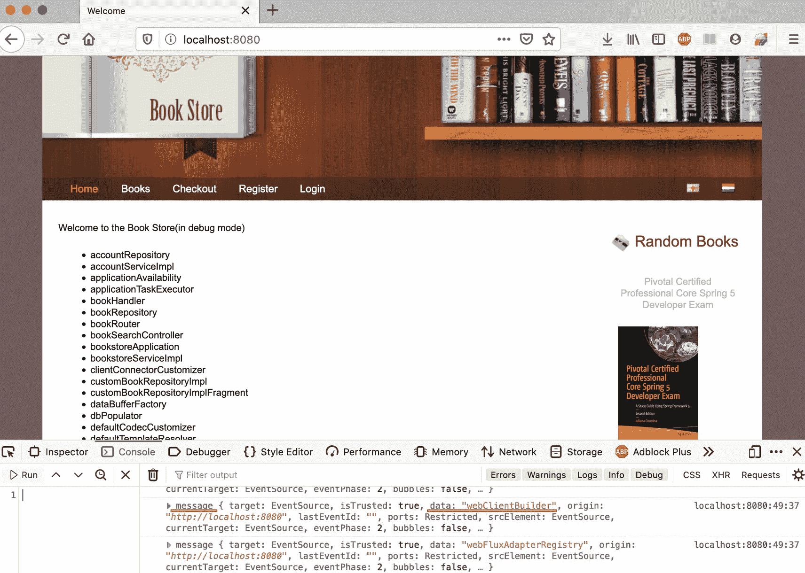
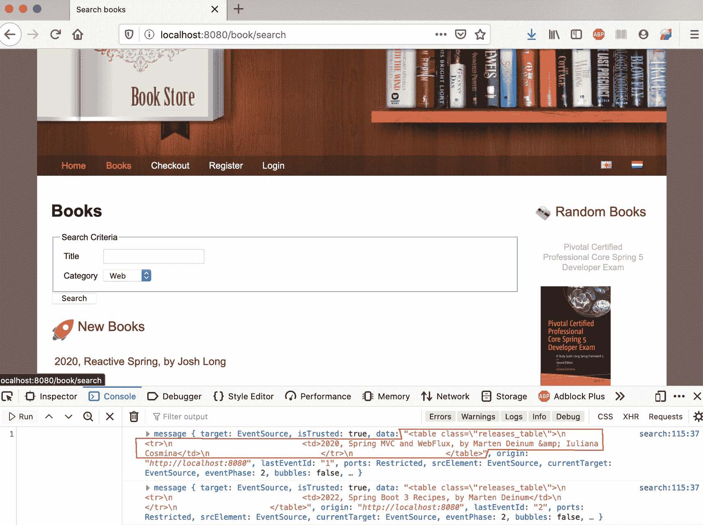
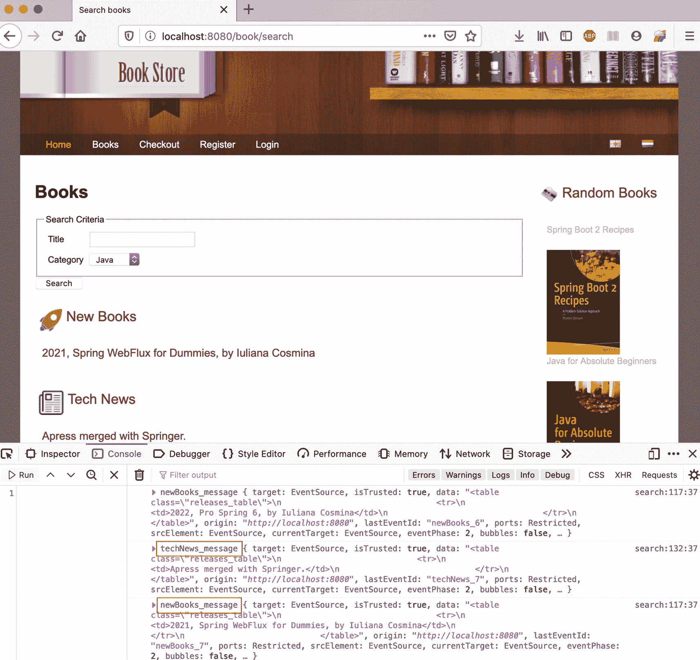
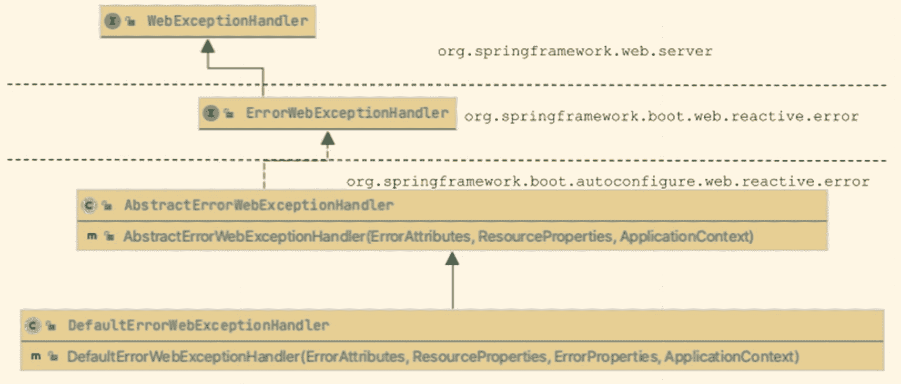

# 十、使用 Spring WebFlux 构建反应式应用

在前一章中，函数式反应式编程是出于需要而引入的。Spring WebFlux 是一个用于编写 Spring 反应式应用的功能性反应式框架，为本章中的应用编写的代码是功能性的，并且使用反应式流。

Spring WebFlux 非常适合构建需要轻松流式传输的应用。上一章介绍的例子使用反应流通过 HTTP 连接向客户机发送数据。但是客户端只接收数据，没有做任何事情来控制发射速率。本章通过将部分书店应用从 MVC 迁移到 Spring WebFlux，引入一个提供新书发布信息的`web client`,并为应用添加聊天功能，来探索 Spring WebFlux 的功能。

## 从 Spring Web MVC 到 Spring WebFlux

将应用逻辑从经典迁移到反应式时，方法处理的类型会发生变化。陈述也会改变；它们不再是命令式的，而是声明式的，它们的代码只有在发出信号时才会执行。对于多层应用，可以从较低层(数据访问)到较高层(表示层)，或者从较高层到较低层进行转换。为了让您热身，让我们从底层开始。

### 迁移数据访问层

直到不久前，关系数据库还不支持被动访问。传统的数据库 JDBC 驱动程序不是反应式的，因此在反应式应用中，它们代表了影响整个应用行为的阻塞 I/O 组件。不过，去年推出了 R2DBC <sup>1</sup> 项目，将反应式编程 API 引入关系数据库。目前，大多数使用的关系数据库都有 R2DBC 实现。但是，即使在三次正式发布之后，这个项目仍然不稳定。

这就只剩下一个选择:放弃关系数据库，转而使用支持反应式访问的 NoSQL 数据库。你可能会使用 Spring WebFlux 来编写微服务应用。具有强类型和列表之间刚性关系的关系数据库与微服务架构的水平可伸缩性和集群化的要求不兼容。Spring 支持一些现代 NoSQL 数据库——couch base、Redis 和 Cassandra，但是 Spring 最喜欢的是 MongoDB。 <sup>2</sup> 作为本章案例研究的反应书店应用使用 MongoDB。(本章的项目包含一个 README.adoc 文件，其中包含在本地安装 MongoDB 的说明。)

在 Spring Boot 应用中，`application.yml`配置文件填充了允许与 MongoDB 数据库集成的属性。但是，它们对于 web 环境来说并不重要，所以这里不做介绍。

在 Spring Boot 应用中使用 MongoDB 数据库需要对项目类路径的`spring-boot-starter-data-mongodb-reactive`依赖和对代码的一些修改。下面列出了这些更改。

*   实体类变成了域类，这意味着 ID 类型被限制为`String`或`BigDecimal`。如果你尝试使用任何其他类型，就会抛出一个类型为`org.springframework.dao.InvalidDataAccessApiUsageException`的异常。

*   因为 NoSQL 数据库不是关系数据库，所以数据库结构改变以保持强链接的数据。

*   数据库表成为数据库集合。

*   JPA/hibernate 注释被替换为 Spring Data MongoDB 注释。

*   `JpaRepository<T, ID>`扩展名被替换为`ReactiveMongoRepository<T, ID>`或`ReactiveCrudRepository<T, ID>`。

清单 10-1 中显示了对实现的`Book`类的更改。应用中的其他类也有类似的变化。

```java
package com.apress.prospringmvc.bookstore.document;

import org.springframework.data.annotation.Id;
import org.springframework.data.mongodb.core.index.Indexed;
import org.springframework.data.mongodb.core.mapping.Document;
import java.math.BigDecimal;
// other imports omitted

@Document(collection="book")
public class Book {
    @Id
    private String id;

    private String title;
    private String description;
    private BigDecimal price;
    private Integer year;
    private String author;

    @Indexed(unique = true)
    private String isbn;
    private String category;

    // getters and setters omitted
}

Listing 10-1The Book MongoDB Document Class

```

`ReactiveCrudRepository<T, ID>`接口是`org.springframework.data.repository.reactive`包的一部分，包含返回`Publisher<T>`实现的方法声明，对于 Spring，这意味着`Flux<T>`和`Mono<T>`。`ReactiveSortingRepository<T, ID>`是`org.springframework.data.repository.reactive`包的一部分，它扩展了`ReactiveCrudRepository<T, ID>`来提供一些额外的为 MongoDB 优化的方法模板。用于被动数据访问的`BookRepository`接口使用 MongoDB 查询从数据库中选择数据，如清单 10-2 所示。

```java
package com.apress.prospringmvc.bookstore.repository;

import com.apress.prospringmvc.bookstore.document.Book;
import org.springframework.data.mongodb.repository.Query;
import org.springframework.data.mongodb.repository.ReactiveMongoRepository;
import reactor.core.publisher.Flux;

/**
 * Created by Iuliana Cosmina on 28/06/2020
 */
public interface BookRepository extends ReactiveMongoRepository<Book, String>{

    @Query("{'category': { '$regex' : ?0 } }")
    Flux<Book> findByCategory(String category);

    @Query(value= "{}", fields ="{'id': 1, 'isbn' : 1, 'category'  :1 }")
    Flux<Book> findAllLight();
}

Listing 10-2The BookRepository Reactive Interface for Accessing the MongoDB Book Collection

```

`@Query`注释中的参数用于直接在存储库方法上声明查找器查询。

### 迁移服务层

如果应用需要一个服务层，那么它的组件也必须修改成反应性的。除此之外，实现也必须改变以适应新的数据库结构。在清单 10-3 中，描述了`BookstoreServiceImpl`的一些方法。`findBooksByCategory(String)`被修改为支持类型为`String`而不是`Category`的参数，这是因为没有`Category table`。结果作为`Flux<Book>`返回。

修改`findBooks(BookSearchCriteria)`来创建一个 MongoDB 查询，并将其传递给`BookRepository`来过滤结果。结果被返回为`Flux<Book>`。

`findOrdersForAccountId(String accountId)`被修改为从`account`集合中获取账户实例的订单，因为没有`order`集合。

```java
package com.apress.prospringmvc.bookstore.service;

import org.springframework.data.mongodb.core.query.Criteria;
import org.springframework.data.mongodb.core.query.Query;
import org.springframework.transaction.annotation.Transactional;
import reactor.core.publisher.Flux;
import reactor.core.publisher.Mono;
// other imports omitted

/**
 * Created by Iuliana Cosmina on 28/06/2020
 */
@Service
@Transactional(readOnly = true)
public class BookstoreServiceImpl implements  BookstoreService {

    @Override
    public Mono<Book> findBook(String id) {
        return this.bookRepository.findById(id);
    }

    @Override
    public Flux<Book> findBooksByCategory(String category) {
        return this.bookRepository.findByCategory(category);
    }

    @Override
    public Flux<Book> findBooks(BookSearchCriteria bookSearchCriteria) {
        Query query = new Query();
        if (bookSearchCriteria.getTitle() != null) {
            query.addCriteria(Criteria.where("title")
                .is(bookSearchCriteria.getTitle()));
        }
        if (bookSearchCriteria.getCategory() != null) {
            query.addCriteria(Criteria.where("category")
                .is(bookSearchCriteria.getTitle()));
        }
        return bookRepository.findAll(query);
    }

    @Override
    public Mono<List<Order>> findOrdersForAccountId(String accountId) {
        return this.accountRepository
            .findById(accountId).map(Account::getOrders);
    }

    //other code omitted
}

Listing 10-3The BookRepository Reactive Interface for Accessing the MongoDB Book Collection

```

一旦使用了反应式数据库，迁移数据访问和服务层就变得很容易，几乎没有什么困难。只要确保您总是返回`Publisher<T>`实例，就大功告成了。

## 迁移 Web 图层

迁移 web 图层需要进行一些更改，因为当您不知道渲染了多少数据时，渲染视图会很困难。过去，AJAX(异步 JavaScript 和 XML)解决了这个问题，但是 AJAX 使我们只能响应页面上的用户操作来更新页面。它没有解决来自服务器的更新问题。由于反应式通信涉及双向数据流，因此需要新的 web 库。做这件事的方法不止一种，所以我们开始研究吧，好吗？

### 反应式模板引擎的配置

让我们举一个在前面章节中使用的非常简单的例子:书店应用的`index`页面可以显示应用上下文中的 beans 列表。在前面的章节中，`IndexController`包含了一个方法，该方法使用一个包含应用上下文中所有 beans 名称的`List<String>`来填充模型。

要使这个控制器是可反应的，列表必须被一个`Flux<String>,`代替，视图也必须是可反应的。幸运的是，百里香叶可以配置为支持反应式视图。模板的语法没有改变；只有视图解析器和模板引擎必须替换为它们的反应式通信器。

在清单 10-4 中，描述了一个用于反应式百里香视图支持的 Spring 配置类。这个类有点冗长。其中设置的大多数属性值已经被声明为默认值，但是这个类是这样编写的，以便从开发的角度来看清楚什么是可定制的。

```java
package com.apress.prospringmvc.bookstore.config;

import org.springframework.web.reactive.config.EnableWebFlux;
import org.springframework.web.reactive.config.ViewResolverRegistry;
import org.springframework.web.reactive.config.WebFluxConfigurer;
import org.thymeleaf.spring5.ISpringWebFluxTemplateEngine;
import org.thymeleaf.spring5.SpringWebFluxTemplateEngine;
import org.thymeleaf.spring5.templateresolver.SpringResourceTemplateResolver;
import org.thymeleaf.spring5.view.reactive.ThymeleafReactiveViewResolver;
import org.thymeleaf.templateresolver.ITemplateResolver;
// other imports omitted

@Configuration
public class ReactiveThymeleafWebConfig implements
            ApplicationContextAware, WebFluxConfigurer {

    ApplicationContext context;

    @Override
    public void setApplicationContext(ApplicationContext context) {
        this.context = context;
    }

    @Bean
    public ITemplateResolver thymeleafTemplateResolver() {
        var resolver = new SpringResourceTemplateResolver();
        resolver.setApplicationContext(this.context);
        resolver.setPrefix("classpath:templates/");
        resolver.setSuffix(".html");
        resolver.setTemplateMode(TemplateMode.HTML);
        resolver.setCacheable(false);
        resolver.setCheckExistence(false);
        return resolver;

    }

    @Bean
    public ISpringWebFluxTemplateEngine thymeleafTemplateEngine() {
        var templateEngine = new SpringWebFluxTemplateEngine();
        templateEngine.setTemplateResolver(thymeleafTemplateResolver());
        return templateEngine;
    }

    @Bean
    public ThymeleafReactiveViewResolver thymeleafReactiveViewResolver() {
        var viewResolver = new ThymeleafReactiveViewResolver();
        viewResolver.setTemplateEngine(thymeleafTemplateEngine());
        viewResolver.setOrder(1);
        viewResolver.setResponseMaxChunkSizeBytes(8192);
        return viewResolver;
    }

    @Override
    public void configureViewResolvers(ViewResolverRegistry registry) {
        registry.viewResolver(thymeleafReactiveViewResolver());
    }

}

Listing 10-4Spring Configuration Class for Reactive Thymeleaf Views Support

```

负责解析模板的模板解析器 bean 不需要是被动的。因为模板解析器 bean 包含来自应用配置的数据，所以在使用 Spring Boot 时可以完全删除它，并通过用`@EnableConfigurationProperties(ThymeleafProperties.class)`注释配置类来替换它。

使用模板解析器的模板引擎是反应式的，是`ISpringWebFluxTemplateEngine`的一个实现。为了与 Spring MVC 类型集成而设计的`SpringTemplateEngine`，必须替换为`SpringWebFluxTemplateEngine`，它是`ISpringWebFluxTemplateEngine`接口的一个实现，旨在与 Spring WebFlux 集成，并以一种反应友好的方式执行模板。由于模板引擎只需要一个模板解析器，我们也可以跳过这个 bean 声明，让 Spring Boot 来配置它。支持反应视图的配置类可以简化，如清单 10-5 所示。

```java
package com.apress.prospringmvc.bookstore.config;

import org.springframework.boot.autoconfigure.thymeleaf.ThymeleafProperties;
import org.springframework.boot.context.properties.EnableConfigurationProperties;
// other imports omitted

@Configuration
@EnableConfigurationProperties(ThymeleafProperties.class)
public class ReactiveThymeleafWebConfig implements
         WebFluxConfigurer {

    private final ISpringWebFluxTemplateEngine thymeleafTemplateEngine;

    public ReactiveThymeleafWebConfig(ISpringWebFluxTemplateEngine templateEngine) {
        this.thymeleafTemplateEngine = templateEngine;
    }

    @Bean
    public ThymeleafReactiveViewResolver thymeleafReactiveViewResolver() {
        var viewResolver = new ThymeleafReactiveViewResolver();
        viewResolver.setTemplateEngine(thymeleafTemplateEngine);
        viewResolver.setOrder(1);
        return viewResolver;
    }
    //other code omitted
}

Listing 10-5Simplified Spring Configuration Class for Reactive Thymeleaf Views Support

```

`@EnableConfigurationProperties`注释支持百里香配置属性。用`@ConfigurationProperties(prefix = "spring.thymeleaf"),`对`ThymeleafProperties`类进行了注释，使其成为百里香属性的配置 bean。这意味着你可以使用`application.properties`或`application.yml`来配置百里香。这些属性以`spring.thymeleaf`为前缀，允许您配置模板解析器 bean，而无需编写额外的代码。清单 10-6 是相当于清单 10-4 中 Java 配置的 YML 配置。

```java
spring:
  thymeleaf:
    prefix: classpath:templates/
    suffix: .html
    mode: HTML
    cache: false
    check-template: false
    reactive:
        max-chunk-size: 8192

Listing 10-6Simplified Spring Configuration Class for Reactive Thymeleaf Views Support (snippet from the application.yml file)

```

有些百里香属性在`ThymeleafProperties`类中被赋予了默认值，所以这意味着如果你的应用使用默认值，百里香 YML 配置部分可以完全跳过，清单 10-5 中的配置仍然有效。

`ThymeleafReactiveViewResolver`是`org.springframework.web.reactive.result.view.ViewResolver`接口的实现，即 Spring WebFlux 视图解析器接口。`responseMaxChunkSizeBytes`是您应该感兴趣的属性，因为它定义了由百里香引擎生成并作为输出传递给服务器的输出`org.springframework.core.io.buffer.DataBuffer`实例的最大大小。这一点很重要，因为如果您有大量数据通过`Flux<T>`发送，您可能希望一点一点地呈现视图，而不是在响应完成之前保持网页处于加载状态。尤其是因为这是反应式沟通的主要思想之一。

百里香叶有三种操作模式。

*   `FULL` `:`当没有配置最大块大小，也没有数据驱动上下文变量时，模板输出在内存中作为单个块生成，然后作为响应发送。这与非反应行为非常相似。

*   `CHUNKED` `:`已建立配置的最大块大小限制，但尚未指定数据驱动程序上下文变量。模板以块的形式生成，大小大致等于配置的大小，并发送给客户端。在发送一个块后，百里香引擎停止并等待服务器请求更多的块；是的，这是背压的一种实现。

*   `DATA-DRIVEN``:``data-driver`变量以反应式数据流的形式包装异步对象，这意味着驱动模板的反应式友好执行。当在返回视图逻辑名称的处理程序方法中声明这种变量时，百里香引擎被设置为`DATA-DRIVEN`模式，这意味着解析后的视图作为数据流发送到客户端。支持数据驱动变量的模板必须包含该变量的迭代(`th:each`)。

重写`IndexController`使其反应的方法使用了一个`data-driver`变量。这意味着，不是向模型添加一个`List<String>`，而是需要一个`org.thymeleaf.spring5.context.webflux.IReactiveDataDriverContextVariable`的实例。这个变量包含在一个发出应用上下文 bean 名称的`Flux<String>`实例中。实现该接口的上下文变量以反应式数据流的形式包装`Publisher<T>`实例，以驱动模板的反应式友好执行。 <sup>3</sup>

为了使这种方法的结果清晰，值的发出被减慢到每 200 毫秒一次。这意味着当打开`http://localhost:8080/` URL 时，您应该看到列出 bean 名称的页面部分逐渐加载。

清单 10-7 中描述了无功`IndexController`的实现。

```java
package com.apress.prospringmvc.bookstore.controller;

import org.thymeleaf.spring5.context.webflux.IReactiveDataDriverContextVariable;
import org.thymeleaf.spring5.context.webflux.ReactiveDataDriverContextVariable;
import reactor.core.publisher.Flux;
// other imports omitted

@Controller
public class IndexController implements ApplicationContextAware {

    private ApplicationContext ctx;

    @Override
    public void setApplicationContext(ApplicationContext applicationContext)
                    throws BeansException {
        ctx = applicationContext;
    }

    @GetMapping("/")
    public String index(final Model model) {
        List<String> beans = Arrays.stream(ctx.getBeanDefinitionNames())
            .sorted()
            .collect(Collectors.toList());
        Flux<String> flux = Flux.fromIterable(beans)
            .delayElements(Duration.ofMillis(200));
        IReactiveDataDriverContextVariable dataDriver =
                new ReactiveDataDriverContextVariable( flux,10);

        model.addAttribute("beans", dataDriver);
        return "index";
    }
}

Listing 10-7Reactive IndexController with Data-Driver Variable

```

`ReactiveDataDriverContextVariable`是`IReactiveDataDriverContextVariable`接口的基本实现。使用`IReactiveDataDriverContextVariable,`,我们将百里香设置为数据驱动模式，这意味着 HTML 项目是以一种反应友好的方式产生的。

`index.html`模板不需要任何改变。Thymeleaf 使用相同的 HTML 结构迭代集合和反应性数据集。流发出的值被添加到嵌套在可滚动的`<div>`中的`<ul>`列表中，以保持页面大小等于屏幕大小。`${beans}`变量是对百里香数据驱动变量暴露的反应流的引用。

```java
<!-- other HTML parts omitted -->
<div class="scrollable">
    <ul th:each="bean : ${beans}">
        <li th:text="${bean}"> </li>
    </ul>
</div>

Listing 10-8The Thymeleaf Template Snippet to Render the Bean Names (snippet from the index.html file

)

```

尽管如此，逐渐加载页面并不是最好的选择，因为页面设计的某些部分直到交互通信完成后才会呈现。这使用户感觉好像他们是通过 ADSL 连接浏览这个页面。让我们看看另一种方法，在页面完全加载后，使用反应式处理程序方法和 JavaScript 函数在 HTML div 中逐渐加载这些 bean 名称。

### 使用服务器发送的事件(SSE)

在前一章中，提到了反应式控制器。大多数反应式控制器都用`@RestController`注释，这是一个组合注释，标记控制器具有返回数据而不是逻辑视图名称的处理程序方法。`IndexController`不能被注释，因为我们仍然需要它来解析`index.html`视图模板。但是，我们可以将 bean flux 提取到一个用`@ResponseBody`标注的反应处理程序方法中。这导致了清单 10-9 中的实现。

```java
package com.apress.prospringmvc.bookstore.controller;

import org.springframework.web.bind.annotation.ResponseBody;
import reactor.core.publisher.Flux;
// other imports omitted

@Controller
public class IndexController implements ApplicationContextAware {

    private ApplicationContext ctx;

    @Override
    public void setApplicationContext(ApplicationContext applicationContext)
        throws BeansException {
        ctx = applicationContext;
    }

    @GetMapping(path = {"/", "index.htm"})
    public String index() {
        return "index";
    }

    @ResponseBody
    @GetMapping(value = "/beans", produces = MediaType.TEXT_EVENT_STREAM_VALUE)
    public Flux<String> getBeanNames() {
        List<String> beans = Arrays.stream(ctx.getBeanDefinitionNames())
          .sorted().collect(Collectors.toList());
        return Flux.fromIterable(beans).delayElements(Duration.ofMillis(200));
    }
}

Listing 10-9Reactive IndexController with a Method Handler Returning a Flux<T> of Data

```

如果您启动该应用，您可以通过运行以下命令来测试该方法是否返回了一系列 bean 名称。

```java
curl -H "Accept:text/event-stream" http://localhost:8080/beans

```

Spring WebFlux 将每个 bean 名称作为服务器发送的事件发出，现在，`index.html`需要一些修改来处理它们并在页面上显示它们。因为新数据必须在到达时添加到页面中，所以 JavaScript 需要编写一个函数来修改最少的 beans。

因此，显示 bean 名称所需的`index.html`模板片段发生了变化，如清单 10-10 所示。

```java
<!-- other HTML/JavaScript parts omitted -->
<script type="text/javascript" th:inline="javascript">
/*<![CDATA[*/
    var renderBeans = {
        source: new EventSource([[@{|/beans|}]]) ,
        start: function () {
            this.source.addEventListener("message", function (event) {
                //console.log(event);
                $("#beans").append('<li>'+ event.data +'</li>')
            });
            this.source.onerror = function () {
                this.source.close();
            };
        },
        stop: function() {
            this.source.close();
        }
    };

    $( window ).on( "load", function() {
        renderBeans.start();
    });

    $( window ).on( "onbeforeunload", function() {
        renderBeans.stop();
    });
/*]]>*/
</script>
<div class="scrollable">
    <ul id="beans">
    </ul>
</div>

Listing 10-10Thymeleaf template snippet used to display the bean names received as Server-Sent Events (snippet from the index.html file)

```

`[[@{|/beans|}]]`是一个百里香链接表达式，用于生成相对于应用上下文的 URL。

在清单 10-10 中，`jQuery`库用于编写处理服务器发送事件所需的 JavaScript 代码，这是一种服务器推送技术，使客户端能够通过 HTTP 连接从服务器接收自动更新。这意味着页面得到呈现，但连接保持打开，因此服务器可以向客户端发送更多数据。EventSource API 被标准化为 HTML5 的一部分，除了 Internet Explorer，其他所有浏览器都支持它。

百里香叶产生三种类型的小分子物质。

*   **头**:数据以`head:`或`{prefix}_head`为前缀；其中`prefix`值通过`ReactiveDataDriverContextVariable`构造函数设置。前缀用于包含迭代数据(如果有)之前的所有标记的通信期间的单个事件。例如，当您正在读取一个脸书线程时，当您打开页面时，数据库中存在的所有注释，在您打开该页面时的时间戳之前，应该已经呈现在页面中了。没有必要一一渲染*。百里香支持这种类型的初始化事件。*

*   **数据消息**:数据以`message` `:`或`{prefix}_message`为前缀；其中`prefix`通过`ReactiveDataDriverContextVariable`构造器设置。前缀用于一系列事件，数据驱动程序产生的每个值对应一个事件。例如，当您阅读脸书帖子时，其他用户在您查看页面时发表的评论会一个接一个地出现在评论部分。来自注释的数据通过 message 类型的 SSE 发送给客户机。

*   **Tail** :数据以`tail` `:`或`{prefix}_tail`为前缀，其中`prefix`值通过`ReactiveDataDriverContextVariable`构造函数设置。前缀用于通信期间的单个事件，包含迭代数据(如果有)之后的所有标记。例如，假设脸书有一个选项，用户可以通过它选择停止查看新评论，这种类型的事件可以用来发送数据库中所有现有的评论，其时间戳值在最后显示的评论和用户选择停止查看新评论的时间戳之间*。* <sup>4</sup>

在前面的代码片段中，`/beans` URL 被用作 SSE 流的源。使用 URL 创建一个`EventSource` <sup>5</sup> 实例，它打开一个持久连接，服务器通过该连接以`text/event-stream`格式发送事件。连接保持打开，直到通过调用`EventSource.close()`关闭。那些事件被 Spring WebFlux 标记为`message`事件，并在`EventSource`实例上设置一个`EventListener` <sup>6</sup> 实例来拦截那些事件，提取数据，并将其添加到一个 HTML 页面中。

bean names 流被有意减慢，以显示连续的通信。如果使用 Chrome 或 Firefox，在加载页面时，可以在开发者控制台中看到服务器发送的事件。从`EventListener`实例体中删除`console.log(event)`语句的注释。在图 10-1 中，书店应用的主页在 Firefox 中打开，你可以在开发者控制台中看到从服务器发送的数据流。



图 10-1

服务器发送的事件显示在 Firefox 的开发人员控制台中

使用服务器发送的事件将反应数据显示到百里香模板中的另一种方法是使用一个`IReactiveSSEDataDriverContextVariable`上下文变量。实现该接口的上下文变量以反应数据流的形式包装`Publisher<T>`实例，这意味着以 SSE(服务器发送事件)模式驱动模板的反应友好执行。 <sup>7</sup> 这意味着 Spring WebFlux 不会将数据包装成 SSEs 相反，它会将它们发送到百里香引擎来执行此操作。

在 Spring WebFlux 应用使用百里香叶引擎生成视图的上下文中，这意味着发出的每个值都被*映射*到百里香叶模板片段，百里香叶视图的一部分。当发出一个值时，百里香引擎获取数据并将其封装在片段描述的 HTML 元素中，然后作为类型为`message`的 SSE 发出。然后使用 JavaScript 函数将事件数据注入 HTML 页面。清单 10-11 是百里香模板的一个片段。它显示了一个名为`newBooks. N`的`<div/>`元素，其内部是一个只有一行的表格，包含即将发行的一本书的详细信息。

```java
<!-- other HTML parts omitted -->
 <div class="releases_box">
    <div class="title">
        <span class="title_icon">
            
        </span>
        <th:block th:text="#{main.title.newbooks}">New Books</th:block>
    </div>
    <div id="newBooks">
    <!-- /start/ the targeted fragment -->
        <table th:each="book : ${newBooks}" class="releases_table">
            <tr>
                <td
        th:text="${book.year} + ', ' + ${book.title} + ', by ' +  ${book.author}">
                </td>
            </tr>
        </table>
    <!-- /end/ the targeted fragment -->
    </div>
</div>

Listing 10-11Thymeleaf Template Snipped to Display the Bean Names Received As Server-Sent Events (snippet from the search.html file)

```

表定义表示每次发出值时由百里香引擎重写的片段。这是使用类似于清单 10-10 中描述的 JavaScript 函数完成的，只是这个函数用事件数据覆盖了`newBooks` div 的 HTML 内容。清单 10-12 中描述了包含实现所需反应行为的函数的`renderBooks`变量。

```java
// other HTML/JavaScript parts omitted
var renderBooks = {
    source: new EventSource([[@{|/book/new|}]]) ,
    start: function () {
        renderBooks.source.addEventListener("message", function (event) {
            //console.log(event);
            $("#newBooks").html(event.data);
        });
        renderBooks.source.onerror = function () {
            this.close();
        };
    },
    stop: function() {
        this.source.close();
    }
};

Listing 10-12The JavaScript Function That Provides the View Reactive Behavior (snippet from the search.html file)

```

映射到`/book/new` URL 的处理程序方法是`BookSearchController`的一部分，与用于在`IndexController`中提供 beans 名称流的方法没有什么不同。主要有两个区别。第一个区别是`IReactiveSSEDataDriverContextVariable`被用作数据驱动上下文变量的引用类型。这就是 Thymeleaf 被告知我们希望模板以 SSE(服务器发送事件)模式执行的方式。

第二个区别是方法返回的逻辑视图名，该名称必须包含百里香模板片段的标识符，该模板片段应在作为 SSE 发送之前应用于流发出的每个元素。逻辑视图名称必须遵循以下语法:`templateName :: #fragmentIdentifier`。清单 10-13 中的上下文变量没有声明显式前缀，这意味着事件被标记为具有`message`类型。

```java
package com.apress.prospringmvc.bookstore.controller;

import org.thymeleaf.spring5.context.webflux.IReactiveSSEDataDriverContextVariable;
import org.thymeleaf.spring5.context.webflux.ReactiveDataDriverContextVariable;
//other imports omitted

@Controller

public class BookSearchController {
  // Generates random books to be displayed
    @GetMapping( value = "/book/new", produces = MediaType.TEXT_EVENT_STREAM_VALUE)
    public String newBooks(final Model model){
        Flux<Book> newReleases = Flux.interval(Duration.ofSeconds(3))
          .map(delay -> BookNewReleasesUtil.randomRelease());

        final IReactiveSSEDataDriverContextVariable dataDriver =
                new ReactiveDataDriverContextVariable(newReleases, 1);

        model.addAttribute("newBooks", dataDriver);
        return "book/search :: #newBooks";
    }
}
// other code omitted

Listing 10-13Handler Method in BookSearchController Declaring a IReactiveSSEDataDriverContextVariable

```

将所有这些组件放在一起，您会得到一个每 3 秒钟显示一本新书的页面。如果使用 Chrome 或 Firefox，在加载页面时，可以在开发者控制台中看到服务器发送的事件。从`EventListener`实例体中删除`console.log(event)`语句的注释。在图 10-2 中，书店应用的`search`页面在 Firefox 中打开，你可以在开发者控制台中看到服务器发送的数据流。注意，数据是一个与名为`newBooks,`的模板片段匹配的 HTML 片段，其中百里香叶变量被替换为发出的值。



图 10-2

服务器发送的事件显示在 Firefox 的开发人员控制台中

我们提到前缀支持 SSE。当您需要在同一个页面上有多个反应片段时，前缀非常有用。在这种情况下，前缀将 se 映射到同一模板中的不同片段。这是必需的，因为即使两个发布者在同一台服务器上发出事件，他们也是通过同一 HTTP 连接来完成的。需要两个事件侦听器来拦截不同类型的事件并相应地处理它们。

在`search.html`模板中，如果我们添加一个显示技术新闻的新部分，我们必须向两个上下文数据驱动变量添加前缀，以便基于它们进行过滤，并定向到适当的模板片段。`newBooks`用作指向`newBooks` div 的服务器事件的前缀，`techNews`用作显示技术新闻的名为`techNews`的 div 的前缀。两个 div 元素的 HTML 和 JavaScript 基本相同。如果你想看看发送给客户的 SSEs 是什么样的，请看图 10-3 。



图 10-3

服务器发送的带有前缀名称的事件显示在 Firefox 的开发人员控制台中

在前面的例子中，书籍和科技新闻是由一个流提供的，该流从一个固定的集合中随机发出一个条目。不过，有人提到，当来自多个服务的数据被聚合时，反应式应用是一个很好的选择。对于更接近现实的情况，`newBooks` div 的数据可以由书店应用外部的反应式服务提供，或者可能更多地属于图书出版商(比如 Apress)。用于`techNews` div 的数据可以由某个公共技术聚合器应用的反应服务提供。从那些流发出的数据的处理程序方法的实现看起来很像清单 10-13 中的代码，所以这里不再重复。

Spring WebFlux 引入了一些东西，可以毫不费力地与其他反应式服务集成，这将在下一节讨论。

### 介绍 WebClient 和 WebTestClient

在 Spring WebFlux 之前，使用`org.springframework.web.client.RestTemplate`可以发出 HTTP 请求。这个客户端是同步的，通过 HTTP 方法为常见场景提供模板。现在已经废弃的`AsyncRestTemplate`是后来在同一个包中引入的，以支持异步 HTTP 请求，只是被`WebClient`所取代。对于测试来说，`org.springframework.boot.test.web.client.TestRestTemplate`仍然可以用于同步 HTTP 请求。

Spring WebFlux 提供了一个反应式的、非阻塞的 HTTP 客户端，通过`org.springframework.web.reactive.function.client.WebClient`接口公开了一个非常实用的 API。提供了单个实现，`org.springframework.web.reactive.function.client.DefaultWebClient`。在幕后，它使用在类路径上找到的 HTTP 客户端，比如 Reactor Netty。这是从您的反应式应用访问其他反应式服务的实用工具。`WebClient`接口提供了两个静态方法来创建一个`WebClient`实例——都被命名为`create`。其中一个调用接收应用的基本 URL 作为参数，所有后续调用都可以简化，因为它们的 URL 被认为是相对于基本 URL 的。

清单 10-14 显示了一个使用静态`create()`方法创建的`web client`。然后，实例对在`http://localhost:8080/randomBookNews`公开的反应服务进行 GET REST 调用。这个服务只不过是同一个应用中的一个功能端点，它返回无限的`Book`实例流。

```java
package com.apress.prospringmvc.bookstore.controller;

import org.springframework.web.reactive.function.client.WebClient;
//other imports omitted

@Controller
public class BookSearchController {

    @GetMapping( value = "/book/new",
                 produces = MediaType.TEXT_EVENT_STREAM_VALUE)
    public String newBooks(final Model model){
        // previous implementation
        //Flux<Book> newReleases = Flux.interval(Duration.ofSeconds(5))
        //       .map(delay -> BookNewReleasesUtil.randomRelease());
        WebClient webClient = WebClient.create();
        Flux<Book> newReleases = webClient
                .get().uri("http://localhost:8080/randomBookNews")
                .retrieve()
                .bodyToFlux(Book.class);

        final IReactiveSSEDataDriverContextVariable dataDriver =
                new ReactiveDataDriverContextVariable(newReleases, 1, "newBooks");

        model.addAttribute("newBooks", dataDriver);
        return "book/search :: #newBooks";
    }
    //other code omitted
}

Listing 10-14Using WebClient Without a Base URL Within the BookSearchController

```

另一种方法是使用完整的 URL 来创建`WebClient`实例。然后，所有使用该实例的 HTTP 请求只能使用相对于 baseURL 的 URL 的一部分。清单 10-15 显示了一个使用静态`create(String)`方法创建的`WebClient`。

```java
WebClient webClient = WebClient.create("http://localhost:8080/randomBookNews");

Flux<Book> newReleases = webClient.get().uri("/")
        .retrieve()
        .bodyToFlux(Book.class);

Listing 10-15Using WebClient with a Base URL

```

创建`WebClient`的另一种方法是使用通过调用`WebClient.builder()`方法返回的构建器实例。这允许对`WebClient`实例进行更细粒度的配置。使用构建器时，您可以设置头、cookies、额外的操作符来定制返回值，甚至可以设置不同的客户端连接器。默认使用(`ReactorClientHttpConnector` <sup>8</sup> )。它是由 Spring WebFlux 提供的，但是你也可以使用一个反应式的 Apache `CloseableHttpAsyncClient,` <sup>9</sup> 为例)。这意味着清单 10-15 中的`WebClient`声明可以像清单 10-16 中描述的那样编写。

```java
WebClient webClient = WebClient.builder()
        .baseUrl("http://localhost:8080/randomBookNews")
        .defaultHeader(HttpHeaders.CONTENT_TYPE, MediaType.TEXT_EVENT_STREAM_VALUE)
        .defaultCookie("InternalCookie", "all")
        .build();

Listing 10-16Creating WebClient Using a Builder

```

不管是用什么方式创建的，`WebClient`实例都是不可变的；但是，它支持一个`clone()`方法，该方法返回一个构建器，该构建器可以基于原始实例创建一个新实例。

`WebClient`非常灵活，允许创建复杂的结构，支持使用带有路径变量和请求参数的 URL 进行 HTTP 请求。也支持 URL 生成器和 URL 编码。我们快速复习一些重要的方法。对于可用 API 的完整描述，请随意查阅官方文档，这非常好。 <sup>10</sup>

`retrieve()`方法获得一个 HTTP 响应。在前面的例子中，这个方法后面是对`bodyToMono(Class)`或`bodyToFlux(Class)`的调用。两者都将发出的值的类型作为参数接收。但是，这个方法后面也可以跟一个对`onStatus(..),`的调用，并且可以发出异常，这些异常被封装到`WebClientResponseException`对象中，这取决于 HTTP 状态代码。清单 10-17 描述了这样一个例子。

```java
Flux<Book> newReleases = webClient.get()
    .uri("/")
    .retrieve()
    .onStatus(HttpStatus::is4xxClientError, response ->
        Mono.error( response.statusCode() == HttpStatus.UNAUTHORIZED
            ? new ServiceDeniedException("You shall not pass!")
            : new ServiceDeniedException("Well.. this is unfortunate!"))
    )
    .onStatus(HttpStatus::is5xxServerError, response ->
        Mono.error(response.statusCode() == HttpStatus.INTERNAL_SERVER_ERROR
            ? new ServiceDownException("This is SpartAAA!!")
            : new ServiceDownException("Well.. this is a mystery!"))
    )
    .bodyToFlux(Book.class);

Listing 10-17Using WebClient with Customized Error Behavior, Using the onStatus(..) Method

```

如果响应应该有内容，那么它应该由匹配状态代码谓词的函数使用；否则，它的内容将被丢弃以释放资源。

`retrieve()`法可与`get()`、`post()`、`put()`、`delete()`等配合使用。还有一个`exchange()`方法，它提供了更细粒度的控制。例如，`exchange()`方法提供了对响应的访问，这允许您检查响应头、cookies，或者以任何必要的方式更改它。缺点是它不支持基于 HTTP 状态代码的定制行为。

关于`WebClient`的一件很酷的事情是，如果它的输出可以被正确地反序列化，它可以与使用任何其他技术开发的服务一起使用。为了证明这一点，我们使用 Node.js 实现了提供科技新闻的服务。 <sup>11</sup> 清单 10-18 描述了该服务的实现。

```java
const http = require('http');
const sys = require('util');
const fs = require('fs');

const hostname = 'localhost';
const port = 3000;

const news = [
    'Apress merged with Springer.',
    // other values omitted
];

const server = http.createServer((req, res) => {
    res.setHeader('Content-Type', 'text/event-stream;charset=UTF-8');
    res.setHeader('Cache-Control', 'no-cache');
    // only if you want anyone to access this endpoint
    res.setHeader('Access-Control-Allow-Origin', '*');
    res.flushHeaders();

    // Sends a SSE every 2 seconds on a single connection.
    setInterval(function() {
        res.write('data:'+news[Math.floor(Math.random() * news.length)] + '\n\n');
    }, 2000);
});

server.listen(port, hostname, () => {
    console.log(`Event stream available at http://${hostname}:${port}/techNews`);
});

Listing 10-18The tech-news.js

Service That Generates an Infinite Stream of Random Tech News

```

js 库是 JavaScript 函数的集合，可以用几行代码创建一个 web 服务器。作为参数提供给`http.createServer`的函数每 2 秒发出一个随机文本。

当用任何技术编写反应式服务时，可以用`curl`命令检查输出。使用`-v`选项获得服务发送内容的详细描述。这揭示了编写客户端所需的重要信息，例如媒体类型和编码以及发送信息的格式。

清单 10-19 展示了 curl 命令和参数，用于检查 Node.js 技术新闻服务的响应及其在终端中的输出。

```java
$  curl http://localhost:3000/techNews  -v
* Connection failed
* connect to ::1 port 3000 failed: Connection refused
*   Trying 127.0.0.1...
* TCP_NODELAY set
* Connected to localhost (127.0.0.1) port 3000 (#0)
> GET /techNews HTTP/1.1
> Host: localhost:3000
> User-Agent: curl/7.64.1
> Accept: */*
>
< HTTP/1.1 200 OK
< Content-Type: text/event-stream;charset=UTF-8
< Cache-Control: no-cache
< Access-Control-Allow-Origin: *
< Date: Thu, 30 Jul 2020 11:12:54 GMT
< Connection: keep-alive
< Transfer-Encoding: chunked
<
data:Amazon launches reactive API for DynamoDB.

data:Java 17 will be released in September 2021.
...

Listing 10-19Node.js Service Output Returned by the curl Command

```

`WebClient`对于检索由其他服务产生的数据是实用的，但是更实用的是它的用于编写集成测试的版本:`WebTestClient`。`org.springframework.test.web.reactive.server.WebTestClient`是`org.springframework.boot.test.web.client.TestRestTemplate`的无功当量。它可以测试控制器和功能端点，它本质上包装了`WebClient`，并为其提供了测试环境。`WebTestClient`提供与`WebClient`相同的 API，但也支持对返回响应的测试假设。

清单 10-20 描述了检查搜索书籍匹配标准的 POST 请求实现的测试方法。

```java
package com.apress.prospringmvc.bookstore.web;

import org.springframework.boot.test.context.SpringBootTest;
import org.springframework.test.web.reactive.server.WebTestClient;
import static org.junit.jupiter.api.Assertions.assertEquals;
// other imports omitted

@SpringBootTest(webEnvironment = SpringBootTest.WebEnvironment.RANDOM_PORT)
public class BookstoreWebTest {
    private static Logger logger = LoggerFactory.getLogger(BookstoreWebTest.class);

    @Autowired
    private  WebTestClient testClient;

    @Test
    public void shouldReturnTwoBooks(){
        BookSearchCriteria criteria = new BookSearchCriteria();
        criteria.setCategory(Book.Category.JAVA);

        testClient.post()
            .uri("/book/search")
            .accept(MediaType.APPLICATION_JSON)
            .body(Mono.just(criteria), BookSearchCriteria.class)
            .exchange()
            .expectStatus().isOk() /* test */
            .expectHeader().contentType(MediaType.APPLICATION_JSON)
            .expectBodyList(Book.class)
            .consumeWith(
                result -> {
                    assertEquals(2, result.getResponseBody().size());
                    result.getResponseBody().forEach(p ->
                        logger.info("Response: {}",p));
                });
    }
}

Listing 10-20WebTestClient to Test a POST Request with Consumers

```

测试在测试应用上下文中运行，`/book/search`请求是针对在`http://localhost:{mockPort}`可用的模拟服务器发出的。注意方法的链接，这些方法也可以使用`WebClient`。`WebTestClient`部分在`exchange()`呼叫之后开始。之后的所有三种方法都测试请求的假设。

*   `expectStatus().isOk()`检查 HTTP 状态代码是否为 200。

*   `expectHeader().contentType(MediaType.APPLICATION_JSON)`检查响应的媒体类型是否为 JSON。

*   `expectBodyList(Book.class)`检查响应的主体是否包含一组`Book`实例。

*   作为一个参数，提供了一个消费者函数，它检查集合的大小是否为 2，并打印集合的每个成员。

方法允许开发者指定消费者使用他们觉得舒服的任何测试库来测试请求体。清单 10-20 中的实现可能被认为是冗长的。测试方法不需要打印结果体，这使得检查集合大小成为唯一需要的验证。在这种情况下，可以去掉`consumeWith(..)`，用`hasSize(2)`代替。

使用这个实例的另一种方法值得一提。`WebTestClient`支持使用 JsonPath <sup>12</sup> 表达式制作主体断言。对于包含 JSON 内容的响应，这是很实用的，我们不希望将这些内容反序列化为 Java 对象，或者在应用中没有相应的类。在清单 10-21 中，检查响应体的预期属性和预期值，而不将响应体反序列化为`Book`实例。

```java
package com.apress.prospringmvc.bookstore.web;
// imports omitted

@SpringBootTest(webEnvironment = SpringBootTest.WebEnvironment.RANDOM_PORT)
public class BookstoreWebTest {
    private static Logger logger = LoggerFactory.getLogger(BookstoreWebTest.class);

    @Autowired
    private  WebTestClient testClient;

    @Test
    public void shouldReturnBook(){
        testClient.get()
            .uri(uriBuilder -> uriBuilder.path("/book/isbn/{isbn}")
                        .build("9781484237779"))
            .accept(MediaType.APPLICATION_JSON)
            .exchange()
            .expectStatus().isOk()
            .expectHeader().contentType(MediaType.APPLICATION_JSON)
            .expectBody()
            .jsonPath("$.title").isNotEmpty()
            .jsonPath("$.author").isEqualTo("Iuliana Cosmina");
    }
}

Listing 10-21WebTestClient to Test a GET Request Using JsonPath Expressions

```

`WebTestClient`可以使用`bindToServer()`方法测试真实的服务器。这很好，因为它可以测试使用其他技术开发的服务。

清单 10-22 描述了`WebTestClient,`的创建，它可以在运行于`http://localhost:8080`的真实应用上运行之前的测试方法。

```java
private final WebTestClient testClient = WebTestClient
        .bindToServer()
        .baseUrl("http://localhost:8080")
        .build();

Listing 10-22WebTestClient Suitable to Test a GET Request on a Real Server

```

`WebTestClient`测试 API 比较丰富，写测试 <sup>13</sup> 的时候要参考官方文档，因为本书不可能全部涵盖。

### 国际化

使用反应式应用时的一个热门话题是国际化。Spring MVC 提供了一种非常简单的配置国际化的方法。

1.  创建一个实现`WebMvcConfigurer`的配置类。

2.  用`@EnableWebMvc`注释配置类(如果使用 Spring Boot，则不要注释)。

3.  创建翻译属性文件。

4.  声明一个`MessageSource` bean 并用它们的位置对其进行配置。

5.  声明一个`LocaleChangeInterceptor` bean，根据附加到请求的`lang`参数的值将交换机配置到一个新的语言环境。

6.  声明一个`LocaleResolver` bean 来配置一个语言环境解析策略。

可能会有很多步骤，但并不是所有的步骤都是必需的，尤其是在 Spring Boot 应用中，当遵循惯例时。

由于有了`WebHandler` API，配置国际化支持变得更加容易。首先，让我们讨论默认方式，它依赖于`Accept-Language`头。

#### 使用 Accept-Language 头的国际化支持

用`@EnableWebFlux`注释配置类从`org.springframework.web.reactive.config.DelegatingWebFluxConfiguration`导入 Spring WebFlux 配置。如果应用上下文的定制是必要的，比如国际化支持，那么可以扩展这个类，并且重写一些方法。Spring WebFlux 应用上下文被`org.springframework.web.server.adapter.WebHttpHandlerBuilder`用来组装一个处理链，该处理链由一个`WebHandler`实例组成，用一组`WebFilter`实例和`WebExceptionHandler`实例来修饰。默认情况下，`WebHttpHandlerBuilder`将`org.springframework.web.server.i18n.AcceptHeaderLocaleContextResolver`配置为支持地区上下文解析。类名(`AcceptHeaderLocaleContextResolver`)给出了它所描述的语言环境上下文解析策略的一个重要提示:语言环境是从 HTTP 请求的`Accept-Language`头中识别的。

`Accept-Language`请求 HTTP 头通告了客户机可以理解哪些语言以及首选哪种语言环境变量。浏览器根据他们的用户界面语言设置这个头，用户很少改变默认设置。当发出 REST 请求时，可以很容易地更改这个参数。每个响应都被翻译成请求中为这个头设置的语言值。

在 Spring WebFlux 引导应用中，添加语言资源文件，声明一个`MessageSource` bean，并配置它们的位置，就足以支持使用 Accept 头的国际化。

#### 使用请求参数和 LocaleContextResolver 的自定义实现的国际化支持

大多数 web 应用支持使用请求参数的国际化。为了在 Spring WebFlux 应用中使用请求参数提供国际化支持，必须在配置中添加一个定制的`LocaleContextResolver`实现来替换默认的`AcceptHeaderLocaleContextResolver`(实现相同的接口)。这是通过扩展`DelegatingWebFluxConfiguration`并覆盖`createLocaleContextResolver()`方法来返回自定义`LocaleContextResolver`的实例来实现的。

清单 10-23 中描述了使用请求参数支持国际化的建议实现。

```java
package com.apress.prospringmvc.bookstore.config.i18n;

import org.springframework.context.i18n.LocaleContext;
import org.springframework.context.i18n.SimpleLocaleContext;
import org.springframework.util.CollectionUtils;
import org.springframework.web.server.ServerWebExchange;
import org.springframework.web.server.i18n.LocaleContextResolver;

import java.util.List;
import java.util.Locale;

public class RequestParamLocaleResolver implements LocaleContextResolver {

    private String languageParameterName;

    public RequestParamLocaleResolver(final String languageParameterName) {
        this.languageParameterName = languageParameterName;
    }

    @Override
    public LocaleContext resolveLocaleContext(final ServerWebExchange exchange) {
        Locale defaultLocale = Locale.getDefault();
        List<String> referLang = exchange.getRequest().getQueryParams().get(languageParameterName);
        if (!CollectionUtils.isEmpty(referLang) ) {
            String lang = referLang.get(0);
            defaultLocale = Locale.forLanguageTag(lang);
        }
        return new SimpleLocaleContext(defaultLocale);
    }
}

Listing 10-23Custom LocaleContextResolver Resolving Locale Using a Request Parameter

```

为了配置 Spring WebFlux 来使用这个实现，我们需要添加扩展`DelegatingWebFluxConfiguration`的配置类。实现很简单，如清单 10-24 所示。

```java
package com.apress.prospringmvc.bookstore.config;

import com.apress.prospringmvc.bookstore.config.i18n.RequestParamLocaleResolver;
import org.springframework.context.annotation.Configuration;
import org.springframework.web.reactive.config.DelegatingWebFluxConfiguration;
import org.springframework.web.server.i18n.LocaleContextResolver;

@Configuration
public class LocaleSupportConfig extends DelegatingWebFluxConfiguration {

    @Override
    protected LocaleContextResolver createLocaleContextResolver() {
        return new RequestParamLocaleResolver("lang");
    }
}

Listing 10-24Custom LocaleContextResolver Resolving Locale Using a Request Parameter

```

语言参数名称应该是可配置的，但是请记住，视图中区域设置更改的 URL 需要匹配。前面的实现的缺点是，只有在以`?lang=XX`为后缀的情况下，所需的语言环境才会应用于请求。这是因为区域设置不会保存在任何地方。在 Spring MVC 应用中，我们使用`CookieLocaleResolver`创建一个区域 cookie 并读取它来识别用户配置的区域。这允许应用使用不同于浏览器中配置的语言环境。`CookieLocaleResolver`是`org.springframework.web.servlet.i18n`包的一部分，Spring WebFlux 没有这样的解析器。

很容易修改前面的`RequestParamLocaleResolver`来添加 cookie 支持，因为它可以通过`ServerWebExchange`访问请求和响应。清单 10-25 描述了`LocaleContextResolver`的一个实现，它将所需的地区存储在一个 cookie 中，生存期为五分钟。

```java
package com.apress.prospringmvc.bookstore.config.i18n;

import org.springframework.http.HttpCookie;
import org.springframework.http.ResponseCookie;
// other imports omitted

public class CookieParamLocaleResolver implements LocaleContextResolver {

    public static final String LOCALE_REQUEST_ATTRIBUTE_NAME = "Bookstore.Cookie.LOCALE";

    private String languageParameterName;

    public CookieParamLocaleResolver(final String languageParameterName) {
        this.languageParameterName = languageParameterName;
    }

    @Override
    public LocaleContext resolveLocaleContext(final ServerWebExchange exchange) {
        List<String> referLang = exchange.getRequest().getQueryParams().get(languageParameterName);
        Locale defaultLocale = getLocaleFromCookie(exchange);
        if (!CollectionUtils.isEmpty(referLang) ) {
            String lang = referLang.get(0);
            defaultLocale = Locale.forLanguageTag(lang);
            setLocaleToCookie(lang, exchange);
        }
        return new SimpleLocaleContext(defaultLocale);
    }

    private void setLocaleToCookie(final String lang, final ServerWebExchange exchange) {
        MultiValueMap<String, HttpCookie> cookies =  exchange.getRequest().getCookies();
        HttpCookie langCookie = cookies.getFirst(LOCALE_REQUEST_ATTRIBUTE_NAME);
        if(langCookie == null || !lang.equals(langCookie.getValue())) {
            ResponseCookie cookie = ResponseCookie.from(LOCALE_REQUEST_ATTRIBUTE_NAME, lang)
              .maxAge(Duration.ofMinutes(5)).build();
            exchange.getResponse().addCookie(cookie);
        }
    }

    private Locale getLocaleFromCookie(final ServerWebExchange exchange){
        MultiValueMap<String, HttpCookie> cookies =  exchange.getRequest().getCookies();
        HttpCookie langCookie = cookies.getFirst(LOCALE_REQUEST_ATTRIBUTE_NAME);
        return langCookie != null ? Locale.forLanguageTag(langCookie.getValue()) : Locale.getDefault();
    }
}

Listing 10-25Custom LocaleContextResolver Resolving Locale Using a Request Parameter

```

#### 使用请求参数和自定义实现 WebFilter 的国际化支持

使用定制的`web filter`实现国际化支持是一个非常优雅的解决方案，因为它不需要对 WebFlux 配置进行任何显式的修改。自定义`WebFilter`可以简单地声明为一个 bean。作为`WebHttpHandlerBuilder`应用上下文`,`的一部分，国际化过滤器被提取并添加到应用于每个请求的 web 过滤器集合中。

这种实现的缺点是区域设置不能保存在任何地方，所以如果我们想将区域设置保存到 cookie 或用户会话中，就必须编写额外的代码。这并不困难，因为`WebFilter`也可以通过`ServerWebExchange`访问请求和响应。

清单 10-26 中的实现不完全是我的。一个叫 Jonathan Mendoza 的开发者把它贴在了 StackOverflow 上，除了添加 cookies 支持，我没有别的办法可以对它进行改进。 <sup>14</sup> 我们之前称这个实现是最优雅的，因为它使用了默认的`AcceptHeaderLocaleContextResolver`，它只不过是拦截请求并用`Accept-Language`头来修饰它。该值取自请求参数。如果区域设置 cookie 不存在，则创建它。如果没有语言请求参数，则该值取自 cookie 或应用的默认值(如果 cookie 不存在)。

为了减少本书的篇幅，清单 10-26 只描述了`LanguageQueryParameterWebFilter`中的核心方法。完整的实现在包含本书代码的库中。

```java
package com.apress.prospringmvc.bookstore.util;
import org.springframework.web.server.WebFilter;
import org.springframework.web.server.WebFilterChain;
import org.springframework.web.server.adapter.DefaultServerWebExchange;
import org.springframework.web.server.adapter.HttpWebHandlerAdapter;
// other imports omitted

@Component
public class LanguageQueryParameterWebFilter implements WebFilter {
    // other code omitted
    @Override
    public Mono<Void> filter(final ServerWebExchange exchange, final WebFilterChain chain) {
        final ServerHttpRequest request = exchange.getRequest();
        final MultiValueMap<String, String> queryParams = request.getQueryParams();
        final String languageValue = queryParams.getFirst("lang");

        final ServerWebExchange localizedExchange =
               getServerWebExchange(languageValue, exchange);
        return chain.filter(localizedExchange);
    }

    private ServerWebExchange getServerWebExchange(final String languageValue,
         final ServerWebExchange exchange) {
        return isEmpty(languageValue)
                ? getLocaleFromCookie(exchange)
                : getLocalizedServerWebExchange(languageValue, exchange);
    }

    private ServerWebExchange getLocalizedServerWebExchange(final String languageValue,
        final ServerWebExchange exchange) {
        setLocaleToCookie(languageValue, exchange);
        final ServerHttpRequest httpRequest = exchange.getRequest()
                .mutate()
                .headers(httpHeaders -> httpHeaders.set("Accept-Language", languageValue))
                .build();

        return new DefaultServerWebExchange(httpRequest, exchange.getResponse(),
                httpWebHandlerAdapter.getSessionManager(),
         httpWebHandlerAdapter.getCodecConfigurer(),
                httpWebHandlerAdapter.getLocaleContextResolver());
    }
     // setLocaleToCookie & getLocaleFromCookie are pretty similar to Listing 10-25.
}

Listing 10-26Custom WebFilter Resolving Locale Using a Request Parameter

```

### 验证、类型转换和错误处理

因为 Spring WebFlux 应用可以使用反应式控制器来构建，所以它以与 Spring MVC 应用相同的方式支持验证、类型转换和错误处理。

控制器参数支持类似于`@Valid`(来自`javax.validation`包)及其 Spring 等价物`@Validated`(来自`org.springframework.validation.annotation`包)的验证。要配置全局`Validator,`，必须配置一个类型为`org.springframework.validation.beanvalidation.LocalValidatorFactoryBean`的 bean。如果缺少这样的 bean，那么默认情况下会声明一个名为`webFluxValidator`的类型为`org.springframework.validation.beanvalidation.OptionalValidatorFactoryBean`的 bean。`OptionalValidatorFactoryBean`是`LocalValidatorFactoryBean`的子类，是一个伪验证器。它没有声明要执行的任何验证。为了通知在启动 Spring WebFlux 应用时不支持验证，清单 10-27 中的调试消息被打印在日志文件中。

```java
DEBUG o.s.b.f.s.DefaultListableBeanFactory - Creating shared instance of singleton bean 'webFluxValidator'
DEBUG o.s.v.b.OptionalValidatorFactoryBean - Failed to set up a Bean Validation provider
javax.validation.NoProviderFoundException: Unable to create a Configuration because no Bean Validation provider could be found. Add a provider like Hibernate Validator (RI) to your classpath.
at javax.validation.Validation$GenericBootstrapImpl.configure(Validation.java:291)

Listing 10-27Debug Messages Printed in the Log File When Validation for a Spring WebFlux Application Is Not Supported

```

配置一个`Validator` bean 就像覆盖配置类正在实现的`WebFluxConfigurer`接口中声明的`getValidator()`默认方法一样简单。这个方法应该返回一个类型为`Validator`的 bean。这个 bean 从类路径中选择一个 bean 验证提供者，所以应该将一个具有这样一个提供者的库，比如`Hibernate Validator`库，添加到项目的依赖项中。

自定义转换器和格式化程序也是如此。`WebFluxConfigurer`接口声明了默认的`addFormatters(FormatterRegistry)`，它可以注册定制的转换器和格式化程序。(这与`WebMvcConfigurer`接口为 Spring MVC 应用所做的是一样的。)清单 10-28 显示了来自`ReactiveThymeleafWebConfig`的一个片段，其中包括一个`Validator` bean 和一个日期格式化程序配置。

```java
package com.apress.prospringmvc.bookstore.config;

import com.apress.prospringmvc.bookstore.util.formatter.DateFormatAnnotationFormatterFactory;
import org.springframework.web.reactive.config.WebFluxConfigurer;
import org.springframework.validation.beanvalidation.LocalValidatorFactoryBean;
import org.springframework.format.FormatterRegistry;
// other import omitted

@Configuration
@EnableWebFlux
public class ReactiveThymeleafWebConfig implements WebFluxConfigurer {
    @Bean
    public Validator validator() {
        final var validator = new LocalValidatorFactoryBean();
        validator.setValidationMessageSource(messageSource());
        return validator;
    }

    @Override
    public Validator getValidator() {
        return validator();
    }

    @Override
    public void addFormatters(FormatterRegistry registry) {
        registry.addFormatterForFieldAnnotation(new DateFormatAnnotationFormatterFactory());
    }
    // other code omitted
}

Listing 10-28Validator Bean and a Date Formatter Configuration for a Spring WebFlux Application

```

在 Spring WebFlux 应用中，任何与控制器相关的东西都以与 Spring MVC 应用相同的方式进行配置和工作。唯一需要开发人员额外工作的情况是对功能端点进行验证。

功能端点表示将请求映射到`org.springframework.web.reactive.function.server.HandlerFunction<T extends ServerResponse>`的方式。`A handler function`将一个`org.springframework.web.reactive.function.server.ServerRequest`作为参数，并返回一个由`Mono<org.springframework.web.reactive.function.server.ServerResponse>`返回类型表示的延迟响应。一个处理函数相当于一个`@RequestMapping`注释方法；不幸的是，它不支持像这类方法那样用注释`@Valid`和`@Validated`标记验证的参数。由于这个小缺点，验证必须由开发人员在函数体中配置。

对于一个`Book`对象，应该声明一个实现`org.springframework.validation.Validator`的`BookValidator`类来测试标题、作者、ISBN 和类别是否为空。这个类在清单 10-29 中有描述。

```java
package com.apress.prospringmvc.bookstore.util.validation;

import com.apress.prospringmvc.bookstore.document.Book;
import org.springframework.validation.Errors;
import org.springframework.validation.ValidationUtils;
import org.springframework.validation.Validator;

public class BookValidator implements Validator {

    @Override
    public boolean supports(Class<?> clazz) {
        return (Book.class).isAssignableFrom(clazz);
    }

    @Override
    public void validate(Object target, Errors errors) {
        ValidationUtils.rejectIfEmpty
            (errors, "title", "required", new Object[] { "Title" });
        ValidationUtils.rejectIfEmpty
            (errors, "author", "required", new Object[] { "Author" });
        ValidationUtils.rejectIfEmpty
            (errors, "isbn", "required", new Object[] { "Isbn" });
        ValidationUtils.rejectIfEmpty(
            errors, "category", "required", new Object[] { "Category" });
    }
}

Listing 10-29BookValidator Class

to Validate Book Instances

```

处理发送一个`Book`对象到数据库的 PUT/POST 请求的处理函数应该首先验证`Book`实例，如果验证失败就抛出`ServerWebInputException`。对于任何包含不可接受数据的请求，都应该抛出这种类型的异常，因为它会自动将 HTTP 状态代码设置为 400(错误请求)并返回`Errors`对象，让用户知道问题出在哪里。清单 10-30 描述了一个`BookHandler`类，它包含了处理创建`Book`实例的 POST 请求所需的所有代码。

```java
package com.apress.prospringmvc.bookstore.handler;
import com.apress.prospringmvc.bookstore.util.validation.BookValidator;
import org.springframework.validation.BeanPropertyBindingResult;
import org.springframework.validation.Errors;
import org.springframework.validation.Validator;
import org.springframework.web.server.ServerWebInputException;
import static org.springframework.web.reactive.function.server.ServerResponse.*;
import javax.validation.ValidationException;
// other imports omitted

@Component
public class BookHandler {

    private BookstoreService bookstoreService;
    private final Validator validator = new BookValidator();

    public BookHandler(BookstoreService bookstoreService) {
        this.bookstoreService = bookstoreService;
    }

    public Mono<ServerResponse> create(ServerRequest serverRequest) {
        return serverRequest.bodyToMono(Book.class)
            .flatMap(this::validate)
                .flatMap(book -> bookstoreService.addBook(book))
                .flatMap(book -> ServerResponse.created(URI.create("/book/isbn/" + book.getIsbn()))
                    .contentType(MediaType.APPLICATION_JSON).bodyValue(book))
            .onErrorResume(error -> ServerResponse.badRequest().bodyValue(error));
    }

    private Mono<Book> validate(Book book) {
        Errors errors = new BeanPropertyBindingResult(book, "book");
        validator.validate(book, errors);
        if (errors.hasErrors()) {
            throw new ValidationException(errors.toString());
        }
        return Mono.just(book);
    }
    // other handler functions emitted
}

Listing 10-30BookHandler Class

to Validate Book Instances

```

这种方法有点粗糙，因为`ValidationException`将消息设置为全文，导致将`Errors`对象转换为`String`。`ValidationException`被`onErrorResume(..)`函数拦截，允许进一步配置响应。如果没有`onErrorResume(..)`，由 Spring Boot 自动配置的默认错误处理程序 bean 会捕捉异常并生成默认响应。这个 bean 被命名为`errorWebExceptionHandler,`,它的类型是`DefaultErrorWebExceptionHandler,`,这是 Spring Boot 提供的默认实现。图 10-4 描述了`WebExceptionHandler`的层次结构。



图 10-4

`WebExceptionHandler`等级制度

该 bean 返回的响应是一个通用 JSON 表示对象，包含 HTTP 状态代码 400(错误请求)、URI 路径和一个字母数字请求标识符。测试验证应用的最简单的方法是使用`WebTestClient`编写一个阴性测试。清单 10-31 描述了一个测试，假设创建一个`Book`实例失败，并返回一个带有 HTTP 状态代码的响应。因为查看响应细节很有趣，所以添加了一个消费者来打印它。

```java
package com.apress.prospringmvc.bookstore.api;

import org.junit.jupiter.api.Test;
import org.springframework.test.web.reactive.server.WebTestClient;
//other imports omitted

@SpringBootTest(webEnvironment = SpringBootTest.WebEnvironment.RANDOM_PORT)
public class BookApiTest {
    private static Logger logger = LoggerFactory.getLogger(BookApiTest.class);

    @Autowired
    private WebTestClient testClient;

    @Test
    void shouldFailCreatingABook() {
        // no isbn, no category
        Book book = new Book();
        book.setTitle("TDD for dummies");
        book.setAuthor("Test User");

        testClient.post().uri("/book/isbn")
                .body(Mono.just(book), Book.class).exchange()
                .expectStatus().isBadRequest() // 400
                .expectBody()
                .consumeWith(responseEntity ->
                    logger.debug("Response: {}", responseEntity)
                );
    }

}

Listing 10-31Test Method Overing a Validation Failure When a Request Is Made for Creating a Book Instance

```

前面的测试通过，没有创建`Book`实例，因为`ISBN`和`category`丢失了。响应 HTTP 代码是 400，正如控制台中打印的响应细节所证明的，您可以在清单 10-32 中看到。响应详细信息包括验证失败的对象。一些 JSON 行被删除了，因为输出太冗长，不能作为本书的一部分，但是验证细节被保留了下来。

```java
DEBUG c.a.p.bookstore.api.BookApiTest - Response:
> POST http://localhost:51164/book/isbn
> WebTestClient-Request-Id: [1]
> Content-Type: [application/json]
> Content-Length: [132]

{
    "id":null,"title":"TDD for dummies",
    "description":null,
    "price":null,
    "year":null,
    "author":"Test User",
    "isbn":null
}

< 400 BAD_REQUEST Bad Request
< Vary: [Origin, Access-Control-Request-Method, Access-Control-Request-Headers]
< Content-Type: [application/json]
< Content-Length: [10831]

#response body starts here
{
# other JSON code omitted
"message": "[
    Field error in object 'book' on field 'isbn':
        rejected value [null];
    codes [required.book.isbn,required.isbn,
        required.java.lang.String,required];
    arguments [Isbn];
    Field error in object 'book' on field 'category':
        rejected value [null];
    codes [required.book.category,required.category,
        required.java.lang.String,required];
    arguments [Category];
}

Listing 10-32Response Details of a Failed Request to Create a Book Instance

```

在前面的清单中，您可以看到显式输出将您指向缺少值的必需字段。输出有些冗长，因为它是由`BookValidator`实例创建的`Error`实例的`String`表示。失败时返回的响应可以通过用其他东西替换`Error`实例来定制。

功能端点的验证处理很简单，依赖于将验证操作符添加到处理从`ServerRequest`实例中检索的对象的管道中。错误处理可以用同样的方式完成——在使用`ServerResponse`返回之前，添加一个操作符来处理管道处理对象中发出的错误。从开发的角度来看，最简单的方法是声明一个自定义错误对象或自定义异常类型，并尽可能依赖默认的错误处理程序。

对于 Spring Boot WebFlux 应用中错误处理行为的更细粒度定制，可以提供`WebExceptionHandler`或`ErrorWebExceptionHandler`的实现。然而，由于级别太低，您必须直接处理请求/响应交换，这可能会很痛苦。定制的错误处理 bean 必须用`@Order(-2)`进行配置和注释，以优先于`WebFluxResponseStatusExceptionHandler`和 Spring Boot 的`ErrorWebExceptionHandler`。通过扩展`AbstractErrorWebExceptionHandler`或`DefaultErrorWebExceptionHandler`可以重用现有的实现。清单 10-33 描述了一个实现`WebExceptionHandler`的全局错误处理程序的简单实现。必须为`handle(ServerWebExchange, Throwable)`方法提供一个具体的实现来定制返回的响应消息。

```java
package com.apress.prospringmvc.bookstore.util;

import org.springframework.core.io.buffer.DataBuffer;
import org.springframework.web.server.ServerWebExchange;
import org.springframework.web.server.WebExceptionHandler;
import com.apress.prospringmvc.bookstore.util.MissingValueException;
// other imports omitted

@Component
@Order(-2)
public class MissingValuesExceptionHandler implements WebExceptionHandler {

    @Override
    public Mono<Void> handle(ServerWebExchange exchange, Throwable ex) {
        DataBuffer buffer;
        if (ex instanceof MissingValueException) {
            exchange.getResponse().setStatusCode(HttpStatus.BAD_REQUEST);
            exchange.getResponse().getHeaders().add("Content-Type", "application/json");
            final String message = " {\"missing_value_for\": \""+
                ((MissingValueException)ex).getFieldNames() +"\"}";
            buffer = exchange.getResponse().bufferFactory().wrap(message.getBytes());
        } else {
            exchange.getResponse().setStatusCode(HttpStatus.INTERNAL_SERVER_ERROR);
            exchange.getResponse().getHeaders().add("Content-Type", "application/json");
            buffer = exchange.getResponse().bufferFactory().wrap("Ooops!".getBytes());
        }
        return exchange.getResponse().writeWith(Flux.just(buffer));
    }
}

Listing 10-33Custom Global Error Handler Implementation

```

`MissingValueException`类是一个定制的异常类，它封装了失败字段的名称。为了让前面的异常处理程序完成它的工作，必须更改`BookHandler`处理函数，以便在验证失败时抛出`MissingValueException`异常，并从请求/响应交换管道中删除`onErrorResume(..)`调用。清单 10-34 显示了这些变化。

```java
package com.apress.prospringmvc.bookstore.handler;

import com.apress.prospringmvc.bookstore.util.MissingValueException;
// other imports omitted

@Component
public class BookHandler {

    private BookstoreService bookstoreService;
    private final Validator validator = new BookValidator();

    public BookHandler(BookstoreService bookstoreService) {
        this.bookstoreService = bookstoreService;
    }

    public Mono<ServerResponse> create(ServerRequest serverRequest) {
        return serverRequest.bodyToMono(Book.class)
            .flatMap(this::validate)
                .flatMap(book -> bookstoreService.addBook(book))
                .flatMap(book -> ServerResponse.created(URI.create("/book/isbn/" + book.getIsbn()))
                    .contentType(MediaType.APPLICATION_JSON).bodyValue(book));
        // no 'onErrorResume()' here
    }

    private Mono<Book> validate(Book book) {
        Errors errors = new BeanPropertyBindingResult(book, "book");
        validator.validate(book, errors);
        if (errors.hasErrors()) {
            throw MissingValueException.of(errors.getAllErrors());
        }
        return Mono.just(book);
    }
    // other handler functions emitted
}

Listing 10-34Handler Function That Throws a MissingValueException When Validation Fails

```

如果您现在运行清单 10-31 中的测试，它不会失败，因为 HTTP 响应代码是相同的，但是您会注意到响应体被简化为`{"missing_value_for": "[Isbn, Category]"}`。

很简单，对吧？在一个实际的应用中，你可能两者都需要:因为`WebExceptionHandler`的实现适合全局异常，而验证错误处理可以在执行验证的地方实现，在特定类型对象的处理函数中。无论你采取什么方法，确保让使用你服务的人知道他们做错了什么。

## 摘要

这一章让你深入了解了在构建一个反应式 Spring WebFlux 应用时什么是重要的。我们讲述了迁移多层应用的一些细节，以强调这样一个事实:只有当一个反应式应用的所有组件都是反应式的时，它才是完全反应式的。为了帮助您从 Spring Web MVC 转换到 WebFlux，我们对这两种技术的配置进行了比较。

我们研究了使用反应式控制器以多种方式呈现百里香叶动态视图:使用数据驱动上下文变量以反应式友好的方式加载视图，使用 JavaScript 来使用`Flux<T>`并重新生成部分呈现的 HTML 模板，以及通过发送 SSE 来重写百里香叶视图的片段。

我们看了使用`WebClient`消费其他反应式服务，以及使用`WebTestClient`和`curl`命令测试反应式应用。

还讨论了功能端点的国际化、验证和错误处理，因为它们在构建 web 应用时非常重要。

从这一章中可以学到一些东西。Spring WebFlux 有一些优点，比如更干净、更简洁的代码。Spring Boot 提供了许多开箱即用的组件，使开发时间更长，配置时间更少。错误处理更容易实现，代码更容易阅读。但不是所有的元件都必须是电抗的。当您只有一个简单的页面要呈现给用户时，就没有必要使用反应式组件来呈现它。

最重要的事情:永远，永远不要打`block()`，尽可能避开`subscribe()`！

<aside aria-label="Footnotes" class="FootnoteSection" epub:type="footnotes">Footnotes 1

[`https://r2dbc.io/`](https://r2dbc.io/)

  2

[`https://www.mongodb.com/`](https://www.mongodb.com/)

  3

[`https://www.thymeleaf.org/apidocs/thymeleaf-spring5/3.0.11.RELEASE/org/thymeleaf/spring5/context/webflux/IReactiveDataDriverContextVariable.html`](https://www.thymeleaf.org/apidocs/thymeleaf-spring5/3.0.11.RELEASE/org/thymeleaf/spring5/context/webflux/IReactiveDataDriverContextVariable.html)

  4

MongoDB 有可定制的游标，可以与 Spring Data MongoDB `@Tailable`注释结合使用，以带有头尾 [`https://docs.mongodb.com/manual/core/tailable-cursors/`](https://docs.mongodb.com/manual/core/tailable-cursors/) 的反应式事件流的形式访问数据

  5

[`https://developer.mozilla.org/en-US/docs/Web/API/EventSource`](https://developer.mozilla.org/en-US/docs/Web/API/EventSource)

  6

[`https://developer.mozilla.org/en-US/docs/Web/API/EventListener`](https://developer.mozilla.org/en-US/docs/Web/API/EventListener)

  7

[`https://www.thymeleaf.org/apidocs/thymeleaf-spring5/3.0.11.RELEASE/org/thymeleaf/spring5/context/webflux/IReactiveSSEDataDriverContextVariable.html`](https://www.thymeleaf.org/apidocs/thymeleaf-spring5/3.0.11.RELEASE/org/thymeleaf/spring5/context/webflux/IReactiveSSEDataDriverContextVariable.html)

  8

[`https://docs.spring.io/spring-framework/docs/current/javadoc-api/org/springframework/http/client/reactive/ReactorClientHttpConnector.html`](https://docs.spring.io/spring-framework/docs/current/javadoc-api/org/springframework/http/client/reactive/ReactorClientHttpConnector.html)

  9

[`https://hc.apache.org/httpcomponents-client-5.0.x/httpclient5/apidocs/org/apache/hc/client5/http/impl/async/CloseableHttpAsyncClient.html`](https://hc.apache.org/httpcomponents-client-5.0.x/httpclient5/apidocs/org/apache/hc/client5/http/impl/async/CloseableHttpAsyncClient.html)

  10

[`https://docs.spring.io/spring/docs/current/spring-framework-reference/web-reactive.html#webflux-client`](https://docs.spring.io/spring/docs/current/spring-framework-reference/web-reactive.html%2523webflux-client)

  11

[`https://nodejs.org/en/`](https://nodejs.org/en/)

  12

[`https://github.com/jayway/JsonPath`](https://github.com/jayway/JsonPath)

  13

[`https://docs.spring.io/spring/docs/current/spring-framework-reference/testing.html#webtestclient`](https://docs.spring.io/spring/docs/current/spring-framework-reference/testing.html%2523webtestclient)

  14

[`https://stackoverflow.com/questions/47527504/how-to-configure-i18n-in-spring-boot-2-webflux-thymeleaf/50055399#50055399`](https://stackoverflow.com/questions/47527504/how-to-configure-i18n-in-spring-boot-2-webflux-thymeleaf/50055399%252350055399)

 </aside>