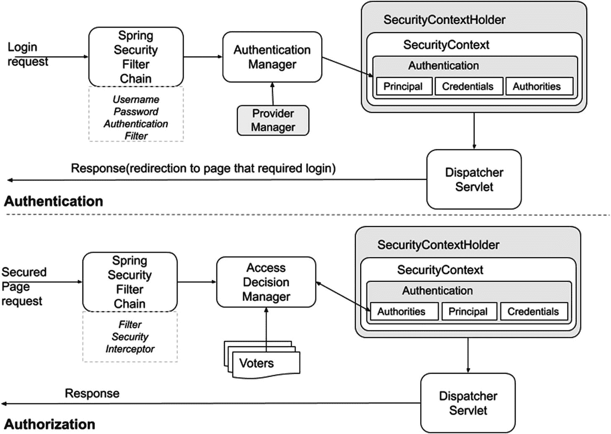
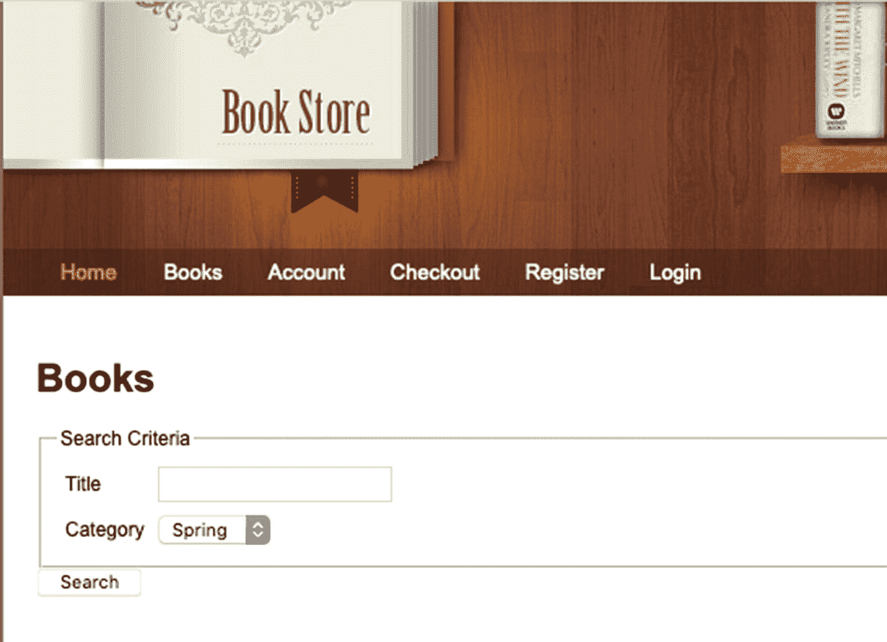
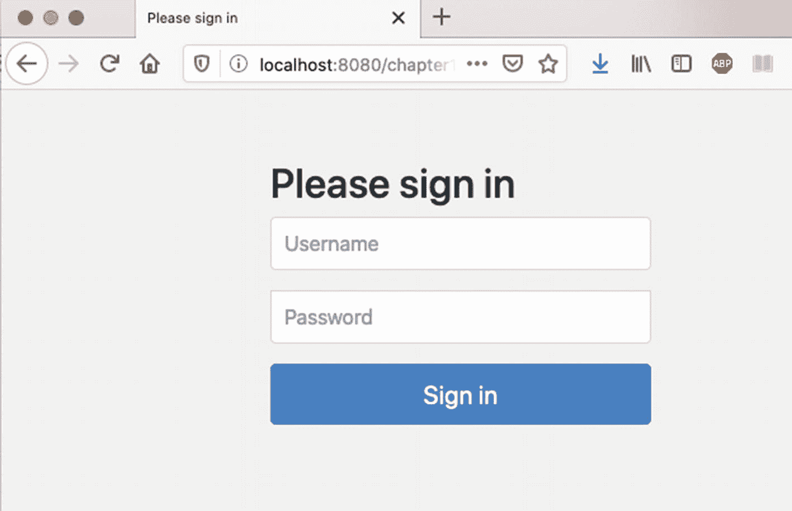

# 十二、Spring Security

据说信息就是力量。如今，当所有的 web 应用都托管在云中，部署在别人设计的容器中，并且希望得到安全保护和审计时，这种情况就更加真实了。开发人员至少可以保证密码的安全。大多数 web 应用都有任何人都可以看到的公共页面和为经过验证的用户保留的私有页面。例如，书店应用应该有添加、编辑和删除图书条目的页面，这些页面只对具有管理角色的用户可用。在前面的章节中，Spring MVC 被用来构建一个 Spring web 应用。Spring Security 是保护 Spring web 应用的最佳框架。

Spring Security 是一个高度可定制的认证和访问控制框架。这个框架是基于 Acegi security， <sup>1</sup> 编写的，当时 Spring 还在襁褓中。它为使用 Spring 框架构建的 Java 企业应用提供了强大而灵活的安全解决方案。Spring Security 为身份验证、授权和防范常见攻击提供了全面的支持。它还提供了与其他库的集成，以简化其使用。

这一章详细介绍了保护 Spring web 应用的不同方法。让我们从几个关键的安全术语和原则开始。

## 安全基础知识

访问 web 应用并能执行操作的实体被称为**主体**。委托人使用被称为**凭证**的标识密钥来标识自己。当访问 web 应用时，计算机的浏览器会创建一个小的信息包并存储在您的系统中。这被称为 **cookie** *。<sup>2</sup>cookie 可以存储个性化信息(如语言和主题)，以便定制您的下次访问。在项目中搜索本书的`CookieResolver`。这是一个典型的 Spring bean 类型，旨在创建一个名为`org.springframework.web.servlet.i18n.CookieLocaleResolver.LOCALE`的 cookie 来存储您的首选语言环境。这里提到的 cookie 名称是 Spring 设置的默认名称，但是可以在为`CookieResolver` bean 配置时进行定制。这些 cookies 被称为**持久型**，即使你关闭了浏览器，它们仍然在运行。它们作为文件存储在浏览器的一个子文件夹中，直到您手动删除它们，或者您的浏览器根据永久 cookie 文件中包含的过期时间删除它们。一些 web 应用使用这种类型的 cookies 来存储您的凭据，因此您不必在每次使用网站时都键入它们。

非永久性的 cookie 被称为**会话 cookie**，它们的生命周期由 HTTP 用户会话的生命周期决定。HTTP 用户会话在您登录 web 应用时开始，在您注销时结束。有些应用还会在页面关闭时结束用户的会话。存储在会话 cookie 中的信息在站点的页面之间共享。购物网站使用这种类型的 cookies 来存储您添加到虚拟购物车中的产品。

当用户登录时，服务器会在您的浏览器中设置一个临时 cookie，以记住您当前已登录，并且您的身份已得到确认。会话 cookies 也适用于存储凭证，因为它们缩短的生命周期也缩短了它们被劫持的时间间隔。 <sup>3</sup>

确认身份的过程称为**认证**，包括对照服务器数据库检查用户提供的凭证。最基本的身份验证类型需要用户 id 和密码，它依赖于单一的身份验证因素。它是一种**的单因素认证**。用户通过认证后，通常会经历一个**授权**的过程。需要这个过程来确定用户应该能够访问的应用部分。例如，书店应用的普通用户不应该被允许编辑或删除书籍。用户可以访问的应用部分通常由**角色**描述。

Spring Security 框架提供了独立配置认证和授权的可能性。由于是松散耦合的，其中一个或两个都可以被这些服务的外部提供者替换。Spring Framework 还支持 web 请求级别、服务方法和单个域对象上的授权。有了如此多的可能性，难怪 Spring Security 几乎成了保护 Spring 应用的默认选择。

## 最低限度的 Spring Web 安全性

Spring MVC 是一个非常强大和通用的框架，通过实现`org.springframework.web.servlet.HandlerInterceptor`和在 HTTP 用户会话中存储凭证，可以实现最小的限制。

可以在 Spring MVC 配置中注册`org.springframework.web.servlet.HandlerInterceptor`的定制实现，以便在`org.springframework.web.servlet.HandlerAdapter`调用处理程序之前和之后执行代码。这意味着`HandlerInterceptor`中的代码会阻止处理程序的正常执行。因此，使用`HandlerInterceptor`实现最低限度的安全性是可能的。当用户登录时，其信息和凭证存储在 HTTP 会话中。可以编写一个与清单 12-1 非常相似的`HandlerInterceptor`实现来寻找这个属性。

```java
package com.apress.prospringmvc.bookstore.web.interceptor;

import org.springframework.web.servlet.HandlerInterceptor;
// Other imports omitted

public class SecurityHandlerInterceptor implements HandlerInterceptor {

    @Override
    public boolean preHandle(HttpServletRequest request, HttpServletResponse response, Object handler) throws Exception {
        var account = (Account) WebUtils.getSessionAttribute(request, "ACCOUNT_ATTRIBUTE");
        if (account == null) {

            //Retrieve and store the original URL.
            var url = request.getRequestURL().toString();
            WebUtils.setSessionAttribute(request, "REQUESTED_URL", url);
            throw new AuthenticationException("Authentication required.", "authentication.required");
        }
        return true;
    }

}

Listing 12-1SecurityHandlerInterceptor to Control Access to Pages Requiring Authentication

```

当用户试图访问需要认证的页面时，`SecurityHandlerInterceptor`会设置`REQUESTED_URL`属性。这确保了在成功认证后，用户被重定向到他在认证前试图访问的页面。这种配置对于登录过程很重要，因为登录页面必须从这种行为中排除，这就是清单 12-2 中的最后一个`if`语句在`handleLogin(..)`方法中负责的事情。

```java
package com.apress.prospringmvc.bookstore.web.controller;
// Other imports omitted
@Controller
@RequestMapping(value = "/login")
public class LoginController {

    public static final String ACCOUNT_ATTRIBUTE = "account";
    public static final String REQUESTED_URL = "REQUESTED_URL";

    @Autowired
    private AccountService accountService;

    @RequestMapping(method = RequestMethod.GET)
    public void login() {
    }

    @RequestMapping(method = RequestMethod.POST)
    public String handleLogin(@RequestParam String username, @RequestParam String password, HttpSession session)
            throws AuthenticationException {
        var account = this.accountService.login(username, password);
        session.setAttribute(ACCOUNT_ATTRIBUTE, account);
        var url = (String) session.getAttribute(REQUESTED_URL);
        // Remove the attribute
        session.removeAttribute(REQUESTED_URL);
        // Prevent loops for the login page.
        if (StringUtils.hasText(url) && !url.contains("login")) {
            return "redirect:" + url;
        } else {
            return "redirect:/index.htm";
        }
    }
}

Listing 12-2The LoginController Code

Snippet That Ensure No Endless Loop Is Caused When User Logs In

```

由于处理程序方法有多种多样的签名，当访问这些 URL 中的任何一个时，可以使用一个`HttpSession object`作为参数，并且可以从中提取并使用`Account`实例。

必须将一个`SecurityHandlerInterceptor`实例添加到为 Spring 应用配置的拦截器的注册表中。这是通过确保 web 配置类中被覆盖的`addInterceptors(..)`方法包含对它的引用来实现的。清单 12-3 描述了这个配置片段。

```java
package com.apress.prospringmvc.bookstore.web.config;

import org.springframework.web.servlet.config.annotation.InterceptorRegistry;
// Other imports omitted

@Configuration
@EnableWebMvc
@ComponentScan(basePackages = { "com.apress.prospringmvc.bookstore" })
public class WebMvcContextConfiguration implements WebMvcConfigurer {

    // code omitted

     @Override
    public void addInterceptors(InterceptorRegistry registry) {
         // other interceptors omitted
        registry.addInterceptor(new SecurityHandlerInterceptor())
                .addPathPatterns("/customer/account", "/cart/checkout");
    }

}

Listing 12-3Adding a SecurityHandlerInterceptor Instance

to the List of Interceptors

```

这是在 Spring 应用中保护对几个页面的访问的最简单的方法。对于为教学目的构建的简单应用，这很好，因为它清楚地表明了 Spring 是多么强大，但是在实际的生产应用中很少使用这样的实现。此外，还需要编写更多的代码来支持身份验证过程。支持授权需要编写更多的代码，这就是 Spring Security 存在的原因。

## 使用 Spring Security 性

Spring Security 最大的一个优势就是可移植性。它不需要一个特殊的容器来运行。可以通过向应用添加所需的依赖项并配置一些 beans 来设置 Spring Security 性。另一个很大的优势是它的可扩展性:开发人员可以决定如何定义主体、凭证存储在哪里、以什么格式存储、如何做出授权决定等等。此外，由于保护资源是使用代理机制完成的，Spring Security 使得将安全逻辑从应用逻辑中分离出来变得容易，避免了代码混乱和分散。

当为 Spring web 应用配置了 Spring Security 时，在到达`DispatcherServlet,`之前，请求会通过安全过滤器链进行过滤。这些过滤器都是`javax.servlet.Filter`接口的实现。过滤器的顺序很重要，任何过滤器都可以修改请求，然后调用链中的下一个过滤器。Spring 的`ApplicationContext`通过其核心实现`Filter` : `org.springframework.web.filter.DelegatingFilterProxy`与 Servlet 容器的生命周期集成在一起。

通过标准的 servlet 容器机制注册它，所有的工作都可以委托给实现`Filter`的 Spring bean。

当在应用中配置了 Spring Security 时，`DelegatingFilterProxy`将过滤请求的工作委托给一个名为`springSecurityFilterChain`的`org.springframework.security.web.FilterChainProxy`类型的特殊 bean。这个 bean 允许使用它的`org.springframework.security.web.SecurityFilterChain`实例列表委托给许多`Filter`实例。每个`SecurityFilterChain`匹配一个 URL 片配置的应用的一部分。所有 Spring Security `Filter`实现的完整列表及其确切顺序可以在官方参考文档中找到。 <sup>4</sup>

因此，总的来说，这个过滤器链提供了对身份验证的支持，确保授权，在 HTTP 会话中维护`org.springframework.security.core.context.SecurityContext`,并在注销时管理用户会话的有效结束。如果您还记得，`ApplicationContext`是为应用提供配置的中央界面。同样，`SecurityContext`是为应用提供安全配置的中央界面。

表 12-1 按照它们在链中出现的顺序列出了最重要的网络过滤器，并简单解释了它们的职责。

表 12-1

最重要的安全过滤器`springSecurityFilterChain`委托给

<colgroup><col class="tcol1 align-left"> <col class="tcol2 align-left"></colgroup> 
| 

过滤器

 | 

描述

 |
| --- | --- |
| `org.springframework.security.web.access.channel.ChannelProcessingFilter` | 为使用适当的通道传递请求提供支持。安全请求通过安全通道传递。 |
| `org.springframework.security.web.context.request.async.WebAsyncManagerIntegrationFilter` | 提供异步安全请求处理支持。 |
| `org.springframework.security.web.header.HeaderWriterFilter` | 支持在响应中添加安全头，如`X-Frame-Options`、`X-XSS-Protection,`和`X-Content-Type-Options`。 |
| `org.springframework.security.web.context.SecurityContextPersistenceFilter` | 用特定于用户会话的信息填充`SecurityContextHolder`，并在请求之间维护`SecurityContext`。 |
| `org.springframework.security.web.csrf.CsrfFilter` | 为包含 CSRF 令牌的请求提供支持。 <sup>5</sup> |
| `org.springframework.security.web.authentication.logout.LogoutFilter` | 通过调用一组处理程序从安全上下文中清除`Authentication`对象来结束用户会话。在其执行结束时，用户不再被验证；因此，它无法访问安全页面。 |
| `org.springframework.security.web.authentication.UsernamePasswordAuthenticationFilter` | 处理身份验证表单提交。登录表单为此过滤器提供了两个参数:用户名和密码。 |
| `org.springframework.security.web.authentication.ui.DefaultLoginPageGeneratingFilter` | 如果应用不需要登录页面，这个过滤器可以为您生成一个。 |
| `org.springframework.security.web.authentication.ui.DefaultLogoutPageGeneratingFilter` | 如果应用不需要注销页面，这个过滤器可以为您生成一个。大多数应用并不真的需要注销页面。 |
| `org.springframework.security.web.authentication.` `www.BasicAuthenticationFilter` | 为基本身份验证提供支持。 <sup>6</sup> 这种类型的认证涉及到具有带 Base-64 编码值`username:password`的`Authorization`报头的请求。由于身份验证令牌是以明文形式传输的，因此请使用摘要式身份验证而不是基本身份验证。 |
| `org.springframework.security.web.authentication.` `www.DigestAuthenticationFilter` | 为摘要式身份验证提供支持。 <sup>7</sup> 查看前一个表格行。 |
| `org.springframework.security.web.servletapi.SecurityContextHolderAwareRequestFilter` | `SecurityContextHolder`是春安的核心组件。该过滤器提供了实现安全 API 方法的请求包装器。调用这些方法就是用配置、认证和授权信息填充`SecurityContextHolder`，从而配置应用的安全上下文。 |
| `org.springframework.security.web.authentication.AnonymousAuthenticationFilter` | 为匿名用户提供支持。 |
| `org.springframework.security.web.session.SessionManagementFilter` | 为各种与 HTTP 会话相关的功能提供支持，如会话固定保护攻击防御。 <sup>8</sup> |
| `org.springframework.security.web.access.ExceptionTranslationFilter` | 为链中引发的安全异常提供支持。它表示 Java 异常和 HTTP 状态代码之间的链接，需要这些代码来维护用户界面并向用户显示适当的消息。 |
| `org.springframework.security.web.access.intercept.FilterSecurityInterceptor` | 为授权 HTTP 请求提供支持，并引发`AccessDeniedException` s。 |
| `org.springframework.security.web.authentication.switchuser.SwitchUserFilter` | 为用户上下文切换提供支持。具有较高权限的用户可以切换到较低权限的用户。 |

图 12-1 展示了在 web 应用中配置 Spring Security 性时请求处理工作流的高级概述。



图 12-1

Spring Security 的认证和授权过程

图 12-1 描述了 Spring web 应用如何通过 Spring Security 来处理请求。

用户试图访问应用的安全页面。由于页面是安全的，应用将用户重定向到登录页面。用户提供其用户名和密码，并提交登录请求。

登录请求被过滤，并且`springSecurityFilterChain`和处理认证的合适过滤器被识别。在这种情况下，它就是`UsernamePasswordAuthenticationFilter`。这个过滤器使用`AuthenticationManager`来验证凭证。最常用的`AuthenticationManager`实现是`ProviderManager,`，它声明了可用于支持认证过程的已配置`AuthenticationProvider`实例列表。

如果凭证得到验证，就会创建一个`Authentication`实例，并存储在应用的`security context`中。`SecurityContext`包含在`SecurityContextHolder,`中，?? 是 Spring Security 的核心。

### 配置身份验证

`Authentication`实例包含以下信息。

*   用于识别用户的**主体**。在基本的用户/密码认证中，它通常是一个`UserDetails`实例。

*   **凭证**包含密码。为了避免密码被泄露，通常会在用户通过身份验证后清除密码。

*   **权限**代表授予用户的应用权限，也称为**角色**或**范围**。

一旦用户通过身份验证，返回的响应要么是为登录过程配置的默认页面，要么是用户在通过身份验证之前试图访问的页面(如果用户有权访问该页面)。包含在`Authentication`对象中的权限由`AccessDecisionManager`使用投票者列表进行分析，以决定用户是否可以访问所请求的资源。

Spring Security 提供了一种非常实用的方式来配置和定制大多数进程。**在 Spring MVC 应用中，配置 Spring Security 配置需要三样东西:**

*   将`springSecurityFilterChain`与容器 servlet 环境集成。

*   为认证和授权提供安全配置，它定义了应用的`securityContext`。

*   将安全上下文与 web 应用上下文集成。

为了将`springSecurityFilterChain`与容器 servlet 环境集成，必须在配置中添加一个扩展`org.springframework.security.web.context.AbstractSecurityWebApplicationInitializer`的类。清单 12-4 描述了这样一个类。`AbstractSecurityWebApplicationInitializer`的子类注册`DelegatingFilterProxy`以在任何其他注册`filter.`之前使用`springSecurityFilterChain`这是必要的，因为应用上的每个请求都必须被拦截并分析权限。

```java
package com.apress.prospringmvc.bookstore.web.config.sec;

import org.springframework.security.web.context.
 AbstractSecurityWebApplicationInitializer;

class SecurityInitializer extends AbstractSecurityWebApplicationInitializer {
}

Listing 12-4Subclass of AbstractSecurityWebApplicationInitializer

```

必须提供用`@EnableWebSecurity`标注的配置类来配置`securityContext`。为了帮助开发人员轻松创建这个类，Spring Security 提供了`org.springframework.security.config.annotation.SecurityConfigurer`接口和多个实现，这些实现已经包含了开箱即用的默认实现，因此所需的定制是最少的。

为 web 应用配置 Spring Security 性最简单的方法是扩展`WebSecurityConfigurerAdapter`并为`configure(AuthenticationManagerBuilder auth)`方法提供一个实现来配置`AuthenticationManagerBuilder`。Spring Security 使用这个构建器创建一个对用户进行认证的`org.springframework.security.authentication.AuthenticationManager`。

Spring 支持多种认证机制: <sup>9</sup> Basic、Form、OAuth、X.509、SAML，但是对于本章，重点在于使用用户名和密码设置表单认证。

对于简单的小型应用，内存数据库足以存储用户名和凭证。即使数据库在内存中，密码也不应该以明文存储，这就是为什么 Spring Security `PasswordEncoder`实现之一应该对密码应用散列函数。在清单 12-5 中，`org.springframework.security.crypto.bcrypt.BCryptPasswordEncoder`在将密码文本存储到数据库之前对其应用 BCrypt 强散列函数。

出于测试目的，Spring Security 仍然支持`org.springframework.security.crypto.password.NoOpPasswordEncoder`，这是一个不做任何事情并以明文形式保存密码的实现。但是，该类被标记为 deprecated，因此将来可能会被移除。

```java
package com.apress.prospringmvc.bookstore.web.config.sec;

import org.springframework.security.config.annotation.web.configuration.
 EnableWebSecurity;
import org.springframework.security.config.annotation.web.configuration.
 WebSecurityConfigurerAdapter;
import org.springframework.security.config.annotation.authentication.
  builders.AuthenticationManagerBuilder;
import org.springframework.security.crypto.bcrypt.BCryptPasswordEncoder;
import org.springframework.security.crypto.password.PasswordEncoder;
import com.apress.prospringmvc.bookstore.util.ConfigurationException;
// Other imports omitted

@Configuration
@EnableWebSecurity
public class SecurityConfiguration extends WebSecurityConfigurerAdapter {

    @Autowired
    public void configureGlobal(AuthenticationManagerBuilder auth) {
        try {
            PasswordEncoder passwordEncoder = new BCryptPasswordEncoder();
            auth.inMemoryAuthentication()
                .passwordEncoder(passwordEncoder)
                .withUser("john")
                    .password(passwordEncoder.encode("doe"))
                    .roles("USER")
                .and().withUser("jane")
                    .password(passwordEncoder.encode("doe"))
                    .roles("USER", "ADMIN")
                .and().withUser("admin")
                    .password(passwordEncoder.encode("admin"))
                    .roles("ADMIN");
        } catch (Exception e) {
            throw new ConfigurationException(
                    "In-Memory authentication was not configured.", e);
        }
    }

    // code omitted
}

Listing 12-5Configuration of an AuthenticationManager by Extending WebSecurityConfigurerAdapter

```

每个用户在应用中都被分配了一个角色。角色封装了用户可以在应用中执行的操作。大多数应用至少有两个角色。对于书店应用，`ADMIN`角色被分配给可以添加、编辑和删除图书条目的用户。可以查看和订购书籍的用户拥有`USER`角色。

一个`GrantedAuthority`实例代表授予一个`Authentication`对象的权限。角色和权限之间没有显著的区别，除了语义和它们的使用方式。角色存储在配置了 Spring Security 的安全位置，通常是数据库。当声明一个内存数据库时，如清单 12-5 所示，可以使用`roles(..)`方法。这个方法由 Spring Security 提供的一个名为`UserDetailsManagerConfigurer`(位于一个包中，这个包的名字很长，与此无关)的构建器类提供，用来创建`UserDetails`实例，封装允许访问应用的用户的认证数据。角色不能为空，角色名**不能以`ROLE_`开头，因为`roles(..)`方法是`UserDetailsManagerConfigurer`类中声明的`authorities(..)`方法的快捷方式，在角色名前面加上`ROLE_`。因此，清单 12-5 中的代码也可以按照清单 12-6 中的方式编写。有异曲同工之妙。**

```java
package com.apress.prospringmvc.bookstore.web.config.sec;

// Imports omitted (view Listing 12-3)

@Configuration
@EnableWebSecurity
public class SecurityConfiguration extends WebSecurityConfigurerAdapter {

    @Autowired
    public void configureGlobal(AuthenticationManagerBuilder auth) {
        try {
            PasswordEncoder passwordEncoder = new BCryptPasswordEncoder();
            auth.inMemoryAuthentication()
                .passwordEncoder(passwordEncoder)
                    .withUser("john")
                        .password(passwordEncoder.encode("doe"))
                        .authorities("ROLE_USER")
                    .and().withUser("jane")
                        .password(passwordEncoder.encode("doe"))
                        .authorities("ROLE_USER", "ROLE_ADMIN")
                    .and().withUser("admin")
                        .password(passwordEncoder.encode("admin"))
                        .authorities("ROLE_ADMIN");
        } catch (Exception e) {
            throw new ConfigurationException(
                    "In-Memory authentication was not configured.", e);
        }

    }

    // code omitted
}

Listing 12-6Configuration of an AuthenticationManager by Setting Up Authorities

```

角色或权限用在授权过程中，这将在本章后面解释。

当 H2 内存数据库用于存储凭据时，可以通过访问数据库的 H2 web 客户端来检查其内容。要将此 web 客户端添加到您的应用，您必须将`org.h2.server.web.WebServlet`添加到应用，并将其映射到一个安全的 URL。即使密码被加密，保护对数据库的访问仍然是一件必须做的事情。这将在本章后面解释。

`auth.inMemoryAuthentication()`行向`AuthenticationManagerBuilder`添加了内存认证。`withUser(String username)`方法构建一个包含用户核心信息的`org.springframework.security.core.userdetails.UserDetails`实例。出于安全目的，Spring Security 不使用这些实例。它们保存着加载到`Authentication`对象中的信息。`UserDetails`实例由`UserDetailsService`管理`.`开发人员可以提供自己的实现来声明存储和检索认证信息的不同方式。

Spring Security 提供了基于 JDBC(数据库)的`UserDetailsService`。这种方法的限制是数据库必须具有 Spring Security 所要求的结构， <sup>10</sup> 并且必须是 SQL 数据库。但是由于书店应用有自己的保存用户信息的数据库表——`ACCOUNT`表，所以使用该表进行认证也更合适。有两种方法可以做到这一点。第一个是实现一个定制的`UserDetailsService`，它从`ACCOUNT`表中加载用户详细信息。另一种方式是实现定制的`AuthenticationProvider`。

对于大多数应用来说，这种方法是首选的，因为身份验证提供者也可以从外部提供者(例如，像 Google 这样的单点登录提供者这样的外部系统)检索身份验证信息。这允许身份验证过程的外部化。

清单 12-7 描述了在`SecurityConfiguration`类中设置自定义`authentication provider`认证所需的变化。

```java
package com.apress.prospringmvc.bookstore.web.config.sec;

import org.springframework.security.authentication.AuthenticationProvider;
// Other imports omitted

@Configuration
@EnableWebSecurity
public class SecurityConfiguration extends WebSecurityConfigurerAdapter {

    @Autowired
    public void configure(AuthenticationManagerBuilder auth) {
        auth.authenticationProvider(bookstoreAuthenticationProvider());
    }

    @Bean
    public AuthenticationProvider bookstoreAuthenticationProvider(){
        return new BookstoreAuthenticationProvider();
    }

    // code omitted
}

Listing 12-7Custom Implementation of AuthenticationManagerBuilder Using a Database Table

```

`bookstoreAuthenticationProvider` bean 类型是`BookstoreAuthenticationProvider,`，它实现了`AuthenticationProvider`。`AuthenticationProvider`是一个简单的接口，有两个方法。清单 12-8 描述了这个接口的代码。 <sup>11</sup>

```java
package org.springframework.security.authentication;

import org.springframework.security.core.Authentication;
import org.springframework.security.core.AuthenticationException;

// some comments omitted
public interface AuthenticationProvider {
    /**
     * @param authentication the authentication request object.
     * @return a fully authenticated object including credentials.
     * @throws AuthenticationException if authentication fails.
     */
    Authentication authenticate(Authentication authentication)
            throws AuthenticationException;

    /**
     * @param authentication
     * @return <code>true</code> if the implementation can more closely evaluate the
     * <code>Authentication</code> class presented
     */
    boolean supports(Class<?> authentication);
}

Listing 12-8AuthenticationProvider Interface Code

```

`authenticate(..)`方法处理认证请求。在`BookstoreAuthenticationProvider`实现中，代码从`ACCOUNT`表中提取用户，验证密码，并创建`Authentication`对象。

`supports(..)`方法声明了支持的`Authentication`实现的类型。由于使用了使用用户名和密码的简单认证，声明支持的类型是`UsernamePasswordAuthenticationToken`。

清单 12-9 描述了`BookstoreAuthenticationProvider`的完整代码。

```java
package com.apress.prospringmvc.bookstore.web.config.sec;

import com.apress.prospringmvc.bookstore.domain.Account;
import com.apress.prospringmvc.bookstore.service.AccountService;
import org.springframework.beans.factory.annotation.Autowired;
import org.springframework.security.authentication.AuthenticationProvider;
import org.springframework.security.authentication.BadCredentialsException;
import org.springframework.security.authentication.UsernamePasswordAuthenticationToken;
import org.springframework.security.core.Authentication;
import org.springframework.security.core.AuthenticationException;
import org.springframework.security.core.GrantedAuthority;
import org.springframework.security.core.authority.SimpleGrantedAuthority;

// Other imports omitted

public class BookstoreAuthenticationProvider implements AuthenticationProvider {

  private PasswordEncoder passwordEncoder = new BCryptPasswordEncoder();

  @Autowired
  private AccountService accountService;

  @Override
  public Authentication authenticate(Authentication authentication) throws AuthenticationException {
        String username = authentication.getName();
        String password = authentication.getCredentials().toString();

        Account account = accountService.getAccount(username);
        if(account == null) {
            throw new BadCredentialsException(
                    "Authentication failed for " + username);
        }
        if(!passwordEncoder.matches(password, account.getPassword())) {
            throw new BadCredentialsException(
                    "Authentication failed for " + username);
        }
        List<GrantedAuthority> grantedAuthorities = new ArrayList<>();
        account.getRoles().forEach(role ->
            grantedAuthorities.add(new SimpleGrantedAuthority(role.getRole())));
        return new
                UsernamePasswordAuthenticationToken(
                        username, password, grantedAuthorities);
    }

    @Override
    public boolean supports(Class<?> authentication) {
        return authentication.equals(
                UsernamePasswordAuthenticationToken.class);
    }

}

Listing 12-9BookstoreAuthenticationProvider Code

```

### 配置授权

需要在安全配置类中实现的另一个重要方法是`configure(HttpSecurity security)`。这个方法定制了 Spring Security 用来为 HTTP 请求启用 web 安全性的`org.springframework.security.config.annotation.web.builders.HttpSecurity`实例。

`HttpSecurity`安全对象是通用的，可以配置规则来拦截某些 URL，配置登录和注销表单生成，在成功或失败的身份验证请求后重定向，CSRF 保护，等等。决定用户可以发出哪些请求是基于它的权限，这就是授权的意义所在。

默认情况下，Spring Security 要求对所有请求进行身份验证。但是 Spring Security 可以通过按照优先级添加更多的规则来配置不同的规则。列出的截取的 URL 的顺序很重要。模式按照定义的顺序进行评估。这意味着，更具体的模式比不太具体的模式在列表中定义得更高。您可以为需要某种程度安全性的 URL 定义模式，并以一个模式结束列表，该模式允许访问与列表中先前条目不匹配的任何内容。或者，您可以为首先需要公共访问的 URL 定义模式，并以禁止访问与列表中先前条目不匹配的任何内容的模式结束列表。这取决于应用的目的。

清单 12-10 描述了一个简单的 Spring Security 授权，它允许未经认证的用户访问书店应用的所有页面，除了具有`ADMIN`角色的经过认证的用户可以访问的页面。

还有一个额外的`configure(WebSecurity web)`方法。这个方法接受一个类型为`WebSecurity`的参数，并告诉 Spring Security 忽略静态 web 请求(比如*。css，*js，图片等。).没有理由让这些请求通过安全过滤器，因为这只会减慢视图的呈现过程。

```java
package com.apress.prospringmvc.bookstore.web.config.sec;

import org.springframework.security.web.util.matcher.RequestMatcher;
import org.springframework.security.web.util.matcher.AntPathRequestMatcher;
import org.springframework.security.config.annotation.web.builders.WebSecurity;

// Other imports omitted

@Configuration
@EnableWebSecurity
public class SecurityConfiguration extends WebSecurityConfigurerAdapter {

    @Override
    protected void configure(HttpSecurity http) throws Exception {
        http
                .authorizeRequests()
                .antMatchers("/customer/account", "/cart/checkout").authenticated()
                .antMatchers("/book/edit", "/book/delete").hasRole("ADMIN")
                .antMatchers("/customer/delete").hasRole("ADMIN")
                .antMatchers("/**").permitAll();
        }

    @Override
    public void configure(WebSecurity web) throws Exception {
        web.ignoring().antMatchers("/resources/**",img/**", "/styles/**");
    }

  // some code omitted
}

Listing 12-10Spring Security Authorization Configuration for Intercepting URLs Using AntPathRequestMatchers

```

使用清单 12-10 中的配置片段，一个未经认证的用户可以看到图 12-2 中描述的书店应用视图。



图 12-2

非验证用户的书店应用视图

`authorizeRequests()`返回一个`HttpSecurity`的实例，该实例被配置为允许使用`RequestMatcher`实现来限制对请求的访问。清单 12-10 描述了使用`AntPathRequestMatcher`实例来声明一个 URL 模板，请求 URL 应该与该模板匹配。这个类的名字清楚地表明支持 ant 风格的模式。对于每个匹配用`antMatchers(..)`方法声明的模式的请求 URL，应用与返回的匹配器实例相关联的限制。

只有经过身份验证的用户才能访问他们自己的帐户和结帐页面，所以下一行

```java
.antMatchers("/customer/account", "/cart/checkout").authenticated()

```

只允许经过身份验证的用户根据资源的 URL 访问这些资源。

下面一行声明，只有经过身份验证的用户拥有`ADMIN`角色时，才应该处理带有`/book/edit`和`/book/delete`URL 的请求。

```java
.antMatchers("/book/edit", "/book/delete").hasRole("ADMIN")

```

如果没有该角色的用户试图访问这些 URL 中的一个，则会引发异常，并且用户会被重定向到错误页面。

匹配器的顺序很重要。匹配 URL 的第一个声明的模板决定应用于请求的访问规则。

这就是为什么这个配置行`.antMatchers("/**").permitAll()`排在最后。这表明所有剩余的请求都将被解析，而不管用户是否经过身份验证。这些也被称为**公共资源**。

在生产应用中通常不会这样做，在生产应用中最好使用`.antMatchers("/**").denyAll()`来避免暴露任何不应该暴露的内容。

在 Security 4.1.1 中，引入了`MvcRequestMatcher`实现。它通过支持声明模板的扩展和添加对变量的支持，扩展了对 ant 样式模式的支持。

`.antMatchers("/customer/account")`声明请求 URL 与“/客户/账户”字符串的精确匹配。

`.mvcMatchers("/customer/account")`声明更广泛的匹配。URL“/customer/account/”、“/customer/account.pdf”和“/customer/account.html”被视为与此模板匹配。

此外，正如您可能已经注意到的，在`antMatchers`和`mvcMatchers`中声明 URL 模板时支持通配符。

当 URL 模式以“*”结尾时，该模式匹配前缀加一个单个术语(例如，`/h2-console/*`匹配`/h2-console/a`和`/h2-console/20`)。

当以`**`结束一个 URL 模式时，该模式匹配前缀，以及任意数量的术语，整个目录树。所以，`/h2-console/**`匹配`/h2-console/a`，`/h2-console/20`，`/h2-console/a/20`，`/h2-console/1/2/3/4`，还有很多。

可以说,`MvcRequestMatchers`提供了更多的安全性，因为它们包含了使用相同模板的更广泛的 URL 集，并且避免了错误地公开内容。

还有一个参数化版本的`authorizeRequests` (Cutomizer <t>)可以配置认证。使用 lambda，我们可以创建并配置一个专用于声明 URL 拦截规则的</t> `org.springframework.security.config.Customizer<T>`实例，该实例用作它的参数。这提供了更具可读性的配置。前面的配置可以进一步简化，因为所有包含 *edit* 和 *delete* 的 URL 都是为具有`ADMIN`角色的用户保留的，所以我们可以使用一个更通用的配置。

清单 12-10 中的配置因此可以升级到清单 12-11 中描述的配置。

```java
package com.apress.prospringmvc.bookstore.web.config.sec;
import org.springframework.security.web.util.matcher.RequestMatcher;
import org.springframework.security.web.util.matcher.MvcRequestMatcher;

// Other imports omitted

@Configuration
@EnableWebSecurity
public class SecurityConfiguration extends WebSecurityConfigurerAdapter {
    @Override
    protected void configure(HttpSecurity http) throws Exception {
        http
                .authorizeRequests(
                        authorize -> authorize.mvcMatchers("/*/edit/*", "/*/delete/*").hasRole("ADMIN")
                            .mvcMatchers("/customer/account", "/cart/checkout").authenticated()
                            .anyRequest().permitAll()
                );
        }

  // some code omitted
}

Listing 12-11Spring Security authorization Configuration for Intercepting URLs Using MvcRequestMatchers

```

与匹配器相关的规则也是通用的。从 Spring Security 版本开始，Spring EL 表达式可以用作授权机制。像下面这样的构造是正确的，它将对`/h2-console` URL 的访问限制为具有`ADMIN`和`DBADMIN`角色的用户。

```java
.mvcMatchers("/h2-console").access("hasRole('ADMIN') and hasRole('DBADMIN')")

```

前一个配置并不等同于下一个配置，后者将对`/h2-console` URL 的访问限制为`ADMIN`或`DBADMIN`角色的用户。

```java
.mvcMatchers("/h2-console").hasAnyRole("ADMIN", "DBADMIN")

```

使用`hasRole(..)`方法可以限制一个角色。

```java
.mvcMatchers("/h2-console").hasAnyRole("DBADMIN")

```

安全表达式在 Spring Security 标签 <sup>12</sup> 中得到支持，它们在根据角色动态地重新调整返回给用户的视图时非常有用。在 JSP 模板中使用 Spring Security 标记需要在 JSP 页面中声明以下标记库。

```java
<%@ taglib prefix="sec" uri="http://www.springframework.org/security/tags" %>

```

例如，`Logout`菜单项不应该是视图的一部分，除非用户已经过身份验证。注销表单也不应该是视图的一部分。通过将它们封装到一个`<sec:authorize access="isAuthenticated()"> .. </sec:authorize>`元素中，可以对它们进行调整。

还有像`Register`和`Login`这样的菜单项，只有在没有认证用户的情况下才应该呈现。这可以通过将特定的 HTML 元素封装在类似的结构中，但是使用表达式的否定来实现。

使用清单 12-12 中描述的结构可以很容易地做到这一点。

```java
<!-- other taglibs declarations omitted -->
<%@ taglib prefix="sec" uri="http://www.springframework.org/security/tags" %>
<div class="header">
    <!-- other JSP elements omitted -->
    <div class="nav">
        <ul style="float: left;">
             <li class="selected">
                 <a href="${homeUrl}">
                 <spring:message code="nav.home"/>
                 </a>
             </li>
            <!-- other unsecured JSP elements omitted -->
            <sec:authorize access="!isAuthenticated()">
              <li>
                  <a href="<c:url value="/customer/register"/>">
                  <spring:message code="nav.register"/>
                  </a>
              </li>
              <li>
                  <a href="<c:url value="/login"/>">
                  <spring:message code="nav.login"/>
                  </a>
              </li>
            </sec:authorize>
            <sec:authorize access="hasRole('ADMIN')">
              <li>
                  <a href="<c:url value="/customer/list"/>">
                  <spring:message code="nav.admin"/>
                  </a>
              </li>
            </sec:authorize>
            <sec:authorize access="isAuthenticated()">
              <li>

                  <a href="#" onclick="document.getElementById('logout').submit();">
                  <spring:message code="nav.logout"/>
                  </a>
              </li>
             <spring:url value="/logout" var="logoutUrl"/>
               <form action="${logoutUrl}" id="logout" method="post">
                   <input type="hidden" name="${_csrf.parameterName}"
                      value="${_csrf.token}"/>
               </form>
            </sec:authorize>
        </ul>
        <ul style="float: right;">
            <sec:authorize access="isAuthenticated()">
            <li>(<em><sec:authentication property="principal" /></em>)</li>
            </sec:authorize>
            <!-- other unsecured JSP elements omitted -->
        </ul>
    </div>
</div>

Listing 12-12header.jsp Navigation Menu with Security Configurations

```

Spring Security 标签库还提供了访问认证数据的可能性。在清单 12-12 中，最后一个元素由经过认证的用户名填充。

此外，如果您不喜欢在视图模板中使用安全表达式，请在安全配置中为 URL 配置规则，并使用对 URL 的引用。与其写下面的内容，

```java
<sec:authorize access="hasRole('ADMIN')">
  <a href="<c:url value="/book/edit/${book.id}"/>">
<spring:message code="label.edit"/>

```

你可以写这个。

```java
<sec:authorize url="/*/edit/*">
  <a href="<c:url value="/book/edit/${book.id}"/>">
<spring:message code="label.edit"/>

```

在本章开始时，您已经了解到 Spring Security 提供了保护单个对象的方法。这很容易实现，因为安全表达式非常强大，可以访问 beans 和路径变量。因此，假设我们的书店有一本专门为 VIP 用户保留的书，可以配置一个 bean 来限制只有他们才能访问这本书。

```java
http
   .authorizeRequests(
       authorize -> authorize.mvcMatchers("/book/{bookId}")
           .access("bookSecurity.checkVIP(authentication,#bookId)")
       ...
);

```

`access(String)`方法将表示 SpEL 表达式的文本作为参数，该表达式定制类型为`ExpressionUrlAuthorizationConfigurer,`的安全基础设施 bean，该 bean 将基于 SpEL 表达式的基于 URL 的授权添加到应用中。

Spring Security 提供了多种方法来保护对资源的访问，但是建议注意一些细节，因为很容易暴露太多或太少。

清单 12-12 展示了 Spring Security 标签库如何使用 Apache Tiles 动态生成考虑安全设置的视图。这个标记库可以和其他基于 JSP 的模板引擎一起使用。

为了与 Spring 完全集成而设计，百里香提供了一个包含 Spring Security 方言的扩展库。Spring Security 集成模块是 Spring Security 标签库的替代品。它确实有优点，其中之一是没有 CSRF 隐藏元素可以显式地添加到表单中。CSRF 将在本章稍后讨论，但是现在，请看清单 12-13 ，它是清单 12-12 的百里香版本。

```java
<html xmlns:th="http://www.thymeleaf.org"
    xmlns:sec="http://www.thymeleaf.org/thymeleaf-extras-springsecurity5">
<!-- other HTML elements omitted -->
<div class="header">
    <!-- other unsecured HTML elements omitted -->
    <div class="nav">
        <ul style="float: left;">
          <!-- other HTML elements omitted -->
          <li sec:authorize="! isAuthenticated()">
            <a th:href="@{/customer/register}"
                th:text="#{nav.register}">REGISTER</a>
          </li>
          <li sec:authorize="! isAuthenticated()">
            <a th:href="@{/login}"
                th:text="#{nav.login}">LOGIN</a>
          </li>
          <li sec:authorize="isAuthenticated()">
            <a th:href="@{/logout}"
                th:text="#{nav.logout}">LOGOUT</a>
          </li>
        </ul>
        <ul style="float: right;">
          <li sec:authorize="isAuthenticated()">
                (<em sec:authentication="name"></em>)
          </li>
          <!-- other unsecured  HTML elements omitted -->
        </ul>
    </div>
</div>

Listing 12-13Thymeleaf layout.html Navigation Menu with Security Configurations

```

语法稍微好一点，不是吗？

### 配置登录和注销

为了支持简单的开发，Spring Security 自带了默认的登录表单和注销支持。当后端开发人员不想浪费时间设置一个 HTML 页面来测试他的安全设置时，这很有用。一个`HttpSecurity`对象中的大多数方法返回一个对它们自身的引用。这提供了通过将方法链接在一起来配置安全性的机会。类似于`authorizeRequests(..),`登录表单，注销支持可以使用特定于每个目的的`Customizer`实例来配置。清单 12-14 给出了一个非常简单的配置默认表单生成和注销支持的例子。

```java
package com.apress.prospringmvc.bookstore.web.config.sec;

import org.springframework.security.config.Customizer;
// Other imports omitted

@Configuration
@EnableWebSecurity
public class SecurityConfiguration extends WebSecurityConfigurerAdapter {
    @Override
    protected void configure(HttpSecurity http) throws Exception {
        http
            .authorizeRequests(
                authorize -> authorize.mvcMatchers("/*/edit/*",                                 "/*/delete/*")
                    .hasRole("ADMIN")
                    .anyRequest().permitAll()
            ).formLogin(Customizer.withDefaults())
            .logout(Customizer.withDefaults());
    }
    // other code omitted
}

Listing 12-14Default Form Generation and Logout Support Configuration Using Spring Security

```

当书店应用以这种配置启动时，单击`Login`菜单项会打开一个页面，其中有一个非常简单的登录表单。图 12-3 是 HTML 生成的登录页面截图。



图 12-3

Spring Security 生成的注销页面

如果您使用“查看页面源代码”浏览器选项，您还可以查看 HTML 代码。以下是您应该了解/注意的关于此页面的事项列表。

*   生成的登录视图被映射到`/login`。这可以通过调用带有定制实现`Customizer`的`formLogin(..)`来改变，以构建带有不同登录页面映射的`FormLoginConfigurer`实例。

*   生成的表单有两个名为`username`和`password`的字段。这些是默认值。可以通过调用定制实现`Customizer`的`formLogin(..)`方法来改变它们，为`username`和`password`字段构建一个不同名称的`FormLoginConfigurer`实例。

*   该表单包含一个名为“CSRF”的隐藏字段。在 Spring Security 4.3 中，CSRF 保护配置成为防止跨站点请求伪造攻击的默认选项。 <sup>13</sup> 对于测试场景可以将其禁用。

*   提交用户名和密码值的 POST 请求被发送到`/login`，这也是一个默认值。这可以通过使用带有不同登录处理 URL 的`FormLoginConfigurer`实例来定制。

*   登录后，用户被自动重定向到`/`。这可以通过用不同的默认成功 URL 定制一个`FormLoginConfigurer`实例来改变。

*   如果用户无法通过身份验证，则失败 URL 的默认值是`/login?error,`，可以通过使用不同的默认身份验证失败 URL 定制一个`FormLoginConfigurer`实例来更改该值。

*   至于注销支持，它也有自己的默认值。

*   注销用户的 POST 请求被映射到`/logout`。这个默认值可以通过调用带有自定义实现`Customizer`的`logout(..)`方法来更改，以构建带有不同注销 URL 的`LogoutConfigurer`。

*   当用户成功注销后，会被重定向到`/login?logout`。这个值可以通过使用不同的成功注销 URL 定制一个`LogoutConfigurer`实例来更改。

两种配置器类型(`FormLoginConfigurer and LogoutConfigurer`)上有更多的方法，允许为登录和注销配置失败或成功的身份验证处理程序、使会话无效的特殊选项、为注销清除缓存，以及更多您可能会在需要时读到的内容。在此之前，请看清单 12-15 中的代码示例。Spring Security 配置已经过修改，可以定制所有提到的属性，并增加了对 CSRF 保护的支持。

```java
package com.apress.prospringmvc.bookstore.web.config.sec;

import org.springframework.security.config.Customizer;
import org.springframework.security.web.csrf.CsrfTokenRepository;
import org.springframework.security.web.csrf.HttpSessionCsrfTokenRepository;
import org.springframework.security.config.annotation.web.configurers.
   FormLoginConfigurer;
import org.springframework.security.config.annotation.web.configurers.
   LogoutConfigurer;
// Other imports omitted

@Configuration
@EnableWebSecurity
public class SecurityConfiguration extends WebSecurityConfigurerAdapter {
    @Override
    protected void configure(HttpSecurity http) throws Exception {
        http
           .authorizeRequests(
               authorize -> authorize.mvcMatchers("/*/edit/*", "/*/delete/*")
                   .hasRole("ADMIN")
                 .anyRequest().permitAll()
           ).formLogin(
               formLogin -> formLogin.loginPage("/auth")
                   .usernameParameter("user")
                   .passwordParameter("secret")
                   .loginProcessingUrl("/auth")
                   .failureUrl("/auth?auth_error=1")
                   .defaultSuccessUrl("/home")
           )
           .logout(
                logout -> logout.logoutUrl("/custom-logout")
                    .logoutSuccessUrl("/home")
                    .invalidateHttpSession(true)
                    .clearAuthentication(true)
           ).csrf().csrfTokenRepository(repo());
    }

    @Bean
    public CsrfTokenRepository repo() {
        HttpSessionCsrfTokenRepository
            repo = new HttpSessionCsrfTokenRepository();
        repo.setParameterName("_csrf");
        repo.setHeaderName("X-CSRF-TOKEN");
        return repo;
    }
    // other code omitted
}

Listing 12-15Customized Login Form and Logout Support Configuration Using Spring Security

```

在 Spring Security 中，使用缺省值来命名组件是很实用的。任何定制都需要组件来支持——视图、控制器、异常处理程序等等。

清单 12-16 展示了书店应用的`HttpSecurity`对象的完整配置。它的简单性证明了它被设计成使用 Spring 默认配置，同时仍然能够使用与应用整体主题相匹配的定制登录表单。

```java
package com.apress.prospringmvc.bookstore.web.config.sec;

import org.springframework.security.config.Customizer;
import org.springframework.security.web.csrf.CsrfTokenRepository;
import org.springframework.security.web.csrf.HttpSessionCsrfTokenRepository;
import org.springframework.security.config.annotation.web.configurers.
   FormLoginConfigurer;
import org.springframework.security.config.annotation.web.configurers.
   LogoutConfigurer;
// Other imports omitted

@Configuration
@EnableWebSecurity
public class SecurityConfiguration extends WebSecurityConfigurerAdapter {

        @Override
    protected void configure(HttpSecurity http) throws Exception {
        http
            .authorizeRequests(
                authorize -> authorize.mvcMatchers("/*/edit/*", "/*/delete/*")
                        .hasRole("ADMIN")
                      .anyRequest().permitAll()
            ).formLogin(
                 formLogin -> formLogin.loginPage("/login")
                         .failureUrl("/login?auth_error=1")
            ).logout(Customizer.withDefaults())
            .csrf().csrfTokenRepository(repo());
    }

    // other code omitted
}

Listing 12-16Customized Login Form and Logout Support Configuration Using Spring Security

```

即使登录页面被映射到默认的 URL，登录页面也在这里被显式地配置，以告知 Spring Security 提供了登录页面。如果不指定，Spring Security 将生成缺省页面并使用它。

同样，作为定制登录页面*一部分的登录表单必须*声明一个隐藏的 CSRF 字段；否则，请求将无法通过 Spring Security 过滤器链，而是返回一个带有 HTTP 状态代码 403(禁止)的错误页面。

拥有自定义登录表单的好处是，它看起来像是网站的一部分(可以包含公司徽标)，但也可以是国际化的。例如，书店登录定制表单代码如清单 12-17 所示。

```java
<form action="<c:url value="/login"/>" method="post">
  <input type="hidden"
      name="${_csrf.parameterName}"
      value="${_csrf.token}"/>
  <fieldset>
      <legend>
        <spring:message code="login.title" />
      </legend>
      <table>
      <tr>
        <td>
          <spring:message code="account.username"/>
        </td>
        <td>
          <input type="text" id="username"
            name="username"
            placeholder="<spring:message code="account.username"/>"/>
        </td>
      </tr>
      <tr>
        <td>
          <spring:message code="account.password"/>
        </td>
        <td>
          <input type="password" id="password"
            name="password"
            placeholder="<spring:message code="account.password"/>"/>
        </td>
      </tr>
      <tr>
        <td colspan="2" align="center">
         <button id="login">
           <spring:message code="button.login"/>
         </button>
        </td>
      </tr>
      </table>
  </fieldset>
</form>

Listing 12-17login.jsp Custom Login Form

```

当使用百里香叶作为模板引擎时，不需要为登录表单声明隐藏的 CSRF 字段，百里香叶集成模块负责将该字段注入到用`th:action`属性声明的每个表单中。为此，我们只需要配置模板引擎来识别和支持用`sec:`前缀声明的元素。这是通过调用`templateEngine.addDialect(new SpringSecurityDialect())`来配置对 Spring Security 方言的支持来实现的。

CSRF 参数和头名的默认名称在`org.springframework.security.web.csrf.HttpSessionCsrfTokenRepository`类中声明。这种类型的 bean 可以配置为支持不同的 CSRF 参数和头名称。为本章创建的 Spring Security 配置类中配置的名称是默认的:`_csrf`和`X-CSRF-TOKEN`。以下示例使用了不同的头名称。

如果您使用 JavaScript，那么就不可能在 HTTP 参数中提交 CSRF 令牌。由于百里香没有一个表单来添加隐藏字段到页面的头部，必须用两个元条目来丰富，这两个元条目由 CSRF 头部名称和 CSRF 令牌填充。这两个元条目声明了 CSRF 参数和头名称，它们必须与 Spring Security 配置类中声明的相匹配。然后在 JavaScript 代码中提取这些值，并添加到提交的请求的 JSON 主体中。在前面的章节中,“搜索书籍”请求是使用 JavaScript 发送的。因此，必须修改“search.html”页面内容，如清单 12-18 所示，以便在安全的 web 应用中工作。

```java
<!DOCTYPE HTML>
<html xmlns:th="http://www.thymeleaf.org"
 th:with="lang=${#locale.language}"
 th:lang="${lang}"
 xmlns:sec="http://www.thymeleaf.org/thymeleaf-extras-springsecurity5">
<head th:fragment="~{template/layout :: head('Search books')}">
  <meta id="_csrf" name="_csrf" th:content="${_csrf.token}"/>
  <meta id="_csrf_header" name="_csrf_header" th:content="${_csrf.headerName}"/>
</head>

<!-- most of HTML and Javascript code omitted-->
 <script th:inline="javascript">
 /*<![CDATA[*/
 $('#bookSearchForm').submit(function(evt){
      evt.preventDefault();
      var title = $('#title').val();
      var category = $('#category').val();
      var json = { "title" : title, "category" : { "id" : category}};
      var token = $('#_csrf').attr('content');
      var header = $('#_csrf_header').attr('content');

      $.ajax({
          url: $('#bookSearchForm').action,
          beforeSend: function(xhr) {
              xhr.setRequestHeader(header, token);
          },
          type: 'POST',
          dataType: 'json',
          contentType: 'application/json',
          data: JSON.stringify(json),
          success: function(responseData) {
            console.log(responseData); // debugging purposes
            renderBooks(responseData);
          }
      });
  });
  /*]]>*/
 </script>

Listing 12-18search.html with CSRF Protection

```

到目前为止，在本章中，Spring Security 上下文被配置并与容器 servlet 环境集成，但是安全上下文没有与应用上下文正确集成。Spring 是智能的，它会在被配置为要扫描的包中挑选出所有标有`@Configuration`的文件。但是如果您有一个多层应用，那么 Spring Security beans 应该放在哪里呢？在根 web 应用上下文中还是在 dispatcher servlet 上下文中？

这个问题的答案取决于应用的请求和架构。

*   如果不需要应用上下文层次结构，则不需要特殊配置；但是要确保扫描了声明安全配置类的包。

*   如果需要应用上下文层次结构，有两种情况。
    *   假设有服务层，可以直接访问吗？它需要被保护吗？那么安全配置类应该是根应用上下文的一个组件，这样服务组件也可以得到保护。

    *   如果只能通过 web 应用访问安全配置，那么应该将安全配置类设置为 servlet 应用上下文的一个组件。

让我们假设我们需要前面列表中最后一个场景的配置。这是通过将安全配置类添加到`WebApplicationInitializer`实现中来实现的。对于不专门通过 web 层接收请求的复杂应用，可以将安全配置类添加为根上下文类，但是对于我们简单的书店应用，将其添加为 servlet 上下文类是合理的。清单 12-19 描述了将安全性集成到 servlet 应用上下文中的配置片段。

```java
package com.apress.prospringmvc.bookstore.web.config;

import org.springframework.security.config.Customizer;
import org.springframework.security.web.csrf.CsrfTokenRepository;
import org.springframework.security.web.csrf.HttpSessionCsrfTokenRepository;
import org.springframework.security.config.annotation.web.configurers.
   FormLoginConfigurer;
import org.springframework.security.config.annotation.web.configurers.
   LogoutConfigurer;
// Other imports omitted

public class BookstoreWebApplicationInitializer
     extends AbstractAnnotationConfigDispatcherServletInitializer {

    @Override
    protected Class<?>[] getRootConfigClasses() {
        return new Class<?>[]{
                DbConfiguration.class,
                JpaConfiguration.class};
    }

    @Override
    protected Class<?>[] getServletConfigClasses() {
        return new Class<?>[]{
                WebMvcContextConfiguration.class,
                SecurityConfiguration.class};
    }

    @Override
    protected String[] getServletMappings() {
        return new String[]{"/"};
    }

    @Override
    protected Filter[] getServletFilters() {
        CharacterEncodingFilter cef = new CharacterEncodingFilter();
        cef.setEncoding("UTF-8");
        cef.setForceEncoding(true);
        return new Filter[]{new HiddenHttpMethodFilter(), cef};
    }

@Override
    public void onStartup(ServletContext servletContext) throws ServletException {
        super.onStartup(servletContext);
        ServletRegistration.Dynamic servlet = servletContext
                .addServlet("h2-console", new WebServlet());
        servlet.setLoadOnStartup(2);
        servlet.addMapping("/h2-console/*");
    }
}

Listing 12-19WebApplicationInitializer Implementation Class with Spring Security

```

在清单 12-19 中，有一个额外的方法需要解释。`onStartup(ServletContext)`将`org.h2.server.web.WebServlet`添加到 Spring 应用上下文，并将其映射到`/h2-console/*` URL。这个 servlet 是 H2 库的一部分，为应用中使用的内存数据库提供了一个 web 客户端。本章的“配置身份验证”一节中首先提到了这个 servlet。您可以使用这个 web 客户端来查询应用的所有表中的信息，但是如果您想看看加密的密码值是什么样子，尤其是`ACCOUNT`表。

`servlet.setLoadOnStartup(2);`方法设置加载这个 servlet 的优先级。任何大于或等于零的值都意味着这个 servlet 必须在容器调用了为`ServletContext`在其`ServletContextListener.contextInitialized(…` `)`方法中配置的所有`ServletContextListener`对象之后进行初始化。这意味着这个 servlet 是在加载了完整的 Spring 应用上下文之后加载的。

因为它提供了对敏感用户数据的访问，所以这个 servlet 的 URL 应该是安全的；最好只有`ADMIN`用户能够访问它。这里要提到的另一件事是，这个 servlet 使用表单来发送和检索数据，它不是应用的一部分。这意味着这些表单中没有 CSRF 令牌，也没有办法修改它们。这意味着必须对所有以`/h2-console/`开头的 URL 禁用 CSRF 保护。这是通过调用`configure(HttpSecurity)`方法中`CsrFConfigurer`的另一个方法来完成的。

```java
protected void configure(HttpSecurity http) throws Exception {
  http
      .authorizeRequests(..)
      .formLogin(..).logout(Customizer.withDefaults())
      .csrf()
          .csrfTokenRepository(repo())
          //don't apply CSRF protection to /h2-console
          .ignoringAntMatchers("/h2-console/**");
}

```

您可能已经注意到，在清单 12-16 中，URL“/customer/account”不在被配置为安全的特定 URL 模式中，尽管它应该只对经过身份验证的用户可用。这是为了展示如何使用 Spring Security 性在方法级别应用安全性。

### 安全方法

URL 安全规则应用于端点，因此它们应用于匹配端点的所有控制器方法，而无需在控制器中添加任何额外的配置。保护方法需要用特殊的安全注释来注释控制器方法。在一个地方声明所有的安全性(security configuration 类)有一定的吸引力，因为它与代码的其余部分是分离的，但是它适合于小型、简单的应用。当应用增长时，将授权规则放在受保护的代码附近可能更有意义。在过去，安全方法的一个额外优势是可以使用 SpEL，但是由于 SpEL 现在可以与`MvcMatchers`一起使用，所以只保留了接近安全代码的优势。

保护方法是通过使用 AOP 代理在幕后完成的。标记需要由安全代理调用的方法是通过一些注释来完成的。

*   `@Secured`(来自`org.springframework.security.access.annotation`包)是一个 Spring Security 注释，它定义了方法的安全配置属性列表，比如角色。当安全配置类用`@EnableGlobalMethodSecurity(secured = true)`注释时，这个注释被选中。这个注释不支持 SpEL 表达式，所以现在很少使用。

*   `@RolesAllowed`(来自`javax.annotation.security)`是 JSR-250<sup>??【14】</sup>相当于`@Secured`的注解。当安全配置类用`@EnableGlobalMethodSecurity(jsr250Enabled = true)`和项目类路径中的 JSR-250 库进行注释时，这个注释被选中。

*   `@PreAuthorize`(从`org.springframework.security.access.prepost package)`指定一个方法访问控制 SpEL 表达式，对其进行评估以决定是否执行该方法。当安全配置类用`@EnableGlobalMethodSecurity(prePostEnabled = true)`注释时，这个注释被选中。

*   `@PostAuthorize`(来自`org.springframework.security.access.prepost`包)指定一个方法访问控制 SpEL 表达式，该表达式在方法执行后被评估。当安全配置类用`@EnableGlobalMethodSecurity(prePostEnabled = true)`注释时，这个注释被选中。这在实现域级安全性时非常有用。使用`@PostAuthorize`声明的规则测试返回对象的所有权，如果检查失败，则不返回对象。

*   `@PostFilter`(来自`org.springframework.security.access.prepost`包)指定一个方法访问控制 SpEL 表达式，该表达式在方法执行后被求值，结果是一个集合。SpEL 表达式可以修改集合，并在返回集合之前删除用户无权访问的对象。当安全配置类用`@EnableGlobalMethodSecurity(prePostEnabled = true)`注释时，这个注释被选中。(还有一个`@PreFilter`注释，它在被注释的方法操作集合之前，根据授权表达式过滤集合。)

安全注释可以放在类和方法级别，方法级别的表达式覆盖类中的表达式。当您在单个控制器中声明了所有管理功能时，在类级别使用安全性是非常有用的。

JSR-250 库包含一小组安全注释(例如，`@DenyAll`、`@PermitAll`)，这些注释在 Spring Security 中没有对应项，因为使用 Spring Security 表达式可以获得相同的效果。提到 JSR-250 注释是因为你可能在混合使用 JEE 和 Spring 的项目中找到它们，所以你应该知道 Spring Security 也可以被配置为支持它们，但是本章的重点是 Spring Security 注释。

使用带有 URL“/customer/Account”的 HTTP GET 请求来检索 Account 页面的内容。清单 12-20 中描述了处理这个请求的方法。

```java
package com.apress.prospringmvc.bookstore.web.controller;

import org.springframework.security.access.prepost.PreAuthorize;
import java.security.Principal;

// other imports omitted

@PreAuthorize(“isAuthenticated()”)
@Controller
@RequestMapping("/customer/account")
public class AccountController {

    @GetMapping
    public String index(Model model, Principal activeUser) {
        Account account = accountRepository.findByUsername(activeUser.getName());
        model.addAttribute("account", account);
        model.addAttribute("orders", this.orderRepository.findByAccount(account));
        model.addAttribute("fileOrders", getAsWebFiles());
        return "customer/account";
    }

    // other code omitted
}

Listing 12-20Handler Method for "/customer/account"

```

该方法声明了一个类型为`Principal`的参数，Spring 用当前经过身份验证的用户主体注入该参数。这是必需的，因为从数据库中提取帐户详细信息需要用户名。具有讽刺意味的是，该方法不是为未经身份验证的用户执行的。如果这个请求是由未经验证的用户发出的，Spring 就找不到主体；所以参数是`null,`并抛出一个`NullPointerException`。尽管如此，将内部异常公开并不是一个好的做法，所以保护该方法是必须的。

现在有趣的是，这种方法可以通过多种方式来保护。在接下来的例子中，假设安全配置类被配置为支持提到的注释。

*   `@PreAuthorize("isAuthenticated()")`只有经过认证的用户才能访问该方法。如果一个未经身份验证的用户试图访问帐户页面，就会发出请求，但是由于这个注释，它会被一个安全的代理截获，该代理检查是否有一个经过身份验证的用户，如果没有，就会抛出`AccessDeniedException`。配置这类异常处理的常见方式是声明将`AccessDeniedException`映射到`login`视图的`SimpleMappingExceptionResolver,`，以及一条用户友好的错误消息，最好是国际化的消息。这个 bean 将异常添加到视图的模型中，JSP taglib 元素的组合可以显示当前地区的消息。在清单 12-21 中，显示了一个代码片段，描述了 Spring web configuration 类中这个 bean 的声明。在清单 12-22 中，您可以看到在 HTML 登录页面中显示错误消息的 JSP 代码。

*   由于我们知道 Account 表中的所有用户都有其中一个角色，所以这个表达式也适用。有趣的事实:与 JSR-250 相当的是`@RolesAllowed({"USER", "ADMIN"})`。

*   `@PreAuthorize("hasRole('USER') or hasRole('ADMIN')")`

*   `@PreAuthorize("hasAnyRole('USER','ADMIN')")`

```java
<%@taglib prefix="c" uri="http://java.sun.com/jsp/jstl/core"%>
<%@taglib prefix="spring" uri="http://www.springframework.org/tags" %>

<c:if test="${exception ne null}">
    <div class="error">
        <spring:message code="authentication.required"
            text="${e.getMessage}" htmlEscape="true"/>
    </div>
</c:if>
<!-- rest of this template omitted -->

Listing 12-22JSP Code to Show an Error Requiring User Authentication in the login.jsp Page

```

```java
package com.apress.prospringmvc.bookstore.web.config;
import
  org.springframework.web.servlet.handler.SimpleMappingExceptionResolver;
// other imports omitted
@Configuration
@EnableWebMvc
public class WebMvcContextConfiguration implements WebMvcConfigurer {

    Bean
    public SimpleMappingExceptionResolver simpleMappingExceptionResolver() {
        SimpleMappingExceptionResolver exceptionResolver = new SimpleMappingExceptionResolver();
        Properties mappings = new Properties();
        mappings.setProperty("AccessDeniedException", "login");

        Properties statusCodes = new Properties();
        mappings.setProperty("login", String.valueOf(HttpServletResponse.SC_UNAUTHORIZED));

        exceptionResolver.setExceptionMappings(mappings);
        exceptionResolver.setStatusCodes(statusCodes);
        return exceptionResolver;
    }
        // other code omitted
}

Listing 12-21SimpleMappingExceptionResolver to Handle AccessDeniedException

```

`@Secured`是初始安全注释，不支持 SpEL 表达式。`@PreAuthorize`是 Spring Security 3 中新增的，功能强大。`@PreAuthorize`支持使用 SpEL 声明访问规则，因此您可以尽情发挥创造力。

“/客户/列表”也不安全。该页面显示 ACCOUNT 表中的所有用户，应该只有具有 ADMIN 角色的用户可以访问。这可以通过用@Secured({"ROLE_ADMIN" })或@ pre authorize(" has ROLE(' ADMIN '))"`.`注释该方法来轻松设置

但是让我们假设我们想要确保只有名为“admin”的管理员用户可以访问该页面。唯一适合这项工作的注释是`@PreAuthorize`,因为它可以解释这样的表达式。

```java
 @PreAuthorize("hasRole('ADMIN') and principal == 'admin'").

```

保护方法为 web 应用增加了一层额外的安全性。因为支持使用 SpEL 表达安全规则，所以可以用非常具体和精细的方式控制访问。

所以，好好享受保护东西的乐趣吧！

## 保护 Spring Boot Web 应用

保护 Spring Boot web 应用与保护 Spring MVC 应用没有什么不同。但是有一些事情要记住。一旦 security starter 库作为依赖项被添加，对应用的公共访问就不存在了，任何 URL 都会重定向到默认的 Spring Security 登录生成的表单。如果您想允许访问任何内容，您必须提供一个配置。

没有必要将`springSecurityFilterChain`与容器 servlet 环境集成，因为您使用的是 Spring Boot 支持的嵌入式服务器之一。因此，不需要类扩展`AbstractSecurityWebApplicationInitializer`。

没有必要将您的配置类与 web 应用上下文显式集成。

这就是全部了。在 Spring Boot Web 应用中配置 Spring Security 恢复如下。

*   将`spring-boot-starter-security`依赖项添加到您的配置中

*   编写一个扩展`WebSecurityConfigurerAdapter`的 Spring Security 配置类(与带有经典设置的 Spring MVC 应用的方式相同；添加用于启用 web 安全性、方法安全性、配置 URL 匹配等的注释。)

*   添加您的定制`AuthenticationProvider`实现(如果您有)

*   修改您的视图以保护敏感内容

如果您使用百里香，不要忘记向模板引擎注册 Spring Security 方言。

## 摘要

本章介绍了 Spring web 应用环境中 Spring Security 性的基本部分。我们研究了 Spring Security 如何与经典的 Spring MVC 应用集成。介绍了 cookies、会话、身份验证、授权、主体和权限等核心概念，并解释了它们在保护 web 应用中的作用。

我们展示了如何修改 Apache Tiles 和 Thymeleaf 视图模板来考虑安全性设置。这意味着为用户提供的服务取决于他们在应用中的角色。

简单介绍了常见类型的攻击，如会话劫持和 CSRF，以及 Spring Security 提供的防止这些攻击的方法。

还讨论了 Spring Boot web 应用上下文中的 Spring Security 性，并明确了开发人员需要提供的保护应用的最小操作集。

我们使用了一个带有密码散列的内存数据库来保存身份验证数据，然后展示了如何实现一个定制的身份验证提供程序来使用应用中的一个现有表。

<aside aria-label="Footnotes" class="FootnoteSection" epub:type="footnotes">Footnotes 1

[`https://spring.io/blog/2007/01/25/why-the-name-acegi`](https://spring.io/blog/2007/01/25/why-the-name-acegi)

  2

[`https://www.allaboutcookies.org/`](https://www.allaboutcookies.org/)

  3

[`https://owasp.org/www-community/attacks/Session_hijacking_attack`](https://owasp.org/www-community/attacks/Session_hijacking_attack)

  4

[`https://docs.spring.io/spring-security/site/docs/current/reference/html5/#servlet-security-filters`](https://docs.spring.io/spring-security/site/docs/current/reference/html5/%2523servlet-security-filters)

  5

[`https://www.owasp.org/index.php/Cross-Site_Request_Forgery_(CSRF)`](https://www.owasp.org/index.php/Cross-Site_Request_Forgery_%2528CSRF%2529)

  6

[`https://tools.ietf.org/html/rfc2617`](https://tools.ietf.org/html/rfc2617)

  7

[`https://tools.ietf.org/html/rfc2617`](https://tools.ietf.org/html/rfc2617)

  8

[`https://owasp.org/www-community/attacks/Session_fixation`](https://owasp.org/www-community/attacks/Session_fixation)

  9

[`https://docs.spring.io/spring-security/site/docs/current/reference/html5/#servlet-authentication`](https://docs.spring.io/spring-security/site/docs/current/reference/html5/%2523servlet-authentication)

  10

[`https://docs.spring.io/spring-security/site/docs/current/reference/html5/#appendix-schema`](https://docs.spring.io/spring-security/site/docs/current/reference/html5/%2523appendix-schema)

  11

[`https://github.com/spring-projects/spring-security/blob/master/core/src/main/java/org/springframework/security/authentication/AuthenticationProvider.java`](https://github.com/spring-projects/spring-security/blob/master/core/src/main/java/org/springframework/security/authentication/AuthenticationProvider.java)

  12

[`https://docs.spring.io/spring-security/site/docs/3.0.x/reference/taglibs.html`](https://docs.spring.io/spring-security/site/docs/3.0.x/reference/taglibs.html)

  13

[`https://owasp.org/www-community/attacks/csrf`](https://owasp.org/www-community/attacks/csrf)

  14

[`https://jcp.org/en/jsr/detail?id=250`](https://jcp.org/en/jsr/detail%253Fid%253D250)

 </aside>