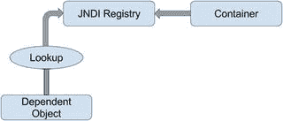

# 三、Spring IoC 和 DI 简介

在第二章中，我们介绍了控制反转的基本原理。实际上，依赖注入是 IoC 的一种特殊形式，尽管你会经常发现这两个术语可以互换使用。在这一章中，我们将更详细地介绍 IoC 和 DI，形式化这两个概念之间的关系，并详细介绍 Spring 是如何融入其中的。

在定义了这两者并查看了 Spring 与它们的关系之后，我们将探索对 Spring 实现 DI 至关重要的概念。本章仅涵盖 Spring 的 DI 实现的基础知识；我们将在第四章讨论更高级的 DI 特性。更具体地说，本章涵盖以下主题:

*   控制概念的反转:在这一节中，我们将讨论各种 IoC，包括依赖注入和依赖查找。本节介绍了各种国际奥委会方法之间的差异以及每种方法的优缺点。
*   Spring 中的控制反转:这一节着眼于 Spring 中可用的 IoC 功能以及它们是如何实现的。特别是，您将看到 Spring 提供的依赖注入服务，包括 setter、constructor 和方法注入。
*   Spring 中的依赖注入:这一节涵盖了 Spring 对 IoC 容器的实现。对于 bean 定义和 DI 需求，`BeanFactory`是应用与之交互的主要接口。然而，除了前几个，本章提供的样本代码的其余部分集中在使用 Spring 的`ApplicationContext`接口，它是`BeanFactory`的扩展，提供了更强大的功能。我们将在后面的章节中介绍`BeanFactory`和`ApplicationContext`的区别。
*   配置 Spring 应用上下文:这一章的最后一部分集中在使用 XML 和注释方法进行`ApplicationContext`配置。Groovy 和 Java 配置将在第四章中进一步讨论。本节首先讨论 DI 配置，然后介绍由`BeanFactory`提供的附加服务，比如 bean 继承、生命周期管理和自动连接。

## 控制反转和依赖注入

其核心是 IoC，因此也是 DI，旨在提供一种更简单的机制，用于提供组件依赖关系(通常称为对象的协作者),并在整个生命周期中管理这些依赖关系。需要某些依赖关系的组件通常被称为依赖对象，或者在 IoC 的情况下，被称为目标。一般来说，IoC 可以分解为两个子类型:依赖注入和依赖查找。这些子类型被进一步分解成 IoC 服务的具体实现。从这个定义中，你可以清楚地看到，当我们在谈论 DI 时，我们总是在谈论 IoC，但当我们在谈论 IoC 时，我们并不总是在谈论 DI(例如，依赖查找也是 IoC 的一种形式)。

## 控制反转的类型

您可能想知道为什么有两种类型的 IoC，以及为什么这些类型被进一步分成不同的实现。这个问题似乎没有明确的答案；当然，不同的类型提供了一定程度的灵活性，但对我们来说，国际奥委会似乎更多的是新旧思想的混合。两种国际奥委会代表了这一点。依赖关系查找是一种更传统的方法，乍一看，Java 程序员似乎更熟悉它。依赖注入，虽然一开始看起来违反直觉，但实际上比依赖查找更灵活、更有用。使用依赖关系查找样式的 IoC，组件必须获取对依赖关系的引用，而使用依赖关系注入，依赖关系由 IoC 容器注入到组件中。依赖性查找有两种类型:依赖性拉取和上下文依赖性查找(CDL)。依赖注入也有两种常见的风格:构造器和设置器依赖注入。

对于本节的讨论，我们并不关心虚构的 IoC 容器是如何知道所有不同的依赖关系的，只是在某个时候，它会执行为每个机制描述的动作。

### 依赖拉动

对于 Java 开发人员来说，依赖拉是最熟悉的 IoC 类型。在依赖项提取中，依赖项是根据需要从注册表中提取的。任何曾经编写过代码来访问 EJB (2.1 或更早版本)的人都使用过依赖拉(即通过 JNDI API 来查找 EJB 组件)。图 3-1 显示了通过查找机制进行依赖拉动的场景。



图 3-1。

Dependency pull via JNDI lookup

Spring 还提供了依赖拉取机制来检索框架管理的组件；你可以在第二章中看到这一点。以下代码示例显示了基于 Spring 的应用中的典型依赖项拉查找:

```java
package com.apress.prospring5.ch3;

import org.springframework.context.ApplicationContext;
import org.springframework.context.support.ClassPathXmlApplicationContext;

public class DependencyPull {
    public static void main(String... args) {
        ApplicationContext ctx = new ClassPathXmlApplicationContext
            ("spring/app-context.xml");

        MessageRenderer mr = ctx.getBean("renderer", MessageRenderer.class);
        mr.render();
    }
}

```

这种 IoC 不仅在基于 JEE 的应用(使用 EJB 2.1 或更早的版本)中很流行，这些应用大量使用 JNDI 查找来从注册中心获得依赖关系，而且对于在许多环境中使用 Spring 也很重要。

### 上下文依赖查找

在某些方面，上下文依赖查找(CDL)类似于依赖拉取，但是在 CDL 中，查找是针对管理资源的容器执行的，而不是从某个中央注册中心执行的，并且通常在某个设定点执行。图 3-2 为 CDL 机构。


图 3-2。

Contextualized dependency lookup

CDL 的工作原理是让组件实现一个类似于下面代码片段中的接口:

```java
package com.apress.prospring5.ch3;

public interface ManagedComponent {
    void performLookup(Container container);
}

```

通过实现这个接口，组件向容器发出信号，表明它想要获得一个依赖项。容器通常由底层应用服务器或框架(例如 Tomcat 或 JBoss)或框架(例如 Spring)提供。下面的代码片段展示了一个简单的`Container`接口，它提供了一个依赖查找服务:

```java
package com.apress.prospring5.ch3;

public interface Container {
    Object getDependency(String key);
}

```

当容器准备好将依赖关系传递给一个组件时，它依次调用每个组件上的`performLookup()`。然后，组件可以通过使用`Container`接口来查找它的依赖项，如下面的代码片段所示:

```java
package com.apress.prospring5.ch3;

public class ContextualizedDependencyLookup
       implements ManagedComponent {
    private Dependency dependency;

    @Override
    public void performLookup(Container container) {
        this.dependency = (Dependency) container.getDependency("myDependency");
    }

    @Override
    public String toString() {
        return dependency.toString();
    }

}

```

### 构造函数依赖注入

当一个组件的依赖项在它的构造函数中被提供给它时，就会发生构造函数依赖注入。组件声明一个构造函数或一组构造函数，将其依赖项作为参数，IoC 容器在实例化发生时将依赖项传递给组件，如下面的代码片段所示:

```java
package com.apress.prospring5.ch3;

public class ConstructorInjection {
        private Dependency dependency;

        public ConstructorInjection(Dependency dependency) {
            this.dependency = dependency;
        }

        @Override
        public String toString() {
            return dependency.toString();
        }
}

```

使用构造函数注入的一个显而易见的结果是，如果没有依赖关系，就无法创建对象；因此，它们是强制性的。

### Setter 依赖注入

在 setter 依赖注入中，IoC 容器通过 JavaBean 样式的 setter 方法注入组件的依赖。组件的设置器公开了 IoC 容器可以管理的依赖关系。以下代码示例显示了一个典型的基于 setter 依赖注入的组件:

```java
package com.apress.prospring5.ch3;

public class SetterInjection {
        private Dependency dependency;

        public void setDependency(Dependency dependency) {
            this.dependency = dependency;
        }

        @Override
        public String toString() {
            return dependency.toString();
        }
}

```

使用 setter 注入的一个显而易见的结果是，可以在没有依赖项的情况下创建对象，并且可以在以后通过调用 setter 来提供它们。

在容器中，`setDependency()`方法公开的依赖需求由 JavaBeans 风格的名称`dependency`引用。在实践中，setter 注入是最广泛使用的注入机制，也是实现起来最简单的 IoC 机制之一。

Spring 支持另一种类型的注入，称为 field injection，但这将在本章稍后介绍，届时您将学习使用`@Autowire`注释进行自动连接。

### 注入与查找

选择使用哪种类型的 IoC 注入或查找——通常不是一个困难的决定。在许多情况下，您使用的 IoC 类型是由您正在使用的容器决定的。例如，如果您正在使用 EJB 2.1 或更早的版本，您必须使用查找样式的 IoC(通过 JNDI)从 JEE 容器获得 EJB。在 Spring 中，除了最初的 bean 查找之外，您的组件及其依赖项总是使用注入式 IoC 连接在一起。

当您使用 Spring 时，您可以访问 EJB 资源，而不需要执行显式查找。Spring 可以充当查找和注入式 IoC 系统之间的适配器，从而允许您通过使用注入来管理所有资源。

真正的问题是:如果可以选择，您应该使用哪种方法，注入还是查找？答案肯定是注射。如果您查看前面代码示例中的代码，您可以清楚地看到，使用注入对组件代码没有任何影响。另一方面，依赖项拉代码必须主动获取对注册表的引用并与之交互以获取依赖项，使用 CDL 需要您的类实现特定的接口并手动查找所有依赖项。当你使用注入时，你的类所要做的最多就是允许依赖项通过使用构造函数或者设置函数被注入。

使用注入，您可以自由地使用与 IoC 容器完全分离的类，IoC 容器手动提供依赖对象及其合作者，而使用查找，您的类总是依赖于容器定义的类和接口。lookup 的另一个缺点是很难在容器之外测试你的类。使用注入，测试您的组件是很简单的，因为您可以通过使用适当的构造函数或设置器自己简单地提供依赖关系。

关于使用依赖注入和 Spring 进行测试的更完整的讨论，请参考第十三章。

基于查找的解决方案必然比基于注入的解决方案更复杂。虽然复杂性没什么可怕的，但我们质疑向依赖管理这样对应用至关重要的过程添加不必要的复杂性的有效性。

除了所有这些原因，选择注入而不是查找的最大原因是它使您的生活更容易。当您使用注入时，您编写的代码要少得多，而且您编写的代码很简单，并且通常可以由一个好的 IDE 自动执行。您会注意到，注入示例中的所有代码都是被动的，因为它不会主动尝试完成任务。您在注入代码中看到的最令人兴奋的事情是对象只存储在一个字段中；从任何注册表或容器中提取依赖项不涉及任何其他代码。因此，代码更简单，更不容易出错。被动代码比主动代码更容易维护，因为很少会出错。考虑以下取自 CDL 示例的代码:

```java
public void performLookup(Container container) {
        this.dependency = (Dependency) container.getDependency("myDependency");
}

```

在这段代码中，可能会出现很多错误:依赖项键可能会改变，容器实例可能是`null`，或者返回的依赖项可能是不正确的类型。我们称这个代码为有许多移动的部分，因为许多东西可能会损坏。使用依赖关系查找可能会分离应用的组件，但它会增加将这些组件重新耦合在一起以执行任何有用任务所需的额外代码的复杂性。

### Setter 注入与构造函数注入

现在我们已经确定了 IoC 的哪种方法更好，您仍然需要选择是使用 setter 注入还是构造函数注入。当您在使用组件之前必须拥有依赖类的实例时，构造函数注入特别有用。包括 Spring 在内的许多容器都提供了一种机制，确保在使用 setter 注入时定义了所有的依赖项，但是通过使用构造函数注入，您以一种与容器无关的方式断言了对依赖项的需求。构造函数注入也有助于实现不可变对象的使用。

Setter 注入在各种情况下都很有用。如果组件向容器公开其依赖关系，但又乐于提供自己的默认值，setter 注入通常是实现这一点的最佳方式。setter 注入的另一个好处是，它允许在一个接口上声明依赖关系，尽管这并不像您最初认为的那样有用。考虑一个带有一个业务方法的典型业务接口，`defineMeaningOfLife()`。如果除了这个方法之外，您还为注入定义了一个 setter，比如`setEncylopedia()`，那么您就要求所有的实现都必须使用或者至少意识到百科全书的依赖性。但是，您不需要在业务接口中定义`setEncylopedia()`。相反，您可以在实现业务接口的类中定义方法。以这种方式编程时，所有最新的 IoC 容器，包括 Spring，都可以在业务接口方面与组件一起工作，但仍然提供实现类的依赖性。这方面的一个例子可以稍微澄清这个问题。考虑下面代码片段中的业务接口:

```java
package com.apress.prospring5.ch3;

public interface Oracle {
    String defineMeaningOfLife();
}

```

注意，业务接口没有为依赖注入定义任何设置器。该接口可以如下面的代码片段所示实现:

```java
package com.apress.prospring5.ch3;

public class BookwormOracle implements Oracle {
    private Encyclopedia encyclopedia;

    public void setEncyclopedia(Encyclopedia encyclopedia) {
        this.encyclopedia = encyclopedia;
    }

    @Override
    public String defineMeaningOfLife() {
        return "Encyclopedias are a waste of money - go see the world instead";
    }
}

```

如您所见，`BookwormOracle`类不仅实现了 Oracle 接口，还定义了依赖注入的 setter。Spring 非常适合处理这样的结构。完全没有必要定义业务接口上的依赖关系。使用接口来定义依赖关系的能力是 setter 注入的一个经常被吹捧的好处，但是实际上，您应该努力保持 setter 只用于接口之外的注入。除非您完全确定特定业务接口的所有实现都需要特定的依赖关系，否则让每个实现类定义自己的依赖关系，并为业务方法保留业务接口。

尽管您不应该总是在业务接口中放置依赖项的 setter，但是在业务接口中放置配置参数的 setter 和 getter 是一个好主意，这使得 setter 注入成为一个有价值的工具。我们认为配置参数是依赖关系的特例。当然，您的组件依赖于配置数据，但是配置数据与您到目前为止看到的依赖类型有很大的不同。我们将很快讨论这些差异，但是现在，考虑下面代码片段中显示的业务接口:

```java
package com.apress.prospring5.ch3;

public interface NewsletterSender {
    void setSmtpServer(String smtpServer);
    String getSmtpServer();

    void setFromAddress(String fromAddress);
    String getFromAddress();

    void send();
}

```

通过电子邮件发送一组时事通讯的类实现了`NewsletterSender`接口。`send()`方法是唯一的业务方法，但是请注意，我们已经在接口上定义了两个 JavaBean 属性。当我们刚刚说不应该在业务接口中定义依赖关系时，我们为什么要这样做呢？原因是这些值，SMTP 服务器地址和发送电子邮件的地址，在实际意义上并不依赖；相反，它们是影响所有`NewsletterSender`接口功能实现的配置细节。这里的问题是:配置参数和任何其他类型的依赖之间有什么区别？在大多数情况下，您可以清楚地看到是否应该将依赖项归类为配置参数，但是如果您不确定，请查找指向配置参数的以下三个特征:

*   配置参数是被动的。在前面代码片段中描述的`NewsletterSender`示例中，SMTP 服务器参数是被动依赖的一个示例。被动依赖不直接用于执行动作；相反，它们在内部使用或被另一个依赖项用来执行它们的操作。在第二章的`MessageRenderer`例子中，`MessageProvider`依赖不是被动的；它执行了`MessageRenderer`完成任务所必需的功能。
*   配置参数通常是信息，而不是其他组件。这意味着配置参数通常是组件完成其工作所需的一些信息。显然，SMTP 服务器是`NewsletterSender`所需的一条信息，但是`MessageProvider`实际上是`MessageRenderer`正常运行所需的另一个组件。
*   配置参数通常是简单值或简单值的集合。这确实是前两点的副产品，但配置参数通常是简单的值。在 Java 中，这意味着它们是一个原语(或相应的包装类)或一个`String`或这些值的集合。简单值一般是被动的。这意味着除了操作它所代表的数据，你不能对一个`String`做太多事情；您几乎总是将这些值用于信息目的，例如，`int`值表示网络套接字应该监听的端口号，或者`String`值表示电子邮件程序应该通过其发送消息的 SMTP 服务器。

当考虑是否在业务接口中定义配置选项时，还要考虑配置参数是适用于业务接口的所有实现还是仅适用于一个实现。例如，在实现`NewsletterSender`的情况下，很明显所有的实现都需要知道发送电子邮件时使用哪个 SMTP 服务器。但是，我们可能会选择保留标记是否从业务接口发送安全电子邮件的配置选项，因为不是所有的电子邮件 API 都支持这一点，并且可以正确地假设许多实现根本不会考虑安全性。

回想一下，在第二章中，选择它来定义业务目的中的依赖关系。这只是为了举例说明，无论如何都不应被视为最佳实践。

Setter 注入还允许您动态交换不同实现的依赖关系，而无需创建父组件的新实例。Spring 的 JMX 支持使这成为可能。setter 注入的最大好处可能是它是注入机制中侵入性最小的。

一般来说，您应该根据您的用例来选择注入类型。基于 Setter 的注入允许在不创建新对象的情况下交换依赖项，还允许您的类选择适当的默认值，而无需显式注入对象。当您希望确保依赖关系被传递给组件时，以及为不可变对象进行设计时，构造函数注入是一个很好的选择。请记住，虽然构造函数注入可以确保向组件提供所有依赖关系，但大多数容器也提供了一种机制来确保这一点，但可能会导致将代码耦合到框架的成本。

## Spring 控制反转

如前所述，控制反转是 Spring 的主要功能。Spring 实现的核心是基于依赖注入，尽管也提供了依赖查找特性。当 Spring 自动向依赖对象提供协作者时，它使用依赖注入来实现。在基于 Spring 的应用中，最好使用依赖注入将合作者传递给依赖对象，而不是让依赖对象通过查找获得合作者。图 3-3 为 Spring 的依赖注入机构。尽管依赖注入是将协作者和依赖对象连接在一起的首选机制，但是您需要依赖查找来访问依赖对象。在许多环境中，Spring 不能通过使用依赖注入来自动连接所有的应用组件，您必须使用依赖查找来访问组件的初始集合。例如，在独立的 Java 应用中，您需要在`main()`方法中引导 Spring 的容器，并获得依赖关系(通过`ApplicationContext`接口)以便以编程方式进行处理。然而，当您使用 Spring 的 MVC 支持构建 web 应用时，Spring 可以通过自动将整个应用粘合在一起来避免这种情况。只要有可能在 Spring 中使用依赖注入，就应该这样做；否则，您可以依靠依赖关系查找功能。在本章的过程中，你将会看到两者都在起作用的例子，当它们第一次出现时，我们将会指出它们。


图 3-3。

Spring’s dependency injection mechanism

Spring 的 IoC 容器的一个有趣特性是，它能够充当自己的依赖注入容器和外部依赖查找容器之间的适配器。我们将在本章后面讨论这个特性。

Spring 支持构造器和设置器注入，并通过大量有用的附加功能支持标准的 IoC 特性集，使您的生活更加轻松。

本章的其余部分介绍了 Spring 的 DI 容器的基础知识，并提供了大量的例子。

## Spring 中的依赖注入

Spring 对依赖注入的支持是全面的，正如你将在第四章中看到的，超越了我们到目前为止讨论过的标准 IoC 特性集。本章的其余部分讲述了 Spring 的依赖注入容器的基础知识，包括 setter、constructor 和 Method Injection，以及如何在 Spring 中配置依赖注入的细节。

### 大豆和大豆工厂

Spring 的依赖注入容器的核心是`BeanFactory`接口。`BeanFactory`负责管理组件，包括它们的依赖关系以及它们的生命周期。在 Spring 中，术语 bean 用来指由容器管理的任何组件。通常，您的 bean 在某种程度上遵循 JavaBeans 规范，但这不是必需的，尤其是如果您计划使用构造函数注入来将 bean 连接在一起。

如果您的应用只需要 DI 支持，您可以通过`BeanFactory`接口与 Spring DI 容器进行交互。在这种情况下，您的应用必须创建一个实现`BeanFactory`接口的类的实例，并用 bean 和依赖信息对其进行配置。完成之后，您的应用可以通过`BeanFactory`访问 beans 并继续处理。

在某些情况下，所有这些设置都是自动处理的(例如，在一个 web 应用中，Spring 的`ApplicationContext`将在应用启动时通过 Spring 提供的在`web.xml`描述符文件中声明的`ContextLoaderListener`类由 web 容器引导)。但是在许多情况下，您需要自己编写设置代码。本章中的所有例子都需要手动设置`BeanFactory`实现。

尽管可以通过编程来配置`BeanFactory`,但更常见的是使用某种配置文件在外部配置它。在内部，bean 配置由实现`BeanDefinition`接口的类的实例来表示。bean 配置不仅存储关于 bean 本身的信息，还存储关于它所依赖的 bean 的信息。对于任何也实现了`BeanDefinitionReader`接口的`BeanFactory`实现类，您可以从配置文件中读取`BeanDefinition`数据，使用`PropertiesBeanDefinitionReader`或`XmlBeanDefinitionReader. PropertiesBeanDefinitionReader`从属性文件中读取 bean 定义，而`XmlBeanDefinitionReader`从 XML 文件中读取。

因此，您可以在`BeanFactory`内识别您的 beans 可以为每个 bean 分配一个 ID 和/或名称。也可以实例化没有任何 ID 或名称的 bean(称为匿名 bean ),或者作为另一个 bean 中的内部 bean。每个 bean 至少有一个名称，但是可以有任意数量的名称(其他名称用逗号分隔)。第一个名称之后的任何名称都被视为同一个 bean 的别名。您使用 bean IDs 或名称从`BeanFactory`中检索 bean，并建立依赖关系(即 bean X 依赖于 bean Y)。

### beanfactory 实现

对`BeanFactory`接口的描述可能看起来过于复杂，但实际上并非如此。看一个简单的例子。假设您有一个模仿神谕的实现，它可以告诉您生命的意义。

```java
//interface
package com.apress.prospring5.ch3;

public interface Oracle {
    String defineMeaningOfLife();
}

//implementation
package com.apress.prospring5.ch3;

public class BookwormOracle implements Oracle {
    private Encyclopedia encyclopedia;

    public void setEncyclopedia(Encyclopedia encyclopedia) {
        this.encyclopedia = encyclopedia;
    }

    @Override
    public String defineMeaningOfLife() {
        return "Encyclopedias are a waste of money - go see the world instead";
    }
}

```

现在让我们看看，在一个独立的 Java 程序中，如何初始化 Spring 的`BeanFactory`并获取`oracle` bean 进行处理。代码如下:

```java
package com.apress.prospring5.ch3;

import org.springframework.beans.factory.support.DefaultListableBeanFactory;
import org.springframework.beans.factory.xml.XmlBeanDefinitionReader;
import org.springframework.core.io.ClassPathResource;

public class XmlConfigWithBeanFactory {

  public static void main(String... args) {
    DefaultListableBeanFactory factory = new DefaultListableBeanFactory();
    XmlBeanDefinitionReader rdr = new XmlBeanDefinitionReader(factory);
    rdr.loadBeanDefinitions(new
      ClassPathResource("spring/xml-bean-factory-config.xml"));
    Oracle oracle = (Oracle) factory.getBean("oracle");
    System.out.println(oracle.defineMeaningOfLife());
  }
}

```

在前面的代码示例中，您可以看到我们正在使用`DefaultListableBeanFactory`，它是 Spring 提供的两个主要`BeanFactory`实现之一，并且我们正在通过使用`XmlBeanDefinitionReader`从 XML 文件中读取`BeanDefinition`信息。一旦创建并配置了`BeanFactory`实现，我们就通过使用名称`oracle`来检索`oracle` bean，这个名称是在 XML 配置文件中配置的。

```java
<?xml version="1.0" encoding="UTF-8"?>

<beans 
    xmlns:xsi="http://www.w3.org/2001/XMLSchema-instance"
    xsi:schemaLocation="http://www.springframework.org/schema/beans
        http://www.springframework.org/schema/beans/spring-beans.xsd">

    <bean id="oracle"
        name="wiseworm"
        class="com.apress.prospring5.ch3.BookwormOracle"/>
</beans>

```

在声明 Spring XSD 位置时，最好不要包含版本号。Spring 已经为您处理了这个解决方案，因为版本化的 XSD 文件是通过`spring.schemas`文件中的指针配置的。该文件驻留在项目中定义为依赖项的`spring-beans`模块中。这也避免了您在升级到 Spring 的新版本时必须修改所有的 bean 文件。

前面的文件声明了一个 Spring bean，给它一个 ID`oracle`和一个名称`wiseworm`，并告诉 Spring 底层实现类是`com.apress.prospring4.ch3.BookwormOracle`。暂时不用太担心配置；我们将在后面的章节中讨论细节。

定义好配置后，运行前面代码示例中显示的程序；您将在控制台输出中看到由`defineMeaningOfLife()`方法返回的短语。

除了`XmlBeanDefinitionReader`，Spring 还提供了`PropertiesBeanDefinitionReader`，它允许您通过使用属性而不是 XML 来管理您的 bean 配置。虽然属性对于小而简单的应用来说是理想的，但是当您处理大量的 beans 时，它们会很快变得很麻烦。因此，除了最普通的应用之外，最好对所有应用都使用 XML 配置格式。

当然，您可以自由定义自己的`BeanFactory`实现，尽管要知道这样做相当复杂；您需要实现更多的接口，而不仅仅是`BeanFactory`来获得与所提供的`BeanFactory`实现相同的功能。如果您想要做的只是定义一个新的配置机制，那么通过开发一个扩展了`DefaultListableBeanFactory`类的类来创建您的定义阅读器，该类实现了`BeanFactory`接口。

### 应用上下文

在 Spring 中，`ApplicationContext`接口是对`BeanFactory`的扩展。除了 DI 服务，`ApplicationContext`还提供其他服务，例如事务和 AOP 服务、国际化消息源(i18n)和应用事件处理等等。在开发基于 Spring 的应用时，建议您通过`ApplicationContext`接口与 Spring 交互。Spring 支持通过手动编码(手动实例化并加载适当的配置)或通过`ContextLoaderListener`在 web 容器环境中引导`ApplicationContext`。从这一点开始，本书中的所有示例代码都使用了`ApplicationContext`及其实现。

## 配置应用上下文

讨论了 IoC 和 DI 的基本概念，并通过一个使用 Spring 的`BeanFactory`接口的简单例子，让我们深入了解如何配置 Spring 应用的细节。在接下来的小节中，我们将介绍配置 Spring 应用的各个方面。具体来说，我们应该把注意力集中在`ApplicationContext`界面上，它比传统的`BeanFactory`界面提供了更多的配置选项。

### 设置 Spring 配置选项

在我们深入配置 Spring 的`ApplicationContext`的细节之前，让我们看一下在 Spring 中定义应用配置的可用选项。最初，Spring 支持通过属性或 XML 文件定义 beans。自从 JDK 5 的发布和 Spring 对 Java 注释的支持，Spring(从 Spring 2.5 开始)在配置`ApplicationContext`时也支持使用 Java 注释。那么，XML 和注释哪个更好呢？关于这个话题有很多争论，你可以在网上找到很多讨论。 <sup>1</sup> 没有确定的答案，每种方法都有利弊。使用 XML 文件可以将所有配置从 Java 代码中具体化，而注释允许开发人员从代码中定义和查看 DI 设置。Spring 还支持在单个`ApplicationContext`中混合使用这两种方法。一种常见的方法是在 XML 文件中定义应用基础设施(例如，数据源、事务管理器、JMS 连接工厂或 JMX ),同时在注释中定义 DI 配置(可注入 bean 和 bean 的依赖项)。然而，无论你选择哪一个选项，坚持下去，并在整个开发团队中清楚地传递信息。就使用的风格达成一致，并在整个应用中保持一致，将使正在进行的开发和维护活动变得更加容易。

为了便于您理解 XML 和注释配置，我们在适当的时候提供了 XML 和注释并列的示例代码，但是本书的重点将放在注释和 Java 配置上，因为 XML 已经在本书以前的版本中讨论过了。

### 基本配置概述

对于 XML 配置，您需要声明应用所需的 Spring 提供的名称空间库。下面的配置示例显示了最基本的示例，它只声明了 bean 的名称空间，供您定义 Spring beans。对于整个示例中的 XML 风格的配置，我们将这个配置文件称为`app-context-xml.xml`。

```java
<?xml version="1.0" encoding="UTF-8"?>

<beans 
    xmlns:xsi="http://www.w3.org/2001/XMLSchema-instance"
    xmlns:c="http://www.springframework.org/schema/c"
    xsi:schemaLocation="http://www.springframework.org/schema/beans
    http://www.springframework.org/schema/beans/spring-beans.xsd">
</beans>

```

除了 beans 之外，Spring 还为不同的目的提供了大量其他名称空间。一些例子包括`ApplicationContext`配置的上下文、`aop`AOP 支持的上下文和`tx`事务支持的上下文。名称空间包含在相应的章节中。

要在应用中使用 Spring 的注释支持，需要在 XML 配置中声明下一个配置示例中显示的标记。我们将这个配置文件称为`app-context-annotation.xml`,用于在整个示例中支持注释的 XML 配置。

```java
<?xml version="1.0" encoding="UTF-8"?>

<beans 
       xmlns:xsi="http://www.w3.org/2001/XMLSchema-instance"
       xmlns:context="http://www.springframework.org/schema/context"
       xmlns:c="http://www.springframework.org/schema/c"
       xsi:schemaLocation="http://www.springframework.org/schema/beans
          http://www.springframework.org/schema/beans/spring-beans.xsd
          http://www.springframework.org/schema/context
          http://www.springframework.org/schema/context/spring-context.xsd">

    <context:component-scan

          base-package="com.apress.prospring5.ch3.annotation"/>

</beans>

```

`<context:component-scan>`标签告诉 Spring 扫描带有`@Component`、`@Controller`、`@Repository`和`@Service`注释的可注入 beans 的代码，并支持指定包(及其所有子包)下的`@Autowired`、`@Inject`和`@Resource`注释。在`<context:component-scan>`标签中，可以使用逗号、分号或空格作为分隔符来定义多个包。此外，该标签支持包含和排除组件扫描，以实现更细粒度的控制。例如，考虑以下配置示例:

```java
<?xml version="1.0" encoding="UTF-8"?>

<beans 
       xmlns:xsi="http://www.w3.org/2001/XMLSchema-instance"
       xmlns:context="http://www.springframework.org/schema/context"
       xmlns:c="http://www.springframework.org/schema/c"
       xsi:schemaLocation="http://www.springframework.org/schema/beans
          http://www.springframework.org/schema/beans/spring-beans.xsd
          http://www.springframework.org/schema/context
          http://www.springframework.org/schema/context/spring-context.xsd">

    <context:component-scan

          base-package="com.apress.prospring5.ch3.annotation">
          <context:exclude-filter type="assignable"
            expression="com.example.NotAService"/>
    </context:component-scan>

</beans>

```

前一个标签告诉 Spring 按照指定的方式扫描包，但是忽略了可分配给表达式中指定的类型的类(可以是类，也可以是接口)。除了排除过滤器，您还可以使用包含过滤器。对于类型，您可以使用 annotation、regex、assignable、AspectJ 或 custom(使用您自己的实现`org.springframework.core.type.filter.TypeFilter`的过滤器类)作为过滤标准。表达式格式取决于您指定的类型。

### 声明 Spring 组件

在开发了某种服务类并希望在基于 Spring 的应用中使用它之后，您需要告诉 Spring 这些 bean 可以注入到其他 bean 中，并让 Spring 为您管理它们。考虑第二章中的例子，其中`MessageRender`输出消息，并依赖`MessageProvider`提供要呈现的消息。以下代码示例描述了这两个服务的接口和实现:

```java
package com.apress.prospring5.ch2.decoupled;

//renderer interface
public interface MessageRenderer {
    void render();
    void setMessageProvider(MessageProvider provider);
    MessageProvider getMessageProvider();
}
// rendered implementation
public class StandardOutMessageRenderer
    implements MessageRenderer {

        private MessageProvider messageProvider;

        @Override
        public void render() {
                if (messageProvider == null) {
                        throw new RuntimeException(
                          "You must set the property messageProvider of class:" 

                          + StandardOutMessageRenderer.class.getName());
                }
                System.out.println(messageProvider.getMessage());
        }

        @Override
        public void setMessageProvider(MessageProvider provider) {
                this.messageProvider = provider;
        }

        @Override
        public MessageProvider getMessageProvider() {
                return this.messageProvider;
        }
}

//provider interface
public interface MessageProvider {
    String getMessage();
}

//provider implementation
public class HelloWorldMessageProvider implements MessageProvider {

    @Override
    public String getMessage() {
        return "Hello World!";
    }
}

```

前面显示的类是`com.apress.prospring5.ch2.decoupled`包的一部分。它们也在本章的项目中使用，因为在真实的生产应用中，开发人员试图重用代码而不是复制代码。这就是为什么，正如你将在获得源代码时看到的，第二章的项目被定义为第三章的一些项目的依赖项。

为了在 XML 文件中声明 bean 定义，使用了`<bean ../>`标记，生成的`app-context-xml.xml`文件现在看起来像这样:

```java
<?xml version="1.0" encoding="UTF-8"?>

<beans 
    xmlns:xsi="http://www.w3.org/2001/XMLSchema-instance"
    xmlns:p="http://www.springframework.org/schema/p"
    xsi:schemaLocation="http://www.springframework.org/schema/beans
        http://www.springframework.org/schema/beans/spring-beans.xsd">

    <bean id="provider"
        class="com.apress.prospring5.ch2.decoupled.HelloWorldMessageProvider"/>

    <bean id="renderer"
        class="com.apress.prospring5.ch2.decoupled.StandardOutMessageRenderer"
         p:messageProvider-ref="provider"/>
</beans>

```

前面的标签声明了两个 beans，一个 ID 为`provider`，实现为`HelloWorldMessageProvider`，另一个 ID 为`renderer`，实现为`StandardOutMessageRenderer`。

从这个例子开始，名称空间将不再被添加到配置样本中，除非引入新的名称空间，因为这将使 bean 定义更加可见。

要使用注释创建 bean 定义，bean 类必须使用适当的原型注释进行注释， <sup>2</sup> ，方法或构造函数必须使用`@Autowired`进行注释，以告诉 Spring IoC 容器查找该类型的 bean，并在调用该方法时将其用作参数。在下面的代码片段中，用于创建 bean 定义的注释带有下划线。原型注释可以将结果 bean 的名称作为一个参数。

```java
package com.apress.prospring5.ch3.annotation;

import com.apress.prospring5.ch2.decoupled.MessageProvider;
import org.springframework.stereotype.Component;
//simple bean

@Component("provider")

public class HelloWorldMessageProvider implements MessageProvider {

        @Override
        public String getMessage() {
                return "Hello World!";
        }
}

import com.apress.prospring5.ch2.decoupled.MessageProvider;
import com.apress.prospring5.ch2.decoupled.MessageRenderer;
import org.springframework.stereotype.Service;
import org.springframework.beans.factory.annotation.Autowired;

//complex, service bean

@Service("renderer")

public class StandardOutMessageRenderer
   implements MessageRenderer {
    private MessageProvider messageProvider;

    @Override
    public void render() {
        if (messageProvider == null) {
            throw new RuntimeException(
            "You must set the property messageProvider of class:"
            + StandardOutMessageRenderer.class.getName());
        }

        System.out.println(messageProvider.getMessage());
    }

    @Override
    @Autowired

    public void setMessageProvider(MessageProvider provider) {
        this.messageProvider = provider;
    }

    @Override
    public MessageProvider getMessageProvider() {
        return this.messageProvider;
    }
}

```

当用这里描述的 XML 配置引导 Spring 的`ApplicationContext`时，在文件`app-context-annotation.xml`中，Spring 将找出那些组件，并用指定的名称实例化 beans:

```java
<?xml version="1.0" encoding="UTF-8"?>

<beans 
       xmlns:xsi="http://www.w3.org/2001/XMLSchema-instance"
       xmlns:context="http://www.springframework.org/schema/context"
       xsi:schemaLocation="http://www.springframework.org/schema/beans
          http://www.springframework.org/schema/beans/spring-beans.xsd

          http://www.springframework.org/schema/context
          http://www.springframework.org/schema/context/spring-context.xsd">

    <context:component-scan

          base-package="com.apress.prospring5.ch3.annotation"/>
</beans>

```

使用任何一种方法都不会影响您从`ApplicationContext`获取 beans 的方式。

```java
package com.apress.prospring5.ch3;

import com.apress.prospring5.ch2.decoupled.MessageRenderer;

import 

org.springframework.context.support.GenericXmlApplicationContext;

public class DeclareSpringComponents {

    public static void main(String... args) {
        GenericXmlApplicationContext ctx = new GenericXmlApplicationContext();
        ctx.load("classpath:spring/app-context-xml.xml");
        ctx.refresh();
        MessageRenderer messageRenderer = ctx.getBean("renderer",
        MessageRenderer.class);
                messageRenderer.render();
        ctx.close();
    }
}

```

代替`DefaultListableBeanFactory`，实例化`GenericXmlApplicationContext`的实例。`GenericXmlApplicationContext`类实现了`ApplicationContext`接口，并且能够从 XML 文件中定义的配置中引导 Spring 的`ApplicationContext`。

您可以将本章提供的源代码中的`app-context-xml.xml`文件与`app-context-annotation.xml`交换，您会发现两种情况产生的结果是一样的:“Hello World！”已打印。唯一的区别是在交换之后，提供功能的 beans 是用`com.apress.prospring5.ch3.annotation`包中的注释定义的。

#### 使用 Java 配置

在第一章中，我们提到过`app-context-xml.xml`可以用一个配置类来代替，而不需要修改代表被创建的 bean 类型的类。当应用需要的 bean 类型是不能修改的第三方库的一部分时，这很有用。这样的配置类用`@Configuration`注释，并且包含用`@Bean`注释的方法，这些方法被 Spring IoC 容器直接调用来实例化 beans。bean 名称将与用于创建它的方法的名称相同。下面的代码示例中显示了该类，方法名带有下划线，以使生成的 beans 的命名更加明显:

```java
package com.apress.prospring5.ch2.annotated;

import 

com.apress.prospring5.ch2.decoupled.HelloWorldMessageProvider;
import com.apress.prospring5.ch2.decoupled.MessageProvider;
import com.apress.prospring5.ch2.decoupled.MessageRenderer;
import com.apress.prospring5.ch2.decoupled.StandardOutMessageRenderer;
import org.springframework.context.annotation.Bean;
import org.springframework.context.annotation.Configuration;

@Configuration
public class HelloWorldConfiguration {

        @Bean
        public MessageProvider provider() {
                return new HelloWorldMessageProvider();
        }

        @Bean
        public MessageRenderer renderer(){
                MessageRenderer renderer = new StandardOutMessageRenderer();
                renderer.setMessageProvider(provider());
                return renderer;
        }
}

```

为了从这个类中读取配置，需要一个不同的`ApplicationContext`实现。

```java
package com.apress.prospring5.ch2.annotated;

import com.apress.prospring5.ch2.decoupled.MessageRenderer;
import org.springframework.context.ApplicationContext;
import org.springframework.context.annotation.AnnotationConfigApplicationContext;
public class HelloWorldSpringAnnotated {

        public static void main(String... args) {
                ApplicationContext ctx = new AnnotationConfigApplicationContext

                                (HelloWorldConfiguration.class);
                MessageRenderer mr = ctx.getBean("renderer", MessageRenderer.class);
                mr.render();
        }
}

```

代替`DefaultListableBeanFactory`，实例化`AnnotationConfigApplicationContext`的实例。`AnnotationConfigApplicationContext`类实现了`ApplicationContext`接口，并且能够从`HelloWorldConfiguration`类定义的配置中引导 Spring 的`ApplicationContext`。

配置类也可以用来读取带注释的 beans 定义。在这种情况下，因为 bean 的定义配置是 bean 类的一部分，该类将不再需要任何`@Bean`带注释的方法。但是，为了能够在 Java 类中查找 bean 定义，必须启用组件扫描。这是通过用一个相当于`<context:component-scanning ../>`元素的注释来注释配置类来完成的。这个注释是`@ComponentScanning`,具有与 XML analogous 元素相同的参数。

```java
package com.apress.prospring5.ch3.annotation;

import org.springframework.context.annotation.ComponentScan;
import org.springframework.context.annotation.Configuration;

@ComponentScan(basePackages = {"com.apress.prospring5.ch3.annotation"})
@Configuration
public class HelloWorldConfiguration {
}

```

使用`AnnotationConfigApplicationContext`引导 Spring 环境的代码也将适用于这个类，没有额外的修改。

在现实生活中的生产应用中，可能存在使用 Spring 的旧版本开发的遗留代码，或者需求可能具有需要 XML 和配置类的性质。幸运的是，XML 和 Java 配置可以以多种方式混合使用。例如，一个配置类可以使用`@ImportResource`从一个 XML 文件(或更多)中导入 bean 定义，使用`AnnotationConfigApplicationContext`的相同引导在这种情况下也可以工作。

```java
package com.apress.prospring5.ch3.mixed;

import org.springframework.context.annotation.ComponentScan;
import org.springframework.context.annotation.Configuration;
import org.springframework.context.annotation.ImportResource;

@ImportResource(locations = {"classpath:spring/app-context-xml.xml"})
@Configuration
public class HelloWorldConfiguration {
}

```

所以，Spring 允许你在定义你的 beans 的时候有真正的创造力；你将在第四章中了解更多，这一章只关注 Spring 应用的配置。

#### 使用 Setter 注入

要使用 XML 配置来配置 setter 注入，您需要在`<bean>`标签下为您想要注入依赖项的每个`<property>`指定`<property>`标签。例如，要将消息提供者 bean 分配给`messageRenderer` bean 的`messageProvider`属性，只需更改`renderer` bean 的`<bean>`标记，如下面的代码片段所示:

```java
<beans ...>
    <bean id="renderer"
        class="com.apress.prospring5.ch2.decoupled.StandardOutMessageRenderer">
        <property name="messageProvider" ref="provider"/>
    </bean>

    <bean id="provider"
        class="com.apress.prospring5.ch2.decoupled.HelloWorldMessageProvider"/>
</beans>

```

从这段代码中，我们可以看到`provider` bean 被分配给了`messageProvider`属性。您可以使用`ref`属性将 bean 引用分配给一个属性(稍后将详细讨论)。

如果您使用的是 Spring 2.5 或更新版本，并且在 XML 配置文件中声明了`p namespace`，那么您可以声明注入，如下面的代码片段所示:

```java
<?xml version="1.0" encoding="UTF-8"?>

<beans 
       xmlns:xsi="http://www.w3.org/2001/XMLSchema-instance"
       xmlns:p="http://www.springframework.org/schema/p"

       xsi:schemaLocation="http://www.springframework.org/schema/beans
          http://www.springframework.org/schema/beans/spring-beans.xsd">

    <bean id="renderer"
        class="com.apress.prospring5.ch2.decoupled.StandardOutMessageRenderer"

        p:messageProvider-ref="provider"/>

    <bean id="provider"
        class="com.apress.prospring5.ch2.decoupled.HelloWorldMessageProvider"/>
</beans>

```

`p namespace`没有在 XSD 文件中定义，只存在于 Spring core 中；因此，在`schemaLocation`属性中没有声明 XSD。

有了注解，就更简单了。您只需要向 setter 方法添加一个`@Autowired`注释，如下面的代码片段所示:

```java
package com.apress.prospring5.ch3.annotation;
...
import org.springframework.beans.factory.annotation.Autowired;

@Service("renderer")
public class StandardOutMessageRenderer implements MessageRenderer {
...
    @Override
    @Autowired

    public void setMessageProvider(MessageProvider provider) {
        this.messageProvider = provider;
    }
}

```

因为我们在 XML 配置文件中声明了`<context:component-scan>`标签，所以在 Spring 的`ApplicationContext`初始化期间，Spring 会发现那些`@Autowired`注释，并根据需要注入依赖项。

代替`@Autowired`，可以用`@Resource(name="messageProvider")`达到同样的效果。`@Resource`是 JSR-250 标准中的注释之一，它定义了一组在 JSE 和 JEE 平台上使用的通用 Java 注释。与`@Autowired`不同的是，`@Resource`注释支持`name`参数，以满足更细粒度的 DI 需求。此外，Spring 支持使用作为 JSR-299(Java EE 平台的上下文和依赖注入)的一部分引入的`@Inject`注释。`@Inject`在行为上等同于 Spring 的`@Autowired`注释。

为了验证结果，您可以使用前面提到的`DeclareSpringComponents`。如前一节所述，您可以将本章提供的源代码中的`app-context-xml.xml`文件与`app-context-annotation.xml`文件交换，您会发现两种情况都会产生相同的结果:“Hello World！”已打印。

#### 使用构造函数注入

在前面的例子中，`MessageProvider`实现`HelloWorldMessageProvider`为`getMessage()`方法的每次调用返回相同的硬编码消息。在 Spring 配置文件中，您可以轻松地创建一个可配置的`MessageProvider`，它允许在外部定义消息，如下面的代码片段所示:

```java
package com.apress.prospring5.ch3.xml;

import com.apress.prospring5.ch2.decoupled.MessageProvider;

public class ConfigurableMessageProvider
    implements MessageProvider {
        private String message;

        public ConfigurableMessageProvider(String message) {
            this.message = message;
        }

        @Override
        public String getMessage() {
            return message;
        }
}

```

如您所见，如果不为消息提供一个值，就不可能创建一个`ConfigurableMessageProvider`的实例(除非您提供了`null`)。这正是我们想要的，这个类非常适合用于构造函数注入。下面的代码片段显示了如何重新定义`provider` bean 定义来创建`ConfigurableMessageProvider`的实例，通过使用构造函数注入来注入消息:

```java
<beans 
       xmlns:xsi="http://www.w3.org/2001/XMLSchema-instance"
       xsi:schemaLocation="http://www.springframework.org/schema/beans
          http://www.springframework.org/schema/beans/spring-beans.xsd">
    <bean id="messageProvider"
        class="com.apress.prospring5.ch3.xml.ConfigurableMessageProvider">
        <constructor-arg value="I hope that someone gets my message in a bottle"/>
    </bean>
</beans>

```

在这段代码中，我们没有使用`<property>`标签，而是使用了`<constructor-arg>`标签。因为我们这次没有传入另一个 bean，只是一个`String`文字，所以我们使用`value`属性而不是`ref`来指定构造函数参数的值。当您有不止一个构造函数参数或者您的类有不止一个构造函数时，您需要给每个`<constructor-arg>`标签一个 index 属性来指定参数在构造函数签名中的索引，从 0 开始。每当处理具有多个参数的构造函数时，最好使用 index 属性，以避免参数之间的混淆，并确保 Spring 选择正确的构造函数。

除了`p`名称空间，从 Spring 3.1 开始，您还可以使用`c`名称空间，如下所示:

```java
<beans 
    xmlns:xsi="http://www.w3.org/2001/XMLSchema-instance"
    xmlns:c="http://www.springframework.org/schema/c"

    xsi:schemaLocation="http://www.springframework.org/schema/beans
    http://www.springframework.org/schema/beans/spring-beans.xsd">

    <bean id="provider"
        class="com.apress.prospring5.ch3.xml.ConfigurableMessageProvider"
        c:message="I hope that someone gets my message in a bottle"/>
</beans>

```

`c`名称空间也没有在 XSD 文件中定义，只存在于 Spring Core 中；因此，在`schemaLocation`属性中没有声明 XSD。

为了将注释用于构造函数注入，我们还在目标 bean 的构造函数方法中使用了`@Autowired`注释，这是使用 setter 注入的一个替代选项，如下面的代码片段所示:

```java
package com.apress.prospring5.ch3.annotated;

import com.apress.prospring5.ch2.decoupled.MessageProvider;
import org.springframework.beans.factory.annotation.Autowired;
import org.springframework.stereotype.Service;

@Service("provider")
public class ConfigurableMessageProvider implements MessageProvider {

        private String message;

        @Autowired

        public ConfigurableMessageProvider(
        (@Value("Configurable message") String message) {
                this.message = message;
        }

        @Override
        public String getMessage() {
                return this.message;
        }
}

```

从前面的代码中，我们可以看到，我们使用了另一个注释`@Value`，来定义要注入到构造函数中的值。这是我们在 Spring 中向 bean 注入值的方式。除了简单的字符串之外，我们还可以使用强大的 SpEL 进行动态值注入(本章后面会详细介绍)。

但是，将值硬编码在代码中并不是一个好主意；要改变它，我们需要重新编译程序。即使您选择注释风格的 DI，一个好的实践是将那些值外部化以进行注入。为了将消息具体化，让我们在注释配置文件中将消息定义为一个 Spring bean，如下面的代码片段所示:

```java
<beans ...>
    <context:component-scan
          base-package="com.apress.prospring5.ch3.annotated"/>

    <bean id="message" class="java.lang.String"
          c:_0="I hope that someone gets my message in a bottle"/>
</beans>

```

这里我们定义一个 ID 为`message`类型为`java.lang.String`的 bean。注意，我们还为构造函数注入使用了`c`名称空间来设置字符串值，并且`_0`表示构造函数参数的索引。声明了 bean 之后，我们可以从目标 bean 中去掉`@Value`注释，如下面的代码片段所示:

```java
package com.apress.prospring5.ch3.annotated;

import com.apress.prospring5.ch2.decoupled.MessageProvider;
import org.springframework.beans.factory.annotation.Autowired;
import org.springframework.stereotype.Service;

@Service("provider")
public class ConfigurableMessageProvider implements MessageProvider {

        private String message;

        @Autowired
        public ConfigurableMessageProvider(String message) {
                this.message = message;
        }

        @Override
        public String getMessage() {
                return this.message;
        }
}

```

因为我们声明消息 bean 及其 ID 与构造函数中指定的参数名称相同，所以 Spring 将检测注释并将值注入构造函数方法。现在对 XML ( `app-context.xml.xml`)和注释配置(`app-context-annotation.xml`)使用以下代码运行测试，配置的消息将在两种情况下显示:

```java
package com.apress.prospring5.ch3;

import com.apress.prospring5.ch2.decoupled.MessageProvider;
import org.springframework.context.support.GenericXmlApplicationContext;

public class DeclareSpringComponents {
    public static void main(String... args) {
        GenericXmlApplicationContext ctx = new GenericXmlApplicationContext();
        ctx.load("classpath:spring/app-context-annotation.xml");
        ctx.refresh();

        MessageProvider messageProvider = ctx.getBean("provider",
            MessageProvider.class);

        System.out.println(messageProvider.getMessage());
    }
}

```

在某些情况下，Spring 发现不可能告诉我们希望它使用哪个构造函数来进行构造函数注入。当我们有两个具有相同数量参数的构造函数，并且参数中使用的类型以相同的方式表示时，通常会出现这种情况。考虑以下代码:

```java
package com.apress.prospring5.ch3.xml;

import org.springframework.context.support.GenericXmlApplicationContext;

public class ConstructorConfusion {
    private String someValue;

    public ConstructorConfusion(String someValue) {
        System.out.println("ConstructorConfusion(String) called");
        this.someValue = someValue;
    }

    public ConstructorConfusion(int someValue) {
        System.out.println("ConstructorConfusion(int) called");
        this.someValue = "Number: " + Integer.toString(someValue);
    }

    public String toString() {
        return someValue;
    }

        public static void main(String... args) {
          GenericXmlApplicationContext ctx = new GenericXmlApplicationContext();
          ctx.load("classpath:spring/app-context-xml.xml");
          ctx.refresh();

          ConstructorConfusion cc = (ConstructorConfusion)
                 ctx.getBean("constructorConfusion");
          System.out.println(cc);
          ctx.close
    }
}

```

这只是从`ApplicationContext`中检索类型为`ConstructorConfusion`的 bean，并将值写入控制台输出。现在看看下面的配置代码:

```java
<beans ...>
    <bean id="provider"
        class="com.apress.prospring5.ch3.xml.ConfigurableMessageProvider"
        c:message="I hope that someone gets my message in a bottle"/>

    <bean id="constructorConfusion"
        class="com.apress.prospring5.ch3.xml.ConstructorConfusion">
        <constructor-arg>
            <value>90</value>
        </constructor-arg>
    </bean>

</beans>

```

在这种情况下，调用哪个构造函数？运行该示例会产生以下输出:

```java
ConstructorConfusion(String) called

```

这表明调用了带有`String`参数的构造函数。这不是我们想要的效果，因为我们想用`Number:`作为构造函数注入传入的任何整数值的前缀，如`int`构造函数所示。为了解决这个问题，我们需要对配置做一个小的修改，如下面的代码片段所示:

```java
<beans ...>
    <bean id="provider"
        class="com.apress.prospring5.ch3.xml.ConfigurableMessageProvider"
        c:message="I hope that someone gets my message in a bottle"/>

    <bean id="constructorConfusion"
        class="com.apress.prospring5.ch3.xml.ConstructorConfusion">
        <constructor-arg type="int">
            <value>90</value>
        </constructor-arg>
    </bean>

</beans>

```

请注意，`<constructor-arg>`标签有一个额外的属性`type`，它指定了 Spring 应该寻找的参数类型。使用正确的配置再次运行示例会产生正确的输出。

```java
ConstructorConfusion(int) called
Number: 90

```

对于注释样式的构造注入，可以通过将注释直接应用到目标构造函数方法来避免混淆，如下面的代码片段所示:

```java
package com.apress.prospring5.ch3.annotated;

import org.springframework.beans.factory.annotation.Autowired;
import org.springframework.beans.factory.annotation.Value;
import org.springframework.context.support.GenericXmlApplicationContext;
import org.springframework.stereotype.Service;

@Service("constructorConfusion")
public class ConstructorConfusion {

        private String someValue;

        public ConstructorConfusion(String someValue) {
                System.out.println("ConstructorConfusion(String) called");
                this.someValue = someValue;
        }

        @Autowired

        public ConstructorConfusion(@Value("90") int someValue) {
                System.out.println("ConstructorConfusion(int) called");
                this.someValue = "Number: " + Integer.toString(someValue);
        }

        public String toString() {
                return someValue; 

        }

        public static void main(String... args) {
                GenericXmlApplicationContext ctx = new GenericXmlApplicationContext();
                ctx.load("classpath:spring/app-context-annotation.xml");
                ctx.refresh();

                ConstructorConfusion cc = (ConstructorConfusion)
                     ctx.getBean("constructorConfusion");
                System.out.println(cc);
                ctx.close();
        }
}

```

通过将`@Autowired`注释应用于所需的构造函数方法，Spring 将使用该方法实例化 bean 并注入指定的值。和以前一样，我们应该从配置中将值具体化。

`@Autowired`注释只能应用于一个构造函数方法。如果我们将注释应用于多个构造函数方法，Spring 将在引导`ApplicationContext`时报错。

#### 使用现场注射

Spring 支持第三种类型的依赖注入，称为字段注入。顾名思义，依赖项直接注入到字段中，不需要任何构造函数或设置器。这是通过用`Autowired`注释对类成员进行注释来完成的。这看起来似乎很实际，因为当依赖项不在它所属的对象之外时，开发人员就不必编写一些在最初创建 bean 之后就不再使用的代码了。在下面的代码片段中，类型为`Singer`的 bean 有一个类型为`Inspiration`的字段:

```java
package com.apress.prospring5.ch3.annotated;

import org.springframework.beans.factory.annotation.Autowired;
import org.springframework.stereotype.Service;

@Service("singer")
public class Singer {

        @Autowired

        private Inspiration inspirationBean;

        public void sing() {
                System.out.println("... " + inspirationBean.getLyric());
        }
}

```

该字段是私有的，但是 Spring IoC 容器并不关心这个问题；它使用反射来填充所需的依赖项。这里显示的是`Inspiration`类代码；它是一个简单的 bean，有一个`String`成员:

```java
package com.apress.prospring5.ch3.annotated;

import org.springframework.beans.factory.annotation.Value;
import org.springframework.stereotype.Component;

@Component
public class Inspiration {

        private String lyric =
            "I can keep the door cracked open, to let light through";

        public Inspiration(
            @Value("For all my running, I can understand") String lyric) {
            this.lyric = lyric;
        }

        public String getLyric() {
            return lyric;
        }

        public void setLyric(String lyric) {
            this.lyric = lyric;
        }
}

```

以下配置使用组件扫描来发现将由 Spring IoC 容器创建的 bean 定义:

```java
<beans ...>
    <context:component-scan
            base-package="com.apress.prospring5.ch3.annotated"/>
</beans>

```

找到一个类型为`Inspiration`的 bean，Spring IoC 容器会将该 bean 注入到`singer` bean 的`inspirationBean`成员中。这就是为什么在运行下一个代码片段中描述的示例时，控制台中将显示“对于我的所有运行，我可以理解”。

```java
package com.apress.prospring5.ch3.annotated;

import org.springframework.context.support.GenericXmlApplicationContext;

public class FieldInjection {

        public static void main(String... args) {

                GenericXmlApplicationContext ctx =
                      new GenericXmlApplicationContext();
                ctx.load("classpath:spring/app-context.xml");
                ctx.refresh();

                Singer singerBean = ctx.getBean(Singer.class);
                singerBean.sing();

                ctx.close();
        }
}

```

但是也有缺点，这就是为什么通常避免使用场注入的原因。

*   虽然这样添加依赖关系很容易，但是我们必须小心不要违反单一责任原则。拥有更多的依赖意味着一个类要承担更多的责任，这可能会导致在重构时难以分离关注点。当使用构造函数或 setters 设置依赖关系时，类变得臃肿的情况更容易看到，但当使用字段注入时，这种情况就隐藏得很好了。
*   在 Spring 中，注入依赖项的责任被传递给容器，但是该类应该使用公共接口通过方法或构造函数清楚地传达所需的依赖项类型。使用字段注入，会变得不清楚什么类型的依赖是真正需要的，以及依赖是否是强制的。
*   字段注入引入了对 Spring 容器的依赖，因为`@Autowired`注释是一个 Spring 组件；因此，该 bean 不再是 POJO，不能独立实例化。
*   字段注入不能用于最终字段。这种类型的字段只能使用构造函数注入来初始化。
*   当编写测试时，字段注入会带来困难，因为依赖项必须手动注入。

#### 使用注射参数

在前面的三个例子中，您看到了如何通过使用 setter 注入和 constructor 注入将其他组件和值注入到 bean 中。Spring 支持无数的注入参数选项，不仅允许您注入其他组件和简单值，还允许您注入 Java 集合、外部定义的属性，甚至是另一个工厂中的 beans。通过分别使用`<property>`和`<constructor-args>`标签下的相应标签，可以将所有这些注入参数类型用于 setter 注入和 constructor 注入。

#### 注入简单的价值观

向 beans 中注入简单的值很容易。要做到这一点，只需在配置标签中指定值，并封装在一个`<value>`标签中。默认情况下，`<value>`标签不仅可以读取`String`值，还可以将这些值转换成任何原始或原始包装类。下面的代码片段显示了一个简单的 bean，它具有各种为注入而公开的属性:

```java
package com.apress.prospring5.ch3.xml;

import org.springframework.context.support.GenericXmlApplicationContext;

public class InjectSimple {

        private String name;
        private int age;
        private float height;
        private boolean programmer;
        private Long ageInSeconds;

        public static void main(String... args) {
                GenericXmlApplicationContext ctx =
                     new GenericXmlApplicationContext();
                ctx.load("classpath:spring/app-context-xml.xml");
                ctx.refresh();

                InjectSimple simple = (InjectSimple) ctx.getBean("injectSimple");
                System.out.println(simple);

                ctx.close();
        }

        public void setAgeInSeconds(Long ageInSeconds) {
                this.ageInSeconds = ageInSeconds;
        }

        public void setProgrammer(boolean programmer) {
                this.programmer = programmer;
        }

        public void setAge(int age) {
                this.age = age;
        }

        public void setHeight(float height) {
                this.height = height;
        }

        public void setName(String name) {
                this.name = name;
        }

        public String toString() {
                return "Name: " + name + "\n"
                                + "Age: " + age + "\n"
                                + "Age in Seconds: " + ageInSeconds + "\n"
                                + "Height: " + height + "\n"
                                + "Is Programmer?: " + programmer;
        }
}

```

除了属性之外，`InjectSimple`类还定义了`main()`方法，该方法创建一个`Application Context`，然后从 Spring 检索一个`InjectSimple` bean。然后，该 bean 的属性值被写入控制台输出。下面的代码片段描述了这个 bean 的`app-context-xml.xml`中包含的配置:

```java
<beans ...>

    <bean id="injectSimpleConfig"
         class="com.apress.prospring5.ch3.xml.InjectSimpleConfig"/>

    <bean id="injectSimpleSpel"
         class="com.apress.prospring5.ch3.xml.InjectSimpleSpel"
        p:name="John Mayer"
        p:age="39"
        p:height="1.92"
        p:programmer="false"
        p:ageInSeconds="1241401112"/>
</beans>

```

从前面的两个代码片段中可以看出，可以在 bean 上定义属性，这些属性接受`String`值、原始值或原始包装器值，然后通过使用`<value>`标记为这些属性注入值。以下是按预期运行此示例所创建的输出:

```java
Name: John Mayer
Age: 39
Age in Seconds: 1241401112
Height: 1.92
Is Programmer?: false

```

对于注释风格的简单值注入，我们可以将`@Value`注释应用于 bean 属性。这一次，我们没有使用 setter 方法，而是将注释应用于属性声明语句，如下面的代码片段所示(Spring 支持 setter 方法或属性中的注释):

```java
package com.apress.prospring5.ch3.annotated;

import org.springframework.beans.factory.annotation.Value;
import org.springframework.context.support.GenericXmlApplicationContext;
import org.springframework.stereotype.Service;

@Service("injectSimple")
public class InjectSimple {

        @Value("John Mayer")
        private String name;
        @Value("39")
        private int age;
        @Value("1.92")
        private float height;
        @Value("false")
        private boolean programmer;
        @Value("1241401112")
        private Long ageInSeconds;

        public static void main(String... args) {
                GenericXmlApplicationContext ctx =
                    new GenericXmlApplicationContext();
                ctx.load("classpath:spring/app-context-annotation.xml");
                ctx.refresh();

                InjectSimple simple = (InjectSimple) ctx.getBean("injectSimple");
                System.out.println(simple);

                ctx.close();
        }

        public String toString() {
                return "Name: " + name + "\n"
                                + "Age: " + age + "\n"
                                + "Age in Seconds: " + ageInSeconds + "\n"
                                + "Height: " + height + "\n"
                                + "Is Programmer?: " + programmer;
        }
}

```

这实现了与 XML 配置相同的结果。

#### 使用 SpEL 注入值

Spring 3 中引入的一个强大特性是 Spring 表达式语言(SpEL)。SpEL 使您能够动态地评估表达式，然后在 Spring 的`ApplicationContext`中使用它。您可以将结果注入到 Spring beans 中。在这一节中，我们通过使用上一节中的示例，来看看如何使用 SpEL 从其他 beans 中注入属性。

假设现在我们想要在一个配置类中外部化要注入到 Spring bean 中的值，如下面的代码片段所示:

```java
package com.apress.prospring5.ch3.annotated;

import org.springframework.stereotype.Component;

@Component("injectSimpleConfig")
public class InjectSimpleConfig {

        private String name = "John Mayer";
        private int age = 39;
        private float height = 1.92f;
        private boolean programmer = false;
        private Long ageInSeconds = 1_241_401_112L;

        public String getName() {
                return name;
        }

        public int getAge() {
                return age;
        }

        public float getHeight() {
                return height;
        }

        public boolean isProgrammer() {
                return programmer;
        }

        public Long getAgeInSeconds() {
                return ageInSeconds;
        }
}

```

然后，我们可以在 XML 配置中定义 bean，并使用 SpEL 将 bean 的属性注入到依赖 bean 中，如下面的配置片段所示:

```java
<beans ...>

    <bean id="injectSimpleConfig"
        class="com.apress.prospring5.ch3.xml.InjectSimpleConfig"/>

    <bean id="injectSimpleSpel"
        class="com.apress.prospring5.ch3.xml.InjectSimpleSpel"
        p:name="#{injectSimpleConfig.name}"
        p:age="#{injectSimpleConfig.age + 1}"
        p:height="#{injectSimpleConfig.height}"
        p:programmer="#{injectSimpleConfig.programmer}"
        p:ageInSeconds="#{injectSimpleConfig.ageInSeconds}"/>
</beans>

```

注意，我们使用 SpEL `#{injectSimpleConfig.name}`来引用另一个 bean 的属性。对于 age，我们在 bean 的值上加 1，表示我们可以使用 SpEL 来操作我们认为合适的属性，并将其注入到依赖的 bean 中。现在，我们可以使用以下代码片段中显示的程序来测试配置:

```java
package com.apress.prospring5.ch3.xml;

import org.springframework.context.support.GenericXmlApplicationContext;

public class InjectSimpleSpel {
    private String name;
    private int age;
    private float height;
    private boolean programmer;
    private Long ageInSeconds;

    public String getName() {
        return this.name;
    }

    public void setName(String name) {
        this.name = name;
    }

    public int getAge() {
        return this.age;
    }

    public void setAge(int age) {
        this.age = age;
    }

    public float getHeight() {
        return this.height;
    }

    public void setHeight(float height) {
        this.height = height;
    }

    public boolean isProgrammer() {
        return this.programmer;
    }

    public void setProgrammer(boolean programmer) {
        this.programmer = programmer;
    }

    public Long getAgeInSeconds() {
        return this.ageInSeconds;
    }

    public void setAgeInSeconds(Long ageInSeconds) {
        this.ageInSeconds = ageInSeconds;
    }

    public String toString() {
        return "Name: " + name + "\n"
            + "Age: " + age + "\n"
            + "Age in Seconds: " + ageInSeconds + "\n"
            + "Height: " + height + "\n"
            + "Is Programmer?: " + programmer;
    }

    public static void main(String... args) {
        GenericXmlApplicationContext ctx = new GenericXmlApplicationContext();
        ctx.load("classpath:spring/app-context-xml.xml");
        ctx.refresh();

        InjectSimpleSpel simple = (InjectSimpleSpel)ctx.getBean("injectSimpleSpel");
        System.out.println(simple);

        ctx.close();
    }
}

```

以下是该程序的输出:

```java
Name: John Mayer
Age: 40
Age in Seconds: 1241401112
Height: 1.92
Is Programmer?: false

```

当使用注释样式的值注入时，我们只需要用 SpEL 表达式替换值注释(参见下面的代码片段):

```java
package com.apress.prospring5.ch3.annotated;

import org.springframework.beans.factory.annotation.Value;
import org.springframework.context.support.GenericXmlApplicationContext;
import org.springframework.stereotype.Service;

@Service("injectSimpleSpel")
public class InjectSimpleSpel {
    @Value("#{injectSimpleConfig.name}")
    private String name;

    @Value("#{injectSimpleConfig.age + 1}")
    private int age;

    @Value("#{injectSimpleConfig.height}")
    private float height;

    @Value("#{injectSimpleConfig.programmer}")
    private boolean programmer;

    @Value("#{injectSimpleConfig.ageInSeconds}")
    private Long ageInSeconds;

    public String toString() {
        return "Name: " + name + "\n"
            + "Age: " + age + "\n"
            + "Age in Seconds: " + ageInSeconds + "\n"
            + "Height: " + height + "\n"
            + "Is Programmer?: " + programmer;
    }

    public static void main(String... args) {
        GenericXmlApplicationContext ctx = new GenericXmlApplicationContext();
        ctx.load("classpath:spring/app-context-annotation.xml");
        ctx.refresh();

        InjectSimpleSpel simple = (InjectSimpleSpel)ctx.getBean("injectSimpleSpel");
        System.out.println(simple);

        ctx.close();
    }
}

```

这里显示的是`InjectSimpleConfig`的版本:

```java
package com.apress.prospring5.ch3.annotated;

import org.springframework.stereotype.Component;

@Component("injectSimpleConfig")
public class InjectSimpleConfig {

        private String name = "John Mayer";
        private int age = 39;
        private float height = 1.92f;
        private boolean programmer = false;
        private Long ageInSeconds = 1_241_401_112L;

        // getters here ...
}

```

在前面的代码片段中，没有使用`@Service annotation`，而是使用了`@Component`。基本上使用`@Component`和`@Service`的效果是一样的。这两个注释都在指示 Spring，被注释的类是使用基于注释的配置和类路径扫描进行自动检测的候选者。然而，由于`InjectSimpleConfig`类存储的是应用配置，而不是提供业务服务，所以使用`@Component`更有意义。实际上，`@Service`是`@Component`的专门化，这表明被注释的类正在向应用中的其他层提供业务服务。

测试程序会产生相同的结果。使用 SpEL，您可以访问任何 Spring 管理的 beans 和属性，并通过 Spring 对复杂语言特性和语法的支持来操纵它们供应用使用。

#### 在同一个 XML 单元中注入 Beans

正如您已经看到的，可以通过使用`ref`标签将一个 bean 注入到另一个 bean 中。下一个代码片段显示了一个类，该类公开了一个 setter 以允许注入 bean:

```java
package com.apress.prospring5.ch3.xml;

import org.springframework.context.support.GenericXmlApplicationContext;
import com.apress.prospring5.ch3.Oracle;

public class InjectRef {
    private Oracle oracle;

    public void setOracle(Oracle oracle) {
        this.oracle = oracle;
    }

    public static void main(String... args) {
        GenericXmlApplicationContext ctx = new GenericXmlApplicationContext();
        ctx.load("classpath:spring/app-context-xml.xml");
        ctx.refresh();

        InjectRef injectRef = (InjectRef) ctx.getBean("injectRef");
        System.out.println(injectRef);

        ctx.close();
    }

    public String toString() {
        return oracle.defineMeaningOfLife();
    }

}

```

要配置 Spring 将一个 bean 注入到另一个 bean 中，首先需要配置两个 bean:一个被注入，一个作为注入的目标。一旦完成，您只需在目标 bean 上使用`<ref>`标签来配置注入。下面的代码片段显示了这种配置的一个例子(文件`app-context-xml.xml`):

```java
<beans ...>

    <bean id="oracle" name="wiseworm"
        class="com.apress.prospring5.ch3.BookwormOracle"/>

    <bean id="injectRef"
        class="com.apress.prospring5.ch3.xml.InjectRef">
        <property name="oracle">
            <ref bean="oracle"/>

        </property>
    </bean>
</beans>

```

运行`InjectRef`类会产生以下输出:

```java
Encyclopedias are a waste of money - go see the world instead

```

需要注意的重要一点是，被注入的类型不必与目标上定义的类型完全相同；类型只需要兼容。Compatible 意味着如果目标上声明的类型是接口，则注入的类型必须实现该接口。如果声明的类型是类，则注入的类型必须是相同的类型或子类型。在这个例子中，`InjectRef`类定义了`setOracle()`方法来接收`Oracle`的一个实例，这个实例是一个接口，注入的类型是`BookwormOracle`，这个类实现了`Oracle`。这是一个让一些开发人员感到困惑的点，但它真的很简单。注入遵循与任何 Java 代码相同的类型规则，因此只要熟悉 Java 类型的工作方式，理解注入中的类型就很容易。

在前面的示例中，要注入的 bean 的 ID 是通过使用`<ref>`标记的 local 属性指定的。正如您将在后面看到的，在“理解 bean 命名”一节中，您可以给 Bean 一个以上的名称，以便您可以使用各种别名来引用它。当您使用 local 属性时，这意味着`<ref>`标记只查看 bean 的 ID，从不查看它的任何别名。而且，bean 定义应该存在于同一个 XML 配置文件中。要注入任何名称的 bean 或从其他 XML 配置文件导入 bean，请使用`<ref>`标签的 bean 属性，而不是本地属性。下面的代码片段显示了前一个示例的替代配置，为注入的 bean 使用了替代名称:

```java
<beans ...>

    <bean id="oracle" name="wiseworm"
        class="com.apress.prospring5.ch3.BookwormOracle"/>

    <bean id="injectRef"
        class="com.apress.prospring5.ch3.xml.InjectRef">
        <property name="oracle">
            <ref bean="wiseworm"/>

        </property>
    </bean>
</beans>

```

在这个例子中，`oracle` bean 通过使用`name`属性被赋予一个别名，然后通过使用这个别名和`<ref>`标记的 bean 属性被注入到`injectRef` bean 中。在这一点上，不要太担心命名语义。我们将在本章后面更详细地讨论这一点。再次运行`InjectRef`类会产生与上一个例子相同的结果。

#### 注入和应用上下文嵌套

到目前为止，我们一直在注入的 bean 都位于与它们被注入的 bean 相同的`ApplicationContext`(因此也是相同的`BeanFactory`)中。然而，Spring 支持`ApplicationContext`的层次结构，因此一个上下文(以及关联的`BeanFactory`)被认为是另一个上下文的父上下文。通过允许嵌套`ApplicationContexts`, Spring 允许你将你的配置分成不同的文件，这对于有很多 beans 的大型项目来说是天赐之物。

当嵌套`ApplicationContext`实例时，Spring 允许被认为是子上下文中的 bean 引用父上下文中的 bean。使用`GenericXmlApplicationContext`嵌套很容易理解。要将一个`GenericXmlApplicationContext`嵌套在另一个`GenericXmlApplicationContext`中，只需调用子`ApplicationContext`中的`setParent()`方法，如下面的代码示例所示:

```java
package com.apress.prospring5.ch3;

import org.springframework.context.support.GenericXmlApplicationContext;

public class HierarchicalAppContextUsage {

    public static void main(String... args) {
        GenericXmlApplicationContext parent = new GenericXmlApplicationContext();
        parent.load("classpath:spring/parent-context.xml");
        parent.refresh();

        GenericXmlApplicationContext child = new GenericXmlApplicationContext();
        child.load("classpath:spring/child-context.xml");
        child.setParent(parent);
        child.refresh();

        Song song1 = (Song) child.getBean("song1");
        Song song2 = (Song) child.getBean("song2");
        Song song3 = (Song) child.getBean("song3");

        System.out.println("from parent ctx: " + song1.getTitle());
        System.out.println("from child ctx: " + song2.getTitle());
        System.out.println("from parent ctx: " + song3.getTitle());

        child.close();
        parent.close();
    }
}

```

`Song`类非常简单，如下所示:

```java
package com.apress.prospring5.ch3;

public class Song {
    private String title;

    public void setTitle(String title) {
        this.title = title;
    }

    public String getTitle() {
        return title;
    }
}

```

在子节点`ApplicationContext`的配置文件中，引用父节点`ApplicationContext`中的 bean 就像引用子节点`ApplicationContext`中的 bean 一样，除非子节点`ApplicationContext`中有一个同名的 bean。在这种情况下，只需用`parent`替换`ref`元素的 bean 属性，就可以了。下面的配置片段描述了名为`parent-context.xml`的父`BeanFactory`的配置文件的内容:

```java
<beans ...>
    <bean id="childTitle" class="java.lang.String" c:_0="Daughters"/>

    <bean id="parentTitle" class="java.lang.String" c:_0="Gravity"/>
</beans>

```

如您所见，这个配置简单地定义了两个 bean:`childTitle`和`parentTitle`。两者都是值为`Daughters`和`Gravity`的`String`对象。下面的配置片段描述了包含在`child-context.xml`中的子节点`ApplicationContext`的配置:

```java
<beans ...>

    <bean id="song1" class="com.apress.prospring5.ch3.Song"
          p:title-ref="parentTitle"/>

    <bean id="song2" class="com.apress.prospring5.ch3.Song"
          p:title-ref="childTitle"/>

    <bean id="song3" class="com.apress.prospring5.ch3.Song">
        <property name="title">
            <ref parent="childTitle"/>

        </property>
    </bean>

    <bean id="childTitle" class="java.lang.String" c:_0="No Such Thing"/>
</beans>

```

注意，我们在这里定义了四个 beans。此代码中的`childTitle`与父代码中的`childTitle`相似，只是它所代表的`String`具有不同的值，表明它位于子代码`ApplicationContext`中。

`song1` bean 使用 bean `ref`属性来引用名为`parentTitle`的 bean。因为这个 bean 只存在于父 bean`BeanFactory`中，`song1`收到了对这个 bean 的引用。这里有两个有趣的地方。首先，您可以使用 bean 属性来引用子节点和父节点`ApplicationContext`中的 bean，这使得透明地引用 bean 变得容易，允许您随着应用的增长在配置文件之间移动 bean。第二个有趣的地方是，不能使用 local 属性来引用父`ApplicationContext`中的 beans。XML 解析器检查本地属性的值是否作为有效元素存在于同一个文件中，防止它被用来引用父上下文中的 beans。

`song2` bean 使用 bean `ref`属性来引用`childTitle`。因为这个 bean 在两个`ApplicationContext`中都有定义，所以`song2` bean 在它自己的`ApplicationContext`中接收到一个对`childTitle`的引用。

`song3` bean 使用`<ref>`标签直接在父`ApplicationContext`中引用`childTitle`。因为`song3`正在使用`<ref>`标签的父属性，所以在子`ApplicationContext`中声明的`childTitle`实例被完全忽略。

您可能已经注意到，与`song1`和`song2`不同，`song3` bean 没有使用`p`名称空间。虽然`p`名称空间提供了方便的快捷方式，但是它没有提供使用属性标签时的所有功能，比如引用父 bean。虽然我们将它作为一个例子来展示，但是最好选择`p`名称空间或属性标签来定义您的 beans，而不是混合使用不同的样式(除非绝对必要)。

下面是运行`HierarchicalAppContextUsage`类的输出:

```java
from parent ctx: Gravity
from child ctx: No Such Thing
from parent ctx: Daughters

```

正如所料，`song1`和`song3`bean 都获得了对父`ApplicationContext`中 bean 的引用，而`song2` bean 获得了对子`ApplicationContext`中 bean 的引用。

#### 注入集合

通常，您的 bean 需要访问对象集合，而不仅仅是单个 bean 或值。因此，Spring 允许您将一组对象注入到一个 beans 中，这并不奇怪。使用集合很简单:您可以选择`<list>`、`<map>`、`<set>`或`<props>`来表示一个`List`、`Map`、`Set`或`Properties`实例，然后像对待任何其他注入一样传递各个项目。`<props>`标签只允许将`String` s 作为值传入，因为`Properties`类只允许属性值为`String` s，当使用`<list>`、`<map>`或`<set>`时，您可以在注入属性时使用任何想要的标签，甚至是另一个集合标签。这允许你传入一个`Map` s 的`List`，一个`Set` s 的`Map`，甚至一个`List` s 的`Set` s 的`List`！下面的代码片段显示了一个可以将所有四种集合类型注入其中的类:

```java
package com.apress.prospring5.ch3.xml;

import org.springframework.context.support.GenericXmlApplicationContext; 

import java.util.List;
import java.util.Map;
import java.util.Properties;
import java.util.Set;

public class CollectionInjection {

        private Map<String, Object> map;
        private Properties props;
        private Set set;
        private List list;

        public static void main(String... args) {
                GenericXmlApplicationContext ctx =
                     new GenericXmlApplicationContext();
                ctx.load("classpath:spring/app-context-xml.xml");
                ctx.refresh();

                CollectionInjection instance =
                     (CollectionInjection) ctx.getBean("injectCollection");
                instance.displayInfo();

                ctx.close();
        }

        public void displayInfo() {
                System.out.println("Map contents:\n");
                map.entrySet().stream().forEach(e -> System.out.println(
                        "Key: " + e.getKey() + " - Value: " + e.getValue()));
                System.out.println("\nProperties contents:\n");
                props.entrySet().stream().forEach(e -> System.out.println(
                        "Key: " + e.getKey() + " - Value: " + e.getValue()));
                System.out.println("\nSet contents:\n");
                set.forEach(obj -> System.out.println("Value: " + obj)); 

                System.out.println("\nList contents:\n");
                list.forEach(obj -> System.out.println("Value: " + obj));
        }

        public void setList(List list) {
                this.list = list;
        }

        public void setSet(Set set) {
                this.set = set;
        }

        public void setMap(Map<String, Object> map) {
                this.map = map;
        }

        public void setProps(Properties props) {
                this.props = props;
        }
}

```

这是相当多的代码，但它实际上做得很少。`main()`方法从 Spring 中检索一个`CollectionInjection` bean，然后调用`displayInfo()`方法。该方法只输出将从 Spring 注入的`Map`、`Properties`、`Set`和`List`实例的内容。接下来描述了为`CollectionInjection`类中的每个属性注入值所需的配置，配置文件被命名为`app-context-xml.xml`。

另外，请注意对`Map<String,Object>`属性的声明。对于比 5 更新的 JDK 版本，Spring 也支持强类型的`Collection`声明，并将执行从 XML 配置到相应指定类型的转换。

```java
<beans ...>

    <bean id="lyricHolder"
        lass="com.apress.prospring5.ch3.xml.LyricHolder"/>

    <bean id="injectCollection"
         class="com.apress.prospring5.ch3.xml.CollectionInjection">
        <property name="map">
            <map>

                <entry key="someValue">
                    <value>It's a Friday, we finally made it</value>
                </entry>
                <entry key="someBean">
                    <ref bean="lyricHolder"/>
                </entry>
            </map>

        </property>
        <property name="props">
            <props>

                <prop key="firstName">John</prop>
                <prop key="secondName">Mayer</prop>
            </props>

        </property>
        <property name="set">
            <set>

                <value>I can't believe I get to see your face</value>
                <ref bean="lyricHolder"/>
            </set>

        </property>
        <property name="list">
            <list>

                <value>You've been working and I've been waiting</value>
                <ref bean="lyricHolder"/>
            </list>

        </property>
    </bean>
</beans>

```

在这段代码中，您可以看到我们已经将值注入到在`CollectionInjection`类上公开的所有四个 setters 中。对于`map`属性，我们通过使用`<map>`标签注入了一个`Map`实例。注意，每个条目都是用一个`<entry>`标签指定的，每个条目都有一个`String`键和一个条目值。该条目值可以是您可以单独注入到属性中的任何值；这个例子展示了如何使用`<value>`和`<ref>`标签来添加一个`String`值和一个对`Map`的 bean 引用。这里描述了`LyricHolder`类，它是在前面的配置中注入到映射中的`lyricHolder` bean 的类型:

```java
package com.apress.prospring5.ch3.xml;

import com.apress.prospring5.ch3.ContentHolder;

public class LyricHolder implements ContentHolder{
        private String value = "'You be the DJ, I'll be the driver'";

        @Override public String toString() {
                return "LyricHolder: { " + value + "}";
        }

}

```

对于`props`属性，我们使用`<props>`标签创建一个`java.util.Properties`的实例，并使用<prop>标签填充它。注意，虽然</prop> `<prop>`标签的键控方式与`<entry>`标签类似，但是我们只能为进入`Properties`实例的每个属性指定`String`值。

此外，对于`<map>`元素，有一个更紧凑的替代配置，使用`value`和`value-ref`属性，而不是`<value>`和`<ref>`元素。这里声明的`map`与之前配置中的等效:

```java
<property name="map">
    <map>
        <entry key="someValue" value="It's a Friday, we finally made it"/>
        <entry key="someBean" value-ref="lyricHolder"/>
    </map>
</property>

```

`<list>`和`<set>`标签的工作方式是一样的:通过使用任何一个单独的值标签来指定每个元素，例如`<value>`和`<ref>`，这些标签用于将单个值注入到属性中。在前面的配置中，您可以看到我们已经为`List`和`Set`实例添加了一个`String`值和一个 bean 引用。

下面是由类`CollectionInjection`中的`main()`方法生成的输出。正如所料，它只是在配置文件中列出了添加到集合中的元素。

```java
Map contents:

Key: someValue - Value: It's a Friday, we finally made it
Key: someBean - Value: LyricHolder: { 'You be the DJ, I'll be the driver'}

Properties contents:

Key: secondName - Value: Mayer
Key: firstName - Value: John

Set contents:

Value: I can't believe I get to see your face
Value: LyricHolder: { 'You be the DJ, I'll be the driver'}

List contents:

Value: You've been working and I've been waiting
Value: LyricHolder: { 'You be the DJ, I'll be the driver'}

```

记住，使用`<list>`、`<map>`和`<set>`元素，您可以使用任何用于设置非集合属性值的标签来指定集合中某个条目的值。这是一个非常强大的概念，因为你不仅仅局限于注入原始值的集合；还可以注入 beans 集合或其他集合。

使用该功能，可以更容易地模块化应用，并为应用逻辑的关键部分提供不同的、用户可选的实现。考虑一个允许公司职员在线创建、校对和订购他们的个性化商务信纸的系统。在该系统中，每份订单的成品在准备生产时会被发送到相应的打印机。唯一复杂的是，一些印刷商希望通过电子邮件接收作品，一些通过 FTP，还有一些使用安全复制协议(SCP)。使用 Spring 的集合注入，您可以为此功能创建一个标准接口，如下面的代码片段所示:

```java
package com.apress.prospring5.ch3;

public interface ArtworkSender {
    void sendArtwork(String artworkPath, Recipient recipient);
    String getFriendlyName();
    String getShortName();
}

```

在前面的例子中，`Recipient`类是一个空类。从这个接口，您可以创建多个实现，每个实现都能够向人描述自己，如下所示:

```java
package com.apress.prospring5.ch3;

public class FtpArtworkSender
        implements ArtworkSender {

    @Override
    public void sendArtwork(String artworkPath, Recipient recipient) {
        // ftp logic here...
    }

    @Override
    public String getFriendlyName() {
        return "File Transfer Protocol";
    }

    @Override
    public String getShortName() {
        return "ftp";
    }
}

```

假设您开发了一个支持所有可用的`Artwork-Sender`接口实现的`ArtworkManager`类。实现就绪后，您只需将一个`List`传递给您的`ArtworkManager`类，就万事大吉了。使用`getFriendlyName()`方法，您可以显示一个交付选项列表，供系统管理员在配置每个信纸模板时选择。此外，如果您只对`ArtworkSender`接口编码，您的应用可以保持与单个实现完全解耦。我们将把`ArtworkManager`类的实现留给您作为练习。

除了 XML 配置，您还可以使用注释进行集合注入。但是，您还想将集合的值外部化到配置文件中，以便于维护。下面的代码片段是四个不同的 Spring beans 的配置，它们模拟了上一个示例(配置文件`app-context-annotation.xml`)的相同集合属性:

```java
<?xml version="1.0" encoding="UTF-8"?>
<beans 
       xmlns:xsi="http://www.w3.org/2001/XMLSchema-instance"
       xmlns:context="http://www.springframework.org/schema/context"
       xmlns:util="http://www.springframework.org/schema/util"
       xsi:schemaLocation="http://www.springframework.org/schema/beans
          http://www.springframework.org/schema/beans/spring-beans.xsd
          http://www.springframework.org/schema/context
          http://www.springframework.org/schema/context/spring-context.xsd
          http://www.springframework.org/schema/util

          http://www.springframework.org/schema/util/spring-util.xsd">

    <context:component-scan
          base-package="com.apress.prospring5.ch3.annotated"/>

    <util:map id="map" map-class="java.util.HashMap">
          <entry key="someValue" value="It's a Friday, we finally made it"/>
          <entry key="someBean" value-ref="lyricHolder"/>
    </util:map>

    <util:properties id="props">
        <prop key="firstName">John</prop>
        <prop key="secondName">Mayer</prop>
    </util:properties>

    <util:set id="set" set-class="java.util.HashSet">
        <value>I can't believe I get to see your face</value>
        <ref bean="lyricHolder"/>
    </util:set>

    <util:list id="list" list-class="java.util.ArrayList">
        <value>You've been working and I've been waiting</value>
        <ref bean="lyricHolder"/>
    </util:list>

</beans>

```

让我们也开发一个`LyricHolder`类的注释版本。此处描述了课程内容:

```java
package com.apress.prospring5.ch3.annotated;

import com.apress.prospring5.ch3.ContentHolder;
import org.springframework.stereotype.Service;

@Service("lyricHolder")
public class LyricHolder implements ContentHolder{

        private String value = "'You be the DJ, I'll be the driver'";

        @Override public String toString() {
                return "LyricHolder: { " + value + "}";
        }
}

```

在前面描述的配置中，我们利用 Spring 提供的`util`名称空间来声明用于存储集合属性的 beans】名称空间。与以前版本的 Spring 相比，它极大地简化了配置。在我们用来测试您的配置的类中，我们注入了以前的 bean，并使用 JSR-250 `@Resource`注释(其名称被指定为参数)来正确识别 bean。`displayInfo()`方法与之前相同，因此这里不再显示。

```java
@Service("injectCollection")
public class CollectionInjection {
    @Resource(name="map")
    private Map<String, Object> map;

    @Resource(name="props")
    private Properties props;

    @Resource(name="set")
    private Set set;

    @Resource(name="list")
    private List list; 

    public static void main(String... args) {
        GenericXmlApplicationContext ctx =
            new GenericXmlApplicationContext();
        ctx.load("classpath:spring/app-context-annotation.xml");
        ctx.refresh();

        CollectionInjection instance = (CollectionInjection)
            ctx.getBean("injectCollection");
        instance.displayInfo();

        ctx.close();
    }
    ...
}

```

运行测试程序，您将获得与使用 XML 配置的示例相同的结果。

你可能会奇怪为什么用注释`@Resource`而不用`@Autowired`。这是因为`@Autowired`注释在语义上是这样定义的，它总是将数组、集合和映射视为一组对应的 bean，目标 bean 类型从声明的集合值类型派生而来。因此，例如，如果一个类有一个类型为`List<ContentHolder>`的属性并定义了`@Autowired`注释，Spring 将尝试将当前`ApplicationContext`中所有类型为`ContentHolder`的 bean 注入到该属性中(而不是在配置文件中声明的`<util:list>`)，这将导致注入意外的依赖项，或者如果没有定义类型为`ContentHolder`的 bean，Spring 抛出一个异常。因此，对于集合类型注入，我们必须通过指定 bean 名称来明确指示 Spring 执行注入，这是`@Resource`注释所支持的。

可以使用`@Autowired`和`@Qualifier`的组合来达到同样的目的，但是最好使用一个注释而不是两个。在下面的代码片段中，您可以看到通过使用`@Autowired`和`@Qualifier`使用 bean 名称注入集合的等效配置。

```java
package com.apress.prospring5.ch3.annotated;

import org.springframework.beans.factory.annotation.Autowired;
import org.springframework.beans.factory.annotation.Qualifier;
@Service("injectCollection")
public class CollectionInjection {

    @Autowired

    @Qualifier("map")

    private Map<String, Object> map;
...
}

```

### 使用方法注入

除了构造函数和设置器注入，Spring 提供的另一个不常用的 DI 特性是方法注入。Spring 的方法注入功能有两种松散关联的形式，查找方法注入和方法替换。查找方法注入提供了另一种机制，通过这种机制，bean 可以获得它的一个依赖项。方法替换允许您任意替换 bean 上任何方法的实现，而不必更改原始源代码。为了提供这两个特性，Spring 使用了 CGLIB 的动态字节码增强功能。 <sup>3</sup>

#### 查找方法注入

Spring 1.1 版本中添加了查找方法注入，以克服 bean 依赖于另一个具有不同生命周期的 bean 时遇到的问题，特别是当 singleton 依赖于非 singleton 时。在这种情况下，setter 和 constructor 注入都会导致 singleton 维护一个应该是非 singleton bean 的实例。在某些情况下，您可能希望 singleton bean 在每次需要相关 bean 时都获得 nonsingleton 的新实例。

考虑一个场景，其中一个`LockOpener`类提供打开任何储物柜的服务。`LockOpener`类依赖于一个`KeyHelper`类来打开储物柜，这个类被注入到`LockOpener`中。然而，`KeyHelper`类的设计涉及到一些内部状态，使得它不适合重用。每次调用`openLock()`方法，都需要一个新的`KeyHelper`实例。在这种情况下，`LockOpener`将是单例的。然而，如果我们使用普通机制注入`KeyHelper`类，那么`KeyHelper`类的同一个实例(在 Spring 第一次执行注入时被实例化)将被重用。为了确保每次调用`KeyHelper`实例时都有一个新的实例传递给`openLock()`方法，我们需要使用查找方法注入。

通常，您可以通过让单例 bean 实现`ApplicationContextAware`接口来实现这一点(我们将在下一章讨论这个接口)。然后，使用`ApplicationContext`实例，singleton bean 可以在每次需要时查找 nonsingleton 依赖项的新实例。Lookup Method Injection 允许 singleton bean 声明它需要一个非 singleton 依赖项，并且它将在每次需要与之交互时接收一个非 singleton bean 的新实例，而不需要实现任何特定于 Spring 的接口。

查找方法注入的工作方式是让您的 singleton 声明一个方法，即 Lookup 方法，该方法返回 nonsingleton bean 的一个实例。当您在应用中获得对 singleton 的引用时，您实际上是在接收对一个动态创建的子类的引用，Spring 已经在该子类上实现了 lookup 方法。典型的实现包括将查找方法定义为抽象的，从而将 bean 类定义为抽象的。当您忘记配置方法注入，并且直接使用空方法实现而不是 Spring 增强的子类来处理 bean 类时，这可以防止任何奇怪的错误出现。这个主题相当复杂，最好用例子来说明。

在本例中，我们创建了一个非 singleton bean 和两个 singleton bean，它们都实现了相同的接口。其中一个单体通过使用“传统的”setter 注入获得了一个非单体 bean 的实例；另一种使用方法注入。以下代码示例描述了`Singer`类，在本例中，它是非 singleton bean 的类型:

```java
package com.apress.prospring5.ch3;

public class Singer {
    private String lyric = "I played a quick game of chess with the salt
                and pepper shaker";

    public void sing() {
            //commented because it pollutes the output
        //System.out.println(lyric);
    }
}

```

这个类毫无疑问是无趣的，但是它完美地服务于这个例子的目的。接下来，您可以看到`DemoBean`接口，它由两个单独的 bean 类实现。

```java
package com.apress.prospring5.ch3;
public interface DemoBean {
    Singer getMySinger();
    void doSomething();
}

```

这个 bean 有两个方法:`getMySinger()`和`doSomething()`。示例应用使用`getMySinger()`方法获取对`Singer`实例的引用，并且在方法查找 bean 的情况下，执行实际的方法查找。`doSomething()`方法是一个简单的方法，它依赖于`Singer`类来完成处理。下面的代码片段显示了`StandardLookupDemoBean`类，它使用 setter 注入来获得`Singer`类的一个实例:

```java
package com.apress.prospring5.ch3;

public class StandardLookupDemoBean
          implements DemoBean {

        private Singer mySinger;

        public void setMySinger(Singer mySinger) {
                this.mySinger = mySinger;
        }

        @Override
        public Singer getMySinger() {
                return this.mySinger;
        }

        @Override
        public void doSomething() {
                mySinger.sing();
        }
}

```

这段代码看起来应该很熟悉，但是请注意，`doSomething()`方法使用存储的`Singer`实例来完成它的处理。在下面的代码片段中，您可以看到`AbstractLookupDemoBean`类，它使用方法注入来获得`Singer`类的一个实例。

```java
package com.apress.prospring5.ch3;

public abstract class AbstractLookupDemoBean
     implements DemoBean {
    public abstract Singer getMySinger();

     @Override
     public void doSomething() {
         getMySinger().sing();
     }
}

```

注意，`getMySinger()`方法被声明为抽象的，并且这个方法被`doSomething()`方法调用以获得一个`Singer`实例。本例的 Spring XML 配置包含在名为`app-context-xml.xml`的文件中，如下所示:

```java
<beans ...>
    <bean id="singer" class="com.apress.prospring5.ch3.Singer"
          scope="prototype"/>

    <bean id="abstractLookupBean"
        class="com.apress.prospring5.ch3.AbstractLookupDemoBean">
        <lookup-method name="getMySinger" bean="singer"/>

    </bean>

    <bean id="standardLookupBean"
        class="com.apress.prospring5.ch3.StandardLookupDemoBean">
        <property name="mySinger" ref="singer"/>
    </bean>
</beans>

```

到现在为止，`singer`和`standardLookupBean`bean 的配置看起来应该很熟悉了。对于`abstract-LookupBean`，您需要使用`<lookup-method>`标签来配置查找方法。`<lookup-method>`标签的`name`属性告诉 Spring 它应该覆盖的 bean 上的方法的名称。该方法不能接受任何参数，并且返回类型应该是要从该方法返回的 bean 的类型。在这种情况下，该方法应该返回一个类型为`Singer`的类，或者它的子类。bean 属性告诉 Spring 查找方法应该返回哪个 bean。下面的代码片段显示了这个例子的最后一段代码，它是包含用于运行这个例子的`main()`方法的类:

```java
package com.apress.prospring5.ch3;

import org.springframework.context.support.GenericXmlApplicationContext;
import org.springframework.util.StopWatch;

public class LookupDemo {
    public static void main(String... args) {
        GenericXmlApplicationContext ctx = new GenericXmlApplicationContext();
        ctx.load("classpath:spring/app-context-xml.xml");
        ctx.refresh();

        DemoBean abstractBean = ctx.getBean("abstractLookupBean",
                  DemoBean.class);
        DemoBean standardBean = ctx.getBean("standardLookupBean",
                  DemoBean.class);

        displayInfo("abstractLookupBean", abstractBean);
        displayInfo("standardLookupBean", standardBean);

        ctx.close();

    }

    public static void displayInfo(String beanName, DemoBean bean) {
        Singer singer1 = bean.getMySinger();
        Singer singer2 = bean.getMySinger();

        System.out.println("" + beanName + ": Singer Instances the Same? "
                + (singer1 == singer2));

        StopWatch stopWatch = new StopWatch();
        stopWatch.start("lookupDemo");
        for (int x = 0; x < 100000; x++) {
            Singer singer = bean.getMySinger();
            singer.sing();
        }

        stopWatch.stop();

        System.out.println("100000 gets took "
              + stopWatch.getTotalTimeMillis() + " ms");
    }
}

```

在这段代码中，您可以看到来自`GenericXmlApplicationContext`的`abstractLookupBean`和`standardLookupBean`被检索，并且每个引用被传递给`displayInfo()`方法。只有在使用查找方法注入时才支持抽象类的实例化，在查找方法注入中，Spring 将使用 CGLIB 来生成 AbstractLookupDemoBean 类的子类，该子类动态覆盖该方法。`displayInfo()`方法的第一部分创建了两个`Singer`类型的局部变量，并通过调用传递给它们的 bean 上的`getMySinger()`给它们赋值。使用这两个变量，它向控制台写入一条消息，指示这两个引用是否指向同一个对象。

对于`abstractLookupBean` bean，每次调用`getMySinger()`都应该检索一个新的`Singer`实例，所以引用不应该相同。

对于`standardLookupBean`，setter 注入将`Singer`的单个实例传递给 bean，并且每次调用`getMySinger()`时都会存储和返回这个实例，所以这两个引用应该是相同的。

上一个例子中使用的`StopWatch`类是 Spring 提供的一个实用程序类。当您需要执行简单的性能测试和测试您的应用时，您会发现`StopWatch`非常有用。

`displayInfo()`方法的最后一部分运行一个简单的性能测试，看看哪个 bean 更快。显然，`standardLookupBean`应该更快，因为它每次都返回相同的实例，但是看到不同之处是很有趣的。我们现在可以运行`LookupDemo`类进行测试。下面是我们从这个例子中得到的输出:

```java
[abstractLookupBean]: Singer Instances the Same? false
100000 gets took 431 ms

[standardLookupBean]: Singer Instances the Same? true
100000 gets took 1 ms

```

如您所见，正如所料，当我们使用`standardLookupBean`时，`Singer`实例是相同的，而当我们使用`abstractLookupBean`时是不同的。使用`standardLookupBean`时会有明显的性能差异，但这是意料之中的。

当然，有一种等效的方法可以使用注释来配置前面介绍的 beans。`singer` bean 必须有一个额外的注释来指定`prototype`的范围。

```java
package com.apress.prospring5.ch3.annotated;

import org.springframework.context.annotation.Scope;
import org.springframework.stereotype.Component;

@Component("singer)

@Scope("prototype")

public class Singer {
    private String lyric = "I played a quick game of chess
            with the salt and pepper shaker";

    public void sing() {
        // commented to avoid console pollution
        //System.out.println(lyric);
    }
}

```

`AbstractLookupDemoBean`类不再是一个抽象类，方法`getMySinger()`有一个空体，并且用`@Lookup`进行了注释，该方法接收`Singer` bean 的名称作为参数。在动态生成的子类中，方法体将被覆盖。

```java
package com.apress.prospring5.ch3.annotated;

import org.springframework.beans.factory.annotation.Lookup;
import org.springframework.stereotype.Component;

@Component("abstractLookupBean")
public class AbstractLookupDemoBean implements DemoBean {
    @Lookup("singer")

    public Singer getMySinger() {
        return null; // overriden dynamically
    }

    @Override
    public void doSomething() {
        getMySinger().sing();
    }
}

```

只有`StandardLookupDemoBean`类必须用`@Component`注释，`setMySinger`必须用`@Autowired`和`@Qualifier`注释，以注入`singer` bean。

```java
package com.apress.prospring5.ch3.annotated;

import org.springframework.beans.factory.annotation.Autowired;
import org.springframework.beans.factory.annotation.Qualifier;
import org.springframework.stereotype.Component;

@Component("standardLookupBean")
public class StandardLookupDemoBean implements DemoBean {

        private Singer mySinger;

        @Autowired

        @Qualifier("singer")

        public void setMySinger(Singer mySinger) {
                this.mySinger = mySinger;
        }

        @Override
        public Singer getMySinger() {
                return this.mySinger;
        }

        @Override
        public void doSomething() {
                mySinger.sing();
        }
}

```

名为`app-context-annotated.` `xml`的配置文件必须只为包含注释类的包启用组件扫描。

```java
<beans ...>

    <context:component-scan
            base-package="com.apress.prospring5.ch3.annotated"/>
</beans>

```

用于执行代码的类与类`LookupDemo`相同；唯一的区别是 XML 文件被用作创建`GenericXmlApplicationContext`对象的参数。

如果我们想完全摆脱 XML 文件，可以使用一个配置类来启用对`com.apress.prospring5.ch3.annotated`包的组件扫描。并且这个类可以在你需要的地方被声明，这意味着在这个例子中在类内部被运行来测试 beans，如下所示:

```java
package com.apress.prospring5.ch3.config;

import com.apress.prospring5.ch3.annotated.DemoBean;
import com.apress.prospring5.ch3.annotated.Singer;
import org.springframework.context.annotation.AnnotationConfigApplicationContext;
import org.springframework.context.annotation.ComponentScan;
import org.springframework.context.annotation.Configuration;
import org.springframework.context.support.GenericApplicationContext;
import org.springframework.util.StopWatch;

import java.util.Arrays;

public class LookupConfigDemo {

        @Configuration

        @ComponentScan(basePackages = {"com.apress.prospring5.ch3.annotated"})

        public static class LookupConfig {}

        public static void main(String... args) {
                GenericApplicationContext ctx =

new

AnnotationConfigApplicationContext(LookupConfig.class);

                DemoBean abstractBean = ctx.getBean("abstractLookupBean",
                DemoBean.class);
                DemoBean standardBean = ctx.getBean("standardLookupBean",
                DemoBean.class);

                displayInfo("abstractLookupBean", abstractBean);
                displayInfo("standardLookupBean", standardBean);

                ctx.close();
        }

        public static void displayInfo(String beanName, DemoBean bean) {
                // same implementation as before
                ...
        }
}

```

使用注释和 Java 配置的替代配置在第四章中有更详细的介绍。

#### 查找方法注入的注意事项

查找方法注入适用于当您想要使用两个不同生命周期的 beans 时。当 beans 共享相同的生命周期时，避免使用查找方法注入的诱惑，尤其是当它们是单例的时候。运行前一个示例的输出显示了使用方法注入获取依赖项的新实例与使用标准 DI 获取依赖项的单个实例之间的显著性能差异。此外，确保不要不必要地使用查找方法注入，即使您有不同生命周期的 beans。

考虑这样一种情况，其中有三个单体共享一个共同的依赖项。您希望每个 singleton 都有自己的依赖实例，所以您创建了一个非 singleton 的依赖，但是您对每个 singleton 在其整个生命周期中使用 collaborator 的同一个实例感到满意。在这种情况下，setter 注入是理想的解决方案；查找方法注入只是增加了不必要的开销。

当您使用查找方法注入时，在构建您的类时，有几个设计准则您应该记住。在前面的例子中，我们在接口中声明了 lookup 方法。我们这样做的唯一原因是我们不必为两种不同的 bean 类型重复两次`displayInfo()`方法。如前所述，通常您不需要用不必要的定义来污染业务接口，这些定义仅用于 IoC 目的。另一点是，虽然您不必使您的查找方法抽象，但这样做可以防止您忘记配置查找方法，然后意外地使用空白实现。当然，这只适用于 XML 配置。基于批注的配置强制该方法的空实现；否则，您的 bean 将不会被创建。

#### 方法替换

尽管 Spring 文档将方法替换归类为一种注入形式，但它与您目前所看到的不同。到目前为止，我们使用 injection 纯粹是为了给他们的合作者提供 beans。使用方法替换，您可以任意替换任何 bean 上的任何方法的实现，而不必更改正在修改的 bean 的源代码。例如，您有一个在 Spring 应用中使用的第三方库，您需要更改某个方法的逻辑。但是，您不能更改源代码，因为它是由第三方提供的，所以一种解决方案是使用方法替换，用您自己的实现来替换该方法的逻辑。

在内部，您可以通过动态创建 bean 类的子类来实现这一点。您使用 CGLIB 并将对您想要替换的方法的调用重定向到实现`MethodReplacer`接口的另一个 bean。在下面的代码示例中，您可以看到一个简单的 bean，它声明了`formatMessage()`方法的两个重载:

```java
package com.apress.prospring5.ch3;

public class ReplacementTarget {
    public String formatMessage(String msg) {
        return "<h1>" + msg + "</h1>";
    }

    public String formatMessage(Object msg) {
        return "<h1>" + msg + "</h1>";
    }
}

```

通过使用 Spring 的方法替换功能，可以替换`ReplacementTarget`类中的任何方法。在这个例子中，我们向您展示了如何替换`formatMessage(String)`方法，并且我们还比较了替换后的方法与原始方法的性能。

要替换一个方法，首先需要创建一个`MethodReplacer`接口的实现；下面的代码示例显示了这一点:

```java
package com.apress.prospring5.ch3;

import org.springframework.beans.factory.support.MethodReplacer;

import java.lang.reflect.Method;

public class FormatMessageReplacer
          implements MethodReplacer {

        @Override
        public Object reimplement(Object arg0, Method method, Object... args) 

                        throws Throwable {
                if (isFormatMessageMethod(method)) {
                        String msg = (String) args0;
                        return "<h2>" + msg + "</h2>";
                } else {
                    throw new IllegalArgumentException("Unable to reimplement method "
                        + method.getName());
                }
        }

        private boolean isFormatMessageMethod(Method method) {
                if (method.getParameterTypes().length != 1) {
                        return false;
                }

                if (!("formatMessage".equals(method.getName()))) {
                        return false;
                }

                if (method.getReturnType() != String.class) {
                        return false;
                }

                if (method.getParameterTypes()[0] != String.class) {
                        return false;
                }

                return true;
        }
}

```

`MethodReplacer`接口只有一个方法`reimplement()`，您必须实现它。向`reimplement()`传递三个参数:调用原始方法的 bean、表示被覆盖方法的`Method`实例，以及传递给该方法的参数数组。`reimplement()`方法应该返回你重新实现的逻辑的结果，并且，显然，返回值的类型应该与你替换的方法的返回类型兼容。在前面的代码示例中，`FormatMessageReplacer`首先检查被覆盖的方法是否是`formatMessage(String)`方法；如果是，它执行替换逻辑(在本例中，用`<h2>`和`</h2>`包围消息)并将格式化的消息返回给调用者。没有必要检查消息是否正确，但是如果您使用几个具有相似参数的`MethodReplacer`时，这可能是有用的。使用检查有助于防止意外使用具有兼容参数和返回类型的不同`MethodReplacer`的情况。

在下面列出的配置示例中，您可以看到一个定义了两个类型为`ReplacementTarget`的 beans 的`ApplicationContext`实例；一个替换了`formatMessage(String)`方法，另一个没有(文件名为`app-context-xml.xml`):

```java
<beans ...>

    <bean id="methodReplacer"
        class="com.apress.prospring5.ch3.FormatMessageReplacer"/>

    <bean id="replacementTarget"
        class="com.apress.prospring5.ch3.ReplacementTarget">
        <replaced-method name="formatMessage" replacer="methodReplacer">
            <arg-type>String</arg-type>
        </replaced-method>
    </bean>

    <bean id="standardTarget"
        class="com.apress.prospring5.ch3.ReplacementTarget"/>
</beans>

```

如您所见，`MethodReplacer`实现在`ApplicationContext`中被声明为 bean。然后使用`<replaced-method>`标签替换`replacementTargetBean`上的`formatMessage(String)`方法。`<replaced-method>`标签的 name 属性指定要替换的方法的名称，replacer 属性用于指定我们想要替换方法实现的`MethodReplacer` bean 的名称。在有重载方法的情况下，比如在`ReplacementTarget`类中，您可以使用`<arg-type>`标签来指定要匹配的方法签名。`<arg-type>`标签支持模式匹配，所以`String`与`java.lang.String`匹配，也与`java.lang.StringBuffer`匹配。

下面的代码片段展示了一个简单的演示应用，它从`ApplicationContext`中检索`standardTarget`和`replacement-Target`bean，执行它们的`formatMessage(String)`方法，然后运行一个简单的性能测试，看看哪个更快。

```java
package com.apress.prospring5.ch3;

import org.springframework.context.support.GenericXmlApplicationContext;
import org.springframework.util.StopWatch;

public class MethodReplacementDemo {

    public static void main(String... args) {
        GenericXmlApplicationContext ctx =
            new GenericXmlApplicationContext();
        ctx.load("classpath:spring/app-context-xml.xml");
        ctx.refresh();

        ReplacementTarget replacementTarget = (ReplacementTarget) ctx
                .getBean("replacementTarget");
        ReplacementTarget standardTarget = (ReplacementTarget) ctx
                .getBean("standardTarget");

        displayInfo(replacementTarget);
        displayInfo(standardTarget);

        ctx.close();
    }

    private static void displayInfo(ReplacementTarget target) {
        System.out.println(target.formatMessage("Thanks for playing, try again!"));

        StopWatch stopWatch = new StopWatch();
        stopWatch.start("perfTest");

        for (int x = 0; x < 1000000; x++) {
            String out = target.formatMessage("No filter in my head");
            //commented to not pollute the console
            //System.out.println(out);
        }

        stopWatch.stop();

        System.out.println("1000000 invocations took: "
                + stopWatch.getTotalTimeMillis() + " ms");
    }
}

```

您现在应该对这段代码很熟悉了，所以我们就不赘述了。在我们的机器上，运行此示例会产生以下输出:

```java
<h2>Thanks for playing, try again!</h2>
1000000 invocations took: 188 ms

<h1>Thanks for playing, try again!</h1>
1000000 invocations took: 24 ms

```

正如所料，`replacementTarget` bean 的输出反映了`Method-Replacer`提供的被覆盖的实现。有趣的是，动态替换的方法比静态定义的方法慢很多倍。在`MethodReplacer`中取消对有效方法的检查对许多执行来说没有什么影响，所以我们可以得出结论，大部分开销都在 CGLIB 子类中。

#### 何时使用方法替换

方法替换在各种情况下都非常有用，特别是当您只想为单个 bean 而不是同一类型的所有 bean 重写一个特定的方法时。也就是说，我们仍然喜欢使用标准的 Java 机制来覆盖方法，而不是依赖运行时字节码的增强。

如果您打算将方法替换作为应用的一部分，我们建议您为每个方法或重载方法组使用一个`Method-Replacer`。避免对许多不相关的方法使用一个`MethodReplacer`的诱惑；这将导致额外的不必要的字符串比较，而您的代码会决定应该重新实现哪个方法。我们发现执行简单的检查来确保`MethodReplacer`使用正确的方法是有用的，并且不会给你的代码增加太多的开销。如果您真的关心性能，您可以简单地向您的`MethodReplacer`添加一个布尔属性，它允许您使用依赖注入来打开和关闭检查。

### 理解 Bean 命名

Spring 支持相当复杂的 bean 命名结构，允许您灵活地处理许多情况。每个 bean 必须至少有一个名称，该名称在包含的`ApplicationContext`中是唯一的。Spring 遵循一个简单的解析过程来确定 bean 的名称。如果您给`<bean>`标签一个`id`属性，该属性的值将被用作名称。如果没有指定`id`属性，Spring 将查找一个`name`属性，如果定义了一个属性，它将使用在`name`属性中定义的名字。(我们说名字是因为可以在`name`属性中定义多个名字；稍后将对此进行更详细的介绍。)如果既没有指定`id`也没有指定`name`属性，Spring 使用 bean 的类名作为名称，当然，前提是没有其他 bean 使用相同的类名。如果声明了多个没有 ID 或名称的相同类型的 beans，Spring 将在`ApplicationContext`初始化期间抛出一个异常(类型`org.springframework.beans.factory.NoSuchBeanDefinitionException`)。以下配置示例描述了所有三种命名方案(`app-context-01.xml`):

```java
<beans ...>
    <bean id="string1" class="java.lang.String"/>
    <bean name="string2" class="java.lang.String"/>
    <bean class="java.lang.String"/>
</beans>

```

从技术角度来看，这两种方法都同样有效，但是哪一种是您的应用的最佳选择呢？首先，避免使用自动按类命名的行为。这不允许您灵活地定义多个相同类型的 beans，定义自己的名称要好得多。这样，如果 Spring 将来改变了默认行为，您的应用将继续工作。如果您想看看 Spring 是如何命名 beans 的，使用前面的配置，运行下面的例子:

```java
package com.apress.prospring5.ch3.xml;

import org.springframework.context.support.GenericXmlApplicationContext;

public class BeanNamingTest {
    public static void main(String... args) {
        GenericXmlApplicationContext ctx = new GenericXmlApplicationContext();
        ctx.load("classpath:spring/app-context-01.xml");
        ctx.refresh();

        Map<String,String> beans = ctx.getBeansOfType(String.class);

        beans.entrySet().stream().forEach(b -> System.out.println(b.getKey()));

        ctx.close();
    }
}

```

`ctx.getBeansOfType(String.class)`用于获得一个映射，其中包含所有类型为`String`的 beans 以及它们在`ApplicationContext`中的 id。映射的键是 bean IDs，它是使用前面代码中的 lambda 表达式打印的。使用上述配置，输出如下:

```java
string1
string2
java.lang.String#0

```

前面的输出示例中的最后一行是 Spring 给类型为`String`的 bean 的 ID，该 bean 在配置中没有明确命名。如果修改配置以添加另一个`String`未命名的 bean，它将如下所示:

```java
<beans ...>
    <bean id="string1" class="java.lang.String"/>
    <bean name="string2" class="java.lang.String"/>
    <bean class="java.lang.String"/>
    <bean class="java.lang.String"/>
</beans>

```

输出将更改如下:

```java
string1
string2
java.lang.String#0
java.lang.String#1

```

在 Spring 3.1 之前，`id`属性与 XML 标识(即`xsd:ID`)相同，这限制了您可以使用的字符。从 Spring 3.1 开始，Spring 使用`xsd:String`作为`id`属性，所以以前对可以使用的字符的限制已经没有了。然而，Spring 将继续确保`id`在整个`ApplicationContext`中是独一无二的。通常，您应该使用`id`属性为 bean 命名，然后使用名称别名将 bean 与其他名称关联起来，这将在下一节中讨论。

#### Bean 名称别名

Spring 允许一个 bean 有多个名字。您可以通过在 bean 的`<bean>`标记的`name`属性中指定以空格、逗号或分号分隔的名称列表来实现这一点。您可以代替`id`属性或者与该属性结合使用。除了使用`name`属性，您还可以使用`<alias>`标签来定义 Spring bean 名称的别名。下面的配置示例展示了一个简单的`<bean>`配置，它为单个 bean ( `app-context-02.xml`)定义了多个名称:

```java
<beans ...>
    <bean id="john" name="john johnny,jonathan;jim" class="java.lang.String"/>
    <alias name="john" alias="ion"/>
</beans>

```

正如您所看到的，我们已经定义了六个名称:一个使用了`id`属性，另外四个作为列表使用了`name`属性中所有允许的 bean 名称分隔符(这只是为了演示，不建议在实际开发中使用)。在实际开发中，建议您标准化用于在应用中分隔 bean 名称声明的分隔符。使用`<alias>`标签又定义了一个别名。下面的代码示例描述了一个 Java 例程，它使用不同的名称从`ApplicationContext`实例中获取同一个 bean 六次，并验证它们是同一个 bean。此外，它利用前面介绍的`ctx.getBeansOfType(..)`方法来确保上下文中只有一个`String` bean。

```java
package com.apress.prospring5.ch3.xml;

import org.springframework.context.support.GenericXmlApplicationContext;

import java.util.Map;

public class BeanNameAliasing {
    public static void main(String... args) {
        GenericXmlApplicationContext ctx = new GenericXmlApplicationContext();
        ctx.load("classpath:spring/app-context-02.xml");
        ctx.refresh();

        String s1 = (String) ctx.getBean("john");
        String s2 = (String) ctx.getBean("jon");
        String s3 = (String) ctx.getBean("johnny");
        String s4 = (String) ctx.getBean("jonathan");
        String s5 = (String) ctx.getBean("jim");
        String s6 = (String) ctx.getBean("ion");

        System.out.println((s1 == s2));
        System.out.println((s2 == s3));
        System.out.println((s3 == s4));
        System.out.println((s4 == s5));
        System.out.println((s5 == s6));

        Map<String,String> beans = ctx.getBeansOfType(String.class);

        if(beans.size() == 1) {
            System.out.println("There is only one String bean.");
        }

        ctx.close();
    }
}

```

执行前面的代码将打印五次`true`和“只有一个字符串 bean”文本，验证使用不同名称访问的 bean 实际上是同一个 bean。

您可以通过调用`ApplicationContext.getAliases(String)`并传入任何 bean 的名称或 id 来检索 bean 别名的列表。除了您指定的别名之外，别名列表将作为一个`String`数组返回。

前面提到过，在 Spring 3.1 之前，`id`属性与 XML 标识(即`xsd:ID`)相同，这意味着 bean IDs 不能包含空格、逗号或分号等特殊字符。从 Spring 3.1 开始，`xsd:String`被用于`id`属性，因此以前对您可以使用的字符的限制消失了。但是，这并不意味着您可以使用以下内容:

```java
<bean name="jon johnny,jonathan;jim" class="java.lang.String"/>

```

而不是这个:

```java
<bean id="jon johnny,jonathan;jim" class="java.lang.String"/>

```

Spring IoC 对属性`name`和`id`的处理是不同的。您可以通过调用`ApplicationContext.getAliases(String)`并传入任何一个 bean 的名称或 id 来检索 bean 别名的列表。除了您指定的别名之外，别名列表将作为一个`String`数组返回。这意味着，在第一种情况下，`jon`将成为 id，其余的值将成为别名。

在第二种情况下，当相同的字符串用作`id`属性的值时，完整的字符串成为 bean 的唯一标识符。这可以很容易地用如图所示的配置进行测试(在文件`app-context-03.xml`中找到):

```java
<beans ...>
    <bean name="jon johnny,jonathan;jim" class="java.lang.String"/>

    <bean id="jon johnny,jonathan;jim" class="java.lang.String"/>
</beans>

```

和一个主类，如下面的代码示例所示:

```java
package com.apress.prospring5.ch3.xml;

import org.springframework.context.support.GenericXmlApplicationContext;

import java.util.Arrays;
import java.util.Map;

public class BeanCrazyNaming {
    public static void main(String... args) {
        GenericXmlApplicationContext ctx = new GenericXmlApplicationContext();
        ctx.load("classpath:spring/app-context-03.xml");
        ctx.refresh();

        Map<String,String> beans = ctx.getBeansOfType(String.class);

        beans.entrySet().stream().forEach(b ->
        {
            System.out.println("id: " + b.getKey() +
                "\n aliases: " + Arrays.toString(ctx.getAliases(b.getKey())) +"\n");
        });

        ctx.close();

    }
}

```

运行时，将产生以下输出:

```java
id: jon
 aliases: jonathan, jim, johnny

id: jon johnny,jonathan;jim
 aliases:

```

如您所见，带有`String`bean 的映射包含两个 bean，一个带有`jon`惟一标识符和三个别名，另一个带有`jon johnny,jonathan;jim`惟一标识符，没有别名。

Bean 名称别名是一种奇怪的东西，因为在构建新的应用时，您并不倾向于使用它。如果您要让许多其他 bean 注入另一个 bean，它们也可以使用相同的名称来访问该 bean。然而，随着您的应用进入生产环境，维护工作得到执行，修改被进行，等等，bean 名称别名变得更加有用。

考虑以下场景:您有一个应用，其中使用 Spring 配置的 50 个 beans 都需要一个`Foo`接口的实现。其中 25 个 bean 使用 bean 名称为`standardFoo`的`StandardFoo`实现，另外 25 个 bean 使用 bean 名称为`superFoo`的`SuperFoo`实现。在您将应用投入生产的六个月后，您决定将前 25 个 beans 转移到`SuperFoo`实现中。为此，您有三种选择。

*   首先是将`standardFoo` bean 的实现类改为`SuperFoo`。这种方法的缺点是，当您实际上只需要一个时，却有两个`SuperFoo`类的实例。此外，当配置发生变化时，您现在有两个 beans 可以进行更改。
*   第二个选项是更新正在变化的 25 个 bean 的注入配置，这将 bean 的名称从`standardFoo`更改为`superFoo`。这种方法并不是最优雅的处理方式。您可以执行查找和替换，但是当管理层不满意时回滚您的更改意味着从您的版本控制系统中检索您的配置的旧版本。
*   第三种也是最理想的方法是删除(或注释掉)对`standardFoo` bean 的定义，并使`standardFoo`成为`superFoo`的别名。这种改变只需最少的努力，将系统恢复到以前的配置也同样简单。

#### 带有注释配置的 Bean 命名

当使用注释声明 bean 定义时，bean 命名与 XML 略有不同，您可以做更多有趣的事情。不过，让我们从基础开始:使用原型注释(`@Component`及其所有专门化，如`Service`、`Repository`和`Controller`)声明 bean 定义。

考虑下面的`Singer`类:

```java
package com.apress.prospring5.ch3.annotated;

import org.springframework.stereotype.Component;

@Component
public class Singer {

        private String lyric = "We found a message in a bottle we were drinking";

        public void sing() {
                System.out.println(lyric);
        }
}

```

该类包含使用`@Component`注释编写的类型为`Singer`的单例 bean 的声明。`@Component`注释没有任何参数，所以 Spring IoC 容器为 bean 决定了一个惟一的标识符。在这种情况下，遵循的惯例是将 bean 命名为类本身，但首字母要小写。这意味着该 bean 将被命名为`singer`。这个约定也受到其他原型注释的尊重。为了测试这一点，可以使用下面的类:

```java
package com.apress.prospring5.ch3.annotated;

import org.springframework.context.support.GenericXmlApplicationContext;

import java.util.Arrays;

import java.util.Map;

public class AnnotatedBeanNaming {

        public static void main(String... args) {
                GenericXmlApplicationContext ctx =
                     new GenericXmlApplicationContext();
                ctx.load("classpath:spring/app-context-annotated.xml");

                ctx.refresh();

                Map<String,Singer> beans =
                        ctx.getBeansOfType(Singer.class);

                beans.entrySet().stream().forEach(b ->
                   System.out.println("id: " + b.getKey()));
                ctx.close();
        }
}

```

`app-context-annotated.xml`配置文件仅包含`com.apress.prospring5.ch3.annotated`的组件扫描声明，因此不会再次显示。运行前面的类时，控制台中会输出以下内容:

```java
id: singer

```

因此，使用`@Component("singer")`相当于用`@Component`来注释`Singer`类。如果您想用不同的方式命名 bean，那么`@Component`注释必须接收 bean 名称作为参数。

```java
package com.apress.prospring5.ch3.annotated;

import org.springframework.stereotype.Component;

@Component("johnMayer")
public class Singer {

        private String lyric = "Down there below us, under the clouds";

        public void sing() {
                System.out.println(lyric);
        }
}

```

正如所料，如果运行`AnnotatedBeanNaming`，将产生以下输出:

```java
id: johnMayer

```

但是，别名呢？由于`@Component`注释的参数变成了 bean 的唯一标识符，所以在以这种方式声明 bean 时，bean 别名是不可能的。这就是 Java 配置的用武之地。让我们考虑下面的类，它包含一个在其中定义的静态配置类(是的，Spring 允许这样做，我们在这里很实际，将所有的逻辑保存在同一个文件中):

```java
package com.apress.prospring5.ch3.config;

import com.apress.prospring5.ch3.annotated.Singer;
import org.springframework.context.annotation.AnnotationConfigApplicationContext;
import org.springframework.context.annotation.Bean;
import org.springframework.context.annotation.Configuration;
import org.springframework.context.support.GenericApplicationContext;
import org.springframework.context.support.GenericXmlApplicationContext;

import java.util.Arrays;
import java.util.Map;

public class AliasConfigDemo {

        @Configuration

        public static class AliasBeanConfig {
                @Bean
                public Singer singer(){
                        return new Singer();
                }
        }

        public static void main(String... args) {
                GenericApplicationContext ctx =
                  new AnnotationConfigApplicationContext(AliasBeanConfig.class);

                Map<String,Singer> beans = ctx.getBeansOfType(Singer.class);
                beans.entrySet().stream().forEach(b ->
                        System.out.println("id: " + b.getKey()
                        + "\n aliases: "
                            + Arrays.toString(ctx.getAliases(b.getKey())) + "\n")
                );

                ctx.close();
        }
}

```

这个类包含一个类型为`Singer`的 bean 的 bean 定义，它是通过用`@Bean`注释对`singer()`方法进行注释而声明的。当没有为这个注释提供参数时，bean 的唯一标识符，它的`id`，成为方法名。因此，当前面的类运行时，我们得到以下输出:

```java
id: singer
 aliases:

```

为了声明别名，我们使用了`@Bean`注释的`name`属性。该属性是该注释的默认属性，这意味着在这种情况下，通过用`@Bean`、`@Bean("singer")`或`@Bean(name="singer")`注释`singer()`方法来声明 bean 会导致相同的结果。Spring IoC 容器将创建一个类型为`Singer`ID 为`singer`的 bean。

如果该属性的值是包含别名特定分隔符(空格、逗号、分号)的字符串，则该字符串将成为 bean 的 ID。但是，如果它的值是一个字符串数组，第一个就变成了`id`，其他的变成了别名。如下所示修改 bean 配置:

```java
@Configuration

        public static class AliasBeanConfig {
                @Bean(name={"johnMayer","john","jonathan","johnny"})
                public Singer singer(){
                        return new Singer();
                }
        }

```

当运行`AliasConfigDemo`类时，输出将变为如下:

```java
id: johnMayer
 aliases: jonathan, johnny, john

```

谈到别名，Spring 4.2 中引入了`@AliasFor`注释。该注释用于声明注释属性的别名，大多数 Spring 注释都使用它。例如，`@Bean`注释有两个属性，`name`和`value`，它们被声明为彼此的别名。使用此注释，它们是显式别名。下面的代码片段是`@Bean`注释代码的快照，取自官方的 Spring GitHub 库。跳过目前不相关的代码和文档: <sup>4</sup>

```java
package org.springframework.context.annotation;

import java.lang.annotation.Documented;
import java.lang.annotation.ElementType;
import java.lang.annotation.Retention;
import java.lang.annotation.RetentionPolicy;
import java.lang.annotation.Target;

import org.springframework.core.annotation.AliasFor; 

...
@Target({ElementType.METHOD, ElementType.ANNOTATION_TYPE})
@Retention(RetentionPolicy.RUNTIME)
@Documented
public @interface Bean {
        @AliasFor("name")

        String value() default {};

        @AliasFor("value")

        String name() default {};

        ...
}

```

这里有一个例子。当然，声明一个名为`@Award`的注释，它可以用在`Singer`实例上。

```java
package com.apress.prospring5.ch3.annotated;

import org.springframework.core.annotation.AliasFor;

public @interface Award {

        @AliasFor("prize")
        String value() default {};

        @AliasFor("value")
        String prize() default {};
}

```

使用这个注释，您可以像这样修改`Singer`类:

```java
package com.apress.prospring5.ch3.annotated;

import org.springframework.beans.factory.annotation.Qualifier;
import org.springframework.stereotype.Component;

@Component("johnMayer")
@Award(prize = {"grammy", "platinum disk"})
public class Singer {

        private String lyric = "We found a message in a bottle we were drinking";

        public void sing() {
                System.out.println(lyric);
        }
}

```

前面的注释相当于`@Award(value={"grammy", "platinum disk"})`和`@Award({"grammy", "platinum disk"})`。

但是使用`@AliasFor`注释可以做一些更有趣的事情:可以声明元注释属性的别名。在下面的代码片段中，我们为`@Award`注释声明了一个专门化，它声明了一个名为`name`的属性，这是`@Award`注释的`value`属性的别名。我们这样做是因为我们想清楚地表明参数是唯一的 bean 标识符。

```java
package com.apress.prospring5.ch3.annotated;

import org.springframework.core.annotation.AliasFor;

@Award
public @interface Trophy {

        @AliasFor(annotation = Award.class, attribute = "value")
        String name() default {};
}

```

因此，不要像这样编写`Singer`类:

```java
package com.apress.prospring5.ch3.annotated;

import org.springframework.stereotype.Component;

@Component("johnMayer")
@Award(value={"grammy", "platinum disk"})
public class Singer {

        private String lyric = "We found a message in a bottle we were drinking";

        public void sing() {
                System.out.println(lyric);
        }
}

```

我们可以这样写:

```java
package com.apress.prospring5.ch3.annotated;

@Component("johnMayer")
@Trophy(name={"grammy", "platinum disk"})
public class Singer {

        private String lyric = "We found a message in a bottle we were drinking";

        public void sing() {
                System.out.println(lyric);
        }
}

```

使用另一个注释`@AliasFor`为注释的属性创建别名确实有局限性。`@AliasFor`不能用在任何原型注释上(`@Component`及其专门化)。原因是对这些`value`属性的特殊处理在`@AliasFor`发明之前就已经存在了。因此，由于向后兼容性的问题，不可能使用带有这种值属性的`@AliasFor`。当编写代码这样做时(在原型注释中别名化`value`属性)，不会向您显示任何编译错误，代码甚至可能运行，但是为别名提供的任何参数都将被忽略。这同样适用于`@Qualifier`注释。

### 了解 Bean 实例化模式

默认情况下，Spring 中的所有 beans 都是单例的。这意味着 Spring 维护 bean 的单个实例，所有依赖对象使用同一个实例，所有对`ApplicationContext.getBean()`的调用返回同一个实例。我们在上一节中演示了这一点，我们能够使用身份比较`(==)`而不是`equals()`来检查 beans 是否相同。

术语 singleton 在 Java 中可以互换使用，指两个不同的概念:在应用中有单个实例的对象和 Singleton 设计模式。我们将第一个概念称为单例，将单例模式称为单例。单体设计模式在 Erich Gamma 等人的开创性的设计模式:可重用面向对象软件的元素(Addison-Wesley，1994)中流行开来。当人们混淆了对单例实例的需求和应用单例模式的需求时，问题就出现了。下面的代码片段显示了 Java 中单例模式的典型实现:

```java
package com.apress.prospring5.ch3;

public class Singleton {
    private static Singleton instance;

    static {
        instance = new Singleton();
    }

    public static Singleton getInstance() {
        return instance;
    }
}

```

这种模式实现了允许您在整个应用中维护和访问类的单个实例的目标，但这是以增加耦合为代价的。为了获得实例，您的应用代码必须始终明确了解 Singleton 类——完全消除了编写接口代码的能力。

实际上，单例模式实际上是两种模式合二为一。第一种模式，也是我们想要的模式，涉及到对象的单个实例的维护。第二种，也是不太理想的，是一种对象查找模式，它完全排除了使用接口的可能性。使用单例模式也使得随意交换实现变得困难，因为大多数需要单例实例的对象都直接访问单例对象。当您试图对您的应用进行单元测试时，这会导致各种各样的麻烦，因为您无法用 mock 替换 Singleton 来进行测试。

幸运的是，使用 Spring，您可以利用单例实例化模型，而不必绕过单例设计模式。默认情况下，Spring 中的所有 bean 都被创建为单例实例，并且 Spring 使用相同的实例来完成对该 bean 的所有请求。当然，Spring 不仅仅局限于使用 Singleton 实例；它仍然可以创建一个新的 bean 实例来满足每个依赖项和对`getBean()`的每个调用。它完成所有这些，对您的应用代码没有任何影响，因此，我们喜欢称 Spring 为实例化模式不可知的。这是一个强大的概念。如果您从一个单一对象开始，但后来发现它并不真正适合多线程访问，那么您可以将它更改为非单一对象(原型),而不会影响任何应用代码。

虽然改变 bean 的实例化模式不会影响你的应用代码，但是如果你依赖 Spring 的生命周期接口，这确实会引起一些问题。我们将在第四章中详细介绍这一点。

将实例化模式从 singleton 更改为 nonsingleton 很简单。以下配置片段展示了如何在 XML 中并使用注释来实现这一点:

```java
<!-- app-context-xml.xml -->
<beans ...>
    <bean id="nonSingleton" class="com.apress.prospring5.ch3.annotated.Singer"
             scope="prototype" c:_0="John Mayer"/>
    </beans>

\\Singer.java
package com.apress.prospring5.ch3.annotated;

import org.springframework.beans.factory.annotation.Value;
import org.springframework.context.annotation.Scope;
import org.springframework.stereotype.Component;

@Component("nonSingleton")

@Scope("prototype")

public class Singer {
      private String name = "unknown";

      public Singer(@Value("John Mayer") String name) {
            this.name = name;
      }
}

```

在 XML 配置中，`Singer`类可以用作 XML 中声明的 bean 的类型。如果没有启用组件扫描，那么类中的注释将被忽略。

正如您所看到的，这个 bean 声明与您到目前为止看到的任何声明之间的唯一区别是我们添加了`scope`属性并将值设置为`prototype`。Spring 将范围默认为值`singleton`。prototype 作用域指示 Spring 在每次应用请求 bean 实例时实例化一个新的 bean 实例。以下代码片段显示了此设置对您的应用的影响:

```java
package com.apress.prospring5.ch3;

import com.apress.prospring5.ch3.annotated.Singer;
import org.springframework.context.support.GenericXmlApplicationContext;

public class NonSingletonDemo {
    public static void main(String... args) {
          GenericXmlApplicationContext ctx =
              new GenericXmlApplicationContext();
          ctx.load("classpath:spring/app-context-xml.xml");
          ctx.refresh();

          Singer singer1 = ctx.getBean("nonSingleton", Singer.class);
          Singer singer2 = ctx.getBean("nonSingleton", Singer.class);

          System.out.println("Identity Equal?: " + (singer1 ==singer2));
          System.out.println("Value Equal:? " + singer1.equals(singer2));
          System.out.println(singer1);
          System.out.println(singer2);

          ctx.close();
    }
}

```

运行此示例会得到以下输出:

```java
Identity Equal?: false
Value Equal:? false
John Mayer
John Mayer

```

从这里可以看出，尽管两个`String`对象的值明显相等，但它们的标识并不相等，即使两个实例都是使用相同的 bean 名称检索的。

#### 选择实例化模式

在大多数场景中，很容易看出哪种实例化模式是合适的。通常，您会发现 singleton 是 beans 的默认模式。一般来说，单件应该在下列情况下使用:

*   没有状态的共享对象:您有一个没有维护状态的对象，并且有许多依赖对象。因为在没有状态的情况下不需要同步，所以不需要在每次依赖对象需要使用它进行某些处理时创建新的 bean 实例。
*   具有只读状态的共享对象:这与上一点类似，但是您有一些只读状态。在这种情况下，您仍然不需要同步，因此创建一个实例来满足 bean 的每个请求只是增加了开销。
*   具有共享状态的共享对象:如果您的 bean 具有必须共享的状态，那么 singleton 是理想的选择。在这种情况下，请确保状态写入的同步尽可能精确。
*   具有可写状态的高吞吐量对象:如果您有一个在应用中经常使用的 bean，您可能会发现保持一个 singleton 并同步对 bean 状态的所有写访问比不断创建数百个 bean 实例有更好的性能。使用这种方法时，在不牺牲一致性的情况下，尽量保持同步的粒度。您会发现，当您的应用长时间创建大量实例时，当您的共享对象只有少量可写状态时，或者当新实例的实例化代价很高时，这种方法特别有用。

您应该考虑在下列情况下使用非 nonsingletons:

*   具有可写状态的对象:如果您有一个具有许多可写状态的 bean，您可能会发现同步的成本大于创建一个新实例来处理来自依赖对象的每个请求的成本。
*   具有私有状态的对象:一些依赖对象需要一个具有私有状态的 bean，这样它们就可以独立于依赖该 bean 的其他对象进行处理。在这种情况下，singleton 显然不合适，应该使用 nonsingleton。

您从 Spring 的实例化管理中获得的主要好处是，您的应用可以立即受益于与单例相关的较低内存使用，而您只需付出很少的努力。然后，如果您发现单例模式不能满足您的应用的需求，那么修改您的配置以使用非单例模式是一件很简单的事情。

#### 实现 Bean 范围

除了 singleton 和 prototype 作用域之外，在为更具体的目的定义 Spring bean 时，还存在其他作用域。也可以实现自己的自定义作用域，在 Spring 的`ApplicationContext`中注册。从版本 4 开始，支持以下 bean 范围:

*   Singleton:默认的 singleton 范围。每个 Spring IoC 容器只能创建一个对象。
*   原型:当应用请求时，Spring 将创建一个新的实例。
*   请求:供 web 应用使用。将 Spring MVC 用于 web 应用时，具有请求范围的 beans 将为每个 HTTP 请求实例化，然后在请求完成时销毁。
*   会话:供 web 应用使用。将 Spring MVC 用于 web 应用时，具有会话范围的 beans 将为每个 HTTP 会话实例化，然后在会话结束时销毁。
*   全局会话:用于基于 portlet 的 web 应用。全局会话范围 beans 可以在同一个 Spring MVC 驱动的门户应用中的所有 portlets 之间共享。
*   Thread:当新线程请求时，Spring 将创建一个新的 bean 实例，而对于同一个线程，将返回同一个 bean 实例。请注意，默认情况下，此范围没有注册。
*   自定义:自定义 bean 作用域，可以通过实现接口`org.springframework.beans.factory.config.Scope`并在 Spring 的配置中注册自定义作用域来创建(对于 XML，使用类`org.springframework.beans.factory.config.CustomScopeConfigurer`)。

## 解决依赖关系

在正常操作中，Spring 能够通过简单地查看配置文件或类中的注释来解决依赖性。通过这种方式，Spring 可以确保每个 bean 都以正确的顺序配置，这样每个 bean 都可以正确地配置其依赖项。如果 Spring 不执行这个操作，只是创建 bean 并以任何顺序配置它们，那么 bean 可以在依赖项之前创建和配置。这显然不是您想要的，并且会在您的应用中引起各种各样的问题。

不幸的是，Spring 不知道在配置中没有指定的代码中 beans 之间存在的任何依赖关系。例如，以一个名为`johnMayer`、类型为`Singer`的 bean 为例，它使用`ctx.getBean()`获得另一个名为`gopher`、类型为`Guitar`的 bean 的实例，并在调用`johnMayer.sing()`方法时使用它。在这个方法中，您通过调用`ctx.getBean("gopher")`获得类型`Guitar`的实例，而不需要 Spring 为您注入依赖关系。在这种情况下，Spring 不知道`johnMayer`依赖于`gopher`，因此，它可能会在`gopher`之前实例化`johnMayer`。您可以使用`<bean>`标记的`depends-on`属性为 Spring 提供关于 bean 依赖关系的附加信息。以下配置片段(包含在名为`app-context-01.xml`的文件中)显示了如何配置`johnMayer`和`gopher`的场景:

```java
<beans ...">
    <bean id="johnMayer" class="com.apress.prospring5.ch3.xml.Singer"
       depends-on="gopher"/>
    <bean id="gopher" class="com.apress.prospring5.ch3.xml.Guitar"/>
</beans>

```

在这个配置中，我们断言 bean `johnMayer`依赖于 bean `gopher`。Spring 应该在实例化 beans 时考虑到这一点，并确保在`johnMayer`之前创建`gopher`。然而，要做到这一点，`johnMayer`需要访问`ApplicationContext`。因此，我们还必须告诉 Spring 注入这个引用，这样当调用`johnMayer.sing()`方法时，就可以用它来获取`gopher` bean。这是通过让`Singer` bean 实现`ApplicationContextAware`接口来实现的。这是一个特定于 Spring 的接口，强制实现一个`ApplicationContext`对象的 setter。它被 Spring IoC 容器自动检测到，创建 bean 的`ApplicationContext`被注入其中。这是在 bean 的构造函数被调用之后完成的，所以显然在构造函数中使用`ApplicationContext`会导致一个`NullPointerException`。你可以在这里看到`Singer`类的代码:

```java
package com.apress.prospring5.ch3.xml;

import org.springframework.beans.BeansException;
import org.springframework.context.ApplicationContext;
import org.springframework.context.ApplicationContextAware;

public class Singer implements ApplicationContextAware {

        ApplicationContext ctx;

        @Override
        public void setApplicationContext(
             ApplicationContext applicationContext) throws BeansException {
                this.ctx = applicationContext;
        }

        private Guitar guitar;

        public Singer(){
        }

        public void sing() {
                guitar = ctx.getBean("gopher", Guitar.class);
                guitar.sing();
        }

}

```

`Guitar`类相当简单；它只包含`sing`方法，如下所示:

```java
package com.apress.prospring5.ch3.xml;

public class Guitar {

        public void sing(){
                System.out.println("Cm Eb Fm Ab Bb");
        }
}

```

要测试这个示例，可以使用下面的类:

```java
package com.apress.prospring5.ch3.xml;

import org.springframework.context.support.GenericXmlApplicationContext;

public class DependsOnDemo {

        public static void main(String... args) {
                GenericXmlApplicationContext
                      ctx = new GenericXmlApplicationContext();
                ctx.load("classpath:spring/app-context-01.xml");
                ctx.refresh();

                Singer johnMayer = ctx.getBean("johnMayer", Singer.class);
                johnMayer.sing();

                ctx.close();
        }
}

```

当然，有一个注释配置相当于前面的 XML 配置。`Singer`和`Guitar`必须使用一个原型注释声明为 beans(在这种情况下将使用`@Component`)。这里的新奇之处在于`@DependsOn`注释，它被放置在`Singer`类上。这相当于 XML 配置中的`depends-on`属性。

```java
package com.apress.prospring5.ch3.annotated;

import org.springframework.beans.BeansException;
import org.springframework.context.ApplicationContext;
import org.springframework.context.ApplicationContextAware;
import org.springframework.context.annotation.DependsOn;
import org.springframework.stereotype.Component;

@Component("johnMayer")

@DependsOn("gopher")

public class Singer implements ApplicationContextAware{

        ApplicationContext applicationContext;

        @Override public void setApplicationContext(ApplicationContext
              applicationContext) throws BeansException {
                this.applicationContext = applicationContext;
        }

        private Guitar guitar;

        public Singer(){
        }

        public void sing() {
                guitar = applicationContext.getBean("gopher", Guitar.class);
                guitar.sing();
        }
}

```

你现在要做的就是启用组件扫描，然后在`DependsOnDemo`类中使用`application- context-02.xml`来创建`ApplicationContext`。

```java
<!-- application-context-02.xml -->
<beans...>
    <context:component-scan
            base-package="com.apress.prospring5.ch3.annotated"/>
</beans>

```

该示例将运行，输出将是“Cm Eb Fm Ab Bb”

在开发应用时，避免将它们设计为使用此功能；相反，通过 setter 和 constructor 注入契约来定义依赖关系。然而，如果您将 Spring 与遗留代码集成，您可能会发现代码中定义的依赖项要求您向 Spring 框架提供额外的信息。

## 自动连接您的 Bean

Spring 支持五种自动布线模式。

*   `byName`:当使用`byName`自动连接时，Spring 试图将每个属性连接到一个同名的 bean。因此，如果目标 bean 有一个名为`foo`的属性，并且在`ApplicationContext`中定义了一个`foo` bean，那么`foo` bean 被分配给目标的`foo`属性。
*   `byType`:当使用`byType`自动连接时，Spring 试图通过自动使用`ApplicationContext`中相同类型的 bean 来连接目标 bean 上的每个属性。
*   `constructor`:这个功能就像`byType`连线一样，除了它使用构造函数而不是 setters 来执行注入。Spring 试图在构造函数中匹配尽可能多的参数。因此，如果您的 bean 有两个构造函数，一个接受一个`String`，另一个接受一个`String`和一个`Integer`，并且您的`ApplicationContext`中有一个`String`和一个`Integer` bean，Spring 使用两个参数的构造函数。
*   `default`:Spring 会自动在`constructor`和`byType`模式之间选择。如果您的 bean 有一个默认的(无参数)构造函数，Spring 使用`byType`；否则，它使用`constructor`。
*   `no`:这是默认设置。

因此，如果您在目标 bean 上有一个类型为`String`的属性，并且在`ApplicationContext`中有一个类型为`String`的 bean，那么 Spring 会将`String` bean 连接到目标 bean 的`String`属性。如果在同一个`ApplicationContext`实例中有不止一个相同类型的 bean，在本例中为`String`，那么 Spring 无法决定使用哪一个进行自动连接，并抛出一个异常(类型`org.springframework.beans.factory.NoSuchBeanDefinitionException`)。

下面的配置片段显示了一个简单的配置，它通过使用每种模式(`app-context-03.xml`)自动连接三个相同类型的 beans:

```java
<beans ...>

    <bean id="fooOne" class="com.apress.prospring5.ch3.xml.Foo"/>
    <bean id="barOne" class="com.apress.prospring5.ch3.xml.Bar"/>

    <bean id="targetByName" autowire="byName"

            class="com.apress.prospring5.ch3.xml.Target" lazy-init="true"/>

    <bean id="targetByType" autowire="byType"

            class="com.apress.prospring5.ch3.xml.Target" lazy-init="true"/>

    <bean id="targetConstructor" autowire="constructor"

            class="com.apress.prospring5.ch3.xml.Target" lazy-init="true"/>
</beans>

```

您现在应该对这个配置很熟悉了。`Foo`和`Bar`是空类。注意，每个`Target`bean 的`autowire`属性都有不同的值。此外，`lazy-init`属性被设置为`true`以通知 Spring 仅在第一次请求时实例化 bean，而不是在启动时，这样我们就可以在测试程序的正确位置输出结果。下面的代码示例展示了一个简单的 Java 应用，它从`ApplicationContext`中检索每个`Target`bean:

```java
package com.apress.prospring5.ch3.xml;

import org.springframework.context.support.GenericXmlApplicationContext; 

public class Target {
    private Foo fooOne;
    private Foo fooTwo;
    private Bar bar;

    public Target() {
    }

    public Target(Foo foo) {
        System.out.println("Target(Foo) called");
    }

    public Target(Foo foo, Bar bar) {
        System.out.println("Target(Foo, Bar) called");
    }

    public void setFooOne(Foo fooOne) {
        this.fooOne = fooOne;
        System.out.println("Property fooOne set");
    }

    public void setFooTwo(Foo foo) {
        this.fooTwo = foo;
        System.out.println("Property fooTwo set");
    }

    public void setBar(Bar bar) {
        this.bar = bar;
        System.out.println("Property bar set");
    }

    public static void main(String... args) {
        GenericXmlApplicationContext ctx = new GenericXmlApplicationContext();
        ctx.load("classpath:spring/app-context-03.xml");
        ctx.refresh();

        Target t = null;

        System.out.println("Using byName:\n");
        t = (Target) ctx.getBean("targetByName");

        System.out.println("\nUsing byType:\n");
        t = (Target) ctx.getBean("targetByType");

        System.out.println("\nUsing constructor:\n");
        t = (Target) ctx.getBean("targetConstructor");

        ctx.close();

    }
}

```

在这段代码中，可以看到`Target`类有三个构造函数:一个无参数构造函数，一个接受`Foo`实例的构造函数，一个接受`Foo`和`Bar`实例的构造函数。除了这些构造函数，`Target` bean 还有三个属性:两个类型为`Foo`的属性和一个类型为`Bar`的属性。这些属性和构造函数中的每一个在被调用时都会向控制台输出中写入一条消息。`main()`方法只是检索在`ApplicationContext`中声明的每个`Target`bean，触发自动连线过程。以下是运行此示例的输出:

```java
Using byName:

Property fooOne set

Using byType:

Property bar set
Property fooOne set
Property fooTwo set

Using constructor:

Target(Foo, Bar) called

```

从输出中可以看到，当 Spring 使用`byName`时，唯一设置的属性是`foo`，因为这是配置文件中唯一具有相应 bean 条目的属性。当使用`byType`时，Spring 设置所有三个属性的值。`fooOne`和`fooTwo`属性由`fooOne` bean 设置，`bar`属性由`barOne` bean 设置。当使用构造函数时，Spring 使用双参数构造函数，因为 Spring 可以为这两个参数提供 beans，并且不需要回退到另一个构造函数。

当按类型自动连接时，当 bean 类型相关时，事情变得复杂，并且当您有更多实现相同接口的类并且需要自动连接的属性将接口指定为类型时，会抛出异常，因为 Spring 不知道要注入哪个 bean。为了创建这样一个场景，我们将把`Foo`转换成一个接口，并声明实现它的两个 bean 类型，每个 bean 类型都有自己的 bean 声明。让我们保持默认配置，没有额外的命名。

```java
package com.apress.prospring5.ch3.xml.complicated;

public interface Foo {
        // empty interface, used as a marker interface
}

public class FooImplOne implements Foo {
}

public class FooImplOne implements Foo {
}

```

如果我们要添加一个名为`app-context-04.xml`的新配置文件，它将包含以下配置:

```java
<beans ...>

    <bean id="fooOne"
        class="com.apress.prospring5.ch3.xml.complicated.FooImplOne"/>
    <bean id="fooTwo"
        class="com.apress.prospring5.ch3.xml.complicated.FooImplOne"/>

    <bean id="bar" class="com.apress.prospring5.ch3.xml.Bar"/>

    <bean id="targetByType" autowire="byType"
        class="com.apress.prospring5.ch3.xml.complicated.CTarget"
        lazy-init="true"/>

</beans>

```

对于这个更简单的例子，我们还引入了`CTarget`类。这与最近引进的`Target`级相同；只有`main()`方法不同。代码片段如下所示:

```java
package com.apress.prospring5.ch3.xml.complicated;

import com.apress.prospring5.ch3.xml.*;
import org.springframework.context.support.GenericXmlApplicationContext;

public class CTarget {
        ...

        public static void main(String... args) {
                GenericXmlApplicationContext
                   ctx = new GenericXmlApplicationContext();
                ctx.load("classpath:spring/app-context-04.xml");
                ctx.refresh();
                System.out.println("\nUsing byType:\n");
                CTarget t = (CTarget) ctx.getBean("targetByType");
                ctx.close();
        }

```

运行前面的类会产生以下输出:

```java
Using byType: 

Exception in thread "main"
   org.springframework.beans.factory.UnsatisfiedDependencyException:
   Error creating bean with name 'targetByType' defined in class path
      resource spring/app-context-04.xml:
      Unsatisfied dependency expressed through bean property 'foo';
      nested exception is
      org.springframework.beans.factory.NoUniqueBeanDefinitionException:
   No qualifying bean of type
      'com.apress.prospring5.ch3.xml.complicated.Foo' available:
       expected single matching bean but found 2: fooOne,fooTwo

       ...

```

控制台输出要大得多，但是前面输出中的第一行以一种非常易读的方式揭示了问题。当 Spring 不知道自动绑定哪个 bean 时，它抛出一个带有明确消息的`UnsatisfiedDependencyException`。它告诉您找到了哪些 beanss，但是它不能选择在哪里使用哪些 bean。有两种方法可以解决这个问题。第一种方法是使用 bean 定义中的`primary`属性，您希望 Spring 首先考虑自动绑定，并将`true`设置为它的值。

```java
<beans ...>

    <bean id="fooOne"
       class="com.apress.prospring5.ch3.xml.complicated.FooImpl1"
       primary="true"/>
    <bean id="fooTwo"
       class="com.apress.prospring5.ch3.xml.complicated.FooImpl2"/>

    <bean id="bar" class="com.apress.prospring5.ch3.xml.Bar"/>

    <bean id="targetByType" autowire="byType"
        class="com.apress.prospring5.ch3.xml.complicated.CTarget"
        lazy-init="true"/>

</beans>

```

因此，如果如前所述修改了配置，那么在运行该示例时，将会打印以下输出:

```java
Using byType:

Property bar set
Property fooOne set
Property fooTwo set

```

所以，一切都恢复正常了。但是，只有当只有两个与 bean 相关的类型时，`primary`属性才是一个解决方案。如果多了，用了也摆脱不了`UnsatisfiedDependencyException`。第二种方法将完成这项工作，它将让您完全控制哪个 bean 在哪里被注入，这是通过 XML 命名您的 bean 并配置它们在哪里被注入。前面的例子是一个非常复杂和肮脏的实现，它只是为了证明如何在 XML 中配置每种自动连接类型。当切换到注释时，事情有些变化。有一个相当于`lazy-init`属性的注释；`@Lazy`注释在类级别用于声明 beanss，这些 bean 将在第一次被访问时被实例化。使用原型注释，我们可以为一个 bean 只创建一个配置，因此 bean 的名称并不重要，因为每种类型只有一个 bean，这看起来很合理。因此，通过注释使用配置时，默认的自动布线是`byType`。当存在与 bean 相关的类型时，能够指定应该通过名称进行自动连接是很有用的。这是通过使用`@Qualifier`注释和`@Autowired`注释，并提供被注入的 bean 的名称作为参数来完成的。

考虑以下代码:

```java
package com.apress.prospring5.ch3.sandbox;

import org.springframework.beans.factory.annotation.Autowired;
import org.springframework.beans.factory.annotation.Qualifier;
import org.springframework.context.annotation.Lazy;
import org.springframework.context.support.GenericXmlApplicationContext;
import org.springframework.stereotype.Component;

@Component
@Lazy
public class TrickyTarget {

        Foo fooOne;
        Foo fooTwo;
        Bar bar;

        public TrickyTarget() {
                System.out.println("Target.constructor()");
        }

        public TrickyTarget(Foo fooOne) {
                System.out.println("Target(Foo) called");
        }

        public TrickyTarget(Foo fooOne, Bar bar) {
                System.out.println("Target(Foo, Bar) called");
        }

        @Autowired
        public void setFooOne(Foo fooOne) {
                this.fooOne = fooOne;
                System.out.println("Property fooOne set");
        }

        @Autowired
        public void setFooTwo(Foo foo) {
                this.fooTwo = foo;
                System.out.println("Property fooTwo set");
        }

        @Autowired
        public void setBar(Bar bar) {
                this.bar = bar;
                System.out.println("Property bar set");
        }

        public static void main(String... args) {
                GenericXmlApplicationContext ctx =
                    new GenericXmlApplicationContext();
                ctx.load("classpath:spring/app-context-04.xml");
                ctx.refresh();

                TrickyTarget t = ctx.getBean(TrickyTarget.class);

                ctx.close();
        }
}

```

如果`Foo`是这里描述的类:

```java
package com.apress.prospring5.ch3.sandbox;

@Component
public class Foo {

}

```

然后，当运行`TrickyTarget`类时，会产生以下输出:

```java
Property fooOne set
Property fooTwo set
Property bar set

```

`Bar`类也一样简单。

```java
package com.apress.prospring5.ch3.sandbox;

import org.springframework.stereotype.Component;

@Component
public class Bar {

}

```

如果我们要修改`TrickyTarget`类并给 bean 命名，如下所示:

```java
@Component("gigi")
@Lazy
public class TrickyTarget {
...
}

```

然后当运行该类时，将产生相同的输出，因为只有一个类型为`Target`的 bean，并且当使用`ctx.getBean(TrickyTarget.class)`从上下文请求时，上下文返回该类型的唯一 bean，而不管其名称。此外，如果我们要为类型为`Bar`的 bean 提供一个名称:

```java
package com.apress.prospring5.ch3.sandbox;

import org.springframework.stereotype.Component;

@Component("kitchen")
public class Bar {
}

```

然后，当再次运行该示例时，我们将看到相同的输出。这意味着默认的自动布线类型是`byType`。

如前所述，当 bean 类型相关时，事情会变得复杂。让我们将`Foo`转换成一个接口，并声明实现它的两个 bean 类型，每个类型都有自己的 bean 声明。让我们保持默认配置，没有额外的命名。

```java
package com.apress.prospring5.ch3.sandbox;

//Foo.java
public interface Foo {
        // empty interface, used as a marker interface
}

//FooImplOne.java
@Component
public class FooImplOne implements Foo {
}

//FooImplTwo.java
@Component
public class FooImplTwo implements Foo{
}

```

`TrickyTarget`类保持不变，当它运行时，我们会看到输出可能会变成类似这样的内容:

```java
Property bar set
Exception in thread "main"
     org.springframework.beans.factory.UnsatisfiedDependencyException:
 Error creating bean with name 'gigi':
     Unsatisfied dependency expressed through method 'setFoo' parameter 0;
 nested exception is
     org.springframework.beans.factory.NoUniqueBeanDefinitionException:
 No qualifying bean of type 'com.apress.prospring5.ch3.sandbox.Foo' available:
       expected single matching bean but found 2: fooImplOne,

fooImplTwo

...

```

还有很多输出，但这些是第一行，如你所见，Spring 非常明确。它告诉您它不知道要通过方法`setFoo`自动连接哪个 bean，它还告诉您它选择了哪个 bean。beans 的名称是由 Spring 根据类名决定的，将类名的第一个字母小写。利用这些信息，`TrickyTarget`可以被修复。有两种方法可以做到这一点。第一种方法是在定义 bean 的类上使用`@Primary`注释(相当于前面介绍的`primary`属性)，这将告诉 Spring 在按类型自动连接时优先考虑这个 bean。我们将注释`FooImplOne`。

```java
package com.apress.prospring5.ch3.sandbox;

import org.springframework.context.annotation.Primary;
import org.springframework.stereotype.Component;

@Component
@Primary
public class FooImplOne implements Foo {
}

```

`@Primary`标注是一个标记接口；它没有属性。当需要使用`byType`自动连接这种类型的 bean 时，它在 bean 配置中的存在将该 bean 标记为具有优先级。如果您运行`TrickyTarget`类，预期的输出将被再次打印。

```java
Property fooOne set
Property fooTwo set
Property bar set

```

与`primary`属性的情况一样，`@Primary`注释只有在恰好有两个相关的 bean 类型时才有用。对于处理更多相关的 bean 类型，`Qualifier`注释更合适。这个放在不明确的设定器上的`@Autowired`旁边:`setFooOne()`和`setFooTwo()`。(保持不变的代码不再显示。)

```java
@Component("gigi")
@Lazy
public class TrickyTarget {
        ...
        @Autowired
        @Qualifier("fooImplOne")

        public void setFoo(Foo foo) {
                this.foo = foo;
                System.out.println("Property fooOne set");
        }

        @Autowired
        @Qualifier("fooImplTwo")

        public void setFooTwo(Foo fooTwo) {
                this.fooTwo = fooTwo;
                System.out.println("Property fooTeo set");
        }
        ...
}

```

现在，如果运行该示例，将再次打印预期的输出。

```java
Property fooOne set
Property fooTwo set
Property bar set

```

当使用 Java 配置时，唯一改变的是 beans 的定义方式。因为`@Bean`注释将用于配置类中的 bean 声明方法，而不是 bean 类上的`@Component`。此处显示了这样一个示例:

```java
package com.apress.prospring5.ch3.config;

import com.apress.prospring5.ch3.sandbox.*;
import org.springframework.context.annotation.AnnotationConfigApplicationContext;
import org.springframework.context.annotation.Bean;
import org.springframework.context.annotation.Configuration;
import org.springframework.context.support.GenericApplicationContext;

public class TargetDemo {

        @Configuration
        static class TargetConfig {

                @Bean
                public Foo fooImplOne() {
                        return new FooImplOne();
                }

                @Bean
                public Foo fooImplTwo() {
                        return new FooImplTwo();
                }

                @Bean
                public Bar bar() {
                        return new Bar();
                }

                @Bean
                public TrickyTarget trickyTarget() {
                        return new TrickyTarget();
                }
        }

        public static void main(String args) {
                GenericApplicationContext ctx =
                    new AnnotationConfigApplicationContext(TargetConfig.class);
                TrickyTarget t = ctx.getBean(TrickyTarget.class);
                ctx.close();
        }
}

```

这里还重用了来自`com.apress.prospring5.ch3.sandbox`包的现有类，以避免代码重复，因为组件扫描没有启用，任何使用原型注释的 bean 声明都将被忽略。如果您运行前面的类，您会注意到输出与前面的示例相同。如果您还记得，如前所述，使用带有`@Bean`的 bean 声明时的惯例是方法的名称成为 bean 的名称，因此用`@Qualifier`注释配置的`TrickyTarget`仍将按预期工作。

### 何时使用自动布线

在大多数情况下，是否应该使用自动布线这个问题的答案肯定是否定的！在小型应用中，自动连接可以节省您的时间，但在许多情况下，它会导致不好的做法，并且在大型应用中不灵活。使用`byName`似乎是一个好主意，但是它可能会导致您给自己的类取人工属性名，这样您就可以利用自动连接功能。Spring 背后的整个思想是，你可以随心所欲地创建你的类，让 Spring 为你工作，而不是反过来。您可能很想使用`byType`，直到您意识到在您的`ApplicationContext`中每种类型只能有一个 bean——当您需要维护同一类型不同配置的 bean 时，这种限制是有问题的。同样的论点也适用于构造函数自动连接的使用。

在某些情况下，自动连接可以节省您的时间，但是显式定义您的连接并不需要太多额外的工作，而且您可以从显式语义和在属性命名以及管理多少相同类型的实例方面的充分灵活性中受益。对于任何重要的应用，要不惜一切代价避开自动布线。

## 设置 Bean 继承

在某些情况下，您可能需要相同类型或实现共享接口的 beans 的多个定义。如果您希望这些 beans 共享一些配置设置而不共享其他设置，这可能会有问题。保持共享配置设置同步的过程很容易出错，而且在大型项目中，这样做可能相当耗时。为了解决这个问题，Spring 允许您提供一个从同一个`ApplicationContext`实例中的另一个 bean 继承其属性设置的`<bean>`定义。您可以根据需要覆盖子 bean 上的任何属性值，这允许您拥有完全控制权，但是父 bean 可以为您的每个 bean 提供基本配置。下面的代码示例展示了一个简单的配置，它有两个 beans，其中一个是另一个的子级(`app-context-xml.xml`):

```java
<beans ...>

    <bean id="parent" class="com.apress.prospring5.ch3.xml.Singer"
        p:name="John Mayer" p:age="39"/>

    <bean id="child" class="com.apress.prospring5.ch3.xml.Singer"
        parent="parent" p:age="0"/>
</beans>

```

在这段代码中，您可以看到`child` bean 的`<bean>`标签有一个额外的属性`parent`，这表明 Spring 应该将`parent` bean 视为 bean 的父项，并继承它的配置。如果不希望从`ApplicationContext`中查找父 bean 定义，可以在声明父 bean 时在`<bean>`标记中添加属性`abstract="true"`。因为`child` bean 有自己的`age`属性值，所以 Spring 将这个值传递给 bean。然而，`child`对于`name`属性没有值，所以 Spring 使用赋予`inheritParent` bean 的值。

这个`Singer` bean 很简单。

```java
package com.apress.prospring5.ch3.xml;

public class Singer {
    private String name;
    private int age;

    public void setName(String name) {
        this.name = name;
    }

    public void setAge(int age) {
        this.age = age;
    }

    public String toString() {
        return "\tName: " + name + "\n\t" + "Age: " + age;
    }
}

```

为了测试它，您可以编写一个简单的类，如下所示:

```java
package com.apress.prospring5.ch3.xml;

import org.springframework.context.support.GenericXmlApplicationContext;

public class InheritanceDemo {

        public static void main(String... args) {
                GenericXmlApplicationContext ctx =
                    new GenericXmlApplicationContext();
                ctx.load("classpath:spring/app-context-xml.xml");
                ctx.refresh();

                Singer parent = (Singer) ctx.getBean("parent");
                Singer child = (Singer) ctx.getBean("child");

                System.out.println("Parent:\n" + parent);
                System.out.println("Child:\n" + child);
        }
}

```

如您所见，`Singer`类的`main()`方法从`ApplicationContext`获取了`child`和`parent`bean，并将它们属性的内容写入`stdout`。以下是该示例的输出:

```java
Parent:
        Name: John Mayer
        Age: 39
Child:
        Name: John Mayer
        Age: 0

```

正如所料，`inheritChild` bean 从`inheritParent` bean 继承了其`name`属性的值，但是能够为`age`属性提供自己的值。

子 bean 从父 bean 继承构造函数参数和属性值，因此可以在 bean 继承中使用这两种注入方式。这种级别的灵活性使得 bean 继承成为一个强大的工具，可以用许多 bean 定义来构建应用。如果您正在声明许多具有共享属性值的相同值的 beans，请避免使用复制和粘贴来共享值的诱惑；相反，应该在配置中设置继承层次结构。

当您使用继承时，请记住 bean 继承不必与 Java 继承层次结构相匹配。在相同类型的五个 bean 上使用 bean 继承是完全可以接受的。将 bean 继承看作更像是一个模板特性，而不是一个继承特性。但是，请注意，如果您正在更改子 bean 的类型，该类型必须扩展父 bean 类型。

## 摘要

在这一章中，我们概括地介绍了 Spring Core 和 IoC。我们向您展示了 IoC 类型的示例，并展示了在您的应用中使用每种机制的优缺点。我们研究了 Spring 提供了哪些 IoC 机制，以及何时在应用中使用每种机制。在探索 IoC 时，我们介绍了 Spring `BeanFactory`，它是 Spring IoC 功能的核心组件，然后介绍了`ApplicationContext`，它扩展了`BeanFactory`，并提供了额外的功能。对于`ApplicationContext`，我们关注的是`GenericXmlApplicationContext`，它允许使用 XML 对 Spring 进行外部配置。还讨论了声明`ApplicationContext`的 DI 需求的另一种方法，即使用 Java 注释。还包括了一些关于`AnnotationConfigApplicationContext`和 Java 配置的例子，只是为了慢慢介绍这种配置 beans 的方式。

本章还向您介绍了 Spring 的 IoC 特性集的基础，包括 setter 注入、构造函数注入、方法注入、自动连接和 bean 继承。在关于配置的讨论中，我们展示了如何使用 XML 和注释类型配置以及`GenericXmlApplicationContext`用各种各样的值来配置 bean 属性，包括其他 bean。

这一章仅仅触及了 Spring 和 Spring 的 IoC 容器的表面。在下一章中，您将看到一些特定于 Spring 的与 IoC 相关的特性，并且您将更详细地了解 Spring Core 中的其他可用功能。

Footnotes 1

例如，试试 [`http://forum.spring.io`](http://forum.spring.io) 的 Spring 社区论坛。

  2

这些注释被称为原型，因为它们是名为`org.springframework.stereotype`的包的一部分。这个包将所有用于定义 beans 的注释组合在一起。这些注释也与 bean 的角色相关。例如，`@Service`用于定义一个服务 bean，它是一个更复杂的功能 bean，提供其他 bean 可能需要的服务，`@Repository`用于定义一个 bean，用于从/向数据库检索/保存数据，等等。

  3

`cglib`是一个强大、高性能、高质量的代码生成库。它可以在运行时扩展 Java 类和实现接口。它是开源的，你可以在 [`https://github.com/cglib`](https://github.com/cglib) 找到官方的资源库。

  4

可以在这里看完整实现: [`https://github.com/spring-projects/spring-framework/blob/master/spring-core/src/main/java/org/springframework/core/annotation/AliasFor.java`](https://github.com/spring-projects/spring-framework/blob/master/spring-core/src/main/java/org/springframework/core/annotation/AliasFor.java) 。