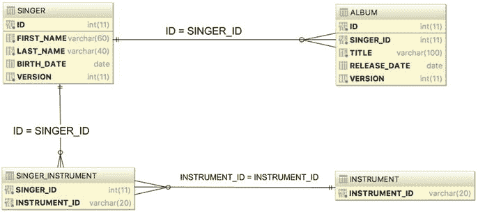
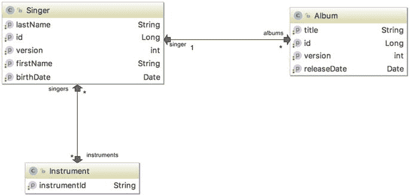

# 七、Spring 和 Hibernate

在前一章中，你看到了如何在 Spring 应用中使用 JDBC。然而，即使 Spring 在简化 JDBC 开发方面走了很长的路，您仍然有许多代码要写。在本章中，我们将介绍一个叫做 Hibernate 的对象关系映射(ORM)库。

如果您有使用 EJB 实体 beans(在 EJB 3.0 之前)开发数据访问应用的经验，您可能还记得这个痛苦的过程。在开发企业 Java 应用时，繁琐的映射配置、事务划分以及每个 bean 中管理其生命周期的大量样板代码极大地降低了生产率。

就像开发 Spring 是为了采用基于 POJO 的开发和声明性配置管理，而不是 EJB 笨重笨拙的设置一样，开发人员社区意识到一个更简单、轻量级和基于 POJO 的框架可以简化数据访问逻辑的开发。此后，出现了许多图书馆；它们通常被称为 ORM 库。ORM 库的主要目标是缩小关系数据库管理系统(RDBMS)中的关系数据结构和 Java 中的面向对象(OO)模型之间的差距，以便开发人员可以专注于使用对象模型进行编程，同时轻松执行与持久性相关的操作。

在开源社区提供的 ORM 库中，Hibernate 是最成功的一个。它的特性，比如基于 POJO 的方法、易于开发和支持复杂的关系定义，赢得了主流 Java 开发人员社区的青睐。

Hibernate 的流行也影响了 JCP，它开发了 Java 数据对象(JDO)规范，作为 Java EE 中的标准 ORM 技术之一。从 EJB 3.0 开始，EJB 实体 bean 甚至被 Java 持久性 API (JPA)所取代。JPA 的很多概念都受到了流行的 ORM 库的影响，比如 Hibernate、TopLink 和 JDO。Hibernate 和 JPA 的关系也很密切。Hibernate 的创始人 Gavin King 代表 JBoss 作为 JCP 专家组成员之一定义了 JPA 规范。从 3.2 版本开始，Hibernate 提供了 JPA 的实现。这意味着当您使用 Hibernate 开发应用时，您可以选择使用 Hibernate 自己的 API 或者使用 Hibernate 作为持久性服务提供者的 JPA API。

在简要介绍了 Hibernate 的历史之后，本章将介绍在开发数据访问逻辑时如何使用 Spring 和 Hibernate。Hibernate 是一个如此庞大的 ORM 库，以至于在一章中涵盖所有方面是不可能的，有许多书籍专门讨论 Hibernate。

本章涵盖了 Spring 中 Hibernate 的基本思想和主要用例。特别是，我们讨论以下主题:

*   配置 Hibernate session factory:Hibernate 的核心概念围绕着由`SessionFactory`管理的`Session`接口。我们将向您展示如何配置 Hibernate 的会话工厂，以便在 Spring 应用中工作。
*   使用 Hibernate 的 ORM 的主要概念:我们讨论了如何使用 Hibernate 将 POJO 映射到底层关系数据库结构的主要概念。还讨论了一些常用的关系，包括一对多和多对多。
*   数据操作:我们展示了如何在 Spring 环境中使用 Hibernate 执行数据操作(查询、插入、更新、删除)的例子。使用 Hibernate 时，它的`Session`接口是您将与之交互的主要接口。

在定义对象到关系的映射时，Hibernate 支持两种配置风格。一种是在 XML 文件中配置映射信息，另一种是在实体类中使用 Java 注释(在 ORM 或 JPA 世界中，映射到底层关系数据库结构的 Java 类称为实体类)。这一章着重于使用对象关系映射的注释方法。对于映射注释，我们使用 JPA 标准(例如，在`javax.persistence`包下),因为它们可以与 Hibernate 自己的注释互换，并将帮助您将来迁移到 JPA 环境。

## 示例代码的示例数据模型

图 7-1 显示了本章使用的数据模型。



图 7-1。

Sample data model

如该数据模型所示，添加了两个新表，即`INSTRUMENT`和`SINGER_INSTRUMENT`(连接表)。`SINGER_INSTRUMENT`对`SINGER`和`INSTRUMENT`表之间的多对多关系进行建模。在`SINGER`和`ALBUM`表中添加了一个`VERSION`列，用于乐观锁定，这将在后面详细讨论。在本章的示例中，我们将使用嵌入式 H2 数据库，因此数据库名称不是必需的。以下是创建本章示例所需表格的脚本:

```java
CREATE TABLE SINGER (
  ID INT NOT NULL AUTO_INCREMENT
  , FIRST_NAME VARCHAR(60) NOT NULL
  , LAST_NAME VARCHAR(40) NOT NULL
  , BIRTH_DATE DATE
  , VERSION INT NOT NULL DEFAULT 0
  , UNIQUE UQ_SINGER_1 (FIRST_NAME, LAST_NAME)
  , PRIMARY KEY (ID)
);

CREATE TABLE ALBUM (
  ID INT NOT NULL AUTO_INCREMENT
  , SINGER_ID INT NOT NULL
  , TITLE VARCHAR(100) NOT NULL
  , RELEASE_DATE DATE
  , VERSION INT NOT NULL DEFAULT 0
  , UNIQUE UQ_SINGER_ALBUM_1 (SINGER_ID, TITLE)
  , PRIMARY KEY (ID)
  , CONSTRAINT FK_ALBUM_SINGER FOREIGN KEY (SINGER_ID)
  REFERENCES SINGER (ID)
);

CREATE TABLE INSTRUMENT (
    INSTRUMENT_ID VARCHAR(20) NOT NULL
     , PRIMARY KEY (INSTRUMENT_ID)
  );

CREATE TABLE SINGER_INSTRUMENT (
  SINGER_ID INT NOT NULL
   , INSTRUMENT_ID VARCHAR(20) NOT NULL
   , PRIMARY KEY (SINGER_ID, INSTRUMENT_ID)
   , CONSTRAINT FK_SINGER_INSTRUMENT_1 FOREIGN KEY (SINGER_ID)
    REFERENCES SINGER (ID) ON DELETE CASCADE
   , CONSTRAINT FK_SINGER_INSTRUMENT_2 FOREIGN KEY (INSTRUMENT_ID)
   REFERENCES INSTRUMENT (INSTRUMENT_ID)
);

```

以下 SQL 是数据填充的脚本:

```java
insert into singer (first_name, last_name, birth_date)
  values ('John', 'Mayer', '1977-10-16');
insert into singer (first_name, last_name, birth_date)
  values ('Eric', 'Clapton', '1945-03-30');
insert into singer (first_name, last_name, birth_date)
  values ('John', 'Butler', '1975-04-01');
insert into album (singer_id, title, release_date)
  values (1, 'The Search For Everything', '2017-01-20');

insert into album (singer_id, title, release_date)
  values (1, 'Battle Studies', '2009-11-17');
insert into album (singer_id, title, release_date)
  values (2, 'From The Cradle ', '1994-09-13');

insert into instrument (instrument_id) values ('Guitar');
insert into instrument (instrument_id) values ('Piano');
insert into instrument (instrument_id) values ('Voice');
insert into instrument (instrument_id) values ('Drums');
insert into instrument (instrument_id) values ('Synthesizer');

insert into singer_instrument(singer_id, instrument_id) values (1, 'Guitar');
insert into singer_instrument(singer_id, instrument_id) values (1, 'Piano');
insert into singer_instrument(singer_id, instrument_id) values (2, 'Guitar');

```

## 配置 Hibernate 的会话工厂

正如本章前面提到的，Hibernate 的核心概念是基于从`SessionFactory`获得的`Session`接口。Spring 提供了一些类来支持将 Hibernate 的会话工厂配置为具有所需属性的 Spring bean。要使用 Hibernate，必须将 Hibernate 依赖项作为依赖项添加到项目中。以下是本章中项目使用的梯度配置:

```java
//pro-spring-15/build.gradle
ext {
  hibernateVersion = '5.2.10.Final'
  ...
  hibernate = [
    validator: "org.hibernate:hibernate-validator:5.1.3.Final",
    ehcache : "org.hibernate:hibernate-ehcache:$hibernateVersion",
    [ em] : "org.hibernate:hibernate-entitymanager:$hibernateVersion"
  ]
  ...
}
//chapter07.gradle
dependencies {
  //we specify these dependencies for all submodules,
    except the boot module, that defines its own
  if !project.name.contains"boot" {
   compile spring.contextSupport, spring.orm,
   misc.slf4jJcl, misc.logback, db.h2, misc.lang3, [hibernate.em]
  }
  testCompile testing.junit

}

```

在下面的配置中，您可以看到为本章配置应用示例所需的 XML 元素:

```java
<?xml version="1.0" encoding="UTF-8"?>
<beans 
  xmlns:xsi="http://www.w3.org/2001/XMLSchema-instance"
  xmlns:context="http://www.springframework.org/schema/context"
  xmlns:tx="http://www.springframework.org/schema/tx"
  xmlns:p="http://www.springframework.org/schema/p"
  xmlns:jdbc="http://www.springframework.org/schema/jdbc"
  xmlns:util="http://www.springframework.org/schema/util"
  xsi:schemaLocation="
    http://www.springframework.org/schema/jdbc
    http://www.springframework.org/schema/jdbc/spring-jdbc.xsd
    http://www.springframework.org/schema/beans
    http://www.springframework.org/schema/beans/spring-beans.xsd
    http://www.springframework.org/schema/tx
    http://www.springframework.org/schema/tx/spring-tx.xsd
    http://www.springframework.org/schema/util
    http://www.springframework.org/schema/util/spring-util.xsd
    http://www.springframework.org/schema/context
    http://www.springframework.org/schema/context/spring-context.xsd">

  <jdbc:embedded-database id="dataSource" type="H2">
    <jdbc:script location="classpath:sql/schema.sql"/>
    <jdbc:script location="classpath:sql/test-data.sql"/>
  </jdbc:embedded-database>

  <bean id="transactionManager"

    class="org.springframework.orm.hibernate5.HibernateTransactionManager"
    p:sessionFactory-ref="sessionFactory"/>

  <tx:annotation-driven/>

  <context:component-scan base-package=
           "com.apress.prospring5.ch7"/>

  <bean id="sessionFactory"
    class="org.springframework.orm.hibernate5.LocalSessionFactoryBean"
     p:dataSource-ref="dataSource"
     p:packagesToScan="com.apress.prospring5.ch7.entities"
     p:hibernateProperties-ref="hibernateProperties"/>

  <util:properties id="hibernateProperties">
    <prop key="hibernate.dialect">org.hibernate.dialect.H2Dialect</prop>
    <prop key="hibernate.max_fetch_depth">3</prop>
    <prop key="hibernate.jdbc.fetch_size">50</prop>
    <prop key="hibernate.jdbc.batch_size">10</prop>
    <prop key="hibernate.hbm2ddl.auto">create-drop</prop>
    <prop key="hibernate.format_sql">true</prop>
    <prop key="hibernate.use_sql_comments">true</prop>
  </util:properties>
</beans>

```

接下来描述了等效的 Java 配置类，这两种配置的组件在代码片段之后并行解释:

```java
package com.apress.prospring5.ch7.config;

import com.apress.prospring5.ch6.CleanUp;
import org.hibernate.SessionFactory;
import org.slf4j.Logger;
import org.slf4j.LoggerFactory;
import org.springframework.context.annotation.Bean;
import org.springframework.context.annotation.Configuration;
import org.springframework.jdbc.core.JdbcTemplate;
import org.springframework.jdbc.datasource.embedded.EmbeddedDatabaseBuilder;
import org.springframework.jdbc.datasource.embedded.EmbeddedDatabaseType;
import org.springframework.orm.hibernate5.HibernateTransactionManager;
import org.springframework.orm.hibernate5.LocalSessionFactoryBean;
import org.springframework.transaction.PlatformTransactionManager;
import org.springframework.transaction.annotation.EnableTransactionManagement;

import javax.sql.DataSource;
import java.io.IOException;
import java.util.Properties;

@Configuration

@ComponentScan(basePackages =

     "com.apress.prospring5.ch7")

@EnableTransactionManagement

public class AppConfig {

   private static Logger logger =
    LoggerFactory.getLogger(AppConfig.class);

   @Bean
   public DataSource dataSource() {
    try {
    EmbeddedDatabaseBuilder dbBuilder =
      new EmbeddedDatabaseBuilder();
    return dbBuilder.setType(EmbeddedDatabaseType.H2)
        .addScripts("classpath:sql/schema.sql",
        "classpath:sql/test-data.sql").build();
    } catch (Exception e) {
    logger.error("Embedded DataSource bean cannot be created!", e);
    return null;
    }
   }

   private Properties hibernateProperties() {
    Properties hibernateProp = new Properties();
    hibernateProp.put("hibernate.dialect", "org.hibernate.dialect.H2Dialect");
    hibernateProp.put("hibernate.format_sql", true);
    hibernateProp.put("hibernate.use_sql_comments", true);
    hibernateProp.put("hibernate.show_sql", true);
    hibernateProp.put("hibernate.max_fetch_depth", 3);
    hibernateProp.put("hibernate.jdbc.batch_size", 10);
    hibernateProp.put("hibernate.jdbc.fetch_size", 50);
    return hibernateProp;
   }

   @Bean public SessionFactory sessionFactory()
    throws IOException {
    LocalSessionFactoryBean sessionFactoryBean = new LocalSessionFactoryBean();
    sessionFactoryBean.setDataSource(dataSource());
    sessionFactoryBean.setPackagesToScan("com.apress.prospring5.ch7.entities");
    sessionFactoryBean.setHibernateProperties(hibernateProperties());
    sessionFactoryBean.afterPropertiesSet();
    return sessionFactoryBean.getObject();
   }

   @Bean public PlatformTransactionManager transactionManager()
    throws IOException {
    return new HibernateTransactionManager(sessionFactory());
   }
}

```

在前面的配置中，声明了几个 beans 能够支持 Hibernate 的会话工厂。这里列出了主要配置:

*   数据源 bean:使用的数据库是一个 H2 嵌入式数据库，如前面在第六章中解释的那样声明。
*   transaction manager bean:Hibernate 会话工厂需要一个事务管理器来进行事务数据访问。Spring 专门为包`org.springframework.orm.hibernate5.HibernateTransactionManager`中声明的 Hibernate 5 提供了一个事务管理器。bean 是用分配的 ID `transactionManager`声明的。默认情况下，当使用 XML 配置时，只要需要事务管理，Spring 就会在其`ApplicationContext`中查找名为`transactionManager`的 bean。当通过 bean 的类型而不是名称来搜索 bean 时，Java 配置会更灵活一些。我们将在第九章中详细讨论事务。此外，我们声明标签`<tx:annotation-driven>`,以支持使用注释声明事务划分需求。Java 配置的对等物是`@EnableTransactionManagement`注释。
*   组件扫描:这个标签和`@ComponentScan`注释对您来说应该很熟悉。我们指示 Spring 扫描包`com.apress.prospring5.ch7`下的组件，以检测标注有`@Repository`的 beans。
*   Hibernate SessionFactory bean: The `sessionFactory` bean is the most important part. Within the bean, several properties are provided. First, we need to inject the `dataSource` bean into the session factory. Second, we instruct Hibernate to scan for the domain objects under the package `com.apress.prospring5.ch.entities`. Finally, the `hibernateProperties` property provides configuration details for Hibernate. There are many configuration parameters, and we define only a few important properties that should be provided for every application. Table 7-1 lists the main configuration parameters for the Hibernate session factory.

    表 7-1。

    Hibernate Properties

    <colgroup><col> <col></colgroup> 
    | 财产 | 描述 |
    | --- | --- |
    | `hibernate.dialect` | 为 Hibernate 应该使用的查询指定数据库方言。Hibernate 支持许多数据库的 SQL 方言。那些方言是`org.hibernate.dialect.Dialect`的子类。主要方言有`H2Dialect`、`Oracle10gDialect`、`PostgreSQLDialect`、`MySQLDialect`、`SQLServerDialect`等。 |
    | `hibernate.max_fetch_depth` | 当映射对象与其他映射对象关联时，声明外部连接的“深度”。这个设置可以防止 Hibernate 获取太多嵌套关联的数据。一个常用的值是 3。 |
    | `hibernate.jdbc.fetch_size` | 指定 Hibernate 每次从数据库获取记录时应该使用的底层 JDBC `ResultSet`中的记录数。例如，向数据库提交了一个查询，而`ResultSet`包含 500 条记录。如果读取大小为 50，Hibernate 将需要读取 10 次才能获得所有数据。 |
    | `ibernate.jdbc.batch_` `size` | 指示 Hibernate 应该分组到一个批处理中的更新操作的数量。这对于在 Hibernate 中执行批处理作业非常有用。显然，当我们在做一个更新成千上万条记录的批处理作业时，我们希望 Hibernate 将查询分组，而不是一个接一个地提交更新。 |
    | `hibernate.show_sql` | 指示 Hibernate 是否应该将 SQL 查询输出到日志文件或控制台。您应该在开发环境中打开它，这在测试和故障排除过程中非常有帮助。 |
    | `hibernate.format_sql` | 指示日志或控制台中的 SQL 输出是否应该格式化。 |
    | `hibernate..use_sql_comments` | 如果设置为`true`，Hibernate 会在 SQL 内部生成注释，以便于调试。 |

关于 Hibernate 支持的属性的完整列表，请参考 Hibernate 的 ORM 用户指南，特别是第二十三部分，在 [`https://docs.jboss.org/hibernate/orm/5.2/userguide/html_single/Hibernate_User_Guide.html`](https://docs.jboss.org/hibernate/orm/5.2/userguide/html_single/Hibernate_User_Guide.html) 。

## 使用 Hibernate 注释的 ORM 映射

配置就绪后，下一步是对 Java POJO 实体类及其到底层关系数据结构的映射进行建模。

有两种映射方法。第一个是设计对象模型，然后基于对象模型生成数据库脚本。例如，对于会话工厂配置，您可以传入 Hibernate 属性`hibernate.hbm2ddl.auto`，让 Hibernate 自动将模式 DDL 导出到数据库。第二种方法是从数据模型开始，然后用期望的映射对 POJOs 建模。我们更喜欢后一种方法，因为我们可以对数据模型有更多的控制，这对于优化数据访问的性能很有用。但是第一个问题将在本章后面讨论，以描述用 Hibernate 配置 Spring 应用的另一种方式。基于数据模型，图 7-2 用类图展示了相应的 OO 模型。



图 7-2。

Class diagram for the sample data model

您可以看到`Singer`和`Album`之间是一对多的关系，而`Singer`和`Instrument`对象之间是多对多的关系。

### 简单映射

首先让我们从映射类的简单属性开始。下面的代码片段显示了带有映射注释的`Singer`类:

```java
package com.apress.prospring5.ch7.entities;

import javax.persistence.*;
import java.io.Serializable;
import java.util.Date;
import java.util.HashSet;
import java.util.Set;

import static javax.persistence.GenerationType.IDENTITY;

@Entity
@Table(name = "singer")
public class Singer implements Serializable {

   private Long id;
   private String firstName;
   private String lastName;
   private Date birthDate;
   private int version;

   public void setId(Long id) {
    this.id = id;
   }

   @Id
   @GeneratedValue(strategy = IDENTITY)
   @Column(name = "ID")
   public Long getId() {
    return this.id;
   }

   @Version
   @Column(name = "VERSION")
   public int getVersion() {
    return version;
   }

   @Column(name = "FIRST_NAME")
   public String getFirstName() {
    return this.firstName;
   }

   @Column(name = "LAST_NAME")
   public String getLastName() {
    return this.lastName;
   }

   @Temporal(TemporalType.DATE)
   @Column(name = "BIRTH_DATE")
   public Date getBirthDate() {
    return birthDate;
   }

   public void setFirstName(String firstName) {
    this.firstName = firstName;
   }

   public void setLastName(String lastName) {
    this.lastName = lastName;
   }

   public void setBirthDate(Date birthDate) {
    this.birthDate = birthDate;
   }

   public void setVersion(int version) {
    this.version = version;
   }

   public String toString() {
    return "Singer - Id: " + id + ", First name: " + firstName
     + ", Last name: " + lastName + ", Birthday: " + birthDate;
   }
}

```

首先我们用`@` `Entity`标注类型，这意味着这是一个映射的实体类。`@Table`注释定义了这个实体映射到的数据库中的表名。对于每个映射的属性，您可以用`@Column`注释对其进行注释，并提供列名。

如果类型和属性名称与表和列名称相同，则可以跳过表和列名称。

关于映射，我们想强调几点。

*   对于`birthDate`属性，我们使用`TemporalType.DATE`值作为参数，用`@Temporal`对其进行注释。这意味着我们希望将数据类型从 Java 日期类型(`java.util.Date`)映射到 SQL 日期类型(`java.sql.Date`)。这允许我们像往常一样在应用中使用`java.util.Date`来访问`Singer`对象中的属性`birthDate`。
*   对于`id`属性，我们用`@Id`对其进行注释。这意味着它是对象的主键。Hibernate 在管理其会话中的联系人实体实例时，将使用它作为唯一标识符。此外，`@GeneratedValue`注释告诉 Hibernate】值是如何生成的。`IDENTITY`策略意味着`id`值是在插入期间由后端生成的。
*   对于`version`属性，我们用`@Version`对其进行注释。这指示 Hibernate 我们想要使用乐观锁定机制，使用`version`属性作为控制。每次 Hibernate 更新记录时，它都会将实体实例的版本与数据库中记录的版本进行比较。如果两个版本相同，说明之前没有人更新过数据，Hibernate 会更新数据并递增版本列。但如果版本不一样，说明之前有人更新过记录，Hibernate 会抛出`StaleObjectStateException`异常，Spring 会翻译成`HibernateOptimisticLockingFailureException`。我们使用整数进行版本控制的例子。除了整数，Hibernate 还支持使用时间戳。但是，建议使用整数进行版本控制，因为 Hibernate 在每次更新后都会将版本号加 1。当使用时间戳时，Hibernate 会在每次更新后更新最新的时间戳。时间戳稍微不太安全，因为两个并发事务可能在同一毫秒内加载和更新同一项。

另一个映射的对象是`Album`，如下图所示:

```java
package com.apress.prospring5.ch7.entities;

import javax.persistence.*;
import java.io.Serializable;
import java.util.Date;

import static javax.persistence.GenerationType.IDENTITY;

@Entity
@Table(name = "album")
public class Album implements Serializable {

   private Long id;
   private String title;
   private Date releaseDate;
   private int version;

   public void setId(Long id) {
    this.id = id;
   }

   @Id
   @GeneratedValue(strategy = IDENTITY)
   @Column(name = "ID")
   public Long getId() {
    return this.id;
   }

   @Version
   @Column(name = "VERSION")
   public int getVersion() {
    return version;
   }

   @Column
   public String getTitle() {
    return this.title;
   }

   @Temporal(TemporalType.DATE)
   @Column(name = "RELEASE_DATE")
   public Date getReleaseDate() {
    return this.releaseDate;
   }

   public void setTitle(String title) {
    this.title = title;
   }

   public void setReleaseDate(Date releaseDate) {
    this.releaseDate = releaseDate;
   }

   public void setVersion(int version) {
    this.version = version;
   }

   @Override
   public String toString() {
    return "Album - Id: " + id + ", Title: " +
      title + ", Release Date: " + releaseDate;
   }
}

```

以下是本章示例中使用的第三个实体类:

```java
package com.apress.prospring5.ch7.entities;

import javax.persistence.*;
import java.io.Serializable;
import java.util.HashSet;
import java.util.Set;

@Entity
@Table(name = "instrument")
public class Instrument implements Serializable {
   private String instrumentId;

   @Id
   @Column(name = "INSTRUMENT_ID")
   public String getInstrumentId() {
    return this.instrumentId;
   }

   public void setInstrumentId(String instrumentId) {
    this.instrumentId = instrumentId;
   }

   @Override
   public String toString() {
    return "Instrument :" + getInstrumentId();
   }
}

```

### 一对多映射

Hibernate 能够对多种关联进行建模。最常见的关联是一对多和多对多。每个`Singer`将有零个或多个相册，所以这是一个一对多的关联(在 ORM 术语中，一对多关联用于建模数据结构中的零对多和一对多关系)。下面的代码片段描述了定义`Singer`和`Album`实体之间的一对多关系所需的属性和方法:

```java
package com.apress.prospring5.ch7.entities;

import javax.persistence.*;
import java.io.Serializable;
import java.util.Date;
import java.util.HashSet;
import java.util.Set;

import static javax.persistence.GenerationType.IDENTITY;

@Entity
@Table(name = "singer")
public class Singer implements Serializable {

   private Long id;
   private String firstName;
   private String lastName;
   private Date birthDate;
   private int version;

   private Set<Album> albums = new HashSet<>();

   ...
   @OneToMany(mappedBy = "singer", cascade=CascadeType.ALL,

    orphanRemoval=true)

   public Set<Album> getAlbums() {
    return albums;
   }

   public boolean addAbum(Album album) {
    album.setSinger(this);
    return getAlbums().add(album);
   }

   public void removeAlbum(Album album) {
    getAlbums().remove(album);
   }

   public void setAlbums(Set<Album> albums) {
    this.albums = albums;
   }
   ...
}

```

属性`contactTelDetails`的 getter 方法用`@OneToMany`注释，这表明与`Album`类的一对多关系。几个属性被传递给注释。`mappedBy`属性表示`Album`类中提供关联的属性(即通过`FK_ALBUM_SINGER`表中的外键定义链接起来)。属性意味着更新操作应该“级联”到子节点。`orphanRemoval`属性意味着在相册更新后，那些不再存在于相册集中的条目应该从数据库中删除。以下代码片段显示了关联映射的`Album`类中的更新代码:

```java
package com.apress.prospring5.ch7.entities;

import javax.persistence.*;
import java.io.Serializable;
import java.util.Date;

import static javax.persistence.GenerationType.IDENTITY;

@Entity
@Table(name = "album")
public class Album implements Serializable {

   private Long id;
   private String title;
   private Date releaseDate;
   private int version;

   private Singer singer;

   @ManyToOne

   @JoinColumn(name = "SINGER_ID")

   public Singer getSinger() {
    return this.singer;
   }

   public void setSinger(Singer singer) {
    this.singer = singer;
   }
   ...
}

```

我们用`@ManyToOne`注释`singer`属性的 getter 方法，这表明它是来自`Singer`的关联的另一方。我们还为底层外键列名指定了`@JoinColumn`注释。最后，在后面的示例代码中，`toString()`方法被覆盖，通过将其输出打印到控制台来方便测试。

### 多对多映射

每个歌手可以演奏零个或多个乐器，每个乐器也与零个或多个歌手相关联，这意味着这是一个多对多的映射。多对多映射需要一个连接表，就是`SINGER_INSTRUMENT`。以下代码示例显示了需要添加到`Singer`类中以实现这种关系的代码:

```java
package com.apress.prospring5.ch7.entities;

import javax.persistence.*;
import java.io.Serializable;
import java.util.Date;
import java.util.HashSet;
import java.util.Set;

import static javax.persistence.GenerationType.IDENTITY;

@Entity
@Table(name = "singer")
public class Singer implements Serializable {

   private Long id;
   private String firstName;
   private String lastName;
   private Date birthDate;
   private int version;

   private Set<Instrument> instruments = new HashSet<>();

   @ManyToMany

   @JoinTable(name = "singer_instrument",

    joinColumns = @JoinColumn(name = "SINGER_ID"),

    inverseJoinColumns = @JoinColumn(name = "INSTRUMENT_ID"))

   public Set<Instrument> getInstruments() {
    return instruments;
   }

   public void setInstruments(Set<Instrument> instruments) {
    this.instruments = instruments;
   }
   ...
}

```

`Singer`类中属性`instruments`的 getter 方法用`@ManyToMany`注释。我们还提供了`@JoinTable`来指示 Hibernate 应该寻找的底层连接表。该名称是连接表的名称，`joinColumns`定义了作为`SINGER`表的外键的列，`inverseJoinColumns`定义了作为关联另一端(即`INSTRUMENT`表)的外键的列。下面是添加了实现这种关系的另一方的代码的`Instrument`类:

```java
package com.apress.prospring5.ch7.entities;

import javax.persistence.*;
import java.io.Serializable;
import java.util.HashSet;
import java.util.Set;

@Entity
@Table(name = "instrument")
public class Instrument implements Serializable {
   private String instrumentId;
   private Set<Singer> singers = new HashSet<>();

   @Id
   @Column(name = "INSTRUMENT_ID")
   public String getInstrumentId() {
    return this.instrumentId;
   }

   @ManyToMany

   @JoinTable(name = "singer_instrument",

    joinColumns = @JoinColumn(name = "INSTRUMENT_ID"),

    inverseJoinColumns = @JoinColumn(name = "SINGER_ID"))

   public Set<Singer> getSingers() {
    return this.singers;
   }

   public void setSingers(Set<Singer> singers) {
    this.singers = singers;
   }

   public void setInstrumentId(String instrumentId) {
    this.instrumentId = instrumentId;
   }

   @Override
   public String toString() {
    return "Instrument :" + getInstrumentId();
   }
}

```

该映射与`Singer`的映射大致相同，但是`joinColumns`和`inverseJoinColumns`属性被颠倒以反映关联。

## Hibernate 会话接口

在 Hibernate 中，与数据库交互时，你需要处理的主要接口是`Session`接口，这个接口是从`SessionFactory`中获取的。

以下代码片段显示了本章示例中使用的`SingerDaoImpl`类，并将配置好的 Hibernate `SessionFactory`注入到该类中:

```java
package com.apress.prospring5.ch7.dao;

import com.apress.prospring5.ch7.entities.Singer;
import org.apache.commons.logging.Log;
import org.apache.commons.logging.LogFactory;
import org.hibernate.SessionFactory;
import org.springframework.stereotype.Repository;
import org.springframework.transaction.annotation.Transactional;

import javax.annotation.Resource;
import java.util.List;

@Transactional
@Repository("singerDao")
public class SingerDaoImpl implements SingerDao {

   private SessionFactory sessionFactory;

   public SessionFactory getSessionFactory() {
    return sessionFactory;
   }

   @Resource(name = "sessionFactory")
   public void setSessionFactory(SessionFactory sessionFactory) {
    this.sessionFactory = sessionFactory;
   }
   ...
}

```

像往常一样，我们通过使用`@Repository`注释将 DAO 类声明为一个 Spring bean。注释定义了我们将在第九章中进一步讨论的事务需求。通过使用`@Resource`注释来注入`sessionFactory`属性。

```java
package com.apress.prospring5.ch7.dao;

import com.apress.prospring5.ch7.entities.Singer;

import java.util.List;

public interface SingerDao {

   List<Singer> findAll();
   List<Singer> findAllWithAlbum();
   Singer findById(Long id);
   Singer save(Singer contact);
   void delete(Singer contact);
}

```

界面简单；它只有三个查找方法，一个保存方法和一个删除方法。`save()`方法将执行插入和更新操作。

### 使用 Hibernate 查询语言查询数据

Hibernate 和其他 ORM 工具，如 JDO 和 JPA，都是围绕对象模型设计的。因此，在定义了映射之后，我们不需要构造 SQL 来与数据库交互。相反，对于 Hibernate，我们使用 Hibernate 查询语言(HQL)来定义我们的查询。当与数据库交互时，Hibernate 会代表我们将查询翻译成 SQL 语句。

当编码 HQL 查询时，语法很像 SQL。但是，您需要从对象的角度而不是数据库的角度来考虑问题。在接下来的几节中，我们将带您看几个例子。

### 带延迟抓取的简单查询

让我们从实现`findAll()`方法开始，该方法简单地从数据库中检索所有联系人。以下代码示例显示了此功能的更新代码:

```java
package com.apress.prospring5.ch7.dao;

import com.apress.prospring5.ch7.entities.Singer;
import org.apache.commons.logging.Log;
import org.apache.commons.logging.LogFactory;
import org.hibernate.SessionFactory;
import org.springframework.stereotype.Repository;
import org.springframework.transaction.annotation.Transactional;

import javax.annotation.Resource;
import java.util.List;

@Transactional
@Repository("singerDao")
public class SingerDaoImpl implements SingerDao {

   private static final Log logger = LogFactory.getLog(SingerDaoImpl.class);
   private SessionFactory sessionFactory;

   @Transactional(readOnly = true)
   public List<Singer> findAll() {
    return sessionFactory.getCurrentSession()
      .createQuery("from Singer s").list();
   }
   ...
}

```

方法`SessionFactory.getCurrentSession()`获得 Hibernate 的`Session`接口。然后，调用`Session.createQuery()`方法，传入 HQL 语句。语句`from Singer s`简单地从数据库中检索所有联系人。该语句的另一种语法是`select s from Singer s`。`@Transactional(readOnly=true)`注释意味着我们希望将事务设置为只读。为只读方法设置该属性将获得更好的性能。

下面的代码片段显示了一个简单的`SingerDaoImpl`测试程序:

```java
package com.apress.prospring5.ch7;

import com.apress.prospring5.ch7.config.AppConfig;
import com.apress.prospring5.ch7.dao.SingerDao;
import com.apress.prospring5.ch7.entities.Singer;
import org.slf4j.Logger;
import org.slf4j.LoggerFactory;
import org.springframework.context.annotation.AnnotationConfigApplicationContext;
import org.springframework.context.support.GenericApplicationContext;

import java.util.List;

public class SpringHibernateDemo {

   private static Logger logger =
    LoggerFactory.getLogger(SpringHibernateDemo.class);

   public static void main(String... args) {
    GenericApplicationContext ctx =
     new AnnotationConfigApplicationContext(AppConfig.class);

    SingerDao singerDao = ctx.getBean(SingerDao.class);
    singerDao.delete(singer);
    listSingers(singerDao.findAll());

    ctx.close();
   }

   private static void listSingers(List<Singer> singers) {
    logger.info(" ---- Listing singers:");
    for (Singer singer : singers) {
    logger.info(singer.toString());
    }
   }
}

```

运行前面的类会产生以下输出:

```java
---- Listing singers:
Singer - Id: 1, First name: John, Last name: Mayer, Birthday: 1977-10-16
Singer - Id: 3, First name: John, Last name: Butler, Birthday: 1975-04-01
Singer - Id: 2, First name: Eric, Last name: Clapton, Birthday: 1945-03-30

```

虽然找回了歌手唱片，但是专辑和乐器呢？让我们修改测试类来打印详细信息。在下面的代码片段中，您可以看到方法`listSingers()`被替换为`listSingersWithAlbum()`:

```java
package com.apress.prospring5.ch7;

import com.apress.prospring5.ch7.config.AppConfig;
import com.apress.prospring5.ch7.dao.SingerDao;
import com.apress.prospring5.ch7.entities.Album;
import com.apress.prospring5.ch7.entities.Instrument;
import com.apress.prospring5.ch7.entities.Singer;
import org.slf4j.Logger;
import org.slf4j.LoggerFactory;
import org.springframework.context.annotation.AnnotationConfigApplicationContext;
import org.springframework.context.support.GenericApplicationContext;

import java.util.List;

public class SpringHibernateDemo {

   private static Logger logger =
    LoggerFactory.getLogger(SpringHibernateDemo.class);

   public static void main(String... args) {
    GenericApplicationContext ctx =
      new AnnotationConfigApplicationContext(AppConfig.class);

    SingerDao singerDao = ctx.getBean(SingerDao.class);
    Singer singer = singerDao.findById(2l);
    singerDao.delete(singer);
    listSingersWithAlbum(singerDao.findAllWithAlbum());

    ctx.close();
   }

   private static void listSingersWithAlbum(List<Singer> singers) {
    logger.info(" ---- Listing singers with instruments:");
    for (Singer singer : singers) {
    logger.info(singer.toString());
    if (singer.getAlbums() != null) {
     for (Album album :
        singer.getAlbums()) {
        logger.info("\t" + album.toString());
     }
    }
    if (singer.getInstruments() != null) {
     for (Instrument instrument : singer.getInstruments()) {
        logger.info("\t" + instrument.getInstrumentId());
     }
    }
    }
   }
}

```

如果您再次运行该程序，您将看到以下异常:

```java
---- Listing singers with instruments:
Singer - Id: 1, First name: John, Last name: Mayer, Birthday: 1977-10-16
org.hibernate.LazyInitializationException: failed to lazily initialize a
  collection of role: com.apress.prospring5.ch7.entities.Singer.albums,
  could not initialize proxy - no Session

```

当您试图访问关联时，您会看到 Hibernate 抛出了`LazyInitializationException`。

这是因为，默认情况下，Hibernate 会延迟获取关联，这意味着 Hibernate 不会连接记录的关联表(即`ALBUM`)。这背后的基本原理是为了性能；可以想象，如果一个查询要检索成千上万条记录，并且所有的关联都被检索到，那么大量的数据传输将会降低性能。

### 使用关联提取进行查询

要让 Hibernate 从关联中获取数据，有两个选项。首先可以定义与取模式`EAGER`的关联，例如`@ManyToMany(fetch=FetchType.EAGER)`。这告诉 Hibernate 在每个查询中获取相关的记录。然而，如前所述，这将影响数据检索性能。

另一种选择是在需要时强制 Hibernate 在查询中获取相关记录。如果使用`Criteria`查询，可以调用函数`Criteria.setFetchMode()`来指示 Hibernate 快速获取关联。使用`NamedQuery`时，可以使用`fetch`操作符指示 Hibernate 急切地获取关联。

让我们来看看`findAllWithAlbum()`方法的实现，它将检索所有联系信息以及他们的电话详细信息和爱好。这个例子将使用`NamedQuery`方法。`NamedQuery`可以外化到一个 XML 文件中，或者使用实体类上的注释来声明。在这里，您可以看到修改后的`Singer`域对象，带有使用注释定义的命名查询:

```java
package com.apress.prospring5.ch7.entities;

import javax.persistence.Entity;
import javax.persistence.Table;
import javax.persistence.NamedQueries;
import javax.persistence.NamedQuery;
...

@Entity
@Table(name = "singer")
@NamedQueries({
    @NamedQuery(name="Singer.findAllWithAlbum",
     query="select distinct s from Singer s " +
        "left join fetch s.albums a " +
        "left join fetch s.instruments i")
})
public class Singer implements Serializable {
   ...
}

```

首先定义一个名为`Singer.findAllWithAlbum`的`NamedQuery`实例。然后我们在 HQL 定义查询。注意`left join fetch`子句，它指示 Hibernate 急切地获取关联。还需要使用`select distinct`；否则，Hibernate 将返回重复的对象(如果一个歌手有两张相关联的专辑，将返回两个歌手对象)。

下面是`findAllWithAlbum()`方法的实现:

```java
package com.apress.prospring5.ch7.dao;
...

@Transactional
@Repository("singerDao")
public class SingerDaoImpl implements SingerDao {
   @Transactional(readOnly = true)
   public List<Singer> findAllWithAlbum() {
    return sessionFactory.getCurrentSession().
     getNamedQuery("Singer.findAllWithAlbum").list();
    }
}

```

这次我们使用`Session.getNamedQuery()`方法，传入`NamedQuery`实例的名称。修改测试程序(`SpringHibernateDemo`)来调用`singerDao.findAllWithAlbum()`将产生以下输出:

```java
---- Listing singers with instruments:
Singer - Id: 1, First name: John, Last name: Mayer, Birthday: 1977-10-16
  Album - Id: 2, Singer id: 1, Title: Battle Studies, Release Date: 2009-11-17
  Album - Id: 1, Singer id: 1, Title: The Search For Everything,
     Release Date: 2017-01-20
    Instrument: Guitar
   Instrument: Piano
Singer - Id: 3, First name: John, Last name: Butler, Birthday: 1975-04-01
Singer - Id: 2, First name: Eric, Last name: Clapton, Birthday: 1945-03-30
  Album - Id: 3, Singer id: 2, Title: From The Cradle, Release Date: 1994-09-13
   Instrument: Guitar

```

现在，所有带有详细信息的歌手都被正确检索到了。让我们看另一个带有参数的`NamedQuery`的例子。这一次，我们将实现`findById()`方法，并且也想获取关联。下面的代码片段显示了添加了新命名查询的`Singer`类:

```java
package com.apress.prospring5.ch7.entities;

import javax.persistence.*;
import java.io.Serializable;
import java.util.Date;
import java.util.HashSet;
import java.util.Set;

import static javax.persistence.GenerationType.IDENTITY;

@Entity
@Table(name = "singer")
@NamedQueries({
    @NamedQuery(name="Singer.findById",
     query="select distinct s from Singer s " +
        "left join fetch s.albums a " +
        "left join fetch s.instruments i " +
        "where s.id = :id"),
    @NamedQuery(name="Singer.findAllWithAlbum",
     query="select distinct s from Singer s " +
        "left join fetch s.albums a " +
        "left join fetch s.instruments i")
})
public class Singer implements Serializable {
   ...
}

```

从名为`Singer.findById`的命名查询中，我们声明一个命名参数:`id`。这里你可以看到`SingerDaoImpl`中`findById()`方法的实现:

```java
package com.apress.prospring5.ch7.dao;

import com.apress.prospring5.ch7.entities.Singer;
import org.apache.commons.logging.Log;
import org.apache.commons.logging.LogFactory;
import org.hibernate.SessionFactory;
import org.springframework.stereotype.Repository;
import org.springframework.transaction.annotation.Transactional;

import javax.annotation.Resource;
import java.util.List;

@Transactional
@Repository("singerDao")
public class SingerDaoImpl implements SingerDao {

   private static final Log logger = LogFactory.getLog(SingerDaoImpl.class);
   private SessionFactory sessionFactory;

   @Transactional(readOnly = true)
   public Singer findById(Long id) {
    return (Singer) sessionFactory.getCurrentSession().
     getNamedQuery("Singer.findById").
     setParameter("id", id).uniqueResult();
   }
   ...
}

```

在这个清单中，我们使用相同的`Session.getNameQuery()`方法。但是我们也调用了`setParameter()`方法，传入命名参数及其值。对于多个参数，可以使用`Query`接口的`setParameterList()`或`setParameters()`方法。

还有一些更高级的查询方法，比如原生查询和条件查询，我们将在下一章讨论 JPA 时讨论。为了测试这个方法，必须相应地修改`SpringHibernateDemo`类。

```java
package com.apress.prospring5.ch7;
...

public class SpringHibernateDemo {

   private static Logger logger =
    LoggerFactory.getLogger(SpringHibernateDemo.class);

   public static void main(String... args) {
    GenericApplicationContext ctx =
     new AnnotationConfigApplicationContext(AppConfig.class);
     SingerDao singerDao = ctx.getBean(SingerDao.class);
     Singer singer = singerDao.findById(2l);
     logger.info(singer.toString());

     ctx.close();
   }
}

```

运行该程序会产生以下输出:

```java
Singer - Id: 1, First name: John, Last name: Mayer, Birthday: 1977-10-16

```

## 插入数据

用 Hibernate 插入数据很简单。另一件有趣的事情是检索数据库生成的主键。在前面关于 JDBC 的章节中，我们需要显式声明我们想要检索生成的密钥，传入`KeyHolder`实例，并在执行 insert 语句后从中取回密钥。使用 Hibernate，所有这些操作都不是必需的。Hibernate 将检索生成的键，并在插入操作后填充域对象。下面的代码片段显示了`save()`方法的实现:

```java
package com.apress.prospring5.ch7.dao;

import com.apress.prospring5.ch7.entities.Singer;
import org.apache.commons.logging.Log;
import org.apache.commons.logging.LogFactory;
import org.hibernate.SessionFactory;
import org.springframework.stereotype.Repository;
import org.springframework.transaction.annotation.Transactional;

import javax.annotation.Resource;
import java.util.List;

@Transactional
@Repository("singerDao")
public class SingerDaoImpl implements SingerDao {
   private static final Log logger = LogFactory.getLog(SingerDaoImpl.class);
   private SessionFactory sessionFactory;

   public Singer save(Singer singer) {
    sessionFactory.getCurrentSession().saveOrUpdate(singer);
    logger.info("Singer saved with id: " + singer.getId());
    return singer;
   }
   ...
}

```

我们只需要调用`Session.saveOrUpdate()`方法，它可以用于插入和更新操作。我们还记录了保存的 singer 对象的 ID，该对象将在持久化后由 Hibernate 填充。下面的代码片段显示了在`SINGER`表中插入一个新的歌手记录，在`ALBUM`表中插入两个子记录，并测试插入是否成功的代码。此外，因为现在我们正在修改表的内容，所以 JUnit 类更适合单独测试每个操作。

```java
package com.apress.prospring5.ch7;

import com.apress.prospring5.ch7.config.AppConfig;
import com.apress.prospring5.ch7.dao.SingerDao;
import com.apress.prospring5.ch7.entities.Album;
import com.apress.prospring5.ch7.entities.Instrument;
import com.apress.prospring5.ch7.entities.Singer;
import org.junit.Before;
import org.junit.Test;
import org.slf4j.Logger;
import org.slf4j.LoggerFactory;
import org.springframework.context.annotation.AnnotationConfigApplicationContext;
import org.springframework.context.support.GenericApplicationContext;

import java.util.Date;
import java.util.GregorianCalendar;
import java.util.List;

import static org.junit.Assert.assertEquals;
import static org.junit.Assert.assertNotNull;

public class SingerDaoTest {
   private static Logger logger =
    LoggerFactory.getLogger(SingerDaoTest.class);

   private GenericApplicationContext ctx;
   private SingerDao singerDao;

   @Before
   public void setUp(){
    ctx = new AnnotationConfigApplicationContext(AppConfig.class);
    singerDao = ctx.getBean(SingerDao.class);
    assertNotNull(singerDao);
   }

   @Test
   public void testInsert(){
    Singer singer = new Singer();
    singer.setFirstName("BB");
    singer.setLastName("King");
    singer.setBirthDate(new Date(
     (new GregorianCalendar(1940, 8, 16)).getTime().getTime()));

    Album album = new Album();
    album.setTitle("My Kind of Blues");
    album.setReleaseDate(new java.sql.Date(
     (new GregorianCalendar(1961, 7, 18)).getTime().getTime()));
    singer.addAbum(album);

    album = new Album();
    album.setTitle("A Heart Full of Blues");
    album.setReleaseDate(new java.sql.Date(
       (new GregorianCalendar(1962, 3, 20)).getTime().getTime()));
    singer.addAbum(album);
    singerDao.save(singer);
    assertNotNull(singer.getId());

    List<Singer> singers = singerDao.findAllWithAlbum();
    assertEquals(4, singers.size());

    listSingersWithAlbum(singers);
   }

   @Test
   public void testFindAll(){
    List<Singer> singers = singerDao.findAll();
    assertEquals(3, singers.size());
    listSingers(singers);
   }

   @Test
   public void testFindAllWithAlbum(){
    List<Singer> singers = singerDao.findAllWithAlbum();
    assertEquals(3, singers.size());
    listSingersWithAlbum(singers);
   }

   @Test
   public void testFindByID(){
    Singer singer = singerDao.findById(1L);
    assertNotNull(singer);
    logger.info(singer.toString());
   }

   private static void listSingers(List<Singer> singers) {
    logger.info(" ---- Listing singers:");
    for (Singer singer : singers) {
    logger.info(singer.toString());
    }
   }

   private static void listSingersWithAlbum(List<Singer> singers) {
    logger.info(" ---- Listing singers with instruments:");
    for (Singer singer : singers) {
    logger.info(singer.toString());
    if (singer.getAlbums() != null) {
     for (Album album :
        singer.getAlbums()) {
        logger.info("\t" + album.toString());
     }
    }
    if (singer.getInstruments() != null) {
     for (Instrument instrument : singer.getInstruments()) {
        logger.info("\tInstrument: " + instrument.getInstrumentId());
     }
    }
    }
   }

  @After
  public void tearDown(){
    ctx.close();
  }
}

```

如前面的代码所示，在`testInsert()`方法中，我们添加了两个相册，并保存了对象。之后，我们通过调用`listSingersWithAlbum`再次列出所有歌手。运行`testInsert()`方法会产生以下输出:

```java
...
INFO  o.h.d.Dialect - HHH000400:
    Using dialect: org.hibernate.dialect.H2Dialect
INFO  o.h.h.i.QueryTranslatorFactoryInitiator - HHH000397:
    Using ASTQueryTranslatorFactory
Hibernate:
  /* insert com.apress.prospring5.ch7.entities.Singer
    */ insert
    into
     singer
     (ID, BIRTH_DATE, FIRST_NAME, LAST_NAME, VERSION)
    values
     (null, ?, ?, ?, ?)
Hibernate:
  /* insert com.apress.prospring5.ch7.entities.Album
    */ insert
    into
     album
     (ID, RELEASE_DATE, SINGER_ID, title, VERSION)
    values
     (null, ?, ?, ?, ?)
Hibernate:
  /* insert com.apress.prospring5.ch7.entities.Album
    */ insert
    into
     album
     (ID, RELEASE_DATE, SINGER_ID, title, VERSION)
    values
     (null, ?, ?, ?, ?)
INFO  c.a.p.c.d.SingerDaoImpl - Singer saved with id: 4

...
INFO  - ---- Listing singers with instruments:
INFO  - Singer - Id: 4, First name: BB, Last name: King,

   Birthday: 1940-09-16
INFO  -   Album - Id: 5, Singer id: 4, Title: A Heart Full of Blues,

   Release Date: 1962-04-20
INFO  -   Album - Id: 4, Singer id: 4, Title: My Kind of Blues,

   Release Date: 1961-08-18
INFO  - Singer - Id: 1, First name: John, Last name: Mayer,
Birthday: 1977-10-16
INFO  -   Album - Id: 2, Singer id: 1, Title: Battle Studies,
   Release Date: 2009-11-17
INFO  -   Album - Id: 1, Singer id: 1, Title: The Search For Everything,
   Release Date: 2017-01-20
INFO  -   Instrument: Piano
INFO  -   Instrument: Guitar
INFO  - Singer - Id: 3, First name: John, Last name: Butler,
   Birthday: 1975-04-01
INFO  - Singer - Id: 2, First name: Eric, Last name: Clapton,
   Birthday: 1945-03-30
INFO  -   Album - Id: 3, Singer id: 2, Title: From The Cradle,
   Release Date: 1994-09-13
INFO  -   Instrument: Guitar

```

日志记录配置已修改，以便打印更详细的休眠信息。从`INFO`日志记录中，我们可以看到新保存的联系人的 ID 被正确填充。Hibernate 还会显示针对数据库执行的所有 SQL 语句，这样您就知道幕后发生了什么。

## 更新数据

更新记录就像插入数据一样简单。假设对于 ID 为 1 的歌手，我们希望更新其名字并删除一张专辑。为了测试更新操作，下面的代码片段显示了`testUpdate()`方法:

```java
package com.apress.prospring5.ch7;
...
public class SingerDaoTest {

   private GenericApplicationContext ctx;
   private SingerDao singerDao;
   ...

   @Test
   public void testUpdate(){
     Singer singer = singerDao.findById(1L);
     //making sure such singer exists
     assertNotNull(singer);

     //making sure we got expected singer
     assertEquals("Mayer", singer.getLastName());

     //retrieve the album
     Album album = singer.getAlbums().stream().filter(
        a -> a.getTitle().equals("Battle Studies")).findFirst().get();

     singer.setFirstName("John Clayton");
     singer.removeAlbum(album);
     singerDao.save(singer);

     // test the update
     listSingersWithAlbum(singerDao.findAllWithAlbum());
   }
   ...
}

```

如前面的代码示例所示，我们首先检索 ID 为 1 的记录。后来，名字就改了。然后，我们遍历相册对象，检索标题为 Battle Studies 的相册，并将其从歌手的`albums`属性中删除。最后，我们再次调用`singerDao.save()`方法。当您运行该程序时，您将看到以下输出:

```java
INFO  o.h.h.i.QueryTranslatorFactoryInitiator - HHH000397:
    Using ASTQueryTranslatorFactory
...
INFO - Singer saved with id: 1
Hibernate:
    /* update
       com.apress.prospring5.ch7.entities.Album */ update
          album
       set
          RELEASE_DATE=?,
          SINGER_ID=?,
          title=?,
          VERSION=?
       where
          ID=?
          and VERSION=?
Hibernate:
    /* delete com.apress.prospring5.ch7.entities.Album */ delete
       from
          album
       where
          ID=?
          and VERSION=?
INFO  ----- Listing singers with instruments:
INFO  - Singer - Id: 1, First name: John Clayton, Last name: Mayer,
    Birthday: 1977-10-16
INFO  -    Album - Id: 1, Singer id: 1, Title: The Search For Everything,
    Release Date: 2017-01-20
INFO  -    Instrument: Guitar
INFO  -    Instrument: Piano
INFO  - Singer - Id: 2, First name: Eric, Last name: Clapton,
    Birthday: 1945-03-30
INFO  -    Album - Id: 3, Singer id: 2, Title: From The Cradle,
    Release Date: 1994-09-13
INFO  -    Instrument: Guitar
INFO  - Singer - Id: 3, First name: John, Last name: Butler,
    Birthday: 1975-04-01

```

你会看到名字被更新，而战史相册被移除。相册可以被删除是因为我们传递给一对多关联的`orphanRemoval=true`属性，该属性指示 Hibernate 删除所有存在于数据库中但在持久化时在对象中不再存在的孤立记录。

## 删除数据

删除数据也很简单。只需调用`Session.delete()`方法，传入联系对象。以下代码片段显示了要删除的代码:

```java
package com.apress.prospring5.ch7.dao;
...
@Transactional
@Repository("singerDao")
public class SingerDaoImpl implements SingerDao {

    private static final Log logger =
        LogFactory.getLog(SingerDaoImpl.class);
    private SessionFactory sessionFactory;

    public void delete(Singer singer) {
        sessionFactory.getCurrentSession().delete(singer);
        logger.info("Singer deleted with id: " + singer.getId());
    }
    ...
}

```

删除操作将删除歌手记录及其所有相关信息，包括专辑和乐器，正如我们在映射中定义的`cascade=CascadeType.ALL`。下面的代码片段显示了用于测试删除方法`testDelete()`的代码:

```java
package com.apress.prospring5.ch7;
...
public class SingerDaoTest {
    private static Logger logger =
        LoggerFactory.getLogger(SingerDaoTest.class);

    private GenericApplicationContext ctx;
    private SingerDao singerDao;

    @Test
    public void testDelete(){
        Singer singer = singerDao.findById(2l);
        //making sure such singer exists
        assertNotNull(singer);
        singerDao.delete(singer);

        listSingersWithAlbum(singerDao.findAllWithAlbum());
    }
}

```

前面的清单检索 ID 为 2 的歌手，然后调用 delete 方法删除歌手信息。运行该程序将产生以下输出:

```java
INFO  o.h.h.i.QueryTranslatorFactoryInitiator - HHH000397:
    Using ASTQueryTranslatorFactory
...
INFO c.a.p.c.d.SingerDaoImpl - Singer deleted with id: 2
Hibernate:
    /* delete collection com.apress.prospring5.ch7.entities.
         Singer.instruments */ delete
        from
            singer_instrument
        where
            SINGER_ID=?
Hibernate:
    /* delete com.apress.prospring5.ch7.entities.Album */ delete
        from
            album
        where
            ID=?
            and VERSION=?
Hibernate:
    /* delete com.apress.prospring5.ch7.entities.Singer */ delete
        from
            singer
        where
            ID=?
            and VERSION=?
INFO -  ---- Listing singers with instruments:
INFO - Singer - Id: 1, First name: John, Last name: Mayer,
    Birthday: 1977-10-16
INFO -    Album - Id: 1, Singer id: 1, Title: The Search For Everything,
    Release Date: 2017-01-20
INFO -    Album - Id: 2, Singer id: 1, Title: Battle Studies,
    Release Date: 2009-11-17
INFO -    Instrument: Piano
INFO -    Instrument: Guitar
INFO - Singer - Id: 3, First name: John, Last name: Butler,
    Birthday: 1975-04-01

```

您可以看到 ID 为 2 的歌手连同其在`ALBUM`和`SINGER_INSTRUMENT`表中的子记录一起被删除。

## 配置 Hibernate 从实体生成表

在使用 Hibernate 的启动应用中，常见的行为是首先编写实体类，然后根据它们的内容生成数据库表。这是通过使用`hibernate.hbm2ddl.auto` Hibernate 属性来完成的。当应用第一次启动时，该属性值被设置为`create`；这将使 Hibernate 扫描实体，并根据使用 JPA 和 Hibernate 注释定义的关系生成表和键(主、外来、唯一)。

如果实体配置正确，并且产生的数据库对象完全符合预期，那么属性的值应该更改为`update`。这将告诉 Hibernate 用以后在实体上执行的任何更改来更新现有的数据库，并保留原始数据库和插入其中的任何数据。

在生产应用中，编写在伪数据库上运行的单元和集成测试是可行的，该伪数据库在所有测试用例执行后被丢弃。通常测试数据库是内存数据库，Hibernate 被告知创建数据库，并在测试执行后通过将`hibernate.hbm2ddl.auto`值设置为`create-drop`来丢弃它。

您可以在 Hibernate 官方文档中找到`hibernate.hbm2ddl.auto`属性值的完整列表。<sup>1</sup>

下面的代码片段展示了 Java 配置`AdvancedConfig`类。正如您所看到的，引入了`hibernate.hbm2ddl.auto`，使用的数据源是一个 DBCP 池数据源。

```java
package com.apress.prospring5.ch7.config;

import com.apress.prospring5.ch6.CleanUp;
import org.apache.commons.dbcp2.BasicDataSource;

import org.hibernate.SessionFactory;
import org.slf4j.Logger;
import org.slf4j.LoggerFactory;
import org.springframework.beans.factory.annotation.Value;
import org.springframework.context.annotation.Bean;
import org.springframework.context.annotation.ComponentScan;
import org.springframework.context.annotation.Configuration;
import org.springframework.context.annotation.PropertySource;
import org.springframework.context.support.PropertySourcesPlaceholderConfigurer;
import org.springframework.jdbc.core.JdbcTemplate;
import org.springframework.orm.hibernate5.HibernateTransactionManager;
import org.springframework.orm.hibernate5.LocalSessionFactoryBuilder;
import org.springframework.transaction.PlatformTransactionManager;
import org.springframework.transaction.annotation.EnableTransactionManagement;

import javax.sql.DataSource;
import java.io.IOException;
import java.util.Properties;

@Configuration
@ComponentScan(basePackages = "com.apress.prospring5.ch7")
@EnableTransactionManagement
@PropertySource("classpath:db/jdbc.properties")
public class AdvancedConfig {

    private static Logger logger =
        LoggerFactory.getLogger(AdvancedConfig.class);

    @Value("${driverClassName}")
    private String driverClassName;
    @Value("${url}")
    private String url;
    @Value("${username}")
    private String username;
    @Value("${password}")
    private String password;

    @Bean
    public static PropertySourcesPlaceholderConfigurer
          propertySourcesPlaceholderConfigurer() {
        return new PropertySourcesPlaceholderConfigurer();
    }
    @Bean(destroyMethod = "close")
    public DataSource dataSource() {
        try {
            BasicDataSource dataSource = new BasicDataSource();
            dataSource.setDriverClassName(driverClassName);
            dataSource.setUrl(url);
            dataSource.setUsername(username);
            dataSource.setPassword(password);
            return dataSource;
        } catch (Exception e) {
            logger.error("DBCP DataSource bean cannot be created!", e);
            return null;
        }
    }

    private Properties hibernateProperties() {
        Properties hibernateProp = new Properties();
        hibernateProp.put("hibernate.dialect", "org.hibernate.dialect.H2Dialect");
        hibernateProp.put("hibernate.hbm2ddl.auto", "create-drop");
        hibernateProp.put("hibernate.format_sql", true);
        hibernateProp.put("hibernate.use_sql_comments", true);
        hibernateProp.put("hibernate.show_sql", true);
        hibernateProp.put("hibernate.max_fetch_depth", 3);
        hibernateProp.put("hibernate.jdbc.batch_size", 10);
        hibernateProp.put("hibernate.jdbc.fetch_size", 50);
        return hibernateProp;
    }

    @Bean
    public SessionFactory sessionFactory() {
        return new LocalSessionFactoryBuilder(dataSource())
                .scanPackages("com.apress.prospring5.ch7.entities")
                .addProperties(hibernateProperties())
                .buildSessionFactory();
    }

    @Bean public PlatformTransactionManager transactionManager()
            throws IOException {
        return new HibernateTransactionManager(sessionFactory());
    }
}

```

`jdbc.properties`文件包含访问内存数据库所需的属性。

```java
driverClassName=org.h2.Driver
url=jdbc:h2:musicdb
username=prospring5
password=prospring5

```

但是在这种情况下，我们最初如何填充数据呢？您可以使用一个`DatabasePopulator`实例，一个类似 DbUnit、 <sup>2</sup> 的库，或者一个类似于`DbIntializer` bean 的自定义 populator bean，如下所示:

```java
package com.apress.prospring5.ch7.config;

import com.apress.prospring5.ch7.dao.InstrumentDao;
import com.apress.prospring5.ch7.dao.SingerDao;
import com.apress.prospring5.ch7.entities.Album;
import com.apress.prospring5.ch7.entities.Instrument;
import com.apress.prospring5.ch7.entities.Singer;
import org.slf4j.Logger;
import org.slf4j.LoggerFactory;
import org.springframework.beans.factory.annotation.Autowired;
import org.springframework.stereotype.Service;

import javax.annotation.PostConstruct;
import java.util.Date;
import java.util.GregorianCalendar;

@Service
public class DBInitializer {
    private Logger logger =
        LoggerFactory.getLogger(DBInitializer.class);

    @Autowired SingerDao singerDao;
    @Autowired InstrumentDao instrumentDao;

    @PostConstruct

    public void initDB(){
        logger.info("Starting database initialization...");

        Instrument guitar = new Instrument();
        guitar.setInstrumentId("Guitar");
        instrumentDao.save(guitar);
        ...

        Singer singer = new Singer();
        singer.setFirstName("John");
        singer.setLastName("Mayer");
        singer.setBirthDate(new Date(
                (new GregorianCalendar(1977, 9, 16)).getTime().getTime()));
        singer.addInstrument(guitar);
        singer.addInstrument(piano);

        Album album1 = new Album();
        album1.setTitle("The Search For Everything");
        album1.setReleaseDate(new java.sql.Date(
                (new GregorianCalendar(2017, 0, 20)).getTime().getTime()));
        singer.addAbum(album1);

        Album album2 = new Album();
        album2.setTitle("Battle Studies");
        album2.setReleaseDate(new java.sql.Date(
                (new GregorianCalendar(2009, 10, 17)).getTime().getTime()));
        singer.addAbum(album2);

        singerDao.save(singer);
        ...
        logger.info("Database initialization finished.");
    }
}

```

`DbIntializer`只是一个简单的 bean，其中存储库作为依赖项被注入，并且有一个由注释`@PostConstruct`定义的初始化方法，在该方法中对象被创建并保存到数据库中。该 bean 用`@Service`注释进行了注释，以将其标记为提供初始化数据库内容服务的 bean。这个 bean 将在创建`ApplicationContext`时创建，初始化方法将被执行，这将确保在使用上下文之前填充数据库。

使用`AdvancedConfig`配置类，之前运行的相同测试集将通过。

## 注释方法或字段？

在前面的例子中，实体的 getters 上有 JPA 注释。但是 JPA 注释可以直接在字段上使用，这有几个优点。

*   实体配置更清晰，位于 fields 部分，而不是分散在整个类内容中。显然，只有当代码是按照干净代码的建议编写的，将一个类中的所有字段声明放在同一个连续的部分中时，这一点才是正确的。
*   注释实体字段不会强制提供 setter/getter。这对于`@Version`带注释的字段很有用，它不应该被手动修改；只有 Hibernate 可以访问它。
*   注释字段允许在 setters 中进行额外的处理(例如，在从数据库加载值之后对其进行加密/计算)。属性访问的问题是，当对象被加载时，setters 也被调用。

网上有很多关于哪个更好的讨论。从性能的角度来看，没有任何区别。这个决定最终取决于开发人员，因为在一些有效的情况下，注释访问器可能更有意义。但是请记住，在数据库中，对象的状态是实际保存的，对象的状态是由其字段的值定义的，而不是由访问器返回的值。这也意味着可以从数据库中准确地重新创建一个对象，就像它被持久化时一样。因此，在某种程度上，在 getters 上设置注释可以被视为破坏封装。

在这里，您可以看到`Singer`实体类被重写为具有带注释的字段，并扩展了抽象类`AbstractEntity`，它包含应用中所有 Hibernate 实体类共有的两个字段:

```java
// AbstractEntity.java
package com.apress.prospring5.ch7.entities;

import javax.persistence.*;
import java.io.Serializable;

@MappedSuperclass
public abstract class AbstractEntity implements Serializable {

    @Id
    @GeneratedValue(strategy = GenerationType.AUTO)
    @Column(updatable = false)
    protected Long id;

    @Version
    @Column(name = "VERSION")
    private int version;

    public Long getId() {
        return id;
    }

    public void setId(Long id) {
        this.id = id;
    }
}

//Singer.java
@Entity
@Table(name = "singer")
@NamedQueries({
        @NamedQuery(name=Singer.FIND_SINGER_BY_ID,
                query="select distinct s from Singer s " +
                        "left join fetch s.albums a " +
                        "left join fetch s.instruments i " +
                        "where s.id = :id"),
        @NamedQuery(name=Singer.FIND_ALL_WITH_ALBUM,
                query="select distinct s from Singer s " +
                        "left join fetch s.albums a " +
                        "left join fetch s.instruments i")
})
public class Singer extends AbstractEntity {

    public static final String FIND_SINGER_BY_ID = "Singer.findById";
    public static final String FIND_ALL_WITH_ALBUM = "Singer.findAllWithAlbum";

    @Column(name = "FIRST_NAME")
    private String firstName;

    @Column(name = "LAST_NAME")
    private String lastName;

    @Temporal(TemporalType.DATE)
    @Column(name = "BIRTH_DATE")
    private Date birthDate;

    @OneToMany(mappedBy = "singer", cascade=CascadeType.ALL,
            orphanRemoval=true)
    private Set<Album> albums = new HashSet<>();

    @ManyToMany

    @JoinTable(name = "singer_instrument",
            joinColumns = @JoinColumn(name = "SINGER_ID"),
            inverseJoinColumns = @JoinColumn(name = "INSTRUMENT_ID"))
    private Set<Instrument> instruments = new HashSet<>();
    ...
}

```

## 使用 Hibernate 时的注意事项

如本章示例所示，一旦正确定义了所有对象到关系的映射、关联和查询，Hibernate 就可以为您提供一个环境，让您专注于使用对象模型编程，而不是为每个操作编写 SQL 语句。在过去的几年里，Hibernate 一直在快速发展，并被 Java 开发人员广泛采用为数据访问层库，无论是在开源社区还是在企业中。

然而，有几点你需要记住。首先，因为您无法控制生成的 SQL，所以在定义映射时应该小心，尤其是关联和它们的获取策略。其次，您应该观察 Hibernate 生成的 SQL 语句，以验证所有语句都按照您的预期执行。

理解 Hibernate 如何管理其会话的内部机制也很重要，尤其是在批处理作业操作中。Hibernate 将保持被管理对象在会话中，并定期刷新和清除它们。设计不良的数据访问逻辑可能会导致 Hibernate 过于频繁地刷新会话，从而严重影响性能。如果你想绝对控制查询，你可以使用本地查询，我们将在下一章讨论。

最后，设置(批处理大小、获取大小等等)在调优 Hibernate 的性能方面起着重要的作用。您应该在会话工厂中定义它们，并在对应用进行负载测试时调整它们，以确定最佳值。

毕竟，Hibernate 以及我们将在下一章讨论的它出色的 JPA 支持，对于寻找一种面向对象方法来实现数据访问逻辑的 Java 开发人员来说是一个自然的选择。

## 摘要

在本章中，我们讨论了 Hibernate 的基本概念以及如何在 Spring 应用中配置它。然后我们讲述了定义 ORM 映射的常用技术，讲述了关联以及如何使用`HibernateTemplate`类来执行各种数据库操作。关于 Hibernate，我们只讨论了它的一小部分功能和特性。对于那些对使用 Hibernate 和 Spring 感兴趣的人，我们强烈建议您学习 Hibernate 的标准文档。此外，许多书籍详细讨论了 Hibernate。我们推荐约瑟夫·奥廷格、杰夫·林伍德和戴夫·明特(Apress，2016 年)的《开始冬眠:为了 Hibernate 5》， <sup>3</sup> 以及迈克·基思和梅里克·辛卡里奥尔的《Pro JPA 2》(Apress，2013 年)。 <sup>4</sup> 下一章，你就来看看 JPA，以及在使用 Spring 时如何使用。Hibernate 为 JPA 提供了出色的支持，对于下一章中的例子，我们将继续使用 Hibernate 作为持久性提供者。对于查询和更新操作，JPA act 喜欢 Hibernate。在下一章，我们将讨论一些高级主题，包括本地查询和标准查询，以及如何使用 Hibernate 和它的 JPA 支持。

Footnotes 1

[`https://docs.jboss.org/hibernate/orm/5.0/manual/en-US/html/ch03.html`](https://docs.jboss.org/hibernate/orm/5.0/manual/en-US/html/ch03.html) 见表 3.7。

  2

我们将在 [`http://dbunit.sourceforge.net/`](http://dbunit.sourceforge.net/) 找到官方的 DbUnit 站点。

  3

从阿普瑞斯官方网站下载电子书: [`http://apress.com/us/book/9781484223185`](http://apress.com/us/book/9781484223185) 。

  4

从阿普瑞斯官方网站下载电子书: [`http://apress.com/us/book/9781430249269`](http://apress.com/us/book/9781430249269) 。