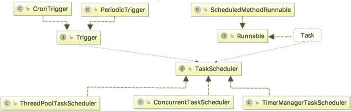

# 十一、任务调度

任务调度是企业应用中的一个常见功能。任务调度主要由三部分组成:任务(需要在特定时间或定期运行的业务逻辑)、触发器(指定任务执行的条件)和调度器(根据触发器的信息执行任务)。具体来说，本章涵盖以下主题:

*   Spring 中的任务调度:我们讨论 Spring 如何支持任务调度，重点是 Spring 3 中引入的`TaskScheduler`抽象。我们还涵盖了调度场景，比如固定间隔调度和`cron`表达式。
*   异步任务执行:我们展示了如何在 Spring 中使用`@Async`注释来异步执行任务。
*   Spring 中的任务执行:我们简单讨论一下 Spring 的`TaskExecutor`接口以及任务是如何执行的。

## 任务计划示例的相关性

您可以在下面的 Gradle 配置片段中看到本章所需的依赖项:

```java
//pro-spring-15/build.gradle
ext {
   springDataVersion = '2.0.0.M3'

   //logging libs
   slf4jVersion = '1.7.25'
   logbackVersion = '1.2.3'

   guavaVersion = '21.0'
   jodaVersion = '2.9.9'
   utVersion = '6.0.1.GA'

   junitVersion = '4.12'

   spring = [
         data          :
             "org.springframework.data:spring-data-jpa:$springDataVersion",
         ...
   ]

   testing = [
         junit: "junit:junit:$junitVersion"
   ]

   misc = [
         slf4jJcl     : "org.slf4j:jcl-over-slf4j:$slf4jVersion",
         logback      : "ch.qos.logback:logback-classic:$logbackVersion",
         guava        : "com.google.guava:guava:$guavaVersion",
         joda         : "joda-time:joda-time:$jodaVersion",
         usertype     : "org.jadira.usertype:usertype.core:$utVersion",
         ...
   ]
   ...
}

...
//chapter11/build.gradle
dependencies {

      compile (spring.contextSupport) {
         exclude module: 'spring-context'
         exclude module: 'spring-beans'
         exclude module: 'spring-core'
      }
      compile misc.slf4jJcl, misc.logback, misc.lang3, spring.data,
         misc.guava, misc.joda, misc.usertype, db.h2

      testCompile testing.junit
}

```

## Spring 任务调度

企业应用经常需要调度任务。在许多应用中，各种任务(例如向客户发送电子邮件通知、运行日终作业、进行数据整理和批量更新数据)需要定期运行，或者以固定的时间间隔(例如每小时)运行，或者按照特定的时间表运行(例如从周一到周五每天晚上 8 点运行)。如前所述，任务调度由三部分组成:调度定义(触发器)、任务执行(调度器)和任务本身。

在 Spring 应用中，有许多方法可以触发任务的执行。一种方法是从应用部署环境中已经存在的调度系统外部触发作业。例如，许多企业使用商业系统，如 Control-M 或 CA AutoSys 来调度任务。如果应用运行在 Linux/Unix 平台上，可以使用`crontab`调度程序。可以通过向 Spring 应用发送 RESTful-WS 请求并让 Spring 的 MVC 控制器触发任务来完成任务触发。

另一种方法是使用 Spring 中的任务调度支持。Spring 在任务调度方面提供了三个选项。

*   支持 JDK 定时器:Spring 支持 JDK 的`Timer`对象进行任务调度。
*   与 Quartz 集成:Quartz 调度器 <sup>1</sup> 是一个流行的开源调度库。
*   Spring 自己的 Spring TaskScheduler 抽象:Spring 3 引入了`TaskScheduler`抽象，它提供了一种简单的任务调度方式，并支持大多数典型的需求。

本节重点介绍如何使用 Spring 的`TaskScheduler`抽象来进行任务调度。

### 介绍 Spring TaskScheduler 抽象

Spring 的`TaskScheduler`抽象主要有三个参与者。

*   触发接口:`org.springframework.scheduling.Trigger`接口支持定义触发机制。Spring 提供了两个`Trigger`实现。`CronTrigger`类支持基于`cron`表达式的触发，而`PeriodicTrigger`类支持基于初始延迟和固定间隔的触发。
*   任务:任务是需要调度的业务逻辑的一部分。在 Spring 中，任务可以被指定为任何 Spring bean 中的一个方法。
*   TaskScheduler 接口:`org.springframework.scheduling.TaskScheduler`接口提供了对任务调度的支持。Spring 提供了三个`TaskScheduler`接口的实现类。`TimerManagerTaskScheduler`类(在包`org.springframework. scheduling.commonj`中)包装了 CommonJ 的`commonj.timers.TimerManager`接口，该接口通常用于商业 JEE 应用服务器，如 WebSphere 和 WebLogic。`ConcurrentTaskScheduler`和`ThreadPoolTaskScheduler`类(都在包`org.springframework.scheduling.concurrent`下)包装`java.util.concurrent.ScheduledThreadPoolExecutor`类。这两个类都支持从共享线程池执行任务。

图 11-1 显示了`Trigger`接口、`TaskScheduler`接口以及实现`java.lang.Runnable`接口的任务实现之间的关系。要使用 Spring 的`TaskScheduler`抽象来调度任务，您有两种选择。一种是在 Spring 的 XML 配置中使用`task-namespace`，另一种是使用注释。让我们逐一查看。



图 11-1。

Relationship between trigger, task, and scheduler

### 探索示例任务

为了演示 Spring 中的任务调度，让我们首先实现一个简单的作业，即维护汽车信息数据库的应用。下面的代码片段显示了作为 JPA 实体类实现的`Car`类:

```java
package com.apress.prospring5.ch11;

import static javax.persistence.GenerationType.IDENTITY;

import javax.persistence.Column;

import javax.persistence.Entity;
import javax.persistence.GeneratedValue;
import javax.persistence.Id;
import javax.persistence.Table;
import javax.persistence.Version;

import org.hibernate.annotations.Type;
import org.joda.time.DateTime;

@Entity
@Table(name="car")
public class Car {
    @Id
    @GeneratedValue(strategy = IDENTITY)
    @Column(name = "ID")
    private Long id;

    @Column(name="LICENSE_PLATE")
    private String licensePlate;

    @Column(name="MANUFACTURER")
    private String manufacturer;

    @Column(name="MANUFACTURE_DATE")
    @Type(type="org.jadira.usertype.dateandtime.joda.PersistentDateTime")
    private DateTime manufactureDate;
    @Column(name="AGE")
    private int age;

    @Version
    private int version;

    //getters and setters
    ...

     @Override
    public String toString() {
        SimpleDateFormat sdf = new SimpleDateFormat("yyyy-MM-dd");
        return String.format("{License: %s, Manufacturer: %s,
           Manufacture Date: %s, Age: %d}",
           licensePlate, manufacturer, sdf.format(manufactureDate.toDate()), age);
    }
}

```

这个实体类用作 Hibernate 生成的`CAR`表的模型。数据访问和服务层的配置，在本章中全部合并为一个，由下面代码片段中描述的`DataServiceConfig`类提供:

```java
package com.apress.prospring5.ch11.config;

import org.slf4j.Logger;
import org.slf4j.LoggerFactory;
import org.springframework.context.annotation.Bean;

import org.springframework.context.annotation.ComponentScan;
import org.springframework.context.annotation.Configuration;
import org.springframework.data.jpa.repository.config.EnableJpaRepositories;
import org.springframework.jdbc.datasource.embedded.EmbeddedDatabaseBuilder;
import org.springframework.jdbc.datasource.embedded.EmbeddedDatabaseType;
import org.springframework.orm.jpa.JpaTransactionManager;
import org.springframework.orm.jpa.JpaVendorAdapter;
import org.springframework.orm.jpa.LocalContainerEntityManagerFactoryBean;
import org.springframework.orm.jpa.vendor.HibernateJpaVendorAdapter;
import org.springframework.transaction.PlatformTransactionManager;

import javax.persistence.EntityManagerFactory;
import javax.sql.DataSource;
import java.util.Properties;

@Configuration
@EnableJpaRepositories(basePackages = {"com.apress.prospring5.ch11.repos"})
@ComponentScan(basePackages = {"com.apress.prospring5.ch11"} )
public class DataServiceConfig {

    private static Logger logger =
        LoggerFactory.getLogger(DataServiceConfig.class);

    @Bean
    public DataSource dataSource() {
        try {
            EmbeddedDatabaseBuilder dbBuilder = new EmbeddedDatabaseBuilder();
            return dbBuilder.setType(EmbeddedDatabaseType.H2).build();
        } catch (Exception e) {
            logger.error("Embedded DataSource bean cannot be created!", e);
            return null;
        }
    }

    @Bean
    public Properties hibernateProperties() {
        Properties hibernateProp = new Properties();
        hibernateProp.put("hibernate.dialect", "org.hibernate.dialect.H2Dialect");
        hibernateProp.put("hibernate.hbm2ddl.auto", "create-drop");
        //hibernateProp.put("hibernate.format_sql", true);
        hibernateProp.put("hibernate.show_sql", true);
        hibernateProp.put("hibernate.max_fetch_depth", 3);
        hibernateProp.put("hibernate.jdbc.batch_size", 10);
        hibernateProp.put("hibernate.jdbc.fetch_size", 50);
        return hibernateProp;
    }

    @Bean
    public PlatformTransactionManager transactionManager() {
        return new JpaTransactionManager(entityManagerFactory());
    }

    @Bean
    public JpaVendorAdapter jpaVendorAdapter() {
        return new HibernateJpaVendorAdapter();
    }

    @Bean
    public EntityManagerFactory entityManagerFactory() {
        LocalContainerEntityManagerFactoryBean factoryBean =
           new LocalContainerEntityManagerFactoryBean();
        factoryBean.setPackagesToScan("com.apress.prospring5.ch11.entities");
        factoryBean.setDataSource(dataSource());
        factoryBean.setJpaVendorAdapter(new HibernateJpaVendorAdapter());
        factoryBean.setJpaProperties(hibernateProperties());
        factoryBean.setJpaVendorAdapter(jpaVendorAdapter());
        factoryBean.afterPropertiesSet();
        return factoryBean.getNativeEntityManagerFactory();
    }
}

```

名为`DBInitializer`的类负责填充`CAR`表。

```java
package com.apress.prospring5.ch11.config;

import com.apress.prospring5.ch11.entities.Car;
import com.apress.prospring5.ch11.repos.CarRepository;
import org.joda.time.DateTime;
import org.joda.time.format.DateTimeFormat;
import org.joda.time.format.DateTimeFormatter;
import org.slf4j.Logger;
import org.slf4j.LoggerFactory;
import org.springframework.beans.factory.annotation.Autowired;
import org.springframework.stereotype.Service;

import javax.annotation.PostConstruct;

@Service
public class DBInitializer {

    private Logger logger = LoggerFactory.getLogger(DBInitializer.class);
    @Autowired CarRepository carRepository;

    @PostConstruct
    public void initDB() {
        logger.info("Starting database initialization...");
        DateTimeFormatter formatter = DateTimeFormat.forPattern("yyyy-MM-dd");

        Car car = new Car();
        car.setLicensePlate("GRAVITY-0405");
        car.setManufacturer("Ford");
        car.setManufactureDate(DateTime.parse("2006-09-12", formatter));
        carRepository.save(car);

        car = new Car();
        car.setLicensePlate("CLARITY-0432");
        car.setManufacturer("Toyota");
        car.setManufactureDate(DateTime.parse("2003-09-09", formatter));
        carRepository.save(car);

        car = new Car();
        car.setLicensePlate("ROSIE-0402");
        car.setManufacturer("Toyota");
        car.setManufactureDate(DateTime.parse("2017-04-16", formatter));
        carRepository.save(car);

        logger.info("Database initialization finished.");
    }
}

```

让我们为`Car`实体定义一个 DAO 层。我们将使用 Spring Data 的 JPA 及其存储库抽象支持。这里你可以看到`CarRepository`接口，它是`CrusRepository`的简单扩展，因为我们对任何特殊的 DAO 操作都不感兴趣。

```java
package com.apress.prospring5.ch11.repos;

import com.apress.prospring5.ch11.entities.Car;
import org.springframework.data.repository.CrudRepository;

public interface CarRepository extends CrudRepository<Car, Long> {
}

```

服务层由`CarService`接口及其实现`CarServiceImpl`表示。

```java
package com.apress.prospring5.ch11.services;
//CarService.jar
import com.apress.prospring5.ch11.entities.Car;

import java.util.List;

public interface CarService {
    List<Car> findAll();
    Car save(Car car);
    void updateCarAgeJob();
    boolean isDone();
}

//CarServiceImpl.jar
...
@Service("carService")
@Repository
@Transactional
public class CarServiceImpl implements CarService {
    public boolean done;

    final Logger logger = LoggerFactory.getLogger(CarServiceImpl.class);

    @Autowired
    CarRepository carRepository;

    @Override
    @Transactional(readOnly=true)
    public List<Car> findAll() {
        return Lists.newArrayList(carRepository.findAll());
    }

    @Override
    public Car save(Car car) {
        return carRepository.save(car);
    }

    @Override
    public void updateCarAgeJob() {
        List<Car> cars = findAll();

        DateTime currentDate = DateTime.now();
        logger.info("Car age update job started");

       cars.forEach(car -> {
            int age = Years.yearsBetween(car.getManufactureDate(),
               currentDate).getYears();

            car.setAge(age);
            save(car);
            logger.info("Car age update --> " + car);
       });

       logger.info("Car age update job completed successfully");
       done = true;
    }

    @Override
    public boolean isDone() {
        return done;
    }
}

```

提供了四种方法，如下所示:

*   检索所有汽车的信息:`List<Car> findAll()`。
*   一个持久化更新的`Car`对象:`Car save(Car car)`。
*   第三种方法，`void updateCarAgeJob()`，是需要定期运行的作业，根据汽车的制造日期和当前日期来更新车龄。
*   第四个方法是`boolean isDone()`，这是一个实用方法，用来知道作业何时结束，这样应用就可以正常关闭。

像 Spring 中对其他名称空间的支持一样，`task-namespace`通过使用 Spring 的`TaskScheduler`抽象为调度任务提供了一个简化的配置。下面的 XML 配置片段显示了`task-namespace-app-context.xml`文件的内容，并显示了包含预定任务的 Spring 应用的配置。使用`task-namespace`进行任务调度非常简单。

```java
<?xml version="1.0" encoding="UTF-8"?>
<beans 
       xmlns:task="http://www.springframework.org/schema/task"

       xmlns:xsi="http://www.w3.org/2001/XMLSchema-instance"
       xsi:schemaLocation="http://www.springframework.org/schema/beans
        http://www.springframework.org/schema/beans/spring-beans.xsd
         http://www.springframework.org/schema/task

         http://www.springframework.org/schema/task/spring-task.xsd">

       <task:scheduler id="carScheduler" pool-size="10"/>

       <task:scheduled-tasks scheduler="carScheduler">
           <task:scheduled ref="carService"
              method="updateCarAgeJob" fixed-delay="10000"/>
       </task:scheduled-tasks>
</beans>

```

当遇到`<task:scheduler>`标签时，Spring 实例化一个`ThreadPoolTaskScheduler`类的实例，而属性`pool-size`指定调度程序可以使用的线程池的大小。在`<task:scheduled-tasks>`标记中，可以调度一个或多个任务。在`<task:scheduled>`标签中，一个任务可以引用一个 Spring bean(在本例中是`carService` bean)和 bean 中的一个特定方法(在本例中是`updateCarAgeJob()`方法)。属性`fixed-delay`指示 Spring 将`PeriodicTrigger`实例化为`TaskScheduler`的`Trigger`实现。

通过声明一个新的配置类并使用`@Import`导入两个配置(对于配置类使用`@Import`,对于 XML 配置使用`@ImportResource`),任务调度配置与数据访问配置相结合。

```java
package com.apress.prospring5.ch11.config;

import org.springframework.context.annotation.Configuration;
import org.springframework.context.annotation.Import;
import org.springframework.context.annotation.ImportResource;

@Configuration
@Import({ DataServiceConfig.class })
@ImportResource("classpath:spring/task-namespace-app-context.xml")
public class AppConfig {}

```

这个配置类`AppConfig`用于创建一个 Spring `ApplicationContext`来测试 Spring 调度功能:

```java
package com.apress.prospring5.ch11;

import com.apress.prospring5.ch11.config.AppConfig;
import com.apress.prospring5.ch11.services.CarService;
import com.apress.prospring5.ch11.services.CarServiceImpl;
import org.slf4j.Logger;
import org.slf4j.LoggerFactory;
import org.springframework.context.annotation.AnnotationConfigApplicationContext;
import org.springframework.context.support.GenericApplicationContext;

public class ScheduleTaskDemo {

    final static Logger logger = LoggerFactory.getLogger(CarServiceImpl.class);

    public static void main(String... args) throws Exception{
        GenericApplicationContext ctx =
           new AnnotationConfigApplicationContext(AppConfig.class);
        CarService carService = ctx.getBean("carService", CarService.class);

        while (!carService.isDone()) {
            logger.info("Waiting for scheduled job to end ...");
            Thread.sleep(250);
        }
        ctx.close();
    }
}

```

运行该程序会产生以下批处理作业输出:

```java
[main] INFO c.a.p.c.s.CarServiceImpl - Waiting for scheduled job to end ...
[carScheduler-1] INFO c.a.p.c.s.CarServiceImpl - Car age update job started
[carScheduler-1] INFO c.a.p.c.s.CarServiceImpl - Car age update --> {License:
   GRAVITY-0405, Manufacturer: Ford, Manufacture Date: 2006-09-12, Age: 10}
[carScheduler-1] INFO c.a.p.c.s.CarServiceImpl - Car age update --> {License:
   CLARITY-0432, Manufacturer: Toyota, Manufacture Date: 2003-09-09, Age: 13}
[carScheduler-1] INFO c.a.p.c.s.CarServiceImpl - Car age update --> {License:
   ROSIE-0402, Manufacturer: Toyota, Manufacture Date: 2017-04-16, Age: 0}
[carScheduler-1] INFO c.a.p.c.s.CarServiceImpl -
   Car age update job completed successfully

```

在前面的示例中，应用仅在计划任务运行一次后停止。正如我们已经声明的，我们希望任务每 10 秒运行一次，通过设置`fixed-delay="10000"`属性；我们应该通过让应用运行直到用户按下一个键来允许任务的重复运行。修改`ScheduleTaskDemo`如下:

```java
package com.apress.prospring5.ch11;

import com.apress.prospring5.ch11.config.AppConfig;
import org.springframework.context.annotation.AnnotationConfigApplicationContext;
import org.springframework.context.support.GenericApplicationContext;

public class ScheduleTaskDemo {

    public static void main(String... args) throws Exception {
        GenericApplicationContext ctx =
           new AnnotationConfigApplicationContext(AppConfig.class);

        System.in.read();
        ctx.close();
    }
}

```

从输出中，您可以看到汽车的`age`属性得到了更新。除了固定的时间间隔，更灵活的调度机制是使用一个`cron`表达式。在 XML 配置文件中，更改以下代码行:

```java
<task:scheduled ref="carService" method="updateCarAgeJob" fixed-delay="10000"/>

```

致以下内容:

```java
<task:scheduled ref="carService" method="updateCarAgeJob" cron="0 * * * * *"/>

```

更改后，再次运行`ScheduleTaskDemo`类，让应用运行一分多钟。您将看到该作业每分钟都会运行。

### 使用注释进行任务调度

使用 Spring 的`TaskScheduler`抽象来调度任务的另一个选择是使用注释。Spring 为此提供了`@Scheduled`注释。为了启用任务调度的注释支持，我们需要在 Spring 的 XML 配置中提供`<task:annotation-driven>`标签。或者，如果使用了配置类，必须用`@EnableScheduling`进行注释。让我们采用这种方法，完全去掉 XML。

```java
package com.apress.prospring5.ch11.config;

import org.springframework.context.annotation.Configuration;
import org.springframework.context.annotation.Import;
import org.springframework.scheduling.annotation.EnableScheduling;

@Configuration
@Import({DataServiceConfig.class})

@EnableScheduling

public class AppConfig {
}

```

是的，这就是所需要的。您甚至不再需要自己声明调度程序，因为 Spring 会处理它。在`@Configuration`类上使用的`@EnableScheduling`注释支持检测容器中任何 Spring 管理的 bean 或它们的方法上的`@Scheduled`注释。有趣的是，用`@Scheduled`注释的方法甚至可以直接在`@Configuration`类中声明。这个注释告诉 Spring 寻找一个相关的调度器定义:或者是上下文中唯一的`TaskScheduler` bean，或者是名为`taskScheduler`的`TaskScheduler` bean，或者是`ScheduledExecutorService` bean。如果没有找到，将在注册器中创建并使用一个本地单线程默认调度程序。

要在 Spring bean 中调度一个特定的方法，该方法必须用`@Scheduled`进行注释，并传递调度要求。在下面的代码片段中，`CarServiceImpl`类被扩展并用于声明一个带有预定方法的新 bean，该方法覆盖了父类中的`updateCarAgeJob()`方法以利用`@Scheduled`注释:

```java
package com.apress.prospring5.ch11.services;

import com.apress.prospring5.ch11.entities.Car;
import org.joda.time.DateTime;
import org.joda.time.Years;
import org.slf4j.Logger;
import org.slf4j.LoggerFactory;
import org.springframework.scheduling.annotation.Scheduled;
import org.springframework.stereotype.Repository;
import org.springframework.stereotype.Service;
import org.springframework.transaction.annotation.Transactional;

import java.util.List;

@Service("scheduledCarService")
@Repository
@Transactional

public class ScheduledCarServiceImpl extends CarServiceImpl{

    @Override
    @Scheduled(fixedDelay=10000)
    public void updateCarAgeJob() {
        List<Car> cars = findAll();

        DateTime currentDate = DateTime.now();
        logger.info("Car age update job started");

        cars.forEach(car -> {
            int age = Years.yearsBetween(
               car.getManufactureDate(), currentDate).getYears();

            car.setAge(age);
            save(car);
            logger.info("Car age update --> " + car);
        });

        logger.info("Car age update job completed successfully");
    }
}

```

测试程序如下所示:

```java
package com.apress.prospring5.ch11;

import com.apress.prospring5.ch11.config.AppConfig;
import org.springframework.context.annotation.AnnotationConfigApplicationContext;
import org.springframework.context.support.GenericApplicationContext;

public class ScheduleTaskAnnotationDemo {

    public static void main(String... args) throws Exception {
        GenericApplicationContext ctx =
           new AnnotationConfigApplicationContext(AppConfig.class);

        System.in.read();

        ctx.close();
    }
}

```

运行该程序产生的输出与使用`task-namespace`几乎相同。您可以通过改变`@Scheduled`注释中的属性来尝试不同的触发机制(即`fixedDelay`、`fixedRate`、`cron`)。你可以自己测试。

```java
[main] DEBUG o.s.s.a.ScheduledAnnotationBeanPostProcessor - Could not find default
   TaskScheduler bean
org.springframework.beans.factory.NoSuchBeanDefinitionException:
   No qualifying bean of type 'org.springframework.scheduling.TaskScheduler' available
... // more stacktrace here
[main] DEBUG o.s.s.a.ScheduledAnnotationBeanPostProcessor - Could not find default
   ScheduledExecutorService bean
org.springframework.beans.factory.NoSuchBeanDefinitionException:
   No qualifying bean of type 'java.util.concurrent.ScheduledExecutorService' available
... // more stacktrace here
[pool-1-thread-1] INFO c.a.p.c.s.CarServiceImpl - Car age update job started
[pool-1-thread-1] INFO c.a.p.c.s.CarServiceImpl - Car age update --> {License:
   GRAVITY-0405, Manufacturer: Ford, Manufacture Date: 2006-09-12, Age: 10}
[pool-1-thread-1] INFO c.a.p.c.s.CarServiceImpl - Car age update --> {License:
    CLARITY-0432, Manufacturer: Toyota, Manufacture Date: 2003-09-09, Age: 13}
[pool-1-thread-1] INFO c.a.p.c.s.CarServiceImpl - Car age update --> {License:
   ROSIE-0402, Manufacturer: Toyota, Manufacture Date: 2017-04-16, Age: 0}
[pool-1-thread-1] INFO c.a.p.c.s.CarServiceImpl - Car age update job
    completed successfully

```

此外，如果愿意，您可以定义自己的`TaskScheduler` bean。下面的例子声明了一个`ThreadPoolTaskScheduler` bean，它等同于上一节 XML 配置中声明的 bean:

```java
package com.apress.prospring5.ch11.config;

import org.springframework.context.annotation.Bean;
import org.springframework.context.annotation.Configuration;
import org.springframework.context.annotation.Import;
import org.springframework.scheduling.TaskScheduler;
import org.springframework.scheduling.annotation.EnableScheduling;
import org.springframework.scheduling.concurrent.DefaultManagedTaskScheduler;
import org.springframework.scheduling.concurrent.ThreadPoolTaskScheduler;

@Configuration
@Import({DataServiceConfig.class})
@EnableScheduling
public class AppConfig {

    @Bean TaskScheduler carScheduler() {
        ThreadPoolTaskScheduler carScheduler =
           new ThreadPoolTaskScheduler();
        carScheduler.setPoolSize(10);
        return carScheduler;
    }
}

```

如果您现在运行测试示例，您将会看到日志中不再打印异常，并且执行该方法的调度程序的名称已经更改，因为`TaskScheduler` bean 被命名为`carScheduler`。

```java
[carScheduler-1] INFO c.a.p.c.s.CarServiceImpl - Car age update job started
[carScheduler-1] INFO c.a.p.c.s.CarServiceImpl - Car age update --> {License:
   GRAVITY-0405, Manufacturer: Ford, Manufacture Date: 2006-09-12, Age: 10}
[carScheduler-1] INFO c.a.p.c.s.CarServiceImpl - Car age update --> {License:
    CLARITY-0432, Manufacturer: Toyota, Manufacture Date: 2003-09-09, Age: 13}
[carScheduler-1] INFO c.a.p.c.s.CarServiceImpl - Car age update --> {License:
   ROSIE-0402, Manufacturer: Toyota, Manufacture Date: 2017-04-16, Age: 0}
[carScheduler-1] INFO c.a.p.c.s.CarServiceImpl - Car age update job
    completed successfully

```

### Spring 中的异步任务执行

从 3.0 版本开始，Spring 也支持使用注释来异步执行任务。要做到这一点，你只需要用`@Async`对方法进行注释。

```java
package com.apress.prospring5.ch11;

import java.util.concurrent.Future;

import org.slf4j.Logger;
import org.slf4j.LoggerFactory;
import org.springframework.scheduling.annotation.Async;
import org.springframework.scheduling.annotation.AsyncResult;
import org.springframework.stereotype.Service;

@Service("asyncService")
public class AsyncServiceImpl implements AsyncService {
    final Logger logger = LoggerFactory.getLogger(AsyncServiceImpl.class);

    @Async
    @Override
    public void asyncTask() {
        logger.info("Start execution of async. task");

        try {
            Thread.sleep(10000);
        } catch (Exception ex) {
            logger.error("Task Interruption", ex);
        }

        logger.info("Complete execution of async. task");
    }
    @Async
    @Override
    public Future<String> asyncWithReturn(String name) {
        logger.info("Start execution of async. task with return for "+ name);

        try {
            Thread.sleep(5000);
        } catch (Exception ex) {
            logger.error("Task Interruption", ex);
        }

        logger.info("Complete execution of async. task with return for " + name);

        return new AsyncResult<>("Hello: " + name);
    }
}

```

`AsyncService`定义了两种方法。`asyncTask()`方法是一个简单的任务，它将信息记录到记录器中。方法`asyncWithReturn()`接受一个`String`参数并返回一个`java.util.concurrent.Future<V>`接口的实例。在完成`asyncWithReturn()`之后，结果被存储在`org.springframework.scheduling.annotation.AsyncResult<V>`类的一个实例中，该类实现了`Future<V>`接口，调用者可以使用它在以后检索执行的结果。通过启用 Spring 的异步方法执行功能来获得`@Async`注释，这是通过用`@EnableAsync`注释 Java 配置类来完成的。 <sup>2</sup>

```java
package com.apress.prospring5.ch11.config;

import org.springframework.context.annotation.ComponentScan;
import org.springframework.context.annotation.Configuration;
import org.springframework.context.annotation.Import;
import org.springframework.context.annotation.ImportResource;
import org.springframework.scheduling.annotation.EnableAsync;
import org.springframework.scheduling.annotation.EnableScheduling;

@Configuration
@EnableAsync
@ComponentScan(basePackages = {"com.apress.prospring5.ch11"} )
public class AppConfig {
}

```

测试程序如下所示:

```java
package com.apress.prospring5.ch11;

import java.util.concurrent.Future;

import com.apress.prospring5.ch11.config.AppConfig;
import org.slf4j.Logger;
import org.slf4j.LoggerFactory;
import org.springframework.context.annotation.AnnotationConfigApplicationContext;
import org.springframework.context.support.GenericApplicationContext;

public class AsyncTaskDemo {
    private static Logger logger =
        LoggerFactory.getLogger(AsyncTaskDemo.class);

    public static void main(String... args) throws Exception{
        GenericApplicationContext ctx =
             new AnnotationConfigApplicationContext(AppConfig.class);

        AsyncService asyncService = ctx.getBean("asyncService",
           AsyncService.class);

        for (int i = 0; i < 5; i++) {
            asyncService.asyncTask();
        }

        Future<String> result1 = asyncService.asyncWithReturn("John Mayer");
        Future<String> result2 = asyncService.asyncWithReturn("Eric Clapton");
        Future<String> result3 = asyncService.asyncWithReturn("BB King");
        Thread.sleep(6000);

        logger.info("Result1: " + result1.get());
        logger.info("Result2: " + result2.get());
        logger.info("Result3: " + result3.get());

        System.in.read();
        ctx.close();
    }
}

```

我们用不同的参数调用`asyncTask()`方法五次，然后调用`asyncWithReturn()`三次，然后在休眠六秒后检索结果。运行该程序会产生以下输出:

```java
...
17:55:31.851 [SimpleAsyncTaskExecutor-1] INFO  c.a.p.c.AsyncServiceImpl -
  Start execution of async. task
17:55:31.851 [SimpleAsyncTaskExecutor-2] INFO  c.a.p.c.AsyncServiceImpl -
  Start execution of async. task
17:55:31.851 [SimpleAsyncTaskExecutor-3] INFO  c.a.p.c.AsyncServiceImpl -
  Start execution of async. task
17:55:31.851 [SimpleAsyncTaskExecutor-4] INFO  c.a.p.c.AsyncServiceImpl -
  Start execution of async. task
17:55:31.852 [SimpleAsyncTaskExecutor-5] INFO  c.a.p.c.AsyncServiceImpl -
  Start execution of async. task
17:55:31.852 [SimpleAsyncTaskExecutor-6] INFO  c.a.p.c.AsyncServiceImpl -
  Start execution of async. task with return for John Mayer
17:55:31.852 [SimpleAsyncTaskExecutor-7] INFO  c.a.p.c.AsyncServiceImpl -
  Start execution of async. task with return for Eric Clapton
17:55:31.852 [SimpleAsyncTaskExecutor-8] INFO  c.a.p.c.AsyncServiceImpl -
  Start execution of async. task with return for BB King
17:55:36.856 [SimpleAsyncTaskExecutor-8] INFO  c.a.p.c.AsyncServiceImpl -
  Complete execution of async. task with return for BB King
17:55:36.856 [SimpleAsyncTaskExecutor-6] INFO  c.a.p.c.AsyncServiceImpl -
  Complete execution of async. task with return for John Mayer
17:55:36.856 [SimpleAsyncTaskExecutor-7] INFO  c.a.p.c.AsyncServiceImpl -
  Complete execution of async. task with return for Eric Clapton
17:55:37.852 [main] INFO  c.a.p.c.AsyncTaskDemo - Result1: Hello: John Mayer
17:55:37.853 [main] INFO  c.a.p.c.AsyncTaskDemo - Result2: Hello: Eric Clapton
17:55:37.853 [main] INFO  c.a.p.c.AsyncTaskDemo - Result3: Hello: BB King
17:55:41.852 [SimpleAsyncTaskExecutor-1] INFO  c.a.p.c.AsyncServiceImpl -

  Complete execution of async. task
17:55:41.852 [SimpleAsyncTaskExecutor-4] INFO  c.a.p.c.AsyncServiceImpl -
  Complete execution of async. task
17:55:41.852 [SimpleAsyncTaskExecutor-3] INFO  c.a.p.c.AsyncServiceImpl -
  Complete execution of async. task
17:55:41.852 [SimpleAsyncTaskExecutor-5] INFO  c.a.p.c.AsyncServiceImpl -
  Complete execution of async. task
17:55:41.852 [SimpleAsyncTaskExecutor-2] INFO  c.a.p.c.AsyncServiceImpl -
  Complete execution of async. task

```

从输出中，您可以看到所有的调用都是同时开始的。这三个带有返回值的调用首先完成，并显示在控制台输出中。最后，调用的五个`asyncTask()`方法也完成了。

## Spring 任务执行

从 Spring 2.0 开始，框架通过`TaskExecutor`接口提供了执行任务的抽象。一个`TaskExecutor`做的和它听起来一样:它执行一个由 Java `Runnable`实现代表的任务。开箱即用，Spring 提供了许多适合不同需求的`TaskExecutor`实现。您可以在 [`http://docs.spring.io/spring/docs/current/javadoc-api/org/springframework/core/task/TaskExecutor.html`](http://docs.spring.io/spring/docs/current/javadoc-api/org/springframework/core/task/TaskExecutor.html) 找到 TaskExecutor 实现的完整列表。

下面列出了一些常用的`TaskExecutor`实现:

*   `SimpleAsyncTaskExecutor`:每次调用时创建新线程；不重用现有线程
*   `SyncTaskExecutor`:不异步执行；调用发生在调用线程中
*   `SimpleThreadPoolTaskExecutor`:石英`SimpleThreadPool`的子类；当需要石英和非石英组件共享一个线程池时使用
*   `ThreadPoolTaskExecutor` : `TaskExecutor`实现提供了通过 bean 属性配置`ThreadPoolExecutor`并将其公开为 Spring `TaskExecutor`的能力

每个`TaskExecutor`实现都有自己的用途，调用约定也是一样的。唯一的变化是在配置中，当定义您想要使用哪个`TaskExecutor`实现及其属性时，如果有的话。让我们看一个简单的例子，它打印出许多消息。我们将使用的`TaskExecutor`实现是`SimpleAsyncTaskExecutor`。首先，让我们创建一个包含任务执行逻辑的 bean 类，如下所示:

```java
package com.apress.prospring5.ch11;

import org.slf4j.Logger;
import org.slf4j.LoggerFactory;
import org.springframework.beans.factory.annotation.Autowired;
import org.springframework.core.task.TaskExecutor;
import org.springframework.stereotype.Component;

@Component
public class TaskToExecute {
    private final Logger logger =
       LoggerFactory.getLogger(TaskToExecute.class);

    @Autowired
    private TaskExecutor taskExecutor;

    public void executeTask() {
        for(int i=0; i < 10; ++ i) {
            taskExecutor.execute(() ->
                logger.info("Hello from thread: " +
                Thread.currentThread().getName()));
        }
    }
}

```

这个类只是一个普通的 bean，需要将`TaskExecutor`作为依赖项注入，并定义一个方法`executeTask()`。`executeTask()`方法通过创建一个新的`Runnable`实例来调用所提供的`TaskExecutor`的`execute`方法，该实例包含我们想要为该任务执行的逻辑。这在这里可能不明显，因为 lambda 表达式用于创建`Runnable`实例。配置相当简单；它类似于上一节中描述的配置。这里我们唯一要考虑的是我们需要为一个`TaxExecutor` bean 提供一个声明，它需要被注入到`TaskToExecute` bean 中。

```java
package com.apress.prospring5.ch11.config;

import org.springframework.context.annotation.Bean;
import org.springframework.context.annotation.ComponentScan;
import org.springframework.context.annotation.Configuration;
import org.springframework.core.task.SimpleAsyncTaskExecutor;
import org.springframework.core.task.TaskExecutor;
import org.springframework.scheduling.TaskScheduler;
import org.springframework.scheduling.annotation.EnableAsync;
import org.springframework.scheduling.concurrent.ThreadPoolTaskScheduler;

@Configuration
@EnableAsync
@ComponentScan(basePackages = {"com.apress.prospring5.ch11"} )
public class AppConfig {

    @Bean TaskExecutor taskExecutor() {
        return new SimpleAsyncTaskExecutor();
    }
}

```

在前面的配置中声明了一个简单的名为`taskExecutor`的类型为`SimpleAsyncTaskExecutor`的 bean。Spring IoC 容器将这个 bean 注入到`TaskToExecute` bean 中。要测试执行情况，您可以使用以下程序:

```java
package com.apress.prospring5.ch11;

import com.apress.prospring5.ch11.config.AppConfig;
import org.springframework.context.annotation.AnnotationConfigApplicationContext;
import org.springframework.context.support.GenericApplicationContext;

public class TaskExecutorDemo {

    public static void main(String... args) throws Exception {
        GenericApplicationContext ctx =
            new AnnotationConfigApplicationContext(AppConfig.class);

        TaskToExecute taskToExecute = ctx.getBean(TaskToExecute.class);
        taskToExecute.executeTask();

        System.in.read();
        ctx.close();
    }
}

```

当该示例运行时，它应该打印类似于以下内容的输出:

```java
Hello from thread: SimpleAsyncTaskExecutor-1
Hello from thread: SimpleAsyncTaskExecutor-5
Hello from thread: SimpleAsyncTaskExecutor-3
Hello from thread: SimpleAsyncTaskExecutor-10
Hello from thread: SimpleAsyncTaskExecutor-8
Hello from thread: SimpleAsyncTaskExecutor-6
Hello from thread: SimpleAsyncTaskExecutor-2
Hello from thread: SimpleAsyncTaskExecutor-4
Hello from thread: SimpleAsyncTaskExecutor-9
Hello from thread: SimpleAsyncTaskExecutor-7

```

从输出中可以看到，每个任务(我们正在打印的消息)在执行时都会显示出来。我们打印出消息加上线程名(默认情况下是类名`SimpleAsyncTaskExecutor`)和线程号。

## 摘要

在这一章中，我们介绍了 Spring 对任务调度的支持。我们重点介绍了 Spring 内置的`TaskScheduler`抽象，并通过一个示例批处理数据更新作业演示了如何使用它来满足任务调度需求。我们还介绍了 Spring 如何支持异步执行任务的注释。此外，我们简要介绍了 Spring 的`TaskExecutor`和常见实现。

不需要 Spring Boot 部分，因为任务注释的调度和异步执行是`spring-context`库的一部分，它们也必须与 Spring Boot 配置一起使用。另外，配置调度和异步任务已经和使用 Spring 一样简单了；在这个问题上，Spring Boot 能做的改进不多。<sup>3</sup>

Footnotes 1

你可以在 [`www.quartz-scheduler.org`](http://www.quartz-scheduler.org) 找到官方页面。

  2

在 XML 中，只需声明`<task:annotation-driven />`就可以了。

  3

但如果你是古玩，想把提供的项目转换成 Spring Boot，可以在这里找到一个小教程: [`https://spring.io/guides/gs/scheduling-tasks/`](https://spring.io/guides/gs/scheduling-tasks/)