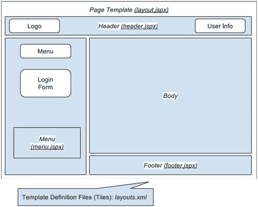

# 十六、网络应用

在企业应用中，表示层严重影响用户对应用的接受程度。表示层是进入应用的大门。它让用户执行应用提供的业务功能，并呈现由应用维护的信息视图。用户界面的表现在很大程度上决定了应用的成功。

由于互联网的爆炸性增长(尤其是最近)，以及人们使用的各种设备的增加，开发应用的表示层是一项具有挑战性的任务。以下是开发 web 应用时的一些主要考虑事项:

*   性能:性能始终是 web 应用的首要要求。如果用户选择一个功能或点击一个链接，并且需要很长时间来执行(在互联网的世界里，三秒钟就像一个世纪！)，用户肯定不会对应用满意。
*   用户友好性:应用应该易于使用和导航，有清晰的指示，不会让用户感到困惑。
*   交互性和丰富性:用户界面应该具有高度的交互性和响应性。此外，演示应该在视觉演示方面丰富，比如图表、仪表板类型的界面等等。
*   可访问性:现在，用户要求可以从任何地方通过任何设备访问应用。在办公室，他们将使用桌面来访问应用。在旅途中，用户将使用各种移动设备(包括笔记本电脑、平板电脑和智能手机)来访问应用。

开发一个 web 应用来满足前面的需求并不容易，但是对于业务用户来说，这是必须的。幸运的是，已经开发了许多新技术和框架来满足这些需求。许多 web 应用框架和库，例如 Spring MVC (Spring Web Flow)、Struts、Tapestry、Java Server Faces (JSF)、Google Web Toolkit (GWT)、jQuery 和 Dojo 等等，都提供了工具和丰富的组件库，可以帮助您开发高度交互式的 Web 前端。此外，许多框架提供了针对包括智能手机和平板电脑在内的移动设备的工具或相应的小部件库。HTML5 和 CSS3 标准的兴起以及大多数 web 浏览器和移动设备制造商对这些最新标准的支持，也有助于简化 web 应用的开发，这些应用需要在任何地方、任何设备上都可用。

在 web 应用开发方面，Spring 提供了全面而密集的支持。Spring MVC 模块为 web 应用开发提供了坚实的基础设施和模型视图控制器(MVC)框架。使用 Spring MVC 时，可以使用各种视图技术(例如，JSP 或 Velocity)。此外，Spring MVC 还集成了许多常见的 web 框架和工具包(例如，Struts 和 GWT)。其他 Spring 项目有助于解决 web 应用的特定需求。例如，当与 Spring Web Flow 项目及其 Spring Faces 模块结合使用时，Spring MVC 为开发具有复杂流的 Web 应用以及使用 JSF 作为视图技术提供了全面的支持。简单地说，在表示层开发方面有很多选择。本章主要讨论 Spring MVC，并讨论我们如何使用 Spring MVC 提供的强大功能来开发高性能的 web 应用。具体来说，本章涵盖以下主题:

*   Spring MVC:我们讨论 MVC 模式的主要概念，并介绍 Spring MVC。我们展示了 Spring MVC 的核心概念，包括它的`WebApplicationContext`层次结构和请求处理生命周期。
*   i18n、区域设置和主题化:Spring MVC 为常见的 web 应用需求提供了全面的支持，包括 i18n(国际化)、区域设置和主题化。我们讨论如何使用 Spring MVC 来开发支持这些需求的 web 应用。
*   视图和 Ajax 支持:Spring MVC 支持许多视图技术。在这一章中，我们将重点介绍如何使用 JavaServer Pages (JSP)和 Tiles 作为 web 应用的视图部分。在 JSP 之上，JavaScript 将用于提供丰富性部分。有许多优秀和流行的 JavaScript 库，如 jQuery 和 Dojo。在这一章中，我们将重点介绍 jQuery 及其子项目 jQuery UI 库的使用，它支持高度交互式 web 应用的开发。
*   分页和文件上传支持:在本章展示如何开发示例时，我们将讨论如何使用 Spring Data JPA 和前端 jQuery 组件在浏览基于网格的数据时提供分页支持。此外，我们还将介绍如何在 Spring MVC 中实现文件上传。我们不讨论与 Apache Commons 文件上传的集成，而是讨论如何将 Spring MVC 与 Servlet 3.1 容器的内置多部分文件上传支持结合使用。
*   安全性:安全性是 web 应用中的一个大话题。我们讨论如何使用 Spring Security 来帮助保护应用并处理登录和注销。

## 为示例实现服务层

在本章的服务层中，我们仍然使用 singer 应用作为示例。在这一节中，我们将讨论数据模型和服务层的实现，这将贯穿本章。

### 使用样本的数据模型

您将为本章中的示例使用一个简单的数据模型；它只包含一个用于存储歌手信息的`SINGER`表。以下 SQL 片段显示了模式创建的脚本(`schema.sql`):

```java
DROP TABLE IF EXISTS SINGER;

CREATE TABLE SINGER (
  ID INT NOT NULL AUTO_INCREMENT
  , FIRST_NAME VARCHAR(60) NOT NULL
  , LAST_NAME  VARCHAR(40) NOT NULL
  , BIRTH_DATE DATE
  , DESCRIPTION VARCHAR(2000)
  , PHOTO  BLOB
  , VERSION INT NOT NULL DEFAULT 0
  , UNIQUE UQ_SINGER_1 (FIRST_NAME, LAST_NAME)
  , PRIMARY KEY (ID)
);

```

如您所见，`SINGER`表只存储了歌手信息的几个基本字段。值得一提的是二进制大对象(BLOB)数据类型的`PHOTO`列，它将用于存储使用文件上传的歌手照片。要创建该表，您不需要使用此 SQL 脚本；相反，Hibernate 将根据下面的代码片段描述的`Singer`实体的配置，生成创建表所必需的 SQL:

```java
package com.apress.prospring5.ch16.entities;

import javax.persistence.*;
import javax.validation.constraints.NotEmpty;
import javax.validation.constraints.Size; import java.io.Serializable;
import java.text.SimpleDateFormat;
import java.util.Date;

import static javax.persistence.GenerationType.IDENTITY;

@Entity
@Table(name = "singer")
public class Singer implements Serializable {
 @Id
 @GeneratedValue(strategy = IDENTITY)
 @Column(name = "ID")
 private Long id;

 @Version
 @Column(name = "VERSION")
 private int version; 

 @NotEmpty(message="{validation.firstname.NotEmpty.message}")
 @Size(min=3, max=60, message="{validation.firstname.Size.message}")
 @Column(name = "FIRST_NAME")
 private String firstName;

 @NotEmpty(message="{validation.lastname.NotEmpty.message}")
 @Size(min=1, max=40, message="{validation.lastname.Size.message}")
 @Column(name = "LAST_NAME")
 private String lastName;

 @Temporal(TemporalType.DATE)
 @Column(name =  "BIRTH_DATE")
 private Date   birthDate;

 @Column(name =  "DESCRIPTION")
 private String description;

 @Basic(fetch=  FetchType.LAZY)
 @Lob
 @Column(name =  "PHOTO")
 private  byte photo;

 public Long  getId() {
  return id;
 }

 public int  getVersion() {
  return version;
 }

 public  String  getFirstName() {
  return firstName;
 }

 public String getLastName() {
  return  lastName;
 }

 public  void setId(Long id) {
  this.id =  id;
 }

 public void setVersion(int version) {
  this.version =  version;
 }

 public  void setFirstName(String firstName) {
  this.firstName =  firstName;
 }

 public  void setLastName(String lastName) {
  this.lastName =  lastName;
 }

 public void setBirthDate(Date birthDate)  {
  this.birthDate =  birthDate;
 }

 public Date   getBirthDate() {
  return birthDate;
 }

 public String getDescription() {
  return description;
 }

 public void setDescription(String description)  {
  this.description =  description;
 }

 public  byte getPhoto() {
  return photo;
 }

 public  void setPhoto(byte photo) {
  this.photo =  photo;
 }
 @Transient
 public String getBirthDateString() {
  String birthDateString =  "";
  if (birthDate != null)  {
   SimpleDateFormat sdf = new SimpleDateFormat("yyyy-MM-dd");
    birthDateString =  sdf.format(birthDate);
  }
  return birthDateString;
 }

 @Override

 public String toString()  {
  return "Singer - Id: " + id + ", First name: " + firstName
 +  ", Last name: " + lastName + ", Birthday: " + birthDate
 + ", Description: " +  description;
 }
}

```

如果使用填充脚本来填充`SINGER`表，该脚本将如下所示:

```java
insert into singer first_name, last_name, birth_date values 'John', 'Mayer', '1977-10-16';
insert into singer first_name, last_name, birth_date values 'Eric', 'Clapton', '1945-03-30';
insert into singer first_name, last_name, birth_date values 'John', 'Butler', '1975-04-01';
insert into singer first_name, last_name, birth_date values 'B.B.', 'King', '1925-09-16';
insert into singer first_name, last_name, birth_date values 'Jimi', 'Hendrix', '1942-11-27';
insert into singer first_name, last_name, birth_date values 'Jimmy', 'Page', '1944-01-09';
insert into singer first_name, last_name, birth_date values 'Eddie', 'Van Halen', '1955-01-26';
insert into singer first_name, last_name, birth_date values 'Saul Slash', 'Hudson', '1965-07-23';
insert into singer first_name, last_name, birth_date values 'Stevie', 'Ray Vaughan', '1954-10-03';
insert into singer first_name, last_name, birth_date values 'David', 'Gilmour', '1946-03-06';
insert into singer first_name, last_name, birth_date values 'Kirk', 'Hammett', '1992-11-18';
insert into singer first_name, last_name, birth_date values 'Angus', 'Young', '1955-03-31';
insert into singer first_name, last_name, birth_date values 'Dimebag', 'Darrell', '1966-08-20';
insert into singer first_name, last_name, birth_date values 'Carlos', 'Santana', '1947-07-20';

```

但是在官方代码示例中，您会发现所有以前的数据都是通过`DBInitializer`类插入的。这一次，我们需要更多的测试数据，以便稍后向您展示分页支持。

### 实现 DAO 层

实体类、repo 和数据库配置组成了名为`dao`的应用层，它负责数据库对象。

entity 类已经在前面介绍过了，您可能已经注意到了典型的 JPA 注释。然而，有两个新的。

*   添加了一个名为`birthDateString`的新瞬态属性(通过对 getter 方法应用`@Transient`注释),该属性将在后面的示例中用于前端呈现。
*   对于`photo`属性，我们使用字节数组作为 Java 数据类型，这对应于 RDBMS 中的 BLOB 数据类型。此外，getter 方法用`@Lob`和`@Basic(fetch=FetchType.LAZY)`进行了注释。前一个注释向 JPA 提供者表明它是一个大的对象列，而后一个注释表明应该延迟获取属性，以避免在加载不需要照片信息的类时影响性能。

本章后面还会解释一些验证注释。

因为我们将使用 Spring Data JPA 的存储库支持，所以我们将实现`SingerRepository`接口，如下所示:

```java
package com.apress.prospring5.ch16.repo;

import org.springframework.data.repository.PagingAndSortingRepository;

public interface SingerRepository extends
  PagingAndSortingRepository<Singer, Long> {
}

```

这个例子没有扩展`CrudRepository`接口，而是使用了`PagingAndSortingRepository`，它是`CrudRepository`的高级扩展，提供了使用分页和排序抽象来检索实体的方法。这非常有用，因为查询返回已经排序的数据，这些数据只需要显示在界面上，不需要额外的更改。

### 实现服务层

在本节中，我们首先讨论使用 JPA 2、Spring Data JPA 和 Hibernate 作为持久性服务提供者来实现`SingerService`。然后，我们将介绍 Spring 项目中服务层的配置。下面的代码片段显示了带有我们想要公开的服务的`SingerService`接口:

```java
package com.apress.prospring5.ch16.services;

import java.util.List;

import org.springframework.data.domain.Page;
import org.springframework.data.domain.Pageable;

public interface SingerService {
 List<Singer> findAll();
 Singer findById(Long id);
 Singer save(Singer singer);
 Page<Singer> findAllByPage(Pageable pageable);
}

```

这些方法应该是不言自明的。这个接口的实现也很简单。因为应用很简单，不需要对数据做其他的修改，所以`SingerServiceImpl`的作用只是将调用转发给类似的存储库方法。

```java
package com.apress.prospring5.ch16.services;

import java.util.List;

import com.apress.prospring5.ch16.repos.SingerRepository;
import com.apress.prospring5.ch16.entitites.Singer;
import org.springframework.beans.factory.annotation.Autowired;
import org.springframework.data.domain.Page;
import org.springframework.data.domain.Pageable;
import org.springframework.stereotype.Service;
import org.springframework.transaction.annotation.Transactional;

import com.google.common.collect.Lists;

@Transactional
@Service("singerService")
public class SingerServiceImpl implements SingerService  {
 private SingerRepository singerRepository;

 @Override
 @Transactional(readOnly=true)
 public List<Singer> findAll() {
  return Lists.newArrayList(singerRepository.findAll());
 }

 @Override
 @Transactional(readOnly=true)
 public  Singer findById(Long id) {
  return singerRepository.findById(id).get();
 }

 @Override
 public  Singer save(Singer singer)  {
  return singerRepository.save(singer);
 }

 @Autowired
 public  void setSingerRepository(SingerRepository singerRepository) {
  this.singerRepository =  singerRepository;
 }

 @Override
 @Transactional(readOnly=true)
 public Page<Singer> findAllByPage(Pageable  pageable)  {
  return singerRepository.findAll(pageable);
 }
}

```

实现基本完成，下一步是在 web 项目内配置 Spring 的`ApplicationContext`中的服务，这将在下一节讨论。

## 正在配置 SingerService

显然，有两种方法可以做到这一点:XML 和 Java 配置。您可以在本章的源代码中找到这个项目用 XML 配置的版本。如果您有兴趣，可以对其进行分析，但是本节的重点将放在 Java 配置类上。要配置`SingerService`、数据库访问和事务，您可以使用下面的类(您应该已经从第九章中熟悉了):

```java
package com.apress.prospring5.ch16.config;

import org.slf4j.Logger;
import org.slf4j.LoggerFactory;
import org.springframework.context.annotation.Bean;
import org.springframework.context.annotation.ComponentScan;
import org.springframework.context.annotation.Configuration;
import org.springframework.data.jpa.repository.config.EnableJpaRepositories;
import org.springframework.jdbc.datasource.embedded.EmbeddedDatabaseBuilder;
import org.springframework.jdbc.datasource.embedded.EmbeddedDatabaseType;
import org.springframework.orm.jpa.JpaTransactionManager;
import org.springframework.orm.jpa.JpaVendorAdapter;
import org.springframework.orm.jpa.LocalContainerEntityManagerFactoryBean;
import org.springframework.orm.jpa.vendor.HibernateJpaVendorAdapter;
import org.springframework.transaction.PlatformTransactionManager;

import javax.persistence.EntityManagerFactory;
import javax.sql.DataSource;
import java.util.Properties;

@Configuration
@EnableJpaRepositories(basePackages = {"com.apress.prospring5.ch16.repos"})
@ComponentScan(basePackages    = {"com.apress.prospring5.ch16"} )
public class DataServiceConfig {

 private static Logger logger = LoggerFactory.getLogger(DataServiceConfig.class);

 @Bean

 public DataSource dataSource() {
   try {
   EmbeddedDatabaseBuilder dbBuilder = new EmbeddedDatabaseBuilder();
   return dbBuilder.setType(EmbeddedDatabaseType.H2).build();
   } catch (Exception e) {
   logger.error("Embedded  DataSource bean  cannot be  created!", e);
   return null;
  }
}

 @Bean
 public Properties hibernateProperties() {
   Properties hibernateProp = new Properties();
   hibernateProp.put("hibernate.dialect", "org.hibernate.dialect.H2Dialect");
   hibernateProp.put("hibernate.hbm2ddl.auto", "create-drop");
   hibernateProp.put("hibernate.show_sql", true);
   hibernateProp.put("hibernate.max_fetch_depth", 3);
   hibernateProp.put("hibernate.jdbc.batch_size", 10);
   hibernateProp.put("hibernate.jdbc.fetch_size", 50);
   return hibernateProp;
 }

 @Bean
 public PlatformTransactionManager transactionManager() {
   return new JpaTransactionManager(entityManagerFactory());
 }

 @Bean
 public JpaVendorAdapter jpaVendorAdapter() {
   return new HibernateJpaVendorAdapter();
 }

 @Bean
 public EntityManagerFactory entityManagerFactory() {
   LocalContainerEntityManagerFactoryBean factoryBean =
 new LocalContainerEntityManagerFactoryBean();
   factoryBean.setPackagesToScan("com.apress.prospring5.ch16.entities");
   factoryBean.setDataSource(dataSource());
   factoryBean.setJpaVendorAdapter(new HibernateJpaVendorAdapter());
   factoryBean.setJpaProperties(hibernateProperties());
   factoryBean.setJpaVendorAdapter(jpaVendorAdapter());
   factoryBean.afterPropertiesSet();
   return factoryBean.getNativeEntityManagerFactory();
 }
}

```

现在服务层已经完成，可以公开给远程客户端使用了。

## MVC 和 Spring MVC 简介

在继续实现表示层之前，让我们先了解一下 MVC 在 web 应用中作为一种模式的一些主要概念，以及 Spring MVC 如何在这一领域提供全面的支持。

在下面的小节中，我们将逐一介绍这些高级概念。首先，我们简单介绍一下 MVC。其次，我们给出了 Spring MVC 及其`WebApplicationContext`层次的高级视图。最后，我们讨论 Spring MVC 中的请求生命周期。

### MVC 简介

MVC 是实现应用表示层的常用模式。MVC 模式的主要原则是为不同的组件定义一个具有清晰职责的架构。顾名思义，MVC 模式中有三个参与者。

*   模型:模型表示业务数据以及用户上下文中应用的“状态”。例如，在一个电子商务网站中，如果用户在网站上购买商品，模型将包括用户配置文件信息、购物车数据和订单数据。
*   视图:这将数据以期望的格式呈现给用户，支持与用户的交互，并支持客户端验证、i18n、样式等等。
*   控制器:控制器处理用户在前端执行的动作请求，与服务层交互，更新模型，并根据执行结果将用户定向到适当的视图。

由于基于 Ajax 的 web 应用的兴起，MVC 模式得到了增强，以提供响应更快、更丰富的用户体验。例如，当使用 JavaScript 时，视图可以“监听”用户执行的事件或动作，然后向服务器提交一个`XMLHttpRequest`。在控制器端，不是返回视图，而是返回原始数据(例如，XML 或 JSON 格式)，JavaScript 应用使用接收到的数据执行视图的“部分”更新。图 16-1 展示了一个常用的 web 应用模式，它可以被视为传统 MVC 模式的增强。普通视图请求的处理方式如下:

1.  请求:向服务器提交一个请求。在服务器端，大多数框架(例如 Spring MVC 或 Struts)都有一个 dispatcher(以 servlet 的形式)来处理请求。
2.  调用:调度程序根据 HTTP 请求信息和 web 应用配置将请求调度到适当的控制器。
3.  服务调用:控制器与服务层交互。
4.  Model is populated: The information obtained from the service layer is used by the controller to populate a model.

    

    图 16-1。

    The MVC pattern in a typical web application  
5.  创建视图:基于模型，创建一个视图。
6.  响应:控制器向用户返回相应的视图。

此外，在一个视图中，Ajax 调用也会发生。例如，假设用户正在浏览网格中的数据。当用户单击下一页时，将发生以下流程，而不是整页刷新:

1.  请求:准备一个`XMLHttpRequest`并提交给服务器。调度程序将把请求分派给相应的控制器。
2.  响应:控制器与服务层交互，响应数据将被格式化并发送给浏览器。这种情况下不涉及视图。浏览器接收数据并对现有视图进行部分更新。

### Spring MVC 简介

在 Spring 框架中，Spring MVC 模块提供了对 MVC 模式的全面支持，并支持简化表示层实现的其他特性(例如，主题化、i18n、验证、类型转换和格式化)。

在接下来的章节中，我们将讨论 Spring MVC 的主要概念。主题包括 Spring MVC 的`WebApplicationContext`层次结构、典型的请求处理生命周期和配置。

### Spring MVC WebApplicationContext 层次结构

在 Spring MVC 中，`DispatcherServlet`是中央 servlet，它接收请求并将它们分发到适当的控制器。在 Spring MVC 应用中，可以有任意数量的用于各种目的的`DispatcherServlet`实例(例如，处理用户界面请求和 RESTful-WS 请求)，每个`DispatcherServlet`都有自己的`WebApplicationContext`配置，它定义了 servlet 级别的特征，例如支持 servlet 的控制器、处理程序映射、视图解析、i18n、主题化、验证以及类型转换和格式化。

在 servlet 级别的`WebApplicationContext`配置之下，Spring MVC 维护一个根`WebApplicationContext`，它包括应用级别的配置，比如后端数据源、安全性、服务和持久层配置。根`WebApplicationContext`将对所有 servlet 级别的`WebApplicationContexts`可用。

我们来看一个例子。假设我们在一个应用中有两个`DispatcherServlet`实例。一个 servlet 支持用户界面(称为应用 servlet)，另一个 servlet 以 RESTful-WS 的形式向其他应用提供服务(称为 RESTful servlet)。在 Spring MVC 中，我们将为两个`DispatcherServlet`实例定义根`WebApplicationContext`实例和`WebApplicationContext`实例的配置。图 16-2 显示了这个场景中 Spring MVC 将维护的`WebApplicationContext`层次结构。


图 16-2。

Spring MVC WebApplicationContext hierarchy

### Spring MVC 请求生命周期

让我们看看 Spring MVC 是如何处理请求的。图 16-3 显示了在 Spring MVC 中处理请求所涉及的主要组件。主要组件及其用途如下:

*   过滤器:过滤器适用于每个请求。下一节将介绍几种常用的过滤器及其用途。
*   dispatcher servlet:servlet 分析请求并将它们分派给适当的控制器进行处理。 <sup>1</sup>
*   Common services: The common services will apply to every request to provide supports including i18n, theme, and file upload. Their configuration is defined in the `DispatcherServlet`’s `WebApplicationContext`.

    

    图 16-3。

    Spring MVC request life cycle
*   处理程序映射:这将传入的请求映射到处理程序(Spring MVC 控制器类中的一种方法)。从 Spring 2.5 开始，在大多数情况下不需要配置，因为 Spring MVC 会自动注册一个现成的`HandlerMapping`实现，该实现基于 HTTP 路径映射处理程序，这些路径是通过控制器类中的类型或方法级别的`@RequestMapping`注释表达的。 <sup>2</sup>
*   处理程序拦截器:在 Spring MVC 中，您可以为处理程序注册拦截器，以实现公共检查或逻辑。例如，处理程序拦截器可以检查以确保只有处理程序可以在办公时间被调用。
*   处理程序异常解析器:在 Spring MVC 中，`HandlerExceptionResolver`接口(在包`org.springframework.web.servlet`中定义)被设计用来处理处理程序在请求处理过程中抛出的意外异常。默认情况下，`DispatcherServlet`注册`DefaultHandlerExceptionResolver`类(来自包`org.springframework.web.servlet.mvc.support`)。这个解析器通过设置特定的响应状态代码来处理某些标准的 Spring MVC 异常。您还可以通过使用`@ExceptionHandler`注释来注释控制器方法，并作为属性传入异常类型，从而实现您自己的异常处理程序。
*   视图解析器:Spring MVC 的`ViewResolver`接口(来自包`org.springframework.web.servlet`)支持基于控制器返回的逻辑名称的视图解析。有许多实现类支持各种视图解析机制。例如，`UrlBasedViewResolver`类支持逻辑名称到 URL 的直接解析。`ContentNegotiatingViewResolver`类支持根据客户端支持的媒体类型(如 XML、PDF 和 JSON)动态解析视图。还有许多实现可以集成不同的视图技术，比如 FreeMarker ( `FreeMarkerViewResolver`)、Velocity ( `VelocityViewResolver`)和 JasperReports(jasperreportsviewrolver)。

这些描述只涵盖了一些常用的处理程序和解析程序。要获得完整的描述，请参考 Spring 框架参考文档及其 Javadoc。

### Spring MVC 配置

要在 web 应用中启用 Spring MVC，需要一些初始配置，特别是 web 部署描述符`web.xml`。从 Spring 3.1 开始，Servlet 3.0 web 容器中支持基于代码的配置。这为 web 部署描述符文件(`web.xml`)中所需的 XML 配置提供了另一种选择。

要为 web 应用配置 Spring MVC 支持，我们需要在 web 部署描述符中执行以下配置:

*   配置根目录`WebApplicationContext`
*   配置 Spring MVC 所需的 servlet 过滤器
*   在应用中配置 dispatcher servlets

下面的配置类只用几行代码就完成了所有三种配置:

```java
package com.apress.prospring5.ch16.init;

import com.apress.prospring5.ch16.config.DataServiceConfig;
import com.apress.prospring5.ch16.config.SecurityConfig;
import com.apress.prospring5.ch16.config.WebConfig;
import org.springframework.web.filter.CharacterEncodingFilter;
import org.springframework.web.filter.HiddenHttpMethodFilter;
import org.springframework.web.servlet.support.

  AbstractAnnotationConfigDispatcherServletInitializer;

import javax.servlet.Filter;

public class WebInitializer extends
 AbstractAnnotationConfigDispatcherServletInitializer {

 @Override
 protected Class<?>[] getRootConfigClasses() {
   return new Class<?>[]{

   SecurityConfig.class,  DataServiceConfig.class
   };
 }

 @Override
 protected Class<?>[] getServletConfigClasses()  {
   return new Class<?>[]{
   WebConfig.class
   };
 }

@Override
 protected String[] getServletMappings() {
   return new String[]{"/"};
 }

 @Override
 protected Filter[] getServletFilters() {
   CharacterEncodingFilter cef = new CharacterEncodingFilter();
   cef.setEncoding("UTF-8");
   cef.setForceEncoding(true);
   return new Filter[]{new HiddenHttpMethodFilter(), cef};
 }
}

```

要使用基于代码的配置，必须开发一个实现`org.springframework.web.WebApplicationInitializer`接口的类。为了更加实用，在前面的例子中，Spring 类`AbstractAnnotationConfigDispatcherServletInitializer`，一个`WebApplicationInitializer`的实现，被扩展了，因为它包含了配置使用基于 Java 的 Spring 配置的 Spring web 应用所需的方法的具体实现。

所有实现了`WebApplicationInitializer`接口的类都将被`org.springframework.web.SpringServletContainerInitializer`类(它实现了 Servlet 3.0 的`javax.servlet.ServletContainerInitializer`接口)自动检测到，它会在任何 Servlet 3.0 容器中自动启动。如前面的示例所示，以下方法被覆盖以插入定制的配置:

*   `getRootConfigClasses()`:类型为`AnnotationConfigWebApplicationContext`的根应用上下文将使用该方法返回的配置类创建。
*   `getServletConfigClasses()`:将使用该方法返回的配置类创建一个类型为`AnnotationConfigWebApplicationContext`的 web 应用上下文。
*   `getServletMappings()`:`DispatcherServelt`的映射(上下文)由该方法返回的字符串数组指定。
*   `getServletFilters()`:正如方法名所示，这个方法将返回一组`javax.servlet.Filter`的实现，这些实现将应用于每个请求。

但是等等，如果你看前面提到的例子，没有任何地方提到安全过滤器！这怎么可能？这在第十二章中有所涉及，但是如果你跳过了那一章，这里有一个简单的答案:有一个专门的 Spring 类。

```java
package com.apress.prospring5.ch16.init;

import org.springframework.security.web.context.
 AbstractSecurityWebApplicationInitializer;
public class SecurityWebApplicationInitializer
  extends AbstractSecurityWebApplicationInitializer {
}

```

通过提供一个扩展了`AbstractSecurityWebApplicationInitializer`的空类，你基本上是在告诉 Spring 你想要启用`DelegatingFilterProxy`，所以`springSecurityFilterChain`将在任何其他注册的`javax.servlet.Filter`之前被使用。

使用这种方法，当与 Spring 的基于 Java 代码的配置相结合时，可以实现一个基于 Spring 的 web 应用的纯基于 Java 代码的配置，而不需要在`web.xml`或其他 Spring XML 配置文件中声明任何 Spring 配置。是的，就是这么简单。

回到过滤器，表 16-1 描述了由`getServletFilters()`返回的数组中的每个过滤器。

表 16-1。

Commonly Used Spring MVC Servlet Filters

<colgroup><col> <col></colgroup> 
| 过滤器类全名 | 描述 |
| --- | --- |
| `org.springframework.web.filter.CharacterEncodingFilter` | 此过滤器用于指定请求的字符编码。 |
| `org.springframework.web.filter.HiddenHttpMethodFilter` | 该过滤器支持除 GET 和 POST 之外的 HTTP 方法(例如，PUT)。 |

虽然这里不需要(因此在配置中不使用)，但有一个过滤器实现应该提到:`org.springframework.orm.jpa.support.OpenEntityManagerInViewFilter`。这个实现将一个 JPA `EntityManager`绑定到线程，用于请求的整个处理。它适用于 Open EntityManager in View 模式，允许在 web 视图中进行延迟加载，尽管原始事务已经完成。尽管这很实用，但也很危险，因为多个请求可能会消耗所有数据库允许的打开的连接。此外，如果要加载的数据集很大，应用可能会冻结。这就是为什么开发人员不喜欢使用它，而是通过 Ajax 请求调用特定的处理程序，将数据加载到特定于 web 的视图对象(而不是实体)中。

### 在 Spring MVC 中创建第一个视图

有了服务层和 Spring MVC 配置，我们可以开始实现我们的第一个视图。在本节中，我们将实现一个简单的视图来显示最初由`DBInitializer` bean 填充的所有歌手。

如前所述，我们将使用 JSPX 来实现视图。JSPX 是格式良好的 XML 格式的 JSP。与 JSP 相比，JSPX 的主要优势如下:

*   JSPX 更严格地将代码从视图层中分离出来。例如，不能将 Java“script lets”放在 JSPX 文档中。
*   工具可能会执行即时验证(对 XML 语法)，以便可以更早地发现错误。我们需要用列出的依赖项来配置我们的项目。

我们需要使用下面的配置片段中列出的依赖项来配置我们的项目:

```java
\\pro-spring-15\build.gradle

ext {
  //spring libs
  springVersion = '5.0.0.RC2'
  springSecurityVersion =  '5.0.0.M2'
  h2Version = '1.4.194'
  tilesVersion = '3.0.7'

  //persistency libraries
  hibernateVersion = '5.2.10.Final'
  hibernateJpaVersion = '1.0.0.Final'
  hibernateValidatorVersion = '5.4.1.Final'
  ...

  spring =  [
    webmvc   : "org.springframework:spring-webmvc:$springVersion",
    data : "org.springframework.data:spring-data-jpa:$springDataVersion",
    securityWeb :
   "org.springframework.security:spring-security-web:$springSecurityVersion",
    securityConfig:
   "org.springframework.security:spring-security-config:$springSecurityVersion",
   securityTaglibs:
    "org.springframework.security:spring-security-taglibs:$springSecurityVersion",
    ...
  ]

  hibernate = [
    validator  : "org.hibernate:hibernate-validator:$hibernateValidatorVersion",
    em   : "org.hibernate:hibernate-entitymanager:$hibernateVersion",
    jpaApi  :
  "org.hibernate.javax.persistence:hibernate-jpa-2.1-api:$hibernateJpaVersion",
   ...
  ]

  misc = [
    validation : "javax.validation:validation-api:$javaxValidationVersion",
    castor     : "org.codehaus.castor:castor-xml:$castorVersion",
    io : "commons-io:commons-io:2.5",
    tiles : "org.apache.tiles:tiles-jsp:$tilesVersion",
    jstl   : "jstl:jstl:1.2",
    ...
  ]

  db = [
  h2 : "com.h2database:h2:$h2Version"
  ]
}

...
\\chapter-16\build.gradle
dependencies {
   // we exclude common transitive dependencies
   compile spring.contextSupport {
   exclude  module: 'spring-context'
   exclude  module: 'spring-beans'
   exclude  module: 'spring-core'
   }
   compile spring.securityTaglibs {
   exclude  module: 'spring-web'
   exclude  module: 'spring-context'
   exclude  module: 'spring-beans'
   exclude  module: 'spring-core'
   }
   compile spring.securityConfig {
   exclude  module: 'spring-security-core'
   exclude  module: 'spring-context'
   exclude  module: 'spring-beans'
   exclude  module: 'spring-core'
   }
   Compile  misc.slf4jJcl, misc.logback, misc.lang3, hibernate.em,
  hibernate.validator, misc.guava, db.h2, spring.data,
  spring.webmvc, misc.castor, misc.validation, misc.tiles,
  misc.jacksonDatabind, misc.servlet, misc.io,misc.jstl,
  spring.securityTaglibs

}

```

现在，您应该已经知道前面配置中列出的大多数库了。本书中首次使用的术语解释如下:

*   `spring-webmvc`是支持 MVC 的 Spring MVC 模块。
*   `spring-security-web`是 Spring web 模块，用于增加对 Spring Security 性的支持。它是包含安全标签定义的`spring-security-web`的直接依赖项，将在 JSP 页面中使用。`spring-security-web`包含`AbstractSecurityWebApplicationInitializer`类和其他相关的 Spring 组件，用于保护 web 应用。
*   是 Spring Security 模块，包含用于在 Spring 应用中配置安全性的类。
*   `tiles-jsp`是 Apache Tiles 模块，包含 Java 类和标签定义，为 web 应用创建 Java 模板。<sup>3</sup>

### 配置 DispatcherServlet

下一步是配置`DispatcherServlet`。这是通过创建一个配置类来实现的，该配置类定义了 Spring web 应用所需的所有基础设施 beans。接下来描述了基于 Java 配置的类的一个片段，包含最少的信息:

```java
package com.apress.prospring5.ch16.config;

import org.springframework.context.annotation.Bean;
import org.springframework.context.annotation.ComponentScan;
import org.springframework.context.annotation.Configuration;
import org.springframework.web.servlet.config.annotation.*;
import org.springframework.web.servlet.view.InternalResourceViewResolver;
...

@Configuration
@EnableWebMvc
@ComponentScan(basePackages  =  {"com.apress.prospring5.ch16"})
public class WebConfig implements  WebMvcConfigurer {

 //Declare the static  resources.
 @Override
 public void addResourceHandlers(ResourceHandlerRegistry registry) {
   registry.addResourceHandler("/resources/**").addResourceLocations("/")
   .setCachePeriod(31556926);
 }

 @Bean
 InternalResourceViewResolver viewResolver(){
  InternalResourceViewResolver resolver =  new InternalResourceViewResolver();
  resolver.setPrefix("/WEB-INF/views"); resolver.setSuffix(".jspx" );
  resolver.setRequestContextAttribute("requestContext"); return resolver; 

 }

 // <=>  <mvc:view-controller .../>
 @Override
 public void addViewControllers(ViewControllerRegistry registry) {
   registry.addViewController("/").setViewName("singers/list");
 }

 // <=>  <mvc:default-servlet-handler/>
 @Override
 public void configureDefaultServletHandling(
  DefaultServletHandlerConfigurer configurer) {
   configurer.enable();
 }
}

```

接口`WebMvcConfigurer`定义了回调方法，为使用`@EnableWebMvc`启用的 Spring MVC 定制基于 Java 的配置。尽管在一个 Spring 应用中可以有多个基于 Java 的配置类，但是只允许用`@EnableWebMvc`对其中一个进行注释。在前面的配置中，您可以看到有几个方法被覆盖来定制配置:

*   `addResourceHandlers()`方法添加了处理程序，这些处理程序用于提供静态资源，如 web 应用根目录、类路径等下特定位置的图像、JavaScript 和 CSS 文件。在这个定制的实现中，任何带有包含资源的 URL 的请求都将被一个绕过所有过滤器的特殊处理程序处理。
*   `configureDefaultServletHandling(..)`方法启用了一个处理静态资源的处理器。
*   `addViewControllers(..)`方法定义了简单的自动化控制器，这些控制器预先配置了响应状态代码和/或呈现响应主体的视图。这些视图没有控制器逻辑，用于呈现欢迎页面、执行简单的站点 URL 重定向、返回 404 状态等等。在前面描述的配置中，您使用这个方法来执行到`singers/list`视图的重定向。
*   `viewResolver(..)`方法声明了一个类型为`InternalResourceViewResolver`的视图解析器，它将符号视图名称与`/WEB-INF/` `views`下的`*.jspx`模板进行匹配。

### 实现单控制器

配置好`DispatcherServlet`的`WebApplicationContext`之后，下一步是实现控制器类。

```java
package com.apress.prospring5.ch16.web;
...

@RequestMapping("/singers")
@Controller
public class SingerController {
 private final Logger logger = LoggerFactory.getLogger(SingerController.class);

 private  SingerService singerService;
 private MessageSource messageSource;

 @RequestMapping(method  =  RequestMethod.GET)
 public String list(Model  uiModel) {
  logger.info("Listing singers");

  List<Singer> singers =  singerService.findAll();
  uiModel.addAttribute("singers", singers);

  logger.info("No. of singers: " +  singers.size());

  return "singers/list";
 }

 @Autowired
 public  void setSingerService(SingerService singerService) {
  this.singerService =  singerService;
 }

}

```

注释`@Controller`被应用于该类，表明它是一个 Spring MVC 控制器。类级别的`@RequestMapping`注释表示将由控制器处理的根 URL。在这种情况下，所有带有前缀`/singers`的 URL 都将被分派到这个控制器。在`list()`方法上，还应用了`@RequestMapping`注释，此时该方法被映射到 HTTP GET 方法。这意味着带有 HTTP GET 方法的 URL `/singers`将由该方法处理。在`list()`方法中，歌手列表被检索并保存到由 Spring MVC 传递给该方法的`Model`接口中。最后，返回名为`singers/list`的逻辑视图。在`DispatcherServlet`配置中，`InternalResourceViewResolver`被配置为视图解析器，文件有前缀`/WEB-INF/views/`和后缀`.jspx`。因此，Spring MVC 将拾取文件`/WEB-INF/views/singers/list.jspx`作为视图。

### 实现歌手列表视图

下一步是实现显示歌手信息的视图页面，也就是文件`//src/main/webapp/WEB- INF/views/singers/list.jspx`。

```java
<?xml version="1.0" encoding="UTF-8" standalone="no"?>
<div xmlns:jsp="http://java.sun.com/JSP/Page"
  xmlns:c="http://java.sun.com/jsp/jstl/core"
  xmlns:spring="http://www.springframework.org/tags"
  xmlns:fmt="http://java.sun.com/jsp/jstl/fmt" version="2.0">

 <h1>Singer Listing</h1>

 <c:if test="${not empty singers}">
  <table>
   <thead>
 <tr>
 <th>First  Name</th>
 <th>Last  Name</th>
 <th>Birth  Date</th>
 </tr>
   </thead>
   <tbody>
 <c:forEach items="${singers}"  var="singer">
  <tr>
   <td>${singer.firstName}</td>
   <td>${singer.lastName}</td>
   <td><fmt:formatDate value="${singer.birthDate}"/></td>
  </tr>
 </c:forEach>
   </tbody>
  </table>
 </c:if>

</div>

```

如果您以前使用 JSP 进行过开发，那么您应该对前面的代码片段很熟悉。但是由于这是一个 JSPX 页面，页面内容被嵌入在`<div>`标签下。此外，正在使用的标记库被声明为 XML 名称空间。

首先，`<jsp:directive.page>`标签定义了应用于整个 JSPX 页面的属性，而`<jsp:output>`标签控制 JSPX 文档输出的属性。

其次，标签`<c:if>`检测模型属性`singers`是否为空。因为我们已经在数据库中填充了一些歌手信息，`singers`属性应该包含数据。因此，`<c:forEach>`标签将在页面的表格中呈现歌手信息。注意使用了`<fmt:formatDate>`标签来格式化`birthDate`属性，它的类型是`java.utilDate`。

### 测试歌手列表视图

现在我们准备测试歌手列表视图。首先构建和部署应用；然后，为了测试歌手列表视图，打开网络浏览器并访问 URL `http://localhost:8080/singers`。您应该可以看到歌手列表页面。

现在我们的第一个视图开始工作了。在接下来的小节中，我们将使用更多的视图来丰富应用，并支持 i18n、主题等。

## 理解 Spring MVC 项目结构

在深入研究 web 应用各个方面的实现之前，让我们先来看看本章中开发的示例 web 应用的项目结构是什么样子的。

通常，在 web 应用中，需要大量文件来支持各种功能。例如，有许多静态资源文件，如样式表、JavaScript 文件、图像和组件库。然后是支持以各种语言呈现界面的文件。当然，web 容器将解析和呈现视图页面，模板框架(例如 Apache Tiles)将使用布局和定义文件来为应用提供一致的外观。

将用于不同目的的文件存储在一个结构良好的文件夹层次结构中始终是一种好的做法，这样可以让您清楚地了解应用正在使用的各种资源，并简化日常维护工作。

表 16-2 描述了本章将要开发的 web 应用的文件夹结构。请注意，这里给出的结构不是强制性的，而是在 web 应用开发的开发人员社区中常用的。

表 16-2。

Sample Web Project Folder Structure Description

<colgroup><col> <col></colgroup> 
| 文件夹名称 | 目的 |
| --- | --- |
| `ckeditor` | cke editor([`http://ckeditor.com`](http://ckeditor.com))是一个 JavaScript 组件库，提供输入形式的富文本编辑器。我们将使用它来支持歌手描述的富文本编辑。 |
| `jqgrid` | jqGrid ( [`http://trirand.com`](http://trirand.com) )是一个构建在 jQuery 之上的组件，它为数据呈现提供了各种基于网格的组件。我们将使用这个库来实现网格，以便显示歌手，并支持 Ajax 风格的分页。 |
| `scripts` | 这是所有普通 JavaScript 文件的文件夹。对于本章中的示例，jQuery ( [`http://jquery.org`](http://jquery.org) )和 jQuery UI([`http://jqueryui.com`](http://jqueryui.com))JavaScript 库将用于实现丰富的用户界面。脚本将放在该文件夹中。内部的 JavaScript 库也应该放在这里。 |
| `styles` | 该文件夹存储样式表文件和支持样式的相关图像。 |
| `WEB-INF/i18n` | 该文件夹存储支持 i18n 的文件。文件`application*.properties`存储布局相关的文本(例如，页面标题、字段标签和菜单标题)。`message*.properties`文件存储各种消息(例如，成功和错误消息以及验证消息)。该示例将支持英语(美国)和中文(香港)。 |
| `WEB-INF/layouts` | 该文件夹存储布局视图和定义。这些文件将被 Apache Tiles ( [`http://tiles.apache.org`](http://tiles.apache.org) )模板框架使用。 |
| WEB-INF/views | 该文件夹存储应用将使用的视图(在本例中是 JSP 文件)。 |

在接下来的部分中，我们将需要各种文件(例如，CSS 文件、JavaScript 文件和图像)来支持实现。这里不会显示 CSS 和 JavaScript 的源代码。鉴于此，我们建议您下载本章源代码的副本，并将其解压缩到一个临时文件夹中，以便您可以将所需的文件直接复制到项目中。

## 实现国际化(i18n)

当开发 web 应用时，在早期阶段启用 i18n 总是一个好的实践。主要工作是将用户界面文本和消息外化到属性文件中。

即使您可能在第一天没有 i18n 需求，但是将与语言相关的设置外部化是很好的，这样以后当您需要支持更多语言时会更容易。

使用 Spring MVC，启用 i18n 很简单。首先，将语言相关的用户界面设置外化到`/WEB-INF/i18n`文件夹中的各种属性文件中，如表 16-2 所述。因为我们将同时支持英语(美国)和中文(香港)，您将需要四个文件。`application.properties`和`message.properties`文件存储默认语言环境的设置，在本例中是英语(美国)。`application_zh_HK.properties`和`message_zh_HK.properties`文件存储中文(HK)语言的设置。

### 在 DispatcherServlet 配置中配置国际化

语言设置就绪后，下一步是为 i18n 支持配置`DispatcherServlet`实例的`WebApplicationContext`。下面的配置片段描述了基于 Java 的配置类`WebConfig`的 beans 和方法，它们被声明为启用和定制国际化支持。

```java
package com.apress.prospring5.ch16.config;

import org.springframework.context.annotation.Bean;
import org.springframework.context.annotation.ComponentScan;
import org.springframework.context.annotation.Configuration;
import  org.springframework.context.support.ReloadableResourceBundleMessageSource;
import org.springframework.web.servlet.config.annotation.*;
import org.springframework.web.servlet.i18n.CookieLocaleResolver;
import org.springframework.web.servlet.i18n.LocaleChangeInterceptor;
import org.springframework.web.servlet.mvc.WebContentInterceptor;
import java.util.Locale;
...

@Configuration
@EnableWebMvc
@ComponentScan(basePackages  =  {"com.apress.prospring5.ch16"})
public class WebConfig implements  WebMvcConfigurer {

  //Declare our static  resources.
   @Override
   public void addResourceHandlers(ResourceHandlerRegistry registry) {
  registry.addResourceHandler("/resources/**").addResourceLocations("/")
   .setCachePeriod(31556926);
   }

  // <=>  <mvc:default-servlet-handler/>
   @Override
   public void configureDefaultServletHandling(
  DefaultServletHandlerConfigurer configurer) {
  configurer.enable();
   }

   @Bean
   ReloadableResourceBundleMessageSource messageSource()  {
  ReloadableResourceBundleMessageSource  messageSource =
    new ReloadableResourceBundleMessageSource();
  messageSource.setBasenames(
   "WEB-INF/i18n/messages",
   "WEB-INF/i18n/application");
  messageSource.setDefaultEncoding("UTF-8");
  messageSource.setFallbackToSystemLocale(false);
  return  messageSource; 

   }

   @Override
   public void addInterceptors(InterceptorRegistry registry) {
  registry.addInterceptor(localeChangeInterceptor());
  ...
   }

   @Bean
   LocaleChangeInterceptor localeChangeInterceptor() {
  return new LocaleChangeInterceptor();
   }

   @Bean
   CookieLocaleResolver localeResolver() {
  CookieLocaleResolver cookieLocaleResolver = new CookieLocaleResolver();
  cookieLocaleResolver.setDefaultLocale(Locale.ENGLISH);
  cookieLocaleResolver.setCookieMaxAge(3600);
  cookieLocaleResolver.setCookieName("locale");
  return  cookieLocaleResolver;
   }
 ...
}

```

在前面的配置片段中，修改了资源定义以反映新的文件夹结构，如表 16-2 所示。`addResourceHandlers(..)`方法定义了静态资源文件的位置，这使得 Spring MVC 能够有效地处理这些文件夹中的文件。在标签中，`location`属性定义了静态资源的文件夹。资源位置`/`表示 web 应用的根文件夹`/src/main/webapp`。资源处理器路径`/resources/**`定义了映射到静态资源的 URL 例如，对于 URL `http://localhost:8080/resources/styles/standard.css`，Spring MVC 将从文件夹`/src/main/webapp/styles`中检索文件`standard.css`。

`configureDefaultServletHandling(..)`方法支持将`DispatcherServlet`映射到 web 应用的根上下文 URL，同时仍然允许容器的默认 servlet 处理静态资源请求。

其次，定义了一个带有类`LocaleChangeInterceptor`的 Spring MVC 拦截器，它拦截所有对`DispatcherServlet`的请求。拦截器支持带有可配置请求参数的地区切换。在拦截器配置中，定义了名为`lang`的 URL 参数，用于更改应用的语言环境。

然后，定义了一个类为`ReloadableResourceBundleMessageSource`的 bean。`ReloadableResourceBundleMessageSource`类实现了`MessageSource`接口，该接口从定义的文件(在本例中是`/WEB-INF/i18n`文件夹中的`messages*.properties`和`application*.properties`文件)中加载消息，以支持 i18n。注意属性`fallbackToSystemLocale`。该属性指示 Spring MVC 在没有找到客户端区域设置的特殊资源包时，是否退回到运行应用的系统的区域设置。

最后，定义了一个带有`CookieLocaleResolver`类的 bean。该类支持从用户浏览器的 cookie 中存储和检索区域设置。

### 为 i18n 支持修改歌手列表视图

现在我们可以更改 JSP 页面来显示 i18n 消息。下面的 JSPX 片段显示了修改后的歌手列表视图: <sup>4</sup>

```java
<?xml version="1.0" encoding="UTF-8" standalone="no"?>
<div xmlns:jsp="http://java.sun.com/JSP/Page"
 xmlns:c="http://java.sun.com/jsp/jstl/core"
 xmlns:fmt="http://java.sun.com/jsp/jstl/fmt"
 xmlns:spring="http://www.springframework.org/tags"
 version="2.0">
 <jsp:directive.page  contentType="text/html;charset=UTF-8"/>
 <jsp:output omit-xml-declaration="yes"/>

 <spring:message code="label_singer_list" var="label SingerList"/>
 <spring:message code="label_singer_first_name" var="labelSingerFirstName"/>
 <spring:message code="label_singer_last_name" var="labelSingerLastName"/>
 <spring:message code="label_singer_birth_date" var="labelSingerBirthDate"/>

 <h1>${label SingerList}</h1>

 <c:if test="${not empty singers}">
  <table>
   <thead>
 <tr>
  <th>${labelSingerFirstName}</th>
  <th>${labelSingerLastName}</th>
  <th>${labelSingerBirthDate}</th>
 </tr>
   </thead>

   <tbody>
 <c:forEach items="${singers}"  var="singer">
  <tr>
   <td>${singer.firstName}</td>
   <td>${singer.lastName}</td>
   <td><fmt:formatDate value="${singer.birthDate}"/></td>
 </tr>
 </c:forEach>
   </tbody>
  </table>
 </c:if>
</div>

```

如前面的代码片段所示，首先将 Spring 名称空间添加到页面中。然后，`<spring:message>`标签用于在相应的变量中加载视图所需的消息。最后，页面标题和标签被更改为使用 i18n 消息。

现在构建并重新部署项目，打开浏览器，指向 URL `http://localhost:8080/` `singers?lang=zh_HK`。您将看到中文(香港)区域设置的页面。

因为我们在`DispatcherServlet`的`WebApplicationContext`中定义了`localeResolver`，所以 Spring MVC 会将区域设置存储在浏览器的 cookie(名为`locale`)中，默认情况下，cookie 会为用户会话保存。如果您想将 cookie 保存更长时间，在`localeResolver` bean 定义中，您可以通过调用`setCookieMaxAge(...)`来覆盖从类`org.springframework.web.util.CookieGenerator`继承的属性`cookieMaxAge`。

要切换到英语(美国)，您可以将浏览器中的 URL 更改为`reflect ?lang=en_US`，页面将切换回英语(美国)。虽然我们没有提供名为`application_en_US.properties`的属性文件，但是 Spring MVC 将回退到使用文件`application.properties`，该文件以默认语言英语存储属性。

## 使用主题化和模板化

除了 i18n 之外，web 应用还需要合适的外观(例如，商业网站需要专业的外观，而社交网站需要更生动的风格)，以及一致的布局，以便用户在使用 web 应用时不会感到困惑。

此外，为了提供一致的布局，需要一个模板框架。在这一节中，我们将使用 Apache Tiles ( [`http://tiles.apache.org`](http://tiles.apache.org) )，一个流行的页面模板框架，用于视图模板支持。Spring MVC 在这方面与 Apache Tiles 紧密集成。Spring 还支持开箱即用的 Velocity 和 FreeMarker，它们是更通用的模板系统，在 web 应用之外对电子邮件模板等也很有用。

在接下来的章节中，我们将讨论如何在 Spring MVC 中启用主题支持，以及如何使用 Apache Tiles 来定义页面布局。

### 主题支持

Spring MVC 为主题化提供了全面的支持，在 web 应用中启用它很容易。例如，在本章的示例 singer 应用中，我们想要创建一个主题并将其命名为 standard。首先，在文件夹`/src/main/resources`中，创建一个名为`standard` `.properties`的文件，内容如下:

```java
styleSheet=resources/styles/standard.css

```

这个属性文件包含一个名为`styleSheet`的属性，它指向用于标准主题的样式表。这个属性文件是主题的`ResourceBundle`，您可以为您的主题添加任意多的组件(例如，徽标图像位置和背景图像位置)。

下一步是通过修改配置类来配置`DispatcherServlet`的`WebApplicationContext`以支持主题化。首先，在`addInterceptors(..)`方法中，我们需要再添加一个拦截器 bean，如下所示:

```java
@Override
public void addInterceptors(InterceptorRegistry registry) {
  registry.addInterceptor(localeChangeInterceptor());
  registry.addInterceptor(themeChangeInterceptor());
}

@Bean
ThemeChangeInterceptor themeChangeInterceptor() {
  return new ThemeChangeInterceptor();
}

```

添加了新的类型为`ThemeChangeInterceptor`的拦截器，这个类拦截每一个改变主题的请求。

其次，需要 bean 定义:

```java
@Bean
ResourceBundleThemeSource themeSource()  {
  return new ResourceBundleThemeSource();
}

@Bean
CookieThemeResolver themeResolver() {
  CookieThemeResolver cookieThemeResolver = new CookieThemeResolver();
  cookieThemeResolver.setDefaultThemeName("standard");
  cookieThemeResolver.setCookieMaxAge(3600);
  cookieThemeResolver.setCookieName("theme");
  return  cookieThemeResolver;
}

```

这里定义了两个 beans。类型为`ResourceBundleThemeSource`的第一个 bean 负责加载活动主题的`ResourceBundle` bean。例如，如果活动主题名为`standard`，bean 将寻找文件`standard.properties`作为主题的`ResourceBundle` bean。第二个 bean 的类型是`CookieThemeResolver`，用于为用户解析活动主题。属性`defaultThemeName`定义了要使用的默认主题，也就是标准主题。注意，顾名思义，`CookieThemeResolver`类使用 cookies 为用户存储主题。还有一个`SessionThemeResolver`类，它存储用户会话中的主题属性。

现在，标准主题已经配置好，可以在我们的视图中使用了。下面的 JSPX 片段显示了带有主题支持的修改后的歌手列表视图(`/WEB-INF/views/singers/list.jspx`):

```java
<?xml version="1.0" encoding="UTF-8" standalone="no"?>
<div xmlns:jsp="http://java.sun.com/JSP/Page"
  xmlns:c="http://java.sun.com/jsp/jstl/core"
  xmlns:fmt="http://java.sun.com/jsp/jstl/fmt"
  xmlns:spring="http://www.springframework.org/tags"
  version="2.0">
 <jsp:directive.page  contentType="text/html;charset=UTF-8"/>
 <jsp:output omit-xml-declaration="yes"/>

 <spring:message code="label_singer_list" var="labelSingerList"/>
 <spring:message code="label_singer_first_name" var="labelSingerFirstName"/>
 <spring:message code="label_singer_last_name" var="labelSingerLastName"/>
 <spring:message code="label_singer_birth_date" var="labelSingerBirthDate"/>

 <head>
  <spring:theme code="styleSheet"  var="app_css" />

  <spring:url value="/${app_css}" var="app_css_url" />
  <link rel="stylesheet" type="text/css" media="screen" href="${app_css_url}" />
 </head>

 <h1>${labelSingerList}</h1>

 <c:if  test="${not empty   singers}">
  <table>
   <thead>

   <tr>
 <th>${labelSingerFirstName}</th>
 <th>${labelSingerLastName}</th>
 <th>${labelSingerBirthDate}</th>
   </tr>
   </thead>
   <tbody>
   <c:forEach items="${singers}"  var="singer">
 <tr>
  <td>${singer.firstName}</td>
  <td>${singer.lastName}</td>
  <td><fmt:formatDate value="${singer.birthDate}"/></td>
 </tr>
   </c:forEach>
   </tbody>
  </table>
 </c:if>
</div>

```

视图中添加了一个`<head>`部分，使用`<spring:theme>`标签从主题的`ResourceBundle`中检索`styleSheet`属性，?? 是样式表文件`standard.css`。最后，到样式表的链接被添加到视图中。

在将应用重新构建并重新部署到服务器之后，打开浏览器并再次指向 singer list 视图的 URL(`http://localhost:8080/singers`)，您将会看到应用了在`standard.css`文件中定义的样式。

使用 Spring MVC 的主题支持，您可以轻松地在应用中添加新主题或更改现有主题。

## 使用 Apache Tiles 查看模板

对于使用 JSP 技术的视图模板，Apache Tiles ( [`http://tiles.apache.org`](http://tiles.apache.org) )是最流行的框架。Spring MVC 与 Tiles 紧密集成。为了对数据使用切片和验证，添加了`tiles-jsp`、`validation-api`和`hibernate-validator`库作为依赖项。

在下面几节中，我们将讨论如何实现页面模板，包括页面布局设计、定义以及布局中组件的实现。

### 设计模板布局

首先，我们需要定义应用中所需的模板数量以及每个模板的布局。

在本章的 singer 示例中，我们只需要一个模板。布局相当琐碎，如图 16-4 所示。如您所见，该模板需要以下页面组件:

*   `/WEB-INF/views/header.jspx`:该页面提供页眉区。
*   `/WEB-INF/views/menu.jspx`:该页面提供了左侧菜单区域，以及将在本章稍后实现的登录表单。
*   `/WEB-INF/views/footer.jspx`:该页面提供页脚区。



图 16-4。

Page template with layout components

我们将使用 Apache Tiles 来定义模板，我们需要开发页面模板文件以及布局定义文件，如下所示:

*   `/WEB-INF/layouts/default.jspx`:该页面提供了特定模板的整体页面布局。
*   `/WEB-INF/layouts/layouts.xml`:该文件存储 Apache Tiles 所需的页面布局定义。

### 实现页面布局组件

定义好布局后，我们就可以实现页面组件了。首先，我们将开发 Apache Tiles 所需的页面模板文件和布局定义文件。

```java
<?xml version="1.0" encoding="UTF-8"?>
<!DOCTYPE tiles-definitions PUBLIC
   "-//Apache  Software Foundation//DTD Tiles  Configuration 2.1//EN"
   "http://tiles.apache.org/dtds/tiles-config_3_0.dtd">

<tiles-definitions>
 <definition name="default"  template="/WEB-INF/layouts/default.jspx">
  <put-attribute name="header" value="/WEB-INF/views/header.jspx" />
  <put-attribute name="menu"   value="/WEB-INF/views/menu.jspx" />
  <put-attribute name="footer" value="/WEB-INF/views/footer.jspx"  />
 </definition>
</tiles-definitions>

```

该文件应该易于理解。有一个名为`default`的页面模板定义。模板代码在文件`default.jspx`中。在该页面中，定义了三个组件，分别命名为`header`、`menu`和`footer`。组件的内容将从由`value`属性提供的文件中加载。有关图块定义的详细描述，请参考项目文档页面( [`http://tiles.apache.org/`](http://tiles.apache.org/) )。

下面的 JSPX 片段显示了`default.jspx`模板文件的内容:

```java
<html xmlns:jsp="http://java.sun.com/JSP/Page"
   xmlns:c="http://java.sun.com/jsp/jstl/core"
   xmlns:fn="http://java.sun.com/jsp/jstl/functions"
   xmlns:tiles="http://tiles.apache.org/tags-tiles"
   xmlns:spring="http://www.springframework.org/tags">

<jsp:output  doctype-root-element="HTML"
   doctype-system="about:legacy-compat" />

<jsp:directive.page contentType="text/html;charset=UTF-8" />
<jsp:directive.page pageEncoding="UTF-8" />

<head>
 <meta http-equiv="Content-Type" content="text/html; charset=UTF-8" />
 <meta http-equiv="X-UA-Compatible" content="IE=8" />

 <spring:theme code="styleSheet"  var="app_css" />
 <spring:url value="/${app_css}" var="app_css_url" />
 <link rel="stylesheet" type="text/css" media="screen" href="${app_css_url}" />

 <!-- Get  the user locale  from the page  context
 (it was  set by  Spring MVC's  locale resolver) -->
 <c:set  var="userLocale">
  <c:set var="plocale">${pageContext.response.locale}</c:set>
  <c:out value="${fn:replace(plocale,  '_', '-')}" default="en" />
 </c:set>

 <spring:message code="application_name"  var="app_name" htmlEscape="false"/>
 <title><spring:message code="welcome_h3" arguments="${app_name}"  /></title>
</head>

<body class="tundra spring">
<div id="headerWrapper">
  <tiles:insertAttribute name="header" ignore="true" />
</div>
<div id="wrapper">
 <tiles:insertAttribute name="menu"   ignore="true" />
 <div id="main">
  <tiles:insertAttribute name="body"/>
  <tiles:insertAttribute name="footer" ignore="true"/>
 </div>
</div>
</body>
</html>

```

该页面基本上是一个 JSP 页面。亮点如下:

*   `<spring:theme>`标签放在模板中，它支持模板级别的主题化。
*   `<tiles:insertAttribute>`标签用于指示需要从其他文件加载的页面组件，如`layouts.xml`文件所示。

现在让我们实现`header`、`menu`和`footer`组件。这里显示了内容。`header.jspx`文件非常简单，只包含以下文本:

```java
<div id="header" xmlns:jsp="http://java.sun.com/JSP/Page"
  xmlns:spring="http://www.springframework.org/tags"
  version="2.0">
 <jsp:directive.page contentType="text/html;charset=UTF-8" />
 <jsp:output omit-xml-declaration="yes" />

 <spring:message code="header_text"  var="headerText"/>

 <div id="appname">
  <h1>${headerText}</h1>
 </div>
</div>

```

`menu.jspx`文件也很简单，因为这个应用是用最小化的接口设计的，因为它的主要焦点毕竟在 Spring 上。

```java
<?xml version="1.0" encoding="UTF-8" standalone="no"?>
<div id="menu" xmlns:jsp="http://java.sun.com/JSP/Page"
  xmlns:spring="http://www.springframework.org/tags"
  version="2.0">
 <jsp:directive.page contentType="text/html;charset=UTF-8" />
 <jsp:output omit-xml-declaration="yes" />

 <spring:message code="menu_header_text" var="menuHeaderText"/>
 <spring:message code="menu_add_singer" var="menuAddsinger"/>
 <spring:url value="/singers?form" var="addsingerUrl"/>

  <h3>${menuHeaderText}</h3>
   <a href="${addsingerUrl}"><h3>${menuAddsinger}</h3></a>
</div>

```

`footer.jspx`文件包含改变界面显示语言的 URL。

```java
<?xml version="1.0" encoding="UTF-8" standalone="no"?>
<div id="footer"  xmlns:jsp="http://java.sun.com/JSP/Page"
  xmlns:spring="http://www.springframework.org/tags"  version="2.0">
 <jsp:directive.page contentType="text/html;charset=UTF-8" />
 <jsp:output omit-xml-declaration="yes" />

 <spring:message code="home_text" var="homeText"/>
 <spring:message code="label_en_US" var="labelEnUs"/>
 <spring:message code="label_zh_HK" var="labelZhHk"/>
 <spring:url  value="/singers" var="homeUrl"/>

 <a href="${homeUrl}">${homeText}</a> |
 <a href="${homeUrl}?lang=en_US">${labelEnUs}</a> |
 <a href="${homeUrl}?lang=zh_HK">${labelZhHk}</a>
</div>

```

现在对于歌手列表视图，我们可以修改它以适应模板。基本上，我们只需要删除`<head>`部分，因为它现在在模板页面中，`default.jspx`。修改和改进后的版本如下所示:

```java
<?xml version="1.0" encoding="UTF-8" standalone="no"?>
<div xmlns:jsp="http://java.sun.com/JSP/Page"
  xmlns:c="http://java.sun.com/jsp/jstl/core"
  xmlns:spring="http://www.springframework.org/tags"
  xmlns:fmt="http://java.sun.com/jsp/jstl/fmt" version="2.0">
 <jsp:directive.page  contentType="text/html;charset=UTF-8"/>
 <jsp:output omit-xml-declaration="yes"/>

 <spring:message code="label_singer_list" var="labelSingerList"/>
 <spring:message code="label_singer_first_name" var="labelSingerFirstName"/>
 <spring:message code="label_singer_last_name" var="labelSingerLastName"/>
 <spring:message code="label_singer_birth_date" var="labelSingerBirthDate"/>

 <h1>${labelSingerList}</h1>

 <c:if  test="${not empty   singers}">
  <table>
   <thead>
   <tr>
 <th>${labelSingerFirstName}</th>
 <th>${labelSingerLastName}</th>
 <th>${labelSingerBirthDate}</th>
   </tr>
   </thead>
   <tbody>
   <c:forEach items="${singers}"  var="singer">
 <tr>
  <td>${singer.firstName}</td>
  <td>${singer.lastName}</td>
  <td><fmt:formatDate value="${singer.birthDate}"/></td>
 </tr>
   </c:forEach>
   </tbody>
  </table>
 </c:if>
</div>

```

现在模板、定义和组件都准备好了；下一步是配置 Spring MVC 来集成 Apache Tiles。

## 在 Spring MVC 中配置图块

在 Spring MVC 中配置 Tiles 支持很简单。在`DispatcherServlet`配置(类`WebConfig`)中，我们需要做一个修改，用`UrlBasedViewResolver`类替换`InternalResourceViewResolver`。以下代码片段仅包含配置切片支持所需的 beans:

```java
package com.apress.prospring5.ch16.config;

import org.springframework.context.annotation.Bean;
import org.springframework.context.annotation.ComponentScan;
import org.springframework.context.annotation.Configuration;
import org.springframework.web.servlet.view.UrlBasedViewResolver;
import org.springframework.web.servlet.view.tiles3.TilesConfigurer;
import org.springframework.web.servlet.view.tiles3.TilesView;
...
@Configuration
@EnableWebMvc
@ComponentScan(basePackages  =  {"com.apress.prospring5.ch16"})
public class WebConfig implements  WebMvcConfigurer {

 @Bean
 UrlBasedViewResolver tilesViewResolver() {
   UrlBasedViewResolver tilesViewResolver =  new UrlBasedViewResolver();
   tilesViewResolver.setViewClass(TilesView.class);
   return tilesViewResolver;
 }

 @Bean
 TilesConfigurer tilesConfigurer()  {
   TilesConfigurer tilesConfigurer  =  new TilesConfigurer();
   tilesConfigurer.setDefinitions( "/WEB-INF/layouts/layouts.xml",
   "/WEB-INF/views/**/views.xml"
   );
   tilesConfigurer.setCheckRefresh(true);
   return tilesConfigurer;
 }
 ... 

}

```

在前面描述的配置片段中，定义了一个类为`UrlBasedViewResolver`的`ViewResolver` bean，属性`viewClass`设置为`TilesView`类，这是 Spring MVC 对 Tiles 的支持。最后，定义一个`tilesConfigurer` bean 来提供 Tiles 所需的布局配置。

我们需要准备的最后一个配置文件是`/WEB-INF/views/singers/views.xml`文件，它定义了示例中 singer 应用的视图。文件内容描述如下:

```java
<?xml   version="1.0" encoding="UTF-8" standalone="no"?>
<!DOCTYPE tiles-definitions PUBLIC  "-//Apache  Software
  Foundation//DTD Tiles  Configuration 3.0//EN"
  "http://tiles.apache.org/dtds/tiles-config_3_0.dtd">
<tiles-definitions>
 <definition extends="default" name="singers/list">
  <put-attribute name="body" value="/WEB-INF/views/singers/list.jspx" />
 </definition>
</tiles-definitions>

```

如前所示，逻辑视图名称被映射到要显示的视图的相应的`body`属性。与在`SingerController`类中一样，`list()`方法返回逻辑视图名`singers` / `list`，因此 Tiles 将能够将视图名映射到正确的模板和视图体以进行显示。

我们现在可以测试页面了。确保项目已重新生成并部署到服务器上。再次加载歌手列表视图(`http://localhost:8080/singers`)，将显示基于模板的视图。

## 实现歌手信息的视图

现在，我们可以继续实现视图，允许用户查看歌手的详细信息，创建新的歌手，或者更新现有的歌手信息。

在下面的小节中，我们将讨论 URL 到各种视图的映射，以及视图是如何实现的。我们还讨论了如何在 Spring MVC 中为编辑视图启用 JSR-349 验证支持。

### 将 URL 映射到视图

首先，我们需要设计如何将各种 URL 映射到相应的视图。在 Spring MVC 中，最佳实践之一是遵循 RESTful 风格的 URL 来映射视图。表 16-3 显示了 URL 到视图的映射，以及处理动作的控制器方法名。

表 16-3。

Mapping of URLs to Views

<colgroup><col> <col> <col> <col></colgroup> 
| 统一资源定位器 | HTTP 方法 | 控制器方法 | 描述 |
| --- | --- | --- | --- |
| `/singers` | 得到 | `list()` | 列出歌手的信息。 |
| `/singers/id` | 得到 | `show()` | 显示单个歌手的信息。 |
| `/singers/id?form` | 得到 | `updateForm()` | 显示用于更新现有歌手的编辑表单。 |
| `/singers/id?form` | 邮政 | `update()` | 用户更新歌手信息并提交表单。数据将在这里处理。 |
| `/singers?form` | 得到 | `createForm()` | 显示创建新歌手的编辑表单。 |
| `/singers?form` | 邮政 | `create()` | 用户输入歌手信息并提交表单。数据将在这里处理。 |
| `/singers/photo/id` | 得到 | `downloadPhoto()` | 下载歌手的照片。 |

### 实现 Show Singer 视图

现在我们实现了显示歌手信息的视图。实现 show view 分为三个步骤:

1.  实现控制器方法。
2.  实现显示歌手视图(`/views/singers/show.jspx`)。
3.  修改视图的视图定义文件(`/views/singers/views.xml`)。

下面的代码片段显示了用于显示歌手信息的`singerController`类的`show()`方法实现:

```java
package com.apress.prospring5.ch16.web;

import org.slf4j.Logger;
import org.slf4j.LoggerFactory;
import org.springframework.beans.factory.annotation.Autowired;
import org.springframework.stereotype.Controller;
import org.springframework.ui.Model;
import org.springframework.validation.BindingResult;
import org.springframework.web.bind.annotation.PathVariable;
import org.springframework.web.bind.annotation.RequestMapping;
import org.springframework.web.bind.annotation.RequestMethod;
...

@RequestMapping("/singers")
@Controller
public class SingerController {
 private final Logger logger  =  LoggerFactory.getLogger(SingerController.class);

 private  SingerService singerService;
 private MessageSource messageSource;

 @RequestMapping(value =  "/{id}", method  =  RequestMethod.GET)
 public String  show(@PathVariable("id") Long  id, Model   uiModel) {
  Singer singer =  singerService.findById(id);
  uiModel.addAttribute("singer", singer);

  return "singers/show";
 }

  @Autowired
 public void setSingerService(SingerService singerService) {
  this.singerService =  singerService;
 }
...
}

```

在`show()`方法上，应用于它的`@RequestMapping`注释表明该方法要用 HTTP GET 方法处理 URL `/singers/{id}`。在该方法中，`@PathVariable`注释被应用于参数`id`，它指示 Spring MVC 将 URL 中的 ID 提取到参数中。然后检索歌手并将其添加到模型中，并返回逻辑视图名`singers/show`。下一步是实现 show singer 视图`/views/singers/show.jspx`，如下所示:

```java
<?xml version="1.0" encoding="UTF-8" standalone="no"?>
<div xmlns:jsp="http://java.sun.com/JSP/Page"
  xmlns:c="http://java.sun.com/jsp/jstl/core"
  xmlns:spring="http://www.springframework.org/tags"
  xmlns:fmt="http://java.sun.com/jsp/jstl/fmt" version="2.0">
 <jsp:directive.page  contentType="text/html;charset=UTF-8"/>
 <jsp:output omit-xml-declaration="yes"/>

 <spring:message code="label_singer_info" var="labelSingerInfo"/>
 <spring:message code="label_singer_first_name" var="labelSingerFirstName"/>
 <spring:message code="label_singer_last_name" var="labelSingerLastName"/>
 <spring:message code="label_singer_birth_date" var="labelSingerBirthDate"/>
 <spring:message code="label_singer_description" var="labelSingerDescription"/>
 <spring:message code="label_singer_update" var="labelSingerUpdate"/>
 <spring:message code="date_format_pattern" var="dateFormatPattern"/>
 <spring:message code="label_singer_photo" var="labelSingerPhoto"/>

 <spring:url  value="/singers/photo" var="singerPhotoUrl"/>
 <spring:url  value="/singers" var="editSingerUrl"/>

 <h1>${labelSingerInfo}</h1>

 <div id="singerInfo">

  <c:if  test="${not empty   message}">
   <div id="message" class="${message.type}">${message.message}</div>
  </c:if>

  <table>
   <tr>
  <td>${labelSingerFirstName}</td>
  <td>${singer.firstName}</td>
    </tr>
    <tr>
  <td>${labelSingerLastName}</td>
  <td>${singer.lastName}</td>
    </tr>

    <tr>
  <td>${labelSingerBirthDate}</td>
  <td><fmt:formatDate value="${singer.birthDate}"/></td>
    </tr>
    <tr>
  <td>${labelSingerDescription}</td>
  <td>${singer.description}</td>
    </tr>
    <tr>
  <td>${labelSingerPhoto}</td>
  <td></img></td>
    </tr>
   </table>

   <a  href="${editSingerUrl}/${singer.id}?form">${labelSingerUpdate}</a>
  </div>
</div>

```

页面简单；它在页面中显示模型属性`singer`。

最后一步是修改视图定义文件`/views/singers/views.xml`，用于映射逻辑视图名称`singers/show`。

```java
<?xml  version="1.0" encoding="UTF-8" standalone="no"?>
<!DOCTYPE tiles-definitions PUBLIC  "-//Apache  Software
   Foundation//DTD Tiles  Configuration 3.0//EN"
   "http://tiles.apache.org/dtds/tiles-config_3_0.dtd">
 <tiles-definitions>
  <definition extends="default" name="singers/list">
   <put-attribute name="body" value="/WEB-INF/views/singers/list.jspx" />
  </definition>
  <definition extends="default" name="singers/show">
   <put-attribute name="body" value="/WEB-INF/views/singers/show.jspx" />
 </definition>
</tiles-definitions>

```

show singer 视图已完成。现在，我们需要在歌手列表视图中添加一个锚链接，`/views/singers/list.jspx`，为每个歌手显示歌手视图。修改后的文件内容如下所示:

```java
<?xml version="1.0" encoding="UTF-8" standalone="no"?>
<div xmlns:jsp="http://java.sun.com/JSP/Page"
  xmlns:c="http://java.sun.com/jsp/jstl/core"
  xmlns:spring="http://www.springframework.org/tags"
  xmlns:fmt="http://java.sun.com/jsp/jstl/fmt" version="2.0">
 <jsp:directive.page  contentType="text/html;charset=UTF-8"/>
 <jsp:output omit-xml-declaration="yes"/>

 <spring:message code="label_singer_list" var="labelSingerList"/>
 <spring:message code="label_singer_first_name" var="labelSingerFirstName"/>
 <spring:message code="label_singer_last_name" var="labelSingerLastName"/>
 <spring:message code="label_singer_birth_date" var="labelSingerBirthDate"/>

 <h1>${labelSingerList}</h1>

 <spring:url  value="/singers" var="showSingerUrl"/>

 <c:if  test="${not empty   singers}">
  <table>
   <thead>
   <tr>
 <th>${labelSingerFirstName}</th>
 <th>${labelSingerLastName}</th>
 <th>${labelSingerBirthDate}</th>
   </tr>
   </thead>
   <tbody>
   <c:forEach items="${singers}"  var="singer">
 <tr>

  <td>
  <a href="${showSingerUrl}/${singer.id}">${singer.firstName}</a>

  </td>
  <td>${singer.lastName}</td>
  <td><fmt:formatDate value="${singer.birthDate}"/></td>
 </tr>
   </c:forEach>
   </tbody>
  </table>
 </c:if>
</div>

```

如前所示，我们通过使用`<spring:url>`标签声明了一个 URL 变量，并为`firstName`属性添加了一个锚链接。要测试 show singer 视图，在重建和部署后，再次打开 singer list 视图。列表现在应该包括到 show singer 视图的超链接。单击任何链接都会将您带到 show singer 信息视图。

### 实现编辑歌手视图

让我们实现编辑歌手的视图。它与显示视图相同；首先，我们将方法`updateForm()`和`update()`添加到`SingerController`类中。下面的代码片段显示了这两种方法的修改后的控制器:

```java
package com.apress.prospring5.ch16.web;
...

@RequestMapping("/singers")
@Controller
public class SingerController {
 private final Logger logger  =  LoggerFactory.getLogger(SingerController.class);

 private SingerService singerService;
   private MessageSource messageSource;

 @RequestMapping(value =  "/{id}", params  =  "form", method  =  RequestMethod.POST)
 public String update(@Valid Singer  singer,  BindingResult bindingResult,
  Model uiModel, HttpServletRequest httpServletRequest,
  RedirectAttributes redirectAttributes, Locale locale) {
  logger.info("Updating singer");
  if (bindingResult.hasErrors()) {
   uiModel.addAttribute("message", new Message("error",

  messageSource.getMessage("singer_save_fail", new Object[]{}, locale)));
   uiModel.addAttribute("singer", singer);
   return "singers/update";
  }
  uiModel.asMap().clear();

  redirectAttributes.addFlashAttribute("message", new Message("success",
 messageSource.getMessage("singer_save_success", new Object[]{}, locale)));
  singerService.save(singer);
  return "redirect:/singers/"  +  UrlUtil.encodeUrlPathSegment(
   singer.getId().toString(),  httpServletRequest);
 }

 @RequestMapping(value =  "/{id}", params  =  "form", method  =  RequestMethod.GET)
 public String updateForm(@PathVariable("id") Long  id, Model   uiModel) {
  uiModel.addAttribute("singer", singerService.findById(id));
  return "singers/update";
 }

 @Autowired
 public void setSingerService(SingerService singerService) {
  this.singerService =  singerService;
 }

   @Autowired
  public void setMessageSource(MessageSource  messageSource) {
 this.messageSource =  messageSource;
  }
...
}

```

在之前的配置中，亮点如下:

*   `MessageSource`接口自动连接到控制器中，用于检索支持 i18n 的消息。
*   对于`updateForm()`方法，检索歌手并保存到模型中，然后返回逻辑视图`singers/update`，它将显示编辑歌手视图。
*   当用户更新歌手信息并点击保存按钮时，将触发`update()`方法。这个方法需要解释一下。首先，Spring MVC 会尝试将提交的数据绑定到`Singer`域对象，并自动执行类型转换和格式化。如果发现绑定错误(例如，出生日期以错误的格式输入)，错误将被保存到`BindingResult`界面(在包`org.springframework.validation`中)，并且错误消息将被保存到模型中，重新显示编辑视图。如果绑定成功，数据将被保存，并以`redirect:`为前缀为显示 singer 视图返回逻辑视图名。注意，我们希望在重定向后显示消息，所以我们需要使用`RedirectAttributes.addFlashAttribute()`方法(包`org.springframework.web.servlet.mvc.support`中的一个接口)在 show singer 视图中显示成功消息。在 Spring MVC 中，flash 属性在重定向之前被临时保存(通常在会话中),以便在重定向之后对请求可用，并被立即删除。
*   `Message`类是一个定制类，它存储从`MessageSource`检索到的消息和消息类型(即成功或错误),供视图在消息区域显示。下面是`Message`类的内容:

    ```java
    package com.apress.prospring5.ch16.util;

    public class Message {
      private String type;
      private String message;

      public Message(String type, String message) {
     this.type =  type;
     this.message =  message;
      }

      public String getType() {
     return type;
      }

      public String getMessage() {
     return  message;
      }
    }

    ```

*   `UrlUtil`是一个为重定向编码 URL 的实用程序类。其内容如下图:

    ```java
    package com.apress.prospring5.ch16.util;
    import java.io.UnsupportedEncodingException;

    import javax.servlet.http.HttpServletRequest;

    import org.springframework.web.util.UriUtils;
    import org.springframework.web.util.WebUtils;

    public class UrlUtil  {
      public static String encodeUrlPathSegment(String pathSegment,
      HttpServletRequest httpServletRequest)  {
     String enc  =  httpServletRequest.getCharacterEncoding();

     if (enc ==  null) {
     enc = WebUtils.DEFAULT_CHARACTER_ENCODING;
     }

     try {
     pathSegment =  UriUtils.encodePathSegment(pathSegment, enc);
     } catch  (UnsupportedEncodingException uee) {
     //
     }

     return  pathSegment;
      }
    }

    ```

接下来是编辑歌手视图`/views/singers/edit.jspx`，我们将使用它来更新和创建新歌手。

```java
<?xml version="1.0" encoding="UTF-8" standalone="no"?>

<div xmlns:jsp="http://java.sun.com/JSP/Page"
   xmlns:c="http://java.sun.com/jsp/jstl/core"
   xmlns:spring="http://www.springframework.org/tags"
   xmlns:form="http://www.springframework.org/tags/form"
   version="2.0">

  <jsp:directive.page  contentType="text/html;charset=UTF-8"/>
  <jsp:output omit-xml-declaration="yes"/>

  <spring:message code="label_singer_new" var="labelSingerNew"/>
  <spring:message code="label_singer_update" var="labelSingerUpdate"/>
  <spring:message code="label_singer_first_name" var="labelSingerFirstName"/>
  <spring:message code="label_singer_last_name" var="labelSingerLastName"/>
  <spring:message code="label_singer_birth_date" var="labelSingerBirthDate"/>
  <spring:message code="label_singer_description" var="labelSingerDescription"/>
  <spring:message code="label_singer_photo" var="labelSingerPhoto"/>

  <spring:eval expression="singer.id ==  null ?  labelSingerNew:labelSingerUpdate"
    var="formTitle"/>

  <h1>${formTitle}</h1>
   <div id="singerUpdate">
  <form:form modelAttribute="singer"  id="singerUpdateForm"  method="post">

  <c:if  test="${not empty message}">
    <div id="message" class="${message.type}">${message.message}</div>
  </c:if>

  <form:label  path="firstName">
    ${labelSingerFirstName}*
  </form:label>
  <form:input path="firstName" />
  <div>
    <form:errors path="firstName" cssClass="error" />
  </div>
  <p/>

  <form:label  path="lastName">
    ${labelSingerLastName}*
  </form:label>
  <form:input  path="lastName" />
  <div>
    <form:errors  path="lastName" cssClass="error"  />
  </div>
  <p/>

  <form:label path="birthDate">
    ${labelSingerBirthDate}
  </form:label>
  <form:input path="birthDate" id="birthDate"/>
  <div>
    <form:errors path="birthDate" cssClass="error" />
  </div>
  <p/>

  <form:label path="description">
    ${labelSingerDescription}
  </form:label>
  <form:textarea  cols="60"  rows="8" path="description"
    id="singerDescription"/>
  <div>
    <form:errors path="description"  cssClass="error" />
  </div>
  <p/>

  <label for="file">
    ${labelSingerPhoto}
  </label>
  <input name="file" type="file"/>
  <p/>

  <form:hidden path="version"  />
  <button type="submit">Save</button>
  <button type="reset">Reset</button>
  </form:form>
   </div>
</div>

```

上一个模板的亮点如下:

*   使用了`<spring:eval>`标签，使用 Spring 表达式语言测试歌手 ID 是否为`null`。如果是的话，那就是新晋歌手；否则就是更新。将显示相应的表单标题。
*   表单中使用了各种 Spring MVC `<form>`标签来显示标签、输入字段和错误，以防表单提交时绑定不成功。

接下来，将视图映射添加到视图定义文件`/views/singers/views.xml`。

```java
<?xml   version="1.0" encoding="UTF-8" standalone="no"?>
<!DOCTYPE tiles-definitions PUBLIC  "-//Apache Software
  Foundation//DTD Tiles  Configuration 3.0//EN"
 "http://tiles.apache.org/dtds/tiles-config_3_0.dtd">
<tiles-definitions>
  <definition extends="default"  name="singers/update">
 <put-attribute name="body" value="/WEB-INF/views/singers/edit.jspx" />
  </definition>
  ...
</tiles-definitions>

```

编辑视图现在已经完成。让我们重新构建并部署项目。单击编辑链接后，将显示编辑视图。更新信息，然后单击保存按钮。如果绑定成功，您将看到成功消息，并显示 show singer 视图。

### 实现添加歌手视图

实现添加歌手视图很像编辑视图。因为我们将重用`edit.jspx`页面，所以我们只需要添加`SingerController`类中的方法和视图定义。下面的`SingerController`类片段描述了为新歌手实现保存操作所需的方法:

```java
package com.apress.prospring5.ch16.web;
...

@RequestMapping("/singers")
@Controller
public class SingerController {
  private final Logger logger  =  LoggerFactory.getLogger(SingerController.class);

  private  SingerService singerService;
  private MessageSource messageSource;

   @RequestMapping(method  =  RequestMethod.POST)
 public  String  create(@Valid Singer singer,  BindingResult bindingResult,
  Model   uiModel, HttpServletRequest httpServletRequest,
  RedirectAttributes redirectAttributes,Locale locale) {
 logger.info("Creating singer");
 if (bindingResult.hasErrors()) {
 uiModel.addAttribute("message", new Message("error",
  messageSource.getMessage("singer_save_fail", new Object{}, locale)));
 uiModel.addAttribute("singer", singer);
 return "singers/create";
 }
 uiModel.asMap().clear();

 redirectAttributes.addFlashAttribute("message", new Message("success",
   messageSource.getMessage("singer_save_success", new Object[]{}, locale)));

 logger.info("Singer id:  " +  singer.getId());
 singerService.save(singer);
 return "redirect:/singers/";
  }

  @RequestMapping(params = "form", method = RequestMethod.GET)
  public String createForm(Model uiModel) {
 Singer singer =  new Singer();
 uiModel.addAttribute("singer", singer);

 return "singers/create";
  }

  @Autowired
  public void setSingerService(SingerService singerService) {
 this.singerService = singerService;
  }
...
}

```

接下来，将视图映射添加到视图定义文件`/views/singers/views.xml`。

```java
<?xml   version="1.0" encoding="UTF-8" standalone="no"?>
<!DOCTYPE tiles-definitions PUBLIC  "-//Apache  Software
  Foundation//DTD Tiles  Configuration 3.0//EN"
 "http://tiles.apache.org/dtds/tiles-config_3_0.dtd">
<tiles-definitions>
  <definition extends="default" name="singers/create">
 <put-attribute name="body" value="/WEB-INF/views/singers/edit.jspx" />
  </definition>
  ...
</tiles-definitions>

```

添加视图现在已经完成。在重新构建和部署项目之后，单击菜单区域中的 New Singer 链接。将显示添加歌手视图，允许您输入新歌手的详细信息。

### 启用 JSR-349 (Bean 验证)

让我们为创建和更新 singer 操作配置 JSR-349 (Bean 验证)支持。首先，将验证约束应用于`Singer`域对象。在这个例子中，我们只为`firstName`和`lastName`属性定义了约束。`Singer`类已经在本章的开头展示过了，带有验证注释，但是在这一节我们将解释它们。这里我们可以看到这个类的一个片段，其中包含我们感兴趣的带注释的字段:

```java
package com.apress.prospring5.ch16.entities;

import org.hibernate.validator.constraints.NotBlank;

import javax.persistence.*;
import javax.validation.constraints.NotNull;
import javax.validation.constraints.Size;
...
@Entity
@Table(name  =  "singer")
public  class Singer implements Serializable {
...
 @NotBlank(message="{validation.firstname.NotBlank.message}")
  @Size(min=2, max=60,   message="{validation.firstname.Size.message}")
  @Column(name =  "FIRST_NAME")
  private String firstName;

  @NotBlank(message="{validation.lastname.NotBlank.message}")
  @Size(min=1, max=40,   message="{validation.lastname.Size.message}")
  @Column(name =  "LAST_NAME")
  private  String  lastName;

  ...
}

```

这些约束被应用于它们各自的字段。请注意，对于验证消息，您可以使用花括号指定消息键。这将导致从`ResourceBundle`检索验证消息，从而支持 i18n。

为了在 web 数据绑定过程中启用 JSR-349 验证，我们只需要对`SingerController`类中的`create()`和`update()`方法的参数应用@ `Valid`注释。以下代码片段显示了这两种方法的签名:

```java
package com.apress.prospring5.ch16.web;
@RequestMapping("/singers")
@Controller
public class SingerController {
...
  @RequestMapping(value = "/{id}", params = "form", method  =  RequestMethod.POST)
  public String update(@Valid Singer  singer,  BindingResult bindingResult,  ...

   @RequestMapping(method = RequestMethod.POST)
  public String create(@Valid Singer singer, BindingResult bindingResult, ...
...
}

```

我们还希望 JSR-349 验证消息使用与视图相同的`ResourceBundle`实例。为此，我们需要在`DispatcherServlet`配置中，在`WebConfig`类中配置验证器。

```java
package com.apress.prospring5.ch16.config;

import com.apress.prospring5.ch16.util.DateFormatter;
import org.springframework.context.annotation.Bean;
import org.springframework.context.annotation.ComponentScan;
import org.springframework.context.annotation.Configuration;
import  org.springframework.context.support.ReloadableResourceBundleMessageSource;
import org.springframework.validation.Validator;
import org.springframework.validation.beanvalidation.LocalValidatorFactoryBean;
import org.springframework.web.servlet.config.annotation.*;

@Configuration
@EnableWebMvc
@ComponentScan(basePackages = {"com.apress.prospring5.ch16"})
public class WebConfig implements  WebMvcConfigurer {
 @Bean
 public Validator validator()  {
  final LocalValidatorFactoryBean validator =
   new LocalValidatorFactoryBean();
  validator.setValidationMessageSource(messageSource());
  return validator;
 }

 // <=>  <mvc:annotation-driven validator="validator"/>
 @Override
 public Validator getValidator() {
  return validator();
 }

 @Bean
 ReloadableResourceBundleMessageSource messageSource()  {
  ReloadableResourceBundleMessageSource  messageSource =
   new ReloadableResourceBundleMessageSource();
  messageSource.setBasenames(
   "WEB-INF/i18n/messages",
   "WEB-INF/i18n/application");
  messageSource.setDefaultEncoding("UTF-8");
  messageSource.setFallbackToSystemLocale(false); return  messageSource;
 }
 ...
}

```

首先，定义了一个验证器 bean，用类`LocalValidatorFactoryBean`来支持 JSR-349。注意，我们设置了`validationMessageSource`属性来引用定义的`messageSource` bean，这指示 JSR-349 验证器通过来自`messageSource` bean 的代码来查找消息。然后实现`getValidator()`方法来返回我们定义的验证器 bean。

仅此而已；我们现在可以测试验证了。调出添加歌手视图，然后点击保存按钮。返回的页面现在将向我们显示一个验证错误。

切换到中文(香港)语言，做同样的事情。这一次，信息将以中文显示。

视图基本上是完整的，除了删除操作。我们把这个留给你作为练习。接下来，我们将开始让我们的界面更加丰富。

## 使用 jQuery 和 jQuery UI

尽管 singer 应用的视图工作良好，但用户界面相当粗糙。例如，对于出生日期字段，如果我们可以添加一个日期选择器来输入歌手的出生日期，而不是让用户手动输入日期字符串，那会好得多。

为了向 web 应用的用户提供更丰富的界面，除非您使用的是在 web 浏览器客户端上需要特殊运行时的富 Internet 应用(RIA)技术(例如，Adobe Flex 需要 Flash，JavaFX 需要 JRE，Microsoft Silverlight 需要 Silverlight)，否则您需要使用 JavaScript 来实现这些功能。

然而，用原始 JavaScript 开发 web 前端并不容易。语法与 Java 有很大不同，你还需要处理跨浏览器的兼容性问题。因此，有很多开源 JavaScript 库可以简化这个过程，比如 jQuery 和 Dojo Toolkit。

在接下来的几节中，我们将讨论如何使用 jQuery 和 jQuery UI 来开发更具响应性和交互性的用户界面。我们还讨论了一些用于特定目的的常用 jQuery 插件，比如富文本编辑支持，并讨论了一些用于浏览数据的基于网格的组件。

### jQuery 和 jQuery UI 简介

jQuery ( [`http://jquery.org`](http://jquery.org) )是用于 web 前端开发的最流行的 JavaScript 库之一。jQuery 提供了对主要特性的全面支持，包括用于在文档中选择 DOM 元素的健壮的“选择器”语法、复杂的事件模型和强大的 Ajax 支持。

建立在 jQuery 之上的 jQuery UI 库( [`http://jqueryui.com`](http://jqueryui.com) )提供了丰富的小部件和效果。主要特性包括常用用户界面组件的小部件(日期选择器、自动完成、折叠等等)、拖放、效果和动画、主题等等。

jQuery 社区开发了大量用于特定目的的 jQuery 插件，我们将在本章中讨论其中的两个。

我们在这里讨论的只是 jQuery 的皮毛。关于使用 jQuery 的更多细节，我们推荐 B. M. Harwani (Apress，2010)的《jQuery 食谱:问题解决方案》和 Bear Bibeault 和 Yehuda Katz (Manning，2010)的《jQuery 实际应用》。

### 在视图中启用 jQuery 和 jQuery UI

为了能够在我们的视图中使用 jQuery 和 jQuery UI 组件，我们需要包含所需的样式表和 JavaScript 文件。如果我们阅读了本章前面的“理解 Spring MVC 项目结构”一节，那么所需的文件应该已经被复制到项目中了。这些是我们需要包含在视图中的主要文件:

*   `/src/main/webapp/scripts/jquery-1.12.4.js`:这是核心的 jQuery JavaScript 库。我们在本章中使用的版本是 1.12.4。请注意，这是完整的源代码版本。在生产中，你应该使用 minified 版本(即`jquery-1.12.4.min.js`)，该版本经过优化和压缩，以提高下载和执行性能。
*   `/src/main/webapp/scripts/jquery-ui.min.js`:这是捆绑了主题样式表的 jQuery UI 库，可以从 jQuery UI Themeroller 页面( [`http://jqueryui.com/themeroller`](http://jqueryui.com/themeroller) )定制和下载。我们正在使用的 jQuery UI 版本是 1.12.1。注意，这是 JavaScript 的缩小版。
*   这是定制主题的样式表，jQuery UI 将使用它来支持主题化。

要包含前面的文件，我们只需要将它们包含在模板页面中(也就是`/layouts/default.jspx`)。以下代码片段需要添加到页面中:

```java
<html xmlns:jsp="http://java.sun.com/JSP/Page"  ..>
...
<head>
 <meta  http-equiv="Content-Type" content="text/html; charset=UTF-8" />
  <meta  http-equiv="X-UA-Compatible" content="IE=8" />

  <spring:theme code="styleSheet"  var="app_css" />
  <spring:url value="/${app_css}" var="app_css_url" />
  <link rel="stylesheet" type="text/css" media="screen" href="${app_css_url}" />

  <spring:url value="/resources/scripts/jquery-1.12.4.js" var="jquery_url" />
  <spring:url value="/resources/scripts/jquery-ui.min.js" var="jquery_ui_url" />
  <spring:url value="/resources/styles/custom-theme/jquery-ui.theme.min.css"
   var="jquery_ui_theme_css" />
  <link rel="stylesheet" type="text/css" media="screen"
   href="${jquery_ui_theme_css}" />
  <script src="${jquery_url}" type="text/javascript"><jsp:text/></script>
  <script src="${jquery_ui_url}" type="text/javascript"><jsp:text/></script>
 ...
</head>
...
</html>

```

首先，`<spring:url>`标签用于定义文件的 URL，并将它们存储在变量中。然后，在`<head>`部分，添加对 CSS 和 JavaScript 文件的引用。注意在`<script>`标签中使用了`<jsp:text/>`标签。这是因为 JSP 会自动折叠没有主体的标签。因此，文件中的标签`<script ..></script>`在浏览器中会以`<script .. />`结束，这将导致页面中不确定的行为。添加的`<jsp:text/>`确保了`<script>`标签不会出现在页面中，因为它避免了意外的问题。

有了这些脚本，我们可以在视图中添加一些更好的东西。对于 edit singer 视图，让我们使按钮看起来更好一些，并为生日字段启用日期选择器组件。下面的代码片段显示了我们需要添加到按钮和日期字段的`/views/singers/edit.jspx`中的更改:

```java
<?xml version="1.0" encoding="UTF-8" standalone="no"?>

<div xmlns:jsp="http://java.sun.com/JSP/Page"
   xmlns:c="http://java.sun.com/jsp/jstl/core"
   xmlns:spring="http://www.springframework.org/tags"
   xmlns:form="http://www.springframework.org/tags/form"
   version="2.0">

  <script type="text/javascript">
  $(function(){
  $('#birthDate').datepicker({
    dateFormat: 'yy-mm-dd',
    changeYear: true
  });
  });
   </script>
   ...
    <form:form modelAttribute="singer"  id="singerUpdateForm"  method="post">
    ... 

    <button type="submit" class="ui-button ui-widget
    ui-state-default ui-corner-all  ui-button-text-only">
    <span  class="ui-button-text">Save</span>
  </button>
  <button type="reset" class="ui-button ui-widget
    ui-state-default ui-corner-all  ui-button-text-only">
    <span  class="ui-button-text">Reset</span>
  </button>
  </form:form>
   </div>
</div>

```

`$(function(){}`语法指示 jQuery 在文档准备好时执行脚本。在该函数中，出生日期输入字段(ID 为`birthDate`)使用 jQuery UI 的`datepicker()`函数进行修饰。其次，各种样式类被添加到按钮中。

现在重新部署应用，您将看到新的按钮样式，当您单击出生日期字段时，将显示日期选择器组件。

### 使用 CKEditor 编辑富文本

对于歌手信息的描述字段，我们使用 Spring MVC `<form:textarea>`标签来支持多行输入。假设我们想要启用富文本编辑，这是长文本输入(如用户评论)的常见需求。

为了支持这个特性，我们将使用富文本组件库 CKEditor ( [`http://ckeditor.com`](http://ckeditor.com) )，这是一个与 jQuery UI 集成的常见富文本 JavaScript 组件。这些文件位于示例源代码的文件夹`/src/main/we- bapp/ckeditor`中。

首先我们需要将所需的 JavaScript 文件包含到模板页面中，`default.jspx`。以下代码片段向您展示了需要添加到页面中的内容:

```java
<html xmlns:jsp="http://java.sun.com/JSP/Page"
  xmlns:c="http://java.sun.com/jsp/jstl/core"
  xmlns:fn="http://java.sun.com/jsp/jstl/functions"
  xmlns:tiles="http://tiles.apache.org/tags-tiles"
  xmlns:spring="http://www.springframework.org/tags">

 <head>
  <!-- CKEditor -->
  <spring:url value="/resources/ckeditor/ckeditor.js" var="ckeditor_url" />
  <spring:url  value="/resources/ckeditor/adapters/jquery.js"
 var="ckeditor_jquery_url" />
  <script type="text/javascript" src="${ckeditor_url}"><jsp:text/></script>
  <script type="text/javascript"  src="${ckeditor_jquery_url}"><jsp:text/></script>
  ...
  </head>
  ...
</html>

```

前面的 JSPX 片段包括两个脚本:核心 CKEditor 脚本和带有 jQuery 的适配器。

下一步是在 edit singer 视图中启用 CKEditor。下一个 JSPX 片段显示了页面`edit.jspx`所需的更改:

```java
<?xml version="1.0" encoding="UTF-8" standalone="no"?>

<div xmlns:jsp="http://java.sun.com/JSP/Page"
   xmlns:c="http://java.sun.com/jsp/jstl/core"
   xmlns:spring="http://www.springframework.org/tags"
   xmlns:form="http://www.springframework.org/tags/form" version="2.0">

  <script type="text/javascript">
 $(function(){
 $("#singerDescription").ckeditor(
  {
  toolbar : 'Basic',
  uiColor : '#CCCCCC'
  }
);
});
  </script>
  ...
</div>

```

当文档准备好时，歌手描述字段用 CKEditor 修饰。重新部署应用并转到 add singer 页面，description 字段将启用富文本编辑支持。

有关使用和配置 CKEditor 的完整文档，请参考项目文档网站( [`http://docs.cksource.com/`](http://docs.cksource.com/) )。

### 将 jqGrid 用于带有分页的数据网格

如果系统中只有几个歌手，当前的歌手列表视图是可以的。但是，随着数据增长到数千甚至更多的记录，性能将成为一个问题。

一种常见的解决方案是为数据浏览实现一个支持分页的数据网格组件，以便用户只浏览一定数量的记录，从而避免在浏览器和 web 容器之间传输大量数据。本节演示了使用`jqGrid` ( [`http://trirand.com/blog`](http://trirand.com/blog) )的数据网格的实现，这是一个流行的基于 JavaScript 的数据网格组件。我们这里用的版本是 4.6.0。

对于分页支持，我们将使用 jqGrid 内置的 Ajax 分页支持，它为每个页面触发一个`XMLHttpRequest`,并接受页面数据的 JSON 数据格式。为了生成 JSON 数据，您将使用`jackson-databind`库。

在下面几节中，我们将讨论如何在服务器端和客户端实现分页支持。首先，我们介绍如何在歌手列表视图中实现`jqGrid`组件。然后，我们讨论如何利用 Spring Data Commons 模块对分页的全面支持，在服务器端实现分页。

### 在歌手列表视图中启用 jqGrid

要在视图中启用 jqGrid，首先我们需要在模板页面`default.jspx`中包含所需的 JavaScript 和样式表文件。

```java
<html xmlns:jsp="http://java.sun.com/JSP/Page"
...
 <head>
 ...
   <!-- jqGrid -->
   <spring:url value="/resources/jqgrid/css/ui.jqgrid.css"  var="jqgrid_css" />
   <spring:url value="/resources/jqgrid/js/i18n/grid.locale-en.js"
   var="jqgrid_locale_url" />
 <spring:url value="/resources/jqgrid/js/jquery.jqGrid.min.js" var="jqgrid_url" />
   <link rel="stylesheet" type="text/css" media="screen" href="${jqgrid_css}" />
   <script type="text/javascript" src="${jqgrid_locale_url}"><jsp:text/></script>
   <script type="text/javascript" src="${jqgrid_url}"><jsp:text/></script>
   ...
  </head>
 ...
</html>

```

首先，加载特定于网格的 CSS 文件。然后，需要两个 JavaScript 文件。第一个是 locale 脚本(本例中我们使用英语)，第二个是`jqGrid`核心库文件`jquery.jqGrid.min.js`。

下一步是修改歌手列表视图`textitlist.jspx`，以使用`jqGrid`。在这里你可以看到修改后的页面:

```java
<?xml version="1.0" encoding="UTF-8" standalone="no"?>
<div xmlns:jsp="http://java.sun.com/JSP/Page"
   xmlns:c="http://java.sun.com/jsp/jstl/core"
   xmlns:spring="http://www.springframework.org/tags"
   version="2.0">
  <jsp:directive.page  contentType="text/html;charset=UTF-8"/>
  <jsp:output omit-xml-declaration="yes"/>

  <spring:message code="label_singer_list" var="labelSingerList"/>
  <spring:message code="label_singer_first_name" var="labelSingerFirstName"/>
  <spring:message code="label_singer_last_name" var="labelSingerLastName"/>
  <spring:message code="label_singer_birth_date" var="labelSingerBirthDate"/>
  <spring:url  value="/singers/"  var="showSingerUrl"/>

  <script type="text/javascript">
 $(function(){
 $("#list").jqGrid({
   url:'${showSingerUrl}/listgrid',
   datatype: 'json',
   mtype: 'GET',

   colNames:['${labelSingerFirstName}', '${labelSingerLastName}',
  '${labelSingerBirthDate}'],
   colModel :[
  {name:'firstName', index:'firstName',  width:150},
  {name:'lastName', index:'lastName', width:100},
  {name:'birthDateString', index:'birthDate',  width:100}
   ],
   jsonReader : {
  root:"singerData",
  page: "currentPage",
  total: "totalPages",
  records: "totalRecords",
  repeatitems: false,
  id: "id"
   },

   pager: '#pager',
   rowNum:10, rowList:[10,20,30],
   sortname: 'firstName',
   sortorder: 'asc',
   viewrecords: true,
   gridview: true,
   height:  250,
   width:  500,
   caption: '${labelSingerList}',
   onSelectRow: function(id){
  document.location.href ="${showSingerUrl}/" +  id;
   }
 });
 });

  </script>

  <c:if  test="${not empty   message}">
 <div  id="message" class="${message.type}">
 ${message.message}
 </div>
  </c:if>

  <h2>${labelSingerList}</h2>

  <div>
 <table id="list"><tr><td/></tr></table>
  </div>
  <div id="pager"></div>
</div>

```

我们声明一个 ID 为`list`的`<table>`标签来显示网格数据。在表格下面，定义了一个 ID 为 pager 的`<div>`部分，它是`jqGrid`的分页部分。在 JavaScript 中，当文档准备好时，我们指示`jqGrid`将 ID 为`list`的表格装饰成网格，并提供详细的配置信息。脚本的一些主要亮点如下:

*   `url`属性指定了发送`XMLHttpRequest`的链接，它获取当前页面的数据。
*   `datatype`属性指定数据格式，在本例中是 JSON。`jqGrid`也支持 XML 格式。
*   `mtype`属性定义了要使用的 HTTP 方法，也就是 GET。
*   `colNames`属性定义了要在网格中显示的数据的列标题，而`colModel`属性定义了每个数据列的细节。
*   `jsonReader`属性定义了服务器将返回的 JSON 数据格式。
*   `pager`属性启用分页支持。
*   属性定义了当一行被选中时要采取的动作。在这种情况下，我们将把用户定向到带有歌手 ID 的 show singer 视图。

关于 jqGrid 的配置和使用的详细描述，请参考项目文档网站( [`http://trirand.com/jqgridwiki/doku.php?id=wiki:jqgriddocs`](http://trirand.com/jqgridwiki/doku.php?id=wiki:jqgriddocs) )。

### 在服务器端启用分页

在服务器端，实现分页需要几个步骤。首先，我们将使用 Spring Data Commons 模块的分页支持。为了实现这一点，我们只需要修改`SingerRepository`接口来扩展`PagingAndSortingRepository<T,ID extends Serializable>`接口，而不是`CrudRepository<T,ID extends Serializable>`接口。你可以在这里看到修改后的界面:

```java
package com.apress.prospring5.ch16.repos;

import com.apress.prospring5.ch16.entities.Singer;
import org.springframework.data.repository.PagingAndSortingRepository;

public interface SingerRepository  extends
   PagingAndSortingRepository<Singer, Long>  {
}

```

下一步是在`SingerService`接口中添加一个新方法，以支持按页面检索数据。修改后的界面如下所示:

```java
package com.apress.prospring5.ch16.services;

import java.util.List;

import com.apress.prospring5.ch16.entities.Singer;
import org.springframework.data.domain.Page;
import org.springframework.data.domain.Pageable;

public interface SingerService {
  List<Singer> findAll();
  Singer findById(Long id);
  Singer save(Singer singer);
  Page<Singer> findAllByPage(Pageable  pageable);

}

```

如前所示，添加了一个名为`findAllByPage()`的新方法，将`Pageable`接口的一个实例作为参数。下面的代码片段展示了`SingerServiceImpl`类中`findAllByPage()`方法的实现。该方法返回一个`Page<T>`接口的实例(属于 Spring Data Commons，在包`org.springframework.data.domain`中)。正如这个简单场景所预期的，服务方法只调用由`PagingAndSortingRepository<T,ID extends Serializable>`接口提供的存储库方法`findAll(..)`。

```java
package com.apress.prospring5.ch16.services;

import java.util.List;

import com.apress.prospring5.ch16.repos.SingerRepository;
import com.apress.prospring5.ch16.entities.Singer;
import org.springframework.beans.factory.annotation.Autowired;
import org.springframework.data.domain.Page; import org.springframework.data.domain.Pageable;
import org.springframework.stereotype.Repository;
import org.springframework.stereotype.Service;
import org.springframework.transaction.annotation.Transactional;

import com.google.common.collect.Lists;

@Repository
@Transactional
@Service("singerService")
public  class SingerServiceImpl implements SingerService  {
  private  SingerRepository singerRepository;
  ...

  @Autowired
  public void setSingerRepository(SingerRepository singerRepository) {
 this.singerRepository =  singerRepository;
  }

  @Override
  @Transactional(readOnly=true)
  public Page<Singer> findAllByPage(Pageable  pageable)  {
 return singerRepository.findAll(pageable);
  }
}

```

下一步是最复杂的，这是在`SingerController`类中实现方法，从`jqGrid`获取 Ajax 请求页面数据。以下代码片段显示了实现:

```java
package com.apress.prospring5.ch16.web;
....

@RequestMapping("/singers")
@Controller
public class SingerController {
  private final Logger logger  =  LoggerFactory.getLogger(SingerController.class);

  private  SingerService singerService;

  @ResponseBody
  @RequestMapping(value =  "/listgrid", method  =  RequestMethod.GET,
   produces="application/json")
  public SingerGrid  listGrid(@RequestParam(value =  "page",
  required =  false)  Integer page,
 @RequestParam(value =  "rows", required =  false)  Integer rows,
 @RequestParam(value =  "sidx",  required =  false) String sortBy,
 @RequestParam(value =  "sord",  required =  false) String order) {

 logger.info("Listing  singers for  grid with page: {}, rows: {}",
 page, rows);
 logger.info("Listing singers for grid with sort:  {}, order: {}",
 sortBy, order);

 // Process order  by
 Sort sort =  null;
 String  orderBy =  sortBy;
 if (orderBy != null  && orderBy.equals("birthDateString"))
 orderBy =  "birthDate";

 if (orderBy != null  && order != null)  {
 if (order.equals("desc")) {
   sort =  new Sort(Sort.Direction.DESC, orderBy);
 } else
   sort =  new Sort(Sort.Direction.ASC, orderBy);
 }

 // Constructs page  request for  current  page
 // Note: page  number  for  Spring Data   JPA starts with 0,
 // while jqGrid starts  with 1
 PageRequest pageRequest  =  null;

 if (sort != null) {
 pageRequest =  PageRequest.of(page - 1, rows, sort);
 } else {
 pageRequest =  PageRequest.of(page - 1, rows);
 }

 Page<Singer> singerPage  =  singerService.findAllByPage(pageRequest);

 // Construct the grid  data that  will  return as  JSON data
 SingerGrid singerGrid =  new SingerGrid();

 singerGrid.setCurrentPage(singerPage.getNumber() +  1);
 singerGrid.setTotalPages(singerPage.getTotalPages());
 singerGrid.setTotalRecords(singerPage.getTotalElements());

 singerGrid.setSingerData(Lists.newArrayList(singerPage.iterator()));

 return singerGrid;
  }

  @Autowired
  public  void setSingerService(SingerService singerService) {
 this.singerService =  singerService;
  }
  ...
}

```

该方法处理 Ajax 请求，从请求中读取参数(页码、每页记录数、排序方式和排序顺序)(代码示例中的参数名称是`jqGrid`的默认值)，构造实现`Pageable`接口的`PageRequest`类的实例，然后调用`SingerService.findAllByPage()`方法获取页面数据。然后，`SingerGrid`类的一个实例被构造并以 JSON 格式返回给`jqGrid`。下面的代码片段显示了`SingerGrid`类:

```java
package com.apress.prospring5.ch16.util;

import com.apress.prospring5.ch16.entities.Singer;

import java.util.List;

public class SingerGrid {
  private int  totalPages;
  private int currentPage;
  private long totalRecords;
  private List<Singer> singerData;

  public int getTotalPages() {
 return totalPages;
  }

  public  void setTotalPages(int totalPages) {
 this.totalPages =  totalPages;
  }
  // other getters and  setters
  ...
}

```

现在我们准备测试新的歌手列表视图。确保项目被重新构建和部署，然后调用 singer 列表视图。您现在应该会看到歌手列表的增强网格视图。

您可以摆弄网格、浏览页面、更改每页的记录数、通过单击列标题更改排序顺序等等。i18n 也支持，可以试试看有中文标签的格子。

`jqGrid`还支持数据过滤。例如，我们可以通过名字包含`John`或者出生日期在日期范围之间来过滤数据。

## 处理文件上传

歌手信息有一个 BLOB 类型的字段来存储照片，照片可以从客户端上传。本节展示了如何在 Spring MVC 中实现文件上传。

很长一段时间，标准 servlet 规范不支持文件上传。因此，Spring MVC 与其他库(最常见的是 Apache Commons FileUpload 库， [`http://commons.apache.org/fileupload`](http://commons.apache.org/fileupload) )合作来实现这个目的。Spring MVC 内置了对 Commons FileUpload 的支持。然而，从 Servlet 3.0 开始，文件上传已经成为 web 容器的内置特性。Tomcat 7 支持 Servlet 3.0，Spring 从 3.1 版本开始也支持 Servlet 3.0 文件上传。

在接下来的小节中，我们将讨论如何使用 Spring MVC 和 Servlet 3.0 实现文件上传功能。

### 配置文件上传支持

在兼容 Servlet 3.0 和 Spring MVC 的 web 容器中，配置文件上传支持是一个两步过程。

首先，在定义创建`DispatcherServlet`定义所需的一切的基于 Java 的配置类中，我们需要添加一个类型为`StandardServletMultipartResolver`的 bean。这是基于 Servlet 3.0 `javax.servlet.http.Part` API 的`MultipartResolver`接口的标准实现。下面的代码片段描述了需要添加到`WebConfig`类的这个 bean 的声明:

```java
package com.apress.prospring5.ch16.config;
...
@Configuration
@EnableWebMvc
@ComponentScan(basePackages = {"com.apress.prospring5.ch16"})
public class WebConfig implements  WebMvcConfigurer {
...
 @Bean StandardServletMultipartResolver multipartResolver() {
  return new StandardServletMultipartResolver();
 }
...
}

```

第二步，在 Servlet 3.0 环境中启用`MultiParsing`；这意味着`WebInitializer`的实现需要一些改变。在`AbstractDispatcherServletInitializer`抽象类中定义了一个叫做`customizeRegistration(..)`的方法，这个抽象类是由`AbstractAnnotationConfigDispatcherServletInitializer`扩展的类。必须实现这个方法来注册一个`javax.servlet.MultipartConfigElement`的实例。这里显示了`WebInitializer`类的增强版本:

```java
package com.apress.prospring5.ch16.init;

import com.apress.prospring5.ch16.config.DataServiceConfig;
import com.apress.prospring5.ch16.config.SecurityConfig;
import com.apress.prospring5.ch16.config.WebConfig;
import org.springframework.web.filter.CharacterEncodingFilter;
import org.springframework.web.filter.HiddenHttpMethodFilter;
import org.springframework.web.servlet.support.
   AbstractAnnotationConfigDispatcherServletInitializer;

import javax.servlet.Filter;
import javax.servlet.MultipartConfigElement;
import javax.servlet.ServletRegistration;

public class WebInitializer  extends
 AbstractAnnotationConfigDispatcherServletInitializer {

 @Override
 protected  Class<?>[] getRootConfigClasses() {
  return new Class<?>[]{
 SecurityConfig.class,  DataServiceConfig.class
  };
 }
 @Override
 protected Class<?>[] getServletConfigClasses()  {
  return new Class<?>[]{
 WebConfig.class
  };
 }

 @Override
 protected String[] getServletMappings() {
  return new String[]{"/"};
 }

 @Override
 protected Filter[] getServletFilters() {
  CharacterEncodingFilter cef =  new CharacterEncodingFilter();
  cef.setEncoding("UTF-8");
  cef.setForceEncoding(true);
  return new Filter[]{new HiddenHttpMethodFilter(), cef};
 }

 // <=>  <multipart-config>

 protected void customizeRegistration(ServletRegistration.Dynamic registration) {
  registration.setMultipartConfig(getMultipartConfigElement());
 }

 @Bean
 private MultipartConfigElement getMultipartConfigElement() {
  return  new MultipartConfigElement( null, 5000000, 5000000, 0);
 }
}

```

`MultipartConfigElement`的第一个参数是存储文件的临时位置。第二个是允许上传的最大文件大小，在本例中是 5MB。第三个表示请求的大小，这里也是 5MB。最后一项表示阈值，超过该阈值后，文件将被写入磁盘。

### 修改视图以支持文件上传

我们需要修改两个视图来支持文件上传。第一个是支持歌手照片上传的编辑视图(`edit.jspx`)，第二个是显示照片的显示视图(`show.jspx`)。

下面的 JSPX 片段描述了`edit.jspx`视图中所需的更改:

```java
<?xml version="1.0" encoding="UTF-8" standalone="no"?>
<div xmlns:jsp="http://java.sun.com/JSP/Page"
...
 <form:form modelAttribute="singer"  id="singerUpdateForm" method="post"
    enctype="multipart/form-data">
   ...
 <form:label path="description">
   ${labelSingerDescription}
 </form:label>
 <form:textarea  cols="60"  rows="8" path="description" id="singerDescription"/>
 <div>
   <form:errors path="description"  cssClass="error" />
 </div>
 <p/>

 <label for="file">
   ${labelSingerPhoto}
 </label>
 <input name="file" type="file"/>
 <p/>
 ...
 </form:form>
</div>

```

在前面的`<form:form>`标签中，我们需要通过指定属性`enctype`来启用多部分文件上传支持。接下来，文件上传字段被添加到表单中。

我们还需要修改 show 视图来显示歌手的照片。下面的 JSPX 片段显示了视图`show.jspx`所需的更改:

```java
<?xml version="1.0" encoding="UTF-8" standalone="no"?>
<div xmlns:jsp="http://java.sun.com/JSP/Page"
...
  <spring:message code="label_singer_photo" var="labelSingerPhoto"/>
  <spring:url  value="/singers/photo" var="singerPhotoUrl"/>
  ...
   <tr>
   <td>${labelSingerDescription}</td>
   <td>${singer.description}</td>
 </tr>
 <tr>
   <td>${labelSingerPhoto}</td>
   <td></img></td>
 </tr>
 ...
</div>

```

在前面的视图模板中，通过指向照片下载的 URL，在表格中添加了一个新行来显示照片。

### 修改控制器以支持文件上传

最后一步是修改控制器。我们需要做两个改变。第一个变化是对`create()`方法的修改，它接受上传文件作为请求参数。第二个变化是基于提供的歌手 ID 实现了一个新的照片下载方法。下面的代码片段显示了修改后的`SingerController`类:

```java
package com.apress.prospring5.ch16.web;
...

@RequestMapping("/singers")
@Controller
public class SingerController {
  private final Logger logger  =  LoggerFactory.getLogger(SingerController.class);

  private SingerService singerService;
   @RequestMapping(method  =  RequestMethod.POST)
  public  String  create(@Valid Singer singer,  BindingResult bindingResult,
  Model uiModel, HttpServletRequest httpServletRequest,
  RedirectAttributes redirectAttributes,
  Locale locale, @RequestParam(value="file", required=false) Part file) {
 logger.info("Creating singer");
 if (bindingResult.hasErrors()) {
 uiModel.addAttribute("message", new Message("error",

    messageSource.getMessage("singer_save_fail",
  new Object[]{}, locale)));
 uiModel.addAttribute("singer", singer);
 return "singers/create";
 }
 uiModel.asMap().clear();

 redirectAttributes.addFlashAttribute("message", new Message("success",
 messageSource.getMessage("singer_save_success",
  new Object[]{}, locale)));

 logger.info("Singer id:  " +  singer.getId());

 // Process upload  file if (file  != null) {
 logger.info("File name:  " +  file.getName());
 logger.info("File size: " + file.getSize());
 logger.info("File content type: " +  file.getContentType()); byte[] fileContent =  null;
 try {
   InputStream inputStream =  file.getInputStream();
   if (inputStream ==  null) logger.info("File inputstream is null");

   fileContent =  IOUtils.toByteArray(inputStream);
   singer.setPhoto(fileContent);
 } catch (IOException ex) {
   logger.error("Error saving  uploaded file");
 }
 singer.setPhoto(fileContent);
 }

 singerService.save(singer);
 return "redirect:/singers/";
  }

  @RequestMapping(value =  "/photo/{id}", method  =  RequestMethod.GET)
  @ResponseBody
  public byte[] downloadPhoto(@PathVariable("id") Long  id) {
 Singer singer =  singerService.findById(id);

 if (singer.getPhoto() != null) {
 logger.info("Downloading  photo for id: {} with size: {}",  singer.getId(),
  singer.getPhoto().length);
 }

 return singer.getPhoto();
  }
  ...
}

```

首先在`create()`方法中添加了一个新的接口类型`javax.servlet.http.Part`的请求参数作为实参，Spring MVC 会根据请求中上传的内容来提供。然后该方法将内容保存到`Singer`对象的`photo`属性中。

接下来，添加一个名为`downloadPhoto()`的新方法来处理文件下载。该方法只是从`Singer`对象中检索照片字段，并直接写入响应流，这对应于 show 视图中的``标签。

要测试文件上传功能，重新部署应用并添加一个带照片的新歌手。完成后，您将能够在显示视图中看到照片。

我们还需要修改编辑功能来更改照片，但我们将在这里跳过这一步，将其作为一个练习留给您。

## 用 Spring Security 保护 Web 应用

假设现在我们想要保护 singer 应用。只有那些使用有效用户 id 登录应用的用户才能添加新歌手或更新现有歌手。其他被称为匿名用户的用户只能查看歌手信息。

Spring Security 是保护基于 Spring 的应用的最佳选择。尽管 Spring Security 主要用于表示层，但它可以帮助保护应用中的所有层，包括服务层。在接下来的部分中，我们将演示如何使用 Spring Security 来保护 singer 应用。

Spring Security 是在第十二章中介绍的，当时你获得了一个 REST 服务。对于 web 应用，可能性是多种多样的，因为还有一个标记库，可以用来保护页面的某些元素。Spring Security 标签库是`spring-security-web`模块的一部分。

### 配置 Spring Security 性

在上一节中，我们提到了在本章中，我们将使用完整的注释配置，使用基于 Java 的配置类。在 Spring 3.x 之前，在 Spring web 应用中启用安全性是通过在 web 部署描述符(`web.xml`)中配置过滤器来完成的。这个过滤器被命名为`springSecurityFilterChain`，它适用于任何请求，除了静态组件。在 Spring 4.0 中，引入了一个可以扩展来启用 Spring Security 性的类:`AbstractSecurityWebApplicationInitializer`。

```java
package com.apress.prospring5.ch16.init;

import org.springframework.security.web.context.
 AbstractSecurityWebApplicationInitializer;
public class SecurityWebApplicationInitializer
  extends AbstractSecurityWebApplicationInitializer {
}

```

通过提供一个扩展了`AbstractSecurityWebApplicationInitializer`的空类，您基本上是在告诉 Spring 您想要启用`DelegatingFilterProxy`，这样`springSecurityFilterChain`将在任何其他已注册的`javax.servlet.Filter`之前被使用。

除此之外，Spring Security 上下文显然必须使用基于 Java 的配置类来配置，并且这个类必须被添加到根配置中。这里描述了`SecurityConfig`配置类:

```java
package com.apress.prospring5.ch16.config;

import org.springframework.beans.factory.annotation.Autowired;
import org.springframework.context.annotation.Configuration;
import org.springframework.security.config.annotation.
   authentication.builders.AuthenticationManagerBuilder;
import org.springframework.security.config.annotation.
   method.configuration.EnableGlobalMethodSecurity;
import org.springframework.security.config.annotation.web.
   builders.HttpSecurity;
import org.springframework.security.config.annotation.web.
   configuration.EnableWebSecurity;
import org.springframework.security.config.annotation.web.configuration.
   WebSecurityConfigurerAdapter;
import org.springframework.security.web.csrf.CsrfTokenRepository;
import org.springframework.security.web.csrf.HttpSessionCsrfTokenRepository;

@Configuration

@EnableWebSecurity
@EnableGlobalMethodSecurity(prePostEnabled =  true)
public class SecurityConfig extends WebSecurityConfigurerAdapter  {

 @Autowired
 public  void configureGlobal(AuthenticationManagerBuilder auth) {
  try {
   auth.inMemoryAuthentication().withUser("user")
   .password("user").roles("USER");
  } catch (Exception e) {
   e.printStackTrace();
  }
 }

 @Override
 protected void configure(HttpSecurity http)  throws Exception {
  http
 .authorizeRequests()
 .antMatchers("/*").permitAll()
 .and()
 .formLogin()
 .usernameParameter("username")
 .passwordParameter("password")
 .loginProcessingUrl("/login")
 .loginPage("/singers")
 .failureUrl("/security/loginfail")
 .defaultSuccessUrl("/singers")
 .permitAll()
 .and()

 .logout()
 .logoutUrl("/logout")
 .logoutSuccessUrl("/singers")
 .and()
 .csrf().disable();
 }
}

```

方法`configure(HttpSecurity http)`定义了 HTTP 请求的安全配置。`.antMatchers("/*").permitAll()`链式调用指定允许所有用户进入应用。我们将看到如何通过使用 Spring Security 的标签库和控制器方法安全性隐藏视图中的编辑选项来保护函数。然后`.formLogin()`定义了对表单登录的支持。此后直到`.and()`调用的所有调用都是配置登录表单细节的方法。正如我们在布局中讨论的，登录表单将显示在左侧。我们还通过`.logout()`调用提供了一个注销链接。

在 Spring Security 4 中，引入了在 Spring 表单中使用 CSFR 令牌来防止跨站点请求伪造的可能性。 <sup>5</sup> 在这个例子中，因为我们想保持简单，所以通过调用`.csrf().disable()`来禁用 CSFR 令牌的用法。默认情况下，没有 CSFR 元素配置的配置是无效的，任何登录请求都会将您定向到一个 403 错误页面，显示以下内容:

```java
Invalid CSRF Token 'null' was  found on  the request parameter
'_csrf' or  header 'X-CSRF-TOKEN'.

```

方法`configureGlobal(AuthenticationManagerBuilder auth)`定义了认证机制。在配置中，我们硬编码了一个分配了角色`USER`的用户。在生产环境中，应该根据数据库、LDAP 或 SSO 机制对用户进行身份验证。

同样，直到 Spring 3，默认的登录 URL 值是`/j_spring_security_check`，认证密钥的默认名称是`j_username`和`j_password`。从 Spring 4 开始，默认的登录 URL 值是`/login`，认证密钥的默认名称是`username`和`password`。

在之前的配置中，明确设置了用户名、密码和登录 URL，但如果在视图中使用默认名称，则可以跳过配置的以下部分。

```java
.usernameParameter("username")
.passwordParameter("password")
.loginProcessingUrl("/login")|

```

尽管前面已经描述了`WebInitializer`类的内容，这里将再次介绍配置，以强调使用`SecurityConfig`类的地方。

```java
package com.apress.prospring5.ch16.init;
...
public class WebInitializer  extends
   AbstractAnnotationConfigDispatcherServletInitializer {

 @Override
 protected  Class<?>[] getRootConfigClasses() {
  return new Class<?>[]{

  SecurityConfig.class,  DataServiceConfig.class
   };

  @Override
  protected Class<?>[] getServletConfigClasses()  {
   return new Class<?>[]{
  WebConfig.class
   };
  }
  ...
}

```

### 向应用添加登录功能

要将登录表单添加到应用中，必须更改两个视图。以下是视图`header.jspx`文件，用于显示用户登录时的用户信息:

```java
<div id="header" xmlns:jsp="http://java.sun.com/JSP/Page"
   xmlns:spring="http://www.springframework.org/tags"
   xmlns:sec="http://www.springframework.org/security/tags"
   version="2.0">
  <jsp:directive.page contentType="text/html;charset=UTF-8" />
  <jsp:output omit-xml-declaration="yes" />

  <spring:message code="header_text" var="headerText"/>
  <spring:message code="label_logout" var="labelLogout"/>
  <spring:message code="label_welcome" var="labelWelcome"/>
  <spring:url var="logoutUrl" value="/logout" />

  <div id="appname">
 <h1>${headerText}</h1>
  </div>

  <div id="userinfo">
  <sec:authorize access="isAuthenticated()">${labelWelcome}
  <sec:authentication property="principal.username" />
  <br/>
  <a href="${logoutUrl}">${labelLogout}</a>
  </sec:authorize>
   </div>
</div>

```

首先，为 Spring Security 标签库添加前缀为`sec`的标签库。然后，添加一个带有`<sec:authorize>`标签的`<div>`部分来检测用户是否登录。如果是(即`isAuthenticated()`表达式返回`true`，将显示用户名和注销链接。

第二个要修改的视图是`menu.jspx`文件，其中添加了登录表单；只有用户登录后，新的歌手选项才会显示。

```java
<?xml version="1.0" encoding="UTF-8" standalone="no"?>
<div id="menu" xmlns:jsp="http://java.sun.com/JSP/Page"
   xmlns:spring="http://www.springframework.org/tags"
   xmlns:sec="http://www.springframework.org/security/tags"
   version="2.0">
  <jsp:directive.page contentType="text/html;charset=UTF-8" />
  <jsp:output omit-xml-declaration="yes" />
  <spring:message  code="menu_header_text" var="menuHeaderText"/>
  <spring:message code="menu_add_singer" var="menuAddSinger"/>
  <spring:url value="/singers?form" var="addSingerUrl"/>

  <spring:message code="label_login" var="labelLogin"/>
  <spring:url var="loginUrl" value="/login" />

  <h3>${menuHeaderText}</h3>
  <sec:authorize  access="hasRole('ROLE_USER')">

 <a href="${addSingerUrl}"><h3>${menuAddSinger}</h3></a>
  </sec:authorize>

  <sec:authorize access="isAnonymous()">

  <div id="login">
  <form name="loginForm"  action="${loginUrl}"  method="post">
    <table>
   <caption align="left">Login:</caption>
   <tr>
   <td>User Name:</td>
   <td><input type="text" name="username"/></td>
   </tr>

   <tr>
   <td>Password:</td>
   <td><input type="password" name="password"/></td>
   </tr>
   <tr>
   <td colspan="2" align="center">
    <input name="submit" type="submit" value="Login"/>
    </td>
   </tr>
    </table>
  </form>
  </div>
   </sec:authorize>
</div>

```

只有当用户登录并被授予角色`USER`(在`<sec:authorized>`标签中指定)时，Add Singer 菜单项才会呈现。第二，如果用户没有登录(第二个`<sec:authorized>`标记，当表达式`isAnonymous()`返回 true 时)，那么将显示登录表单。

重新部署应用，它将显示登录表单，注意没有显示新的 singer 链接。

在用户名和密码字段中输入用户，然后单击登录按钮。用户信息将显示在标题区域。还显示了新歌手链接。

我们还需要修改 show 视图(`show.jspx`)，以便只为登录用户显示 edit singer 链接，但是我们将在这里跳过这一步，将其作为练习留给您。

当登录信息不正确时，处理此问题的 URL 将位于`/security/loginfail`。因此，我们需要实现一个控制器来处理这种登录失败的情况。下面的代码片段显示了`SecurityController`类:

```java
package com.apress.prospring5.ch16.web;

import com.apress.prospring5.ch16.util.Message;
import org.slf4j.Logger;
import org.slf4j.LoggerFactory;
import org.springframework.beans.factory.annotation.Autowired;
import org.springframework.context.MessageSource;
import org.springframework.stereotype.Controller; import org.springframework.ui.Model;
import  org.springframework.web.bind.annotation.RequestMapping;

import java.util.Locale;

@Controller
@RequestMapping("/security")
public class SecurityController {
  private final Logger logger = LoggerFactory.getLogger(SecurityController.class);

  private MessageSource messageSource;

  @RequestMapping("/loginfail")
  public String loginFail(Model uiModel, Locale locale) {
 logger.info("Login failed  detected");
 uiModel.addAttribute("message", new Message("error",
   messageSource.getMessage("message_login_fail", new Object{}, locale)));
 return "singers/list";
  }

  @Autowired
  public void setMessageSource(MessageSource  messageSource) {
 this.messageSource =  messageSource;
  }
}

```

控制器类将处理所有带有前缀`security`的 URL，而方法`loginFail()`将处理登录失败的情况。在该方法中，我们将登录失败消息存储在模型中，然后重定向到主页。现在重新部署应用并输入错误的用户信息；主页将再次显示，并显示登录失败消息。

### 使用注释保护控制器方法

在菜单中隐藏新歌手链接是不够的。比如你直接在浏览器中输入`http://localhost:8080/users?form`网址，我们仍然可以看到添加歌手页面，尽管你还没有登录。原因是我们没有在 URL 级别保护应用。保护页面的一种方法是配置 Spring Security 过滤器链，只拦截经过身份验证的用户的 URL。但是，这样做会阻止所有其他用户查看歌手列表视图。

解决这个问题的另一种方法是使用 Spring Security 的注释支持，在控制器方法级别应用安全性。通过用`@EnableGlobalMethodSecurity(prePostEnabled = true)`注释`SecurityConfig`类来启用方法安全性，并且`prePostEnabled`属性支持在方法上使用前注释和后注释。

现在我们可以为我们想要保护的控制器方法使用`@PreAuthorize`注释。下面的代码片段展示了一个保护`createForm()`方法的例子:

```java
import org.springframework.security.access.prepost.PreAuthorize;
...

  @PreAuthorize("isAuthenticated()")
  @RequestMapping(params = "form", method = RequestMethod.GET)
  public String createForm(Model uiModel) {
 Singer singer = new Singer();
 uiModel.addAttribute("singer", singer);

 return "singers/create";
  }

```

我们使用`@PreAuthorize`注释来保护`createForm()`方法，参数是安全需求的表达式。

现在你可以尝试在浏览器中直接输入新歌手的网址，如果你没有登录，Spring Security 会把你重定向到登录页面，也就是在`SecurityConfig`类中配置的歌手列表视图。

## 用 Spring Boot 创建 Spring Web 应用

Spring Boot 在书中很早就被介绍了，因为它是快速创建应用的实用工具。在这一节中，我们将介绍如何创建一个完整的 web 应用，其中包含使用百里香叶创建的安全性和网页。Thymeleaf 是一个 XML/XHTML/HTML5 模板引擎，可以在 web 和非 web 环境中工作。把它和 Spring 整合起来真的很容易。它是最适合 Spring 的模板引擎，因为它的创建者和项目负责人 Daniel Fernandez 启动了这个项目，因为他想给 Spring MVC 应有的模板引擎。百里香叶是 JSP 或 Tiles 的实用替代品，SpringSource 团队非常喜欢它，所以知道如何配置和使用它对你未来的职业生涯会很有用。

第一个百里香版本于 2011 年 4 月发布。在撰写本文时，最近发布了 Thymeleaf 3.0.7，包括对 Spring 5 的新集成模块的更新。百里叶的扩展有不少，由百里叶官方团队编写和维护(比如百里叶 Spring Security 扩展 <sup>7</sup> 和百里叶模块 for Java 8 Time API 兼容性 <sup>8</sup> )。

不管怎样，让我们把百里香留到以后，开始创建一个 Spring Boot web 应用。要创建一个成熟的 Spring web 应用，这意味着您需要一个 DAO 层和一个服务层。这意味着您需要特定的 Boot starter 库用于持久性和事务。这里您可以看到一个 Gradle 配置片段，描述了创建应用所需的库。它们中的每一个都将在适当的时候详述。

```java
//pro-spring-15/build.gradle
ext {
 //spring libs
 bootVersion = '2.0.0.M3'

 bootstrapVersion = '3.3.7-1'
 thymeSecurityVersion = '3.0.2.RELEASE'
 jQueryVersion = '3.2.1'
 ...

 spring = [
   ...
   springSecurityTest:
  "org.springframework.security:spring-security-test:$springSecurityVersion"

 ]

 boot = [
   ...
   starterThyme  :
  "org.springframework.boot:spring-boot-starter-thymeleaf:$bootVersion",
   starterSecurity :
  "org.springframework.boot:spring-boot-starter-security:$bootVersion"
  ]

 web = [
   bootstrap  : "org.webjars:bootstrap:$bootstrapVersion",
   jQuery   : "org.webjars:jquery:$jQueryVersion",
   thymeSecurity:
  "org.thymeleaf.extras:thymeleaf-extras-springsecurity4:$thymeSecurityVersion"
 ]

 db = [
   ...
   h2 : "com.h2database:h2:$h2Version"
 ]
}

//chapter16/build.gradle
...
apply plugin: 'org.springframework.boot'

dependencies {
  compile boot.starterJpa, boot.starterJta,  db.h2, boot.starterWeb,
    boot.starterThyme, boot.starterSecurity,
    web.thymeSecurity, web.bootstrap, web.jQuery
  testCompile boot.starterTest, spring.springSecurityTest
}

```

## 设置道层

Spring Boot JPA 库`spring-boot-starter-data-jpa`包含自动配置的 beanss，如果 H2 库在类路径中，这些 bean 可以用来设置和生成 H2 数据库。开发人员要做的就是开发一个实体类和一个存储库。对于这个例子，事情将保持非常简单，所以我们将使用简单版本的`Singer`类。

```java
package com.apress.prospring5.ch16.entities;

import org.hibernate.validator.constraints.NotBlank;

import javax.persistence.*;
import javax.validation.constraints.NotNull;
import javax.validation.constraints.Size;
import java.io.Serializable;
import java.util.Date;

import static javax.persistence.GenerationType.IDENTITY;

@Entity
@Table(name = "singer")
public class Singer implements Serializable {

 @Id
 @GeneratedValue(strategy = IDENTITY)
 @Column(name = "ID")
 private Long id;

 @Version
 @Column(name = "VERSION")
 private int version;

 @NotBlank(message = "{validation.firstname.NotBlank.message}")
 @Size(min = 2, max = 60, message = "{validation.firstname.Size.message}")
 @Column(name = "FIRST_NAME")
 private String firstName;

 @NotBlank(message = "{validation.lastname.NotBlank.message}")
 @Size(min = 1, max = 40, message = "{validation.lastname.Size.message}")
 @Column(name = "LAST_NAME")
 private String lastName;

 @NotNull
 @Temporal(TemporalType.DATE)
 @Column(name = "BIRTH_DATE")
 private Date birthDate;

 @Column(name = "DESCRIPTION")
 private String description;

 //setters and getters
 ...
}

```

此外，因为简单，将使用一个`CrudRepository`实例的最简单扩展。

```java
package com.apress.prospring5.ch16.repos;

import com.apress.prospring5.ch16.entities.Singer;
import org.springframework.data.repository.CrudRepository;

public interface SingerRepository  extends CrudRepository<Singer,  Long>  {

}

```

### 设置服务层

服务层也简单；它由`SingerServiceImpl`类和`DBInitializer`类组成，用于初始化数据库并用`Singer`记录填充数据库。这里描述了`SingerServiceImpl`类。初始化器类在前面的章节中已经介绍过了，所以不再赘述。

```java
package com.apress.prospring5.ch16.services;

import com.apress.prospring5.ch16.entities.Singer;
import com.apress.prospring5.ch16.repos.SingerRepository;
import com.google.common.collect.Lists;
import org.springframework.beans.factory.annotation.Autowired;
import org.springframework.stereotype.Service;

import java.util.List;

@Service
public class SingerServiceImpl implements SingerService {

 private SingerRepository singerRepository;

 @Override
 public List<Singer> findAll() {
  return Lists.newArrayList(singerRepository.findAll());
 }

 @Override
 public Singer findById(Long id) {
  return singerRepository.findById(id).get();
 }

 @Override
 public Singer save(Singer singer) {
  return singerRepository.save(singer);
 }

 @Autowired
 public void setSingerRepository(SingerRepository singerRepository) {
  this.singerRepository = singerRepository;
 }

}

```

### 设置 Web 图层

web 层仅由最简单版本的`SingerController`组成。`@RequestMapping`注释被替换为不再需要指定 HTTP 方法的等价注释。该类如下所示:

```java
package com.apress.prospring5.ch16.web;

import com.apress.prospring5.ch16.entities.Singer;
import com.apress.prospring5.ch16.services.SingerService;
import org.slf4j.Logger;
import org.slf4j.LoggerFactory;
import org.springframework.beans.factory.annotation.Autowired;
import org.springframework.stereotype.Controller;
import org.springframework.ui.Model;
import org.springframework.web.bind.annotation.*;

import javax.validation.Valid;
import java.util.List;

@Controller
@RequestMapping(value = "/singers")
public class SingerController {

 private final Logger logger = LoggerFactory.getLogger(SingerController.class);
 @Autowired SingerService singerService;

 @GetMapping

 public String list(Model  uiModel) {
  logger.info("Listing singers");
  List<Singer> singers = singerService.findAll();
  uiModel.addAttribute("singers", singers);
  logger.info("No. of singers: " + singers.size());
  return "singers";
 }

 @GetMapping(value = "/{id}")
 public String show(@PathVariable("id") Long id, Model uiModel) {
  Singer singer = singerService.findById(id);
  uiModel.addAttribute("singer", singer);
  return "show";
 }

 @GetMapping(value = "/edit/{id}")
 public String updateForm(@PathVariable Long id, Model model) {
  model.addAttribute("singer", singerService.findById(id));
  return "update";
 }

 @GetMapping(value = "/new")
 public String createForm(Model uiModel) {
  Singer singer = new Singer();
  uiModel.addAttribute("singer", singer);
  return "update";
 }

 @PostMapping

 public String saveSinger(@Valid Singer singer) {
  singerService.save(singer);
  return "redirect:/singers/" + singer.getId();
 }
}

```

`updateForm`和`createForm`方法返回相同的视图。唯一的区别是，`updateForm`接收一个现有的`Singer`实例的 ID 作为参数，它被用作`update`视图的模型对象。`update`视图包含一个按钮，单击该按钮将调用`createSinger`方法。如果`Singer`实例有一个 ID，则在数据库中执行对象的更新；否则，将创建一个新的`Singer`实例并保存到数据库中。本例中不包括验证和验证失败的正确处理。这将作为一个练习留给你。

Spring Boot web starter 库`spring-boot-starter-web`支持发现和创建控制器 beans 的任务。

### 设置 Spring Security 性

Spring Boot 提供了一个名为`spring-boot-starter-security`的 Spring Security starter 库。如果该库在类路径中，Spring Boot 会自动使用基本身份验证保护所有 HTTP 端点。但是可以进一步定制默认的安全设置。对于本节，让我们假设使用根(`/`)上下文(`http:\localhost:8080/`)只能访问应用的首页(主页)。定制配置如下所示:

```java
package com.apress.prospring5.ch16;

import org.springframework.beans.factory.annotation.Autowired;
import org.springframework.context.annotation.Configuration;
import org.springframework.security.config.annotation.authentication.builders.
  AuthenticationManagerBuilder;
import org.springframework.security.config.annotation.web.builders.HttpSecurity;
import org.springframework.security.config.annotation.web.configuration.
  EnableWebSecurity;
import org.springframework.security.config.annotation.web.configuration.
  WebSecurityConfigurerAdapter;

@Configuration
@EnableWebSecurity
public class WebSecurityConfig extends WebSecurityConfigurerAdapter  {
  @Override
  protected void configure(HttpSecurity http)  throws Exception {
 http
   .authorizeRequests()
   .antMatchers("/", "/home").permitAll()
   .and()
   .authorizeRequests().antMatchers("/singers/**").authenticated()
   .and()
   .formLogin()
   .loginPage("/login")
   .permitAll()
   .and()
   .logout()
   .permitAll();
  }

  @Autowired
  public void configureGlobal(AuthenticationManagerBuilder auth) throws Exception {
 auth
   .inMemoryAuthentication()
   .withUser("user").password("user").roles("USER");
  }
}

```

## 创建百里香叶视图

在开始使用百里香模板引擎创建视图之前，让我们先了解一下 Spring Boot web 应用的基本结构。Spring Boot web 应用使用`resources`目录作为 web 资源目录，因此不需要`webapp`目录。如果`resources`目录的内容是按照 Spring Boot 的默认结构要求组织的，那么就不需要编写大量的配置，因为预先配置的 beans 是由 Spring Boot 启动器库提供的。要使用默认配置的百里香叶模板引擎，Spring Boot 百里香叶启动库`spring-boot-starter-thymeleaf`必须在项目的类路径中。

图 16-5 显示了`spring-boot-starter-thymeleaf`库的传递依赖，以及你可能会感兴趣的其他启动库。


图 16-5。

Spring Boot starter libraries and starter dependencies

正如你所看到的，Spring Boot 百里香叶启动版 2.0.0.M3 附带了百里香叶 3.0.7，这是在撰写本文时发布的最新版本。

注意，`spring-boot-starter-web`有一个嵌入式 Tomcat 服务器作为依赖项，用于运行应用。

既然我们已经在类路径中有了所有的库，让我们分析一下`resources`目录的结构，如图 16-6 所示。默认情况下，Spring Boot 配置百里香引擎从`templates`目录中读取模板文件。如果单独使用 Spring MVC，而没有 Spring Boot，那么需要通过定义三个 bean 来显式配置百里香引擎:一个类型为`SpringResourceTemplateResolver`的 bean、一个类型为`SpringTemplateEngine`的 bean 和一个`ThymeleafViewResolver` bean。因此，有了 Spring Boot，开发人员所要做的就是开始创建模板并把它们放到目录中。


图 16-6。

Default structure of the resources directory for a Spring Boot web application using Thymeleaf

创建百里香模板很容易，语法也很简单。让我们从一个简单的例子开始。

```java
<!DOCTYPE html>
<html xmlns:th="http://www.thymeleaf.org">
<head lang="en">

  <title>Spring Boot Thymeleaf Sample</title>
  <meta http-equiv="Content-Type" content="text/html; charset=UTF-8"/>
</head>
<body>
<h1>Hello World</h1>

<h2>Just another simple text here</h2>
</body>
</html>

```

行`<html xmlns:th="` [`http://www.thymeleaf.org`](http://www.thymeleaf.org) `">`是百里叶名称空间声明。这很重要，没有它，模板将只是一个简单的静态 HTML 文件。作为一个模板引擎，百里香允许你定义和定制模板将如何处理到一个很好的细节。在幕后，模板由一个(或几个)处理器处理，它可以识别用百里香标准方言编写的某些元素。大多数标准方言由属性处理器组成；这些允许浏览器正确地显示模板，即使文件没有被处理，因为未知的属性将被忽略。让我们考虑下面这个表单输入文本字段的例子:

```java
<input type="text" name="singerName" value="John  Mayer" />

```

前面的声明是一个静态 HTML 组件，浏览器知道如何解释它。如果您使用 Spring form 元素编写相同的元素，它看起来会像这样:

```java
<form:inputText name="singerName" value="${singer.name}" />

```

浏览器不能显示早期的声明，所以当使用 Apache Tiles 编写模板时，每次我们想在浏览器中查看表单时，我们都必须编译项目。百里香叶通过使用普通的 HTML 元素解决了这个问题，HTML 元素可以使用百里香叶属性进行配置。这是用百里香叶编写的前一个元素的样子:

```java
<input type="text" name="singerName" value="John Mayer"
   th:value="${singer.name}" />

```

通过前面的声明，浏览器能够显示元素，并且您实际上可以为元素设置一个值，这样我们就可以看到组件是如何在页面中组合在一起的。在模板处理过程中，该值将被`${singer.name}`的评估结果所取代。

正如前面提到的，在为 web 应用编写接口时，我们可能需要隔离公共部分，并将它们包含在其他模板中，以避免代码重复。例如，页眉、页脚和菜单是应用所有页面的公共部分。百里香叶用称为片段的特殊模板来表示这些共同的部分。默认情况下，这些部分模板应该定义在`/templates/fragments`目录下，但是如果情况需要，该目录的名称可以是不同的。 <sup>10</sup> 这里描述了定义片段的语法，其中包含了一个`footer.html`示例:

```java
<!DOCTYPE html>
<html xmlns:th="http://www.thymeleaf.org">
<head>
   <meta http-equiv="Content-Type" content="text/html; charset=UTF-8"/>
   <title>
 ProSpring5 Singer Boot Application
  </title>
</head>

<body>
<div th:fragment="footer" th:align="center">
  <p>Copyright (c) 2017 by Iuliana Cosmina and Apress. All rights reserved.</p>
</div>
</body>
</html>

```

注意声明片段名称的`th:fragment`属性，通过插入它或替换某些元素，可以在其他模板中使用它。您可以在这里看到使用该片段的语法，这里显示了一个简单的`index.html`模板:

```java
<!DOCTYPE html>
<html xmlns:th="http://www.thymeleaf.org">
head>
  <meta http-equiv="Content-Type" content="text/html; charset=UTF-8"/>
  <title>
 ProSpring5 Singer Boot Application
  </title>
</head>

<body>
<div th:replace="∼{fragments/header :: header}">Header</div>
<div class="container">
 ...
</div>
</body>
</html>

```

有三种使用片段的方法:

*   `th:replace`用指定的片段替换其主机标签。
*   插入指定的片段作为其主机标签的主体。
*   `th:include`插入这个片段的内容。 <sup>11</sup>

如果你想了解更多的百里香模板，最好的资源可以在官方网站 [`http://thymeleaf.org/documentation.html`](http://thymeleaf.org/documentation.html) 找到。

这里我们需要介绍的最后一个目录是`static`目录。`static`目录包含应用模板的静态资源，比如 CSS 文件和图像。要在百里香模板中包含自定义 CSS 类，可以使用以下语法:

```java
<!DOCTYPE html>
<html xmlns:th="http://www.thymeleaf.org">
<head>
  <meta http-equiv="Content-Type" content="text/html; charset=UTF-8"/>

  <link href="../../public/css/general.css"
 th:href="@{css/general.css}" rel="stylesheet"  media="screen"/>

  <title>

  ProSpring5 Singer Boot Application
   </title>
 </head>
 <body>
 ...
</body>
</html>

```

`href`属性包含相对于模板的路径，在浏览器中打开模板时使用，以便加载`general.css`样式。在处理模板时使用`th:href`属性，`{css/general.css}`被解析为应用的 URL。

## 使用百里香叶扩展

在本节所述的应用中，使用了两种百里香叶扩展。因为我们正在使用百里香模板构建一个安全的应用，所以需要使用`thymeleaf-extras-springsecurity4`扩展。例如，当用户未登录时，应显示登录选项，当用户登录时，应显示注销选项。

这是百里叶附加模块，不是百里叶核心的一部分，但它完全由百里叶团队支持。尽管名称中有数字 4，但所需要的只是对一些特殊安全实用程序对象的支持。因此，它与 Spring Security 5.0.x 兼容，Spring Security 5.0 . x 是 Spring Boot 初学者安全库的可传递依赖项。让我们来看一个更加扩展的`header.html`文件，它包含一个导航菜单，为授权用户和未授权用户提供不同的菜单项:

```java
<!DOCTYPE html>
<html xmlns:th="http://www.thymeleaf.org">
<head>
  <meta http-equiv="Content-Type" content="text/html; charset=UTF-8"/>
  <link href="../../public/css/bootstrap.min.css"
 th:href="@{/webjars/bootstrap/3.3.7-1/css/bootstrap.min.css}"
 rel="stylesheet" media="screen"/>
  <script src="http://cdn.jsdelivr.net/webjars/jquery/3.2.1/jquery.min.js"
 th:src="@{/webjars/jquery/3.2.1/jquery.min.js}"></script>
  <title>
 ProSpring5 Singer Boot Application
  </title>
</head>
<body>
<div class="container">
  <div th:fragment="header">
 <nav class="navbar navbar-inverse">
 <div class="container-fluid">
   <div class="navbar-header">
  <a class="navbar-brand" href="#" th:href="@{/}">ProSpring 5</a>
   </div>
   <ul class="nav navbar-nav">
  <li><a href="#" th:href="@{/singers}">Singers</a></li>
  <li><a href="#"  th:href="@{/singers/new}">Add Singer</a></li>
   </ul>

   <ul class="nav navbar-nav navbar-right" >
  <li th:if="${#authorization.expression('!isAuthenticated()')}">
  <a href="/login"  th:href="@{/login}">
    <span class="glyphicon glyphicon-log-in"></span>&nbsp;Log in
  </a>
  </li>

  <li th:if="${#authorization.expression('isAuthenticated()')}">
  <a href="/logout" th:href="@{#}" onclick="$('#form').submit();">
    <span class="glyphicon glyphicon-log-out"></span>&nbsp;Logout
  </a>
  <form style="visibility: hidden" id="form" method="post" action="#"
     th:action="@{/logout}"></form>
  </li>
   </ul>

 </div>
 </nav>
  </div>
</div>
</body>
</html>

```

这个模块提供了一个名为`org.thymeleaf.extras.springsecurity4.dialect.SpringSecurityDialect`的新方言，其中包含了`#authorization`对象(在前面的示例中使用过)，这是一个表达式实用程序对象，具有基于表达式、URL 和访问控制列表检查授权的方法。 <sup>12</sup> 这种方言是 Spring Boot 配置出来的。

此应用中使用的第二个百里香叶扩展是`thymeleaf-extras-java8time`。这个依赖项必须显式地添加到项目的类路径中，并为 Java 8 Time API 提供支持。这个扩展也得到官方百里香团队的全力支持。在表达式求值期间，它将一个`#temporals`(以及其他类似`#dates`的)对象添加到`ApplicationContext`中，作为一个实用对象处理器。这意味着可以评估对象图导航语言(OGNL)和 Spring 表达式语言(SpringEL)中的表达式。让我们考虑显示歌手的详细信息所需的模板；它被称为`show.html`模板。

```java
<!DOCTYPE html>
<html xmlns:th="http://www.thymeleaf.org">

<head>
 <meta http-equiv="Content-Type" content="text/html; charset=UTF-8"/>
 <link href="../../public/css/bootstrap.min.css"
    th:href="@{/webjars/bootstrap/3.3.7-1/css/bootstrap.min.css}"
    rel="stylesheet" media="screen"/>
 <script src="http://cdn.jsdelivr.net/webjars/jquery/3.2.1/jquery.min.js"
   th:src="@{/webjars/jquery/3.2.1/jquery.min.js}"></script>

 <title>
  ProSpring5 Singer Boot Application
 </title>

</head>

<body>
<div th:replace="∼{fragments/header :: header}">Header</div>
<div class="container">

 <h1>Singer Details</h1>

 <div>
  <form class="form-horizontal">
   <div class="form-group">
    <label class="col-sm-2 control-label">First  Name:</label>
    <div class="col-sm-10">
    <p class="form-control-static" th:text="${singer.firstName}">
       Singer First Name
     </p>
      </div>
  </div>
  <div class="form-group">
   <label class="col-sm-2 control-label">Last  Name:</label>
   <div class="col-sm-10">
    <p class="form-control-static" th:text="${singer.lastName}">
      Singer Last Name
    </p>
   </div>

  </div>
  <div class="form-group">
   <label class="col-sm-2 control-label">Description:</label>
   <div class="col-sm-10">
    <p class="form-control-static" th:text="${singer.description}">
      Singer Description
     </p>
   </div>
  </div>
  <div class="form-group">
   <label class="col-sm-2 control-label">BirthDate:</label>
   <div class="col-sm-10">
    <p class="form-control-static"
       th:text="${#dates.format(singer.birthDate, 'dd-MMM-yyyy')}">
         Singer BirthDate
      </p>
   </div>
  </div>
 </form>
</div>
<div th:insert="∼{fragments/footer  :: footer}">
      (c) 2017 Iuliana Cosmina & Apress</div>
</div>

</body>
</html>

```

在前面的例子中，`java.util.Date`类型的`singer.birthDate`是使用`#dates`实用程序对象格式化的。在这种情况下，不需要日期格式化程序对象，接受的日期模式被硬编码在模板中。

这不太实际吧？

假设我们定义了一个`DateFormatter`类，如下面的代码片段所示:

```java
package com.apress.prospring5.ch16.util;

import org.springframework.format.Formatter;

import java.text.ParseException;
import java.text.SimpleDateFormat;
import java.util.Date;
import java.util.Locale;

public class DateFormatter  implements Formatter<Date> {
    public static final SimpleDateFormat formatter =
          new SimpleDateFormat("yyyy-MM-dd");

    @Override
    public Date parse(String s, Locale locale) throws ParseException {
        return formatter.parse(s);
    }

    @Override
    public String print(Date date, Locale locale) {
        return formatter.format(date);
    }
}

```

让我们使用一个最小的 web 配置类在应用类路径中配置这个格式化程序。

```java
package com.apress.prospring5.ch16;

import com.apress.prospring5.ch16.util.DateFormatter;
import org.springframework.context.annotation.Bean;
import org.springframework.context.annotation.Configuration;
import org.springframework.format.FormatterRegistry;
import org.springframework.web.servlet.config.annotation.ViewControllerRegistry;
import org.springframework.web.servlet.config.annotation.WebMvcConfigurer;

@Configuration
public class MvcConfig implements WebMvcConfigurer {

    @Override

    public void addViewControllers(ViewControllerRegistry registry) {
        registry.addViewController("/index").setViewName("index");
        registry.addViewController("/").setViewName("index");
        registry.addViewController("/login").setViewName("login");
    }

    @Override
    public void addFormatters(FormatterRegistry formatterRegistry) {
        formatterRegistry.addFormatter(dateFormatter());
    }

    @Bean
    public DateFormatter dateFormatter() {
        return new DateFormatter();
    }
}

```

一旦在应用中注册了日期格式化程序，就可以通过双括号语法在百里香模板中使用它。所以这个:

```java
<p class="form-control-static"
        th:text="${#dates.format(singer.birthDate, 'dd-MMM-yyyy')}">
          Singer BirthDate
</p>

```

可以改写成这样:

```java
<p class="form-control-static" th:text="${{singer.birthDate}}">
      Singer BirthDate

</p>

```

因此，删除了日期模式的硬编码，可以从外部修改日期格式化程序类，而无需对百里香模板进行任何更改。这样比较实际吧？

### 使用 Webjars

在最近的百里香模板示例中，您可能已经注意到了`<head>`元素中的一些奇怪链接。

```java
<!DOCTYPE html>
<html xmlns:th="http://www.thymeleaf.org">
<head>
  <meta http-equiv="Content-Type" content="text/html; charset=UTF-8"/>
  <link href="../../public/css/bootstrap.min.css"
 th:href="@{/webjars/bootstrap/3.3.7-1/css/bootstrap.min.css}"

 rel="stylesheet" media="screen"/>
  <script src="http://cdn.jsdelivr.net/webjars/jquery/3.2.1/jquery.min.js"
 th:src="@{/webjars/jquery/3.2.1/jquery.min.js}"></script>
  <title>
 ProSpring5 Singer Boot Application
  </title>
</head>
<body>
...
</body>
</html>

```

自从 Bootstrap <sup>13</sup> 出现以来，创建一个看起来令人惊叹的 HTML 网页变得更加容易。Bootstrap 是最流行的 HTML、CSS 和 JS 框架，用于在 Web 上开发响应迅速、移动优先的项目。要在模板中使用 Bootstrap，只需链接到模板中的 Bootstrap CSS 文件。很长一段时间，CSS 样式和 JavaScript 代码是 web 应用的一部分，由开发人员手动复制到一个特殊的目录中。但是最近，创建网页最常用的框架，如 jQuery 和 Bootstrap，可以有不同的用法，将它们作为依赖项添加到应用中，打包成 Java 档案，称为 webjars。<sup>14</sup>web jar 部署在 Maven 中央存储库上，将由您的构建工具(Maven、Gradle 等)自动下载并添加到您的应用中。)一旦它们被声明为项目的依赖项。

在前面的例子中，JQuery 和 Bootstrap webjars 是使用`th:href`属性声明的。将它们链接在模板文件中可以确保所有的引导类都应用于模板中的元素(例如，`class="container-fluid"`)，并且当模板被处理并且应用被部署到服务器时，所有的 jQuery 函数都是可访问的(`onclick="$(’#form’).submit();`)。

所有这些都设置好之后，如果您运行下面描述的`SingerApplication`类并访问`http://localhost:8080/`，您应该会看到`index.html`处理过的模板。

```java
package com.apress.prospring5.ch16;

import org.slf4j.Logger;
import org.slf4j.LoggerFactory;
import org.springframework.boot.SpringApplication;
import org.springframework.boot.autoconfigure.SpringBootApplication;
import org.springframework.context.ConfigurableApplicationContext;

@SpringBootApplication
public class SingerApplication {

    private static Logger logger =
       LoggerFactory.getLogger(SingerApplication.class);

    public static void main(String... args) throws Exception {
        ConfigurableApplicationContext ctx =
             SpringApplication.run(SingerApplication.class, args);
        assert (ctx != null);
        logger.info("Application started...");

        System.in.read();
        ctx.close();
    }

}

```

请注意，除了`@SpringBootApplication`之外，不需要任何其他注释。只要在类路径中添加 JPA 和 web Spring Boot 启动库，实体、控制器和存储库就会被自动选取。现在，如果您在浏览器中访问`http://localhost:8080/` URL，您应该会看到应用的主页。如果一切顺利，并且 Bootstrap webjar 被正确处理，页面应该如图 16-7 所示。


图 16-7。

The front page of the Spring Boot application built in this section

## 摘要

在这一章中，我们讨论了许多与使用 Spring MVC 进行 web 开发相关的主题。首先，我们讨论了 MVC 模式的高级概念。然后我们介绍了 Spring MVC 的架构，包括它的`WebApplicationContext`层次结构、请求处理生命周期和配置。

接下来，我们学习了如何使用 Spring MVC 开发一个示例 singer 管理应用，使用 JSPX 作为视图技术。在开发样本的过程中，我们阐述了不同的领域。主题包括 i18n、主题化和 Apache Tiles 的模板支持。此外，我们还学习了如何使用 jQuery、jQuery UI 和其他 JavaScript 库来丰富界面。示例包括日期选择器、富文本编辑器和支持分页的数据网格。还讨论了如何使用 Spring Security 来保护 web 应用。

我们还体验了 Servlet 3.0 兼容的 web 容器的一些功能，比如基于代码的配置，而不是使用`web.xml`文件。我们演示了如何在 Servlet 3.0 环境中处理文件上传。

因为 Spring Boot 是 Spring 团队的神童特性，所以必须介绍如何使用它来构建一个成熟的 web 应用。当然，也必须引入最适合 Spring 的模板引擎百里香。

在下一章中，我们将通过介绍 WebSocket 来介绍 Spring 在 web 应用开发方面带来的更多特性。

Footnotes 1

如果你熟悉设计模式，你会发现`DispatcherServlet`是前端控制器设计模式的一种表达。

  2

在 Spring 2.5 中，`DefaultAnnotationHandlerMapping`是默认的实现。从 Spring 3.1 开始，`RequestMappingHandlerMapping`已经成为默认的实现，只要遵守 Spring 命名控制器和方法的约定，它就支持请求映射到不带注释定义的处理程序。

  3

更多详情请点击 [`https://tiles.apache.org/`](https://tiles.apache.org/) 。

  4

请记住，我们还没有在其中引入 Tiles 或 JavaScript。

  5

这是一种攻击类型，包括入侵现有会话，以便在 web 应用中执行未经授权的命令。你可以在 [`https://en.wikipedia.org/wiki/Cross-site_request_forgery`](https://en.wikipedia.org/wiki/Cross-site_request_forgery) 了解更多信息。

  6

你可以在官方百里香论坛 [`http://forum.thymeleaf.org/why-Thymeleaf-td3412902.html`](http://forum.thymeleaf.org/why-Thymeleaf-td3412902.html) 找到完整的讨论。

  7

Thymeleaf Extras Spring Security 库提供了一种方言，允许您将 Spring Security(版本 3.x 和 4.x)的几个授权和认证方面集成到基于 Thymeleaf 的应用中。 [`https://github.com/thymeleaf/thymeleaf-extras-springsecurity`见](https://github.com/thymeleaf/thymeleaf-extras-springsecurity)。

  8

这是一个百里叶附加模块，不是百里叶核心的一部分(因此它遵循自己的版本模式)，但它完全受百里叶团队的支持。 [`https://github.com/thymeleaf/thymeleaf-extras-java8time`见](https://github.com/thymeleaf/thymeleaf-extras-java8time)。

  9

百里香官方网站提供了一个很好的使用百里香和 Spring 的教程。 [`http://thymeleaf.org/doc/tutorials/3.0/thymeleafspring.html#spring-mvc-configuration`见](http://thymeleaf.org/doc/tutorials/3.0/thymeleafspring.html#spring-mvc-configuration)。

  10

一个 web 应用可以有多个主题，每个主题都可以用一组片段来表示。

  11

从 3.0 版本开始，不建议这样做。

  12

由于这个扩展不在本书的讨论范围内，如果你好奇，可以访问官方网站 [`https://github.com/thymeleaf/thymeleaf-extras-springsecurity`](https://github.com/thymeleaf/thymeleaf-extras-springsecurity) 了解更多信息。

  13

这里是官方网站: [`http://getbootstrap.com/`](http://getbootstrap.com/) 。

  14

[`https://www.webjars.org/`见](https://www.webjars.org/)。