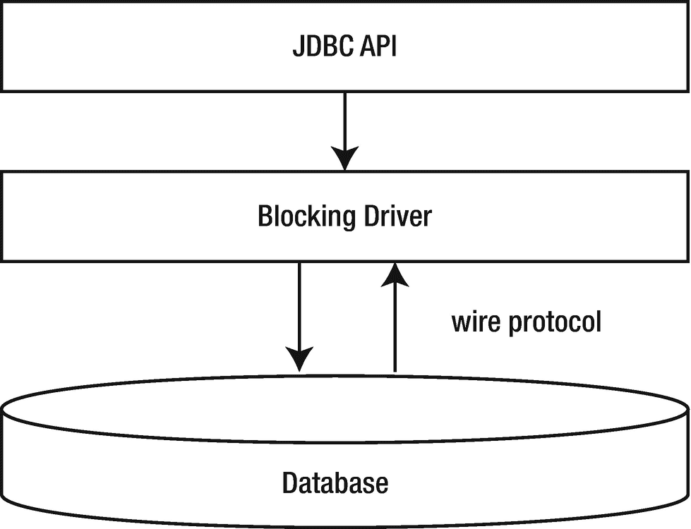
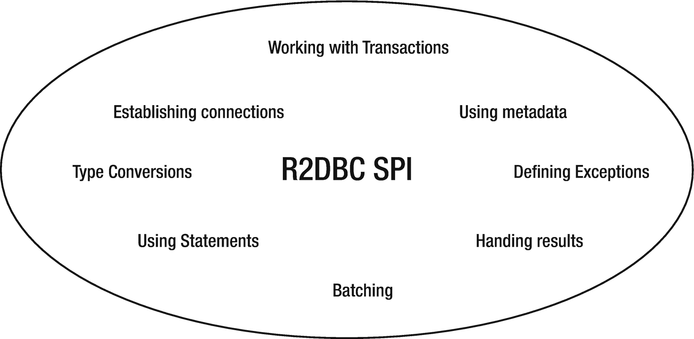
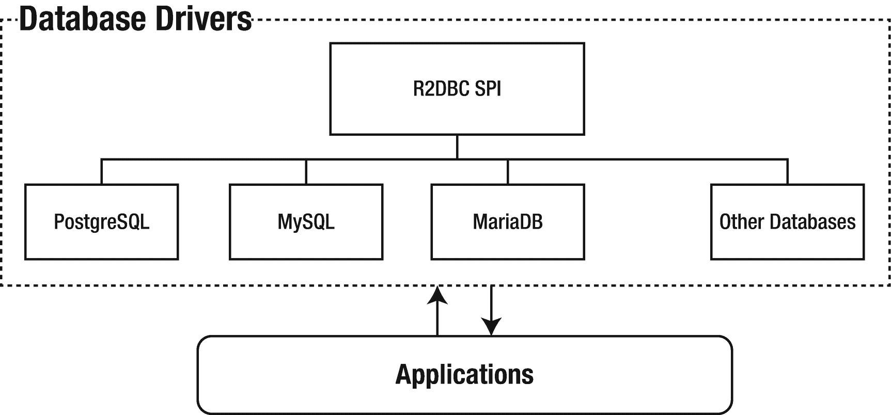
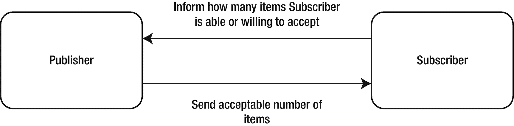
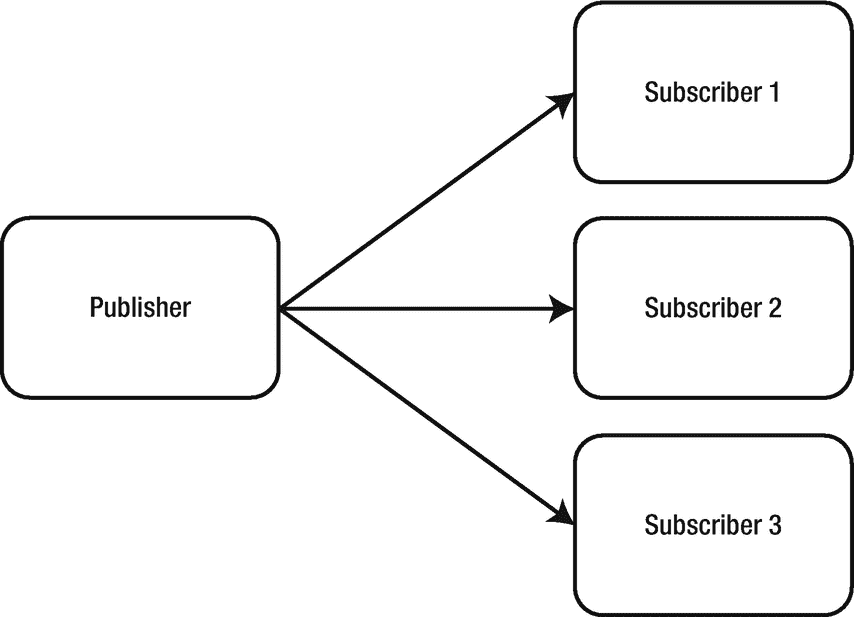
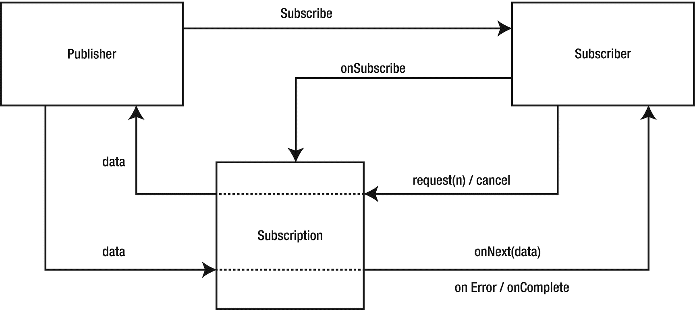

# 二、R2DBC 简介

反应式编程已经成为应用开发的一个游戏变化，这一点也不奇怪。正如我在前一章所解释的，它对于创建非阻塞解决方案来帮助优化资源使用非常有用。但是为了让一个解决方案真正具有反应性，它必须无处不在，包括数据库交互。

毕竟，大多数应用都需要某种持久存储，许多应用使用关系数据库来完成这一任务。关系数据库已经存在了几十年，像 Java 数据库连接(Java Database Connectivity，JDBC)应用编程接口(Application Programming Interface，API)这样的用于连接和通信的技术也已经存在了很多年。正因为如此，在反应式解决方案日益流行之前创建的 JDBC API 在与数据库通信时使用了阻塞操作。

然而，正如我之前指出的，为了让一个解决方案真正具有*反应性*，*它需要如此普遍，即使是在处理数据库的时候。反应式编程的使用越来越多，而且大多数应用都使用关系数据库，这促使业界寻找一种解决方案来创建与关系数据库的反应式交互。*

 *## R2DBC 是什么？

创建反应式关系数据库连接(R2DBC)是为了在关系数据存储和使用反应式编程模型的系统之间架起一座桥梁。

### 新方法

在功能上，通过使用 R2DBC，用 Java 虚拟机(JVM)编程语言编写的应用可以运行结构化查询语言(SQL)语句，并从目标数据源检索结果，所有这些都是被动的。

这是可能的，因为 R2DBC 是一种新的开放规范，它提供了完全反应式编程 API 来连接关系数据存储并与之通信(图 [2-1](#Fig1) )。


图 2-1

R2DBC 层次结构和工作流程

Note

一个*有线协议* *l* 指的是一种从一点到另一点获取数据的方式，一种网络中一个或多个应用互操作的方式。它通常指高于物理层的协议。

最终，通过使用反应式编程范式的基本概念，R2DBC 消除了其关系数据库连接前辈的阻塞性质，如 JDBC(图 [2-2](#Fig2) )。



图 2-2

JDBC 层次结构和工作流

### 超越 JDBC

但是为什么要采用全新的方法呢？您可能想知道，“难道不能做些什么来修改 JDBC API，使其反应性地工作吗？”答案是肯定的。这当然是可能的，但代价是什么？

创建新方法的决定可以追溯到 2017 年，当时 R2DBC 的创建者在 R2DBC 存在之前，渴望使用一种 Oracle 诞生的解决方案来被动处理关系数据库，称为异步数据库访问(ADBA)，也称为“java.sql2”。理想情况下，该小组希望研究一种完全被动的 API，而不必承担与标准机构打交道的负担。然而，ADBA 的使用是短命的，因为在调查该方法时，该小组未能说服 Oracle 团队合并某些不可协商的架构更改。

Note

2017 年 9 月 18 日，在甲骨文 CodeOne 开发者大会上，甲骨文宣布他们将停止 ADBA(异步数据库访问)的工作。

考虑到他们在 ADBA 的经历，这个团队无法说服他们自己演进 JDBC 是正确的方法，而是更喜欢一个现代的、真正反应性的 API。结合快速创新周期和创建开放标准的优势，将 R2DBC 开发为独立的规范是最有意义的。新规范的创建也为实现者在技术方向和其中的依赖性上提供了更多的自由空间。

另外，如前所述，虽然 R2DBC 的主要焦点是关系数据库，但并不局限于此。相反，目的是将重点放在使用 SQL 或类似 SQL 的方言以表格格式表示数据的存储机制上。

## R2DBC 实现

R2DBC 通过提供服务提供商接口(SPI)来工作。SPI 只是一组接口，通过定义用于被动处理关系数据库的基本元素，作为关系数据存储供应商实施的指南(图 [2-3](#Fig3) )。



图 2-3

R2DBC SPI 定义的一些功能

在接下来的几章中，我将更深入地研究 SPI 中可用的特定接口，以及它们如何组合在一起使关系数据库交互真正具有反应性。

客户端库和应用可以使用 R2DBC 驱动程序实现，该驱动程序利用 SPI 来创建完全反应式解决方案(图 [2-4](#Fig4) )。



图 2-4

R2DBC 驱动程序实现拓扑和工作流

### 拥抱反应式编程

最重要的是，R2DBC 规范的目标是提供一个 API，能够使用反应式编程模型促进与关系数据存储的集成。为了实现这一目标，该规范包含了反应式编程的关键属性，这些属性侧重于有效利用资源，包括以下内容:

*   通过延迟和异步执行实现非阻塞 I/O

*   使用背压来允许流量控制，推迟实际的执行，并且不会让消费者不知所措

*   将应用控制视为一系列事件(数据、错误、完成)和面向流的数据消费

*   不再承担对资源的控制，而是将资源调度留给运行时或平台

### 激发供应商的创造力

与 JDBC 不同，R2DBC API 旨在尽可能地轻量级，从而允许实现具有很大的灵活性。为了帮助实现这一目标，R2DBC 被构建为支持以 Java 为主要平台的反应式 JVM 平台，能够使用结构化查询语言(SQL)作为交互接口来访问数据。

虽然 SPI 还提供对许多不同供应商实施中常见功能的访问，但 R2DBC 对简单性的关注为供应商提供了很大的灵活性。因为每个数据库都有自己的特性，R2DBC 的目标是为常用的功能定义一个最低标准，并允许特定于供应商的偏差。

最终，R2DBC 的强大之处在于它能够在驱动程序中实现的特性和在客户端库中更好实现的特性之间提供平衡。

### 强制合规

R2DBC 驱动程序实现必须满足各种要求，并通过一系列测试，才能被官方认可。正如我前面提到的，R2DBC 的主要焦点是 SQL 与关系数据存储的使用；那只是冰山一角。

在众多实施要求中，SPI 必须实施非阻塞 I/O 层。

Stay Tuned

在第 [3](03.html) 章中，我将详细介绍 R2DBC 的合规性要求。

在下一节中，您将更好地理解 *Reactive Streams* API 如何支持无阻塞背压感知数据访问。

## 反应流

之前，我介绍了反应式编程的概念，以及在异步数据流的帮助下使用背压来帮助调节数据流。回想一下，背压的概念围绕着限制在传输管道的各个阶段之间传输的数据量，以便数据移动过程中的任何阶段都不会不堪重负。

*Reactive Streams* 是一项倡议，它提供了一个标准，通过许多接口定义，用于管理具有非阻塞背压的异步流处理。

### 另一个规格

最重要的是，要知道 Reactive Streams 标准化了异步数据流的使用，确保接收端不会被迫缓冲或积压任意数量的数据。事实上，关键目标是以异步方式强制使用背压信号，以确保反应流实现的完全异步、无阻塞行为。

反应流仅仅是一个规范，因此，它的目的是创建符合规范的实现。这意味着流操作的各种选项，比如转换、分割和合并，不是由规范本身来处理的。相反，Reactive Streams 只关心调节底层 API 组件之间的数据流或工作流。

与 R2DBC SPI(我将在下一章详细讨论)类似，Reactive Streams 规范提供了一个标准的测试套件——技术兼容性工具包(TCK ),用于测试实现的兼容性。虽然实现可以根据规范自由地实现额外的特性，但是它们必须符合所有的反应流 API 要求，并通过 TCK 中的所有测试。

### API 基础

API 由以下组件组成，这些组件需要由 Reactive Streams 实现提供:

1.  出版者

2.  订户

3.  签署

4.  处理器

订阅者的角色是让发布者知道它已经准备好接受大量的项目，如果项目可用，发布者会推送尽可能多的项目，直到请求的最大值(图 [2-5](#Fig5) )。



图 2-5

订阅者向发布者请求项目

这应该看起来很熟悉，因为正如我在上一章(图 1-11)中描述的，限制订户愿意接受的项目数量的过程，正如订户自己指出的，被称为*背压*。

反应流 API 在订阅者和发布者之间建立双向连接作为订阅。订阅表示订阅发布者的订阅者的一对一生命周期(图 [2-6](#Fig6) )。


图 2-6

发布者和订阅者之间的订阅

虽然一个发布者可以有多个订阅者，但是一个订阅者只能订阅一个发布者(图 [2-7](#Fig7) )。



图 2-7

一个发布者可以有多个订阅者

订阅者订阅发布者后，发布者会通知订阅者已创建的订阅。那么订户可以自由请求 *n* 个项目。

一旦出版商有可用的项目，它最多只能向订阅者发送 *n* 个项目。如果在任何时候，出版者内部发生错误，它就发出了一个*错误*的信号。当发布者完成发送数据时，它会向订阅者发出信号，表示它完成了*。*

 *

图 2-8

反应流订阅工作流

### 处理器

既作为发布者又作为订阅者存在的实体被称为*处理器*。处理器通常被用作发布者和订阅者之间的中介，以处理数据流上的转换，如数据过滤(图 [2-9](#Fig9) )。


图 2-9

在发布者和订阅者之间使用的处理器

### JVM 接口

如前一节所述，Reactive Streams 由四个主要实体组成，*发布者*、*订阅者*、*订阅者*和*处理器*，它们作为接口存在，用于在 JVM 中创建实现库。

*发布者*接口只允许订阅者通过一个公开的名为`subscribe`的方法订阅发布者。通用类型 T 用于表示发行商生产的项目类型:

```java
public interface Publisher<T> {
    public void subscribe(Subscriber<? super T> s);
}

```

*用户*界面需要四种交互方法:

1.  `onSubscribe`:用于通知*用户*订阅成功

2.  `onNext`:接受*发布者*推送的项目

3.  `onError`:接受来自*发布者*的错误通知

4.  `onComplete`:接受来自*发布者*的完成信号

    ```java
    public interface Subscriber<T> {
        public void onSubscribe(Subscription s);
        public void onNext(T t);
        public void onError(Throwable t);
        public void onComplete();
    }

    ```

*订阅*需要两种交互方式:

1.  `request`:接受来自*用户*的项目请求

2.  `cancel`:接受*用户*的取消

```java
public interface Subscription {
    public void request(long n);
    public void cancel();
}

```

*处理器*既是订阅者又是发布者。处理器可以生成与它所消费的项目类型不同的项目，因此，泛型(T，R)用于表示消费和生成的类型:

```java
public interface Processor<T, R> extends Subscriber<T>, Publisher<R> {
}

```

### 履行

可以想象，已经创建了各种各样的反应流实现，它们作为第三方库提供，可以包含在 JVM 应用中。事实上，由于 Reactive Streams 标准及其在当时许多 Java 包中的使用非常流行，作为并发更新的一部分，该规范作为 Java 开发人员工具包(JDK) 9 版本的一部分被添加到 Java 标准库中作为增强。

包含 Reactive Streams 标准有助于减少由所有用法(仅由包名分隔)引起的重复和固有的兼容性问题。自 Java 9 发布以来，基本的反应流接口包含在流并发库中，允许 Java 应用依赖单个库来实现反应流接口，而不是决定特定的实现。

然而，重要的是要注意，虽然 JDK 中有*流并发*库，但是 R2DBC 规范直接从源使用反应流规范*。例如，这意味着 R2DBC 规范使用直接来自`org.reactivestreams.Publisher`的*发布者*，而不是`java.util.concurrent.Flow`中可用的接口。*

## 摘要

在本章中，我向您介绍了反应式关系数据库连接(R2DBC ),它创建的原因，它旨在解决的问题，以及它如何使用反应式流 API 来完成这一切。

此外，我简要描述了实现需要遵守严格的遵从性级别，才能被视为合法的 R2DBC 客户机。在下一章中，我将详细介绍 SPI 接口，如何使用这些接口创建驱动程序实现，以及实现完全符合 R2DBC 标准的要求。**