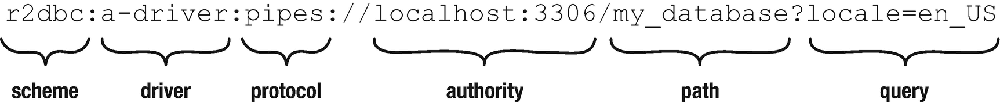
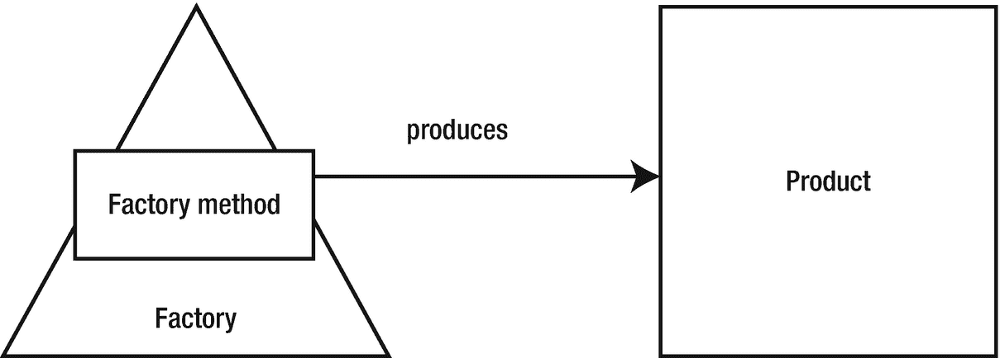

# 4.连接

支持到数据源的连接是任何应用程序中的一项重要功能。事实上，根据应用程序的不同，它很可能是最重要的功能。理解了连接功能的重要性，R2DBC 规范提供了各种接口和类，这些接口和类允许驱动程序实现不仅建立连接，而且以纯反应的方式有效地管理它们。

在这一章中，我将研究 R2DBC SPI 的最重要的方面，创建和管理连接。我将深入研究 API 中可用的实体的层次结构，以扩展它们是如何被设计和组合起来为实现驱动程序提供一个极其健壮和灵活的解决方案的。

## 建立联系

最终，一切都归结于`Connection`接口，R2DBC 用它来定义到底层数据源的连接 API。在很大程度上，目标数据源可能是一个使用 SQL 作为数据访问方法的关系数据库，但是，正如我前面指出的，这不是一个硬性要求。然而，出于我们的目的，在本章中，我将把重点放在专门针对关系数据库管理系统(RDMSs)的连接上。

Note

R2DBC 驱动程序实现不需要使用关系数据库作为底层数据源，事实上，它可以使用任何数据源，包括面向流和面向对象的系统。

### 解剖学

随着时间的推移，使用数据库连接的应用程序通常需要管理多个连接，甚至可能是多个连接。R2DBC SPI 使应用程序能够管理到一个或多个数据源的连接。虽然`Connection`对象的目的是使驱动程序能够建立和维护单个客户端连接，但应用程序通常需要比这更复杂的东西。

但是因为一个`Connection`对象代表一个单独的客户端会话，并且有相关的状态信息，比如用户标识和什么事务语义有效，`Connection`对象对于多个订阅者的并发状态改变交互是不安全的。

事实上，通过使用适当的同步机制，甚至有可能在串行运行操作的多个线程之间共享`Connection`对象。

幸运的是，R2DBC 驱动程序并不要求应用程序直接创建和管理`Connection`对象，而是通过

1.  使用一个`ConnectionFactory`实现来创建一个`Connection`对象

2.  使用 R2DBC 提供的`ConnectionFactories`类，通过利用一个或多个`ConnectionFactoryProvider`实现，然后可以使用这些实现来获得一个`ConnectionFactory`实现

在本章的后面，我们将深入探讨连接工厂以及它们在各种其他连接类和接口之间的关系中所扮演的角色。但是现在，让我们把注意力放在通过使用连接工厂来创建连接的途径上(图 [4-1](#Fig1) )。


图 4-1

R2DBC 连接层次结构

### R2DBC 后见之明

如果你曾经使用过 JDBC API，你就会知道这可能是一个复杂的、经常令人沮丧的过程。多年来，JDBC 变得非常固执己见，要求开发者坚持其底层技术和功能限制。

您已经了解到 R2DBC 的创建是为了给驱动程序实现提供高度的灵活性，允许它们利用目标数据源的独特特性和功能。同时，R2DBC 旨在标准化所有驱动程序所需的功能。这方面的一个实际例子是使用标准的统一资源定位符(URL)格式。

Note

数据库连接 URL 是 JDBC 驱动程序用来连接数据库的字符串。它可以包含在哪里搜索数据库、要连接的数据库的名称以及许多其他配置选项等信息。

与要求每个驱动程序实现创建需求(包括 URL 解析工作流)的 JDBC 相反，R2DBC 定义了一个标准的 URL 格式。该格式是请求注解(RFC) 3986 统一资源标识符(URI)的增强形式:通用语法，Java 的`java.net` `.URI`类型支持其修改。



图 4-2

R2DBC 连接 URL 格式

创建 URL 标准允许所有驱动程序实现统一利用以下配置选项:

*   `scheme`:标识该 URL 是有效的 R2DBC URL。有两种有效的方案， *r2dbc* 和*r2dbc*，用于配置安全套接字层(SSL)的使用。

*   `driver`:标识具体的驱动实现(如 MySQL、MariaDB 等)。).

*   `protocol`:可选参数，用于配置驱动专用协议。协议可以分层组织，并用冒号(:)分隔。

*   `authority`:包含端点和授权。授权可以包含单个主机或主机名和端口元组的集合，用逗号(，)分隔。

*   `path`:(可选)用作初始模式或数据库名。

*   `query`:(可选)用于通过使用键名称作为选项名称，以字符串键-值对的形式传递附加配置选项。

## 连接工厂

在计算机科学中，工厂被视为创建其他对象的对象。这很有用，因为在基于类的编程中，工厂作为目标对象构造函数的抽象，有助于本地化复杂对象的实例化(图 [4-3](#Fig3) )。



图 4-3

工厂对象工作流

利用这种方法，R2DBC `ConnectionFactory`接口为驱动程序提供了创建对象的蓝图，这些驱动程序负责创建`Connection`对象(列表 [4-1](#PC1) )。

```java
import org.reactivestreams.Publisher;
public interface ConnectionFactory {
    Publisher<? extends Connection> create();
    ConnectionFactoryMetadata getMetadata();
}

Listing 4-1The R2DBC ConnectionFactory interface

```

### 驱动程序实现

使用基于工厂的方法来促进连接创建和管理，允许驱动程序抽象出特定于供应商或特定于数据库的方面，以努力创建更简单、更流畅的应用程序开发体验。

更深入地研究一下，R2DBC 文档指出了许多需求，这些需求准确地定义了*`ConnectionFactory`实现必须完成什么才能被认为是可行的:*

 *1.  `ConnectionFactory`表示用于延迟连接创建的资源工厂。它可以自己创建连接，包装一个`ConnectionFactory`，或者在一个`ConnectionFactory`之上应用连接池。

2.  A `ConnectionFactory`通过`ConnectionFactoryMetadata`提供关于驱动本身的元数据。

3.  A `ConnectionFactory`使用延迟初始化，并且应该在请求项目之后启动连接资源分配(`Subscription.request(1)).`

4.  连接创建必须发出一个`Connection`或一个错误信号。

5.  连接创建必须是可取消的(`Subscription.cancel()`)。取消连接创建必须释放(“关闭”)连接和所有关联的资源。

6.  A `ConnectionFactory`应该预料到可以包装。包装器必须实现`Wrapped<ConnectionFactory>`接口，并在`Wrapped.unwrap()`被调用时返回底层的`ConnectionFactory`。

### 公开元数据

`ConnectionFactory`接口包括一个名为`getMetadata`的函数，该函数要求类实现提供元数据来标识目标产品的名称(清单 [4-2](#PC2) )。

```java
public interface ConnectionFactoryMetadata {
String getName();
}

Listing 4-2The ConnectionFactoryMetadata interface

```

## 连接工厂

除了提供额外的抽象，SPI 还包含一个名为`ConnectionFactories`的完全实现的类，它的存在消除了应用程序开发人员实现`Connection`发现功能的需要。通过使用 Java 的`ServiceLoader`机制和`ConnectionFactoryProvider`接口，`ConnectionFactories`发现机制使得自动查找和加载在*类路径*中找到的任何 R2DBC 驱动程序成为可能。

### 发现

`ConnectionFactoryProvider`是一个 Java 服务接口，当实现时，它提供检查`ConnectionFactoryOptions`类的能力(清单 [4-3](#PC3) )。

```java
import java.util.ServiceLoader;
public interface ConnectionFactoryProvider {
ConnectionFactory create(ConnectionFactoryOptions connectionFactoryOptions);
boolean supports(ConnectionFactoryOptions connectionFactoryOptions);
String getDriver();
}

Listing 4-3The ConnectionFactoryProvider interface

```

`ConnectionFactoryOptions`类表示一个`ConnectionFactory`对象向一个`ConnectionFactoryProvider`对象请求的配置(图 [4-4](#Fig4) )。


图 4-4

高级 ConnectionFactory 发现工作流

### 将这一切结合在一起

使用`ConnectionFactoryProvider`对象，`ConnectionFactories`类提供了两种引导`ConnectionFactory`对象的方法:

1.  使用 R2DBC 连接 URL。然后 URL 字符串将被解析以创建一个`ConnectionFactoryOptions`对象。

```java
ConnectionFactory factory = ConnectionFactories.get("r2dbc:a-driver:pipes://localhost:3306/my_database?locale=en_US");

Listing 4-4Obtaining a ConnectionFactory using an R2DBC URL

```

1.  通过直接构建一个`ConnectionFactoryOptions`对象。

```java
ConnectionFactoryOptions options = ConnectionFactoryOptions.builder()
     .option(ConnectionFactoryOptions.DRIVER, "a-driver")
     .option(ConnectionFactoryOptions.PROTOCOL, "pipes")
     .option(ConnectionFactoryOptions.HOST, "localhost")
     .option(ConnectionFactoryOptions.PORT, 3306)
     .option(ConnectionFactoryOptions.DATABASE, "my_database")
     .option(Option.valueOf("locale"), "en_US")
     .build();

ConnectionFactory factory = ConnectionFactories.get(options);

Listing 4-5Obtaining a ConnectionFactory using ConnectionFactoryOptions programmatically

```

一旦你获得了一个`ConnectionFactory`对象，你就有能力获得一个`Connection`对象。

## 连接

`Connection`接口的每个连接实现实例化(清单 [4-6](#PC6) )提供了到数据库的单个连接。

```java
import org.reactivestreams.Publisher;
public interface Connection extends Closeable {
    Publisher<Void> beginTransaction();
    @Override Publisher<Void> close();
    Publisher<Void> commitTransaction();
    Batch createBatch();
    Publisher<Void> createSavepoint(String name);
    Statement createStatement(String sql);
    boolean isAutoCommit();
    ConnectionMetadata getMetadata();
    IsolationLevel getTransactionIsolationLevel();
    Publisher<Void> releaseSavepoint(String name);
    Publisher<Void> rollbackTransaction();
    Publisher<Void> rollbackTransactionToSavepoint(String name);
    Publisher<Void> setAutoCommit(boolean autoCommit);
    Publisher<Void> setTransactionIsolationLevel(IsolationLevel isolationLevel);
    Publisher<Boolean> validate(ValidationDepth depth);
}

Listing 4-6The R2DBC Connection interface

```

Tip

注意，`Connection`接口利用了反应流 API，将许多函数的返回类型作为类型`Publisher`提供。回到第二章[的第二章](02.html)，记住*的发布者*的作用是承诺在未来未知的时间做出回应或结果。

当使用`Connection`对象建立连接时，可以执行 SQL 语句并随后返回结果。根据 R2DBC 文档,`Connection`对象可以由到底层数据库的任意数量的传输连接组成，或者代表多路传输连接上的一个会话。为了获得最大的可移植性，应该同步使用连接。

最终，`Connection`对象的存在是为了启动数据库对话、事务管理和语句执行。

表 4-1

连接接口功能

<colgroup><col class="tcol1 align-left"> <col class="tcol2 align-left"></colgroup> 
| 

名字

 | 

描述

 |
| --- | --- |
| `beginTransaction` | 开始新的事务。调用此方法将禁用自动提交模式。 |
| `close` | 释放由`Connection`对象持有的任何资源。 |
| `commitTransaction` | 提交当前事务。 |
| `createBatch` | 创建一个新的批次(参见第 [8 章](08.html))。 |
| `createSavePoint` | 在当前事务中创建新的保存点。 |
| `createStatement` | 为构建基于语句的(SQL)请求创建新语句。 |
| `isAutoCommit` | 返回连接的自动提交模式。 |
| `getMetadata` | 返回连接所连接的产品的`ConnectionMetaData`(例如，MariaDB 数据库)。 |
| `getTransactionIsolationLevel` | 返回连接的`IsolationLevel`。 |
| `releaseSavePoint` | 释放当前事务中的保存点。 |
| `rollbackTransaction` | 回滚当前事务。 |
| `rollbackTransactionToSavepoint` | 将当前事务回滚到保存点。 |
| `setAutoCommit` | 为当前事务配置自动提交模式。 |
| `setTransactionIsolationLevel` | 为当前事务配置隔离级别。 |
| `validate` | 根据给定的`ValidationDepth`验证连接。 |

### 获取连接

`Connection`对象只能通过`ConnectionFactory`对象来创建和获取，这一点我之前已经详细说明过了。一旦获得了一个`ConnectionFactory`对象，就可以使用`create`方法来访问一个连接。

```java
Publisher<? extends Connection> publisher = factory.create();

Listing 4-7Creating a connection from a ConnectionFactory object

```

### 获取元数据

R2DBC 规范要求连接通过实现`ConnectionMetadata`接口(清单 [4-8](#PC8) )来公开关于它们所连接的数据库的元数据。

```java
public interface ConnectionMetadata {
    String getDatabaseProductName();
    String getDatabaseVersion();
}

Listing 4-8ConnectionMetadata interface

```

Note

在`ConnectionMetadata`对象中发现的信息通常是基于连接初始化时获得的信息动态发现的。

### 验证连接

一旦实例化了一个`Connection`对象，就可以使用`validate`方法来获得连接的状态。validate 方法接受一个`ValidationDepth`参数，该参数指示应该验证连接的深度。

`ValidationDepth`是包含两个常数的枚举:

*   `ValidationDepth.LOCAL`:表示只进行客户端验证。

*   `ValidationDepth.REMOTE`:指示进行远程连接验证。

### 关闭连接

回头看看`Connection`接口，您会注意到它实现了`Closable`接口(清单 [4-9](#PC9) )。

```java
import org.reactivestreams.Publisher;
import org.reactivestreams.Subscriber;

@FunctionalInterface
public interface Closeable {
    Publisher<Void> close();
}

Listing 4-9The Closeable interface

```

`Closable`接口公开了一个名为`close`的方法，当这个方法被调用时，它将释放实现对象`Connection`持有的所有资源。

```java
Publisher<Void> close = connection.close();

Listing 4-10Closing a connection

```

## 摘要

提供连接到底层数据源的能力是 R2DBC 规范最重要的功能之一。虽然有许多相似之处，但关系数据库也可能包含不同的连接要求。R2DBC 仅使用少量的接口和类，就能够提供所有数据源共享的通用功能，并为驱动程序提供灵活性，以整合其目标产品的独特功能。

你在本章中学到的所有信息将在接下来的章节中对你有所帮助。毕竟，如果没有连接的能力，它最终会是一本非常短的书。*