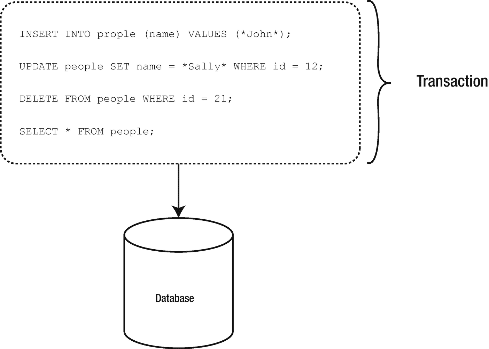
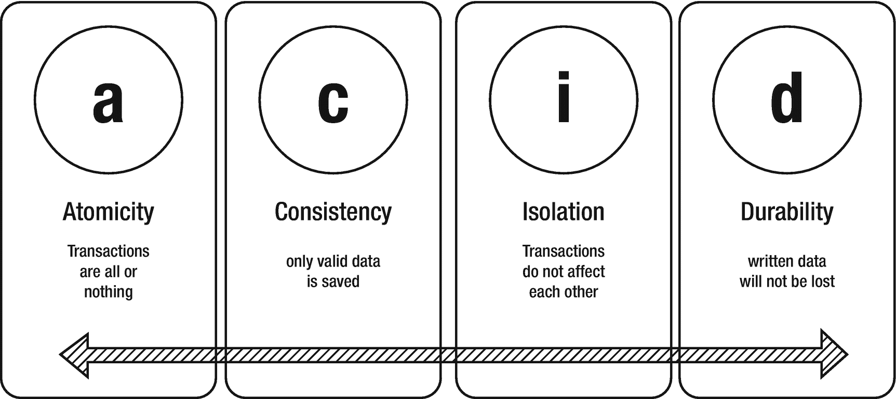
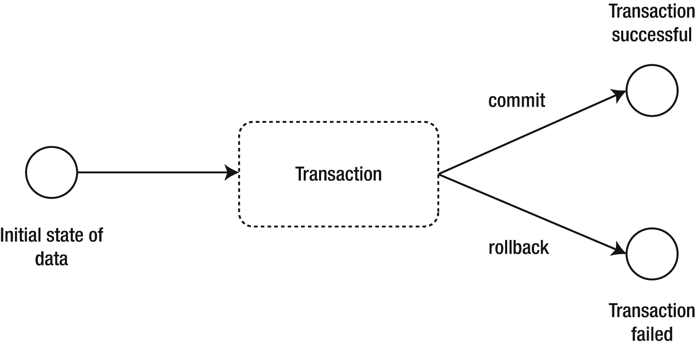

# 五、事务

支持事务的能力是所有关系数据库的一个重要方面。事实上，这是它们最重要的特性之一，因为它们的使用通常是维护任何规模和复杂性的数据库的关键部分。

鉴于这种理解，R2DBC 规范为驱动程序实现提供支持和指导以公开核心事务管理功能是有意义的。在此过程中，我们将探索规范要求实现哪些事务性特性，同时还将研究如何以及何时利用这些特性。所有这些都是为了了解 R2DBC 如何帮助利用事务来提供数据完整性、隔离性、正确的应用语义，以及在反应式、并发数据库访问期间的一致数据视图。

## 事务基础

在深入 R2DBC 规范如何处理事务的细节之前，理解关系数据库中事务管理的基本概念、需求和用法很重要，即使只是为了更新您的现有知识。

*事务*被定义为包含一个或多个 SQL 语句的逻辑工作单元(图 [5-1](#Fig1) )。



图 5-1

一个事务包含一个或多个 SQL 语句，作为单个工作单元启动

更简单地说，您可以将事务视为对数据库的一个或多个更改的传播。

### 事务的需要

但是为了理解*为什么*将 SQL 语句分组为事务是必要的，让我们首先考虑一个简单的、相关的场景。举个例子，把钱从一个银行账户转移到另一个银行账户的过程，为了简单起见，让我们假设这个过程仅仅包括更新余额(清单 [5-1](#PC1) )。

```java
UPDATE savings_account SET balance = 0 WHERE account_id = 1;
UPDATE checking_account SET balance = 100 WHERE account_id = 1;

Listing 5-1A sample update to account tables using SQL

```

当然，正如你可以想象的那样，重要的是钱在你期望的地方，当你期望它在的时候。这意味着对每个帐户的更改要么都成功，要么都失败。否则，你只能从一个账户中取出或向另一个账户中加入钱，造成信息的不匹配。在数据库管理系统中，支持这些类型的期望被称为 *ACID 合规性。*

### 酸性顺应性

正如我之前定义的，事务是工作单元，但是，进一步说，事务更具体地被称为*原子*工作单元。这意味着当事务对数据库进行一个或多个更改时，要么在提交事务时所有更改都成功，要么在事务回滚时所有更改都被撤消。这种“全有或全无”的特性被称为**原子性**。

事务应该是一个独立的单元，因此，在其中执行的操作不能与流程中不涉及的其他数据库操作合并。然而，由于事务可以由多个 SQL 命令组成，甚至可能访问多个数据库，因此数据库管理系统必须确保操作不会受到可能同时或并发运行的其他数据库命令的干扰。这是一个被称为**隔离**的特性。

为了确保数据库系统不会因为后来的故障而错过成功完成的事务，事务的动作必须在故障之间持续。此外，一个事务的结果只能由另一个事务撤消。这种特性被称为**耐久性**。

由于这三个属性，事务的作用是通过一个被恰当地称为**一致性**的属性来保持数据库的一致性。

如图 [5-2](#Fig2) 所示，这些特性组合在一起形成了首字母缩略词 ACID。



图 5-2

酸性质的高度概括

### 控制方法

实际上，事务从第一个可执行 SQL 语句开始，在提交或回滚时结束(图 [5-3](#Fig3) )。



图 5-3

简单的事务性工作流

Caution

并非所有数据库管理系统的所有 SQL 语句都能够回滚。例如，MySQL 和 MariaDB 不支持回滚修改，如数据描述语言(DDL)，即创建和修改数据库对象(如表、索引和用户)的语法。有关更多信息，请查看目标数据库的文档。

#### 提交事务

*提交*事务是将更改永久保存到数据库的过程(清单 [5-2](#PC2) )。

```java
START TRANSACTION;
UPDATE savings_account SET balance = 0 WHERE account_id = 1;
UPDATE checking_account SET balance = 100 WHERE account_id = 1;
COMMIT;

Listing 5-2Committing a MariaDB transaction using SQL

```

#### 回滚事务

*回滚*事务意味着撤销对未提交事务中数据的任何更改。如果在事务范围内执行 SQL 时出现错误，事务会自动回滚，但也可以手动回滚，如清单 [5-3](#PC3) 所示。

```java
START TRANSACTION;
UPDATE savings_account SET balance = 0 WHERE account_id = 1;
UPDATE checking_account SET balance = 100 WHERE account_id = 1;
ROLLBACK;

Listing 5-3Rolling back a MariaDB transaction using SQL

```

##### 保存点

许多关系数据库也支持*保存点*，一个命名的子事务。保存点提供了在事务中标记中间点的能力，可以回滚到这些中间点而不影响前面的工作(清单 [5-4](#PC4) )。

```java
START TRANSACTION;
UPDATE savings_account SET balance = 0 WHERE account_id = 1;
SAVEPOINT savings_account_updated;
UPDATE checking_account SET balance = 100 WHERE account_id = 1;
ROLLBACK TO SAVEPOINT savings_account_updated;

Listing 5-4Rolling back to a MariaDB savepoint using SQL

```

## R2DBC 事务管理

R2DBC 规范支持通过代码控制事务性操作，而不是通过所有驱动程序都需要实现的`Connection`接口直接使用 SQL。

### 自动提交模式

事务可以隐式或显式启动。当一个连接对象处于自动提交模式时，这将在本章后面详细讨论，当一个 SQL 语句通过一个`Connection`对象执行时，事务被隐式启动。

Stay Tuned

在第 [6 章](06.html)中，我们将发现如何使用`Connection`对象来准备和执行 SQL 语句。

连接对象提供了两种与自动提交模式交互的方法，如表 [5-1](#Tab1) 所示。

表 5-1

用于查看和编辑事务自动提交功能的连接对象方法

<colgroup><col class="tcol1 align-left"> <col class="tcol2 align-left"> <col class="tcol3 align-left"></colgroup> 
| 

方法

 | 

返回类型

 | 

描述

 |
| --- | --- | --- |
| 设置自动提交 | 出版商 | 为当前事务配置自动提交模式。 |
| isAutoCommit | 布尔 | 返回事务的自动提交模式。isAutoCommit 的默认值由驱动程序实现决定。 |

正如 R2DBC 规范文档中所指出的，应用应该通过调用`setAutoCommit`方法来更改自动提交模式，而不是执行 SQL 命令来更改底层连接配置。无论出于何种原因，如果在活动事务期间自动提交的值被更改，则当前事务将被提交。

Caution

如果调用了`setAutoCommit`方法，并且自动提交的值没有从当前值改变，它将被视为空操作。

要知道，修改一个`Connection`对象的自动提交模式很可能会在底层数据库上启动某种动作，这也是为什么`setAutoCommit`会返回一个`Publisher`对象。相比之下，使用`isAutoCommit`通常会涉及到使用驱动程序的状态，而不是必须与数据库通信。

### 显性事务

但是，当自动提交模式被禁用时，事务必须显式启动。这可以通过在一个`Connection`对象上调用`beginTransaction`方法来完成。

```java
Publisher<Void> begin = connection.beginTransaction();

Listing 5-5Creating a publisher to begin a transaction

```

#### 提交事务

一旦事务被显式启动，它也必须被显式提交。

```java
Publisher<Void> commit = connection.commitTransaction();

Listing 5-6Creating a publisher to commit a transaction

```

#### 回滚事务

如果由于某种原因，事务执行的查询之一失败，可以使用`rollbackTransaction`方法回滚所有查询。

```java
try {
   Publisher<Void> begin = connection.beginTransaction();
   Publisher<Void> updateSavings = connection.createStatement("UPDATE savings_account SET balance = 0 WHERE account_id = 1").execute();
   Publisher<Void> updateChecking = connection.createStatement("UPDATE checking_account SET balance = 100 WHERE account_id = 1").execute();
   Publisher<Void> transaction = connection.commitTransaction();
}
catch (SQLException ex) {
   Publisher<Void> transaction = connection.rollbackTransaction();
}

Listing 5-7Handling an error with a committed transaction and rolling back

```

Tip

注意，我已经提供了创建`Publisher`对象的例子。然而，为了执行`Publisher`的功能，必须订阅它。为了订阅一个`Publisher`对象，它必须有一个正式的 R2DBC 实现。要了解这一点，请看一下第 [14 章](14.html)中提供的实用 R2DBC 驱动程序示例。

### 管理保存点

`Connection`接口提供了三种方法，如表 [5-2](#Tab2) 所示，可用于管理保存点。

表 5-2

用于管理保存点的连接对象方法

<colgroup><col class="tcol1 align-left"> <col class="tcol2 align-left"> <col class="tcol3 align-left"></colgroup> 
| 

方法

 | 

返回类型

 | 

描述

 |
| --- | --- | --- |
| createSavepoint() | 出版商 | 在当前事务中创建保存点。 |
| 释放保存点() | 出版商 | 释放当前事务中的保存点。 |
| 回滚事务到保存点（字符串名称） | 出版商 | 回滚到当前事务中的保存点。 |

`createSavepoint`方法可用于在事务范围内设置保存点。如果没有活动的事务，调用`createSavepoint`将启动一个事务。

Note

在事务中创建保存点将禁用包含连接的自动提交。

创建保存点后，可以使用`rollbackTransactionToSavepoint`方法回滚工作，而不用回滚整个事务。

```java
Publisher<Void> begin = connection.beginTransaction();
Publisher<Void> updateSavings = connection.createStatement("UPDATE savings_account SET balance = 0 WHERE account_id = 1").execute();
Publisher<Void> savepoint = connection.createSavepoint("savepoint");
Publisher<Void> updateChecking = connection.createStatement("UPDATE checking_account SET balance = 100 WHERE account_id = 1").execute();
Publisher<Void> partialRollback = connection.rollbackTransactionToSavepoint("savepoint");
Publisher<Void> commit = connection.commitTransaction();

Listing 5-8Rolling back a transaction to a savepoint.

```

Note

根据 R2DBC 规范文档，不支持保存点创建和回滚到保存点的驱动程序将抛出一个`UnsupportedOperationException`来表示这些特性不受支持。

### 释放保存点

值得注意的是，保存点直接在数据库上分配资源。因此，一些数据库供应商可能要求释放保存点来处置资源。

使用`releaseSavepoint`方法将释放不再需要的保存点。在以下情况下，保存点也将被释放

*   提交一个事务。

*   事务被完全回滚。

*   事务回滚到该保存点。

*   事务回滚到前一个保存点。

根据 R2DBC 规范文档，在不支持保存点释放功能的驱动程序实现中调用`releaseSavepoint`方法将导致无操作。

## 隔离级别

数据库提供了在事务中指定隔离级别的能力。事务隔离的概念定义了一个事务与其他事务执行的数据或资源修改的隔离程度，从而在多个事务处于活动状态时影响并发访问。

### 管理隔离

R2DBC 规范包含一个名为`IsolationLevel`的类，用于表示给定`Connection`的隔离级别常数。使用一个`Connection`对象，你可以利用一个`IsolationLevel`对象分别用`getTransactionIsolationLevel`和`setTransactionIsolationLevel,`来获取和设置事务隔离级别。

`IsolationLevel`类包含四个隔离级别常量，由 ANSI/ISO SQL 标准定义，如下所示:

*   **READ_COMMITTED:** 基于锁的并发控制 DBMS 实现保持写锁，直到事务结束。但是，一旦执行了 SELECT 操作，读锁就会被释放。

*   **READ_UNCOMMITTED:** 脏读是允许的，因此没有一个事务可以看到其他事务尚未提交的更改。这是*最低的*隔离等级。

*   **REPEATABLE_READ:** 基于锁的并发控制 DBMS 实现保持读写锁，直到事务结束。在此级别中，允许出现幻像读取，即当另一个事务向当前正在读取的记录添加新行或从中删除新行时。

*   **可序列化**:基于锁的并发控制 DBMS 实现需要在事务结束时释放读写锁。在这一级，避免了幻像读取。这是*最高的*隔离等级。

### 性能考虑因素

请注意，更改事务隔离级别会对性能产生负面影响。如前所述，在`IsolationLevel`选项中，数据库通常会修改用于确保隔离级别语义的锁定量和资源开销。

根据在任何给定时间支持的并发访问的可用性，可能会影响应用的性能。考虑到这一点，R2DBC 规范文档建议，在确定哪个事务隔离级别合适时，事务管理功能应负责权衡数据一致性需求和性能需求。

## 摘要

在这一章中，我们研究了事务的基本原理。我们学习或更新了事务的基本解剖、控制机制以及为什么它们是必要的记忆。我们还了解到 R2DBC 规范支持启动和管理事务，目标是在符合 ACID 的数据库之间共享核心事务特性和功能。在这个过程中，我们了解了如何在自己的代码中利用 R2DBC 事务能力。此外，我们还了解了事务隔离级别的复杂性及其在规范中的支持。