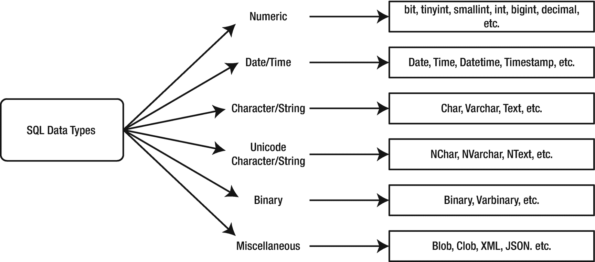
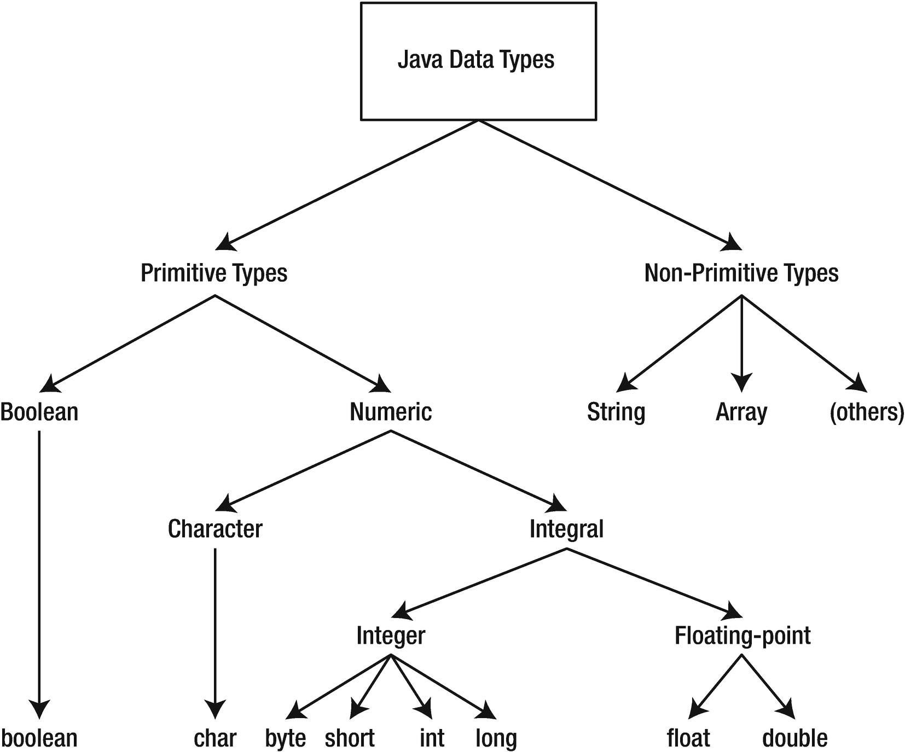

# 9.映射数据类型

在计算机科学中，数据类型是一种数据存储格式，可以包含特定类型的值范围。基本上，当数据被存储时，每个单元必须被分配到一个特定的类型，以便通用。

不同编程语言的数据类型特征和要求可能会有很大差异。当然，结构化查询语言(SQL)也不例外。在本章中，我们将研究 R2DBC 规范如何为常见的 SQL 数据类型提供支持，如何将它们映射到 Java 编程语言，以及如何在应用中使用它们。

## 数据类型差异

SQL 数据类型定义了可以存储在表列中的值的类型。有许多数据类型可用，如图 [9-1](#Fig1) 所示。



图 9-1

SQL 数据类型

然而，并不是所有关系数据库供应商都支持上图中列出的所有数据类型，有些供应商甚至还提供其他数据类型。尽管一些供应商可能会支持特定的数据类型，但很可能他们对每种类型都有不同的大小限制。

如您所知，应用不仅仅是用 SQL 构建的。请记住，R2DBC 驱动程序旨在为 JVM 语言提供支持，JVM 语言可用于构建应用，以一种反应式的方式与关系数据库进行通信。例如，Java 编程语言包含自己的数据类型，这些数据类型分为两大类:原语和非原语(图 [9-2](#Fig2) )。



图 9-2

Java 数据类型

这就产生了这样一种情况，为了能够使用 SQL 数据类型，不管供应商是谁，使用像 Java 或任何其他应用开发语言这样的编程语言，必须完成映射或数据转换的过程。

幸运的是，R2DBC 规范提供了应用对 SQL 中定义的数据类型的访问。事实上，R2DBC 不仅限于 SQL 类型，因为它是类型不可知的，这一点我们将在本章后面深入探讨。

Tip

根据 R2DBC 规范文档，如果数据源不支持本章中描述的数据类型，则该数据源的驱动程序不需要实现与该数据类型关联的方法和接口。

## 映射简单数据类型

R2DBC 规范文档指出了可用作实现驱动程序指南的数据类型列表。R2DBC 驱动程序应该使用现代数据类型和类型描述符来与应用交换数据。

### 字符类型

字符和可变字符数据类型分别接受固定或可变长度的字符串或线性字符序列(表 [9-1](#Tab1) )。

表 9-2

布尔类型的 SQL/Java 类型映射

<colgroup><col class="tcol1 align-left"> <col class="tcol2 align-left"> <col class="tcol3 align-left"></colgroup> 
| 

SQL 类型

 | 

Java 类型

 | 

描述

 |
| --- | --- | --- |
| BOOLEAN | java.lang.Boolean | 一个表示布尔(真/假)状态的值。 |

表 9-1

字符类型的 SQL/Java 类型映射

<colgroup><col class="tcol1 align-left"> <col class="tcol2 align-left"> <col class="tcol3 align-left"></colgroup> 
| 

SQL 类型

 | 

Java 类型

 | 

描述

 |
| --- | --- | --- |
| 性格；角色；字母(字符) | java.lang.String | 字符串，固定长度。 |
| 字符变化(VARCHAR) | java.lang.String | 会厌 |
| 民族性格(NCHAR) | java.lang.String | 类似于字符，但包含标准化的多字节或 Unicode 字符。 |
| 民族变体(NVARCHAR) | java.lang.String | 类似于字符变化，但保留标准化的多字节或 Unicode 字符。 |
| 字符大对象 | java.lang.String，io.r2dbc.spi.Clob | CLOB 是数据库管理系统中字符数据的集合。 |
| 国家字符大对象(NLOB) | java.lang.String，io.r2dbc.spi.Clob | 类似于 CLOB，但包含标准化的多字节字符或 Unicode 字符。 |

### 布尔类型

布尔数据类型支持两个值的存储:TRUE 和 FALSE。

Note

尽管这是一个相当简单的类型，但是需要注意的是，并不是所有的数据库管理系统都包含显式的布尔类型。例如，MySQL 和 MariaDB 使用`TINYINT(1),`来指定长度为 1 的`INTEGER`来包含值 1(表示真)或 0(表示假)。

### 二进制类型

关系数据库使用二进制数据类型来存储二进制数据，二进制数据用于图像、文本文件、音频文件等。

### 数字类型

数字可以用许多不同的方式表示。例如，它们可以是整数、分数、正数或负数。因此，关系数据库提供了多种数据类型来满足这种需求。

Note

在上表中， *p* 代表*精度*， *s* 代表*刻度*。

### 日期时间类型

日期和时间使用适应两者的类型以及两者的组合来存储。数据库管理系统还提供管理时区的功能。

### 集合类型

一些数据库供应商提供了集合数据的类型，如数组和多重集。

## 映射高级数据类型

到目前为止，我们已经研究了 R2DBC 规范支持的简单数据类型。但是，在处理数据时，可能会出现存储大量数据的需求。

虽然早期版本的关系数据库倾向于用现有类型如`VARCHAR`和`NVARCHAR`来处理这种情况，但很快就发现需要更高级的数据类型。

创建大型对象(lob)是为了以优化空间的方式存储数据，并为访问大型数据提供更有效的方法。在下一节中，我们将进一步了解 R2DBC 如何处理两种类型的 lob:blob 和 CLOBs。

### 斑点和土块

BLOBs 或二进制大型对象是一种存储二进制数据的数据类型，它不同于存储字母和数字的关系数据库中使用的其他数据类型，如整数和字符。允许存储二进制数据使得数据库包含图像、视频或其他多媒体文件成为可能。

Note

因为 BLOBs 用于存储照片、音频或视频文件等对象，所以它们通常比其他数据类型需要更多的空间。BLOB 可以存储的数据量因数据库管理系统而异。

CLOBs 或字符大对象与 BLOBs 相似，它们也是为了存储大量数据而存在的。然而，关键的区别在于 CLOB 数据是使用文本编码方法存储的，如 ASCII 和 Unicode。

Tip

这里的要点是，您可以认为 BLOBs 包含大量的二进制数据，而 CLOBs 包含大量的字符或文本数据。

`Blob`或`Clob`对象的驱动程序实现可以是基于定位器的，也可以是驱动程序中完全物化的对象。根据 R2DBC 规范文档，驱动程序应该更喜欢基于定位器的`Blob`和`Clob`实现，以减轻实现结果的客户机的压力。

#### 创建对象

在 Java 中，lob 由一个发出特定类型大型对象的组件类型的`Publisher`对象支持，例如`ByteBuffer`用于`BLOB`，Java 接口类型`CharSequence`用于`CLOB`。

Note

最终，CLOBs 作为一个`String`类型来处理，它实现了`CharSequence`接口。

R2DBC `Blob`和`Clob`接口提供了创建实现的工厂方法，这些实现可以被`Statement`对象使用(清单 [9-1](#PC1) )。

表 9-6

集合类型的 SQL/Java 类型映射。

<colgroup><col class="tcol1 align-left"> <col class="tcol2 align-left"> <col class="tcol3 align-left"></colgroup> 
| 

SQL 类型

 | 

Java 类型

 | 

描述

 |
| --- | --- | --- |
| 集合(数组，多重集) | 对应 Java 类型的数组变量(例如，Integer[]表示整数数组) | 表示具有基类型的项的集合。 |

表 9-5

日期时间类型的 SQL/Java 类型映射。

<colgroup><col class="tcol1 align-left"> <col class="tcol2 align-left"> <col class="tcol3 align-left"></colgroup> 
| 

SQL 类型

 | 

Java 类型

 | 

描述

 |
| --- | --- | --- |
| 日期 | java.time.LocalDate | 表示一个日期，但不指定时间部分和时区。 |
| 时间 | Java . time . local time-Java .时间。本机时间 | 表示没有日期部分和时区的时间。 |
| 时区时间 | java.time.OffsetTime | 表示带有时区偏移量的时间。 |
| 时间戳 | java.time.LocalDateTime | 表示不带时区的日期和时间。 |
| 带时区的时间戳 | java.time.OffsetDateTime | 表示带有时区偏移量的日期和时间。 |

表 9-4

数字类型的 SQL/Java 类型映射

<colgroup><col class="tcol1 align-left"> <col class="tcol2 align-left"> <col class="tcol3 align-left"></colgroup> 
| 

SQL 类型

 | 

Java 类型

 | 

描述

 |
| --- | --- | --- |
| 整数 | java.lang.Integer | 表示一个整数。最小值和最大值取决于数据库管理系统(通常精度为 4 字节)。 |
| 蒂尼因特 | java.lang.Byte | 类似于 INTEGER，但它可能包含较小范围的值，具体取决于数据库管理系统(通常精度为 1 字节)。 |
| 斯莫列特 | java.lang.Short | 类似于 INTEGER，但它可能包含更小范围的值，这取决于数据库管理系统(通常是 1 或 2 字节精度)。 |
| 比吉斯本 | java.lang.Long | 类似于 INTEGER，但它可能包含更大范围的值，这取决于数据库管理系统(通常是 8 字节精度)。 |
| 十进制数字 | java.math.BigDecimal | 具有精度(p)和小数位数(s)的固定精度和小数位数。可以表示小数点值的数字。 |
| 浮动 | 双精度浮点数 | 表示尾数精度为(p)的近似数值。根据精度参数(p ),使用 IEEE 表示法的数据库可以将值映射到 32 位或 64 位浮点类型。 |
| 真实的 | java.lang.Float | 像 FLOAT，但是数据库管理系统定义了精度。 |
| 双倍精密度 | java.lang.Double | 像 FLOAT，但是数据库管理系统定义了精度。 |

表 9-3

二进制类型的 SQL/Java 类型映射

<colgroup><col class="tcol1 align-left"> <col class="tcol2 align-left"> <col class="tcol3 align-left"></colgroup> 
| 

SQL 类型

 | 

Java 类型

 | 

描述

 |
| --- | --- | --- |
| 二进制的 | Java . 9 .字节缓冲区 | 二进制数据，固定长度。 |
| 二进制变量 | Java . 9 .字节缓冲区 | 可变长度字符串，使用其最大长度。 |
| 二进制大对象 | java.nio .字节缓冲区，io.r2dbc.spi.Blob | BLOB 是数据库管理系统中二进制数据的集合。 |

```java
static Blob from(Publisher<ByteBuffer> p) {
    Assert.requireNonNull(p, "Publisher must not be null");
    DefaultLob<ByteBuffer> lob = new DefaultLob<>(p);
    return new Blob() {
        @Override
        public Publisher<ByteBuffer> stream() {
            return lob.stream();
        }
        @Override
        public Publisher<Void> discard() {
            return lob.discard();
        }
    };
}

Listing 9-1Blob factory method used to provide a usable implementation.

```

类似的方法存在于`Clob`接口中，同样，创建和使用`Blob`和`Clob`对象的步骤也是类似的。

```java
// characterStream is a Publisher<String> object
// statement is a Statement object
Clob clob = Clob.from(characterStream);
statement.bind("text", clob);

Listing 9-3Creating and using a Clob

```

```java
// binaryStream is a Publisher<ByteBuffer> object
// statement is a Statement object
Blob blob = Blob.from(binaryStream);
statement.bind("image", blob);

Listing 9-2Creating and using a Blob

```

#### 检索对象

BLOB 和 CLOB 数据类型被视为基本的内置类型。事实上，BLOB 和 CLOB 值可以通过使用`Row`对象的 get 方法来检索。

```java
Publisher<Clob> clob = result.map((row, rowMetadata) -> row.get("clob", Clob.class));

Listing 9-5Retrieving a Clob object

```

```java
Publisher<Blob> blob = result.map((row, rowMetadata) -> row.get("blob", Blob.class));

Listing 9-4Retrieving a Blob object

```

#### 消费对象

`Blob`和`Clob`接口公开了一个名为`stream`的方法，该方法为客户端提供了一种消费各自内容的方式。与反应流规范保持一致，内容流用于传输大型对象。

```java
Publisher<CharSequence> characterStream = clob.stream();

Listing 9-7Accessing a Clob object using the stream method

```

```java
Publisher<ByteBuffer> binaryStream = blob.stream();

Listing 9-6Accessing a Blob object using the stream method

```

值得注意的是，流只能被使用一次，在这个过程中，可以通过执行`discard`方法随时调用数据。

#### 释放对象

因为`Blob`和`Clob`对象在其事务期间保持有效，所以长时间运行的事务可能会导致应用耗尽资源。记住这一点，R2DBC 规范为实现提供了一种叫做`discard`的方法，应用可以用它来释放`Blob`和`Clob`对象资源。

```java
Publisher<Void> characterStream = clob.discard();
characterStream.subscribe();

Listing 9-9Releasing Clob object resources

```

```java
Publisher<Void> binaryStream = blob.discard();
binaryStream.subscribe();

Listing 9-8Releasing Blob object resources

```

## 摘要

理解数据类型是有效管理信息的重要组成部分。事实上，如果你仔细想想，对数据类型进行分类是关系数据库管理系统最关键的概念之一。没有它们，像数据完整性这样的强制原则就不可能实现。

在本章中，我们学习了 R2DBC 旨在支持的数据类型以及如何使用它们。我们还研究了更高级的数据类型，如 BLOBs 和 CLOBs，以及它们如何利用反应式编程功能，以及如何被创建、消费和销毁。