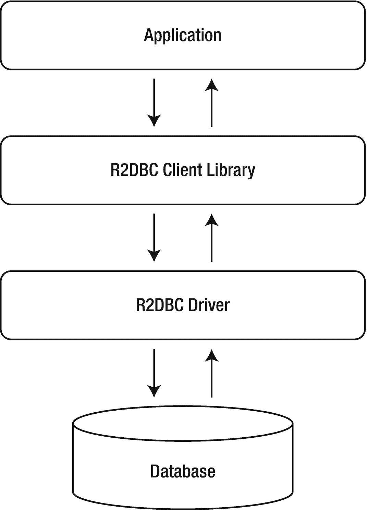
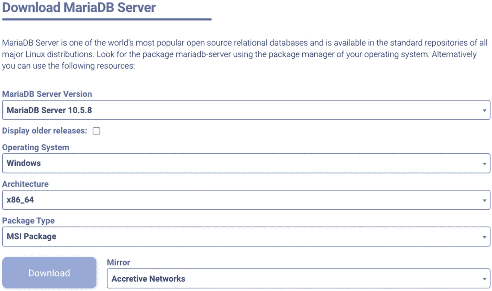
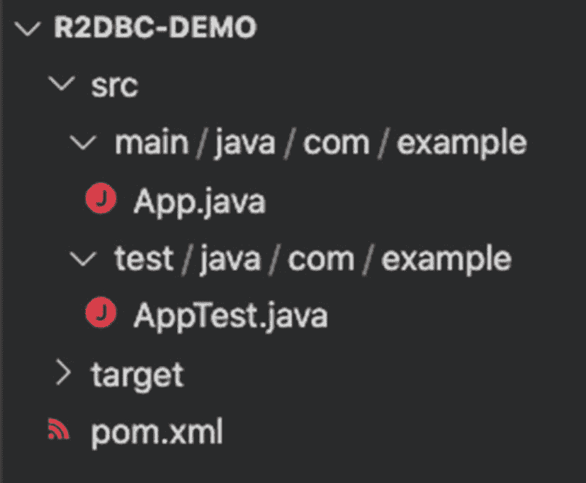

# 十一、R2DBC 入门

现在，您已经对 R2DBC 规范、其整体结构和一般工作流程有了一个概述，并对其功能有了一点了解，您已经准备好开始实现了。因为，至此，你已经对*什么是* R2DBC 和*为什么*它是必要的有了坚实的理解，现在是时候学习*如何*使用它了。

在这一章中，我们将简要研究官方 R2DBC 驱动程序和客户机库，它们有助于使用关系数据库创建反应式解决方案。最后，我们将浏览创建一个新的、非常基础的 Java 项目的过程，该项目将有助于 R2DBC 驱动程序的使用。我们在本章中创建的项目将为后面的章节打下基础，因为我们将务实地深入 R2DBC 的功能。

## 数据库驱动程序

到目前为止，您已经了解到，R2DBC 驱动程序是实现 R2DBC 服务供应器接口(SPI)的自包含编译库。请记住，R2DBC SPI 被有意设计得尽可能小，同时仍然包含对任何关系数据存储都至关重要的特性。这都确保了 SPI 不会将任何可能特定于数据存储的扩展作为目标。

### ]

即使在我写这篇文章的时候，R2DBC SPI 还不是正式的大众(GA)，仍然有各种各样的驱动程序实现，跨越多个数据库供应商。表 11-1 显示目前有 7 个官方的、开源的 R2DBC 驱动。

表 11-1

官方 R2DBC 驱动程序

<colgroup><col class="tcol1 align-left"> <col class="tcol2 align-left"> <col class="tcol3 align-left"></colgroup> 
| 

驾驶员

 | 

目标数据库

 | 

源位置

 |
| --- | --- | --- |
| 云扳手-r2dbc | 谷歌云扳手 | [`https://github.com/GoogleCloudPlatform/cloud-spanner-r2dbc`](https://github.com/GoogleCloudPlatform/cloud-spanner-r2dbc) |
| jassync SQL | MySQL，一种数据库系统 | [`https://github.com/jasync-sql/jasync-sql`](https://github.com/jasync-sql/jasync-sql) |
| r2dbc-h2 | 氘 | [`https://github.com/r2dbc/r2dbc-h2`](https://github.com/r2dbc/r2dbc-h2) |
| r2dbc-mariadb | 马里亚 DB | [`https://github.com/mariadb-corporation/mariadb-connector-r2dbc`](https://github.com/mariadb-corporation/mariadb-connector-r2dbc) |
| r2d DBC-MSSQL | 搜寻配置不当的 | [`https://github.com/r2dbc/r2dbc-mssql`](https://github.com/r2dbc/r2dbc-mssql) |
| r2dbc-mysql | 关系型数据库 | [`https://github.com/mirromutth/r2dbc-mysql`](https://github.com/mirromutth/r2dbc-mysql) |
| r2dbc-postgres | 一种数据库系统 | [`https://github.com/r2dbc/r2dbc-postgresql`](https://github.com/r2dbc/r2dbc-postgresql) |

Note

出于本书的目的，我们将使用 MariaDB R2DBC 驱动程序。本章稍后将提供更多信息。

## R2DBC 客户端库

您已经了解到 R2DBC 规范是有意创建的轻量级规范，旨在为潜在的驱动程序实现提供大量创造性的灵活性。规范的简单性也阻止了更多固执己见的用户空间功能被包含在驱动程序实现中。

相反，根据官方文档，R2DBC 将“人性化”API 功能的责任留给了客户端库:

> *R2DBC 规范的意图是鼓励库以客户端库的形式提供“人性化”API。*

从实现的角度来看，这意味着应用可以使用客户端库，然后间接使用每个 R2DBC 驱动程序与底层数据源进行反应式通信(图 11-1 )。



图 11-1

R2DBC 驱动程序和客户端解决方案充当应用与底层数据源通信的抽象

客户端库作为一个抽象层，有助于减少使用 R2DBC 驱动程序实现所需的样板代码或脚手架代码的数量。最后，如果您想在解决方案中包含 R2DBC 客户端库，有两种方法可以实现；创建新的客户端或使用现有的客户端。

### 创建客户端

由于 R2DBC SPI 的极简特性，创建新客户端的过程应该简单明了。首先，客户端库只需要包含 R2DBC SPI 作为依赖项。这可以通过两种方式实现。

包含 R2DBC SPI 作为依赖项的第一种方法是将组和工件标识符添加到基于 Maven 的项目的 pom.xml 文件中的依赖项列表中(清单 11-1 )。

```java
<dependency>
    <groupId>io.r2dbc</groupId>
    <artifactId>r2dbc-spi</artifactId>
</dependency>

Listing 11-1The R2DBC SPI dependency settings for pom.xml

```

Tip

如果您不熟悉向基于 Maven 的 Java 应用添加依赖项的过程，不要担心。在这一章的后面，我们将深入讨论这个过程的更多细节！

第二种替代方法是通过使用 Apache Maven 包装器项目直接从源代码构建 R2DBC SPI，GitHub 上有这个项目。

### 使用现有的客户端库

目前有几个官方 R2DBC 支持客户端(表 11-2 )甚至更多正在调查中。如图 11-1 所示，现有的 R2DBC 客户端库通过利用 R2DBC 驱动程序实现来处理与底层数据源的实际交互。

表 11-2

现有 R2DBC 客户端示例

<colgroup><col class="tcol1 align-left"> <col class="tcol2 align-left"></colgroup> 
| 

名字

 | 

描述

 |
| --- | --- |
| 春季数据 R2DBC | 一个支持使用 Spring 数据和反应式开发原则和存储库抽象的项目。 |
| 科斯塔亚 | 一个使用 Kotlin 编程语言的类型安全且可协同运行的 SQL 引擎。 |
| jOOQ | 为流行的类型安全 SQL 查询构造库提供 R2DBC 支持。 |

每个 R2DBC 客户端库支持的 R2DBC 驱动程序各不相同。

### 展望未来

毫无疑问，包含 R2DBC 客户端库的决定是实现新的真正反应式 R2DBC 解决方案的关键一步。然而，在我们能跑之前，我们需要学习如何走路。因此，在这一章中，我们将逐步完成建立一个项目的过程，这个项目只利用了*一个 R2DBC 驱动程序实现。然后，在第 12 、 13 和 14 章中，我们将仔细查看*R2DBC 驱动程序实现如何利用特定的*反应流*实现来促进与目标关系数据库的反应交互。**

最后，在第十六章中，在您对创建直接使用 R2DBC 驱动程序的应用有了扎实的理解和必要的努力之后，您将了解一个名为 Spring Data R2DBC 的特定 R2DBC 客户端库如何帮助显著简化 R2DBC 解决方案的创建。

## MariaDB 和 R2DBC

如前所述，有多家供应商提供 R2DBC 驱动程序，所有这些驱动程序都提供了基本的 R2DBC 支持和独特的数据库功能。对于本书的其余部分，我们将使用 MariaDB 提供的单一、特定的 R2DBC 驱动程序，用于所有示例、代码片段和演练。

Note

MariaDB 是社区开发的、商业支持的 MySQL 关系数据库管理系统的分支，旨在 GNU 通用公共许可证下保持自由和开源软件。

决定使用 MariaDB 作为 R2DBC 驱动程序和关系数据库并不是出于任何特殊的技术原因，而是因为它提供了一个简单的、开放源代码的、最重要的是免费的数据库解决方案来帮助展示 R2DBC 的能力。

### MariaDB 简介

因为我将使用 MariaDB R2DBC 驱动程序作为示例 R2DBC 驱动程序实现来演示如何被动地与 MariaDB 数据库实例进行通信，所以为了继续学习，您还需要有一个正在运行的 MariaDB 数据库实例。因此，如果您已经可以访问 MariaDB 的实例，那太好了！请随意跳到下一部分。然而，如果你不熟悉 MariaDB，不用担心。有许多方法可以开始使用一个新的免费数据库实例。

正如我前面提到的，MariaDB 提供了一个免费的开源关系数据库。事实上，MariaDB Server，作为免费的开源版本，是世界上最流行的开源关系数据库之一，因此，在包括 Windows、macOS 和 Linux 在内的各种操作系统上都受到支持。

### 下载并安装

MariaDB 的广泛使用不仅使安装变得轻而易举；您还有几个选项可供选择。

#### 直接下载

首先打开一个浏览器，导航到 [`http://mariadb.org/download`](http://mariadb.org/download) ，它由 MariaDB 基金会支持和维护。

Note

MariaDB 基金会是一个非营利组织，作为 MariaDB 服务器协作的全球联系点。

在那里，您可以找到为您的操作系统(OS)检索 mariadb-server 包的说明，或者，通过选择页面上的各种选项，您可以指明您想要下载的包(图 11-2 )。



图 11-2

指定要下载的 MariaDB 服务器包

#### 坞站集线器下载

如果您正在使用 Windows 或 Linux，或者对从源代码构建 MariaDB 服务器感兴趣，上一节提供了下载和安装 MariaDB 的绝佳选择。但是如果你使用 macOS 作为你的操作系统呢？不要害怕！访问 MariaDB 的另一种方式是使用*容器*，更具体地说，在本例中是 Docker 容器。

Note

容器是一个标准的软件单元，它封装了代码及其所有依赖项，以便应用可以从一个计算环境可靠地运行到另一个计算环境。

首先导航至 [`www.docker.com/get-started`](http://www.docker.com/get-started) 。在那里，您可以找到关于下载、安装和运行软件的要求的更多信息，这些软件能够为您的环境提供 Docker 容器。

从那里你可以访问最新的 MariaDB 服务器 Docker 容器，以及如何下载、安装和运行的说明，在 [`https://hub.docker.com/r/mariadb/server`](https://hub.docker.com/r/mariadb/server) ，这是一个官方的 MariaDB 社区服务器 Docker 镜像，由 MariaDB 公司提供。

Note

MariaDB Corporation 是一家提供企业级 MariaDB 产品和服务的营利性公司。随着 MariaDB 企业平台的开发，MariaDB Corporation 也为 MariaDB 服务器的开源社区版本做出了贡献。

访问并准备

一旦您下载并安装了 MariaDB 实例，您应该确认您有能力访问它。这通常是通过使用*数据库客户端*来完成的。虽然有多种数据库客户机可供选择，但 MariaDB Server 的下载和安装还包括一个可以通过终端访问的客户机。

只需打开一个终端窗口并执行清单 11-2 中所示的命令，连接到您的 MariaDB 实例。

```java
mariadb --host 127.0.0.1 --port 3306 --user root

Listing 11-2Connecting to a local MariaDB Server instance

```

Note

清单 11-2 中指出的连接值假设您已经使用默认设置在本地机器上安装了一个 MariaDB 服务器实例。

或者，由于默认设置，您也可以通过使用清单 11-3 中的命令连接到本地 MariaDB 服务器实例。

```java
mariadb

Listing 11-3Connecting to a local MariaDB Server instance using the default connection configuration

```

一旦成功连接到 MariaDB 服务器，就可以通过执行清单 11-4 中的 SQL 来添加一个名为`app_user`的新用户。

```java
CREATE USER 'app_user'@'%' IDENTIFIED BY 'Password123!';
GRANT ALL PRIVILEGES ON *.* TO 'app_user'@'%' WITH GRANT OPTION;

Listing 11-4Creating a new MariaDB database instance user and password

```

Note

为了保持前后一致，我将在所有后续的凭证相关示例中使用`app_user`用户和`Password123!`密码设置。

## 使用 R2DBC

建立了对关系数据库的访问之后，我们就可以在 Java 应用中使用 R2DBC 驱动程序了。事实上，在本章的剩余部分，我们将逐步创建和运行一个新的 Java 应用，该应用包含 MariaDB R2DBC 驱动程序作为依赖项。

### 要求

在开发、构建和运行 Java 应用之前，您需要确保您的系统满足这样做的必要要求。下面的小节描述了在继续阅读本书之前你应该完成的一些必要任务。

#### 安装 Java 开发工具包

首先是安装 Java 开发工具包(JDK)，这是一个全功能的软件开发工具包(SDK)，必须安装它才能开发和运行 Java 应用。JDK 依赖于平台，因此下载和安装的要求因目标平台而异。

有关如何下载和安装最新版 JDK 的更多信息，请访问 [`www.oracle.com/java/technologies/javase-downloads.html`](http://www.oracle.com/java/technologies/javase-downloads.html) 。

#### 安装 Apache Maven

接下来，您应该安装 Apache Maven。构建管理是高级软件语言编译的一个极其重要的方面。Apache Maven 是一个非常流行的构建自动化和管理工具，主要用于 Java。事实上，它是同类 Java 中最受欢迎的工具。

正是出于这个原因，我们将使用 Apache Maven 作为 R2DBC 应用示例的构建管理工具。有关 Apache Maven 的更多信息，包括如何下载和安装，请访问 [`http://maven.apache.org`](http://maven.apache.org) 。

### Apache Maven 基础知识

我们已经准备好创建一个新的 Java 应用，并开始使用 R2DBC 驱动程序来直接了解它的功能！您可能已经知道，有几种机制可以用来创建新的 Java 项目。

事实上，如果您已经有了开发 Java 应用的经验，那么您甚至可能对如何创建一个新的应用或项目有自己的偏好。无论是通过在终端中手动执行命令，使用特定的集成开发环境(IDE)，甚至可能是项目生成网站，都不缺少选项。

#### 创建新项目

为了保持简单和统一，我们将首先利用 Apache Maven 软件配置管理(SCM)客户端(一个简单的命令行工具)来创建一个新的 Java 项目。

首先，在系统中选择一个位置来存储新项目。然后，如清单 11-5 所示，使用 Maven 客户端，通过`–DgroupId`执行以下指定组的命令；神器，via`–DartifactId`；和一些其他样板参数来创建一个新的 Java 项目。

```java
mvn archetype:generate -DgroupId=com.example -DartifactId=r2dbc-demo ​-DarchetypeArtifactId=maven-archetype-quickstart -DarchetypeVersion=1.4 ​-DinteractiveMode=false

Listing 11-5The Apache Maven SCM command to create a new project

```

Tip

使用 Maven 客户机创建新项目只是创建新 Java 项目的一种可能方法。最终，如何创建一个新的 Java 项目并不重要，重要的是你创建了一个新的项目。

`-DarchetypeArtifactId=maven-archetype-quickstart`参数和值用于指定一个示例 Maven 项目的生成(图 11-3 )。



图 11-3

Maven 项目结构示例

但是现在我们已经使用 Maven 客户端创建了一个新的 Java 项目，*什么样的*使 Java 项目 Maven 就绪？

最终，Maven 项目是用一个名为 *pom.xml* 的 XML 定义的，它包含了项目的名称版本，最重要的是，一个一致的、统一的方法来标识外部库的依赖关系。

#### 添加依赖关系

依赖关系是在 pom.xml 的`dependencies`节点中定义的。向项目添加依赖项涉及到修改 pom.xml 文件。

使用您选择的文本或代码编辑器，打开 pom.xml 文件，该文件位于新创建项目的根文件夹中。导航到`dependencies`节点，为 MariaDB R2DBC 驱动程序版本 1.0.0 添加一个新的`dependency`。，如清单 11-6 中的片段所示。

```java
<dependency>
      <groupId>org.mariadb</groupId>
      <artifactId>r2dbc-mariadb</artifactId>
      <version>1.0.0</version>
</dependency>

Listing 11-6MariaDB R2DBC driver dependency

```

Note

Maven 使用包含在`dependencies`节点中的值，如`groupId`、`artifactId`和`version`，来搜索要添加到项目中的内部或外部库。

#### 构建项目

在将 MariaDB R2DBC 驱动程序依赖项添加到项目中之后，现在是构建项目以确认一切都已正确配置的最佳时机。

首先，打开一个终端窗口，导航到包含 pom.xml 文件的目录，并执行清单 11-7 中所示的命令。

```java
mvn package

Listing 11-7The command to build a Maven project

```

如果一切都已正确配置，您应该会看到类似以下内容的控制台打印输出:

```java
[INFO] --------------------------------------------------------------------
[INFO] BUILD SUCCESS
[INFO] --------------------------------------------------------------------
[INFO] Total time:  1.644 s
[INFO] Finished at: 2020-11-01T05:17:25-06:00
[INFO] --------------------------------------------------------------------

```

## 给我看看代码

您可以在专门针对本书的 GitHub 资源库中找到一个完整的、完全可编译的示例应用。只需导航到 [`https://github.com/apress/r2dbc-revealed`](https://github.com/apress/r2dbc-revealed) 到`git clone`或者直接下载存储库的内容。在那里，您可以在 ch11 文件夹中找到专门用于这一章的示例应用。

## 展望未来

现在，您已经对什么是 Apache Maven 有了基本的了解，并且对它的基础设施以及如何使用它来管理依赖关系有了较高的认识，您已经对如何将 R2DBC 驱动程序添加到应用中有了基本的了解。

在接下来的几章中，我们将基于您创建的示例应用，用 Java 展示如何通过与 MariaDB R2DBC 驱动程序直接集成来利用 R2DBC 功能。如前一节所述，本章和其余所有章节的示例应用可以在本书专用的 GitHub 资源库中找到。

此外，正如我在本章前面提到的，R2DBC 规范的目标之一是通过使用 R2DBC 客户端库为创建更人性化的 API 提供一条途径。因此，尽管接下来的几章将重点关注方向与 R2DBC 驱动程序的集成，但第十六章将更深入地了解使用 Spring Data R2DBC 客户端库开发完全反应式应用的情况。基本上，如果你喜欢代码，你会喜欢接下来的几章！

## 摘要

在本章中，您了解了当前可用的不同 R2DBC 驱动程序和客户端解决方案。您还了解了这些解决方案是如何直接通过它们的开源代码或作为基于 Maven 的包提供的。

最后，您浏览了创建一个 Java 项目的过程，该项目包括一个 R2DBC 驱动程序和一个客户机，将在后续章节中使用它来检查与关系数据库 MariaDB 的反应式交互的能力。