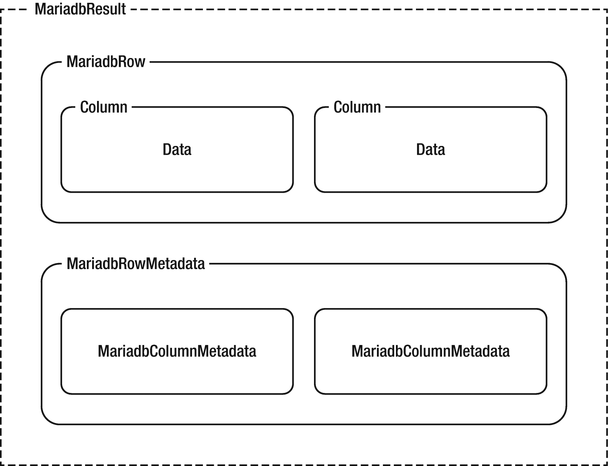
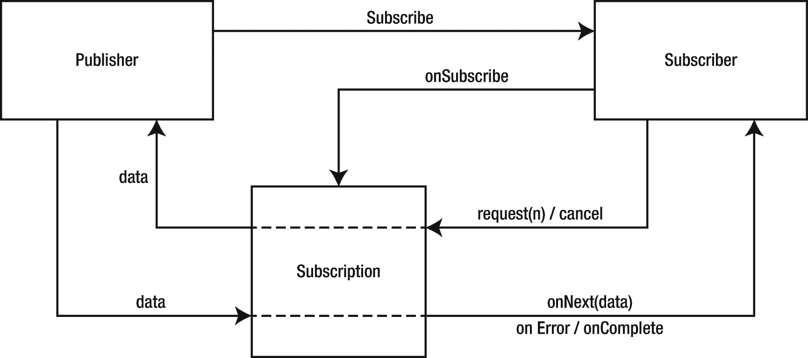

# 十三、管理数据

到目前为止，您已经掌握了反应式编程、反应式流和 R2DBC 的基础知识。在过去的两章中，您甚至亲眼目睹了 R2DBC 规范如何在驱动程序实现中发挥作用。我们甚至创建了一个简单的应用，它使用 MariaDB R2DBC 驱动程序并连接到一个数据库实例。这才是真正有趣的地方。

在本章中，我们将扩展您在过去两章中获得的知识，深入研究如何使用 MariaDB R2DBC 驱动程序执行 SQL 语句。读，写，参数，没有参数，是的，我们将涵盖它。

简而言之，如果你喜欢代码，你将会爱上这一章！

## mariadb 语句

继续在 R2DBC 接口的类名前面加上 *Mariadb* 的惯例，`MariadbStatement`对象提供了在 Mariadb 数据库上执行 SQL 语句的能力。

### 语句层次结构

图 13-1 应该看着眼熟。在第六章中，你了解到 R2DBC `Connection`接口公开了一个方法来获取一个叫做`createStatement`的`Statement`对象。因此，使用前一章中详细讨论的`MariadbConnection`对象，您可以获得一个`MariadbStatement`对象，然后可以使用它来执行 SQL 语句，并在适当的时候通过`MariadbResult`对象访问数据。


图 13-1

用于执行 SQL 语句的 MariaDB 类流

### 依赖性免责声明

在上一章中，我指出 MariaDB R2DBC 驱动程序包含对 Project Reactor 的依赖，这是一个流行的 Reactive Streams 实现。因此，本章自然会提供许多使用 Project Reactor Reactive Streams 类实现的例子。

然而，请记住，正如我在本书中多次强调的，Reactive Streams 是一个规范，因此使用下面的例子作为指南是很重要的，而不仅仅是 Reactive Streams 实现的一个真实来源。有各种各样的选择，其中许多功能与我们将在本章中讨论的例子非常相似。

## 基础知识

使用 MariaDB R2DBC 驱动程序有多种方法可以执行和管理 SQL，我希望在本章中介绍这些方法。本节旨在为我们在后续章节中浏览 R2DBC 驱动程序的数据管理功能提供基础。

### 创建语句

这一切都从创建一个`Statement`开始，或者在我们的例子中，由 MariaDB R2DBC 驱动程序提供的`Statement`实现对象:`MariadbStatement`。

使用一个`MariadbConnection`对象，您可以通过`createStatement`方法获得一个新的`MariadbStatement`对象，该方法为您想要运行的 SQL 语句获取一个`String`值(清单 13-1 )。

```java
MariadbStatement createDatabaseStatement = connection.createStatement("CREATE DATABASE todo");

Listing 13-1Creating a new MariadbStatement using a MariadbConnection object

```

### 获得出版商

不管实现如何，`Statement`对象的`execute`方法的目的是提供一个反应流`Publisher<T>`实现，在本例中更具体地说是`Publisher<Result>`。

因此，默认情况下，`MariadbStatement`对象的 execute 方法提供了一个`Flux<MariadbResult>`(清单 13-2 )。

```java
 Flux<MariadbResult> publisher = createDatabaseStatement.execute();

Listing 13-2Using the execute method on a Statement object to create a publisher

```

Note

`Flux`对象是 Reactive Streams Publisher 接口的项目反应器实现。它的功能是发射 0-N 个元素。

### 订阅执行

为了开始执行`MariadbStatement`对象和其中包含的 SQL 语句，必须订阅`publisher`对象。

```java
publisher.subscribe();

Listing 13-3Subscribing to a publisher

```

把所有的东西放在一起，完成这个例子，下面的例子(清单 13-4 )说明了我们如何从清单 13-2 和 13-3 向我们新创建的数据库添加一个新的 MariaDB 表。

```java
MariadbStatement createTableStatement = connection.createStatement("CREATE TABLE todo.tasks (" +
                "id INT(11) unsigned NOT NULL AUTO_INCREMENT, " +
                "description VARCHAR(500) NOT NULL, " +
                "completed BOOLEAN NOT NULL DEFAULT 0, " +
                "PRIMARY KEY (id))"
            );
createTableStatement.execute().subscribe();

Listing 13-4Creating a table using R2DBC statement execution

```

Note

本节使用创建的 *todo* 数据库和 *tasks* 表来提供一个简单的例子，说明如何使用 R2DBC 驱动程序执行 SQL。在接下来的小节中，我们将使用利用了 *todo.tasks* 的 SQL 语句。

## 检索结果

已经对使用 R2DBC 创建和执行 SQL 语句有了基本的了解，现在是时候更进一步了！现在，我们当然有可能创建只涉及运行 SQL 语句的应用，而我们并不期望从这些语句中接收数据，但这种情况并不常见，也不有趣。更有可能的是，我们编写的任何应用都希望既写*又从底层数据库读取*。

### 行更新计数

首先，R2DBC 提供的一种方便的机制是检索受数据操作语言(DML)语句影响的行数。

Note

INSERT、UPDATE 和 DELETE 语句都称为 DML 语句。

对于 DML 语句，订阅者可能会收到一个提供了`getRowsUpdated`方法的`MariadbResult`对象。调用`getRowsUpdated`方法使您能够获得一个`Publisher<Integer>`对象，一旦被订阅，您就可以获得被执行的 SQL 语句影响的行数(清单 13-5 )。

```java
MariadbStatement insertStatement = connection.createStatement("INSERT INTO todo.tasks (description,completed) VALUES ('New Task 1',0)");

// Retrieve and print the number of rows affected
insertStatement.execute().subscribe(result -> result.getRowsUpdated().subscribe(count -> System.out.println (count.toString())));

Listing 13-5Subscribing to a Statement object’s getRowsUpdated method

```

Caution

发出更新计数后，`Result`对象失效，来自同一个`Result`对象的行不再被使用。

### 映射结果

在上一个示例中，我们使用了一个`MariadbResult`对象来获取受 SQL 语句影响的行数，但是，正如我们在第七章中所了解到的，这实际上只是一个`Result`对象实现所包含内容的冰山一角。

MariaDB R2DBC 驱动程序的`Result`对象实现`MariadbResult`，提供数据值和元数据(图 13-2 )。



图 13-2

玛丽亚的解剖结果

#### 使用行对象

回想一下，在第七章中，您了解到`Result`接口提供了从`Row`对象中检索值的`map`方法。既然我们能够直接看到这一点，就有必要详细说明一下。

`Row`对象检索的过程是可能的，因为`map`方法接受一个`BiFunction`，也称为映射函数，接受`Row`和`RowMetadata`的对象。

Note

双函数表示接受两个参数并产生一个结果的函数(例如，`Row`和`RowMetadata`)。

在使用`Row`和`RowMetadata`对象进行行发射时调用映射函数。然后，在`BiFunction`对象的功能块中，您可以访问`row`对象，通过使用索引或列/别名来提取每个指定列的数据。

```java
MariadbStatement selectStatement = connection.createStatement("SELECT id, description AS task, completed FROM todo.tasks");

selectStatement.execute()
               .flatMap(result -> result.map((row,metadata) -> {
                    Integer id = row.get(0, Integer.class);
                    String descriptionFromAlias = row.get("task", String.class);
                    String isCompleted = (row.get(2, Boolean.class) == true) ? "Yes" : "No";
                    return String.format("ID: %s - Description: %s - Completed: %s",
                        id,
                        descriptionFromAlias,
                        isCompleted
                    );
                }))
                .subscribe(result -> System.out.println(result));

Listing 13-6Extracting SQL SELECT statement results using the MariadbRow get method

```

Caution

`Row`只在映射函数回调期间有效，在映射函数回调之外无效。因此，`Row`对象必须完全被映射函数消耗。

#### 映射结果

`map`和`flatMap`方法都接收一个映射函数，该函数应用于`Stream<T>`的每个元素并返回一个`Stream<R>.`。这两个函数之间的关键区别在于,`flatMap`方法接收的映射函数产生一串新的值，而 map 方法接收的映射函数用于为每个输入元素产生一个值。

因为`flatMap`方法的映射函数用于返回一个新的流，我们实际上是在接收一个流的流。然而，`flatMap`方法也用于用流的内容替换每个生成的流。换句话说，由该函数生成的所有单独的流都被展平为一个单独的流。

#### 处理元数据

你可能已经注意到清单 13-6 中的`BiFunction`还包括一个名为`metadata`的对象，它是一个`MariadbRowMetadata`对象。在第八章中，您了解到`RowMetadata`对象实现提供了关于从执行的 SQL 语句返回的表格结果的信息。更具体地说，`RowMetadata`可以用来确定行的属性，还可以公开包含在`Result`对象中的每一列的`ColumnMetadata`实现。

在清单 13-7 中，重用清单 13-6 中的样本代码，我们可以专注于从`metadata`对象中提取信息。

```java
selectStatement.execute()
                          .flatMap(result -> result.map((row,metadata) -> {
                            List<String> columnMetadata = new ArrayList<String>();
                            Iterator<String> iterator = metadata.getColumnNames().iterator();
                            while (iterator.hasNext()) {
                                String columnName = iterator.next();
                                columnMetadata.add(String.format("%s (type=%s)", columnName, metadata.getColumnMetadata(columnName).getJavaType().getName()));
                            }
                            return columnMetadata.toString();
                          }))
                          .subscribe(result -> System.out.println("Row Columns = "  + result));

Listing 13-7Accessing row and column metadata

```

### 生成的值

接下来，让我们考虑使用我们在本章中学到的`Statement`工作流创建一个*新的*记录的过程。

```java
MariadbStatement insertStatement = connection.createStatement("INSERT INTO todo.tasks (description,completed) VALUES ('New Task 2',0)");
insertStatement.execute().subscribe();

Listing 13-8Inserting data

```

好了，我们已经创建了一个新的`MariadbStatement`并订阅了所包含的 INSERT 语句的执行。很好，但是如果我们想要获得根据表的规范自动生成的 id 的值呢？关于必须使用映射函数来简单地访问自动生成的值似乎很麻烦、冗长，而且是不必要的。当然，还有更好的选择。

没错，R2DBC 再次出手相救！如果您还记得，在第六章中，向您介绍了`returnGeneratedValues`，这是一种通过`Statement`接口可用的方法，可用于获取自动生成的值，这些值是作为 SQL 语句的一部分创建的。该方法只是接收一个可变参数，该参数用于确定自动生成的值要存储到的列名。

```java
MariadbStatement insertStatement = connection.createStatement("INSERT INTO todo.tasks (description,completed) VALUES ('New Task 3',0)");

Flux<Object> publisher =  insertStatement.returnGeneratedValues("id").execute().flatMap(result -> result.map((row,metadata) -> row.get("id")));

 publisher.subscribe(id -> System.out.println
(id.toString()));

Listing 13-9Retrieving a generated value from an INSERT statement execution

```

### 多重陈述

作为开发人员，我们知道，由于各种原因(包括提高性能的可能性),能够在一个操作中执行多个 SQL 语句通常是有用的。幸运的是，由于 R2DBC 的灵活性，有几种方法可以有效地*批处理* SQL 语句。

#### 使用 MariadbBatch

R2DBC SPI 提供了一个名为`Batch`的接口，该接口定义了运行多组无参数 SQL 语句的方法。

Stay Tuned

在本章的后面，我们将看看可以批处理的参数化 SQL 语句。

因此，可以创建 MariaDB 实现`MariadbBatch`，并用于运行多个 SQL 语句，这有助于提高应用性能。

首先通过使用`createBatch`方法创建一个`MariadbBatch`的实例，该方法在一个`Connection`对象上可用。然后使用`add`方法输入您希望作为批处理的一部分执行的每个 SQL 语句，并使用`execute`方法，就像您处理`Statement`对象一样(清单 13-10 )。

```java
MariadbBatch batch = connection.createBatch();

batch.add("INSERT INTO todo.tasks (description,completed) VALUES ('New Task 4', 0)")
     .add("SELECT * FROM todo.tasks WHERE id = last_insert_id()")
     .execute()
     .flatMap(result -> result.map((row,metadata) -> {
                    return row.get(0, Integer.class)  + " - " + row.get(1, String.class);
     }))
     .subscribe(result -> System.out.println(result));

Listing 13-10Using MariadbBatch to execute multiple SQL statements

```

#### 使用 MariadbStatement

由于 R2DBC 规范提供的灵活性，MariaDB R2DBC 驱动程序还可以在用于构造`Statement`对象的单个`String`值中包含多个 SQL 语句。

首先，在构建用于创建执行 SQL 语句的`MariadbConnection`的`MariadbConnectionConfiguration`对象的过程中，需要包含一个特定于供应商的方法`allowMultiQueries`(清单 13-11 )。

```java
MariadbConnectionConfiguration connectionConfiguration = MariadbConnectionConfiguration.builder()
   .host("127.0.0.1")
   .port(3306)
   .username("app_user")
   .password("Password123!")
   .allowMultiQueries(true)
   .build();

Listing 13-11Enabling the ability to run multiple SQL statements in a single Statement object execution using allowMultiQueries

```

一旦您启用了执行多个 SQL 查询的能力，您就能够在单个`String`值中添加多个查询，用分号分隔(清单 13-12 )。

```java
MariadbStatement multiStatement = connection.createStatement("INSERT INTO todo.tasks (description,completed) VALUES ('New Task 5', 0); SELECT * FROM todo.tasks WHERE id = last_insert_id();");

multiStatement.execute().flatMap(result -> result.map((row,metadata) -> {
                            return row.get(0, Integer.class)  + " - " + row.get(1, String.class);
                          }))
                          .subscribe(result -> System.out.println(result));

Listing 13-12Running multiple INSERT statements within a single Statement object execution

```

## 参数化语句

在第六章中，您了解到用于创建`Statement`对象的同一个*非参数化* SQL `String`值也可以通过使用特定于供应商的绑定标记被*参数化*。事实上，参数化的`Statement`对象是由`Connection`对象以与非参数化语句相同的方式创建的。

事实上，正如我在第六章中指出的，供应商使用的绑定标记可以不同，但总体方法是相同的。对于 MariaDB，您有两个绑定标记选项:

1.  通过使用单个问号(？)作为参数占位符

2.  通过在命名参数占位符前面加上分号(:)

### 绑定参数

不管使用什么绑定标记，您都可以提供一个参数的索引号来绑定一个值(清单 13-13 )。

```java
MariadbStatement selectStatement = connection.createStatement("SELECT * FROM todo.tasks WHERE completed = ? AND id >= ?");
selectStatement.bind(0, true);
selectStatement.bind(1, 4);
selectStatement.execute()
               .flatMap(result -> result.map((row,metadata) -> {
                    return row.get(0, Integer.class)  + " - " + row.get(1, String.class) + " - " + row.get(2, Boolean.class);
               }))
              .subscribe(result -> System.out.println(result));

Listing 13-13Binding by index

```

您还可以提供一个特定的占位符参数(清单 13-14 )。

```java
MariadbStatement selectStatement = connection.createStatement("SELECT * FROM todo.tasks WHERE completed = :completed AND id >= :id");
selectStatement.bind("completed", true);
selectStatement.bind("id", 4);
selectStatement.execute()
               .flatMap(result -> result.map((row,metadata) -> {
                    return row.get(0, Integer.class)  + " - " + row.get(1, String.class) + " - " + row.get(2, Boolean.class);
               }))
              .subscribe(result -> System.out.println(result));

Listing 13-14Binding with a named placeholder

```

### 批处理语句

在第六章中，还向您介绍了 R2DBC 利用`Statement`对象的 add 方法支持批量参数化`Statement`对象的能力(清单 13-15 )。

```java
MariadbStatement batchedInsertStatement = connection.createStatement("INSERT INTO todo.tasks (description,completed) VALUES (?,?)");

batchedInsertStatement.bind(0, "New Task 6").bind(1, false).add();
batchedInsertStatement.bind(0, "New Task 7").bind(1, false).add();
batchedInsertStatement.bind(0, "New Task 8").bind(1, true);

batchedInsertStatement.execute().subscribe();

Listing 13-15Batching parameterized statements with MariadbStatement

```

## 反应控制

您可能还记得第二章，Reactive Streams API 提供了一个结构化的过程，用于通过异步、非阻塞的交互来管理事件驱动的开发。基本上，我们了解到，Reactive Streams 围绕争夺数据流的想法添加了一些结构，以帮助我们创建完全*的*反应式应用。

到目前为止，您已经对 R2DBC 规范以及它如何利用 Reactive Streams API 与关系数据库进行交互有了深入的了解。以此为基础，在本章和最后一章中，您还了解了 R2DBC 驱动程序实现*实际上是如何利用反应流实现来支持事件驱动开发的。*

虽然有许多 Reactive Streams 实现及其方法、类结构和细粒度功能可能会有所不同，但总体前提是相同的。随着您对如何使用 R2DBC 有了更多的经验和了解，从基础开始会很有帮助。

### 阻止执行

在您完成后续操作之前，需要完成某些数据库交互。例如，在本章的开始，我提供了一个简单的例子(清单 13-1 和 13-2 )来创建一个语句，执行一个发布器，并订阅结果。但是为了能够查询数据库或表，它必须首先存在。对于这种情况，在一个*通量*对象(清单 13-16 )中使用一个阻塞函数可能是有用的。

```java
MariadbStatement createDatabaseStatement = connection.createStatement("CREATE DATABASE todo");
createDatabaseStatement.execute().blockFirst();

Listing 13-16Subscribing to a Flux and blocking indefinitely until the upstream signals its first value or completes

```

Note

`blockFirst`方法订阅一个`Flux`并无限期地阻塞它，直到上游发出它的第一个值或完成。

另一方面，如果您有一批要执行的语句，您也可以选择使用`blockLast`方法。

```java
MariadbStatement batchedInsertStatement = connection.createStatement("INSERT INTO todo.tasks (description,completed) VALUES (?,?)");

batchedInsertStatement.bind(0, "New Task 9").bind(1, false).add()
                      .bind(0, "New Task 10").bind(1, false).add()
                      .bind(0, "New Task 11").bind(1, true);

MariadbResult result = batchedInsertStatement.execute().blockLast();

Listing 13-17Subscribing to a Flux and blocking indefinitely until the upstream signals its last value or completes

```

#### 管理背压

回到第一章，您了解了*背压*的概念，以及它对于在反应式应用中控制数据流的重要性。然后，第二章通过学习反应流 API 如何使用背压，通过一个正式的 API 结构来实现无阻塞的交互，扩展了这种理解(图 13-3 )。



图 13-3

反应流 API 工作流

虽然从架构上讲，有多种方法可以利用反应流的能力来做一些事情，比如控制背压，但是让我们看一个简单的例子来说明一种可能的方法。

在清单 13-18 中，我创建了一个新的`MariadbStatement`并使用`flatMap`方法返回一个`task`记录的`description`值。足够简单，在这一点上应该感觉非常熟悉。然而，您会注意到我已经创建了一个新的`Subscriber<String>`对象，而不是简单地使用 subscribe 从已执行的 SQL 语句中获取值。

下列范例说明订阅者、订阅和发行者之间的关系。检查新订户，您可以看到有几个被覆盖的方法:`onSubscribe`、`onNext`、`onError`和`onComplete`。这些应该看起来很熟悉，因为它们与第一章和图 13-3 中详述的反应流 API 方法函数一致。

```java
MariadbStatement selectStatement = connection.createStatement("SELECT * FROM todo.tasks");
            selectStatement.execute()
                           .flatMap(result -> result.map((row,metadata) -> {
                                return row.get("description", String.class);
                           }))
                           .subscribe(new Subscriber<String>() {
                                private Subscription s;
                                int onNextAmount;
                                int requestAmount = 2;

                                @Override
                                public void onSubscribe(Subscription s) {
                                    System.out.println("onSubscribe");
                                    this.s = s;
                                    System.out.println("Request (" + requestAmount + ")");
                                    s.request(requestAmount);
                                }

                                @Override
                                public void onNext(String itemString) {
                                    onNextAmount++;
                                    System.out.println("onNext item received: " + itemString);
                                    if (onNextAmount % 2 == 0) {
                                        System.out.println("Request (" + requestAmount + ")");
                                        s.request(2);
                                    }
                                }

                                @Override
                                public void onError(Throwable t) {
                                    System.out.println("onError");
                                }

                                @Override
                                public void onComplete() {
                                    System.out.println("onComplete");
                                }
                            });

Listing 13-18Controlling back pressure with a new Subscriber object

```

通过创建一个自定义的`Subscriber`对象，类型为`String`以说明我们的映射结果，您可以更深入地了解 MariaDB R2DBC 驱动程序和您的应用之间的反应性交互。

注意，在清单 13-18 中，我包含了`System.out.println`用法来帮助说明反应流。执行代码应该会产生类似于清单 13-19 的输出。

```java
onSubscribe
Request (2)
onNext item received: Task 1
onNext item received: Task 2
Request (2)
onNext item received: Task 3
onNext item received: Task 4
Request (2)
onNext item received: Task 5
onComplete

Listing 13-19Sample output for the custom subscriber in Listing 13-18

```

## 给我看看代码

您可以在专门针对本书的 GitHub 资源库中找到一个完整的、完全可编译的示例应用。如果您还没有这样做，只需导航到 [`https://github.com/apress/r2dbc-revealed`](https://github.com/apress/r2dbc-revealed) 到`git clone`或者直接下载存储库的内容。在那里，您可以在 *ch13* 文件夹中找到一个专门用于这一章的示例应用。

## 摘要

咻！在这一章中，我们已经涉及了相当多的内容。我们首先看一下利用`Statement`对象实现`MariadbStatement`来促进反应式 SQL 语句执行的基础知识。从这里开始，您了解了如何处理 SQL 语句结果，从而扩展了自己的知识。

参数，没有参数，我们几乎涵盖了一切！最后，您甚至体验了使用 R2DBC 和背压概念控制事件驱动的完全反应式信息流的感觉。