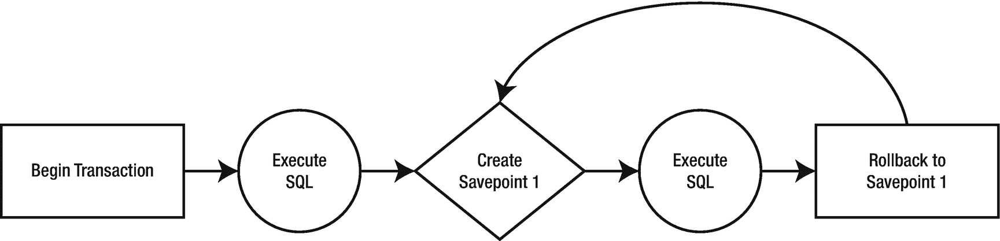

# 14.管理交易

在第 [5](05.html) 章中，您已经或者可能再次了解了事务的基本概念及其在关系数据库解决方案中的重要性。最重要的是，您了解了 R2DBC 规范提供的事务特性支持。

在这一章中，我们将使用 MariaDB R2DBC 驱动程序来获得在反应式解决方案中创建、管理和利用事务的第一手资料。

## 数据库事务支持

不同关系数据库解决方案之间的差异在于它们支持的事务特性的数量。在第 [5](05.html) 章中，您了解了 R2DBC 规范中可用的事务处理能力。

继续我们在过去几章中设定的趋势；我们将使用 MariaDB R2DBC 驱动程序来看看这些功能。我们将避免深入研究 MariaDB 特有的复杂特性，而是涵盖使用 R2DBC 可能实现的功能。

### 数据库准备

接下来，我们将查看 Java 代码示例，使用 MariaDB R2DBC 驱动程序，它依赖于一个名为 *tasks* 的 SQL 表，该表存在于数据库 *todo* 中，我们在上一章中将其添加到 MariaDB 实例中。

为了让我们达成一致，您可以执行清单 [14-1](#PC1) 中的 SQL 来重置 *todo.tasks* 表。

```java
TRUNCATE TABLE todo.tasks; INSERT INTO todo.tasks (description) VALUES ('Task A'), ('Task B'), ('Task C');

Listing 14-1Truncating the existing records and adding new records to todo.tasks

```

Tip

在 SQL 中，`TRUNCATE TABLE`语句是一种数据定义语言(DDL)操作，它将表的范围标记为解除分配。截断任务表将删除所有先前存在的信息，并重新开始自动生成的 id 为*的*列的值计数。

执行清单 [14-1](#PC1) 中的 SQL 将确保我们的表包含三条记录，分别包含 id 列值 1、2 和 3。

```java
+----+-------------+-----------+
| id | description | completed |
+----+-------------+-----------+
|  1 | Task A      |         0 |
|  2 | Task B      |         0 |
|  3 | Task C      |         0 |
+----+-------------+-----------+

Listing 14-2The contents of todo.tasks after executing the SQL in Listing 14-1

```

## 交易基础

R2DBC 规范支持通过代码控制事务性操作，而不是通过所有驱动程序都需要实现的`Connection`接口直接使用 SQL。

事务可以隐式或显式启动。当一个`Connection`对象处于自动提交模式时，当一条 SQL 语句通过一个`Connection`对象执行时，事务被隐式地*启动*。

### 自动提交

在第 [5](05.html) 章中，您了解到`Connection`对象的自动提交模式可以使用`isAutoCommit`方法来检索，并通过调用`setAutoCommit`方法来更改(清单 [14-3](#PC3) )。

```java
boolean isAutoCommit = connection.isAutoCommit();
if (isAutoCommit) {
      connection.setAutoCommit(false).block();
}

Listing 14-3Disabling auto-commit for a Connection object

```

Tip

在 MariaDB R2DBC 驱动程序中，默认情况下自动提交*启用*。

### 显性交易

一旦自动提交模式被禁用，事务必须被*显式*启动。使用 MariaDB 驱动程序，这可以通过在一个`MariadbConnection`对象上调用`beginTransaction`方法来完成(清单 [14-4](#PC4) )。

```java
connection.beginTransaction().subscribe();

Listing 14-4Beginning a MariaDB transaction

```

Tip

对一个`MariadbConnection`对象使用`beginTransaction`方法将自动禁用连接的*自动提交*。

#### 提交交易

一旦您开始了显式处理数据库事务的道路，无论您创建和执行了多少 SQL 语句，您都需要调用`commitTransaction`方法来使对数据的更改永久化(清单 [14-5](#PC5) )。

```java
MariadbStatement insertStatement = connection.createStatement("INSERT INTO tasks (description) VALUES ('Task D'));

insertStatement.execute()
               .then(connection.commitTransaction())
               .subscribe();

Listing 14-5Beginning and committing a MariaDB transaction

```

Note

在清单 [14-5](#PC5) 中，由*项目反应器*提供的`then`方法用于建立链式的、声明性的交互。

执行清单 [14-5](#PC5) 中的代码将导致一个新的任务行被添加到*任务*表中。当事务被提交时,`INSERT`语句的改变变成永久的。您可以通过查看任务表中的内容来确认结果(清单 [14-6](#PC6) )。

```java
SELECT * FROM todo.tasks;
+----+-------------+-----------+
| id | description | completed |
+----+-------------+-----------+
|  1 | Task A      |         0 |
|  2 | Task B      |         0 |
|  3 | Task C      |         0 |
|  4 | Task D      |         0 |
+----+-------------+-----------+

Listing 14-6Output that results after committing the transaction

```

#### 回滚事务

但是，如果有一个场景需要您撤销 SQL 语句，或者由于某种原因，事务失败，那么可以通过执行和订阅`rollbackTransaction`方法(清单 [14-7](#PC7) )来回滚所有事务。

```java
connection.rollbackTransaction().subscribe();

Listing 14-7Rolling back a MariaDB transaction

```

执行清单 [14-7](#PC7) 中的代码将回滚`INSERT`语句的更改，防止它被提交。当这种情况发生时，*任务*表的内容将类似于清单 [14-8](#PC8) 。

```java
SELECT * FROM todo.tasks;
+----+-------------+-----------+
| id | description | completed |
+----+-------------+-----------+
|  1 | Task A      |         0 |
|  2 | Task B      |         0 |
|  3 | TASK C      |         0 |
+----+-------------+-----------+

Listing 14-8Output that results after rolling back the transaction

```

#### 迫切的观点

回想一下第 [1](01.html) 章，在那里你学习了命令式和声明式编程。作为复习，记住*阻塞*操作在*命令式*或分步式编程范式和语言中很常见。相比之下，声明式方法并不关注*如何*完成一个特定的目标，而是关注目标本身。

现在，你已经知道 R2DBC 和整个反应式编程的目的是提供一个*声明性的*解决方案。也就是说，有时候我们的大脑更容易理解命令式的心流。

为了最清楚地展示事务性工作流，我利用了清单 [14-9](#PC9) 中的`block`和`blockLast`方法，这在真正的反应式应用中可能不会发生，但有助于更清楚地说明发生了什么。

```java
try {
       connection.beginTransaction().block();

       MariadbStatement multiStatement = connection.createStatement("DELETE FROM tasks; INSERT INTO tasks (description) VALUES ('Task D');SELECT * FROM tasks;");

multiStatement.execute().blockLast();

      connection.commitTransaction().subscribe();
}
catch(Exception e) {
     connection.rollbackTransaction().subscribe();
     // More exception handling code
}

Listing 14-9Handling exceptions and transactions

```

清单 [14-9](#PC9) 利用了 MariaDB R2DBC 驱动程序在单个`MariadbStatement`对象中执行多个 SQL 语句的能力。

Tip

参见第 [13](13.html) 章了解更多相关信息。

```java
SELECT * FROM todo.tasks;
+----+-------------+-----------+
| id | description | completed |
+----+-------------+-----------+
|  1 | Task A      |         0 |
|  2 | Task B      |         0 |
|  3 | Task C      |         0 |
+----+-------------+-----------+

Listing 14-11Encountering an exception and rolling back the transactions from Listing 14-9

```

```java
SELECT * FROM todo.tasks;
+----+-------------+-----------+
| id | description | completed |
+----+-------------+-----------+
|  4 | Task D      |         0 |
+----+-------------+-----------+

Listing 14-10After successfully committing the transactions from Listing 14-9

```

## 管理保存点

在第 [5](05.html) 章中，您了解到当有必要回滚事务的一部分时，保存点会很有用。当交易的一部分出现错误的可能性较低，并且事先验证操作的准确性成本过高时，通常会出现这种情况。



图 14-1

保存点的基本工作流程

### 使用保存点

使用 MariaDB 驱动程序，可以使用`createSavepoint`方法创建保存点，该方法在`MariadbConnection`对象中可用。

```java
Boolean rollbackToSavepoint = true;

MariadbStatement insertStatement = connection.createStatement("INSERT INTO tasks (description) VALUES ('TASK X');");

MariadbStatement deleteStatement = pconnection.createStatement("DELETE FROM tasks WHERE id = 2;");

insertStatement.execute().then(connection.createSavepoint("savepoint_1").then(deleteStatement.execute().then(rollBackOrCommit(connection,rollbackToSavepoint)))).subscribe();

Listing 14-12Chaining subscribers to commit transactions

```

在这个场景中，清单 [14-12](#PC12) 中使用的`rollbackOrCommit`方法包含条件功能，该功能要么将事务回滚到*保存点 _1* ，然后提交事务，要么提交整个事务。

```java
private Mono<Void> rollBackOrCommit(MariadbConnection connection, Boolean rollback) {
        if (rollback) {
            return connection.rollbackTransactionToSavepoint("savepoint_1").then(connection.commitTransaction());
        }
        else {
            return connection.commitTransaction();
        }
}

Listing 14-13The rollbackOrCommit method

```

清单 [14-14](#PC14) 包含了清单 [14-12](#PC12) 和 [14-13](#PC13) 的更迫切的方法。

```java
Boolean rollbackToSavepoint = true;

MariadbStatement insertStatement = connection.createStatement("INSERT INTO tasks (description) VALUES ('TASK D');");
insertStatement.execute().blockFirst();

connection.createSavepoint("savepoint_1").block();

MariadbStatement deleteStatement = connection.createStatement("DELETE FROM tasks WHERE id = 2;");
deleteStatement.execute().blockFirst();

if (rollbackToSavepoint) {
    connection.rollbackTransactionToSavepoint("savepoint_1").block();
}

connection.commitTransaction();

Listing 14-14Blocked equivalent of Listings 14-12 and 14-13

```

无论您使用清单 [14-12](#PC12) 和 [14-13](#PC13) 中的声明式方法还是清单 [14-14](#PC14) 中的命令式流程，输出都是一样的，如清单 [14-15](#PC15) 和 [14-16](#PC16) 所示。

```java
SELECT * FROM todo.tasks;
+----+-------------+-----------+
| id | description | completed |
+----+-------------+-----------+
|  1 | Task A      |         0 |
|  3 | Task C      |         0 |
|  4 | Task D      |         0 |
+----+-------------+-----------+

Listing 14-16Output that results after committing the entire transaction

```

```java
SELECT * FROM todo.tasks;
+----+-------------+-----------+
| id | description | completed |
+----+-------------+-----------+
|  1 | Task A      |         0 |
|  2 | Task B      |         0 |
|  3 | Task C      |         0 |
|  4 | Task D      |         0 |
+----+-------------+-----------+

Listing 14-15Output that results after rolling back to savepoint_1

```

### 释放保存点

因为保存点直接在数据库上分配资源，所以数据库供应商可能要求释放保存点来处理资源。你在第 [5 章](05.html)中了解到有多种方法可以释放保存点，包括使用`releaseSavepoint`方法(清单 [14-17](#PC17) )。

```java
connection.releaseSavepoint("savepoint_1").subscribe();

Listing 14-17Release a savepoint

```

## 处理隔离级别

数据库提供了在事务中指定隔离级别的能力。事务隔离的概念定义了一个事务与其他事务执行的数据或资源修改的隔离程度，从而在多个事务处于活动状态时影响并发访问。

可以通过调用`getTransactionIsolationLevel`方法来检索`IsolationLevel`枚举值，该方法可通过`MariadbConnection`对象获得。

Tip

有关`IsolationLevel`的更多信息，请参见第 [5 章](05.html)。

```java
IsolationLevel level = connection.getTransactionIsolationLevel();

Listing 14-18Getting the default MariaDB R2DBC driver IsolationLevel setting

```

Note

这些示例中使用的 MariaDB 存储引擎 InnoDB 的缺省值`IsolationLevel`是可重复读取的。

要更改`IsolationLevel`，您可以使用`setTransactionIsolationLevel`方法，可通过`MariadbConnection`对象获得。

```java
connection.setTransactionIsolationLevel(IsolationLevel.READ_UNCOMMITTED);

Listing 14-19Changing the MariaDB R2DBC driver IsolationLevel setting

```

## 给我看看代码

您可以在专门针对本书的 GitHub 资源库中找到一个完整的、完全可编译的示例应用。如果您还没有这样做，只需导航到 [`https://github.com/apress/r2dbc-revealed`](https://github.com/apress/r2dbc-revealed) 到`git clone`或者直接下载存储库的内容。在那里，您可以在 *ch14* 文件夹中找到专门用于这一章的示例应用。

## 摘要

使用和控制事务的能力是构建使用关系数据库的解决方案的一个关键特性。这是因为事务用于在并发数据库访问期间提供数据完整性、隔离、正确的应用语义和一致的数据视图。

在第 [5](05.html) 章中，您了解到 R2DBC 兼容驱动程序需要提供事务支持。在这一章中，你可以看到它的作用。使用 MariaDB R2DBC 驱动程序，您学习了如何创建、提交和回滚事务。您还学习了如何创建和管理保存点。最后，您了解了如何使用 R2DBC 处理 MariaDB 数据库中的隔离级别。