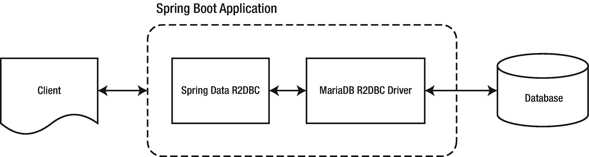
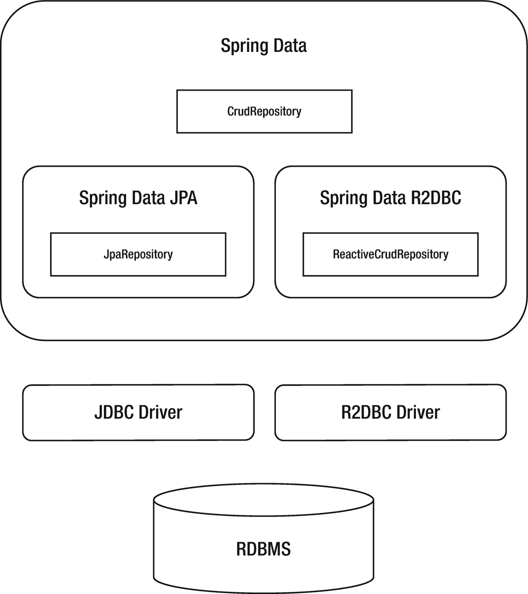
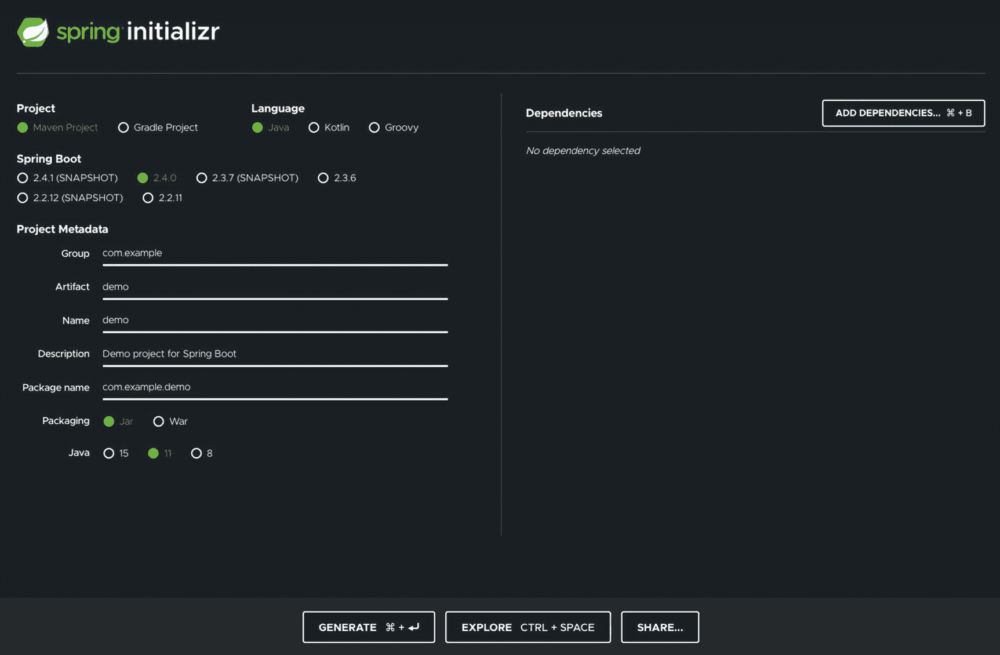
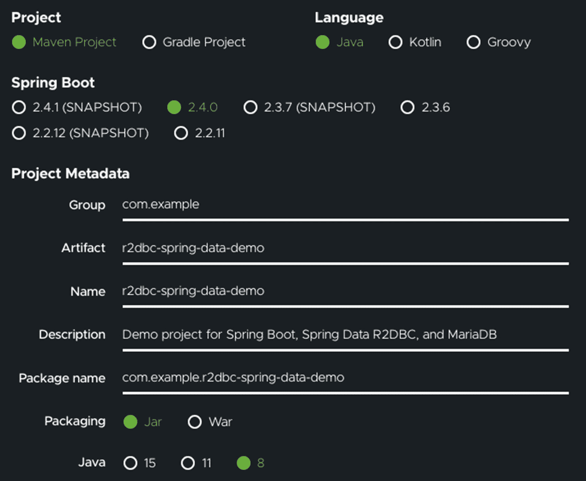
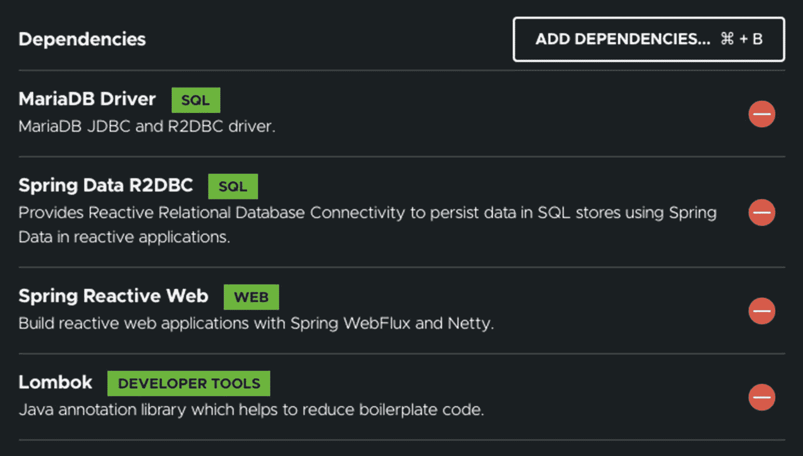
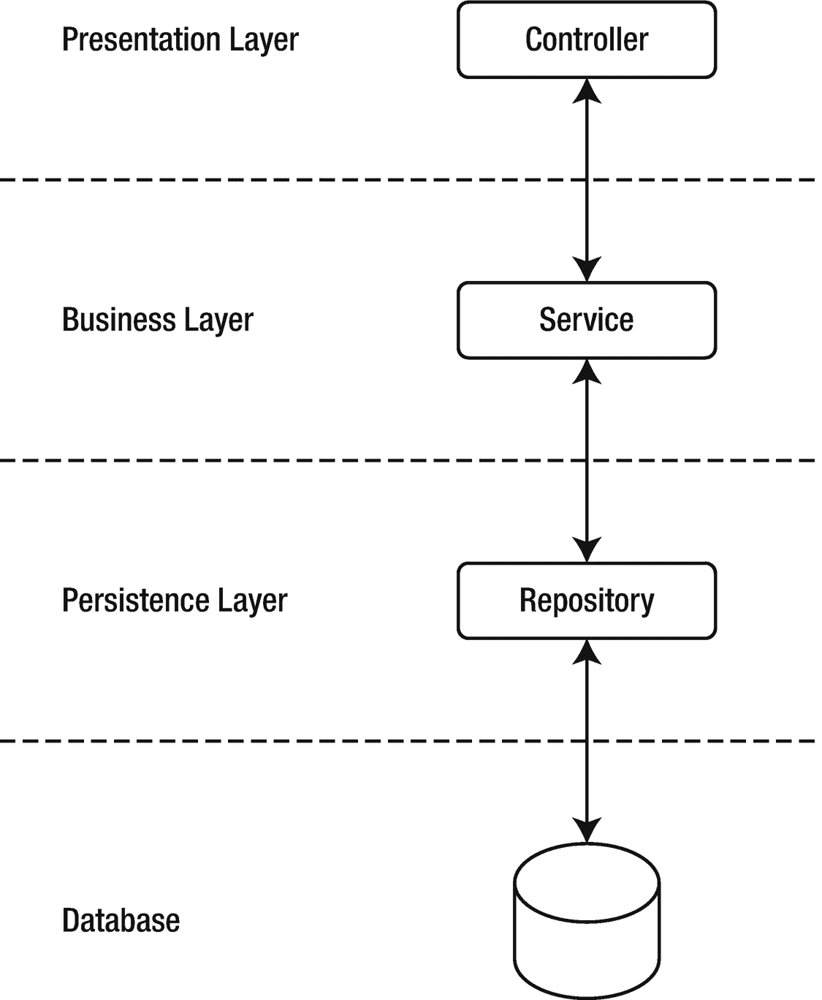

# 十六、Spring 数据和 R2DBC 的实际应用

到目前为止，您已经了解了 R2DBC 驱动程序提供了一种利用 R2DBC API 对关系数据库使用反应式代码的方法。但是您可能已经注意到，创建一个完整的数据访问层(DAL)需要做大量的工作，这并不是 R2DBC 所独有的。事实上，R2DBC 的一个主要优点是它并不打算成为一个通用的数据访问 API。

相反，R2DBC 侧重于由关系数据交互产生的反应式数据访问和常见使用模式。最终，R2DBC 打算让通用数据访问功能成为 R2DBC 客户端库的职责，这在第 [11](11.html) 章中有简要提及。在本章中，我们将研究一个名为 Spring Data R2DBC 的客户端库，它是 Spring 应用框架的一部分，以了解 R2DBC 客户端如何帮助减少创建完全反应式应用的时间和复杂性。

## 春天简介

Spring Framework 是 Java 平台的应用框架和控制容器的反转。Spring Framework 为现代基于 Java 的应用提供了全面的编程和配置模型。

在这一章中，我将利用 Spring 框架和构建在它之上的库来说明如何创建一个完全反应式的 web 应用，该应用通过 Spring Data R2DBC 客户端使用 R2DBC 与关系数据库(更具体地说是 MariaDB)进行交互。

### Spring Boot

Spring Boot 是一个由 Pivotal 开发的开源 Java 框架，Pivotal 也是 R2DBC 的主要贡献者，它旨在简化开发和部署 Java 企业 web 应用的任务。这是一个建立在 Spring 框架之上的项目。

> *Spring Boot 让创建基于 Spring 的独立的生产级应用变得简单，你可以“直接运行”。*

> *—Spring Boot 官方文档*

为了增加简单性，为了减少开发人员的配置和代码搭建，框架在 Spring 平台和第三方库上采取了固执己见的立场。

在本章中，我们将研究一个 Spring Boot 应用。应用将通过表述性状态转移(REST)端点公开应用编程接口(API)(图 [16-1](#Fig1) )。在内部，应用将结合使用 Spring Data R2DBC 库和 MariaDB R2DBC 驱动程序来连接和通信我们在第 [11 章](11.html)中建立的 MariaDB 数据库。



图 16-1

Spring Boot 应用架构

关于 Spring Boot 的更多信息，请查看 [`https://spring.io/projects/spring-boot`](https://spring.io/projects/spring-boot) 的官方文档。

### 春季数据

Spring Data 的存在是为了统一和简化对不同类型的持久性存储的访问，包括关系型和非关系型。根据官方文档，Spring Data 的任务是为数据访问提供一个熟悉的、一致的、基于 Spring 的编程模型，同时仍然保留底层数据存储的特性。

因为实现应用的数据访问层可能很麻烦，通常需要编写大量的样板代码，所以 Spring Data 提供了存储库抽象来帮助减少创建数据访问层和持久层所需的工作。

我将在本章中使用的几个关键特性是

*   创建存储库和自定义对象映射抽象

*   从存储库方法名动态派生查询

*   定制存储库代码

*   通过注释利用 Spring 集成

### 春季数据 R2DBC

与其他 Spring 数据库类似，Spring Data R2DBC 使用核心的 Spring 概念来帮助开发与目标数据源集成的解决方案。与使用 JDBC 驱动程序的 Spring Data JPA 一样，Spring Data R2DBC 使用 R2DBC 驱动程序与关系数据库进行交互，并使用 Spring 数据存储库管理持久性(图 [16-2](#Fig2) )。



图 16-2

Spring Data R2DBC 架构

#### 项目反应堆

默认情况下，Spring Data R2DBC 需要 Project Reactor 作为核心依赖项，但是它可以通过 reactive Streams 规范与其他 Reactive 库进行互操作。Spring Data R2DBC 存储库接受一个 Reactive Streams API `Publisher`作为输入，并在内部使其适应一个项目反应器类型，以返回一个`Mono`或一个`Flux`输出。

然而，正如我们在前面的章节中了解到的，任何`Publisher`都可以被证明为输入并在输出上应用操作；只需修改输出，就可以使用另一个 Reactive Streams API 实现库。

出于本章的目的，我将坚持使用默认的基于 Project Reactor 的输出，因为 Spring Data R2DBC 和 MariaDB R2DBC 连接器共享 Project Reactor 作为依赖项。

## 入门指南

在第 [11](11.html) 章中，我们介绍了使用 Apache Maven 客户端创建新 Java 应用的过程。希望这有助于您理解创建使用 R2DBC 驱动程序的 Java 应用的基础。在本章中，我将更多地关注应用代码，而不是项目基础设施，因此，我将使用一个名为 Spring Initializr 的 web 应用来生成一个包含各种依赖项的 Java 项目，包括 Spring 数据 R2DBC。

### 弹簧初始化 zr

Spring Initializr 是一个 web 应用，可以用来为您生成 Spring Boot 项目结构。它不会生成任何应用代码，但是它会给你一个基本的项目结构和一个 Maven 或 Gradle 构建规范来构建你的代码。你所需要做的就是编写应用代码。

Spring Initializr 项目可以以几种方式使用，包括

*   基于网络的界面

*   使用 Spring Boot CLI

*   Via Spring 工具套件

Note

Spring Tool Suite (STS)是一套用于创建 Spring 应用的工具。这个工具集既可以作为一个插件安装到 Eclipse JEE 的现有安装中，也可以独立安装。

然而，为了简单起见，我将在 [`https://start.spring.io`](https://start.spring.io) 浏览 Spring Initializr 的 web 界面。web 界面包含一个页面，该页面提供了生成新 Spring Boot 应用的可配置选项(图 [16-3](#Fig3) )。



图 16-3

spring 初始化网页

#### 项目配置

在 Spring Initializr 页面的左侧，您将看到用于配置新 Spring Boot 应用的各种选项。

首先选择 Maven 项目的项目设置，因为您将使用 Apache Maven 和 Maven 客户端来构建管理应用。

接下来，选择 Java 作为语言，并随意保留默认的 Spring Boot 版本。在我写这本书的时候，默认版本是 2.4.0。

图 [16-4](#Fig4) 提供了一个我用于项目元数据设置的例子，但是你可以根据自己的需要和喜好随意定制。



图 16-4

为新的 Spring Initializr 生成的应用提供项目设置

#### 添加依赖关系

在 Spring Initializr 页面的右边是一个名为“Dependencies”的部分，它可以用来将 Maven 工件添加到将要生成的项目中。对于示例项目，您将需要表 [16-1](#Tab1) 中所示的四个依赖项。

表 16-1

示例项目中使用的 Maven 工件的名称和描述

<colgroup><col class="tcol1 align-left"> <col class="tcol2 align-left"></colgroup> 
| 

工件名称

 | 

描述

 |
| --- | --- |
| MariaDB 驱动程序 | MariaDB R2DBC 驱动程序工件。 |
| 春季数据 R2DBC | Spring Data R2DBC 客户端库工件。 |
| 弹簧反应网 | 一个用于 web 应用的反应式框架库。 |
| 龙目岛 | 一个 Java 注释库，有助于减少样板代码，即模型对象的 getter 和 setter 方法。 |

单击“添加相关性”按钮，提示工作流搜索要生成的项目并向其添加相关性。

当依赖项被成功添加后，您应该会看到它们被填充在类似于图 [16-5](#Fig5) 的页面上。



图 16-5

添加到新的 Spring Initializr 生成的项目中的依赖项

#### 生成新项目

最后，在提供了项目设置并添加了依赖项之后，您可以通过单击页面底部的“generate”按钮来生成一个新的 Spring Boot 应用。

这样做会自动将包含项目的压缩文件下载到系统上的默认下载位置。

解压缩文件后，您可以使用自己选择的代码编辑器或 IDE 来打开项目并检查文件。正如我前面指出的，Spring Initializr 有助于减少构建项目所花费的时间，包括拼凑依赖层次结构。

如果你想知道我这么说是什么意思，请打开并检查位于 *r2dbc-spring-data-demo* 文件夹*顶层的 *pom.xml* 文件。*在 pom.xml 文件中，您会注意到关于该项目的大量信息，包括依赖项部分(清单 [16-1](#PC1) )，其中包括您使用 Spring Initializr web 接口添加的依赖项。

```java
    <dependencies>
        <dependency>
            <groupId>org.springframework.boot</groupId>
            <artifactId>spring-boot-starter-data-r2dbc</artifactId>
        </dependency>
        <dependency>
            <groupId>org.springframework.boot</groupId>
            <artifactId>spring-boot-starter-webflux</artifactId>
        </dependency>
        <dependency>
            <groupId>org.mariadb</groupId>
            <artifactId>r2dbc-mariadb</artifactId>
            <version>0.8.4-rc</version>
        </dependency>
        <dependency>
            <groupId>org.projectlombok</groupId>
            <artifactId>lombok</artifactId>
            <optional>true</optional>
        </dependency>
        <dependency>
            <groupId>org.springframework.boot</groupId>
            <artifactId>spring-boot-starter-test</artifactId>
            <scope>test</scope>
        </dependency>
        <dependency>
            <groupId>io.projectreactor</groupId>
            <artifactId>reactor-test</artifactId>
            <scope>test</scope>
        </dependency>
    </dependencies>

Listing 16-1The dependencies for the Spring Initializr–generated project

```

### 配置连接

在前面的章节中，我解释了如何直接使用 R2DBC 驱动程序来配置与底层数据源的连接。最终，驱动程序的代码负责处理与目标数据源的所有通信，但是 Spring Data R2DBC 客户端的部分角色是帮助管理连接工作流。

通过向名为`application.properties`的单个文件添加信息，可以配置 Spring Data R2DBC 使用特定的驱动程序和到目标数据库的连接。

Tip

Spring Boot 属性文件用于在单个文件中保存 N 个属性，以便在不同的环境中运行应用。在 Spring Boot，属性保存在类路径下的`application.properties`文件中。

为此，导航到*r2dbc-spring-data-demo/src/main/resources/application . properties*以及清单 [16-2](#PC2) 中详细列出的连接信息。

```java
spring.r2dbc.url=r2dbc:mariadb://127.0.0.1:3306/todo
spring.r2dbc.username=app_user
spring.r2dbc.password=Password123!

Listing 16-2Spring Data R2DBC connection settings in the application.properties file

```

Tip

有关 Spring Data R2DBC 配置设置的更多信息，包括如何设置连接池，请务必查看位于 [`https://docs.spring.io/spring-data/r2dbc/docs/current/reference/html/#reference`](https://docs.spring.io/spring-data/r2dbc/docs/current/reference/html/%2523reference) 的官方参考文档。

### Spring 数据仓库

正如我在本章开始时提到的，Spring 数据仓库抽象的目标之一是帮助减少为各种持久性存储实现数据访问层所需的样板代码的数量。

Note

在计算机科学中，持久性是一个名词，描述在创建数据的过程之后仍然存在的数据。

在 Spring 中，持久性可以通过使用数据访问对象(DAO)层来处理。在这种情况下，如图 [16-6](#Fig6) 所示，Spring DAO 层的作用是作为一个持久性管理器，所以无论使用 JDBC、R2DBC、JPA 还是一个本地 API，都会给出相同的应用数据访问 API。



图 16-6

一个示例应用层架构，包括一个持久层

#### 映射实体

Spring 数据 R2DBC 实体是普通的旧 Java 对象(POJOs ),使用 Spring 数据注释可以映射到关系数据库表。

使用`@Table`注释，Spring Data R2DBC 在 MariaDB *todo* 数据库(清单 [16-3](#PC3) )中的`Task`类和 tasks 表之间建立映射。

```java
@Data
@RequiredArgsConstructor
@Table("tasks")
class Task {
    @Id
    private Integer id;
    @NonNull
    private String description;
    private Boolean completed;
}

Listing 16-3A Spring Data R2DBC mapped entity object

```

Tip

清单 [16-3](#PC3) 中使用的`@Data`注释是从 *Lombok* 库中获得的注释，有助于消除向`Task`类添加 *getter* 和 *setter* 方法的需要。更多关于龙目岛项目的信息，请务必查看 [`https://projectlombok.org/`](https://projectlombok.org/) 。

#### 创建新的存储库

接下来，您可以利用名为`ReactiveCrudRepository`的 Spring Data R2DBC 接口，该接口为特定类型的存储库提供通用 CRUD 操作。

要使用`ReactiveCrudRepository`，创建一个名为`TasksRepository`的新接口，它扩展了`ReactiveCrudRepository`，并提供了一个目标实体类型`Task`和一个主键类型`Integer`(清单 [16-4](#PC4) )。

```java
interface TasksRepository extends ReactiveCrudRepository<Task, Integer> {
}

Listing 16-4Creating a new repository implementation

```

`ReactiveCrudRepository`遵循反应范式，使用建立在反应流之上的项目反应器类型。基本上，准备好处理一些`Publisher`对象。

#### 查询数据

`TasksRepository`实现了`ReactiveCrudRepository`，它提供了几个 CRUD 方法，可以用来与 *todo* 数据库中的*任务*表进行交互。

例如，在清单 [16-5](#PC5) 、 [16-6](#PC6) 和 [16-7](#PC7) 中，您可以看到一些可用的 CRUD 方法选项，其中`tasksRepository`是一个实例化的`TasksRepository`对象。

```java
Task task = new Task("New Task");
Mono<Task> saveTaskPublisher = tasksRepository.save(task);

Listing 16-7Create a new task record

```

```java
Mono<Task> taskPublisher = tasksRepository.findById(1);

Listing 16-6Select a single task record by providing a primary key value to the findById method

```

```java
Flux<Task> tasksPublisher = tasksRepository.findAll();

Listing 16-5Select all records from the tasks table using the findAll method

```

请记住，清单 [16-5](#PC5) 、 [16-6](#PC6) 和 [16-7](#PC7) 只是通过`ReactiveCrudRepository`提供的几个 CRUD 操作。有关`ReactiveCrudRepository`的更多信息，请查阅官方文档。

##### 使用自定义查询

您还可以通过向存储库接口添加方法签名，向存储库添加定制的方法(清单 [16-8](#PC8) )。

```java
interface TasksRepository extends ReactiveCrudRepository<Task, Integer> {
    @Modifying
    @Query("UPDATE tasks SET completed = :completed WHERE id = :id")
    Mono<Integer> updateStatus(Integer id, Boolean completed);
}

Listing 16-8Custom defined query

```

Note

`@Modifying`注释表明查询方法应该被认为是修改查询，因为它改变了需要执行的方式。对于所有数据操作语言(DML)和数据定义语言(DDL)查询，Spring Data R2DBC 存储库也需要它。

##### 参数化

在第 [6](06.html) 和 [13](13.html) 章中，您了解了 R2DBC 中参数化的概念，以及占位符值如何被用来动态地向 SQL 语句提供信息。

仔细查看添加到清单 [16-8](#PC8) 中的`TasksRepository`示例的方法，清单 [16-9](#PC9) 关注于`updateStatus`方法的输入参数，以及它们如何在通过使用`@Query`注释指定的定制查询中用作参数。

```java
@Query("UPDATE tasks SET completed = :completed WHERE id = :id")
Mono<Integer> updateStatus(Integer id, Boolean completed);

Listing 16-9Querying with parameters

```

### 将这一切结合在一起

现在，您已经学习了如何使用 Spring Framework 正确配置连接信息，研究了如何建立`Task`类和底层 tasks 表之间的映射，最后，了解了如何使用自定义的`ReactiveCrudRepository`实现来处理持久性，现在您已经有了使用 R2DBC 从 MariaDB 数据库读取信息和向其中写入信息的基础！

在清单 [16-10](#PC10) 中，我将所有东西都放在了一个内聚的示例中，您可以用它来替换*/r2dbc-spring-data-demo/src/main/Java/com/example/r 2 dbcspringdatademodemo/r 2 dbcspringdatademoapplication . Java*中的所有内容。

```java
package com.example.r2dbcspringdatademo;

import org.springframework.beans.factory.annotation.Autowired;
import org.springframework.boot.SpringApplication;
import org.springframework.boot.autoconfigure.SpringBootApplication;
import org.springframework.data.annotation.Id;
import org.springframework.data.r2dbc.repository.Modifying;
import org.springframework.data.r2dbc.repository.Query;
import org.springframework.data.r2dbc.repository.config.EnableR2dbcRepositories;
import org.springframework.data.relational.core.mapping.Table;
import org.springframework.data.repository.reactive.ReactiveCrudRepository;
import org.springframework.http.HttpStatus;
import org.springframework.http.ResponseEntity;
import org.springframework.stereotype.Service;
import org.springframework.transaction.annotation.Transactional;
import org.springframework.web.bind.annotation.DeleteMapping;
import org.springframework.web.bind.annotation.GetMapping;
import org.springframework.web.bind.annotation.PostMapping;
import org.springframework.web.bind.annotation.PutMapping;
import org.springframework.web.bind.annotation.RequestBody;
import org.springframework.web.bind.annotation.RequestMapping;
import org.springframework.web.bind.annotation.RequestParam;
import org.springframework.web.bind.annotation.RestController;

import lombok.Data;
import lombok.NonNull;
import lombok.RequiredArgsConstructor;
import reactor.core.publisher.Flux;
import reactor.core.publisher.Mono;

@SpringBootApplication
@EnableR2dbcRepositories
public class R2dbcSpringDataDemoApplication {

    public static void main(String[] args) {
        SpringApplication.run(R2dbcSpringDataDemoApplication.class, args);
    }

}

@RestController
@RequestMapping("/tasks")
class TasksController {

    @Autowired
    private TaskService service;

    @GetMapping()
    public ResponseEntity<Flux<Task>> get() {
        return ResponseEntity.ok(this.service.getAllTasks());
    }

    @PostMapping()
    public ResponseEntity<Mono<Task>> post(@RequestBody Task task) {
        if (service.isValid(task)) {
            return ResponseEntity.ok(this.service.createTask(task));
        }
        return ResponseEntity.status(HttpStatus.I_AM_A_TEAPOT).build();
    }

    @PutMapping()
    public ResponseEntity<Mono<Task>> put(@RequestBody Task task) {
        if (service.isValid(task)) {
            return ResponseEntity.ok(this.service.updateTask(task));
        }
        return ResponseEntity.status(HttpStatus.I_AM_A_TEAPOT).build();
    }

    @PutMapping("/updatestatus")
    public ResponseEntity<Mono<Integer>> updateStatus(@RequestParam int id, @RequestParam Boolean completed) {
        if (id > 0) {
            return ResponseEntity.ok(this.service.updateTaskStatusById(id,completed));
        }
        return ResponseEntity.status(HttpStatus.I_AM_A_TEAPOT).build();
    }

    @DeleteMapping()
    public ResponseEntity<Mono<Void>> delete(@RequestParam int id) {
        if (id > 0) {
            return ResponseEntity.ok(this.service.deleteTask(id));
        }
        return ResponseEntity.status(HttpStatus.I_AM_A_TEAPOT).build();
    }
}

@Service
class TaskService {

    @Autowired
    private TasksRepository repository;

    public Boolean isValid(final Task task) {
        if (task != null && !task.getDescription().isEmpty()) {
            return true;
        }
        return false;
    }

    public Flux<Task> getAllTasks() {
        return this.repository.findAll();
    }

    public Mono<Task> createTask(final Task task) {
        return this.repository.save(task);
    }

    @Transactional
    public Mono<Task> updateTask(final Task task) {

        return this.repository.findById(task.getId())
                .flatMap(t -> {
                    t.setDescription(task.getDescription());
                    t.setCompleted(task.getCompleted());
                    return this.repository.save(t);
                });
    }

    public Mono<Integer> updateTaskStatusById(Integer id, Boolean completed) {
        return this.repository.updateStatus(id, completed);
    }

    @Transactional
    public Mono<Void> deleteTask(final int id){
        return this.repository.findById(id)
                .flatMap(this.repository::delete);
    }
}

interface TasksRepository extends ReactiveCrudRepository<Task, Integer> {
    @Modifying
    @Query("UPDATE tasks SET completed = :completed WHERE id = :id")
    Mono<Integer> updateStatus(Integer id, Boolean completed);
}

@Data
@RequiredArgsConstructor
@Table("tasks")
class Task {
    @Id
    private Integer id;
    @NonNull
    private String description;
    private Boolean completed;
}

Listing 16-10The complete code sample for R2dbcSpringDataDemoApplication.java

```

结合设置必要的 application.properties 配置和你在本章中学到的持久性实现，清单 [16-10](#PC10) 还包括两个额外的类:`TaskService`和`TaskController`。

使用通过 Spring Web Reactive library 提供的库(以前作为依赖项添加的),`TaskController`类公开了 API 端点。

使用 Spring Framework 提供的控制反转(IoC)，`TaskController`类创建并使用一个`TaskService`对象作为中介、业务级机制来与`TasksRepository`交互。

Note

在软件工程中，控制反转(IoC)是一种编程原则。与传统的控制流相比，IoC 颠倒了控制流。在 IoC 中，计算机程序的自定义部分从通用框架接收控制流。

## 测试它

将所有的部分放在一起之后，是时候检查一下正在运行的应用，看看您的劳动成果了。您将从构建和运行应用开始。从那里，您将能够向使用`TaskController`公开的端点发出 HTTP 请求。

### 构建并运行项目

虽然我们非常欢迎您使用任何构建过程或工具，比如 Eclipse 之类的 IDE，只要您能够轻松地构建和运行应用，您也可以像我们在前面章节中所做的那样使用 Apache Maven 客户端。

在打开一个新的终端窗口并导航到 *r2dbc-spring-data-demo* 项目的根位置后，您可以执行清单 [16-11](#PC11) 中的命令来使用 Maven 构建 Spring Boot 应用。

```java
mvn package

Listing 16-11Build the application using the Apache Maven client

```

一旦成功构建了应用，就可以使用清单 [16-12](#PC12) 中的命令来运行应用。

```java
mvn spring-boot:run

Listing 16-12Run the application using the Apache Maven client

```

### 呼叫端点

最后，结束本章的编码练习，现在您已经成功构建并运行了应用，是时候调用您通过`TaskController`类公开的端点了。

发出 HTTP 请求有许多选择。出于以下示例的目的，我选择使用 curl，这是一个使用 url 语法发送和检索数据的命令行工具。您可以在 [`https://curl.se/`](https://curl.se/) 找到更多关于 curl 支持以及如何下载客户端的信息。

使用 curl，如清单 [16-13](#PC13) 所示，您可以执行 GET 请求来检索 MariaDB *todo.tasks* 表中的所有任务。

```java
curl http://localhost:8080/tasks

Listing 16-13Call the tasks endpoint to retrieve all the records in the MariaDB todo.tasks table

```

## 给我看看代码

您可以在专门针对本书的 GitHub 资源库中找到一个完整的、完全可编译的示例应用。如果您还没有这样做，只需导航到 [`https://github.com/apress/r2dbc-revealed`](https://github.com/apress/r2dbc-revealed) 到`git clone`或者直接下载存储库的内容。在那里，您可以在 *ch16* 文件夹中找到一个专门用于这一章的示例应用。

## 摘要

毫无疑问，使用 R2DBC 大大减少了构建可重用数据访问工作流所花费的开发时间和精力。在本章中，您学习了 Spring Framework、Spring Boot，以及 Spring Data 如何帮助抽象出数据持久层中存在的大量复杂性。在这些基础之上，您还了解了 Spring Data R2DBC 客户端库，以及它如何使用 R2DBC 驱动程序来创建完全反应式的应用。