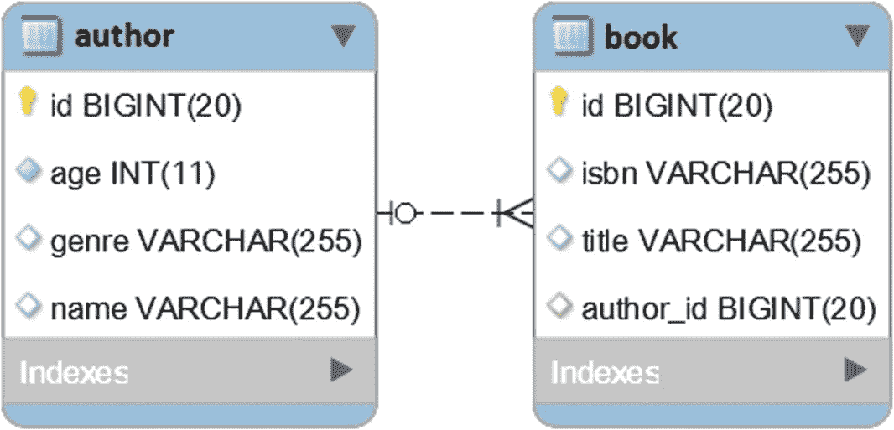

# 二、实体

## 项目 13:如何在实体中采用流畅的 API 风格

考虑`Author`和`Book`实体，它们涉及到一个双向懒惰`@OneToMany`关联，如图 2-1 所示。


图 2-1

@OneToMany 表关系

通常，您可以用`Book` s 创建一个`Author`，如下所示(例如，一个作者有两本书):

```java
Author author = new Author();
author.setName("Joana Nimar");
author.setAge(34);
author.setGenre("History");

Book book1 = new Book();
book1.setTitle("A History of Ancient Prague");
book1.setIsbn("001-JN");

Book book2 = new Book();
book2.setTitle("A People's History");
book2.setIsbn("002-JN");

// addBook() is a helper method defined in Author class
author.addBook(book1);
author.addBook(book2);

```

您还可以用至少两种方式流畅地编写这个代码片段。

流畅风格主要是为了可读性和创造一种代码流畅的感觉。

### 通过实体设置器的流畅风格

让我们通过实体设置器让员工流畅地工作。通常，实体设置器方法返回`void`。您可以更改实体设置器以返回`this`而不是`void`，如下所示(对于 helper 方法也应该这样做):

```java
@Entity
public class Author implements Serializable {

    private static final long serialVersionUID = 1L;

    @Id
    @GeneratedValue(strategy = GenerationType.IDENTITY)
    private Long id;

    private String name;
    private String genre;
    private int age;

    @OneToMany(cascade = CascadeType.ALL,
              mappedBy = "author", orphanRemoval = true)
    private List<Book> books = new ArrayList<>();

    public Author addBook(Book book) {
        this.books.add(book);
        book.setAuthor(this);
        return this;
    }

    public Author removeBook(Book book) {
        book.setAuthor(null);
        this.books.remove(book);
        return this;
    }

    public Author setId(Long id) {
        this.id = id;
        return this;
    }

    public Author setName(String name) {
        this.name = name;
        return this;
    }

    public Author setGenre(String genre) {
        this.genre = genre;
        return this;
    }

    public Author setAge(int age) {
        this.age = age;
        return this;
    }

    public Author setBooks(List<Book> books) {
        this.books = books;
        return this;
    }

    // getters omitted for brevity
}

@Entity
public class Book implements Serializable {

    private static final long serialVersionUID = 1L;

    @Id
    @GeneratedValue(strategy = GenerationType.IDENTITY)
    private Long id;

    private String title;
    private String isbn;

    @ManyToOne(fetch = FetchType.LAZY)
    @JoinColumn(name = "author_id")
    private Author author;

    public Book setId(Long id) {
        this.id = id;
        return this;
    }

    public Book setTitle(String title) {
        this.title = title;
        return this;
    }

    public Book setIsbn(String isbn) {
        this.isbn = isbn;
        return this;
    }

    public Book setAuthor(Author author) {
        this.author = author;
        return this;
    }

    // getters omitted for brevity
}

```

设置器返回的是`this`而不是`void`，因此它们可以以流畅的方式链接，如下所示:

```java
Author author = new Author()
    .setName("Joana Nimar")
    .setAge(34)
    .setGenre("History")
    .addBook(new Book()
        .setTitle("A History of Ancient Prague")
        .setIsbn("001-JN"))
    .addBook(new Book()
        .setTitle("A People's History")
        .setIsbn("002-JN"));

```

GitHub <sup>1</sup> 上有源代码。

### 流畅风格通过附加方法

您还可以通过其他方法实现流畅风格的方法，而不是改变实体设置器，如下所示:

```java
@Entity
public class Author implements Serializable {

    private static final long serialVersionUID = 1L;

    @Id
    @GeneratedValue(strategy = GenerationType.IDENTITY)
    private Long id;

    private String name;
    private String genre;
    private int age;

    @OneToMany(cascade = CascadeType.ALL,
               mappedBy = "author", orphanRemoval = true)
    private List<Book> books = new ArrayList<>();

    public Author addBook(Book book) {
        this.books.add(book);
        book.setAuthor(this);
        return this;
    }

    public Author removeBook(Book book) {
        book.setAuthor(null);
        this.books.remove(book);
        return this;
    }

    public Author id(Long id) {
        this.id = id;
        return this;
    }

    public Author name(String name) {
        this.name = name;
        return this;
    }

    public Author genre(String genre) {
        this.genre = genre;
        return this;
    }

    public Author age(int age) {
        this.age = age;
        return this;
    }

    public Author books(List<Book> books) {
        this.books = books;
        return this;
    }

    // getters and setters omitted for brevity
}

@Entity
public class Book implements Serializable {

    private static final long serialVersionUID = 1L;

    @Id
    @GeneratedValue(strategy = GenerationType.IDENTITY)
    private Long id;

    private String title;
    private String isbn;

    @ManyToOne(fetch = FetchType.LAZY)
    @JoinColumn(name = "author_id")
    private Author author;

    public Book id(Long id) {
        this.id = id;
        return this;
    }

    public Book title(String title) {
        this.title = title;
        return this;
    }

    public Book isbn(String isbn) {
        this.isbn = isbn;
        return this;
    }

    public Book author(Author author) {
        this.author = author;
        return this;
    }

    // getters and setters omitted for brevity
}

```

这一次，这些额外的方法可以用在流畅风格的方法中，如下面的代码片段所示:

```java
Author author = new Author()
    .name("Joana Nimar")
    .age(34)
    .genre("History")
    .addBook(new Book()
        .title("A History of Ancient Prague")
        .isbn("001-JN"))
    .addBook(new Book()
        .title("A People's History")
        .isbn("002-JN"));

```

GitHub <sup>2</sup> 上有源代码。

## 第 14 项:如何通过特定于 Hibernate 的代理填充子级父级关联

您可以通过 Spring 内置的查询方法`findById()`或`getOne()`按标识符获取实体。在`findById()`方法后面，Spring 使用`EntityManager#find()`，在`getOne()`方法后面，Spring 使用`EntityManager#getReference()`。

调用`findById()`从持久化上下文、二级缓存或数据库返回实体(这是尝试查找指定实体的严格顺序)。因此，返回的实体与声明的实体映射的类型相同。

另一方面，调用`getOne()`将返回特定于 Hibernate 的代理对象。这不是实际的实体类型。当子实体可以通过对其父实体的引用持久化时，特定于 Hibernate 的代理会很有用(`@ManyToOne`或`@OneToOne`惰性关联)。在这种情况下，从数据库中获取父实体(执行相应的`SELECT`语句)会降低性能，而且只是一个无意义的动作，因为 Hibernate 可以为未初始化的代理设置底层的外键值。

让我们通过`@ManyToOne`协会将这一声明付诸实践。这个关联是一个常见的 JPA 关联，它精确地映射到一对多表关系。因此，考虑一下`Author`和`Book`实体包含在一个单向惰性`@ManyToOne`关联中。在下面的例子中，`Author`实体代表父端，而`Book`是子端。该关系中涉及的`author`和`book`表如图 2-2 所示。



图 2-2

一对多表关系

考虑一下，在`author`表中，有一个 ID 为`1`的作者。现在，让我们为这个条目创建一个`Book`。

### 使用 findById()

依赖`findById()`可能会导致下面的代码(当然生产中不要用`orElseThrow()`；这里，`orElseThrow()`只是从返回的`Optional`中提取值的快捷方式:

```java
@Transactional
public void addBookToAuthor() {

    Author author = authorRepository.findById(1L).orElseThrow();

    Book book = new Book();
    book.setIsbn("001-MJ");
    book.setTitle("The Canterbury Anthology");
    book.setAuthor(author);

    bookRepository.save(book);
}

```

调用`addBookToAuthor()`会触发以下 SQL 语句:

```java
SELECT
  author0_.id AS id1_0_0_,
  author0_.age AS age2_0_0_,
  author0_.genre AS genre3_0_0_,
  author0_.name AS name4_0_0_
FROM author author0_
WHERE author0_.id = ?

INSERT INTO book (author_id, isbn, title)
  VALUES (?, ?, ?)

```

首先，通过`findById()`触发一个`SELECT`查询。这个`SELECT`从数据库中获取作者。接下来，`INSERT`语句通过设置外键`author_id`保存新书。

### 使用 getOne()

依赖`getOne()`可能会导致以下代码:

```java
@Transactional
public void addBookToAuthor() {
    Author proxy = authorRepository.getOne(1L);

    Book book = new Book();
    book.setIsbn("001-MJ");
    book.setTitle("The Canterbury Anthology");
    book.setAuthor(proxy);

    bookRepository.save(book);
}

```

因为 Hibernate 可以设置未初始化代理的底层外键值，所以这段代码会触发一条`INSERT`语句:

```java
INSERT INTO book (author_id, isbn, title)
  VALUES (?, ?, ?)

```

显然，这比使用`findById()`要好。

完整的代码可以在 GitHub <sup>3</sup> 上找到。

## 第 15 项:如何在持久层使用 Java 8 可选

此项目的目标是确定在持久层中使用 Java 8 可选 API 的最佳实践。为了在示例中展示这些实践，我们使用双向惰性`@OneToMany`关联中涉及的众所周知的`Author`和`Book`实体。

编码的黄金法则是，使用事物的最佳方式是为了它们被创建和测试的目的而利用它们。Java 8 `Optional`也不例外。Java 8 `Optional`的目的由 Java 的语言架构师 Brian Goetz 明确定义:

*   Optional 旨在为库方法返回类型提供一种有限的机制，在这种情况下需要一种清晰的方式来表示“没有结果”，而使用 null 表示这种情况极有可能导致错误。

记住这句话，让我们把它应用到持久层。

### 实体中可选

`Optional`可用于实体。更准确地说，`Optional`应该用在实体的某些 getter 中(例如，倾向于返回`null`的 getter)。对于`Author`实体，`Optional`可用于`name`和`genre`对应的 getters，而对于`Book`实体，`Optional`可用于`title`、`isbn`和`author`，如下:

```java
@Entity
public class Author implements Serializable {
    ...
    public Optional<String> getName() {
        return Optional.ofNullable(name);
    }

    public Optional<String> getGenre() {
        return Optional.ofNullable(genre);
    }
    ...
}

@Entity
public class Book implements Serializable {
    ...
    public Optional<String> getTitle() {
        return Optional.ofNullable(title);
    }

    public Optional<String> getIsbn() {
        return Optional.ofNullable(isbn);
    }

    public Optional<Author> getAuthor() {
        return Optional.ofNullable(author);
    }
    ...
}

```

请勿将`Optional`用于:

*   实体字段(`Optional`不是`Serializable`)

*   构造函数和 setter 参数

*   返回基本类型和集合的 Getters

*   特定于主键的 Getters

### 在存储库中可选

`Optional`可用于储存库。更准确地说，`Optional`可以用来包装查询的结果集。Spring 已经自带了返回`Optional`的内置方法，比如`findById()`和`findOne()`。下面的代码片段使用了`findById()`方法:

```java
Optional<Author> author = authorRepository.findById(1L);

```

此外，您可以编写返回`Optional`的查询，如以下两个示例所示:

```java
@Repository
@Transactional(readOnly = true)
public interface AuthorRepository extends JpaRepository<Author, Long> {

    Optional<Author> findByName(String name);
}

@Repository
@Transactional(readOnly = true)
public interface BookRepository extends JpaRepository<Book, Long> {

    Optional<Book> findByTitle(String title);
}

```

不要假设`Optional`只与查询构建器机制一起工作。它也适用于 JPQL 和本地查询。以下查询完全没问题:

```java
@Query("SELECT a FROM Author a WHERE a.name=?1")
Optional<Author> fetchByName(String name);

@Query("SELECT a.genre FROM Author a WHERE a.name=?1")
Optional<String> fetchGenreByName(String name);

@Query(value="SELECT a.genre FROM author a WHERE a.name=?1",
       nativeQuery=true)
Optional<String> fetchGenreByNameNative(String name);

```

GitHub <sup>4</sup> 上有源代码。

## 第 16 项:如何编写不可变的实体

不可变实体必须遵守以下约定:

*   必须用`@Immutable(org.hibernate.annotations.Immutable)`标注

*   它不得包含任何类型的关联(`@ElementCollection`、`@OneToOne`、`@OneToMany`、`@ManyToOne`或`@ManyToMany`)

*   `hibernate.cache.use_reference_entries`配置属性必须设置为`true`

不可变实体作为实体引用存储在二级高速缓存中，而不是作为*分解状态*。这将防止从实体的*拆卸状态*重建实体的性能损失(创建一个新的实体实例并用*拆卸状态*填充它)。

这里，不可变实体将被存储在二级高速缓存中:

```java
@Entity
@Immutable
@Cache(usage = CacheConcurrencyStrategy.READ_ONLY, region = "Author")
public class Author implements Serializable {

    private static final long serialVersionUID = 1L;

    @Id
    private Long id;

    private String name;
    private String genre;
    private int age;

    // getters and setters omitted for brevity
}

```

本书附带的代码提供了一个完整的解决方案，它依赖于二级缓存的 EhCache 实现。

现在，让我们对这个实体应用 CRUD 操作:

*   创建一个新的`Author`:下面的方法创建一个新的`Author`，并把它保存在数据库中。此外，这个`Author`将通过*直写*策略存储在二级缓存中(关于二级缓存的更多细节，参见**附录 I** ):

*   获取已创建的`Author`:下一个方法从二级缓存中获取已创建的`Author`，不命中数据库:

```java
public void newAuthor() {

    Author author = new Author();

    author.setId(1L);
    author.setName("Joana Nimar");
    author.setGenre("History");
    author.setAge(34);

    authorRepository.save(author);
}

```

*   更新`Author`:由于`Author`是不可变的(它不能被修改)，所以这个操作将不起作用。这不会导致任何错误，只会被忽略:

```java
public void fetchAuthor() {
    Author author = authorRepository.findById(1L).orElseThrow();
    System.out.println(author);
}

```

*   删除`Author`:该操作将从二级缓存中提取实体，并将其从两个位置(二级缓存和数据库)删除:

```java
@Transactional
public void updateAuthor() {
    Author author = authorRepository.findById(1L).orElseThrow();
    author.setAge(45);
}

```

```java
public void deleteAuthor() {
    authorRepository.deleteById(1L);
}

```

不可变类的实体被自动加载为只读的实体。

完整的代码可以在 GitHub <sup>5</sup> 上找到。

## 第 17 项:如何克隆实体

克隆实体不是一项日常任务，但有时这是避免从头开始创建实体的最简单的方法。有许多众所周知的克隆技术，如手动克隆、通过`clone()`克隆、通过复制构造器克隆、使用克隆库克隆、通过串行化克隆和通过 JSON 克隆。

在实体的情况下，你很少需要使用深度克隆，但是如果这是你所需要的，那么克隆 <sup>6</sup> 库会非常有用。大多数情况下，您只需要复制属性的子集。在这种情况下，复制构造函数提供了对克隆内容的完全控制。

让我们以双向懒惰的`@ManyToMany`关联中涉及的`Author`和`Book`实体为例。为了简洁起见，让我们使用图 2-3 (一个有两本书的作者)中的数据快照。


图 2-3

数据快照

### 克隆父对象并关联书籍

让我们假设 *Mark Janel* 不是这两本书的唯一作者(*我的选集*和 *999 选集*)。因此，您需要添加合著者。合著者与*马克·詹妮尔*有着相同的流派和书籍，但却有着不同的年龄和名字。一种解决方案是克隆 Mark Janel 实体，并使用克隆(新实体)来创建合著者。

假设合著者的名字是*法雷尔·特里奥普*，他是 *54，*你可以期望从图 2-4 中获得数据快照。


图 2-4

克隆父项并关联书籍

为了完成这项任务，您需要关注于`Author`实体。这里，您添加了以下两个构造函数:

```java
@Entity
public class Author implements Serializable {

    private static final long serialVersionUID = 1L;

    @Id
    @GeneratedValue(strategy = GenerationType.IDENTITY)
    private Long id;

    private String name;
    private String genre;
    private int age;

    @ManyToMany(...)
    private Set<Book> books = new HashSet<>();

    private Author() {
    }

    public Author(Author author) {
        this.genre = author.getGenre();

        // associate books
        books.addAll(author.getBooks());
    }
    ...
}

```

Hibernate 内部需要`private`构造函数。克隆一个`Author`需要`public`复制构造器。更准确地说，您只克隆了`genre`属性。此外，最初的`Author`实体( *Mark Janel* )引用的所有`Book`实体将与新的共同作者实体( *Farell Tliop* )相关联。

服务方法可以通过初始的`Author`实体(*马克·詹妮尔*)创建共同作者实体(*法雷尔·特里奥*)，如下所示:

```java
@Transactional
public void cloneAuthor() {
    Author author = authorRepository.fetchByName("Mark Janel");

    Author authorClone = new Author(author);
    authorClone.setAge(54);
    authorClone.setName("Farell Tliop");

    authorRepository.save(authorClone);
}

```

被触发的 SQL 语句——除了通过`fetchByName()`触发的`SELECT JOIN FETCH`之外——用于提取*马克·詹内尔*和相关书籍的是预期的`INSERT`语句:

```java
INSERT INTO author (age, genre, name)
  VALUES (?, ?, ?)
Binding: [54, Anthology, Farell Tliop]

INSERT INTO author_book (author_id, book_id)
  VALUES (?, ?)
Binding: [2, 1]

INSERT INTO author_book (author_id, book_id)
  VALUES (?, ?)
Binding: [2, 2]

```

注意，这个例子使用了`Set#addAll()`方法，而不是传统的`addBook()`助手。这样做是为了避免由`book.getAuthors().add(this)`触发的额外的`SELECT`语句:

```java
public void addBook(Book book) {
    this.books.add(book);
    book.getAuthors().add(this);
}

```

例如，如果将`books.addAll(author.getBooks())`替换为:

```java
for (Book book : author.getBooks()) {
    addBook((book));
}

```

然后，每本书都有一个额外的`SELECT`。换句话说，合著者和书籍之间的关联双方是同步的。例如，如果在保存合著者之前在 service-method 中运行以下代码片段:

```java
authorClone.getBooks().forEach(
    b -> System.out.println(b.getAuthors()));

```

你会得到:

```java
[
    Author{id=1, name=Mark Janel, genre=Anthology, age=23},
    Author{id=null, name=Farell Tliop, genre=Anthology, age=54}
]

[
    Author{id=1, name=Mark Janel, genre=Anthology, age=23},
    Author{id=null, name=Farell Tliop, genre=Anthology, age=54}
]

```

您可以看到作者和合著者 id 是`null`，因为它们没有保存在数据库中，并且您使用的是`IDENTITY`生成器。另一方面，如果您运行相同的代码片段，依靠`Set#addAll()`，您将获得:

```java
[
    Author{id=1, name=Mark Janel, genre=Anthology, age=23}
]

[
    Author{id=1, name=Mark Janel, genre=Anthology, age=23}
]

```

这一次，合著者是不可见的，因为您没有在书籍上设置它(您没有同步关联的这一侧)。因为`Set#addAll()`帮助您避免额外的`SELECT`语句，并且在克隆一个实体后，您可能会立即将它保存在数据库中，这应该不是一个问题。

### 克隆父对象和书籍

这一次，假设您想要克隆`Author` ( *马克·詹妮尔*)和相关书籍。因此，你应该期待类似图 2-5 的东西。


图 2-5

克隆父对象和书籍

要克隆`Book`，您需要在`Book`实体中添加适当的构造函数，如下所示:

```java
@Entity
public class Book implements Serializable {

    private static final long serialVersionUID = 1L;

    @Id
    @GeneratedValue(strategy = GenerationType.IDENTITY)
    private Long id;

    private String title;
    private String isbn;

    private Book() {
    }

    public Book(Book book) {
        this.title = book.getTitle();
        this.isbn = book.getIsbn();
    }
    ...
}

```

Hibernate 内部需要`private`构造函数。`public`复制构造器克隆了`Book`。这个例子克隆了`Book`的所有属性。

此外，您应该提供`Author`构造函数:

```java
@Entity
public class Author implements Serializable {

    private static final long serialVersionUID = 1L;

    @Id
    @GeneratedValue(strategy = GenerationType.IDENTITY)
    private Long id;

    private String name;
    private String genre;
    private int age;

    @ManyToMany(...)
    private Set<Book> books = new HashSet<>();

    private Author() {
    }

    public Author(Author author) {
        this.genre = author.getGenre();

        // clone books
        for (Book book : author.getBooks()) {
            addBook(new Book(book));
        }
    }

    public void addBook(Book book) {
        this.books.add(book);
        book.getAuthors().add(this);
    }
    ...
}

```

服务方法保持不变:

```java
@Transactional
public void cloneAuthor() {
    Author author = authorRepository.fetchByName("Mark Janel");

    Author authorClone = new Author(author);
    authorClone.setAge(54);
    authorClone.setName("Farell Tliop");

    authorRepository.save(authorClone);
}

```

被触发的 SQL 语句——除了通过`fetchByName()`触发的`SELECT JOIN FETCH`之外——用于提取*马克·詹内尔*和相关书籍的是预期的`INSERT`语句:

```java
INSERT INTO author (age, genre, name)
  VALUES (?, ?, ?)
Binding: [54, Anthology, Farell Tliop]

INSERT INTO book (isbn, title)
  VALUES (?, ?)
Binding: [001, My Anthology]

INSERT INTO book (isbn, title)
  VALUES (?, ?)
Binding: [002, 999 Anthology]

INSERT INTO author_book (author_id, book_id)
  VALUES (?, ?)
Binding: [2, 1]

INSERT INTO author_book (author_id, book_id)
  VALUES (?, ?)
Binding: [2, 2]

```

### 加入这些案例

通过使用一个`boolean`参数来重塑`Author`的复制构造函数，您可以很容易地从 service-method 中决定这两种情况(克隆父节点并关联图书或克隆父节点并关联图书),如下所示:

```java
public Author(Author author, boolean cloneChildren) {
    this.genre = author.getGenre();

    if (!cloneChildren) {
        // associate books
        books.addAll(author.getBooks());
    } else {
        // clone each book
        for (Book book : author.getBooks()) {
            addBook(new Book(book));
        }
    }
}

```

完整的应用可以在 GitHub <sup>7</sup> 中找到。

## 第 18 项:为什么以及如何激活脏追踪

Dirty Checking

是一种 Hibernate 机制，专门用于在刷新时检测托管实体，这些实体自从被加载到当前持久性上下文中以来已经被修改过。然后，它代表应用(数据访问层)触发相应的 SQL `UPDATE`语句。**请注意，Hibernate 会扫描所有受管实体，即使受管实体中只有一个属性发生了变化。**

在 Hibernate 5 之前，脏检查机制依赖于 Java 反射 API 来检查每个托管实体的每个属性。从性能的角度来看，只要实体的数量相对较少，这种方法就是“无害的”。对于大量受管实体，这种方法可能会导致性能损失。

从 Hibernate 5 开始，脏检查机制依赖于*脏跟踪*机制，这是一个实体跟踪其自身属性变化的能力。脏跟踪机制会带来更好的性能，其好处是显而易见的，尤其是当实体的数量非常大时。为了工作，脏跟踪机制需要将 Hibernate *字节码增强*进程添加到应用中。此外，开发人员必须通过特定的标志配置启用脏跟踪机制:

```java
<plugin>
    <groupId>org.hibernate.orm.tooling</groupId>
    <artifactId>hibernate-enhance-maven-plugin</artifactId>
    <version>${hibernate.version}</version>
    <executions>
        <execution>
            <configuration>
                <failOnError>true</failOnError>
                <enableDirtyTracking>true</enableDirtyTracking>
            </configuration>
            <goals>
                <goal>enhance</goal>
            </goals>
        </execution>
    </executions>
</plugin>

```

一般来说，字节码增强是为了某些目的而检测 Java 类的字节码的过程。Hibernate 字节码增强是一个通常发生在构建时的过程；因此，它不会影响应用的运行时(没有运行时性能损失，但当然在构建期间会有开销)。但是，它可以设置为在运行时或部署时发生。

您可以通过添加相应的 Maven 或 Gradle 插件(Ant 也受支持)来为您的应用添加字节码增强。

一旦添加了字节码增强插件，所有实体类的字节码都会被插装。这个过程被称为*插装*，它包括向代码添加一组服务于所选配置所需的指令(例如，您需要插装实体的代码以进行脏跟踪；通过这种手段，实体能够跟踪它的哪些属性已经改变)。在刷新时，Hibernate 将要求每个实体报告任何变化，而不是依赖状态差异计算。

您可以通过`enableDirtyTracking`配置启用脏跟踪。

尽管如此，仍然推荐使用瘦持久性上下文。 ***水合状态*** **(实体快照)仍然保存在持久化上下文中。**

要检查脏跟踪是否被激活，只需反编译实体类的源代码并搜索以下代码:

```java
@Transient
private transient DirtyTracker $$_hibernate_tracker;

```

`$$_hibernate_tracker`用于登记实体修改。在刷新期间，Hibernate 调用一个名为`$$_hibernate_hasDirtyAttributes()`的方法。该方法将脏属性作为一个`String[]`返回。

或者，只需检查日志中的消息，如下所示:

```java
INFO: Enhancing [com.bookstore.entity.Author] as Entity
Successfully enhanced class [D:\...\com\bookstore\entity\Author.class]

```

Hibernate 字节码增强服务于三种主要机制(对于每种机制，Hibernate 将在字节码中加入适当的插装指令):

*   脏污痕迹(包含在此项中):`enableDirtyTracking`

*   属性惰性初始化(**第 23 项** ): `enableLazyInitialization`

*   关联管理(在双向关联的情况下自动两侧同步):`enableAssociationManagement`

完整的代码可以在 GitHub <sup>8</sup> 上找到。

## 第 19 项:如何将布尔值映射为是/否

考虑一个遗留数据库，它有一个表`author`，该表使用以下数据定义语言(DDL):

```java
CREATE TABLE author (
  id bigint(20) NOT NULL AUTO_INCREMENT,
  age int(11) NOT NULL,
  best_selling varchar(3) NOT NULL,
  genre varchar(255) DEFAULT NULL,
  name varchar(255) DEFAULT NULL,
  PRIMARY KEY (id)
);

```

注意`best_selling`栏。该列存储两个可能的值，*是*或*否*，表示作者是否是畅销书作者。此外，让我们假设这个模式不能被修改(例如，它是遗留的，您不能修改它)，并且`best_selling`列应该被映射到一个`Boolean`值。

显然，将相应的实体属性声明为`Boolean`是必要的，但并不充分:

```java
@Entity
public class Author implements Serializable {

    ...
    @NotNull
    private Boolean bestSelling;
    ...

    public Boolean isBestSelling() {
        return bestSelling;
    }

    public void setBestSelling(Boolean bestSelling) {
        this.bestSelling = bestSelling;
    }
}

```

此时，Hibernate 将尝试映射这个`Boolean`，如下表所示:

<colgroup><col class="tcol1 align-left"> <col class="tcol2 align-left"> <col class="tcol3 align-left"></colgroup> 
| 

**Java 类型**

 | 

**<->-**冬眠类型

 | 

**JDBC 式**

 |
| --- | --- | --- |
| `boolean/Boolean` | `BooleanType` | `BIT` |
| `boolean/Boolean` | `NumericBooleanType` | `INTEGER (e.g, 0 or 1)` |
| `boolean/Boolean` | `YesNoType` | `CHAR (e.g., N/n or Y/y)` |
| `boolean/Boolean` | `TrueFalseType` | `CHAR (e.g., F/f or T/t)` |

因此，这些映射都不匹配`VARCHAR(3)`。一个优雅的解决方案是编写一个定制的转换器，Hibernate 将把它应用于所有的 CRUD 操作。这可以通过实现`AttributeConverter`接口并覆盖它的两个方法来实现:

```java
@Converter(autoApply = true)
public class BooleanConverter
       implements AttributeConverter<Boolean, String> {

    @Override
    public String convertToDatabaseColumn(Boolean attr) {

       return attr == null ? "No" : "Yes";
    }

    @Override
    public Boolean convertToEntityAttribute(String dbData) {

       return !"No".equals(dbData);
    }
}

```

`convertToDatabaseColumn()`从`Boolean`转换为`String`，而`convertToEntityAttribute()`从`String`转换为`Boolean`。

这个转换器用`@Converter(autoApply = true)`标注，这意味着这个转换器将用于被转换类型的所有属性(`Boolean`)。要指定属性，只需删除`autoApply`或将其设置为`false`，并在属性级别添加`@Converter`，如下所示:

`@Convert(converter = BooleanConverter.class)`

`private Boolean bestSelling;`

请注意，`AttributeConverter`不能应用于用`@Enumerated`注释的属性。

完整的应用可在 GitHub <sup>9</sup> 上获得。

## 第 20 项:从聚合根发布域事件的最佳方式

由 Spring 存储库管理的实体被称为聚合根。在域驱动设计(DDD)中，聚合根可以发布事件或域事件。从 Spring Data Ingalls 发行版开始，通过聚合根(实体)发布这样的事件变得容易多了。

Spring Data 附带了一个`@DomainEvents`注释，可以用在聚合根的方法上，使发布尽可能简单。用`@DomainEvents`注释的方法被 Spring 数据识别，并且每当使用适当的存储库保存实体时，该方法被自动调用。此外，除了`@DomainEvents`注释之外，Spring Data 还提供了`@AfterDomainEventsPublication`注释来指示在发布后应该自动调用来清除事件的方法。在代码中，这通常如下所示:

```java
class MyAggregateRoot {

    @DomainEvents
    Collection<Object> domainEvents() {
        // return events you want to get published here
    }

    @AfterDomainEventsPublication
    void callbackMethod() {
        // potentially clean up domain events list
    }
}

```

但是 Spring Data Commons 附带了一个方便的模板基类(`AbstractAggregateRoot`)，它帮助注册域事件并使用`@DomainEvents`和`@AfterDomainEventsPublication`隐含的发布机制。通过调用`AbstractAggregateRoot#registerEvent()`方法来注册事件。如果您调用 Spring 数据仓库的 *save* 方法之一(例如`save()`)并在发布后清除它，注册的域事件就会被发布。

让我们看一个依赖于`AbstractAggregateRoot`及其`registerEvent()`方法的示例应用。有两个实体——`Book`和`BookReview`——参与了一个双向懒惰`@OneToMany`协会。新的书评以`CHECK`状态保存到数据库，并发布`CheckReviewEvent`。该事件负责检查复习语法、内容等。，并将审查状态从`CHECK`切换到`ACCEPT`或`REJECT`。然后，它在数据库中传播新的状态。所以，这个事件是在保存处于`CHECK`状态的书评之前注册的，并且在您调用`BookReviewRepository.save()`方法之后自动发布。发布后，事件被清除。

让我们从聚合器根开始，`BookReview`:

```java
@Entity
public class BookReview extends AbstractAggregateRoot<BookReview>
            implements Serializable {

    @Id
    @GeneratedValue(strategy = GenerationType.IDENTITY)
    private Long id;

    private String content;
    private String email;

    @Enumerated(EnumType.STRING)
    private ReviewStatus status;

    @ManyToOne(fetch = FetchType.LAZY)
    @JoinColumn(name = "book_id")
    private Book book;

    public void registerReviewEvent() {
        registerEvent(new CheckReviewEvent(this));
    }

    // getters, setters, etc omitted for brevity
}

```

`BookReview`扩展`AbstractAggregateRoot`并公开`registerReviewEvent()`方法，通过`AbstractAggregateRoot#registerEvent()`注册域事件。在保存书评之前，调用`registerReviewEvent()`方法来注册事件(`CheckReviewEvent`):

```java
@Service
public class BookstoreService {

    private final static String RESPONSE
        = "We will check your review and get back to you with an email ASAP :)";

    private final BookRepository bookRepository;
    private final BookReviewRepository bookReviewRepository;
    ...

    @Transactional
    public String postReview(BookReview bookReview) {

        Book book = bookRepository.getOne(1L);
        bookReview.setBook(book);

        bookReview.registerReviewEvent();

        bookReviewRepository.save(bookReview);

        return RESPONSE;
    }
}

```

在调用了`save()`方法并且提交了事务之后，事件被发布。这里列出了`CheckReviewEvent`(它传递了`bookReview`实例，但是您也可以通过编写适当的构造函数只传递所需的属性):

```java
public class CheckReviewEvent {

    private final BookReview bookReview;

    public CheckReviewEvent(BookReview bookReview) {
        this.bookReview = bookReview;
    }

    public BookReview getBookReview() {
        return bookReview;
    }
}

```

最后，您需要事件处理程序，其实现如下:

```java
@Service
public class CheckReviewEventHandler {

    public final BookReviewRepository bookReviewRepository;
    ...

    @TransactionalEventListener
    public void handleCheckReviewEvent(CheckReviewEvent event) {

        BookReview bookReview = event.getBookReview();

        logger.info(() -> "Starting checking of review: "
            + bookReview.getId());

        try {
            // simulate a check out of review grammar, content, acceptance
            // policies, reviewer email, etc via artificial delay of 40s for
            // demonstration purposes
            String content = bookReview.getContent(); // check content
            String email = bookReview.getEmail(); // validate email

            Thread.sleep(40000);
        } catch (InterruptedException ex) {
            Thread.currentThread().interrupt();
            // log exception
        }

        if (new Random().nextBoolean()) {
            bookReview.setStatus(ReviewStatus.ACCEPT);
            logger.info(() -> "Book review " + bookReview.getId()
                + " was accepted ...");
        } else {
            bookReview.setStatus(ReviewStatus.REJECT);
            logger.info(() -> "Book review " + bookReview.getId()
                + " was rejected ...");
        }

        bookReviewRepository.save(bookReview);

        logger.info(() -> "Checking review " + bookReview.getId() + " done!");
    }
}

```

我们模拟检查评论语法、内容、接受政策、评论者电子邮件等。出于演示目的，通过 40 秒(`Thread.sleep(40000);`)的人工延迟。审阅检查完成后，审阅状态会在数据库中更新。

### 同步执行

事件处理程序用`@TransactionalEventListener`标注。事件处理程序可以通过`phase`元素显式绑定到发布事件的事务阶段。通常，在事务成功完成后处理事件(`TransactionPhase.AFTER_COMMIT`)。`AFTER_COMMIT`是`@TransactionalEventListener`的默认设置，可以进一步定制为`BEFORE_COMMIT`或`AFTER_COMPLETION`(事务已完成，无论成功与否)或`AFTER_ROLLBACK`(事务已回滚)。`AFTER_COMMIT`和`AFTER_ROLLBACK`是`AFTER_COMPLETION`的专门化。

如果没有事务正在运行，用`@TransactionalEventListener`标注的方法将不会被执行，除非有一个名为`fallbackExecution`的参数被设置为`true`。

由于我们依赖于`AFTER_COMMIT`并且没有为`handleCheckReviewEvent()`指定明确的事务上下文，我们可能期望审查检查(通过`Thread.sleep()`模拟)将在事务之外运行。此外，我们期待一个由`save()`方法(`bookReviewRepository.save(bookReview);`)调用引起的`UPDATE`。这个`UPDATE`应该被包装在一个新的事务中。但是如果您分析应用日志，您会发现这与现实相差甚远(这只是输出的相关部分):

```java
Creating new transaction with name [...BookstoreService.postReview]: PROPAGATION_REQUIRED,ISOLATION_DEFAULT

Opened new EntityManager [SessionImpl(719882002<open>)] for JPA transaction

begin

insert into book_review (book_id, content, email, status) values (?, ?, ?, ?)

Committing JPA transaction on EntityManager [SessionImpl(719882002<open>)]

committing

// The application flow entered in handleCheckReviewEvent()

Starting checking of review: 1

HikariPool-1 - Pool stats (total=10, active=1, idle=9, waiting=0)

Found thread-bound EntityManager [SessionImpl(719882002<open>)] for JPA transaction

Participating in existing transaction

Checking review 1 done!

Closing JPA EntityManager [SessionImpl(719882002<open>)] after transaction

```

这里需要注意几件事。首先，事务在调用`postReview()`时开始，并在运行`handleCheckReviewEvent()`事件处理程序的代码之前提交。这是正常的，因为您指示 Spring 在事务提交后执行`handleCheckReviewEvent()`(`AFTER_COMMIT`)。但是提交事务并不意味着事务性资源已经被释放。事务性资源仍然是可访问的。正如您所看到的，连接池中没有返回连接(HikariCP 报告一个活动连接，`active=1`)并且关联的持久性上下文仍然是打开的。例如，触发一个`bookReviewRepository.findById` ( *book_reivew_id* )将从当前持久上下文中获取`BookReview`！

第二，没有执行`UPDATE`语句！书评状态未传播到数据库。发生这种情况是因为事务已经提交。此时，数据访问代码仍将参与原始事务，但不会有提交(不会有写操作传播到数据库)。这正是这段代码`bookReviewRepository.save(bookReview);`将要发生的事情。

你很容易得出结论，我们正处于非常不愉快的境地。有一个长时间运行的事务(由于通过`Thread.sleep()`模拟的长流程),最终没有更新书评状态。你可能认为切换到`AFTER_COMPLETION`(或`AFTER_ROLLBACK`)会在执行`handleCheckReviewEvent()`之前返回连接池中的连接，在`handleCheckReviewEvent()`级别添加`@Transactional`会触发预期的`UPDATE`语句。但是下面这些都无济于事。结果将完全相同:

```java
@TransactionalEventListener(phase = TransactionPhase.AFTER_COMPLETION)
public void handleCheckReviewEvent(CheckReviewEvent event) {
    ...
}

@Transactional
public void handleCheckReviewEvent(CheckReviewEvent event) {
    ...
}

@Transactional
@TransactionalEventListener(phase = TransactionPhase.AFTER_COMPLETION)
public void handleCheckReviewEvent(CheckReviewEvent event) {
    ...
}

```

要解决这种情况，您必须通过`Propagation.REQUIRES_NEW`明确要求为`handleCheckReviewEvent()`创建一个新事务，如下所示:

```java
@TransactionalEventListener
@Transactional(propagation = Propagation.REQUIRES_NEW)
public void handleCheckReviewEvent(CheckReviewEvent event) {
    ...
}

```

将更改(写操作)传播到事件处理程序中的数据库(用`@TransactionalEventListener`标注的方法)需要一个显式的新事务(`Propagation.REQUIRES_NEW`)。但是一定要阅读下面的讨论，因为从性能的角度来看，这不是没有代价的。

让我们再次检查应用日志:

```java
Creating new transaction with name [...BookstoreService.postReview]: PROPAGATION_REQUIRED,ISOLATION_DEFAULT

Opened new EntityManager [SessionImpl(514524928<open>)] for JPA transaction

begin

insert into book_review (book_id, content, email, status) values (?, ?, ?, ?)

Committing JPA transaction on EntityManager [SessionImpl(514524928<open>)]

committing

// The application flow entered in handleCheckReviewEvent()

Suspending current transaction, creating new transaction with name [com.bookstore.event.CheckReviewEventHandler.handleCheckReviewEvent]

Opened new EntityManager [SessionImpl(1879180026<open>)] for JPA transaction

begin

HikariPool-1 - Pool stats (total=10, active=2, idle=8, waiting=0)

Found thread-bound EntityManager [SessionImpl(1879180026<open>)] for JPA transaction

Participating in existing transaction

select bookreview0_.id as id1_1_0_, ... where bookreview0_.id=?

Committing JPA transaction on EntityManager [SessionImpl(1879180026<open>)]

committing

update book_review set book_id=?, content=?, email=?, status=? where id=?

Closing JPA EntityManager [SessionImpl(1879180026<open>)] after transaction

Resuming suspended transaction after completion of inner transaction

Closing JPA EntityManager [SessionImpl(514524928<open>)] after transaction

```

这一次，事务在您调用`postReview()`时开始，并在应用流到达`handleCheckReviewEvent()`时暂停。新的事务和新的持久上下文被创建并被进一步使用。触发预期的`UPDATE`，更新数据库中的书评状态。**在此期间，两个数据库连接是活动的(一个用于挂起的事务，一个用于当前事务)。**该事务提交，附加的数据库连接返回到连接池。此外，暂停的事务被恢复并关闭。最后，调用`postReview()`时打开的连接被返回到连接池中。显然，这里唯一的好处是触发了`UPDATE`,但是性能损失很大。这使两个数据库连接长时间保持活动状态。所以，两个长时间运行的事务！要解决这种情况，您可以切换到`BEFORE_COMMIT`并移除`@Transactional`:

```java
@TransactionalEventListener(phase = TransactionPhase.BEFORE_COMMIT)
public void handleCheckReviewEvent(CheckReviewEvent event) {
    ...
}

```

这一次，事务在您调用`postReview()`时开始，并在运行事件处理程序(`handleCheckReviewEvent()`)结束时提交。所以，书评状态的`UPDATE`就是在这个事务上下文中触发的。现在，您有了一个长时间运行的事务，并且针对数据库执行了`UPDATE`。数据库连接在您调用`postReview()`时打开，在执行`handleCheckReviewEvent()`结束时关闭。除了这个长时间运行的事务所代表的性能损失之外，您还必须记住，使用`BEFORE_COMMIT`并不总是适应这种场景。如果您确实需要在继续之前提交事务，这不是一个选项。

或者，您仍然可以依赖于`AFTER_COMMIT`并延迟通过`Propagation.REQUIRES_NEW`请求的事务的连接获取。这可以按照**第 60 项**中的方法完成。所以，在`application.properties`中，你需要禁用`auto-commit`:

```java
spring.datasource.hikari.auto-commit=false
spring.jpa.properties.hibernate.connection.provider_disables_autocommit=true

@TransactionalEventListener
@Transactional(propagation = Propagation.REQUIRES_NEW)
public void handleCheckReviewEvent(CheckReviewEvent event) {
    ...
}

```

让我们来看看应用日志:

```java
// The application flow entered in handleCheckReviewEvent()

Suspending current transaction, creating new transaction with name [com.bookstore.event.CheckReviewEventHandler.handleCheckReviewEvent]

Opened new EntityManager [SessionImpl(1879180026<open>)] for JPA transaction

begin

HikariPool-1 - Pool stats (total=10, active=1, idle=9, waiting=0)

Found thread-bound EntityManager [SessionImpl(1879180026<open>)] for JPA transaction

Participating in existing transaction

select bookreview0_.id as id1_1_0_, ... where bookreview0_.id=?

Committing JPA transaction on EntityManager [SessionImpl(1879180026<open>)]

committing

update book_review set book_id=?, content=?, email=?, status=? where id=?

Closing JPA EntityManager [SessionImpl(1879180026<open>)] after transaction

Resuming suspended transaction after completion of inner transaction

Closing JPA EntityManager [SessionImpl(514524928<open>)] after transaction

```

这一次，通过`Propagation.REQUIRES_NEW`要求的事务被延迟，直到您调用`bookReviewRepository.save(bookReview);`。这意味着检查书评的漫长过程将打开一个数据库连接，而不是两个。这样好一点了，但还是不能接受。

### 异步执行

到目前为止，我们还不能说可以忽略相关的性能损失。这意味着我们需要努力进一步优化这些代码。由于图书审核检查过程非常耗时，因此在此过程结束之前，没有必要阻止审核者。正如您在`postReview()`方法中看到的，在保存书评和注册事件之后，我们返回一个字符串响应作为，`We will check your review and get back to you with an email ASAP :)`。该实现依赖于同步执行，因此您需要在事件处理程序完成执行后发送这个字符串响应。显然，由于在图书评论检查过程中，评论者被阻止，所以响应较晚。

最好是在事件处理程序开始执行之前立即返回字符串响应，而带有决定的电子邮件可以稍后发送。默认情况下，事件处理程序在调用方线程中执行。因此，是时候让异步执行为事件处理程序分配不同的线程了。在 Spring Boot，您可以通过`@EnableAsync`启用异步功能。接下来，用`@Async`注释事件处理程序:

```java
@Async
@TransactionalEventListener
@Transactional(propagation = Propagation.REQUIRES_NEW)
public void handleCheckReviewEvent(CheckReviewEvent event) {
    ...
}

```

是时候再次查看应用日志了:

```java
Creating new transaction with name [...BookstoreService.postReview]: PROPAGATION_REQUIRED,ISOLATION_DEFAULT

Opened new EntityManager [SessionImpl(1691206416<open>)] for JPA transaction

begin

insert into book_review (book_id, content, email, status) values (?, ?, ?, ?)

Committing JPA transaction on EntityManager [SessionImpl(1691206416<open>)]
...
Closing JPA EntityManager [SessionImpl(1691206416<open>)] after transaction

Creating new transaction with name [...CheckReviewEventHandler.handleCheckReviewEvent]: PROPAGATION_REQUIRES_NEW,ISOLATION_DEFAULT

Opened new EntityManager [SessionImpl(1272552918<open>)] for JPA transaction

// since the execution is asynchronous the exact moment in time when the
// string response is sent may slightly vary
Response: We will check your review and get back to you with an email ASAP :)

begin

Starting checking of review: 1

HikariPool-1 - Pool stats (total=10, active=0, idle=10, waiting=0)

Found thread-bound EntityManager [SessionImpl(1272552918<open>)] for JPA transaction

Participating in existing transaction

select bookreview0_.id as id1_1_0_, ... where bookreview0_.id=?

Checking review 1 done!

Committing JPA transaction on EntityManager [SessionImpl(1272552918<open>)]
...

```

这一次，应用日志显示您已经消除了长时间运行的事务。当`postReview()`调用被提交和关闭时，事务开始(附加的数据库连接在连接池中返回), string-response 被立即发送给检查者。事件处理程序的执行是异步的，需要一个新的线程和一个新的事务。数据库连接的获取被延迟到真正需要的时候(这时应该更新书评状态)。因此，图书检查不会免费保持任何数据库连接活动/繁忙。

一般来说，大多数应用依赖连接池来重用物理数据库连接，而一个数据库服务器只能服务有限数量的这种连接。这意味着执行长时间运行的事务将使连接长时间处于忙碌状态，这将影响可伸缩性。这不符合 MVCC(多版本并发控制)。为了有一个愉快的连接池和数据库服务器，最好有短的数据库事务。在域事件的上下文中，您至少应该注意以下几点，以避免重大的性能损失。

**异步执行期间:**

*   如果您需要执行任何非常适合异步执行的任务，请使用带有`AFTER_COMPLETION`(或其专门化)的异步事件处理程序。

*   如果这些任务不涉及数据库操作(读/写)，那么不要在事件处理程序方法级别使用`@Transactional`(不要启动新的事务)。

*   如果这些任务涉及数据库读和/或写操作，那么使用`Propagation.REQUIRES_NEW`并将数据库连接获取延迟到需要时(在数据库连接打开后，避免耗时的任务)。

*   如果这些任务只涉及数据库读取操作，那么用`@Transactional(readOnly=true, Propagation.REQUIRES_NEW)`注释事件处理程序方法。

*   如果这些任务涉及数据库写操作，那么用`@Transactional(Propagation.REQUIRES_NEW)`注释事件处理程序方法。

*   避免在`BEFORE_COMMIT`阶段执行异步任务，因为您无法保证这些任务会在生产者的事务提交之前完成。

*   根据您的场景，您可能需要拦截事件处理程序线程的完成。

**同步执行时:**

*   考虑异步执行(包括它的特定缺点)。

*   只有当事件处理程序不耗时并且需要数据库写操作时，才使用`BEFORE_COMMIT`(当然，如果在提交之前执行事件处理程序代码适合您的场景)。显然，您仍然可以读取当前的持久性上下文(它是打开的)并触发只读数据库操作。

*   仅当事件处理程序不耗时且不需要数据库写操作时，才使用`AFTER_COMPLETION`(或其专门化)(尽量避免在同步执行中使用`Propagation.REQUIRES_NEW`)。尽管如此，您仍然可以读取当前的持久性上下文(它是打开的)并触发只读数据库操作。

*   在使用`BEFORE_COMMIT`的情况下，在事件处理程序中执行的数据库操作的失败将回滚整个事务(取决于您的场景，这可能是好的，也可能是不好的)。

Spring 域事件对于简化事件基础设施非常有用，但是要注意以下几点:

*   域事件只适用于 Spring 数据仓库。

*   只有当我们显式调用一个*保存*方法(例如`save()`)时，域事件才会按预期发布。

*   如果发布事件时发生异常，则不会通知侦听器(事件处理程序)。因此，事件将会丢失。

在应用中使用域事件之前，建议评估一下使用 JPA 回调(**第 104 条**)、观察者设计模式、特定于 Hibernate 的`@Formula` ( **第 77 条**)或者其他方法是否也能很好地工作。

完整的应用可在 GitHub <sup>10</sup> 上获得。

<aside aria-label="Footnotes" class="FootnoteSection" epub:type="footnotes">Footnotes 1

[hibernate pringb 欧氟辛烷磺酸酯](https://github.com/AnghelLeonard/Hibernate-SpringBoot/tree/master/HibernateSpringBootFluentApiOnSetters)

  2

[hibernate pringb otfluentpiaddi 国家方法](https://github.com/AnghelLeonard/Hibernate-SpringBoot/tree/master/HibernateSpringBootFluentApiAdditionalMethods)

  3

[hibernate pringb otpopulangchi ldviaproxy](https://github.com/AnghelLeonard/Hibernate-SpringBoot/tree/master/HibernateSpringBootPopulatingChildViaProxy)

  4

[hibernate pringb 欧塔可选](https://github.com/AnghelLeonard/Hibernate-SpringBoot/tree/master/HibernateSpringBootOptional)

  5

[hibernate pringb 不变 ty](https://github.com/AnghelLeonard/Hibernate-SpringBoot/tree/master/HibernateSpringBootImmutableEntity)

  6

[`https://github.com/kostaskougios/cloning`](https://github.com/kostaskougios/cloning)

  7

[hibernate pringb oostcloneentity](https://github.com/AnghelLeonard/Hibernate-SpringBoot/tree/master/HibernateSpringBootCloneEntity)

  8

[hibernate pringb bootenabledirtytr packing](https://github.com/AnghelLeonard/Hibernate-SpringBoot/tree/master/HibernateSpringBootEnableDirtyTracking)

  9

[hibernate pringb oomapboolean 否](https://github.com/AnghelLeonard/Hibernate-SpringBoot/tree/master/HibernateSpringBootMapBooleanToYesNo)

  10

[hibernate pringb 欧特域事件](https://github.com/AnghelLeonard/Hibernate-SpringBoot/tree/master/HibernateSpringBootDomainEvents)

 </aside>