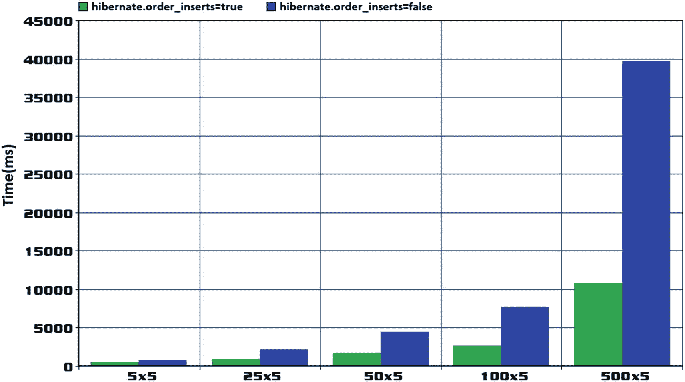

# 四、批量

## 第 46 项:如何批量插入 Spring Boot 风格

批处理是一种能够对`INSERT`、`UPDATE`和`DELETE`语句进行分组的机制，因此，它显著减少了数据库/网络往返次数。往返次数越少，性能越好。

批处理是避免由大量独立的数据库/网络往返(代表数据库中的插入、删除或更新)所导致的性能损失的完美解决方案。例如，在没有批处理的情况下，1，000 次插入需要 1，000 次单独的往返，而采用批处理且批处理大小为 30 将导致 34 次单独的往返。插入越多，批处理就越有用。

### 启用批处理并准备 JDBC URL

在 Spring Boot + Hibernate +(本例中为 MySQL)应用中启用批量插入支持从`application.properties`中的几个设置开始，接下来将讨论。

#### 设置批量大小

批量大小可以通过`spring.jpa.properties.hibernate.jdbc.batch_size`属性设置。推荐值范围在 5 到 30 之间。默认值可以通过`Dialect.DEFAULT_BATCH_SIZE`获取。将批量大小设置为 30 可以按如下方式完成:

```java
spring.jpa.properties.hibernate.jdbc.batch_size=30

```

不要混淆`hibernate.jdbc.batch_size`和`hibernate.jdbc.fetch_size`。后者用于设置 JDBC `Statement.setFetchSize()`，如**第 45 项**所述。根据经验，对于 Hibernate(导航整个结果集)和在单次数据库往返中获取整个结果集的数据库，不推荐使用`hibernate.jdbc.fetch_size`。所以在使用 MySQL 或者 PostgreSQL 的时候要避免。但是对于支持在多次数据库往返中获取结果集的数据库(如 Oracle)来说，这可能很有用。

#### MySQL 的批处理优化

对于 MySQL，有几个属性可以用来优化批处理性能。首先，有 JDBC URL 优化标志属性，`rewriteBatchedStatements`(这可以在 PostgreSQL 以及**项目 55** 中使用)。启用此属性后，SQL 语句将被重写到单个字符串缓冲区中，并发送到对数据库的单个请求中。否则，批处理语句(例如，`INSERT` s)如下所示:

```java
insert into author (age, genre, name, id) values (828, 'Genre_810', 'Name_810', 810)
insert into author (age, genre, name, id) values (829, 'Genre_811', 'Name_811', 811)
...

```

使用此设置，这些 SQL 语句将重写如下:

```java
insert into author (age, genre, name, id) values (828, 'Genre_810', 'Name_810', 810),(829, 'Genre_811', 'Name_811', 811),...

```

另一个 JDBC URL 优化标志属性是`cachePrepStmts`。该属性支持缓存，并与`prepStmtCacheSize`、`prepStmtCacheSqlLimit`等配合使用。如果没有此设置，缓存将被禁用。

最后，JDBC URL 优化标志属性`useServerPrepStmts`用于启用服务器端准备好的语句(这可能会导致显著的性能提升)。

MySQL 支持客户端(默认情况下启用)和服务器端(默认情况下禁用)预处理语句。

使用客户端准备语句时，SQL 语句在发送到服务器执行之前在客户端准备好。通过用文字值替换占位符来准备 SQL 语句。在每次执行时，客户机通过一个`COM_QUERY`命令发送一个准备执行的完整 SQL 语句。

设置`useServerPrepStmts=true`时，启用服务器准备语句。这一次，SQL 查询文本只通过一个`COM_STMT_PREPARE`命令从客户机发送到服务器一次。服务器准备查询并将结果(例如，占位符)发送给客户端。此外，在每次执行时，客户端将通过一个`COM_STMT_EXECUTE`命令向服务器发送仅用于替代占位符的文字值。此时，SQL 被执行。

大多数连接池(例如，Apache DBCP、Vibur 和 C3P0)将跨连接缓存准备好的语句。换句话说，对同一语句字符串的连续调用将使用同一个`PreparedStatement`实例。因此，相同的`PreparedStatement`被跨连接使用(被使用并返回到池的连接)以避免在服务器端准备相同的字符串。其他连接池不支持连接池级别的预准备语句缓存，而倾向于利用 JDBC 驱动程序的缓存功能(例如，HikariCP <sup>[1](#Fn1)</sup> )。

MySQL 驱动程序提供了客户端语句缓存，默认情况下是禁用的。可通过 JDBC 选项`cachePrepStmts=true`启用。一旦启用，MySQL 将为客户机和服务器准备的语句提供缓存。您可以通过以下查询获得当前缓存状态的快照:

`SHOW GLOBAL STATUS LIKE '%stmt%';`

这将返回如下所示的表格:

<colgroup><col class="tcol1 align-left"> <col class="tcol2 align-left"></colgroup> 
| **变量名称** | **值** |
| `com_stmt_execute` | `...` |
| `com_stmt_prepare` | `...` |
| `prepared_stmt_count` | `...` |
| `...` | `...` |

请注意，较旧的 MySQL 版本不允许同时激活重写和服务器端准备语句。为了确保这些陈述仍然有效，请检查您正在使用的连接器/J 的注释。

进行这些设置后，会出现以下 JDBC URL:

```java
jdbc:mysql://localhost:3306/bookstoredb?
cachePrepStmts=true
&useServerPrepStmts=true
&rewriteBatchedStatements=true

```

对于其他 RDBMS，只需移除/替换特定于 MySQL 的设置。

根据经验，如果不需要二级缓存，那么确保通过`spring.jpa.properties.hibernate.cache.use_second_level_cache=false`将其禁用。

### 为批处理插入准备实体

接下来，准备批处理插入中涉及的实体。设置*分配的发生器*，因为Hibernate`IDENTITY`发生器将导致批处理插入被禁用。`Author`实体如下:

```java
@Entity
public class Author implements Serializable {

    private static final long serialVersionUID = 1L;

    @Id
    private Long id;

    private String name;
    private String genre;
    private int age;

    // getters and setters omitted for brevity
}

```

**不要**补充这个:

```java
@GeneratedValue(strategy = GenerationType.IDENTITY)

```

对于 Hibernate `IDENTITY`生成器(例如 MySQL `AUTO_INCREMENT`和 PostgreSQL ( `BIG` ) `SERIAL`)，Hibernate 只对`INSERT`禁用 JDBC 批处理(作为替代，开发者可以依赖 JOOQ，它在这种情况下也支持批处理)。

另一方面，`GenerationType.AUTO`和 UUID 可用于插入批处理:

```java
@Entity
public class Author implements Serializable {

    @Id
    @GeneratedValue(strategy = GenerationType.AUTO)
    private UUID id;
    ...
}

```

然而，简而言之，应该避免 UUID 标识符。在标题为“通用唯一标识符(UUID)怎么样？”的章节中的第 74 项中可以获得更多详细信息。

### 识别并避免内置的 saveAll(Iterable ~~实体)缺陷~~

Spring 自带`saveAll(Iterable<S> entities)`方法。虽然这种方法对于保存相对较小的`Iterable`非常方便，但是当您处理批处理时，尤其是处理大量的实体时，您需要注意几个方面:

*   **开发人员无法控制当前事务中持久上下文的刷新和清除:**`saveAll(Iterable<S> entities)`方法将在事务提交前导致一次刷新；因此，在准备 JDBC 批处理的过程中，实体是在当前持久性上下文中累积的。对于大量的实体(大的`Iterable`)，这会“淹没”持久性上下文，导致性能下降(例如，刷新变得缓慢)或者甚至特定于内存的错误。解决方案是将数据分块，用一个大小等于批处理大小的`Iterable`调用`saveAll()`。这样，每个`Iterable`都在一个单独的事务和持久性上下文中运行。您不会冒淹没持久性上下文的风险，并且在失败的情况下，回滚不会影响之前的提交。此外，您避免了不利于 MVCC(多版本并发控制 <sup>[2](#Fn2)</sup> )和影响可伸缩性的长时间运行的事务。然而，更好的方法是在刷新-清除周期中重用持久性上下文，在开始-提交周期中重用相同的事务(您将在下一节中这样做)。

*   **开发者不能靠** `persist()` **代替** `merge()` **:** 在幕后，`saveAll(Iterable<S> entities)`方法调用内置的`save(S s)`方法，后者调用`EntityManager#merge()`。这意味着，在触发`INSERT`之前，JPA 持久性提供者将触发`SELECT`，触发的`SELECT`越多，性能损失就越大。需要每个被触发的`SELECT`来确保数据库还没有包含与要插入的记录具有相同主键的记录(在这种情况下，Hibernate 将触发一个`UPDATE`而不是一个`INSERT`)。调用`persist()`而不是`merge()`将仅触发`INSERT` s。然而，向实体添加一个`@Version`属性将防止这些额外的`SELECT` s 在批处理之前被触发。

*   **`saveAll()`**方法返回一个包含持久化实体的**`List<S>`**:**对于每个`Iterable`，`saveAll()`创建一个添加持久化实体的列表。如果你不需要这个列表，那么它就是免费的。例如，如果批量处理 1000 个实体，批量大小为 30，那么将创建 34 个列表。如果你不需要这些`List`对象，你只是白给垃圾收集器增加了更多的工作。**

 **通过`saveAll(Iterable<S> entities)`批量插入的例子可以在 GitHub <sup>[3](#Fn3)</sup> 找到。接下来，让我们来谈谈一种能给你更多控制权的方法。

### 定制实现是一条可行之路

通过编写批处理的自定义实现，您可以控制和调整该过程。您向客户端公开了一个利用多种优化的`saveInBatch(Iterable<S> entities)`方法。这个定制实现可以依赖于`EntityManager`，并且有几个主要目标:

*   在每个批处理后提交数据库事务

*   用`persist()`代替`merge()`

*   不要求实体中存在`@Version`以避免额外的`SELECT`

*   不要返回持久化实体的`List`

*   通过名为`saveInBatch(Iterable<S>)`的方法以 Spring 风格公开批处理

在我们继续之前，让我们强调一下批处理插入的最佳实践。

推荐的批量大小在 5 到 30 之间。

提交每个批处理的数据库事务(这将把当前批处理刷新到数据库)。这样，您可以避免长时间运行的事务(这不利于 MVCC 并影响可伸缩性)，并且在失败的情况下，回滚不会影响之前的提交。在开始新的批处理之前，再次开始事务并清除实体管理器。这将防止托管实体的累积和可能的内存错误，内存错误是由缓慢刷新导致的性能损失。在开始提交周期中重用事务，在清除周期中重用实体管理器。

然而，如果您决定只在最后提交事务，那么在事务内部，在每一批之后显式地刷新和清除记录。通过这种方式，持久性上下文可以释放一些内存，防止内存耗尽和缓慢刷新。注意长时间运行的事务的代码。

#### 撰写批处理存储合同

实现从包含所需方法的非存储库接口开始。这个界面用`@NoRepositoryBean`标注:

```java
@NoRepositoryBean
public interface BatchRepository<T, ID extends Serializable>
                                    extends JpaRepository<T, ID> {
    <S extends T> void saveInBatch(Iterable<S> entitles);
}

```

#### 编写批处理存储实现

接下来，您可以扩展`SimpleJpaRepository`存储库基类并实现`BatchRepository`。通过扩展`SimpleJpaRepository`，您可以通过添加所需的方法来自定义基本存储库。主要是，您扩展了特定于持久性*技术的*存储库基类，并使用这个扩展作为存储库代理的定制基类。请注意，您将事务传播设置为`NEVER`，因为您不想让 Spring 启动一个潜在的长时间运行的事务(有关 Spring 事务传播的高超指南，请查看**附录 G** ):

```java
@Transactional(propagation = Propagation.NEVER)
public class BatchRepositoryImpl<T, ID extends Serializable>
    extends SimpleJpaRepository<T, ID> implements BatchRepository<T, ID> {
    ...
    @Override
    public <S extends T> void saveInBatch(Iterable<S> entities) {

        BatchExecutor batchExecutor
            = SpringContext.getBean(BatchExecutor.class);
        batchExecutor.saveInBatch(entities);
    }
    ...
}

```

这个扩展有助于以 Spring 风格公开批处理插入实现。批处理发生在名为`BatchExecutor`的 Spring 组件中。虽然 GitHub <sup>[4](#Fn4)</sup> 上提供了完整的代码，但是下面的方法(`BatchExecutor.saveInBatch()`)显示了实现(注意，它从`EntityManagerFactory`获得`EntityManager`，并控制事务的开始-提交周期):

```java
@Component
public class BatchExecutor<T> {

    private static final Logger logger =
        Logger.getLogger(BatchExecutor.class.getName());

    @Value("${spring.jpa.properties.hibernate.jdbc.batch_size}")
    private int batchSize;

    private final EntityManagerFactory entityManagerFactory;

    public BatchExecutor(EntityManagerFactory entityManagerFactory) {
        this.entityManagerFactory = entityManagerFactory;
    }

    public <S extends T> void saveInBatch(Iterable<S> entities) {
        EntityManager entityManager
            = entityManagerFactory.createEntityManager();
        EntityTransaction entityTransaction = entityManager.getTransaction();

        try {
            entityTransaction.begin();

            int i = 0;
            for (S entity : entities) {
                if (i % batchSize == 0 && i > 0) {
                    logger.log(Level.INFO,
                        "Flushing the EntityManager
                            containing {0} entities ...", batchSize);

                    entityTransaction.commit();
                    entityTransaction.begin();

                    entityManager.clear();
                }

                entityManager.persist(entity);
                i++;
            }

            logger.log(Level.INFO,
                "Flushing the remaining entities ...");

            entityTransaction.commit();
        } catch (RuntimeException e) {
            if (entityTransaction.isActive()) {
                entityTransaction.rollback();
            }

            throw e;
        } finally {
            entityManager.close();
        }
    }
}

```

#### 将 BatchRepositoryImpl 设置为基类

接下来，您需要指示 Spring 依赖这个定制的存储库基类。在 Java 配置中，这可以通过`repositoryBaseClass`属性来完成:

```java
@SpringBootApplication
@EnableJpaRepositories(
    repositoryBaseClass = BatchRepositoryImpl.class)
public class MainApplication {

    ...
}

```

### 测试时间

考虑使用 Spring Boot 风格的实现。首先，为`Author`实体定义一个经典存储库(这次，扩展`BatchRepository`):

```java
@Repository
public interface AuthorRepository extends BatchRepository<Author, Long> {
}

```

此外，在服务中注入这个存储库，并如下调用`saveInBatch()`:

```java
public void batchAuthors() {

    List<Author> authors = new ArrayList<>();

    for (int i = 0; i < 1000; i++) {

        Author author = new Author();

        author.setId((long) i + 1);
        author.setName("Name_" + i);
        author.setGenre("Genre_" + i);
        author.setAge(18 + i);

        authors.add(author);
    }

    authorRepository.saveInBatch(authors);
}

```

可能的输出将显示 1000 个作者在 34 个批次和 34 次刷新中被处理(如果您需要刷新如何工作，请参见**附录 H** )。见图 [4-1](#Fig1) 。


图 4-1

批量插入

根据经验，总是要确保应用(数据访问层)确实在使用批处理，并且是按预期使用的。由于批处理可能会被无声地禁用或没有正确地优化，所以不要认为它可以正常工作。最好还是依靠工具(如`DataSource-Proxy`；参见**第 83 项**，能够记录批量大小并统计执行的语句。

GitHub <sup>[5](#Fn5)</sup> 上有源代码。如果您只想在批处理过程结束时提交，但仍想利用每次批处理后的刷新和清除，请考虑使用此代码 <sup>[6](#Fn6)</sup> 。

您可能还想检查:

*   批量插入通过`EntityManager`和一个刀层 <sup>[7](#Fn7)</sup>

*   通过`JpaContext`和`EntityManager` <sup>和 [8](#Fn8) 和</sup>批量插入

## 第 47 项:如何优化父子关系的批量插入

为了熟悉分批插入，在继续之前考虑阅读**项目 46** 。

考虑一下`Author`和`Book`实体之间的`@OneToMany`关联。由于级联持久存储(或全部)，保存作者也保存了他们的书。如果作者和书籍的数量非常多，您可以使用批量插入技术来提高性能。

默认情况下，这将导致批处理每个作者和每个作者的图书。例如，考虑 40 个作者，每个人写了五本书。将这些数据插入数据库需要 240 次插入(40 位作者和 200 本书)。批量为 15 的这些插页应产生 17 个 JDBC 批次。为什么是 17？答案即将揭晓。

如果不使用*对插入*进行排序，以下 SQL 语句将按此顺序分批分组(突出显示的插入是为了直观地区分每个作者):

```java
insert into author (age, genre, name, id) values (?, ?, ?, ?)
insert into book (author_id, isbn, title, id) values (?, ?, ?, ?)
-- 4 more

insert into author (age, genre, name, id) values (?, ?, ?, ?)
insert into book (author_id, isbn, title, id) values (?, ?, ?, ?)
-- 4 more
...

```

因此，有一个针对`author`表的插入，后面跟着五个针对`book`表的插入。因为有 40 个作者，所以重复 40 次。最终统计出 80 个 JDBC 批次，如图 [4-2](#Fig2) 所示。


图 4-2

不排序插入的批量插入(包括关联)

为什么是 80 批 JDBC？答案在于批处理是如何工作的。更准确地说，一个 JDBC 批处理只能针对一个表。当目标是另一个表时，当前批处理结束，并创建一个新的表。在这种情况下，定位到`author`表会创建一个批处理，而定位到`book`表会创建另一个批处理。第一批只分组一个插入，而第二批分组五个插入。所以，有 40 x 2 批。

### 订购插页

这个问题的解决依赖于*对插页*进行排序。这可以通过在以下设置中添加`application.properties`来实现:

```java
spring.jpa.properties.hibernate.order_inserts=true

```

这一次，插页的顺序如下:

```java
insert into author (age, genre, name, id) values (?, ?, ?, ?)
-- 14 more

insert into book (author_id, isbn, title, id) values (?, ?, ?, ?)
-- 74 more (15 x 5)
...

```

第一批将目标为`author`工作台的 15 个插入物分组。以下五个批次中的每一个批次都以`book`工作台为目标将 15 个插入物分组。所以，到目前为止有六批。另外六个将涵盖下一组的 15 个作者。所以，12 批。最后 10 个作者被分组到新的一批中；所以，至今有 13 个。最后 10 位作者写了 50 本书，这导致了另外四批。总共是 17 个 JDBC 批次，如图 [4-3](#Fig3) 所示。


图 4-3

带有有序插入的批量插入(包括关联)

图 [4-4](#Fig4) 所示的时间-性能趋势图揭示了订购插件可以带来实质性的好处。这里，我们将作者的数量从 5 增加到 500，同时保持每个作者的书籍数量等于 5。



图 4-4

批量插入，包括有无排序的关联

这张时间性能趋势图是在具有以下特征的 Windows 7 机器上针对 MySQL 获得的:英特尔 i7、2.10GHz 和 6GB RAM。应用和 MySQL 运行在同一台机器上。

GitHub <sup>[9](#Fn9)</sup> 上有源代码。或者，如果您想在单个事务中运行批处理，请查看这个 GitHub<sup>T5】10</sup>应用。

## 第 48 项:如何在会话级别控制批量大小

可通过`spring.jpa.properties.hibernate.jdbc.batch_size`在`application.properties`中设置应用级批量。换句话说，所有 Hibernate 会话都使用相同的批处理大小。但是，从 Hibernate 5.2 开始，您可以在会话级设置批处理大小。这允许您拥有不同批处理大小的 Hibernate 会话。

您可以通过`Session.setJdbcBatchSize()`方法在会话级别设置批处理大小。在 Spring Boot，访问`Session`意味着通过`EntityManager#unwrap()`从当前的`EntityManager`中打开它。

以下代码片段显示了在批处理插入的情况下，在会话级别设置批处理大小所需的所有部分:

```java
private static final int BATCH_SIZE = 30;

private EntityManager entityManager = ...;

Session session = entityManager.unwrap(Session.class);
session.setJdbcBatchSize(BATCH_SIZE);

...
int i = 0;
for (S entity: entities) {
    if (i % session.getJdbcBatchSize() == 0 && i > 0) {
        ...
    }
}
...

```

GitHub <sup>[11](#Fn11)</sup> 上有源代码。或者，如果您想在单个事务中运行批处理，那么请查看这个 GitHub <sup>[12](#Fn12)</sup> 应用。

## 第 49 项:如何分叉连接 JDBC 配料

大多数数据库支持*批量*插入数百万条记录。在决定在应用级别进行批处理/批量处理之前，建议查看一下您的数据库供应商提供了哪些选项。例如，MySQL 提供了`LOAD DATA INFILE`，这是一个高度优化的特性，可以以很高的速度将数据从 CSV/TSV 文件直接插入到表格中。

前面的内容已经涵盖了通过批处理持久化实体的几个方面。但是在有些情况下，实体是不需要的，你必须使用 JDBC 普通批处理。例如，假设您有一个文件(`citylots.json`)，其中包含关于 JSON 中城市地块的信息。您需要通过一个`INSERT`类型的语句(占位符是文件中的一行)将这个文件传输到一个数据库表(`lots`):

```java
INSERT INTO lots (lot) VALUES (?)

```

在 Spring Boot，JDBC 配料可以通过`JdbcTemplate`轻松完成；更准确地说是通过`JdbcTemplate.batchUpdate()`方法。该方法的一个特点是将一个`BatchPreparedStatementSetter`实例作为第二个参数，这对于设置通过`String`作为第一个参数传递的`PreparedStatement`的文字值很有用。本质上，`batchUpdate()`在单个`PreparedStatement`上发布多个 update 语句，使用批量更新和一个`BatchPreparedStatementSetter`来设置值。

以下组件表示使用`batchUpdate()`的 JDBC 批处理实现:

```java
@Component
public class JoiningComponent {

    private static final String SQL_INSERT
        = "INSERT INTO lots (lot) VALUES (?)";

    private final JdbcTemplate jdbcTemplate;

    public JoiningComponent(JdbcTemplate jdbcTemplate) {
        this.jdbcTemplate = jdbcTemplate;
    }

    @Transactional(propagation = Propagation.REQUIRES_NEW)
    public void executeBatch(List<String> jsonList) {

        jdbcTemplate.batchUpdate(SQL_INSERT,
                    new BatchPreparedStatementSetter() {

            @Override
            public void setValues(PreparedStatement pStmt, int i)
            throws SQLException {
                String jsonLine = jsonList.get(i);
                pStmt.setString(1, jsonLine);
            }

            @Override
            public int getBatchSize() {
                return jsonList.size();
            }
        });
    }
}

```

动作发生在`executeBatch()`方法中。接收到的`jsonList`被迭代，并且对于每个项目，相应地准备`PreparedStatement`(在`setValues()`中)并且发布更新。

只要`jsonList`不是很大，这种实现就很好。`citylots.json`文件有 200，000+行，因此实现需要一个长事务来迭代 200，000+项的列表并发出 200，000+更新。批量大小为 30 时，有 6，600+批要执行。即使有批处理支持，顺序执行 6，600 多个批处理也需要大量时间。

### 分叉连接批处理

在这种情况下，与其按顺序执行批处理，不如并发执行。Java 提供了几种可以使用的方法，比如`Executors`、fork/join 框架、`CompletableFuture`等等。在这种情况下，让我们使用 fork/join 框架。

虽然剖析 fork/join 框架已经超出了本书的范围，但是本节将快速强调几个方面:

*   fork/join 框架意味着接受一个大任务(通常，“大”意味着大量数据)，并递归地将它分割(fork)成可以并行执行的较小任务(子任务)。最后，在所有子任务完成后，它们的结果被组合(连接)成一个结果。

*   在 API 术语中，可以通过`java.util.concurrent.ForkJoinPool`创建一个 fork/join。

*   一个`ForkJoinPool`对象操纵任务。在`ForkJoinPool`中执行的任务的基本类型是`ForkJoinTask<V>`。有三种类型的任务，但我们对`RecursiveAction`感兴趣，它是针对返回`void`的任务。

*   任务的逻辑发生在名为`compute()`的`abstract`方法中。

*   向`ForkJoinPool`提交任务可以通过很多方法完成，但是我们对`invokeAll()`感兴趣。该方法用于派生一组任务(例如，一个集合)。

*   通常，可用处理器(核心)的数量决定了 fork/join 并行性的级别。

基于这几点，您可以使用 fork/join 框架将一个 200，000 多项的列表派生到最多 30 项的子任务中(30 是一个批处理的大小，在`application.properties`中表示为一个配置属性)。此外，`JoiningComponent.executeBatch()`方法将执行每个子任务(批处理):

```java
@Component
@Scope("prototype")
public class ForkingComponent extends RecursiveAction {

    @Value("${jdbc.batch.size}")
    private int batchSize;

    @Autowired
    private JoiningComponent joiningComponent;

    @Autowired
    private ApplicationContext applicationContext;

    private final List<String> jsonList;

    public ForkingComponent(List<String> jsonList) {
        this.jsonList = jsonList;
    }

    @Override
    public void compute() {
        if (jsonList.size() > batchSize) {
            ForkJoinTask.invokeAll(createSubtasks());
        } else {
            joiningComponent.executeBatch(jsonList);
        }
    }

    private List<ForkingComponent> createSubtasks() {
        List<ForkingComponent> subtasks = new ArrayList<>();

        int size = jsonList.size();

        List<String> jsonListOne = jsonList.subList(0, (size + 1) / 2);
        List<String> jsonListTwo = jsonList.subList((size + 1) / 2, size);

        subtasks.add(applicationContext.getBean(
            ForkingComponent.class, new ArrayList<>(jsonListOne)));
        subtasks.add(applicationContext.getBean(
            ForkingComponent.class, new ArrayList<>(jsonListTwo)));

        return subtasks;
    }
}

```

最后，你需要通过`ForkJoinPool`启动一切:

```java
public static final int NUMBER_OF_CORES =
     Runtime.getRuntime().availableProcessors();
public static final ForkJoinPool forkJoinPool = new
     ForkJoinPool(NUMBER_OF_CORES);

// fetch 200000+ lines from file
List<String> allLines = Files.readAllLines(Path.of(fileName));

private void forkjoin(List<String> lines) {
    ForkingComponent forkingComponent
        = applicationContext.getBean(ForkingComponent.class, lines);

    forkJoinPool.invoke(forkingComponent);
}

```

每个批处理都将在自己的事务/连接中运行，因此您需要确保连接池(例如 HikariCP)可以提供必要数量的连接，以避免 fork/join 线程之间的争用。通常，可用处理器(核心)的数量决定了 fork/join 并行性级别(这不是一个规则；你需要对它进行基准测试)。因此，连接数应该等于或大于将执行批处理的 fork/join 线程数。例如，如果您有八个核心，那么如果您想避免空闲的 fork/join 线程，连接池必须提供至少八个连接。对于 HikariCP，您可以设置 10 个连接:

```java
spring.datasource.hikari.maximumPoolSize=10
spring.datasource.hikari.minimumIdle=10

```

图 [4-5](#Fig5) 显示了分别使用一个线程、四个线程、八个线程批处理 1000、10000 和 25000 个项目时的时间性能趋势，批处理大小为 30。很明显，使用并发批处理可以大大加快进程。当然，对于特定的作业，要调优并找到线程数、连接数、批处理大小、子任务大小等的最佳值。，可以进一步优化这个实现。


图 4-5

分叉/连接和 JDBC 批量插入

图 [4-5](#Fig5) 中显示的时间-性能趋势图是在具有以下特征的 Windows 7 机器上针对 MySQL 获得的:英特尔 i7、2.10GHz 和 6GB RAM。应用和 MySQL 运行在同一台机器上。

完整的应用可在 GitHub <sup>[13](#Fn13)</sup> 上获得。

对于复杂的批处理场景，依靠专用工具是明智的。比如春季批次 <sup>[14](#Fn14)</sup> 项目可以适当选择。

## 第 50 项:通过 CompletableFuture 批处理实体

这篇文章使用了“定制实现是必由之路”一节中第 46 篇文章中的代码库，所以在阅读这篇文章之前，请考虑熟悉它。

当你需要加速实体批处理过程时，考虑并发执行批处理，而不是顺序执行，就像在**项目 46** 中一样。Java 有几种方法，比如`Executors`、fork/join 框架、`CompletableFuture`等等。你可以像在 **Item 49** 中一样轻松地使用 fork/join 框架，但是为了方便起见，这次让我们使用`CompletableFuture` API。

虽然剖析`CompletableFuture` API 已经超出了本书的范围，但是下面的列表快速突出了几个方面:

*   `CompletableFuture`作为`Future` API 的增强，在 JDK 8 中增加。

*   `CompletableFuture`提供了一个可靠的异步 API，它以大量的方法实现。

*   从这些方法中，我们感兴趣的是`CompletableFuture.allOf()`。该方法允许您异步执行一系列任务，并等待它们完成。在这种情况下，任务是插入批处理。

*   你需要的另一个方法是`CompletableFuture.runAsync()`。该方法可以异步运行任务，并且不返回结果。在这种情况下，任务是执行单个批处理的事务。如果您需要返回一个结果，那么您可以简单地使用`supplyAsync()`方法。

请记住，在**第 49 项**中，您创建了`BatchExecutor`，它在开始-提交周期中重用相同的事务。这个时候需要并发批处理，所以单个事务是不够的。换句话说，每批需要一个事务/连接。这可以通过`TransactionTemplate`进行整形。这里列出了改装后的`BatchExecutor`:

```java
@Component
public class BatchExecutor<T> {

    private static final Logger logger =
        Logger.getLogger(BatchExecutor.class.getName());

    @Value("${spring.jpa.properties.hibernate.jdbc.batch_size}")
    private int batchSize;

    private final TransactionTemplate txTemplate;
    private final EntityManager entityManager;

    private static final ExecutorService executor
        = Executors.newFixedThreadPool(
            Runtime.getRuntime().availableProcessors() - 1);

    public BatchExecutor(TransactionTemplate txTemplate,
                            EntityManager entityManager) {
        this.txTemplate = txTemplate;
        this.entityManager = entityManager;
    }

    public <S extends T> void saveInBatch(List<S> entities)
                throws InterruptedException, ExecutionException {

        txTemplate.setPropagationBehavior(
            TransactionDefinition.PROPAGATION_REQUIRES_NEW);

        final AtomicInteger count = new AtomicInteger();
        CompletableFuture[] futures = entities.stream()
            .collect(Collectors.groupingBy(
                c -> count.getAndIncrement() / batchSize))
            .values()
            .stream()
            .map(this::executeBatch)
            .toArray(CompletableFuture[]::new);

        CompletableFuture<Void> run = CompletableFuture.allOf(futures);

        run.get();
    }

    public <S extends T> CompletableFuture<Void>           executeBatch(List<S> list) {

        return CompletableFuture.runAsync(() -> {
            txTemplate.execute(new TransactionCallbackWithoutResult() {

                @Override
                protected void doInTransactionWithoutResult(
                                        TransactionStatus status) {

                    for (S entity : list) {
                        entityManager.persist(entity);
                    }
                }
            });
        }, executor);
    }
}

```

注意，我们使用批处理大小将初始列表分块到一个数组`CompletableFuture`中。虽然这里使用的分块技术相当慢，但它非常容易编写。然而，许多其他解决方案是可用的，正如你在应用 <sup>[15](#Fn15)</sup> 中看到的。

另外，注意我们使用了一个自定义的`ExecutorService`。这对于控制并行度非常有用，但是您也可以跳过它。如果跳过它，那么异步任务将在从全局`ForkJoinPool.commonPool()`获得的线程中执行。

最后，对于 HikariCP 连接池，您可以设置 10 个连接，如下所示(这将很容易容纳用于批处理的 8 个线程):

```java
spring.datasource.hikari.maximumPoolSize=10
spring.datasource.hikari.minimumIdle=10

```

图 [4-6](#Fig6) 显示了分别使用一个线程、四个线程和八个线程批处理 1000、5000 和 10000 个实体的性能趋势，批处理大小为 30。很明显，使用并发批处理可以大大加快进程。当然，对于一个特定的作业，调整并找到线程数、连接数、批处理大小、子任务大小等的最佳值。，可以进一步优化这个实现。


图 4-6

CompletableFuture 和 JPA 批量插入

图 [4-6](#Fig6) 中的时间-性能趋势图是在具有以下特征的 Windows 7 机器上针对 MySQL 获得的:英特尔 i7、2.10GHz 和 6GB RAM。应用和 MySQL 运行在同一台机器上。

完整的应用可在 GitHub <sup>[16](#Fn16)</sup> 上获得。

对于复杂的批处理场景，依靠专用工具是明智的。比如春季批次 <sup>[17](#Fn17)</sup> 项目都可以是不错的选择。

## 第 51 项:如何有效地批量更新

批量更新是一个设置问题。首先，MySQL 的 JDBC URL 可以像在**第 46 项**中那样准备:

```java
jdbc:mysql://localhost:3306/bookstoredb?
cachePrepStmts=true
&useServerPrepStmts=true
&rewriteBatchedStatements=true

```

对于其他 RDBMS，您只需删除特定于 MySQL 的设置。

您也可以通过`spring.jpa.properties.hibernate.jdbc.batch_size`设置批量大小。

接下来，需要考虑的主要有两个方面。

### 版本化实体

如果应该更新的实体是版本化的(包含一个用`@Version`注释的属性，用于防止*丢失更新*，那么确保设置了以下属性:

```java
spring.jpa.properties.hibernate.jdbc.batch_versioned_data=true

```

`spring.jpa.properties.hibernate.jdbc.batch_versioned_data`应该在 Hibernate 5 之前显式设置。从 Hibernate 5 开始，默认情况下启用该设置。

### 父子关系的批量更新

当更新影响具有级联全部/持续的父子关系时，建议通过以下设置对更新进行排序:

```java
spring.jpa.properties.hibernate.order_updates=true

```

如果您不订购更新，应用将容易出现 **Item 47** 中描述的问题。快速提醒一下，JDBC 批处理只能针对一个表。当目标是另一个表时，当前批处理结束，并创建一个新的表。

本书附带的源代码包含两个应用。一个用于不涉及关联的批量更新(GitHub <sup>[18](#Fn18)</sup> )，另一个涉及关联(GitHub <sup>[19](#Fn19)</sup> )。两个应用都使用众所周知的实体，`Author`和`Book`。

### 批量更新

*批量*操作(删除和更新)对于修改一组记录也很有用。*批量*操作速度很快，但它们有三个主要缺点:

*   *批量*更新(和删除)可能会使持久性上下文处于过时状态(您可以在更新/删除之前刷新持久性上下文，然后在更新/删除之后关闭/清除它，以避免由潜在的未刷新或过时的实体造成的问题，从而防止这个问题)。

*   *批量*更新(和删除)不会受益于自动乐观锁定(例如，`@Version`被忽略)。因此，不会阻止*丢失更新*。然而，其他查询可能会受益于乐观锁定机制。因此，建议通过显式递增版本(如果有)来通知这些更新。

*   *批量*删除不能利用级联删除(`CascadeType.REMOVE`)或`orphanRemoval`。

也就是说，让我们假设`Author`和`Book`参与了一个双向懒惰的`@OneToMany`关联。`Author`持久字段是`id`、`name`、`genre`、`age`、`version`和`books`。`Book`持久字段是`id`、`title`、`isbn`、`version`和`author`。现在，让我们更新！

让我们通过将他们的`age`增加 *1* 来更新所有的作者，并通过将他们的`isbn` s 设置为 *None* 来更新书籍。不需要在持久性上下文中加载作者和书籍来执行这些更新。您可以触发两个*批量*操作，如下所示(注意查询是如何显式递增`version`):

```java
// add this query in AuthorRepository
@Transactional
@Modifying(flushAutomatically = true, clearAutomatically = true)
@Query(value = "UPDATE Author a SET a.age = a.age + 1,
                a.version = a.version + 1")
public int updateInBulk();

// add this query in BookRepository
@Transactional
@Modifying(flushAutomatically = true, clearAutomatically = true)
@Query(value = "UPDATE Book b SET b.isbn='None',
                b.version=b.version + 1")
public int updateInBulk();

```

并且服务方法触发更新:

```java
@Transactional
public void updateAuthorsAndBooks() {

    authorRepository.updateInBulk();
    bookRepository.updateInBulk();
}

```

触发的 SQL 语句有:

```java
UPDATE author
SET age = age + 1,
    version = version + 1

UPDATE book
SET isbn = 'None',
    version = version + 1

```

批量操作也可以用于实体。让我们假设持久性上下文包含所有比 *40* 更老的作者的`Author`和相关联的`Book`。这一次，*批量*操作可以写成:

```java
// add this query in AuthorRepository
@Transactional
@Modifying(flushAutomatically = true, clearAutomatically = true)
@Query(value = "UPDATE Author a SET a.age = a.age + 1,
                a.version = a.version + 1 WHERE a IN ?1")
public int updateInBulk(List<Author> authors);

// add this query in BookRepository
@Transactional
@Modifying(flushAutomatically = true, clearAutomatically = true)
@Query(value = "UPDATE Book b SET b.isbn='None',
                b.version = b.version + 1 WHERE b.author IN ?1")
public int updateInBulk(List<Author> authors);

```

并且服务方法触发更新:

```java
@Transactional
public void updateAuthorsGtAgeAndBooks() {

    List<Author> authors = authorRepository.findGtGivenAge(40);

    authorRepository.updateInBulk(authors);
    bookRepository.updateInBulk(authors);
}

```

触发的 SQL 语句如下:

```java
UPDATE author
SET age = age + 1,
    version = version + 1
WHERE id IN (?, ?, ?, ..., ?)

UPDATE book
SET isbn = 'None',
    version = version + 1
WHERE author_id IN (?, ?, ..., ?)

```

完整的应用可在 GitHub <sup>[20](#Fn20)</sup> 上获得。

## 第 52 项:如何有效地批量删除(无关联)

要批量删除 MySQL，您可以准备 JDBC URL，如 **Item 46** 中所述:

```java
jdbc:mysql://localhost:3306/bookstoredb?
cachePrepStmts=true
&useServerPrepStmts=true
&rewriteBatchedStatements=true

```

对于其他 RDBMS，只需删除 MySQL 特有的设置即可。

通过`spring.jpa.properties.hibernate.jdbc.batch_size`设置批量大小(例如，设置为 30)。对于版本化的实体，将`spring.jpa.properties.hibernate.jdbc.batch_versioned_data`设置为`true`。

批处理删除可以通过几种方式有效地完成。要决定哪种方法最适合，了解批处理会影响关联以及会删除多少数据是很重要的。此项处理不影响关联的批处理删除。

考虑图 [4-7](#Fig7) 中的`Author`实体。


图 4-7

作者实体表

Spring Boot 公开了一堆可以用来删除记录的方法。此外，这些方法中的每一种都用于删除 100 个作者。让我们从触发*批量*操作的两个方法开始— `deleteAllInBatch()`和`deleteInBatch(Iterable<T> entities)`。

一般来说，请注意，*批量*操作比批处理更快，并且可以使用索引，但是它们不会受益于级联机制(例如，`CascadeType.ALL`被忽略)或自动应用级乐观锁定机制(例如，`@Version`被忽略)。他们对实体的修改不会自动反映在持久性上下文中。

### 通过内置的 deleteAllInBatch()方法删除

您可以通过经典的 Spring 存储库(`AuthorRepository`)从服务方法中轻松调用内置的`deleteAllInBatch()`方法，如下所示:

```java
public void deleteAuthorsViaDeleteAllInBatch() {
    authorRepository.deleteAllInBatch();
}

```

`deleteAllInBatch()`生成的 SQL 语句如下:

```java
DELETE FROM author

```

在`DataSource-Proxy`(这个库在**第 83 项**中介绍过)的上下文中添加这个 SQL 会显示以下输出:

```java
Name:DATA_SOURCE_PROXY, Connection:6, Time:21, Success:True
Type:Prepared, Batch:False, QuerySize:1, BatchSize:0
Query:["delete from author"]
Params:[()]

```

不使用批处理，但是已经删除了`author`表中的所有记录。

即使不使用批处理，这也是从数据库中删除所有记录的非常有效的方法。它需要一次数据库往返。然而，`deleteAllInBatch()`并不受益于自动应用级乐观锁定机制(如果该机制被启用以防止*丢失更新*(例如，通过`@Version`))，而是依赖于`Query`的`executeUpdate()`来触发*批量*操作。这些操作比批处理要快，但是 Hibernate 不知道删除了哪些实体。因此，持久性上下文不会相应地自动更新/同步。为了避免过时的持久性上下文，您需要决定是否需要在删除之前触发刷新操作，并在删除之后丢弃(清除或关闭)持久性上下文。例如，`deleteAuthorsViaDeleteAllInBatch()`并不要求任何显式的冲或清。在删除之前，没有要刷新的内容，而在删除之后，持久性上下文会自动关闭。

### 通过内置的 deleteInBatch(Iterable <t>实体)删除</t>

`deleteInBatch(Iterable<T> entities)`方法也可以触发*批量*删除。您可以通过经典的 Spring 存储库(`AuthorRepository`)从服务方法中轻松调用内置的`deleteInBatch(Iterable<T> entities)`方法，如下所示(删除所有小于 *60* 的作者):

```java
@Transactional
public void deleteAuthorsViaDeleteInBatch() {

    List<Author> authors = authorRepository.findByAgeLessThan(60);

    authorRepository.deleteInBatch(authors);
}

```

这次，`deleteInBatch(Iterable<T> entities)`生成的 SQL 语句如下:

```java
DELETE FROM author
WHERE id = ?
  OR id = ?
  OR id = ?
  OR id = ?
  OR id = ?
  OR id = ?
  ...

```

将该 SQL 添加到`DataSource-Proxy`的上下文中会显示以下输出:

```java
Name:DATA_SOURCE_PROXY, Connection:6, Time:27, Success:True
Type:Prepared, Batch:False, QuerySize:1, BatchSize:0
Query:["delete from author where id=? or id=? or id=? ...]
Params:[(1,12,23, ...)]

```

不使用批处理。Spring Boot 只是使用`OR`操作符将相应的`id`链接到`WHERE`子句下。

与`deleteAllInBatch()`完全一样，该方法通过`Query`的`executeUpdate()`触发*批量*操作。

不要用`deleteInBatch(Iterable<T> entities)`删除所有记录。对于这种情况，使用`deleteAllInBatch()`。如果您使用这种方法来删除一组满足给定过滤标准的记录，您就没有自动应用级乐观锁定机制的好处(防止*丢失更新*)。虽然这种方法非常快，但是请记住，如果生成的`DELETE`语句超过了最大的可接受大小/长度(例如，get 一个`StackOverflowError`)，也很容易导致问题。通常，可接受的最大大小是很大的，但是因为您使用了批处理，所以要删除的数据量也可能很大。

与`deleteAllInBatch()`的情况完全一样，由您来决定是否在删除之前，您必须刷新任何未刷新的实体，而在删除之后，您必须丢弃(关闭或清除)持久性上下文。例如，`deleteAuthorsViaDeleteInBatch()`不需要任何显式的刷新或清除。在删除之前，没有要刷新的内容，而在删除之后，持久性上下文会自动关闭。

如果您对生成的查询的大小有疑问，您可以考虑几个备选方案。例如，您可以依靠`IN`操作符来编写自己的*批量*操作，如下所示(这将导致类型为`IN (?, ..., ?)`的查询:

```java
@Transactional
@Modifying(flushAutomatically = true, clearAutomatically = true)
@Query("DELETE FROM Author a WHERE a IN ?1")
public int deleteInBulk(List<Author> authors);

```

一些 RDBMS(例如，SQL Sever)在内部从`IN`转换为`OR`，而另一些则没有(例如，MySQL)。就性能而言，`IN`和`OR`非常相似，但是最好针对特定的 RDBMS 进行基准测试(例如，在 MySQL 中，`IN`应该比`OR`性能更好)。此外，在 MySQL 8 中，我依靠`IN`来管理 500，000 次删除而没有问题，而`OR`在用于 10，000 次删除时导致了`StackOverflowError`。

另一种方法是将获取的结果集分块以适应`deleteInBatch(Iterable<T> entities)`。例如，这可以通过函数式编程风格快速完成，如下所示(如果您需要优化分块过程，请考虑这个应用 <sup>[21](#Fn21)</sup> ):

```java
@Transactional
public void deleteAuthorsViaDeleteInBatch() {

    List<Author> authors = authorRepository.findByAgeLessThan(60);

    final AtomicInteger count = new AtomicInteger();
    Collection<List<Author>> chunks = authors.parallelStream()
        .collect(Collectors.groupingBy(c -> count.getAndIncrement() / size))
        .values();

    chunks.forEach(authorRepository::deleteInBatch);
}

```

显然，这种方法的缺点是内存中的数据重复。它也没有受益于自动乐观锁定机制(它不能防止*丢失更新*)。但是分块数据可以通过 fork-join、`CompletableFuture`或任何其他特定的 API 利用删除的并行化。您可以为每个事务传递一个数据 chuck，并以并发方式运行多个事务。例如，在 **Item 49** 中，您看到了如何并行化批处理插入。

或者，您可以分块获取结果集，并为每个获取的块调用`deleteInBatch(Iterable<T> entities)`。在这种情况下，缺点表现为每个块的额外`SELECT`和没有*丢失更新*预防。

### 通过内置的 deleteAll()方法删除

你可以通过一个经典的 Spring 存储库(`AuthorRepository`)从一个服务方法中轻松调用内置的`deleteAll(Iterable<? extends T> entities)`方法，如下所示(删除所有小于 *60* 的作者):

```java
@Transactional
public void deleteAuthorsViaDeleteAll() {

    List<Author> authors = authorRepository.findByAgeLessThan(60);

    authorRepository.deleteAll(authors);
}

```

这次，`deleteAll(Iterable<? extends T> entities)`生成的 SQL 语句如下:

```java
DELETE FROM author
WHERE id = ?
  AND version = ?

```

在`DataSource-Proxy`(这个库在**第 83 项**中有介绍)的上下文中添加这个 SQL 会显示以下输出(查看突出显示的部分):

```java
Name:DATA_SOURCE_PROXY, Connection:6, Time:1116, Success:True
Type:Prepared, Batch:True, QuerySize:1, BatchSize:30
Query:["delete from author where id=? and version=?"]
Params:[(2,0),(3,0),(6,0),(11,0),(13,0),(15,0),(17,0) ...]

```

最后，按预期使用批处理！它受益于自动乐观锁定机制，因此也防止更新丢失。

幕后，`deleteAll(Iterable<? extends T> entities`、`delete(T entity)`依靠`EntityManager.remove()`。因此，持久性上下文会相应地更新。换句话说，Hibernate 将每个实体的生命周期状态从*管理的*转变为*移除的*。

您可以通过无参数调用`deleteAll()`通过批处理删除所有记录。这个方法在后台调用`findAll()`。

### 通过内置的删除(T 实体)方法删除

在幕后，`deleteAll(Iterable<? extends T> entities)`方法依赖于内置的`delete(T entity)`方法。没有参数的`deleteAll()`方法调用`findAll()`，在循环结果集时，它为每个元素调用`delete(T entity)`。另一方面，`deleteAll(Iterable<? extends T> entities)`循环实体并为每个元素调用`delete(T entity)`。

你可以通过 Spring repository ( `AuthorRepository`)从服务方法中轻松调用内置的`delete(T entity)`方法，如下所示(删除所有小于 *60* 的作者):

```java
@Transactional
public void deleteAuthorsViaDelete() {

    List<Author> authors = authorRepository.findByAgeLessThan(60);

    authors.forEach(authorRepository::delete);
}

```

这次，`delete(T entity)`生成的 SQL 语句如下:

```java
DELETE FROM author
WHERE id = ? AND version = ?

```

在`DataSource-Proxy`的上下文中添加该 SQL 会显示以下输出:

```java
Name:DATA_SOURCE_PROXY, Connection:6, Time:1116, Success:True
Type:Prepared, Batch:True, QuerySize:1, BatchSize:30
Query:["delete from author where id=? and version=?"]
Params:[(2,0),(3,0),(6,0),(11,0),(13,0),(15,0),(17,0) ...]

```

正如所料，输出类似于使用`deleteAll(Iterable<? extends T> entities)`。

总之，`deleteAllInBatch()`和`deleteInBatch(Iterable<T> entities)`不使用删除批处理。因此，不需要执行特定于启用批处理的设置。它们触发*批量*操作，这些操作不会受益于自动乐观锁定机制(如果启用了该机制，例如通过`@Version`，以防止*丢失更新*)，并且持久性上下文不会与数据库同步。建议在删除前刷新持久性上下文，并在删除后清除/关闭它，以避免任何未刷新或过时的实体造成的问题。如果开发者使用`deleteAll()`或`deleteAll(Iterable<? extends T> entities)`方法或`delete(T entity)`方法，则采用批处理。只要所有的记录都要被删除，最好的方法就是使用`deleteAllInBatch()`。在`deleteInBatch(Iterable<T> entities)`和`deleteAll()`、`deleteAll(Iterable<? extends T> entities)` / `delete(T entity)`之间做出选择是基于所有这些考虑做出的决定。

GitHub <sup>[22](#Fn22)</sup> 上有源代码。

## 第 53 项:如何有效地批量删除(带关联)

要对 MySQL 进行批量删除，可以准备好 JDBC URL，如 **Item 46** 所示:

```java
jdbc:mysql://localhost:3306/bookstoredb?
cachePrepStmts=true
&useServerPrepStmts=true
&rewriteBatchedStatements=true

```

对于其他 RDBMS，您只需删除特定于 MySQL 的设置。

通过`spring.jpa.properties.hibernate.jdbc.batch_size`设置批量大小(例如，设置为 30)。对于版本化的实体，将`spring.jpa.properties.hibernate.jdbc.batch_versioned_data`设置为`true`。

考虑惰性双向`@OneToMany`关联中涉及的`Author`和`Book`实体，如图 [4-8](#Fig8) 所示。


图 4-8

@OneToMany 表关系

删除作者也应该删除相关的书籍。例如，删除所有作者应该会自动删除所有书籍。

### 依赖 orphanRemoval = true

默认情况下，`orphanRemoval`设置为`false`。您可以启用它来指示 JPA 持久性提供者删除父实体中不再引用的子实体。

不要混淆`orphanRemoval`和`CascadeType.REMOVE`。他们不一样！虽然`orphanRemoval`负责自动移除一个被解除关联的实体实例，但是`CascadeType.REMOVE`并不采取行动，因为解除关联不是一个移除操作。

这里列出了重要的`Author`代码:

```java
@OneToMany(cascade = CascadeType.ALL,
           mappedBy = "author", orphanRemoval = true)
private List<Book> books = new ArrayList<>();

```

接下来，让我们考虑一下 Spring Boot 删除功能。

#### 通过内置的 deleteAllInBatch()方法删除

您可以通过经典的 Spring 存储库(`AuthorRepository`)从服务方法中轻松调用内置的`deleteAllInBatch()`方法，如下所示:

```java
public void deleteAuthorsAndBooksViaDeleteAllInBatch() {
    authorRepository.deleteAllInBatch();
}

```

`deleteAllInBatch()`生成的 SQL 语句是:

```java
DELETE FROM author

```

在`DataSource-Proxy`的上下文中添加该 SQL(该库在**第 83 项**中有介绍)会显示以下输出:

```java
Name:DATA_SOURCE_PROXY, Connection:6, Time:21, Success:True
Type:Prepared, Batch:False, QuerySize:1, BatchSize:0
Query:["delete from author"]
Params:[()]

```

批处理没有被使用，也没有受益于自动乐观锁定机制(防止*丢失更新*，但是`author`表中的所有记录都已被删除。然而，`book`表中的记录并没有被删除。因此，不出所料，`deleteAllInBatch()`没有使用`orphanRemoval`或级联。它只是通过`Query`的`executeUpdate()`触发一个*批量*删除，并且持久性上下文不与数据库同步。使用它删除所有书籍的唯一方法是显式调用它，如下所示:

```java
@Transactional
public void deleteAuthorsAndBooksViaDeleteAllInBatch() {
    authorRepository.deleteAllInBatch();
    bookRepository.deleteAllInBatch();
}

```

即使不使用批处理和*丢失更新*预防机制，并且持久性上下文不与数据库同步，这也是从数据库中删除所有记录的非常有效的方法。由您来决定是否刷新(在删除之前)和关闭/清除(在删除之后)持久性上下文，以避免由任何未刷新或过时的实体造成的问题。

### 通过内置的 deleteInBatch(Iterable <t>实体)删除</t>

`deleteInBatch(Iterable<T> entities)`是另一种可以触发*批量*删除的方法。您可以通过经典的 Spring 知识库(`AuthorRepository`)从服务方法中轻松调用内置的`deleteInBatch(Iterable<T> entities)`方法，如下所示(删除所有小于 *60* 的作者及其书籍):

```java
@Transactional
public void deleteAuthorsAndBooksViaDeleteInBatch() {
    List<Author> authors = authorRepository.fetchAuthorsAndBooks(60);

    authorRepository.deleteInBatch(authors);
}

```

这次，`deleteInBatch(Iterable<T> entities)`生成的 SQL 语句如下:

```java
DELETE FROM author
WHERE id = ?
  OR id = ?
  OR id = ?
  OR id = ?
  OR id = ?
  OR id = ?
  ...

```

在`DataSource-Proxy`的上下文中添加该 SQL 会显示以下输出:

```java
Name:DATA_SOURCE_PROXY, Connection:6, Time:27, Success:True
Type:Prepared, Batch:False, QuerySize:1, BatchSize:0
Query:["delete from author where id=? or id=? or id=? ...]
Params:[(1,12,23, ...)]

```

同样，不使用批处理和*丢失更新*防止机制，但是所有小于 *60* 的作者都已被删除。然而，`book`表中的相关记录并没有被删除。因此，`deleteInBatch(Iterable<T> entities)`没有利用`orphanRemoval`或级联。它只是通过`Query`的`executeUpdate()`触发一个*批量*删除，并且持久性上下文不与数据库同步。使用它删除所有书籍的唯一方法是显式调用它，如下所示:

```java
@Transactional
public void deleteAuthorsAndBooksViaDeleteInBatch() {
    List<Author> authors = authorRepository.fetchAuthorsAndBooks(60);

    authorRepository.deleteInBatch(authors);
    authors.forEach(a -> bookRepository.deleteInBatch(a.getBooks()));
}

```

这一次，每删除一个作者，就会多一个`DELETE`来删除关联的书籍。这是一个 N+1 问题。添加的 Ns 越多，效率就越低。最终，您可以通过将所有作者的书加入到一个列表中并将该列表传递给`deleteInBatch(Iterable<T> entities)`)来解决这个 N+1 问题:

```java
DELETE FROM book
WHERE id = ?
  OR id = ?
  OR id = ?
  OR id = ?
  OR id = ?

```

此外，请记住，如果生成的`DELETE`语句超过了可接受的最大大小，这种方法很容易导致问题。关于这一点的更多细节在**第 52 项中。**

### 通过内置的 deleteAll(Iterable extends T>实体)和 delete(T 实体)方法删除

你可以通过一个经典的 Spring 存储库(`AuthorRepository`)从一个服务方法中轻松调用内置的`deleteAll(Iterable<? extends T> entities)`方法，如下所示(删除所有小于 *60* 的作者和相关书籍):

```java
@Transactional
public void deleteAuthorsAndBooksViaDeleteAll() {
    List<Author> authors = authorRepository.fetchAuthorsAndBooks(60);

    authorRepository.deleteAll(authors);
}

```

同样的事情可以通过`delete(T entity)`完成，如下所示:

```java
@Transactional
public void deleteAuthorsAndBooksViaDeleteAll() {
    List<Author> authors = authorRepository.fetchAuthorsAndBooks(60);

    authors.forEach(authorRepository::delete);
}

```

这两种方法都产生相同的 SQL 语句(请注意通过查询中出现的`version`起作用的乐观锁定机制):

```java
DELETE FROM book
WHERE id = ?
  AND version = ?
-- since each author has written 5 books, there will be 4 more DELETEs here

DELETE FROM author
WHERE id = ?
  AND version = ?

```

这些 SQL 语句对每个应该删除的作者重复。在`DataSource-Proxy`的上下文中添加这些 SQL 语句会显示以下输出(检查突出显示的部分并记住，对于每个被删除的作者，有两个批处理):

```java
Name:DATA_SOURCE_PROXY, Connection:6, Time:270, Success:True
Type:Prepared, Batch:True, QuerySize:1, BatchSize:5
Query:["delete from book where id=? and version=?"]
Params:[(1,0),(2,0),(3,0),(4,0),(5,0)]

Name:DATA_SOURCE_PROXY, Connection:6, Time:41, Success:True
Type:Prepared, Batch:True, QuerySize:1, BatchSize:1
Query:["delete from author where id=? and version=?"]
Params:[(1,0)]

```

最后，使用批处理，但不是很优化。使用批处理是因为`CascadeType.ALL`，其中包含了`CascadeType.REMOVE`。为了确保每个`Book`从*管理*到*移除*的状态转换，每个`Book`都有一个`DELETE`语句。但是批处理已经将这些`DELETE`语句分组到一个批处理中。

尽管如此，问题还是表现在批次的数量上。没有对`DELETE`语句进行排序，这导致了比该任务所需更多的批处理。请记住，一个批处理只能针对一个表。将`book`和`author`表作为目标会产生下面的语句:删除 10 个作者，每个人有 5 本书，需要 10 x 2 个批处理。你需要 20 个批次，因为每个作者在他自己的批次中被删除，而他的五本书在另一个批次中被删除。以下方法将优化批次数量。

首先，代码:

```java
@Transactional
public void deleteAuthorsAndBooksViaDelete() {
    List<Author> authors = authorRepository.fetchAuthorsAndBooks(60);

    authors.forEach(Author::removeBooks);
    authorRepository.flush();

    // or, authorRepository.deleteAll(authors);
    authors.forEach(authorRepository::delete);
}

```

看看这些粗线。代码通过助手方法`removeBooks()`将所有的`Book`从它们对应的`Author`中分离出来，如下所示(该方法在`Author`中):

```java
public void removeBooks() {
    Iterator<Book> iterator = this.books.iterator();
    while (iterator.hasNext()) {
        Book book = iterator.next();

        book.setAuthor(null);
        iterator.remove();
    }
}

```

此外，代码显式(手动)刷新持久性上下文。`orphanRemoval=true`该进场了。由于此设置，所有取消关联的书籍都将被删除。生成的`DELETE`语句是批处理的(如果`orphanRemoval`设置为`false`，将执行一堆更新而不是删除)。最后，代码通过`deleteAll(Iterable<? extends T> entities)`或`delete(T entity)`方法删除所有的`Author`。因为所有的`Book`都是分离的，所以`Author`删除也将利用批处理。

与之前的方法相比，这一次的批次数量要少得多。请记住，当删除 10 个作者和相关书籍时，需要 20 个批次。依靠这种方法只会产生三个批次。

首先执行删除所有相关书籍的批处理(因为每个作者有五本书，所以有 10 个作者 x 5 本书记录要删除):

```java
Name:DATA_SOURCE_PROXY, Connection:6, Time:1071, Success:True
Type:Prepared, Batch:True, QuerySize:1, BatchSize:30
Query:["delete from book where id=? and version=?"]
Params:[(1,0),(2,0),(3,0),(4,0),(5,0),(6,0),(7,0),(8,0), ... ,(30,0)]

Name:DATA_SOURCE_PROXY, Connection:6, Time:602, Success:True
Type:Prepared, Batch:True, QuerySize:1, BatchSize:20
Query:["delete from book where id=? and version=?"]
Params:[(31,0),(32,0),(33,0),(34,0),(35,0),(36,0), ... ,(50,0)]

```

此外，执行删除 10 个作者的批处理:

```java
Name:DATA_SOURCE_PROXY, Connection:6, Time:432, Success:True
Type:Prepared, Batch:True, QuerySize:1, BatchSize:10
Query:["delete from author where id=? and version=?"]
Params:[(1,0),(2,0),(3,0),(4,0),(5,0),(6,0),(7,0),(8,0),(9,0),(10,0)]

```

GitHub <sup>[23](#Fn23)</sup> 上有源代码。

### 依靠 SQL，依靠删除级联

`ON DELETE CASCADE`是使用 SQL 级联删除的 SQL 指令。

`ON DELETE CASCADE`是一个特定于数据库的操作，在删除父行时删除数据库中的子行。您可以通过 Hibernate 特有的`@OnDelete`注释添加这个指令，如下所示:

```java
@OneToMany(cascade = {CascadeType.PERSIST, CascadeType.MERGE},
          mappedBy = "author", orphanRemoval = false)
@OnDelete(action = OnDeleteAction.CASCADE)
private List<Book> books = new ArrayList<>();

```

请注意，层叠(`CascadeType`)效果减少为`PERSIST`和`MERGE`。此外，`orphanRemoval`被设置为`false`(或者，简单地删除它，因为`false`是默认的)。这意味着这种方法不涉及 JPA 实体状态传播或实体移除事件。这种方法依赖于数据库自动操作，因此，持久性上下文不会相应地同步。让我们看看通过每个内置的删除机制会发生什么。

`@OnDelete`的出现将如下改变`author`表:

```java
ALTER TABLE book
  ADD CONSTRAINT fkklnrv3weler2ftkweewlky958
  FOREIGN KEY (author_id) REFERENCES author (id)
  ON DELETE CASCADE

```

在 MySQL 的情况下，如果`spring.jpa.properties.hibernate.dialect`被设置为使用 InnoDB 引擎，则`ON DELETE CASCADE`被考虑如下:

```java
spring.jpa.properties.hibernate.dialect=     org.hibernate.dialect.MySQL5InnoDBDialect

```

或者，对于 MySQL 8:

```java
org.hibernate.dialect.MySQL8Dialect

```

### 通过内置的 deleteAllInBatch()方法删除

您可以通过经典的 Spring 存储库(`AuthorRepository`)从服务方法中轻松调用内置的`deleteAllInBatch()`方法，如下所示:

```java
public void deleteAuthorsAndBooksViaDeleteAllInBatch() {
    authorRepository.deleteAllInBatch();
}

```

`deleteAllInBatch()`生成的 SQL 语句如下:

```java
DELETE FROM author

```

在`DataSource-Proxy`的上下文中添加该 SQL 会显示以下输出:

```java
Name:DATA_SOURCE_PROXY, Connection:6, Time:21, Success:True
Type:Prepared, Batch:False, QuerySize:1, BatchSize:0
Query:["delete from author"]
Params:[()]

```

不使用批处理，*丢失更新*不会被阻止，但是被触发的*批量*操作将触发数据库级联删除。因此，`book`表中的行也被删除。当从`author`和`book`表中删除所有行时，这是一种非常有效的方法。

### 通过内置的 deleteInBatch(Iterable <t>实体)删除</t>

你可以通过一个经典的 Spring 存储库(`AuthorRepository`)从一个服务方法中轻松调用内置的`deleteInBatch(Iterable<T> entities)`方法，如下所示(删除所有小于 *60* 的作者和他们的书):

```java
@Transactional
public void deleteAuthorsAndBooksViaDeleteInBatch() {
    List<Author> authors = authorRepository.fetchAuthorsAndBooks(60);

    authorRepository.deleteInBatch(authors);
}

```

这次，`deleteInBatch(Iterable<T> entities)`生成的 SQL 语句如下:

```java
DELETE FROM author
WHERE id = ?
  OR id = ?
  OR id = ?
  OR id = ?
  OR id = ?
  OR id = ?
  ...

```

在`DataSource-Proxy`的上下文中添加该 SQL 会显示以下输出:

```java
Name:DATA_SOURCE_PROXY, Connection:6, Time:27, Success:True
Type:Prepared, Batch:False, QuerySize:1, BatchSize:0
Query:["delete from author where id=? or id=? or id=? ...]
Params:[(1,12,23, ...)]

```

不使用批处理，不阻止*丢失更新*，但是触发的*批量*操作将触发数据库级联删除。来自`book`表的相关行也被删除。这是一种非常有效的方法。唯一需要注意的是避免超过查询最大接受大小的`DELETE`字符串语句。

### 通过内置的 deleteAll(Iterable extends T>实体)和 delete(T 实体)方法删除

你可以通过一个经典的 Spring 存储库(`AuthorRepository`)从一个服务方法中轻松调用内置的`deleteAll(Iterable<? extends T> entities)`方法，如下所示(删除所有小于 *60* 的作者和相关书籍):

```java
@Transactional
public void deleteAuthorsAndBooksViaDeleteAll() {
    List<Author> authors = authorRepository.fetchAuthorsAndBooks(60);

    authorRepository.deleteAll(authors);
}

```

同样的事情可以通过`delete(T entity)`完成，如下所示:

```java
@Transactional
public void deleteAuthorsAndBooksViaDelete() {
    List<Author> authors = authorRepository.fetchAuthorsAndBooks(60);

    authors.forEach(authorRepository::delete);
}

```

这两种方法产生相同的 SQL 语句:

```java
DELETE FROM author
WHERE id = ?
  AND version = ?
-- this DELETE is generated for each author that should be deleted

```

这些 SQL 语句对每个应该删除的作者重复。在`DataSource-Proxy`的上下文中添加这些 SQL 语句会显示以下输出(查看突出显示的部分):

```java
Name:DATA_SOURCE_PROXY, Connection:6, Time:35, Success:True
Type:Prepared, Batch:True, QuerySize:1, BatchSize:6
Query:["delete from author where id=? and version=?"]
Params:[(5,0),(6,0),(7,0),(8,0),(9,0),(10,0)]

```

使用批处理，并通过乐观锁定机制防止`Author`的*更新*丢失！此外，删除作者将触发数据库级联删除。来自`book`表的相关行也被删除。这一次，实体状态转换和数据库自动操作混合在一起。因此，持久性上下文是部分同步的。同样，这是非常高效的。

GitHub <sup>[24](#Fn24)</sup> 上有源代码。

## 第 54 项:如何批量提取关联

**第 39 项**描述了如何通过`JOIN FETCH`获取同一个查询中与其父查询的关联(尤其是集合)。此外， **Item 7** 描述了 JPA 2.1 `@NamedEntityGraph`的强大功能，可用于避免 N+1 问题和解决惰性加载问题，而 **Item 43** 通过 SQL `JOIN`处理抓取关联。

Hibernate 允许您通过 Hibernate 特有的`@BatchSize`注释批量获取关联。然而，在考虑`@BatchSize`之前，建议评估前面提到的方法。掌握所有这些方法将有助于你做出明智的决定。

现在，让我们继续看`@BatchSize`，让我们来看一个通过例子学习的技巧。考虑双向懒惰`@OneToMany`关联中涉及的`Author`和`Book`实体。图 [4-9](#Fig9) 显示了一个数据快照，有助于跟踪和更好地理解查询的结果集。


图 4-9

数据快照

### 集合级别的@BatchSize

查看`Author`实体源代码:

```java
@Entity
public class Author implements Serializable {
    ...
    @OneToMany(cascade = CascadeType.ALL,
               mappedBy = "author", orphanRemoval = true)
    @BatchSize(size = 3)
    private List<Book> books = new ArrayList<>();
    ...
}

```

与`books`相关联的集合被标注为`@BatchSize(size = 3)`。这意味着 Hibernate 应该一次为三个`Author`实体初始化`books`集合。在检查 SQL 语句之前，让我们考虑下面的服务方法，它在集合级利用了`@BatchSize`:

```java
@Transactional(readOnly = true)
public void displayAuthorsAndBooks() {

    List<Author> authors = authorRepository.findAll();

    for (Author author : authors) {
        System.out.println("Author: " + author.getName());
        System.out.println("No of books: "
            + author.getBooks().size() + ", " + author.getBooks());
    }
}

```

这个方法通过一个`SELECT`查询获取所有的`Author`实体。此外，调用第一个`Author`实体的`getBooks()`方法将触发另一个`SELECT`查询，该查询初始化前一个`SELECT`查询返回的前三个`Author`实体的集合。这是`@BatchSize`在集合级的效果。

因此，首先`SELECT`获取所有的`Author`:

```java
SELECT
  author0_.id AS id1_0_,
  author0_.age AS age2_0_,
  author0_.genre AS genre3_0_,
  author0_.name AS name4_0_
FROM author author0_

```

第一个`Author`调用`getBooks()`将触发以下`SELECT`:

```java
SELECT
  books0_.author_id AS author_i4_1_1_,
  books0_.id AS id1_1_1_,
  books0_.id AS id1_1_0_,
  books0_.author_id AS author_i4_1_0_,
  books0_.isbn AS isbn2_1_0_,
  books0_.title AS title3_1_0_
FROM book books0_
WHERE books0_.author_id IN (?, ?, ?)

```

Hibernate 使用一个`IN`子句有效地引用三个实体作者的标识符(这是批处理的大小)。输出如下所示:

```java
Author: Mark Janel
No of books: 1, [Book{id=4, title=The Beatles Anthology, isbn=001-MJ}]

Author: Olivia Goy
No of books: 2, [Book{id=5, title=Carrie, isbn=001-OG}, Book{id=6,
title=House Of Pain, isbn=002-OG}]

Author: Quartis Young
No of books: 0, []

```

到达第四个作者*，乔安娜·尼玛尔*将需要一个新的`SELECT`用于下一批`Book` s。这个`SELECT`的结果集如下:

```java
Author: Joana Nimar
No of books: 3, [Book{id=1, title=A History of Ancient Prague, isbn=001-JN}, Book{id=2, title=A People's History, isbn=002-JN}, Book{id=3, title=History Day, isbn=003-JN}]

Author: Alicia Tom
No of books: 1, [Book{id=7, title=Anthology 2000, isbn=001-WT}]

Author: Katy Loin
No of books: 0, []

```

到达最后一个作者*沃斯巨魔*，将需要一个新的`SELECT`。没有足够的数据来填充另一批`Book`；因此，不需要`IN`条款:

```java
SELECT
  books0_.author_id AS author_i4_1_1_,
  books0_.id AS id1_1_1_,
  books0_.id AS id1_1_0_,
  books0_.author_id AS author_i4_1_0_,
  books0_.isbn AS isbn2_1_0_,
  books0_.title AS title3_1_0_
FROM book books0_
WHERE books0_.author_id = ?

```

输出如下所示:

```java
No of books: 0, []

```

确保不要误解`@BatchSize`在集合级的工作方式。不要认为集合级别的大小为 *n* 的`@BatchSize`将在集合中加载 *n* 个项目(例如，书籍)。它加载了 *n* 个集合。Hibernate 不能截断集合(当我们讨论`JOIN FETCH`的分页时，会在**第 97 项**中解决这个问题)。

### 类/实体级别的@BatchSize

查看`Author`实体源代码:

```java
@Entity
@BatchSize(size = 3)
public class Author implements Serializable {
    ...
    @OneToMany(cascade = CascadeType.ALL,
               mappedBy = "author", orphanRemoval = true)
    private List<Book> books = new ArrayList<>();
    ...
}

```

用`@BatchSize(size = 3)`对`Author`实体进行了注释。这意味着当获取一本书时，Hibernate 应该初始化三个引用的`authors`。换句话说，如果我们遍历所有的书，并且在没有`@BatchSize`存在的情况下对每本书调用`getAuthor()`，那么 Hibernate 将执行四个`SELECT`语句来检索被代理的所有者(有七本书，但是其中一些书有相同的作者，因此某些`SELECT`语句将命中持久上下文而不是数据库)。在`Author`实体级存在`@BatchSize`的情况下执行相同的操作，将导致两个`SELECT`语句。

在检查一些 SQL 语句之前，让我们考虑下面的服务方法，它在实体级利用了`@BatchSize`:

```java
@Transactional(readOnly = true)
public void displayBooksAndAuthors() {

    List<Book> books = bookRepository.findAll();

    for (Book book : books) {
        System.out.println("Book: " + book.getTitle());
        System.out.println("Author: " + book.getAuthor());
    }
}

```

这个方法通过一个`SELECT`查询获取所有的`Book`实体。此外，调用第一个`Book`实体的`getAuthor()`方法将触发另一个`SELECT`查询，该查询初始化前一个`SELECT`查询返回的前三个`Book`实体的关联。这就是`@BatchSize`在实体层面的效果。

因此，第一个`SELECT`获取所有的`Book`:

```java
SELECT
  book0_.id AS id1_1_,
  book0_.author_id AS author_i4_1_,
  book0_.isbn AS isbn2_1_,
  book0_.title AS title3_1_
FROM book book0_

```

此外，调用第一个`Book`的`getAuthor(`将触发下面的`SELECT`:

```java
SELECT
  author0_.id AS id1_0_0_,
  author0_.age AS age2_0_0_,
  author0_.genre AS genre3_0_0_,
  author0_.name AS name4_0_0_
FROM author author0_
WHERE author0_.id IN (?, ?, ?)

```

Hibernate 使用一个`IN`子句有效地引用三个实体作者的标识符(这是批处理的大小)。输出如下所示:

```java
Book: A History of Ancient Prague
Author: Author{id=4, name=Joana Nimar, genre=History, age=34}
Book: A People's History
Author: Author{id=4, name=Joana Nimar, genre=History, age=34}
Book: History Day
Author: Author{id=4, name=Joana Nimar, genre=History, age=34}
Book: The Beatles Anthology

Author: Author{id=1, name=Mark Janel, genre=Anthology, age=23}
Book: Carrie

Author: Author{id=2, name=Olivia Goy, genre=Horror, age=43}
Book: House Of Pain
Author: Author{id=2, name=Olivia Goy, genre=Horror, age=43}

```

到达下一本书，【T4 选集】2000 ，将需要一个新的`SELECT`用于下一批`Author` s。没有足够的数据来填充另一批`Author`，因此不需要`IN`子句:

```java
SELECT
  author0_.id AS id1_0_0_,
  author0_.age AS age2_0_0_,
  author0_.genre AS genre3_0_0_,
  author0_.name AS name4_0_0_
FROM author author0_
WHERE author0_.id = ?

```

输出如下所示:

```java
Book: Anthology 2000
Author: Author{id=5, name=Alicia Tom, genre=Anthology, age=38}

```

一般来说，注意在大小为 *n* 的集合级别使用`@BatchSize`一次将初始化多达 *n* 个惰性集合。另一方面，在实体级使用大小为 *n* 的`@BatchSize`将一次初始化多达 *n* 个惰性实体代理。

显然，批量加载关联的实体比一个一个地加载要好(这样，可以避免潜在的 N+1 问题)。然而，在使用`@BatchSize`之前，准备好反对在您的特定情况下使用 SQL `JOIN`、JPA `JOIN FETCH`或实体图的论据。

完整的应用可在 GitHub <sup>[25](#Fn25)</sup> 上获得。

## 第 55 项:为什么在通过 Hibernate 批处理插入时避免 PostgreSQL (BIG)SERIAL

在 PostgreSQL 中，使用`GenerationType.IDENTITY`将禁用 Hibernate 插入批处理。(`BIG` ) `SERIAL`的行为“几乎”像 MySQL 的`AUTO_INCREMENT`。换句话说，当使用插入批处理时，要避免以下情况:

```java
@Entity
public class Author implements Serializable {

    @Id
    @GeneratedValue(strategy = GenerationType.IDENTITY)
    private Long id;
    ...
}

```

PostgreSQL 的(`BIG` ) `SERIAL`是一个用于模拟标识列的语法糖表达式。在这个仿真的背后，PostgreSQL 使用了一个数据库序列。

这个问题的一个解决方案是依靠`GenerationType.AUTO`。在 PostgreSQL 中，`GenerationType.AUTO`设置会拾取`SEQUENCE`生成器；因此，批处理插入将按预期工作。以下代码工作正常:

```java
@Entity
public class Author implements Serializable {

    @Id
    @GeneratedValue(strategy = GenerationType.AUTO)
    private Long id;
    ...
}

```

### 优化标识符提取过程

这一次，批处理插入机制工作正常，但是对于每次插入，Hibernate 必须在一次单独的数据库往返中获取它的标识符。如果在一个批处理中有 30 个插入，则需要 30 次数据库往返来获取 30 个标识符，如下例所示:

```java
select nextval ('hibernate_sequence')
select nextval ('hibernate_sequence')
-- 28 more
...
insert into author (age, genre, name, id) values (?, ?, ?, ?)
insert into author (age, genre, name, id) values (?, ?, ?, ?)
...

```

通常，当插入数量相当大时(例如，10，000 个插入)，使用批处理插入。对于 10，000 次插入，有 10，000 次额外的数据库往返，这意味着性能损失。您可以通过 hi/lo 算法消除这种性能损失，该算法可以生成内存中的标识符( **Item 66** )。更好的是伟大的 pooled 或 pooled-lo 算法(**第 67 项**)。您可以采用高/低算法，如下所示:

```java
@Entity
public class Author implements Serializable {

    @Id
    @GeneratedValue(
        strategy = GenerationType.SEQUENCE,
        generator = "hilo"
    )

    @GenericGenerator(
        name = "hilo",
        strategy = "org.hibernate.id.enhanced.SequenceStyleGenerator",
        parameters = {
            @Parameter(name = "sequence_name", value = "hilo_sequence"),
            @Parameter(name = "initial_value", value = "1"),
            @Parameter(name = "increment_size", value = "1000"),
            @Parameter(name = "optimizer", value = "hilo")
        }
    )
    private Long id;
    ...
}

```

这一次，1，000 的增量意味着 hi/lo 可以生成 1，000 个内存中标识符。因此，对于 10，000 次插入，只需要 10 次数据库往返来获取标识符。显然，您可以通过调整`increment_size`来进一步优化这一点。

### 通过重写批处理插入优化批处理

**Item 46** 介绍了针对 MySQL 的`reWriteBatchedInserts`优化，并表示这种优化也可以用于 PostgreSQL。启用该属性后，SQL 语句将被重写到单个字符串缓冲区中，并在单个请求中发送到数据库。

在依赖 HikariCP 的 Spring Boot 应用中，您可以通过`application.properties`设置`reWriteBatchedInserts`:

```java
spring.datasource.hikari.data-source-properties.reWriteBatchedInserts=true

```

该设置也可以通过编程实现:

```java
PGSimpleDataSource ds = ...;
ds.setReWriteBatchedInserts(true);

```

完整的应用可在 GitHub <sup>[26](#Fn26)</sup> 上获得。

<aside aria-label="Footnotes" class="FootnoteSection" epub:type="footnotes">Footnotes [1](#Fn1_source)

[T2`https://github.com/brettwooldridge/HikariCP#statement-cache`](https://github.com/brettwooldridge/HikariCP%2523statement-cache)

  [2](#Fn2_source)

[T2`https://vladmihalcea.com/how-does-mvcc-multi-version-concurrency-control-work/`](https://vladmihalcea.com/how-does-mvcc-multi-version-concurrency-control-work/)

  [3](#Fn3_source)

[hibernate pringb booth batch insertsj 对等存储库](https://github.com/AnghelLeonard/Hibernate-SpringBoot/tree/master/HibernateSpringBootBatchInsertsJpaRepository)

  [4](#Fn4_source)

[hibernate pringb ootsbatch inserts pringbatch style batch drowning](https://github.com/AnghelLeonard/Hibernate-SpringBoot/tree/master/HibernateSpringBootBatchInsertsSpringStyleBatchPerTransaction)

  [5](#Fn5_source)

[hibernate pringb booth 插入 entity manager viaj paccontext](https://github.com/AnghelLeonard/Hibernate-SpringBoot/tree/master/HibernateSpringBootBatchInsertsEntityManagerViaJpaContext)

  [6](#Fn6_source)

[hibernate pringb ootsbatch inserts pringbatch style batch drowning](https://github.com/AnghelLeonard/Hibernate-SpringBoot/tree/master/HibernateSpringBootBatchInsertsSpringStyleBatchPerTransaction)

  [7](#Fn7_source)

[hibernate pringb booth batch inserts pringstyle](https://github.com/AnghelLeonard/Hibernate-SpringBoot/tree/master/HibernateSpringBootBatchInsertsSpringStyle)

  [8](#Fn8_source)

[hibernate pringb booth batch insert entity manager](https://github.com/AnghelLeonard/Hibernate-SpringBoot/tree/master/HibernateSpringBootBatchInsertsEntityManager)

  [9](#Fn9_source)

[hibernate pringb booth batch inserter deratchpertra action](https://github.com/AnghelLeonard/Hibernate-SpringBoot/tree/master/HibernateSpringBootBatchInsertOrderBatchPerTransaction)

  [10](#Fn10_source)

[hibernate pringb booth batch insert der](https://github.com/AnghelLeonard/Hibernate-SpringBoot/tree/master/HibernateSpringBootBatchInsertOrder)

  [11](#Fn11_source)

[hibernate pringb ootsbatch insertsv iasssionperan sacrifice](https://github.com/AnghelLeonard/Hibernate-SpringBoot/tree/master/HibernateSpringBootBatchInsertsViaSessionPerTransaction)

  [12](#Fn12_source)

[hibernate pringb ootsbatch insertsv iassession](https://github.com/AnghelLeonard/Hibernate-SpringBoot/tree/master/HibernateSpringBootBatchInsertsViaSession)

  [13](#Fn13_source)

[hibernate pringb bootbatchjsonfile forkjroin](https://github.com/AnghelLeonard/Hibernate-SpringBoot/tree/master/HibernateSpringBootBatchJsonFileForkJoin)

  [14](#Fn14_source)

[font category = " non proportional ">https://spring . io/projects/spring-batch](https://spring.io/projects/spring-batch)

  [15](#Fn15_source)

块列表

  [16](#Fn16_source)

[hibernate pringb booth batch insertsc complex future](https://github.com/AnghelLeonard/Hibernate-SpringBoot/tree/master/HibernateSpringBootBatchInsertsCompletableFuture)

  [17](#Fn17_source)

[font category = " non proportional ">https://spring . io/projects/spring-batch](https://spring.io/projects/spring-batch)

  [18](#Fn18_source)

[hibernate pringb booth batch updateor deringlesentity](https://github.com/AnghelLeonard/Hibernate-SpringBoot/tree/master/HibernateSpringBootBatchUpdateOrderSingleEntity)

  [19](#Fn19_source)

[hibernate pringb booth batch update der](https://github.com/AnghelLeonard/Hibernate-SpringBoot/tree/master/HibernateSpringBootBatchUpdateOrder)

  [20](#Fn20_source)

[hibernate spring ootbull updates](https://github.com/AnghelLeonard/Hibernate-SpringBoot/tree/master/HibernateSpringBootBulkUpdates)

  [21](#Fn21_source)

块列表

  [22](#Fn22_source)

[hibernate pringb bootbatchdeletesi ngine tity](https://github.com/AnghelLeonard/Hibernate-SpringBoot/tree/master/HibernateSpringBootBatchDeleteSingleEntity)

  [23](#Fn23_source)

[hibernate pringb booth batch deleteor pharemove](https://github.com/AnghelLeonard/Hibernate-SpringBoot/tree/master/HibernateSpringBootBatchDeleteOrphanRemoval)

  [24](#Fn24_source)

[hibernate pringb ootsbatchdeleteca 过期](https://github.com/AnghelLeonard/Hibernate-SpringBoot/tree/master/HibernateSpringBootBatchDeleteCascadeDelete)

  [25](#Fn25_source)

[hibernate pringb otloadbatch assment](https://github.com/AnghelLeonard/Hibernate-SpringBoot/tree/master/HibernateSpringBootLoadBatchAssociation)

  [26](#Fn26_source)

[hibernate pringb bootbatchingdse rial](https://github.com/AnghelLeonard/Hibernate-SpringBoot/tree/master/HibernateSpringBootBatchingAndSerial)

 </aside>**