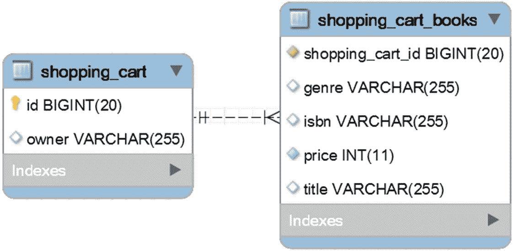
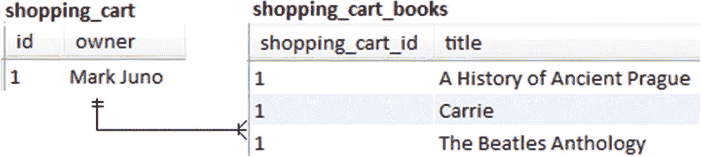
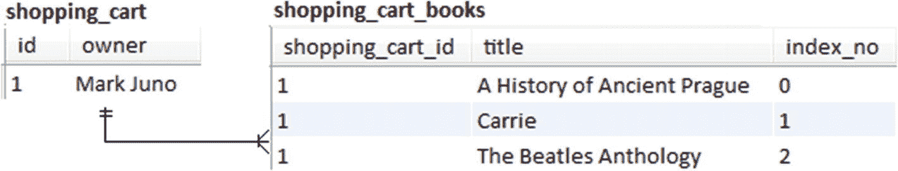
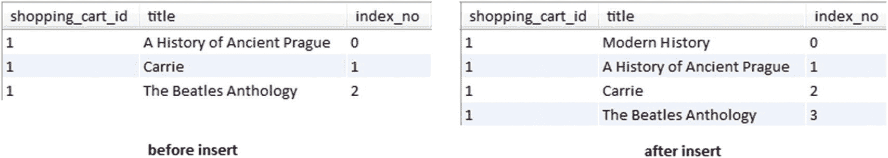
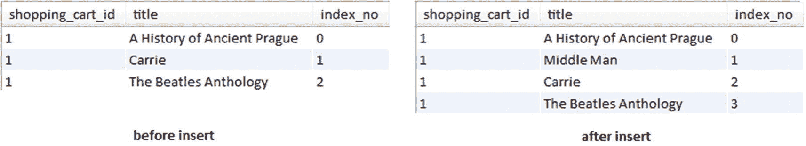
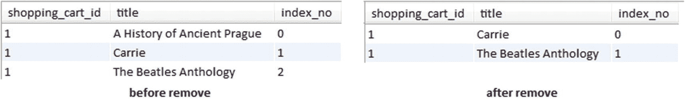
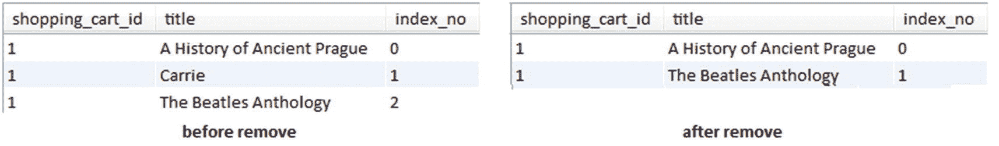
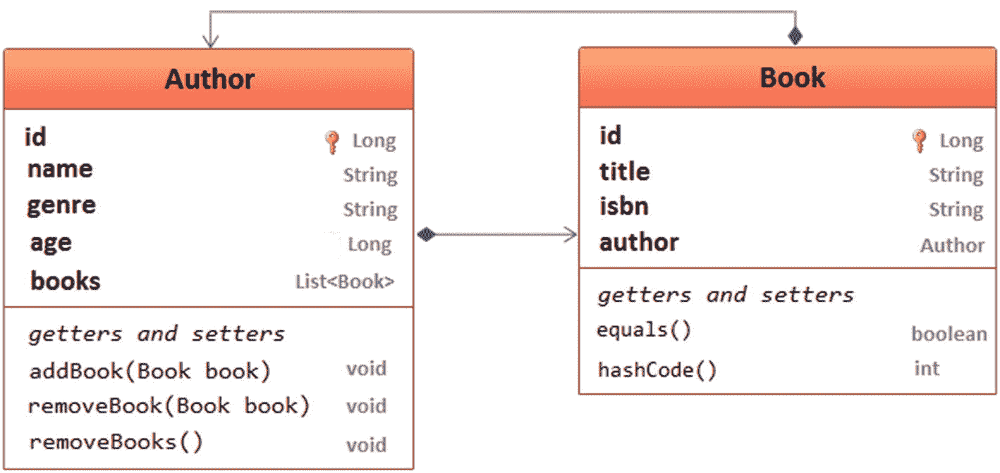
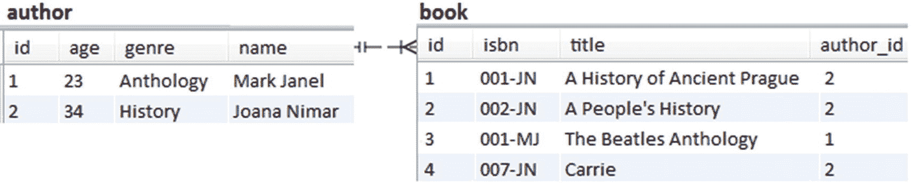
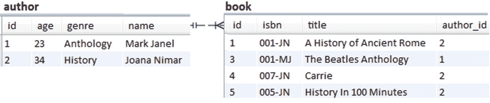

# 5.收集

## 第 56 项:如何联接获取@ElementCollection 集合

特别是当定义一个单向的一对多关联到一个`Basic`类型(例如`String`)或者`Embeddable`类型时，JPA 有一个简单的解决方案，就是`@ElementCollection`。这些类型被映射到一个单独的表中，可以通过`@CollectionTable`进行定制。假设一个网上书店购物车通过`ShoppingCart`实体映射，可嵌入的`Book`通过`@ElementCollection`映射，如图 [5-1](#Fig1) 所示。


图 5-1

@ElementCollection 表关系

相关部分是`@ElementCollection`映射:

```java
@Entity
public class ShoppingCart implements Serializable {
    ...
    @ElementCollection(fetch = FetchType.LAZY) // lazy is default
    @CollectionTable(name = "shopping_cart_books",
        joinColumns = @JoinColumn(name = "shopping_cart_id"))
    private List<Book> books = new ArrayList<>();
    ...
}

```

默认情况下，`books`是延迟加载的。有时，建模某些功能需求可能需要程序急切地获取`books`属性。显然，在实体级切换到`FechType.EAGER`是必须避免的*代码气味*。

解决方案来自于`JOIN FETCH`，它可以像用于关联一样用于`@ElementCollection`。换句话说，下面两个 JPQL 查询使用`JOIN FETCH`在获取`ShoppingCart`的同一个`SELECT`中获取`books`:

```java
@Repository
public interface ShoppingCartRepository
                extends JpaRepository<ShoppingCart, Long> {

    @Query(value = "SELECT p FROM ShoppingCart p JOIN FETCH p.books")
    ShoppingCart fetchShoppingCart();

    @Query(value = "SELECT p FROM ShoppingCart p
                   JOIN FETCH p.books b WHERE b.price > ?1")
    ShoppingCart fetchShoppingCartByPrice(int price);
}

```

调用`fetchShoppingCart()`将触发下面的 SQL:

```java
SELECT
  shoppingca0_.id AS id1_1_,
  shoppingca0_.owner AS owner2_1_,
  books1_.shopping_cart_id AS shopping1_0_0__,
  books1_.genre AS genre2_0_0__,
  books1_.isbn AS isbn3_0_0__,
  books1_.price AS price4_0_0__,
  books1_.title AS title5_0_0__
FROM shopping_cart shoppingca0_
INNER JOIN shopping_cart_books books1_
  ON shoppingca0_.id = books1_.shopping_cart_id

```

调用`fetchShoppingCartByPrice()`将触发下面的 SQL:

```java
SELECT
  shoppingca0_.id AS id1_1_,
  shoppingca0_.owner AS owner2_1_,
  books1_.shopping_cart_id AS shopping1_0_0__,
  books1_.genre AS genre2_0_0__,
  books1_.isbn AS isbn3_0_0__,
  books1_.price AS price4_0_0__,
  books1_.title AS title5_0_0__
FROM shopping_cart shoppingca0_
INNER JOIN shopping_cart_books books1_
  ON shoppingca0_.id = books1_.shopping_cart_id
WHERE books1_.price > ?

```

GitHub <sup>[1](#Fn1)</sup> 上有源代码。

## 第 57 项:如何 DTO 一个@ElementCollection

此项假设网上书店购物车通过`ShoppingCart`实体映射，可嵌入的`Book`通过`@ElementCollection`映射，如图 [5-2](#Fig2) 所示。



图 5-2

@ElementCollection 表关系

相关部分是`@ElementCollection`映射:

```java
@Entity
public class ShoppingCart implements Serializable {
    ...
    @ElementCollection(fetch = FetchType.LAZY) // lazy is default
    @CollectionTable(name = "shopping_cart_books",
        joinColumns = @JoinColumn(name = "shopping_cart_id"))
    private List<Book> books = new ArrayList<>();
    ...
}

```

此外，目标是获取一个只读数据的结果集，其中包含来自`shopping_cart`的`owner`，以及来自`shopping_cart_books`的`title`和`price`(收集表)。因为它是只读数据，一个`JOIN`和 DTO 将完成这项工作。由于`JOIN`和弹簧投影对于`@ElementCollection`工作良好，解决方案依赖于以下投影:

```java
public interface ShoppingCartDto {

    public String getOwner();
    public String getTitle();
    public int getPrice();
}

```

该投影可以在存储库中进一步使用，如下所示:

```java
@Repository
public interface ShoppingCartRepository
            extends JpaRepository<ShoppingCart, Long> {

    @Query(value = "SELECT a.owner AS owner, b.title AS title,
                    b.price AS price FROM ShoppingCart a JOIN a.books b")
    List<ShoppingCartDto> fetchShoppingCart();

    @Query(value = "SELECT a.owner AS owner, b.title AS title,
                    b.price AS price FROM ShoppingCart a JOIN a.books b
                    WHERE b.price > ?1")
    List<ShoppingCartDto> fetchShoppingCartByPrice(int price);
}

```

调用`fetchShoppingCart()`将触发下面的 SQL(注意只选择了`owner`、`title`和`price`):

```java
SELECT
  shoppingca0_.owner AS col_0_0_,
  books1_.title AS col_1_0_,
  books1_.price AS col_2_0_
FROM shopping_cart shoppingca0_
INNER JOIN shopping_cart_books books1_
  ON shoppingca0_.id = books1_.shopping_cart_id

```

调用`fetchShoppingCartByPrice()`将触发下面的 SQL:

```java
SELECT
  shoppingca0_.owner AS col_0_0_,
  books1_.title AS col_1_0_,
  books1_.price AS col_2_0_
FROM shopping_cart shoppingca0_
INNER JOIN shopping_cart_books books1_
  ON shoppingca0_.id = books1_.shopping_cart_id
WHERE books1_.price > ?

```

注意`@ElementCollection`不是实体关联类型，即使你可能这么认为。主要是，你会在下一项看到，`@ElementCollection`充当单向`@OneToMany` ( **项 2** )。因此，它遭受同样的性能损失。最佳实践建议您使用`@ElementCollection`来表示基本类型(例如，整数或字符串)或可嵌入类型，而不是实体类。

GitHub <sup>[2](#Fn2)</sup> 上有源代码。

## 第 58 项:为什么以及何时将@OrderColumn 与@ElementCollection 一起使用

这个项目假设一个在线书店购物车是通过`ShoppingCart`实体映射的，可嵌入的`Book`是通过`@ElementCollection`映射的，如下面的代码所示:

```java
@Entity
public class ShoppingCart implements Serializable {
    ...
    @Id
    @GeneratedValue(strategy = GenerationType.IDENTITY)
    private Long id;

    private String owner;

    @ElementCollection
    @CollectionTable(name = "shopping_cart_books",
                    joinColumns = @JoinColumn(name = "shopping_cart_id"))
    @Column(name="title")
    private List<String> books = new ArrayList<>();

    // getters and setters omitted for brevity
}

```

该实体通过两个表进行映射(`shopping_cart`和`shopping_cart_books`)。图 [5-3](#Fig3) 表示数据的快照(基本上，有一个购物车，里面有三本书)。



图 5-3

数据快照(@ElementCollection)

该实体的存储库包含一个通过所有者名称获取`ShoppingCart`的查询:

```java
@Repository
@Transactional(readOnly = true)
public interface ShoppingCartRepository
            extends JpaRepository<ShoppingCart, Long> {

    ShoppingCart findByOwner(String owner);
}

```

此外，应用运行几个查询(三个`INSERT`和三个`DELETE`)来:

*   将一本书添加到当前购物车的开头

*   将一本书添加到当前购物车的末尾

*   将一本书添加到当前购物车的中间

*   从购物车中取出第一本书

*   从购物车中取出最后一本书

*   从推车中取出中间的书

以下每个场景都从图 [5-3](#Fig3) 中的数据快照开始。

为了将一本新书添加到当前购物车中(`INSERT` a book)，Hibernate 需要删除`shopping_cart_books`中的所有内容，然后重新插入值，包括新书。例如，下面的方法将在`books`的开头添加一本新书:

```java
@Transactional
public void addToTheBeginning() {
    ShoppingCart cart = shoppingCartRepository.findByOwner("Mark Juno");

    cart.getBooks().add(0, "Modern history");
}

```

调用此方法将产生以下 SQL 语句套件。第一，把所有的书都删掉；第二，它们被重新插入，包括新书:

```java
DELETE FROM shopping_cart_books
WHERE shopping_cart_id = ?
Binding: [1]

INSERT INTO shopping_cart_books (shopping_cart_id, title)
  VALUES (?, ?)
Binding: [1, Modern history]

INSERT INTO shopping_cart_books (shopping_cart_id, title)
  VALUES (?, ?)
Binding: [1, A History of Ancient Prague]

INSERT INTO shopping_cart_books (shopping_cart_id, title)
  VALUES (?, ?)
Binding: [1, Carrie]

INSERT INTO shopping_cart_books (shopping_cart_id, title)
  VALUES (?, ?)
Binding: [1, The Beatles Anthology]

```

每个`INSERT`必须从`@CollectionTable`中删除`Entity`的所有记录，然后重新插入。

类似地，以下在末尾和中间插入一本书的尝试将产生一串 SQL 语句，如前所述:

```java
@Transactional
public void addToTheEnd() {
    ShoppingCart cart = shoppingCartRepository.findByOwner("Mark Juno");

    cart.getBooks().add("The last day");
}

@Transactional
public void addInTheMiddle() {
    ShoppingCart cart = shoppingCartRepository.findByOwner("Mark Juno");

    cart.getBooks().add(cart.getBooks().size() / 2, "Middle man");
}

```

从`books`中删除一本书也没有效率。与`INSERT`的情况一样，每次删除都需要删除`shopping_cart_books`中的所有内容，然后重新插入所有值。例如，以下方法将删除第一本书:

```java
@Transactional
public void removeFirst() {
    ShoppingCart cart = shoppingCartRepository.findByOwner("Mark Juno");

    cart.getBooks().remove(0);
}

```

调用此方法将产生以下 SQL 语句套件。第一，把所有的书都删掉；二是全部重新插入，删除的书除外:

```java
DELETE FROM shopping_cart_books
WHERE shopping_cart_id = ?
Binding: [1]

INSERT INTO shopping_cart_books (shopping_cart_id, title)
  VALUES (?, ?)
Binding: [1, Carrie]

INSERT INTO shopping_cart_books (shopping_cart_id, title)
  VALUES (?, ?)
Binding: [1, The Beatles Anthology]

```

每个`DELETE`必须从`@CollectionTable`中删除`Entity`的所有记录，然后重新插入。

类似地，以下从末尾和中间删除一本书的尝试将产生一串 SQL 语句，如您之前所见:

```java
@Transactional
public void removeLast() {
    ShoppingCart cart = shoppingCartRepository.findByOwner("Mark Juno");

    cart.getBooks().remove(cart.getBooks().size() - 1);
}

@Transactional
public void removeMiddle() {
    ShoppingCart cart = shoppingCartRepository.findByOwner("Mark Juno");

    cart.getBooks().remove(cart.getBooks().size() / 2);
}

```

需要频繁更新的集合会导致明显的性能损失。最好依靠显式的一对多关联。另一方面，需要很少(或不需要)更新的集合是`@ElementCollection`的一个很好的候选，因为它不代表外键方。

GitHub <sup>[3](#Fn3)</sup> 上有源代码。

### 通过@OrderColumn 优化@ElementCollection

一个`@OrderColumn`可以用来在任何集合映射上定义一个顺序`List`。将`@OrderColumn`添加到`@ElementCollection`是在某些`INSERT`和`DELETE`中反映的优化。相关代码修改如下:

```java
@Entity
public class ShoppingCart implements Serializable {
    ...
    @ElementCollection
    @OrderColumn(name = "index_no")
    @CollectionTable(name = "shopping_cart_books",
                    joinColumns = @JoinColumn(name = "shopping_cart_id"))
    @Column(name="title")
    private List<String> books = new ArrayList<>();
    ...
}

```

`@OrderColumn`的存在反映在`shopping_cart_books`表中的一个新列(`index_no`)中，如图 [5-4](#Fig4) 所示。



图 5-4

数据快照(@ElementCollection 和@OrderColumn)

因此，为了惟一地标识每一行，`@OrderColumn`在目标表中被映射为一个新列。现在，让我们看看`@OrderColumn`如何优化`@ElementCollection`。以下每个场景都从图 [5-4](#Fig4) 所示的数据快照开始。

#### 将一本书添加到当前购物车的开头

将一本书(*现代史*)添加到当前购物车的开头将触发以下 SQL 语句(在每个 SQL 语句下是一个绑定参数列表):

```java
UPDATE shopping_cart_books
SET title = ?
WHERE shopping_cart_id = ?
AND index_no = ?
Binding: [Modern History, 1, 0]

UPDATE shopping_cart_books
SET title = ?
WHERE shopping_cart_id = ?
AND index_no = ?
Binding: [A History of Ancient Prague, 1, 1]

UPDATE shopping_cart_books
SET title = ?
WHERE shopping_cart_id = ?
AND index_no = ?
Binding: [Carrie, 1, 2]

INSERT INTO shopping_cart_books (shopping_cart_id, index_no, title)
  VALUES (?, ?, ?)
Binding: [1, 3, The Beatles Anthology]

```

将一本新书添加到`books`(在索引 0 处)的开头会将现有书籍向下推一个位置。这发生在内存中，并通过一组`UPDATE`语句刷新到数据库中。每个现有的行都有一个相应的`UPDATE`语句。最后，在这些更新完成后，最后一本书通过一个`INSERT`语句被重新插入。图 [5-5](#Fig5) 为插*近代史*书前后的`shopping_cart_books`台(左侧)。



图 5-5

在开头插入(@ElementCollection 和@OrderColumn)

没有`@OrderColumn`，应用触发了五条 SQL 语句(一条`DELETE`和四条`INSERT`)。通过`@OrderColumn`，应用触发了四条 SQL 语句(三条`UPDATE`和一条`INSERT`)。

#### 将一本书添加到当前购物车的末尾

将一本书(*最后一天*)添加到当前购物车的末尾将触发以下 SQL 语句:

```java
INSERT INTO shopping_cart_books (shopping_cart_id, index_no, title)
  VALUES (?, ?, ?)
Binding: [1, 3, The Last Day]

```

添加到集合的末尾不会影响它的顺序；因此，单个`INSERT`就可以完成这项工作。这比没有`@OrderColumn`的情况好多了。

没有`@OrderColumn`，应用触发了五条 SQL 语句(一条`DELETE`和四条`INSERT`)。通过`@OrderColumn`，应用触发了一个`INSERT`语句。

#### 将一本书添加到当前购物车的中间

将一本书(*中间人*)添加到当前购物车的中间将触发以下 SQL 语句:

```java
UPDATE shopping_cart_books
SET title = ?
WHERE shopping_cart_id = ?
AND index_no = ?
Binding: [Middle Man, 1, 1]

UPDATE shopping_cart_books
SET title = ?
WHERE shopping_cart_id = ?
AND index_no = ?
Binding: [Carrie, 1, 2]

INSERT INTO shopping_cart_books (shopping_cart_id, index_no, title)
  VALUES (?, ?, ?)
Binding: [1, 3, The Beatles Anthology]

```

将一本新书添加到`books`的中间会将位于集合中间和结尾之间的所有现有书籍向下推一个位置。这发生在内存中，并通过一组`UPDATE`语句刷新到数据库中。每一行都有一个相应的`UPDATE`语句。最后，最后一本书通过一个`INSERT`语句被重新插入。图 [5-6](#Fig6) 为插入*中间人*书之前(左侧)和之后(右侧)的`shopping_cart_books`工作台。



图 5-6

在中间插入(@ElementCollection 和@OrderColumn)

没有`@OrderColumn`，应用触发了五条 SQL 语句(一条`DELETE`和四条`INSERT`)。通过`@OrderColumn`，应用触发了三个 SQL 语句(两个`UPDATE`和一个`INSERT`)。

#### 从当前购物车中移除第一本书

从当前购物车中删除第一本书( *A History of 古布拉格*)将触发以下 SQL 语句:

```java
DELETE FROM shopping_cart_books
WHERE shopping_cart_id = ?
  AND index_no = ?
Binding: [1, 2]

UPDATE shopping_cart_books
SET title = ?
WHERE shopping_cart_id = ?
AND index_no = ?
Binding: [The Beatles Anthology, 1, 1]

UPDATE shopping_cart_books
SET title = ?
WHERE shopping_cart_id = ?
AND index_no = ?
Binding: [Carrie, 1, 0]

```

从`books`(索引 0 处)移除第一本书会将所有现有的书上移一个位置。这发生在内存中，并通过一组在通过`DELETE`语句删除最后一行后触发的`UPDATE`语句刷新到数据库中。图 [5-7](#Fig7) 为删除*古布拉格历史*书前后的`shopping_cart_books`表(左侧)。



图 5-7

移除第一本书(@ElementCollection 和@OrderColumn)

没有`@OrderColumn`，应用触发了三个 SQL 语句(一个`DELETE`和两个`INSERT`)。使用`@OrderColumn`，应用也触发了三条 SQL 语句(一条`DELETE`和两条`UPDATE`)。

#### 从当前购物车中移除最后一本书

从当前购物车中删除最后一本书( *The Beatles 选集*)将触发以下 SQL 语句:

```java
DELETE FROM shopping_cart_books
WHERE shopping_cart_id = ?
  AND index_no = ?
Binding: [1, 2]

```

从收藏的末尾删除一本书不会影响它的顺序；因此，单个`DELETE`就可以完成这项工作。这比没有`@OrderColumn`的情况好多了。

没有`@OrderColumn`，应用触发了三个 SQL 语句(一个`DELETE`和两个`INSERT`)。通过`@OrderColumn`，应用触发了一个`DELETE`语句。

#### 从当前购物车中取出一本书

从当前购物车中间移除一本书( *Carrie* )将触发以下 SQL 语句:

```java
DELETE FROM shopping_cart_books
WHERE shopping_cart_id = ?
  AND index_no = ?
Binding: [1, 2]

UPDATE shopping_cart_books
SET title = ?
WHERE shopping_cart_id = ?
AND index_no = ?
Binding: [The Beatles Anthology, 1, 1]

```

从`books`的中间移除一本书会将位于集合的中间和末端之间的现有书向上推一个位置。这发生在内存中，并通过一个`DELETE`和一组`UPDATE`语句刷新到数据库中。首先，删除最后一行。第二，位于表的末端和中间的每一行都被更新。图 [5-8](#Fig8) 为移除*载体*书之前(左侧)和之后(右侧)的`shopping_cart_books`工作台。



图 5-8

从中间移除(@ElementCollection 和@OrderColumn)

没有`@OrderColumn`，应用触发了三个 SQL 语句(一个`DELETE`和两个`INSERT`)。使用`@OrderColumn`，应用也触发了两条 SQL 语句(一条`DELETE`和一条`UPDATE`)。

最后的结论是，当操作发生在集合末尾附近时,`@OrderColumn`可以减轻一些性能损失(例如，在集合末尾添加/删除)。位于添加/移除条目之前的所有元素基本上保持不变，因此如果应用影响靠近集合尾部的行，性能损失可以忽略。

根据经验，当数据变化很少，并且添加新实体的目的只是映射外键侧时，元素集合是一个合适的选择。否则，一对多关联是更好的选择。

注意，单向`@OneToMany`和`@ManyToMany`以及双向`@ManyToMany`与`@ElementCollection`属于同一把伞。

GitHub <sup>[4](#Fn4)</sup> 上有源代码。

## 第 59 项:如何合并实体集合

此项说明了合并实体集合的一种好方法。

首先，假设`Author`和`Book`参与了一个双向懒惰的`@OneToMany`关联。领域模型如图 [5-9](#Fig9) 所示。



图 5-9

双向@一对一关系

在代码中，`Author`类如下所示:

```java
@Entity
public class Author implements Serializable {

    private static final long serialVersionUID = 1L;

    @Id
    @GeneratedValue(strategy = GenerationType.IDENTITY)
    private Long id;

    private String name;
    private String genre;
    private int age;

    @OneToMany(cascade = CascadeType.ALL,
               mappedBy = "author", orphanRemoval = true)
    private List<Book> books = new ArrayList<>();

    public void addBook(Book book) {
        this.books.add(book);
        book.setAuthor(this);
    }

    public void removeBook(Book book) {
        book.setAuthor(null);
        this.books.remove(book);
    }

    // getters and setters omitted for brevity
}

```

并且`Book`实体看起来如下:

```java
@Entity
public class Book implements Serializable {

    private static final long serialVersionUID = 1L;

    @Id
    @GeneratedValue(strategy = GenerationType.IDENTITY)
    private Long id;

    private String title;
    private String isbn;

    @ManyToOne(fetch = FetchType.LAZY)
    @JoinColumn(name = "author_id")
    private Author author;

    // getters and setters omitted for brevity

    @Override
    public boolean equals(Object obj) {

        if(obj == null) {
            return false;
        }

        if (this == obj) {
            return true;
        }

        if (getClass() != obj.getClass()) {
            return false;
        }

        return id != null && id.equals(((Book) obj).id);
    }

    @Override
    public int hashCode() {
        return 2021;
    }
}

```

数据库已经填充了图 [5-10](#Fig10) 中的实体。



图 5-10

数据快照(合并前)

现在，让我们获取与给定的`Author`记录相关联的`Book`个实体中的`List`(例如， *Joana Nimar* )。通过一个`JOIN`可以很容易地获取`Author`和一个关联的`Book`，如下所示:

```java
@Repository
public interface BookRepository extends JpaRepository<Book, Long> {

    @Query(value = "SELECT b FROM Book b JOIN b.author a WHERE a.name = ?1")
    List<Book> booksOfAuthor(String name);
}

```

调用`booksOfAuthor("Joana Nimar")`将触发以下`SELECT`:

```java
SELECT
  book0_.id AS id1_1_,
  book0_.author_id AS author_i4_1_,
  book0_.isbn AS isbn2_1_,
  book0_.title AS title3_1_
FROM book book0_
INNER JOIN author author1_
  ON book0_.author_id = author1_.id
WHERE author1_.name = ?

```

这个`SELECT`返回的`List<Book>`包含三本书。

此时，`List<Book>`处于*脱离*状态；因此，让我们将它存储在一个名为`detachedBooks`的变量中:

```java
Book{id=1, title=A History of Ancient Prague, isbn=001-JN}
Book{id=2, title=A People's History, isbn=002-JN}
Book{id=4, title=Carrie, isbn=007-JN}

```

接下来，让我们对该集合执行以下修改(因为该集合处于*分离*状态，所以修改不会自动传播到数据库):

*   将第一本书的书名从*古布拉格史更新为古罗马史:*

*   取出第二本书:

```java
detachedBooks.get(0).setTitle("A History of Ancient Rome");

```

*   添加新书(*100 分钟内的历史*):

```java
detachedBooks.remove(1);

```

```java
Book book = new Book();
book.setTitle("History In 100 Minutes");
book.setIsbn("005-JN");
detachedBooks.add(book);

```

显示修改后的`detachedBooks`集合会显示以下内容(查看最后一本新书，它有一个`null` id):

```java
Book{id=1, title=A History of Ancient Rome, isbn=001-JN}
Book{id=4, title=Carrie, isbn=007-JN}
Book{id=null, title=History In 100 Minutes, isbn=005-JN}

```

### 合并分离的集合

这一项的最后一步是使用尽可能少的数据库往返次数来合并*分离的*集合。首先，开发者必须获取`Author`和关联的`Book`。这可以通过`JOIN FETCH`轻松完成:

```java
@Repository
public interface AuthorRepository extends JpaRepository<Author, Long> {

    @Query(value="SELECT a FROM Author a JOIN FETCH a.books
                 WHERE a.name = ?1")
    Author authorAndBooks(String name);
}

```

调用`authorAndBooks()`触发下面的`SELECT`(从数据库中取出作者和相关书籍):

```java
SELECT
  author0_.id AS id1_0_0_,
  books1_.id AS id1_1_1_,
  author0_.age AS age2_0_0_,
  author0_.genre AS genre3_0_0_,
  author0_.name AS name4_0_0_,
  books1_.author_id AS author_i4_1_1_,
  books1_.isbn AS isbn2_1_1_,
  books1_.title AS title3_1_1_,
  books1_.author_id AS author_i4_1_0__,
  books1_.id AS id1_1_0__
FROM author author0_
INNER JOIN book books1_
  ON author0_.id = books1_.author_id
WHERE author0_.name = ?

```

考虑返回的`Author`存储在名为`author`的变量中。

接下来，让我们将`detachedBooks`设置为`author`！首先，让我们快速消除不好的方法。

混合*管理的*和*分离的*实体是一种导致错误的糟糕组合。所以，试图以`author.setBooks(detachedBooks)`的身份去做某件事，根本行不通。另一方面，分离作者，设置`detachedBooks`，然后合并作者也可以，但是会导致合并过程产生额外的`SELECT`查询。这个额外的`SELECT`可以通过使用手动合并来避免。

手动合并需要三个步骤:

*   移除传入集合中不再存在的现有数据库行(`detachedBooks`)。首先，过滤掉不在`detachedBooks`的`author`的书。第二，每一本在`detachedBooks`找不到的`author`书都要撤下如下:

*   更新在传入集合中找到的现有数据库行(`detachedBooks`)。首先过滤新书(`newBooks`)。这些书在`detachedBooks`有，但在`author`书里没有。第二步，过滤`detachedBooks`，得到在`detachedBooks`而不在`newBooks`的书籍。这些是应该更新的书籍，如下所示:

```java
List<Book> booksToRemove = author.getBooks().stream()
    .filter(b -> !detachedBooks.contains(b))
    .collect(Collectors.toList());

booksToRemove.forEach(b -> author.removeBook(b));

```

*   最后，添加在传入集合中找到的、在当前结果集中找不到的行(`newBooks`):

```java
List<Book> newBooks = detachedBooks.stream()
    .filter(b -> !author.getBooks().contains(b))
    .collect(Collectors.toList());

detachedBooks.stream()
    .filter(b -> !newBooks.contains(b))
    .forEach((b) -> {
        b.setAuthor(author);
        Book mergedBook = bookRepository.save(b);
        author.getBooks().set(
            author.getBooks().indexOf(mergedBook), mergedBook);
    });

```

```java
newBooks.forEach(b -> author.addBook(b));

```

将这三个步骤粘合在一个服务方法中会产生以下结果:

```java
@Transactional
public void updateBooksOfAuthor(String name, List<Book> detachedBooks) {

    Author author = authorRepository.authorAndBooks(name);

    // Remove the existing database rows that are no
    // longer found in the incoming collection (detachedBooks)
    List<Book> booksToRemove  = author.getBooks().stream()
        .filter(b -> !detachedBooks.contains(b))
        .collect(Collectors.toList());
    booksToRemove .forEach(b -> author.removeBook(b));

    // Update the existing database rows which can be found
    // in the incoming collection (detachedBooks)
    List<Book> newBooks = detachedBooks.stream()
        .filter(b -> !author.getBooks().contains(b))
        .collect(Collectors.toList());

    detachedBooks.stream()
        .filter(b -> !newBooks.contains(b))
        .forEach((b) -> {
            b.setAuthor(author);
            Book mergedBook = bookRepository.save(b);
            author.getBooks().set(
                author.getBooks().indexOf(mergedBook), mergedBook);
        });

    // Add the rows found in the incoming collection,
    // which cannot be found in the current database snapshot
    newBooks.forEach(b -> author.addBook(b));
}

```

### 测试时间

调用`updateBooksOfAuthor()`可以如下进行:

```java
updateBooksOfAuthor("Joana Nimar", detachedBooks);

```

除了获取作者和相关书籍的`SELECT`之外，触发的 SQL 语句有:

```java
INSERT INTO book (author_id, isbn, title)
  VALUES (?, ?, ?)
Binding: [2, 005-JN, History In 100 Minutes]

UPDATE book
SET author_id = ?,
    isbn = ?,
    title = ?
WHERE id = ?
Binding: [2, 001-JN, A History of Ancient Rome, 1]

DELETE FROM book
WHERE id = ?
Binding: [2]

```

图 [5-11](#Fig11) 显示了数据的当前快照。



图 5-11

数据快照(合并后)

搞定了。完整的代码可以在 GitHub <sup>[5](#Fn5)</sup> 上找到。

你可能会认为这个案例是 T2 的一个角落案例。获取子实体集合并独立于关联的父实体使用它们不是一项日常任务。更常见的是获取父实体和相关联的子实体集合，修改处于*分离*状态的集合，并合并父实体。在这种情况下，将使用`CascadeType.ALL`,产生的 SQL 语句与您预期的完全一样。

<aside aria-label="Footnotes" class="FootnoteSection" epub:type="footnotes">Footnotes [1](#Fn1_source)

[hibernate pringb ootscolec ionjoinfetch](https://github.com/AnghelLeonard/Hibernate-SpringBoot/tree/master/HibernateSpringBootElementCollectionJoinFetch)

  [2](#Fn2_source)

[hibernate pringb otdtelement col 选择](https://github.com/AnghelLeonard/Hibernate-SpringBoot/tree/master/HibernateSpringBootDtoElementCollection)

  [3](#Fn3_source)

[hibernate pringb ooteelement colec ionnoordercum n](https://github.com/AnghelLeonard/Hibernate-SpringBoot/tree/master/HibernateSpringBootElementCollectionNoOrderColumn)

  [4](#Fn4_source)

[hibernate pringb ootscolec ionwithordercoll umn](https://github.com/AnghelLeonard/Hibernate-SpringBoot/tree/master/HibernateSpringBootElementCollectionWithOrderColumn)

  [5](#Fn5_source)

[hibernate pringb otmerge collections ons](https://github.com/AnghelLeonard/Hibernate-SpringBoot/tree/master/HibernateSpringBootMergeCollections)

 </aside>