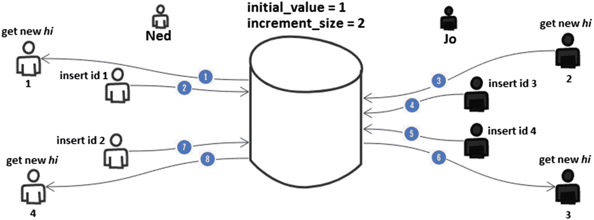
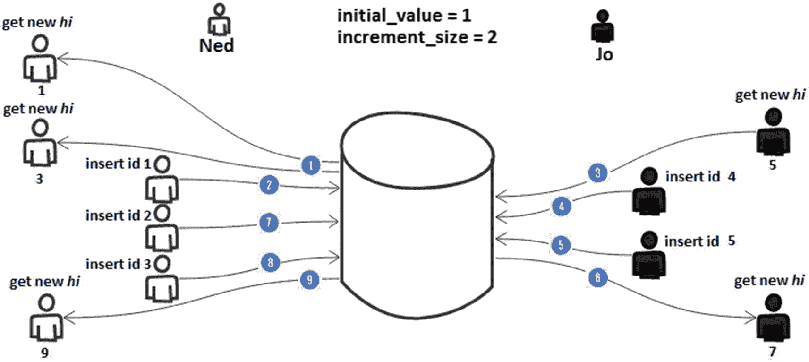
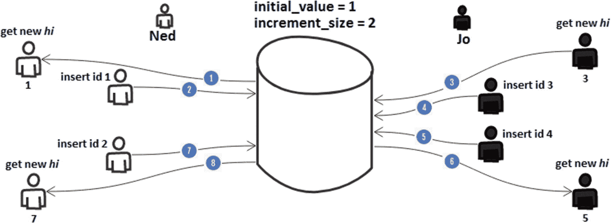
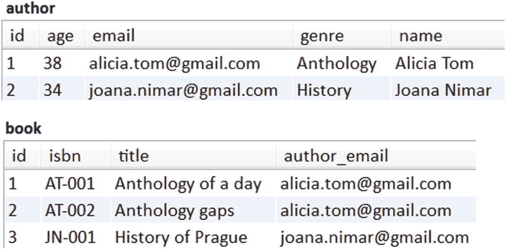
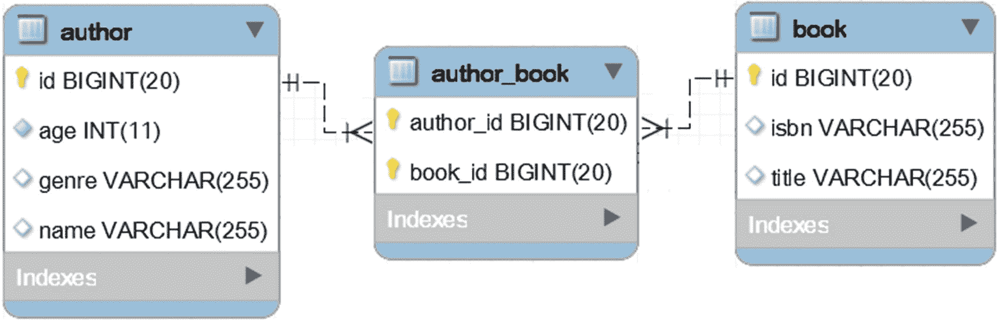

# 七、标识符

## 第 65 项:为什么避免在 MySQL 中使用 Hibernate 5 自动生成器类型

考虑下面的`Author`实体，它依赖 Hibernate 5 `AUTO`生成器类型来生成标识符:

```java
@Entity
public class AuthorBad implements Serializable {

    private static final long serialVersionUID = 1L;

    @Id
    @GeneratedValue(strategy = GenerationType.AUTO)
    // or
    @GeneratedValue
    private Long id;
    ...
}

```

在 MySQL 和 Hibernate 5 中，`GenerationType.AUTO`生成器类型将导致使用`TABLE`生成器。这大大增加了性能损失。`TABLE`生成器类型伸缩性不好，比`IDENTITY`和`SEQUENCE`(MySQL 不支持)生成器类型慢得多，即使只有一个数据库连接。

例如，持久化一个新的`AuthorBad`将产生三个 SQL 语句，如下所示:

```java
SELECT
  next_val AS id_val
FROM hibernate_sequence
FOR UPDATE

UPDATE hibernate_sequence
SET next_val = ?
WHERE next_val = ?

INSERT INTO author_bad (age, genre, name, id)
  VALUES (?, ?, ?, ?)

```

根据经验，**总是**避开`TABLE`发电机。

显然，最好通过一条`INSERT`语句来保存新作者。为了实现这个目标，依靠`IDENTITY`或*本地*发电机类型。`IDENTITY`发电机类型可采用如下方式:

```java
@Entity
public class AuthorGood implements Serializable {

    private static final long serialVersionUID = 1L;

    @Id
    @GeneratedValue(strategy=GenerationType.IDENTITY)
    private Long id;
    ...
}

```

*本地*发电机类型可采用如下方式:

```java
@Entity
public class AuthorGood implements Serializable {

    private static final long serialVersionUID = 1L;

    @Id
    @GeneratedValue(strategy=GenerationType.AUTO, generator="native")
    @GenericGenerator(name="native", strategy="native")
    private Long id;
    ...
}

```

这一次，保持一个`AuthorGood`将产生下面的`INSERT`:

```java
INSERT INTO author_good (age, genre, name)
  VALUES (?, ?, ?)

```

GitHub <sup>[1](#Fn1)</sup> 上有源代码。

## 第 66 项:如何通过 hi/lo 算法优化序列标识符的生成

这个项目依赖于 PostgreSQL，它支持`SEQUENCE`生成器。MySQL 提供了`TABLE`替代，但是不要用！参见**第六十五项**。

只要得到支持，*数据库序列*代表了生成标识符的正确方式(在 JPA 和 Hibernate ORM 中)。`SEQUENCE`生成器支持批处理，是无表的，可以利用数据库序列预分配，并支持增量步骤。

不要忘记避开`TABLE`标识符生成器，这是反作用的(详情见**项目 65** )。

默认情况下，`SEQUENCE`生成器必须通过`SELECT`语句为每个新的序列值命中数据库。假设下面的`Author`实体:

```java
@Entity
public class Author implements Serializable {
    ...
    @Id
    @GeneratedValue(strategy = GenerationType.SEQUENCE)
    private Long id;
    ...
}

```

每个持久化的`Author`都需要一个标识符(当前序列值)，该标识符是通过在下面的`SELECT`中实现的数据库往返获取的:

```java
SELECT
  nextval('hibernate_sequence')

```

依赖缓存序列或数据库序列预分配没有帮助。对于缓存的序列，应用仍然需要为每个新的序列值进行一次数据库往返。另一方面，数据库序列预分配仍然具有显著的数据库往返分数。

这可以通过特定于 Hibernate 的 *hi/lo* 算法进行优化(特别是在插入次数较多的情况下)。该算法是 Hibernate 内置优化器的一部分，能够计算内存中的标识符值。因此，使用 hi/lo 减少了数据库往返次数，从而提高了应用性能。

该算法将序列域同步分成*和*组。 *hi* 值可由数据库序列(或表格生成器)提供，其初始值可配置(`initial_value`)。基本上，在一次数据库往返中，hi/lo 算法从数据库中获取一个新的 *hi* 值，并使用它来生成由可配置增量(`increment_size`)给出的多个标识符，该增量代表 *lo* 条目的数量。当 *lo* 在此范围内时，不需要获取新的 *hi* 的数据库往返，并且可以安全地使用内存中生成的标识符。当所有的 *lo* 值都被使用时，一个新的 *hi* 值通过一个新的数据库往返被提取。

在代码中，hi/lo 算法可以用于`Author`实体，如下所示:

```java
@Entity
public class Author implements Serializable {

    private static final long serialVersionUID = 1L;

    @Id
    @GeneratedValue(strategy = GenerationType.SEQUENCE, generator = "hilo")
    @GenericGenerator(name = "hilo", strategy =
                    "org.hibernate.id.enhanced.SequenceStyleGenerator",
        parameters = {
            @Parameter(name = "sequence_name", value = "hilo_sequence"),
            @Parameter(name = "initial_value", value = "1"),
            @Parameter(name = "increment_size", value = "100"),
            @Parameter(name = "optimizer", value = "hilo")
        }
    )
    private Long id;
    ...
}

```

高/低算法需要几个参数:

*   `sequence_name`:数据库序列的名称(如`hilo_sequence`)；数据库序列是通过以下语句创建的:

*   `initial_value`:这是第一个序列值或第一个*(如 1)*

**   `increment_size`:这是在获取下一个 *hi* 之前，将在内存中计算的标识符的数量(第 *lo* 条目的数量)(例如，100)

    *   `optimizer`:这是 Hibernate 内置优化器的名称(在本例中为`hilo`)* 

```java
CREATE
  sequence hilo_sequence start 1 increment 1

```

为了在内存中生成标识符，hi/lo 算法使用以下公式来计算值的有效范围:

```java
[increment_size x (hi - 1) + 1, increment_size x hi]

```

例如，按照这些设置，内存中生成的标识符的范围将是:

*   对于`hi=1`，范围为`[1, 100]`

*   对于`hi=2`，范围为`[101, 200]`

*   对于`hi=3`，范围为`[201, 300]`

*   `...`

*lo* 值的范围是从`(hi - 1) * increment_size) + 1`开始的`0, increment_size)`。

图 [7-1](#Fig1) 显示了 hi/lo 如何为 Ned 和 Jo 工作的逐步图示(*的`initial_value`hi*是`1`，`increment_size`是`2`)。



图 7-1

高/低算法

1.  Ned 启动一个事务，并从数据库获取一个新的 *hi* ，并获得值 1。

2.  Ned 有两个内存中生成的标识符(1 和 2)。他使用值为 1 的标识符来插入一行。

3.  Jo 开始她的事务，并从数据库获取一个新的 *hi* 。她得到值 2。

4.  Jo 有两个内存中生成的标识符(3 和 4)。她使用值为 3 的标识符插入一行。

5.  Jo 再触发一次内存中标识符值为 4 的插入。

6.  Jo 没有更多内存中生成的标识符；因此，程序必须获取新的 *hi* 。这一次，她从数据库中获得值 3。基于这个 *hi* ，Jo 可以在内存中生成值为 5 和 6 的标识符。

7.  Ned 使用内存中生成的值为 2 的标识符来插入新行。

8.  Ned 没有更多内存中生成的标识符；因此，程序必须获取新的 *hi* 。这一次，他从数据库中获得值 4。基于这个 *hi* ，Ned 可以在内存中生成值为 7 和 8 的标识符。

也就是说，测试 hi/lo 算法的一个简单方法是采用快速批处理过程。让我们批量插入 1000 个`Author`实例(在`author`表中)。以下服务方法通过`saveAll()`内置方法批量处理 1000 个插件，批量大小为 30 个(虽然`saveAll()`对于示例来说是可以的，但对于生产来说不是合适的选择；更多细节在**第 46 项**):

```java
public void batch1000Authors() {

    List<Author> authors = new ArrayList<>();

    for (int i = 1; i <= 1000; i++) {
        Author author = new Author();
        author.setName("Author_" + i);

        authors.add(author);
    }

    authorRepository.saveAll(authors);
}

```

由于 hi/lo 算法，所有 1，000 个标识符仅使用 10 次数据库往返就生成了。代码只读取 10 个 *hi* ，并且对于每个 *hi* ，它在内存中生成 100 个标识符。这比 1000 次数据库往返要好得多。获取新的 *hi* 的每次往返如下:

```java
SELECT
  nextval('hilo_sequence')

```

完整的应用可在 GitHub <sup>[2](#Fn2)</sup> 上获得。

### 处理外部系统

*hi* 值由数据库提供。并发事务将获得唯一的 *hi* 值；因此，你不必担心 *hi* 的唯一性。两个连续的事务将接收两个连续的 *hi* 值。

现在，让我们假设一个场景，该场景涉及到我们的应用外部的一个系统，该系统需要在`author`表中插入行。这个系统不使用高/低算法。

首先，应用获取一个新的 *hi* (例如 1)，并使用它来生成 100 个内存标识符。让我们用生成的内存标识符 1、2 和 3 插入三个`Author`:

```java
@Transactional
public void save3Authors() {

    for (int i = 1; i <= 3; i++) {
        Author author = new Author();
        author.setName("Author_" + i);

        authorRepository.save(author); // uses ids: 1, 2 and 3
    }
}

```

此外，外部系统试图在`author`表中插入一行。模拟这种行为可以通过本机`INSERT`轻松完成，如下所示:

```java
@Repository
public interface AuthorRepository extends JpaRepository<Author, Long> {

    @Modifying
    @Query(value = "INSERT INTO author (id, name)
                    VALUES (NEXTVAL('hilo_sequence'), ?1)",
    nativeQuery = true)
    public void saveNative(String name);
}

```

执行`NEXTVAL('hilo_sequence')`获取下一个序列值将返回 2。但是这个应用已经使用这个标识符插入了一个`Author`；因此，外部系统的尝试将会失败，并出现以下错误:

```java
ERROR: duplicate key value violates unique constraint "author_pkey"
Detail: Key (id)=(2) already exists.

```

在存在外部系统的情况下，hi/lo 算法并不是正确的选择，因为外部系统的作用与前面介绍的场景相同。因为数据库序列不知道内存中生成的最高标识符，所以它返回可能已经用作标识符的序列值。这会导致重复的标识符错误。有两种方法可以避免这种问题:

*   外部系统应该知道 hi/lo 的存在，并相应地采取行动

*   使用另一个特定于 Hibernate 的内置优化器(参见**第 67 项**

完整的应用可在 GitHub <sup>[3](#Fn3)</sup> 上获得。

## 第 67 项:如何通过合并(-lo)算法优化序列标识符的生成

如果你不熟悉 hi/lo 算法，那么可以考虑在此之前阅读**第 66 项**。

*pooled* 和 *pooled-lo* 算法是具有不同策略的 hi/lo 算法，旨在防止出现在**项目 66** 中的问题。作为快速余数，当不知道 hi/lo 存在和/或行为的外部系统试图在相关表中插入行时，经典 hi/lo 算法会导致重复标识符错误。

### 共享算法

考虑到`Author`实体，汇集算法可以设置如下:

```java
@Entity
public class Author implements Serializable {

    private static final long serialVersionUID = 1L;

    @Id
    @GeneratedValue(strategy = GenerationType.SEQUENCE,
               generator = "hilopooled")
    @GenericGenerator(name = "hilopooled",
               strategy = "org.hibernate.id.enhanced.SequenceStyleGenerator",
        parameters = {
            @Parameter(name = "sequence_name", value = "hilo_sequence"),
            @Parameter(name = "initial_value", value = "1"),
            @Parameter(name = "increment_size", value = "100"),
            @Parameter(name = "optimizer", value = "pooled")
        }
    )
    private Long id;
    ...
}

```

注意参数`optimizer`的值，它指示 Hibernate 使用池化的内置优化器。采用这种算法会为`hilo_sequence`产生以下`CREATE`语句:

```java
CREATE
  sequence hilo_sequence start 1 increment 100

```

注意`increment 100`部分(或者，一般来说，`increment increment_size`部分)。

汇集算法从数据库中提取当前序列值作为顶部边界标识符。当前序列值计算为前一序列值加上`increment_size`。这样，应用将使用在先前的上边界(也称为最低边界)和当前的上边界(包括上边界)之间生成的内存中标识符。

让我们把这些单词用图形表示出来。图 [7-2](#Fig2) 一步一步地显示了奈德和乔的联合工作方式(*的`initial_value`嗨*是 1，`increment_size`是 2)。



图 7-2

共享算法

1.  Ned 启动一个事务，并从数据库获取一个新的 *hi* ，并获得值 1(这是`initial_value`)。为了确定顶部边界标识符，自动获取新的 *hi* ，值为 3(这是`initial_value` + `increment_size`)。只是这一次，内存中生成的标识符的数量将等于`increment_size` + 1。

2.  由于 pooled 使用获取的 *hi* 作为顶部边界标识符，Ned 有三个内存中生成的标识符(1、2 和 3)。他使用值为 1 的标识符来插入一行。

3.  Jo 开始她的事务，并从数据库获取一个新的 *hi* 。她得到了值 5。

4.  Jo 有两个内存中生成的标识符(4 和 5)。她使用值为 4 的标识符插入一行。

5.  Jo 用值为 5 的内存中标识符再触发一次插入。

6.  Jo 没有更多内存中生成的标识符；因此，她必须取一个新的 *hi* 。这一次，她从数据库中获得值 7。基于这个 *hi* ，Jo 可以在内存中生成值为 6 和 7 的标识符。

7.  Ned 使用内存中生成的值为 2 的标识符来插入新行。

8.  Ned 使用内存中生成的值为 3 的标识符来插入新行。

9.  Ned 没有更多内存中生成的标识符；因此，他必须取一个新的 *hi* 。这一次，他从数据库中获得值 9。基于这个 *hi* ，Ned 可以在内存中生成值为 8 和 9 的标识符。

#### 处理外部系统

现在，让我们重温一下**第 66 项**中标题为“处理外部系统”的章节。记住`initial_value`是 1，`increment_size`是 100。

首先，应用获取一个新的 *hi* (例如 101)。接下来，应用用生成的内存标识符 1、2 和 3 插入三个`Author`。

此外，外部系统试图在`author`表中插入一行。这个动作是由依赖于`NEXTVAL('hilo_sequence')`获取下一个序列值的本机`INSERT`模拟的。执行`NEXTVAL('hilo_sequence')`获取下一个序列值将返回 201。这一次，外部系统将成功地插入一个标识符为 201 的行。如果我们的应用继续插入更多的行(而外部系统没有)，那么在某个时刻，新的 *hi* 301 将被获取。这个 *hi* 将是新的上边界标识符，而唯一的下边界标识符将是 301-100 = 201；因此，下一行标识符将是 202。

看起来外部系统可以在这个应用旁边愉快地生活和工作，这要归功于池化算法。

与经典的 hi/lo 算法相比，Hibernate 特定的池算法不会给希望与我们的表进行交互的外部系统带来问题。换句话说，外部系统可以依靠池算法在表中同时插入行。然而，旧版本的 Hibernate 可能会引发由使用最低边界作为标识符的外部系统触发的`INSERT`语句引起的异常。这是更新到 Hibernate 最新版本(例如 Hibernate 5.x)的一个很好的理由，它已经修复了这个问题。这样，您可以毫无顾虑地利用池算法。

完整的应用可在 GitHub <sup>[4](#Fn4)</sup> 上获得。

### 池化 Lo 算法

考虑到`Author`实体，pooled-lo 算法可以设置如下:

```java
@Entity
public class Author implements Serializable {

    private static final long serialVersionUID = 1L;

    @Id
    @GeneratedValue(strategy = GenerationType.SEQUENCE,
               generator = "hilopooled")
    @GenericGenerator(name = "hilopooled",
               strategy = "org.hibernate.id.enhanced.SequenceStyleGenerator",
        parameters = {
            @Parameter(name = "sequence_name", value = "hilo_sequence"),
            @Parameter(name = "initial_value", value = "1"),
            @Parameter(name = "increment_size", value = "100"),
            @Parameter(name = "optimizer", value = "pooled-lo")
        }
    )
    private Long id;
    ...
}

```

注意参数`optimizer`的值，它指示 Hibernate 使用 pooled-lo 内置优化器。采用这种算法会为`hilo_sequence`产生下面的`CREATE`语句(与池算法中的语句相同):

```java
CREATE
  sequence hilo_sequence start 1 increment 100

```

注意`increment 100`部分(或者，一般来说，`increment increment_size`部分)。

pooled-lo 是与 pooled 类似的 hi/lo 的优化。这一次，该算法的策略从数据库中获取当前序列值，并将其用作内存中包含的最低边界标识符。内存中生成的标识符的数量等于`increment_size`。

让我们把这些单词用图形表示出来。图 [7-3](#Fig3) 显示了 pooled-lo 如何为 Ned 和 Jo 工作的分步过程(*的`initial_value`hi*为 1，`increment_size`为 2)。



图 7-3

池化 lo 算法

1.  Ned 启动一个事务，从数据库获取一个新的 *hi* ，并获得值 1。

2.  Ned 有两个内存中生成的标识符(1 和 2)。他使用值为 1 的标识符来插入一行。

3.  Jo 开始她的事务，并从数据库获取一个新的 *hi* 。她得到值 3。

4.  Jo 有两个内存中生成的标识符(3 和 4)。她使用值为 3 的标识符插入一行。

5.  Jo 再触发一次内存中标识符为 4 的插入。

6.  Jo 没有更多内存中生成的标识符；因此，它必须获取新的 *hi* 。这一次，她从数据库中获得值 5。基于这个 *hi* ，Jo 可以在内存中生成值为 5 和 6 的标识符。

7.  Ned 使用内存中生成的值为 2 的标识符来插入新行。

8.  Ned 没有更多内存中生成的标识符；因此，他必须取一个新的 *hi* 。这一次，他从数据库中获得值 7。基于这个 *hi* ，Ned 可以在内存中生成值为 7 和 8 的标识符。

#### 处理外部系统

现在，让我们重温一下**第 66 项**中标题为“处理外部系统”的章节。记住`initial_value`是 1，`increment_size`是 100。

首先，应用获取一个新的 *hi* (例如 1)。接下来，应用用生成的内存标识符 1、2 和 3 插入三个`Author`。

此外，外部系统试图在`author`表中插入一行。这个动作是由依赖于`NEXTVAL('hilo_sequence')`获取下一个序列值的本机`INSERT`模拟的。执行`NEXTVAL('hilo_sequence')`获取下一个序列值将返回 101。这一次，外部系统将成功地插入一个标识符为 101 的行。如果应用继续插入更多的行(而外部系统没有)，那么在某个时刻，新的 *hi* 201 将被获取。这个 *hi* 将是新的包含下边界标识符。

同样，由于 pooled-lo 算法，看起来外部系统可以在这个应用旁边愉快地生活和工作。

完整的应用可在 GitHub <sup>[5](#Fn5)</sup> 上获得。

## 第 68 项:如何正确重写 equals()和 hashCode()

在实体中覆盖`equals()`和`hashCode()`可能是一项微妙的任务，因为这与普通旧 Java 对象(POJO)和 Java Beans 的情况不同。要考虑的主要语句是， **Hibernate 要求一个实体在其所有状态转换(** ***【瞬态(新)、托管(持久)、分离*** **和** **【移除】)**之间必须等于自身。如果您需要快速了解 Hibernate 实体状态转换，可以考虑阅读**附录 A** (在它的末尾)。

为了检测实体的变化，Hibernate 使用其内部机制，称为脏检查。这种机制不使用`equals()`和`hashCode()`，但是，根据 Hibernate 文档，如果实体被存储在一个`Set`中或者被重新附加到一个新的持久化上下文，那么开发者应该覆盖`equals()`和`hashCode()`。此外，通过助手方法同步双向关联的两端也需要您覆盖`equals()`和`hashCode()`。因此，有三种场景涉及到覆盖`equals()`和`hashCode()`。

为了学习如何覆盖`equals()`和`hashCode()`以尊重所有状态转换中实体相等的一致性，开发人员必须测试几个场景。

### 构建单元测试

首先创建一个新的实体实例(在*瞬态*状态)并将其添加到`Set`中。单元测试的目的是针对不同的状态转换，检查来自`Set`的这个*瞬态*实体的一致性。考虑存储在`Set`中的`Book`实体的一个*瞬态*实例，如下面的单元测试所示(在测试期间`Set`的内容不会改变):

```java
Book book = new Book();
Set<Book> books = new HashSet<>();

@BeforeClass
public static void setUp() {
    book.setTitle("Modern History");
    book.setIsbn("001-100-000-111");

    books.add(book);
}

```

让我们从检查从未被持久化的`book`和`Set`内容之间相等的一致性开始:

```java
@Test
public void A_givenBookInSetWhenContainsThenTrue() throws Exception {

    assertTrue(books.contains(book));
}

```

此外，`book`从*瞬态*转变到*管理的*状态。在第一个断言点，`book`的状态是*瞬态*。对于数据库生成的标识符，`book`的`id`应该是`null`。对于一个赋值的标识符，`book`的`id`应该是非`null`。因此，根据具体情况，测试依赖于`assertNull()`或`assertNotNull()`。在持久化`book`实体(状态*被管理*)之后，测试检查`book`的标识符是非`null`并且`Set`包含`book`:

```java
@Test
public void B_givenBookWhenPersistThenSuccess() throws Exception {

    assertNull(book.getId());
    // for assigned identifier, assertNotNull(book.getId());

    entityManager.persistAndFlush(book);
    assertNotNull(book.getId());

    assertTrue(books.contains(book));
}

```

下一个测试为分离的`book`设置一个新标题。此外，`book`实体被合并(换句话说，Hibernate 在持久性上下文中加载一个包含来自数据库的最新数据的实体，并更新它以镜像`book`实体)。在断言点，测试检查返回的(*托管* ) `mergedBook`实体和`Set`内容之间相等的一致性:

```java
@Test
public void C_givenBookWhenMergeThenSuccess() throws Exception {

    book.setTitle("New Modern History");
    assertTrue(books.contains(book));

    Book mergedBook = entityManager.merge(book);
    entityManager.flush();

    assertTrue(books.contains(mergedBook));
}

```

此外，通过`EntityManager#find(Book.class, book.getId())`加载`foundBook`实体。在断言点，测试检查`foundBook` ( *管理的*实体)和`Set`内容之间相等的一致性:

```java
@Test
public void D_givenBookWhenFindThenSuccess() throws Exception {

    Book foundBook = entityManager.find(Book.class, book.getId());
    entityManager.flush();

    assertTrue(books.contains(foundBook));
}

```

此外，通过`EntityManager#find(Book.class, book.getId())`提取`foundBook`实体。之后，通过`detach()`方法显式分离它。最后，测试检查这个分离的实体和`Set`内容之间相等的一致性:

```java
@Test
public void E_givenBookWhenFindAndDetachThenSuccess() throws Exception {

    Book foundBook = entityManager.find(Book.class, book.getId());
    entityManager.detach(foundBook);

    assertTrue(books.contains(foundBook));
}

```

在最后一个测试中，`foundBook`实体是通过`EntityManager#find(Book.class, book.getId())`获取的。之后，通过`EntityManager#remove()`方法移除该实体，并且测试检查移除的实体和`Set`内容之间相等的一致性。最后，实体从`Set`中移除，并再次声明:

```java
@Test
public void F_givenBookWhenFindAndRemoveThenSuccess() throws Exception {

    Book foundBook = entityManager.find(Book.class, book.getId());
    entityManager.remove(foundBook);
    entityManager.flush();

    assertTrue(books.contains(foundBook));

    books.remove(foundBook);

    assertFalse(books.contains(foundBook));
}

```

好的，目前为止一切顺利！现在，让我们以不同的方式覆盖`equals()`和`hashCode()`，看看哪些方法通过了测试。

### 重写 equals()和 hashCode()的最佳方法

通过测试的实体是在其所有状态转换(*瞬态*、*附着*、*脱离、*和*移除*)中与其自身相等的实体。

#### 使用业务密钥

商业关键字是唯一的实体字段。它不可为空或可更新，这意味着它是在实体创建时分配的，并且保持不变(例如，SSN、ISBN、CNP 等)。).例如，以下实体有一个`isbn`字段作为其业务关键字:

```java
@Entity
public class BusinessKeyBook implements Serializable {

    private static final long serialVersionUID = 1L;

    @Id
    @GeneratedValue(strategy = GenerationType.IDENTITY)
    private Long id;

    private String title;

    @Column(nullable = false, unique = true, updatable = false, length = 50)
    private String isbn;

    // getter and setters omitted for brevity
}

```

由于`isbn`从创建实体的那一刻起就是已知的，它可以在`equals()`和`hashCode()`中使用，如下所示:

```java
@Override
public boolean equals(Object obj) {

    if (this == obj) {
        return true;
    }

    if (obj == null) {
        return false;
    }

    if (getClass() != obj.getClass()) {
        return false;
    }

    BusinessKeyBook other = (BusinessKeyBook) obj;
    return Objects.equals(isbn, other.getIsbn());
}

@Override
public int hashCode() {
    return Objects.hash(isbn);
}

```

业务密钥相等通过测试。这是覆盖`equals()`和`hashCode()`的最佳选择。但是，有些实体没有业务键。在这种情况下，应考虑其他方法。

#### 使用@NaturalId

用`@NaturalId`注释业务键会将该字段转换成实体的自然标识符(默认情况下，自然标识符是不可变的)。一本书的`isbn`号是典型的自然标识符。自然标识符不能代替实体标识符。实体标识符可以是一个代理键，非常适合不为表和索引页增加内存压力。实体标识符可以像往常一样用于提取实体。此外，特定于 Hibernate 的 API 允许您通过专用的方法用相关的自然键获取实体。 **Item 69** 详细剖析这个话题。

```java
@Entity
public class NaturalIdBook implements Serializable {

    private static final long serialVersionUID = 1L;

    @Id
    @GeneratedValue(strategy = GenerationType.IDENTITY)
    private Long id;

    private String title;

    @NaturalId
    @Column(nullable = false, updatable = false, unique = true, length = 50)
    private String isbn;

    // getters and setters omitted for brevity
}

```

由于`isbn`从创建实体的那一刻起就是已知的，它可以在`equals()`和`hashCode()`中使用，如下所示:

```java
@Override
public boolean equals(Object obj) {

    if (this == obj) {
        return true;
    }

    if (obj == null) {
        return false;
    }

    if (getClass() != obj.getClass()) {
        return false;
    }

    BusinessKeyBook other = (BusinessKeyBook) obj;
    return Objects.equals(isbn, other.getIsbn());
}

@Override
public int hashCode() {
    return Objects.hash(isbn);
}

```

平等通过了考验。当业务键也应该用于通过 Hibernate ORM API 获取实体时，这是覆盖`equals()`和`hashCode()`的最佳选择。

#### 手动分配的标识符

手动分配实体标识符时，实体如下所示:

```java
@Entity
public class IdManBook implements Serializable {

    private static final long serialVersionUID = 1L;

    @Id
    private Long id;

    private String title;
    private String isbn;

    // getters and setters omitted for brevity
}

```

在创建这个实体的过程中，代码必须调用`setId()`来显式设置一个标识符。所以，实体标识符从一开始就是已知的。这意味着实体标识符可用于覆盖`equals()`和`hashCode()`，如下所示:

```java
@Override
public boolean equals(Object obj) {

    if (this == obj) {
        return true;
    }

    if (obj == null) {
        return false;
    }

    if (getClass() != obj.getClass()) {
        return false;
    }

    IdManBook other = (IdManBook) obj;
    return Objects.equals(id, other.getId());
}

@Override
public int hashCode() {
    return Objects.hash(id);
}

```

手动分配的标识符相等通过测试。当不需要使用自动递增的实体标识符时，这是覆盖`equals()`和`hashCode()`的好选择。

#### 数据库生成的标识符

自动递增的实体标识符通常是最常用的实体。一个*瞬态*实体的实体标识符只有在数据库往返之后才知道。典型的实体依赖于`IDENTITY`生成器，如下所示:

```java
@Entity
public class IdGenBook implements Serializable {

    private static final long serialVersionUID = 1L;

    @Id
    @GeneratedValue(strategy = GenerationType.IDENTITY)
    private Long id;

    private String title;
    private String isbn;

    // getters and setters omitted for brevity
}

```

依靠生成的实体标识符来覆盖`equals()`和`hashCode()`有点棘手。下面列出了正确的实现方式:

```java
@Override
public boolean equals(Object obj) {

    if(obj == null) {
        return false;
    }

    if (this == obj) {
        return true;
    }

    if (getClass() != obj.getClass()) {
        return false;
    }

    IdGenBook other = (IdGenBook) obj;
    return id != null && id.equals(other.getId());
}

@Override
public int hashCode() {
    return 2021;
}

```

在这个实现中有两条重要的线。两者都是相对于一个*瞬态*对象有一个`null` ID，并且在持久化成为*托管*后，有一个有效的(非`null` ) ID 来构造的。这意味着同一对象在不同的状态转换中可以有不同的 id；因此，基于 ID 的`hashCode()`(例如`Objects.hash(getId())`)将返回两个不同的值(换句话说，该对象在状态转换中不等于其自身；它不会在`Set`中被发现。从`hashCode()`返回一个常量就能解决问题。

```java
return 2021;

```

此外，应按照如下方式进行相等性测试:

```java
return id != null && id.equals(other.getId());

```

如果当前对象 ID 是`null`，那么`equals()`返回`false`。如果`equals()`被执行，意味着涉及的对象不是同一个对象的引用；因此它们是两个*瞬态*对象或者一个*瞬态*和一个非*瞬态*对象，这样的对象不能相等。只有当当前对象 ID 不是`null`并且与另一个对象 ID 相等时，两个对象才被视为相等。这意味着只有当两个 id 为`null`的对象是同一个对象的引用时，它们才被认为是相等的。这是可以实现的，因为`hashCode()`返回一个常数；因此，对于`null`id，我们依赖于`Object`引用等式。

从`hashCode()`返回一个常量值将有助于满足这里提到的 Hibernate 需求，但是在巨大的`Set`或`Map`的情况下可能会影响性能，因为所有的对象都将存放在同一个哈希桶中。然而，将巨大的`Set`和 Hibernate 结合起来会导致性能损失，这已经超出了我们的担忧。因此，从`hashCode()`返回一个常量值是没有问题的。根据经验，最好使用小的结果集来避免过多的性能损失。

这个实现通过了测试。这是基于数据库生成的标识符覆盖`equals()`和`hashCode()`的推荐方法。

### 必须避免重写 equals()和 hashCode()的方法

未通过测试的实体是指在其所有状态转换中被认为不等于自身的实体(*瞬态*、*附着*、*分离、*和*移除*)。

#### 默认实现(JVM)

依赖默认的`equals()`和`hashCode()`意味着不显式地覆盖它们中的任何一个:

```java
@Entity
public class DefaultBook implements Serializable {

    private static final long serialVersionUID = 1L;

    @Id
    @GeneratedValue(strategy = GenerationType.IDENTITY)
    private Long id;

    private String title;
    private String isbn;

    // getters and setters omitted for brevity
    // no explicit equals() and hashCode()
}

```

当这些方法没有被覆盖时，Java 将使用它们的默认实现。不幸的是，默认的实现并不真正服务于确定两个对象是否具有相同值的目标。默认情况下，`equals()`认为两个对象相等，当且仅当它们由相同的内存地址(相同的对象引用)表示，而`hashCode()`返回对象内存地址的整数表示。这是一个被称为*身份散列码*的`native`功能。

在这些坐标中，`equals()`和`hashCode()`的默认实现将无法通过下面的`java.lang.AssertionError` : `C_givenBookWhenMergeThenSuccess()`、`D_givenBookWhenFindThenSuccess()`、`E_givenBookWhenFindAndDetachThenSuccess()`和`F_givenBookWhenFindAndRemoveThenSuccess()`的测试。发生这种情况是因为测试`C`、`D`、`E`和`F`断言对象`mergedBook`和`foundBook`之间相等，它们具有与`book`不同的内存地址。

依赖默认`equals()`和`hashCode()`是一个糟糕的决定。

#### 数据库生成的标识符

数据库生成的标识符通常通过`IDENTITY`生成器使用，如下所示:

```java
@Entity
public class IdBook implements Serializable {

    private static final long serialVersionUID = 1L;

    @Id
    @GeneratedValue(strategy = GenerationType.IDENTITY)
    private Long id;

    private String title;
    private String isbn;

    // getters and setters omitted for brevity
}

```

您可以根据数据库生成的标识符覆盖`equals()`和`hashCode()`，如下所示:

```java
@Override
public boolean equals(Object obj) {

    if (this == obj) {
        return true;
    }

    if (obj == null) {
        return false;
    }

    if (getClass() != obj.getClass()) {
        return false;
    }

    final IdBook other = (IdBook) obj;
    if (!Objects.equals(this.id, other.id)) {
        return false;
    }

    return true;
}

@Override
public int hashCode() {
    int hash = 3;
    hash = 89 * hash + Objects.hashCode(this.id);

    return hash;
}

```

`A_givenBookInSetWhenContainsThenTrue()`是唯一通过的测试。剩下的都用`java.lang.AssertionError`失败。这是因为测试`B`、`C`、`D`、`E`和`F`断言具有非`null`ID 的对象和存储在 ID 为`null`的`Set`中的`book`对象之间相等。

避免依赖数据库生成的标识符来覆盖`equals()`和`hashCode()`。

#### Lombok @EqualsAndHashCode

由于 Lombok 现在非常流行，所以它也常用于实体。实体中最常用的 Lombok 注释之一是`@EqualsAndHashCode`。该注释生成符合龙目岛文档的`equals()`和`hashCode()`。但是，生成的`equals()`和`hashCode()`对这些实体是否正确/合适呢？通常，在生产中会遇到以下代码:

```java
@Entity
@EqualsAndHashCode
public class LombokDefaultBook implements Serializable {

    private static final long serialVersionUID = 1L;

    @Id
    @GeneratedValue(strategy = GenerationType.IDENTITY)
    private Long id;

    private String title;
    private String isbn;

    // getters and setters omitted for brevity
}

```

Lombok 将生成如下内容:

```java
public boolean equals(Object o) {

    if (o == this) {
        return true;
    }

    if (!(o instanceof LombokDefaultBook)) {
        return false;
    }

    LombokDefaultBook other = (LombokDefaultBook) o;
    if (!other.canEqual(this)) {
        return false;
    }

    Object this$id = getId();
    Object other$id = other.getId();
    if (this$id == null ? other$id != null : !this$id.equals(other$id)) {
        return false;
    }

    Object this$title = getTitle();
    Object other$title = other.getTitle();
    if (this$title == null ? other$title != null :
                          !this$title.equals(other$title)) {
        return false;
    }

    Object this$isbn = getIsbn();
    Object other$isbn = other.getIsbn();
    return this$isbn == null ? other$isbn == null :
                          this$isbn.equals(other$isbn);
}

protected boolean canEqual(Object other) {
    return other instanceof LombokDefaultBook;
}

public int hashCode() {
    int PRIME = 59; int result = 1;
    Object $id = getId();
    result = result * 59 + ($id == null ? 43 : $id.hashCode());
    Object $title = getTitle();
    result = result * 59 + ($title == null ? 43 : $title.hashCode());
    Object $isbn = getIsbn();
    result = result * 59 + ($isbn == null ? 43 : $isbn.hashCode());

    return result;
}

```

默认情况下，Lombok 使用所有这些字段来生成`equals()`和`hashCode()`。显然，这对于平等的一致性来说是不行的。运行这些测试表明，这个实现只通过了`A_givenBookInSetWhenContainsThenTrue()`测试。

依靠默认的 Lombok `@EqualsAndHashCode`来覆盖`equals()`和`hashCode()`是一个糟糕的决定。另一个常见的场景包括排除诸如`title`和`isbn`之类的字段，只依赖于`id`、`@EqualsAndHashCode(exclude = {"title", "isbn"})`。这在手动分配标识符的情况下是有用的，但是在数据库生成的标识符的情况下是无用的。

一些 Lombok 注释是其他 Lombok 注释的快捷方式。在实体的情况下，避免使用`@Data`，这是所有字段上的`@ToString`、`@EqualsAndHashCode`、`@Getter`、所有非`final`字段上的`@Setter`和`@RequiredArgsConstructor`的快捷方式。而是只使用`@Getter`和`@Setter`方法，并实现`equals()`、`hashCode()`和`toString()`方法，就像您在本文中看到的那样。

搞定了。GitHub <sup>[6](#Fn6)</sup> 上有源代码。

## 第 69 项:如何在 Spring 风格中使用 Hibernate 特有的@NaturalId

Hibernate ORM 支持通过`@NaturalId`注释将业务键声明为自然 ID。这个特性是 Hibernate 特有的，但是也可以用在 Spring 风格中。

业务关键字必须是唯一的(例如，图书 ISBN、人物 SSN、CNP 等)。).一个实体可以同时具有一个标识符(例如，自动生成的标识符)和一个或多个自然 id。

如果实体只有一个`@NaturalId`，那么开发人员可以通过`Session.bySimpleNaturalId()`方法找到它(及其风格)。如果实体有不止一个`@NaturalId`(一个实体可以有一个复合的自然 ID)，那么开发人员可以通过`Session.byNaturalId()`方法(以及它的各种风格)找到它。

自然 id 可以是可变的或不可变的(默认)。您可以通过编写:`@NaturalId(mutable = true)`在可变和不可变之间切换。建议将标记为`@NaturalId`的字段也标记为`@Column`，通常是这样的:

*   不可变的自然 ID:

*   可变自然 ID:

```java
@Column(nullable = false, updatable = false, unique = true)

```

```java
@Column(nullable = false, updatable = true, unique = true)

```

另外，`equals()`和`hashCode()`应该实现为以自然 ID 为中心。

自然 id 可以缓存在二级缓存中，如**第 70** 项所述。这在 web 应用中非常有用。自然 ID 非常适合作为可加书签的 URL 的一部分(例如，`isbn`是自然 ID 和 [`http://bookstore.com/books?isbn=001`](http://bookstore.com/books%253Fisbn%253D001) 请求中的查询参数)；因此，可以根据客户端发送的信息提取数据。

基于这些陈述，下面的`Book`实体包含一个名为`isbn`的自然 ID:

```java
@Entity
public class Book implements Serializable {

    private static final long serialVersionUID = 1L;

    @Id
    @GeneratedValue(strategy = GenerationType.IDENTITY)
    private Long id;

    private String title;
    private int price;

    @NaturalId(mutable = false)
    @Column(nullable = false, updatable = false, unique = true, length = 50)
    private String isbn;

    // getters and setters omitted for brevity

    @Override
    public boolean equals(Object o) {

        if (this == o) {
            return true;
        }

        if (getClass() != o.getClass()) {
            return false;
        }

        Book other = (Book) o;
        return Objects.equals(isbn, other.getIsbn());
    }

    @Override
    public int hashCode() {
        return Objects.hash(isbn);
    }

    @Override
    public String toString() {
        return "Book{" + "id=" + id + ", title=" + title
                   + ", isbn=" + isbn + ", price=" + price + '}';
    }
}

```

通过 Spring 风格的自然 ID 查找`Book` s 从定义一个建议命名为`NaturalRepository`的接口开始。这需要通过添加另外两个方法来微调内置的`JpaRepository`存储库:`findBySimpleNaturalId()`和`findByNaturalId()`:

```java
@NoRepositoryBean
public interface NaturalRepository<T, ID extends Serializable>
                                     extends JpaRepository<T, ID> {

    // use this method when your entity has a single field annotated with @NaturalId
    Optional<T> findBySimpleNaturalId(ID naturalId);

    // use this method when your entity has more than one field annotated with @NaturalId
    Optional<T> findByNaturalId(Map<String, Object> naturalIds);
}

```

接下来，扩展`SimpleJpaRepository`类并实现`NaturalRepository`。这允许您通过添加方法来自定义基本存储库。换句话说，您可以扩展特定于持久性*技术的*存储库基类，并将该扩展用作存储库代理的定制基类:

```java
@Transactional(readOnly = true)
public class NaturalRepositoryImpl<T, ID extends Serializable>
    extends SimpleJpaRepository<T, ID> implements NaturalRepository<T, ID> {

    private final EntityManager entityManager;

    public NaturalRepositoryImpl(JpaEntityInformation entityInformation,
                                           EntityManager entityManager) {
        super(entityInformation, entityManager);

        this.entityManager = entityManager;
    }

    @Override
    public Optional<T> findBySimpleNaturalId(ID naturalId) {

        Optional<T> entity = entityManager.unwrap(Session.class)
            .bySimpleNaturalId(this.getDomainClass())
            .loadOptional(naturalId);

        return entity;
    }

    @Override
    public Optional<T> findByNaturalId(Map<String, Object> naturalIds) {

        NaturalIdLoadAccess<T> loadAccess
            = entityManager.unwrap(Session.class)
                .byNaturalId(this.getDomainClass());
        naturalIds.forEach(loadAccess::using);

        return loadAccess.loadOptional();
    }
}

```

此外，您必须告诉 Spring 使用这个定制的库基类来代替默认的库基类。这可以通过`@EnableJpaRepositories`注释的`repositoryBaseClass`属性很容易地完成:

```java
@SpringBootApplication
@EnableJpaRepositories(repositoryBaseClass = NaturalRepositoryImpl.class)
public class MainApplication {
    ...
}

```

### 测试时间

现在，让我们基于前面的实现尝试在 Spring 风格中使用`@NaturalId`。首先，为`Book`实体定义一个经典的 Spring 存储库。这一次，延长`NaturalRepository`如下:

```java
@Repository
public interface BookRepository<T, ID>
       extends NaturalRepository<Book, Long> {
}

```

进一步，让我们持久化两本书(两个`Book`实例)。一个`isbn`等于 *001-AR* ，另一个`isbn`等于 *002-RH* 。由于`isbn`是自然 ID，我们取第一个`Book`如下:

```java
Optional<Book> foundArBook
    = bookRepository.findBySimpleNaturalId("001-AR");

```

后台触发的 SQL 语句如下:

```java
SELECT
  book_.id AS id1_0_
FROM book book_
WHERE book_.isbn = ?

SELECT
  book0_.id AS id1_0_0_,
  book0_.isbn AS isbn2_0_0_,
  book0_.price AS price3_0_0_,
  book0_.title AS title4_0_0_
FROM book book0_
WHERE book0_.id = ?

```

有两个查询？！是的，你没看错！第一个`SELECT`被触发以获取对应于指定的自然 ID 的实体标识符。触发第二个`SELECT`通过第一个`SELECT`获取的标识符获取实体。主要地，这种行为是由持久化上下文中实体的标识符如何存储来决定的。

显然，触发两个`SELECT`语句可以被解释为潜在的性能损失。然而，如果实体存在于(已经加载)当前的持久性上下文中，那么这两个语句都不会被触发。此外，二级缓存可用于优化实体标识符检索，如**第 70 项**所述。

### 复合自然标识

当多个字段用`@NaturalId`标注时，得到一个复合自然 ID。对于复合自然 ID，开发人员必须通过指定所有的 ID 来执行查找操作；否则，结果是类型为`Entity [...] defines its natural-id with n properties but only k were specified`的异常。

例如，假设`Book`实体有一个`sku`字段作为另一个自然 ID。所以，`isbn`和`sku`代表一个复合的自然 ID:

```java
@Entity
public class Book implements Serializable {

    private static final long serialVersionUID = 1L;

    @Id
    @GeneratedValue(strategy = GenerationType.IDENTITY)
    private Long id;

    private String title;
    private int price;

    @NaturalId(mutable = false)
    @Column(nullable = false, updatable = false, unique = true, length = 50)
    private String isbn;

    @NaturalId(mutable = false)
    @Column(nullable = false, updatable = false, unique = true)
    private Long sku;

    //getters and setters omitted for brevity

    @Override
    public boolean equals(Object o) {

        if (this == o) {
            return true;
        }

        if (getClass() != o.getClass()) {
            return false;
        }

        Book other = (Book) o;
        return Objects.equals(isbn, other.getIsbn())
            && Objects.equals(sku, other.getSku());
    }

    @Override
    public int hashCode() {
        return Objects.hash(isbn, sku);
    }

    @Override
    public String toString() {
        return "Book{" + "id=" + id + ", title=" + title
                + ", isbn=" + isbn + ", price=" + price + ", sku=" + sku + '}';
    }
}

```

让我们假设由`isbn` *001-AR* 和`sku` *1* 标识的`Book`的存在。通过`findByNaturalId()`可以找到这个`Book`，如下:

```java
Map<String, Object> ids = new HashMap<>();
ids.put("sku", 1L);
ids.put("isbn", "001-AR");

Optional<Book> foundArBook = bookRepository.findByNaturalId(ids);

```

后台触发的 SQL 语句有:

```java
SELECT
  book_.id AS id1_0_
FROM book book_
WHERE book_.isbn = ? AND book_.sku = ?

SELECT
  book0_.id AS id1_0_0_,
  book0_.isbn AS isbn2_0_0_,
  book0_.price AS price3_0_0_,
  book0_.sku AS sku4_0_0_,
  book0_.title AS title5_0_0_
FROM book book0_
WHERE book0_.id = ?

```

完整的代码可以在 GitHub <sup>[7](#Fn7)</sup> 上找到。

## 第 70 项:如何使用 Hibernate 特有的@NaturalId 并跳过实体标识符检索

在继续这个之前，考虑一下第 69 项。此外，来自**项目 69** 的`Book`实体被认为是众所周知的。

通过自然 ID 获取实体需要两条`SELECT`语句。一个`SELECT`获取与给定自然 ID 相关联的实体的标识符，一个`SELECT`通过该标识符获取实体。第二个`SELECT`语句没什么特别的。当开发者调用`findById()`时，这个`SELECT`也被触发。如果与给定标识符相关联的实体不在持久上下文或二级缓存中，那么这个`SELECT`将从数据库中获取它。但是，第一个`SELECT`只特定于通过自然 ID 获取的实体。每当实体标识符未知时触发此`SELECT`表示性能损失。

然而，Hibernate 提供了一个解决方法。这个变通方法是`@NaturalIdCache`。该注释在实体级用于指定与被注释实体相关联的自然 ID 值应该缓存在二级缓存中(如果没有指定区域，则使用`{` `entity-name` `}##NaturalId`)。除了`@NaturalIdCache`之外，实体也可以用`@Cache`标注(不一定要同时有两个标注)。这样，实体本身也会被缓存。然而，当使用`@Cache`时，注意以下关于选择缓存策略的注意事项很重要。

`READ_ONLY`缓存策略只是不可变实体的一个选项。`TRANSACTIONAL`缓存策略是特定于 JTA 环境的，其同步缓存机制导致性能不佳。`NONSTRICT_READ_WRITE`缓存策略将依赖于*通读*数据获取策略；因此，仍然需要第一个`SELECT`将数据带入二级缓存。最后，`READ_WRITE`缓存策略是一种异步*直写*缓存并发策略，它服务于这里的目的。详情见**附录 G** 。

在持久化时，如果实体标识符是已知的(例如，有手动分配的 id、`SEQUENCE`和`TABLE`生成器等。)然后，在自然 ID 旁边，实体本身通过*直写*被缓存。因此，通过自然 ID 获取这个实体不会影响数据库(不需要 SQL 语句)。另一方面，如果实体标识符在持久化时未知，则实体本身不会通过*直写*进行缓存。使用`IDENTITY`生成器(或*本机*生成器类型)，只缓存指定的自然 ID 和数据库返回的本机生成的身份值。在获取时，从二级高速缓存中获取与该自然 ID 相关联的实体的标识符。此外，通过`SELECT`语句从数据库中提取相应的实体，并通过*通读*数据提取策略将其存储在二级缓存中。后续提取不会命中数据库。然而，在插入时将具有数据库生成的 id 的实体放入二级缓存中是一个公开的问题，其主要优先级在 HHH-7964<sup>T13】8T15】。</sup>

### 仅使用@NaturalIdCache

仅将`@NaturalIdCache`添加到`Book`实体将产生以下代码:

```java
@Entity
@NaturalIdCache
public class Book implements Serializable {

    private static final long serialVersionUID = 1L;

    @Id
    @GeneratedValue(strategy = GenerationType.IDENTITY)
    private Long id;

    private String title;
    private int price;

    @NaturalId(mutable = false)
    @Column(nullable = false, updatable = false, unique = true, length = 50)
    private String isbn;

    // code omitted for brevity
}

```

考虑一个`Book`被保存在数据库中，数据库生成的`id` *1* 和`isbn` *001-AR* 。日志输出揭示了当前事务中相关操作的以下序列:

```java
begin
    Executing identity-insert immediately
    insert into book (isbn, price, title) values (?, ?, ?)
    Natively generated identity: 1
committing

```

您可以(第一次)通过自然 ID 获取此实体，如下所示:

```java
Optional<Book> foundArBook
    = bookRepository.findBySimpleNaturalId("001-AR");

```

从二级高速缓存中取出自然 ID。相关日志如下所示:

```java
begin
    Getting cached data from region [`Book##NaturalId` (AccessType[read-
        write])] by key [com.bookstore.entity.Book##NaturalId[001-AR]]
    Cache hit : region = `Book##NaturalId`, key =
        `com.bookstore.entity.Book##NaturalId[001-AR]`
    ...

```

`Book`没有缓存在二级缓存中；因此，它是从数据库中提取的:

```java
    ...
    select book0_.id as id1_0_0_, book0_.isbn as isbn2_0_0_, book0_.price as
        price3_0_0_, book0_.title as title4_0_0_ from book book0_ where
        book0_.id=?
    Done materializing entity [com.bookstore.entity.Book#1]
committing

```

仅使用`@NaturalIdCache`将在二级缓存中缓存自然 id。因此，它消除了获取与给定自然 ID 相关联的实体的未知标识符所需的`SELECT`。实体不缓存在二级缓存中。当然，它们仍然缓存在持久性上下文中。

### 使用@NaturalIdCache 和@Cache

将`@NaturalIdCache`和`@Cache`添加到`Book`实体将产生以下代码:

```java
@Entity
@NaturalIdCache
@Cache(usage = CacheConcurrencyStrategy.READ_WRITE, region = "Book")
public class Book implements Serializable {

    private static final long serialVersionUID = 1L;

    @Id
    @GeneratedValue(strategy = GenerationType.IDENTITY)
    private Long id;

    private String title;
    private int price;

    @NaturalId(mutable = false)
    @Column(nullable = false, updatable = false, unique = true, length = 50)
    private String isbn;

    // code omitted for brevity
}

```

考虑一个`Book`被保存在数据库中，数据库生成的`id` *1* 和`isbn` *001-AR* 。日志输出揭示了当前事务中相关操作的以下序列:

```java
begin
    Executing identity-insert immediately
    insert into book (isbn, price, title) values (?, ?, ?)
    Natively generated identity: 1
committing

```

您可以(第一次)通过自然 ID 获取此实体，如下所示:

```java
Optional<Book> foundArBook
    = bookRepository.findBySimpleNaturalId("001-AR");

```

从二级高速缓存中取出自然 ID。相关日志如下所示:

```java
begin
    Getting cached data from region [`Book##NaturalId` (AccessType[read-
        write])] by key [com.bookstore.entity.Book##NaturalId[001-AR]]
    Cache hit : region = `Book##NaturalId`, key =
        `com.bookstore.entity.Book##NaturalId[001-AR]`
    ...

```

此外，JPA 持久性提供者试图获取`Book`实体，但是这个实体还没有缓存在二级缓存中(还记得 HHH-7964 <sup>[9](#Fn9)</sup> )。日志输出非常清楚:

```java
    ...
    Getting cached data from region [`Book` (AccessType[read-write])]
        by key [com.bookstore.entity.Book#1]
    Cache miss : region = `Book`, key = `com.bookstore.entity.Book#1`
    ...

```

由于`Book`不在二级缓存中，所以必须从数据库中加载`Book`:

```java
    ...
    select book0_.id as id1_0_0_, book0_.isbn as isbn2_0_0_, book0_.price as
        price3_0_0_, book0_.title as title4_0_0_ from book book0_
        where book0_.id=?
    ...

```

这次`Book`是通过*通读*缓存的。这个日志又是相关的:

```java
    ...
    Adding entity to second-level cache: [com.bookstore.entity.Book#1]
    Caching data from load [region=`Book` (AccessType[read-write])] :
        key[com.bookstore.entity.Book#1] ->
        value[CacheEntry(com.bookstore.entity.Book)]
    Done entity load : com.bookstore.entity.Book#1
committing

```

后续提取不会命中数据库。自然 ID 和实体都在二级缓存中。

使用`@NaturalIdCache`将自然 id 缓存在二级缓存中；因此，它消除了获取与给定自然 ID 相关联的实体的未知标识符所需的`SELECT`。使用`READ_WRITE`策略将`@Cache`添加到等式中会导致以下两种行为:

*   对于`IDENTITY`(或*原生*生成器类型)，实体将通过*通读*进行缓存(记得 HHH-7964 <sup>9</sup> )。

*   对于手动分配的 id，`SEQUENCE`和`TABLE`生成器等。，实体将通过*直写*缓存，这显然是更好的方式。

    *数据库序列*是使用 JPA 和 Hibernate ORM 时的最佳标识符生成器选择，但并非所有数据库都支持它们(例如，虽然 PostgreSQL、Oracle、SQL Server 2012、DB2、HSQLDB 等数据库支持数据库序列，但 MySQL 不支持)。或者，MySQL 可以依赖于`TABLE`生成器，但这不是一个好的选择(参见 **Item 65** )。因此，在 MySQL 的情况下，依靠`IDENTITY`生成器和*通读*比依靠`TABLE`生成器和*通读*要好。

完整的代码可以在 GitHub <sup>[10](#Fn10)</sup> 上找到。这段代码使用了 MySQL。

## 第 71 项:如何定义引用@NaturalId 列的关联

如果你不熟悉 Hibernate 特有的`@NaturalId`以及在 Spring Boot 如何使用，可以考虑**第 69 项**和**第 70 项**。

考虑以下通过`email`字段定义自然 ID 的`Author`实体:

```java
@Entity
public class Author implements Serializable {

    private static final long serialVersionUID = 1L;

    @Id
    @GeneratedValue(strategy = GenerationType.IDENTITY)
    private Long id;

    private int age;
    private String name;
    private String genre;

    @NaturalId(mutable = false)
    @Column(nullable = false, updatable = false, unique = true, length = 50)
    private String email;
    ...
}

```

现在，让我们假设`Book`实体应该定义一个不引用`Author`主键的关联。更准确地说，这种关联指的是`email`的自然本我。为此，你可以依靠`@JoinColumn`和`referencedColumnName`元素。此元素的值是应该用作外键的数据库列的名称:

```java
@Entity
public class Book implements Serializable {

    private static final long serialVersionUID = 1L;

    @Id
    @GeneratedValue(strategy = GenerationType.IDENTITY)
    private Long id;

    private String title;
    private String isbn;

    @ManyToOne(fetch = FetchType.LAZY)
    @JoinColumn(referencedColumnName = "email")
    private Author author;
    ...
}

```

一般来说，关联可以引用任何列(不仅仅是自然 ID 列)，只要该列包含唯一值。

### 测试时间

考虑图 [7-4](#Fig4) 所示的数据快照。



图 7-4

数据快照

注意`book.author_email`列，它代表外键并引用`author.email`列。下面的服务方法通过标题获取一本书，并调用`getAuthor()`来延迟获取作者:

```java
@Transactional(readOnly = true)
public void fetchBookWithAuthor() {

    Book book = bookRepository.findByTitle("Anthology gaps");
    Author author = book.getAuthor();

    System.out.println(book);
    System.out.println(author);
}

```

触发取作者的`SELECT`如下:

```java
SELECT
  author0_.id AS id1_0_0_,
  author0_.age AS age2_0_0_,
  author0_.email AS email3_0_0_,
  author0_.genre AS genre4_0_0_,
  author0_.name AS name5_0_0_
FROM author author0_
WHERE author0_.email = ?

```

完整的应用可在 GitHub <sup>[11](#Fn11)</sup> 上获得。

## 第 72 项:如何获取自动生成的密钥

考虑下面的`Author`实体，它将密钥生成委托给数据库系统:

```java
@Entity
public class Author implements Serializable {

    @Id
    @GeneratedValue(strategy = GenerationType.IDENTITY)
    private Long id;

    private int age;
    private String name;
    private String genre;
    ...
}

```

现在，让我们看看如何通过`getId()`、`JdbcTemplate`和`SimpleJdbcInsert`检索数据库自动生成的主键。

### 通过 getId()检索自动生成的键

在 JPA 风格中，您可以通过`getId()`检索自动生成的密钥，如下例所示:

```java
public void insertAuthorGetAutoGeneratedKeyViaGetId() {

    Author author = new Author();

    author.setAge(38);
    author.setName("Alicia Tom");
    author.setGenre("Anthology");

    authorRepository.save(author);

    long pk = author.getId();
    System.out.println("Auto generated key: " + pk);
}

```

### 通过 JdbcTemplate 检索自动生成的键

您可以使用`JdbcTemplate`通过`update()`方法检索自动生成的密钥。这个方法有不同的风格，但是这里需要的签名是:

```java
public int update(PreparedStatementCreator psc, KeyHolder generatedKeyHolder) throws DataAccessException

```

`PreparedStatementCreator`是一个函数接口，它接受`java.sql.Connection`的一个实例并返回一个`java.sql.PreparedStatement`对象。`KeyHolder`对象包含由`update()`方法返回的自动生成的密钥。在代码中，如下所示:

```java
@Repository
public class JdbcTemplateDao implements AuthorDao {

    private static final String SQL_INSERT
        = "INSERT INTO author (age, name, genre) VALUES (?, ?, ?);";

    private final JdbcTemplate jdbcTemplate;

    public JdbcTemplateDao(JdbcTemplate jdbcTemplate) {
        this.jdbcTemplate = jdbcTemplate;
    }

    @Override
    @Transactional
    public long insertAuthor(int age, String name, String genre) {

        KeyHolder keyHolder = new GeneratedKeyHolder();

        jdbcTemplate.update(connection -> {
            PreparedStatement ps = connection
                .prepareStatement(SQL_INSERT, Statement.RETURN_GENERATED_KEYS);
            ps.setInt(1, age);
            ps.setString(2, name);
            ps.setString(3, genre);

            return ps;
        }, keyHolder);

        return keyHolder.getKey().longValue();
    }
}

```

在本例中，`PreparedStatement`被指示通过`Statement.RETURN_GENERATED_KEYS`返回自动生成的密钥。或者，同样的事情可以如下完成:

```java
// alternative 1
PreparedStatement ps = connection
    .prepareStatement(SQL_INSERT, new String[]{"id"});

// alternative 2
PreparedStatement ps = connection
    .prepareStatement(SQL_INSERT, new int[] {1});

```

### 通过 SimpleJdbcInsert 检索自动生成的键

因此，您可以调用`SimpleJdbcInsert.executeAndReturnKey()`方法向`author`表中插入一条新记录，并取回自动生成的键:

```java
@Repository
public class SimpleJdbcInsertDao implements AuthorDao {

    private final SimpleJdbcInsert simpleJdbcInsert;

    public SimpleJdbcInsertDao(DataSource dataSource) {
        this.simpleJdbcInsert = new SimpleJdbcInsert(dataSource)
            .withTableName("author").usingGeneratedKeyColumns("id");
    }

    @Override
    @Transactional
    public long insertAuthor(int age, String name, String genre) {
        return simpleJdbcInsert.executeAndReturnKey(
            Map.of("age", age, "name", name, "genre", genre)).longValue();
    }
}

```

完整的应用可在 GitHub <sup>[12](#Fn12)</sup> 上获得。

## 第 73 项:如何生成自定义序列 id

**第 66 项**和**第 67 项**深入讨论了 hi/lo 算法及其优化。现在，让我们假设应用需要定制的基于序列的 id。例如，`A-0000000001`、`A-0000000002`、`A-0000000003..`类型的 id。您可以通过扩展特定于 Hibernate 的`SequenceStyleGenerator`并覆盖`generate()`和`configure()`方法来生成这些类型的 id(以及任何其他定制模式)，如下所示:

```java
public class CustomSequenceIdGenerator extends SequenceStyleGenerator {

    public static final String PREFIX_PARAM = "prefix";
    public static final String PREFIX_DEFAULT_PARAM = "";
    private String prefix;

    public static final String NUMBER_FORMAT_PARAM = "numberFormat";
    public static final String NUMBER_FORMAT_DEFAULT_PARAM = "%d";
    private String numberFormat;

    @Override
    public Serializable generate(SharedSessionContractImplementor session,
                Object object) throws HibernateException {
        return prefix + String.format(numberFormat,
            super.generate(session, object));
    }

    @Override
    public void configure(Type type, Properties params,
                ServiceRegistry serviceRegistry) throws MappingException {
        super.configure(LongType.INSTANCE, params, serviceRegistry);

        prefix = ConfigurationHelper.getString(
            PREFIX_PARAM, params, PREFIX_DEFAULT_PARAM);
        numberFormat = ConfigurationHelper.getString(
            NUMBER_FORMAT_PARAM, params, NUMBER_FORMAT_DEFAULT_PARAM);
    }
}

```

顾名思义，调用`generate()`方法来生成 ID。它的实现有两个步骤:通过`super.generate()`从序列中提取下一个值，然后使用提取的值生成一个自定义 ID。

在实例化`CustomSequenceIdGenerator`时调用`configure()`方法。它的实现有两个步骤:它将`Type`设置为`LongType`，因为序列产生`Long`值，然后它处理发电机参数设置如下:

```java
@Id
@GeneratedValue(strategy = GenerationType.SEQUENCE,
   generator = "hilopooledlo")
@GenericGenerator(name = "hilopooledlo",
   strategy = "com.bookstore.generator.id.StringPrefixedSequenceIdGenerator",
   parameters = {
      @Parameter(name = CustomSequenceIdGenerator.SEQUENCE_PARAM,
                 value = "hilo_sequence"),
      @Parameter(name = CustomSequenceIdGenerator.INITIAL_PARAM,
                 value = "1"),
      @Parameter(name = CustomSequenceIdGenerator.OPT_PARAM,
                 value = "pooled-lo"),
      @Parameter(name = CustomSequenceIdGenerator.INCREMENT_PARAM,
                 value = "100"),
      @Parameter(name = CustomSequenceIdGenerator.PREFIX_PARAM,
                 value = "A-"),
      @Parameter(name = CustomSequenceIdGenerator.NUMBER_FORMAT_PARAM,
                 value = "%010d")
   }
)
private String id;

```

从这个例子开始，您可以实现任何种类的定制的基于序列的 IDs。完整的应用可在 GitHub <sup>[13](#Fn13)</sup> 上获得。

## 项目 74:如何有效地实现复合主键

复合主键由两列(或更多列)组成，它们共同充当给定表的主键。

让我们快速考虑几个关于简单主键和复合主键的问题:

*   通常，主键(和外键)有一个默认索引，但是您也可以创建其他索引。

*   小主键(例如，数字键)导致小索引。大主键(例如，复合键和 UUID 键)会产生大索引。主键越小越好。从性能角度来看(所需空间和索引使用)，数字主键是最佳选择。

*   复合主键导致大索引。因为它们很慢(想想`JOIN`语句)，所以应该避免使用。或者，至少尽可能减少所涉及的列的数量，因为多列索引占用的内存也更大。

*   主键可以用在`JOIN`语句中，这是保持主键小的另一个原因。

*   主键应该很小，但仍然是唯一的。这在集群环境中可能是个问题，因为数字主键很容易发生冲突。为了避免集群环境中的冲突，大多数关系数据库依赖于数字序列。换句话说，集群中的每个节点都有自己的偏移量用于生成标识符。或者，但不是更好的，是使用 UUID 主键。UUIDs 在聚集索引中会带来性能损失，因为它们缺乏顺序性，而且它们占用的内存也更大(有关详细信息，请查看本文的最后一节)。

*   在表之间共享主键通过使用更少的索引和没有外键列来减少内存占用(见`@MapsId`、**第 11 项**)。**因此，请使用共享主键！**

正如第三点所强调的，组合键不是很有效，应该避免使用。如果你不能避免它们，至少正确地实现它们。组合键应该遵守以下四条规则:

*   组合键类必须是`public`

*   组合键类必须实现`Serializable`

*   组合键必须定义`equals()`和`hashCode()`

*   组合键必须定义一个无参数构造函数

现在，让我们假设`Author`和`Book`是涉及一个懒惰的双向`@OneToMany`关联的两个实体。`Author`标识符是由`name`和`age`列组成的复合标识符。`Book`实体使用这个组合键来引用它自己的`Author`。`Book`标识符是一个典型的数据库生成的数字标识符。

要定义`Author`的复合主键，可以依靠`@Embeddable - @EmbeddedId`对或`@IdClass` JPA 注释。

### 通过@ Embeddable 和@EmbeddedId 的组合键

第一步包括在一个单独的类中提取组合键列，并用`@Embeddable`对其进行注释。因此，提取名为`AuthorId`的类中的`name`和`age`列，如下所示:

```java
@Embeddable
public class AuthorId implements Serializable {

    private static final long serialVersionUID = 1L;

    @Column(name = "name")
    private String name;

    @Column(name = "age")
    private int age;

    public AuthorId() {
    }

    public AuthorId(String name, int age) {
        this.name = name;
        this.age = age;
    }

    public String getName() {
        return name;
    }

    public int getAge() {
        return age;
    }

    @Override
    public int hashCode() {
        int hash = 3;
        hash = 23 * hash + Objects.hashCode(this.name);
        hash = 23 * hash + this.age;
        return hash;
    }

    @Override
    public boolean equals(Object obj) {

        if (this == obj) {
            return true;
        }

        if (obj == null) {
            return false;
        }

        if (getClass() != obj.getClass()) {
            return false;
        }

        final AuthorId other = (AuthorId) obj;
            if (this.age != other.age) {
            return false;
        }

        if (!Objects.equals(this.name, other.name)) {
            return false;
        }

        return true;
    }

    @Override
    public String toString() {
        return "AuthorId{" + "name=" + name + ", age=" + age + '}';

    }
}

```

所以，`AuthorId`是`Author`实体的复合主键。在代码中，这相当于添加一个用`@EmbeddedId`注释的`AuthorId`类型的字段，如下所示:

```java
@Entity
public class Author implements Serializable {

    private static final long serialVersionUID = 1L;

    @EmbeddedId
    private AuthorId id;

    private String genre;

    @OneToMany(cascade = CascadeType.ALL,
               mappedBy = "author", orphanRemoval = true)
    private List<Book> books = new ArrayList<>();

    public void addBook(Book book) {
        this.books.add(book);
        book.setAuthor(this);
    }

    public void removeBook(Book book) {
        book.setAuthor(null);
        this.books.remove(book);
    }

    public void removeBooks() {
        Iterator<Book> iterator = this.books.iterator();

        while (iterator.hasNext()) {
            Book book = iterator.next();

            book.setAuthor(null);
            iterator.remove();
        }
    }

    public AuthorId getId() {
        return id;
    }

    public void setId(AuthorId id) {
        this.id = id;
    }

    public String getGenre() {
        return genre;
    }

    public void setGenre(String genre) {
        this.genre = genre;
    }

    public List<Book> getBooks() {
        return books;
    }

    public void setBooks(List<Book> books) {
        this.books = books;
    }

    @Override
    public String toString() {
        return "Author{" + "id=" + id + ", genre=" + genre + '}';
    }
}

```

`Book`实体使用`AuthorId`组合键来引用它自己的`Author`。为此，`@ManyToOne`映射使用了属于组合键的两列:

```java
@Entity
public class Book implements Serializable {

    private static final long serialVersionUID = 1L;

    @Id
    @GeneratedValue(strategy = GenerationType.IDENTITY)
    private Long id;

    private String title;
    private String isbn;

    @ManyToOne(fetch = FetchType.LAZY)
    @JoinColumns({
        @JoinColumn(
            name = "name",
            referencedColumnName = "name"),
        @JoinColumn(
            name = "age",
            referencedColumnName = "age")
    })
    private Author author;

    public Long getId() {
        return id;
    }

    public void setId(Long id) {
        this.id = id;
    }

    public String getTitle() {
        return title;
    }

    public void setTitle(String title) {
        this.title = title;
    }

    public String getIsbn() {
        return isbn;
    }

    public void setIsbn(String isbn) {
        this.isbn = isbn;
    }

    public Author getAuthor() {
        return author;
    }

    public void setAuthor(Author author) {
        this.author = author;
    }

    @Override
    public boolean equals(Object obj) {

        if (this == obj) {
            return true;
        }

        if (getClass() != obj.getClass()) {
            return false;
        }

        return id != null && id.equals(((Book) obj).id);
    }

    @Override
    public int hashCode() {
        return 2021;
    }

    @Override
    public String toString() {
        return "Book{" + "id=" + id + ", title="
           + title + ", isbn=" + isbn +     '}';
    }
}

```

#### 测试时间

让我们考虑几个涉及到对`Author`实体操作的常见操作。让我们看看触发的 SQL 语句。

#### 坚持一个作者和三本书

首先，我们来坚持一个作者有三本书。注意我们如何实例化`AuthorId`来创建作者的主键:

```java
@Transactional
public void addAuthorWithBooks() {

    Author author = new Author();
    author.setId(new AuthorId("Alicia Tom", 38));
    author.setGenre("Anthology");

    Book book1 = new Book();
    book1.setIsbn("001-AT");
    book1.setTitle("The book of swords");

    Book book2 = new Book();
    book2.setIsbn("002-AT");
    book2.setTitle("Anthology of a day");

    Book book3 = new Book();
    book3.setIsbn("003-AT");
    book3.setTitle("Anthology today");

    author.addBook(book1);
    author.addBook(book2);
    author.addBook(book3);

    authorRepository.save(author);
}

```

调用`addAuthorWithBooks()`将触发以下 SQL 语句:

```java
SELECT
  author0_.age AS age1_0_1_,
  author0_.name AS name2_0_1_,
  author0_.genre AS genre3_0_1_,
  books1_.age AS age4_1_3_,
  books1_.name AS name5_1_3_,
  books1_.id AS id1_1_3_,
  books1_.id AS id1_1_0_,
  books1_.age AS age4_1_0_,
  books1_.name AS name5_1_0_,
  books1_.isbn AS isbn2_1_0_,
  books1_.title AS title3_1_0_
FROM author author0_
LEFT OUTER JOIN book books1_
  ON author0_.age = books1_.age
  AND author0_.name = books1_.name
WHERE author0_.age = ?
AND author0_.name = ?

INSERT INTO author (genre, age, name)
  VALUES (?, ?, ?)

INSERT INTO book (age, name, isbn, title)
  VALUES (?, ?, ?, ?)

INSERT INTO book (age, name, isbn, title)
  VALUES (?, ?, ?, ?)

INSERT INTO book (age, name, isbn, title)
  VALUES (?, ?, ?, ?)

```

事情的发生与简单主键的情况完全一样。由于这是一个显式分配的主键，Hibernate 触发一个`SELECT`来确保数据库中没有其他记录具有这个 ID。一旦确定了这一点，Hibernate 就会触发适当的`INSERT`语句，一个针对`author`表，三个针对`book`表。

#### 按名字查找作者

`name`列是复合主键的一部分，但是它也可以在查询中使用。以下查询按姓名查找作者。注意我们是如何通过`id`引用`name`列的:

```java
@Query("SELECT a FROM Author a WHERE a.id.name = ?1")
public Author fetchByName(String name);

```

调用`fetchByName()`的服务方法可以编写如下:

```java
@Transactional(readOnly = true)
public void fetchAuthorByName() {
    Author author = authorRepository.fetchByName("Alicia Tom");

    System.out.println(author);
}

```

调用`fetchAuthorByName()`将触发下面的`SELECT`语句:

```java
SELECT
  author0_.age AS age1_0_,
  author0_.name AS name2_0_,
  author0_.genre AS genre3_0_
FROM author author0_
WHERE author0_.name = ?

```

事情的发生与简单主键的情况完全一样。在`name`之前获取一个作者只需要一个`SELECT`。类似地，我们可以通过`age`获取作者，这是组合键的另一列。

#### 拿走作者的一本书

假设我们已经通过下面的`JOIN FETCH`查询加载了一个作者及其相关书籍:

```java
@Query("SELECT a FROM Author a "
     + "JOIN FETCH a.books WHERE a.id = ?1")
public Author fetchWithBooks(AuthorId id);

```

让我们通过服务方法删除第一本书:

```java
@Transactional
public void removeBookOfAuthor() {

    Author author = authorRepository.fetchWithBooks(
        new AuthorId("Alicia Tom", 38));
    author.removeBook(author.getBooks().get(0));
}

```

调用`removeBookOfAuthor()`会触发以下 SQL 语句:

```java
SELECT
  author0_.age AS age1_0_0_,
  author0_.name AS name2_0_0_,
  books1_.id AS id1_1_1_,
  author0_.genre AS genre3_0_0_,
  books1_.age AS age4_1_1_,
  books1_.name AS name5_1_1_,
  books1_.isbn AS isbn2_1_1_,
  books1_.title AS title3_1_1_,
  books1_.age AS age4_1_0__,
  books1_.name AS name5_1_0__,
  books1_.id AS id1_1_0__
FROM author author0_
INNER JOIN book books1_
  ON author0_.age = books1_.age
  AND author0_.name = books1_.name
WHERE (author0_.age, author0_.name)=(?, ?)

DELETE FROM book WHERE id = ?

```

事情的发生与简单主键的情况完全一样。只注意`SELECT`语句的`WHERE`子句。`WHERE a.id = ?1`被解释为`WHERE (author0_.age, author0_.name)=(?, ?)`。

#### 删除作者

删除作者也会级联到相关的图书:

```java
@Transactional
public void removeAuthor() {
    authorRepository.deleteById(new AuthorId("Alicia Tom", 38));
}

```

触发的 SQL 语句如下:

```java
SELECT
  author0_.age AS age1_0_0_,
  author0_.name AS name2_0_0_,
  author0_.genre AS genre3_0_0_
FROM author author0_
WHERE author0_.age = ? AND author0_.name = ?

SELECT
  books0_.age AS age4_1_0_,
  books0_.name AS name5_1_0_,
  books0_.id AS id1_1_0_,
  books0_.id AS id1_1_1_,
  books0_.age AS age4_1_1_,
  books0_.name AS name5_1_1_,
  books0_.isbn AS isbn2_1_1_,
  books0_.title AS title3_1_1_
FROM book books0_ WHERE books0_.age = ? AND books0_.name = ?

-- the below DELETE is triggered for each associated book
DELETE FROM book WHERE id = ?

DELETE FROM author
WHERE age = ? AND name = ?

```

事情的发生与简单主键的情况完全一样。由于要删除的数据在持久性上下文中不可用，Hibernate 通过两个`SELECT`语句加载该数据(一个`SELECT`用于作者，一个用于相关书籍)。此外，Hibernate 执行删除。显然，在这种背景下依靠`deleteById()`是没有效率的，所以要优化删除，可以考虑**第 6 项**。完整的应用可在 GitHub <sup>[14](#Fn14)</sup> 上获得。

### 通过@IdClass 的组合键

依赖`@Embeddable`很简单，但并不总是可行的。想象一种情况，你不能修改应该成为组合键的类，所以你不能添加`@Embeddable`。幸运的是，这种情况可以利用另一个名为`@IdClass`的注释。该注释在类级别应用于使用组合键作为`@IdClass` ( `name_of_the_composite_key_class`)的实体。所以，如果`AuthorId`是`Author`实体的组合键，那么`@IdClass`的用法如下:

```java
@Entity
@IdClass(AuthorId.class)
public class Author implements Serializable {

    private static final long serialVersionUID = 1L;

    @Id
    private String name;

    @Id
    private int age;

    private String genre;

    @OneToMany(cascade = CascadeType.ALL,
               mappedBy = "author", orphanRemoval = true)
    private List<Book> books = new ArrayList<>();
    ...
}

```

除了`@IdClass`之外，注意组合键列用`@Id`标注。这是代替`@EmbeddedId`所需要的。

仅此而已！其余的代码与`@Embeddable`的情况相同，包括测试结果。完整的应用可在 GitHub <sup>[15](#Fn15)</sup> 上获得。

### 通用唯一标识符(UUID)怎么样？

最常用的*合成*标识符(或*替代*标识符)是数字或 UUIDs。与*自然*键相比，*代理*标识符在我们的世界中没有任何意义或对应关系。*替代*标识符可以由数字序列生成器(例如，身份或序列)或伪随机数生成器(例如，GUID 和 UUID)生成。

最常见的是，UUID <sup>[16](#Fn16)</sup> *代理*标识符在*代理*数字主键容易发生冲突的集群环境中被讨论。UUID 主键在这种环境中不容易发生冲突，并且简化了复制。例如，在 MySQL 中，UUIDs 被用作`AUTO_INCREMENT`主键的替代项，而在 PostgreSQL 中，UUIDs 被用作(`BIG` ) `SERIAL`的替代项。

回想一下，在集群环境中，大多数关系数据库依靠*数字序列*和每个节点不同的偏移量来避免冲突的风险。在 UUID 上使用*数字序列*,因为它们比 uuid 需要更少的内存(一个 UUID 需要 16 个字节，而`BIGINT`需要 8 个字节，`INTEGER`需要 4 个字节),并且索引使用更高效。此外，由于 UUID 不是顺序的，它们在聚集索引级别引入了性能损失。更准确地说，我们讨论一个称为*索引碎片的问题，*它是由 UUIDs 是随机的这一事实引起的。一些数据库(例如 MySQL 8.0)在减轻 UUID 性能损失方面有了显著的改进(有三个新函数:`UUID_TO_BIN`、`BIN_TO_UUID`和`IS_UUID`)，而其他数据库仍然容易出现这些问题。正如瑞克·詹姆斯强调的，“如果你不能避免 UUIDs(这将是我的第一个建议)...然后建议阅读他的文章 <sup>[17](#Fn17)</sup> 以深入了解主要问题和潜在的解决方案。

假设你必须使用 UUID，让我们来看看最好的方法。

### 通过 GenerationType 生成 UUID。汽车

使用 JPA 时，您可以通过`GenerationType.AUTO`自动分配 UUID，如下例所示:

```java
import java.util.UUID;
...
@Entity
public class Author implements Serializable {

    private static final long serialVersionUID = 1L;

    @Id
    @GeneratedValue(strategy = GenerationType.AUTO)
    private UUID id;
    ...

    public UUID getId() {
        return id;
    }

    public void setId(UUID id) {
        this.id = id;
    }
    ...
}

```

您可以通过服务方法轻松地插入作者，如下所示(`authorRepository`只是`Author`实体的经典 Spring 存储库):

```java
public void insertAuthor() {

    Author author = new Author();
    author.setName("Joana Nimar");
    author.setGenre("History");
    author.setAge(34);

    authorRepository.save(author);
}

```

调用`insertAuthor()`将导致下面的`INSERT`语句(注意突出显示的 UUID):

```java
INSERT INTO author (age, genre, name, id)
  VALUES (?, ?, ?, ?)
Binding:[34, History, Joana Nimar, 3636f5d5-2528-4a17-9a90-758aa416da18]

```

默认情况下，MySQL 8 将一个`java.util.UUID`标识符映射到一个`BINARY(255)`列类型，这太多了。一个`BINARY(16)`应该更好。因此，一定要相应地调整您的模式。通过 JPA 注释(不建议在生产中使用),您可以如下使用`columnDefinition`:

```java
@Id
@GeneratedValue(strategy = GenerationType.AUTO)
@Column(columnDefinition = "BINARY(16)")
private UUID id;

```

一般来说，当数据库没有 UUID 的专用类型时，使用`BINARY(16)`。对于甲骨文，使用`RAW(16)`。PostgreSQL 和 SQL Server 有专用于 UUID 的数据类型。

`GenerationType.AUTO`和 UUIDs 也可以很好地处理插入批处理。

完整的应用可在 GitHub <sup>[18](#Fn18)</sup> 上获得。

### 手动分配的 UUID

只需省略`@GeneratedValue`即可手动分配 UUID:

```java
import java.util.UUID;
...
@Entity
public class Author implements Serializable {

    private static final long serialVersionUID = 1L;

    @Id
    @Column(columnDefinition = "BINARY(16)")
    private UUID id;
    ...

    public UUID getId() {
        return id;
    }

    public void setId(UUID id) {
        this.id = id;
    }
    ...
}

```

此外，您可以手动分配 UUID。例如，通过`UUID#randomUUID()`方法:

```java
public void insertAuthor() {

    Author author = new Author();
    author.setId(UUID.randomUUID());
    author.setName("Joana Nimar");
    author.setGenre("History");
    author.setAge(34);

    authorRepository.save(author);
}

```

调用`insertAuthor()`将导致下面的`INSERT`语句(注意突出显示的 UUID):

```java
INSERT INTO author (age, genre, name, id)
  VALUES (?, ?, ?, ?)
Binding:[34, History, Joana Nimar, 24de5cbe-a542-432e-9e08-b77964dbf0d0]

```

完整的应用可在 GitHub <sup>[19](#Fn19)</sup> 上获得。

### 特定于 Hibernate 的 uuid2

Hibernate 还可以代表您生成一个 UUID 标识符，如下所示:

```java
import java.util.UUID;
...
@Entity
public class Author implements Serializable {

    private static final long serialVersionUID = 1L;

    @Id
    @Column(columnDefinition = "BINARY(16)")
    @GeneratedValue(generator = "uuid2")
    @GenericGenerator(name = "uuid2", strategy = "uuid2")
    private UUID id;
    ...

    public UUID getId() {
        return id;
    }

    public void setId(UUID id) {
        this.id = id;
    }
    ...
}

```

Hibernate专用`uuid2`发生器符合 RFC 4122 <sup>[20](#Fn20)</sup> 标准。它适用于`java.util.UUID`、`byte[]`和`String` Java 类型。Hibernate ORM 还有一个名为`uuid`的不符合 RFC 4122 的 UUID 生成器。应该避免使用这种传统的 UUID 发电机。

完整的应用可在 GitHub <sup>[21](#Fn21)</sup> 上获得。

## 第 75 项:如何在组合键中定义关系

如果您不熟悉复合主键，建议先阅读**第 74 项**。也就是说，考虑双向惰性`@OneToMany`关联中的`Author`和`Book`实体。`Author`有一个由出版商和作者姓名组成的组合键。虽然作者的名字是一个`String`，但出版商实际上是一个实体，更多作者可以拥有同一个出版商。`Publisher`实体映射发布者名称和唯一注册码(URC):

```java
@Entity
public class Publisher implements Serializable {

    private static final long serialVersionUID = 1L;

    @Id
    @GeneratedValue(strategy = GenerationType.IDENTITY)
    private Long id;

    private int urc;
    private String name;

    public Long getId() {
        return id;
    }

    public void setId(Long id) {
        this.id = id;
    }

    public int getUrc() {
        return urc;
    }

    public void setUrc(int urc) {
        this.urc = urc;
    }

    public String getName() {
        return name;
    }

    public void setName(String name) {
        this.name = name;
    }

    @Override
    public int hashCode() {
        int hash = 3;
        hash = 79 * hash + this.urc;
        hash = 79 * hash + Objects.hashCode(this.name);
        return hash;
    }

    @Override
    public boolean equals(Object obj) {

        if (this == obj) {
            return true;
        }

        if (obj == null) {
            return false;
        }

        if (getClass() != obj.getClass()) {
            return false;
        }

        final Publisher other = (Publisher) obj;
        if (this.urc != other.urc) {
            return false;
        }

        if (!Objects.equals(this.name, other.name)) {
            return false;
        }

        return true;
    }

    @Override
    public String toString() {
        return "Publisher{" + "id=" + id + ", urc=" + urc
            + ", name=" + name + '}';
    }
}

```

作者主键包含`Publisher`，所以复合主键类应该定义一个`@ManyToOne`关系，如下所示:

```java
@Embeddable
public class AuthorId implements Serializable {

    private static final long serialVersionUID = 1L;

    @ManyToOne
    @JoinColumn(name = "publisher")
    private Publisher publisher;

    @Column(name = "name")
    private String name;

    public AuthorId() {
    }

    public AuthorId(Publisher publisher, String name) {
        this.publisher = publisher;
        this.name = name;
    }

    public Publisher getPublisher() {
        return publisher;
    }

    public String getName() {
        return name;
    }

    @Override
    public int hashCode() {
        int hash = 7;
        hash = 97 * hash + Objects.hashCode(this.publisher);
        hash = 97 * hash + Objects.hashCode(this.name);
        return hash;
    }

    @Override
    public boolean equals(Object obj) {

        if (this == obj) {
            return true;
        }

        if (obj == null) {
            return false;
        }

        if (getClass() != obj.getClass()) {
            return false;
        }

        final AuthorId other = (AuthorId) obj;
        if (!Objects.equals(this.name, other.name)) {
            return false;
        }

        if (!Objects.equals(this.publisher, other.publisher)) {
            return false;
        }

        return true;
    }

    @Override
    public String toString() {
        return "AuthorId{ " + "publisher=" + publisher
                + ", name=" + name + '}';
    }
}

```

此外，`Author`实体使用`AuthorId`类作为它的标识符，就像您在“通过@ Embeddable 和@EmbeddedId 的组合键”一节中看到的一样:

```java
@Entity
public class Author implements Serializable {

    private static final long serialVersionUID = 1L;

    @EmbeddedId
    private AuthorId id;

    private String genre;

    @OneToMany(cascade = CascadeType.ALL,
               mappedBy = "author", orphanRemoval = true)
    private List<Book> books = new ArrayList<>();
    ...
}

```

最后，`Book`实体引用`Author`标识符:

```java
@Entity
public class Book implements Serializable {

    private static final long serialVersionUID = 1L;

    @Id
    @GeneratedValue(strategy = GenerationType.IDENTITY)
    private Long id;

    private String title;
    private String isbn;

    @ManyToOne(fetch = FetchType.LAZY)
    @JoinColumns({
        @JoinColumn(
            name = "publisher",
            referencedColumnName = "publisher"),
        @JoinColumn(
            name = "name",
            referencedColumnName = "name")
    })
    private Author author;
    ...
}

```

### 测试时间

本节考虑了几个涉及到对`Author`实体操作的常见操作。让我们看看触发的 SQL 语句。

### 坚持发行人

要为`Author`定义一个组合键，您至少需要一个`Publisher`存在，所以让我们持久化一个:

```java
@Transactional
public void addPublisher() {
    Publisher publisher = new Publisher();
    publisher.setName("GreatBooks Ltd");
    publisher.setUrc(92284434);

    publisherRepository.save(publisher);
}

```

这个方法触发一个简单的`INSERT`:

```java
INSERT INTO publisher (name, urc)
  VALUES (?, ?)

```

### 坚持两位作者

现在，让我们使用前面持久化的发布者来定义两个作者的复合主键:

```java
@Transactional
public void addAuthorsWithBooks() {

    Publisher publisher = publisherRepository.findByUrc(92284434);

    Author author1 = new Author();
    author1.setId(new AuthorId(publisher, "Alicia Tom"));
    author1.setGenre("Anthology");

    Author author2 = new Author();
    author2.setId(new AuthorId(publisher, "Joana Nimar"));
    author2.setGenre("History");

    Book book1 = new Book();
    book1.setIsbn("001-AT");
    book1.setTitle("The book of swords");

    Book book2 = new Book();
    book2.setIsbn("002-AT");
    book2.setTitle("Anthology of a day");

    Book book3 = new Book();
    book3.setIsbn("003-AT");
    book3.setTitle("Anthology today");

    author1.addBook(book1);
    author1.addBook(book2);
    author2.addBook(book3);

    authorRepository.save(author1);
    authorRepository.save(author2);
}

```

调用`addAuthorsWithBooks()`会触发以下 SQL 语句:

```java
-- fetch the publisher used to shape the composite key
SELECT
  publisher0_.id AS id1_2_,
  publisher0_.name AS name2_2_,
  publisher0_.urc AS urc3_2_
FROM publisher publisher0_
WHERE publisher0_.urc = ?

-- ensure that the first author is not in the database
SELECT
  author0_.name AS name1_0_1_,
  author0_.publisher AS publishe3_0_1_,
  author0_.genre AS genre2_0_1_,
  books1_.name AS name4_1_3_,
  books1_.publisher AS publishe5_1_3_,
  books1_.id AS id1_1_3_,
  books1_.id AS id1_1_0_,
  books1_.name AS name4_1_0_,
  books1_.publisher AS publishe5_1_0_,
  books1_.isbn AS isbn2_1_0_,
  books1_.title AS title3_1_0_
FROM author author0_
LEFT OUTER JOIN book books1_
  ON author0_.name = books1_.name
  AND author0_.publisher = books1_.publisher
WHERE author0_.name = ?
AND author0_.publisher = ?

-- persist the first author
INSERT INTO author (genre, name, publisher)
  VALUES (?, ?, ?)

-- this author has two books
INSERT INTO book (name, publisher, isbn, title)
  VALUES (?, ?, ?, ?)

INSERT INTO book (name, publisher, isbn, title)
  VALUES (?, ?, ?, ?)

-- ensure that the second author is not in the database
SELECT
  author0_.name AS name1_0_1_,
  author0_.publisher AS publishe3_0_1_,
  author0_.genre AS genre2_0_1_,
  books1_.name AS name4_1_3_,
  books1_.publisher AS publishe5_1_3_,
  books1_.id AS id1_1_3_,
  books1_.id AS id1_1_0_,
  books1_.name AS name4_1_0_,
  books1_.publisher AS publishe5_1_0_,
  books1_.isbn AS isbn2_1_0_,
  books1_.title AS title3_1_0_
FROM author author0_
LEFT OUTER JOIN book books1_
  ON author0_.name = books1_.name
  AND author0_.publisher = books1_.publisher
WHERE author0_.name = ?
AND author0_.publisher = ?

-- persist the second author
INSERT INTO author (genre, name, publisher)
  VALUES (?, ?, ?)

-- this author has a single book
INSERT INTO book (name, publisher, isbn, title)
  VALUES (?, ?, ?, ?)

```

### 按名字查找作者

`name`列是复合主键的一部分，但也可以在查询中使用。以下查询按姓名查找作者。注意我们是如何通过`id`引用`name`列的:

```java
@Query("SELECT a FROM Author a WHERE a.id.name = ?1")
public Author fetchByName(String name);

```

调用`fetchByName()`的服务方法可以编写如下:

```java
@Transactional(readOnly = true)
public void fetchAuthorByName() {
    Author author = authorRepository.fetchByName("Alicia Tom");

    System.out.println(author);
}

```

调用`fetchAuthorByName()`将触发以下`SELECT`语句:

```java
SELECT
  author0_.name AS name1_0_,
  author0_.publisher AS publishe3_0_,
  author0_.genre AS genre2_0_
FROM author author0_
WHERE author0_.name = ?

SELECT
  publisher0_.id AS id1_2_0_,
  publisher0_.name AS name2_2_0_,
  publisher0_.urc AS urc3_2_0_
FROM publisher publisher0_
WHERE publisher0_.id = ?

```

需要第二个`SELECT`来获取刚刚获取的作者的出版商。显然，这不是很高效，但这是获取`Author`标识符所要付出的代价。

### 拿走作者的一本书

假设我们已经通过下面的`JOIN FETCH`查询加载了一个作者和相关的书籍:

```java
@Query("SELECT a FROM Author a "
     + "JOIN FETCH a.books WHERE a.id = ?1")
public Author fetchWithBooks(AuthorId id);

```

此外，让我们通过服务方法移除第一本书:

```java
@Transactional
public void removeBookOfAuthor() {

    Publisher publisher = publisherRepository.findByUrc(92284434);
    Author author = authorRepository.fetchWithBooks(
        new AuthorId(publisher, "Alicia Tom"));

    author.removeBook(author.getBooks().get(0));
}

```

调用`removeBookOfAuthor()`会触发以下 SQL 语句:

```java
SELECT
  publisher0_.id AS id1_2_,
  publisher0_.name AS name2_2_,
  publisher0_.urc AS urc3_2_
FROM publisher publisher0_
WHERE publisher0_.urc = ?

SELECT
  author0_.name AS name1_0_0_,
  author0_.publisher AS publishe3_0_0_,
  books1_.id AS id1_1_1_,
  author0_.genre AS genre2_0_0_,
  books1_.name AS name4_1_1_,
  books1_.publisher AS publishe5_1_1_,
  books1_.isbn AS isbn2_1_1_,
  books1_.title AS title3_1_1_,
  books1_.name AS name4_1_0__,
  books1_.publisher AS publishe5_1_0__,
  books1_.id AS id1_1_0__
FROM author author0_
INNER JOIN book books1_
  ON author0_.name = books1_.name
  AND author0_.publisher = books1_.publisher
WHERE (author0_.name, author0_.publisher)=(?, ?)

DELETE FROM book

WHERE id = ?

```

### 删除作者

删除作者也会级联到相关的图书:

```java
@Transactional
public void removeAuthor() {
    Publisher publisher = publisherRepository.findByUrc(92284434);
    authorRepository.deleteById(new AuthorId(publisher, "Alicia Tom"));
}

```

触发的 SQL 语句非常简单。在获取出版商、作者及其相关书籍的三个`SELECT`语句之后，是两个`DELETE`语句。因为这个作者只有一本书，所以只有一个`DELETE`触发了`book`表。最后，第二个`DELETE`从`author`表中删除相应的行:

```java
SELECT
  publisher0_.id AS id1_2_,
  publisher0_.name AS name2_2_,
  publisher0_.urc AS urc3_2_
FROM publisher publisher0_
WHERE publisher0_.urc = ?

SELECT
  author0_.name AS name1_0_0_,
  author0_.publisher AS publishe3_0_0_,
  author0_.genre AS genre2_0_0_
FROM author author0_
WHERE author0_.name = ?
AND author0_.publisher = ?

SELECT
  books0_.name AS name4_1_0_,
  books0_.publisher AS publishe5_1_0_,
  books0_.id AS id1_1_0_,
  books0_.id AS id1_1_1_,
  books0_.name AS name4_1_1_,
  books0_.publisher AS publishe5_1_1_,
  books0_.isbn AS isbn2_1_1_,
  books0_.title AS title3_1_1_
FROM book books0_
WHERE books0_.name = ?
AND books0_.publisher = ?

DELETE FROM book
WHERE id = ?

DELETE FROM author
WHERE name = ?
  AND publisher = ?

```

看起来组合键中的映射关系在技术上是可行的，但是，在查询级别，它并不高效。Hibernate 每次需要构造实体标识符的时候，都要触发一个额外的`SELECT`。但是，如果这部分实体标识符可以存储在二级缓存中，那么这个额外的`SELECT`就可以减轻。

完整的应用可在 GitHub <sup>[22](#Fn22)</sup> 上获得。

## 第 76 项:如何为连接表使用实体

考虑图 [7-5](#Fig5) 所示的多对多关联的连接表。



图 7-5

多对多表关系

正如所料，`author_book`表映射了`author`和`book`表的主键。但是如何向这个表中添加更多的列呢？例如，如何添加一个列作为`publishedOn`来存储每本书出版的日期？到目前为止，这是不可能的！

如果您为该表定义了一个实体，则可以在`author_book`连接表中添加更多的列。

### 为连接表定义复合主键

如果不熟悉组合键，可以考虑**第 74 项**。

第一步是通过`@Embeddable`将`author_id`和`book_id`键连接成一个组合键，如下所示(这是对应于连接表的实体的主键):

```java
@Embeddable
public class AuthorBookId implements Serializable {

    private static final long serialVersionUID = 1L;

    @Column(name = "author_id")
    private Long authorId;

    @Column(name = "book_id")
    private Long bookId;

    public AuthorBookId() {
    }

    public AuthorBookId(Long authorId, Long bookId) {
        this.authorId = authorId;
        this.bookId = bookId;
    }

    // getters omitted for brevity

    @Override
    public int hashCode() {
        int hash = 7;
        hash = 31 * hash + Objects.hashCode(this.authorId);
        hash = 31 * hash + Objects.hashCode(this.bookId);
        return hash;
    }

    @Override
    public boolean equals(Object obj) {
        if (this == obj) {
            return true;
        }

        if (obj == null) {
            return false;
        }

        if (getClass() != obj.getClass()) {
            return false;
        }

        final AuthorBookId other = (AuthorBookId) obj;
        if (!Objects.equals(this.authorId, other.authorId)) {
            return false;
        }

        if (!Objects.equals(this.bookId, other.bookId)) {
            return false;
        }

        return true;
    }
}

```

### 为连接表定义一个实体

此外，使用专用实体映射连接表:

```java
@Entity
public class AuthorBook implements Serializable {

    private static final long serialVersionUID = 1L;

    @EmbeddedId
    private AuthorBookId id;

    @MapsId("authorId")
    @ManyToOne(fetch = FetchType.LAZY)
    private Author author;

    @MapsId("bookId")
    @ManyToOne(fetch = FetchType.LAZY)
    private Book book;

    private Date publishedOn = new Date();

    public AuthorBook() {
    }

    public AuthorBook(Author author, Book book) {
        this.author = author;
        this.book = book;
        this.id = new AuthorBookId(author.getId(), book.getId());
    }

    // getters and setters omitted for brevity

    @Override
    public int hashCode() {
        int hash = 7;
        hash = 29 * hash + Objects.hashCode(this.author);
        hash = 29 * hash + Objects.hashCode(this.book);
        return hash;
    }

    @Override
    public boolean equals(Object obj) {
        if (this == obj) {
            return true;
        }

        if (obj == null) {
            return false;
        }

        if (getClass() != obj.getClass()) {
            return false;
        }

        final AuthorBook other = (AuthorBook) obj;
        if (!Objects.equals(this.author, other.author)) {
            return false;
        }

        if (!Objects.equals(this.book, other.book)) {
            return false;
        }

        return true;
    }
}

```

### 插入作者和书

最后，我们需要将`Author`和`Book`插入到`AuthorBook`中。换句话说，`Author`和`Book`应该为`author`和`book`属性定义一个`@OneToMany`:

```java
@Entity
public class Author implements Serializable {

    private static final long serialVersionUID = 1L;

    @Id
    @GeneratedValue(strategy = GenerationType.IDENTITY)
    private Long id;

    private String name;
    private String genre;
    private int age;

    @OneToMany(mappedBy = "author",
              cascade = CascadeType.ALL, orphanRemoval = true)
    private List<AuthorBook> books = new ArrayList<>();

    // getters and setters omitted for brevity

    @Override
    public boolean equals(Object obj) {

        if (this == obj) {
            return true;
        }

        if (getClass() != obj.getClass()) {
            return false;
        }

        return id != null && id.equals(((Author) obj).id);
    }

    @Override
    public int hashCode() {
        return 2021;
    }
}

```

这里是`Book`:

```java
@Entity
public class Book implements Serializable {

    private static final long serialVersionUID = 1L;

    @Id
    @GeneratedValue(strategy = GenerationType.IDENTITY)
    private Long id;

    private String title;
    private String isbn;

    @OneToMany(mappedBy = "book",
              cascade = CascadeType.ALL, orphanRemoval = true)
    private List<AuthorBook> authors = new ArrayList<>();

    // getters and setters omitted for brevity

    @Override
    public boolean equals(Object obj) {

        if (this == obj) {
            return true;
        }

        if (getClass() != obj.getClass()) {
            return false;
        }

        return id != null && id.equals(((Book) obj).id);
    }

    @Override
    public int hashCode() {
        return 2021;
    }
}

```

此时，连接表有了一个实体，多对多关联已经转换为两个双向的一对多关联。

<aside aria-label="Footnotes" class="FootnoteSection" epub:type="footnotes">Footnotes [1](#Fn1_source)

[hibernate pringb ootbautogenerator 型](https://github.com/AnghelLeonard/Hibernate-SpringBoot/tree/master/HibernateSpringBootAutoGeneratorType)

  [2](#Fn2_source)

[hibernate pringb oosthilo](https://github.com/AnghelLeonard/Hibernate-SpringBoot/tree/master/HibernateSpringBootHiLo)

  [3](#Fn3_source)

[hibernate pringb oosthilossue](https://github.com/AnghelLeonard/Hibernate-SpringBoot/tree/master/HibernateSpringBootHiLoIssue)

  [4](#Fn4_source)

[hibernate pringb oostpooled](https://github.com/AnghelLeonard/Hibernate-SpringBoot/tree/master/HibernateSpringBootPooled)

  [5](#Fn5_source)

[hibernate pringb bootpooldlo](https://github.com/AnghelLeonard/Hibernate-SpringBoot/tree/master/HibernateSpringBootPooledLo)

  [6](#Fn6_source)

[hibernate pringb otlombokesa ndhashcode](https://github.com/AnghelLeonard/Hibernate-SpringBoot/tree/master/HibernateSpringBootLombokEqualsAndHashCode)

  [7](#Fn7_source)

[hibernate pringb oonaturalidimpl](https://github.com/AnghelLeonard/Hibernate-SpringBoot/tree/master/HibernateSpringBootNaturalIdImpl)

  [8](#Fn8_source)

[T2`https://hibernate.atlassian.net/browse/HHH-7964`](https://hibernate.atlassian.net/browse/HHH-7964)

  [9](#Fn9_source)

[T2`https://hibernate.atlassian.net/browse/HHH-7964`](https://hibernate.atlassian.net/browse/HHH-7964)

  [10](#Fn10_source)

[hibernate pringb otnaturalidcch e](https://github.com/AnghelLeonard/Hibernate-SpringBoot/tree/master/HibernateSpringBootNaturalIdCache)

  [11](#Fn11_source)

[hibernate pringb 欧特 ReferenceNatu ralId](https://github.com/AnghelLeonard/Hibernate-SpringBoot/tree/master/HibernateSpringBootReferenceNaturalId)

  [12](#Fn12_source)

[hibernate pringb oortreturn 生成 edKeys](https://github.com/AnghelLeonard/Hibernate-SpringBoot/tree/master/HibernateSpringBootReturnGeneratedKeys)

  [13](#Fn13_source)

[hibernate pringb bootcustomsenc 再生器](https://github.com/AnghelLeonard/Hibernate-SpringBoot/tree/master/HibernateSpringBootCustomSequenceGenerator)

  [14](#Fn14_source)

[hibernate pringb 欧托复合眼 mbedad](https://github.com/AnghelLeonard/Hibernate-SpringBoot/tree/master/HibernateSpringBootCompositeKeyEmbeddable)

  [15](#Fn15_source)

[hibernate pringb otcompositeekeyi dcclass](https://github.com/AnghelLeonard/Hibernate-SpringBoot/tree/master/HibernateSpringBootCompositeKeyIdClass)

  [16](#Fn16_source)

[T2`https://www.ietf.org/rfc/rfc4122.txt`](https://www.ietf.org/rfc/rfc4122.txt)

  [17](#Fn17_source)

[T2`http://mysql.rjweb.org/doc.php/uuid`](http://mysql.rjweb.org/doc.php/uuid)

  [18](#Fn18_source)

[hibernate pringb otautouuid](https://github.com/AnghelLeonard/Hibernate-SpringBoot/tree/master/HibernateSpringBootAutoUUID)

  [19](#Fn19_source)

[hibernate pringb otassigned uuid](https://github.com/AnghelLeonard/Hibernate-SpringBoot/tree/master/HibernateSpringBootAssignedUUID)

  [20](#Fn20_source)

[T2`https://www.ietf.org/rfc/rfc4122.txt`](https://www.ietf.org/rfc/rfc4122.txt)

  [21](#Fn21_source)

[hibernate pringb oouuid 2](https://github.com/AnghelLeonard/Hibernate-SpringBoot/tree/master/HibernateSpringBootUUID2)

  [22](#Fn22_source)

[hibernate pringb oocompositeekeye mbddblemaprel](https://github.com/AnghelLeonard/Hibernate-SpringBoot/tree/master/HibernateSpringBootCompositeKeyEmbeddableMapRel)

 </aside>*