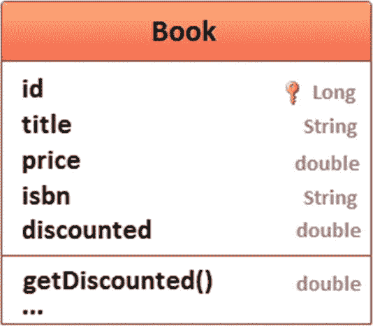
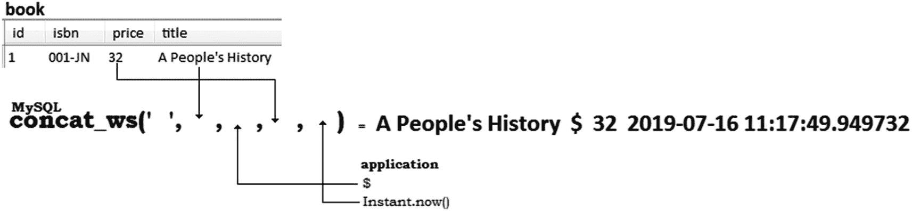
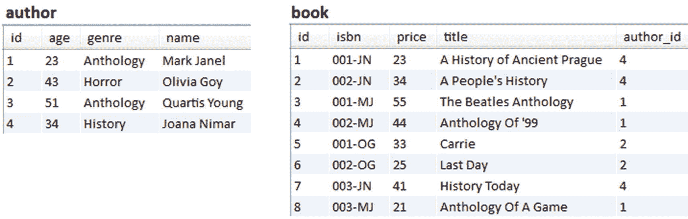
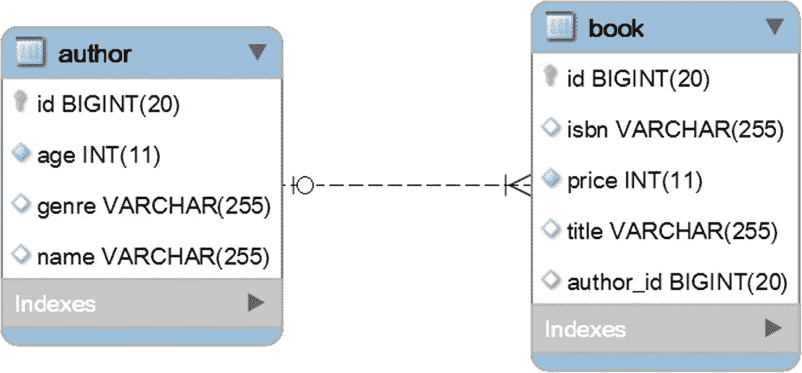

# 八、计算属性

## 项目 77:如何映射计算的非持久属性

此项是关于根据持久实体属性映射实体的计算非持久属性。它使用图 8-1 所示的`Book`实体映射。



图 8-1

图书类图

每本书都有一个价格，通过名为`price`的持久字段映射。并且，基于`price`，开发人员必须计算非持久字段`discounted`的值。这是打了折扣的价格。我们假设每本书都有 25%的折扣。换句话说，在加载了一个`Book`之后，`getDiscounted()`属性应该返回应用了折扣的价格，`price - price * 0.25`。

### JPA 快速方法

JPA 快速方法包括用 JPA `@Transient`注释`getDiscounted()`属性，如下所示:

```java
@Transient
public double getDiscounted() {
    return this.price - this.price * 0.25;
}

```

这意味着每次调用`getDiscounted()`方法时都会执行计算。如果计算相当复杂(例如，依赖于其他计算)或者必须多次调用该属性，则此实现不如下面的实现有效。

### JPA @PostLoad

更好的方法包括两个步骤:

*   用`@Transient`注释`discounted`字段

*   声明一个用`@PostLoad`注释的`private`方法，并计算`discounted`值

在代码行中，这两个项目符号如下所示:

```java
@Entity
public class Book implements Serializable {
    ...
    @Transient
    private double discounted;
    ...

    public double getDiscounted() {
        return discounted;
    }

    @PostLoad
    private void postLoad() {
        this.discounted = this.price - this.price * 0.25;
    }
}

```

有关 JPA 回调的更多细节，请考虑**第 104 项。**

这一次，计算是在实体加载后执行的。调用`getDiscounted()`将返回`discounted`的值，而无需在每次调用时重复计算。

完整的代码可以在 GitHub <sup>1</sup> 上找到。

### 特定于 Hibernate 的@公式

`discounted`的计算也可以写成一个 SQL 查询表达式。为此，请依赖 Hibernate 特有的`@Formula`注释。下面的代码片段展示了如何在这种情况下使用`@Formula`:

```java
@Entity
public class Book implements Serializable {
    ...
    @Formula("price - price * 0.25")
    private double discounted;
    ...

    @Transient
    public double getDiscounted() {
        return discounted;
    }
}

```

获取一个`Book`实体将通过下面的 SQL 语句完成(注意给定的公式是查询的一部分):

```java
SELECT
  book0_.id AS id1_0_,
  book0_.isbn AS isbn2_0_,
  book0_.price AS price3_0_,
  book0_.title AS title4_0_,
  book0_.price - book0_.price * 0.25 AS formula0_
FROM book book0_

```

调用`getDiscounted()`将在查询时返回计算出的`discounted`值。

完整的代码可以在 GitHub <sup>2</sup> 上找到。

这两种计算`discounted`的方法可以归入同一类。它们都假设加载了一个`Book`实体，并且使用它的持久属性来计算非持久字段`discounted`的值。主要区别在于公式的写法。`@PostLoad`是用 Java 写的，`@Formula`是用 SQL 查询表达式写的。

## 项目 78:如何通过@Generated 映射计算的持久属性

这一项是关于根据其他持久实体属性映射实体的计算持久属性。它使用图 8-2 所示的`Book`实体映射。


图 8-2

图书类图

每本书都有一个价格，通过名为`price`的持久字段映射。并且，基于`price`，开发人员必须计算持久字段`discounted`的值。这是打了折扣的价格。每本书都有 25%的折扣。换句话说，保持一个给定价格的`Book`应该保持`discounted`为`price - price * 0.25`。更新`price`也应该更新`discounted`字段。

此外，让我们看看如何在`INSERT`和/或`UPDATE`时间计算`discounted`。

### 特定于 Hibernate 的@Generated

考虑到`discounted`是`Book`实体的持久字段，必须基于`price`持久字段进行计算。因此，`discounted`字段被物化在`book`表的一列中，其值将在`INSERT`或/和`UPDATE`时间被计算。这是一个生成的列；它对于列就像视图对于表一样。

Hibernate 提供了`@Generated`注释。通过这个注释，开发人员指示 Hibernate(而不是数据库)何时计算相关的列值。该注释的值可以是`GenerationTime.INSERT`(仅`INSERT`时间)或`GenerationTime.ALWAYS` ( `INSERT`和`UPDATE`时间)。如果不应该生成该值，`GenerationTime.NEVER`是合适的选择。

此外，您可以为`discounted`字段提供自定义的`@Column`定义。根据经验，生成的列不能通过`INSERT`或`UPDATE`语句直接编写。在代码中，如下所示:

```java
@Entity
public class Book implements Serializable {

    @Generated(value = GenerationTime.ALWAYS)
    @Column(insertable = false, updatable = false)
    private double discounted;
    ...
    public double getDiscounted() {
        return discounted;
    }
}

```

对于`GenerationTime.INSERT`，该栏应标注`@Column(insertable = false)`。

`discounted`值的计算公式在哪里？有两种方法可以指定公式。

#### 通过 columnDefinition 元素的公式

可以通过`@Column`注释的`columnDefinition`元素将公式指定为 SQL 查询表达式，如下所示:

```java
@Generated(value = GenerationTime.ALWAYS)
@Column(insertable = false, updatable = false,
    columnDefinition = "double AS (price - price * 0.25)")
private double discounted;

```

如果数据库模式是从 JPA 注释(例如，`spring.jpa.hibernate.ddl-auto=create`)生成的，那么`columnDefinition`的存在将反映在`CREATE TABLE`查询中，如下所示(为`GenerationTime.INSERT`生成了相同的查询):

```java
CREATE TABLE book (
    id BIGINT NOT NULL AUTO_INCREMENT,
    discounted DOUBLE AS (price - price * 0.25),
    isbn VARCHAR(255),
    price DOUBLE PRECISION NOT NULL,
    title VARCHAR(255),
    PRIMARY KEY (id)
)

```

依赖`columnDefinition`需要从 JPA 注释生成数据库模式；因此，这不能代表生产解决方案。在生产中，`spring.jpa.hibernate.ddl-auto`应该被禁用(未指定)或设置为`validate`，数据库迁移应该通过专用工具(如 Flyway 或 Liquibase)来管理。

显然，这适用于`eclipselink.ddl-generation`(特定于 EclipseLink 持久性提供者)和任何其他用于为数据库模式生成 DDL 的类似机制。这种机制应该只用于构建数据库模式的原型。

数据库(例如 MySQL、PostgreSQL)通常识别两种生成的列:*存储的*和*虚拟的*。通过`columnDefinition`，该列将采用为所用数据库设置的默认值(在 MySQL 和 PostgreSQL 中，默认值为 *virtual* )。这两个概念将在下一节解释。

#### 通过创建表的公式

在生产中，应该通过`CREATE TABLE`将公式指定为数据库模式的一部分，而不是在`columnDefinition`中。在 MySQL 中定义生成列的语法如下(对于其他数据库考虑事项，请阅读文档):

```java
column_name data_type [GENERATED ALWAYS] AS (expression)
   [VIRTUAL | STORED] [UNIQUE [KEY]]

```

首先，指定列名及其数据类型。

接下来，添加可选的`GENERATED ALWAYS`子句，以指示该列是生成的列。实际上，`AS (expression)`表示生成了列，而可选的`GENERATED ALWAYS`只是以更明确的方式强调了这一点。没有`GENERATED INSERT`！

列的类型可以是`VIRTUAL`或`STORED`。默认情况下，如果没有明确指定类型，MySQL 会使用`VIRTUAL`:

*   `VIRTUAL`:不存储列值，但是在读取行时，在任何`BEFORE`触发器之后立即计算列值。一个*虚拟*列不占用任何存储空间(InnoDB 支持*虚拟*列上的二级索引)。

*   `STORED`:插入或更新行时，计算并存储列值。一个*存储的*列确实需要存储空间，并且可以被索引。

之后，指定表达式。表达式可以包含运算符、文字、不带参数的内置函数或对同一表中任何列的引用。函数必须是标量和确定性的。

最后，如果生成的列是*存储的*，您可以为它定义一个惟一的约束。

在`CREATE TABLE`中指定公式比使用`columnDefinition`更灵活，并且通过专用工具(如 Flyway 或 Liquibase)保持数据库模式的可维护性。

一个 MySQL `CREATE TABLE`示例，用于存储*生成的*列，可以编写如下:

```java
CREATE TABLE book (
  id BIGINT NOT NULL AUTO_INCREMENT,
  discounted DOUBLE GENERATED ALWAYS AS ((`price` - `price` * 0.25)) STORED,
  isbn VARCHAR(255),
  price DOUBLE PRECISION NOT NULL,
  title VARCHAR(255),
  PRIMARY KEY (id)
)

```

在本书捆绑的应用中，这个 DDL 是在`schema-sql.sql`中加入的。但是请记住，在生产中，您应该依赖 Flyway 或 Liquibase，它们提供了自动模式迁移。

#### 测试时间

持久化＄*13.99*的书将生成以下 SQL 语句:

```java
INSERT INTO book (isbn, price, title)
  VALUES (?, ?, ?)
Binding:[001-AH, 13.99, Ancient History]

SELECT
  book_.discounted AS discount2_0_
FROM book book_
WHERE book_.id = ?
Binding:[1], Extracted:[10.4925]

```

在触发`INSERT`并刷新之后，Hibernate 会自动触发一个`SELECT`来获取计算出的`discounted`值。这是将托管实体与基础表行同步所必需的。调用`getDiscounted()`将返回 *10.4925* 。这就是`@Generated`的效果。

此外，让我们触发一个`UPDATE`，将新价格设置为 9.99 美元*。产生的 SQL 语句是:*

```java
UPDATE book
SET isbn = ?,
    price = ?,
    title = ?
WHERE id = ?
Binding:[001-AH, 9.99, Ancient History, 1]

SELECT
  book_.discounted AS discount2_0_
FROM book book_
WHERE book_.id = ?
Binding:[1], Extracted:[7.4925]

```

在触发`UPDATE`并刷新之后，Hibernate 会自动触发一个`SELECT`来获取计算出的`discounted`值。这是将托管实体与基础表行同步所必需的。调用`getDiscounted()`将返回 *7.4925* 。这就是`@Generated`的效果。

完整的代码可以在 GitHub <sup>3</sup> 上找到。

## 第 79 项:如何在 JPQL 查询中使用带多个参数的 SQL 函数

SQL 函数(MySQL、PostgreSQL 等)的存在。)可能会导致异常，如果 Hibernate 不能识别它们的话。

### 选择零件中的功能

例如，MySQL `concat_ws()`函数(用于通过分隔符/分隔符连接多个字符串)不被 Hibernate 识别。从 Hibernate 5.3(或者更准确地说，5.2.18)开始，这些函数可以通过`MetadataBuilderContributor`注册，并通过`metadata_builder_contributor`属性通知 Hibernate。

图 8-3 描绘了`concat_ws()`的一个使用案例。



图 8-3

MySQL concat_ws()函数

`concat_ws()`函数用于连接`Book`的`title`和`price`(来自数据库)，用空格分隔`$`符号和当前日期(来自应用)。

在 Spring 风格中，您可以通过`@Query`编写如下查询:

```java
@Repository
@Transactional(readOnly = true)
public interface BookRepository extends JpaRepository<Book, Long> {

    @Query(value = "SELECT concat_ws(b.title, ?1, b.price, ?2) "
            + "FROM Book b WHERE b.id = 1")
    String fetchTitleAndPrice(String symbol, Instant instant);
}

```

在纯 JPA 风格中，您可以通过`EntityManager`编写如下查询:

```java
@Repository
public class Dao<T, ID extends Serializable> implements GenericDao<T, ID> {

    @PersistenceContext
    private EntityManager entityManager;

    @Override
    @Transactional(readOnly = true)
    public String fetchTitleAndPrice(String symbol, Instant instant) {

        return (String) entityManager.createQuery(
            "SELECT concat_ws(b.title, :symbol, b.price, :instant) "
            + "FROM Book b WHERE b.id = 1"
        )
            .setParameter("symbol", symbol)
            .setParameter("instant", instant)
            .getSingleResult();
    }
}

```

但是，在通过`MetadataBuilderContributor`注册`concat_ws()`功能之前，这些尝试都不起作用，如下所示:

```java
public class SqlFunctionsMetadataBuilderContributor
                    implements MetadataBuilderContributor {

    @Override
    public void contribute(MetadataBuilder metadataBuilder) {
        metadataBuilder.applySqlFunction(
            "concat_ws",
            new SQLFunctionTemplate(
                StandardBasicTypes.STRING,
                "concat_ws('  ', ?1, ?2, ?3, ?4)"
            )
        );
    }

}

```

与前面的示例类似，您可以注册任何其他 SQL 函数。比如你可以注册著名的`date_trunc()`如下:

```java
@Override
public void contribute(MetadataBuilder metadataBuilder) {
    metadataBuilder.applySqlFunction(
        "date_trunc", new SQLFunctionTemplate(
            StandardBasicTypes.TIMESTAMP, "date_trunc('minute', ?1)"
        )
    );
}

```

最后，在`application.properties`中设置`spring.jpa.properties.hibernate.metadata_builder_contributor`，如下图:

```java
spring.jpa.properties.hibernate.metadata_builder_contributor
    =com.bookstore.config.SqlFunctionsMetadataBuilderContributor

```

运行该代码将显示类似如下的输出:

```java
A People's History  $  32  2019-07-16 11:17:49.949732

```

完整的代码可以在 GitHub <sup>4</sup> 上找到。

### WHERE 部分中的函数

在 JPA 2.1 中，可以在 JPQL 查询的`WHERE`部分使用函数，而无需注册函数。JPA 2.1 引入了`function()`，它采用以下参数:

*   作为第一个参数调用的函数的名称

*   函数的所有参数

让我们调用同一个`concat_ws()`函数，但是这次是在`WHERE`子句中:

```java
@Transactional(readOnly = true)
@Query(value = "SELECT b FROM Book b WHERE b.isbn "
             + "= function('concat_ws', '-', ?1, ?2)")
Book fetchByIsbn(String code, String author);

```

从服务方法中调用`fetchByIsbn()`可以如下进行:

```java
public Book fetchBookByIsbn() {
    return bookRepository.fetchByIsbn("001", "JN");
}

```

触发的 SQL 如下:

```java
SELECT
  book0_.id AS id1_0_,
  book0_.isbn AS isbn2_0_,
  book0_.price AS price3_0_,
  book0_.title AS title4_0_
FROM book book0_
WHERE book0_.isbn = concat_ws('-', ?, ?)
Binding:[001, JN]

```

您可以按如下方式调用 SQL 函数(标准函数或自定义函数):

*   在 JPQL 查询中，只要从这里引用标准函数 <sup>5</sup>

*   在`WHERE`部分和 JPA 2.1 中，可以通过`function()`调用现成的 SQL 函数

*   在`SELECT`部分，未识别的 SQL 函数必须被注册

搞定了。完整的应用可在 GitHub <sup>6</sup> 上获得。

## 第 80 项:如何通过@JoinFormula 将@ManyToOne 关系映射到 SQL 查询

让我们考虑图 8-4 中的表格和图 8-5 中的数据所反映的单向`@ManyToOne`关系中涉及的`Author`和`Book`实体。



图 8-5

数据快照



图 8-4

一对多表关系

这个场景要求你找出哪本书比给定的书便宜。换句话说，当通过 ID 获取一本书(姑且称之为书 *A* )时，您想要获取另一本书，名为书 *B，*的同一作者的书，其价格与书 *A 的*价格相比是第二便宜的。可以通过以下方式实现这一点:

```java
@Transactional(readOnly = true)
public void fetchBooks() {

    Book book = bookRepository.findById(7L).orElseThrow();
    Book nextBook = bookRepository.fetchNextSmallerPrice(
        book.getPrice(), book.getAuthor().getId());

    System.out.println("Fetched book with id 7: " + book);
    System.out.println("Fetched book with next smallest price: " + nextBook);
}

```

其中`fetchNextSmallerPrice()`是以下本机查询:

```java
@Transactional(readOnly = true)
@Query(value="SELECT * FROM book WHERE price < ?1 AND author_id = ?2 "
            + "ORDER BY price DESC LIMIT 1",
       nativeQuery = true)
Book fetchNextSmallerPrice(int price, long authorId);

```

需要两条`SELECT`语句来获取`book`和`nextBook`。或者，通过 Hibernate 特有的`@JoinFormula`将`@ManyToOne`映射到前面的查询会更简单:

```java
@Entity
public class Book implements Serializable {

    private static final long serialVersionUID = 1L;

    @Id
    @GeneratedValue(strategy = GenerationType.IDENTITY)
    private Long id;

    private String title;
    private String isbn;
    private int price;

    @ManyToOne(fetch = FetchType.LAZY)
    @JoinColumn(name = "author_id")
    private Author author;

    @ManyToOne(fetch = FetchType.LAZY)
    @JoinFormula("(SELECT b.id FROM book b "
        + "WHERE b.price < price AND b.author_id = author_id "
        + "ORDER BY b.price DESC LIMIT 1)")
    private Book nextBook;

    public Book getNextBook() {
        return nextBook;
    }

    public void setNextBook(Book nextBook) {
        this.nextBook = nextBook;
    }
    ...
}

```

基于这个映射，服务方法`fetchBooks()`变成了:

```java
@Transactional(readOnly = true)
public void fetchBooks() {

    Book book = bookRepository.findById(7L).orElseThrow();
    Book nextBook = book.getNextBook();

    System.out.println("Fetched book with id 7: " + book);
    System.out.println("Fetched book with next smallest price: " + nextBook);
}

```

为了取出`book`和`nextBook`，下面的`SELECT`语句被执行两次:

```java
SELECT
  book0_.id AS id1_1_0_,
  book0_.author_id AS author_i5_1_0_,
  book0_.isbn AS isbn2_1_0_,
  book0_.price AS price3_1_0_,
  book0_.title AS title4_1_0_,
  (SELECT
    b.id
  FROM book b
  WHERE b.price < book0_.price AND b.author_id = book0_.author_id
  ORDER BY b.price DESC LIMIT 1)
  AS formula1_0_
FROM book book0_
WHERE book0_.id = ?
Binding:[7] Extracted:[4, 003-JN, 2, 41, History Today]

```

第三个提取值是 *2* ，对应公式结果。这是`nextBook`的 ID。因此，再次执行该查询来获取带有以下参数的`nextBook`:

```java
Binding:[2] Extracted:[4, 002-JN, 1, 34, A People's History]

```

再次注意，第三个提取的值( *1* )对应于公式结果。这允许您继续调用`getNextBook()`。没有其他更便宜的书的时候，公式结果会是 *null* 。

一般来说，Hibernate 特有的`@JoinFormula`注释可以用来定义任何`SELECT`查询，以提供两个实体之间的关系。例如，你可以用它买到某个作者最便宜的书。为此，您也要在`Author`中添加一个`@ManyToOne`:

```java
@Entity
public class Author implements Serializable {
    ...
    @ManyToOne(fetch = FetchType.LAZY)
    @JoinFormula("(SELECT b.id FROM book b "
        + "WHERE b.author_id = id "
        + "ORDER BY b.price ASC LIMIT 1)")
    private Book cheapestBook;
    ...
}

```

用法:

```java
Author author = authorRepository.findById(1L).orElseThrow();
Book cheapestBook = author.getCheapestBook();

```

完整的应用可在 GitHub <sup>7</sup> 上获得。

<aside aria-label="Footnotes" class="FootnoteSection" epub:type="footnotes">Footnotes 1

[hibernate pringb otcalculateprp ertypodload](https://github.com/AnghelLeonard/Hibernate-SpringBoot/tree/master/HibernateSpringBootCalculatePropertyPostLoad)

  2

[hibernate pringb otcalculateprp ertyformula](https://github.com/AnghelLeonard/Hibernate-SpringBoot/tree/master/HibernateSpringBootCalculatePropertyFormula)

  3

[hibernate spring ootCalculateProp erty generated](https://github.com/AnghelLeonard/Hibernate-SpringBoot/tree/master/HibernateSpringBootCalculatePropertyGenerated)

  4

[hibernate pringb oojpqlfunction params](https://github.com/AnghelLeonard/Hibernate-SpringBoot/tree/master/HibernateSpringBootJpqlFunctionsParams)

  5

[`https://en.wikibooks.org/wiki/Java_Persistence/JPQL#JPQL_supported_functions`](https://en.wikibooks.org/wiki/Java_Persistence/JPQL%2523JPQL_supported_functions)

  6

[hibernate pringb oojpqlfunction](https://github.com/AnghelLeonard/Hibernate-SpringBoot/tree/master/HibernateSpringBootJpqlFunction)

  7

[hibernate pringb 欧统局公式](https://github.com/AnghelLeonard/Hibernate-SpringBoot/tree/master/HibernateSpringBootJoinFormula)

 </aside>*