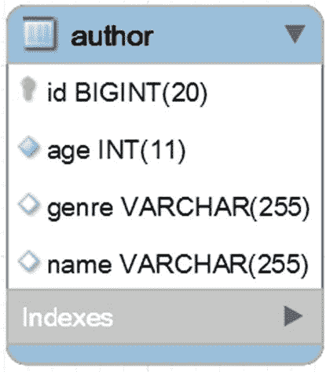
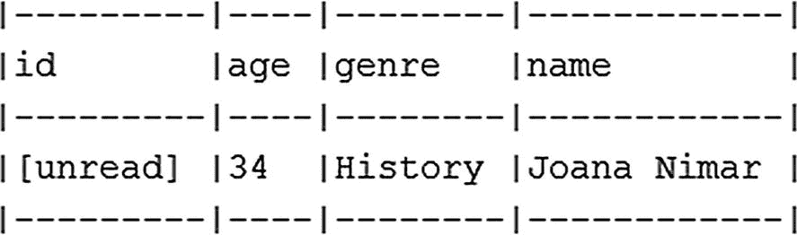

# 9.监视

## 第 81 项:为什么以及如何计算和断言 SQL 语句

假设您有映射到表的`Author`实体，如图 [9-1](#Fig1) 所示，目标是自动执行下面的简单场景:



图 9-1

作者实体表

*   从数据库加载一个`Author`

*   更新该`Author`的`genre`

一个简单的服务方法可以实现这个场景，如下所示:

```java
@Service
public class BookstoreService {

    private final AuthorRepository authorRepository;
    ...

    public void updateAuthor() {

        Author author = authorRepository.findById(1L).orElseThrow();
        author.setGenre("History");

        authorRepository.save(author);
    }
}

```

但是，这些操作是原子性的吗？它们不是，因为开发人员不小心忘记在方法级别添加`@Transactional`，并且没有继承的事务上下文。每个操作将在单独的事务中运行，这将导致性能损失。代码还容易出现意外行为和数据不一致。但是，这个事故对触发的 SQL 的数量和/或类型有负面影响吗？根据预期计算和断言 SQL 语句的数量将回答这个问题。

为计数和断言触发的 SQL 语句的机制提供支持需要两个库。计数是`DataSource-Proxy`库的责任。在这个库的好处中(检查 **Item 83** ，它将代理数据源并提取重要信息，如绑定参数的值和执行的 SQL 语句的数量。

关键是在构建代理之前调用`countQuery()`方法。这指示`DataSource-Proxy`创建一个`DataSourceQueryCountListener`。除了数据源名称之外，该监听器还提供了数据库调用次数、总查询执行时间以及按类型划分的查询次数等指标:

```java
public ProxyDataSourceInterceptor(final DataSource dataSource) {

    super();

    this.dataSource = ProxyDataSourceBuilder.create(dataSource)
        .name("DATA_SOURCE_PROXY")
        .logQueryBySlf4j(SLF4JLogLevel.INFO)
        .multiline()
        .countQuery()
        .build();
}

```

有了这个监听器，被触发的 SQL 语句可以通过`QueryCount` API 直接计数。或者，更好的是，您可以使用`db-util`库。使用这个库的优点是名为`SQLStatementCountValidator`的开箱即用的自动化验证器。这个验证器公开了下面的`static`断言:`assertSelectCount()`、`assertInsertCount()`、`assertUpdateCount()`和`assertDeleteCount()`。

使用这个验证器需要三个主要步骤:

*   通过`SQLStatementCountValidator.reset()`复位`QueryCount`

*   执行 SQL 语句

*   应用适当的断言

回到`updateAuthor()`方法，开发人员没有意识到忘记添加`@Transactional`，因此，判断事务上下文中的代码，SQL 语句的预期数量等于两个，一个`SELECT`和一个`UPDATE`。预计不会出现`INSERT`或`DELETE`。您可以断言预期的查询，如下所示:

```java
private final BookstoreService bookstoreService;
...

SQLStatementCountValidator.reset();

bookstoreService.updateAuthor();

assertSelectCount(1);
assertUpdateCount(1);
assertInsertCount(0);
assertDeleteCount(0);

```

根据经验，这些断言可以添加到单元测试中。建议断言所有类型的操作，而不仅仅是那些您期望发生的操作。例如，如果触发了一个意外的`DELETE`，而您跳过了`assertDeleteCount(0)`，那么您将无法捕捉到它。

运行该应用程序将导致以下异常:

```java
com.vladmihalcea.sql.exception.SQLSelectCountMismatchException: Expected 1 statements but recorded 2 instead!

```

如果预期的 SQL 语句的数量与已执行的 SQL 语句的数量不同，那么`SQLStatementCountValidator`将抛出类型为`SQL` `Foo` `CountMismatchException`的异常，其中`Foo`是`Select`、`Insert`、`Update`或`Delete`中的一个，这取决于 SQL 类型。

因此，应用程序断言了一个`SELECT`，但是触发了两个。为什么预期的 SQL 语句数量不正确？因为每个语句都在一个单独的事务中运行，所以实际上触发了下面的 SQL 语句(检查右边的注释会发现现实与预期相差很远):

```java
Author author = authorRepository.findById(1L).orElseThrow(); // 1 select
author.setGenre("History");
authorRepository.save(author);   // 1 select, 1 update

```

列出这些 SQL 语句将揭示以下内容:

```java
-- fetch the author
SELECT
  author0_.id AS id1_0_0_,
  author0_.age AS age2_0_0_,
  author0_.genre AS genre3_0_0_,
  author0_.name AS name4_0_0_
FROM author author0_
WHERE author0_.id = ?

-- the fetched author is not managed,
-- therefore it must be fetched again before updating it
SELECT
  author0_.id AS id1_0_0_,
  author0_.age AS age2_0_0_,
  author0_.genre AS genre3_0_0_,
  author0_.name AS name4_0_0_
FROM author author0_
WHERE author0_.id = ?

-- update the author
UPDATE author
SET age = ?,
    genre = ?,
    name = ?
WHERE id = ?

```

因此，开发人员期望两个 SQL 语句，但实际上，有三个 SQL 语句。因此，有三次数据库往返，而不是两次。这是不对的，但是，由于计算和断言 SQL 语句，这个错误没有被发现。意识到这个错误后，开发人员修复了`updateAuthor()`方法，如下所示:

```java
@Service
public class BookstoreService {

    private final AuthorRepository authorRepository;
    ...

    @Transactional
    public void updateAuthor() {

        Author author = authorRepository.findById(1L).orElseThrow();
        author.setGenre("History");

        authorRepository.save(author);
    }
}

```

再次计数和断言表明，SQL 语句的预期数量和类型符合实际情况。这次只触发一个`SELECT`和一个`UPDATE`。没有 T2 和 T3，这样更好。

但是，等等！现在，既然您提供了事务上下文，那么有必要显式调用`save()`方法吗？答案是否定的！在**项 107** 中可以看到，这种情况下调用`save()`是多余的。通过删除这个显式调用，您不会影响被触发的 SQL 的数量，因为 Hibernate 脏检查机制会代表您触发`UPDATE`。所以，`updateAuthor()`方法最好的写法如下(当然现实中你会把作者 ID 作为参数传递给这个方法而不会依赖`orElseThrow()`；这里使用它们只是为了简洁):

```java
@Transactional
public void updateAuthor() {

    Author author = authorRepository.findById(1L).orElseThrow();
    author.setGenre("History");
}

```

GitHub <sup>[1](#Fn1)</sup> 上有源代码。

## 项目 82:如何记录预准备语句的绑定和提取参数

考虑从一个`INSERT`和一个`SELECT`构建的`Author`实体和两个准备好的语句。显示相应的 SQL 语句将如下所示:

```java
INSERT INTO author (age, genre, name)
  VALUES (?, ?, ?)

SELECT
  author0_.id AS id1_0_0_,
  author0_.age AS age2_0_0_,
  author0_.genre AS genre3_0_0_,
  author0_.name AS name4_0_0_
FROM author author0_
WHERE author0_.id = ?

```

注意那些问号(`?`)。它们是*绑定*和*提取*参数的占位符。大多数时候，看到这些参数的真实值而不是这些占位符是很有用的。有几种方法可以实现这一点。让我们来看看其中的三个。

### 微量

解决这个问题的最快方法可能是启用`application.properties`中的`TRACE`日志记录级别，如下所示:

```java
logging.level.org.hibernate.type.descriptor.sql=TRACE

```

这一次，输出如下:

```java
insert into author (age, genre, name) values (?, ?, ?)
binding parameter [1] as [INTEGER] - [34]
binding parameter [2] as [VARCHAR] - [History]
binding parameter [3] as [VARCHAR] - [Joana Nimar]

select author0_.id as id1_0_0_, author0_.age as age2_0_0_, author0_.genre as genre3_0_0_, author0_.name as name4_0_0_ from author author0_ where author0_.id=?
binding parameter [1] as [BIGINT] - [1]
extracted value ([age2_0_0_] : [INTEGER]) - [34]
extracted value ([genre3_0_0_] : [VARCHAR]) - [History]
extracted value ([name4_0_0_] : [VARCHAR]) - [Joana Nimar]

```

对于每个参数，输出包含其类型(*绑定参数*或*提取值*)、位置或名称、数据类型和值。

GitHub <sup>[2](#Fn2)</sup> 上有源代码。

当您使用启动器时，默认情况下 Spring Boot 依赖于 Logback。如果您不想在`application.properties`中设置`TRACE`日志级别，那么只需添加或创建一个 Logback 配置文件。Spring Boot 会自动识别类路径中的`logback-spring.xml`、`logback.xml`、`logback-spring.groovy`或`logback.groovy`文件并进行相应处理。下面是来自`logback-spring.xml`的一个样本(完整的文件可以在 GitHub <sup>[3](#Fn3)</sup> 上获得):

```java
...
<logger name="org.hibernate.type.descriptor.sql"
        level="trace" additivity="false">
    <appender-ref ref="Console" />
</logger>
...

```

### Log4j 2

通过`Log4j` 2 可以获得相同的结果。要启用它，首先要排除 Spring Boot 的默认日志记录，并添加`Log4j` 2 依赖项，如下所示:

```java
<!-- Exclude Spring Boot's Default Logging -->
<dependency>
    <groupId>org.springframework.boot</groupId>
    <artifactId>spring-boot-starter</artifactId>
    <exclusions>
        <exclusion>
            <groupId>org.springframework.boot</groupId>
            <artifactId>spring-boot-starter-logging</artifactId>
        </exclusion>
    </exclusions>
</dependency>

<!-- Add Log4j2 Dependency -->
<dependency>
    <groupId>org.springframework.boot</groupId>
    <artifactId>spring-boot-starter-log4j2</artifactId>
</dependency>

```

此外，配置`log4j.xml`中的`TRACE`级别如下(该文件应放在`application.properties`旁边的`/resources`文件夹中):

```java
<Loggers>
    <Logger name="org.hibernate.type.descriptor.sql" level="trace"/>
    ...
</Loggers>

```

当然，日志可以进一步调整，以符合`Log4j` 2 文档。

GitHub <sup>[4](#Fn4)</sup> 上有源代码。

除了*绑定*和*提取的*参数之外，其他方法可以提供关于查询的更多细节。执行时间、批处理信息、查询类型等细节可以通过**第 83 项**中介绍的方法获得。

### MySQL 和 profileSQL=true

仅对于 MySQL，绑定参数(不是提取的参数)通过两个步骤可见:

*   关闭`spring.jpa.show-sql`(省略或设置为`false`)

*   通过将`logger=Slf4JLogger&profileSQL=true`追加到 JDBC URL 来塑造它

GitHub <sup>[5](#Fn5)</sup> 上有源代码。

## 项目 83:如何记录查询详细信息

要仅记录预准备语句的*绑定参数*和*提取值*，请参见**第 82 项。**

您可以通过几种方式获得 SQL 查询的详细信息。让我们来看看其中的三个。

### 通过数据源代理

`DataSource-Proxy`是一个开源项目，它“通过代理为 JDBC 交互和查询执行提供了一个监听器框架”。它不依赖于其他库；一切都是可选的。它是高度可配置的、灵活的、可扩展的，并且是正确的选择。

在 Spring Boot 应用程序中启用该库需要几个步骤。首先，将`datasource-proxy`的依赖关系添加到`pom.xml`:

```java
<dependency>
    <groupId>net.ttddyy</groupId>
    <artifactId>datasource-proxy</artifactId>
    <version>${datasource-proxy.version}</version>
</dependency>

```

接下来，创建一个 bean post 处理器来拦截`DataSource` bean，并通过`ProxyFactory`和`MethodInterceptor`的实现包装`DataSource` bean。最终结果如以下代码片段所示:

```java
private static class ProxyDataSourceInterceptor
                        implements MethodInterceptor {

    private final DataSource dataSource;

    public ProxyDataSourceInterceptor(final DataSource dataSource) {
        super();
        this.dataSource = ProxyDataSourceBuilder.create(dataSource)
            .name("DATA_SOURCE_PROXY")
            .logQueryBylf4j(SLF4JLogLevel.INFO)
            .multiline()
            .build();
    }
    ...
}

```

这是可以定制细节级别的地方。可以使用丰富而流畅的 API 来调整细节(查看文档)。所有设置就绪后，只需调用`build()`。典型的输出如下所示:

```java
Name:DATA_SOURCE_PROXY, Connection:5, Time:131, Success:True
Type:Prepared, Batch:False, QuerySize:1, BatchSize:0
Query:["insert into author (age, genre, name) values (?, ?, ?)"]
Params:[(34,History,Joana Nimar)]

```

GitHub <sup>[6](#Fn6)</sup> 上有源代码。

### 通过 log4jdbc

`log4jdbc`背后的官员声称“log4jdbc 是一个 Java jdbc 驱动程序，它可以使用 Java (SLF4J)日志记录系统的简单日志门面来记录其他 JDBC 驱动程序的 SQL 和/或 JDBC 调用(以及可选的 SQL 计时信息)”。

Spring Boot 应用程序可以在将它的依赖项添加到`pom.xml`后立即利用`log4jdbc`:

```java
<dependency>
    <groupId>com.integralblue</groupId>
    <artifactId>log4jdbc-spring-boot-starter</artifactId>
    <version>1.0.2</version>
</dependency>

```

官方文档提供了关于定制输出的详细信息。典型的输出包含 SQL(包括执行时间)、对所涉及的方法的审计以及作为表格的结果集，如图 [9-2](#Fig2) 所示。



图 9-2

log4jdbc 输出示例

GitHub <sup>[7](#Fn7)</sup> 上有源代码。

### Via P6spy

文档中说 P6Spy“…是一个框架，它能够无缝地截取数据库数据并记录日志，而无需对应用程序进行代码更改”。启用 P6spy 需要将`pom.xml`添加到相应的依赖关系中:

```java
<dependency>
    <groupId>p6spy</groupId>
    <artifactId>p6spy</artifactId>
    <version>${p6spy.version}</version>
</dependency>

```

此外，在`application.properties`中，您设置了 JDBC URL 和驱动程序类名，如下所示:

```java
spring.datasource.url=jdbc:p6spy:mysql://localhost:3306/bookstoredb
spring.datasource.driverClassName=com.p6spy.engine.spy.P6SpyDriver

```

最后，向应用程序根文件夹添加`spy.properties`文件。该文件包含 P6Spy 配置。在这个应用程序中，日志将被输出到控制台，但是有一个非常简单的方法来切换到文件。关于 P6Spy 配置的更多细节可以在文档中找到。

输出可能如下所示:

```java
insert into author (age, genre, name) values (?, ?, ?)
insert into author (age, genre, name) values (34, 'History', 'Joana Nimar');
#1562161760396 | took 0ms | commit | connection 0| url jdbc:p6spy:mysql://localhost:3306/bookstoredb?createDatabaseIfNotExist=true

```

GitHub <sup>[8](#Fn8)</sup> 上有源代码。

## 项目 84:如何记录带有阈值的慢速查询

您可以通过`DataSource-Proxy`使用 threshold 记录慢速查询。要熟悉`DataSource-Proxy`，可以考虑**第 83 项**。

准备好`DataSource-Proxy`之后，考虑以下步骤来记录缓慢的查询:

*   在 bean post 处理器中，定义一个常量，以毫秒为单位表示慢速查询的阈值:

*   此外，定义一个`SLF4JQueryLoggingListener`监听器并覆盖`afterQuery()`方法，如下所示:

```java
private static final long THRESHOLD_MILLIS = 30;

```

*   最后，使用这个`listener`来配置数据源代理:

```java
SLF4JQueryLoggingListener listener
    = new SLF4JQueryLoggingListener() {

    @Override
    public void afterQuery(ExecutionInfo execInfo,
                            List<QueryInfo> queryInfoList) {
        // call query logging logic only // when it took more than threshold
        if (THRESHOLD_MILLIS <= execInfo.getElapsedTime()) {
            logger.info("Slow SQL detected ...");
            super.afterQuery(execInfo, queryInfoList);
        }
    }
};

listener.setLogLevel(SLF4JLogLevel.WARN);

```

```java
this.dataSource = ProxyDataSourceBuilder.create(dataSource)
    .name("DATA_SOURCE_PROXY")
    .multiline()
    .listener(listener)
    .build();

```

搞定了。现在，记录的 SQL 将只是那些超过阈值的 SQL。GitHub <sup>[9](#Fn9)</sup> 上有源代码。

从 Hibernate 5.4.5 开始，您可以通过一个名为`hibernate.session.events.log.LOG_QUERIES_SLOWER_THAN_MS`的新属性记录阈值为毫秒的慢速查询。您只需在`application.properties`中添加该属性，并以毫秒为单位指定阈值，如下例所示:

```java
spring.jpa.properties.hibernate.session
    .events.log.LOG_QUERIES_SLOWER_THAN_MS=25

```

GitHub <sup>[10](#Fn10)</sup> 上有完整的例子。如果您没有使用 Hibernate 5.4.5+,那么可以使用第三方库来记录慢速查询。

## 第 85 项:日志事务和查询方法详细信息

有时，为了理解数据访问层中发生的事情，您需要记录关于正在运行的事务(例如，您可能需要理解某个事务传播场景)和查询方法(例如，您可能需要记录某个`query-method`的执行时间)的更多细节。

### 记录交易详细信息

默认情况下，logger `INFO`级别不会透露正在运行的事务的细节。但是您可以通过在下面的行中添加`application.properties`来轻松地公开事务细节:

```java
logging.level.ROOT=INFO
logging.level.org.springframework.orm.jpa=DEBUG
logging.level.org.springframework.transaction=DEBUG
logging.level.org.hibernate.engine.transaction.internal.TransactionImpl=DEBUG

```

有时记录连接池的状态也很有用。对于 hikar ICP(Spring Boot 应用程序中推荐和默认的连接池)，您可以通过将`application.properties`添加到以下设置中来实现:

```java
logging.level.com.zaxxer.hikari.HikariConfig=DEBUG
logging.level.com.zaxxer.hikari=DEBUG

```

如果你需要更多的细节，用`TRACE`代替`DEBUG`。

### 通过事务回调获得控制权

Spring Boot 允许您启用一组回调，这些回调对于在事务提交/完成之前和之后获取控制权非常有用。从全局来看(在应用程序级别)，您可以通过 AOP 组件来实现，如下所示:

```java
@Aspect
@Component
public class TransactionProfiler extends TransactionSynchronizationAdapter {

    Logger logger = LoggerFactory.getLogger(this.getClass());

    @Before("@annotation(
        org.springframework.transaction.annotation.Transactional)")
    public void registerTransactionSyncrhonization() {
        TransactionSynchronizationManager.registerSynchronization(this);
    }

    @Override
    public void afterCompletion(int status) {
        logger.info("After completion (global) ...");
    }

    @Override
    public void afterCommit() {
        logger.info("After commit (global) ...");
    }

    @Override
    public void beforeCompletion() {
        logger.info("Before completion (global) ...");
    }

    @Override
    public void beforeCommit(boolean readOnly) {
        logger.info("Before commit (global) ...");
    }
}

```

例如，您可以调用这个服务方法:

```java
@Transactional
public void updateAuthor() {

    Author author = authorRepository.findById(1L).orElseThrow();

    author.setAge(49);
}

```

该日志将包含类似如下的内容:

```java
Hibernate: select author0_.id as id1_0_0_, author0_.age as age2_0_0_, author0_.genre as genre3_0_0_, author0_.name as name4_0_0_ from author author0_ where author0_.id=?

c.b.profiler.TransactionProfiler: Before commit (global) ...
c.b.profiler.TransactionProfiler: Before completion (global) ...

Hibernate: update author set age=?, genre=?, name=? where id=?

c.b.profiler.TransactionProfiler: After commit (global) ...
c.b.profiler.TransactionProfiler: After completion (global) ...

```

您还可以通过`TransactionSynchronizationManager#registerSynchronization()`在方法级利用这些回调，如下所示:

```java
@Transactional
public void updateAuthor() {

    TransactionSynchronizationManager.registerSynchronization(
        new TransactionSynchronizationAdapter() {

        @Override
        public void afterCompletion(int status) {
            logger.info("After completion (method) ...");
        }

        @Override
        public void afterCommit() {
            logger.info("After commit (method) ...");
        }

        @Override
        public void beforeCompletion() {
            logger.info("Before completion (method) ...");
        }

        @Override
        public void beforeCommit(boolean readOnly) {
            logger.info("Before commit (method) ...");
        }
    });

    Author author = authorRepository.findById(1L).orElseThrow();

    author.setAge(51);
}

```

这一次，输出如下:

```java
Hibernate: select author0_.id as id1_0_0_, author0_.age as age2_0_0_, author0_.genre as genre3_0_0_, author0_.name as name4_0_0_ from author author0_ where author0_.id=?

c.b.profiler.TransactionProfiler: Before commit (method) ...
c.b.profiler.TransactionProfiler: Before completion (method) ...

Hibernate: update author set age=?, genre=?, name=? where id=?

c.b.profiler.TransactionProfiler: After commit (method) ...
c.b.profiler.TransactionProfiler: After completion (method) ...

```

`TransactionSynchronizationManager`类提供了其他有用的方法，比如`isActualTransactionActive()`、`getCurrentTransactionName()`、`isCurrentTransactionReadOnly()`和`getCurrentTransactionIsolationLevel()`。这些方法中的每一个都有相应的 setter。

完整的应用程序可在 GitHub <sup>[11](#Fn11)</sup> 上获得。

### 日志查询-方法执行时间

您可以通过 AOP 轻松记录查询方法的执行时间。下面的组件非常简单:

```java
@Aspect
@Component
public class RepositoryProfiler {

    Logger logger = LoggerFactory.getLogger(this.getClass());

    @Pointcut("execution(public *
        org.springframework.data.repository.Repository+.*(..))")
    public void intercept() {
    }
    @Around("intercept()")
    public Object profile(ProceedingJoinPoint joinPoint) {

    long startMs = System.currentTimeMillis();

    Object result = null;
    try {
        result = joinPoint.proceed();
    } catch (Throwable e) {
        logger.error(e.getMessage(), e);
        // do whatever you want with the exception
    }

    long elapsedMs = System.currentTimeMillis() - startMs;

    // you may like to use logger.debug
    logger.info(joinPoint.getTarget()+"."+joinPoint.getSignature()
        + ": Execution time: " + elapsedMs + " ms");

    // pay attention that this line may return null
    return result;
    }
}

```

例如，您可以调用这个服务方法:

```java
@Transactional
public void updateAuthor() {

    Author author = authorRepository.findById(1L).orElseThrow();

    author.setAge(49);
}

```

那么日志将包含类似如下的内容:

```java
c.bookstore.profiler.RepositoryProfiler  : org.springframework.data.jpa.repository.support.SimpleJpaRepository@780dbed7.Optional org.springframework.data.repository.CrudRepository.findById(Object):
Execution time: 47 ms

```

完整的应用程序可在 GitHub <sup>[12](#Fn12)</sup> 上获得。

<aside aria-label="Footnotes" class="FootnoteSection" epub:type="footnotes">Footnotes [1](#Fn1_source)

[hibernate pringb oottacount SQLSTATE elements](https://github.com/AnghelLeonard/Hibernate-SpringBoot/tree/master/HibernateSpringBootCountSQLStatements)

  [2](#Fn2_source)

[hibernate pringgb 未记录的 indi 参数](https://github.com/AnghelLeonard/Hibernate-SpringBoot/tree/master/HibernateSpringBootLogTraceViewBindingParameters)

  [3](#Fn3_source)

[hibernate pringgb 未记录的 indi 参数](https://github.com/AnghelLeonard/Hibernate-SpringBoot/tree/master/HibernateSpringBootLogTraceViewBindingParameters)

  [4](#Fn4_source)

[hibernate pringb oolog 4j2 检视 Bin 定参数](https://github.com/AnghelLeonard/Hibernate-SpringBoot/tree/master/HibernateSpringBootLog4j2ViewBindingParameters)

  [5](#Fn5_source)

[hibernate pringgb 未连接对 Amer MySQL](https://github.com/AnghelLeonard/Hibernate-SpringBoot/tree/master/HibernateSpringBootLogBindingParametersMySQL)

  [6](#Fn6_source)

[hibernate pringb oodatasource pro xy](https://github.com/AnghelLeonard/Hibernate-SpringBoot/tree/master/HibernateSpringBootDataSourceProxy)

  [7](#Fn7_source)

[hibernate spring ootlog 4 jdbcviewb inding parameters](https://github.com/AnghelLeonard/Hibernate-SpringBoot/tree/master/HibernateSpringBootLog4JdbcViewBindingParameters)

  [8](#Fn8_source)

[hibernate pringb booth 6 spy](https://github.com/AnghelLeonard/Hibernate-SpringBoot/tree/master/HibernateSpringBootP6spy)

  [9](#Fn9_source)

[hibernate pringb oologlow querie s](https://github.com/AnghelLeonard/Hibernate-SpringBoot/tree/master/HibernateSpringBootLogSlowQueries)

  [10](#Fn10_source)

[hibernate pringb oologlow querie s 545](https://github.com/AnghelLeonard/Hibernate-SpringBoot/tree/master/HibernateSpringBootLogSlowQueries545)

  [11](#Fn11_source)

[hibernate pringb 欧统局回执](https://github.com/AnghelLeonard/Hibernate-SpringBoot/tree/master/HibernateSpringBootTransactionCallback)

  [12](#Fn12_source)

[hibernate pringb ootorepointercept](https://github.com/AnghelLeonard/Hibernate-SpringBoot/tree/master/HibernateSpringBootRepoIntercept)

 </aside>