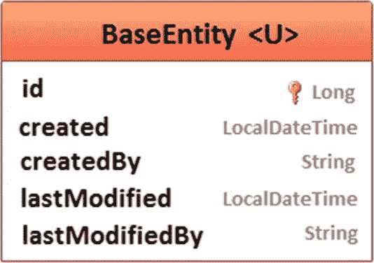

# 11.审计

## 第 88 项:如何跟踪创建和修改时间以及实体用户

此项说明如何添加自动生成的持久字段来跟踪创建和修改时间以及用户。审核对于维护记录的历史很有用。这可以帮助您跟踪用户活动。

让我们考虑这些持久字段的以下名称(可以随意修改这些名称):

*   `created:`将行插入数据库时的时间戳

*   `createdBy:`触发此行插入的当前登录用户

*   `lastModified:`该行上次更新的时间戳

*   `lastModifiedBy:`触发上次更新的当前登录用户

    默认情况下，时间戳将保存在本地时区，但让我们改为保存在 UTC(或 GMT)中。在 MySQL 中，用 UTC(或 GMT)存储时间戳可以分两步完成(参见 **Item 111** ):

*   将`useLegacyDatetimeCode=false`添加到 JDBC 网址

*   将`spring.jpa.properties.hibernate.jdbc.time_zone=UTC`添加到`application.properties`

通过 Spring Data JPA 审计或 Hibernate 支持，可以将这些自动生成的持久字段添加到实体中。在这两种情况下，这些字段都被添加到一个用`@MappedSuperclass`标注的`abstract`非实体类中(T1 指定一个类，它的映射信息被应用到从它继承的实体)。

我们把这个类命名为`BaseEntity`，如图 [11-1](#Fig1) 所示。



图 11-1

基本实体类图

实体可以通过扩展`BaseEntity`来继承这些字段。例如，让我们跟踪`Author`和`Book`实体的用户活动。

图 [11-2](#Fig2) 不言自明。


图 11-2

领域模型

现在，让我们通过 Spring Data JPA auditing 把它放到代码中。

### 依靠 Spring 数据 JPA 审计

Spring Data 提供了四个注释来实现这个目标。这些注释是`@CreatedBy`(对于`createdBy`字段)、`@CreatedDate`(对于`created`字段)、`@LastModifiedBy`(对于`lastModifiedBy`字段)和`@LastModifiedDate`(对于`lastModified`字段)。对字段进行相应的注释只是解决方案的一半。

另外，在`@MappedSuperclass`注释的旁边，`BaseEntity`要用`@EntityListeners({AuditingEntityListener.class})`注释。指定为监听器的类(`AuditingEntityListener`)是一个 Spring Data JPA 实体监听器类。它使用回调方法(用`@PrePersist`和`@PreUpdate`注释注释)来保存和更新`created`、`createdBy`、`lastModified`和`lastModifiedBy`字段。每当实体被持久化或更新时，都会发生这种情况。话虽如此，代码如下:

```java
@MappedSuperclass
@EntityListeners({AuditingEntityListener.class})
public abstract class BaseEntity<U> {

    @Id
    @GeneratedValue(strategy = GenerationType.IDENTITY)
    protected Long id;

    @CreatedDate
    protected LocalDateTime created;

    @CreatedBy
    protected U createdBy;

    @LastModifiedDate
    protected LocalDateTime lastModified;

    @LastModifiedBy
    protected U lastModifiedBy;
}

```

`Author`和`Book`扩展`BaseEntity`如下:

```java
@Entity
public class Author extends BaseEntity<String> implements Serializable {
    ...
}

@Entity
public class Book extends BaseEntity<String> implements Serializable {
    ...
}

```

但这还不是全部！此时，JPA 可以使用当前系统时间填充`created`和`lastModified`字段，但是它不能填充`createdBy`和`lastModifiedBy`。对于这个任务，JPA 需要知道当前登录的用户。换句话说，开发人员需要提供一个`AuditorAware`的实现，并覆盖`getCurrentAuditor()`方法。

当前登录的用户通过 Spring Security 在`getCurrentAuditor()`中获取。在这个例子中，有一个带有硬编码用户的虚拟实现，但是只要您已经有了 Spring 安全性，就应该很容易钩住真正的用户:

```java
public class AuditorAwareImpl implements AuditorAware<String> {

    @Override
    public Optional<String> getCurrentAuditor() {

        // use Spring Security to retrieve the currently logged-in user(s)
        return Optional.of(Arrays.asList("mark1990", "adrianm", "dan555")
            .get(new Random().nextInt(3)));
    }
}

```

最后一步是通过在配置类上指定`@EnableJpaAuditing`来启用 JPA 审计。`@EnableJpaAuditing`接受一个元素，`auditorAwareRef`。这个元素的值是`AuditorAware` bean 的名称:

```java
@SpringBootApplication
@EnableJpaAuditing(auditorAwareRef = "auditorAware")
public class MainApplication {
    ...
}

```

搞定了。查看“测试时间”部分，了解应用程序的快速运行和输出。完整的代码可以在 GitHub <sup>[1](#Fn1)</sup> 上找到。

### 依靠 Hibernate 支持

如果由于某种原因，这种方法不合适，您可以依赖 Hibernate 支持。

#### 创建的和最后修改的字段

对于`created`和`lastModified`字段，Hibernate 提供了两个内置注释(`@CreationTimestamp`和`@UpdateTimestamp`)，可以开箱即用。

`@CreationTimestamp`和`@UpdateTimestamp`都执行时间戳的内存生成(使用 VM 时间)。

`createdBy`和`lastModifiedBy`字段需要必须实现的注释，您很快就会看到。现在，让我们考虑一下`createdBy`的注释是`@CreatedBy`，而`lastModifiedBy`的注释是`@ModifiedBy`。将所有这些放在`BaseEntity`中会产生以下代码:

```java
import org.hibernate.annotations.CreationTimestamp;
import org.hibernate.annotations.UpdateTimestamp;
...
@MappedSuperclass
public abstract class BaseEntity<U> {

    @Id
    @GeneratedValue(strategy = GenerationType.IDENTITY)
    protected Long id;

    @CreationTimestamp
    protected LocalDateTime created;

    @UpdateTimestamp
    protected LocalDateTime lastModified;

    @CreatedBy
    protected U createdBy;

    @ModifiedBy
    protected U lastModifiedBy;
}

```

### “创建者”和“最后修改者”字段

对于`createdBy`和`lastModifiedBy`字段，没有 Hibernate 特有的内置注释。但是您可以通过 Hibernate 特有的`AnnotationValueGeneration`接口构建`@CreatedBy`和`@ModifiedBy`注释。该接口表示基于定制 Java 生成器注释类型的`ValueGeneration`，其中`ValueGeneration`描述属性值的生成。首先，让我们使用`@ValueGenerationType`定义`@CreatedBy`注释，如下所示:

```java
@ValueGenerationType(generatedBy = CreatedByValueGeneration.class)
@Retention(RetentionPolicy.RUNTIME)
public @interface CreatedBy {
}

```

然后是`@ModifiedBy`标注:

```java
@ValueGenerationType(generatedBy = ModifiedByValueGeneration.class)
@Retention(RetentionPolicy.RUNTIME)
public @interface ModifiedBy {
}

```

从 Hibernate 4.3 开始，通过`@ValueGenerationType`元注释，可以使用一种新的方法来声明生成的属性和定制生成器。`@Generated`注释已经被改进以使用`@ValueGenerationType`。

`CreatedByValueGeneration`类实现`AnnotationValueGeneration`并提供用户名的生成器(创建实体的用户)。这里列出了相关的代码(只有在实体第一次被持久化时，才应该生成这个时间戳；因此，将生成时间设置为`GenerationTiming.INSERT`):

```java
public class CreatedByValueGeneration
                implements AnnotationValueGeneration<CreatedBy> {

    private final ByValueGenerator generator
        = new ByValueGenerator(new UserService());
    ...
    @Override
    public GenerationTiming getGenerationTiming() {
        return GenerationTiming.INSERT;
    }

    @Override
    public ValueGenerator<?> getValueGenerator() {
        return generator;
    }
    ...
}

```

`ModifiedByValueGeneration`类实现`AnnotationValueGeneration`并提供用户名(修改实体的用户)的生成器。这里列出了相关的代码(这个时间戳应该在实体的每次更新时生成；因此，将生成时间设置为`GenerationTiming.ALWAYS`):

```java
public class ModifiedByValueGeneration
                    implements AnnotationValueGeneration<ModifiedBy> {

    private final ModifiedByValueGenerator generator
        = new ModifiedByValueGenerator(new UserService());
    ...
    @Override
    public GenerationTiming getGenerationTiming() {
        return GenerationTiming.ALWAYS;
    }

    @Override
    public ValueGenerator<?> getValueGenerator() {
        return generator;
    }
    ...
}

```

`CreatedByValueGeneration`和`ModifiedByValueGeneration`返回的`generator`为`ByValueGenerator`。这代表了`ValueGenerator`接口的简单实现。这个类的结果是`generateValue()`方法:

```java
public class ByValueGenerator implements ValueGenerator<String> {

    public final UserService userService;

    public ByValueGenerator(UserService userService) {
        this.userService = userService;
    }

    @Override
    public String generateValue(Session session, Object entity) {
        // Hook into a service to get the current user, etc.
        return userService.getCurrentUserName();
    }
}

```

`UserService`应该使用 Spring Security 通过`getCurrentUserName()`返回当前登录的用户。现在，让我们简单地使用一个虚拟实现:

```java
@Service
public class UserService {

    public String getCurrentUserName() {
        // use Spring Security to retrieve the currently logged-in user(s)
        return Arrays.asList("mark1990", "adrianm", "dan555")
            .get(new Random().nextInt(3));
    }
}

```

显然，您可以快速挂钩自己的处理登录用户的服务。

完整的代码可以在 GitHub <sup>[2](#Fn2)</sup> 上找到。

### 测试时间

这两种方法产生相同的 SQL 语句和结果；因此，下面的讨论涵盖了这两者。

保留作者会触发以下 SQL 语句:

```java
INSERT INTO author (created, created_by, last_modified,
                    last_modified_by, age, genre, name)
  VALUES (?, ?, ?, ?, ?, ?, ?)

```

保存一本书会触发以下 SQL 语句:

```java
INSERT INTO book (created, created_by, last_modified,
                  last_modified_by, author_id, isbn, title)
  VALUES (?, ?, ?, ?, ?, ?, ?)

```

更新作者会触发以下 SQL 语句:

```java
UPDATE author
SET created = ?,
    created_by = ?,
    last_modified = ?,
    last_modified_by = ?,
    age = ?,
    genre = ?,
    name = ?
WHERE id = ?

```

更新图书会触发以下 SQL 语句:

```java
UPDATE book
SET created = ?,
    created_by = ?,
    last_modified = ?,
    last_modified_by = ?,
    author_id = ?,
    isbn = ?,
    title = ?
WHERE id = ?

```

图 [11-3](#Fig3) 显示了`author`和`book`表的快照。注意`created`、`created_by`、`last_modified`和`last_modified_by`列。


图 11-3

来自作者和图书表的数据快照

## 项目 89:如何启用 Hibernate 特有的环境审计

**Item 88** 讲述了如何通过 Spring Data JPA 审计和 Hibernate 值生成器来跟踪实体的创建和修改时间以及用户。Hibernate ORM 有一个名为 Hibernate Envers 的模块，专门用于审计/版本控制实体类。在它的特性中，Hibernate Envers 为每个*修订版*提供审计、记录数据，以及查询实体及其关联的历史快照。

这一项重复了启用 Hibernate Envers 的最佳实践。但不是在将 Hibernate Envers 依赖项添加到`pom.xml`之前(对于 Maven):

```java
<dependency>
    <groupId>org.hibernate</groupId>
    <artifactId>hibernate-envers</artifactId>
</dependency>

```

Hibernate Envers 将 Java 架构用于 XML 绑定(JAXB)API；因此，如果您遇到这种类型的异常:

```java
 Caused by: javax.xml.bind.JAXBException: Implementation of JAXB-API has not been found on module path or classpath

```

这意味着还需要以下依赖关系:

```java
<dependency>
    <groupId>javax.xml.bind</groupId>
    <artifactId>jaxb-api</artifactId>
</dependency>
<dependency>
    <groupId>org.glassfish.jaxb</groupId>
    <artifactId>jaxb-runtime</artifactId>
</dependency>

```

### 审计实体

准备应该通过 Hibernate Envers 审计的实体是一项简单的任务，需要您在实体类级别添加`@Audited`注释。每个实体都在单独的数据库表中进行审计。要显式指定每个实体的审计表的名称，依赖于`@AuditTable`注释(默认情况下，该名称的类型是`entity` `_AUD`)。对于`Author`和`Book`实体，可以这样做:

```java
@Entity
@Audited
@AuditTable("author_audit")
public class Author implements Serializable {
    ...
}

@Entity
@Audited
@AuditTable("book_audit")
public class Book implements Serializable {
    ...
}

```

数据库模式显示了图 [11-4](#Fig4) 中的表格，包括`author_audit`表格。


图 11-4

作者 _ 审计表

*Revision*

是 Hibernate Envers 特有的术语。修改了被审计实体(`INSERT`、`UPDATE`或`DELETE`)的数据库事务。`revinfo`表(图 [11-4](#Fig4) 中的最后一个表)存储了*版本*号及其纪元时间戳。

`author_audit`(和`book_audit`)表存储某个版本的实体快照。`rev`列包含修订号。

`revtype`列值取自`RevisionType`枚举，其定义如下:

*   `0`(或`ADD`):插入了一个数据库表格行。

*   `1`(或`MOD`):更新了一个数据库表行。

*   `2`(或`DEL`):删除了一个数据库表行。

`revend`列保存审计实体中的最终修订号。仅当使用有效性审核策略时，此列才会显示。`ValidityAuditStrategy`稍后再讨论。

### 模式生成

除了实际的实体表之外，使用 Hibernate Envers 还需要一套表。只要将`spring.jpa.hibernate.ddl-auto`设置为将模式 DDL 导出到数据库中，就可以从 JPA 注释(例如`@Audited`和`@AuditedTable`)中生成这些表。这样的应用可以在 GitHub <sup>[3](#Fn3)</sup> 上找到。

但是，在生产中，依赖这种实践是一个坏主意。如果不需要自动模式迁移，那么`schema-*.sql`可以为您完成这项工作。否则，最好依靠 Flyway 或 Liquibase 之类的工具。

在这两种情况下，开发人员都需要 Envers 表的`CREATE TABLE`语句。在这种情况下，这些语句如下(注意，表的名称对应于通过`@AuditedTable`指定的名称):

```java
CREATE TABLE author_audit (
  id BIGINT(20) NOT NULL,
  rev INT(11) NOT NULL,
  revtype TINYINT(4) DEFAULT NULL,
  revend INT(11) DEFAULT NULL,
  age INT(11) DEFAULT NULL,
  genre VARCHAR(255) DEFAULT NULL,
  name VARCHAR(255) DEFAULT NULL,
  PRIMARY KEY (id,rev),
  KEY FKp4vbplw134mimnk3nlxfvmch0 (rev),
  KEY FKdtg6l7ccqhpsdnkltcoisi9l9 (revend));

CREATE TABLE book_audit (
  id BIGINT(20) NOT NULL,
  rev INT(11) NOT NULL,
  revtype TINYINT(4) DEFAULT NULL,
  revend INT(11) DEFAULT NULL,
  isbn VARCHAR(255) DEFAULT NULL,
  title VARCHAR(255) DEFAULT NULL,
  author_id BIGINT(20) DEFAULT NULL,
  PRIMARY KEY (id,rev),
  KEY FKjx5fxkthrd6kxbxb3ukwb04mf (rev),
  KEY FKr9ed64q1nek7vjfbcxm04v8ic (revend));

CREATE TABLE revinfo (
  rev INT(11) NOT NULL AUTO_INCREMENT,
  revtstmp BIGINT(20) DEFAULT NULL,
  PRIMARY KEY (rev));

```

如果 Envers 不能自动识别所使用的模式，那么模式名应该如下传递:

*   对于 MySQL: `spring.jpa.properties.org.hibernate.envers.default_catalog`

*   其他:`spring.jpa.properties.org.hibernate.envers.default_schema`

完整的代码可以在 GitHub <sup>[4](#Fn4)</sup> 上找到。

### 查询实体快照

Hibernate Envers 为查询实体快照提供了支持。起点由`AuditReaderFactory`表示，它是`AuditReader`对象的工厂。

您可以通过 JPA `EntityManager`或 Hibernate `Session`构建一个`AuditReader`，如下所示:

```java
EntityManager em;
...
// via EntityManager
AuditReader reader = AuditReaderFactory.get(em);

// via Session
AuditReader reader = AuditReaderFactory.get(em.unwrap(Session.class));

```

`AuditReader`是审计日志的一系列特性的入口点。在它的特性中，`AuditReader`允许您通过`createQuery()`方法查询审计日志。这里有两个例子:

*   获取在修订版 *#3* 中修改的所有`Book`实例:

*   获取所有被审计状态中的所有`Book`实例:

```java
List<Book> books = reader.createQuery()
    .forEntitiesAtRevision(Book.class, 3).getResultList();

```

```java
List<Book> books = reader.createQuery()
    .forRevisionsOfEntity(Book.class, true, true).getResultList();

```

我强烈建议您花些时间了解一下这个 API，因为它有太多的特性。尤其是当您需要更高级的查询时。

#### 有效性审计策略审计日志记录策略

默认情况下，Hibernate Envers 使用名为`DefaultAuditStrategy`的审计日志策略。让我们使用下面的查询(获取在修订版 *#3* 中修改的所有`Book`实例):

```java
List<Book> books = reader.createQuery()
    .forEntitiesAtRevision(Book.class, 3).getResultList();

```

幕后触发的`SELECT`如下:

```java
SELECT
  book_aud0_.id AS id1_3_,
  book_aud0_.rev AS rev2_3_,
  book_aud0_.revtype AS revtype3_3_,
  book_aud0_.isbn AS isbn4_3_,
  book_aud0_.title AS title5_3_,
  book_aud0_.author_id AS author_i6_3_
FROM book_audit book_aud0_
WHERE book_aud0_.rev =
  (
    SELECT MAX(book_aud1_.rev)
    FROM book_audit book_aud1_
    WHERE book_aud1_.rev <= ?
    AND book_aud0_.id = book_aud1_.id
  )
AND book_aud0_.revtype <> ?

```

很明显，这个查询的性能不是很好，尤其是当审计日志很大时(查看`SELECT`子查询)。

但是`DefaultAuditStrategy`只是`AuditStrategy`的实现之一。另一个是`ValidityAuditStrategy`。您可以使用`application.properties`在 Spring Boot 应用程序中启用该策略，如下所示:

```java
spring.jpa.properties.org.hibernate.envers.audit_strategy
    =org.hibernate.envers.strategy.ValidityAuditStrategy

```

在 Hibernate 版之前，正确的值是`org.hibernate.envers.strategy.internal.ValidityAuditStrategy`。

一旦`ValidityAuditStrategy`被启用，您可以再次尝试相同的查询。这一次，SQL 语句更加高效:

```java
SELECT
  book_aud0_.id AS id1_3_,
  book_aud0_.rev AS rev2_3_,
  book_aud0_.revtype AS revtype3_3_,
  book_aud0_.revend AS revend4_3_,
  book_aud0_.isbn AS isbn5_3_,
  book_aud0_.title AS title6_3_,
  book_aud0_.author_id AS author_i7_3_
FROM book_audit book_aud0_
WHERE book_aud0_.rev <= ?
AND book_aud0_.revtype <> ?
AND (book_aud0_.revend > ?
OR book_aud0_.revend IS NULL)

```

这次，没有`SELECT`子查询！很好！此外，这可以通过为`revend`和`rev`列添加一个索引来改进。通过这种方式，避免了顺序扫描，Envers 变得更加高效。然而，`revend`列仅在您使用`ValidityAuditStrategy`时出现，并且它引用了`revinfo`表。其目的是标记该实体快照仍然有效的最后一次修订。

请记住，`ValidityAuditStrategy`非常擅长快速实体快照抓取，但是在保存数据库中的实体状态时，它的性能比`DefaultAuditStrategy`差。通常在写作过程中花费额外的时间和更快的阅读速度是值得的，但这不是一个普遍的规则。如果你需要的话，选择`DefaultAuditStrategy`并没有错。

## 项目 90:如何检查持久性上下文

你有没有想过持久性上下文中有什么？或者某个实体或集合是否在当前的持久化上下文中？您可以通过`org.hibernate.engine.spi.PersistenceContext`检查 Hibernate 持久性上下文。首先，一个帮助器方法利用`SharedSessionContractImplementor`来获取`PersistenceContext`，如下所示:

```java
@PersistenceContext
private final EntityManager entityManager;
...
private org.hibernate.engine.spi.PersistenceContext getPersistenceContext() {

    SharedSessionContractImplementor sharedSession = entityManager.unwrap(
        SharedSessionContractImplementor.class
    );

    return sharedSession.getPersistenceContext();
}

```

此外，`PersistenceContext`提供了大量添加、删除和检查其内容的方法。例如，以下方法显示了受管实体的总数及其相关信息，包括它们的状态和水合状态:

```java
private void briefOverviewOfPersistentContextContent() {

    org.hibernate.engine.spi.PersistenceContext persistenceContext
        = getPersistenceContext();

    int managedEntities
        = persistenceContext.getNumberOfManagedEntities();
    int collectionEntriesSize
        = persistenceContext.getCollectionEntriesSize();

    System.out.println("Total number of managed entities: "
        + managedEntities);
    System.out.println("Total number of collection entries: "
        + collectionEntriesSize);

    // getEntitiesByKey() will be removed and probably replaced
    // with #iterateEntities()
    Map<EntityKey, Object> entitiesByKey
        = persistenceContext.getEntitiesByKey();

    if (!entitiesByKey.isEmpty()) {
        System.out.println("\nEntities by key:");
        entitiesByKey.forEach((key, value) -> System.out.println(key
            + ": " + value));

        System.out.println("\nStatus and hydrated state:");
        for (Object entry : entitiesByKey.values()) {
            EntityEntry ee = persistenceContext.getEntry(entry);
            System.out.println(
                "Entity name: " + ee.getEntityName()
                    + " | Status: " + ee.getStatus()
                    + " | State: " + Arrays.toString(ee.getLoadedState()));
        }
    }

    if (collectionEntriesSize > 0) {
        System.out.println("\nCollection entries:");
        persistenceContext.forEachCollectionEntry(
            (k, v) -> System.out.println("Key:" + k
                + ", Value:" + (v.getRole() == null ? "" : v)), false);
    }
}

```

让我们看看双向懒惰`@OneToMany`关联中的`Author`和`Book`实体。以下服务方法:

*   找到一个作者

*   获取相关书籍

*   删除作者和相关书籍

*   用一本书创建一个新作者

在每个操作之后，执行`briefOverviewOfPersistentContextContent()`方法调用:

```java
@Transactional
public void sqlOperations() {

    briefOverviewOfPersistentContextContent();

    Author author = authorRepository.findByName("Joana Nimar");
    briefOverviewOfPersistentContextContent();

    author.getBooks().get(0).setIsbn("not available");
    briefOverviewOfPersistentContextContent();

    authorRepository.delete(author);
    authorRepository.flush();
    briefOverviewOfPersistentContextContent();

    Author newAuthor = new Author();
    newAuthor.setName("Alicia Tom");
    newAuthor.setAge(38);
    newAuthor.setGenre("Anthology");

    Book book = new Book();
    book.setIsbn("001-AT");
    book.setTitle("The book of swords");

    newAuthor.addBook(book); // use addBook() helper

    authorRepository.saveAndFlush(newAuthor);
    briefOverviewOfPersistentContextContent();
}

```

调用`sqlOperations()`输出:

最初，持久性上下文为空:

```java
Total number of managed entities: 0
Total number of collection entities: 0

```

在*的`SELECT`被触发后，乔安娜·尼玛尔*:

```java
Total number of managed entities: 1
Total number of collection entries: 1

Entities by key:
EntityKey[com.bookstore.entity.Author#4]:
    Author{id=4, name=Joana Nimar, genre=History, age=34}

Status and hydrated state (because we required the hydrated state, Hibernate will trigger a SELECT to fetch the books of this author):
Entity name: com.bookstore.entity.Author
    | Status: MANAGED
    | State: [34, [Book{id=1, title=A History of Ancient Prague,
                isbn=001-JN}, Book{id=2, title=A People's History,
                isbn=002-JN}], History, Joana Nimar]

Collection entries:
Key:[Book{id=1, title=A History of Ancient Prague, isbn=001-JN}, Book{id=2, title=A People's History, isbn=002-JN}], Value:CollectionEntry[com.bookstore.entity.Author.books#4]

```

在针对*乔安娜·尼玛尔*的图书的`SELECT`语句被触发后(有两本书):

```java
Total number of managed entities: 3
Total number of collection entries: 1

Entities by key:
EntityKey[com.bookstore.entity.Book#2]:
    Book{id=2, title=A People's History, isbn=002-JN}
EntityKey[com.bookstore.entity.Author#4]:
    Author{id=4, name=Joana Nimar, genre=History, age=34}
EntityKey[com.bookstore.entity.Book#1]:
    Book{id=1, title=A History of Ancient Prague, isbn=not available}

Status and hydrated state:
Entity name: com.bookstore.entity.Book
    | Status: MANAGED
    | State: [Author{id=4, name=Joana Nimar, genre=History, age=34},
                002-JN, A People's History]

Entity name: com.bookstore.entity.Author
    | Status: MANAGED
    | State: [34, [Book{id=1, title=A History of Ancient Prague,
                isbn=not available}, Book{id=2, title=A People's History,
                isbn=002-JN}], History, Joana Nimar]

Entity name: com.bookstore.entity.Book
    | Status: MANAGED
    | State: [Author{id=4, name=Joana Nimar, genre=History, age=34},
                001-JN, A History of Ancient Prague]

Collection entries:
Key:[Book{id=1, title=A History of Ancient Prague, isbn=not available}, Book{id=2, title=A People's History, isbn=002-JN}], Value:CollectionEntry[com.bookstore.entity.Author.books#4]

```

在作者和相关书籍的`DELETE`语句被触发后:

```java
Total number of managed entities: 0
Total number of collection entities: 0

```

在持续新作者和他们的书的`INSERT`语句被触发后:

```java
Total number of managed entities: 2
Total number of collection entries: 1

Entities by key:
EntityKey[com.bookstore.entity.Book#5]:
    Book{id=5, title=The book of swords, isbn=001-AT}
EntityKey[com.bookstore.entity.Author#5]:
    Author{id=5, name=Alicia Tom, genre=Anthology, age=38}

Status and hydrated state:
Entity name: com.bookstore.entity.Book
    | Status: MANAGED
    | State: [Author{id=5, name=Alicia Tom, genre=Anthology, age=38},
                001-AT, The book of swords]

Entity name: com.bookstore.entity.Author
    | Status: MANAGED
    | State: [38, [Book{id=5, title=The book of swords,
                isbn=001-AT}], Anthology, Alicia Tom]

Collection entries:
Key:[Book{id=5, title=The book of swords, isbn=001-AT}], Value:CollectionEntry[com.bookstore.entity.Author.books#5]
    ->[com.bookstore.entity.Author.books#5]

```

这只是一个让你熟悉`PersistenceContext` API 的例子。仔细阅读文档以发现更多有用的方法。

完整的应用程序可在 GitHub <sup>[5](#Fn5)</sup> 上获得。

## 项目 91:如何提取表元数据

您可以通过 Hibernate SPI，`org.hibernate.integrator.spi.Integrator`提取表元数据(或者一般来说，数据库元数据)。实现`Integrator`包括覆盖`integrate()`方法并返回`metadata.getDatabase()`，如下所示:

```java
public class DatabaseTableMetadataExtractor
            implements org.hibernate.integrator.spi.Integrator {

    public static final DatabaseTableMetadataExtractor EXTRACTOR
        = new DatabaseTableMetadataExtractor();

    private Database database;

    // this method will be deprecated starting with Hibernate 6.0
    @Override
    public void integrate(
        Metadata metadata,
        SessionFactoryImplementor sessionImplementor,
        SessionFactoryServiceRegistry serviceRegistry) {

        database = metadata.getDatabase();
    }

    @Override
    public void disintegrate(
        SessionFactoryImplementor sessionImplementor,
        SessionFactoryServiceRegistry serviceRegistry) {
    }

    public Database getDatabase() {
        return database;
    }
}

```

接下来，通过`LocalContainerEntityManagerFactoryBean`注册该`Integrator`，如下所示:

```java
@Configuration
@EnableJpaRepositories(
    entityManagerFactoryRef = "entityManagerFactory",
    transactionManagerRef = "transactionManager",
    basePackages = "com.bookstore.*"
)
@EnableTransactionManagement
public class EntityManagerFactoryConfig {

    @Bean
    @Primary
    public LocalContainerEntityManagerFactoryBean entityManagerFactory(
            EntityManagerFactoryBuilder builder, DataSource dataSource) {

        return builder
            .dataSource(dataSource)
            .packages(packagesToScan())
            .persistenceUnit("ds-pu")
            .properties(hibernateProperties())
            .build();
    }

    @Bean
    @Primary
    public PlatformTransactionManager transactionManager(
            @Qualifier("entityManagerFactory") EntityManagerFactory                             entityManagerFactory) {

        return new JpaTransactionManager(entityManagerFactory);
    }

    protected String[] packagesToScan() {
        return new String[]{
            "com.bookstore.*"
        };
    }

    protected Map<String, Object> hibernateProperties() {
        return new HashMap<String, Object>() {
            {
                put("hibernate.dialect",
                    "org.hibernate.dialect.MySQL5Dialect");
                put("hibernate.hbm2ddl.auto", "create");
                put("hibernate.integrator_provider",
                    (IntegratorProvider) () -> Collections.singletonList(
                        DatabaseTableMetadataExtractor.EXTRACTOR
                    ));
            }
        };
    }
}

```

搞定了。现在，让我们使用图 [11-5](#Fig5) 所示的领域模型。


图 11-5

领域模型

您可以提取并显示映射表的元数据，如下所示(每个实体类有一个映射表):

```java
public void extractTablesMetadata() {
    for (Namespace namespace :
                DatabaseTableMetadataExtractor.EXTRACTOR
                    .getDatabase()
                    .getNamespaces()) {

        namespace.getTables().forEach(this::displayTablesMetdata);
    }
}

private void displayTablesMetdata(Table table) {

    System.out.println("\nTable: " + table);
    Iterator it = table.getColumnIterator();
    while (it.hasNext()) {
        System.out.println(it.next());
    }
}

```

调用`extractTablesMetadata()`将产生以下输出:

```java
Table: org.hibernate.mapping.Table(Author)
org.hibernate.mapping.Column(id)
org.hibernate.mapping.Column(age)
org.hibernate.mapping.Column(genre)
org.hibernate.mapping.Column(name)

Table: org.hibernate.mapping.Table(Book)
org.hibernate.mapping.Column(id)
org.hibernate.mapping.Column(isbn)
org.hibernate.mapping.Column(title)
org.hibernate.mapping.Column(author_id)

Table: org.hibernate.mapping.Table(Ebook)
org.hibernate.mapping.Column(format)
org.hibernate.mapping.Column(ebook_book_id)

Table: org.hibernate.mapping.Table(Paperback)
org.hibernate.mapping.Column(sizeIn)
org.hibernate.mapping.Column(weightLbs)
org.hibernate.mapping.Column(paperback_book_id)

```

完整的应用程序可在 GitHub <sup>[6](#Fn6)</sup> 上获得。

<aside aria-label="Footnotes" class="FootnoteSection" epub:type="footnotes">Footnotes [1](#Fn1_source)

[hibernate pringb booth audit](https://github.com/AnghelLeonard/Hibernate-SpringBoot/tree/master/HibernateSpringBootAudit)

  [2](#Fn2_source)

[hibernate pringb ottime tampon 配给](https://github.com/AnghelLeonard/Hibernate-SpringBoot/tree/master/HibernateSpringBootTimestampGeneration)

  [3](#Fn3_source)

[hibernate pringb ooten vs](https://github.com/AnghelLeonard/Hibernate-SpringBoot/tree/master/HibernateSpringBootEnvers)

  [4](#Fn4_source)

[hibernate pringb 欧顿方案 ql](https://github.com/AnghelLeonard/Hibernate-SpringBoot/tree/master/HibernateSpringBootEnversSchemaSql)

  [5](#Fn5_source)

[hibernate pringb oostinspection persistent tencontext](https://github.com/AnghelLeonard/Hibernate-SpringBoot/tree/master/HibernateSpringBootInspectPersistentContext)

  [6](#Fn6_source)

[hibernate pringb boottablestop a](https://github.com/AnghelLeonard/Hibernate-SpringBoot/tree/master/HibernateSpringBootTablesMetadata)

 </aside>