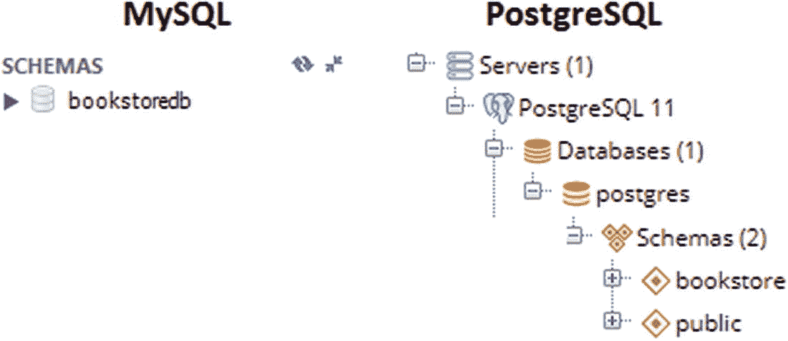

# 12.计划

## 第 92 项:如何在 Spring Boot 设立飞行通道

对于生产来说，不要依赖`hibernate.ddl-auto`(或对应方)将模式 DDL 导出到数据库。只需移除(禁用)`hibernate.ddl-auto`或将其设置为`validate`，并依靠 Flyway 或 Liquibase。本文介绍了将 Flyway 设置为 Spring Boot 数据库迁移工具的几个方面。

本节包含 MySQL 和 PostgreSQL 的应用。

在这种情况下，重要的是要知道术语*数据库*、*模式、*和*目录*在 MySQL 中表示相同的东西，而在 PostgreSQL 中，一个*数据库*与一个*目录*相同，并且可以有多个*模式*(两个同名的表可以位于同一个*数据库*中，但位于不同的*模式*)。

### 最快的 Flyway 设置(MySQL 和 PostgreSQL)

通过向项目添加一个 Flyway 依赖项，可以实现具有默认设置的最快设置。对于 Maven，将`pom.xml`添加到以下依赖项中:

```java
<dependency>
    <groupId>org.flywaydb</groupId>
    <artifactId>flyway-core</artifactId>
</dependency>

```

Spring Boot 有一种国旗叫做`spring.flyway.enabled`。该标志位默认设置为`true`；因此，当 Spring Boot 获得关于 Flyway 存在的确认时，它将依赖 Flyway 的默认设置来迁移数据库。

默认情况下，Spring Boot 在`classpath:db/migration`路径中查找 SQL 文件(可通过`spring.flyway.locations`配置)。文件名称应遵循飞行路线命名惯例(如`V1.1__` `Description` `.sql`)。此外，开发人员可以在该位置添加 Flyway 回调对应的 SQL 文件(如`afterMigrate.sql`、`beforeClean.sql`等)。).将相应地考虑这些文件。

GitHub <sup>[1](#Fn1)</sup> 上有一个使用 Flyway 和 MySQL 的启动应用。

MySQL 数据库是通过 JDBC URL 的特定参数`createDatabaseIfNotExist=true`创建的。Flyway 将连接到 JDBC URL 中的这个数据库，并对其运行 SQL 文件。

而且在 GitHub <sup>[2](#Fn2)</sup> 上也有使用 Flyway 和 PostgreSQL 的启动应用。

这个应用依赖于默认的`postgres`数据库和一个`public`模式。SQL 文件根据该模式执行。

如果`CREATE TABLE`中使用的表名与实体名不同(例如对于`Author`实体，表名应该是`author`)，您必须使用`@Table(name="` `table name` `")`来指示 JPA 相应的表。例如，对于名为`author_history`的表，实体名称应该是`AuthorHistory`，或者在实体级别将`@Table`指定为`@Table(name="author_history")`。

### 指示 Flyway 创建数据库

这一次，您将指示 Flyway 代表您创建 MySQL 数据库。

Flyway 不是为创建数据库而设计的(例如，执行`CREATE DATABASE`语句)。它被设计为连接到一个现有的(空的或非空的)数据库，并且一旦连接建立，就对这个数据库执行所有给定的脚本。然而，Flyway 可以通过`CREATE SCHEMA`创建模式。

主要是，可以通过`spring.flyway.schemas`设置指示 Flyway 更新模式。如果有多个模式，它们的名称应该用逗号分隔。如果模式不存在，Flyway 将自动创建它们。

#### 关系型数据库

在 MySQL 中， *schema* 相当于*数据库*；因此，Flyway 可以创建一个 MySQL 数据库。完成这项任务需要三个步骤:

*   从 JDBC URL 中删除数据库名称:

*   通过`spring.flyway.schemas`指示 Flyway 更新(并且，因为它不存在，所以创建)数据库:

```java
spring.datasource.url=jdbc:mysql://localhost:3306/

```

*   通知实体数据库名称，如下例所示:

```java
spring.flyway.schemas=bookstoredb

```

```java
@Entity
@Table(schema = "bookstoredb") // or @Table(catalog = "bookstoredb")
public class Author implements Serializable {
    ...
}

```

搞定了。现在，Flyway 将代表您创建`bookstoredb`数据库。

完整的应用可在 GitHub <sup>[3](#Fn3)</sup> 上获得。

#### 一种数据库系统

与 MySQL 相比，PostgreSQL 的情况有所不同，因为一个 PostgreSQL 数据库可以有多个模式。这一次，创建模式不会导致创建数据库。它会导致创建一个模式。

在 PostgreSQL 中，连接总是指向某个数据库。切换到另一个数据库需要新的连接。Flyway 连接到一个现有的数据库，`CREATE SCHEMA`(通过`spring.flyway.schemas`触发)将在这个数据库中创建一个模式。

实现此行为的步骤如下:

*   在 JDBC URL 中指定要连接的数据库(例如，方便的默认`postgres`数据库或您自己的数据库)

*   通过`spring.flyway.schemas`指示 Flyway 更新(并且，因为它不存在，所以创建)数据库:

```java
spring.datasource.url=jdbc:postgresql://localhost:5432/postgres

```

*   通知实体数据库名称，如下例所示:

```java
spring.flyway.schemas=bookstore

```

```java
@Entity
@Table(schema = "bookstore")
public class Author implements Serializable {
    ...
}

```

搞定了。现在 Flyway 将代表您创建`bookstore`模式。完整的应用可在 GitHub <sup>[4](#Fn4)</sup> 上获得。

结果对比如图 [12-1](#Fig1) 所示。



图 12-1

MySQL 和 PostgreSQL 中的模式

### 通过@FlywayDataSource 设置 Flyway

Flyway 可以通过前缀为`spring.flyway.*`的 Spring Boot 属性进行配置，并放在`application.properties`文件中。另一种方法是使用`@FlywayDataSource`注释和 Flyway-fluent API。

在这种情况下，`DataSource`很可能也是以编程方式配置的；因此，我们来考虑下面的 MySQL `DataSource`(更多详情在**第 86 项**):

```java
@Bean(name = "dataSource")
public HikariDataSource dataSource() {

    HikariDataSource hds = new HikariDataSource();
           hds.setJdbcUrl("jdbc:mysql://localhost:3306/bookstoredb
                                    ?createDatabaseIfNotExist=true");

    hds.setUsername("root");
    hds.setPassword("root");
    hds.setConnectionTimeout(50000);
    hds.setIdleTimeout(300000);
    hds.setMaxLifetime(900000);
    hds.setMaximumPoolSize(8);
    hds.setMinimumIdle(8);
    hds.setPoolName("MyPool");
    hds.setConnectionTestQuery("select 1 from dual");
    hds.setAutoCommit(false);

    return hds;
}

```

接下来，必须将这个`DataSource`传递给 Flyway。为此，您定义一个方法，该方法接收`DataSource`作为参数，用`@FlywayDataSource`对其进行注释，并如下实现它:

```java
@FlywayDataSource
@Bean(initMethod = "migrate")
public Flyway flyway(@Qualifier("dataSource")
       HikariDataSource dataSource) {

    return Flyway.configure()
        .dataSource(dataSource)
        .locations("classpath:db/migration") // this path is default
        .load();
}

```

Flyway 将连接到在`dataSource`的 JDBC URL 中找到的数据库，并对其运行来自`classpath:db/migration`的 SQL 文件。

请随意探索 fluent API，看看可以定制哪些设置。

在 GitHub 上可以找到 MySQL <sup>[5](#Fn5)</sup> 和 PostgreSQL <sup>[6](#Fn6)</sup> 的完整应用。

### 飞行路线和多模式

可以设置 Flyway 来迁移同一供应商或不同供应商的多个模式。对于这样的例子，请考虑:

*   在 MySQL <sup>[7](#Fn7)</sup> 中自动创建和迁移两个数据库

*   在 PostgreSQL <sup>[8](#Fn8)</sup> 中自动创建并迁移两个数据库

*   自动创建和迁移两个`DataSource`(MySQL 和 PostgreSQL) <sup>[9](#Fn9)</sup>

## 第 93 项:如何通过 schema-*生成两个数据库。sql 并将实体与它们匹配

对于生产来说，不要依赖`hibernate.ddl-auto`(或对应方)将模式 DDL 导出到数据库。只需移除(禁用)`hibernate.ddl-auto`或将其设置为`validate`并依靠`schema-*.sql`，或者，对于生产，依靠 Flyway ( **Item 92** )或 Liquibase。

依靠`schema-*.sql`有助于避免从 JPA 注释生成模式。但是，它没有版本，所以不支持模式迁移。在`schema-*.sql`中，开发人员可以调用应用每次运行时将执行的 SQL 语句。

例如，下面的`schema-mysql.sql`包含特定于 MySQL 的 DDL 语句，用于创建两个数据库和两个表(`authorsdb`数据库中的`author`表和`booksdb`数据库中的`book`表):

```java
CREATE DATABASE IF NOT EXISTS authorsdb;

CREATE TABLE IF NOT EXISTS authorsdb.author
  (
     id BIGINT(20) NOT NULL auto_increment,
     age INT(11) NOT NULL,
     genre VARCHAR(255) DEFAULT NULL,
     name VARCHAR(255) DEFAULT NULL,
     PRIMARY KEY (id)
  );

CREATE DATABASE IF NOT EXISTS booksdb;

CREATE TABLE IF NOT EXISTS booksdb.book
  (
     id BIGINT(20) NOT NULL auto_increment,
     isbn VARCHAR(255) DEFAULT NULL,
     title VARCHAR(255) DEFAULT NULL,
     PRIMARY KEY (id)
  );

```

要指示 Spring Boot 执行来自`schema-mysql.sql`的 DDL 语句，只需将`application.properties`添加到以下设置中:

```java
spring.datasource.initialization-mode=always
spring.datasource.platform=mysql

```

`spring.datasource.initialization-mode`的可能值有`always`、`embedded`和`never`。虽然`always`和`never`非常清楚，但是`embedded`值(这是默认值)指示 Spring Boot 只有在依赖嵌入式数据库(例如 H2)时才初始化模式。

此外，在`application.properties`中，在没有显式数据库的情况下设置 JDBC URL:

```java
spring.datasource.url=jdbc:mysql://localhost:3306

```

此外，`Author`实体应该被显式地映射到`authorsdb.author`表，而`Book`实体应该被映射到`booksdb.book`表。为此，用`@Table(schema="authorsdb")`标注`Author`实体，用`@Table(schema="booksdb")`标注`Book`实体:

```java
@Entity
@Table(schema="authorsdb")
public class Author implements Serializable {
    ...
}

@Entity
@Table(schema="booksdb")
public class Book implements Serializable {
    ...
}

```

仅此而已！现在，您可以像往常一样使用`AuthorRepository`和`BookRepository`。来自`AuthorRepository`的查询方法将针对`authorsdb`触发，而来自`BookRepository`的查询方法将针对`booksdb`触发。

GitHub <sup>[10](#Fn10)</sup> 上有完整的应用。

如果您想通过 Hibernate 导入 SQL 脚本文件，那么您必须使用`hibernate.hbm2ddl.import_files`属性。简单地传递要加载的文件作为这个属性的值。或者，您可以通过 JPA 2.1 模式生成特性来实现。要加载脚本，只需使用`javax.persistence.sql-load-script-source`属性。GitHub <sup>[11](#Fn11)</sup> 上有完整的例子。

<aside aria-label="Footnotes" class="FootnoteSection" epub:type="footnotes">Footnotes [1](#Fn1_source)

[hibernate pringb ooflywaymysqlqu ick](https://github.com/AnghelLeonard/Hibernate-SpringBoot/tree/master/HibernateSpringBootFlywayMySQLQuick)

  [2](#Fn2_source)

[hibernate pringb 欧塔佛莱迪·SQL quick](https://github.com/AnghelLeonard/Hibernate-SpringBoot/tree/master/HibernateSpringBootFlywayPostgreSQLQuick)

  [3](#Fn3_source)

[hibernate pringb otflywaymysqlda tabase](https://github.com/AnghelLeonard/Hibernate-SpringBoot/tree/master/HibernateSpringBootFlywayMySQLDatabase)

  [4](#Fn4_source)

[hibernate pringb 欧塔佛莱迪耶 SqlSchema](https://github.com/AnghelLeonard/Hibernate-SpringBoot/tree/master/HibernateSpringBootFlywayPostgreSqlSchema)

  [5](#Fn5_source)

[hibernate pringb 欧塔 FlywayMySQLPr og](https://github.com/AnghelLeonard/Hibernate-SpringBoot/tree/master/HibernateSpringBootFlywayMySQLProg)

  [6](#Fn6_source)

[hibernate pringb otflywayposter SQL rog](https://github.com/AnghelLeonard/Hibernate-SpringBoot/tree/master/HibernateSpringBootFlywayPostgreSQLProg)

  [7](#Fn7_source)

[hibernate pringb otflywaymysqltw o tabases](https://github.com/AnghelLeonard/Hibernate-SpringBoot/tree/master/HibernateSpringBootFlywayMySQLTwoDatabases)

  [8](#Fn8_source)

[hibernate pringb 欧塔佛莱迪耶 SqlTwoSchemas](https://github.com/AnghelLeonard/Hibernate-SpringBoot/tree/master/HibernateSpringBootFlywayPostgreSqlTwoSchemas)

  [9](#Fn9_source)

[hibernate pringb otflywaytwo vendors](https://github.com/AnghelLeonard/Hibernate-SpringBoot/tree/master/HibernateSpringBootFlywayTwoVendors)

  [10](#Fn10_source)

[hibernate pringb oomatchentities totable totable as](https://github.com/AnghelLeonard/Hibernate-SpringBoot/tree/master/HibernateSpringBootMatchEntitiesToTablesTwoSchemas)

  [11](#Fn11_source)

[hibernate pringb oostschema generation ion](https://github.com/AnghelLeonard/Hibernate-SpringBoot/tree/master/HibernateSpringBootSchemaGeneration)

 </aside>