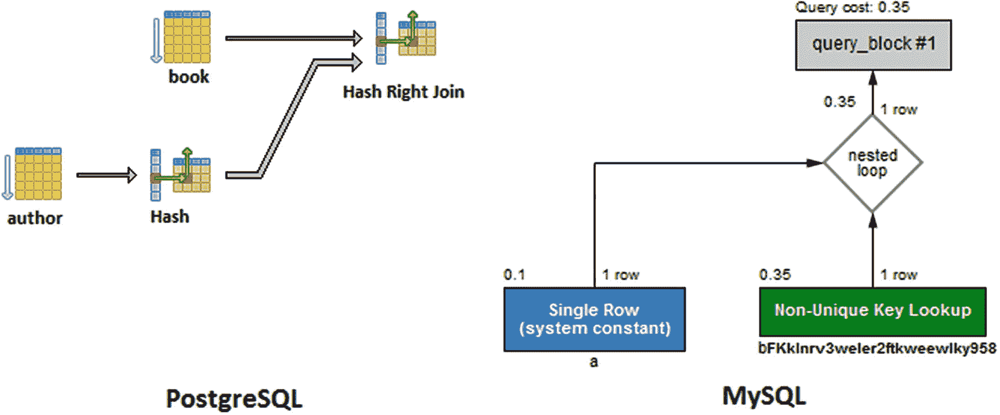
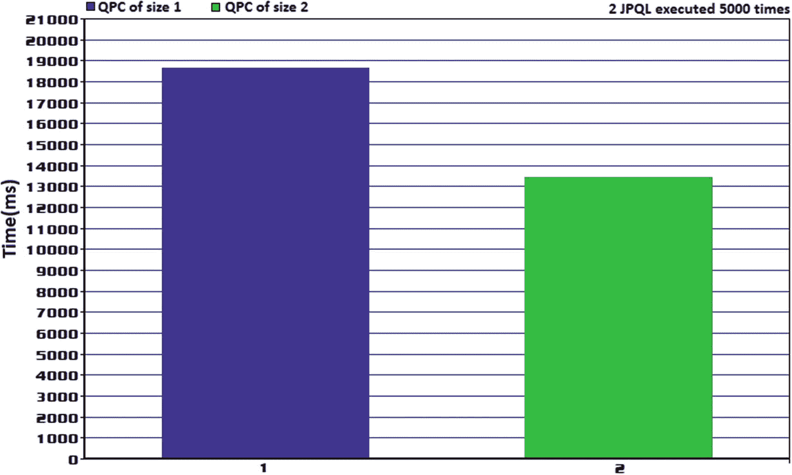

# 14.问题

## 第 103 项:如何通过特定于 Hibernate 的 HINT_PASS_DISTINCT_THROUGH 优化 SELECT DISTINCT

考虑双向惰性一对多关联中涉及的`Author`和`Book`实体。数据快照如图 [14-1](#Fig1) (有一个作者写了两本书)。


图 14-1

数据快照(提示传递不同传递)

此外，让我们获取`Author`实体及其所有`Book`子实体的列表。事实上，SQL 级结果集的大小是由从`book`表中提取的行数决定的。这会导致`Author`重复(对象引用重复)。考虑以下查询:

```java
@Repository
@Transactional(readOnly = true)
public interface AuthorRepository extends JpaRepository<Author, Long> {

    @Query("SELECT a FROM Author a LEFT JOIN FETCH a.books")
    List<Author> fetchWithDuplicates();
}

```

调用`fetchWithDuplicates()`将触发下面的 SQL:

```java
SELECT
  author0_.id AS id1_0_0_,
  books1_.id AS id1_1_1_,
  author0_.age AS age2_0_0_,
  author0_.genre AS genre3_0_0_,
  author0_.name AS name4_0_0_,
  books1_.author_id AS author_i4_1_1_,
  books1_.isbn AS isbn2_1_1_,
  books1_.title AS title3_1_1_,
  books1_.author_id AS author_i4_1_0__,
  books1_.id AS id1_1_0__
FROM author author0_
LEFT OUTER JOIN book books1_
  ON author0_.id = books1_.author_id

```

获取的`List<Author>`包含两个相同的条目:

```java
List<Author> authors = authorRepository.fetchWithDuplicates();

authors.forEach(a -> {
    System.out.println("Id: " + a.getId()
        + ": Name: " + a.getName() + " Books: " + a.getBooks());
});

```

以下是输出结果:

```java
Id: 1: Name: Joana Nimar Books: [Book{id=1, title=A History of Ancient Prague, isbn=001-JN}, Book{id=2, title=A People's History, isbn=002-JN}]

Id: 1: Name: Joana Nimar Books: [Book{id=1, title=A History of Ancient Prague, isbn=001-JN}, Book{id=2, title=A People's History, isbn=002-JN}]

```

为了便于记录，让我们看看 PostgreSQL(左侧)和 MySQL(右侧)的执行计划，如图 [14-2](#Fig2) 所示。



图 14-2

PostgreSQL 和 MySQL 执行计划没有明确的

所以，获取的`List<Author>`包含了同一个`Author`实体对象的两个引用。想象一个多产的作者写了 20 本书。拥有同一个`Author`实体的 20 个引用是一种性能损失，您可能(不想)承受得起。

为什么会有重复的？因为 Hibernate 只是返回通过左外部连接获取的结果集。如果有五个作者，每个作者有三本书，结果集将有 5 x 3 = 15 行。因此，`List<Author>`将有 15 个元素，都是类型`Author`。尽管如此，Hibernate 将只创建五个实例，但是重复的实例将作为对这五个实例的重复引用保存下来。因此，Java 堆上有 5 个实例和 10 个对它们的引用。

一种解决方法是使用如下的`DISTINCT`关键字:

```java
@Repository
@Transactional(readOnly = true)
public interface AuthorRepository extends JpaRepository<Author, Long> {

    @Query("SELECT DISTINCT a FROM Author a LEFT JOIN FETCH a.books")
    List<Author> fetchWithoutHint();
}

```

调用`fetchWithoutHint()`将触发下面的 SQL 语句(注意 SQL 查询中出现的`DISTINCT`关键字):

```java
SELECT DISTINCT
  author0_.id AS id1_0_0_,
  books1_.id AS id1_1_1_,
  author0_.age AS age2_0_0_,
  author0_.genre AS genre3_0_0_,
  author0_.name AS name4_0_0_,
  books1_.author_id AS author_i4_1_1_,
  books1_.isbn AS isbn2_1_1_,
  books1_.title AS title3_1_1_,
  books1_.author_id AS author_i4_1_0__,
  books1_.id AS id1_1_0__
FROM author author0_
LEFT OUTER JOIN book books1_
  ON author0_.id = books1_.author_id

```

在 JPQL 中，`DISTINCT`关键字的目的是避免在`JOIN FETCH`使用带有子关联的父实体时返回相同的父实体。必须从查询结果中消除重复值。

检查输出确认副本已从`List<Author>`中移除:

```java
Id: 1: Name: Joana Nimar Books: [Book{id=1, title=A History of Ancient Prague, isbn=001-JN}, Book{id=2, title=A People's History, isbn=002-JN}]

```

但是问题在于，`DISTINCT`关键字也被传递给了数据库(检查触发的 SQL 语句)。现在，让我们再次看看 PostgreSQL(左侧)和 MySQL(右侧)的执行计划，如图 [14-3](#Fig3) 所示。


图 14-3

具有不同的 PostgreSQL 和 MySQL 执行计划

即使结果集包含唯一的父子记录(在 JDBC 结果集中没有重复的条目)，所选择的执行计划也会受到`DISTINCT`的影响。PostgreSQL 执行计划使用一个 *HashAggregate* 阶段来删除重复项，而 MySQL 添加了一个临时表来删除重复项。这是不必要的开销。此外，大多数数据库实际上会自动过滤重复记录。

换句话说，只有当您确实需要从结果集中过滤出重复的记录时，`DISTINCT`才应该被传递给数据库。

此问题已在 HHH-10965 <sup>[1](#Fn1)</sup> 中解决，并在`QueryHints.HINT_PASS_DISTINCT_THROUGH`中的 Hibernate 5.2.2 中具体化。您可以按如下方式添加此提示:

```java
@Repository
@Transactional(readOnly = true)
public interface AuthorRepository extends JpaRepository<Author, Long> {

    @Query("SELECT DISTINCT a FROM Author a LEFT JOIN FETCH a.books")
    @QueryHints(value = @QueryHint(name = HINT_PASS_DISTINCT_THROUGH,
                value = "false"))
    List<Author> fetchWithHint();
}

```

调用`fetchWithHint()`将触发下面的 SQL 语句(注意，SQL 查询中不存在`DISTINCT`关键字):

```java
SELECT
  author0_.id AS id1_0_0_,
  books1_.id AS id1_1_1_,
  author0_.age AS age2_0_0_,
  author0_.genre AS genre3_0_0_,
  author0_.name AS name4_0_0_,
  books1_.author_id AS author_i4_1_1_,
  books1_.isbn AS isbn2_1_1_,
  books1_.title AS title3_1_1_,
  books1_.author_id AS author_i4_1_0__,
  books1_.id AS id1_1_0__
FROM author author0_
LEFT OUTER JOIN book books1_
  ON author0_.id = books1_.author_id

```

检查输出确认副本已从`List<Author>`中移除:

```java
Id: 1: Name: Joana Nimar Books: [Book{id=1, title=A History of Ancient Prague, isbn=001-JN}, Book{id=2, title=A People's History, isbn=002-JN}]

```

此外，执行计划不会包含不必要的开销。

请记住，这个提示只对 JPQL 查询实体有用。对于标量查询(例如`List<Integer>`)或 DTO 来说，这是没有用的。在这种情况下，`DISTINCT` JPQL 关键字需要传递给底层 SQL 查询。这将指示数据库从结果集中删除重复项。

请注意，如果启用了`hibernate.use_sql_comments`属性，则`HINT_PASS_DISTINCT_THROUGH`不起作用。更多详情尽在 HHH-13280<sup>T32</sup>。

而且，盯紧 HHH-13782 <sup>[3](#Fn3)</sup> 。

完整的应用程序可在 GitHub <sup>[4](#Fn4)</sup> 上获得。

## 项目 104:如何设置 JPA 回调

JPA 回调是用户定义的方法，可用于指示应用程序对持久性机制内部发生的某些事件做出反应。在 **Item 77** 中，您看到了如何使用 JPA `@PostLoad`回调来计算非持久属性。从官方文件中提取的完整回调列表如图 [14-4](#Fig4) 所示。


图 14-4

jpa 回拨

让我们将所有这些回调添加到`Author`实体中，如下所示:

```java
@Entity
public class Author implements Serializable {

    private static final Logger logger =
        Logger.getLogger(Author.class.getName());
    private static final long serialVersionUID = 1L;

    @Id
    @GeneratedValue(strategy = GenerationType.IDENTITY)
    private Long id;

    private int age;
    private String name;
    private String genre;
    ...
    @PrePersist
    private void prePersist() {
        logger.info("@PrePersist callback ...");
    }

    @PreUpdate
    private void preUpdate() {
        logger.info("@PreUpdate callback ...");
    }

    @PreRemove
    private void preRemove() {
        logger.info("@PreRemove callback ...");
    }

    @PostLoad
    private void postLoad() {
        logger.info("@PostLoad callback ...");
    }

    @PostPersist
    private void postPersist() {
        logger.info("@PostPersist callback ...");
    }

    @PostUpdate
    private void postUpdate() {
        logger.info("@PostUpdate callback ...");
    }

    @PostRemove
    private void postRemove() {
        logger.info("@PostRemove callback ...");
    }
...
}

```

保持一个新的`Author`将触发`@PrePersist`和`@PostPersist`。获取一个`Author`将触发`@PostLoad`回调。更新一个`Author`将触发`@PreUpdate`和`@PostUpdate`回调。最后，删除一个`Author`将触发`@PreRemove`和`@PostRemove`回调。GitHub <sup>[5](#Fn5)</sup> 上有完整的代码。

### 通过@EntityListeners 分离侦听器类

有时，您需要为多个实体触发 JPA 回调。例如，让我们假设您有两个实体，`Paperback`和`Ebook`，并且您想要在这些实体的实例被加载、持久化等时接收通知。为了完成这个任务，首先通过`@MappedSuperclass`定义一个非实体类(`Book`):

```java
@MappedSuperclass
public abstract class Book implements Serializable {
    ...
}

```

接下来，`Paperback`和`Ebook`扩展这个类:

```java
@Entity
public class Ebook extends Book implements Serializable {
    ...
}

@Entity
public class Paperback extends Book implements Serializable {
    ...
}

```

接下来，定义一个包含 JPA 回调的类。注意，您使用`Book`作为每个回调的参数。这样，每当一个`Paperback`或`Ebook`(或其他扩展`Book`的实体)被持久化、加载等时，回调就会被通知。：

```java
public class BookListener {

    @PrePersist
    void onPrePersist(Book book) {
        System.out.println("BookListener.onPrePersist(): " + book);
    }

    @PostPersist
    void onPostPersist(Book book) {
        System.out.println("BookListener.onPostPersist(): " + book);
    }
    ...
}

```

最后，使用 JPA 注释`@EntityListeners`，链接`BookListener`和`Book`实体:

```java
@MappedSuperclass
@EntityListeners(BookListener.class)
public abstract class Book implements Serializable {
    ...
}

```

当然，您也可以定义多个侦听器类，并且只注释您想要的实体。不要认为使用`@MappedSuperclass`是强制性的。

完整的应用程序可在 GitHub <sup>[6](#Fn6)</sup> 上获得。

## 第 105 项:如何使用 Spring 数据查询生成器来限制结果集的大小，以及计算和删除派生的查询

Spring Data 带有 JPA 的查询构建器机制，它能够解释查询方法名(或派生查询——从方法名派生的查询),并将其转换为 SQL 语句。只要遵循这种机制的命名约定，这是可能的。

### 限制结果集大小

根据经验，开发人员必须控制结果集的大小，并始终注意结果集大小的变化。永远不要获取不必要的数据。努力将结果集大小限制在将要操作的数据范围内。此外，尽量使用相对较小的结果集(分页对于分割结果集非常有用)。

基本上，查询方法的名称指示 Spring Data 如何将`LIMIT`子句(或类似的子句，取决于 RDBMS)添加到生成的 SQL 查询中。

可以通过关键字`first`或`top`限制获取的结果集，这两个关键字可以互换使用(使用您喜欢的那个)。可选地，可以在`top` / `first`后面附加一个数值，以指定要返回的最大结果大小。如果忽略该数字，则假定结果大小为`1`。

假设`Author`实体如图 [14-5](#Fig5) 所示。


图 14-5

作者实体表

我们的目标是获得前五名年龄在 56 岁(T2)的作者。使用查询构建器机制就像在`AuthorRepository`中编写以下查询一样简单:

```java
List<Author> findTop5ByAge(int age);

```

或者通过第一个关键字:

```java
List<Author> findFirst5ByAge(int age);

```

在后台，此方法的名称被转换为以下 SQL 查询:

```java
SELECT
   author0_.id AS id1_0_,
   author0_.age AS age2_0_,
   author0_.genre AS genre3_0_,
   author0_.name AS name4_0_
FROM
   author author0_
WHERE
   author0_.age =? LIMIT ?

```

如果结果集应该排序，那么只需使用`OrderBy` *属性* `Desc` / `Asc`。例如，您可以通过`name`按降序获取前五位年龄为 *56* 岁的作者，如下所示:

```java
List<Author> findFirst5ByAgeOrderByNameDesc(int age);

```

这一次，触发的 SQL 如下:

```java
SELECT
   author0_.id AS id1_0_,
   author0_.age AS age2_0_,
   author0_.genre AS genre3_0_,
   author0_.name AS name4_0_
FROM
   author author0_
WHERE
   author0_.age =?
ORDER BY
   author0_.name DESC LIMIT ?

```

从*恐怖*流派中按降序取前五位小于 *50* 的作者怎么样？将关键字`LessThan`添加到方法名中可以如下回答这个问题:

```java
List<Author> findFirst5ByGenreAndAgeLessThanOrderByNameDesc(
    String genre, int age);

```

此方法名中的 SQL 如下:

```java
SELECT
   author0_.id AS id1_0_,
   author0_.age AS age2_0_,
   author0_.genre AS genre3_0_,
   author0_.name AS name4_0_
FROM
   author author0_
WHERE
   author0_.genre =?
   AND author0_.age <?
ORDER BY
   author0_.name DESC LIMIT ?

```

GitHub <sup>[7](#Fn7)</sup> 上有源代码。

此处显示了支持的关键字的完整列表:

<colgroup><col class="tcol1 align-left"> <col class="tcol2 align-left"> <col class="tcol3 align-left"></colgroup> 
| 

**关键词**

 | 

**例子**

 | 

SQL

 |
| --- | --- | --- |
| `And` | `findByNameAndAge` | `...where a.name = ?1 and a.age = ?2` |
| `Or` | `findByNameOrAge` | `...where a.name = ?1 or a.age = ?2` |
| `Is, Equals` | `findByName, findByNameIs, findByNameEquals` | `...where a.name = ?1` |
| `Between` | `findByStartDateBetween` | `...where a.startDate between ?1 and ?2` |
| `LessThan` | `findByAgeLessThan` | `...where a.age < ?1` |
| `LessThanEquals` | `findByAgeLessThanEquals` | `...where a.age <= ?1` |
| `GreaterThan` | `findByAgeGreaterThan` | `...where a.age > ?1` |
| `GreaterThanEquals` | `findByAgeGreaterThanEquals` | `...where a.age >= ?1` |
| `After` | `findByStartDateAfter` | `...where a.startDate > ?1` |
| `Before` | `findByStartDateBefore` | `...where a.startDate < ?1` |
| `IsNull` | `findByAgeIsNull` | `...where a.age is null` |
| `IsNotNull, NotNull` | `findByAge(Is)NotNull` | `...where a.age not null` |
| `Like` | `findByNameLike` | `...where a.name like ?1` |
| `NotLike` | `findByNameNotLike` | `...where a.name not like ?1` |
| `StartingWith` | `findByNameStartingWith` | `...where a.name like ?1`(参数绑定有追加的`%`) |
| `EndingWith` | `findByNameEndingWith` | `...where a.name like ?1`(参数绑定有追加的`%`) |
| `Containing` | `findByNameContaining` | `...where a.name like ?1`(参数绑定有追加的`%`) |
| `OrderBy` | `findByAgeOrderByNameAsc` | `...where a.age = ?1 order by a.name asc` |
| `Not` | `findByNameNot` | `...where a.name <> ?1` |
| `In` | `findByAgeIn(Collection<Age>)` | `...where a.age in ?1` |
| `NotIn` | `findByAgeNotIn(Collection<Age>)` | `...where a.age not in ?1` |
| `True` | `findByActiveTrue` | `...where a.active = true` |
| `False` | `findByActiveFalse` | `...where a.active = false` |
| `IgnoreCase` | `findByNameIgnoreCase` | `...where UPPER(a.name) = UPPER(?1)` |

如果你不想添加一个`WHERE`子句，那么就使用`findBy()`方法。当然，您可以通过`findFirst5By()`或`findTop5By()`来限制结果集。

请注意，`find...By`不是您可以使用的唯一前缀。查询构建器机制从方法中去掉前缀`find...By`、`read...By`、`query...By`和`get...By`，并开始解析其余部分。所有这些前缀都有相同的意思和工作方式。

查询构建器机制可能非常方便，但是建议避免需要长名称的复杂查询。那些名字很快就会失控。

除了这些关键字，您还可以获取一个`Page`和一个`Slice`，如下所示:

```java
Page<Author> queryFirst10ByName(String name, Pageable p)
Slice<Author> findFirst10ByName(String name, Pageable p)

```

总之，查询构建器机制非常灵活和有用。但是，等等，这还不是全部！这种机制的神奇之处在于它可以与弹簧投影结合使用(DTO)。假设以下预测:

```java
public interface AuthorDto {

    public String getName();
    public String getAge();
}

```

您可以通过查询构建器机制获取结果集，如下所示(按年龄升序获取前五位作者的数据):

```java
List<AuthorDto> findFirst5ByOrderByAgeAsc();

```

生成的 SQL 将只获取所需的数据。它不会在持久性上下文中加载任何东西。避免使用嵌套投影的查询构建器机制。这是完全不同的故事。检查**项 28** 和**项 29** 。

### 统计和删除派生查询

除了类型`find...By`的查询之外，查询构建器机制还支持派生计数查询和派生删除查询。

#### 派生计数查询

派生计数查询以`count...By`开始，如下例所示:

```java
long countByGenre(String genre);

```

触发的`SELECT`将是:

```java
SELECT
  COUNT(author0_.id) AS col_0_0_
FROM author author0_
WHERE author0_.genre = ?

```

这里还有一个例子:`long countDistinctAgeByGenre(String genre);`

#### 派生的删除查询

派生的删除查询可以返回已删除记录的数量或已删除记录的列表。返回已删除记录数的派生删除查询以`delete...By`或`remove...By`开始，并返回`long`，如下例所示:

```java
long deleteByGenre(String genre);

```

返回已删除记录列表的派生删除查询从`delete`开始...或`remove...By`并返回`List/Set` `<entity>`，如下例:

```java
List<Author> removeByGenre(String genre);

```

在这两个示例中，执行的 SQL 语句将由一个用于获取持久性上下文中的实体的`SELECT`和一个用于每个必须删除的实体的`DELETE`组成:

```java
SELECT
  author0_.id AS id1_0_,
  author0_.age AS age2_0_,
  author0_.genre AS genre3_0_,
  author0_.name AS name4_0_
FROM author author0_
WHERE author0_.genre = ?

-- for each author that should be deleted there a DELETE statement as below
DELETE FROM author
WHERE id = ?

```

这里还有一个例子:`List<Author> removeDistinctByGenre(String genre);`

完整的应用程序可在 GitHub <sup>[8](#Fn8)</sup> 上获得。

## 项目 106:为什么您应该在提交后避免耗时的任务

通常，本项中描述的性能问题会在生产中直接观察到，因为它涉及到重负载(但也可以在负载测试中观察到)。

它是针对 Spring 提交后挂钩的，症状反映在池连接上。最常见的症状是在池连接方法`some_pool` `.getConnection()`上观察到的。症状表明连接获取占用了大约 50%的响应时间。实际上，这对于池连接来说是不可接受的，特别是如果您的 SQL 查询很快(例如，不到 5 毫秒)，并且对可用和空闲连接的数量有非常好的校准。

真正的原因可能在于提交后挂钩中存在耗时的任务。基本上，在 Spring 实现中，连接通过以下序列:

```java
private void processCommit(DefaultTransactionStatus status)
    throws TransactionException {
    try {
        prepareForCommit(status);
        triggerBeforeCommit(status);
        triggerBeforeCompletion(status);
        doCommit(status);
        triggerAfterCommit(status);
        triggerAfterCompletion(status);
    } finally {
        //release connection
        cleanupAfterCompletion(status);
    }
}

```

因此，只有在执行了提交后挂钩之后，连接才会被释放回池中。如果您的挂钩很耗时(例如，发送 JMS 消息或 I/O 操作)，那么就应该处理严重的性能问题。重新架构整个解决方案可能是最好的选择，但是尝试异步实现钩子或者包含一个挂起的操作也可能是可接受的解决方案。

然而，下面的代码揭示了这个问题。该代码更新了一个`Author`的年龄，并执行一个 60 秒的虚拟睡眠来模拟一个耗时的提交后任务。这应该有足够的时间来捕获 HikariCP(池连接)日志，并查看该连接在提交后是否仍处于活动状态:

```java
@Transactional
public void updateAuthor() {

    TransactionSynchronizationManager.registerSynchronization(
                                new TransactionSynchronizationAdapter() {

        @Override
        public void afterCommit() {
            logger.info(() -> "Long running task right after commit ...");

            // Right after commit do other stuff but
            // keep in mind that the connection will not
            // return to pool connection until this code is done
            // So, avoid time-consuming tasks here
            try {
                // This sleep() is just proof that the
                // connection is not released
                // Check HikariCP log
                Thread.sleep(60 * 1000);
            } catch (InterruptedException ex) {
                Thread.currentThread().interrupt();
                logger.severe(() -> "Exception: " + ex);
            }

            logger.info(() -> "Long running task done ...");
        }
    });

    logger.info(() -> "Update the author age and commit ...");
    Author author = authorRepository.findById(1L).get();

    author.setAge(40);
}

```

输出日志显示，当代码处于休眠状态时，连接是打开的。因此，连接保持打开状态是没有任何意义的:

```java
Update the author age and commit ...
update author set age=?, name=?, surname=? where id=?
Long running task right after commit ...
Pool stats (total=10, active=1, idle=9, waiting=0)
Long running task done ...
Pool stats (total=10, active=0, idle=10, waiting=0)

```

完整的代码可以在 GitHub <sup>[9](#Fn9)</sup> 上找到。

## 第 107 项:如何避免多余的 save()调用

考虑一个名为`Author`的实体。在其属性中，它有一个`age`属性。此外，应用程序计划通过以下方法更新作者的`age`:

```java
@Transactional
public void updateAuthorRedundantSave() {
    Author author = authorRepository.findById(1L).orElseThrow();
    author.setAge(44);

    authorRepository.save(author);
}

```

调用此方法将触发以下两条 SQL 语句:

```java
SELECT
  author0_.id AS id1_0_0_,
  author0_.age AS age2_0_0_,
  author0_.genre AS genre3_0_0_,
  author0_.name AS name4_0_0_
FROM author author0_
WHERE author0_.id = ?

UPDATE author
SET age = ?, genre = ?, name = ?
WHERE id = ?

```

检查粗体行(`authorRepository.save(author)`)——需要这一行吗？正确答案是否定的！当应用程序从数据库中获取`author`时，它就成为一个托管实例。这意味着如果实例被修改，Hibernate 将负责触发`UPDATE`语句。这是通过休眠脏检查机制在刷新时完成的。换句话说，可以通过以下方法实现相同的行为:

```java
@Transactional
public void updateAuthorRecommended() {
    Author author = authorRepository.findById(1L).orElseThrow();
    author.setAge(44);
}

```

调用此方法将触发完全相同的查询。这意味着 Hibernate 已经检测到获取的实体被修改，并代表您触发了`UPDATE`。

`save()`的存在与否并不影响查询的数量或类型，但它仍然有性能损失，因为`save()`方法在幕后触发了一个`MergeEvent`，它将执行一系列特定于 Hibernate 的内部操作，这些操作在这种情况下是无用的。因此，在这样的场景中，避免显式调用`save()`方法。

GitHub <sup>[10](#Fn10)</sup> 上有源代码。

## 项目 108:为什么以及如何防止 N+1 问题

N+1 问题与延迟抓取有关，但是急切抓取也不例外。

一个经典的 N+1 场景从`Author`和`Book`之间的双向惰性`@OneToMany`关联开始，如图 [14-6](#Fig6) 所示。


图 14-6

@OneToMany 表关系

开发人员首先获取实体集合(例如，`List<Book>`，这是来自 N+1 的第 1 个查询)，然后，对于该集合中的每个实体(`Book`)，他缓慢地获取`Author`实体(这导致 N 个查询，其中 N 可以达到`Book`集合的大小)。所以，这是一个经典的 N+1。

数据快照如图 [14-7](#Fig7) 所示。


图 14-7

数据快照

让我们看看导致 N+1 问题的代码。为了简洁起见，让我们跳过`Author`和`Book`源，直接获取作者和书籍:

```java
@Transactional(readOnly = true)
public void fetchBooksAndAuthors() {
    List<Book> books = bookRepository.findAll();

    for (Book book : books) {
        Author author = book.getAuthor();
        System.out.println("Book: " + book.getTitle()
                        + " Author: " + author.getName());
    }
}

```

对这个数据样本调用`fetchBooksAndAuthors()`将触发以下 SQL 语句:

```java
-- SELECT that fetches all books (this is 1)
SELECT
  book0_.id AS id1_1_,
  book0_.author_id AS author_i4_1_,
  book0_.isbn AS isbn2_1_,
  book0_.title AS title3_1_
FROM book book0_

-- follows 4 SELECTs, one for each book (this is N)
SELECT
  author0_.id AS id1_0_0_,
  author0_.age AS age2_0_0_,
  author0_.genre AS genre3_0_0_,
  author0_.name AS name4_0_0_
FROM author author0_
WHERE author0_.id = ?

```

当然，开发者可以先获取一个`List<Author>`，并为每个`Author`获取相关的书籍作为一个`List<Book>`。这也导致了 N+1 问题。

显然，如果 N 相对较大(请记住，集合会随着时间的推移而“增长”)，这会导致性能显著下降。这就是**为什么**了解 N+1 问题很重要。但是你如何避免它们呢？解决方案是依靠连接(`JOIN FETCH`或`JOIN`(对于 DTO))或者将 N+1 减少到 1 的实体图。

也许最难的部分不是修复 N+1 问题，而是发现它们。为了在开发过程中捕捉 N+1 个问题，监控生成的 SQL 语句的数量，并验证报告的数量是否等于预期的数量(参见**第 81 项**)。

完整的代码可以在 GitHub <sup>[11](#Fn11)</sup> 上找到。

### 特定于 Hibernate 的@Fetch(FetchMode。JOIN)和 N+1

导致 N+1 问题的一个常见场景是不正确地使用特定于 Hibernate 的`@Fetch(FetchMode.JOIN)`。Hibernate 通过`org.hibernate.annotations.FetchMode`和`org.hibernate.annotations.Fetch`注释支持三种获取模式:

*   `FetchMode.SELECT`(默认):在一个父子关联中，对于 N 个父母，会有 N+1 个`SELECT`语句来加载父母及其关联的子女。这种取货模式可以通过`@BatchSize` ( **第 54 项**进行优化。

*   `FetchMode.SUBSELECT`:在父子关联中，一个`SELECT`加载父节点，一个`SELECT`加载所有关联的子节点。会有两个`SELECT`语句。

*   `FetchMode.JOIN`:在父子关联中，父节点和关联的子节点被加载到一个`SELECT`语句中。

在本节中，我们重点介绍`FetchMode.JOIN`。

在决定使用`FetchMode.JOIN`之前，一定要评估`JOIN FETCH` ( **第 39 项**)和实体图(**第 7 项**和**第 8 项**)。这两种方法都是基于查询使用的，并且都支持`HINT_PASS_DISTINCT_THROUGH`优化( **Item 103** )来删除重复项。如果你需要使用`Specification`，那么使用实体图。`Specification` s 用`JOIN FETCH`忽略。

`FetchMode.JOIN`获取模式**总是**触发`EAGER`加载，因此当父节点被加载时，子节点也被加载，即使它们是不需要的。除了这个缺点，`FetchMode.JOIN`可能会返回**重复的结果。**您必须自己删除重复的内容(例如，将结果存储在`Set`中)。

但是，如果你决定使用`FetchMode.JOIN`，至少要避免接下来讨论的 N+1 问题。

让我们考虑三个实体，`Author`、`Book`和`Publisher`。在`Author`和`Book`之间有一个双向的懒惰`@OneToMany`关联。在`Author`和`Publisher`之间有一个单向的懒`@ManyToOne`关联(作者与某出版社有独家合同)。在`Book`和`Publisher`之间，没有关联。

您想要获取所有的书籍(通过 Spring Data 内置的`findAll()`方法)，包括它们的作者，以及这些作者的出版商。在这种情况下，您可能会认为特定于 Hibernate 的`FetchMode.JOIN`可以如下使用:

```java
@Entity
public class Author implements Serializable {
    ...
    @ManyToOne(fetch = FetchType.LAZY)
    @JoinColumn(name = "publisher_id")
    @Fetch(FetchMode.JOIN)
    private Publisher publisher;
    ...
}

@Entity
public class Book implements Serializable {
    ...
    @ManyToOne(fetch = FetchType.LAZY)
    @JoinColumn(name = "author_id")
    @Fetch(FetchMode.JOIN)
    private Author author;
    ...
}

@Entity
public class Publisher implements Serializable {
    ...
}

```

服务方法可以通过`findAll()`获取所有的`Book`，如下所示:

```java
List<Book> books = bookRepository.findAll();

```

您可能认为，由于有了`FetchMode.JOIN`，前面的代码行将触发一个包含正确的`JOIN`语句的`SELECT`来获取作者和这些作者的出版商。但是 Hibernate `@Fetch(FetchMode.JOIN)`对查询方法不起作用。如果您使用`EntityManager#find()`、Spring Data、`findById()`或`findOne()`通过 ID(主键)获取实体，它会起作用。以这种方式使用`FetchMode.JOIN`会导致 N+1 个问题。

让我们看看代表 N+1 情况的触发 SQL 语句:

```java
-- Select all books
SELECT
  book0_.id AS id1_1_,
  book0_.author_id AS author_i5_1_,
  book0_.isbn AS isbn2_1_,
  book0_.price AS price3_1_,
  book0_.title AS title4_1_
FROM book book0_

-- For each book, fetch the author and the author's publisher
SELECT
  author0_.id AS id1_0_0_,
  author0_.age AS age2_0_0_,
  author0_.genre AS genre3_0_0_,
  author0_.name AS name4_0_0_,
  author0_.publisher_id AS publishe5_0_0_,
  publisher1_.id AS id1_2_1_,
  publisher1_.company AS company2_2_1_
FROM author author0_
LEFT OUTER JOIN publisher publisher1_
  ON author0_.publisher_id = publisher1_.id
WHERE author0_.id = ?

```

显然，这不是预期的行为。性能损失影响由 N 的大小给出。N 越大，性能损失影响越大。但是您可以通过使用`JOIN FETCH`或实体图来消除这个问题。

#### 使用 JOIN FETCH 而不是 FetchMode。加入

可以用`JOIN FETCH` ( **第 39 项**)替代`FetchMode.JOIN`，通过覆盖`findAll()`:

```java
@Override
@Query("SELECT b FROM Book b LEFT JOIN FETCH b.author a
        LEFT JOIN FETCH a.publisher p")
public List<Book> findAll();

```

或者如果你想要一个`INNER JOIN`如下:

```java
@Override
@Query("SELECT b, b.author, b.author.publisher FROM Book b")
public List<Book> findAll();

```

现在，调用`findAll()`将触发单个`SELECT`:

```java
SELECT
  book0_.id AS id1_1_0_,
  author1_.id AS id1_0_1_,
  publisher2_.id AS id1_2_2_,
  book0_.author_id AS author_i5_1_0_,
  book0_.isbn AS isbn2_1_0_,
  book0_.price AS price3_1_0_,
  book0_.title AS title4_1_0_,
  author1_.age AS age2_0_1_,
  author1_.genre AS genre3_0_1_,
  author1_.name AS name4_0_1_,
  author1_.publisher_id AS publishe5_0_1_,
  publisher2_.company AS company2_2_2_
FROM book book0_
LEFT OUTER JOIN author author1_
  ON book0_.author_id = author1_.id
LEFT OUTER JOIN publisher publisher2_
  ON author1_.publisher_id = publisher2_.id

```

#### 使用实体图代替 FetchMode。加入

您可以使用实体图形(**第 7 项**和**第 8 项**)代替`FetchMode.JOIN`，通过覆盖`findAll()`如下:

```java
@Override
@EntityGraph(attributePaths = {"author.publisher"})
public List<Book> findAll();

```

现在，调用`findAll()`将触发单个`SELECT`:

```java
SELECT
  book0_.id AS id1_1_0_,
  author1_.id AS id1_0_1_,
  publisher2_.id AS id1_2_2_,
  book0_.author_id AS author_i5_1_0_,
  book0_.isbn AS isbn2_1_0_,
  book0_.price AS price3_1_0_,
  book0_.title AS title4_1_0_,
  author1_.age AS age2_0_1_,
  author1_.genre AS genre3_0_1_,
  author1_.name AS name4_0_1_,
  author1_.publisher_id AS publishe5_0_1_,
  publisher2_.company AS company2_2_2_
FROM book book0_
LEFT OUTER JOIN author author1_
  ON book0_.author_id = author1_.id
LEFT OUTER JOIN publisher publisher2_
  ON author1_.publisher_id = publisher2_.id

```

完整的应用程序可在 GitHub <sup>[12](#Fn12)</sup> 上获得。

## 第 109 项:如何使用 Hibernate 特有的软删除支持

软删除(或逻辑删除)是指将数据库中的记录标记为已删除，但不是实际(物理)删除它。当它被标记为已删除时，该记录不可用(例如，它没有被添加到结果集中；表现得像真的被删了一样)。该记录可以在以后永久删除(硬删除)，也可以恢复(或取消删除)。

通常，这个任务是通过一个额外的列来实现的，这个额外的列保存一个标志值，对于一个已删除的记录，这个标志值被设置为`true`，对于一个可用的(或活动的)记录，这个标志值被设置为`false`。但是依赖标志值并不是唯一的可能性。软删除机制可以由时间戳或`@Enumerated`来控制。

在少数情况下，软删除是正确的选择。著名的使用案例包括临时停用用户、设备、服务等。例如，您可以将在帖子上添加恶意评论的用户列入黑名单，直到您与他讨论并解决问题或决定对其帐户进行物理删除。或者您可以让用户等待，直到他可以确认注册电子邮件地址。如果确认电子邮件的宽限期到期，您将执行注册的物理删除。

从性能的角度来看，只要开发人员在使用这种方法之前考虑一些事情，使用软删除是可以的:

*   虽然您不会丢失任何数据，但如果被软删除的记录占总记录的很大一部分，并且很少/从不计划被恢复或永久删除，那么仅拥有“挂起”数据就会对性能产生影响。大多数情况下，这是无法删除的数据，如历史数据、财务数据、社交媒体数据等。

*   显然，在一个表中进行软删除意味着这个表不仅仅存储必要的数据；如果这成为一个问题(从一开始就预料到这一点是可取的)，那么将不必要的数据移动到一个存档的表中可能是一个解决方案。另一个解决方案包括拥有一个镜像表，它通过原始表上的触发器记录所有的删除/更新；此外，一些 RDBMSs 提供不需要您更改代码的支持(例如，Oracle 有闪回技术，而 SQL Server 有临时表)。

*   不可避免地，一部分查询会被一个用于区分可用记录和软删除记录的`WHERE`子句“污染”;大量这样的查询会导致性能下降。

*   所采用的解决方案是否考虑了级联软删除？您可能需要此功能，手动操作可能会出现错误和数据问题。

*   大量的软删除会影响索引。

在 Spring Data 为软删除提供内置支持之前(关注 DATAJPA-307 <sup>[13](#Fn13)</sup> )，让我们看看如何通过 Hibernate 支持来解决这个问题。

### 休眠软删除

软删除实现可以以 Hibernate 为中心。首先定义一个用`@MappedSuperclass`注释的`abstract`类，并包含一个名为`deleted`的标志字段。对于已删除的记录，该字段为`true`，对于可用的记录，该字段为`false`(默认):

```java
@MappedSuperclass
public abstract class BaseEntity {

    @Column(name = "deleted")
    protected boolean deleted;
}

```

此外，应该利用软删除的实体将扩展`BaseEntity`。例如，`Author`和`Book`实体——在`Author`和`Book`之间有一个双向的惰性`@OneToMany`关联。

除了扩展`BaseEntity`，这些实体应该:

*   用 Hibernate 特有的`@Where`标注，`@Where(clause = "deleted = false")`；这有助于 Hibernate 通过将这个 SQL 条件附加到实体查询来过滤软删除的记录。

*   用 Hibernate 特有的`@SQLDelete`标注来触发`UPDATE` SQL 语句，代替`DELETE` SQL 语句；删除一个实体将导致`deleted`列更新为`true`，而不是记录的物理删除。

在代码中:

```java
@Entity
@SQLDelete(sql
    = "UPDATE author "
    + "SET deleted = true "
    + "WHERE id = ?")
@Where(clause = "deleted = false")
public class Author extends BaseEntity implements Serializable {

    private static final long serialVersionUID = 1L;

    @Id
    GeneratedValue(strategy = GenerationType.IDENTITY)
    private Long id;

    private String name;
    private String genre;
    private int age;

    @OneToMany(cascade = CascadeType.ALL,
               mappedBy = "author", orphanRemoval = true)
    private List<Book> books = new ArrayList<>();

    public void removeBook(Book book) {
        book.setAuthor(null);
        this.books.remove(book);
    }

    // getters and setters omitted for brevity
}

@Entity
@SQLDelete(sql
    = "UPDATE book "
    + "SET deleted = true "
    + "WHERE id = ?")
@Where(clause = "deleted = false")
public class Book extends BaseEntity implements Serializable {

    private static final long serialVersionUID = 1L;

    @Id
    @GeneratedValue(strategy = GenerationType.IDENTITY)
    private Long id;

    private String title;
    private String isbn;

    @ManyToOne(fetch = FetchType.LAZY)
    @JoinColumn(name = "author_id")
    private Author author;

    // getters and setters omitted for brevity
}

```

#### 测试时间

考虑图 [14-8](#Fig8) 所示的数据快照(由于`deleted`值为`0`或`false`，所有记录都可用且有效)。


图 14-8

数据快照(没有记录被软删除)

为简单起见，以下示例使用硬编码标识符和直接获取。

##### 删除作者

删除作者很容易。下面的方法通过内置的`delete(T entity)`方法删除 ID 为 *1* 的作者(在幕后，该方法依赖于`EntityManager.remove()`):

```java
@Transactional
public void softDeleteAuthor() {
    Author author = authorRepository.findById(1L).get();

    authorRepository.delete(author);
}

```

调用`softDeleteAuthor()`会触发以下 SQL 语句:

```java
SELECT

  author0_.id AS id1_0_0_,
  author0_.deleted AS deleted2_0_0_,
  author0_.age AS age3_0_0_,
  author0_.genre AS genre4_0_0_,
  author0_.name AS name5_0_0_
FROM author author0_
WHERE author0_.id = ?
AND (author0_.deleted = 0)

SELECT
  books0_.author_id AS author_i5_1_0_,
  books0_.id AS id1_1_0_,
  books0_.id AS id1_1_1_,
  books0_.deleted AS deleted2_1_1_,
  books0_.author_id AS author_i5_1_1_,
  books0_.isbn AS isbn3_1_1_,
  books0_.title AS title4_1_1_
FROM book books0_
WHERE (books0_.deleted = 0)
AND books0_.author_id = ?

UPDATE book
SET deleted = TRUE
WHERE id = ?

UPDATE author
SET deleted = TRUE
WHERE id = ?

```

两个`SELECT`语句只提取未被软删除的记录(检查`WHERE`子句)。接下来，作者被删除(导致将`deleted`更新为`true`)。此外，级联机制负责触发子移除，这导致另一次更新。图 [14-9](#Fig9) 高亮显示被软删除的记录。


图 14-9

数据快照(软删除作者后)

##### 删除图书

要删除一本书，让我们考虑以下服务方法:

```java
@Transactional
public void softDeleteBook() {
    Author author = authorRepository.findById(4L).get();
    Book book = author.getBooks().get(0);

    author.removeBook(book);
}

```

调用`softDeleteBook()`会触发以下 SQL 语句:

```java
SELECT
  author0_.id AS id1_0_0_,
  author0_.deleted AS deleted2_0_0_,
  author0_.age AS age3_0_0_,
  author0_.genre AS genre4_0_0_,
  author0_.name AS name5_0_0_
FROM author author0_
WHERE author0_.id = ?
AND (author0_.deleted = 0)

SELECT
  books0_.author_id AS author_i5_1_0_,
  books0_.id AS id1_1_0_,
  books0_.id AS id1_1_1_,
  books0_.deleted AS deleted2_1_1_,
  books0_.author_id AS author_i5_1_1_,
  books0_.isbn AS isbn3_1_1_,
  books0_.title AS title4_1_1_
FROM book books0_
WHERE (books0_.deleted = 0)
AND books0_.author_id = ?

UPDATE book
SET deleted = TRUE
WHERE id = ?

```

同样，两个`SELECT`语句只获取未被软删除的记录(检查`WHERE`子句)。接下来，该作者的第一本书被删除(导致将`deleted`更新为`true`)。图 [14-10](#Fig10) 高亮显示被软删除的记录。


图 14-10

数据快照(软删除图书后)

##### 恢复作者

请记住，当作者被删除时，级联机制会自动删除相关书籍。因此，恢复作者也意味着恢复其相关书籍。

这可以通过 JPQL 来实现。要通过 ID 恢复作者，只需通过 JPQL 触发一个`UPDATE`语句，将`deleted`设置为`false`(或`0`)。此查询可在`AuthorRepository`中列出:

```java
@Transactional
@Query(value = "UPDATE Author a SET a.deleted = false WHERE a.id = ?1")
@Modifying
public void restoreById(Long id);

```

恢复一个作者的书籍相当于将每个关联书籍的`deleted`设置为`false`(或`0`)。有了作者 ID，您可以通过 JPQL 在`BookRepository`中完成这项工作:

```java
@Transactional
@Query(value = "UPDATE Book b SET b.deleted = false WHERE b.author.id = ?1")
@Modifying
public void restoreByAuthorId(Long id);

```

以下服务方法恢复了之前删除的作者:

```java
@Transactional
public void restoreAuthor() {
    authorRepository.restoreById(1L);
    bookRepository.restoreByAuthorId(1L);
}

```

下面列出了 SQL 语句:

```java
UPDATE author
SET deleted = 0
WHERE id = ?

UPDATE book
SET    deleted = 0
WHERE  author_id = ?

```

##### 修复一本书

您可以通过 JPQL 按 ID 恢复某本书，如下所示:

```java
@Transactional
@Query(value = "UPDATE Book b SET b.deleted = false WHERE b.id = ?1")
@Modifying
public void restoreById(Long id);

```

以下服务方法恢复先前删除的图书:

```java
@Transactional
public void restoreBook() {
    bookRepository.restoreById(1L);
}

```

SQL 语句如下所示:

```java
UPDATE book
SET deleted = 0
WHERE id = ?

```

#### 有用的查询

使用软删除时，有两个查询非常方便。例如，在软删除的上下文中，调用内置的`findAll()`方法将只获取具有`deleted = false`的记录。您可以通过如下本机查询获取所有记录，包括被软删除的记录(该查询适用于作者):

```java
@Query(value = "SELECT * FROM author", nativeQuery = true)
List<Author> findAllIncludingDeleted();

```

另一个方便的本地查询可以只获取软删除的记录，如下所示:

```java
@Query(value = "SELECT * FROM author AS a WHERE a.deleted = true",
       nativeQuery = true)
List<Author> findAllOnlyDeleted();

```

这些查询不能通过 JPQL 编写，因为目标是防止 Hibernate 在过滤软删除时添加`WHERE`子句。

#### 在当前持久性上下文中更新已删除的属性

Hibernate 不会代表你更新`deleted`属性。换句话说，通过`@SQLDelete`触发的本机`UPDATE`将更新`deleted`列，但不会更新被软删除实体的`deleted`属性。

通常，不需要更新`deleted`属性，因为被引用的实体在删除后会立即释放。

一旦数据库记录被更新，所有后续查询都使用新的`deleted`值；因此，可以忽略过时的`deleted`属性。

然而，如果被引用的实体仍在使用，您应该自己更新被删除的属性。最好的方法是通过 JPA `@PreRemove`生命周期回调(有关 JPA 生命周期回调的详细信息，请参见**第 104 项**)。

将`authorRemove()`方法添加到`Author`实体中:

```java
@PreRemove
private void authorRemove() {

    deleted = true;
}

```

并且在`Book`实体中:

```java
@PreRemove
private void bookRemove() {

    deleted = true;
}

```

现在，Hibernate 在对`Author`或`Book`实体执行移除操作之前会自动调用这些方法。

如果您注意到被软删除的实体也被提取(例如，通过在一个`@ManyToOne`关系或其他关系中直接提取)，那么很可能您需要在实体级添加一个专用的`@Loaded`，它也包括`deleted`列。例如，在`Author`实体中，这可以按如下方式完成:

```java
@Loader(namedQuery = "findAuthorById")
@NamedQuery(name = "findAuthorById", query =
    "SELECT a " +
    "FROM Author a " +
    "WHERE" +
    " a.id = ?1 AND " +
    " a.deleted = false")

```

完整的应用程序可在 GitHub <sup>[14](#Fn14)</sup> 上获得。

## 项目 110:为什么以及如何避免 OSIV 反模式

在 Spring Boot，默认情况下使用视图中的开放会话(OSIV ),这通过如下日志消息来表示:

```java
spring.jpa.open-in-view is enabled by default. Therefore, database queries
may be performed during view rendering. Explicitly configure spring.jpa.open in-view to disable this warning.

```

可以通过将以下配置添加到`application.properties`文件中来禁用它:

*   `spring.jpa.open-in-view=false`

视图中的开放会话是反模式，而不是模式。至少，OSIV 是适得其反的。如果是这样，为什么使用 OSIV？大部分时间是用来避开众所周知的 Hibernate 特有的`LazyInitializationException`。

Hibernate 特有的`LazyInitializationException`的一个小故事:一个实体可能有关联，Hibernate 带有代理(`Proxy`)，允许开发人员推迟获取，直到需要关联。然而，为了成功地完成这个任务，需要在获取时打开一个`Session`。换句话说，当持久性上下文关闭时试图初始化代理将导致`LazyInitializationException`。在一个常见的场景中，开发人员获取一个没有关联的实体，关闭持久化上下文，然后尝试懒惰地获取关联。这导致了臭名昭著的`LazyInitializationException`。

OSIV 可以通过强制持久性上下文保持开放来阻止`LazyInitializationException`，这样视图层(和开发人员)就可以触发代理初始化。换句话说，在处理请求的整个过程中，它将一个 JPA `EntityManager`绑定到线程。这是好是坏？嗯，拥有一个与请求-响应生命周期一样长的`Session`可以让您免于受到`LazyInitializationException`，但是它也为性能损失和不良实践打开了大门。所以，肯定不好！

考虑一个`@OneToMany`双向懒惰关联中的两个实体`Author`和`Book`(一个作者写了多本书)。在代码中:

```java
@Entity
public class Author implements Serializable {

    private static final long serialVersionUID = 1L;

    @Id
    @GeneratedValue(strategy = GenerationType.IDENTITY)
    private Long id;

    private String name;
    private String genre;
    private int age;

    @OneToMany(cascade = CascadeType.ALL,
              mappedBy = "author", orphanRemoval = true)
    @JsonManagedReference
    private List<Book> books = new ArrayList<>();

    // getters and setters omitted for brevity
}

@Entity
public class Book implements Serializable {

    private static final long serialVersionUID = 1L;

    @Id
    @GeneratedValue(strategy = GenerationType.IDENTITY)
    private Long id;

    private String title;
    private String isbn;

    @ManyToOne(fetch = FetchType.LAZY)
    @JoinColumn(name = "author_id")
    @JsonBackReference
    private Author author;

    // getters and setters omitted for brevity
}

```

`@JsonManagedReference`和`@JsonBackReference`被设计用于处理字段之间的双向链接——一个用于`Author`，另一个用于`Book`。这是避免杰克逊无限递归问题的常用方法:

*   `@JsonManagedReference`是引用的前向部分(它被序列化)

*   `@JsonBackReference`是引用的后面部分(没有序列化)

    这两个注释的替代方法是:`@JsonIdentityInfo`、`@JsonIgnore`、`@JsonView`，或者一个定制的序列化器。

此外，让我们考虑一个经典的`AuthorRepository`、`BookstoreService`和`BookstoreController`，让我们看看 OSIV 内部是如何工作的:

*   步骤 1:`OpenSessionInViewFilter`调用`SessionFactory#openSession()`并获得一个新的`Session`。

*   第二步:将`Session`绑定到`TransactionSynchronizationManager`。

*   步骤 3:`OpenSessionInViewFilter`调用`FilterChain#doFilter()`，请求被进一步处理。

*   第四步:调用`DispatcherServlet`。

*   步骤 5:`DispatcherServlet`将 HTTP 请求路由到底层的`BookstoreController`。

*   步骤 6:`BookstoreController`调用`BookstoreService`来获得一个`Author`实体的列表。

*   第七步:`BookstoreService`使用与`OpenSessionInViewFilter`相同的`Session`进行交易。

*   步骤 8:该事务使用连接池中的新连接。

*   步骤 9:`AuthorRepository`获取一个`Author`实体的列表，而不初始化`Book`关联。

*   步骤 10:`BookstoreService`提交底层事务，但是`Session`没有关闭，因为它是由`OpenSessionInViewFilter`从外部打开的。

*   步骤 11:`DispatcherServlet`渲染 UI；为了实现这一点，它需要惰性`Book`关联，因此它触发这个惰性关联的初始化。

*   步骤 12:`OpenSessionInViewFilter`可以关闭`Session`，底层数据库连接被释放到连接池。

OSIV 的主要缺点是什么？嗯，至少以下几点:

*   给连接池带来了很大的压力，因为并发请求会在队列中等待长时间运行的连接被释放。这可能会导致连接池过早耗尽。

*   从 UI 呈现阶段发出的语句将以自动提交模式运行，因为没有显式事务。这迫使数据库进行大量 I/O 操作(将事务日志传输到磁盘)。一种优化包括将`Connection`标记为只读，这将允许数据库服务器避免写入事务日志。

*   服务和 UI 层可以触发针对数据库的语句。这违背了 SoC(关注点分离),增加了测试的复杂性。

    当然，避免 OSIV 开销的解决方案包括禁用它，并通过控制延迟加载(例如，通过`JOIN`和/或`JOIN FETCH`)来编写查询，以避免潜在的`LazyInitializationException`。但是这并不能解决由视图层触发的延迟加载所导致的问题。当视图层强制延迟加载时，将不存在主动休眠`Session`，这将导致延迟加载异常。要解决这个问题，使用`Hibernate5Module`或显式初始化未修补的懒惰关联。

### 冬眠模块

`Hibernate5Module`是`jackson-datatype-hibernate`项目的一部分。符合官方说法，这个项目的目标是“构建 Jackson 模块(jar)来支持 Hibernate 特定数据类型和属性的 JSON 序列化和反序列化；尤其是延迟加载方面。”

`Hibernate5Module`的存在指示 Jackson 用默认值初始化未被修补的懒惰关联(例如，懒惰关联将用`null`初始化)。换句话说，杰克森将不再使用 OSIV 来获取懒惰的联想。然而，`Hibernate5Module`对懒惰联想很有效，但对懒惰基本属性无效(**第 23 项**)。

将`Hibernate5Module`添加到项目中是一个两步任务。首先，将以下依赖项添加到`pom.xml`:

```java
<dependency>
    <groupId>com.fasterxml.jackson.datatype</groupId>
    <artifactId>jackson-datatype-hibernate5</artifactId>
</dependency>

```

第二，设置以下`@Bean`:

```java
@SpringBootApplication
public class MainApplication {

    public static void main(String[] args) {
        SpringApplication.run(MainApplication.class, args);
    }

    @Bean
    public Hibernate5Module hibernate5Module() {
        return new Hibernate5Module();
    }
}

```

#### 测试时间

让我们通过一个简单的`BookstoreService`服务方法获取一个没有关联的`Book`实体的`Author`:

```java
public Author fetchAuthorWithoutBooks() {
    Author author = authorRepository.findByName("Joana Nimar");

    return author;
}

```

在`BookstoreController`中，让我们调用这个方法:

```java
// The View will NOT force lazy initialization of books
@RequestMapping("/fetchwithoutbooks")
public Author fetchAuthorWithoutBooks() {
    Author author = bookstoreService.fetchAuthorWithoutBooks();

    return author;
}

```

访问`http://localhost:8080/fetchwithoutbooks` URL 会触发以下 SQL 语句:

```java
SELECT
  author0_.id AS id1_0_,
  author0_.age AS age2_0_,
  author0_.genre AS genre3_0_,
  author0_.name AS name4_0_
FROM author author0_
WHERE author0_.name = ?

```

返回的 JSON 如下:

```java
{
   "id":4,
   "name":"Joana Nimar",
   "genre":"History",
   "age":34,
   "books":null
}

```

相关的书籍尚未提取。`books`属性被初始化为`null`，很可能你不希望它被序列化。为此，只需用`@JsonInclude(Include.NON_EMPTY)`注释`Author`实体。触发相同的请求将返回以下 JSON:

```java
{
   "id":4,
   "name":"Joana Nimar",
   "genre":"History",
   "age":34
}

```

完整的代码可以在 GitHub <sup>[15](#Fn15)</sup> 上找到。

### 显式(手动)初始化未修补的惰性属性

通过显式(手动)初始化未修补的惰性关联，开发人员可以防止视图触发它们的惰性加载。OSIV 保持开启的`Session`将不再使用，所以你可以放心禁用 OSIV。

#### 测试时间

让我们通过一个简单的服务方法`BookstoreService`获取一个没有关联的`Book`实体的`Author`:

```java
public Author fetchAuthorWithoutBooks() {
    Author author = authorRepository.findByName("Joana Nimar");

    // explicitly set Books of the Author to null
    // in order to avoid fetching them from the database
    author.setBooks(null);

    // or, to an empty collection
    // author.setBooks(Collections.emptyList());
    return author;
}

```

在`BookstoreController`中，让我们调用这个方法:

```java
// The View will NOT force lazy initialization of books
@RequestMapping("/fetchwithoutbooks")
public Author fetchAuthorWithoutBooks() {
    Author author = bookstoreService.fetchAuthorWithoutBooks();

    return author;
}

```

访问`http://localhost:8080/fetchwithoutbooks` URL 会触发以下 SQL 语句:

```java
SELECT
  author0_.id AS id1_0_,
  author0_.age AS age2_0_,
  author0_.genre AS genre3_0_,
  author0_.name AS name4_0_
FROM author author0_
WHERE author0_.name = ?

```

返回的 JSON 如下:

```java
{
   "id":4,
   "name":"Joana Nimar",
   "genre":"History",
   "age":34,
   "books":null
}

```

相关的书籍尚未提取。与之前完全一样，用`@JsonInclude` `(Include.NON_EMPTY)`注释`Author`实体，以避免`books`属性的序列化。

完整的代码可以在 GitHub <sup>[16](#Fn16)</sup> 上找到。

如果启用了 OSIV，开发人员仍然可以手动初始化未修补的惰性关联，只要他们在事务之外这样做以避免刷新。为什么会这样？既然`Session`是打开的，为什么手动初始化受管实体的关联不会触发刷新？答案可以在`OpenSessionInViewFilter`的文档中找到，文档中规定:“默认情况下，该过滤器不会冲洗休眠`Session`，冲洗模式设置为`FlushMode.NEVER/MANUAL`。它假定与负责刷新的服务层事务结合使用:在读写事务期间，活动事务管理器将临时将刷新模式更改为`FlushMode.AUTO`，在每个事务结束时刷新模式重置为`FlushMode.NEVER/MANUAL`。如果您打算在没有事务的情况下使用此过滤器，请考虑更改默认刷新模式(通过`flushMode`属性)。”

### Hibernate 特有的 Hibernate . enable _ lazy _ load _ no _ trans 怎么样

如果您从未听说过 Hibernate 特有的`hibernate.enable_lazy_load_no_trans`设置，那么您就没有错过任何东西！但是，如果您听说过它并使用它，请阅读本节以了解为什么应该避免这种设置。简而言之，`hibernate.enable_lazy_load_no_trans`是避免`LazyInitializationException`的又一招。

考虑以下两种服务方法:

```java
public List<Book> fetchBooks() {

    return bookRepository.findByPriceGreaterThan(30);
}

public void displayAuthors(List<Book> books) {

    books.forEach(b -> System.out.println(b.getAuthor()));
}

```

调用`fetchBooks()`会返回一个`List`，包含所有比$ *30* 贵的书。之后，您将这个列表传递给`displayAuthors()`方法。显然，在这种情况下调用`getAuthor()`会导致`LazyInitializationException`，因为作者是延迟加载的，而且此时没有活动的 Hibernate 会话。

现在，在`application.properties`中，让我们如下设置`hibernate.enable_lazy_load_no_trans`:

```java
spring.jpa.properties.hibernate.enable_lazy_load_no_trans=true

```

这一次，`LazyInitializationException`没有出现，而是显示了作者。有什么问题吗？嗯，Hibernate 为每个获取的作者打开一个`Session`。此外，每个作者使用一个数据库事务和连接。显然，这带来了显著的性能损失。甚至不要认为用`@Transactional(readOnly=true)`注释`displayAuthors()`方法会通过使用单个事务使情况变得更好。实际上，除了 Hibernate 使用的事务和数据库连接之外，再消耗一个事务和数据库连接会使事情变得更糟。务必避免这种设置！

完整的应用程序可在 GitHub <sup>[17](#Fn17)</sup> 上获得。

## 第 111 项:如何在 UTC 时区存储日期/时间(MySQL)

由于处理日期和时间是一个敏感的方面，所以建议只以 UTC(或 GMT)格式在数据库中存储日期、时间和时间戳，并且只在 UI 中处理本地时区转换。

考虑以下实体:

```java
@Entity
public class Screenshot implements Serializable {

    private static final long serialVersionUID = 1L;

    @Id
    @GeneratedValue(strategy = GenerationType.IDENTITY)
    private Long id;

    private String name;

    private Timestamp createOn;

    // getters and setters omitted for brevity
}

```

焦点在`createOn`时间戳上。从位于`America/Los_Angeles`时区(时区是任意选择的)的计算机将`createOn`设置为`2018-03-30 10:15:55 UTC`，并通过`ScreenshotRepository`保存，如下所示:

```java
public void saveScreenshotInUTC() {

    TimeZone.setDefault(TimeZone.getTimeZone("America/Los_Angeles"));

    Screenshot screenshot = new Screenshot();

    screenshot.setName("Screenshot-1");
    screenshot.setCreateOn(new Timestamp(
        ZonedDateTime.of(2018, 3, 30, 10, 15, 55, 0,
            ZoneId.of("UTC")
        ).toInstant().toEpochMilli()
    ));

    System.out.println("Timestamp epoch milliseconds before insert: "
        + screenshot.getCreateOn().getTime());

    screenshotRepository.save(screenshot);
}

```

在插入之前，时间戳纪元毫秒将显示值`1522404955000`。

稍后，在另一个事务中，应用程序按如下方式提取这些数据:

```java
public void displayScreenshotInUTC() {
    Screenshot fetchScreenshot = screenshotRepository
        .findByName("Screenshot-1");
    System.out.println("Timestamp epoch milliseconds after fetching: "
        + fetchScreenshot.getCreateOn().getTime());
}

```

获取后的时间戳 epoch 毫秒显示相同的值:`1522404955000`。

但是，在数据库中，时间戳保存在`America/Los_Angeles`时区，而不是 UTC。在图的左边 [14-11](#Fig11) 是我们想要的，而图的右边是我们拥有的。


图 14-11

以 UTC 和当地时区保存日期时间

Hibernate 5.2.3 附带了一个属性，需要设置该属性才能在 UTC 中持久保存日期、时间和时间戳。这个属性是`spring.jpa.properties.hibernate.jdbc.time_zone`。仅对于 MySQL，JDBC URL 也需要用`useLegacyDatetimeCode=false`修饰。因此，需要以下设置:

*   `spring.jpa.properties.hibernate.jdbc.time_zone=UTC`

*   `spring.datasource.url=jdbc:mysql://...?useLegacyDatetimeCode=false`

在`application.properties`中添加这些设置后，时间戳将保存在 UTC 时区中。时间戳纪元毫秒在插入之前和获取之后显示相同的值(`1522404955000`)。

GitHub <sup>[18](#Fn18)</sup> 上有源代码。

## 第 112 项:如何通过 ORDER BY RAND()对小结果集进行混排

考虑从`book`表(`Book`实体)获取的一个小结果集。数据快照如图 [14-12](#Fig12) 所示。


图 14-12

数据快照

目标是打乱这个结果集。因此，执行相同的`SELECT`应该产生相同的结果集，但是行的顺序不同。

一种快速的方法是在`SELECT`查询后追加`ORDER BY`子句来对 SQL 结果集进行排序。接下来，将一个数据库函数传递给`ORDER BY`,它能够随机化结果集。在 MySQL 中，这个函数是`RAND()`。大多数数据库都支持这样的功能(例如，在 PostgreSQL 中，它是`random()`)。

在 JPQL 中，混排结果集的查询可以写成如下形式:

```java
@Repository
@Transactional(readOnly = true)
public interface BookRepository extends JpaRepository<Book, Long> {

    @Query("SELECT b FROM Book b ORDER BY RAND()")
    public List<Book> fetchOrderByRnd();
}

```

生成的 SQL 是:

```java
SELECT
  book0_.id AS id1_0_,
  book0_.isbn AS isbn2_0_,
  book0_.title AS title3_0_
FROM book book0_
ORDER BY RAND()

```

运行这个查询两次将会发现洗牌正在起作用:

**运行 1:**

```java
    {id=1, title=A History of Ancient Prague, isbn=001-JN},
    {id=3, title=The Beatles Anthology, isbn=001-MJ},
    {id=2, title=A People's History, isbn=002-JN}
    {id=5, title=World History, isbn=003-JN},
    {id=4, title=Carrie, isbn=001-OG}]

```

**运行 2:**

```java
    {id=4, title=Carrie, isbn=001-OG},
    {id=5, title=World History, isbn=003-JN},
    {id=3, title=The Beatles Anthology, isbn=001-MJ},
    {id=1, title=A History of Ancient Prague, isbn=001-JN},
    {id=2, title=A People's History, isbn=002-JN}]

```

DO NOT USE

这种技术适用于大型结果集，因为它非常昂贵。

对于大型结果集，只需依靠其他方法，如`TABLESAMPLE`或`SAMPLE(` `n` `)`。前者受 PostgreSQL 和 SQL Server 支持。Oracle 支持后者。

完整的应用程序可在 GitHub <sup>[19](#Fn19)</sup> 上获得。

## 第 113 项:如何在 WHERE/HAVING 子句中使用子查询

JPQL 查询可以包含子查询。更准确地说，JPQL 允许您在`WHERE`和`HAVING`子句中使用子查询。因此，它不像原生 SQL 那样通用。但是，让我们在工作中看到它！

考虑两个不相关的实体，`Author`和`Bestseller`。即使在`Author`和`Bestseller`之间没有明确的关系，`Bestseller`实体也会定义一个列来存储作者 id。这个栏目命名为`authorId`。在代码中:

```java
@Entity
public class Author implements Serializable {

    @Id
    @GeneratedValue(strategy = GenerationType.IDENTITY)
    private Long id;

    private int age;
    private String name;
    private String genre;
    ...
}

@Entity
public class Bestseller implements Serializable {

    @Id
    @GeneratedValue(strategy = GenerationType.IDENTITY)
    private Long id;

    private String title;
    private int ranking;
    private Long authorId;
    ...
}

```

图 [14-13](#Fig13) 表示数据快照。


图 14-13

数据快照

所以，最佳选集的作者是*凯蒂·朗*；最好的历史作者是*乔安娜·尼玛尔；*最佳恐怖小说作者是*奥利维亚·戈伊*。这些作者可以通过一个`INNER JOIN`获取，如下所示:

```java
@Transactional(readOnly = true)
@Query(value = "SELECT a FROM Author a "
             + "INNER JOIN Bestseller b ON a.id = b.authorId")
public List<Author> fetchTheBest();

```

这将触发以下 SQL:

```java
SELECT
  author0_.id AS id1_0_,
  author0_.age AS age2_0_,
  author0_.genre AS genre3_0_,
  author0_.name AS name4_0_
FROM author author0_
INNER JOIN bestseller bestseller1_
  ON (author0_.id = bestseller1_.author_id)

```

但是，另一种方法将依赖于`WHERE`子句中的`SELECT`子查询，如下所示:

```java
@Transactional(readOnly = true)
@Query("SELECT a FROM Author a WHERE a.id IN "
     + "(SELECT b.authorId FROM Bestseller b)")
public List<Author> fetchTheBest();

```

这一次，触发的 SQL 语句是:

```java
SELECT
  author0_.id AS id1_0_,
  author0_.age AS age2_0_,
  author0_.genre AS genre3_0_,
  author0_.name AS name4_0_
FROM author author0_
WHERE author0_.id IN (
  SELECT
    bestseller1_.author_id
  FROM bestseller bestseller1_)

```

但是，哪一个是最好的呢？从可读性或解决类型问题的逻辑方法的角度来说，从 A 中提取，从 B 中提取条件，然后子查询(将 *B* 放在子查询中，而不是连接中)是首选方法。但是，如果一切都归结于性能，请注意图 [14-14](#Fig14) 中所示的 MySQL 执行计划。


图 14-14

MySQL 连接与子查询执行计划

PostgreSQL 执行计划如图 [14-15](#Fig15) 所示。


图 14-15

PostgreSQL 连接与子查询执行计划

从图 [14-15](#Fig15) 中，很明显使用`JOIN`比使用子查询更快。

请记住，子查询和连接查询可能在语义上等价，也可能不等价(连接可能返回可以通过`DISTINCT`删除的重复项)。

即使执行计划是特定于数据库的，从历史上看，不同数据库之间的连接比子查询要快。但是，这不是一个规则(例如，数据量可能会显著影响结果)。当然，不要认为子查询只是不值得关注的连接的替代品。优化子查询也可以提高它们的性能，但这是一个 SQL 范围的话题。所以，标杆！标杆！标杆！

根据经验，只有在不能使用联接，或者可以证明它们比备选联接更快时，才使用子查询。

完整的应用程序可在 GitHub <sup>[20](#Fn20)</sup> 上获得。

JPQL 也支持`GROUP BY`。通常，当我们使用`GROUP BY`时，我们需要返回一个地图，而不是`List`或`Set`。例如，我们需要返回一个`Map<` `Group` `,` `Count` `>`。如果你是这种情况，那么考虑这个应用 <sup>[21](#Fn21)</sup> 。

## 第 114 项:如何调用存储过程

调用存储过程的最佳方法取决于它的返回类型。让我们从调用一个返回值不是结果集的存储过程开始。

根据经验，不要在应用程序中实现数据密集型操作。这样的操作应该作为存储过程移到数据库级。虽然简单的操作可以通过调用特定的函数来解决，但是对于复杂的操作，请使用存储过程。数据库经过了高度优化，可以处理海量数据，而应用程序却没有。通常，存储过程也应该节省数据库的往返行程。

调用不返回结果的存储过程非常简单。当您需要调用以标量值或结果集的形式返回结果的存储过程时，困难就出现了。进一步，让我们看看如何调用几个 MySQL 存储过程。

### 调用返回值的存储过程(标量数据类型)

考虑下面的 MySQL 存储过程，它对同一给定流派的作者进行计数。此过程返回一个整数:

```java
CREATE DEFINER=root@localhost PROCEDURE
  COUNT_AUTHOR_BY_GENRE(IN p_genre CHAR(20), OUT p_count INT)
BEGIN
  SELECT COUNT(*) INTO p_count FROM author WHERE genre = p_genre;
END;

```

您可以分两步调用这个存储过程。首先，`Author`实体通过 JPA、`@NamedStoredProcedureQuery`和`@StoredProcedureParameter`注释定义存储过程名称和参数，如下所示:

可以为存储过程定义四种类型的参数:`IN`、`OUT`、`INOUT`和`REF_CURSOR`。大多数 RDBMS 都支持前三种类型。引用游标在一些 RDBMS 中可用(如 Oracle、PostgreSQL 等)。)而其他 RDBMS(如 MySQL)没有引用游标。设置`REF_CURSOR`通常如下完成:

`@StoredProcedureParameter(type = void.class,`

`mode = ParameterMode.REF_CURSOR)`

```java
@Entity
@NamedStoredProcedureQueries({
    @NamedStoredProcedureQuery(
            name = "CountByGenreProcedure",
            procedureName = "COUNT_AUTHOR_BY_GENRE",
            resultClasses = {Author.class},
            parameters = {
                @StoredProcedureParameter(
                        name = "p_genre",
                        type = String.class,
                        mode = ParameterMode.IN),
                @StoredProcedureParameter(
                        name = "p_count",
                        type = Integer.class,
                        mode = ParameterMode.OUT)})
})
public class Author implements Serializable {
  ...
}

```

第二，在`AuthorRepository`中使用弹簧`@Procedure`标注。只需指定存储过程名:

```java
@Repository
public interface AuthorRepository extends JpaRepository<Author, Long> {

    @Transactional
    @Procedure(name = "CountByGenreProcedure")
    Integer countByGenre(@Param("p_genre") String genre);
}

```

调用`countByGenre()`方法将触发以下语句:

```java
{call COUNT_AUTHOR_BY_GENRE(?,?)}

```

完整的应用程序可在 GitHub <sup>[22](#Fn22)</sup> 上获得。

### 调用返回结果集的存储过程

调用返回结果集的存储过程不会受益于`@Procedure`。可以在 JIRA 上跟踪支持，DATAJPA-1092 <sup>[23](#Fn23)</sup> 。

`@Procedure`不会像预期的那样工作(至少，在 Spring Boot 2.3.0 中不会，当这本书被写的时候)。

考虑以下两个 MySQL 存储过程:

*   一个存储过程，返回同一给定流派的作者(可以是一个或多个作者)的昵称和年龄列:

*   返回同一给定流派的所有作者的存储过程:

```java
CREATE DEFINER=root@localhost
          PROCEDURE FETCH_NICKNAME_AND_AGE_BY_GENRE(
                    IN p_genre CHAR(20))
BEGIN
  SELECT nickname, age FROM author WHERE genre = p_genre;
END;

```

```java
CREATE DEFINER=root@localhost
          PROCEDURE FETCH_AUTHOR_BY_GENRE(
                    IN p_genre CHAR(20))
BEGIN
  SELECT * FROM author WHERE genre = p_genre;
END;

```

现在，让我们看看如何通过`JdbcTemplate`、原生 SQL 和`EntityManager`调用这些存储过程。

#### 通过 JdbcTemplate 调用存储过程

首先，您准备一个对`JdbcTemplate`有益的服务，如下所示:

```java
@Service
public class BookstoreService {

    private final JdbcTemplate jdbcTemplate;

    public BookstoreService(JdbcTemplate jdbcTemplate) {
        this.jdbcTemplate = jdbcTemplate;
    }

    @PostConstruct
    void init() {
        jdbcTemplate.setResultsMapCaseInsensitive(true);
    }

    // methods that call stored procedures
}

```

此外，您准备了以下 DTO 类:

```java
public class AuthorDto implements Serializable {

    private static final long serialVersionUID = 1L;

    private String nickname;
    private int age;

    public AuthorDto() {
    }

    // getters and setters omitted for brevity
}

```

接下来，让我们看看如何调用这两个存储过程。

##### 调用存储过程，返回给定流派的作者(可以是一个或多个作者)的昵称和年龄列

您可以通过`BeanPropertyRowMapper`获取 DTO 中的结果集。这样，您可以将结果集映射到 DTO，如下所示:

```java
public List<AuthorDto> fetchNicknameAndAgeByGenre() {
    SimpleJdbcCall simpleJdbcCall = new SimpleJdbcCall(jdbcTemplate)
        .withProcedureName("FETCH_NICKNAME_AND_AGE_BY_GENRE")
        .returningResultSet("AuthorResultSet",
            BeanPropertyRowMapper.newInstance(AuthorDto.class));

    Map<String, Object> authors = simpleJdbcCall.execute(
        Map.of("p_genre", "Anthology"));

    return (List<AuthorDto>) authors.get("AuthorResultSet");
}

```

显然，也可以返回单个的`AuthorDto`。例如，按 ID 而不是按流派提取，结果集将返回单行。

##### 调用返回给定流派的所有作者的存储过程

您可以通过`JdbcTemplate`和`SimpleJdbcCall`调用这个存储过程来返回一个`List<Author>`，如下所示:

```java
public List<Author> fetchAnthologyAuthors() {
    SimpleJdbcCall simpleJdbcCall = new SimpleJdbcCall(jdbcTemplate)
        .withProcedureName("FETCH_AUTHOR_BY_GENRE")
        .returningResultSet("AuthorResultSet",
            BeanPropertyRowMapper.newInstance(Author.class));

    Map<String, Object> authors = simpleJdbcCall.execute(
        Map.of("p_genre", "Anthology"));

    return (List<Author>) authors.get("AuthorResultSet");
}

```

注意结果集是如何映射到一个`List<Author>`而不是一个`List<AuthorDto>`的。

完整的应用程序可在 GitHub <sup>[24](#Fn24)</sup> 上获得。在这个应用程序中，还有一个调用存储过程的例子，这个存储过程使用 MySQL 特有的`SELECT` - `INTO`返回一行。此外，还有一个在 DTO 类中直接获取多个结果集的例子(调用返回多个结果集的存储过程)。如果你不想依赖`BeanPropertyRowMapper`，只想解剖自己设定的结果，那么这里 <sup>[25](#Fn25)</sup> 就是一个例子。

在 Spring Data `@Procedure`变得更加灵活之前，依靠`JdbcTemplate`是调用存储过程最通用的方式。

#### 通过本机查询调用存储过程

通过本地查询调用存储过程也是一个不错的选择。

##### 调用存储过程，返回给定流派的作者(可以是一个或多个作者)的昵称和年龄列

您可以调用此存储过程，如下所示:

```java
@Repository
@Transactional(readOnly = true)
public interface AuthorRepository extends JpaRepository<Author, Long> {

    @Query(value = "{CALL FETCH_NICKNAME_AND_AGE_BY_GENRE (:p_genre)}",           nativeQuery = true)
    List<Object[]> fetchNicknameAndAgeByGenreDto(
        @Param("p_genre") String genre);

    @Query(value = "{CALL FETCH_NICKNAME_AND_AGE_BY_GENRE (:p_genre)}",
           nativeQuery = true)
    List<AuthorNicknameAndAge> fetchNicknameAndAgeByGenreProj(
        @Param("p_genre") String genre);
}

```

调用`fetchNicknameAndAgeByGenreDto()`获取结果集作为`List<Object[]>`，在服务方法中，它被手动映射到一个 d to 类，如下所示:

```java
public class AuthorDto implements Serializable {

    private static final long serialVersionUID = 1L;

    private final String nickname;
    private final int age;

    public AuthorDto(String nickname, int age) {
        this.nickname = nickname;
        this.age = age;
    }

    // getters omitted for brevity
}

public void fetchAnthologyAuthorsNameAndAgeDto() {

    List<Object[]> authorsArray
        = authorRepository.fetchNicknameAndAgeByGenreDto("Anthology");

    List<AuthorDto> authors = authorsArray.stream()
        .map(result -> new AuthorDto(
            (String) result[0],
            (Integer) result[1]
        )).collect(Collectors.toList());

    System.out.println("Result: " + authors);
}

```

调用`fetchNicknameAndAgeByGenreProj()`获取`List<AuthorNicknameAndAge>`中的结果集。结果集被自动映射到`AuthorNicknameAndAge`，这是一个简单的弹簧投影:

```java
public interface AuthorNicknameAndAge {

    public String getNickname();
    public int getAge();
}

public void fetchAnthologyAuthorsNameAndAgeProj() {

    List<AuthorNicknameAndAge> authorsDto
        = authorRepository.fetchNicknameAndAgeByGenreProj("Anthology");

    System.out.println("Result: ");
    authorsDto.forEach(a -> System.out.println(
        a.getNickname() + ", " + a.getAge()));
}

```

##### 调用返回给定流派的所有作者的存储过程

您可以按如下方式调用此存储过程:

```java
@Repository
@Transactional(readOnly = true)
public interface AuthorRepository extends JpaRepository<Author, Long> {

    @Query(value = "{CALL FETCH_AUTHOR_BY_GENRE (:p_genre)}",
           nativeQuery = true)
    List<Author> fetchByGenre(@Param("p_genre") String genre);
}

```

服务方法非常简单:

```java
public void fetchAnthologyAuthors() {

    List<Author> authors = authorRepository.fetchByGenre("Anthology");
    System.out.println("Result: " + authors);
}

```

完整的应用程序可在 GitHub <sup>[26](#Fn26)</sup> 上获得。

#### 通过 EntityManager 调用存储过程

`EntityManager`为调用存储过程提供坚实的支持。让我们看看如何为这两个存储过程实现这一点。

##### 调用存储过程，返回给定流派的作者(可以是一个或多个作者)的昵称和年龄列

这一次，该解决方案依赖于一个定制的存储库，它注入了`EntityManager`并直接与 JPA、`StoredProcedureQuery`一起工作。调用只返回相同给定流派的所有作者的昵称和年龄的存储过程，可以通过如下定义 DTO 开始:

```java
public class AuthorDto implements Serializable {

    private static final long serialVersionUID = 1L;

    private final String nickname;
    private final int age;

    public AuthorDto(String nickname, int age) {
        this.nickname = nickname;
        this.age = age;
    }

    // getters omitted for brevity
}

```

此外，在`Author`实体中，使用`@SqlResultSetMapping`将结果集映射到`AuthorDto`:

```java
@Entity
@SqlResultSetMapping(name = "AuthorDtoMapping",
    classes = @ConstructorResult(targetClass = AuthorDto.class,
    columns = {
        @ColumnResult(name = "nickname"),
        @ColumnResult(name = "age")}))
public class Author implements Serializable {
    ...
}

```

最后，按如下方式使用`EntityManager`和`StoredProcedureQuery`:

```java
@Transactional
public List<AuthorDto> fetchByGenre(String genre) {

    StoredProcedureQuery storedProcedure
        = entityManager.createStoredProcedureQuery(
            "FETCH_NICKNAME_AND_AGE_BY_GENRE", "AuthorDtoMapping");

    storedProcedure.registerStoredProcedureParameter(GENRE_PARAM,
        String.class, ParameterMode.IN);
    storedProcedure.setParameter(GENRE_PARAM, genre);

    List<AuthorDto> storedProcedureResults;
    try {
        storedProcedureResults = storedProcedure.getResultList();
    } finally {
        storedProcedure.unwrap(ProcedureOutputs.class).release();
    }

    return storedProcedureResults;
}

```

调用此方法将导致以下语句:

```java
{call FETCH_NICKNAME_AND_AGE_BY_GENRE(?)}

```

结果集到`AuthorDto`的手动映射也是可以实现的。这一次，`Author`实体非常简单:

```java
@Entity
public class Author implements Serializable {
    ...
}

```

映射在`fetchByGenre()`方法中完成:

```java
@Transactional
public List<AuthorDto> fetchByGenre(String genre) {

    StoredProcedureQuery storedProcedure
        = entityManager.createStoredProcedureQuery(
            "FETCH_NICKNAME_AND_AGE_BY_GENRE");

    storedProcedure.registerStoredProcedureParameter(GENRE_PARAM,
        String.class, ParameterMode.IN);
    storedProcedure.setParameter(GENRE_PARAM, genre);

    List<AuthorDto> storedProcedureResults;
    try {
        List<Object[]> storedProcedureObjects
            = storedProcedure.getResultList();

        storedProcedureResults = storedProcedureObjects.stream()
            .map(result -> new AuthorDto(
                (String) result[0],
                (Integer) result[1]
        )).collect(Collectors.toList());
    } finally {
        storedProcedure.unwrap(ProcedureOutputs.class).release();
    }

    return storedProcedureResults;
}

```

调用此方法将导致以下语句:

```java
{call FETCH_NICKNAME_AND_AGE_BY_GENRE(?)}

```

##### 调用返回给定流派的所有作者的存储过程

可以分两步调用`FETCH_AUTHOR_BY_GENRE`。首先，`Author`实体通过`@NamedStoredProcedureQuery`和`@StoredProcedureParameter`定义存储过程名称和参数，如下所示:

```java
@Entity
@NamedStoredProcedureQueries({
    @NamedStoredProcedureQuery(
            name = "FetchByGenreProcedure",
            procedureName = "FETCH_AUTHOR_BY_GENRE",
            resultClasses = {Author.class},
            parameters = {
                @StoredProcedureParameter(
                        name = "p_genre",
                        type = String.class,
                        mode = ParameterMode.IN)})
})
public class Author implements Serializable {
    ...
}

```

第二，自定义存储库依赖于`StoredProcedureQuery`，如下所示:

```java
private static final String GENRE_PARAM = "p_genre";

@PersistenceContext
private EntityManager entityManager;

@Transactional
public List<Author> fetchByGenre(String genre) {

    StoredProcedureQuery storedProcedure
        = entityManager.createNamedStoredProcedureQuery(
            "FetchByGenreProcedure");

    storedProcedure.setParameter(GENRE_PARAM, genre);

    List<Author> storedProcedureResults;
    try {
        storedProcedureResults = storedProcedure.getResultList();
    } finally {
        storedProcedure.unwrap(ProcedureOutputs.class).release();
    }

    return storedProcedureResults;
}

```

调用此方法将导致以下语句:

```java
{call FETCH_AUTHOR_BY_GENRE(?)}

```

另一种方法是通过`createStoredProcedureQuery()`而不是`createNamedStoredProcedureQuery()`直接在自定义存储库中定义存储过程。这个时候，`Author`的实体很简单:

```java
@Entity
public class Author implements Serializable {
    ...
}

```

`fetchByGenre()`的写法如下:

```java
@Transactional
public List<Author> fetchByGenre(String genre) {

    StoredProcedureQuery storedProcedure
        = entityManager.createStoredProcedureQuery(
            "FETCH_AUTHOR_BY_GENRE", Author.class);

    storedProcedure.registerStoredProcedureParameter(GENRE_PARAM,
        String.class, ParameterMode.IN);
    storedProcedure.setParameter(GENRE_PARAM, genre);

    List<Author> storedProcedureResults;
    try {
        storedProcedureResults = storedProcedure.getResultList();
    } finally {
        storedProcedure.unwrap(ProcedureOutputs.class).release();
    }

    return storedProcedureResults;
}

```

调用此方法将导致以下语句:

```java
{call FETCH_AUTHOR_BY_GENRE(?)}

```

完整的应用程序可在 GitHub <sup>[27](#Fn27)</sup> 上获得。

请注意，这些示例更喜欢手动关闭用于在后台调用`finally`子句中的存储过程的`CallableStatement`，如下所示:

```java
storedProcedure.unwrap(ProcedureOutputs.class).release();

```

这是为了避免在不需要时保持`CallableStatement`打开的性能损失。即使在获取结果集之后,`CallableStatement`也是打开的。呼叫`release()`会尽快关闭`CallableStatement`。

您可以轻松测试`CallableStatement`是否打开，如下所示:

```java
ProcedureOutputs procedureOutputs = storedProcedure    .unwrap(ProcedureOutputs.class);
Field csField = procedureOutputs.getClass()
    .getDeclaredField("callableStatement");
csField.setAccessible(true);
CallableStatement cs = (CallableStatement) csField.get(procedureOutputs);

System.out.println("Is closed? " + cs.isClosed()); // false

```

这个问题将在 Hibernate 6(HHH-13215<sup>[28](#Fn28)</sup>中修复。)

## 第 115 项:如何取消代理

您可以通过`EntityManager#getReference()`方法获得特定于 Hibernate 的代理。在 Spring Boot，这个方法被包装在`getOne()`方法中，如下面的源代码所示:

```java
@Override
public T getOne(ID id) {

    Assert.notNull(id, ID_MUST_NOT_BE_NULL);
    return em.getReference(getDomainClass(), id);
}

```

### 什么是代理对象？

迟早，每个接触到惰性加载概念的开发人员也会发现特定于 Hibernate 的代理。有些开发者会问:“懒加载是怎么工作的？”另一个开发人员会回答，“它使用特定于 Hibernate 的代理”。因此，代理对象促进了实体的延迟加载。

不要混淆 Hibernate 惰性加载和 Spring Spring 数据 JPA 延迟引导模式 <sup>[29](#Fn29)</sup> 。后者指的是 Spring JPA 基础设施和存储库引导。

但是，什么是代理对象呢？首先，代理对象是由 Hibernate 在运行时生成的，它扩展了原始实体(您编写的实体)。此外，Hibernate 用适当的特定于 Hibernate 的持久包装器集合(例如，`PersistentList`)替换了原始的实体集合(例如，`List`)。对于`Set`它有`PersistentSet`，对于`Map`它有`PersistentMap`。它们可以在`org.hibernate.collection.*`包装中找到。

生成的代理遵循众所周知的代理设计模式。一般来说，这种设计模式的目的是公开另一个对象的代理，以提供对该对象的控制。主要来说，代理对象是一个额外的间接层，用于支持对原始对象的自定义访问，并包装原始对象的复杂性。

特定于 Hibernate 的代理有两个主要任务:

*   将访问*基本*属性的调用委托给原始实体。

*   依靠持久包装器(`PersistentList`、`PersistentSet`、`PersistentMap`)来拦截访问未初始化集合的调用(`List`、`Set`和`Map`)。当这样的调用被截获时，它由相关的侦听器处理。这负责发出该集合的正确初始化查询。

当您得到一个`LazyInitializationException`时，这意味着特定于 Hibernate 的代理所处的上下文丢失了。换句话说，没有持久上下文或`Session`可用。

### 实体对象和代理对象不相等

您可以通过`EntityManager#find()`方法获取一个实体对象。在 Spring Boot，这个调用被包装在`findById()`方法中。实体对象填充了数据，而代理对象没有。考虑下面的`Author`实体:

```java
@Entity
public class Author implements Serializable {

    private static final long serialVersionUID = 1L;

    @Id
    @GeneratedValue(strategy = GenerationType.IDENTITY)
    private Long id;

    private String name;
    private String genre;
    private int age;

    // getters and setters omitted for brevity

    @Override
    public boolean equals(Object obj) {

        if (this == obj) {
            return true;
        }

        if (obj == null) {
            return false;
        }

        if (getClass() != obj.getClass()) {
            return false;
        }

        return id != null && id.equals(((Author) obj).id);
    }

    @Override
    public int hashCode() {
        return 2021;
    }
}

```

以下代码揭示了实体对象不等于代理对象:

```java
@Service
public class BookstoreService {

    private final AuthorRepository authorRepository;
    private Author author;
    ...

    public void authorNotEqualsProxy() {

        // behind findById() we have EntityManager#find()
        author = authorRepository.findById(1L).orElseThrow();

        // behind getOne() we have EntityManager#getReference()
        Author proxy = authorRepository.getOne(1L);

        System.out.println("Author class: " + author.getClass().getName());
        System.out.println("Proxy class: " + proxy.getClass().getName());
        System.out.println("'author' equals 'proxy'? "
            + author.equals(proxy));
    }
}

```

调用`authorNotEqualsProxy()`会产生以下输出:

```java
Author class: com.bookstore.entity.Author
Proxy class: com.bookstore.entity.Author$HibernateProxy$sfwzCCbF
'author' equals 'proxy'? false

```

### 解除代理

从 Hibernate 5.2.10 开始，开发者可以通过专用的方法`Hibernate.unproxy()`解除代理对象的代理。例如，您可以取消`proxy`对象的代理，如下所示:

```java
Object unproxy = Hibernate.unproxy(proxy);

```

通过取消代理的优先级，这意味着代理成为一个实体对象。因此，前面的代码将触发下面的 SQL `SELECT`:

```java
SELECT
  author0_.id AS id1_0_0_,
  author0_.age AS age2_0_0_,
  author0_.genre AS genre3_0_0_,
  author0_.name AS name4_0_0_
FROM author author0_
WHERE author0_.id = ?

```

现在，unproxy 可以施放到`Author`:

```java
Author authorViaUnproxy = (Author) unproxy;

```

很明显，叫`getName()`、`getGenre()`等。将返回预期的数据。

在 Hibernate 5.2.10 之前，代理对象可以通过`LazyInitializer`解包，如下图:

```java
HibernateProxy hibernateProxy = (HibernateProxy) proxy;
LazyInitializer initializer
   = hibernateProxy.getHibernateLazyInitializer();
Object unproxy = initializer.getImplementation();

```

要检查代理对象的某个属性是否被初始化，只需调用`Hibernate.isPropertyInitialized()`方法。例如，检查`proxy`对象的`name`属性是否在取消其优先级之前被初始化:

```java
// false
boolean nameIsInitialized
   = Hibernate.isPropertyInitialized(proxy, "name");

```

在取消 proxy 对象后调用相同的代码将返回`true`。

### 实体对象和非实体对象是相等的

您可以通过添加下面的方法`BookstoreService`来测试一个实体对象和一个未声明的对象是否相等(这个`author`对象是之前通过`authorNotEqualsProxy()`获取的对象):

```java
@Transactional(readOnly = true)
public void authorEqualsUnproxy() {

    // behind getOne() we have EntityManager#getReference()
    Author proxy = authorRepository.getOne(1L);

    Object unproxy = Hibernate.unproxy(proxy);

    System.out.println("Author class: " + author.getClass().getName());
    System.out.println("Unproxy class: " + unproxy.getClass().getName());
    System.out.println("'author' equals 'unproxy'? "
        + author.equals(unproxy));
}

```

调用`authorEqualsUnproxy()`输出如下:

```java
Author class: com.bookstore.entity.Author
Unproxy class: com.bookstore.entity.Author
'author' equals 'unproxy'? true

```

完整的应用程序可在 GitHub <sup>[30](#Fn30)</sup> 上获得。

## 第 116 项:如何映射数据库视图

让我们考虑双向惰性`@OneToMany`关系中涉及的`Author`和`Book`实体。此外，让我们考虑如下定义的 MySQL 数据库视图:

```java
CREATE OR REPLACE VIEW GENRE_AND_TITLE_VIEW
AS
SELECT
    a.genre,
    b.title
FROM
    author a
INNER JOIN
    book b ON b.author_id = a.id;

```

这个视图通过一个`INNER JOIN`获取作者的类型和书名。现在，让我们在应用程序中获取这个数据库视图并显示其内容。

通常，数据库视图完全映射为数据库表。换句话说，您需要定义一个实体，将视图映射到相应的名称和列。默认情况下，表映射不是只读的，这意味着可以修改内容。根据数据库的不同，可以修改或不修改视图(**第 117 项**)。通过用`@Immutable`注释实体视图，可以很容易地防止 Hibernate 修改视图，如下所示(例如，MySQL 对数据库视图的可修改要求在这里 <sup>[31](#Fn31)</sup> )可以找到:

```java
@Entity
@Immutable
@Table(name="genre_and_title_view")
public class GenreAndTitleView implements Serializable {

    private static final long serialVersionUID = 1L;

    @Id
    private String title;

    private String genre;

    public String getTitle() {
        return title;
    }

    public String getGenre() {
        return genre;
    }

    @Override
    public String toString() {
        return "AuthorBookView{" + "title=" + title
            + ", genre=" + genre + '}';
    }
}

```

此外，定义一个经典的 Spring 存储库:

```java
@Repository
public interface GenreAndTitleViewRepository
    extends JpaRepository<GenreAndTitleView, Long> {

    List<GenreAndTitleView> findByGenre(String genre);
}

```

让我们触发一个`findAll()`来获取和显示视图数据:

```java
private final GenreAndTitleViewRepository genreAndTitleViewRepository;
...
public void displayView() {
    List<GenreAndTitleView> view = genreAndTitleViewRepository.findAll();
    System.out.println("View: " + view);
}

```

调用`displayView()`会触发下面的`SELECT`语句:

```java
SELECT
  genreandti0_.title AS title1_2_,
  genreandti0_.genre AS genre2_2_
FROM genre_and_title_view genreandti0_

```

或者，您可以只获取特定类型的记录:

```java
public void displayViewByGenre() {
    List<GenreAndTitleView> view
        = genreAndTitleViewRepository.findByGenre("History");
    System.out.println("View: " + view);
}

```

这一次，调用`displayViewByGenre()`会触发下面的`SELECT`语句:

```java
SELECT
  genreandti0_.title AS title1_2_,
  genreandti0_.genre AS genre2_2_
FROM genre_and_title_view genreandti0_
WHERE genreandti0_.genre = ?

```

完整的应用程序可在 GitHub <sup>[32](#Fn32)</sup> 上获得。

## 第 117 项:如何更新数据库视图

让我们考虑图 [14-16](#Fig16) 所示的`author`表(对应于`Author`实体)和数据快照。


图 14-16

作者表和数据快照

看起来*选集*的作者非常受欢迎和成功，因此他们在数据库视图中被提取如下:

```java
CREATE OR REPLACE VIEW AUTHOR_ANTHOLOGY_VIEW
AS
SELECT
    a.id,
    a.name,
    a.age,
    a.genre
FROM
    author a
WHERE a.genre = "Anthology";

```

此视图映射到以下实体视图:

```java
@Entity
@Table(name = "author_anthology_view")
public class AuthorAnthologyView implements Serializable {

    private static final long serialVersionUID = 1L;

    @Id

    @GeneratedValue(strategy = GenerationType.IDENTITY)
    private Long id;

    private String name;
    private int age;
    private String genre;
    ...
}

```

这不是一个只读的数据库视图，所以`AuthorAnthologyView`实体没有用`@Immutable`注释(关于不可变实体的细节可以在**第 16 项**中找到)。

### 触发更新语句

这个数据库视图很少仅仅为了更新作者的年龄而修改。当需要这样的更新时，应用程序应该针对数据库视图触发一个`UPDATE`语句，数据库应该自动更新底层表的内容。下面的代码示例更新作者的年龄。首先，存储库:

```java
@Repository
public interface AuthorAnthologyViewRepository extends
        JpaRepository<AuthorAnthologyView, Long> {

    public AuthorAnthologyView findByName(String name);
}

```

发球方法(*夸蒂斯扬*的年龄由 *51* 更新为*52*；请注意，我们是非常离散的，我们不要求作者的出生信息):

```java
private final AuthorAnthologyViewRepository authorAnthologyViewRepository;
...
@Transactional
public void updateAuthorAgeViaView() {
    AuthorAnthologyView author
        = authorAnthologyViewRepository.findByName("Quartis Young");

    author.setAge(author.getAge() + 1);
}

```

调用`updateAuthorAgeViaView()`会触发以下 SQL 语句:

```java
SELECT
  authoranth0_.id AS id1_1_,
  authoranth0_.age AS age2_1_,
  authoranth0_.genre AS genre3_1_,
  authoranth0_.name AS name4_1_
FROM author_anthology_view authoranth0_
WHERE authoranth0_.name = ?

UPDATE author_anthology_view
SET age = ?,
    genre = ?,
    name = ?
WHERE id = ?

```

`UPDATE`语句将更新数据库视图和底层表。

要使视图可更新，视图中的行和基础表中的行之间必须有一对一的关系。虽然这是主要的需求，MySQL 还有其他的需求列在这里 <sup>[33](#Fn33)</sup> 。

### 触发器插入语句

插入新作者也是非常罕见的情况。但是，当需要时，您可以这样做，如下面的服务方法:

```java
public void insertAuthorViaView() {
    AuthorAnthologyView newAuthor = new AuthorAnthologyView();
    newAuthor.setName("Toij Kalu");
    newAuthor.setGenre("Anthology");
    newAuthor.setAge(42);

    authorAnthologyViewRepository.save(newAuthor);
}

```

同样，视图中的插入应该由数据库自动传播到底层的`author`表。调用`insertAuthorViaView()`触发下面的`INSERT`语句:

```java
INSERT INTO author_anthology_view (age, genre, name)
  VALUES (?, ?, ?)

```

如果可更新视图还满足以下对视图列的附加要求，则该视图是可插入的:不能有重复的视图列名，视图必须包含基表中没有默认值的所有列，并且视图列必须是简单的列引用(不能是表达式)。请注意，我们的`INSERT`可以工作，因为`author`表的模式为数据库视图中不存在的列指定了默认值(参见这里显示的粗体行):

```java
CREATE TABLE author (
  id bigint(20) NOT NULL AUTO_INCREMENT,
  age int(11) NOT NULL,
  genre varchar(255) NOT NULL,
  name varchar(255) NOT NULL,
  sellrank int(11) NOT NULL DEFAULT -1,
  royalties int(11) NOT NULL DEFAULT -1,
  rating int(11) NOT NULL DEFAULT -1,
  PRIMARY KEY (id)
);

```

虽然这是主要的需求，MySQL 还有其他的需求列在这里 [<sup>33</sup>](#Fn33) 。

此时，你可以插入一个不同于*选集*的作者。为了确保`INSERT` s/ `UPDATE` s 符合视图的定义，考虑 **Item 118** ，这就把`WITH CHECK OPTION`带入了讨论。

### 触发删除语句

删除作者也是一种相当罕见的情况。但是，在需要时，您可以这样做，如下例所示:

```java
@Transactional
public void deleteAuthorViaView() {
    AuthorAnthologyView author
        = authorAnthologyViewRepository.findByName("Mark Janel");

    authorAnthologyViewRepository.delete(author);
}

```

调用`deleteAuthorViaView()`应该从数据库视图和底层表中删除指定的作者:

```java
SELECT
  authoranth0_.id AS id1_1_,
  authoranth0_.age AS age2_1_,
  authoranth0_.genre AS genre3_1_,
  authoranth0_.name AS name4_1_
FROM author_anthology_view authoranth0_
WHERE authoranth0_.name = ?

DELETE FROM author_anthology_view
WHERE id = ?

```

要从`DELETE`语句中删除的表必须是合并视图。不允许联接视图。虽然这是主要要求，但 MySQL 还有其他要求，这里列出了 <sup>[34](#Fn34)</sup> 。

应用`UPDATE`、`INSERT`、`DELETE` s 后，应该得到如图 [14-17](#Fig17) 所示的数据快照(左边是数据库视图；右边是底层表)。


图 14-17

数据库视图和基础表

完整的应用程序可在 GitHub <sup>[35](#Fn35)</sup> 上获得。

## 第 118 项:为什么以及如何使用 WITH CHECK 选项

简而言之，每当您通过数据库视图插入或更新一行基表时，只要数据库视图定义已经显式设置了`WITH CHECK OPTION`，MySQL 就会确保该操作符合视图的定义。

让我们重申一下来自**项目 117** (映射到`AuthorAnthologyView`)的数据库视图:

```java
CREATE OR REPLACE VIEW AUTHOR_ANTHOLOGY_VIEW
AS
SELECT
    a.id,
    a.name,
    a.age,
    a.genre
FROM
    author a
WHERE a.genre = "Anthology";

```

正如您从**第 117 项**中所知，这个数据库视图是可更新的。因此，应用程序可以触发更新，更新视图中不可见的数据。例如，通过这个视图考虑下面的`INSERT`:

```java
public void insertAnthologyAuthorInView() {
    AuthorAnthologyView author = new AuthorAnthologyView();
    author.setName("Mark Powell");
    author.setGenre("History");
    author.setAge(45);

    authorAnthologyViewRepository.save(author);
}

```

我们的视图只包含流派*选集*的作者，该方法通过视图插入流派*历史*的作者。会发生什么？嗯，新创建的作者在视图中看不到，因为他们的风格是*历史*。但是，它被插入到底层的`author`表中！

但是，这可能不是你想要的！最有可能的是，*马克·鲍威尔*的体裁是*文选(*注意你调用了一个名为`insertAnthologyAuthorInView()`的方法，但是我们错选了*历史*。结果确实令人困惑，因为这个作者没有在视图中公开，而是被添加到底层表中。

`WITH CHECK OPTION`来救援了。`WITH CHECK OPTION`防止视图更新或插入不可见的行。按如下方式修改数据库视图定义:

```java
CREATE OR REPLACE VIEW AUTHOR_ANTHOLOGY_VIEW
AS
SELECT
    a.id,
    a.name,
    a.age,
    a.genre
FROM
    author a
WHERE a.genre = "Anthology" WITH CHECK OPTION;

```

再次调用`insertAnthologyAuthorInView()`会导致`SQLException`异常如下:`CHECK OPTION failed 'bookstoredb.author_anthology_view'`。所以，这次`INSERT`操作被阻止。

但是在用*选集替换*历史*之后，*`INSERT`是成功的，并且新作者在视图和底层表格中是可见的:

```java
public void insertAnthologyAuthorInView() {
    AuthorAnthologyView author = new AuthorAnthologyView();
    author.setName("Mark Powell");
    author.setGenre("Anthology");
    author.setAge(45);

    authorAnthologyViewRepository.save(author);
}

```

完整的应用程序可在 GitHub <sup>[36](#Fn36)</sup> 上获得。

## 第 119 项:如何有效地为行分配数据库临时排名

不同种类的任务(例如，检查**第 102 项**和**第 120 项**)要求您为行分配一个数据库临时值序列。实现这一点的有效方法是使用`ROW_NUMBER()`窗口功能。该窗口功能与`RANK()`、`DENSE_RANK()`和`NTILE()`窗口功能属于同一类别，被称为*排序功能*。

`ROW_NUMBER()`窗口函数产生一系列值，从值 1 开始，增量为 1。这是在查询执行时动态计算的临时值序列(非持久)。该窗口函数的语法如下:

```java
ROW_NUMBER() OVER (<partition_definition> <order_definition>)

```

`OVER`子句定义了`ROW_NUMBER()`操作的行窗口。`PARTITION BY`子句(`<partition_definition>`)是可选的，用于将行分成更小的集合(如果没有它，整个结果集被视为一个分区)。其语法如下:

```java
PARTITION BY <expression>,[{,<expression>}...]

```

`ORDER BY`子句(`<order_definition>`)的目的是设置行的顺序。值的序列按照这个顺序应用(换句话说，窗口函数将按照这个顺序处理行)。它的语法是:

```java
ORDER BY <expression> [ASC|DESC],[{,<expression>}...]

```

这个窗口函数几乎在所有数据库中都可用，从 8.x 版本开始，它在 MySQL 中也可用。

MySQL 8+，Oracle 9.2+，PostgreSQL 8.4+，SQL Server 2005+，Firebird 3.0+，DB2，Sybase，Teradata，Vertica 等等都支持`ROW_NUMBER()`窗口函数。

图 [14-18](#Fig18) 显示了`author`表(左侧)和数据快照(右侧)。


图 14-18

作者表和数据快照

要从这个图中获取数据快照作为结果集，首先要定义一个弹簧投影(DTO)，如下所示(添加了`getRowNum()`方法，因为我们想要获取结果集中的`rowNum`列):

```java
public interface AuthorDto {

    public String getName();
    public int getAge();
    public int getRowNum();
}

```

此外，编写如下本机查询:

```java
@Repository
@Transactional(readOnly = true)
public interface AuthorRepository extends JpaRepository<Author, Long> {

    @Query(value = "SELECT ROW_NUMBER() OVER(ORDER BY age) "
                 + "rowNum, name, age FROM author",
           nativeQuery = true)
    List<AuthorDto> fetchWithSeqNumber();
}

```

您可以调用`fetchWithSeqNumber()`并通过服务方法显示结果集，如下所示:

```java
public void fetchAuthorsWithSeqNumber() {
    List<AuthorDto> authors = authorRepository.fetchWithSeqNumber();

    authors.forEach(a -> System.out.println(a.getRowNum()
        + ", " + a.getName() + ", " + a.getAge()));
}

```

在前面的查询中，我们在一个`OVER`子句中使用了`ORDER BY`。我们可以通过在查询中使用`ORDER BY`获得相同的结果:

```java
@Query(value = "SELECT ROW_NUMBER() OVER() "
             + "rowNum, name, age FROM author ORDER BY age",
       nativeQuery = true)
List<AuthorDto> fetchWithSeqNumber();

```

然而，查询中的`ORDER BY`与`OVER`子句中的`ORDER BY`不同。

### 在查询和 OVER 子句中使用 ORDER BY 子句

在前面的查询中，我们在`OVER`子句或查询中使用了`ORDER BY`子句。现在，让我们在两个地方都使用它——我们希望根据`OVER`子句中的`ORDER BY`分配值的临时序列，并返回根据查询中的`ORDER BY`排序的结果集。以下查询和图 [14-19](#Fig19) 突出显示了来自查询的`ORDER BY`与来自`OVER`的`ORDER BY`不同。值序列从`OVER`分配到`ORDER BY`上，但是结果集从查询的`ORDER BY`上排序:


图 14-19

作者表和数据快照

```java
@Query(value = "SELECT ROW_NUMBER() OVER(ORDER BY age) "
             + "rowNum, name, age FROM author ORDER BY name",
       nativeQuery = true)
List<AuthorDto> fetchWithSeqNumber();

```

### 在 OVER 子句中使用多列

`OVER`子句支持多列。例如，在以下查询中，根据`ORDER BY age, name DESC`分配值的临时序列:

```java
@Query(value = "SELECT ROW_NUMBER() OVER(ORDER BY age, name DESC) "
             + "rowNum, name, age FROM author",
       nativeQuery = true)
List<AuthorDto> fetchWithSeqNumber();

```

输出如图 [14-20](#Fig20) 所示。


图 14-20

作者表和数据快照

通常，您不需要获取结果集中由`ROW_NUMBER()`产生的临时值序列。您将在查询中内部使用它。在**第 120 项**中，你可以看到一个使用`ROW_NUMBER()`和`PARTITION BY`以及 CTEs(公共表表达式)寻找每组前 N 行的例子。

完整的应用程序可在 GitHub <sup>[37](#Fn37)</sup> 上获得。

这不是一本以 SQL 为中心的书，所以我们不详细讨论其他排名函数，如`RANK()`、`DENSE_RANK()`和`NTILE()`。然而，学习这些窗口函数是非常可取的，因为它们非常有用。MySQL 从 8.x 版开始支持所有这些。

简而言之:

*   `RANK()`对于指定结果集中每一行的排名非常有用。GitHub <sup>[38](#Fn38)</sup> 上有一个示例应用程序。

*   与`RANK()`窗口函数相比，`DENSE_RANK()`避免了分区内的间隙。GitHub <sup>[39](#Fn39)</sup> 上有一个示例应用程序。

*   `NTILE(N)`用于在指定的`N`组数中分配行数。GitHub <sup>[40](#Fn40)</sup> 上有一个示例应用程序。

## 项目 120:如何有效地找到每个组的前 N 行

考虑图 [14-21](#Fig21) 。左侧是作者表的数据快照，右侧是所需的结果集。图 [14-21](#Fig21) 所示的结果集包含了每个作者的前两行，按销售额降序排列。


图 14-21

数据快照

一般来说，通过 CTE(常用表表达式)和`ROW_NUMBER()`窗口函数( **Item 119** )可以高效地获取每组的前 N 行。从图 [14-21](#Fig21) 中获取结果集所需的原生查询如下所示:

```java
@Repository
@Transactional(readOnly = true)
public interface AuthorRepository extends JpaRepository<Author, Long> {

    @Query(value = "WITH sales AS (SELECT *, ROW_NUMBER() "
                 + "OVER (PARTITION BY name ORDER BY sold DESC) AS row_num"
                 + " FROM author) SELECT * FROM sales WHERE row_num <= 2",
           nativeQuery = true)
    List<Author> fetchTop2BySales();
}

```

当然，您可以轻松地参数化行数，如下所示:

```java
@Repository
@Transactional(readOnly = true)
public interface AuthorRepository extends JpaRepository<Author, Long> {

    @Query(value = "WITH sales AS (SELECT *, ROW_NUMBER() "
                 + "OVER (PARTITION BY name ORDER BY sold DESC) AS row_num"
                 + " FROM author) SELECT * FROM sales WHERE row_num <= ?1",
           nativeQuery = true)
    List<Author> fetchTopNBySales(int n);
}

```

完整的应用程序可在 GitHub <sup>[41](#Fn41)</sup> 上获得。

## 第 121 项:如何通过规范 API 实现高级搜索

根据多个过滤器在页面中获取数据是一项常见的任务。例如，电子商务网站在页面中列出产品，并提供一套过滤器来帮助客户找到特定的产品或产品类别。实现这种动态查询的典型方法依赖于 JPA Criteria API。另一方面，Spring Boot 应用程序可以依赖于`Specification` API。这一项涵盖了用一般方法完成这项任务的主要步骤。

考虑每个过滤器代表一个条件(例如，`age > 40`、`price > 25`、`name = 'Joana Nimar'`等)。).有简单过滤器(单个条件)和复合过滤器(通过逻辑运算符如`AND`和`OR`连接多个条件)。让我们考虑一个条件(例如，`age > 40`)由三部分描述:左侧(`age`)、右侧(`40`)和操作(`>`)。此外，一个条件可能包含一个逻辑运算符，可以是`AND`或`OR`。您可以将该信息映射到名为`Condition`的类中，如下所示(`END`值不是逻辑运算符；它用于标记复合过滤器的结束):

```java
public final class Condition {

    public enum LogicalOperatorType {

        AND, OR, END
    }

    public enum OperationType {

        EQUAL, NOT_EQUAL, GREATER_THAN, LESS_THAN, LIKE
    }

    private final String leftHand;
    private final String rightHand;
    private final OperationType operation;
    private final LogicalOperatorType operator;

    public Condition(String leftHand, String rightHand,
                OperationType operation, LogicalOperatorType operator) {
        this.leftHand = leftHand;
        this.rightHand = rightHand;
        this.operation = operation;
        this.operator = operator;
    }

    public String getLeftHand() {
        return leftHand;
    }

    public String getRightHand() {
        return rightHand;
    }

    public OperationType getOperation() {
        return operation;
    }

    public LogicalOperatorType getOperator() {
        return operator;
    }
}

```

进一步，对于每个支持的`Condition`(当然，前面的`enum`还可以增加更多的操作)，我们来定义对应的`Predicate`。每个`Condition`被传递给`Specification`实现，并在`toPredicate()`方法中的`Predicate`中被转换，如下所示:

```java
public class SpecificationChunk<T> implements Specification<T> {

    private final Condition condition;

    public SpecificationChunk(Condition condition) {
        this.condition = condition;
    }

    @Override
    public Predicate toPredicate(Root<T> root,
                CriteriaQuery<?> cquery, CriteriaBuilder cbuilder) {

        switch (condition.getOperation()) {
            case EQUAL:
                return cbuilder.equal(root.get(condition.getLeftHand()),
                    condition.getRightHand());
            case NOT_EQUAL:
                return cbuilder.notEqual(root.get(condition.getLeftHand()),
                    condition.getRightHand());
            case GREATER_THAN:
                return cbuilder.greaterThan(root.get(condition.getLeftHand()),
                    condition.getRightHand());
            case LESS_THAN:
                return cbuilder.lessThan(root.get(condition.getLeftHand()),
                    condition.getRightHand());
            case LIKE:
                return cbuilder.like(root.get(condition.getLeftHand()),
                    condition.getRightHand());
            default:
                return null;
        }
    }
}

```

最后，前面的`SpecificationChunk`可以用来实现一个`Specification`构建器。以下实现的高潮是链接符合给定逻辑操作符的`SpecificationChunk`:

```java
public class SpecificationBuilder<T> {

    private final List<Condition> conditions;

    public SpecificationBuilder() {
        conditions = new ArrayList<>();
    }

    public SpecificationBuilder<T> with(String leftHand, String rightHand,
                OperationType operation, LogicalOperatorType operator) {

        conditions.add(new Condition(leftHand, rightHand,
            operation, operator));
        return this;
    }

    public Specification<T> build() {

        if (conditions.isEmpty()) {
            return null;
        }

        List<Specification<T>> specifications = new ArrayList<>();
        for (Condition condition : conditions) {
            specifications.add(new SpecificationChunk(condition));
        }

        Specification<T> finalSpecification = specifications.get(0);
        for (int i = 1; i < conditions.size(); i++) {
            if (!conditions.get(i - 1).getOperator()
                        .equals(LogicalOperatorType.END)) {
                finalSpecification = conditions.get(i - 1).getOperator()
                        .equals(LogicalOperatorType.OR)
                    ? Specification.where(finalSpecification)
                            .or(specifications.get(i))
                    : Specification.where(finalSpecification)
                            .and(specifications.get(i));
            }
        }

        return finalSpecification;
    }
}

```

### 测试时间

为了测试这个实现，让我们看看`Author`和`Book`实体(它们之间没有关联)以及下面的两个存储库:

```java
@Repository
public interface AuthorRepository extends
    JpaRepository<Author, Long>,
    JpaSpecificationExecutor<Author> {
}

@Repository
public interface BookRepository extends
    JpaRepository<Book, Long>,
    JpaSpecificationExecutor<Book> {
}

```

#### 获取所有 40 岁以上的作家的体裁选集

下面的服务方法获取所有年龄大于 40 岁的作者和体裁为 T2 选集的作者:

```java
public void fetchAuthors() {
    SpecificationBuilder<Author> specBuilder = new SpecificationBuilder();

    Specification<Author> specAuthor = specBuilder
        .with("age", "40", GREATER_THAN, AND)
        .with("genre", "Anthology", EQUAL, END)
        .build();

    List<Author> authors = authorRepository.findAll(specAuthor);

    System.out.println(authors);
}

```

在这种情况下，触发的 SQL `SELECT`如下:

```java
SELECT
  author0_.id AS id1_0_,
  author0_.age AS age2_0_,
  author0_.genre AS genre3_0_,
  author0_.name AS name4_0_,
  author0_.rating AS rating5_0_
FROM author author0_
WHERE author0_.age > 40

AND author0_.genre = ?

```

#### 拿一页价格低于 60 英镑的书

下面的服务方法获取价格低于 *60* 的图书`Page`:

```java
public void fetchBooksPage(int page, int size) {
    SpecificationBuilder<Book> specBuilder = new SpecificationBuilder();

    Specification<Book> specBook = specBuilder
        .with("price", "60", LESS_THAN, END)
        .build();

    Pageable pageable = PageRequest.of(page, size,
        Sort.by(Sort.Direction.ASC, "title"));

    Page<Book> books = bookRepository.findAll(specBook, pageable);

    System.out.println(books);
    books.forEach(System.out::println);
}

```

在这种情况下，触发的 SQL `SELECT`语句如下:

```java
SELECT
  book0_.id AS id1_1_,
  book0_.isbn AS isbn2_1_,
  book0_.name AS name3_1_,
  book0_.price AS price4_1_,
  book0_.title AS title5_1_
FROM book book0_
WHERE book0_.price < 60
ORDER BY book0_.title ASC LIMIT ?

SELECT
  COUNT(book0_.id) AS col_0_0_
FROM book book0_
WHERE book0_.price < 60

```

因此，动态创建过滤器相当容易。

### 下一步是什么

进一步实施可能需要以下内容:

*   添加更多操作和运算符

*   添加对复杂过滤器的支持(例如，使用括号，`(x AND y) OR (x AND z)`)

*   添加联接

*   添加 DTO 支持

*   添加能够从 URL 查询参数解析条件的解析器

完整的应用程序可在 GitHub <sup>[42](#Fn42)</sup> 上获得。

## 第 122 项:如何通过 IN 子句参数填充增强 SQL 语句缓存

考虑`Author`实体和下面的查询:

```java
@Repository
@Transactional(readOnly = true)
public interface AuthorRepository extends JpaRepository<Author, Long> {

    @Query("SELECT a FROM Author a WHERE a.id IN ?1")
    public List<Author> fetchIn(List<Long> ids);
}

```

该查询选择 id 与给定 id 列表匹配的作者列表。以下服务方法提供了不同大小的 id 列表(从 *2* 到*10*id):

```java
@Transactional(readOnly=true)
public void fetchAuthorsIn() {

    List twoIds = List.of(1L, 2L);
    List threeIds = List.of(1L, 2L, 3L);
    List fourIds = List.of(1L, 2L, 3L, 4L);
    List fiveIds = List.of(1L, 2L, 3L, 4L, 5L);
    List sixIds = List.of(1L, 2L, 3L, 4L, 5L, 6L);
    List sevenIds = List.of(1L, 2L, 3L, 4L, 5L, 6L, 7L);
    List eightIds = List.of(1L, 2L, 3L, 4L, 5L, 6L, 7L, 8L);
    List nineIds = List.of(1L, 2L, 3L, 4L, 5L, 6L, 7L, 8L, 9L);
    List tenIds = List.of(1L, 2L, 3L, 4L, 5L, 6L, 7L, 8L, 9L, 10L);

    authorRepository.fetchIn(twoIds);
    authorRepository.fetchIn(threeIds);
    authorRepository.fetchIn(fourIds);
    authorRepository.fetchIn(fiveIds);
    authorRepository.fetchIn(sixIds);
    authorRepository.fetchIn(sevenIds);
    authorRepository.fetchIn(eightIds);
    authorRepository.fetchIn(nineIds);
    authorRepository.fetchIn(tenIds);
}

```

调用`fetchAuthorsIn()`会产生 10 条`SELECT`语句，除了绑定参数的数量之外，基本相同。

```java
SELECT
  author0_.id AS id1_0_,
  author0_.age AS age2_0_,
  author0_.genre AS genre3_0_,
  author0_.name AS name4_0_
FROM author author0_
WHERE author0_.id IN (?, ?)
...
SELECT
  author0_.id AS id1_0_,
  author0_.age AS age2_0_,
  author0_.genre AS genre3_0_,
  author0_.name AS name4_0_
FROM author author0_
WHERE author0_.id IN (?, ?, ?, ?, ?, ?, ?, ?, ?, ?)

```

10 条`SELECT`语句可以产生 10 个执行计划。如果数据库支持执行计划缓存，将缓存 10 个执行计划(例如 Oracle、SQL Server)。这是因为每个`IN`子句有不同数量的绑定参数。

只有当 SQL 语句字符串与缓存的计划匹配时，才会重用缓存中的执行计划。换句话说，如果您为不同数量的`IN`子句绑定参数生成完全相同的`SELECT`，那么您将缓存更少的执行计划。同样，请注意，这仅适用于支持执行计划缓存的数据库，如 Oracle 和 SQL Server。

此外，让我们启用特定于 Hibernate 的`hibernate.query.in_clause_parameter_padding`属性:

```java
spring.jpa.properties.hibernate.query.in_clause_parameter_padding=true

```

这一次，生成的`SELECT`语句将是这些:

```java
SELECT
  ...
FROM author author0_
WHERE author0_.id IN (1, 2)

-- for 3 and 4 parameters, it uses 4 bind parameters (22)
SELECT
  ...
FROM author author0_
WHERE author0_.id IN (1, 2, 3, 3)

SELECT
  ...
FROM author author0_
WHERE author0_.id IN (1, 2, 3, 4)

-- for 5, 6, 7 and 8 parameters, it uses 8 bind parameters (23)
SELECT
  ...
FROM author author0_
WHERE author0_.id IN (1, 2, 3, 4, 5, 5, 5, 5)

SELECT
  ...
FROM author author0_
WHERE author0_.id IN (1, 2, 3, 4, 5, 6, 6, 6)

SELECT
  ...
FROM author author0_
WHERE author0_.id IN (1, 2, 3, 4, 5, 6, 7, 7)

SELECT
  ...
FROM author author0_
WHERE author0_.id IN (1, 2, 3, 4, 5, 6, 7, 8)

-- for 9, 10, 11, 12, 13, 14, 15, 16 parameters, it uses 16 parameters (24)
SELECT
  ...
FROM author author0_
WHERE author0_.id IN (1, 2, 3, 4, 5, 6, 7, 8, 9, 9, 9, 9, 9, 9, 9, 9)

SELECT
  ...
FROM author author0_
WHERE author0_.id IN (1, 2, 3, 4, 5, 6, 7, 8, 9, 10, 10, 10, 10, 10, 10, 10)

```

因此，为了生成相同的`SELECT`字符串，Hibernate 使用如下算法填充参数:

*   对于 3 和 4 参数，它使用四个绑定参数(2 <sup>2</sup> )

*   对于参数 5、6、7 和 8，它使用八个绑定参数(2 <sup>3</sup> )

*   对于 9、10、11、12、13、14、15 和 16 个参数，它使用 16 个参数(2 <sup>4</sup> )

*   ...

在这种情况下，支持执行计划缓存的数据库将只缓存和重用四个计划，而不是 10 个。那很酷！完整的应用程序(针对 SQL Server)可在 GitHub <sup>[43](#Fn43)</sup> 上获得。

## 第 123 项:如何创建规范查询提取连接

考虑双向惰性`@OneToMany`关联中涉及的`Author`和`Book`实体。该项目的目标是定义一个`Specification`来模拟 JPQL 的 join-fetch 操作。

### 在内存中连接获取和分页

在**项 97** 和**项 98** 中详述了在内存中加入取指和分页的重要主题。如果您不熟悉这个主题和特定于 Hibernate 的 HH000104 警告，请考虑阅读这些内容。

现在，您可以通过`JoinType`在`Specification`中指定连接获取。为了适应像`findAll(Specification spec, Pageable pageable)`(在接下来的例子中使用)这样的方法，您需要检查`CriteriaQuery`的`resultType`，并且仅当它不是`Long`时才应用 join(这是针对特定于偏移分页的计数查询的`resultType`):

```java
public class JoinFetchSpecification<Author>
                        implements Specification<Author> {

    private final String genre;

    public JoinFetchSpecification(String genre) {
        this.genre = genre;
    }

    @Override
    public Predicate toPredicate(Root<Author> root,
            CriteriaQuery<?> cquery, CriteriaBuilder cbuilder) {

        // This is needed to support Pageable queries
        // This causes pagination in memory (HHH000104)
        Class clazz = cquery.getResultType();
        if (clazz.equals(Long.class) || clazz.equals(long.class)) {
            return null;
        }

        root.fetch("books", JoinType.LEFT);
        cquery.distinct(true);

        // in case you need to add order by via Specification
        //cquery.orderBy(cbuilder.asc(root.get("...")));

        return cbuilder.equal(root.get("genre"), genre);
    }
}

```

通过调用`distinct(true)`方法来实现不同的结果。为了利用在**项目 103** 中讨论的性能优化，让我们覆盖本例中使用的`findAll()`方法:

```java
@Repository
public interface AuthorRepository
    extends JpaRepository<Author, Long>, JpaSpecificationExecutor<Author> {

    @Override
    @QueryHints(value = @QueryHint(name = HINT_PASS_DISTINCT_THROUGH,
               value = "false"))
    public Page<Author> findAll(Specification<Author> s, Pageable p);
}

```

使用`JoinFetchSpecification`的服务方法可以写成如下形式(选择流派为*选集*和相关书籍的作者的`Page`):

```java
public Page<Author> fetchViaJoinFetchSpecification(int page, int size) {

    Pageable pageable = PageRequest.of(page, size,
        Sort.by(Sort.Direction.ASC, "name"));

    Page<Author> pageOfAuthors = authorRepository
        .findAll(new JoinFetchSpecification("Anthology"), pageable);

    return pageOfAuthors;
}

```

调用`fetchViaJoinFetchSpecification()`会触发下面两条`SELECT`语句:

```java
SELECT
  author0_.id AS id1_0_0_,
  books1_.id AS id1_1_1_,
  author0_.age AS age2_0_0_,
  author0_.genre AS genre3_0_0_,
  author0_.name AS name4_0_0_,
  books1_.author_id AS author_i4_1_1_,
  books1_.isbn AS isbn2_1_1_,
  books1_.title AS title3_1_1_,
  books1_.author_id AS author_i4_1_0__,
  books1_.id AS id1_1_0__
FROM author author0_
LEFT OUTER JOIN book books1_
  ON author0_.id = books1_.author_id
WHERE author0_.genre = ?
ORDER BY author0_.name ASC

SELECT
  COUNT(author0_.id) AS col_0_0_
FROM author author0_

```

最后，结果是一个`Page<Author>`，但是分页是在内存中执行的，并通过 HH000104 警告发出信号。

### 数据库中的连接提取和分页

在内存中分页可能会导致严重的性能损失，因此建议重新考虑依赖于数据库中分页的实现。在 **Item 98** 中，您看到了一种解决 HHH000104 警告(表示内存中正在进行分页)的方法，它由两个`SELECT`查询组成。

第一个`SELECT`查询仅获取 id 的`Page`(例如，给定流派的作者的 id 的`Page`)。该查询可以添加到`AuthorRepository`:

```java
@Repository
@Transactional(readOnly = true)
public interface AuthorRepository
    extends JpaRepository<Author, Long>, JpaSpecificationExecutor<Author> {

    @Query(value = "SELECT a.id FROM Author a WHERE a.genre = ?1")
    Page<Long> fetchPageOfIdsByGenre(String genre, Pageable pageable);
}

```

这一次，数据库对 id 进行分页(检查相应的 SQL 以查看`LIMIT`操作)。有了作者的 id 就解决了一半的问题。此外，使用一个`Specification`来定义连接:

```java
public class JoinFetchInIdsSpecification implements Specification<Author> {

    private final List<Long> ids;

    public JoinFetchInIdsSpecification(List<Long> ids) {
        this.ids = ids;
    }

    @Override
    public Predicate toPredicate(Root<Author> root,
            CriteriaQuery<?> cquery, CriteriaBuilder cbuilder) {

        root.fetch("books", JoinType.LEFT);
        cquery.distinct(true);

        // in case you need to add order by via Specification
        //cquery.orderBy(cbuilder.asc(root.get("...")));

        Expression<String> expression = root.get("id");

        return expression.in(ids);
    }
}

```

通过调用`distinct(true)`方法来实现不同的结果。为了利用在**项目 103** 中讨论的性能优化，让我们覆盖本例中使用的`findAll()`方法:

```java
@Override
@QueryHints(value = @QueryHint(name = HINT_PASS_DISTINCT_THROUGH,
           value = "false"))
public List<Author> findAll(Specification<Author> spec);

```

使用`JoinFetchInIdsSpecification`的服务方法可以写成如下形式(选择流派为*选集*和相关书籍的作者的`Page`):

```java
@Transactional(readOnly = true)
public Page<Author> fetchViaJoinFetchInIdsSpecification(int page, int size) {

    Pageable pageable = PageRequest.of(page, size,
        Sort.by(Sort.Direction.ASC, "name"));

    Page<Long> pageOfIds = authorRepository.fetchPageOfIdsByGenre(
        "Anthology", pageable);
    List<Author> listOfAuthors = authorRepository.findAll(
        new JoinFetchInIdsSpecification(pageOfIds.getContent()));

    Page<Author> pageOfAuthors = new PageImpl(
        listOfAuthors, pageable, pageOfIds.getTotalElements());

    return pageOfAuthors;
}

```

调用`fetchViaJoinFetchInIdsSpecification()`会触发以下三个`SELECT`语句:

```java
SELECT
  author0_.id AS col_0_0_
FROM author author0_
WHERE author0_.genre = ?
ORDER BY author0_.name ASC LIMIT ?

SELECT
  COUNT(author0_.id) AS col_0_0_
FROM author author0_
WHERE author0_.genre = ?

SELECT
  author0_.id AS id1_0_0_,
  books1_.id AS id1_1_1_,
  author0_.age AS age2_0_0_,
  author0_.genre AS genre3_0_0_,
  author0_.name AS name4_0_0_,
  books1_.author_id AS author_i4_1_1_,
  books1_.isbn AS isbn2_1_1_,
  books1_.title AS title3_1_1_,
  books1_.author_id AS author_i4_1_0__,
  books1_.id AS id1_1_0__
FROM author author0_
LEFT OUTER JOIN book books1_
  ON author0_.id = books1_.author_id
WHERE author0_.id IN (?, ?, ?)

```

即使这种方法触发了三个`SELECT`语句，数据库也会对其进行分页。

完整的应用程序可在 GitHub <sup>[44](#Fn44)</sup> 上获得。

## 第 124 项:如何使用特定于 Hibernate 的查询计划缓存

在执行查询之前，必须对其进行编译。例如，一个查询执行 10 次就编译 10 次。为了防止这种行为，Hibernate 提供了查询计划缓存。在这个上下文中，执行 10 次的查询被编译一次并被缓存。随后的九次执行使用缓存的计划。默认情况下，查询计划缓存可以为实体查询(JPQL 和 Criteria API)缓存 2048 个计划，为本地查询缓存 128 个计划。实体查询和本机查询共享 QPC。对于实体查询(JPQL 和 Criteria API)，您可以通过`hibernate.query.plan_cache_max_size`改变默认值，而对于本地查询，我们使用`hibernate.query.plan_parameter_metadata_max_size`。考虑`Author`实体和下面两个 JPQL 查询:

```java
@Repository
@Transactional(readOnly = true)
public interface AuthorRepository extends JpaRepository<Author, Long> {

    @Query("SELECT a FROM Author a WHERE a.genre = ?1")
    List<Author> fetchByGenre(String genre);

    @Query("SELECT a FROM Author a WHERE a.age > ?1")
    List<Author> fetchByAge(int age);
}

```

现在让我们将实体查询的 QPC 大小设置为 2。这意味着两个查询都被缓存。接下来，让我们将实体查询的 QPC 大小设置为 1。这意味着一个 JPQL 计划将被缓存，一个将在每次执行时被编译。将每个场景运行 5000 次会显示出时间-性能趋势图，如图 [14-22](#Fig22) 所示。



图 14-22

查询计划缓存

图 [14-22](#Fig22) 中显示的时间-性能趋势图是针对 MySQL 在具有以下特征的 Windows 7 机器上获得的:英特尔 i7、2.10GHz 和 6GB RAM。应用程序和 MySQL 运行在同一台机器上。

图 [14-22](#Fig22) 帮助你得出一个清晰的结论。始终确保 QPC 的大小能够缓存所有正在执行的查询。这对于实体查询(JPQL 和 Criteria API)尤其必要。一旦有查询没有被缓存，它们将在每次执行时被重新编译，这将导致严重的时间性能损失。

完整的应用程序可在 GitHub <sup>[45](#Fn45)</sup> 上获得。

## 第 125 项:如何通过 Spring Query 通过示例(QBE)检查数据库中是否存在瞬态实体

考虑具有以下属性的`Book`实体:`id`、`title`、`genre`、`price`、`author`和`isbn`。书店员工负责检查是否有一堆书被添加到数据库中，然后就此写一份报告。他们只需填写一个包含图书详细信息(书名、流派和价格)的表单，然后提交。表单数据通过 Spring 控制器在一个瞬态`Book`实例中具体化，该控制器将一个端点公开为:`public String checkBook(@Validated @ModelAttribute Book book, ...)`。

要检查某本书是否存在于数据库中，您可以使用显式 JPQL 或 Spring 数据查询构建器机制，或者更好的是，通过示例查询(QBE) API。在这种情况下，如果实体具有大量属性并且:

*   对于所有属性，我们需要将每个属性值与相应的列值进行比较(例如，如果标题、流派、价格、作者和 ISBN 与数据库行匹配，那么给定的书就存在)。

*   对于属性子集，我们需要将每个属性值与对应的列值进行比较(例如，如果标题、作者和 ISBN 与数据库行匹配，则给定的书存在)。

*   对于属性子集，当属性值和对应的列值第一次匹配时，我们返回 true(例如，如果标题、作者或 ISBN 与数据库行匹配，则给定的书存在)。

*   任何其他情况。

Spring Data Query by Example (QBE)是一种创建查询的便捷方法，它允许您基于一个名为 *probe* 的示例实体实例来执行查询。在 Spring Data JPA 中，您可以将探针传递给一个`org.springframework.data.domain.Example`实例。此外，您将`Example`传递给在库中定义的查询方法，该方法扩展了`QueryByExampleExecutor`接口(例如，`BookRepository`扩展了`QueryByExampleExecutor`):

```java
@Repository
public interface BookRepository extends JpaRepository<Book, Long>,
    QueryByExampleExecutor<Book> {
}

```

`QueryByExampleExecutor`公开了以下方法(在本例中，您对最后一个方法`exists()`感兴趣):

*   `<S extends T> Optional<S> findOne(Example<S> ex);`

*   `<S extends T> Iterable<S> findAll(Example<S> ex);`

*   `<S extends T> Iterable<S> findAll(Example<S> ex,     Sort sort);`

*   `<S extends T> Page<S> findAll(Example<S> ex,     Pageable pg);`

*   `<S extends T> long count(Example<S> ex);`

*   `<S extends T> boolean exists(Example<S> ex);`

    默认情况下，具有`null`值的字段被忽略，字符串使用特定于数据库的默认值进行匹配。

因此，让我们考虑一个`Book`实例(又名，*探测器*):

```java
Book book = new Book();

book.setTitle("Carrie");
book.setGenre("Horror");
book.setIsbn("001-OG");
book.setAuthor("Olivia Goy");
book.setPrice(23);

```

### 所有属性的直接比较

你可以通过使用`of()`工厂方法或使用`ExampleMatcher`来创建一个`Example`。这里，我们使用`of()`方法:

```java
public boolean existsBook(Book book) {

    Example<Book> bookExample = Example.of(book);

    return bookRepository.exists(bookExample);
}

```

调用`existsBook()`会生成以下 SQL 语句:

```java
SELECT
  book0_.id AS id1_0_,
  book0_.author AS author2_0_,
  book0_.genre AS genre3_0_,
  book0_.isbn AS isbn4_0_,
  book0_.price AS price5_0_,
  book0_.title AS title6_0_
FROM book book0_
WHERE book0_.author = ?
AND book0_.title = ?
AND book0_.genre = ?
AND book0_.price = ?
AND book0_.isbn = ?
Binding: [Olivia Goy, Carrie, Horror, 23, 001-OG]

```

### 某些属性的直接比较

这一次，我们只想比较书名、作者和 ISBN，而忽略价格和类型。为此，我们使用`ExampleMatcher`，它保存了如何匹配特定属性的细节。`ExampleMatcher`是一个全面的界面，具有许多值得您关注的功能，但目前，我们主要关注两个匹配器:

*   `matchingAll()`:将`and`连词应用于所有非`null`属性

*   `withIgnorePaths()`:忽略提供的属性路径

`existsBook()`看起来如下:

```java
public boolean existsBook(Book book) {

    Example<Book> bookExample = Example.of(book,
        ExampleMatcher.matchingAll().withIgnorePaths("genre", "price"));

    return bookRepository.exists(bookExample);
}

```

触发 SQL 语句是:

```java
SELECT
  book0_.id AS id1_0_,
  book0_.author AS author2_0_,
  book0_.genre AS genre3_0_,
  book0_.isbn AS isbn4_0_,
  book0_.price AS price5_0_,
  book0_.title AS title6_0_
FROM book book0_
WHERE book0_.author = ?
AND book0_.title = ?
AND book0_.isbn = ?
Binding: [Olivia Goy, Carrie, 001-OG]

```

### 将 or 连接应用于属性子集

要应用`or`连接，您需要`matchingAny()`匹配器，如下所示:

```java
public boolean existsBook(Book book) {

    Example<Book> bookExample = Example.of(book,
        ExampleMatcher.matchingAny().withIgnorePaths("genre", "price"));

    return bookRepository.exists(bookExample);
}

```

触发 SQL 语句是:

```java
SELECT
  book0_.id AS id1_0_,
  book0_.author AS author2_0_,
  book0_.genre AS genre3_0_,
  book0_.isbn AS isbn4_0_,
  book0_.price AS price5_0_,
  book0_.title AS title6_0_
FROM book book0_
WHERE book0_.author = ?
OR book0_.title = ?
OR book0_.isbn = ?
Binding: [Olivia Goy, Carrie, 001-OG]

```

当然，您可以轻松地将这三种方法合并成一个方法，并利用 QBE 来生成动态查询。

请注意，QBE API 有一些限制，如下所示:

*   使用`AND`关键字组合查询谓词

*   不支持类似`author = ?1 or (title = ?2 and isbn = ?3)`的嵌套/分组属性约束

*   仅支持字符串的 starts/contains/ends/regex 匹配和其他属性类型的精确匹配

完整的应用程序可在 GitHub <sup>[46](#Fn46)</sup> 上获得。

## 第 126 项:如何通过 Hibernate @DynamicUpdate 在 UPDATE 语句中只包含修改过的列

让我们考虑一个具有以下持久字段的实体:`id`、`name`、`genre`、`age`、`sellrank`、`royalties`和`rating`。和下一行:

```java
INSERT INTO author (age, name, genre, royalties, sellrank, rating, id)
  VALUES (23, "Mark Janel", "Anthology", 1200, 289, 3, 1);

```

目标是将`sellrank`更新为`222`，这可以通过服务方法来完成，如下所示:

```java
@Transactional
public void updateAuthor() {
    Author author = authorRepository.findById(1L).orElseThrow();

    author.setSellrank(222);
}

```

调用`updateAuthor()`会导致下面的`UPDATE`语句:

```java
UPDATE author
SET age = ?,
    genre = ?,
    name = ?,
    rating = ?,
    royalties = ?,
    sellrank = ?
WHERE id = ?
Binding: [23, Anthology, Mark Janel, 3, 1200, 222, 1]

```

即使您只修改了`sellrank`值，被触发的`UPDATE`也会包含所有列。要指示 Hibernate 触发一个只包含修改过的列的`UPDATE`，可以用 Hibernate 特有的`@DynamicUpdate`在类级别上注释实体，如下所示:

```java
@Entity
@DynamicUpdate
public class Author implements Serializable {
    ...
}

```

这一次，触发的`UPDATE`是这个:

```java
UPDATE author
SET sellrank = ?
WHERE id = ?
Binding: [222, 1]

```

这一次，只有`sellrank`列出现在触发的`UPDATE`中。

使用这种方法有优点也有缺点:

*   如果避免更新索引列，好处是非常明显的。触发包含所有列的`UPDATE`将不可避免地更新未修改的索引，这可能会导致严重的性能损失。

*   这个缺点反映在 JDBC 语句缓存中。您不能通过 JDBC 语句缓存为不同的列子集重用相同的`UPDATE`(每个触发的`UPDATE`字符串将被相应地缓存和重用)。

完整的应用程序可在 GitHub <sup>[47](#Fn47)</sup> 上获得。

## 第 127 项:如何在 Spring 中使用命名(本地)查询

命名(本地)查询由静态预定义的不可更改的查询字符串表示，该字符串通过关联的名称引用。它们通常用于通过从 Java 代码中提取 JPQL/SQL 查询字符串来改进代码组织。这在 Java EE 应用程序中特别有用，在这些应用程序中，JPQL/SQL 与 EJB 组件中的 Java 代码交织在一起。在 Spring 中，您可以通过`@Query`注释提取存储库中的 JPQL/SQL。然而，您也可以在 Spring 中使用命名(原生)查询。

不幸的是，所支持的方法都没有提供 Spring 特性和命名(本地)查询之间的完全兼容性。至少，直到 Spring Boot 2.3.0。所以，让我们找到最有利的权衡。我们使用众所周知的带有字段的`Author`实体:`id`、`name`、`age`、`genre`，以及 Spring Boot 2.3.0。

### 引用命名(本机)查询

引用命名(本机)查询是通过其名称来完成的。例如，可以通过`@Query`注释的`name`元素从典型的 Spring 存储库中引用名为`AllFooQuery`的命名(本地)查询，如下所示:

```java
AllFooQuery="SELECT f FROM Foo f";

public interface FooRepository extends JpaRepository<Foo, Long> {

    @Query(name="AllFooQuery")
    public List<Foo> fetchAllFoo();
}

```

但是 Spring 数据支持一种命名约定，这种约定消除了对`@Query(name="...")`的需求。命名(本机)查询的名称以实体类名开头，后面跟一个点(。)，以及存储库方法的名称。命名(本地)查询的这种命名约定的模式是`EntityName.RepositoryMethodName`，它允许您在存储库接口中定义与命名查询`RepositoryMethodName`同名的查询方法。例如，如果实体是`Foo`，那么可以使用命名(本地)查询，如下所示:

```java
Foo.fetchAllFoo="SELECT f FROM Foo f";

public interface FooRepository extends JpaRepository<Foo, Long> {

    public List<Foo> fetchAllFoo();
}

```

让我们看看同样的例子。

### 使用@NamedQuery 和@NamedNativeQuery

使用命名(本地)查询的最流行的方法依赖于添加到类级实体的`@NamedQuery`和`@NamedNativeQuery`注释。

```java
@NamedQueries({
    @NamedQuery(name = "Author.fetchAll",
               query = "SELECT a FROM Author a"),

    @NamedQuery(name = "Author.fetchByNameAndAge",
                query = "SELECT a FROM Author a
                         WHERE a.name=?1 AND a.age=?2")
})

@NamedNativeQueries({
    @NamedNativeQuery(name = "Author.fetchAllNative",
                      query = "SELECT * FROM author",
                      resultClass = Author.class),

    @NamedNativeQuery(name = "Author.fetchByNameAndAgeNative",
                      query = "SELECT * FROM author
                               WHERE name=?1 AND age=?2",
                      resultClass = Author.class)
})
@Entity
public class Author implements Serializable {
...
}

```

`AuthorRepository`引用这些命名(本地)查询如下:

```java
@Repository
@Transactional(readOnly = true)
public interface AuthorRepository extends JpaRepository<Author, Long> {

    List<Author> fetchAll();

    Author fetchByNameAndAge(String name, int age);

    @Query(nativeQuery = true)
    List<Author> fetchAllNative();

    @Query(nativeQuery = true)
    Author fetchByNameAndAgeNative(String name, int age);
}

```

注意，通过这种方法，您不能使用带有动态排序的命名(本地)查询(`Sort`)。在`Pageable`中使用`Sort`被忽略，因此您需要显式地将`ORDER BY`添加到查询中。至少这是它在 Spring Boot 2.3.0 中的表现。完整的应用程序可以在 GitHub <sup>[48](#Fn48)</sup> 上获得，它包含了`Sort`和`Pageable`的用例，您可以在您的 Spring Boot 版本下进行测试。

一种更好的方法是使用属性文件来列出命名(本地)查询。在这种情况下，dynamic `Sort`适用于命名查询，但不适用于命名本地查询。在命名(本地)查询中，在`Pageable`中使用`Sort`可以正常工作。你不需要用之前的注释来修改/污染实体。

### 使用属性文件(jpa-named-queries.properties)

或者，您可以在名为`jpa-named-queries.properties.`的属性文件中列出命名的(本地)查询，并将该文件放在应用程序类路径中名为`META-INF`的文件夹中:

如果你需要改变这个文件的位置，那么使用`@EnableJpaRepositories(namedQueriesLocation = "...")`。

```java
# Named Queries
# Find all authors
Author.fetchAll
    =SELECT a FROM Author a

# Find the author by name and age
Author.fetchByNameAndAge
    =SELECT a FROM Author a WHERE a.name=?1 AND a.age=?2
...

# Named Native Queries
# Find all authors (native)
Author.fetchAllNative
    =SELECT * FROM author

# Find the author by name and age (native)
Author.fetchByNameAndAgeNative
    =SELECT * FROM author WHERE name=?1 AND age=?2

```

`AuthorRepository`与使用`@NamedQuery`和`@NamedNativeQuery`时完全相同。

这一次，您甚至可以通过`Sort`声明使用动态排序的命名查询(非命名本地查询)，如下所示:

```java
# Find the authors older than age ordered via Sort
Author.fetchViaSortWhere
    =SELECT a FROM Author a WHERE a.age > ?1

// in repository
List<Author> fetchViaSortWhere(int age, Sort sort);

// service-method calling fetchViaSortWhere()
public List<Author> fetchAuthorsViaSortWhere() {

    return authorRepository.fetchViaSortWhere(
        30, Sort.by(Direction.DESC, "name"));
}

```

触发的`SELECT`(注意`ORDER BY author0_.name DESC`的存在)如下:

```java
SELECT
  author0_.id AS id1_0_,
  author0_.age AS age2_0_,
  author0_.genre AS genre3_0_,
  author0_.name AS name4_0_
FROM author author0_
WHERE author0_.age > ?
ORDER BY author0_.name DESC

```

或者，您可以使用包含`Sort`的`Pageable`(这适用于命名查询和命名本地查询):

```java
# Find the Pageable of authors older than age ordered via Sort (native)
Author.fetchPageSortWhereNative
    =SELECT * FROM author WHERE age > ?1

// in repository
@Query(nativeQuery = true)
Page<Author> fetchPageSortWhereNative(int age, Pageable pageable);

// service-method calling fetchPageSortWhereNative()
public Page<Author> fetchAuthorsPageSortWhereNative() {

    return authorRepository.fetchPageSortWhereNative(
        30, PageRequest.of(1, 3,
        Sort.by(Sort.Direction.DESC, "name")));
}

```

触发的`SELECT`语句如下(注意`ORDER BY author0_.name DESC LIMIT ?, ?`的出现和生成的`SELECT COUNT`):

```java
SELECT
  author0_.id AS id1_0_,
  author0_.age AS age2_0_,
  author0_.genre AS genre3_0_,
  author0_.name AS name4_0_
FROM author author0_
WHERE author0_.age > ?
ORDER BY author0_.name DESC LIMIT ?, ?

SELECT
  COUNT(author0_.id) AS col_0_0_
FROM author author0_
WHERE author0_.age > ?

```

注意，通过这种方法，您不能使用带有动态排序的命名本地查询(`Sort`)。这个缺点在使用`@NamedQuery`和`@NamedNativeQuery`的情况下也存在。至少这是它在 Spring Boot 2.3.0 中的表现。完整的应用程序可在 GitHub <sup>[49](#Fn49)</sup> 上获得。

使用这种方法(使用属性文件`jpa-named-queries.properties`，您可以将动态`Sort`与命名查询一起使用，并且`Pageable`中的`Sort`可以按预期工作。如果你需要这些功能，这是正确的方法。

另一种方法是使用众所周知的`orm.xml`文件。这个文件应该被添加到应用程序类路径的一个名为`META-INF`的文件夹中。这种方法提供了与使用`@NamedQuery`和`@NamedNativeQuery`相同的缺点。至少这是它在 Spring Boot 2.3.0 中的表现。完整的应用程序可在 GitHub <sup>[50](#Fn50)</sup> 上获得。

要将命名(本地)查询与 Spring 投影结合起来，请考虑**第 25 项**。要使用命名(本地)查询和结果集映射，请考虑**第 34 项**。

## 第 128 项:在不同的查询/请求中获取父项和子项的最佳方式

获取只读数据应该通过 DTO 完成，而不是通过托管实体。但是在特定的上下文中获取只读实体并没有什么大不了的，如下所示:

*   我们需要实体的所有属性(因此，DTO 只是实体的镜像)

*   我们操作少量的实体(例如，一个作者有几本书)

*   我们使用`@Transactional(readOnly = true)`

在这种情况下，让我们来解决一个我见过很多的常见案例。

让我们假设`Author`和`Book`参与了一个双向懒惰`@OneToMany`关联。接下来，想象一个用户通过 ID 加载某个`Author`(没有关联的`Book`)。对相关的`Book`可能感兴趣也可能不感兴趣；因此，不要用`Author`加载它们。如果用户对`Book`感兴趣，那么他们将点击 View Books 按钮。现在，你必须返回与这个`Author`相关联的`List<Book>`。

因此，在第一次请求(查询)时，您获取一个`Author`，如下所示:

```java
// first query/request
public Author fetchAuthor(long id) {

    return authorRepository.findById(id).orElseThrow();
}

```

这个方法将触发一个`SELECT`来加载带有给定 ID 的作者。在`fetchAuthor()`执行结束时，返回的作者被分离。如果用户点击查看书籍按钮，你必须返回相关的`Book`。我经常看到的一种没有创意的方法是再次加载`Author`，以便通过`getBooks()`获取关联的`Book`，如图所示:

```java
// second query/request
@Transactional(readOnly = true)
public List<Book> fetchBooksOfAuthor(Author a) {

    Author author = fetchAuthor(a.getId());
    List<Book> books = author.getBooks();

    Hibernate.initialize(books); // or, books.size();

    return books;
}

```

这种常见的方法有两个主要的缺点。首先，注意这一行:

```java
Hibernate.initialize(books); // or, books.size();

```

这里，我们*强制*集合初始化，因为如果我们简单地返回它，它将不会被初始化。为了触发集合初始化，开发者调用`books.size()`或者依赖`Hibernate.initialize(books)`。

其次，这种方法触发两个`SELECT`语句，如下所示:

```java
SELECT
  author0_.id AS id1_0_0_,
  author0_.age AS age2_0_0_,
  author0_.genre AS genre3_0_0_,
  author0_.name AS name4_0_0_
FROM author author0_
WHERE author0_.id = ?

SELECT
  books0_.author_id AS author_i4_1_0_,
  books0_.id AS id1_1_0_,
  books0_.id AS id1_1_1_,
  books0_.author_id AS author_i4_1_1_,
  books0_.isbn AS isbn2_1_1_,
  books0_.title AS title3_1_1_
FROM book books0_
WHERE books0_.author_id = ?

```

但是你不想再加载`Author`(比如你不关心`Author`的*丢失更新*，你只想在单个`SELECT`中加载关联的`Book`。

您可以通过依赖显式 JPQL 或查询构建器属性表达式来避免这种笨拙的解决方案。这样，就只有一个`SELECT`，而不需要调用`size()`或`Hibernate.initialize()`。在`BookRepository`中，JPQL 可以写成如下形式:

```java
@Repository
@Transactional(readOnly = true)
public interface BookRepository extends JpaRepository<Book, Long> {

    @Query("SELECT b FROM Book b WHERE b.author = ?1")
    List<Book> fetchByAuthor(Author author);
}

```

服务方法可以重写如下:

```java
// second query/request
public List<Book> fetchBooksOfAuthor(Author a) {

    return bookRepository.fetchByAuthor(a);
}

```

如果你不想写一个 JPQL，你可以使用查询构建器的属性表达式，如下所示(`SELECT`将代表你生成):

```java
@Repository
@Transactional(readOnly = true)
public interface BookRepository extends JpaRepository<Book, Long> {

    List<Book> findByAuthor(Author author);
}

```

服务方法稍作修改，以调用此查询方法:

```java
// second query/request
public List<Book> fetchBooksOfAuthor(Author a) {

    return bookRepository.findByAuthor(a);
}

```

如果您不熟悉查询构建器的属性表达式，那么可以考虑这个 GitHub <sup>[51](#Fn51)</sup> 的例子。考虑阅读那里的描述。

这一次，两种方法(通过 JPQL 和查询构建器属性表达式)都会产生一个`SELECT`:

```java
SELECT
  book0_.id AS id1_1_,
  book0_.author_id AS author_i4_1_,
  book0_.isbn AS isbn2_1_,
  book0_.title AS title3_1_
FROM book book0_
WHERE book0_.author_id = ?

```

这样好多了！完整的应用程序可在 GitHub <sup>[52](#Fn52)</sup> 上获得。完整的应用程序还包含这样一种情况，对于第一个查询，您加载一个`Book`，对于第二个查询，您加载那个`Book`的`Author`。

## 第 129 项:如何使用 Update 优化合并操作

在内置的 Spring 数据`save()`方法背后，有一个`EntityManager#persist()`或`EntityManager#merge()`的调用。这里列出了`save()`方法的源代码:

```java
@Transactional
@Override
public <S extends T> S save(S entity) {

    if (entityInformation.isNew(entity)) {
        em.persist(entity);
        return entity;
    } else {
        return em.merge(entity);
    }
}

```

如果您不熟悉`merge`操作，请参见**附录 A** 。

了解`save()`方法的工作原理很重要，因为它可能是最常用的 Spring 数据内置方法。如果您知道它是如何工作的，那么您将知道如何使用它并减轻它的性能损失。在**第 107 项**中，你看到了一个调用`save()`是多余的案例。现在，让我们看一个调用`save()`会导致严重性能损失的案例。这是在更新(包括更新批处理)分离的实体时。

考虑双向惰性`@OneToMany`关联中涉及的`Author`和`Book`实体。您加载一个`Author`，分离它，并在*分离*状态下更新它:

```java
// service-method in BookstoreService class
public Author fetchAuthorById(long id) {

    return authorRepository.findById(id).orElseThrow();
}

```

如果您不熟悉休眠状态转换，请参见**附录 A** 。

执行`fetchAuthorById()`后，返回的`Author`处于*脱离*状态。因此，下面的代码更新了这个`Author`在*分离*状态下的`age`:

```java
// fetch an Author and update it in the detached state
Author author = bookstoreService.fetchAuthorById(1L);
author.setAge(author.getAge() + 1);

```

最后，通过`updateAuthorViaMerge()`方法将修改传播到数据库:

```java
bookstoreService.updateAuthorViaMerge(author);

```

`updateAuthorViaMerge()`简单地调用`save()`方法:

```java
public void updateAuthorViaMerge(Author author) {

    authorRepository.save(author);
}

```

这里显示了由`authorRepository.save(author)`行触发的 SQL:

```java
SELECT
  author0_.id AS id1_0_1_,
  author0_.age AS age2_0_1_,
  author0_.genre AS genre3_0_1_,
  author0_.name AS name4_0_1_,
  author0_.version AS version5_0_1_,
  books1_.author_id AS author_i5_1_3_,
  books1_.id AS id1_1_3_,
  books1_.id AS id1_1_0_,
  books1_.author_id AS author_i5_1_0_,
  books1_.isbn AS isbn2_1_0_,
  books1_.title AS title3_1_0_,
  books1_.version AS version4_1_0_
FROM author author0_
LEFT OUTER JOIN book books1_
  ON author0_.id = books1_.author_id
WHERE author0_.id = ?

UPDATE author
SET age = ?,
    genre = ?,
    name = ?,
    version = ?
WHERE id = ?
AND version = ?

```

因此，调用`save()`会带来以下两个由于在后台调用`merge()`而导致的问题:

*   有两个 SQL 语句，一个`SELECT`(由`merge`操作引起)和一个`UPDATE`(预期的更新)

*   `SELECT`将包含一个`LEFT OUTER JOIN`来获取相关的`Book`(但是你不需要相关的书籍)

有两个性能损失。首先是`SELECT`本身，其次是`LEFT OUTER JOIN`的存在。

只触发`UPDATE`并消除这个潜在的昂贵的`SELECT`怎么样？如果你注入`EntityManager`，打开`Session`，并调用`Session#update()`方法，这是可以实现的，如下所示:

```java
@PersistenceContext
private final EntityManager entityManager;
...
@Transactional
public void updateAuthorViaUpdate(Author author) {

    Session session = entityManager.unwrap(Session.class);
    session.update(author);
}

```

这一次，触发的 SQL 只有下面的`UPDATE`语句:

```java
UPDATE author
SET age = ?,
    genre = ?,
    name = ?,
    version = ?
WHERE id = ?
AND version = ?

```

`Session#update()`不支持无版本乐观锁定机制。在这种情况下，仍会触发`SELECT`。

完整的应用程序可在 GitHub <sup>[53](#Fn53)</sup> 上获得。

## 第 130 项:如何通过跳过锁定选项实现基于并发表的队列

如果没有 SQL `SKIP LOCKED`选项，实现基于并发表的队列(又名作业队列或批处理队列)是一项困难的任务。

考虑图 [14-23](#Fig23) 所示的领域模型。


图 14-23

领域模型

这家独家书店对他们卖的书非常小心。为了保持高质量，书店评审员执行评审并决定某本书是否被批准或拒绝。

由于这是一个并发的过程，挑战包括协调评审人员，使他们不会在同一时间评审同一本书。要挑选一本书来评论，评论者应该跳过已经评论过的书和当前正在评论的书。图 [14-24](#Fig24) 描述了该作业队列。


图 14-24

评论队列

这是`SKIP LOCKED`的工作。此 SQL 选项指示数据库跳过锁定的行，并锁定以前未锁定的行。让我们为 MySQL 8 和 PostgreSQL 9.5 设置这个选项(大多数 RDBMSs 都支持这个选项)。

### 设置跳过锁定

MySQL 从 8 版本开始引入`SKIP LOCKED`，PostgreSQL 从 9.5 版本开始。要设置这个 SQL 选项，从`BookRepository`开始。在这里，执行以下设置:

*   设置`@Lock(LockModeType.PESSIMISTIC_WRITE)`

*   使用`@QueryHint`设置`javax.persistence.lock.timeout`到`SKIP_LOCKED`

`BookRepository`的源代码如下:

```java
@Repository
public interface BookRepository extends JpaRepository<Book, Long> {

    @Lock(LockModeType.PESSIMISTIC_WRITE)
    @QueryHints({
        @QueryHint(name = "javax.persistence.lock.timeout",
                  value = "" + LockOptions.SKIP_LOCKED)}
    )
    public List<Book> findTop3ByStatus(BookStatus status, Sort sort);
}

```

接下来，关注`application.properties`文件。

对于 MySQL，设置`spring.jpa.properties.hibernate.dialect`指向 MySQL 8 方言:

```java
spring.jpa.properties.hibernate.dialect
    =org.hibernate.dialect.MySQL8Dialect

```

对于 PostgreSQL，设置`spring.jpa.properties.hibernate.dialect`指向 PostgreSQL 9.5 方言:

```java
spring.jpa.properties.hibernate.dialect
    =org.hibernate.dialect.PostgreSQL95Dialect

```

设置完成了！

### 测试时间

测试`SKIP LOCKED`需要至少两个并发事务。你可以用不同的方法来做这件事。例如，一种简单的方法是使用`TransactionTemplate`，如以下代码所示:

```java
private final TransactionTemplate template;
private final BookRepository bookRepository;
...
public void fetchBooksViaTwoTransactions() {
    template.setPropagationBehavior(
        TransactionDefinition.PROPAGATION_REQUIRES_NEW);

    template.execute(new TransactionCallbackWithoutResult() {
        @Override
        protected void doInTransactionWithoutResult(
                                TransactionStatus status) {
            List<Book> books = bookRepository.findTop3ByStatus(
                BookStatus.PENDING, Sort.by(Sort.Direction.ASC, "id"));

            template.execute(new TransactionCallbackWithoutResult() {
                @Override
                protected void doInTransactionWithoutResult(
                                TransactionStatus status) {
                    List<Book> books = bookRepository.findTop3ByStatus(
                        BookStatus.PENDING, Sort.by(Sort.Direction.ASC, "id"));
                    System.out.println("Second transaction: " + books);
                }
            });
            System.out.println("First transaction: " + books);
        }
    });
}

```

运行`fetchBooksViaTwoTransactions()`会触发以下 SQL 语句:

```java
SELECT
   book0_.id AS id1_0_,
   book0_.isbn AS isbn2_0_,
   book0_.status AS status3_0_,
   book0_.title AS title4_0_
FROM book book0_
WHERE book0_.status = ?
ORDER BY book0_.id ASC limit ? FOR UPDATE skip locked

```

请注意，Hibernate 已经将`SKIP LOCKED`选项附加到了`FOR UPDATE`子句中。由于有两个事务，该查询被触发两次。第一个事务获取 id 为`1`、`2`和`3`的书籍:

```java
First transaction: [
 Book{id=1, title=A History of Ancient Prague, isbn=001-JN, status=PENDING},
 Book{id=2, title=A People's History, isbn=002-JN, status=PENDING},
 Book{id=3, title=The Beatles Anthology, isbn=001-MJ, status=PENDING}
]

```

当第一个事务运行时，第二个事务跳过 id 为`1`、`2`和`3`的图书，取 id 为`4`、`5`和`6`的图书:

```java
Second transaction: [
 Book{id=4, title=Carrie, isbn=001-OG, status=PENDING},
 Book{id=5, title=Fragments of Horror, isbn=002-OG, status=PENDING},
 Book{id=6, title=Anthology Mission, isbn=002-MJ, status=PENDING}
]

```

查看 MySQL <sup>[54](#Fn54)</sup> 和 PostgreSQL <sup>[55](#Fn55)</sup> 的完整应用程序。

从锁定类别来看，建议阅读关于 PostgreSQL *咨询锁*的内容。关于这个话题的一篇好文章可以在这里找到 <sup>[56](#Fn56)</sup> 。

## 第 131 项:如何在版本化(@ Version)OptimisticLockException 后重试事务

乐观锁定是一种不使用锁的并发控制技术。这对于防止*丢失更新*非常有用(例如，对于通过无状态 HTTP 协议跨越几个请求的长对话)。

### 版本化乐观锁定异常

最常见的是，乐观锁定是通过向实体添加一个用`@Version`注释的字段来实现的；这就是所谓的*版本化乐观锁定*，它依赖于一个数值，这个数值由 JPA 持久性提供者(Hibernate)自动管理(当数据被修改时加 1)。在一个简单的表达式中，基于这个值，JPA 持久性提供者可以检查由当前事务操作的数据是否已经被并发事务更改。因此，很容易出现*更新丢失*(关于 SQL 异常的更多细节，请参考**附录 E** )。

`@Version`的类型可以是`int`、`Integer`、`long`、`short`、`Short`、`java.sql.Timestamp`中的任意一种。效率最大化，靠`short` / `Short`。这将导致数据库消耗更少的空间(例如，在 MySQL 中，这种类型将存储在类型为`SMALLINT`的列中)。

对于*分配的生成器*(没有带`@GeneratedValue`注释的生成器，标识符是手动分配的)，使用所选原语类型的相应包装器。这将有助于 Hibernate 检查可空性。对于`IDENTITY`、`SEQUENCE`等。，生成器策略直接使用基本类型。

由于 Hibernate 管理`@Version`属性，所以不需要添加 setter 方法。

以下实体使用了由*分配的生成器*，并且有一个用`@Version`注释的`Short`类型的字段:

```java
@Entity
public class Inventory implements Serializable {

    private static final long serialVersionUID = 1L;

    @Id
    private Long id;

    private String title;
    private int quantity;

    @Version
    private Short version;

    public Short getVersion() {
        return version;
    }

    // getters and setters omitted for brevity
}

```

这个实体映射了一个书店的库存。对于每本书，它存储标题和可用数量。多个交易(代表订单)以一定的数量减少数量。作为并发事务，开发人员应该减轻如下场景:

*   最初，数量等于 3

*   交易 A 查询可用量，即 3

*   交易 B 查询可用量，即 3

*   在事务 A 提交之前，事务 B 订购了两本书并提交(因此，数量现在等于 1)

*   事务 A 订购了两本书，因此，它提交并减少了数量 2(因此，数量现在等于-1)

显然，数量为负意味着客户不会收到订单，应用程序丢失了一个更新。您可以通过乐观锁定来缓解这种情况(或者，`UPDATE-IF-ELSE`类型的本地条件更新也可以达到这个目的)。

有了实体中的`@Version`，这个场景的最后一步将导致`OptimisticLockException`。

更准确地说，在 Spring Boot，`OptimisticLockException`将导致`org.springframework.orm.ObjectOptimisticLockingFailureException`或其超级阶级`org.springframework.dao.OptimisticLockingFailureException`。

因此，上一步触发的`UPDATE`将看到另一个事务修改了所涉及的数据。现在，业务逻辑可以决定做什么。基本上，有两种方法:

*   如果没有足够的书籍来满足当前交易，则通知客户

*   如果有足够的书籍，则重试该事务，直到成功或没有更多书籍可用

### 模拟乐观锁定异常

编写导致乐观锁定异常的应用程序需要至少两个试图更新相同数据的并发事务。这就像两个并发线程(用户)试图执行下面的服务方法:

```java
@Transactional
public void run() {

    Inventory inventory = inventoryRepository.findById(1L).orElseThrow();
    inventory.setQuantity(inventory.getQuantity() - 2);
}

```

为了重现乐观锁定异常，可以将前面的方法转换成`Runnable`。此外，两个线程将同时调用它:

```java
@Service
public class InventoryService implements Runnable {

    private final InventoryRepository inventoryRepository;

    public InventoryService(InventoryRepository inventoryRepository) {
        this.inventoryRepository = inventoryRepository;
    }

    @Override
    @Transactional
    public void run() {

        Inventory inventory = inventoryRepository
            .findById(1L).orElseThrow();
        inventory.setQuantity(inventory.getQuantity() - 2);
    }
}

```

两个线程(用户)通过一个`Executor`调用这个`Runnable`(这指示事务管理器创建两个事务和两个实体管理器):

```java
ExecutorService executor = Executors.newFixedThreadPool(2);
executor.execute(inventoryService);
executor.execute(inventoryService);

```

完整的源代码可以在 GitHub <sup>[57](#Fn57)</sup> 上找到。运行代码应该会产生一个`ObjectOptimisticLockingFailureException`。两个线程都将触发一个`SELECT`，并将为`quantity`和`version`获取相同的值。此外，只有一个线程将触发成功的`UPDATE`，并将更新`quantity`(减少 2)和`version`(增加 1)。第二个`UPDATE`将因乐观锁定异常而失败，因为版本不匹配(检测到一个*丢失更新*)。

### 正在重试交易

您可以通过`db-util`库重试交易。这个库公开了一个名为`@Retry`的注释。您可以通过`on`和`times`属性设置触发重试的异常类型和重试次数。例如，如果发生`OptimisticLockException`，您可以重试 10 次交易，如下所示:

```java
@Retry(times = 10, on = OptimisticLockException.class)
public void methodProneToOptimisticLockException() { ... }

```

对 Spring Boot 来说，恰当的例外是:

```java
@Retry(times = 10, on = OptimisticLockingFailureException.class)
public void methodProneToOptimisticLockingFailureException() { ... }

```

但是，在使用`@Retry`之前，开发人员应该将`db-util`依赖项添加到应用程序中，并执行一些设置。对于 Maven 来说，应该添加到`pom.xml`的依赖项是:

```java
<dependency>
    <groupId>com.vladmihalcea</groupId>
    <artifactId>db-util</artifactId>
    <version>1.0.4</version>
</dependency>

```

此外，按如下方式配置`OptimisticConcurrencyControlAspect` bean:

```java
@SpringBootApplication
@EnableAspectJAutoProxy
public class MainApplication {

    @Bean
    public OptimisticConcurrencyControlAspect
                     optimisticConcurrencyControlAspect() {

        return new OptimisticConcurrencyControlAspect();
    }
    ...
}

```

`@Retry`的一个重要方面是它不能用在用`@Transactional`注释的方法上(例如，它不能用来注释`run()`方法)。尝试这样做将导致类型的异常:

```java
IllegalTransactionStateException: You shouldn't retry an operation from within an existing Transaction. This is because we can't retry if the current Transaction was already rolled back!.

```

官方的解释是“当您不在运行的事务中时，重试业务逻辑操作更安全”。因此，一种简单的方法是编写一个中间服务，如下所示:

```java
@Service
public class BookstoreService implements Runnable {

    private final InventoryService inventoryService;

    public BookstoreService(InventoryService inventoryService) {
        this.inventoryService = inventoryService;
    }

    @Override
    @Retry(times = 10, on = OptimisticLockingFailureException.class)
    public void run() {
        inventoryService.updateQuantity();
    }
}

```

`InventoryService`变成了:

```java
@Service
public class InventoryService {

    private final InventoryRepository inventoryRepository;

    public InventoryService(InventoryRepository inventoryRepository) {
        this.inventoryRepository = inventoryRepository;
    }

    @Transactional
    public void updateQuantity() {

        Inventory inventory = inventoryRepository.findById(1L).orElseThrow();
        inventory.setQuantity(inventory.getQuantity() - 2);
    }
}

```

`Executor`将变成:

```java
ExecutorService executor = Executors.newFixedThreadPool(2);
executor.execute(bookstoreService);
executor.execute(bookstoreService);

```

完整的代码可以在 GitHub <sup>[58](#Fn58)</sup> 上找到。

依靠`TransactionTemplate`而不是`@Transactional`可以避免中间服务。例如:

```java
@Service
public class InventoryService implements Runnable {

    private final InventoryRepository inventoryRepository;
    private final TransactionTemplate transactionTemplate;

    public InventoryService(InventoryRepository inventoryRepository,

    TransactionTemplate transactionTemplate) {
        this.inventoryRepository = inventoryRepository;
        this.transactionTemplate = transactionTemplate;
    }

    @Override
    @Retry(times = 10, on = OptimisticLockingFailureException.class)
    public void run() {

        transactionTemplate.execute(new TransactionCallbackWithoutResult() {
            @Override
            public void doInTransactionWithoutResult(          TransactionStatus status){

                Inventory inventory
                    = inventoryRepository.findById(1L).orElseThrow();
                inventory.setQuantity(inventory.getQuantity() - 2);
            }
        });
    }
}

```

完整的代码可以在 GitHub <sup>[59](#Fn59)</sup> 上找到。

### 测试场景

先考虑一下 *10 本*书名的书，*一本*的人民历史。`version`字段最初等于`0`。

交易 A 触发一个`SELECT`获取一个`Inventory`实体，如下所示:

```java
SELECT
  inventory0_.id AS id1_0_0_,
  inventory0_.quantity AS quantity2_0_0_,
  inventory0_.title AS title3_0_0_,
  inventory0_.version AS version4_0_0_
FROM inventory inventory0_
WHERE inventory0_.id = ?
Binding:[1] Extracted:[10, A People's History, 0]

```

事务 B 触发类似的`SELECT`并获取相同的数据。当事务 A 仍然活动时，事务 B 触发一个`UPDATE`来订购两本书(提交):

```java
UPDATE inventory
SET quantity = ?,
    title = ?,
    version = ?
WHERE id = ?
AND version = ?
Binding:[8, A People's History, 1, 1, 0]

```

交易 B 将`quantity`从 *10* 减少到 *8* ，并将`version`从 *0* 增加到 *1* 。此外，事务 A 试图触发`UPDATE`订购两本书。事务 A 不知道事务 B，因此它试图将`quantity`从 *10* 减少到 *8* 并将`version`从 *0* 增加到 *1* :

```java
UPDATE inventory
SET quantity = ?,
    title = ?,
    version = ?
WHERE id = ?
AND version = ?
Binding:[8, A People's History, 1, 1, 0]

```

来自`UPDATE`的`version`值与来自数据库的`version`值不同，因此抛出一个`OptimisticLockException`。这将把重试机制带入场景中。该机制重试事务 A(重试次数减 1)。符合交易 A，再次触发`SELECT`:

```java
SELECT
  inventory0_.id AS id1_0_0_,
  inventory0_.quantity AS quantity2_0_0_,
  inventory0_.title AS title3_0_0_,
  inventory0_.version AS version4_0_0_
FROM inventory inventory0_
WHERE inventory0_.id = ?
Binding:[1] Extracted:[8, A People's History, 1]

```

这次取的`quantity`是 *8* ，`version`是 *1* 。因此，事务 B 更新的数据对事务 A 是可见的。此外，事务 A 触发一个`UPDATE`将`quantity`从 *8* 减少到 *6* 并将`version`从 *1* 增加到 *2* :

```java
UPDATE inventory
SET quantity = ?,
    title = ?,
    version = ?
WHERE id = ?
AND version = ?
Binding:[6, A People's History, 2, 1, 1]

```

与此同时，没有其他交易更改过数据。换句话说，没有其他事务修改过`version`。这意味着事务 A 提交了，重试机制做得非常好。

## 第 132 项:如何在无版本乐观锁定异常后重试事务

除了版本化乐观锁定，Hibernate ORM 还支持*无版本乐观锁定*(不需要`@Version`)。

### 无版本乐观锁定异常

基本上，无版本乐观锁定依赖于添加到`UPDATE`语句中的`WHERE`子句。该子句检查应该更新的数据自从在当前持久性上下文中提取以来是否已经更改。

Versionless Optimistic Locking

只要当前的持久化上下文是打开的，就可以工作，这避免了分离实体(Hibernate 不能再跟踪任何变化)。

使用无版本乐观锁定的更好方法如下:

```java
@Entity
@DynamicUpdate
@OptimisticLocking(type = OptimisticLockType.DIRTY)
public class Inventory implements Serializable {

    private static final long serialVersionUID = 1L;

    @Id
    private Long id;

    private String title;
    private int quantity;

    // getters and setters omitted for brevity
}

```

这个实体映射了一个书店的库存。对于每本书，它存储标题和可用数量。多次交易(代表订单)会将数量减少一定的数量。作为并发事务，开发人员应该减少*丢失的更新*并避免以负值结束。

设置`OptimisticLockType.DIRTY`指示 Hibernate 自动将修改后的列(例如，对应于`quantity`属性的列)添加到`UPDATE WHERE`子句中。在这种情况下，以及在`OptimisticLockType.ALL`的情况下，需要`@DynamicUpdate`注释(实体的所有属性将用于验证实体版本)。

您可以通过`@OptimisticLock(excluded = true)`注释在字段级别从版本控制中排除某个字段(例如，子集合的更改不应该触发父版本更新)。

下面是一个通用示例:

```java
@OneToMany(cascade = CascadeType.ALL, orphanRemoval = true)
@OptimisticLock(excluded = true)
private List<Foo> foos = new ArrayList<>();

```

### 模拟乐观锁定异常

考虑阅读第**项 131** 的“模拟乐观锁定异常”一节，因为代码(除了实体代码)完全相同。完整的应用程序可在 GitHub <sup>[60](#Fn60)</sup> 上获得。

### 正在重试交易

考虑阅读第**项 131** 的“重试事务”一节，因为它介绍了进一步使用的`db-util`库的安装和配置。这里提出的考虑因素对于无版本乐观锁也是有效的。代码(实体代码除外)相同。完整的应用程序可以在 GitHub 这里 <sup>[61](#Fn61)</sup> 和这里 <sup>[62](#Fn62)</sup> 获得。

### 测试场景

考虑标题为*一部人民历史*的 10 本书的初始数量。

交易 A 触发一个`SELECT`获取一个`Inventory`实体，如下所示:

```java
SELECT
  inventory0_.id AS id1_0_0_,
  inventory0_.quantity AS quantity2_0_0_,
  inventory0_.title AS title3_0_0_
FROM inventory inventory0_
WHERE inventory0_.id = ?
Binding:[1] Extracted:[10, A People's History]

```

事务 B 触发类似的`SELECT`并获取相同的数据。当事务 A 仍然活动时，事务 B 触发一个`UPDATE`来订购两本书(提交):

```java
UPDATE inventory
SET quantity = ?
WHERE id = ?
AND quantity = ?
Binding:[8, 1, 10]

```

交易 B 将`quantity`从 *10* 减少到 *8* 。此外，事务 A 试图触发一个`UPDATE`来订购两本书。事务 A 不知道事务 B，所以它试图将`quantity`从 *10* 减少到 *8* :

```java
UPDATE inventory
SET quantity = ?
WHERE id = ?
AND quantity = ?
Binding:[8, 1, 10]

```

来自`UPDATE WHERE`的`quantity`值与来自数据库的`quantity`值不同。因此，抛出一个`OptimisticLockException`。这将把重试机制带入场景中。该机制重试事务 A(重试次数减 1)。符合交易 A，再次触发`SELECT`:

```java
SELECT
  inventory0_.id AS id1_0_0_,
  inventory0_.quantity AS quantity2_0_0_,
  inventory0_.title AS title3_0_0_
FROM inventory inventory0_
WHERE inventory0_.id = ?
Binding:[1] Extracted:[8, A People's History]

```

这次取来的`quantity`是 *8* 。因此，事务 B 更新的数据对事务 A 是可见的。此外，事务 A 触发`UPDATE`以将`quantity`从 *8* 减少到 *6* :

```java
UPDATE inventory
SET quantity = ?
WHERE id = ?
AND quantity = ?
Binding:[6, 1, 8]

```

与此同时，没有其他交易更改过数据。换句话说，没有其他事务修改过`quantity`。这意味着事务 A 提交了，重试机制做得非常好。

## 第 133 项:如何处理版本化乐观锁定和分离的实体

将该项目视为**项目 134** 的序言。

版本化的乐观锁定适用于分离的实体，而 Hibernate ORM 无版本化的乐观锁定不起作用。

这假设`Inventory`实体已经准备好了`@Version`。此外，空的(没有显式查询)经典的`InventoryRepository`和一个`InventoryService`也是可用的。一个简单的场景可能会导致乐观锁定异常:

*   在`InventoryService`中，下面的方法获取 ID 为`1`的`Inventory`实体(这是事务 A):

    ```java
    public Inventory firstTransactionFetchesAndReturn() {
        Inventory firstInventory
            = inventoryRepository.findById(1L).orElseThrow();

        return firstInventory;
    }

    ```

*   在`InventoryService`中，下面的方法为相同的 ID ( `1`)获取一个`Inventory`实体并更新数据(这是事务 B):

    ```java
    @Transactional
    public void secondTransactionFetchesAndReturn() {
        Inventory secondInventory
            = inventoryRepository.findById(1L).orElseThrow();

        secondInventory.setQuantity(secondInventory.getQuantity() - 1);
    }

    ```

*   最后，在`InventoryService`中，下面的方法更新在事务 A 中获取的实体(这是事务 C):

    ```java
    public void thirdTransactionMergesAndUpdates(Inventory firstInventory) {

        // calls EntityManager#merge() behind the scene
        inventoryRepository.save(firstInventory);

        // this ends up in Optimistic Locking exception
    }

    ```

有了这三个方法，先调用`firstTransactionFetchesAndReturn()`。这将触发以下`SELECT`:

```java
SELECT
  inventory0_.id AS id1_0_0_,
  inventory0_.quantity AS quantity2_0_0_,
  inventory0_.title AS title3_0_0_,
  inventory0_.version AS version4_0_0_
FROM inventory inventory0_
WHERE inventory0_.id = ?
Binding:[1] Extracted:[10, A People's History, 0]

```

此时，取出的`version`就是`0`。事务提交，持久性上下文关闭。返回的`Inventory`成为一个分离的实体。

进一步，调用`secondTransactionFetchesAndReturn()`。这将触发以下 SQL 语句:

```java
SELECT
  inventory0_.id AS id1_0_0_,
  inventory0_.quantity AS quantity2_0_0_,
  inventory0_.title AS title3_0_0_,
  inventory0_.version AS version4_0_0_
FROM inventory inventory0_
WHERE inventory0_.id = ?
Binding:[1] Extracted:[10, A People's History, 0]

UPDATE inventory
SET quantity = ?,
    title = ?,
    version = ?
WHERE id = ?
AND version = ?
Binding:[9, A People's History, 1, 1, 0]

```

此时，`version`被更新为`1`。此交易也修改了数量。持久性上下文已关闭。

接下来，调用`thirdTransactionMergesAndUpdates()`并作为参数传递您之前获取的分离实体。Spring 检查实体并得出结论，这应该被合并。因此，在幕后(`save()`调用的背后)，它调用`EntityManager#merge()`。

此外，JPA 提供者从数据库(通过`SELECT`)获取等同于分离实体的持久对象(因为没有这样的对象),并将分离的实体复制到持久实体:

```java
SELECT
  inventory0_.id AS id1_0_0_,
  inventory0_.quantity AS quantity2_0_0_,
  inventory0_.title AS title3_0_0_,
  inventory0_.version AS version4_0_0_
FROM inventory inventory0_
WHERE inventory0_.id = ?
Binding:[1] Extracted:[9, A People's History, 1]

```

在合并操作中，分离的实体不会被管理。分离的实体被复制到托管实体中(在持久性上下文中可用)。

此时，Hibernate 断定提取的实体的`version`和分离的实体的`version`不匹配。这将导致 Spring Boot 报告为`ObjectOptimisticLockingFailureException`的乐观锁定异常。

GitHub <sup>[63](#Fn63)</sup> 上有源代码。

不要尝试重试使用`merge()`的事务。每次重试只会从数据库中获取版本与分离实体的版本不匹配的实体，从而导致乐观锁定异常。

## 第 134 项:如何在长 HTTP 对话中使用乐观锁定机制和分离实体

以下场景是 web 应用程序中的常见情况，被称为*长对话*。换句话说，一堆逻辑上相关的请求(操作)形成了一个有状态的长对话，其中也包含了客户端思考周期(例如，适合于实现向导)。主要地，这个*读➤modify ➤write* 流被认为是可能跨越多个物理事务的逻辑或应用级事务(例如，在下面的例子中，应用级事务跨越两个物理事务)。

应用程序级事务也应该适合 ACID 属性。换句话说，您必须控制并发性(例如，通过乐观锁定机制，该机制适用于应用程序级和物理事务)并拥有应用程序级的可重复读取。这样，你就防止了`lost updates`(详情见**附录 E** )。请记住第 21 条中的内容，只要使用实体查询，持久化上下文就能保证会话级的可重复读取。提取投影不会利用会话级可重复读取。

此外，请注意，在长对话中，只有最后一个物理事务是可写的，以便将更改传播到数据库(刷新和提交)。如果应用级事务具有中间物理可写事务，那么它不能维持应用级事务的原子性。换句话说，在应用程序级事务的上下文中，虽然物理事务可能会提交，但后续事务可能会回滚。

如果您不想将由多个物理只读事务组成的逻辑事务与最后一个可写事务一起使用，您可以禁用自动刷新，并在最后一个物理事务中启用它:

```java
// disable auto-flush
entityManager.unwrap(Session.class)
    .setHibernateFlushMode(FlushMode.MANUAL);

```

然后，在最后一个物理事务中，启用它:

```java
// enable auto-flush
entityManager.unwrap(Session.class)
    .setHibernateFlushMode(FlushMode.AUTO);

```

分离的实体通常用于通过无状态 HTTP 协议跨越多个请求的长对话中(另一种方法依赖于扩展的持久性上下文，其中实体在多个 HTTP 请求之间保持连接)。

一个典型的场景如下:

*   HTTP 请求 A 命中控制器端点。

*   控制器进一步委派作业，并导致在持久上下文 A 中获取实体 A(实体 A 计划由客户机修改)。

*   持久性上下文 A 被关闭，实体 A 被分离。

*   分离的实体 A 存储在会话中，并且控制器将其返回给客户端。

*   客户端修改接收到的数据，并在另一个 HTTP 请求 b 中提交修改。

*   从会话中提取分离的实体 A，并与客户端提交的数据同步。

*   分离的实体被合并，这意味着 Hibernate 在持久上下文 B 中加载来自数据库(实体 B)的最新数据，并更新它以镜像分离的实体 a。

*   合并后，应用程序可以相应地更新数据库。

只要 HTTP 请求 A 和 b 之间的实体数据没有被修改，这种情况在没有版本化乐观锁定的情况下也能很好地工作。如果发生这种情况，并且是不需要的(例如，因为*丢失更新*，那么是时候启用版本化乐观锁定了，如下面的`Inventory`实体(书店的库存):

```java
@Entity
public class Inventory implements Serializable {

    private static final long serialVersionUID = 1L;

    @Id
    @GeneratedValue(strategy = GenerationType.IDENTITY)
    private Long id;

    private String title;

    @Min(value = 0)
    @Max(value = 100)
    private int quantity;

    @Version
    private short version;

    public short getVersion() {
        return version;
    }

    // getters and setters omitted for brevity
}

```

为了更新(增加/减少)库存，书店的管理员通过指向控制器端点(这是响应 HTTP 请求 A 的控制器端点)的简单 HTTP `GET`请求，通过`id`(在`Inventory`实例中具体化)加载所需的图书。返回的`Inventory`通过`@SessionAttributes`存储在会话中，如下所示:

```java
@Controller
@SessionAttributes({InventoryController.INVENTORY_ATTR})
public class InventoryController {

    protected static final String INVENTORY_ATTR = "inventory";
    private static final String BINDING_RESULT =
        "org.springframework.validation.BindingResult." + INVENTORY_ATTR;

    private final InventoryService inventoryService;

    public InventoryController(InventoryService inventoryService) {
        this.inventoryService = inventoryService;
    }

    @GetMapping("/load/{id}")
    public String fetchInventory(@PathVariable Long id, Model model) {
        if (!model.containsAttribute(BINDING_RESULT)) {
            model.addAttribute(INVENTORY_ATTR,
                inventoryService.fetchInventoryById(id));
        }

        return "index";
    }
...

```

在设置了新的数量(这个标题的新股票)之后，数据通过 HTTP `POST`请求提交给下面的控制器端点(这是 HTTP 请求 B)。分离的`Inventory`从 HTTP 会话中加载，并与提交的数据同步。因此，分离的`Inventory`被更新以反映提交的修改。这是`@ModelAttribute`和`@SessionAttributes`的工作。此外，服务方法`updateInventory()`负责合并实体并将修改传播到数据库。如果与此同时，数据被另一个管理员修改了，那么就会抛出乐观锁定异常。查看处理潜在乐观锁定异常的`try-catch`块:

```java
...
@PostMapping("/update")
public String updateInventory(
    @Validated @ModelAttribute(INVENTORY_ATTR) Inventory inventory, BindingResult bindingResult, RedirectAttributes redirectAttributes, SessionStatus sessionStatus) {

    if (!bindingResult.hasErrors()) {
        try {
            Inventory updatedInventory =
                inventoryService.updateInventory(inventory);
            redirectAttributes.addFlashAttribute("updatedInventory",
                updatedInventory);
        } catch (OptimisticLockingFailureException e) {
            bindingResult.reject("", "Another user updated the data.
                                        Press the link above to reload it.");
        }
    }

    if (bindingResult.hasErrors()) {
            redirectAttributes.addFlashAttribute(BINDING_RESULT,
                    bindingResult);
            return "redirect:load/" + inventory.getId();
    }

    sessionStatus.setComplete();

    return "redirect:success";
}
...

```

如果库存成功更新，则数据会通过以下控制器端点显示在一个简单的 HTML 页面中:

```java
@GetMapping(value = "/success")
public String success() {
    return "success";
}

```

下面列出了 Spring service 的源代码:

```java
@Service
public class InventoryService {

    private final InventoryRepository inventoryRepository;

    public InventoryService(InventoryRepository inventoryRepository) {
        this.inventoryRepository = inventoryRepository;
    }

    public Inventory fetchInventoryById(Long id) {
        Inventory inventory = inventoryRepository
            .findById(id).orElseThrow();
        return inventory;
    }

    public Inventory updateInventory(Inventory inventory) {
        return inventoryRepository.save(inventory);
    }
}

```

### 测试时间

测试的目的是遵循导致乐观锁定异常的场景。更准确地说，目标是获得图 [14-25](#Fig25) 。


图 14-25

HTTP 长对话和分离的实体

图 [14-25](#Fig25) 如下图所示:

*   启动两个浏览器(模拟两个客户端)并访问`localhost:8080`。

*   在两种浏览器中，单击屏幕上显示的链接。

*   在第一个浏览器中，插入一个新的股票值并点击`Update Inventory`(结果将是一个包含修改的新页面)。

*   在第二个浏览器中，插入另一个新股票值，然后单击`Update Inventory`。

*   此时，由于第一个客户端已经修改了数据，第二个客户端将会看到图 [14-25](#Fig25) 中高亮显示的消息；因此，这次没有*丢失更新*。

GitHub <sup>[64](#Fn64)</sup> 上有源代码。

在 Spring 中，建议避免使用扩展持久性上下文，因为它有陷阱和缺点。但是，如果你决定继续这样做，请注意以下几点:

*   `readOnly`标志不起作用。这意味着任何修改都将传播到数据库，即使您将事务标记为`readOnly`。一个解决方案是对所有涉及的物理事务禁用自动刷新，但最后一个需要启用它的事务除外。然而，在扩展的持久性上下文中，只读操作(例如，`find()`、`refresh()`、`detach()`和读取查询)可以在事务之外执行。甚至一些实体变更(例如`persist()`和`merge()`)也可以在事务之外执行。它们将被排队，直到扩展的持久性上下文加入一个事务。不能在事务之外执行`flush()`、`lock()`和更新/删除查询等操作。

*   内存占用:请注意，您获取的每个实体都会增加扩展的持久性上下文，因此会降低脏检查机制的速度。您可以通过显式分离最后一个物理事务中不需要的实体来改善这种情况。

## 第 135 项:如何增加锁定实体的版本，即使此实体未被修改

考虑几个准备出版一本书的编辑。他们加载每一章并应用特定的修改(格式、语法、缩进等)。).只有在同时另一个人没有保存任何修改的情况下，他们中的每一个才应该被允许保存他们的修改。在这种情况下，应该在考虑修改之前重新加载该章。换句话说，修改应该按顺序应用。

章节由根实体`Chapter`映射，修改由`Modification`实体映射。在`Modification`(子端)和`Chapter`(父端)之间，有一个单向的`@ManyToOne`关联，如图 [14-26](#Fig26) 中的表格所示。


图 14-26

一对多表关系

### 乐观 _ 强制 _ 增量

为了塑造这个场景，我们可以依靠`@Version`和`OPTIMISTIC_FORCE_INCREMENT`锁定策略。他们的力量结合起来可以帮助你增加锁定实体的版本(`Chapter`)，即使这个实体没有被修改。换句话说，每个修改(`Modification`)被强制传播到父实体(`Chapter`)乐观锁定版本。

因此，应该将乐观锁定版本添加到根实体中，`Chapter`:

```java
@Entity
public class Chapter implements Serializable {

    private static final long serialVersionUID = 1L;

    @Id
    @GeneratedValue(strategy = GenerationType.IDENTITY)
    private Long id;

    private String title;
    private String content;

    @Version
    private short version;
    ...
}

```

这里列出了`Modification`实体:

```java
@Entity
public class Modification implements Serializable {

    private static final long serialVersionUID = 1L;

    @Id
    @GeneratedValue(strategy = GenerationType.IDENTITY)
    private Long id;

    private String description;
    private String modification;

    @ManyToOne(fetch = FetchType.LAZY)
    private Chapter chapter;
    ...
}

```

编辑器通过 ID 加载章节，使用`LockModeType.OPTIMISTIC_FORCE_INCREMENT`锁策略。为此，我们必须覆盖`ChapterRepository.findById()`方法来添加锁定模式，如下所示(默认情况下，`findById()`不使用锁定):

```java
@Repository
public interface ChapterRepository extends JpaRepository<Chapter, Long> {

    @Override
    @Lock(LockModeType.OPTIMISTIC_FORCE_INCREMENT)
    public Optional<Chapter> findById(Long id);
}

```

此外，让我们考虑以下场景:

*   第一步:编辑器 1 加载第一章。

*   第二步:编辑器 2 也加载第一章。

*   步骤 3:编辑器 2 执行修改并保存它。

*   第 4 步:编辑器 2 强制将此修改传播到第 1 章乐观锁定版本。编辑器 2 的事务提交。

*   步骤 5:编辑器 1 执行一个修改，并试图保存它。

*   步骤 6:编辑器 1 导致乐观锁定异常，因为与此同时，编辑器 2 添加了一个修改。

您可以使用`TransactionTemplate`通过两个并发事务来设计这个场景，如下面的代码所示:

```java
@Service
public class BookstoreService {

    private static final Logger log
        = Logger.getLogger(BookstoreService.class.getName());

    private final TransactionTemplate template;
    private final ChapterRepository chapterRepository;
    private final ModificationRepository modificationRepository;

    public BookstoreService(ChapterRepository chapterRepository,
            ModificationRepository modificationRepository,
            TransactionTemplate template) {
        this.chapterRepository = chapterRepository;
        this.modificationRepository = modificationRepository;
        this.template = template;
    }

public void editChapter() {

    template.setPropagationBehavior(
        TransactionDefinition.PROPAGATION_REQUIRES_NEW);

    template.execute(new TransactionCallbackWithoutResult() {

        @Override
        protected void doInTransactionWithoutResult(
                                        TransactionStatus status) {

            log.info("Starting first transaction ...");

            Chapter chapter = chapterRepository.findById(1L).orElseThrow();

            Modification modification = new Modification();
            modification.setDescription("Rewording first paragraph");
            modification.setModification("Reword: ... Added: ...");
            modification.setChapter(chapter);

            template.execute(new TransactionCallbackWithoutResult() {

                @Override
                protected void doInTransactionWithoutResult(
                                            TransactionStatus status) {

                    log.info("Starting second transaction ...");

                    Chapter chapter
                        = chapterRepository.findById(1L).orElseThrow();

                    Modification modification = new Modification();
                    modification.setDescription(
                        "Formatting second paragraph");
                    modification.setModification("Format ...");
                    modification.setChapter(chapter);

                    modificationRepository.save(modification);

                    log.info("Commit second transaction ...");
                }
            });

            log.info("Resuming first transaction ...");

            modificationRepository.save(modification);

            log.info("Commit first transaction ...");
        }
    });

    log.info("Done!");
    }
}

```

运行上述`editChapter()`时，Hibernate 生成以下输出:

```java
Starting first transaction ...

-- Editor 1 load chapter 1
SELECT
  chapter0_.id AS id1_0_0_,
  chapter0_.content AS content2_0_0_,
  chapter0_.title AS title3_0_0_,
  chapter0_.version AS version4_0_0_
FROM chapter chapter0_
WHERE chapter0_.id = 1

Starting second transaction ...

-- Editor 2 loads chapter 1 as well
SELECT
  chapter0_.id AS id1_0_0_,
  chapter0_.content AS content2_0_0_,
  chapter0_.title AS title3_0_0_,
  chapter0_.version AS version4_0_0_
FROM chapter chapter0_
WHERE chapter0_.id = 1

-- Editor 2 perform a modification and persist it

INSERT INTO modification (chapter_id, description, modification)
  VALUES (1, "Formatting second paragraph", "Format")

Commit second transaction ...

-- Editor 2 forcibly propagate this modification
-- to chapter 1 Optimistic Locking version
UPDATE chapter
SET version = 1
WHERE id = 1
AND version = 0

Resuming first transaction ...

-- Editor 1 perform a modification and attempts to persist it
INSERT INTO modification (chapter_id, description, modification)
  VALUES (1, "Rewording first paragraph", "Reword: ... Added: ...")

-- Editor 1 causes an Optimistic Locking exception since,
-- in the meanwhile, Editor 2 has added a modification
UPDATE chapter
SET version = 1
WHERE id = 1
AND version = 0

-- org.springframework.orm.ObjectOptimisticLockingFailureException
-- Caused by: org.hibernate.StaleObjectStateException

```

注意突出显示的`UPDATE`。这是增加`version`的`UPDATE`。这个`UPDATE`是在当前运行的事务结束时针对`chapter`表触发的。

`OPTIMISTIC_FORCE_INCREMENT`锁策略通过将子端状态变化传播到父端乐观锁版本，有助于以顺序方式协调这些变化。您可以编排单个子节点(如前所示)或多个子节点的状态变化序列。

完整的应用程序可在 GitHub <sup>[65](#Fn65)</sup> 上获得。

### 悲观 _ 强制 _ 增量

当`OPTIMISTIC_FORCE_INCREMENT`在当前事务结束时递增版本时，`PESSIMISTIC_FORCE_INCREMENT`立即递增版本。实体版本更新保证在获得行级锁后立即成功。增量发生在实体返回到数据访问层之前。

如果实体以前被加载而没有被锁定，并且`PESSIMISTIC_FORCE_INCREMENT`版本更新失败，当前运行的事务可以立即回滚。

这一次，我们使用`@Lock(LockModeType.PESSIMISTIC_FORCE_INCREMENT)`。我们还添加了一个获取`Chapter`而不锁定(`findByTitle()`)的查询:

```java
@Repository
public interface ChapterRepository extends JpaRepository<Chapter, Long> {

    @Override
    @Lock(LockModeType.PESSIMISTIC_FORCE_INCREMENT)
    public Optional<Chapter> findById(Long id);

    public Chapter findByTitle(String title);
}

```

此外，让我们考虑以下场景:

*   步骤 1:编辑器 1 加载第 1 章，但不获取锁(逻辑锁或物理锁)。

*   第二步:编辑器 2 也加载第一章，但是通过`PESSIMISTIC_FORCE_INCREMENT`。

*   步骤 3:编辑器 2 获得一个行锁，并立即增加版本。

*   步骤 4:编辑者 2 保存他们的修改(事务被提交)。

*   步骤 5:编辑器 1 试图在步骤 1 中加载的第 1 章实体上获取一个`PESSIMISTIC_FORCE_INCREMENT`。

*   步骤 6:编辑器 1 导致一个乐观锁定异常，因为与此同时，编辑器 2 添加了一个修改，更新了版本。

您可以使用`TransactionTemplate`通过两个并发事务来设计这个场景，如下面的代码所示:

```java
public void editChapterTestVersion() {

    template.setPropagationBehavior(
        TransactionDefinition.PROPAGATION_REQUIRES_NEW);

    template.execute(new TransactionCallbackWithoutResult() {

        @Override
        protected void doInTransactionWithoutResult(
                                TransactionStatus status) {

            log.info("Starting first transaction
                      (no physical or logical lock) ...");

            Chapter chapter = chapterRepository.findByTitle("Locking");

            template.execute(new TransactionCallbackWithoutResult() {

                @Override
                protected void doInTransactionWithoutResult(
                                        TransactionStatus status) {

                    log.info("Starting second transaction ...");

                    Chapter chapter
                        = chapterRepository.findById(1L).orElseThrow();

                    Modification modification = new Modification();
                    modification.setDescription(
                        "Formatting second paragraph");
                    modification.setModification("Format ...");
                    modification.setChapter(chapter);

                    modificationRepository.save(modification);

                    log.info("Commit second transaction ...");
                }
            });

            log.info("Resuming first transaction ...");

            log.info("First transaction attempts to acquire a "
                + "P_F_I on the existing `chapter` entity");

            entityManager.lock(chapter,
                LockModeType.PESSIMISTIC_FORCE_INCREMENT);

            Modification modification = new Modification();
            modification.setDescription("Rewording first paragraph");
            modification.setModification("Reword: ... Added: ...");
            modification.setChapter(chapter);

            modificationRepository.save(modification);

            log.info("Commit first transaction ...");
        }
    });

    log.info("Done!");
}

```

当运行上述`editChapterTestVersion()`时，Hibernate 生成以下输出:

```java
Starting first transaction (no physical or logical lock) ...

-- Editor 1 loads chapter 1 without acquiring any lock (logical of physical)
SELECT
  chapter0_.id AS id1_0_,
  chapter0_.content AS content2_0_,
  chapter0_.title AS title3_0_,
  chapter0_.version AS version4_0_
FROM chapter chapter0_
WHERE chapter0_.title = "Locking"

Starting second transaction ...

-- Editor 2 loads chapter 1 as well, but via PESSIMISTIC_FORCE_INCREMENT
SELECT
  chapter0_.id AS id1_0_0_,
  chapter0_.content AS content2_0_0_,
  chapter0_.title AS title3_0_0_,
  chapter0_.version AS version4_0_0_
FROM chapter chapter0_
WHERE chapter0_.id = " Locking" FOR UPDATE

-- Editor 2 gets a row-lock and increment the version immediately
UPDATE chapter
SET version = 1
WHERE id = 1
AND version = 0

-- Editor 2 save their modifications

(transaction is committed)
INSERT INTO modification (chapter_id, description, modification)
  VALUES (1, " Formatting second paragraph", "Format ...")

Commit second transaction ...

Resuming first transaction ...

First transaction attempts to acquire a PESSIMISTIC_FORCE_INCREMENT on the existing `chapter` entity

-- Editor 1 attempts to acquire a PESSIMISTIC_FORCE_INCREMENT
-- on chapter 1 entity loaded at Step 1
UPDATE chapter
SET version = 1
WHERE id = 1
AND version = 0

-- Editor 1 causes an Optimistic Locking exception since, in the meanwhile,
-- Editor 2 has added a modification, therefore updated the version
-- javax.persistence.OptimisticLockException
-- Caused by: org.hibernate.StaleObjectStateException

```

注意，即使编辑器 1 加载了第 1 章而没有被锁定，获取一个`PESSIMISTIC_FORCE_INCREMENT`的失败也会立即回滚当前事务。

为了获得一个排他锁，Hibernate 将依赖底层的`Dialect` lock 子句。注意 MySQL 方言——`MySQL5Dialect`(MyISAM)不支持行级锁，`MySQL5InnoDBDialect` (InnoDB)通过`FOR UPDATE`(可以设置超时)获取行级锁，`MySQL8Dialect` (InnoDB)通过`FOR UPDATE NOWAIT`获取行级锁。

在 PostgreSQL 中，`PostgreSQL95Dialect`方言通过`FOR UPDATE NOWAIT`获取行级锁。

增加实体版本的事务将阻止其他事务获取`PESSIMISTIC_FORCE_INCREMENT`锁，直到它释放行级物理锁(通过提交或回滚)。在这种情况下，总是依靠`NOWAIT`或显式短超时来避免死锁(注意，默认超时通常过于宽松，显式设置短超时是一种好的做法)。数据库可以检测并修复死锁(通过终止其中一个事务)，但它只能在超时后才能这样做。长超时意味着长时间的繁忙连接，因此会降低性能。此外，锁定太多数据可能会影响可伸缩性。

注意，MySQL 使用`REPEATABLE_READ`作为默认隔离级别。这意味着获得的锁(显式锁或非显式锁)在事务期间被持有。另一方面，在`READ_COMMITTED`隔离级别(PostgreSQL 和其他 RDBMS 中的默认值)，不需要的锁在`STATEMENT`完成后被释放。更多详情请点击 <sup>[66](#Fn66)</sup> 。

完整的应用程序可在 GitHub <sup>[67](#Fn67)</sup> 上获得。

## 项目 136:悲观读/写如何工作

当我们谈论`PESSIMISTIC_READ`和`PESSIMISTIC_WRITE`时，我们谈论的是共享锁和排他锁。

共享锁和读锁允许多个进程同时读，不允许写。只要写操作正在进行，排他锁或写锁就不允许读取和写入。共享/读锁的目的是防止其他进程获得独占/写锁。

简而言之，共享/读锁表示:

*   欢迎你在其他读者旁边阅读，但如果你想写，你必须等待锁被释放。

    一个独占/写锁表示:

*   抱歉，有人正在写，因此在解锁之前，您无法读写。

您可以通过`PESSIMISTIC_READ`在 Spring Boot 的查询级别获得一个共享锁，而您可以通过`PESSIMISTIC_WRITE`获得一个排他锁，就像在下面与`Author`实体相关联的存储库中一样(您可以通过同样的方式为任何其他查询获得共享/排他锁，例如通过 Spring Data Query Builder 机制或通过`@Query`定义的查询):

```java
@Repository
public interface AuthorRepository extends JpaRepository<Author, Long> {

    @Override
    @Lock(LockModeType.PESSIMISTIC_READ/WRITE)
    public Optional<Author> findById(Long id);
}

```

获取共享锁和排他锁的支持和语法是特定于每个数据库的。此外，即使在同一个数据库中，这些方面也会有所不同，这取决于方言。Hibernate 依靠`Dialect`来选择合适的语法。

出于测试目的，让我们考虑以下场景，该场景涉及两个并发事务:

*   步骤 1:事务 A 获取 ID 为`1`的作者。

*   步骤 2:事务 B 获取同一个作者。

*   第三步:交易 B 更新作者流派。

*   步骤 4:事务 B 提交。

*   步骤 5:事务 A 提交。

在代码中，这个场景可以通过如下所示的`TransactionTemplate`来实现:

```java
private final TransactionTemplate template;
...
public void pessimisticReadWrite() {

    template.setPropagationBehavior(
        TransactionDefinition.PROPAGATION_REQUIRES_NEW);
    template.setTimeout(3); // 3 seconds

    template.execute(new TransactionCallbackWithoutResult() {

        @Override
        protected void doInTransactionWithoutResult(
                                TransactionStatus status) {

            log.info("Starting first transaction ...");

            Author author = authorRepository.findById(1L).orElseThrow();

            template.execute(new TransactionCallbackWithoutResult() {

                @Override
                protected void doInTransactionWithoutResult(
                                        TransactionStatus status) {

                    log.info("Starting second transaction ...");

                    Author author
                        = authorRepository.findById(1L).orElseThrow();
                    author.setGenre("Horror");

                    log.info("Commit second transaction ...");
                }
            });

            log.info("Resuming first transaction ...");
            log.info("Commit first transaction ...");
        }
    });

    log.info("Done!");
}

```

现在，让我们看看这个场景在`PESSIMISTIC_READ`和`PESSIMISTIC_WRITE`的上下文中是如何工作的。

### 悲观 _ 阅读

在`PESSIMISTIC_READ`上下文中使用这个场景应该会产生以下流程:

*   步骤 1:事务 A 获取 ID 为`1`的作者，并获得一个共享锁。

*   步骤 2:事务 B 获取同一个作者并获得一个共享锁。

*   第三步:事务 B 想要更新作者的流派。

*   步骤 4:事务 B 超时，因为只要事务 A 持有共享锁，它就不能获取锁来修改该行。

*   第五步:交易 B 引起一个`QueryTimeoutException`。

现在，让我们看看不同的数据库和方言是如何尊重这种流动的。

#### MySQL 和 MySQL 方言(MyISAM)

当通过`MySQL5Dialect`运行前面提到的`pessimisticReadWrite()`时，Hibernate 生成以下输出(注意`SELECT`语句中`LOCK IN SHARE MODE`的出现；这是 MySQL 特有的共享锁语法):

```java
Starting first transaction ...

-- Transaction A fetches the author with id 1 and acquire a shared lock
SELECT
  author0_.id AS id1_0_0_,
  author0_.age AS age2_0_0_,
  author0_.genre AS genre3_0_0_,
  author0_.name AS name4_0_0_
FROM author author0_
WHERE author0_.id = 1 LOCK IN SHARE MODE

Starting second transaction ...

-- Transaction B fetches the same author and acquire a shared lock
SELECT
  author0_.id AS id1_0_0_,
  author0_.age AS age2_0_0_,
  author0_.genre AS genre3_0_0_,
  author0_.name AS name4_0_0_
FROM author author0_
WHERE author0_.id = 1 LOCK IN SHARE MODE

Commit second transaction ...

-- Transaction B updates the author's genre successfully
UPDATE author
SET age = 23,
    genre = "Horror",
    name = "Mark Janel"
WHERE id = 1

Resuming first transaction ...
Commit first transaction ...

Done!

```

即使获取共享锁的语法存在(`LOCK IN SHARE MODE`)，MyISAM 引擎也不会阻止写入。所以，避开`MySQL5Dialect`方言。

#### MySQL 和 MySQL 5 InnoDB dialect/MySQL 8 dialect 方言(InnoDB)

当通过`MySQL5InnoDBDialect`或`MySQL8Dialect`运行前述`pessimisticReadWrite()`时，结果将遵循场景的步骤。因此，使用 InnoDB 引擎会按预期应用锁，并阻止写入(当共享锁处于活动状态时，InnoDB 会阻止其他事务获取该数据的独占/写入锁)。

在句法上，`MySQL5InnoDBDialect`方言用`LOCK IN SHARE MODE`，而`MySQL8Dialect`方言用`FOR SHARE`。以下输出是特定于`MySQL8Dialect`的:

```java
Starting first transaction ...

-- Transaction A fetches the author with id 1 and acquire a shared lock
SELECT
  author0_.id AS id1_0_0_,
  author0_.age AS age2_0_0_,
  author0_.genre AS genre3_0_0_,
  author0_.name AS name4_0_0_
FROM author author0_
WHERE author0_.id = 1 FOR SHARE

Starting second transaction ...

-- Transaction B fetches the same author and acquire a shared lock
SELECT
  author0_.id AS id1_0_0_,
  author0_.age AS age2_0_0_,
  author0_.genre AS genre3_0_0_,
  author0_.name AS name4_0_0_
FROM author author0_
WHERE author0_.id = 1 FOR SHARE

Commit second transaction ...

-- Transaction B wants to update the author's genre
-- Transaction B times out since it cannot acquire a lock for modifying
-- this row as long as transaction

A is holding a shared lock on it
UPDATE author
SET age = 23,
    genre = "Horror",
    name = "Mark Janel"
WHERE id = 1

-- Transaction B causes a QueryTimeoutException
-- org.springframework.dao.QueryTimeoutException
-- Caused by: org.hibernate.QueryTimeoutException

```

通过`MySQL5InnoDBDialect`或`MySQL8Dialect`使用 InnoDB 引擎可以按预期工作。

#### PostgreSQL 和 PostgreSQL 95 方言

在 PostgreSQL 和`PostgreSQL95Dialect`的情况下，语法依赖于`FOR SHARE`来获取共享锁。下面的`SELECT`就是一个例子:

```java
SELECT
  author0_.id AS id1_0_0_,
  author0_.age AS age2_0_0_,
  author0_.genre AS genre3_0_0_,
  author0_.name AS name4_0_0_
FROM author author0_
WHERE author0_.id = ? FOR SHARE

```

#### 其他 RDBMS

Oracle 不支持行级共享锁。

SQL Server 通过`WITH (HOLDLOCK, ROWLOCK)`表提示获取共享锁。

### 悲观 _ 写

在`PESSIMISTIC_WRITE`上下文中创建这个场景应该会产生以下流程:

*   步骤 1:事务 A 获取 ID 为`1`的作者，并获得一个独占锁。

*   步骤 2:事务 B 希望将 ID 为`1`的作者的流派更新为*恐怖*。它试图获取这个作者并获得一个独占锁。

*   步骤 3:事务 B 超时，因为只要事务 A 持有对该行的独占锁，它就不能获取用于修改该行的锁。

*   第四步:交易 B 引起一个`QueryTimeoutException`。

现在，让我们看看不同的数据库和方言是如何尊重这种流动的。

#### MySQL 和 MySQL5Dialect 方言(MyISAM)

当通过`MySQL5Dialect`运行上述`pessimisticReadWrite()`时，Hibernate 产生以下输出。注意在`SELECT`语句中出现了`LOCK IN SHARE MODE`。这是 MySQL 特定的共享锁语法:

```java
Starting first transaction ...

-- Transaction A fetches the author with id 1 and acquire an exclusive lock
SELECT
  author0_.id AS id1_0_0_,
  author0_.age AS age2_0_0_,
  author0_.genre AS genre3_0_0_,
  author0_.name AS name4_0_0_
FROM author author0_
WHERE author0_.id = 1 FOR UPDATE

Starting second transaction ...

-- Transaction B wants to update the genre of author

with id 1 to Horror
-- It attempts to fetch this author and to acquire an exclusive lock
SELECT
  author0_.id AS id1_0_0_,
  author0_.age AS age2_0_0_,
  author0_.genre AS genre3_0_0_,
  author0_.name AS name4_0_0_
FROM author author0_
WHERE author0_.id = 1 FOR UPDATE

Commit second transaction ...

-- Transaction B updates the author's genre successfully
UPDATE author
SET age = 23,
    genre = "Horror",
    name = "Mark Janel"
WHERE id = 1

Resuming first transaction ...
Commit first transaction ...

Done!
--

```

即使获取排他锁的语法存在(`FOR UPDATE`)，MyISAM 引擎实际上并不获取排他锁。所以，避开`MySQL5Dialect`方言。

#### MySQL 和 MySQL 5 InnoDB dialect/MySQL 8 dialect 方言(InnoDB)

当通过`MySQL5InnoDBDialect`或`MySQL8Dialect`运行前述`pessimisticReadWrite()`时，结果将遵循该场景的步骤。因此，使用 InnoDB 引擎会像预期的那样应用锁。

语法上，两种方言都用`FOR UPDATE`。以下输出为`MySQL5InnoDBDialect`和`MySQL8Dialect`所共有:

```java
Starting first transaction ...

-- Transaction A fetches the author with id 1 and acquire an exclusive lock
SELECT
  author0_.id AS id1_0_0_,
  author0_.age AS age2_0_0_,
  author0_.genre AS genre3_0_0_,
  author0_.name AS name4_0_0_
FROM author author0_
WHERE author0_.id = 1 FOR UPDATE

Starting second transaction ...

-- Transaction B wants to update the genre of author with id 1 to Horror
-- It attempts to fetch this author and to acquire an exclusive lock
-- Transaction B times out since it cannot acquire a lock for modifying
-- this row as long as transaction A is holding an exclusive lock on it
SELECT
  author0_.id AS id1_0_0_,
  author0_.age AS age2_0_0_,
  author0_.genre AS genre3_0_0_,
  author0_.name AS name4_0_0_
FROM author author0_
WHERE author0_.id = 1 FOR UPDATE

-- Transaction B causes a QueryTimeoutException
-- org.springframework.dao.QueryTimeoutException
-- Caused by: org.hibernate.QueryTimeoutException

```

通过`MySQL5InnoDBDialect`或`MySQL8Dialect`使用 InnoDB 引擎可以按预期工作。

#### PostgreSQL 和 PostgreSQL 95 方言

在 PostgreSQL 和`PostgreSQL95Dialect`的情况下，语法依赖于`FOR UPDATE`来获取共享锁。下面的`SELECT`就是一个例子:

```java
SELECT
  author0_.id AS id1_0_0_,
  author0_.age AS age2_0_0_,
  author0_.genre AS genre3_0_0_,
  author0_.name AS name4_0_0_
FROM author author0_
WHERE author0_.id = ? FOR UPDATE

```

#### 其他 RDBMS

甲骨文通过`FOR UPDATE`获得排他锁。

SQL Server 通过`WITH (UPDLOCK, HOLDLOCK, ROWLOCK)`表提示获取排他锁。

完整的应用程序可在 GitHub <sup>[68](#Fn68)</sup> 上获得。

## 第 137 项:悲观写入如何处理更新/插入和删除操作

当我们谈论`PESSIMISTIC_WRITE`时，我们谈论的是独占锁。考虑`Author`实体和下面的存储库`AuthorRepository`:

```java
@Repository
public interface AuthorRepository extends JpaRepository<Author, Long> {

    @Override
    @Lock(LockModeType.PESSIMISTIC_WRITE)
    public Optional<Author> findById(Long id);

    @Lock(LockModeType.PESSIMISTIC_WRITE)
    public List<Author> findByAgeBetween(int start, int end);

    @Modifying
    @Query("UPDATE Author SET genre = ?1 WHERE id = ?2")
    public void updateGenre(String genre, long id);
}

```

### 触发更新

我们想要使用的场景基于前面的存储库，并遵循以下步骤:

*   第一步:事务 A 通过`findById()`选择 ID 为`1`的作者，并获得一个独占锁。该事务将运行 10 秒钟。

*   第二步:事务 A 运行时，事务 B 在两秒后启动，调用`updateGenre()`方法更新事务 A 取出的作者流派，事务 B 在 15 秒后超时。

为了查看`UPDATE`何时被触发，让我们使用两个线程来表示通过`TransactionTemplate`的两个事务:

```java
public void pessimisticWriteUpdate() throws InterruptedException {

    Thread tA = new Thread(() -> {
        template.setPropagationBehavior(
            TransactionDefinition.PROPAGATION_REQUIRES_NEW);

        template.execute(new TransactionCallbackWithoutResult() {

            @Override
            protected void doInTransactionWithoutResult(
                                    TransactionStatus status) {

                log.info("Starting first transaction ...");

                Author author = authorRepository.findById(1L).orElseThrow();

                try {
                    log.info("Locking for 10s ...");
                    Thread.sleep(10000);
                    log.info("Releasing lock ...");
                } catch (InterruptedException ex) {
                    Thread.currentThread().interrupt();
                }

            }
        });

        log.info("First transaction committed!");
    });

    Thread tB = new Thread(() -> {
        template.setPropagationBehavior(
        TransactionDefinition.PROPAGATION_REQUIRES_NEW);
        template.setTimeout(15); // 15 seconds

        template.execute(new TransactionCallbackWithoutResult() {

            @Override
            protected void doInTransactionWithoutResult(
                                        TransactionStatus status) {

                log.info("Starting second transaction ...");

                authorRepository.updateGenre("Horror", 1L);
            }
        });

        log.info("Second transaction committed!");
    });

    tA.start();
    Thread.sleep(2000);
    tB.start();

    tA.join();
    tB.join();
}

```

调用`pessimisticWriteUpdate()`显示以下输出:

```java
Starting first transaction ...

SELECT
  author0_.id AS id1_0_0_,
  author0_.age AS age2_0_0_,
  author0_.genre AS genre3_0_0_,
  author0_.name AS name4_0_0_
FROM author author0_
WHERE author0_.id = 1 FOR UPDATE

Locking for 10s ...

Starting second transaction ...

UPDATE author
SET genre = "Horror"
WHERE id = 1

Releasing lock ...

First transaction committed!

Second transaction committed!

```

事务 B 仅在事务 A 提交后触发更新。换句话说，事务 B 被阻塞，直到它超时或者直到事务 A 释放独占锁。

### 触发删除

此外，让我们处理一个试图删除锁定行的场景:

*   第一步:事务 A 通过`findById()`选择 ID 为`1`的作者，并获得一个独占锁。该事务将运行 10 秒钟。

*   步骤 2:当事务 A 正在运行时，事务 B 在两秒钟后启动，并调用内置查询方法`findById()`删除事务 A 获取的作者，事务 B 在 15 秒后超时。

为了查看`DELETE`何时被触发，让我们使用两个线程来表示通过`TransactionTemplate`的两个事务:

```java
public void pessimisticWriteDelete() throws InterruptedException {

    Thread tA = new Thread(() -> {
        template.setPropagationBehavior(
            TransactionDefinition.PROPAGATION_REQUIRES_NEW);

        template.execute(new TransactionCallbackWithoutResult() {

            @Override
            protected void doInTransactionWithoutResult(
                                    TransactionStatus status) {

                log.info("Starting first transaction ...");

                Author author = authorRepository.findById(1L).orElseThrow();

                try {
                    log.info("Locking for 10s ...");
                    Thread.sleep(10000);
                    log.info("Releasing lock ...");
                } catch (InterruptedException ex) {
                    Thread.currentThread().interrupt();
                }
            }
        });

        log.info("First transaction committed!");
    });

    Thread tB = new Thread(() -> {
        template.setPropagationBehavior(
            TransactionDefinition.PROPAGATION_REQUIRES_NEW);
        template.setTimeout(15); // 15 seconds

        template.execute(new TransactionCallbackWithoutResult() {

            @Override
            protected void doInTransactionWithoutResult(
                                    TransactionStatus status) {

                log.info("Starting second transaction ...");

                authorRepository.deleteById(1L);
            }
        });

        log.info("Second transaction committed!");
    });

    tA.start();
    Thread.sleep(2000);
    tB.start();

    tA.join();
    tB.join();
}

```

调用`pessimisticWriteDelete()`显示以下输出:

```java
Starting first transaction ...

SELECT
  author0_.id AS id1_0_0_,
  author0_.age AS age2_0_0_,
  author0_.genre AS genre3_0_0_,
  author0_.name AS name4_0_0_
FROM author author0_
WHERE author0_.id = 1 FOR UPDATE

Locking for 10s ...

Starting second transaction ...

SELECT
  author0_.id AS id1_0_0_,
  author0_.age AS age2_0_0_,
  author0_.genre AS genre3_0_0_,
  author0_.name AS name4_0_0_
FROM author author0_
WHERE author0_.id = 1

DELETE FROM author
WHERE id = 1

Releasing lock ...

First transaction committed!

Second transaction committed!

```

只有在事务 A 提交后，事务 B 才会触发删除。换句话说，事务 B 被阻塞，直到它超时或者直到事务 A 释放独占锁。

### 触发器插入

通常，即使使用排他锁，`INSERT`语句也是可能的(例如，PostgreSQL)。让我们关注以下场景:

*   第一步:交易 A 通过`findByAgeBetween()`选择所有年龄在 *40* 到 *50* 之间的作者，并获得一个独占锁。该事务将运行 10 秒钟。

*   步骤 2:当事务 A 运行时，事务 B 在两秒钟后启动，并试图插入一个新的作者。事务 B 在 15 秒后超时。

为了查看`INSERT`何时被触发，让我们使用两个线程来表示通过`TransactionTemplate`的两个事务:

```java
public void pessimisticWriteInsert(int isolationLevel)
                                              throws InterruptedException {

    Thread tA = new Thread(() -> {
        template.setPropagationBehavior(
            TransactionDefinition.PROPAGATION_REQUIRES_NEW);
        template.setIsolationLevel(isolationLevel);

        template.execute(new TransactionCallbackWithoutResult() {

            @Override
            protected void doInTransactionWithoutResult(
                                    TransactionStatus status) {

                log.info("Starting first transaction ...");

                List<Author> authors
                    = authorRepository.findByAgeBetween(40, 50);

                try {
                    log.info("Locking for 10s ...");
                    Thread.sleep(10000);
                    log.info("Releasing lock ...");
                } catch (InterruptedException ex) {
                    Thread.currentThread().interrupt();
                }
            }
        });

        log.info("First transaction committed!");
    });

    Thread tB = new Thread(() -> {
        template.setPropagationBehavior(
            TransactionDefinition.PROPAGATION_REQUIRES_NEW);
        template.setTimeout(15); // 15 seconds

        template.execute(new TransactionCallbackWithoutResult() {

            @Override
            protected void doInTransactionWithoutResult(
                                    TransactionStatus status) {

                log.info("Starting second transaction ...");

                Author author = new Author();
                author.setAge(43);
                author.setName("Joel Bornis");
                author.setGenre("Anthology");

                authorRepository.saveAndFlush(author);
            }

        });

        log.info("Second transaction committed!");
    });

    tA.start();
    Thread.sleep(2000);
    tB.start();

    tA.join();
    tB.join();
}

```

#### 用 REPEATABLE_READ 触发 MySQL 中的 INSERT

如上所述，即使使用排他锁，`INSERT`语句通常也是可能的(例如，PostgreSQL)。MySQL 是个例外，对于默认隔离级别`REPEATABLE READ`，它可以阻止针对一系列锁定条目的`INSERT`语句。

让我们用一个`REPEATABLE_READ`隔离级别调用前面提到的`pessimisticWriteInsert()`服务方法(这是 MySQL 中的默认隔离级别):

```java
pessimisticWriteInsert(TransactionDefinition.ISOLATION_REPEATABLE_READ);

```

以下输出揭示了该流程:

```java
Starting first transaction ...

SELECT
  author0_.id AS id1_0_,
  author0_.age AS age2_0_,
  author0_.genre AS genre3_0_,
  author0_.name AS name4_0_
FROM author author0_
WHERE author0_.age BETWEEN ? AND ? FOR UPDATE

Locking for 10s ...

Starting second transaction ...

INSERT INTO author (age, genre, name)
  VALUES (?, ?, ?)

Releasing lock ...

First transaction committed!

Second transaction committed!

```

事务 B 仅在事务 A 提交后触发插入。换句话说，事务 B 被阻塞，直到它超时或者直到事务 A 释放独占锁。

#### 用 READ_COMMITTED 触发 MySQL 中的 INSERT

现在，让我们切换到`READ_COMMITTED`隔离级别:

```java
pessimisticWriteInsert(TransactionDefinition.ISOLATION_READ_COMMITTED);

```

这一次，输出如下:

```java
Starting first transaction ...

SELECT
  author0_.id AS id1_0_,
  author0_.age AS age2_0_,
  author0_.genre AS genre3_0_,
  author0_.name AS name4_0_
FROM author author0_
WHERE author0_.age BETWEEN ? AND ? FOR UPDATE

Locking for 10s ...

Starting second transaction ...

INSERT INTO author (age, genre, name)
  VALUES (?, ?, ?)

Second transaction committed!

Releasing lock ...

First transaction committed!

```

即使事务 A 持有独占锁，事务 B 也会触发插入。换句话说，事务 B 没有被事务 a 的独占锁阻塞。

完整的应用程序可在 GitHub <sup>[69](#Fn69)</sup> 上获得。

<aside aria-label="Footnotes" class="FootnoteSection" epub:type="footnotes">Footnotes [1](#Fn1_source)

[T2`https://hibernate.atlassian.net/browse/HHH-10965`](https://hibernate.atlassian.net/browse/HHH-10965)

  [2](#Fn2_source)

[T2`https://hibernate.atlassian.net/browse/HHH-13280`](https://hibernate.atlassian.net/browse/HHH-13280)

  [3](#Fn3_source)

[T2`https://hibernate.atlassian.net/browse/HHH-13782`](https://hibernate.atlassian.net/browse/HHH-13782)

  [4](#Fn4_source)

[hibernate pringb 欧塔斯基 nctthrugh](https://github.com/AnghelLeonard/Hibernate-SpringBoot/tree/master/HibernateSpringBootHintPassDistinctThrough)

  [5](#Fn5_source)

[hibernate pringb oojpacallaback](https://github.com/AnghelLeonard/Hibernate-SpringBoot/tree/master/HibernateSpringBootJpaCallbacks)

  [6](#Fn6_source)

[hibernate pringb ootsylistine r](https://github.com/AnghelLeonard/Hibernate-SpringBoot/tree/master/HibernateSpringBootEntityListener)

  [7](#Fn7_source)

[hibernate pringb ootbilisi zeviaquery 创建 r](https://github.com/AnghelLeonard/Hibernate-SpringBoot/tree/master/HibernateSpringBootLimitResultSizeViaQueryCreator)

  [8](#Fn8_source)

[hibernate pringb ooderivedcounta nddelete](https://github.com/AnghelLeonard/Hibernate-SpringBoot/tree/master/HibernateSpringBootDerivedCountAndDelete)

  [9](#Fn9_source)

[hibernate pringb otpostcommit](https://github.com/AnghelLeonard/Hibernate-SpringBoot/tree/master/HibernateSpringBootPostCommit)

  [10](#Fn10_source)

[休眠弹簧靴冗余保存](https://github.com/AnghelLeonard/Hibernate-SpringBoot/tree/master/HibernateSpringBootRedundantSave)

  [11](#Fn11_source)

[hibernate pringb ootbeuraslus 1](https://github.com/AnghelLeonard/Hibernate-SpringBoot/tree/master/HibernateSpringBootSimulateNPlus1)

  [12](#Fn12_source)

[hibernate pringb otfetchjoinandq 战争](https://github.com/AnghelLeonard/Hibernate-SpringBoot/tree/master/HibernateSpringBootFetchJoinAndQueries)

  [13](#Fn13_source)

[T2`https://jira.spring.io/browse/DATAJPA-307`](https://jira.spring.io/browse/DATAJPA-307)

  [14](#Fn14_source)

[hibernate pringb oosoft deletes](https://github.com/AnghelLeonard/Hibernate-SpringBoot/tree/master/HibernateSpringBootSoftDeletes)

  [15](#Fn15_source)

[hibernate pringb othjackson hibernate ate 5 模块](https://github.com/AnghelLeonard/Hibernate-SpringBoot/tree/master/HibernateSpringBootJacksonHibernate5Module)

  [16](#Fn16_source)

[hibernate pringb oostlazzyi nitinopension envew](https://github.com/AnghelLeonard/Hibernate-SpringBoot/tree/master/HibernateSpringBootSuppressLazyInitInOpenSessionInView)

  [17](#Fn17_source)

[hibernate pringb bootenablelaylia dnotros](https://github.com/AnghelLeonard/Hibernate-SpringBoot/tree/master/HibernateSpringBootEnableLazyLoadNoTrans)

  [18](#Fn18_source)

[hibernate pringb otututimeze](https://github.com/AnghelLeonard/Hibernate-SpringBoot/tree/master/HibernateSpringBootUTCTimezone)

  [19](#Fn19_source)

[休眠弹簧引导顺序通过随机](https://github.com/AnghelLeonard/Hibernate-SpringBoot/tree/master/HibernateSpringBootOrderByRandom)

  [20](#Fn20_source)

[hibernate pringb otsubqueryinhe re](https://github.com/AnghelLeonard/Hibernate-SpringBoot/tree/master/HibernateSpringBootSubqueryInWhere)

  [21](#Fn21_source)

[hibernate pringb oostresult map](https://github.com/AnghelLeonard/Hibernate-SpringBoot/tree/master/HibernateSpringBootResultSetMap)

  [22](#Fn22_source)

[hibernate pringgb ootcalstorstoredpro 中的洋葱路由值 e](https://github.com/AnghelLeonard/Hibernate-SpringBoot/tree/master/HibernateSpringBootCallStoredProcedureReturnValue)

  [23](#Fn23_source)

[T2`https://jira.spring.io/browse/DATAJPA-1092`](https://jira.spring.io/browse/DATAJPA-1092)

  [24](#Fn24_source)

[hibernate pringb oocallstoredpro cedrijdbctempla tebeanprperyro wmapper](https://github.com/AnghelLeonard/Hibernate-SpringBoot/tree/master/HibernateSpringBootCallStoredProcedureJdbcTemplateBeanPropertyRowMapper)

  [25](#Fn25_source)

[hibernate pringb oocallstoredpro cedrijdbctempla te](https://github.com/AnghelLeonard/Hibernate-SpringBoot/tree/master/HibernateSpringBootCallStoredProcedureJdbcTemplate)

  [26](#Fn26_source)

[hibernate pringb oocallstoredpro ceutilization call](https://github.com/AnghelLeonard/Hibernate-SpringBoot/tree/master/HibernateSpringBootCallStoredProcedureNativeCall)

  [27](#Fn27_source)

[hibernate pringb oocallstoredpro 黄昏返回 ltSet](https://github.com/AnghelLeonard/Hibernate-SpringBoot/tree/master/HibernateSpringBootCallStoredProcedureReturnResultSet)

  [28](#Fn28_source)

[T2`https://hibernate.atlassian.net/browse/HHH-13215`](https://hibernate.atlassian.net/browse/HHH-13215)

  [29](#Fn29_source)

[T2`https://github.com/spring-projects/spring-data-examples/tree/master/jpa/deferred`](https://github.com/spring-projects/spring-data-examples/tree/master/jpa/deferred)

  [30](#Fn30_source)

[hibernate pringb ooxyaproxy](https://github.com/AnghelLeonard/Hibernate-SpringBoot/tree/master/HibernateSpringBootUnproxyAProxy)

  [31](#Fn31_source)

[T2`https://dev.mysql.com/doc/refman/8.0/en/view-updatability.html`](https://dev.mysql.com/doc/refman/8.0/en/view-updatability.html)

  [32](#Fn32_source)

[hibernate pringgb oot 数据库视图](https://github.com/AnghelLeonard/Hibernate-SpringBoot/tree/master/HibernateSpringBootDatabaseView)

  [33](#Fn33_source)

[T2`https://dev.mysql.com/doc/refman/8.0/en/view-updatability.html`](https://dev.mysql.com/doc/refman/8.0/en/view-updatability.html)

  [34](#Fn34_source)

[T2`https://dev.mysql.com/doc/refman/8.0/en/view-updatability.html`](https://dev.mysql.com/doc/refman/8.0/en/view-updatability.html)

  [35](#Fn35_source)

[休眠弹簧启动数据库查看更新插入删除](https://github.com/AnghelLeonard/Hibernate-SpringBoot/tree/master/HibernateSpringBootDatabaseViewUpdateInsertDelete)

  [36](#Fn36_source)

[hibernate pringb ootbdatabaseview itcheck option](https://github.com/AnghelLeonard/Hibernate-SpringBoot/tree/master/HibernateSpringBootDatabaseViewWithCheckOption)

  [37](#Fn37_source)

[hibernate pringb oottaassigning 对话号](https://github.com/AnghelLeonard/Hibernate-SpringBoot/tree/master/HibernateSpringBootAssignSequentialNumber)

  [38](#Fn38_source)

[hibernate pringb ootlenfunction](https://github.com/AnghelLeonard/Hibernate-SpringBoot/tree/master/HibernateSpringBootRankFunction)

  [39](#Fn39_source)

[hibernate pringb oodenserkfunc 站](https://github.com/AnghelLeonard/Hibernate-SpringBoot/tree/master/HibernateSpringBootDenseRankFunction)

  [40](#Fn40_source)

[hibernate pringb 欧丁基诺夫叔 n](https://github.com/AnghelLeonard/Hibernate-SpringBoot/tree/master/HibernateSpringBootNTilleFunction)

  [41](#Fn41_source)

[hibernate pringb ootopongwsperr oup](https://github.com/AnghelLeonard/Hibernate-SpringBoot/tree/master/HibernateSpringBootTopNRowsPerGroup)

  [42](#Fn42_source)

[hibernate pringb otsearchviaspec fiction](https://github.com/AnghelLeonard/Hibernate-SpringBoot/tree/master/HibernateSpringBootSearchViaSpecifications)

  [43](#Fn43_source)

[hibernate pringb ootlinspadding](https://github.com/AnghelLeonard/Hibernate-SpringBoot/tree/master/HibernateSpringBootINListPadding)

  [44](#Fn44_source)

[hibernate pringb ootb 规范 QueryFetchJoins](https://github.com/AnghelLeonard/Hibernate-SpringBoot/tree/master/HibernateSpringBootSpecificationQueryFetchJoins)

  [45](#Fn45_source)

[hibernate pringb ooquery planccach e](https://github.com/AnghelLeonard/Hibernate-SpringBoot/tree/master/HibernateSpringBootQueryPlanCache)

  [46](#Fn46_source)

[休眠弹簧启动示例 Api](https://github.com/AnghelLeonard/Hibernate-SpringBoot/tree/master/HibernateSpringBootExampleApi)

  [47](#Fn47_source)

[hibernate pringb ootbdynamic update](https://github.com/AnghelLeonard/Hibernate-SpringBoot/tree/master/HibernateSpringBootDynamicUpdate)

  [48](#Fn48_source)

[hibernate pringb oostnamequeriev iaannotations](https://github.com/AnghelLeonard/Hibernate-SpringBoot/tree/master/HibernateSpringBootNamedQueriesViaAnnotations)

  [49](#Fn49_source)

[hibernate pringb oostnamequerie n property file](https://github.com/AnghelLeonard/Hibernate-SpringBoot/tree/master/HibernateSpringBootNamedQueriesInPropertiesFile)

  [50](#Fn50_source)

[hibernate pringb oostnamederquisie normxml](https://github.com/AnghelLeonard/Hibernate-SpringBoot/tree/master/HibernateSpringBootNamedQueriesInOrmXml)

  [51](#Fn51_source)

[hibernate pringb booth property expre sessions](https://github.com/AnghelLeonard/Hibernate-SpringBoot/tree/master/HibernateSpringBootPropertyExpressions)

  [52](#Fn52_source)

[hibernate pringb oostchildse 副词](https://github.com/AnghelLeonard/Hibernate-SpringBoot/tree/master/HibernateSpringBootParentChildSeparateQueries)

  [53](#Fn53_source)

[hibernate pringb bootsaveandmerge](https://github.com/AnghelLeonard/Hibernate-SpringBoot/tree/master/HibernateSpringBootSaveAndMerge)

  [54](#Fn54_source)

[hibernate pringb oomysqlskiplock 和](https://github.com/AnghelLeonard/Hibernate-SpringBoot/tree/master/HibernateSpringBootMySqlSkipLocked)

  [55](#Fn55_source)

[hibernate spring ootPostgresSqlSk ipLocked](https://github.com/AnghelLeonard/Hibernate-SpringBoot/tree/master/HibernateSpringBootPostgresSqlSkipLocked)

  [56](#Fn56_source)

[T2`https://vladmihalcea.com/how-do-postgresql-advisory-locks-work/`](https://vladmihalcea.com/how-do-postgresql-advisory-locks-work/)

  [57](#Fn57_source)

[hibernate pringb ootbersonadversonalis onetimstillcking](https://github.com/AnghelLeonard/Hibernate-SpringBoot/tree/master/HibernateSpringBootSimulateVersionedOptimisticLocking)

  [58](#Fn58_source)

[hibernate pringb otretryves 双光子晶体版本 ng](https://github.com/AnghelLeonard/Hibernate-SpringBoot/tree/master/HibernateSpringBootRetryVersionedOptimisticLocking)

  [59](#Fn59_source)

[hibernate pringb otretryves 双色调 ngTT](https://github.com/AnghelLeonard/Hibernate-SpringBoot/tree/master/HibernateSpringBootRetryVersionedOptimisticLockingTT)

  [60](#Fn60_source)

[hibernate spring ootSimulateVersi onless 乐观锁定](https://github.com/AnghelLeonard/Hibernate-SpringBoot/tree/master/HibernateSpringBootSimulateVersionlessOptimisticLocking)

  [61](#Fn61_source)

[hibernate pringb otretryvil essoptimistic ococ king](https://github.com/AnghelLeonard/Hibernate-SpringBoot/tree/master/HibernateSpringBootRetryVersionlessOptimisticLocking)

  [62](#Fn62_source)

[hibernate pringb otretryvil essoptimistic icloc kingdom](https://github.com/AnghelLeonard/Hibernate-SpringBoot/tree/master/HibernateSpringBootRetryVersionlessOptimisticLockingTT)

  [63](#Fn63_source)

[hibernate pringb ootsversionpti misticlocked dettactity](https://github.com/AnghelLeonard/Hibernate-SpringBoot/tree/master/HibernateSpringBootVersionedOptimisticLockingAndDettachedEntity)

  [64](#Fn64_source)

[hibernate pringb othttplongconversacioned entity](https://github.com/AnghelLeonard/Hibernate-SpringBoot/tree/master/HibernateSpringBootHTTPLongConversationDetachedEntity)

  [65](#Fn65_source)

[hibernate pringb ootsicfor ceinction](https://github.com/AnghelLeonard/Hibernate-SpringBoot/tree/master/HibernateSpringBootOptimisticForceIncrement)

  [66](#Fn66_source)

[T2`https://www.percona.com/blog/2012/08/28/differences-between-read-committed-and-repeatable-read-transaction-isolation-levels/`](https://www.percona.com/blog/2012/08/28/differences-between-read-committed-and-repeatable-read-transaction-isolation-levels/)

  [67](#Fn67_source)

[hibernate pringb ootmimistifor 异步](https://github.com/AnghelLeonard/Hibernate-SpringBoot/tree/master/HibernateSpringBootPesimisticForceIncrement)

  [68](#Fn68_source)

[hibernate pringb oostclo cks](https://github.com/AnghelLeonard/Hibernate-SpringBoot/tree/master/HibernateSpringBootPessimisticLocks)

  [69](#Fn69_source)

[hibernate pringb oostclo ckdelinspd](https://github.com/AnghelLeonard/Hibernate-SpringBoot/tree/master/HibernateSpringBootPessimisticLocksDelInsUpd)

 </aside>