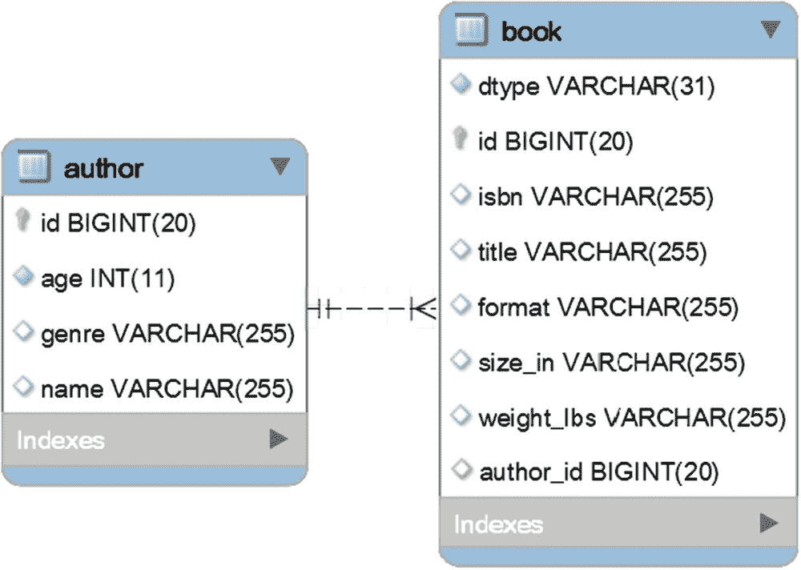
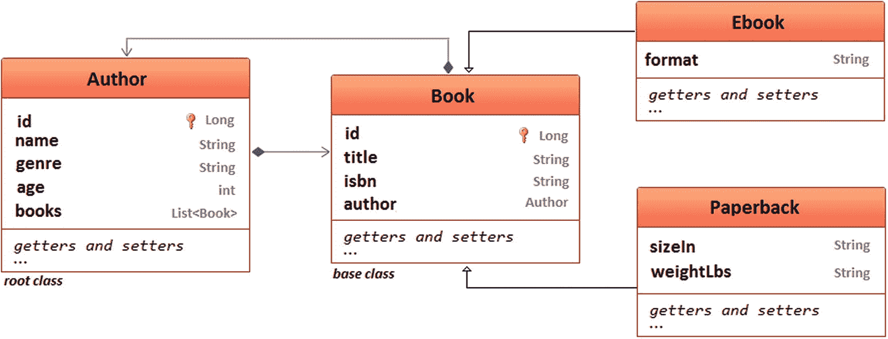
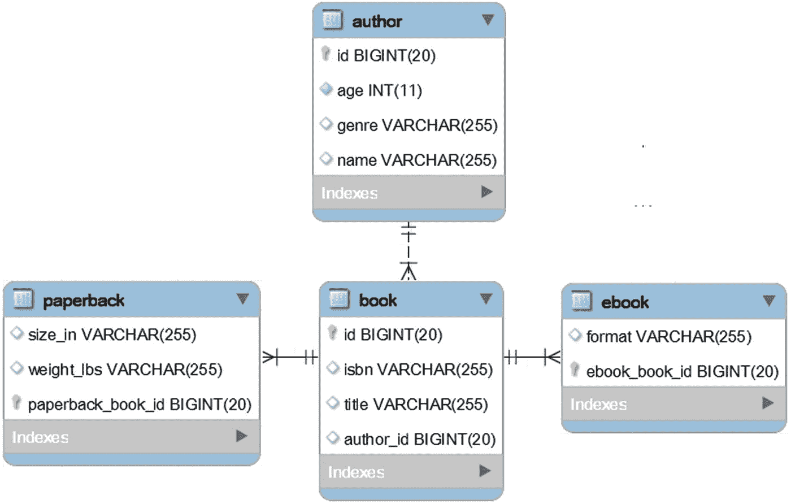
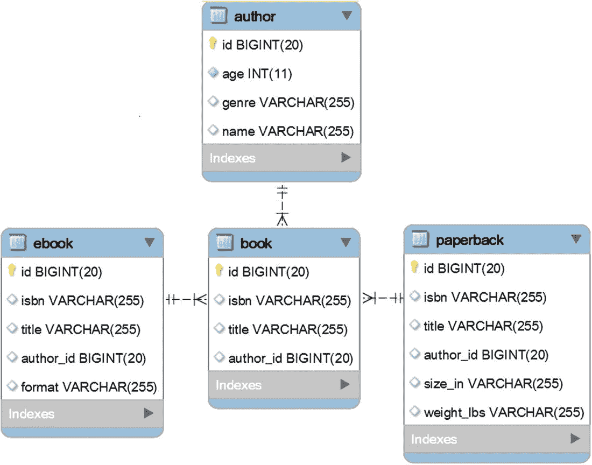
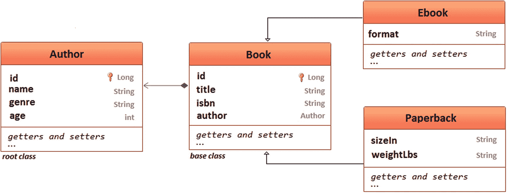
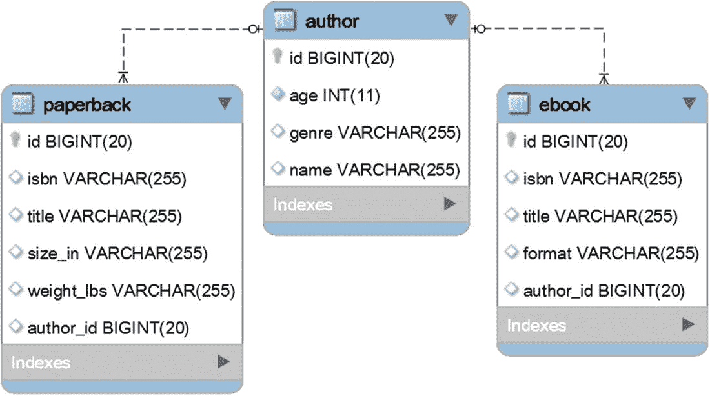

# 十五、继承

## 第 138 项:如何有效地使用单表继承

单表继承是默认的 JPA 策略。按照这种策略，继承层次结构中的所有类都通过数据库中的单个表来表示。

考虑图 [15-1](#Fig1) 中给出的继承层次。


图 15-1

单表继承域模型

在`Author`和`Book`之间有一个双向的懒惰`@OneToMany`关联。`Author`实体可以被视为*根类，*因为没有作者就没有书。`Book`实体是*基类*。为了采用单表继承策略，这个类用`@Inheritance`或`@Inheritance(strategy = InheritanceType.SINGLE_TABLE)`进行了注释。`Ebook`和`Paperback`实体扩展了`Book`实体；所以，他们不需要自己的`@Id`。

形成这种继承策略的表格如图 [15-2](#Fig2) 所示。



图 15-2

单表继承策略的表

`book`表包含与`Book`实体以及`Ebook`和`Paperback`实体相关联的列。它还包含一个名为`dtype`的栏目。这被称为*鉴别器列*。Hibernate 使用这个列将结果集映射到相关的子类实例。默认情况下，鉴别器列保存实体的名称。

如果您必须对一个遗留数据库使用`SINGLE_TABLE`策略，那么很可能您将没有一个鉴别器列，并且您不能改变表定义。在这种情况下，您可以使用`@DiscriminatorFormula`来定义一个公式(一个派生值)作为继承鉴别器列。一旦你知道了`@DiscriminatorFormula`，你可以很容易地在网上找到例子。

这里列出了`Book`基类及其子类的相关代码:

```java
@Entity
@Inheritance(strategy = InheritanceType.SINGLE_TABLE)
public class Book implements Serializable {
    ...
}

@Entity
public class Ebook extends Book implements Serializable {
    ...
}

@Entity
public class Paperback extends Book implements Serializable {
    ...
}

```

### 持久数据

是时候持久化一些数据了。下面的服务方法持久化一个包含三本书的`Author`，这三本书是通过`Book`、`Ebook`和`Paperback`实体创建的:

```java
public void persistAuthorWithBooks() {

    Author author = new Author();
    author.setName("Alicia Tom");
    author.setAge(38);
    author.setGenre("Anthology");

    Book book = new Book();
    book.setIsbn("001-AT");
    book.setTitle("The book of swords");

    Paperback paperback = new Paperback();
    paperback.setIsbn("002-AT");
    paperback.setTitle("The beatles anthology");
    paperback.setSizeIn("7.5 x 1.3 x 9.2");
    paperback.setWeightLbs("2.7");

    Ebook ebook = new Ebook();
    ebook.setIsbn("003-AT");
    ebook.setTitle("Anthology myths");
    ebook.setFormat("kindle");

    author.addBook(book); // use addBook() helper
    author.addBook(paperback);
    author.addBook(ebook);

    authorRepository.save(author);
}

```

保存`author`实例会触发以下 SQL 语句:

```java
INSERT INTO author (age, genre, name)
  VALUES (?, ?, ?)
Binding:[38, Anthology, Alicia Tom]

INSERT INTO book (author_id, isbn, title, dtype)
  VALUES (?, ?, ?, 'Book')
Binding:[1, 001-AT, The book of swords]

INSERT INTO book (author_id, isbn, title, size_in, weight_lbs, dtype)
  VALUES (?, ?, ?, ?, ?, 'Paperback')
Binding:[1, 002-AT, The beatles anthology, 7.5 x 1.3 x 9.2, 2.7]

INSERT INTO book (author_id, isbn, title, format, dtype)
  VALUES (?, ?, ?, ?, 'Ebook')
Binding:[1, 003-AT, Anthology myths, kindle]

```

作者保存在`author`表中，而书籍(`book`、`ebook`和`paperback`)保存在`book`表中。因此，持久化(写)数据是有效的，因为所有的书都保存在同一个表中。

### 查询和单表继承

现在，让我们来看看获取数据的效率。考虑以下`BookRepository`:

```java
@Repository
@Transactional(readOnly = true)
public interface BookRepository extends JpaRepository<Book, Long> {

    @Query("SELECT b FROM Book b WHERE b.author.id = ?1")
    List<Book> fetchBooksByAuthorId(Long authorId);

    Book findByTitle(String title);
}

```

#### 通过作者标识符获取图书

让我们打电话给`fetchBooksByAuthorId()`:

```java
List<Book> books = bookRepository.fetchBooksByAuthorId(1L);

```

触发的`SELECT`如下:

```java
SELECT
  book0_.id AS id2_1_,
  book0_.author_id AS author_i8_1_,
  book0_.isbn AS isbn3_1_,
  book0_.title AS title4_1_,
  book0_.format AS format5_1_,
  book0_.size_in AS size_in6_1_,
  book0_.weight_lbs AS weight_l7_1_,
  book0_.dtype AS dtype1_1_
FROM book book0_
WHERE book0_.author_id = ?

```

继承为多态查询提供了支持。换句话说，获取的结果集被正确地映射到基类(`Book`)和子类(`Ebook`和`Paperback`)。Hibernate 通过检查每个获取的行的鉴别器列来做到这一点。

#### 按书名取书

更进一步，让我们为每本书调用`findByTitle()`:

```java
Book b1 = bookRepository.findByTitle("The book of swords");    // Book
Book b2 = bookRepository.findByTitle("The beatles anthology"); // Paperback
Book b3 = bookRepository.findByTitle("Anthology myths");       // Ebook

```

触发的`SELECT`对于所有三种类型的图书都是相同的:

```java
SELECT
  book0_.id AS id2_1_,
  book0_.author_id AS author_i8_1_,
  book0_.isbn AS isbn3_1_,
  book0_.title AS title4_1_,
  book0_.format AS format5_1_,
  book0_.size_in AS size_in6_1_,
  book0_.weight_lbs AS weight_l7_1_,
  book0_.dtype AS dtype1_1_
FROM book book0_
WHERE book0_.title = ?

```

获取`b1`、`b2`和`b3`作为`Book`实例不会混淆 Hibernate。由于`b2`是一个`Paperback`，它可以被显式强制转换以显示大小和重量:

```java
Paperback p = (Paperback) b2;
System.out.println(p.getSizeIn());
System.out.println(p.getWeightLbs());

```

当然，这不像依赖子类的专用库那样实际。注意，我们在`BookRepository`中定义了`findByTitle()`。如果我们想从`EbookRepository`或`PaperbackRepository`中使用它，那么复制它是不实际的(一般来说，在所有存储库中复制查询方法是不实际的)。在这种情况下，首先在`@NoRepositoryBean`类中定义`findByTitle()`:

```java
@NoRepositoryBean
public interface BookBaseRepository<T extends Book>
                            extends JpaRepository<T, Long> {
    T findByTitle(String title);
    @Query(value="SELECT b FROM #{#entityName} AS b WHERE b.isbn = ?1")

    T fetchByIsbn(String isbn);
}

```

接下来，`BookRepository`、`EbookRepository`、`PaperbackRepository`延伸`BookBaseRepository`。通过这种方式，`findByTitle()`和`findByIsbn()`可以在所有扩展基本存储库的存储库中使用。完整的应用可在 GitHub <sup>[1](#Fn1)</sup> 上获得。

#### 去拿平装书

考虑下面列出的`Paperback`存储库:

```java
@Repository
@Transactional(readOnly = true)
public interface PaperbackRepository    extends JpaRepository<Paperback, Long> {

    Paperback findByTitle(String title);
}

```

现在，让我们触发两个查询。第一个查询使用标识一个`Book`的标题。第二个查询使用标识一个`Paperback`的标题:

```java
// this is a Book
Paperback p1 = paperbackRepository.findByTitle("The book of swords");

// this is a Paperback
Paperback p2 = paperbackRepository.findByTitle("The beatles anthology");

```

两个查询触发相同的`SELECT`:

```java
SELECT
  paperback0_.id AS id2_1_,
  paperback0_.author_id AS author_i8_1_,
  paperback0_.isbn AS isbn3_1_,
  paperback0_.title AS title4_1_,
  paperback0_.size_in AS size_in6_1_,
  paperback0_.weight_lbs AS weight_l7_1_
FROM book paperback0_
WHERE paperback0_.dtype = 'Paperback'
AND paperback0_.title = ?

```

注意`WHERE`子句。Hibernate 附加了一个基于`dtype`的条件，只获取平装书；因此，`p1`将是`null`，而`p2`将是`Paperback`实例。太酷了，对吧？！

#### 获取作者和相关书籍

考虑下面的`Author`存储库:

```java
@Repository
@Transactional(readOnly = true)
public interface AuthorRepository extends JpaRepository<Author, Long> {

    Author findByName(String name);

    @Query("SELECT a FROM Author a JOIN FETCH a.books b")
    public Author findAuthor();
}

```

调用`findByName()`将获取没有相关书籍的作者:

```java
@Transactional(readOnly = true)
public void fetchAuthorAndBooksLazy() {
    Author author = authorRepository.findByName("Alicia Tom");
    List<Book> books = author.getBooks();
}

```

调用`getBooks()`如预期的那样触发了第二个查询:

```java
-- fetch the author
SELECT
  author0_.id AS id1_0_,
  author0_.age AS age2_0_,
  author0_.genre AS genre3_0_,
  author0_.name AS name4_0_
FROM author author0_
WHERE author0_.name = ?

-- fetch the books via getBooks()
SELECT
  books0_.author_id AS author_i8_1_0_,
  books0_.id AS id2_1_0_,
  books0_.id AS id2_1_1_,
  books0_.author_id AS author_i8_1_1_,
  books0_.isbn AS isbn3_1_1_,
  books0_.title AS title4_1_1_,
  books0_.format AS format5_1_1_,
  books0_.size_in AS size_in6_1_1_,
  books0_.weight_lbs AS weight_l7_1_1_,
  books0_.dtype AS dtype1_1_1_
FROM book books0_
WHERE books0_.author_id = ?

```

这正是预期的行为。

另一方面，由于有了`JOIN FETCH`，调用`findAuthor()`将在同一个`SELECT`中获取作者和相关书籍:

```java
@Transactional(readOnly = true)
public void fetchAuthorAndBooksEager() {
    Author author = authorRepository.findAuthor();
}

```

被触发的`SELECT`依赖于`INNER JOIN`如下:

```java
SELECT
  author0_.id AS id1_0_0_,
  books1_.id AS id2_1_1_,
  author0_.age AS age2_0_0_,
  author0_.genre AS genre3_0_0_,
  author0_.name AS name4_0_0_,
  books1_.author_id AS author_i8_1_1_,
  books1_.isbn AS isbn3_1_1_,
  books1_.title AS title4_1_1_,
  books1_.format AS format5_1_1_,
  books1_.size_in AS size_in6_1_1_,
  books1_.weight_lbs AS weight_l7_1_1_,
  books1_.dtype AS dtype1_1_1_,
  books1_.author_id AS author_i8_1_0__,
  books1_.id AS id2_1_0__
FROM author author0_
INNER JOIN book books1_
  ON author0_.id = books1_.author_id

```

很好！看起来单表继承支持快速读写。

### 子类属性非空性问题

支持在*基类* ( `Book`)上指定不可为空的约束，这很简单，如下例所示:

```java
public class Book implements Serializable {
    ...
    @Column(nullable=false)
    private String title;
    ...
}

```

试图持久化`Book`将导致类型`SQLIntegrityConstraintViolationException: Column 'title' cannot be null:`的预期异常

```java
Book book = new Book();
book.setIsbn("001-AT");
book.setTitle(null);

```

但是试图在`Book`的子类上添加不可空的约束是不允许的。换句话说，不可能向属于`Ebook`或`Paperback`的列添加`NOT NULL`约束。这意味着下面的`Ebook`被成功持久化:

```java
Ebook ebook = new Ebook();
ebook.setIsbn("003-AT");
ebook.setTitle("Anthology myths");
ebook.setFormat(null);

```

显然，将`format`设置为`null`违背了创建这个`Ebook`的目的。所以，创建一个`Ebook`不应该接受`format`的`null`。以同样的方式，创建一个`Paperback`不应该接受`null`为`sizeIn`或`weightLbs`。

然而，有几种解决方案可以确保子类属性的非空性。首先，在域模型上，依靠`javax.validation.constraints.NotNull`来注释相应的字段，如下面的例子所示:

```java
public class Ebook extends Book implements Serializable {
    ...
    @NotNull
    private String format;
    ...
}

public class Paperback extends Book implements Serializable {
    ...
    @NotNull
    private String sizeIn;
    @NotNull
    private String weightLbs;
    ...
}

```

这一次，试图持久化这个`ebook`将导致类型`javax.validation.ConstraintViolationException`的异常，其中提到`format`不能是`null`。

这仅仅解决了问题的一半。还可以通过本地查询插入带有`null`格式的行。阻止这种尝试意味着在数据库级别进行检查。

对于 MySQL，这可以通过为基类创建的一组触发器来实现(或者，在 PostgreSQL 和其他 RDBMSs 中，`CHECK`约束)。例如，以下触发器在数据库级别起作用，不允许`null`格式(在`Ebook`的情况下)和`null`大小或权重(在`Paperback`的情况下):

下面是`EBook`的触发器:

```java
CREATE TRIGGER ebook_format_trigger
  BEFORE INSERT ON book
    FOR EACH ROW
      BEGIN
        IF NEW.DTYPE = 'Ebook' THEN
          IF NEW.format IS NULL THEN
            SIGNAL SQLSTATE '45000'
            SET MESSAGE_TEXT='The format of e-book cannot be null';
          END IF;
        END IF;
      END;

```

以下是`Paperback`的触发因素:

```java
CREATE TRIGGER paperback_weight_trigger
BEFORE INSERT ON book
  FOR EACH ROW
    BEGIN
      IF NEW.DTYPE = 'Paperback' THEN
        IF NEW.weight_lbs IS NULL THEN
          SIGNAL SQLSTATE '45000'
          SET MESSAGE_TEXT='The weight of paperback cannot be null';
        END IF;
      END IF;
    END;

CREATE TRIGGER paperback_size_trigger
  BEFORE INSERT ON book
    FOR EACH ROW
      BEGIN
        IF NEW.DTYPE = 'Paperback' THEN
          IF NEW.size_in IS NULL THEN
            SIGNAL SQLSTATE '45000'
            SET MESSAGE_TEXT='The size of paperback cannot be null';
          END IF;
        END IF;
      END;

```

这些触发器应该添加到您的模式文件中。将它们放在 SQL 文件中需要您在`application.properties`中设置`spring.datasource.separator`:

```java
spring.datasource.separator=^;

```

然后在 SQL 文件中，不在触发器内的所有`;`语句都需要用新的分隔符更新，如下例所示:

```java
CREATE TRIGGER ebook_format_trigger
      ...
      END ^;

```

在本书捆绑的代码中，触发器被添加到了`data-mysql.sql`。最好将它们添加到`schema-mysql.sql`中，或者添加到 Flyway 或 Liquibase 的 SQL 文件中。我用这种方式让您看到 Hibernate 如何基于单个表继承注释生成 DDL 模式。

根据经验，数据库触发器对于实现复杂的数据完整性约束和规则非常有用。这里的 <sup>[2](#Fn2)</sup> 就是支持这种说法的一个例子。

### 优化鉴别器列的内存占用

调整列的大小和数据类型是优化数据库内存占用的重要步骤。鉴别器列是由 JPA 持久性提供者添加的，它的数据类型和大小是`VARCHAR(31)`。但是存储`Paperback`名至少需要 9 个字节，而存储`Ebook`名需要 4 个字节。想象一下，存储 100，000 本平装书和 500，000 本电子书。存储鉴别器列索引需要 100000÷9+500000÷4 = 2900000 字节，也就是 2.76MB。但是，将鉴别器列定义为`TINYINT(1)`怎么样呢？这一次，需要 1 个字节，所以计算变成 100000∫1+500000∫1 = 600000 字节，这是 0.57MB。这是更好的方式！

您可以通过`@DiscriminatorColumn`和`@DiscriminatorValue`改变默认的鉴别器列。首先，使用`@DiscriminatorColumn`改变鉴别器列的类型和大小。第二，使用`@DiscriminatorValue`为每个类分配一个整数(这些整数应该进一步用于引用这些类):

```java
@Entity
@Inheritance(strategy = InheritanceType.SINGLE_TABLE)
@DiscriminatorColumn(
    discriminatorType = DiscriminatorType.INTEGER,
    columnDefinition = "TINYINT(1)"
)

@DiscriminatorValue("1")
public class Book implements Serializable {
    ...
}

@Entity
@DiscriminatorValue("2")
public class Ebook extends Book implements Serializable {
    ...
}

@Entity
@DiscriminatorValue("3")
public class Paperback extends Book implements Serializable {
    ...
}

```

仅此而已！完整的应用可在 GitHub <sup>[3](#Fn3)</sup> 上获得。

现在让我们来看看单表继承的一些优缺点。

优点:

*   子类列不允许约束，但是，如你所见，这个问题有解决方案。

*   读写速度很快

*   `@ManyToOne`、`@OneToOne`、`@OneToMany`是高效的

*   基类属性可以是不可空的

    缺点:

## 第 139 项:如何从一个 SINGLE_TABLE 继承层次结构中获取某些子类

该项目使用来自**项目 138** 的领域模型和知识；因此，考虑先熟悉那个项目。

所以，在`Author`和`Book`之间，有一个双向的懒惰`@OneToMany`联想。`Ebook`和`Paperback`实体依靠`SINGLE_TABLE`继承策略来扩展`Book`实体。

`book`表包含与`Book`实体以及`Ebook`和`Paperback`实体相关联的列。它还包含一个名为`dtype`的栏目。这就是所谓的鉴别器列。

您可以通过其专用的存储库获取某个子类(例如，`Ebook`)，如下例所示(这里，查询通过标题获取一个`Ebook`):

```java
@Repository
@Transactional(readOnly = true)
public interface EbookRepository extends JpaRepository<Ebook, Long> {

    Ebook findByTitle(String title);
}

SELECT
  ebook0_.id AS id2_1_,
  ebook0_.author_id AS author_i8_1_,
  ebook0_.isbn AS isbn3_1_,
  ebook0_.title AS title4_1_,
  ebook0_.size_in AS size_in6_1_,
  ebook0_.weight_lbs AS weight_l7_1_
FROM book ebook0_
WHERE ebook0_.dtype = 'Ebook'
AND ebook0_.title = ?

```

注意`WHERE`子句。Hibernate 增加了一个基于`dtype`的条件，只获取电子书。

这绝对很棒，但并不总是这样。例如，考虑`EbookRepository`中的以下`@Query`:

```java
@Repository
@Transactional(readOnly = true)
public interface EbookRepository extends JpaRepository<Ebook, Long> {

    @Query("SELECT b FROM Author a JOIN a.books b WHERE a.name = ?1)
    public Ebook findByAuthorName(String name);
}

```

这一次，触发的`SELECT`看起来如下:

```java
SELECT
  books1_.id AS id2_1_,
  books1_.author_id AS author_i8_1_,
  books1_.isbn AS isbn3_1_,
  books1_.title AS title4_1_,
  books1_.format AS format5_1_,
  books1_.size_in AS size_in6_1_,
  books1_.weight_lbs AS weight_l7_1_,
  books1_.dtype AS dtype1_1_
FROM author author0_
INNER JOIN book books1_
  ON author0_.id = books1_.author_id
WHERE author0_.name = ?

```

鉴别器列(`dtype`)没有自动添加到`WHERE`子句中，所以这个查询不会只获取`Ebook`。显然，这是不行的！这个问题的解决方案依赖于一个显式的`TYPE`表达式，如下所示(参见粗体查询部分):

```java
@Repository
@Transactional(readOnly = true)
public interface EbookRepository extends JpaRepository<Ebook, Long> {

    @Query("SELECT b FROM Author a JOIN a.books b
            WHERE a.name = ?1 AND TYPE(b) = 'Ebook'")
    public Ebook findByAuthorName(String name);
}

```

这次触发的`SELECT`如下:

```java
SELECT
  books1_.id AS id2_1_,
  books1_.author_id AS author_i8_1_,
  books1_.isbn AS isbn3_1_,
  books1_.title AS title4_1_,
  books1_.format AS format5_1_,
  books1_.size_in AS size_in6_1_,
  books1_.weight_lbs AS weight_l7_1_,
  books1_.dtype AS dtype1_1_
FROM author author0_
INNER JOIN book books1_
  ON author0_.id = books1_.author_id
WHERE author0_.name = ?
AND books1_.dtype = 'Ebook'

```

感谢`TYPE`表情，事情又回到正轨了！取一个`Author`的`Ebook`类型的`Book`怎么样？通过`TYPE`表达式，这种查询可以在`BookRepository`中编写如下(查询定义与前一个完全相同，但它被放在`BookRepository`中，并返回一个类型为`Ebook`的`Book`):

```java
@Repository
@Transactional(readOnly = true)
public interface BookRepository extends JpaRepository<Book, Long> {

    @Query("SELECT b FROM Author a JOIN a.books b
            WHERE a.name = ?1 AND TYPE(b) = 'Ebook'")
    public Book findByAuthorName(String name);
}

```

完整的应用可在 GitHub <sup>[4](#Fn4)</sup> 上获得。

## 第 140 项:如何有效地使用连接表继承

连接表是另一种 JPA 继承策略。按照这种策略，继承层次结构中的所有类都通过数据库中的单个表来表示。考虑图 [15-3](#Fig3) 中给出的继承层次。



图 15-3

连接表继承域模型

在`Author`和`Book`之间，有一个双向懒惰的`@OneToMany`关联。`Author`实体可以被视为*根类*，因为没有作者就没有书。`Book`实体是*基类*。为了使用连接表继承策略，这个类用`@Inheritance(strategy = InheritanceType.JOINED)`进行了注释。`Ebook`和`Paperback`实体扩展了`Book`实体；所以，他们不需要自己的`@Id`。形成这种继承策略的表格如图 [15-4](#Fig4) 所示。



图 15-4

连接表继承策略的表

这里列出了`Book`基类和子类的相关代码:

```java
@Entity
@Inheritance(strategy = InheritanceType.JOINED)
public class Book implements Serializable {
    ...
}

@Entity
@PrimaryKeyJoinColumn(name="ebook_book_id")
public class Ebook extends Book implements Serializable {
    ...
}

@Entity
@PrimaryKeyJoinColumn(name="paperback_book_id")
public class Paperback extends Book implements Serializable {
    ...
}

```

默认情况下，子类表包含一个主键列，该列也充当外键。这个外键引用了*基类*表的主键。您可以通过用`@PrimaryKeyJoinColumn`注释子类来定制这个外键。例如，`Ebook`和`Paperback`子类依赖这个注释来定制外键列的名称:

```java
@Entity
@PrimaryKeyJoinColumn(name="ebook_book_id")
public class Ebook extends Book implements Serializable {
    ...
}

@Entity
@PrimaryKeyJoinColumn(name="paperback_book_id")
public class Paperback extends Book implements Serializable {
    ...
}

```

默认情况下，*基类*的主键列名和子类的主键列名是相同的。

### 持久数据

下面的服务方法持久化一个包含三本书的`Author`，这三本书是通过`Book`、`Ebook`和`Paperback`实体创建的:

```java
public void persistAuthorWithBooks() {

    Author author = new Author();
    author.setName("Alicia Tom");
    author.setAge(38);
    author.setGenre("Anthology");

    Book book = new Book();
    book.setIsbn("001-AT");
    book.setTitle("The book of swords");

    Paperback paperback = new Paperback();
    paperback.setIsbn("002-AT");
    paperback.setTitle("The beatles anthology");
    paperback.setSizeIn("7.5 x 1.3 x 9.2");
    paperback.setWeightLbs("2.7");

    Ebook ebook = new Ebook();
    ebook.setIsbn("003-AT");
    ebook.setTitle("Anthology myths");
    ebook.setFormat("kindle");

    author.addBook(book); // use addBook() helper
    author.addBook(paperback);
    author.addBook(ebook);

    authorRepository.save(author);
}

```

保存`author`实例会触发以下 SQL 语句:

```java
INSERT INTO author (age, genre, name)
  VALUES (?, ?, ?)
Binding:[38, Anthology, Alicia Tom]

INSERT INTO book (author_id, isbn, title)
  VALUES (?, ?, ?)
Binding:[1, 001-AT, The book of swords]

INSERT INTO book (author_id, isbn, title)
  VALUES (?, ?, ?)
Binding:[1, 002-AT, The beatles anthology]
INSERT INTO paperback (size_in, weight_lbs, paperback_book_id)
  VALUES (?, ?, ?)
Binding:[ 7.5 x 1.3 x 9.2, 2.7, 2]

INSERT INTO book (author_id, isbn, title)
  VALUES (?, ?, ?)
Binding:[1, 003-AT, Anthology myths]
INSERT INTO ebook (format, ebook_book_id)
  VALUES (?, ?)
Binding:[kindle, 3]

```

这一次，需要比单表继承策略更多的`INSERT`语句(参见**第 138 项**)。主要是，*基类*的数据被插入到`book`表中，而`Ebook`类，分别是`Paperback`类的数据被放入到`ebook`和`paperback`表中。插入越多，性能损失的机会就越大。

### 查询和连接表继承

现在，让我们来看看获取数据的效率。考虑以下`BookRepository`:

```java
@Repository
@Transactional(readOnly = true)
public interface BookRepository extends JpaRepository<Book, Long> {

    @Query("SELECT b FROM Book b WHERE b.author.id = ?1")
    List<Book> fetchBooksByAuthorId(Long authorId);

    Book findByTitle(String title);
}

```

#### 通过作者标识符获取图书

让我们打电话给`fetchBooksByAuthorId()`:

```java
List<Book> books = bookRepository.fetchBooksByAuthorId(1L);

```

触发的`SELECT`如下:

```java
SELECT
  book0_.id AS id1_1_,
  book0_.author_id AS author_i4_1_,
  book0_.isbn AS isbn2_1_,
  book0_.title AS title3_1_,
  book0_1_.format AS format1_2_,
  book0_2_.size_in AS size_in1_3_,
  book0_2_.weight_lbs AS weight_l2_3_,
  CASE
    WHEN book0_1_.ebook_book_id IS NOT NULL THEN 1
    WHEN book0_2_.paperback_book_id IS NOT NULL THEN 2
    WHEN book0_.id IS NOT NULL THEN 0
  END AS clazz_
FROM book book0_
LEFT OUTER JOIN ebook book0_1_
  ON book0_.id = book0_1_.ebook_book_id
LEFT OUTER JOIN paperback book0_2_
  ON book0_.id = book0_2_.paperback_book_id
WHERE book0_.author_id = ?

```

有一个单独的`SELECT`，但是 Hibernate 必须连接每个子类表。因此，子类表的数量决定了多态查询中连接的数量(对于 *n* 子类，将有 *n* 连接)。此外，连接的数量会影响查询速度和执行计划的效率。

#### 按书名取书

让我们为每本书调用`findByTitle()`:

```java
Book b1 = bookRepository.findByTitle("The book of swords");    // Book
Book b2 = bookRepository.findByTitle("The beatles anthology"); // Paperback
Book b3 = bookRepository.findByTitle("Anthology myths");       // Ebook

```

触发的`SELECT`对于所有三种类型的图书都是相同的:

```java
SELECT
  book0_.id AS id1_1_,
  book0_.author_id AS author_i4_1_,
  book0_.isbn AS isbn2_1_,
  book0_.title AS title3_1_,
  book0_1_.format AS format1_2_,
  book0_2_.size_in AS size_in1_3_,
  book0_2_.weight_lbs AS weight_l2_3_,
  CASE
    WHEN book0_1_.ebook_book_id IS NOT NULL THEN 1
    WHEN book0_2_.paperback_book_id IS NOT NULL THEN 2
    WHEN book0_.id IS NOT NULL THEN 0
  END AS clazz_
FROM book book0_
LEFT OUTER JOIN ebook book0_1_
  ON book0_.id = book0_1_.ebook_book_id
LEFT OUTER JOIN paperback book0_2_
  ON book0_.id = book0_2_.paperback_book_id
WHERE book0_.title = ?

```

同样，只有一个`SELECT`，但是 Hibernate 必须连接每个子类表。因此，通过基类存储库获取子类是没有效率的。让我们看看子类的专用存储库会发生什么。

#### 去拿平装书

考虑下面列出的`Paperback`存储库:

```java
@Repository
@Transactional(readOnly = true)
public interface PaperbackRepository    extends JpaRepository<Paperback, Long> {

    Paperback findByTitle(String title);
}

```

现在，让我们触发两个查询。第一个查询使用标识一个`Book`的标题。第二个查询使用标识一个`Paperback`的标题:

```java
// this is a Book
Paperback p1 = paperbackRepository.findByTitle("The book of swords");

// this is a Paperback
Paperback p2 = paperbackRepository.findByTitle("The beatles anthology");

```

两个查询触发相同的`SELECT` ( `p1`将是`null`，而`p2`将获取一个`Paperback`):

```java
SELECT
  paperback0_.paperback_book_id AS id1_1_,
  paperback0_1_.author_id AS author_i4_1_,
  paperback0_1_.isbn AS isbn2_1_,
  paperback0_1_.title AS title3_1_,
  paperback0_.size_in AS size_in1_3_,
  paperback0_.weight_lbs AS weight_l2_3_
FROM paperback paperback0_
INNER JOIN book paperback0_1_
  ON paperback0_.paperback_book_id = paperback0_1_.id
WHERE paperback0_1_.title = ?

```

通过专用存储库获取子类需要与基类表进行一次连接。

如果可能的话，避免通过基类存储库获取子类。使用子类的专用库。在第一种情况下，子类的数量影响连接的数量，而在第二种情况下，子类和基类表之间只有一个连接。换句话说，直接使用查询而不是子类实体。

当然，这不像依赖子类的专用库那样实际。注意，我们在`BookRepository`中定义了`findByTitle()`。如果我们想从`EbookRepository`或`PaperbackRepository`中使用它，那么复制它是不实际的(一般来说，在所有存储库中复制查询方法是不实际的)。在这种情况下，首先在`@NoRepositoryBean`类中定义`findByTitle()`:

```java
@NoRepositoryBean
public interface BookBaseRepository<T extends Book>
                            extends JpaRepository<T, Long> {
    T findByTitle(String title);
    @Query(value="SELECT b FROM #{#entityName} AS b WHERE b.isbn = ?1")

    T fetchByIsbn(String isbn);
}

```

接下来，`BookRepository`、`EbookRepository`、`PaperbackRepository`延伸`BookBaseRepository`。通过这种方式，`findByTitle()`和`findByIsbn()`可以在所有扩展基本存储库的存储库中使用。完整的应用可在 GitHub <sup>[5](#Fn5)</sup> 上获得。

#### 获取作者和相关书籍

考虑下面的`Author`存储库:

```java
@Repository
@Transactional(readOnly = true)
public interface AuthorRepository extends JpaRepository<Author, Long> {

    Author findByName(String name);

    @Query("SELECT a FROM Author a JOIN FETCH a.books b")
    public Author findAuthor();
}

```

调用`findByName()`将获取没有相关书籍的作者:

```java
@Transactional(readOnly = true)
public void fetchAuthorAndBooksLazy() {
    Author author = authorRepository.findByName("Alicia Tom");
    List<Book> books = author.getBooks();
}

```

调用`getBooks()`触发第二个查询:

```java
-- fetch the author
SELECT
  author0_.id AS id1_0_,
  author0_.age AS age2_0_,
  author0_.genre AS genre3_0_,
  author0_.name AS name4_0_
FROM author author0_
WHERE author0_.name = ?

-- fetch the books via getBooks()
SELECT
  books0_.author_id AS author_i4_1_0_,
  books0_.id AS id1_1_0_,
  books0_.id AS id1_1_1_,
  books0_.author_id AS author_i4_1_1_,
  books0_.isbn AS isbn2_1_1_,
  books0_.title AS title3_1_1_,
  books0_1_.format AS format1_2_1_,
  books0_2_.size_in AS size_in1_3_1_,
  books0_2_.weight_lbs AS weight_l2_3_1_,
  CASE
    WHEN books0_1_.ebook_book_id IS NOT NULL THEN 1
    WHEN books0_2_.paperback_book_id IS NOT NULL THEN 2
    WHEN books0_.id IS NOT NULL THEN 0
  END AS clazz_1_
FROM book books0_
LEFT OUTER JOIN ebook books0_1_
  ON books0_.id = books0_1_.ebook_book_id
LEFT OUTER JOIN paperback books0_2_
  ON books0_.id = books0_2_.paperback_book_id
WHERE books0_.author_id = ?

```

第二个`SELECT`也有同样的缺点。每个子类表都有一个连接。因此，组合多态查询和深层类层次结构和/或大量子类会导致性能下降。

另一方面，由于有了`JOIN FETCH`，调用`findAuthor()`将在同一个`SELECT`中获取作者和相关书籍:

```java
@Transactional(readOnly = true)
public void fetchAuthorAndBooksEager() {
    Author author = authorRepository.findAuthor();
}

```

这里列出了触发的`SELECT`:

```java
SELECT
  author0_.id AS id1_0_0_,
  books1_.id AS id1_1_1_,
  author0_.age AS age2_0_0_,
  author0_.genre AS genre3_0_0_,
  author0_.name AS name4_0_0_,
  books1_.author_id AS author_i4_1_1_,
  books1_.isbn AS isbn2_1_1_,
  books1_.title AS title3_1_1_,
  books1_1_.format AS format1_2_1_,
  books1_2_.size_in AS size_in1_3_1_,
  books1_2_.weight_lbs AS weight_l2_3_1_,
  CASE
    WHEN books1_1_.ebook_book_id IS NOT NULL THEN 1
    WHEN books1_2_.paperback_book_id IS NOT NULL THEN 2
    WHEN books1_.id IS NOT NULL THEN 0
  END AS clazz_1_,
  books1_.author_id AS author_i4_1_0__, books1_.id AS id1_1_0__
FROM author author0_
INNER JOIN book books1_
  ON author0_.id = books1_.author_id
LEFT OUTER JOIN ebook books1_1_
  ON books1_.id = books1_1_.ebook_book_id
LEFT OUTER JOIN paperback books1_2_
  ON books1_.id = books1_2_.paperback_book_id

```

这一次，JPA 持久性提供者需要三个连接。因此，对于 *n* 子类，将有 *n* +1 个连接。这样效率不高。

下面是连接表继承的一些优点和缺点。

优点:

*   持久化子类实体需要两个`INSERT`语句

*   只有通过子类的专用存储库，读取才是有效的(换句话说，直接对子类实体使用查询)

*   数据库必须索引基类和所有子类主键

*   在多态查询的情况下，对于 *n* 子类，Hibernate 需要 *n* 或者 *n* +1 个连接。这可能会导致查询速度变慢，并增加确定最有效执行计划的难度

*   基类和子类属性可以是不可空的

*   只要不需要多态查询，这种策略就适合于深度类层次结构和/或大量子类

    缺点:

完整的应用可在 GitHub <sup>[6](#Fn6)</sup> 上获得。

### 如何使用 JPA 加入继承策略和策略设计模式

首先，努力使用继承策略，如`SINGLE_TABLE`、`JOINED`或`TABLE_PER_CLASS`结合一个软件设计模式(如模板、状态、策略、访问者等)。).将继承策略与软件设计模式结合起来是利用 JPA 继承的最佳方式。要将特定属性从一个基类传播到所有子类，可以使用`@MappedSuperclass`。

策略模式是一种众所周知的行为模式。简而言之，策略模式允许您定义一组算法，将每个算法包装在一个类中，并使它们可以互换。

例如，让我们假设在每天结束时，你的书店交付当天订购的书籍。对于电子书，你通过电子邮件发送下载链接，而对于平装书，我们发送包裹。当然，也可以采用其他策略，但还是让事情简单化吧。

您可以通过编写以下接口来开始开发:

```java
public interface Delivery<T extends Book> {

    Class<? extends Book> ofBook();
    void deliver(T book);
}

```

`deliver()`方法是动作发生的地方，而`ofBook()`方法只是返回利用策略实现的图书的类类型。你会立刻明白为什么你需要这个方法。现在，让我们添加策略(为了简单起见，我们通过`System.out.println()`来模拟交付):

```java
@Component
public class PaperbackDeliver implements Delivery<Paperback> {

    @Override
    public void deliver(Paperback book) {
        System.out.println("We've sent you a parcel containing the title "
            + book.getTitle() + " with a size of '" + book.getSizeIn()
            + "' and a weight of " + book.getWeightLbs());
    }

    @Override
    public Class<? extends Book> ofBook() {
        return Paperback.class;
    }
}

@Component
public class EbookDeliver implements Delivery<Ebook> {

    @Override
    public void deliver(Ebook book) {
        System.out.println("You can download the book named '"
            + book.getTitle() + "' from the following link: http://bookstore/" + book.getFormat() + "/" + book.getTitle());
    }

    @Override
    public Class<? extends Book> ofBook() {
        return Ebook.class;
    }
}

```

接下来，您需要一个使用策略的服务。策略豆(`EbookDeliver`和`PaperbackDeliver`)作为`List<Delivery>`被 Spring 自动注入。所以，新的策略会自动注入到`DeliverService`中。此外，你循环这个列表并使用`ofBook()`来构建一个策略图。该图中的*键*是 book 类类型(例如`Ebook.class`和`Paperback.class`)，而*值*是策略本身(策略 bean 实例)。这样，您可以根据图书类型(`ebook`或`paperback`)调用适当的`deliver()`方法:

```java
public interface Deliverable {

    void process();
}

@Service
public class DeliverService implements Deliverable {

    private final BookRepository bookRepository;
    private final List<Delivery> deliverStrategies;

    private final Map<Class<? extends Book>, Delivery>
        deliverStrategiesMap = new HashMap<>();

    public DeliverService(BookRepository bookRepository,
                            List<Delivery> deliverStrategies) {
        this.bookRepository = bookRepository;
        this.deliverStrategies = deliverStrategies;
    }

    @PostConstruct
    public void init() {
        deliverStrategies.forEach((deliverStrategy) -> {
            deliverStrategiesMap.put(deliverStrategy.ofBook(),
                                                    deliverStrategy);
        });
    }

    @Override
    public void process() {

        // we just need some books to deliver
        List<Book> allBooks = bookRepository.findAll();

        for (Book book : allBooks) {
            Delivery deliveryStrategy
                = deliverStrategiesMap.get(book.getClass());
            deliveryStrategy.deliver(book);
        }
    }
}

```

`process()`方法负责应用策略。你循环应该交付的书籍，应用相应的策略。只是为了获取一些书籍进行测试，您可以应用一个`findAll()`查询。

完整的应用可在 GitHub <sup>[7](#Fn7)</sup> 上获得。而且，在 GitHub<sup>T5】8</sup>上，你可以找到另一个使用访问者设计模式的例子。

## 第 141 项:如何有效地使用每个类的表继承

每类一张表是另一种 JPA 继承策略。按照这种策略，继承层次结构中的所有类都通过数据库中的单个表来表示。每个子类表存储从超类表继承的列(*基类*)。考虑图 [15-5](#Fig5) 中给出的继承层次。


图 15-5

每类表继承域模型

在`Author`和`Book`之间，有一个双向懒惰的`@OneToMany`关联。`Author`实体可以被看作是*根类*，因为没有作者就没有书。`Book`实体是*基类*。为了采用每类一个表的继承策略，这个类用`@Inheritance(strategy = InheritanceType.TABLE_PER_CLASS)`进行了注释。`Ebook`和`Paperback`实体扩展了`Book`实体，所以不需要自己的`@Id`。形成这种继承策略的表格如图 [15-6](#Fig6) 所示。



图 15-6

每类表继承策略的表

每个子类表包含一个主键列。为了确保子类表中主键的唯一性，每类表策略不能依赖于`IDENTITY`生成器。尝试使用`IDENTITY`生成器会导致类型为`Cannot use identity column key generation with <union-subclass> mapping`的异常。

这是 MySQL 等 RDBMSs 的一个重要缺点。不允许使用`IDENTITY`，也不支持`SEQUENCE`(MySQL 不支持数据库序列；因此不支持`SEQUENCE`策略)。`TABLE`生成器类型的伸缩性不好，比`IDENTITY`和`SEQUENCE`生成器类型慢得多，即使对于单个数据库连接也是如此。所以，你应该避免 MySQL 和每类一个表的继承策略的结合。

这里列出了`Book`基类和子类的相关代码:

```java
@Entity
@Inheritance(strategy = InheritanceType.TABLE_PER_CLASS)
public class Book implements Serializable {
    ...
}

@Entity
public class Ebook extends Book implements Serializable {
    ...
}

@Entity
public class Paperback extends Book implements Serializable {
    ...
}

```

### 持久数据

下面的服务方法持久化一个包含三本书的`Author`，这三本书是通过`Book`、`Ebook`和`Paperback`实体创建的:

```java
public void persistAuthorWithBooks() {

    Author author = new Author();
    author.setName("Alicia Tom");
    author.setAge(38);
    author.setGenre("Anthology");

    Book book = new Book();
    book.setIsbn("001-AT");
    book.setTitle("The book of swords");

    Paperback paperback = new Paperback();
    paperback.setIsbn("002-AT");
    paperback.setTitle("The beatles anthology");
    paperback.setSizeIn("7.5 x 1.3 x 9.2");
    paperback.setWeightLbs("2.7");

    Ebook ebook = new Ebook();
    ebook.setIsbn("003-AT");
    ebook.setTitle("Anthology myths");
    ebook.setFormat("kindle");

    author.addBook(book); // use addBook() helper
    author.addBook(paperback);
    author.addBook(ebook);

    authorRepository.save(author);
}

```

保存`author`实例会触发以下 SQL 语句:

```java
INSERT INTO author (age, genre, name)
  VALUES (?, ?, ?)
Binding:[38, Anthology, Alicia Tom]

INSERT INTO book (author_id, isbn, title, id)
  VALUES (?, ?, ?, ?)
Binding:[1, 001-AT, The book of swords, 1]

INSERT INTO paperback (author_id, isbn, title, size_in, weight_lbs, id)
  VALUES (?, ?, ?, ?, ?, ?)
Binding:[1, 002-AT, The beatles anthology, 7.5 x 1.3 x 9.2, 2.7, 2]

INSERT INTO ebook (author_id, isbn, title, format, id)
  VALUES (?, ?, ?, ?, ?)
Binding:[1, 003-AT, Anthology myths, kindle, 3]

```

每个类的表为每个子类触发一个`INSERT`，因此它比连接表继承策略更有效。

### 查询和每表类继承

现在，让我们来看看获取数据的效率。考虑以下`BookRepository`:

```java
@Repository
@Transactional(readOnly = true)
public interface BookRepository extends JpaRepository<Book, Long> {

    @Query("SELECT b FROM Book b WHERE b.author.id = ?1")
    List<Book> fetchBooksByAuthorId(Long authorId);

    Book findByTitle(String title);
}

```

#### 通过作者标识符获取图书

让我们打电话给`fetchBooksByAuthorId()`:

```java
List<Book> books = bookRepository.fetchBooksByAuthorId(1L);

```

触发的`SELECT`如下:

```java
SELECT
  book0_.id AS id1_1_,
  book0_.author_id AS author_i4_1_,
  book0_.isbn AS isbn2_1_,
  book0_.title AS title3_1_,
  book0_.format AS format1_2_,
  book0_.size_in AS size_in1_3_,
  book0_.weight_lbs AS weight_l2_3_,
  book0_.clazz_ AS clazz_
FROM (SELECT
  id, isbn, title, author_id,
  NULL AS format, NULL AS size_in, NULL AS weight_lbs, 0 AS clazz_
FROM book
UNION
SELECT
  id, isbn, title, author_id, format,
  NULL AS size_in, NULL AS weight_lbs, 1 AS clazz_
FROM ebook
UNION
SELECT
  id, isbn, title, author_id,
  NULL AS format, size_in, weight_lbs, 2 AS clazz_
FROM paperback) book0_
WHERE book0_.author_id = ?

```

在多态查询的情况下，Hibernate 依靠 SQL 联合从基类和每个子类表中获取数据。显然，由于需要更多的联合，多态查询的效率会降低。

#### 按书名取书

让我们为每本书调用`findByTitle()`:

```java
Book b1 = bookRepository.findByTitle("The book of swords");    // Book
Book b2 = bookRepository.findByTitle("The beatles anthology"); // Paperback
Book b3 = bookRepository.findByTitle("Anthology myths");       // Ebook

```

触发的`SELECT`对于所有三种类型的图书都是相同的:

```java
SELECT
  book0_.id AS id1_1_,
  book0_.author_id AS author_i4_1_,
  book0_.isbn AS isbn2_1_,
  book0_.title AS title3_1_,
  book0_.format AS format1_2_,
  book0_.size_in AS size_in1_3_,
  book0_.weight_lbs AS weight_l2_3_,
  book0_.clazz_ AS clazz_
FROM (SELECT
  id, isbn, title, author_id,
  NULL AS format, NULL AS size_in, NULL AS weight_lbs, 0 AS clazz_
FROM book
UNION
SELECT
  id, isbn, title, author_id, format,
  NULL AS size_in, NULL AS weight_lbs, 1 AS clazz_
FROM ebook
UNION
SELECT
  id, isbn, title, author_id,
  NULL AS format, size_in, weight_lbs, 2 AS clazz_
FROM paperback) book0_
WHERE book0_.title = ?

```

同样，Hibernate 依靠 SQL 联合从基类和每个子类表中获取数据。因此，通过基类存储库获取子类实体是没有效率的，应该避免。

#### 去拿平装书

考虑下面列出的`Paperback`存储库:

```java
@Repository
@Transactional(readOnly = true)
public interface PaperbackRepository     extends JpaRepository<Paperback, Long> {

    Paperback findByTitle(String title);
}

```

现在，让我们触发两个查询。第一个查询使用标识一个`Book`的标题。第二个查询使用标识一个`Paperback`的标题:

```java
// this is a Book
Paperback p1 = paperbackRepository.findByTitle("The book of swords");

// this is a Paperback
Paperback p2 = paperbackRepository.findByTitle("The beatles anthology");

```

两个查询触发相同的`SELECT` ( `p1`将是`null`，而`p2`将获取一个`Paperback`):

```java
SELECT
  paperback0_.id AS id1_1_,
  paperback0_.author_id AS author_i4_1_,
  paperback0_.isbn AS isbn2_1_,
  paperback0_.title AS title3_1_,
  paperback0_.size_in AS size_in1_3_,
  paperback0_.weight_lbs AS weight_l2_3_
FROM paperback paperback0_
WHERE paperback0_.title = ?

```

通过专用库获取子类是高效的。

如果可能的话，避免通过基类存储库获取子类。最好使用子类专用的存储库。在第一种情况下，子类的数量影响联合的数量，而在第二种情况下，将不存在联合。换句话说，最好直接对子类实体使用查询。

当然，这不像依赖子类的专用库那样实际。注意，我们在`BookRepository`中定义了`findByTitle()`。如果我们想从`EbookRepository`或`PaperbackRepository`中使用它，那么复制它是不实际的(一般来说，在所有存储库中复制查询方法是不实际的)。在这种情况下，首先在`@NoRepositoryBean`类中定义`findByTitle()`:

```java
@NoRepositoryBean
public interface BookBaseRepository<T extends Book>
                            extends JpaRepository<T, Long> {
    T findByTitle(String title);
    @Query(value="SELECT b FROM #{#entityName} AS b WHERE b.isbn = ?1")

    T fetchByIsbn(String isbn);
}

```

接下来，`BookRepository`、`EbookRepository`、`PaperbackRepository`延伸`BookBaseRepository`。通过这种方式，`findByTitle()`和`findByIsbn()`可以在所有扩展基本存储库的存储库中使用。完整的应用可在 GitHub <sup>[9](#Fn9)</sup> 上获得。

#### 获取作者和相关书籍

考虑下面的`Author`存储库:

```java
@Repository
@Transactional(readOnly = true)
public interface AuthorRepository extends JpaRepository<Author, Long> {

    Author findByName(String name);

    @Query("SELECT a FROM Author a JOIN FETCH a.books b")
    public Author findAuthor();
}

```

调用`findByName()`将获取没有相关书籍的作者:

```java
@Transactional(readOnly = true)
public void fetchAuthorAndBooksLazy() {
    Author author = authorRepository.findByName("Alicia Tom");
    List<Book> books = author.getBooks();
}

```

调用`getBooks()`触发第二个查询:

```java
-- fetch the author
SELECT
  author0_.id AS id1_0_,
  author0_.age AS age2_0_,
  author0_.genre AS genre3_0_,
  author0_.name AS name4_0_
FROM author author0_
WHERE author0_.name = ?

-- fetch the books via getBooks()
SELECT
  books0_.author_id AS author_i4_1_0_,
  books0_.id AS id1_1_0_,
  books0_.id AS id1_1_1_,
  books0_.author_id AS author_i4_1_1_,
  books0_.isbn AS isbn2_1_1_,
  books0_.title AS title3_1_1_,
  books0_.format AS format1_2_1_,
  books0_.size_in AS size_in1_3_1_,
  books0_.weight_lbs AS weight_l2_3_1_,
  books0_.clazz_ AS clazz_1_
FROM (SELECT
  id, isbn, title, author_id,
  NULL AS format, NULL AS size_in, NULL AS weight_lbs, 0 AS clazz_
FROM book
UNION
SELECT
  id, isbn, title, author_id, format,
  NULL AS size_in, NULL AS weight_lbs, 1 AS clazz_
FROM ebook
UNION
SELECT
  id, isbn, title, author_id,
  NULL AS format, size_in, weight_lbs, 2 AS clazz_
FROM paperback) books0_
WHERE books0_.author_id = ?

```

第二个`SELECT`也有同样的缺点。每个子类表都有一个联合。所以，深层次的类和/或大量的子类会导致性能下降。

另一方面，由于有了`JOIN FETCH`，调用`findAuthor()`将在同一个`SELECT`中获取作者和相关书籍:

```java
@Transactional(readOnly = true)
public void fetchAuthorAndBooksEager() {
    Author author = authorRepository.findAuthor();
}

```

不幸的是，触发的`SELECT`并不高效，因为它需要每个子类一个联合( *n* 子类导致 *n* 联合):

```java
SELECT
  author0_.id AS id1_0_0_,
  books1_.id AS id1_1_1_,
  author0_.age AS age2_0_0_,
  author0_.genre AS genre3_0_0_,
  author0_.name AS name4_0_0_,
  books1_.author_id AS author_i4_1_1_,
  books1_.isbn AS isbn2_1_1_,
  books1_.title AS title3_1_1_,
  books1_.format AS format1_2_1_,
  books1_.size_in AS size_in1_3_1_,
  books1_.weight_lbs AS weight_l2_3_1_,
  books1_.clazz_ AS clazz_1_,
  books1_.author_id AS author_i4_1_0__,
  books1_.id AS id1_1_0__
FROM author author0_
INNER JOIN (SELECT
  id, isbn, title, author_id,
  NULL AS format, NULL AS size_in, NULL AS weight_lbs, 0 AS clazz_
FROM book
UNION
SELECT
  id, isbn, title, author_id, format,
  NULL AS size_in, NULL AS weight_lbs, 1 AS clazz_
FROM ebook
UNION
SELECT
  id, isbn, title, author_id,
  NULL AS format, size_in, weight_lbs, 2 AS clazz_
FROM paperback) books1_
  ON author0_.id = books1_.author_id

```

现在，让我们考虑一下连接表继承的优缺点。

优点:

*   `IDENTITY`发生器不能使用

*   只有通过子类的专用存储库，读取才是有效的(换句话说，最好直接对子类实体使用查询)

*   在多态查询的情况下，对于 *n* 子类，Hibernate 需要 *n* 联合，这可能会导致严重的性能损失

*   写入速度很快，因为每个子类都有一个`INSERT`

*   基类和子类属性可以是不可空的

    缺点:

完整的应用可在 GitHub <sup>[10](#Fn10)</sup> 上获得。

## 第 142 项:如何有效地使用@MappedSuperclass

你已经在**第 24 项**和**第 87 项**中看到`@MappedSuperclass`在工作。

`@MappedSuperclass`是一个实体级的注释，它有助于形成一个继承模型，类似于每类一个表的策略，但是有一个不是实体的*基类*。它没有在数据库表中具体化。基类用`@MappedSuperclass`标注，可以是`abstract`也可以不是。它的子类将继承它的属性，并将它们存储在自己属性旁边的子类表中。考虑图 [15-7](#Fig7) 中给出的继承层次。



图 15-7

映射超类领域模型

在`Author`和`Book`之间有一个单向的懒惰`@ManyToOne`联想。由于`Book`不是一个实体，它不支持关联；因此，`Author`实体不能定义一个`@OneToMany`关系。这个`Author`实体可以被看作是*根类*，因为没有作者就没有书。`Book`实体是非实体*基类*。`Ebook`和`Paperback`实体扩展了`Book`实体，所以它们不需要自己的`@Id`。表格关系如图 [15-8](#Fig8) 所示(注意没有`book`表格)。



图 15-8

映射超类表

这里列出了`Book`基类的相关代码:

```java
@MappedSuperclass
public abstract class Book implements Serializable {

    private static final long serialVersionUID = 1L;

    @Id
    @GeneratedValue(strategy = GenerationType.IDENTITY)
    private Long id;

    private String title;
    private String isbn;

    @ManyToOne(fetch = FetchType.LAZY)
    @JoinColumn(name = "author_id")
    private Author author;

    // getters and setters omitted for brevity
}

@Entity
public class Ebook extends Book implements Serializable {
    ...
}

@Entity
public class Paperback extends Book implements Serializable {
    ...
}

```

### 持久数据

下面的服务方法持久化一个包含三本书的`Author`，这三本书是通过`Book`、`Ebook`和`Paperback`实体创建的:

```java
public void persistAuthorWithBooks() {

    Author author = new Author();
    author.setName("Alicia Tom");
    author.setAge(38);
    author.setGenre("Anthology");

    Paperback paperback = new Paperback();
    paperback.setIsbn("002-AT");
    paperback.setTitle("The beatles anthology");
    paperback.setSizeIn("7.5 x 1.3 x 9.2");
    paperback.setWeightLbs("2.7");
    paperback.setAuthor(author);

    Ebook ebook = new Ebook();
    ebook.setIsbn("003-AT");
    ebook.setTitle("Anthology myths");
    ebook.setFormat("kindle");
    ebook.setAuthor(author);

    authorRepository.save(author);
    paperbackRepository.save(paperback);
    ebookRepository.save(ebook);
}

```

保存`author`、`paperback`和`ebook`实例会触发以下 SQL 语句:

```java
INSERT INTO author (age, genre, name)
  VALUES (?, ?, ?)
Binding:[38, Anthology, Alicia Tom]

INSERT INTO paperback (author_id, isbn, title, size_in, weight_lbs)
  VALUES (?, ?, ?, ?, ?)
Binding:[1, 002-AT, The beatles anthology, 7.5 x 1.3 x 9.2, 2.7]

INSERT INTO ebook (author_id, isbn, title, format)
  VALUES (?, ?, ?, ?)
Binding:[1, 003-AT, Anthology myths, kindle]

```

写入是高效的。每个实体实例有一个`INSERT`。

#### 去拿平装书

考虑下面列出的`Paperback`存储库:

```java
@Repository
@Transactional(readOnly = true)
public interface PaperbackRepository     extends JpaRepository<Paperback, Long> {

    Paperback findByTitle(String title);

    @Query("SELECT e FROM Paperback e JOIN FETCH e.author")
    Paperback fetchByAuthorId(Long id);
}

```

现在，让我们通过`findByTitle()`触发两个查询。第一个查询使用标识一个`Ebook`的标题。第二个查询使用标识一个`Paperback`的标题:

```java
// this is a Ebook
Paperback p1 = paperbackRepository.findByTitle("Anthology myths");

// this is a Paperback
Paperback p2 = paperbackRepository.findByTitle("The beatles anthology");

```

两个查询触发相同的`SELECT` ( `p1`将是`null`，而`p2`将获取一个`Paperback`):

```java
SELECT
  paperback0_.id AS id1_2_,
  paperback0_.author_id AS author_i6_2_,
  paperback0_.isbn AS isbn2_2_,
  paperback0_.title AS title3_2_,
  paperback0_.size_in AS size_in4_2_,
  paperback0_.weight_lbs AS weight_l5_2_
FROM paperback paperback0_
WHERE paperback0_.title = ?

```

这个查询非常简单高效。

把平装本的作者找来怎么样？这可以通过调用`fetchByAuthorId()`来完成。因为这种查询方法依赖于`JOIN FETCH`，所以作者与平装本在同一个`SELECT`中被取出，如下所示:

```java
SELECT
  paperback0_.id AS id1_2_0_,
  author1_.id AS id1_0_1_,
  paperback0_.author_id AS author_i6_2_0_,
  paperback0_.isbn AS isbn2_2_0_,
  paperback0_.title AS title3_2_0_,
  paperback0_.size_in AS size_in4_2_0_,
  paperback0_.weight_lbs AS weight_l5_2_0_,
  author1_.age AS age2_0_1_,
  author1_.genre AS genre3_0_1_,
  author1_.name AS name4_0_1_
FROM paperback paperback0_
INNER JOIN author author1_
  ON paperback0_.author_id = author1_.id

```

该查询使用单个`JOIN`并且是高效的。因为`Author`没有关联，所以没有`getBooks()`、`getEbooks()`或`getPaperbacks()`。

现在，我们来考虑一下`@MappedSuperclass`的一些利弊。

优点:

*   无法查询基类

*   不允许多态查询和关联

    根据经验，`@MappedSuperclass`非常适合将特定属性从*基类*传播到所有子类，因为对象层次结构的可见性保持在对象域级别。不要使用`SINGLE_TABLE`、`JOINED`或`TABLE_PER_CLASS`这样的继承策略来完成这样的任务。依靠`SINGLE_TABLE`、`JOINED`或`TABLE_PER_CLASS`结合软件设计模式(如模板、状态、策略、访问者等)。).将继承策略与软件设计模式结合起来是利用 JPA 继承的最佳选择。

*   读写速度很快

*   只要*基类*不需要成为一个实体，那么`@MappedSuperclass`就是每类一张表继承策略的合适替代

    缺点:

完整的代码可以在 GitHub <sup>[11](#Fn11)</sup> 上找到。

正如在`SINGLE_TABLE, JOINED`或`TABLE_PER_CLASS`的情况下，我们可以通过创建一个由具体存储库扩展的基本存储库来避免查询方法的重复。GitHub <sup>[12](#Fn12)</sup> 上有完整的例子。

<aside aria-label="Footnotes" class="FootnoteSection" epub:type="footnotes">Footnotes [1](#Fn1_source)

[hibernate pringb 单表阳性银屑病 NZ](https://github.com/AnghelLeonard/Hibernate-SpringBoot/tree/master/HibernateSpringBootSingleTableRepositoryInheritance)

  [2](#Fn2_source)

[hibernate pringb bootdatabasetrig ers](https://github.com/AnghelLeonard/Hibernate-SpringBoot/tree/master/HibernateSpringBootDatabaseTriggers)

  [3](#Fn3_source)

[hibernate pringb otsingletablein heritage](https://github.com/AnghelLeonard/Hibernate-SpringBoot/tree/master/HibernateSpringBootSingleTableInheritance)

  [4](#Fn4_source)

[hibernate pringb oot 规范 sub assfrominherit ce](https://github.com/AnghelLeonard/Hibernate-SpringBoot/tree/master/HibernateSpringBootSpecificSubclassFromInheritance)

  [5](#Fn5_source)

[hibernate pringb otjointablerepo sitoryinheritac e](https://github.com/AnghelLeonard/Hibernate-SpringBoot/tree/master/HibernateSpringBootJoinTableRepositoryInheritance)

  [6](#Fn6_source)

[hibernate pringb otjointableinritz](https://github.com/AnghelLeonard/Hibernate-SpringBoot/tree/master/HibernateSpringBootJoinTableInheritance)

  [7](#Fn7_source)

[hibernate pringb otjoinedandrstra tey](https://github.com/AnghelLeonard/Hibernate-SpringBoot/tree/master/HibernateSpringBootJoinedAndStrategy)

  [8](#Fn8_source)

[hibernate pringb otjoinedandvisi tor](https://github.com/AnghelLeonard/Hibernate-SpringBoot/tree/master/HibernateSpringBootJoinedAndVisitor)

  [9](#Fn9_source)

[hibernate pringb boottableper 让 repository inheres tance](https://github.com/AnghelLeonard/Hibernate-SpringBoot/tree/master/HibernateSpringBootTablePerClassRepositoryInheritance)

  [10](#Fn10_source)

[hibernate pringb boottableper class 继承](https://github.com/AnghelLeonard/Hibernate-SpringBoot/tree/master/HibernateSpringBootTablePerClassInheritance)

  [11](#Fn11_source)

[hibernate pringb oomappedsupecl ass](https://github.com/AnghelLeonard/Hibernate-SpringBoot/tree/master/HibernateSpringBootMappedSuperclass)

  [12](#Fn12_source)

[hibernate pringb othmappedsupecl assrepository](https://github.com/AnghelLeonard/Hibernate-SpringBoot/tree/master/HibernateSpringBootMappedSuperclassRepository)

 </aside>