# 二、在 AWS 中将 Spring Boot 应用部署为 REST API

前一章提供了亚马逊 Web 服务(AWS)的概述，包括像亚马逊弹性计算云(Amazon EC2)、AWS 弹性 Beanstalk、亚马逊关系数据库服务(Amazon RDS)和亚马逊 Route 53 这样的服务。首先，您为开发人员创建了一个免费的 AWS 帐户，探索了 Elastic Beanstalk，并创建了一个服务器。然后，您创建了 HelloWorld JSP 应用。最后，您用 Maven 构建了一个 WAR 文件，并将 WAR 上传到 Elastic Beanstalk。

在本章中，您将在本地系统中创建一个 Spring Boot 应用作为 REST API。然后，使用 Maven 为我们的 Spring Boot 应用构建 JAR，并将这个 JAR 部署在 Elastic Beanstalk 中，这样任何人都可以在互联网上访问 REST API。最后，您探索来自弹性豆茎的日志。

## 构建一个 Spring Boot 应用作为 REST API

为什么使用 Spring Boot 作为后端框架？有许多框架可用于开发 web 应用，Spring Boot 只是其中之一。但是，如果您希望快速构建一些东西，作为 web 应用开发框架，Spring Boot 可能是首选。

> *和 Spring Boot 一起工作就像和 Spring 开发者一起结对编程。*
> 
> *—乔希·朗@斯塔布克斯曼*

Spring Boot 提供生产就绪的应用和服务，任何人都可以轻松运行。Spring Boot*固执己见*，建议确保开发者的决策，并支持企业应用中常见的一系列非功能特性(嵌入式服务器、安全性、健康检查、指标和外部化配置)。

在本节中，您将逐步开发您的 Spring Boot 应用。如果您已经熟悉了这个构建过程，那么您可以跳到本节的末尾，看看它们是如何组合在一起的。Spring 为开始一个全新的项目提供了不同的选项。更多信息，请参考 [`https://spring.io/`](https://spring.io/) 。

### REST 简介

*表述性状态转移* (REST)是一种架构风格，描述了一个系统如何与另一个系统通信或共享其状态。HTTP(超文本传输协议)可能是支持 RESTful 架构的常用协议。像`POST`、`GET`、`PUT`和`DELETE`这样的标准 HTTP 方法访问和操作 RESTful web 资源。

*   `POST`方法通过向服务器发送数据来执行创建操作。

*   方法从指定的资源中检索数据。

*   `PUT`方法通过向服务器发送数据来执行更新操作。

*   `DELETE`方法执行删除操作。

有意义的 HTTP 响应状态代码总是有助于客户端利用 RESTful API。表 [2-1](#Tab1) 描述了调用 RESTful API 时可能作为服务器响应返回的几个 HTTP 状态代码。

表 2-1

HTTP 响应状态代码

<colgroup><col class="tcol1 align-left"> <col class="tcol2 align-left"> <col class="tcol3 align-left"></colgroup> 
| 

**代码**

 | 

**消息**

 | 

**描述**

 |
| --- | --- | --- |
| Two hundred | 好 | 成功回应。请求已成功。(这是成功 HTTP 请求的标准 HTTP 响应状态代码。) |
| Two hundred and one | 创造 | 成功回应。这通常是在满足了`POST`或`PUT`请求之后发送的 HTTP 响应，结果创建了一个新资源。 |
| Two hundred and four | 不满足 | 成功回应。这个 HTTP 响应代码意味着请求已经被成功处理，但是没有为这个请求返回任何内容。 |
| four hundred | 错误的请求 | 客户端错误响应。由于无效语法，无法完成请求。 |
| Four hundred and one | 未经授权的 | 客户端错误响应。该请求需要用户授权才能获得请求的响应。 |
| Four hundred and three | 被禁止的 | 客户端错误响应。服务器拒绝满足请求，因为客户端没有访问所请求内容的权限。 |
| Four hundred and four | 未发现 | 客户端错误响应。服务器找不到请求的资源。 |
| Four hundred and nine | 冲突 | 客户端错误响应。由于与服务器当前状态的资源冲突，请求无法完成。 |

### 系统需求

Spring Boot 2.0.3 .发行版要求(至少)Java 8。所以，首先需要的是 Java 8 SDK。如果您已经在系统中设置了 JDK，那么在开始之前，您应该检查系统上安装的 Java 的当前版本。

```java
$ java -version
java version "1.8.0_101"
Java(TM) SE Runtime Environment (build 1.8.0_101-b13)
Java HotSpot(TM) 64-Bit Server VM (build 25.101-b13, mixed mode)

```

Spring 提供了以下三种方法来创建全新的 Spring Boot 应用。

*   使用 Spring Boot CLI 工具

*   使用 Spring IDE

*   使用 Spring **Initializr** ( [`http://start.spring.io/`](http://start.spring.io/) )

### 使用 Spring 工具套件创建 Spring Boot 应用

在本章中，您将使用 STS IDE 构建一个带有 REST 端点的 RESTful 应用`HelloSpringBoot`。REST API 层负责处理客户端请求并生成响应。

您通过使用 Spring Tool Suite (STS)生成一个 Spring Boot 应用来创建`HelloSpringBoot`。STS 是最新 Eclipse 发行版的现成发行版，预装了 Spring IDE 组件。

使用 Spring Starter 项目向导创建一个 Spring Boot 应用，如图 [2-1](#Fig1) 所示。默认情况下，Spring Boot 应用在端口 8080 上运行。

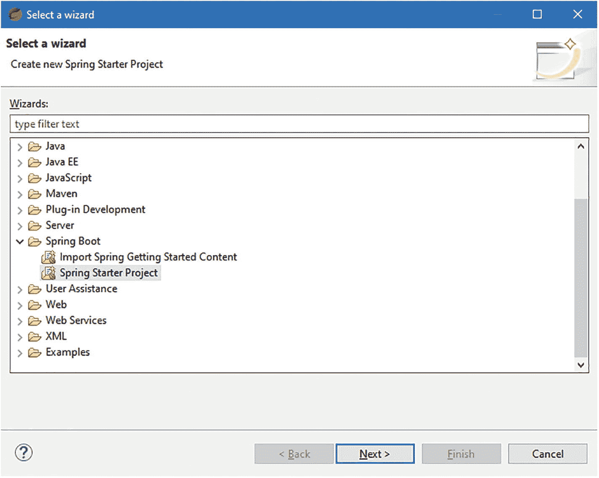

图 2-1

创建 Spring Boot 应用的向导

Spring Boot 提供了首发球员。您需要提供项目相关信息，如图 [2-2](#Fig2) 所示。

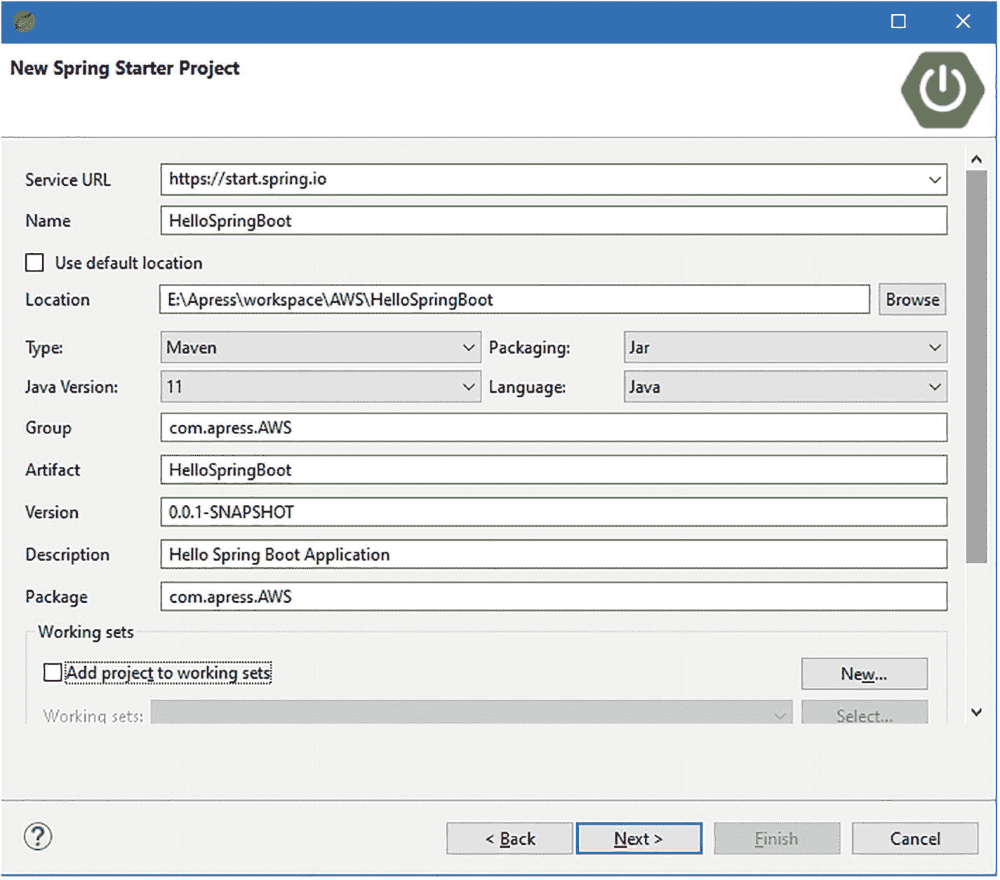

图 2-2

使用 Spring Starter 项目创建 HelloSpringBoot

Spring Boot 中的 starter 是一组类路径依赖项，它们自动配置应用，使开发人员无需任何配置就能构建应用。

在这一章中，你选择 web 依赖来构建一个简单的 RESTful 服务，如图 [2-3](#Fig3) 所示。

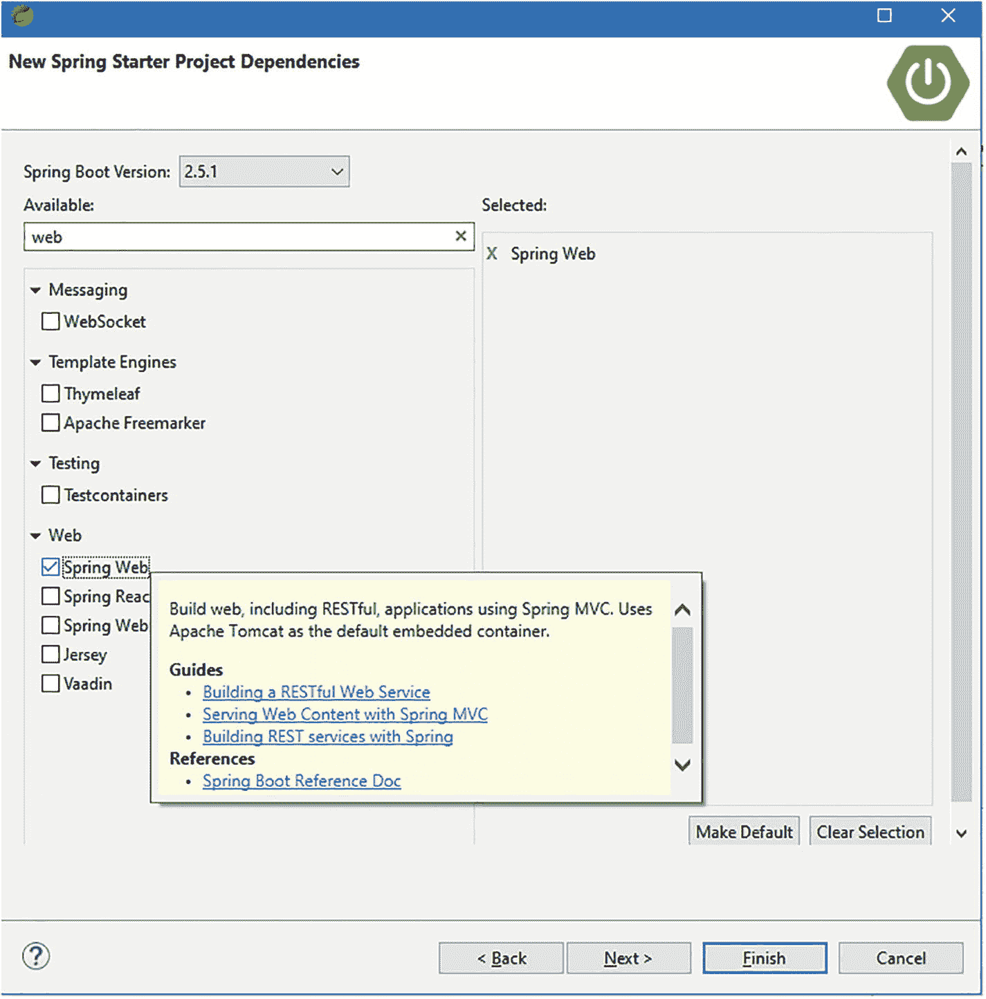

图 2-3

在 Spring starter 中选择 web 依赖项

点击`Finish`按钮生成一个工作区，在您的资源中创建新的包、类和静态文件。项目的最终结构如图 [2-4](#Fig4) 所示。

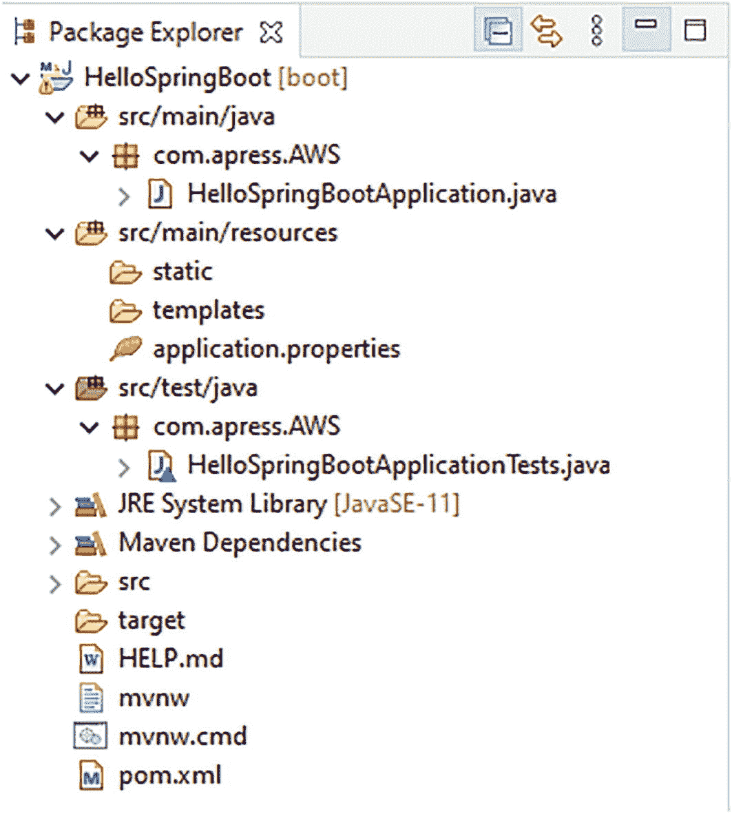

图 2-4

项目结构

让我们在下一节中检查代码。

### 走一遍

让我们通过浏览`pom.xml`文件和 Java 类文件来浏览代码。先说`pom.xml`。

#### pom.xml 文件

当创建一个 Spring Boot 应用时，您在启动对话框中选择的所有依赖项在`pom.xml`中都是可用的，如清单 [2-1](#PC2) 所示。`pom.xml`文件是构建项目的诀窍。

```java
<?xml version="1.0" encoding="UTF-8"?>
<project xmlns:="http://maven.apache.org/POM/4.0.0" xmlns:xsi="http://www.w3.org/2001/XMLSchema-instance"
      xsi:schemaLocation="http://maven.apache.org/POM/4.0.0 https://maven.apache.org/xsd/maven-4.0.0.xsd">
      <modelVersion>4.0.0</modelVersion>
      <parent>
            <groupId>org.springframework.boot</groupId>
            <artifactId>spring-boot-starter-parent</artifactId>
            <version>2.5.1</version>
            <relativePath/>
      </parent>
      <groupId>com.apress.AWS</groupId>
      <artifactId>HelloSpringBoot</artifactId>
      <version>0.0.1-SNAPSHOT</version>
      <name>HelloSpringBoot</name>
      <description>Hello Spring Boot Application</description>
      <properties>
            <java.version>11</java.version>
      </properties>
      <dependencies>
            <dependency>
                  <groupId>org.springframework.boot</groupId>
                  <artifactId>spring-boot-starter-web</artifactId>
            </dependency>
            <dependency>
                  <groupId>org.springframework.boot</groupId>
                  <artifactId>spring-boot-starter-test</artifactId>
                  <scope>test</scope>
            </dependency>
      </dependencies>
      <build>
            <plugins>
                  <plugin>
                        <groupId>org.springframework.boot</groupId>
                        <artifactId>spring-boot-maven-plugin</artifactId>
                  </plugin>
            </plugins>
      </build>
</project>

Listing 2-1pom.xml

```

注意下面关于清单 [2-1](#PC2) 的内容。

*   元素指定了 Spring Boot 的父 POM，它包含了通用组件的定义。

*   spring-boot-starter-web 上的`<dependency>`元素告诉 Spring Boot 这是一个 web 应用，并让 Spring Boot 据此形成自己的观点。

在继续之前，让我们看看 Spring Boot 的意见，以及它如何使用像`spring-boot-starter-web to`这样的首发形成其配置意见。

`HelloSpringBoot`应用已经使用`spring-boot-starter-web`作为 Spring Boot 的网络应用启动器。并且，基于这一出发点，Spring Boot 形成了以下观点。

*   用于 REST 框架的 Spring web MVC

*   JSON 绑定的 Apache Jackson

*   Tomcat 嵌入式 web 服务器容器

在 Spring Boot 对您计划构建的应用的类型形成意见之后，它交付了一个 Maven 依赖项的集合，支持 POM 内容和为`HelloSpringBoot`应用指定的 starter。

#### 写代码

要引导一个 Spring Boot 应用，可以从一个`main(...)`方法开始。最有可能的是，你可以委托给静态的`SpringApplication.run()`方法，如清单 [2-2](#PC3) 所示。

```java
package com.apress.AWS;

import org.springframework.boot.SpringApplication;
import org.springframework.boot.autoconfigure.SpringBootApplication;
import org.springframework.web.bind.annotation.RequestMapping;
import org.springframework.web.bind.annotation.RestController;

/**
 * @author RaviKantSoni
 *
 */
@SpringBootApplication
@RestController
public class HelloSpringBootApplication {

      public static void main(String[] args) {
            SpringApplication.run(HelloSpringBootApplication.class, args);
      }

      @RequestMapping("/greeting")
      public String greetingMessage() {
            return "Welcome to Hello Spring Boot Application!";
      }

}

Listing 2-2\src\main\java\com\apress\AWS\HelloSpringBootApplication.java

```

让我们浏览一下重要的部分。

##### @SpringBootApplication 注释

`HelloSpringBootApplication`类中的第一个注释是 Spring Boot 1.2.0 中引入的`@SpringBootApplication`。它添加了以下注释。

*   `@Configuration`:用`@Configuration`注释标注的类可以被 Spring Boot 容器用作 Spring Bean 定义的源，这并不特定于 Spring Boot。这个类可能包含一个或多个 Spring Bean 声明，通过带有`@Bean`注释的注释方法实现。

*   `@EnableAutoConfiguration`:这个注释是 Spring Boot 项目的一部分，它告诉 Spring Boot 开始使用类路径定义添加 beans。自动配置智能地猜测并自动创建和注册您可能与应用一起运行的 beans，从而简化开发人员的工作。

*   这个注释告诉 Spring Boot 寻找特定的包来扫描带注释的组件、配置和服务。

##### @RestController 和@RequestMapping 批注

`@RestController`是`HelloSpringBootApplication`类中的另一个注释。这是一个刻板的注释。`@RequestMapping`注释提供了“路由”信息，并告诉 Spring Boot 任何带有路径`/greeting`的 HTTP 请求都应该映射到`greetingMessage()`方法。

`@RestController`和`@RequestMapping`注释来自 Spring MVC(这些注释并不特定于 Spring Boot)。

##### 主要方法

`HelloSpringBootApplication`类最重要的部分是`main(...)`方法。使用 Spring Boot 开发的应用包含 main 方法，它在内部调用 Spring Boot 的`SpringApplication.run()`方法来启动应用。包含一个`main`方法的类是主类，用`@SpringBootApplication`注释进行了注释。

### 在 STS 中运行 Spring Boot 应用

使用 Spring Starter 项目向导创建的 Spring Boot 应用有两种风格:WAR 和 JAR。该向导允许您在打包选项中选择 WAR 或 JAR。

> *正如*乔希·朗*在《春之木卫一》的一次谈话中所说，“制造罐子，不要战争。”*
> 
> ——[`https://twitter.com/springcentral/status/598910532008062976`](https://twitter.com/springcentral/status/598910532008062976)

与 WAR 相比，Spring Boot 更喜欢 JAR，因为它允许您轻松地创建独立的 JAR 打包项目，在创建的工件中添加嵌入式 web 服务器(Apache Tomcat 是默认的 web 服务器)。它帮助开发人员减少设置本地或远程 Tomcat 服务器、WAR 打包和部署的开销。

您不需要 STS 的任何特殊工具就可以在本地运行您的 Spring Boot 应用。您可以从标准的 Eclipse Java 调试工具或 STS 中选择 **Run As** ➤ **Java 应用**来运行它。与其他 IDE 相比，使用 STS 的好处是它提供了一个专用的启动程序，与其他 IDE 做同样的事情，但是 STS 在它的基础上增加了一些有用的功能。所以，让我们使用 STS 来运行 Spring Boot 应用，如图 [2-5](#Fig5) 所示。只需右击`HelloSpringBoot`项目，然后选择**运行为** ➤ **Spring Boot App** 。

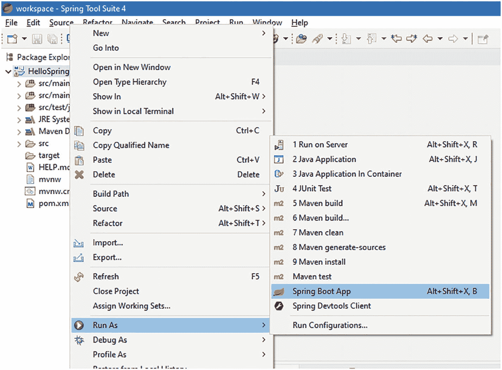

图 2-5

STS 中运行应用的向导

Spring Boot 应用从控制台的输出开始，如图 [2-6](#Fig6) 所示。

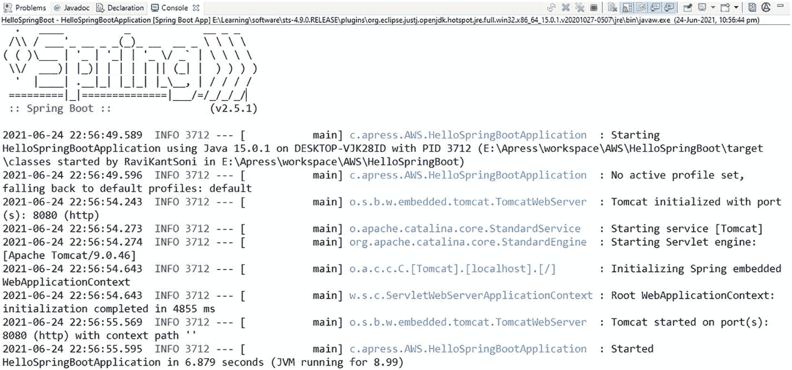

图 2-6

STS 控制台上的输出

如果 Spring Boot 应用成功运行，控制台上的最后一行显示`Started HelloSpringBootApplication`。

恭喜你！您已经使用 Spring Boot 成功设置并运行了该应用。现在在浏览器中访问`http://localhost:8080/greeting`就可以看到网页了，如图 [2-7](#Fig7) 。

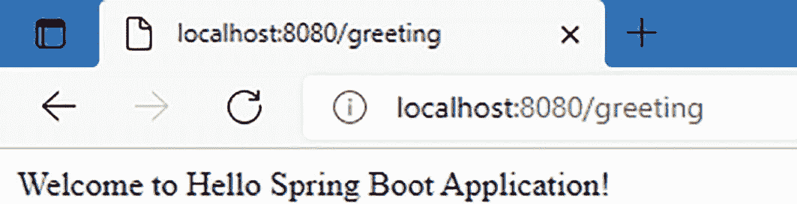

图 2-7

从浏览器访问 REST 端点

## 将 Swagger UI 添加到 Spring Boot 应用中

现在前端组件和后端组件通常会隔离一个 web 应用。构建后端 API 层引入了新的挑战，这些挑战已经超出了实现端点的范围。通常，您将 REST APIs 公开为前端组件或任何第三方应用集成的后端组件。

因此，您的 REST API 文档变得更加脆弱。REST API 文档应该有良好的结构，以便它信息丰富、简洁、易读。在这种情况下，为后端 REST API 制定一个合适的规范是非常重要的。此外，参考 API 文档应该同时描述 API 中的每个变化。手动完成这项工作既耗时又繁琐，因此这一过程的自动化是不可避免的。

Swagger 支持自动生成 API 文档，它还确保对 API 所做的任何更改都可以立即提供给客户。在本节中，您将学习如何在 Spring Boot 应用中使用 Swagger 2 来生成 REST API 文档。

### 霸气 2 简介

Swagger 2 是一个开源项目，记录了 RESTful APIs。它是语言无关的，并且可以扩展到 HTTP 协议之外的新技术和协议。

这个 Swagger 2 版本定义了一组 HTML(超文本标记语言)、JavaScript 和 CSS 资产，以便从符合 Swagger 的 API 动态生成文档。Swagger UI 项目捆绑了这些文件集，以在浏览器上显示 API，并以 JSON 格式返回响应数据。除了呈现文档，Swagger UI 还允许其他 API 开发者或 API 消费者与 API 的资源进行交互，而无需任何 API 实现逻辑。

被理解为 OpenAPI 规范的 Swagger 2 规范有几个实现。Springfox 最近取代了 Swagger-SpringMVC (Swagger 1.2 及更老版本)，并在 Spring Boot 应用中很受欢迎。Springfox 同时支持 Swagger 1.2 和 2.0。

让我们将 Swagger 2 用于我们的 Spring Boot REST web 服务，使用 Swagger 2 规范的 Springfox 实现。

### 在 Maven POM 中添加依赖关系

让我们使用 Swagger 规范的 Springfox 实现。它的最新版本可以在 Maven Central 上找到。要将其添加到我们基于 Spring Boot 的项目中，您需要添加一个单独的`springfox-boot-starter`依赖项，如清单 [2-3](#PC4) 所示。

```java
<dependency>
      <groupId>io.springfox</groupId>
      <artifactId>springfox-boot-starter</artifactId>
      <version>3.0.0</version>
</dependency>

Listing 2-3Add Springfox Dependency in pom.xml

```

### 将 Swagger 2 配置到项目中

Swagger 2 的配置主要集中在 Docket bean 上。对于我们的 Spring Boot 应用，让我们在 Spring Boot 配置类文件中创建一个 Docket bean 来为我们的应用配置 Swagger 2。Springfox Docket 实例为主要的 API 配置提供了默认的配置方法。清单 [2-4](#PC5) 显示了我们的 Spring Boot `SwaggerConfig`配置类。

```java
package com.apress.AWS.config;

import org.springframework.context.annotation.Bean;
import org.springframework.context.annotation.Configuration;

import springfox.documentation.builders.PathSelectors;
import springfox.documentation.builders.RequestHandlerSelectors;
import springfox.documentation.spi.DocumentationType;
import springfox.documentation.spring.web.plugins.Docket;
import springfox.documentation.swagger2.annotations.EnableSwagger2;

/**
 * @author RaviKantSoni
 *
 */
@Configuration
@EnableSwagger2
public class SwaggerConfig {
      @Bean
      public Docket productApi() {
            return new Docket(DocumentationType.SWAGGER_2)
                        .select()
                        .apis(RequestHandlerSelectors.any())
                        .paths(PathSelectors.any())
                        .build();
      }

}

Listing 2-4\src\main\java\com\apress\AWS\config\SwaggerConfig.java

```

在这个`SwaggerConfig`配置类中，`@EnableSwagger2`注释在类中启用了 Swagger 支持。在 Docket bean 实例上调用的`select()`方法返回一个`ApiSelectorBuilder`，它提供了一种控制由 Swagger 公开的端点的方法。

在代码中，`RequestHandlerSelectors`和`PathSelectors`使用`any()`通过 Swagger 为我们的整个 API 制作文档。

### 配置验证

此时，您应该能够通过重启应用并转到`http://localhost:8080/v2/api-docs`来测试 Swagger 配置。

如图 [2-8](#Fig8) 所示，结果是一个带有大量键/值对的 JSON 响应，可读性不是很好。


图 2-8

Swagger JSON 输出

### Swagger UI

您想要人类可读的结构化文档。Swagger UI 是一个内置的解决方案，它使得用户与 Swagger 生成的 API 文档的交互更加容易。在浏览器中，转到`http://localhost:8080/swagger-ui/`。

你看到的是 Swagger UI 渲染生成的文档，如图 [2-9](#Fig9) 所示。

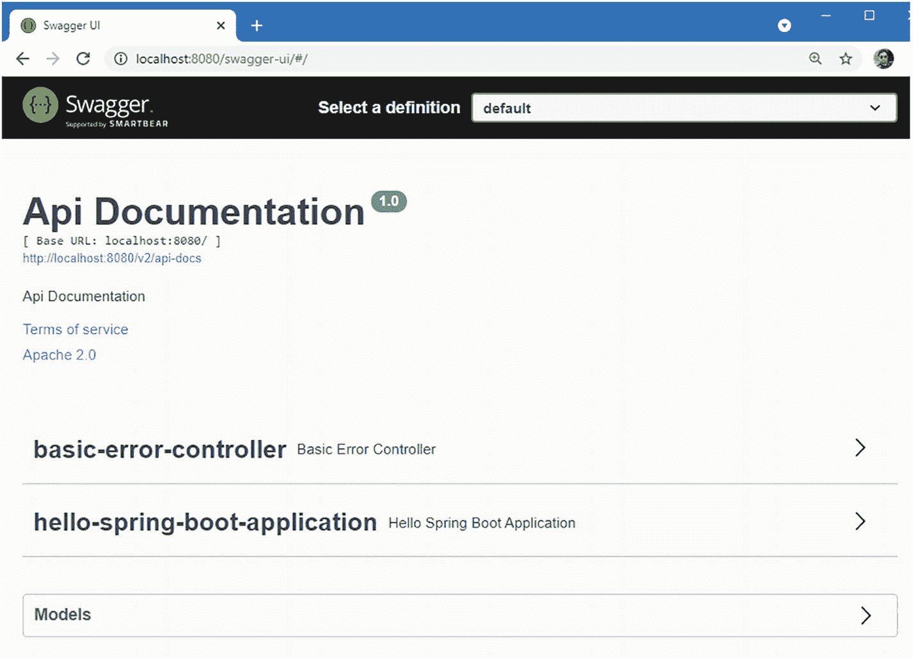

图 2-9

Swagger API 文档页面

基本的错误控制器是 Spring MVC 附带的 API。模型显示所有的`Model`对象。

在 Swagger 的响应中有一个在我们的应用中定义的所有控制器的列表。点击其中任何一个都会列出 HTTP 方法有效的操作端点(`DELETE, GET, HEAD, OPTIONS, PATCH, POST, PUT`)，如图 [2-10](#Fig10) 所示。

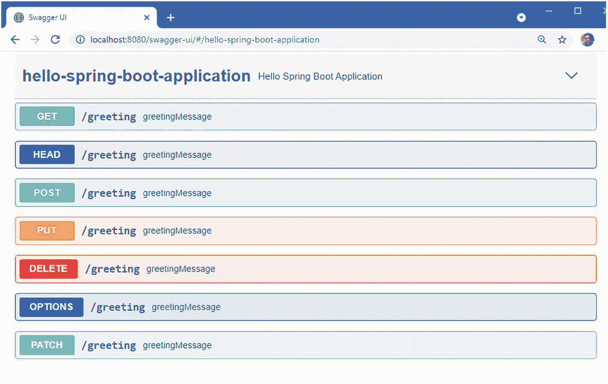

图 2-10

Swagger UI 列出了 REST 端点

有关 Swagger 的更多信息，请参考官方文档页面`at` [`https://swagger.io/docs/specification/2-0/basic-structure/`](https://swagger.io/docs/specification/2-0/basic-structure/) 。

## 为 Spring Boot 项目配置服务器端口

Spring Boot 应用配置的默认端口是 8080，这意味着 Spring Boot 应用在默认端口 8080 启动嵌入式 Tomcat 服务器。您可以将此默认嵌入式服务器端口更改为任何其他端口。

AWS Elastic Beanstalk 假设 Spring Boot 应用监听端口 5000。您可以通过在 Spring Boot 应用的`application.properties`文件中创建一个条目来更改默认端口，如清单 [2-5](#PC6) 所示。

```java
server.port=5000

Listing 2-5\src\main\resources\application.properties

```

让我们在另一个端口构建并运行我们的 Spring Boot 应用，然后打开浏览器访问我们的应用。这一次，您没有在浏览器中使用默认端口 8080；确切地说，是 5000 端口。在浏览器中，转到`http://localhost:5000/swagger-ui/`。

图 [2-11](#Fig11) 显示了 Swagger UI 渲染生成的文档。

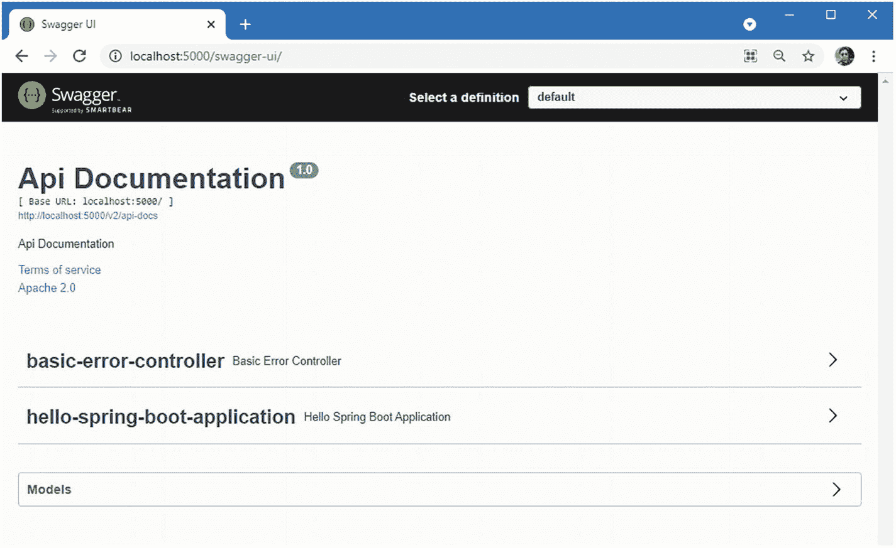

图 2-11

拥有 5000 端口的 URI

## 为 Spring Boot 应用构建一个 JAR

既然您已经成功地创建了一个作为 REST API 的 Spring Boot 应用，那么让我们将它部署到 AWS Elastic Beanstalk。为了实现这个目标，您需要一个我们项目的可部署单元。

在开始实际过程之前，确保您的本地系统中安装了 Apache Maven(一个用于构建和管理任何基于 Java 的项目的命令行工具)。如果您还没有安装 Maven，您可以按照`maven.apache.org`中的说明进行操作。

Spring Boot 应用的默认模式打包可执行 jar(也称为*fat jar*)。因此，JAR 被用作这个项目的可部署单元。要构建 JAR，可以使用 STS 或命令提示符。

从 STS 中右键点击`HelloSpringBoot`项目，然后选择 **Run As** ➤ **Maven build** ，如图 [2-12](#Fig12) 所示。

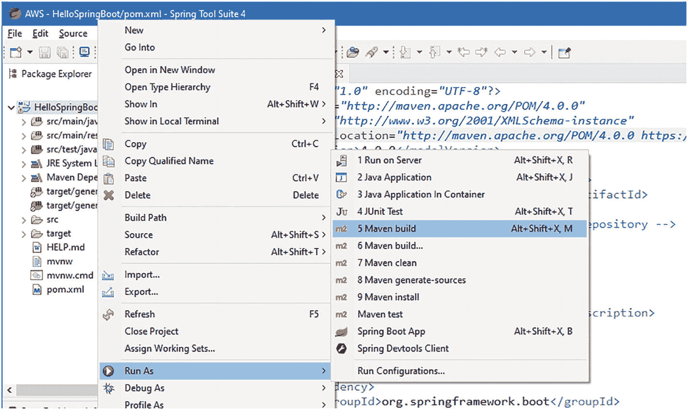

图 2-12

使用 STS 构建 Maven

这将打开编辑配置窗口。在目标文本框中输入**包**。点击应用，然后点击运行，如图 [2-13](#Fig13) 所示。

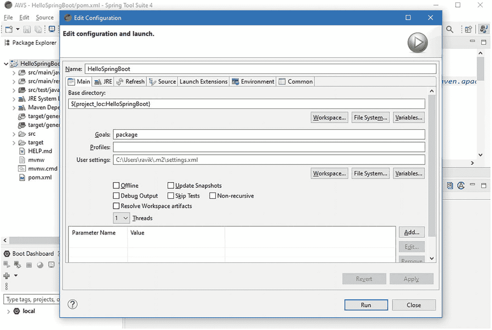

图 2-13

编辑配置窗口

HelloSpringBoot 应用开始构建。您会看到整个 Maven 构建运行，如图 [2-14](#Fig14) 所示。

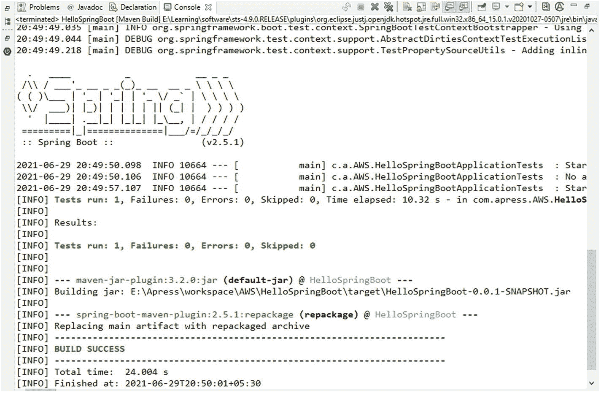

图 2-14

在 STS 中的控制台上构建输出

在项目的`target`文件夹中已经创建了一个名为`HelloSpringBoot-0.0.1-SNAPSHOT.jar`的 JAR。

```java
Building jar: E:\Apress\workspace\AWS\HelloSpringBoot\target\HelloSpringBoot-0.0.1-SNAPSHOT.jar

```

要使用命令提示符构建 JAR，请转到您的项目目录(您创建 Spring Boot 项目的位置)并复制路径。在命令提示符下将工作目录改为项目路径，如图 [2-15](#Fig15) 所示。

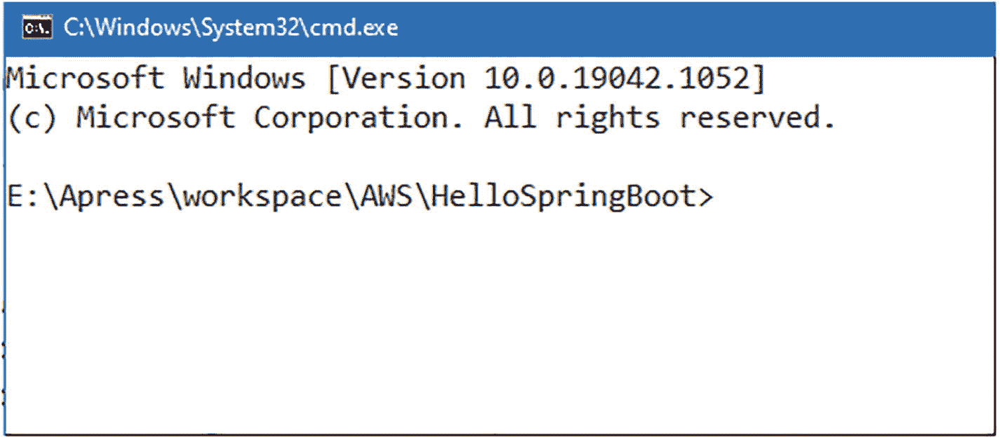

图 2-15

命令提示符下项目路径的目录

在命令提示符下使用以下命令构建项目。

```java
E:\Apress\workspace\AWS\HelloSpringBoot>mvn clean install

```

这将开始构建应用。名为`HelloSpringBoot-0.0.1-SNAPSHOT.jar`的 JAR 文件已经创建，如图 [2-16](#Fig16) 所示。

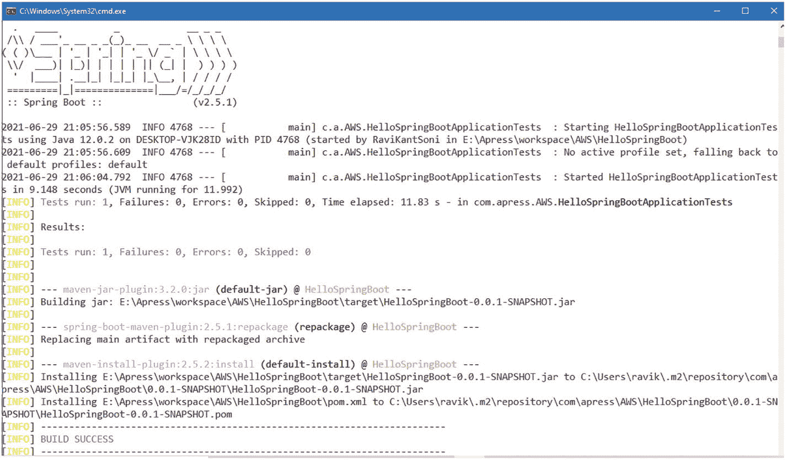

图 2-16

在命令提示符下成功构建

您需要获取生成的 JAR 文件并将其部署到 AWS Elastic Beanstalk。

## 在 AWS Elastic Beanstalk 中部署 Spring Boot 应用

您已经在本地创建并运行了 HelloSpringBoot REST API，并在`target`文件夹中创建了一个 JAR 文件。现在，让我们部署到 AWS Elastic Beanstalk。

使用 AWS 凭证登录到 AWS 管理控制台，并选择 Elastic Beanstalk 作为服务。在章节 [1](1.html) 中已经创建了两个应用，分别命名为`My First Elastic Beanstalk Application`和`helloworld`(见图 [2-17](#Fig17) )。

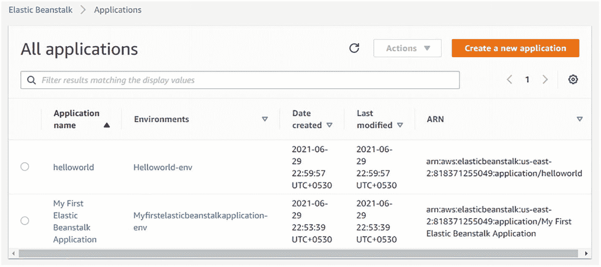

图 2-17

弹性豆茎应用

现在让我们为我们的 Spring Boot REST API 创建一个全新的应用。首先，点击**创建新应用**按钮，并输入 **HelloSpringBoot** 应用名称。接下来，单击 Create 按钮为应用创建一个新环境。然后，点击**立即创建一个**链接。选择 **Web 服务器环境**作为环境层，然后单击选择按钮。

在环境信息页面上，将域命名为`HelloSpringBoot`，并检查可用性。然后选择 Java 作为托管平台，如图 [2-18](#Fig18) 所示。

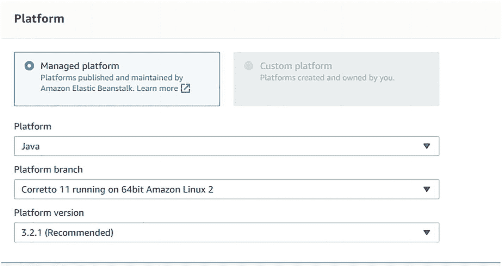

图 2-18

Java 平台

最后，通过从项目的`target`文件夹(例如，在作者的本地是`E:\Apress\workspace\AWS\HelloSpringBoot\target\HelloSpringBoot-0.0.1-SNAPSHOT.jar`)中选择 JAR 文件来上传您的代码，然后点击**创建环境**按钮。

Elastic Beanstalk 在启动过程中协调支持环境所需的所有 AWS 资源的创建和部署。这包括但不限于启动两个 EC2 实例，创建一个负载平衡器，并创建一个安全组，如图 [2-19](#Fig19) 所示。

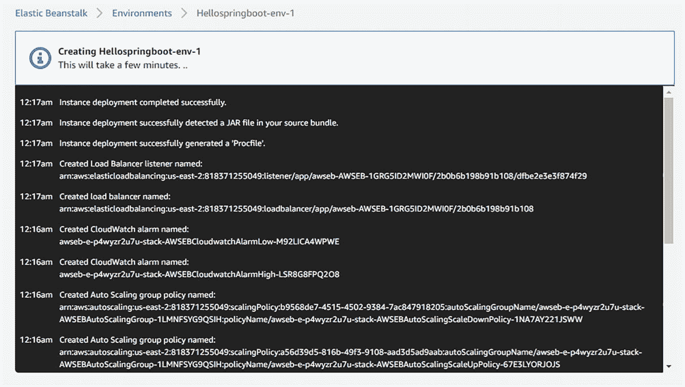

图 2-19

在 Elastic Beanstalk 中创建 Hellospringboot-env

一旦创建了环境并部署了资源，请注意健康报告为严重(参见图 [2-20](#Fig20) )。这是因为 Spring Boot 应用仍然需要一些配置。

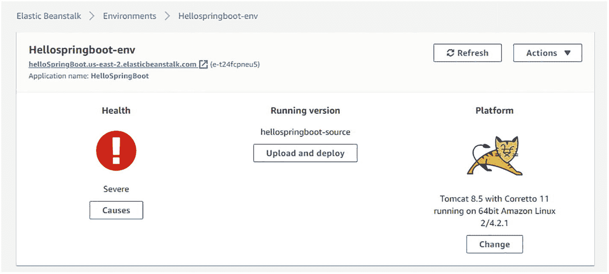

图 2-20

Spring Boot 应用的严重健康状况

AWS Elastic Beanstalk 假设应用监听端口 5000。要修复这种差异，请更改 Spring Boot 应用监听的端口。因此，您需要在 Elastic Beanstalk 环境中指定`SERVER_PORT`环境变量，并将值设置为 5000。

转到您环境中的配置页面。在配置下，点击编辑图标，如图 [2-21](#Fig21) 所示。

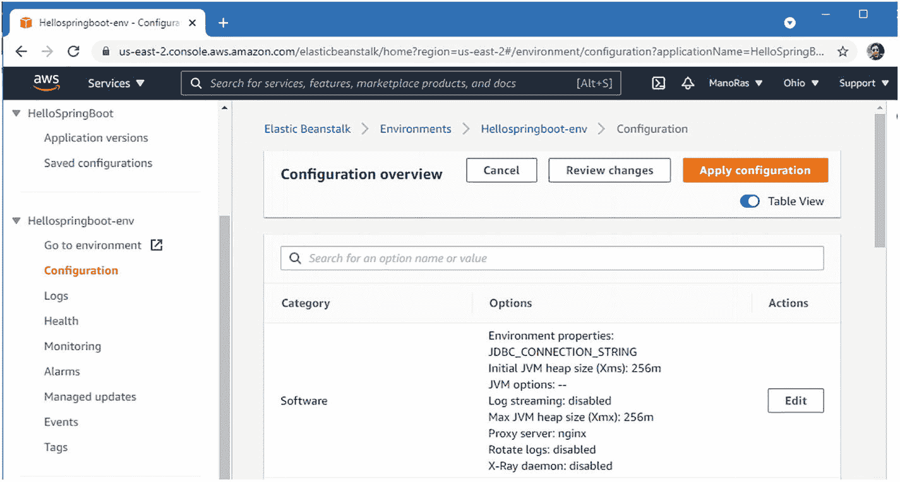

图 2-21

Spring Boot 应用严重健康

在环境属性中，您可以看到，当 Elastic Beanstalk 被配置为使用 Java 平台时，它已经设置了一些环境变量。

要更改 Spring Boot 应用监听的端口，添加一个新的环境变量 SERVER_PORT，值为 5000，如图 [2-22](#Fig22) 所示。

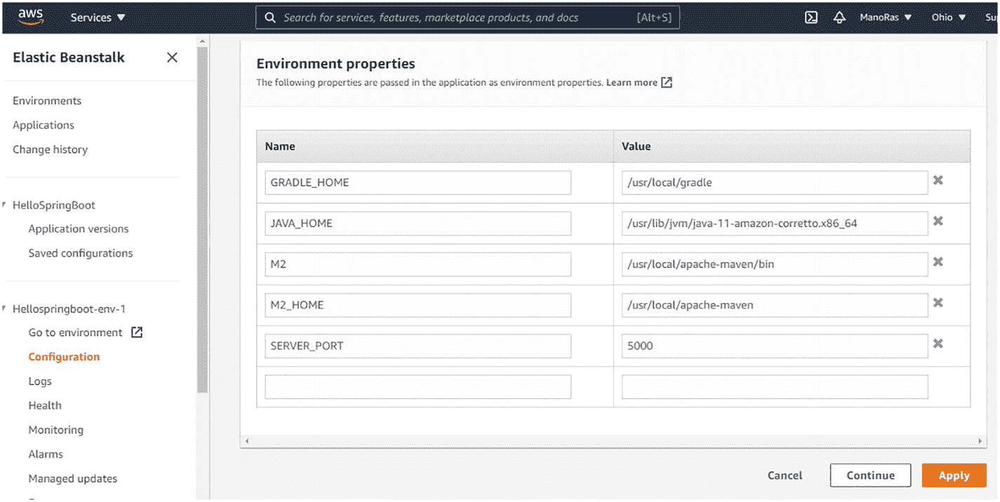

图 2-22

软件配置的环境属性

一旦单击“应用”,配置更改就会传播到应用服务器。应用重新启动。当它重新启动时，它通过环境变量获得新的配置。一分钟后，您会在仪表板上看到一个健康的应用，如图 [2-23](#Fig23) 所示。

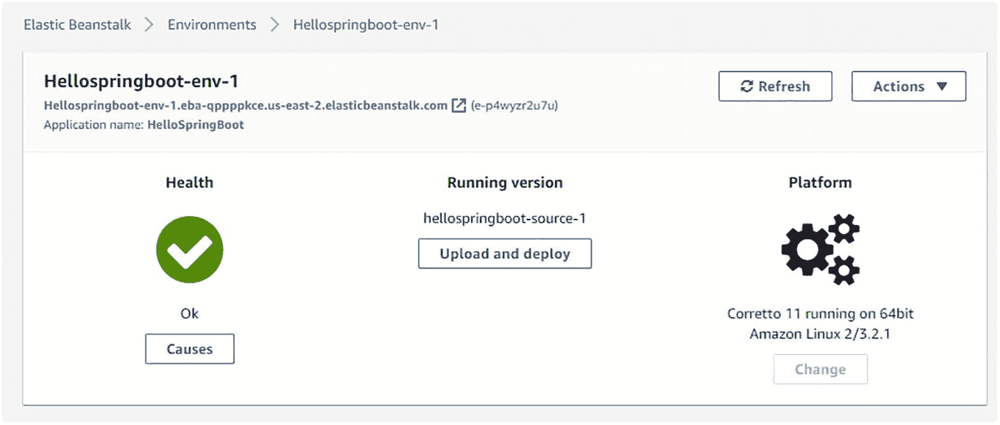

图 2-23

健康状况良好

## 在云中测试作为 REST API 的 Spring Boot 应用

现在，让我们在 AWS 中测试部署的 REST API 端点。使用您在环境中配置的 URL 来访问服务。对于这个例子，指定的 URL 是 [`http://hellospringboot-env-1.eba-qppppkce.us-east-2.elasticbeanstalk.com`](http://hellospringboot-env-1.eba-qppppkce.us-east-2.elasticbeanstalk.com) 。

对于第一个测试，在浏览器中，使用 HTTP GET 在 [`http://hellospringboot-env-1.eba-qppppkce.us-east-2.elasticbeanstalk.com` `/greeting`](http://hellospringboot-env-1.eba-qppppkce.us-east-2.elasticbeanstalk.com/greeting) 处与 URI 打招呼。该服务响应一条欢迎问候消息，如图 [2-24](#Fig24) 所示。

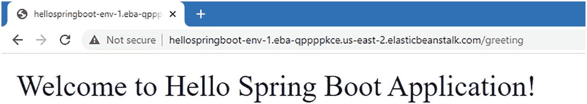

图 2-24

从浏览器访问部署在云上的 REST API

接下来，从浏览器进入 [`http://hellospringboot-env-1.eba-qppppkce.us-east-2.elasticbeanstalk.com/swagger-ui/`](http://hellospringboot-env-1.eba-qppppkce.us-east-2.elasticbeanstalk.com/swagger-ui/) 的 Swagger UI 仪表盘，如图 [2-25](#Fig25) 所示。

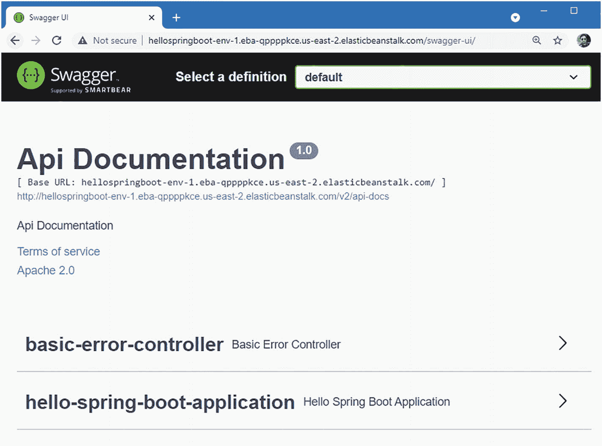

图 2-25

从浏览器访问 Swagger-UI 仪表板

## 探索来自弹性豆茎的原木

你可以从弹性豆茎探索 Spring Boot 日志。选择**日志** ➤ **请求**日志，从每个 EC2 实例中检索一个日志的最后 100 行或整组日志，如图 [2-26](#Fig26) 所示。

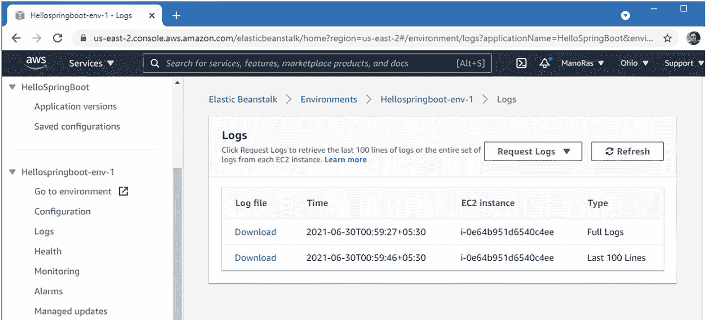

图 2-26

AWS 弹性豆茎原木

单击下载后，您会看到整个 Spring Boot 日志是可见的。

## 摘要

在本章中，您将 REST API 部署到了 Elastic Beanstalk。您创建了一个 Spring Boot 项目应用作为 REST API，然后为项目生成了一个 JAR 文件。您将这个 JAR 部署到 Elastic Beanstalk，解决了 AWS 中的服务器问题。最后，您访问了云中部署的应用。

在下一章中，您将使用 RDS 在 AWS 中部署一个 MySQL 数据库。