# 五、在 AWS 和 S3 部署全栈 Spring Boot React 应用

在第四章中，你创建了`UserRegistrationApp` Spring Boot RESTful web 服务，它与 Amazon RDS MySQL 数据库对话以执行 CRUD 操作。您了解了如何将 Lombok 项目配置到 STS IDE。您使用 JPA 注释创建了一个`Entity`类，一个扩展 JpaRepository 接口的存储库接口，一个用于 CRUD 方法的`Service`类，以及一个定义不同 REST 端点的 REST 控制器。之后，您使用 Postman 在本地测试了`UserRegistrationApp`应用。然后构建一个可执行的 JAR，部署在 AWS Elastic Beanstalk 中。最后，您使用 Swagger UI 测试了部署的 REST 端点。

世人看到的是前端，包括使用 HTML、CSS 等一些语言的设计。前端的主要目的是以一种定义良好的风格呈现数据，并允许与客户端交互以执行 CRUD 操作。有这么多令人惊叹的 JavaScript 库可以用来开发前端应用。

React 是一个开源的前端 JavaScript 库，用于构建单页面应用。React 是一个完美的客户端库解决方案，提供了一种干净的结构化方法。

本章介绍作为前端框架的 React 及其主要组件。你可以使用 React 作为前端开发一个单页应用，来消费由使用 Spring Boot 开发的`UserRegistrationApp`后端应用所公开的 API，如图 5-1 所示。

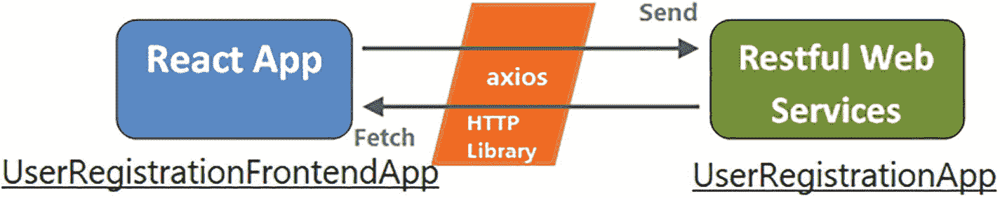

图 5-1

全栈应用概述

您设置了一个开发环境来开发您的 React 前端应用。在本章中，您将学习以下内容。

*   如何开发和运行 React 作为本地前端应用

*   如何将 React 前端部署到 AWS S3

这个前端应用有一个主页、一个添加新用户页面和一个带有删除选项的列出所有用户页面。您对 AWS 进行 API 调用，其中已经部署了名为`UserRegistrationApp`的后端 RESTful 服务。向您介绍了 AWS S3(简单存储服务)，在这里您部署了 React 前端应用。最后，验证 React 前端应用的成功部署。

## 作为前端应用开发和运行 React

让我们开始在本地系统中使用 React 开发和运行交互式前端应用。我们假设您对 JavaScript、HTML5、CSS 和 React 有很好的了解。如果想深入了解 React，参考 [`https://reactjs.org`](https://reactjs.org) 。

### 引入 React 作为前端框架

React 是一个开源的、基于组件的 JavaScript 库，用于构建快速的交互式 UI(用户界面)组件。它是由一位名叫乔丹·沃克的脸书软件工程师在 2011 年创建的。最初，它是由脸书开发和维护的。React 应用由独立的、隔离的、可重用的组件组成，这些组件是 React 应用的核心，每个组件负责构建复杂的、可重用的用户界面。每个 React 应用至少有一个被称为*根组件*的组件。这个根组件代表内部应用，并包含其他子组件。

您使用 React with CRUD 特性构建一个用户注册前端应用。这个 React 应用有不同的组件，如图 5-2 所示。

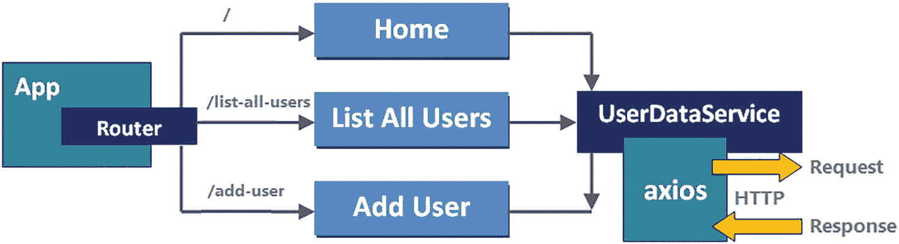

图 5-2

使组件与路由器和 Axios 发生反应

*   `App`组件是包含`react-router`的根组件。这还包含一个链接到路线路径的导航栏。

*   `Home`组件显示一条欢迎消息。

*   `ListAllUsers`组件显示带有删除选项的所有用户的列表。

*   组件有一个新用户提交的表单。

所有这些组件都调用`UserDataService`中所需的方法，它在内部使用 Axios HTTP 库来发出 HTTP 请求并接收响应。

#### 反应组分

在 React 中，组件被视为用户界面的核心部分。每个组件都有自己的结构，并且独立于其他组件，当所有组件合并成一个父组件时，就会产生应用的最终 UI。一个组件通常被实现为一个具有某种状态和呈现方法的 JavaScript 类，如清单 5-1 所示。

```java
class UserClass {
   state = {};
   render() {

   }
}

Listing 5-1Structure of Component with State and Render Method

```

React 中主要有两种类型的组件。

*   无状态功能组件
    *   这些是 JavaScript 函数，没有自己的状态，返回 HTML 来描述 UI。

*   有状态类组件
    *   这些是常规的 ES6 类，它们从 React 库中扩展了`Component`类。它们必须包含一个 render 方法，该方法反过来返回 React 元素或 HTML。他们管理地方政府。

#### 反应状态

状态是在组件内管理的可更新结构。一个`Stateful`组件有一个负责使用户界面动态和交互的状态。您需要声明一些缺省值来定义组件的初始状态。可以使用`setState`方法设置或更改状态。

#### 构造器

在 React 中，构造函数初始化一个类的对象状态。这个建构函式会在类别的物件建立期间自动呼叫。在安装组件之前调用它。您需要在构造函数中的任何其他语句之前调用`super(props)`方法。此外，在 React 中，构造函数绑定事件处理程序方法。

#### React 组件的生命周期

让我们探索一下 React 组件的生命周期。它主要由四个阶段组成，如图 5-3 所示。

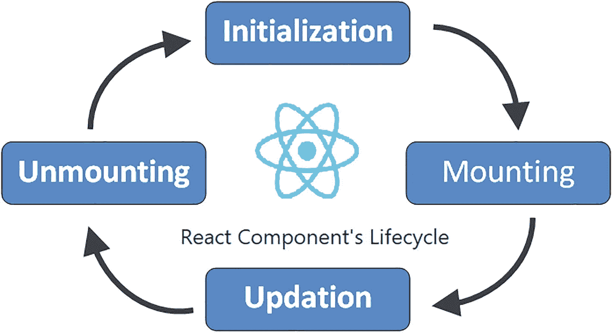

图 5-3

反应组件的生命周期

React 组件生命周期的不同阶段提供了不同的方法。React 根据组件阶段调用生命周期方法。

*   初始化是 React 组件的诞生阶段，它们通过设置初始状态和默认属性开始它们的旅程。这是在组件的构造函数中完成的。

*   挂载是 React 组件在文档对象模型(DOM)上挂载(创建和插入)的阶段。在完成初始化阶段之后，React 组件在这个挂载阶段第一次呈现。

*   更新是 React 组件生命周期的第三个阶段。它是创建的组件变更的状态。React 组件数据(例如，道具和状态)响应于诸如键入、点击等用户事件而被更新。

*   卸载是这个生命周期的最后一个阶段。React 组件实例被销毁并从 DOM 中卸载。

### 设置开发环境

运行任何 React 应用都需要以下工具。

*   一个**代码编辑器**，比如 Visual Studio，用来处理项目文件。可以从 [`https://code.visualstudio.com`](https://code.visualstudio.com) 下载。

*   去 [`https://nodejs.org`](https://nodejs.org) 下载安装最新版本的 **Node.js** ，这是一个 JavaScript 运行时环境。

*   一个名为 **npm** 的包管理器，它下载并运行构建在 Node.js 上的 JavaScript 包。

要检查 Node.js 和 npm 版本，在终端中运行`node –v`和`npm –v`命令，如图 5-4 所示。

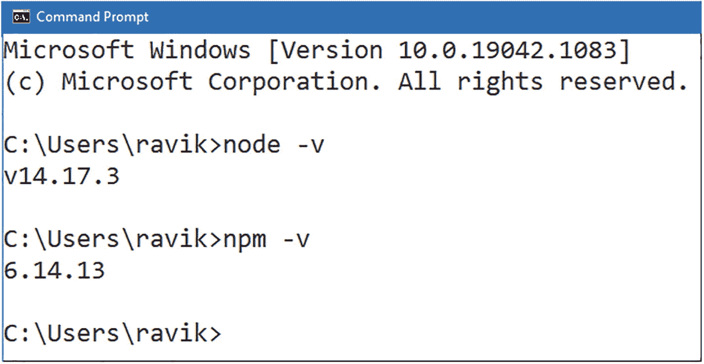

图 5-4

PC 中的 Node.js 和 npm 版本

### 跨来源资源共享(CORS)错误

当您在 React 中处理一个连接到用 Spring Boot 编写的 RESTful web 服务的前端应用时，无论何时在浏览器中发出请求，您都可能会得到一个 CORS 错误。基本上，这个错误意味着用户代理(`http://localhost:3000`)没有足够的权限访问 Spring Boot 资源(`http://localhost:5000`)。

该错误的解决方案需要更新 Spring Boot 应用，以支持对 RESTful web 服务的跨来源请求。您必须用`@CrossOrigin`注释来注释`Controller`类，以支持全局 CORS 配置，如清单 5-2 所示。并且，默认情况下，所有的 origins 和 GET、HEAD 和 POST HTTP 方法都是允许的。

```java
@CrossOrigin
@RestController
@RequestMapping("/api/")
public class UserRegistrationController {

Listing 5-2\src\main\java\com\apress\AWS\controller\UserRegistrationController.java

```

在更新了`Controller`类之后，Maven 构建并运行`UserRegistrationApp` Spring Boot 应用。此外，还要确保在使用 React 开发前端应用时，`UserRegistrationApp`应该一直运行。

### 用 create-react-app 开发 React 前端应用

`create-react-app`包使得开发 React 前端应用变得轻而易举。要使用`create-react-app`创建 React 应用，请在您想要保存项目文件夹的文件夹中打开命令提示符，并运行以下`npx`命令(参见图 5-5 )。

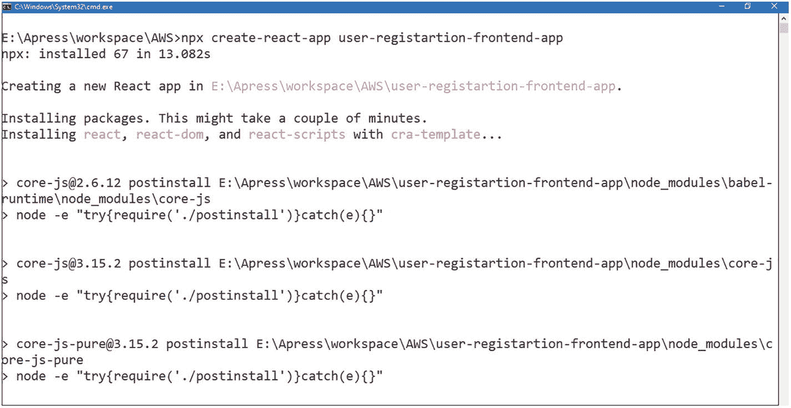

图 5-5

使用 create-react-app 创建 React 应用的 npx 命令

```java
npx create-react-app user-registartion-frontend-app

```

一旦`npx`命令运行成功，就会创建一个名为`user-registration-frontend-app`的文件夹，如图 5-6 所示；所有必需的软件包都会自动安装。

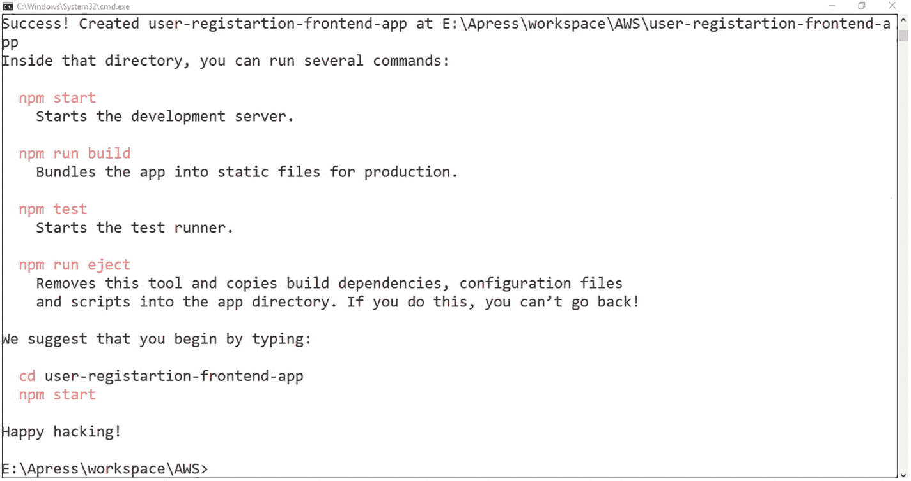

图 5-6

已成功创建用户注册前端应用

#### 审查项目结构

创建 React 项目并安装所有必需的依赖项后，在 Visual Studio 中打开该项目。项目结构应如图 5-7 所示。

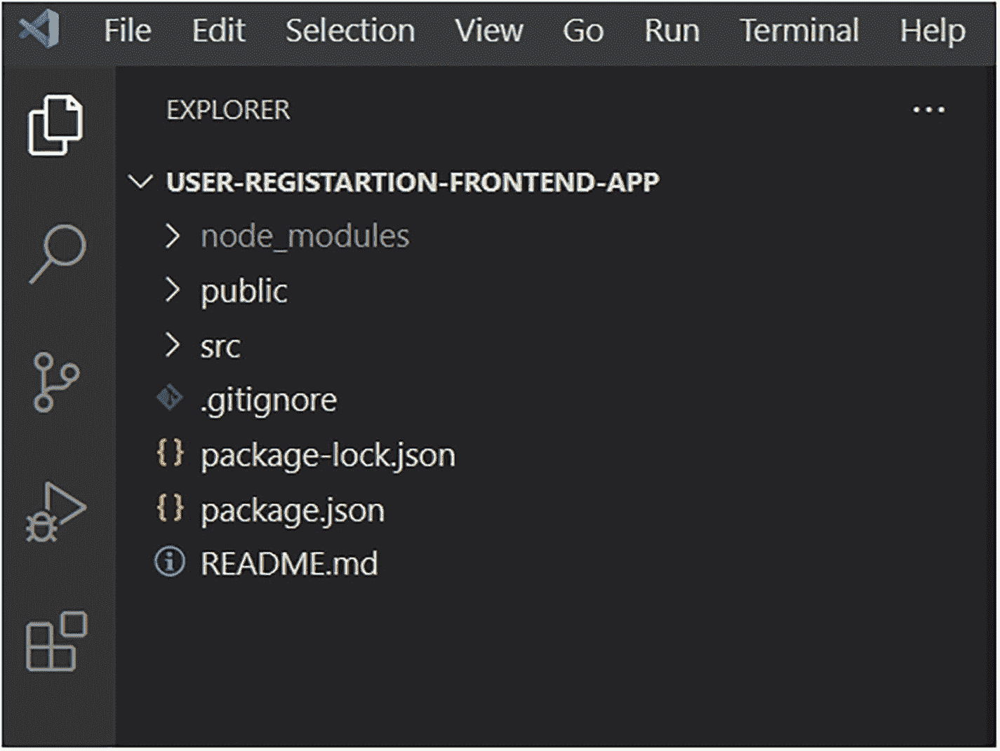

图 5-7

Visual Studio 中的项目结构

项目结构包含以下文件和文件夹。

*   `README.md`文件是一个包含许多有用信息的降价文件。

*   `package.json`文件管理应用所需的依赖项和运行它所需的脚本。

*   `.gitignore`文件排除了 Git 跟踪的文件和文件夹。一般来说，您会排除像`node_modules`文件夹这样的大文件夹。

*   `src`文件夹包含与 React 相关的源代码和您开发的所有组件。
    *   `src`文件夹中的`App.js`文件是 React 应用的根组件。

    *   `index.js`文件是 React 应用的顶层渲染文件。您使用`index.js`文件中的`ReactDOM.render()`方法导入`App`组件。

*   `public`文件夹存储 React 应用的静态资产，如字体和图像。
    *   `index.html`文件在公共文件夹中。React 应用使用这个文件来呈现所有组件。这支持了单页应用的原则。

*   `node_modules`文件夹包含了 Node.js 和 npm 安装的所有包。

#### 运行 React 应用

要构建 React 应用，以下文件必须以准确的文件名存在。

*   `public/index.html`是整个项目中唯一的 HTML 文件。这个 HTML 文件是一个模板，它在应用启动时首先被加载。
    *   只有那些在`public`文件夹中的文件可以从`public/index.html`中使用。

    *   这个文件包含一行代码`<div id="root"></div>`，这表示所有的 React 应用组件都被加载到这个 div 中。

*   `src/index.js`是 JavaScript 的入口点。

*   `The src/App.js`是`App`组件，是 React 中的主要组件；它充当所有其他组件的容器。

要启动 React app，在`user-registration-frontend-app`打开命令提示符，这是一个新创建的文件夹，运行`npm start`命令，如图 5-8 所示。

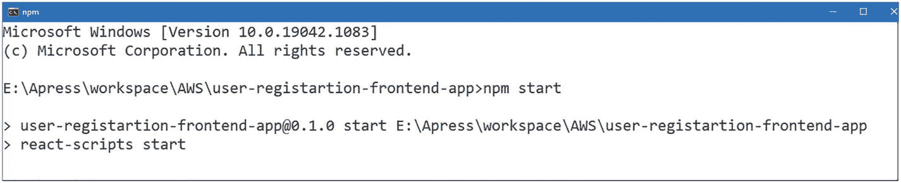

图 5-8

启动 React 应用的 npm 启动命令

命令提示符下会出现一条成功消息，如图 5-9 所示。

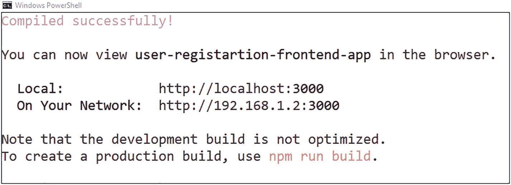

图 5-9

命令提示符下编译成功的消息

这启动了 localhost:3000 上的开发服务器。这个开发服务器的伟大之处在于，服务器会自动刷新以反映更改，而不需要手动刷新浏览器。

点击网址(`http://localhost:3000`)可以在浏览器中查看应用，如图 5-10 所示。

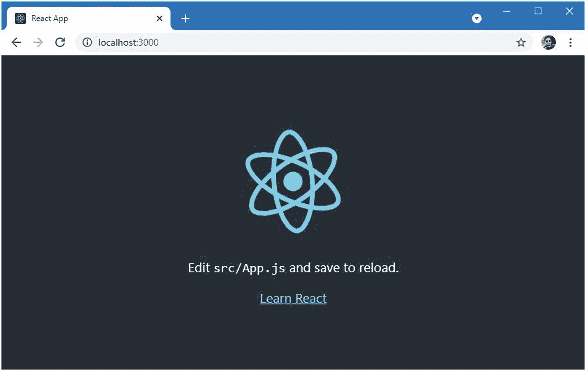

图 5-10

React 应用的主页

恭喜你！您已经成功地为 React 应用创建了一个基础源代码，以便根据需要添加更多组件。这个应用内容来自于`src/App.js`文件，该文件包含清单 5-3 中所示的代码。

```java
import logo from './logo.svg';
import './App.css';

function App() {
  return (
    <div className="App">
      <header className="App-header">
        
        <p>
          Edit <code>src/App.js</code> and save to reload.
        </p>
        <a
          className="App-link"
          href="https://reactjs.org"
          target="_blank"
          rel="noopener noreferrer"
        >
          Learn React
        </a>
      </header>
    </div>
  );
}

export default App;

Listing 5-3src/App.js

```

为了支持 CRUD 操作，让我们在 React 应用中创建以下附加文件。

*   `src/services/user-registration.service.js`

*   `src/components/add-user.component.js`

*   `src/components/home.component.js`

*   `src/components/list-users.component.js`

#### 添加 Twitter Bootstrap 以 CSS 样式化 React 应用

默认情况下，`create-react-app`通过在`src`文件夹中提供一个`App.css`文件来支持 CSS，您可以在其中添加一些样式来改善外观。Twitter Bootstrap 是一个前端 CSS 框架，可以设计网站内容的样式。

打开命令提示符，运行`npm install bootstrap`命令，在`node_modules`文件夹中安装引导程序，如图 5-11 所示。

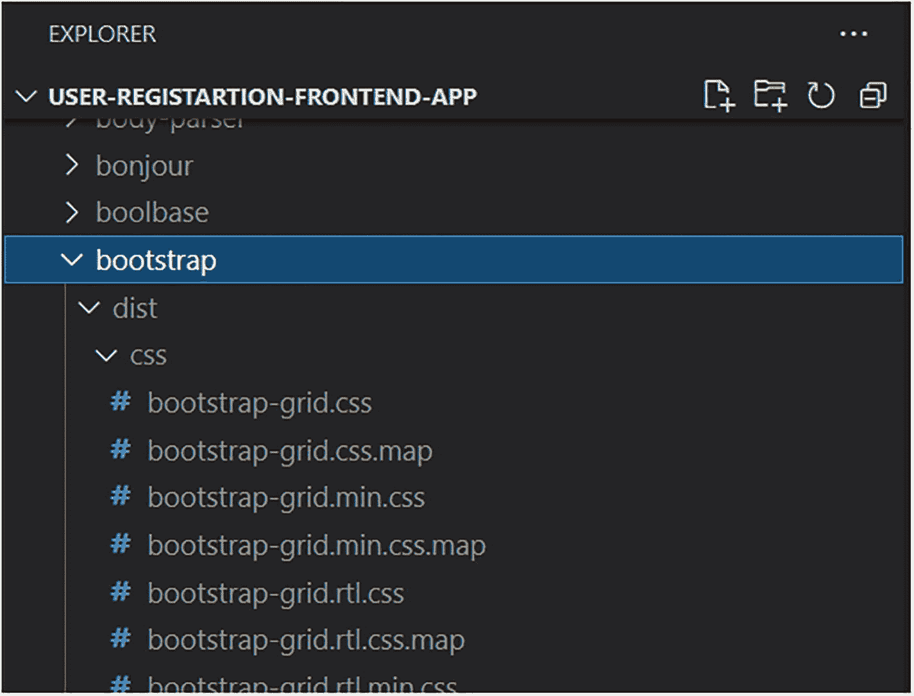

图 5-11

安装在 node_modules 文件夹中的引导

要将 Twitter Bootstrap 导入 React 应用，打开`src/App.js`文件并修改代码，如清单 5-4 所示。

```java
import './App.css';
import 'bootstrap/dist/css/bootstrap.min.css'

function App() {
      // ...
}

Listing 5-4src/App.js

```

#### 添加 Navbar

让我们向`App`组件添加一个导航栏，它是 React 应用的根容器。用清单 5-5 中所示的代码更新`src/App.js`文件。

```java
import './App.css';
import 'bootstrap/dist/css/bootstrap.min.css'

function App() {
  return (
    <div className="App">
      <header className="App-header1">
        <div class="page-header text-center">
          <h2>User Registration App</h2>
        </div>
      </header>
      <div class="container-fluid">
        <nav class="navbar  bg-primary  justify-content-center">
            <div class="col-sm"></div>
            <a href="/"
              class="col-sm btn btn-outline-light"
              role="button">
              Home
            </a>
            <div class="col-sm"></div>
            <a href="/list-all-users"
              class="col-sm btn btn-outline-light"
              role="button">
              List All Users
            </a>
            <div class="col-sm"></div>
            <a href="/add-user"
              class="col-sm btn btn-outline-light"
              role="button">
              Add User
            </a>
            <div class="col-sm"></div>
        </nav>
      </div>
    </div>
  );
}

export default App;

Listing 5-5src/App.js

```

#### 添加反应路由器

路由是根据用户的请求或操作将用户重定向到不同页面的过程。`react-router`包是建立在 React 之上的标准库系统，在单页面 web 应用中使用`react-router`定义多个路由。当用户在浏览器中输入特定的 URL，并且该 URL 路径与定义的路由匹配时，用户将被路由到该 URL。

默认情况下，React 不附带路由。并且，您需要在项目中添加一个 react-router 库来启用路由。打开命令提示符并运行以下命令来安装`react-router`。

```java
npm install react-router-dom

```

既然你已经成功安装了`react-router`，那就让我们在应用中使用它吧。

##### 启用路由的 BrowserRouter 对象

使用 HTML5 历史 API 来保持你的用户界面与 URL 同步。它用于带有 URL 段的客户端路由。

首先，您需要从`react-router-dom`导入`BrowserRouter`来启用项目中的路由。打开并更新`src/index.js`，用`BrowserRouter`对象包装 app 组件，如清单 5-6 所示。

```java
import React from 'react';
import ReactDOM from 'react-dom';
import './index.css';
import App from './App';
import reportWebVitals from './reportWebVitals';
import { BrowserRouter } from "react-router-dom";

ReactDOM.render(
  <BrowserRouter>
    <App />
  </BrowserRouter>,
  document.getElementById('root')
);

reportWebVitals();

Listing 5-6src/index.js

```

##### 切换和路由以渲染路由

专门绘制路线，帮助在页面间切换，无需重新加载。匹配组件和路径的每条路线都会进行包含性渲染。

`path`属性定义了路线的路径；例如，`/`定义了主页的路径。`Route`加载定义好的组件；例如，它载入了主构件。用清单 5-7 中所示的源代码更新`src/App.js`文件。

```java
import './App.css';
import React, {components} from 'react';
import { Switch, Route } from 'react-router-dom';
import 'bootstrap/dist/css/bootstrap.min.css'

import ListUsers from './components/list-users.component';
import Home from './components/home.component';
import AddUser from './components/add-user.component';

function App() {
  return (
    <div className="App">
      <header className="App-header1">
        <div class="page-header text-center">
          <h2>User Registration App</h2>
        </div>
      </header>
      <br/>
      <div class="container-fluid">
        <nav class="navbar  bg-primary  justify-content-center">
            <div class="col-sm"></div>
            <a href="/"
              class="col-sm btn btn-outline-light"
              role="button">
              Home
            </a>
            <div class="col-sm"></div>
            <a href="/list-all-users"
              class="col-sm btn btn-outline-light"
              role="button">
              List All Users
            </a>
            <div class="col-sm"></div>
            <a href="/add-user"
              class="col-sm btn btn-outline-light"
              role="button">
              Add User
            </a>
            <div class="col-sm"></div>
        </nav>
        <br/>
        <div className="container mt-3">
          <Switch>
            <Route exact path={["/"]} component={Home} />
            <Route exact path={["/list-all-users"]} component={ListUsers} />
            <Route exact path={["/add-user"]} component={AddUser} />
          </Switch>
        </div>
      </div>
    </div>
  );
}

export default App;

Listing 5-7Update src/App.js with react-router

```

React 应用中定义了三条路线。

*   `/`为首页

*   `/list-all-users`对于列出所有用户页面

*   `/add-user`对于添加用户页面

#### 为 REST API 调用初始化 Axios

React 是一个构建用户界面的 JavaScript 库。它与 HTTP 无关。要进行 HTTP 或 REST API 调用，需要使用第三方 HTTP 库。这里，您使用 Axios HTTP 库。

Axios 是一个基于 promise 的 HTTP 客户端，它允许您向给定的端点发出 HTTP 请求，并且具有良好的默认设置，可以与 JSON 一起工作。要使用 React 设置 Axios，您需要使用 npm 安装 Axios。打开命令提示符并运行`npm install axios`命令。让我们在`src`文件夹中创建一个`http-common.js`文件，如清单 5-8 所示。

```java
import axios from "axios";

export default axios.create({
  baseURL: "http://localhost:5000/api/",
  headers: {
    "Content-type": "application/json"
  },
});

Listing 5-8src/http-common.js

```

根据 REST API 的 URL，可以在文件中更新`baseURL`。

#### 数据服务发送 HTTP 请求

接下来，创建一个使用 Axios 向 REST API 发送 HTTP 请求的数据服务。让我们在`src`文件夹中创建一个`service`文件夹，并在该文件夹中创建一个`user-registration.service.js`文件，如清单 5-9 所示。

```java
import http from '../http-common';

class UserDataService {

    getAllUsers() {
      return http.get("/users");
    }

    createUser(user) {
      return http.post("/user/save", user);
    }

    deleteUser(id) {
      return http.delete(`/user/delete/id/${id}`);
    }
}

export default new UserDataService();

Listing 5-9src/user-registration.service.js

```

`UserDataService`定义了三种方法:`getAllUsers, createUser`和`deleteUser`。对应于 HTTP GET、POST 和 DELETE 方法调用 Axios `get`、`post`和`delete`方法进行 CRUD 操作。

#### 创建与路线对应的 React 组件

在`src/components/`子文件夹中创建对应于之前定义的三条路线的三个组件。

##### 家用部件

让我们创建`Home`组件，它显示欢迎消息和一个导航栏。清单 5-10 显示了 home 组件的代码。

```java
import React, { Component } from "react";

export default class Home extends Component {
    render() {
        return (
            <div class="container">
                <div class="panel panel-default">
                    <div class="alert alert-success">
                        <span class="lead">
                            Welcome to User Registration App
                        </span>
                    </div>
                    <div class="panel-body ">
                        <div class="alert alert-info">
                            <ul>
                                <li>
                                    Please click on
                                    <strong> List All Users </strong>
                                    to get all users.
                                </li>
                                <li>
                                    Please click on
                                    <strong> Add User </strong>
                                    to add a new user.
                                </li>
                            </ul>
                        </div>
                    </div>
                </div>
            </div>
        );
    }
}

Listing 5-10src/components/home.component.js

```

在这个组件中，您创建了一个扩展了`Component`类的`Home`类，该类包含一个返回包含欢迎消息的 HTML 代码的`render()`方法。

保存此主构件文件时，浏览器上的内容会自动刷新。浏览器中的结果如图 5-12 所示。

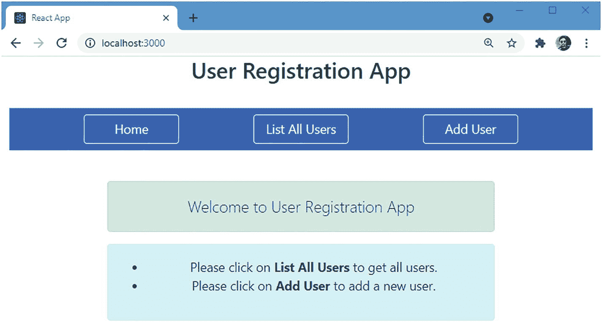

图 5-12

用户注册应用主页

##### 添加用户组件

让我们创建另一个组件，以便在组件中添加新用户。该组件有一个提交新用户的表单，该表单有四个字段:名、姓、年龄和地址。清单 5-11 、 5-12 、 5-13 和 5-14 显示了`add-user`组件的代码片段。

```java
import React, { Component } from "react";
import userRegistrationService from "../services/user-registration.service";

Listing 5-11Imports in src/components/add-user.component.js

```

这里，我们从`"react"`和`user-registration-service`导入了 React 和 Component。

```java
export default class AddUser extends Component {

    constructor(props) {
      super(props);

      this.onChangeFirstName = this.onChangeFirstName.bind(this);
      this.onChangeLastName = this.onChangeLastName.bind(this);
      this.onChangeAge = this.onChangeAge.bind(this);
      this.onChangeAddress = this.onChangeAddress.bind(this);
      this.handleSubmit = this.handleSubmit.bind(this);
      this.newUser = this.newUser.bind(this);

      this.state = {
        id: null,
        firstName: "",
        lastName: "",
        age: "",
        address: "",
        createdDate: ""
      };

    }

Listing 5-12Constructor and State in AddUser Class in src/components/add-user.component.js

```

在前面的代码中，`AddUser`类扩展了组件。这个类的构造函数用默认值为`id, firstName, lastName, age, address,`和`createdDate`设置初始状态。此外，我们将它绑定到不同的事件，如`onChangeFirstName`、`handleSubmit`等。

```java
    onChangeFirstName(event) {
        this.setState({
            firstName: event.target.value
        });
    }

    onChangeLastName(event) {
        this.setState({
            lastName: event.target.value
        });
    }

    onChangeAge(event) {
        this.setState({
            age: event.target.value
        });
    }

    onChangeAddress(event) {
        this.setState({
            address: event.target.value
        });
    }

    handleSubmit(event) {
        console.log(this.state)

        var data = {
            firstName: this.state.firstName,
            lastName: this.state.lastName,
            age: this.state.age,
            address: this.state.address
        };

        event.preventDefault();

        userRegistrationService.createUser(data)
        .then(response => {
            alert('You submitted successfully! ' + data.firstName + ' User is created');
            this.setState({
                id: response.data.id,
                firstName: response.data.firstName,
                lastName: response.data.lastName,
                age: response.data.age,
                address: response.data.address
            });
            this.props.history.push("/list-all-users");
        })
        .catch(e => {
            console.log(e);
        });
    }

    newUser() {
        this.setState({
            id: null,
            firstName: "",
            lastName: "",
            age: "",
            address: "",
            createdDate: ""
        });
    }

Listing 5-13Functions in AddUser Class in src/components/add-user.component.js

```

创建了四个函数(`onChangeFirstName, onChangeLastName, onChangeAge, onChangeAddress`)来跟踪输入值并设置状态变化。定义了一个名为`handleSubmit`的函数来获取表单(state)的值，并调用`userRegistrationService`的`createUser()`方法，该方法在内部向 REST API 发送 HTTP POST 请求。

```java
    render() {
        return (
            <div className="submit-form">
                <div className="form-group">
                    <label htmlFor="firstName">First Name</label>
                    <input
                        type="text"
                        className="form-control"
                        id="firstName"
                        required
                        value={this.state.firstName}
                        onChange={e => this.onChangeFirstName(e)}
                        name="firstName"
                    />
                </div>

                <div className="form-group">
                    <label htmlFor="lastName">Last Name</label>
                    <input
                        type="text"
                        className="form-control"
                        id="lastName"
                        required
                        value={this.state.lastName}
                        onChange={e => this.onChangeLastName(e)}
                        name="lastName"
                    />
                </div>

                <div className="form-group">
                    <label htmlFor="age">Age</label>
                    <input
                        type="text"
                        className="form-control"
                        id="age"
                        required
                        value={this.state.age}
                        onChange={e => this.onChangeAge(e)}
                        name="age"
                    />
                </div>

                <div className="form-group">
                    <label htmlFor="address">Address</label>
                    <input
                        type="text"
                        className="form-control"
                        id="address"
                        required
                        value={this.state.address}
                        onChange={e => this.onChangeAddress(e)}
                        name="address"
                    />
                </div>

                <button onClick={this.handleSubmit} className="btn btn-success">
                Submit
                </button>
            </div>
        )
    }
}

Listing 5-14Render Method to Return HTML Code

```

这里，render 方法产生 UI。`AddUser`包含名字、姓氏、年龄和地址的输入框，还包含创建新用户的提交按钮，如图 5-13 所示。

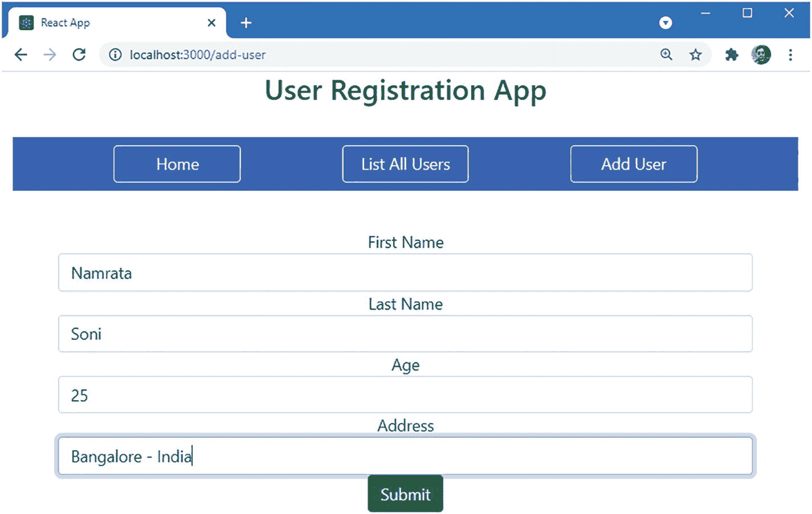

图 5-13

用于添加新用户的页面

##### 列出所有用户组件

让我们创建另一个组件来列出`components`子文件夹中的所有用户。这个组件有一个*用户数组*来显示表中的用户列表，每一行都有一个删除按钮来从列表中删除特定的用户。清单 5-15 和 5-16 显示了`list-user`组件的代码片段。

```java
import React, { Component } from "react";
import UserDataService from '../services/user-registration.service';

export default class UsersList extends Component {
    constructor(props) {
      super(props);
      this.retrieveUsers = this.retrieveUsers.bind(this);
      this.deleteUser = this.deleteUser.bind(this);
      this.state = {
        users: []
      };
    }

    componentDidMount() {
        this.retrieveUsers();
    }

    retrieveUsers() {
        UserDataService.getAllUsers()
            .then(response => {
                this.setState({
                users: response.data
                });
                console.log(response.data);
            })
            .catch(e => {
                console.log(e.target);
            });
    }

    deleteUser(user, index) {
        UserDataService.deleteUser(user.id)
            .then(response => {
                alert('Deleted successfully! ' + user.firstName);
                this.retrieveUsers();
            })
            .catch(e => {
                console.log(e.target);
            });
    }

Listing 5-15Imports, Constructor, State, and Functions in UsersList Class in src/components/list-users.component.js

```

`UsersList`类扩展了`Components`类。`React, Component,`和`user-registration-service`进口为`UserDataService`。我们定义了这个类的构造函数，它为用户数组设置初始状态。此外，我们将此绑定到不同的事件，如`retrieveUsers`和`deleteUser`。

`retrieveUsers`函数被定义为通过调用`UserDataService`的`getAllUsers()`方法来获取用户列表，该方法在内部向 REST API 发送 HTTP GET 请求。定义了一个名为`deleteUser`的函数，通过调用`UserDataService`的`deleteUser()`方法来删除用户，该方法在内部向 REST API 发送 HTTP 删除请求。在组件被挂载(放在 DOM 中)后,`componentDidMount()`方法立即执行 React 代码。

```java
    render() {
        const { users } = this.state;

        return (
                <table class="table table-hover">
                    <caption>List of users</caption>
                    <thead class="thead-dark">
                    <tr>
                        <th scope="col">#</th>
                        <th scope="col">First Name</th>
                        <th scope="col">Last Name</th>
                        <th scope="col">Age</th>
                        <th scope="col">Address</th>
                        <th scope="col">Delete</th>
                    </tr>
                    </thead>
                    <tbody>
                        {users && users.map((user, index) => (
                            <tr>
                                <th scope="row">{index+1}</th>
                                <td>{user.firstName}</td>
                                <td>{user.lastName}</td>
                                <td>{user.age}</td>
                                <td>{user.address}</td>
                                <td>
                                    <button type="button"
                                        onClick={() => this.deleteUser(user, index)}
                                        class="btn btn-danger custom-width"
                                        key={index}
                                    >
                                        <span class="glyphicon glyphicon-remove">
                                            Delete
                                        </span>
                                    </button>
                                </td>
                            </tr>
                        ))}
                    </tbody>
                </table>
        );
    }
}

Listing 5-16Render Method to Return HTML Code

```

`render`方法产生一个 UI。“用户列表”页面在表格中显示用户列表。它还为表格中的每个用户行包含一个删除按钮，如图 5-14 所示。

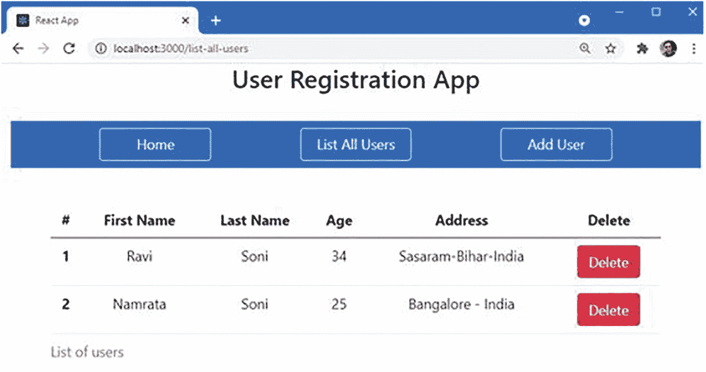

图 5-14

列出所有用户以及删除用户选项

尽管您在上一节中只添加了一个用户，但该列表显示了两个用户。这是因为数据库已经包含一个在第四章中添加的用户。

在这里，点击删除按钮删除一个特定的用户，如图 5-15 所示。

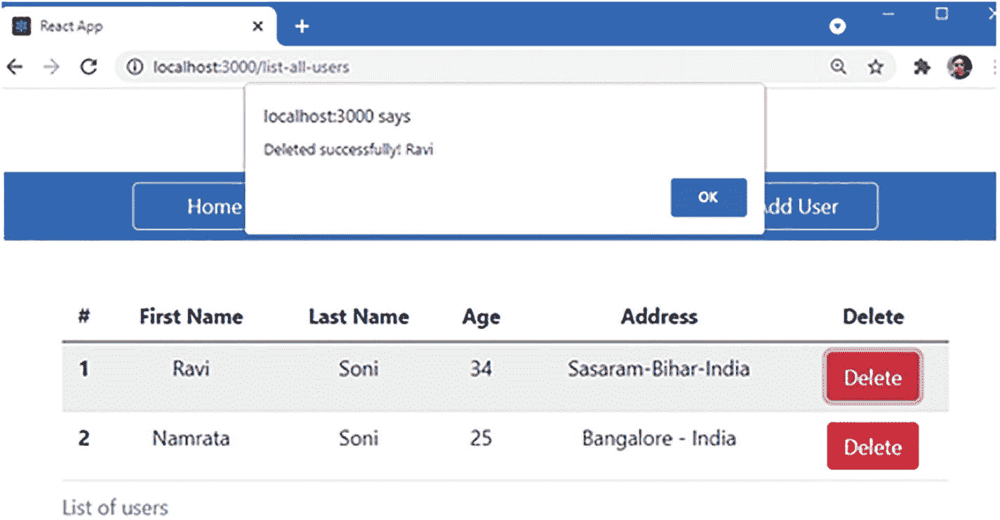

图 5-15

删除现有用户

成功删除特定用户后，表格显示更新后的用户列表，如图 5-16 所示。

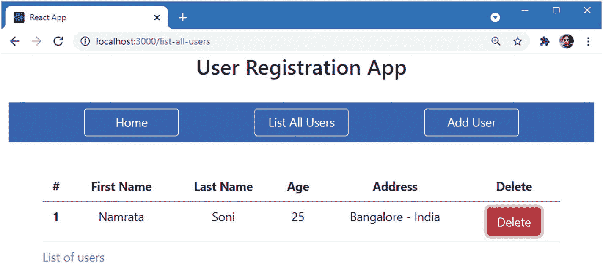

图 5-16

删除操作后更新了用户列表

## 构建 React 代码作为 AWS 的前端应用

您已经在本地系统中使用 React with CRUD 特性成功开发并运行了一个用户注册前端应用，该应用使用来自也在本地系统中运行的`UserRegistrationApp` RESTful web 服务的数据。要将 React 应用部署到 AWS，您需要构建 React 代码。

### 验证 AWS 弹性 Beanstalk 环境已启动

您已经更新了 Spring Boot 应用，它应该被部署到 Elastic Beanstalk。您已经了解了后端应用的部署流程，因此您需要遵循这里的流程来完成`UserRegistrationApp` Spring Boot 应用的部署。一旦您成功地部署了更新的代码，您需要验证弹性 Beanstalk 环境已经启动，如图 5-17 所示。

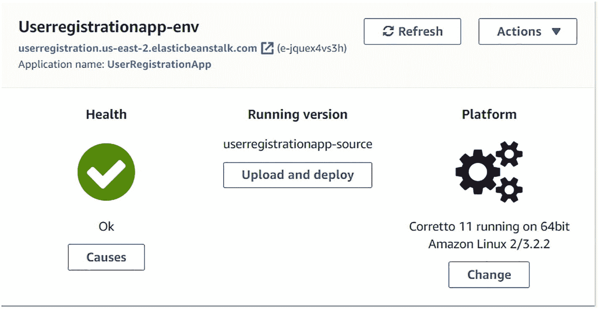

图 5-17

验证 Elastic Beanstalk 环境是否已启动

### 使用 AWS Elastic Beanstalk 环境 URL 更新 React 应用中的 BaseURL

我们在`src/http-common.js`文件中的 React 前端应用中提供了 RESTful 应用的 localhost URL，以便 Axios 可以从前端到后端进行 REST API 调用。

现在，React 前端应用应该与部署在 Elastic Beanstalk 中的 RESTful web 服务进行交互。为此，打开`src/http-common.js`文件并用弹性 Beanstalk 环境 URL 更新基本 URL，如清单 5-17 所示。

```java
import axios from "axios";

export default axios.create({
  //baseURL: "http://localhost:5000/api/",
  baseURL: "http://userregistration.us-east-2.elasticbeanstalk.com/api/",
  headers: {
    "Content-type": "application/json"
  },

});

Listing 5-17src/http-common.js

```

在构建之前，让我们在本地验证这些更改。在浏览器中访问“列出所有用户”页面后，您可以看到来自 AWS 的结果，如图 5-18 所示。

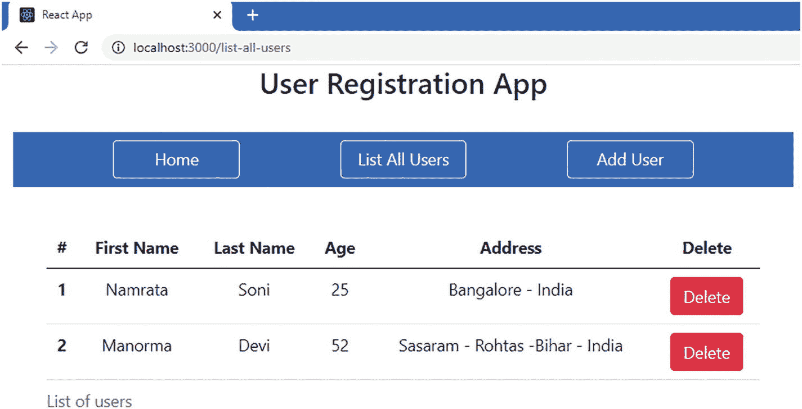

图 5-18

React app 与部署在 Elastic Beanstalk 中的 RESTful web 服务进行交互

为了交叉验证更改，在浏览器中打开开发者工具并验证请求 URL，如图 5-19 所示，为 POST 方法创建一个新用户。

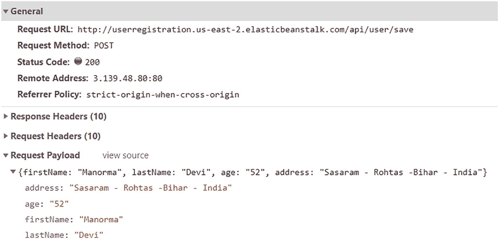

图 5-19

在浏览器开发工具中验证请求 URL

### 为 AWS 部署构建 React 代码

您已经在 React 应用中进行了所需的更改，并验证了这些更改，以确认 React 应用与部署在 AWS 中的 RESTful web 服务进行了交互。现在，您希望将这个 React 前端应用部署到 AWS 服务器。您需要为 React 应用创建一个构建。

要创建一个构建，您需要停止 React 应用，并在命令提示符下执行下面的`npm`命令。

```java
E:\Apress\workspace\AWS\user-registartion-frontend-app>npm run build

```

运行 build 命令后，React 应用中会创建一个名为`build`的文件夹，其中会填充一个优化的生产版本，如图 5-20 所示。

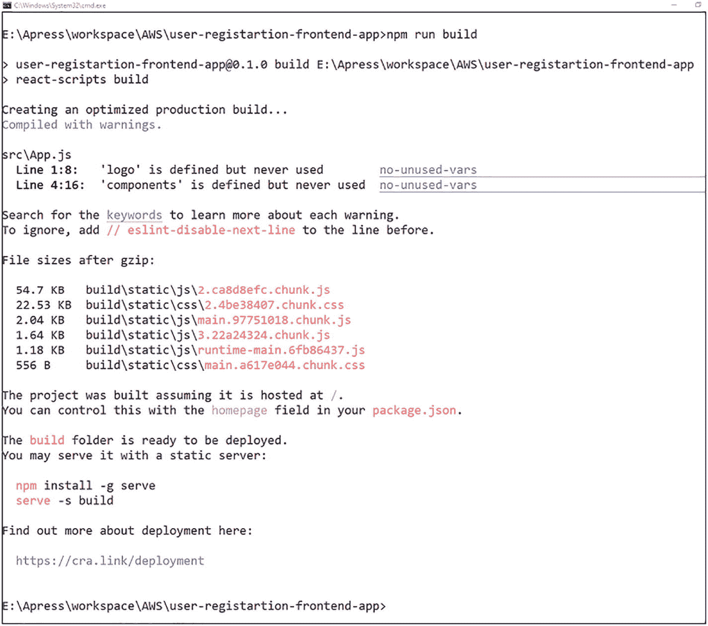

图 5-20

使用 npm 命令构建 React 应用

所以，现在`build`文件夹准备好了。它包含一个`static`文件夹和`asset-manifest.json`、`fevicon.ico`、`index.html`、`manifest.json`、`logo.png`、`robots.txt`文件，如图 5-21 所示。

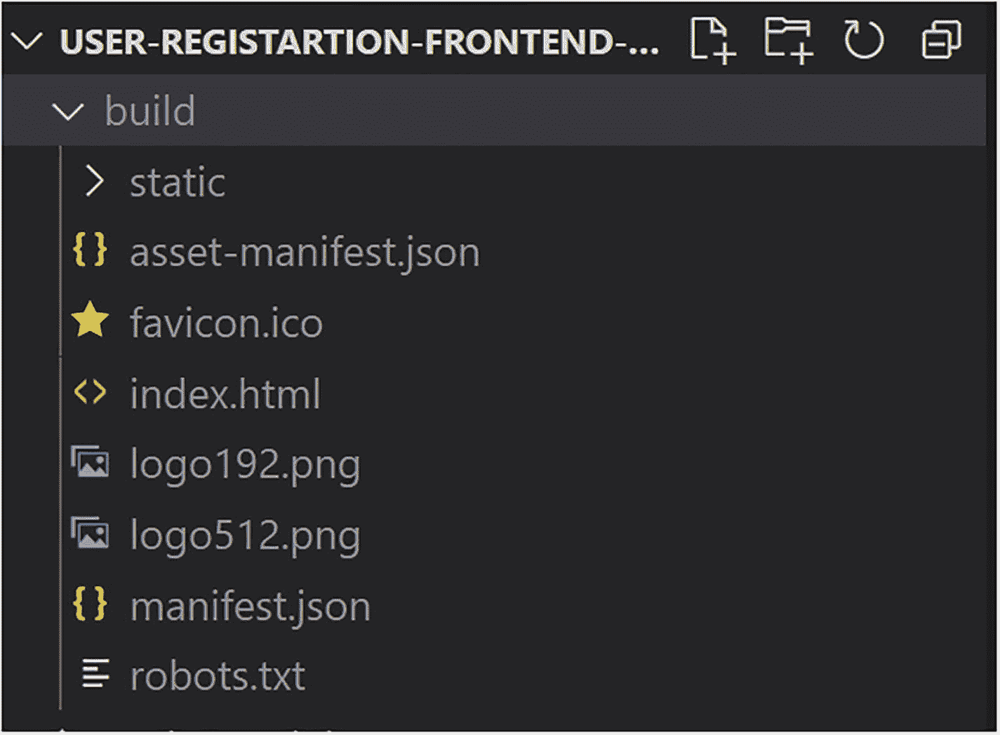

图 5-21

React 应用中的构建文件夹

## 将 React 前端部署到 AWS S3:托管静态网站

在上一节中，您构建了一个 React 前端应用，希望将其部署在 AWS S3 中。

### S3 简介:AWS 中的简单存储服务

S3 代表简单存储服务，是云中的可扩展存储。S3 基本上是一个对象商店。

登录 AWS 控制台管理，点击顶部的**所有服务**超链接，在存储类别下找到 S3，如图 5-22 所示。

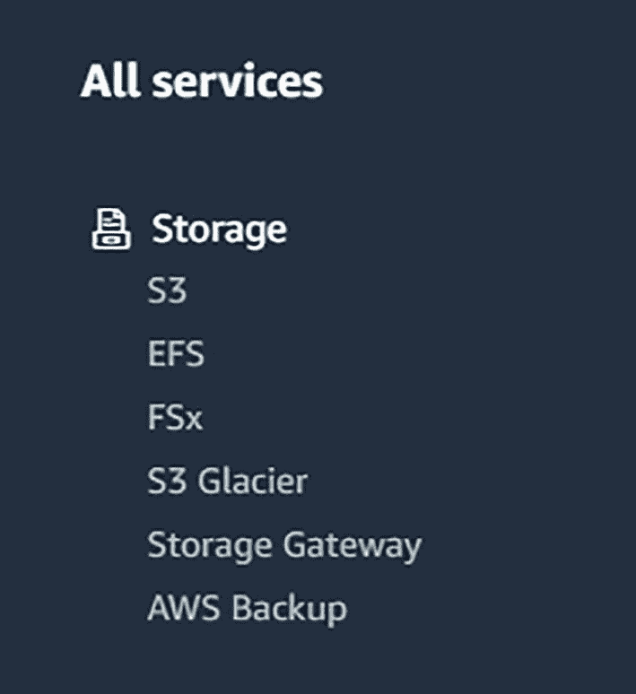

图 5-22

AWS 上存储类别下的 S3 服务

点击 S3 会将你带到包含该桶的详细信息的页面，如图 5-23 所示。

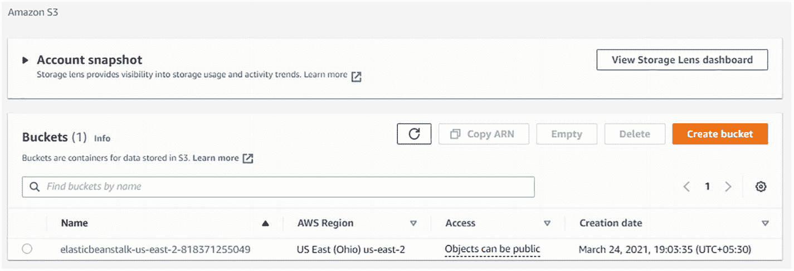

图 5-23

亚马逊 S3 的桶详细信息

一个*桶*是属于该容器的文件对象的集合。图 5-23 显示在亚马逊 S3 有一个桶。

图 5-24 显示这个桶包含了您在前面章节中部署的所有 jar，如。

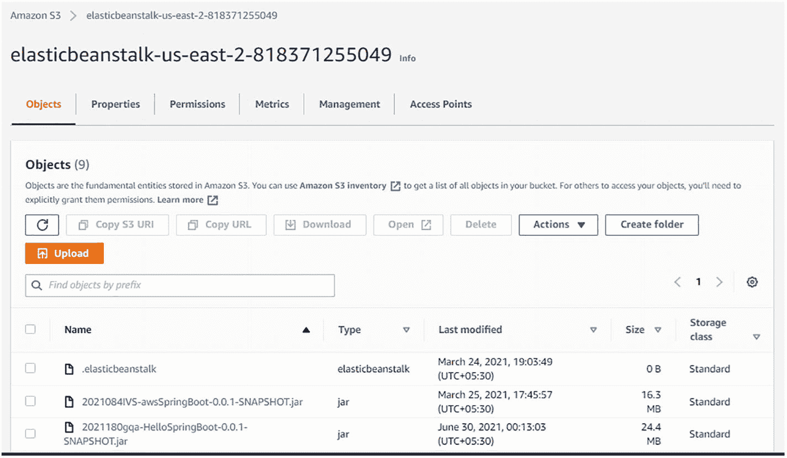

图 5-24

桶里有罐子

AWS 从 S3 获取所有需要的 jar，您可以认为这主要是 AWS 中的一个存储服务。如果您想存储备份文件、归档文件、数据暂存或日志文件等内容，可以在 AWS 中使用 S3。

S3 还可以为静态网站提供服务，这是您部署 React 应用的特性。S3 提供高耐用性和高可用性。

虽然存储桶与地区相关联，但是当您使用 S3 时，您是在一个全球空间中，这意味着一个全球服务，并且您并没有真正选择一个地区，如图 5-25 所示。

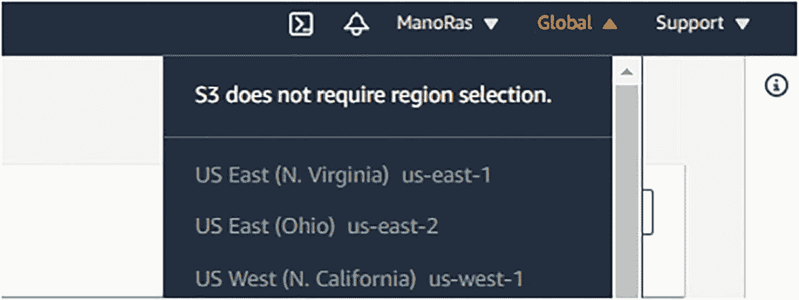

图 5-25

选择 S3 意味着全球服务

接下来，在 AWS S3 部署 React 应用。

### 创建一个桶

打开**创建桶**页面，如图 5-26 所示。

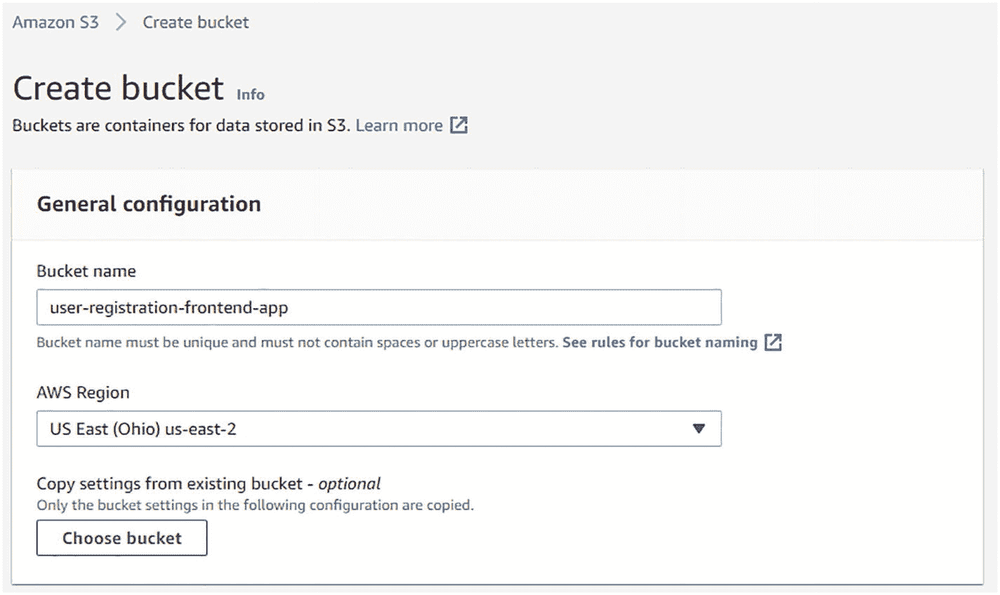

图 5-26

使用 spring initialize 创建用户注册应用

这里，您需要提供一般的配置信息。在 AWS 中输入时段名称时，时段名称应该是全局唯一的。在 Bucket name 中输入`user-registration-frontend-app`，页面上的其他选项保持不变，然后点击 **Create bucket** 按钮。您应该会得到一条成功消息，如图 5-27 所示。

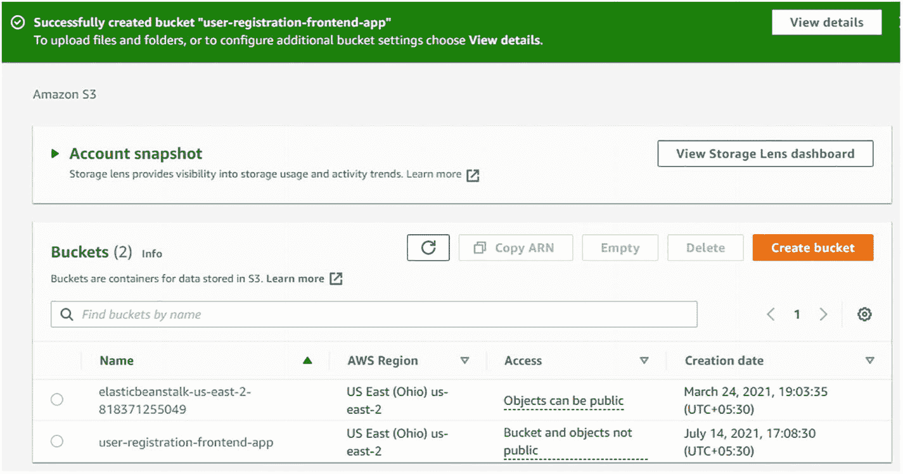

图 5-27

使用 spring initialize 创建用户注册应用

在这里，您可以看到在 AWS S3 创建了两个存储桶。点击新创建的名为`user-registration-frontend-app`的桶，进入`user-registration-frontend-app`，如图 5-28 所示。

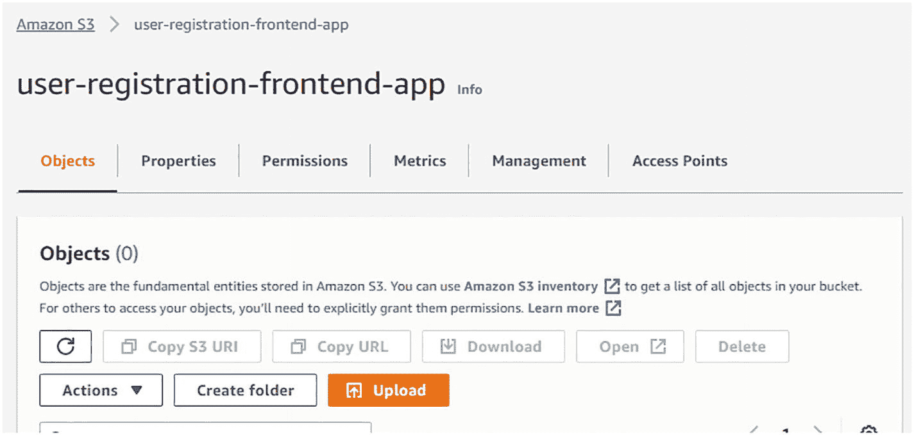

图 5-28

用户-注册-前端-带有对象详细信息的应用

这里，对象是空的，因为这是一个新创建的 bucket。点击上传按钮，将本地系统的所有内容上传到`build`文件夹中，如图 5-29 所示。

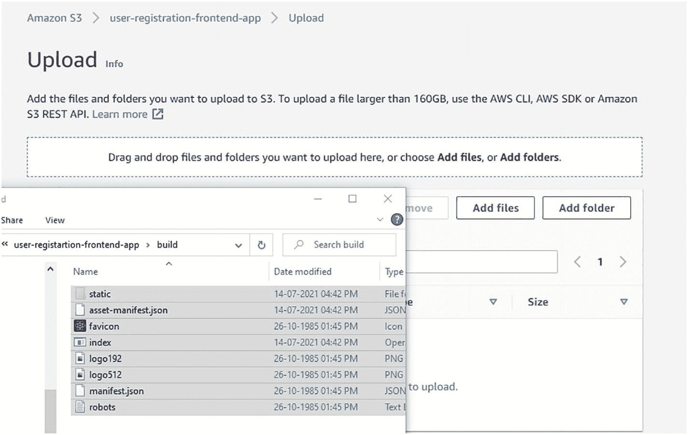

图 5-29

将构建文件夹中的文件上传到 S3 存储桶

接下来，单击页面底部的上传按钮。文件上传成功后，您会得到一条成功消息，如图 5-30 所示。

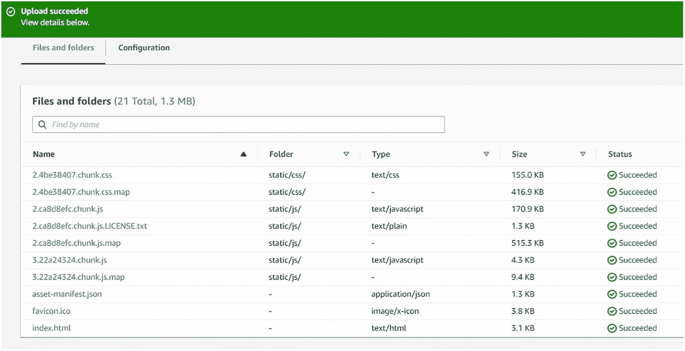

图 5-30

上传文件和文件夹到 AWS S3

现在，在 Objects 选项卡下，您可以看到所有出现在`user-registration-frontend-app`桶中的对象。图 5-31 显示`static`文件夹以及您上传到桶中的所有文件。

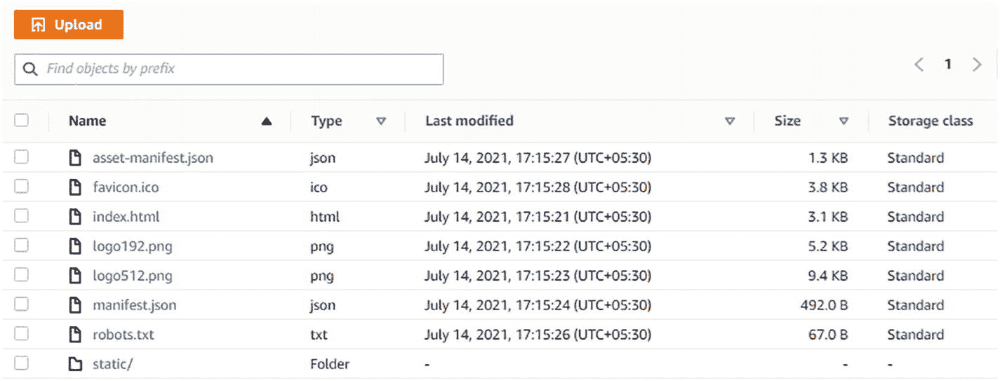

图 5-31

使用 spring initialize 创建用户注册应用

要托管网站，进入属性选项卡，向下滚动到**静态网站托管**，然后点击编辑，如图 5-32 所示。

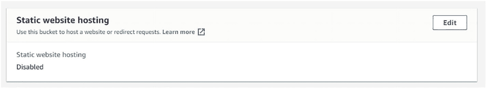

图 5-32

静态网站托管

接下来选择**启用**进行静态网站托管，选择**托管一个静态网站**作为托管类型，输入 index.html 作为索引文件，如图 5-33 所示。

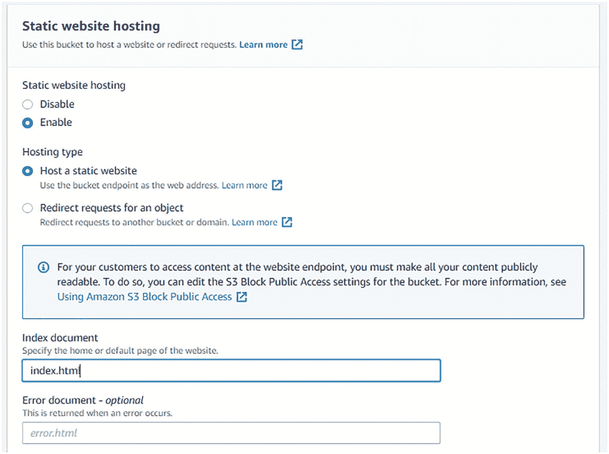

图 5-33

更新静态网站托管详细信息

index.html 的文件被上传到了 S3 桶。保存更改。现在你可以在属性页签中找到桶网站端点 URL，如图 5-34 所示。

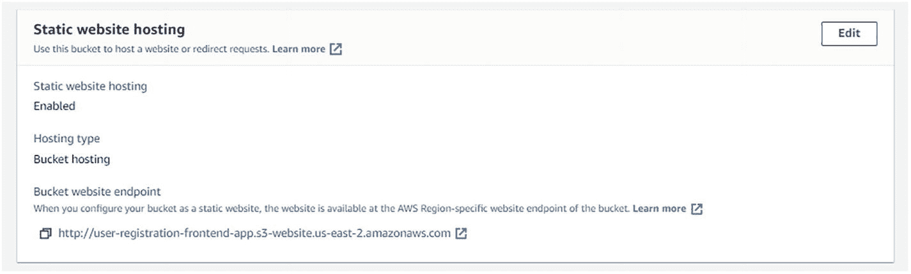

图 5-34

存储桶网站端点 URL

点击水桶网站端点 URL 给出 403 禁止错误，如图 5-35 所示。

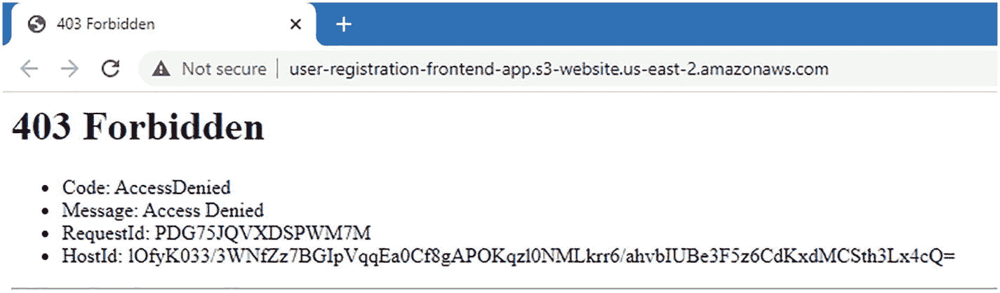

图 5-35

使用 spring initialize 创建用户注册应用

拒绝访问错误是由于 S3 安全问题造成的。默认情况下，您上传的所有对象在权限页签中都有**阻止公共访问**，如图 5-36 所示。

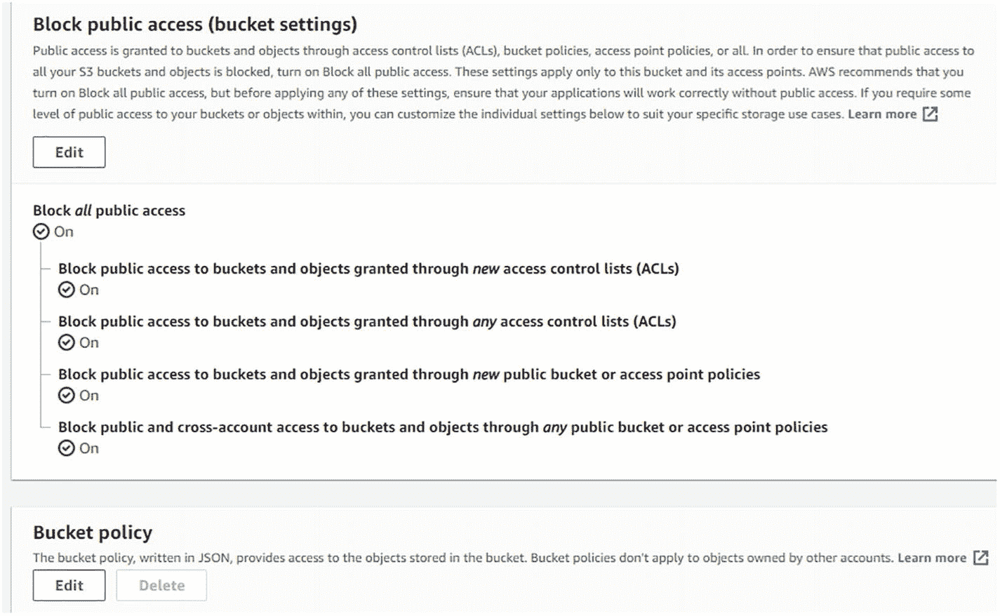

图 5-36

默认情况下，所有对象都会阻止公共访问

要公开该桶的所有内容，以便可以在互联网上访问，请单击**阻止公共访问**，取消选中**阻止所有公共访问**，然后单击**保存更改**，如图 5-37 所示。

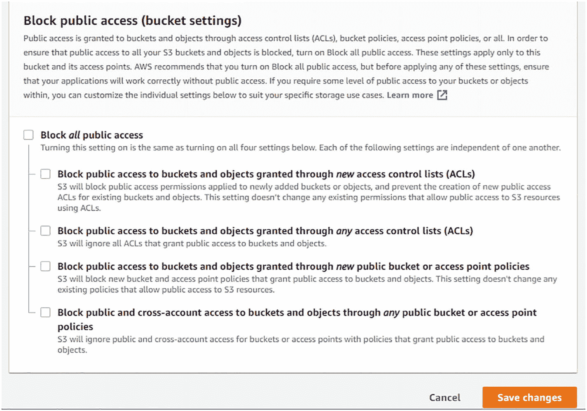

图 5-37

使用 spring initialize 创建用户注册应用

将弹出一个确认屏幕来确认设置。您需要在输入框中输入**确认**，点击确认按钮，如图 5-38 所示。

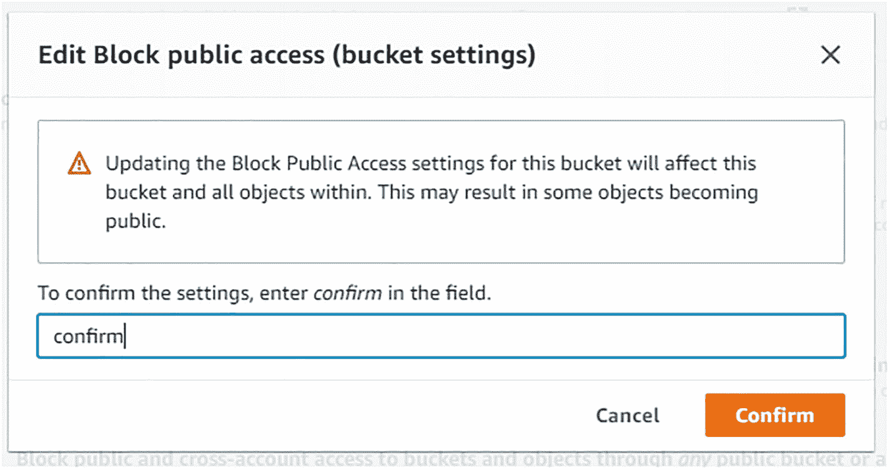

图 5-38

要确认设置，请在字段中输入确认

应该会出现一条成功消息，如图 5-39 所示。

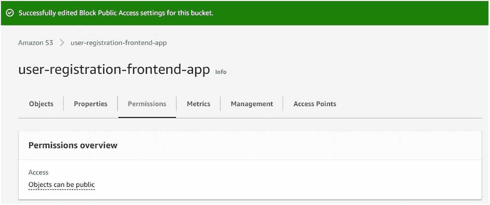

图 5-39

已成功编辑存储桶的阻止公共访问设置

现在，您需要编辑 bucket 策略，它是用 JSON 编写的。它提供对存储在存储桶中的对象的访问。要编辑 bucket policy，在权限选项卡中，向下滚动到 **Bucket policy** 部分，点击编辑按钮，在 policy 下输入 JSON，如图 5-40 所示。

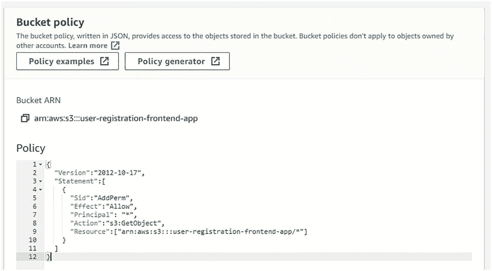

图 5-40

更新存储桶策略

清单 5-18 显示了一个 bucket 策略的 JSON。

```java
{
  "Version":"2012-10-17",
  "Statement":[
    {
      "Sid":"AddPerm",
      "Effect":"Allow",
      "Principal": "*",
      "Action":"s3:GetObject",
      "Resource":["arn:aws:s3:::user-registartion-frontend-app/*"]
    }
  ]
}

Listing 5-18JSON for Bucket Policy

```

`Resource`包含存储桶名称，即`user-registration-frontend-app`，用于标识存储桶策略的资源。这个 JSON 指定了一个特定的版本。`Action`中的`GetObject`允许访问所有主体。所有用户都可以在`user-registration-frontend-app`执行`GetObject`。

接下来，保存更改，这将提示一条消息，说明“这个存储桶具有公共访问权限。”使用 bucket 网站端点 URL 刷新浏览器。您现在可以访问您的主页，如图 5-41 所示。

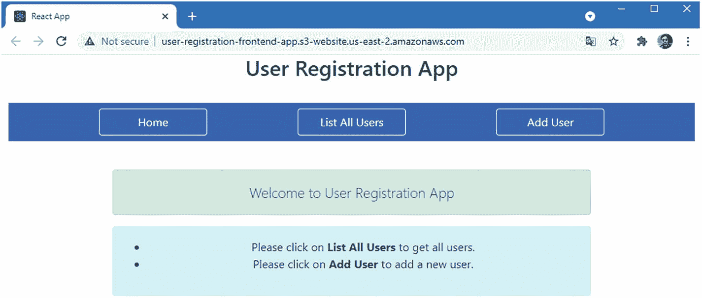

图 5-41

主页中的 Bucket 网站端点 URL

恭喜你！您已经在 AWS S3 成功托管了您的 static React 应用，并且可以访问主页。

### 验证 React 前端应用的成功部署:解决 404 错误

单击主页导航栏中的“列出所有用户”按钮。你得到 404 未发现错误，如图 5-42 所示。

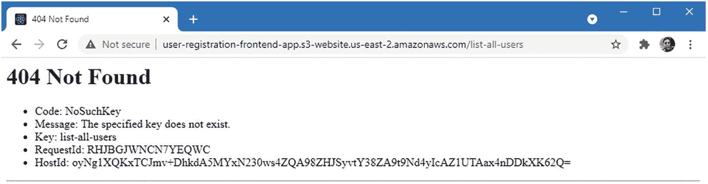

图 5-42

列出所有用户页面抛出 404 错误

要解决这个问题，您需要将**错误文档**框更新为`index.html`。要进行这些更改，您需要转到 bucket 下的 Properties 选项卡。向下滚动到**静态网站托管**，点击编辑，更新错误文档，如图 5-43 所示。

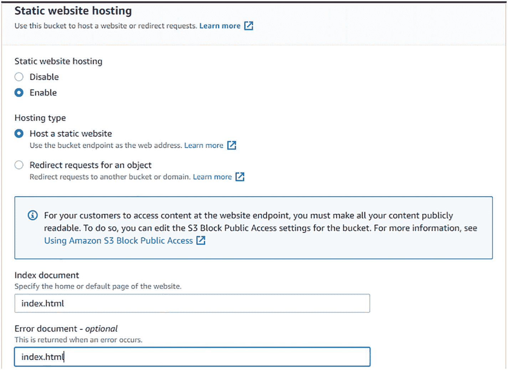

图 5-43

更新静态网站托管中的错误文档

这就是`react-router`的工作方式。它处理来自前端的请求，并将用户路由到其他路由。保存修改并刷新浏览器，查看列出所有用户页面，如图 5-44 所示。

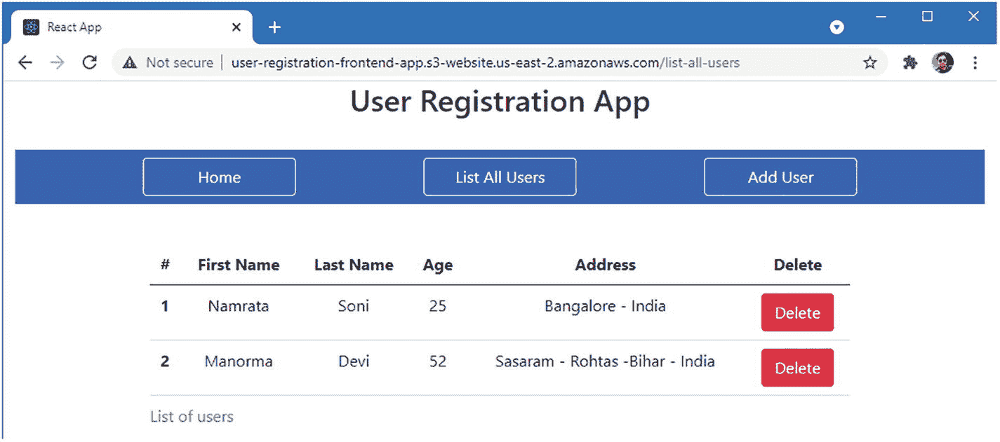

图 5-44

AWS S3 托管的访问列表-所有用户页面

## 摘要

本章介绍了作为前端框架的 React 及其主要组件，使用 React 作为前端来开发单页面应用，以使用后端应用公开的 API。您设置了一个开发环境来开发 React 前端应用，并被介绍到 AWS 中的 S3，在那里您部署了一个 React 前端应用。