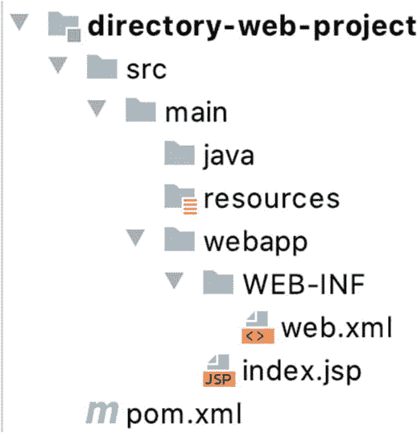
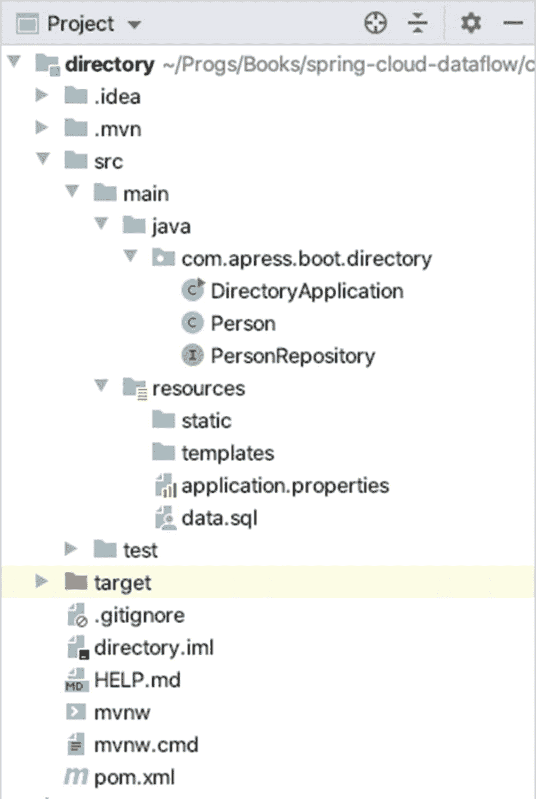
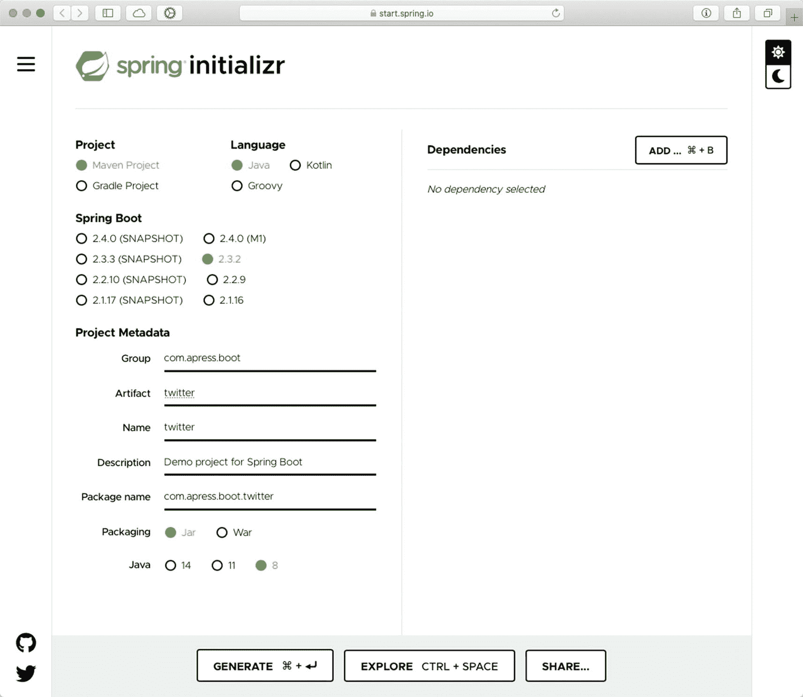
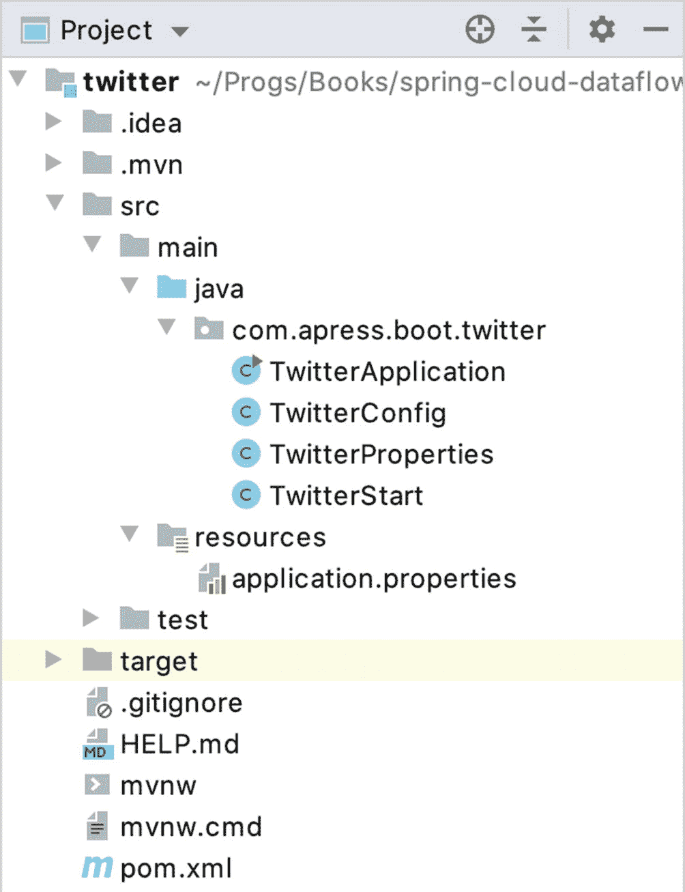

# 二、Spring Boot

构建云原生应用的一种方法是遵循十二因素应用指南( [`https://12factor.net`](https://12factor.net) )，这些指南有助于在任何云环境中运行应用。其中一些原则，如依赖声明(第二因素)、配置(第三因素)和端口绑定(第七因素)，等等，都是 Spring Boot 支持的！Spring Boot 是一个微服务和云就绪框架。

为什么是 Spring Boot 而不仅仅是 Spring？或者是另一种技术，比如 NodeJS 或 Go 语言？Spring Boot 是一项无与伦比的技术，因为它由 Java 社区中最常用的框架提供支持，并允许您轻松创建企业级应用。其他语言需要您进行大量的手动设置和编码。Spring Boot 为你提供了它。即使像 NodeJS 这样的技术有数百个库，但在我看来，它在企业级别上比不上 Spring。别误会我。我并不是说其他技术不好或者没用，但是如果你想构建一个快速、细粒度的企业应用，只有 Spring Boot 提供了最少的配置和代码。让我们看看为什么 Spring Boot 很重要，以及它如何帮助您创建云原生应用。

## 什么是 Spring 框架，什么是 Spring Boot？

Spring Boot 是下一代的 Spring 应用。它是一种固执己见的运行时技术，公开了创建企业级 Spring 应用的最佳实践。

### Spring 框架

让我们稍微倒退一下，谈谈 Spring 框架。使用 Spring 框架，您可以创建细粒度的企业应用，但您需要知道它如何工作，最重要的是，如何配置它。配置是 Spring 框架的关键元素之一。您可以将定制实现、DB 连接和对外部服务的调用解耦，从而使 Spring Framework 更具可扩展性、更易于维护和运行。在某种程度上，你需要知道所有适用于 Spring 应用的最佳实践。让我们从一个简单的 Spring 应用开始，它演示了 Spring 框架是如何工作的。

#### 目录应用

假设您需要创建一个 Spring 应用来保存人们的联系信息，比如姓名、电子邮件和电话号码。这是一个基本的目录应用，它在任何数据库引擎中公开了一个具有持久性的 REST API，并且可以部署在任何兼容的 J2EE 服务器中。下面是创建这样一个应用的步骤。

1.  安装一个像 Maven 或者 Gradle 这样的构建工具，编译构建源代码的目录结构。如果你有 Java 背景，你应该知道你需要一个 WEB-INF 目录结构。

2.  创建`web.xml`和`application-context.xml`文件。`web.xml`文件有`org.springframework.web.servlet.DispatcherServlet`类，它充当基于 Spring 的 web 应用的前端控制器。

3.  添加一个指向`application-context.xml`文件的监听器类，在这里声明所有的 Spring beans 或应用所需的任何其他配置。如果省略侦听器部分，您需要将 Spring beans 声明文件命名为与`DispatcherServlet`相同的名称。

4.  在`application-context.xml`文件`,`中添加几个 Spring beans 部分来覆盖每个细节。如果使用 JDBC，需要添加一个数据源、init SQL 脚本和一个事务管理器。如果您正在使用 JPA，您需要添加一个 JPA 声明(一个`persistence.xml`文件，您可以在其中配置您的类和主要单元)和一个实体管理器来处理会话并与事务管理器通信。

5.  因为这是一个 web app，所以需要在`application-context.xml`文件中添加一些关于 HTTP 转换器的 Spring beans 部分，这些转换器公开 JSON 视图和 MVC 驱动的注释来使用`@RestController`和`@RequestMapping`(或者@GetMapping、@PostMapping、@DeleteMapping 等。)以及其他 Spring MVC 注释。

6.  如果您使用 JPA(最简单的持久化方法),用`@EnableJpaRepositories`注释指定存储库和类的位置。

7.  要运行该应用，请以 WAR 格式打包您的应用。您需要安装一个符合 J2EE 标准的应用服务器，然后测试它。

如果你是一个有经验的 Spring 开发者，你知道我在说什么。如果你是一个新手，那么你需要学习所有的语法。这不是太难，但你需要花一些时间在这上面。或者也许有另一种方法。当然有。您可以使用基于注释的配置或 JavaConfig 类来设置 Spring beans，也可以混合使用两者。最后，你需要学习一些 Spring 注释来帮助你配置这个应用。你可以在这本书的网站上查看源代码(`ch02/directory-jpa`)。

让我们回顾一下这个应用的一些代码。记住，你需要创建一个 Java web 结构(见图 [2-1](#Fig1) )。



图 2-1。

基于 Java 网络的目录结构

图 [2-1](#Fig1) 显示了一个基于 Java 网络的目录结构。可以删除`index.jsp`文件，打开`web.xml`文件，全部替换为清单 [2-1](#PC1) 所示的内容。

```java
<!DOCTYPE web-app PUBLIC
 "-//Sun Microsystems, Inc.//DTD Web Application 2.3//EN"
 "http://java.sun.com/dtd/web-app_2_3.dtd" >

<web-app>
  <display-name>Archetype Created Web Application</display-name>

  <listener>
    <listener-class>org.springframework.web.context.ContextLoaderListener</listener-class>
  </listener>

  <context-param>
    <param-name>contextConfigLocation</param-name>
    <param-value>/WEB-INF/application-context.xml</param-value>
  </context-param>

  <servlet>
    <servlet-name>app</servlet-name>
    <servlet-class>org.springframework.web.servlet.DispatcherServlet</servlet-class>
    <init-param>
      <param-name>contextConfigLocation</param-name>
      <param-value></param-value>
    </init-param>
    <load-on-startup>1</load-on-startup>
  </servlet>

  <servlet-mapping>
    <servlet-name>app</servlet-name>
    <url-pattern>/</url-pattern>
  </servlet-mapping>

</web-app>

Listing 2-1.web.xml

```

清单 [2-1](#PC1) 向您展示了如何添加一个 Spring servlet ( `DispatcherServlet`，一个前端控制器模式)，它是处理来自用户的任何请求的主 servlet。

接下来，让我们通过添加清单 [2-2](#PC2) 中的内容来创建`application-context.xml`文件。

```java
<?xml version="1.0" encoding="UTF-8"?>

<beans xmlns:="http://www.springframework.org/schema/beans" xmlns:xsi="http://www.w3.org/2001/XMLSchema-instance"
       xmlns:mvc="http://www.springframework.org/schema/mvc"
       xmlns:context="http://www.springframework.org/schema/context"
       xmlns:jpa="http://www.springframework.org/schema/data/jpa"
       xmlns:tx="http://www.springframework.org/schema/tx"
       xmlns:jdbc="http://www.springframework.org/schema/jdbc"
       xsi:schemaLocation="
        http://www.springframework.org/schema/mvc http://www.springframework.org/schema/mvc/spring-mvc.xsd
        http://www.springframework.org/schema/tx http://www.springframework.org/schema/tx/spring-tx.xsd
        http://www.springframework.org/schema/jdbc https://www.springframework.org/schema/jdbc/spring-jdbc.xsd
        http://www.springframework.org/schema/data/jpa https://www.springframework.org/schema/data/jpa/spring-jpa.xsd
                http://www.springframework.org/schema/beans http://www.springframework.org/schema/beans/spring-beans.xsd
                http://www.springframework.org/schema/context http://www.springframework.org/schema/context/spring-context.xsd">

     <mvc:annotation-driven />
     <tx:annotation-driven />
     <jpa:repositories base-package="com.apress.spring.directory.repository" entity-manager-factory-ref="localContainerEntityManagerFactoryBean" />
     <context:component-scan base-package="com.apress.spring.directory" />

     <mvc:annotation-driven content-negotiation-manager="contentNegotiationManager">
          <mvc:message-converters>
               <bean class="org.springframework.http.converter.json.MappingJackson2HttpMessageConverter">
                    <property name="objectMapper" ref="objectMapper"/>
               </bean>
               <bean class="org.springframework.http.converter.xml.MappingJackson2XmlHttpMessageConverter">
                    <property name="objectMapper" ref="xmlMapper"/>
               </bean>
          </mvc:message-converters>
     </mvc:annotation-driven>

     <bean id="objectMapper" class="org.springframework.http.converter.json.Jackson2ObjectMapperFactoryBean">
          <property name="indentOutput"  value="true"/>
          <property name="modulesToInstall" value="com.fasterxml.jackson.module.paramnames.ParameterNamesModule"/>
     </bean>

     <bean id="xmlMapper" parent="objectMapper">
          <property name="createXmlMapper" value="yes"/>
     </bean>

     <bean id="contentNegotiationManager" class="org.springframework.web.accept.ContentNegotiationManagerFactoryBean">
          <property name="mediaTypes">
               <value>
                    json=application/json
                    xml=application/xml
               </value>
          </property>
     </bean>

     <bean id="localContainerEntityManagerFactoryBean"
           class="org.springframework.orm.jpa.LocalContainerEntityManagerFactoryBean">
          <property name="dataSource" ref="dataSource" />
          <property name="jpaVendorAdapter">
               <bean class="org.springframework.orm.jpa.vendor.HibernateJpaVendorAdapter" />
          </property>
          <property name="jpaProperties">
               <props>
                    <prop key="hibernate.hbm2ddl.auto">create-drop</prop>
                    <prop key="hibernate.dialect">org.hibernate.dialect.H2Dialect</prop>
               </props>
          </property>
     </bean>

     <bean id="dataSource"
           class="org.springframework.jdbc.datasource.DriverManagerDataSource">
          <property name="driverClassName" value="org.h2.Driver" />
          <property name="url" value="jdbc:h2:mem:testdb" />
          <property name="username" value="sa" />
          <property name="password" value="" />
     </bean>

     <bean id="transactionManager" class="org.springframework.orm.jpa.JpaTransactionManager">
          <property name="entityManagerFactory" ref="localContainerEntityManagerFactoryBean" />
     </bean>

     <bean id="persistenceExceptionTranslationPostProcessor" class=
             "org.springframework.dao.annotation.PersistenceExceptionTranslationPostProcessor" />

     <jdbc:embedded-database type="H2" >
          <jdbc:script location="classpath:META-INF/sql/schema.sql"/>
          <jdbc:script location="classpath:META-INF/sql/data.sql"/>
     </jdbc:embedded-database>
</beans>

Listing 2-2.application-context.xml

```

清单 [2-2](#PC2) 显示了`application-context.xml`文件，在该文件中，您为 Spring 容器添加了所有必要的配置，所有的类都是在这个容器中初始化和连接的。

在回顾每一个标记和它的声明方式之前，看看你是否能猜出每一个标记是做什么的，以及为什么它是这样配置的。看看声明之间的命名和引用。

如果你是 Spring 新手，推荐你看看 Apress 出版的 *Pro Spring* 系列。这些书解释了配置 Spring 的这种声明形式的每个方面。

接下来，分别添加以下类:`Person`、`PersonRepository`和`PersonController`(参见清单 [2-3](#PC3) 、 [2-4](#PC4) 和 [2-5](#PC5) )。

```java
package com.apress.spring.directory.domain;

import javax.persistence.Entity;
import javax.persistence.Id;

@Entity
public class Person {

    @Id
    private String email;
    private String name;
    private String phone;

    public Person() {
    }

    public Person(String email, String name, String phone) {
        this.email = email;
        this.name = name;
        this.phone = phone;
    }

    public String getEmail() {
        return email;
    }

    public void setEmail(String email) {
        this.email = email;
    }

    public String getName() {
        return name;
    }

    public void setName(String name) {
        this.name = name;
    }

    public String getPhone() {
        return phone;
    }

    public void setPhone(String phone) {
        this.phone = phone;
    }
}

Listing 2-3.com.apress.spring.directory.domain.Person.java

```

清单 [2-3](#PC3) 展示了使用所有 JPA (Java Persistence API)注释的`Person`类，所以很容易使用，没有更多直接的 JDBC。

```java
package com.apress.spring.directory.repository;

import com.apress.spring.directory.domain.Person;
import org.springframework.data.repository.CrudRepository;

public interface PersonRepository extends CrudRepository<Person,String> {
}

Listing 2-4.com.apress.spring.directory.repository.PersonRepository.java

```

清单 [2-4](#PC4) 显示了从另一个`CrudRepository`接口扩展而来的`PersonRepository`接口。在这里，它使用 Spring Data 和 Spring Data JPA 的所有功能来创建一个基于实体类及其主键(在本例中是一个`String`类型)的存储库模式。换句话说，不需要创建任何 CRUD 实现——让 Spring Data 和 Spring Data JPA 来处理。

```java
package com.apress.spring.directory.controller;

import com.apress.spring.directory.domain.Person;
import com.apress.spring.directory.repository.PersonRepository;
import org.slf4j.Logger;
import org.slf4j.LoggerFactory;
import org.springframework.http.HttpHeaders;
import org.springframework.http.HttpStatus;
import org.springframework.http.MediaType;
import org.springframework.http.ResponseEntity;
import org.springframework.stereotype.Controller;
import org.springframework.web.bind.annotation.*;
import org.springframework.web.util.UriComponents;
import org.springframework.web.util.UriComponentsBuilder;

@Controller
public class PersonController {

    private Logger log = LoggerFactory.getLogger(PersonController.class);
    private PersonRepository personRepository;

    public PersonController(PersonRepository personRepository) {
        this.personRepository = personRepository;
    }

    @RequestMapping(value = "/people",
            method = RequestMethod.GET,
            produces = {MediaType.APPLICATION_JSON_VALUE, MediaType.APPLICATION_XML_VALUE})
    @ResponseBody
    public Iterable<Person> getPeople() {
        log.info("Accessing all Directory people...");
        return personRepository.findAll();
    }

    @RequestMapping(value = "/people",
            method = RequestMethod.POST,
            consumes = MediaType.APPLICATION_JSON_VALUE,
            produces = {MediaType.APPLICATION_JSON_VALUE})
    @ResponseBody
    public ResponseEntity<?> create(UriComponentsBuilder uriComponentsBuilder, @RequestBody Person person) {
        personRepository.save(person);

        UriComponents uriComponents =
                uriComponentsBuilder.path("/people/{id}").buildAndExpand(person.getEmail());

        return ResponseEntity.created(uriComponents.toUri()).build();
    }

    @RequestMapping(value = "/people/search",
            method = RequestMethod.GET,
            consumes = MediaType.APPLICATION_JSON_VALUE,
            produces = {MediaType.APPLICATION_JSON_VALUE})
    @ResponseBody
    public ResponseEntity<?> findByEmail(@RequestParam String email) {
        log.info("Looking for {}", email);
        return ResponseEntity.ok(personRepository.findById(email).orElse(null));
    }

    @RequestMapping(value = "/people/{email:.+}",
            method = RequestMethod.DELETE)
    @ResponseBody
    public ResponseEntity<?> deleteByEmail(@PathVariable String email) {
        log.info("About to delete {}", email);
        personRepository.deleteById(email);
        return ResponseEntity.accepted().build();
    }
}

Listing 2-5.com.apress.spring.directory.controller.PersonController.java

```

清单 [2-5](#PC5) 显示了任何用户请求/响应的`PersonController`类的实现。在 Spring 中实现一个 web 控制器有很多方法，比如使用`@RestController`。避免在每个方法中写`@ResponseBody`，或者使用类似`@GetMapping, @PostMapping,`和`@DeleteMapping`的专用注释来代替`@RequestMapping`。

接下来，创建初始化数据库的 SQL 文件(参见清单 [2-6](#PC6) 和 [2-7](#PC7) )。

```java
CREATE TABLE person (
   email VARCHAR(100) NOT NULL PRIMARY KEY,
   name VARCHAR(100) NOT NULL,
   phone VARCHAR(20) NOT NULL,
);

Listing 2-6.META-INF/sql/schema.sql

```

清单 [2-6](#PC6) 是一个简单的模式，只包含一个表。

```java
INSERT INTO person (email,name,phone) VALUES('mark@email.com','Mark','1-800-APRESS');
INSERT INTO person (email,name,phone) VALUES('steve@email.com','Steve','1-800-APRESS');
INSERT INTO person (email,name,phone) VALUES('dan@email.com','Dan','1-800-APRESS');

Listing 2-7.META-INF/sql/data.sql

```

清单 [2-7](#PC7) 显示了应用启动时要插入的一些记录。接下来因为这个 app 用的是 JPA，所以需要提供一个`persistence.xml`文件。还有另一个选择——您可以向`application-context.xml`添加一个 bean 声明，并声明 JPA 引擎工作所需的持久性单元(参见清单 [2-8](#PC8) )。

```java
<persistence xmlns:="http://xmlns.jcp.org/xml/ns/persistence"
             xmlns:xsi="http://www.w3.org/2001/XMLSchema-instance" version="2.2"
             xsi:schemaLocation="http://xmlns.jcp.org/xml/ns/persistence http://xmlns.jcp.org/xml/ns/persistence/persistence_2_2.xsd">
    <!-- Define persistence unit -->
    <persistence-unit name="directory">
    </persistence-unit>
</persistence>

Listing 2-8.META-INF/persistence.xml

```

清单 [2-8](#PC8) 显示了声明持久性单元所需的 JPA 文件。您可以在`localContainerEntityManagerFactoryBean` bean 声明中将其声明为一个属性(`persistenceUnitName`属性)。

接下来是最重要的文件之一。这个应用是使用 Maven 作为构建工具创建的。让我们在项目的根目录下创建一个`pom.xml`文件(参见清单 [2-9](#PC9) )。

```java
<project xmlns:="http://maven.apache.org/POM/4.0.0" xmlns:xsi="http://www.w3.org/2001/XMLSchema-instance"
  xsi:schemaLocation="http://maven.apache.org/POM/4.0.0 http://maven.apache.org/maven-v4_0_0.xsd">
  <modelVersion>4.0.0</modelVersion>
  <groupId>com.apress.spring</groupId>
  <artifactId>directory-jpa</artifactId>
  <packaging>war</packaging>
  <version>1.0-SNAPSHOT</version>
  <name>directory-web-project Maven Webapp</name>
  <url>http://maven.apache.org</url>

  <properties>

    <java.version>1.8</java.version>
    <servlet.version>3.1.0</servlet.version>
    <spring-framework.version>5.2.2.RELEASE</spring-framework.version>
    <spring-data.jpa>2.2.3.RELEASE</spring-data.jpa>
    <slf4j.version>1.7.25</slf4j.version>
    <logback.version>1.2.3</logback.version>
    <h2>1.4.199</h2>
    <jackson>2.10.1</jackson>
  </properties>

  <dependencies>

    <!-- Spring Core/MVC/Web -->
    <dependency>
      <groupId>org.springframework</groupId>
      <artifactId>spring-context</artifactId>
      <version>${spring-framework.version}</version>
    </dependency>
    <dependency>
      <groupId>org.springframework</groupId>
      <artifactId>spring-aop</artifactId>
      <version>${spring-framework.version}</version>
    </dependency>
    <dependency>
      <groupId>org.springframework</groupId>
      <artifactId>spring-webmvc</artifactId>
      <version>${spring-framework.version}</version>
    </dependency>
    <dependency>
      <groupId>org.springframework</groupId>
      <artifactId>spring-web</artifactId>
      <version>${spring-framework.version}</version>
    </dependency>

    <dependency>
      <groupId>org.springframework.data</groupId>
      <artifactId>spring-data-jpa</artifactId>
      <version>${spring-data.jpa}</version>
    </dependency>

    <dependency>
      <groupId>org.slf4j</groupId>
      <artifactId>slf4j-api</artifactId>
      <version>${slf4j.version}</version>
    </dependency>
    <dependency>
      <groupId>ch.qos.logback</groupId>
      <artifactId>logback-classic</artifactId>
      <version>${logback.version}</version>
    </dependency>

    <!-- Other Web dependencies -->
    <dependency>
      <groupId>javax.servlet</groupId>
      <artifactId>javax.servlet-api</artifactId>
      <version>${servlet.version}</version>
      <scope>provided</scope>
    </dependency>

    <!-- JPA -->
    <dependency>
      <groupId>jakarta.activation</groupId>
      <artifactId>jakarta.activation-api</artifactId>
      <version>1.2.1</version>
      <scope>compile</scope>
    </dependency>
    <dependency>
      <groupId>jakarta.persistence</groupId>
      <artifactId>jakarta.persistence-api</artifactId>
      <version>2.2.3</version>
      <scope>compile</scope>
    </dependency>
    <dependency>
      <groupId>jakarta.transaction</groupId>
      <artifactId>jakarta.transaction-api</artifactId>
      <version>1.3.3</version>
      <scope>compile</scope>
    </dependency>
    <dependency>
      <groupId>org.hibernate</groupId>
      <artifactId>hibernate-core</artifactId>
      <version>5.4.9.Final</version>
      <scope>compile</scope>
      <exclusions>
        <exclusion>
          <artifactId>jboss-transaction-api_1.2_spec</artifactId>
          <groupId>org.jboss.spec.javax.transaction</groupId>
        </exclusion>
        <exclusion>
          <artifactId>javax.activation-api</artifactId>
          <groupId>javax.activation</groupId>
        </exclusion>
        <exclusion>
          <artifactId>javax.persistence-api</artifactId>
          <groupId>javax.persistence</groupId>
        </exclusion>
        <exclusion>
          <artifactId>jaxb-api</artifactId>
          <groupId>javax.xml.bind</groupId>
        </exclusion>
      </exclusions>
    </dependency>

    <!-- JSON/XML -->
    <dependency>
      <groupId>com.fasterxml.jackson.core</groupId>
      <artifactId>jackson-databind</artifactId>
      <version>${jackson}</version>
    </dependency>
    <dependency>
      <groupId>com.fasterxml.jackson.module</groupId>
      <artifactId>jackson-module-parameter-names</artifactId>
      <version>${jackson}</version>
    </dependency>
    <dependency>
      <groupId>com.fasterxml.jackson.dataformat</groupId>
      <artifactId>jackson-dataformat-xml</artifactId>
      <version>${jackson}</version>
    </dependency>

    <dependency>
      <groupId>com.h2database</groupId>
      <artifactId>h2</artifactId>
      <version>${h2}</version>
      <scope>runtime</scope>
    </dependency>
  </dependencies>

  <build>
    <finalName>directory-jpa</finalName>
    <plugins>
      <plugin>
        <groupId>org.apache.maven.plugins</groupId>
        <artifactId>maven-compiler-plugin</artifactId>
        <configuration>
          <source>8</source>
          <target>8</target>
        </configuration>
      </plugin>
    </plugins>
  </build>
</project>

Listing 2-9.pom.xml

```

清单 [2-9](#PC9) 显示了 pom.xml 文件，其中声明了所有的依赖项。如果你来自 J2EE 背景，你可能会发现这很难，因为你需要找到一种与他人相处融洽的依赖关系。这可能需要一点时间。

接下来，您需要打包应用。安装 Maven (

```java
mvn package

```

该命令打包应用并生成`target/directory-jpa.war`文件。要运行应用，您需要一个可以运行 J2EE 应用的应用服务器；最常见的是 Tomcat。从 [`https://tomcat.apache.org/download-90.cgi`](https://tomcat.apache.org/download-90.cgi) 下载版本 9，然后解压并将`directory-jpa.war`部署/复制到`webapps/` Tomcat 文件夹中。要启动 Tomcat 服务器，使用`bin/`文件夹中的脚本。看一下脚本。要启动 Tomcat，通常需要执行名为`startup.sh`(对于 Unix 用户)或`startup.bat`(对于 Windows 用户)的脚本。

您可以使用`cUrl`命令行或任何其他 GUI 应用来测试您的应用，比如 Postman ( [`www.getpostman.com`](http://www.getpostman.com) )，来执行所有的请求。例如，要查看目录中列出的所有人，请执行以下命令。

```java
$ curl http://localhost:8080/directory-jpa/people -H "Content-Type: application/json"

```

您应该得到以下输出。

```java
[ {
  "email" : "mark@email.com",
  "name" : "Mark",
  "phone" : "1-800-APRESS"
}, {
  "email" : "steve@email.com",
  "name" : "Steve",
  "phone" : "1-800-APRESS"
}, {
  "email" : "dan@email.com",
  "name" : "Dan",
  "phone" : "1-800-APRESS"
} ]

```

正如你所看到的，这里有很多步骤，我遗漏了你需要添加到应用中的部分业务逻辑。一个训练有素的 Spring 开发人员可能要花三个小时来交付这个应用，而且他们一半以上的时间都花在了配置应用上。如何加快这一配置过程？在配置上花费太多时间会导致错误和不良行为。

Note

请记住，您可以访问本书的配套源代码。可以从 Apress ( [`www.apress.com`](http://www.apress.com) )下载。本例的文件夹在`ch02/directory-jpa`中。

### Spring Boot

Spring Boot 来救援了！Spring 工程师意识到 Spring 开发人员对每个 Spring 应用都遵循相同的步骤，所以他们想出了一个更好的方法来进行配置和添加最佳实践。他们创造了 Spring Boot，这是一个固执己见的引擎，它为你设定了最佳实践，让你可以专注于代码。

Spring Boot 提供了许多功能，这些功能将在后面讨论。现在，让我们回到目录应用。

#### Spring Boot 的目录应用

让我们从使用 Spring Initializr 创建结构开始。打开浏览器，指向 [`https://start.spring.io`](https://start.spring.io) (见图 [2-2](#Fig2) 和 [2-3](#Fig3) )。


图 2-2。

[T2`https://start.spring.io`](https://start.spring.io)

图 [2-2](#Fig2) 是 Spring Initializr 的截图。将以下数据添加到字段中。

*   组:`com.apress.boot`

*   神器:`directory`

*   依赖项:Spring Web、Spring Data JPA、Rest 存储库和 H2 数据库

您可以保留其他选项的默认值。单击生成按钮。在任何可以运行 Java 应用的 IDE 中打开 ZIP 文件。我推荐 IntelliJ 社区版( [`www.jetbrains.com/idea/download/`](http://www.jetbrains.com/idea/download/) )或者微软的可视代码配合适的插件运行 Java 和 Spring 的应用( [`https://code.visualstudio.com/download`](https://code.visualstudio.com/download) )。

花点时间分析一下结构。调用清单 [2-3](#PC3) ( `Person.java`)和清单 [2-4](#PC4) ( `PersonRepository.java`)中的类以及清单 [2-7](#PC7) ( `data.sql`)中的文件。您可以将`Person`和`PersonRepository`类添加到`com.apress.boot.directory`文件夹/包中，将`data.sql`文件添加到资源文件夹中(参见图 [2-3](#Fig3) )。



图 2-3。

智能:Spring Boot 目录应用结构

图 [2-3](#Fig3) 显示了 Spring Boot 应用的结构和类的位置。注意这里有额外的文件，包括`mvnw*`脚本和一个隐藏的`.mvn`文件夹。这是 Maven 的一个瘦包装器，意味着你不需要安装 Maven。您可以从命令行运行它。

你完了！你不需要做任何其他事情。使用 IDE 或命令行运行应用。在运行应用之前，请确保停止 Tomcat。然后，您可以从终端运行该应用，方法是转到`directory`文件夹并运行以下命令。

```java
$ ./mvnw spring-boot:run

```

上述命令仅在 Unix 系统上运行。如果您使用 Windows 操作系统，则执行以下操作来运行您的应用。

```java
> mvnw.bat spring-boot:run

```

然后你可以如下执行一个`cUrl`命令。

```java
$ curl http://localhost:8080/persons -H "Content-Type: application/json

```

您会得到相同的结果—一个人员列表。一个有经验的 Spring 或 Spring Boot 开发者可以在 5 分钟内创建这个应用！一个 Spring Boot 的新手通常需要 15 分钟来创建它。(看，根本没有配置)。Spring Boot 是一个自以为是的运行时，它会发现你的类路径中有什么，并基于此设置一些默认值以避免任何其他配置，如`DispatcherServlet`设置、自定义`HttpMessageConverters`、DB 初始化器和控制器。它使用 HATEOAS(作为应用状态引擎的超媒体)协议来生成响应，并添加了所有的 HTTP 方法实现。如果您想添加一个新人，使用`cUrl`执行以下命令。

```java
$ curl -XPOST http://localhost:8080/persons -H "Content-Type: application/json" -d '{"email":"mike@email.com","name":"Mike","phone":"1-800-APRESS"}'

```

Spring Boot 是如何变魔术的？如果你想更多地了解 Spring Boot，以及这种配置是如何毫不费力地完成的，我推荐阅读我的一些其他书籍，如 *Pro Spring Boot 2* (Apress，2019)。

您可以使用 Spring 和 Spring Boot 的强大功能轻松创建现成的应用。

### 超越目录应用示例

通常，书籍以一个必做的 HelloWorld 示例或一个简单的应用(如目录应用)开始。现在，让我们通过创建一个使用来自 Twitter feed 的流处理的微服务来见证 Spring Boot 的力量。在这一节中，我给出了构建这个应用的一步一步的说明。

首先，在 [`https://developer.twitter.com`](https://developer.twitter.com) 登录 Twitter 开发者计划。您需要获得四个密钥:消费者 API 密钥、消费者 API 秘密密钥、访问令牌密钥和访问令牌秘密密钥(参见图 [2-4](#Fig4) )。


图 2-4。

[`https://developer.twitter.com/`](https://developer.twitter.com/) 钥匙和令牌

接下来打开一个浏览器，指向 [`https://start.spring.io`](https://start.spring.io) (见图 [2-5](#Fig5) )。使用以下信息。



图 2-5。

[`https://start.spring.io`](https://start.spring.io) 推特 app

*   组:`com.apress.boot`

*   神器:`twitter`

*   依赖性:无

点击*生成*按钮下载一个 ZIP 文件。解压缩文件并在任何 IDE 中打开项目。创建几个类，你应该有最终的应用，如图 [2-6](#Fig6) 所示。



图 2-6。

Twitter 应用

接下来，打开`pom.xml`文件并添加清单 [2-10](#PC17) 中所示的依赖项。

```java
<dependency>
        <groupId>org.springframework.social</groupId>
        <artifactId>spring-social-twitter</artifactId>
        <version>1.1.0.RELEASE</version>
</dependency>

Listing 2-10.pom.xml spring-social-twitter dependency

```

接下来，创建`TwitterProperties`类(参见清单 [2-11](#PC18) )。

```java
package com.apress.boot.twitter;

import org.springframework.boot.context.properties.ConfigurationProperties;

@ConfigurationProperties(prefix = "twitter")
public class TwitterProperties {

    private String consumerKey;
    private String consumerSecret;
    private String accessToken;
    private String accessTokenSecret;

    public String getConsumerKey() {
        return consumerKey;
    }

    public void setConsumerKey(String consumerKey) {
        this.consumerKey = consumerKey;
    }

    public String getConsumerSecret() {
        return consumerSecret;
    }

    public void setConsumerSecret(String consumerSecret) {
        this.consumerSecret = consumerSecret;
    }

    public String getAccessToken() {
        return accessToken;
    }

    public void setAccessToken(String accessToken) {
        this.accessToken = accessToken;
    }

    public String getAccessTokenSecret() {
        return accessTokenSecret;
    }

    public void setAccessTokenSecret(String accessTokenSecret) {
        this.accessTokenSecret = accessTokenSecret;
    }
}

Listing 2-11.com.apress.boot.twitter.TwitterProperties.java

```

清单 [2-11](#PC18) 显示了保存 Twitter API 工作所需密钥的`TwitterProperties`类。所有这些属性都在`application.properties`文件中声明，它有`twitter`前缀。

接下来，创建`TwitterConfig`类(参见清单 [2-12](#PC19) )。

```java
package com.apress.boot.twitter;

import org.springframework.boot.context.properties.EnableConfigurationProperties;
import org.springframework.context.annotation.Bean;
import org.springframework.context.annotation.Configuration;
import org.springframework.social.twitter.api.impl.TwitterTemplate;

@Configuration
@EnableConfigurationProperties(TwitterProperties.class)
public class TwitterConfig {

    private TwitterProperties twitterProperties;

    public TwitterConfig(TwitterProperties twitterProperties){
        this.twitterProperties = twitterProperties;
    }

    @Bean
    TwitterTemplate twitterTemplate(){
        return new TwitterTemplate(twitterProperties.getConsumerKey(),
                twitterProperties.getConsumerSecret(), twitterProperties.getAccessToken(), twitterProperties.getAccessTokenSecret());
    }
}

Listing 2-12.com.apress.boot.twitter.TwitterContig.java

```

清单 [2-12](#PC19) 显示了`TwitterConfig`类，该类具有创建`TwitterTemplate`实例的初始化配置。该实例处理所需的连接和密钥交换。这是一种非常简单的方法，可以登录 Twitter 并进行一些操作，比如阅读或创建推文。

接下来，创建`TwitterStart`类(参见清单 [2-13](#PC20) )。

```java
package com.apress.boot.twitter;

import org.springframework.boot.CommandLineRunner;
import org.springframework.context.annotation.Bean;
import org.springframework.context.annotation.Configuration;
import org.springframework.social.twitter.api.*;

import java.util.Collections;

@Configuration
public class TwitterStart {

    @Bean
    CommandLineRunner start(Twitter twitter){
        return args -> {
            twitter.streamingOperations().sample(Collections.singletonList(new StreamListener() {

                @Override
                public void onTweet(Tweet tweet) {
                    tweet.getEntities().getHashTags().forEach(hashTagEntity -> {
                        System.out.println(String.format("#%s",hashTagEntity.getText()));
                    });
                }

                @Override
                public void onDelete(StreamDeleteEvent streamDeleteEvent) { }

                @Override
                public void onLimit(int i) { }

                @Override
                public void onWarning(StreamWarningEvent streamWarningEvent) { }
            }));
        };
    }
}

Listing 2-13.com.apress.boot.twitter.TwitterStart.java

```

清单 [2-13](#PC20) 显示了`TwitterStart`类。一旦 Spring Boot 完成配置和设置，这个类就执行`start`方法。这里一个重要的细节是`StreamListener`的用法，它监听 Twitter 上公开的每一个标签。这个程序唯一做的事情就是打印标签。

接下来，将密钥添加到`application.properties`文件中(参见清单 [2-14](#PC21) )。

```java
# Twitter Properties
twitter.consumerKey=YbJisGFe9Jo3lAFE30wYR08To
twitter.consumerSecret=Slm9EJYOTFunnw5YWm13Px3HH6jQGDt2NJp8N4DyjhmIv2HtZK
twitter.accessToken=64771614-9RjhlWVy5h6PKhvQbCjm7rt2BcB66ZVEJwZ7DAPCN
twitter.accessTokenSecret=oRluin2ZMgNOKHUP0JSJc6HMEjul2QC6aeSAV4DBKW8uz

Listing 2-14.application.properties

```

请记住，这些键来自您的 Twitter 开发人员门户应用。现在，您可以使用 Maven 包装器运行应用。

```java
$ ./mvnw spring-boot:run

```

你应该看到一堆实时发送到 Twitter 的标签！

如您所见，创建一个快速、细粒度的企业应用非常容易。这就是 Spring Boot 的魅力。

## Spring Boot 特色

Spring Boot 的特色如此之多，以至于需要一整本书来描述它们。但是，我可以在本节中描述其中的一些。

*   `SpringApplication`类提供了一种启动 Spring 应用的便捷方式。它在主类中。

*   Spring Boot 允许您创建没有任何 XML 配置的应用。它不做代码生成。

*   Spring Boot 通过`SpringApplicationBuilder` singleton 类提供了一个流畅的构建器 API，允许你创建具有多个应用上下文的层次结构。这个特性与 Spring 框架有关。我将在接下来的章节中解释这个特性，但是如果您是 Spring 和 Spring Boot 的新手，您只需要知道您可以扩展 Spring Boot 来获得对您的应用的更多控制。

*   Spring Boot 提供了更多配置 Spring 应用事件和监听器的方法。这将在接下来的章节中解释。

*   Spring Boot 是一种固执己见的技术。该特性试图创建正确类型的应用，既可以是 web 应用(通过嵌入 Tomcat、Netty、Undertow 或 Jetty 容器)，也可以是单个应用。

*   通过`org.springframework.boot.ApplicationArguments`接口，Spring Boot 允许访问任何应用参数。当您使用参数运行应用时，这是一个非常有用的特性。

*   Spring Boot 允许您在应用启动后执行代码。您唯一需要做的就是实现`CommandLineRunner`接口和`run(String ...args)`方法。一个特殊的例子是在启动时初始化数据库中的一些记录，或者在应用启动前检查一些服务以查看它们是否正在运行。

*   Spring Boot 允许您通过使用`application.properties`或`application.yml`文件来具体化配置。在接下来的章节中会有更多的介绍。

*   您可以添加与管理相关的功能，通常通过 JMX，在`application.properties`或`application.yml`文件中启用`spring.application.admin.enabled`属性。

*   Spring Boot 允许您拥有*配置文件*，帮助您的应用在不同的环境中运行。

*   Spring Boot 允许您非常简单地配置和使用日志记录。

*   Spring Boot 通过使用 starter poms 提供了一种配置和管理依赖项的简单方法。换句话说，如果你想创建一个 web 应用，你只需要在你的 Maven `pom.xml`或`build.gradle`文件中包含`spring-boot-starter-web`依赖项。

*   Spring Boot 通过使用 Spring Boot 致动器提供开箱即用的非功能性要求，该致动器具有新的测微计平台无关框架，允许您对您的应用进行仪器化。

*   Spring Boot 提供了`@Enable<feature>`注释，帮助您启用、包含、配置和使用数据库(例如，SQL 和 NoSQL)、Spring Integration 和云，以及缓存、调度、消息、批处理等等。

我将在每一章中讨论其他特性。

## 摘要

在这一章中，我向你展示了什么是 Spring Boot 以及你可以用它做什么。这是 Spring Cloud Stream 和 Spring Cloud Data Flow 为其组件使用的主要技术。我还向您展示了 Spring Boot 为开发人员提供的一些特性的例子。

在下一章中，我将向您展示创建 Spring CloudStream 的另一个技术基础。也不用担心所有的新术语；它们很快就会让你明白。