# 三、Spring Integration

如果你搜索单词 *communication* 的意思，你会发现它来自拉丁语 *communicare，*，意思是“分享”今天， *communication* 这个词已经变得越来越强大，不仅用于那些想要分享思想、想法和问题的人，而且也用于技术领域。企业应用需要使用消息作为常规通信协议，在组件或外部系统之间共享数据。

在这一章中，你将了解到 Spring 框架最好的项目之一——Spring Integration！它提供了一种简单的、开箱即用的方式来使用企业集成模式。

通过使用轻量级消息传递，Spring Integration 支持通过声明性适配器与外部系统集成。换句话说，您可以连接 JMS (IBM MQ 和 Tibco，以及其他代理)、AMQP、套接字或 UDP 消息，然后处理、转换并交付到新系统中，如 REST API 端点、NoSQL 持久性或 RabbitMQ 消息传递，最多只需几行代码。

## 集成模式

Spring Integration 支持*企业集成模式* ( [`www.eaipatterns.com`](http://www.eaipatterns.com) )。本章只介绍了几个模式来帮助你理解它们是如何工作的，以及 Spring Integration 是如何促进它们的使用的，因为它是 Spring CloudStream 的一个重要部分。剧透预警:Spring CloudStream 基于 Spring Integration！

企业集成模式(EIP)符合几种模式(见图[3-1](#Fig1))；请记住，设计模式是对反复出现的问题的解决方案。

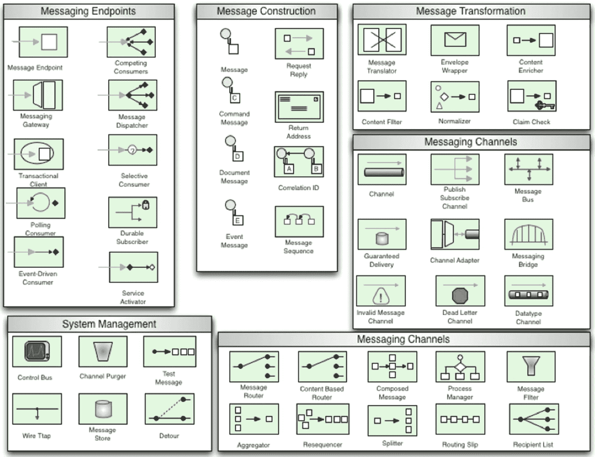

图 3-1。

企业集成模式

您可以看到每个模式在特定业务逻辑/规则中所扮演的角色的清晰划分。最重要的部分是消息和消息传输。

## 信息发送

为什么信息传递如此重要？当你创建一个解决方案时，你脑海中有一个基本的场景(见图 [3-2](#Fig2) )。这是需要发送到*输入*的数据，然后是*处理*，最后是*输出*到最终阶段(打印)或发送到另一个系统。


图 3-2。

输入-处理-输出

如果你考虑在你的解决方案中调用一个特定的逻辑，你是在调用一个方法(输入)，传递一些基于数据的参数(数据)。你执行一些逻辑(过程)，然后返回(输出)一个结果(数据)。

现在从信息传递的角度考虑一下。您通过本地进程或向远程服务器发送消息。您的消息可以被处理、增强或触发另一个事件，然后您得到一个结果，可能是您发送的同一条消息，或者是告诉您一切正常的消息，或者可能有一个错误。所有这些通过本地或远程系统的数据都需要通过*通道*进行传输。渠道在传递信息的方式中扮演着重要的角色。

正如你所看到的，信息在交流中起着重要的作用。

## Spring Integration

通过使用在本地或远程系统之间通信的通道或其他通道来应用消息传递。它为您提供了集成消息传递组件以创建可伸缩解决方案的参考，并展示了一些现有的消息传递技术(JMS、TIBCO、SOAP、MSMQ、NET 等)。)以及如何整合它们。如果你想更多地了解 EIP，我推荐 Gregor Hohpe 和 Bobby Woolf(Addison-Wesley Professional，2003)的*企业集成模式:设计、构建和部署消息传递解决方案*。这本书提供了每种模式的全面解释。

在这一节中，我将向您展示 Spring Integration 如何工作以及如何使用它。通过向您展示一个小型集成应用的例子，您可以更好地了解 Spring Integration 是怎么一回事。

### 电影应用规范要求

让我们创建一个包含两部分的电影应用。

假设您在一个文本文件(CSV 格式)中获得了一些关于新电影的信息(标题、演员、年份)，您需要将这些信息发送到一个只接受 JSON 格式的外部和远程系统。这个远程系统有一个 REST API 服务，它接受您的集合(`/v1/movies`)。收到信息后，它将信息保存到数据库(MySQL)中，并向管理员用户发送电子邮件(参见图 [3-3](#Fig3) 了解大致情况)。

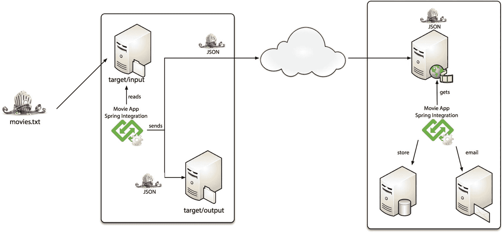

图 3-3。

电影集成应用

#### 电影应用第一部分

以下是电影应用的规格/要求。

*   获取 CSV 文件格式的新电影信息

*   将 CSV 内容转换成 JSON 格式

*   需要并行执行以下操作
    *   将电影信息保存到文件系统路径中(文件名需要有一个`.processed`后缀；例如`action-movies.txt > action-movies.txt.processed`

    *   通过调用 REST API 将 JSON 格式的电影信息发送到外部服务器

#### 电影应用:第二部分(外部)

以下是应用外部系统部分的规格/要求。

*   以 REST API 服务为特色:`/v1/movies`获取 JSON 格式的电影集的信息

*   将新的电影信息存储到 MySQL 中

*   存储电影信息后发送电子邮件

这个例子非常简单，但是足以向您展示 Spring Integration 是如何工作的。

### 创建电影应用:第一部分

让我们从创建应用的框架开始。转到 [`https://start.spring.io`](https://start.spring.io) 并创建一个项目。将其导出到任何 IDE 中(参见图 [3-4](#Fig4) )。或者，使用 STS IDE ( [`https://spring.io/tools`](https://spring.io/tools) )，单击文件➤新➤ Spring Starter 项目，然后按照向导进行操作。

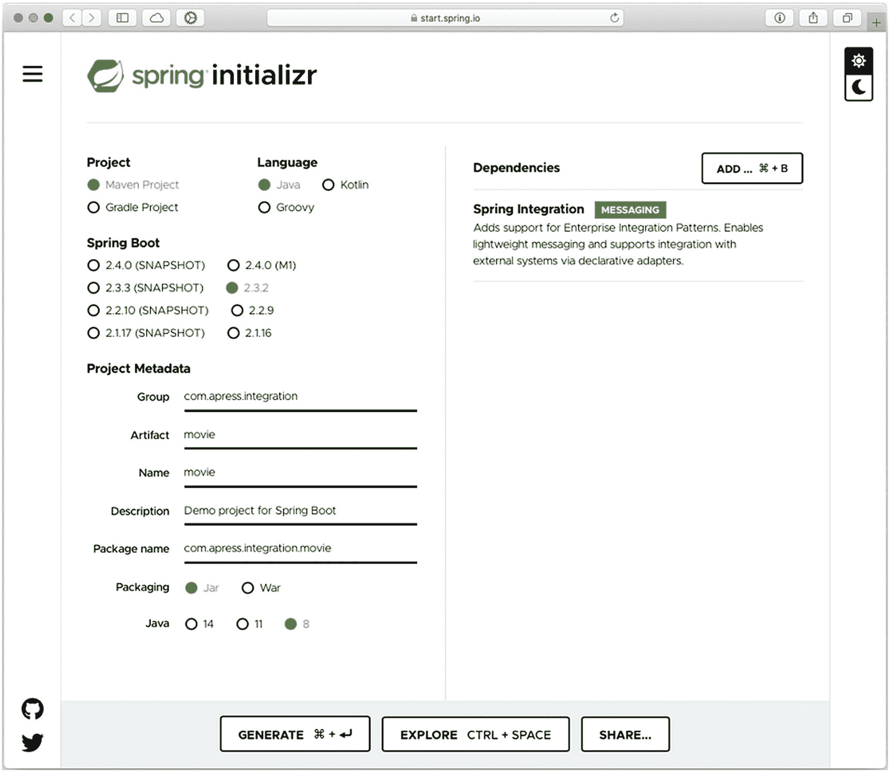

图 3-4。

[`https://start.spring.io`](https://start.spring.io) 的 Spring

图 [3-4](#Fig4) 显示了 Spring Initializr 主页。您可以添加以下值。

*   组:`com.apress.integration`

*   神器:`movie`

*   依赖性:Spring Integration

点击生成*项目*按钮。解压缩项目，并使用任何 IDE 导入它。

检查您的项目结构，确保您有清单 [3-1](#PC1) 中所示的`pom.xml`文件。我还添加了一个依赖项。

```java
<?xml version="1.0" encoding="UTF-8"?>
<project xmlns:="http://maven.apache.org/POM/4.0.0" xmlns:xsi="http://www.w3.org/2001/XMLSchema-instance"
        xsi:schemaLocation="http://maven.apache.org/POM/4.0.0 https://maven.apache.org/xsd/maven-4.0.0.xsd">
        <modelVersion>4.0.0</modelVersion>
        <parent>
                <groupId>org.springframework.boot</groupId>
                <artifactId>spring-boot-starter-parent</artifactId>
                <version>2.2.2.RELEASE</version>
                <relativePath/> <!-- lookup parent from repository -->
        </parent>
        <groupId>com.apress.integration</groupId>
        <artifactId>movie</artifactId>
        <version>0.0.1-SNAPSHOT</version>
        <name>movie</name>
        <description>Demo project for Spring Boot</description>

        <properties>
                <java.version>1.8</java.version>
        </properties>

        <dependencies>
                <dependency>
                        <groupId>org.springframework.boot</groupId>
                        <artifactId>spring-boot-starter-integration</artifactId>
                </dependency>

                <!-- JSON -->
                <dependency>
                        <groupId>com.fasterxml.jackson.core</groupId>
                        <artifactId>jackson-databind</artifactId>
                </dependency>

                <!-- Spring Integration - File -->
                <dependency>
                        <groupId>org.springframework.integration</groupId>
                        <artifactId>spring-integration-file</artifactId>
                </dependency>

                <!-- Spring Integration - Http -->
                <dependency>
                        <groupId>org.springframework.integration</groupId>
                        <artifactId>spring-integration-http</artifactId>
                </dependency>

                <dependency>
                        <groupId>org.springframework.boot</groupId>
                        <artifactId>spring-boot-starter-test</artifactId>
                        <scope>test</scope>
                        <exclusions>
                                <exclusion>
                                        <groupId>org.junit.vintage</groupId>
                                        <artifactId>junit-vintage-engine</artifactId>
                                </exclusion>

                        </exclusions>
                </dependency>
                <dependency>
                        <groupId>org.springframework.integration</groupId>
                        <artifactId>spring-integration-test</artifactId>
                        <scope>test</scope>
                </dependency>
        </dependencies>

        <build>
                <plugins>
                        <plugin>
                                <groupId>org.springframework.boot</groupId>
                                <artifactId>spring-boot-maven-plugin</artifactId>
                        </plugin>
                </plugins>
        </build>

</project>

Listing 3-1.The pom.xml File for the Movie App Project

```

列表 [3-1](#PC1) 是你应该有的最终`pom.xml that`。您会看到将 CSV 行转换成 object/JSON 所需的`spring-boot-starter-integration`JSON(*Jackson-databind*)依赖项、处理文件所需的`spring-integration-file`依赖项以及将 JSON 发送到外部系统所需的`spring-integration-http`依赖项。

制作 Spring Boot 应用的最佳特性之一是能够以不同的方式配置 Spring 上下文。您可以通过 XML beans 文件使用声明式编程，也可以通过用`@Configuration`注释您的类并使用`@Bean`注释声明您的 bean 来使用 JavaConfig 类。根据您的应用，您可以避免任何配置。Spring Boot 有一个自以为是的运行时，所以它试图找出你正在运行的应用的类型，通过使用它的自动配置和查看类路径，它尽最大努力创建正确的应用类型。

在接下来的小节中，我将向您展示如何使用声明性 XML 创建 Spring Integration 应用。我认为这是学习这种特殊技术的最好方法，因为它比使用 JavaConfig 类更具可读性(在我看来)；此外，通过使用声明性 XML，您可以利用 IDE 的强大功能来生成集成图，以可视化企业集成模式是如何工作的。

#### 电影应用:声明性 XML

让我们从使用 JavaConfig 类开始。首先，用清单 [3-2](#PC2) 中的内容添加一个名为`MovieConfiguration.java`的新类。

```java
package com.apress.integration.movie;

import org.springframework.context.annotation.Configuration;
import org.springframework.context.annotation.ImportResource;

@Configuration
@ImportResource("META-INF/spring/movie-app-integration.xml")
public class MovieConfiguration {

}

Listing 3-2.src/main/java/com/apress/integration/movie/MovieConfiguration.java

```

@ `ImportResource`注释导入 XML 文件。这些文件是 Spring 配置的一部分。当使用声明式 XML 时，我认为 Spring Integration 是配置它的最佳方式。别担心。我将在下一节解释如何创建 XML 文件。

#### 通过声明性 XML 的 Spring Integration

接下来，您需要在`src/main/resources/META-INF/spring/movie-app-integration.xml`中创建一个文件。您还需要创建目录结构(参见清单 [3-3](#PC3) )。

```java
<?xml version="1.0" encoding="UTF-8"?>
<beans xmlns:="http://www.springframework.org/schema/beans"
    xmlns:xsi="http://www.w3.org/2001/XMLSchema-instance"
    xmlns:int-file="http://www.springframework.org/schema/integration/file"
    xmlns:int="http://www.springframework.org/schema/integration"
    xmlns:int-http="http://www.springframework.org/schema/integration/http"
    xsi:schemaLocation="http://www.springframework.org/schema/beans http://www.springframework.org/schema/beans/spring-beans.xsd
        http://www.springframework.org/schema/integration/file http://www.springframework.org/schema/integration/file/spring-integration-file.xsd
        http://www.springframework.org/schema/integration/http http://www.springframework.org/schema/integration/http/spring-integration-http.xsd
        http://www.springframework.org/schema/integration http://www.springframework.org/schema/integration/spring-integration.xsd">

    <!-- Spring Integration -->
    <int-file:inbound-channel-adapter channel="input" directory="target/input" filename-pattern="*.txt">
        <int:poller fixed-rate="500"/>
    </int-file:inbound-channel-adapter>

    <!-- Spring Integration: Direct Channel -->
    <int:channel id="input"/>

    <!-- Spring Integration: Service Activator -->
    <int:service-activator id="movieProcessor" input-channel="input" ref="movieEndpoint" />

</beans>

Listing 3-3.src/main/resources/META-INF/spring/movie-app-integration.xml

```

清单 [3-3](#PC3) 显示了第一部分的 Spring 配置文件。要使用 Spring 配置，需要在 XML 中导入几个名称空间。以下是重要的名称空间。

*   `xmlns:int`

*   `xmlns:int-file`

*   `xmlns:int-http`

这些名称空间包含几个标签描述。使用最多的标签之一是`<int:channel />`。这个标签创建了一个通道作为生产者和消费者之间的通信点，生产者通过这个通道发送消息，消费者接收消息。使用通道的好处之一是，它确保消息到达目的地，并将生产者和消费者分离开来。与图 [3-2](#Fig2) 相同的过程如图 [3-5](#Fig5) 所示。


图 3-5。

有通道的输入-处理-输出

那么，新的表述告诉了我们什么？

*   输入和输出的符号定义了进行点对点或发布-订阅模式通信的通道。该示例使用直接通道，这是一种点对点模式。

*   流程符号定义了一个服务激活器，它是接收到的消息的处理器。通过输入通道接收消息，如果需要，服务激活器可以通过输出通道返回消息。

Spring Integration 处理基于`org.springframework.messaging.Message`类的内部消息格式。该接口定义如下。

```java
public interface Message<T> {

    /**
     * Return the message payload.
     */
    T getPayload();

    /**
     * Return message headers for the message (never {@code null} but may be empty).
     */
    MessageHeaders getHeaders();

}

```

注意`Message`是一个接口，有办法通过`MessageBuilder` -fluent API 创建。

```java
MessageBuilder.withPayload("Hello World").setHeader("myheader",
"Hi").setHeader("myotherheader","there").build();

```

这个例子使用了两个通道。

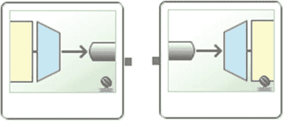

图 3-6a 和 3-6b。

`inbound-channel-adapter`通道在左边，`outbound-channel-adapter`通道在右边。

*   一个是名为`inbound-channel-adapter`的特殊通道，用图 [3-6a](#Fig6) 中的符号表示。

*   第二个通道命名为`outbound-channel-adapter`，用图 [3-6b](#Fig6) 中的符号表示。

两个频道与常规频道相同；唯一的区别是这些通道可以轮询源调用。

回到例子，让我们看看每一部分。

*   `<int-file:inbound-channel-adapter />`。该通道每隔几秒钟轮询(监控)一次文件系统路径。以下是它的属性。
    *   `directory="target/input"`表示频道正在监控目录中的任何新文件。

    *   `filename-pattern="*.txt"`只寻找文件。txt 扩展名。

    *   `channel="input"`表示一旦找到文件(. txt 文件),其内容将被发送到输入通道。

    *   `<int:poller fixed-rate="500"/>`是一个内部标签，表示每 500 毫秒监控一次。

*   `<int:channel id="input"/>`。这个标签创建了一个准备接收文件内容的通道。通常，id 是最匹配的通道的名称，而不考虑其用途(输入或输出)。

*   `<int:service-activator/>`。这个标签是文件内容的处理器。以下是它的属性。
    *   `input-channel="input"`监听来自输入通道的任何消息。

    *   `ref="movieEndpoint"`使用名为 movieEndpoint 的 bean 来处理来自输入通道的消息。

如果你使用的是 Spring 工具套件，简称 STS IDE([`https://spring.io/tools`](https://spring.io/tools)，可以看到这个例子的 Spring Integration 图(见图 [3-7](#Fig7) )。您可以用 IntelliJ 做同样的事情，但是您需要使用付费版本和 Spring Integration 模式插件。

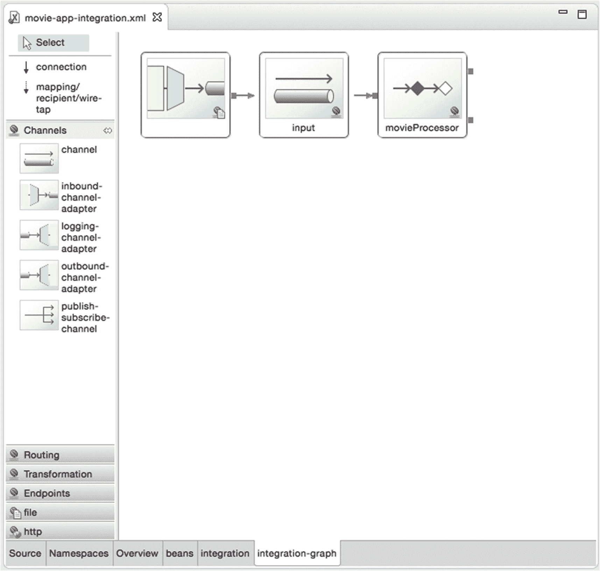

图 3-7。

STS IDE 中的 Spring Integration 图

#### Spring Integration 开发

接下来，让我们创建`Service Activator`类，它接收文本文件的内容。用清单 [3-4](#PC6) 中的内容创建 MovieEndpoint.java 类。

```java
package com.apress.spring.integration.movie;

import java.io.File;
import java.io.FileInputStream;
import java.util.Map;

import org.slf4j.Logger;
import org.slf4j.LoggerFactory;
import org.springframework.integration.annotation.MessageEndpoint

;
import org.springframework.integration.annotation.ServiceActivator;
import org.springframework.messaging.handler.annotation.Headers;
import org.springframework.util.StreamUtils;

@MessageEndpoint
public class MovieEndpoint {

    private static final Logger log = LoggerFactory.getLogger(MovieEndpoint.class);

    @ServiceActivator
    public void process(File input, @Headers Map<String,Object> headers) throws Exception {
        FileInputStream in = new FileInputStream(input);
        String movies = new String(StreamUtils.copyToByteArray(in));
        in.close();
        log.info("Received: \n" +  movies);
    }
}

Listing 3-4.com.apress.integration.movie.MovieEndpoint.java

```

清单 [3-4](#PC6) 显示了`MovieEndpoint.java`服务激活器。让我们来看看每一部分。

*   `@MessageEndpoint`是一个注释，它告诉 Spring Integration 该类必须被视为任何其他输出通道访问的端点。

*   `@ServiceActivator`是对一个方法的注释，告诉 Spring Integration 该方法是消息到达和处理的入口点。以下是它的参数。
    *   `File`是`java.io.File`类。`<int-file:inbound-channel-adapter />`标签自动发送 java.io. `File`，它填写`Message`接口中的所有头。

    *   `@Headers`是一个具有`org.springframework.messaging.MessageHeaders`类头的注释。其中两个标题是`id`和`timestamp`。

*   `process`方法是从`<int:channel channel="input"/>`开始监听的切入点。

接下来，您需要创建一个包含电影的小文件来测试您的第一个 Spring Integration 应用——类似于下面的代码片段(就像电影标题、演员、年份一样简单)。

```java
The Matrix, Keanu Reeves, 1999
Memento, Guy Pearce, 2000
The Silence of the Lambs, Jodie Foster, 1991
The Prestige, Christian Bale, 2006
Disturbia, Shia LaBeouf, 2007

```

将文件放入`target/input`(在项目的根目录下)。当您使用 Maven 时，它会自动生成`target`文件夹。您需要创建输入文件夹并将文件放在那里。

现在该运行应用了。打开一个新的终端，从根目录的项目中，执行下面的命令行。

```java
$ ./mvn spring-boot:run

```

您应该会看到以下输出。

```java
INFO 5395 --- [ask-scheduler-1] o.s.i.file.FileReadingMessageSource      : Created message: [GenericMessage [payload=target/input/movies-batch1.txt, headers={timestamp=1437355862115, id=4fe905ee-8829-e3f2-df42-f5a7512635cd}]]
INFO 5395 --- [ask-scheduler-1] c.a.spring.integration.MovieEndpoint     : Movies Received:
The Matrix, Keanu Reeves, 1999
Memento, Guy Pearce, 2000
The Silence of the Lambs, Jodie Foster, 1991
The Prestige, Christian Bale, 2006
Disturbia, Shia LaBeouf, 2007

```

成功了。如果您想创建一个行为来监控目录中的文件，您需要考虑可重用性和可扩展性。这种与文件系统的集成已经存在于 Spring Integration 中。

您需要将文件(CSV)的内容转换成 JSON 格式。我们来看看清单 [3-5](#PC10) 。

```java
package com.apress.integration.movie;

import com.fasterxml.jackson.databind.ObjectMapper;
import org.slf4j.Logger;
import org.slf4j.LoggerFactory;
import org.springframework.stereotype.Component;

import java.io.IOException;
import java.util.ArrayList;
import java.util.Arrays;
import java.util.List;

@Component
public class MovieService {

    private static final Logger log = LoggerFactory.getLogger(MovieService.class);

    public String format(String contents){ 

        log.info("Formatting to Json...");

        String json = "{}";

        ObjectMapper mapper = new ObjectMapper();
        try {
            json = mapper.writeValueAsString(parse(contents));
            log.info("\n" + json);
        } catch (IOException e) {
            e.printStackTrace();
        }

        return json;
    }

    private List<Movie> parse(String contents){
        List<Movie> movies = new ArrayList<Movie>();
        String[] record = null;
        for(String line: contents.split(System.getProperty("line.separator"))){
            record = Arrays.asList(line.split(",")).stream().map( c -> c.trim()).toArray( size -> new String[size]);
            movies.add(new Movie(record[0],record[1],Integer.valueOf(record[2])));
        }
        return movies;
    }
}

Listing 3-5.com.apress.integration.movie.MovieService.java

```

清单 [3-5](#PC10) 显示了用`@Component,`注释了`MovieService`类，使得这个类对 Spring 容器可见，这样您就可以在您的服务激活器中使用它。让我们看看每种方法。

*   `format(String contents)`获取文件的内容并使用`ObjectMapper`类(来自 Jackson 库)通过调用私有的`parse`方法将它(来自电影列表)转换成 JSON 格式。

*   `parse(String contents)`是获取文件内容的方法。它通过剥离每一行并(用逗号)分割成实际值来进行解析。它创建一个添加到数组列表中的`Movie`对象。这个数组列表就是结果。这个方法使用 Java 8 streams 符号来避免值中有任何空格。

    清单 [3-5](#PC10) 引入了一个`Movie`类，那么我们来看看这个类(参见清单 [3-6](#PC11) )。

```java
package com.apress.integration.movie;

public class Movie {

    private String title;
    private String actor;
    private int year;

    public Movie(){}

    public Movie(String title, String actor, int year){
        this.title = title;
        this.actor = actor;
        this.year = year;
    }

    public String getTitle() {
        return title;
    }
    public void setTitle(String title) {
        this.title = title;
    }
    public String getActor() {
        return actor;
    }
    public void setActor(String actor) {
        this.actor = actor;
    }
    public int getYear() {
        return year;
    }
    public void setYear(int year) {
        this.year = year;
    }

    public String toString(){
        StringBuilder builder = new StringBuilder();
        builder.append("Movie(title: ");
        builder.append(title);
        builder.append(", actor: ");
        builder.append(actor);
        builder.append(", year: ");
        builder.append(year);
        builder.append(")");
        return builder.toString();
    }

}

Listing 3-6.com.apress.integration.movie.Movie.java

```

清单 [3-6](#PC11) 是一个基本的电影 POJO，包含这些基本字段:标题、演员和年份。让我们在服务激活器中使用这个服务(参见清单 [3-7](#PC12) )。

```java
package com.apress.integration.movie;

import org.slf4j.Logger;
import org.slf4j.LoggerFactory;
import org.springframework.beans.factory.annotation.Autowired;
import org.springframework.integration.annotation.MessageEndpoint;
import org.springframework.integration.annotation.ServiceActivator;
import org.springframework.messaging.handler.annotation.Headers;
import org.springframework.util.StreamUtils;

import java.io.File;
import java.io.FileInputStream;
import java.util.Map;

@MessageEndpoint
public class MovieEndpoint {

    private static final Logger log = LoggerFactory.getLogger(MovieEndpoint.class);

    @Autowired
    private MovieService service;

    @ServiceActivator
    public void process(File input, @Headers Map<String,Object> headers) throws Exception {
        FileInputStream in = new FileInputStream(input);
        String movies = service.format(new String(StreamUtils.copyToByteArray(in)));
        in.close();
        log.info("Movies Received: \n" +  movies);
    }
}

Listing 3-7.com.apress.integration.movie.MovieEndpoint.java (version 2) Using MovieService

```

清单 [3-7](#PC12) 是`MovieEndpoint`类的版本 2，它使用了`MovieService`。它使用了允许`MovieService`被注入并准备使用的`@Autowired`注释。如果您使用 Maven 或 STS IDE 运行应用，您应该会看到下面的输出。

```java
INFO 5677 --- [ask-scheduler-1] com.apress.integration.movie.MovieService   : Formatting to Json...
INFO 5677 --- [ask-scheduler-1] com.apress.integration.movie.MovieService   :
[{"title":"The Matrix","actor":"Keanu Reeves","year":1999},{"title":"Memento","actor":"Guy Pearce","year":2000},{"title":"The Silence of the Lambs","actor":"Jodie Foster","year":1991},{"title":"The Prestige","actor":"Christian Bale","year":2006},{"title":"Disturbia","actor":"Shia LaBeouf","year":2007}]

```

这个输出是使用`MovieService`的结果；它以 JSON 格式生成，这是该应用的要求之一。

下一个需求是将内容发送到一个`target/output/<file>.txt.processed`格式的文件中。您可以在 service activator 中创建所有的逻辑，这样就大功告成了。但是对于使用 REST API 将文件发送到远程服务的需求呢？如果你考虑一下，你可以在同一个过程方法中在`Service Activator`类中做这两个实现。但这需要时间，对吗？多亏了 Spring Integration，这个逻辑已经作为标签存在了！让我们从将处理过的文件发送到扩展名为`.processed`的输出目录开始。

您需要修改`movie-app-integration.xml`文件，看起来像清单 [3-8](#PC14) 。

```java
<?xml version="1.0" encoding="UTF-8"?>
<beans xmlns:="http://www.springframework.org/schema/beans"
    xmlns:xsi="http://www.w3.org/2001/XMLSchema-instance"
    xmlns:int-file="http://www.springframework.org/schema/integration/file"
    xmlns:int="http://www.springframework.org/schema/integration"
    xmlns:int-http="http://www.springframework.org/schema/integration/http"
    xsi:schemaLocation="http://www.springframework.org/schema/beans http://www.springframework.org/schema/beans/spring-beans.xsd
        http://www.springframework.org/schema/integration/file http://www.springframework.org/schema/integration/file/spring-integration-file.xsd
        http://www.springframework.org/schema/integration/http http://www.springframework.org/schema/integration/http/spring-integration-http.xsd
        http://www.springframework.org/schema/integration http://www.springframework.org/schema/integration/spring-integration.xsd">

    <!-- Spring Integration -->
    <int-file:inbound-channel-adapter channel="input" directory="target/input" filename-pattern="*.txt">
        <int:poller fixed-rate="500"/>
    </int-file:inbound-channel-adapter>

    <!-- Spring Integration: Direct Channel -->
    <int:channel id="input"/>

    <!-- Spring Integration: Service Activator -->
    <int:service-activator id="movieProcessor" input-channel="input" ref="movieEndpoint" output-channel="output"/>

    <!-- Spring Integration: Direct Channel -->
    <int:channel id="output"/>

    <!--  Spring Integration: File -->
    <int-file:outbound-channel-adapter channel="output" directory="target/output"  filename-generator-expression="headers['name'] + '.processed'" />

</beans>

Listing 3-8.movie-app-integration.xml (version 2)

```

清单 [3-8](#PC14) 是`movie-app-integration.xml`文件的版本 2。让我们看看有什么新的。

*   `<int:service-activator />`有一个新属性:`output-channel="output".`这个属性标识消息发出的通道；在这种情况下，频道的名称是`"output"`。

*   `<int:channel id="output"/>`创建新频道。这是从服务激活器发送消息的通道。

*   `<int-file:outbound-channel-adapter />`获取内容(JSON 格式)并在指定目录下创建文件。使用了以下属性。
    *   `channel="output"`设置收听输入内容的频道。

    *   `directory="target/output"`指定文件在目录中的位置。

    *   `filename-generator-expression="headers['name'] + '.processed'"`通过检查邮件头并添加后缀来生成文件名。

您需要再次修改服务激活器，因为它现在需要返回一些东西。在这种情况下，`<int-file:outbound-channel-adapter/>`标签给你一个提示。您需要发送回一个`Message`实例，至少包含新文件名的头(参见清单 [3-9](#PC15) )。

```java
package com.apress.integration.movie;

import org.slf4j.Logger;
import org.slf4j.LoggerFactory;
import org.springframework.beans.factory.annotation.Autowired;
import org.springframework.integration.annotation.MessageEndpoint;
import org.springframework.integration.annotation.ServiceActivator;
import org.springframework.messaging.Message;
import org.springframework.messaging.handler.annotation.Headers;
import org.springframework.messaging.support.MessageBuilder;
import org.springframework.util.StreamUtils;

import java.io.File;
import java.io.FileInputStream;
import java.util.Map;

@MessageEndpoint
public class MovieEndpoint {

    private static final Logger log = LoggerFactory.getLogger(MovieEndpoint.class);

    @Autowired
    private MovieService service;

    @ServiceActivator
    public Message<String> process(File input, @Headers Map<String,Object> headers) throws Exception {
        FileInputStream in = new FileInputStream(input);
        String movies = service.format(new String(StreamUtils.copyToByteArray(in)));
        in.close();
        log.info("Sending the JSON content to a file...");
        return MessageBuilder.withPayload(movies).setHeader("name",input.getName()).setHeader("Content-Type","application/json").build();
    }
}

Listing 3-9.com.apress.integration.movie.MovieEndpoint.java (version 3): Returning a Message Instance

```

清单 [3-9](#PC15) 是`MovieService`的版本 3，从服务激活器返回一个值；在本例中，是一个`org.springframework.messaging.Message<String>`接口的实例。此外，它还添加了包含名称和`Content-Type`的头。这最后一个头对于 HTTP 请求(稍后出现)很有用。`org.springframework.messaging.support.MessageBuilder`实用程序类构建消息。这个类提供了一个非常漂亮流畅的 API。

如果有 STS IDE，可以看到修改配置 XML 文件后的图形结果，如图 [3-8](#Fig8) 所示。

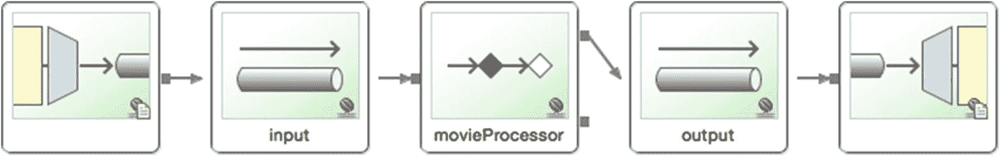

图 3-8。

Spring 积分图(第 2 版)

运行应用后，您应该得到和以前一样的输出，但是如果您看一下`target/output`目录，您会发现一个新的文件名，`movies.txt.processed`(如果您将文件命名为:`movies.txt`)。内容是 JSON 格式的。

下一个需求是将这个文件发送到外部 REST API 服务。清单 [3-10](#PC16) 是`movie-app-integration.xml`的版本 3。

```java
<?xml version="1.0" encoding="UTF-8"?>
<beans xmlns:="http://www.springframework.org/schema/beans"
    xmlns:xsi="http://www.w3.org/2001/XMLSchema-instance"
    xmlns:int-file="http://www.springframework.org/schema/integration/file"
    xmlns:int="http://www.springframework.org/schema/integration"
    xmlns:int-http="http://www.springframework.org/schema/integration/http"
    xsi:schemaLocation="http://www.springframework.org/schema/beans http://www.springframework.org/schema/beans/spring-beans.xsd
        http://www.springframework.org/schema/integration/file http://www.springframework.org/schema/integration/file/spring-integration-file.xsd
        http://www.springframework.org/schema/integration/http http://www.springframework.org/schema/integration/http/spring-integration-http.xsd
        http://www.springframework.org/schema/integration http://www.springframework.org/schema/integration/spring-integration.xsd">

    <!-- Spring Integration -->
    <int-file:inbound-channel-adapter channel="input" directory="target/input" filename-pattern="*.txt">
        <int:poller fixed-rate="500"/>
    </int-file:inbound-channel-adapter>

    <!-- Spring Integration: Direct Channel -->
    <int:channel id="input"/>

    <!-- Spring Integration: Service Activator -->
    <int:service-activator input-channel="input" ref="movieEndpoint" output-channel="output"/>

    <!-- Spring Integration: Direct Channel -->
    <int:channel id="output"/>

    <!-- Spring Integration: Router -->
    <int:recipient-list-router input-channel="output">
        <int:recipient channel="toFile" />
        <int:recipient channel="toHttp"/>
    </int:recipient-list-router>

    <!-- Spring Integration: Direct Channels -->
    <int:channel id="toFile"/>
    <int:channel id="toHttp"/>

    <!-- Spring Integration: File and Http -->
    <int-file:outbound-channel-adapter channel="toFile" directory="target/output"  filename-generator-expression="headers['name'] + '.processed'" />
    <int-http:outbound-channel-adapter channel="toHttp" url="http://localhost:8080/v1/movies" http-method="POST"/>

</beans>

Listing 3-10.movie-app-integration.xml (version 3)

```

清单 [3-10](#PC16) 是`movie-app-integration.xml`文件的版本 3。让我们看看有什么新的。

*   `<int:recipient-list-router />`是一个暴露路由器的新标签。这个例子使用`output`通道将内容发送到`toFile`和`toHttp`通道。

*   `<int:recipient/>`声明路由器要使用的通道。

*   `<int:channel/>`表示有两个新的直接通道(点对点):`toFile`和`toHttp`。

*   `<int-http:outbound-channel-adapter/>`向远程服务发出请求的新标签——您需要指向的 REST API(`/v1/movies`)。

基于清单 [3-10](#PC16) ，你的曲线图应该类似于图 [3-9](#Fig9) 。

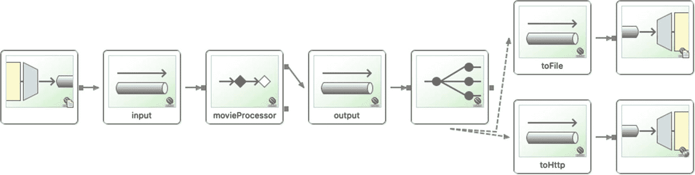

图 3-9。

Spring 积分图

运行应用会导致一些错误，因为它正在寻找`http://localhost:8080/v1/movies`端点，而且还没有准备好；这是集成的下一部分。正如您所看到的，尝试实现需求的最后一部分非常耗时，但是 Spring Integration 已经拥有了这些可重用的模块(EIP 实现)。

### 创建电影应用:第二部分(外部)

这个应用是面向创建一个 REST API，做数据库插入，并发送电子邮件。您可以使用相同的 URL 来生成项目( [`http://start.spring.io`](http://start.spring.io) )或者使用 STS IDE 来生成相同的模板。

以下是该项目的新字段值(见图 [3-10](#Fig10) )。

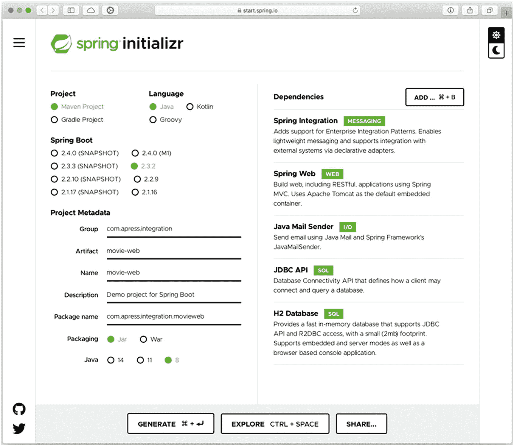

图 3-10。

spring Initializr at[*https://start . spring . io*T3】](https://start.spring.io)

*   组:`com.apress.integration`

*   神器:`movie-web`

*   依赖:Spring Web，Spring Integration，Java 邮件发送器，JDBC API，H2 数据库

生成项目后，将其解压缩并导入到您喜欢的 IDE 中。您应该拥有清单 [3-11](#PC17) 中所示的`pom.xml`。(如有必要，请修改以匹配清单 [3-11](#PC17) 。)

```java
<?xml version="1.0" encoding="UTF-8"?>
<project xmlns:="http://maven.apache.org/POM/4.0.0" xmlns:xsi="http://www.w3.org/2001/XMLSchema-instance"
        xsi:schemaLocation="http://maven.apache.org/POM/4.0.0 https://maven.apache.org/xsd/maven-4.0.0.xsd">
        <modelVersion>4.0.0</modelVersion>
        <parent>
                <groupId>org.springframework.boot</groupId>
                <artifactId>spring-boot-starter-parent</artifactId>
                <version>2.2.2.RELEASE</version>
                <relativePath/> <!-- lookup parent from repository -->
        </parent>
        <groupId>com.apress.integration</groupId>
        <artifactId>movie-web</artifactId>
        <version>0.0.1-SNAPSHOT</version>
        <name>movie-web</name>
        <description>Demo project for Spring Boot</description>

        <properties>

                <java.version>1.8</java.version>
        </properties>

        <dependencies>
                <dependency>
                        <groupId>org.springframework.boot</groupId>
                        <artifactId>spring-boot-starter-integration</artifactId>
                </dependency>
                <dependency>
                        <groupId>org.springframework.boot</groupId>
                        <artifactId>spring-boot-starter-jdbc</artifactId>
                </dependency>
                <dependency>
                        <groupId>org.springframework.boot</groupId>
                        <artifactId>spring-boot-starter-mail</artifactId>
                </dependency>
                <dependency>
                        <groupId>org.springframework.boot</groupId>
                        <artifactId>spring-boot-starter-web</artifactId>
                </dependency>

                <!-- Spring Integration -->
                <dependency>
                        <groupId>org.springframework.integration</groupId>
                        <artifactId>spring-integration-jdbc</artifactId>
                </dependency>
                <dependency>
                        <groupId>org.springframework.integration</groupId>
                        <artifactId>spring-integration-mail</artifactId>
                </dependency>

                <!-- JDBC -->
                <dependency>
                        <groupId>mysql</groupId>
                        <artifactId>mysql-connector-java</artifactId>
                </dependency>

                <!-- Http -->
                <dependency>
                        <groupId>org.springframework.integration</groupId>
                        <artifactId>spring-integration-http</artifactId>
                </dependency>

                <dependency>
                        <groupId>com.h2database</groupId>
                        <artifactId>h2</artifactId>
                        <scope>runtime</scope>
                </dependency>
                <dependency>
                        <groupId>org.springframework.boot</groupId>
                        <artifactId>spring-boot-starter-test</artifactId>
                        <scope>test</scope>
                        <exclusions>

                                <exclusion>
                                        <groupId>org.junit.vintage</groupId>
                                        <artifactId>junit-vintage-engine</artifactId>
                                </exclusion>
                        </exclusions>
                </dependency>
                <dependency>
                        <groupId>org.springframework.integration</groupId>
                        <artifactId>spring-integration-test</artifactId>
                        <scope>test</scope>
                </dependency>
        </dependencies>

        <build>
                <plugins>
                        <plugin>
                                <groupId>org.springframework.boot</groupId>
                                <artifactId>spring-boot-maven-plugin</artifactId>
                        </plugin>
                </plugins>
        </build>

</project>

Listing 3-11.pom.xml

```

清单 [3-11](#PC17) 是您将要使用的`pom.xml`。看一看 Spring Integration 和 JDBC 部分。你需要加上`spring-integration-jdbc`、`spring-integration-mail`、`spring-integration-http,`和`h2`。前两个依赖项添加了名称空间，以便在解决方案的这一部分使用特殊的标记。

#### Spring Boot MVC 电影应用第二部分

让我们看看使用 Spring MVC 组件有多容易。在本节中，您将创建`com.apress.integration.movieweb.MovieController.java`类并重用`Movie`类(参见清单 [3-6](#PC11) )。`MovieController`类必须具有清单 [3-12](#PC18) 中所示的内容。

```java
package com.apress.integration.movieweb;

import org.slf4j.Logger;
import org.slf4j.LoggerFactory;
import org.springframework.http.HttpStatus;
import org.springframework.http.ResponseEntity;
import org.springframework.web.bind.annotation.RequestBody;
import org.springframework.web.bind.annotation.RequestMapping;
import org.springframework.web.bind.annotation.RequestMethod;
import org.springframework.web.bind.annotation.RestController;

@RestController

public class MovieController {

    private static final Logger log = LoggerFactory.getLogger(MovieController.class);

    @RequestMapping(method=RequestMethod.POST,value="/v1/movie")
    public ResponseEntity<String> movie(@RequestBody Movie body){
        log.info("Movie: " +  body);
        return new ResponseEntity<String>(HttpStatus.ACCEPTED);
    }

    @RequestMapping(method=RequestMethod.POST,value="/v1/movies")
    public ResponseEntity<String> movies(@RequestBody Movie[] body){
        for (Movie movie: body){
            log.info("Movie: " +  movie);
        }
        return new ResponseEntity<String>(HttpStatus.ACCEPTED);
    }

}

Listing 3-12.com.apress.integration.movieweb.MovieController.java

```

清单 [3-12](#PC18) 显示了`MovieController`类。由于其注释，此类被视为 web 控制器。Spring Boot 注册这个控制器和任何暴露的 URL 映射；在这种情况下，“`/v1/movie`”和“`/v1/movies`”(一个是单数，一个是复数)。我们来看看细节。

*   `@RestController`。该注释是 Spring Boot 的标记，因此它被注册为入口休息点。

*   `@RequestMapping`。该注释声明了 REST API、接受传入请求的方法以及接受这些请求的路径。这个注释必须放在作为请求处理程序的方法中。您也可以使用`@GetMapping`注释，这是一种处理 GET HTTP 请求的简单方法。

*   `@RequestBody`。两个处理程序中都使用了这个注释，但是看看参数——一个是单个实例，另一个是一组`Movie`实例。每次有请求时，Spring MVC 负责自动将每个 JSON 请求转换成正确的实例；在这种情况下，`Movie`的实例。(`Movie`类与第一部分中的相同)。

*   `ResponseEntity<String>`。每个处理程序返回一个 ResponseEntity 状态；在本例中，是一个带有 HTTP 状态代码`202`的字符串`Accepted`。

现在，您可以通过执行以下命令在终端中运行 web 应用。

```java
$ ./mvnw spring-boot:run

```

您可以做一个小测试，验证您的 REST API 正在运行。例如，您可以打开一个终端并使用`cURL`命令，如下面的代码片段所示，并获得相同的输出。

```java
$ curl -i -H "Content-Type:application/json" -X POST -d '[{"title":"The Matrix","actor":"Keanu Reeves","year":1999},{"title":"Memento","actor":"Guy Pearce","year":2000}]' http://localhost:8080/v1/movies

HTTP/1.1 202 Accepted
Server: Apache-Coyote/1.1
Content-Length: 0

```

您将获得 202 Accepted 显示，并且在运行 web 应用的日志中，您将看到类似于以下输出的内容。

```java
INFO 8052 --- [.16-8080-exec-3] c.apress.integration.movieweb.MovieWebController   : Movie: Movie(title: The Matrix, actor: Keanu Reeves, year: 1999)
INFO 8052 --- [.16-8080-exec-3] c.apress.integration.movieweb.MovieWebController   : Movie: Movie(title: Memento, actor: Guy Pearce, year: 2000)

```

好了，您刚刚创建了 REST API 服务，但是您遗漏了其他需求。将电影保存到 JDBC，并发送有关新保存的电影的电子邮件。在 rest 控制器的 handler 方法中，您可以添加执行 JDBC 和发送电子邮件的逻辑，但主要目的是为了了解 Spring Integration 的强大功能。

您可以运行电影应用(来自第一部分)来看看它是如何交流的。您应该会在`MovieWeb`控制台日志中看到所有打印出来的电影。

#### 通过声明性 XML 的 Spring Integration:第二部分

接下来，让我们创建清单 [3-13](#PC22) 中所示的 Spring bean 上下文文件。

```java
<?xml version="1.0" encoding="UTF-8"?>
<beans xmlns:="http://www.springframework.org/schema/beans"
       xmlns:xsi="http://www.w3.org/2001/XMLSchema-instance" xmlns:int="http://www.springframework.org/schema/integration"
       xmlns:int-http="http://www.springframework.org/schema/integration/http"
       xmlns:int-mail="http://www.springframework.org/schema/integration/mail"
       xmlns:jdbc="http://www.springframework.org/schema/jdbc" xmlns:int-jdbc="http://www.springframework.org/schema/integration/jdbc"
       xsi:schemaLocation="http://www.springframework.org/schema/jdbc http://www.springframework.org/schema/jdbc/spring-jdbc.xsd
        http://www.springframework.org/schema/integration/jdbc http://www.springframework.org/schema/integration/jdbc/spring-integration-jdbc.xsd
        http://www.springframework.org/schema/beans http://www.springframework.org/schema/beans/spring-beans.xsd
        http://www.springframework.org/schema/integration/http http://www.springframework.org/schema/integration/http/spring-integration-http.xsd
        http://www.springframework.org/schema/integration/mail http://www.springframework.org/schema/integration/mail/spring-integration-mail.xsd
        http://www.springframework.org/schema/integration http://www.springframework.org/schema/integration/spring-integration.xsd">

    <!-- Spring Integration -->
    <!-- Spring Integration: Http -->
    <int-http:inbound-channel-adapter id="movie"
                                      supported-methods="POST" channel="input" path="/v2/movie"
                                      request-payload-type="com.apress.integration.movieweb.Movie"
                                      status-code-expression="T(org.springframework.http.HttpStatus).ACCEPTED"
    />

    <int-http:inbound-channel-adapter id="movies"
                                      supported-methods="POST" channel="input" path="/v2/movies"
                                      request-payload-type="com.apress.integration.movieweb.Movie[]"
                                      status-code-expression="T(org.springframework.http.HttpStatus).ACCEPTED"
    />

    <!-- Spring Integration: Execution Channel -->
    <int:channel id="input"/>

    <!-- Spring Integration Service Activator. -->
    <int:service-activator input-channel="input" ref="movieEndpoint" />

</beans>

Listing 3-13.src/main/resources/META-INF/spring/movie-webapp-integration.xml

```

清单 [3-13](#PC22) 是要使用的 XML 配置文件。这个文件应该创建在`src/main/resources/META-INF/spring`目录下。

Note

所有源代码都在 Apress 网站上(参见 [`www.apress.com`](http://www.apress.com) 的源代码/下载选项卡)。可以复制/粘贴。

看看下面的名称空间。即使您现在不会使用它们，但很快就会用到。

*   `xmlns:int-mail`展示了一些对电子邮件操作有用的标签。

*   `xmlns:jdbc`对 JDBC 有用。

让我们回顾一下清单 [3-13](#PC22) ，看看有什么新内容。

*   `<int-http:inbound-channel-adapter/>`。即使您已经创建了`MovieController`类，这个标签也会创建相同的行为。它使用版本 2 创建了两个端点:`"/v2/movie"`和`"/v2/movies"`。这些属性如下。
    *   `supported-methods="POST"`告知端点仅接受 POST 请求。

    *   `channel="input"`指定请求消息发送到哪里。

    *   `path="/v2/movie"`是请求映射路径。定义了两个:一个用于单个电影，另一个用于电影集合。

    *   `request-payload-type="com.apress.integration.movieweb.Movie"`类似于声明`@RequestBody`的注释。Spring MVC 自动将 JSON 格式转换成`Movie`对象。对于电影集合，您声明了`Movie[]`数组。

    *   `status-code-expression="T(org.springframework.http.HttpStatus).ACCEPTED"`显示了类似于`ResponseEntity<String>`类型的响应类型。

*   `<int:channel id="input"/>`创建一个生产和消费一个`Message`类型的通道。

*   `<int:service-activator input-channel="input" ref="movieEndpoint" />`公开类的名称，在该类中，您将该端点的处理程序声明为服务激活器。

您可以使用 XML 配置文件以编程方式创建相同的 REST API 端点(如`MovieWebController`类),也可以不使用任何代码(声明性的)。

这个 XML 配置文件的结果图如图 [3-11](#Fig11) 所示。

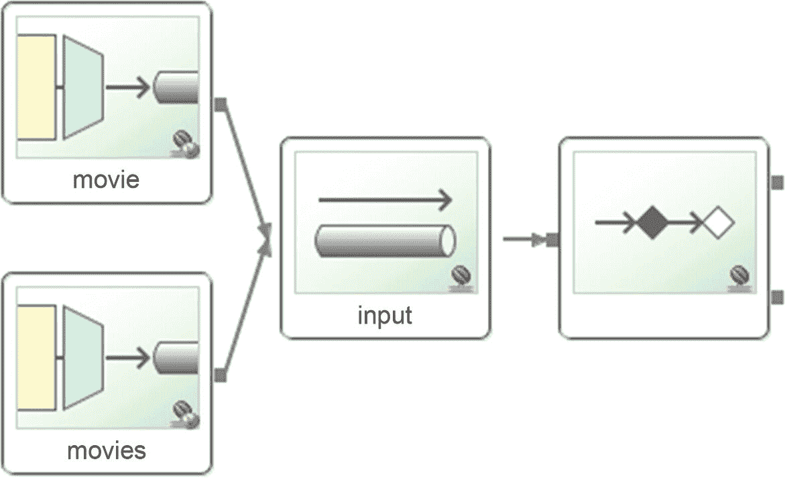

图 3-11。

Spring 积分图第二部分(第 1 版)

#### Spring Integration 开发:第二部分

清单 [3-14](#PC23) 是一个服务激活器组件，即`MovieEndpoint`类。

```java
package com.apress.integration.movieweb;

import org.slf4j.Logger;
import org.slf4j.LoggerFactory;
import org.springframework.integration.annotation.MessageEndpoint;
import org.springframework.integration.annotation.ServiceActivator;
import org.springframework.messaging.handler.annotation.Headers;

import java.util.Map;

@MessageEndpoint
public class MovieEndpoint {

    private static final Logger log = LoggerFactory.getLogger(MovieEndpoint.class);

    @ServiceActivator
    public void processMovie(Movie movie, @Headers Map<String,Object> headers) throws Exception {
        log.info("Movie: " + movie);
    }

    @ServiceActivator
    public void processMovies(Movie[] movies, @Headers Map<String,Object> headers) throws Exception {
        for (Movie movie: movies){
            log.info("Movie: " +  movie);
        }
    }
}

Listing 3-14.com.apress.integration.movieweb.MovieEndpoint.java

```

清单 [3-14](#PC23) 显示了消息端点。该类公开了两个服务激活器处理程序。当消息到达输入通道时，Spring Integration 决定选择哪一个。

接下来，创建`MovieConfiguration`类，因为您需要包含带有`@ImportResource`注释的 XML 文件(参见清单 [3-15](#PC24) )。

```java
package com.apress.integration.movieweb;

import org.springframework.context.annotation.Configuration;
import org.springframework.context.annotation.ImportResource;

@Configuration
@ImportResource("META-INF/spring/movie-webapp-integration.xml")
public class MovieConfiguration {

}

Listing 3-15.MovieWebApplication (version 2)

```

现在，您可以运行应用了。现在您应该有四个 REST 端点——两个由`MovieController`类(`/v1/movie`和`/v1/movies`)处理请求，另外两个由 Spring Integration 及其`<int-http:inbound-channel-adapter/>`标记(`/v2/movie`和`/v2/movies`)处理请求。

可以用 cURL 测试一下。

```java
$ curl -i -H "Content-Type:application/json" -X POST -d '[{"title":"The Matrix","actor":"Keanu Reeves","year":1999},{"title":"Memento","actor":"Guy Pearce","year":2000}]' http://localhost:8080/v2/movies

HTTP/1.1 202 Accepted

Server: Apache-Coyote/1.1
Content-Length: 0

```

再次注意，您使用的是 API 的版本 2。

接下来，继续第二部分的需求，有必要添加一种方法来将电影存储在数据库中，然后，在这之后，发送电子邮件。一种方法是重用服务激活器处理程序，并创建一个公共函数，将电影存储在数据库中。为此，您可以使用常规的 JDBC 代码、Spring 提供的 JDBCTemplate 或 Hibernate with JPA。

还是用 Spring Integration 吧！它有一个组件可以直接插入到数据库中(参见清单 [3-16](#PC26) )。

```java
<?xml version="1.0" encoding="UTF-8"?>
<beans xmlns:="http://www.springframework.org/schema/beans"
       xmlns:xsi="http://www.w3.org/2001/XMLSchema-instance" xmlns:int="http://www.springframework.org/schema/integration"
       xmlns:int-http="http://www.springframework.org/schema/integration/http"
       xmlns:int-mail="http://www.springframework.org/schema/integration/mail"
       xmlns:jdbc="http://www.springframework.org/schema/jdbc" xmlns:int-jdbc="http://www.springframework.org/schema/integration/jdbc"
       xsi:schemaLocation="http://www.springframework.org/schema/jdbc http://www.springframework.org/schema/jdbc/spring-jdbc.xsd
        http://www.springframework.org/schema/integration/jdbc http://www.springframework.org/schema/integration/jdbc/spring-integration-jdbc.xsd
        http://www.springframework.org/schema/beans http://www.springframework.org/schema/beans/spring-beans.xsd
        http://www.springframework.org/schema/integration/http http://www.springframework.org/schema/integration/http/spring-integration-http.xsd
        http://www.springframework.org/schema/integration/mail http://www.springframework.org/schema/integration/mail/spring-integration-mail.xsd
        http://www.springframework.org/schema/integration http://www.springframework.org/schema/integration/spring-integration.xsd">

    <!-- Spring Integration -->
    <!-- Spring Integration: Http -->
    <int-http:inbound-channel-adapter id="movie"
                                      supported-methods="POST" channel="input" path="/v2/movie"
                                      request-payload-type="com.apress.integration.movieweb.Movie"
                                      status-code-expression="T(org.springframework.http.HttpStatus).ACCEPTED"
    />

    <int-http:inbound-channel-adapter id="movies"
                                      supported-methods="POST" channel="input" path="/v2/movies"
                                      request-payload-type="com.apress.integration.movieweb.Movie[]"
                                      status-code-expression="T(org.springframework.http.HttpStatus).ACCEPTED"
    />

    <!-- Spring Integration: Execution Channel -->
    <int:channel id="input"/>

    <!-- Spring Integration: JDBC -->
    <int-jdbc:outbound-channel-adapter
            query="insert into movies (title, actor, year) values ( :payload.title, :payload.actor, :payload.year)"
            data-source="dataSource" channel="input" />

</beans>

Listing 3-16.movie-web-app-integration.xml version 2

```

清单 [3-16](#PC26) 显示了`movie-webapp-integration.xml`的版本 2。注意*不再有*服务激活器，这意味着你可以直接从`http:inbound`标签将电影传入数据库。

*   `<int-jdbc:outbound-channel-adapter />`允许您连接到任何 JDBC 兼容的数据库。(NoSQL 也有一个！)以下是属性。
    *   `query`设置 SQL 语句；这个例子非常简单，但是你也可以进行更新和删除。

    *   `data-source`是数据源的名称，通常，它是一个 bean，包含连接到数据库所需的所有信息，如用户名、密码、URL 等等。

    *   `channel`是标签获取信息的地方。

你应该有一个如图 [3-12](#Fig12) 所示的积分图。

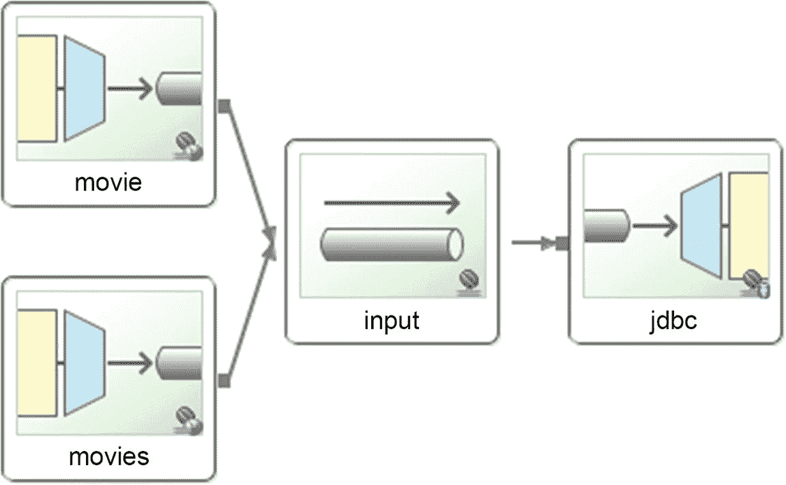

图 3-12。

积分图

图 [3-11](#Fig11) 与图 [3-12](#Fig12) 有何不同？您只需移除服务激活并插入 JDBC 组件。

在尝试运行 web 应用之前，必须确保声明了 SQL 驱动程序，因为其中一个依赖项是 H2。您可以添加一个不同的引擎，但是您需要确保您的数据库引擎已经启动并且正在运行。

因为您使用的是 H2，所以 Spring Boot 使用嵌入式数据库默认设置。它有一个内存数据库。如果您使用任何其他数据库引擎，请相应地修改`application.properties`中的属性。

您可以将清单 [3-17](#PC27) 添加到 application.properties 文件中，以查看数据是否被写入 H2 数据库引擎。

```java
# H2 Web Console
spring.h2.console.enabled=true

# External DataSource - MySQL
#spring.datasource.url=jdbc:mysql://localhost/testdb
#spring.datasource.username=scdf
#spring.datasource.password=scdf
#spring.datasource.driver-class-name=com.mysql.jdbc.Driver

Listing 3-17.src/main/resources/application.properties

```

清单 [3-17](#PC27) 显示了`application.properties`文件的内容。我注释了一些`DataSource`属性，这样您就可以看到您能够使用 MySQL 或任何其他 DB 引擎。添加`spring.datasource`属性会创建`dataSource` bean(您在`<int-jdbc:outbound-channel-adapter/>`标签的数据源中设置的值)。请记住添加正确的数据库访问凭据，如果使用不同的数据库引擎，请更改驱动程序类。现在，只使用 H2。

接下来，您需要创建一个模式来帮助 JDBC 适配器发送数据。Spring Boot 可以自动生成表和数据库，但是你需要使用不同的引擎，比如 Hibernate/JPA。这个例子使用了 JDBC 驱动程序(没有 JPA)，所以您需要提供一个包含表创建的`src/main/resources/schema.sql`文件(参见清单 [3-18](#PC28) )。

```java
create table IF NOT EXISTS movies(
    id int not null auto_increment,
    title varchar(250),
    actor varchar(100),
    year smallint,
primary key(id));

Listing 3-18.src/main/resources/schema.sql

```

清单 [3-18](#PC28) 是一个非常基本的表，其中声明了主要字段。

现在，您可以运行应用，并使用 cURL 函数，如下一个代码片段所示。

```java
$ curl -i -H "Content-Type:application/json" -X POST -d '{"title":"The Matrix","actor":"Keanu Reeves","year":1990}' http://localhost:8080/v2/movie

HTTP/1.1 202 Accepted
Server: Apache-Coyote/1.1
Content-Length: 0

```

打开浏览器，指向`http://localhost:8080/h2-console/`打开 H2 控制台(参见图 [3-13](#Fig13) )。

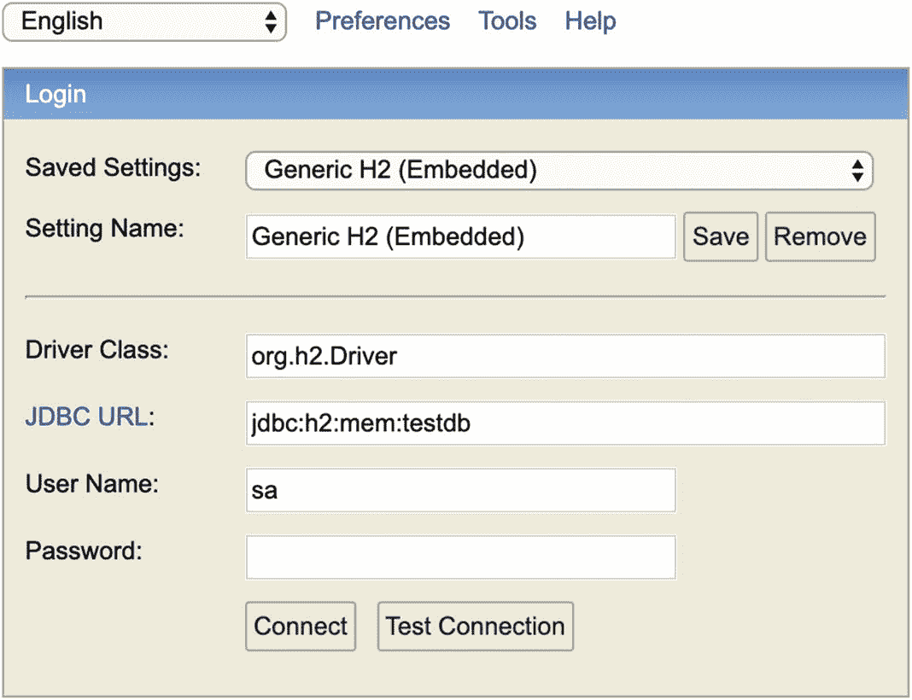

图 3-13。

http://localhost:8080/H2-控制台

您应该能够使用 URL `jdbc:h2:mem:testdb`、用户名`sa`和一个空密码进行连接。单击连接。图 [3-14](#Fig14) 显示了一个已定义的电影表，其中包括您发布的记录。

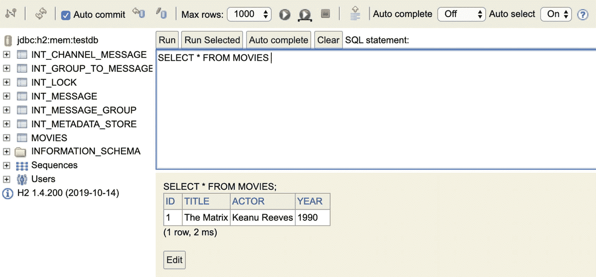

图 3-14。

H2 控制台

你注意到了吗,`curl`命令是使用`/v2/movie`路径执行的，并且只发布了一部电影。怎么能一个电话就把电影集贴出来插上呢？有许多方法可以实现这一点。例如，使用一个处理集合的服务激活器(就像你在清单 [3-14](#PC23) 中看到的)通过使用另一个连接到`<int-jdbc:outbout-channel-adapter/>`标签的直接通道发送每部电影。考虑一下，如果您需要停止插入，然后恢复或安排特定的日期和时间，会发生什么情况。使用 Spring Integration 有点复杂，对吗？好的方面是有办法做这种任务，但那是你的功课。别担心。给你个提示——春批！

下一个要求是一旦电影/电影存储发送电子邮件。让我们从`movie-webapp-integration.xml`的最终版本开始(见清单 [3-19](#PC30) )。

```java
<?xml version="1.0" encoding="UTF-8"?>
<beans xmlns:="http://www.springframework.org/schema/beans"
       xmlns:xsi="http://www.w3.org/2001/XMLSchema-instance" xmlns:int="http://www.springframework.org/schema/integration"
       xmlns:int-http="http://www.springframework.org/schema/integration/http"
       xmlns:int-mail="http://www.springframework.org/schema/integration/mail"
       xmlns:jdbc="http://www.springframework.org/schema/jdbc" xmlns:int-jdbc="http://www.springframework.org/schema/integration/jdbc"
       xsi:schemaLocation="http://www.springframework.org/schema/jdbc http://www.springframework.org/schema/jdbc/spring-jdbc.xsd

        http://www.springframework.org/schema/integration/jdbc http://www.springframework.org/schema/integration/jdbc/spring-integration-jdbc.xsd
        http://www.springframework.org/schema/beans http://www.springframework.org/schema/beans/spring-beans.xsd
        http://www.springframework.org/schema/integration/http http://www.springframework.org/schema/integration/http/spring-integration-http.xsd
        http://www.springframework.org/schema/integration/mail http://www.springframework.org/schema/integration/mail/spring-integration-mail.xsd
        http://www.springframework.org/schema/integration http://www.springframework.org/schema/integration/spring-integration.xsd">

    <!-- Spring Integration -->
    <!-- Spring Integration: Http -->
    <int-http:inbound-channel-adapter id="movie"
                                      supported-methods="POST" channel="publisher" path="/v2/movie"
                                      request-payload-type="com.apress.integration.movieweb.Movie"
                                      status-code-expression="T(org.springframework.http.HttpStatus).ACCEPTED"
    />

    <int-http:inbound-channel-adapter id="movies"
                                      supported-methods="POST" channel="publisher" path="/v2/movies"
                                      request-payload-type="com.apress.integration.movieweb.Movie[]"
                                      status-code-expression="T(org.springframework.http.HttpStatus).ACCEPTED"
    />

    <!-- Publish/Subscribe Channel -->

    <int:publish-subscribe-channel id="publisher" />

    <!-- Spring Integration: JDBC -->
    <int-jdbc:outbound-channel-adapter id="jdbc"
                                       query="insert into movies (title, actor, year) values ( :payload.title, :payload.actor, :payload.year)"
                                       data-source="dataSource" channel="publisher" order="1"  />

    <!-- Spring Integration: Mail -->
    <int-mail:outbound-channel-adapter channel="mail" mail-sender="mailSender" />
    <int:service-activator input-channel="publisher" output-channel="mail" ref="movieMailEndpoint" order="2" />
    <int:channel id="mail">
        <int:dispatcher task-executor="taskExecutor"/>
    </int:channel>

        <!-- More definitions in the next section ... -->

</beans>

Listing 3-19.src/main/resources/META-INF/spring/movie-webapp-integration.xml (version 3)

```

清单 [3-19](#PC30) 显示的是`movie-webapp-integration.xml`的最终版本。什么是新的？

*   使用发布-订阅模式创建一个频道。它按照指定的顺序将消息发送给所有订阅者(这是通过订阅者添加`order`属性来完成的)。

*   `<int-jdbc:outbound-channel-adapter/>`存储电影，现在是`publisher`频道的订户。让我们看看属性和它们的值。
    *   `channel="publisher"`是发布者频道的订阅者。

    *   `order="1"`先收到消息。

*   `<int:service-activator/>`是一个新的服务激活器，它创建了要交付给`mail`通道的`MailMessage`实例。以下是它的属性。
    *   `ref="movieMailEndpoint"`是 bean 引用类。

    *   `order="2"`表示服务激活器接收到存储后的消息。

    *   `output-channel="mail"`是发送`MailMessage`实例的通道的名称。

*   `<int-channel>`是接收`MailMessage`实例的新通道(执行者通道)。这个通道通过任务执行器执行，这意味着它可以是一个异步调用。以下是它的属性。
    *   `<int:dispatcher/>`声明使异步调用成为可能的类。

    *   `task-` executor `="taskExecutor"`是任务执行器类的 bean 实现的名称。

*   `<int-mail:outbound-channel-adapter/>`是一个新标签，它根据`mailSender`属性中给出的参数发送电子邮件(在`application.properties`文件中)。
    *   `mail-sender="mailSender"`是豆子的名字。Spring 容器基于查看`email.<props>`的`application.properties`文件生成这个 bean。

最终版本的 Spring Integration 图如图 [3-15](#Fig15) 所示。

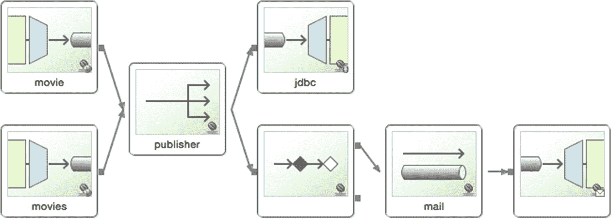

图 3-15。

Spring 积分图

清单 [3-19](#PC30) 显示了您对两个 beans 的依赖:`taskExecutor`和`emailSender`。将以下 bean 声明添加到`movie-webapp-integration.xml`(参见清单 [3-20](#PC31) )。

```java
    <!-- Mail Properties -->
    <bean id="mailSender" class="org.springframework.mail.javamail.JavaMailSenderImpl">
        <property name="host" value="${email.host}" />
        <property name="port" value="${email.port}" />
        <property name="username" value="${email.account.name}" />
        <property name="password" value="${email.account.password}" />
        <property name="javaMailProperties">
            <props>
                <prop key="mail.smtp.starttls.enable">true</prop>
                <prop key="mail.smtp.auth">true</prop>
            </props>
        </property>
    </bean>

    <!-- Helpers -->
    <bean id="taskExecutor" class="org.springframework.scheduling.concurrent.ThreadPoolTaskExecutor">
        <property name="corePoolSize" value="5" />
        <property name="maxPoolSize" value="10" />
        <property name="queueCapacity" value="25" />
    </bean>

    <!-- JSON Converter -->
    <bean id="jsonConverter"
          class="org.springframework.http.converter.json.MappingJackson2HttpMessageConverter">
        <property name="supportedMediaTypes" value="application/json" />
    </bean>

Listing 3-20.src/main/resources/META-INF/spring/movie-webapp-integration.xml (extra declaration dependencies)

```

清单 [3-20](#PC31) 显示了需要添加到*movie-web app-integration . XML*文件中的`mailSender` bean 定义和`taskExecutor`定义。`taskExecutor` bean 定义了`ThreadPoolTaskExecutor`类，作为发送电子邮件的异步处理程序，所以在服务器响应之前，您不需要这样做。

拥有连接到您选择的任何 SMTP 提供者的所有必要信息，并且它提供了一种将值公开为属性的方法。这些值在`src/main/resources/application.properties`文件中(见清单 [3-21](#PC32) )。

```java
# H2 Web Console
spring.h2.console.enabled=true

# External DataSource - MySQL

#spring.datasource.url=jdbc:mysql://localhost/springxd
#spring.datasource.username=springxd
#spring.datasource.password=springxd
#spring.datasource.driver-class-name=com.mysql.jdbc.Driver
#spring.datasource.initialize=true

email.account.name=myuser@mydomain.com
email.account.password=mypassword
email.host=smtp.gmail.com
email.port=587

Listing 3-21.src/main/resources/application.properties file (final version)

```

清单 [3-21](#PC32) 中显示的属性使用 Gmail SMTP 服务提供商。清单 [3-22](#PC33) ( `movie-webapp-integration.xml`)定义了服务激活器中`movieWebMailEndpoint`的引用。清单 [3-22](#PC33) 展示了这个类。

```java
package com.apress.integration.movieweb;

import org.slf4j.Logger;
import org.slf4j.LoggerFactory;
import org.springframework.integration.annotation.MessageEndpoint;
import org.springframework.integration.annotation.ServiceActivator;
import org.springframework.mail.MailMessage;
import org.springframework.mail.SimpleMailMessage;
import org.springframework.messaging.handler.annotation.Headers;

import java.util.Date;
import java.util.Map;

@MessageEndpoint
public class MovieMailEndpoint {

    private static final Logger log = LoggerFactory.getLogger(MovieMailEndpoint.class);

    @ServiceActivator
    public MailMessage process(Movie movie, @Headers Map<String,Object> headers) throws Exception {
        log.info("Movie: " + movie);

        SimpleMailMessage mailMessage = new SimpleMailMessage();
        mailMessage.setTo("myuser@mydomain.com");
        mailMessage.setSubject("A new Movie is in Town");
        mailMessage.setSentDate(new Date(0));
        mailMessage.setText(movie.toString());

        return mailMessage;
    }
}

Listing 3-22.com.apress.spring.integration.MovieWebMailEndpoint.java

```

清单 [3-22](#PC33) 显示了`Message`端点和服务激活器处理器。这个特殊的处理程序返回`<int-mail:outbound-channel-adapter/>`标签所需的`MailMessage`实例。这是您添加电子邮件的收件人、主题和文本的地方。处理程序正在使用`Movie`对象和`Message`实例上的头。

您可以运行最后一个测试来查看电影是否已存储，然后将邮件放入收件箱。确保设置了正确的属性，并且不会有任何问题。请记住，本章中的所有代码都可以从 Apress 网站下载。

现在是运行这两部分的时候了。您可以使用 Maven(在单独的窗口终端中)，或者您可以选择运行您最喜欢的 IDE 来查看完整的流程！

Note

如果您正在运行 STS 并且想要运行这两个项目，您需要在菜单中禁用 Live Bean 支持特性:运行➤运行配置，选择配置，并取消选中 Live Bean 支持特性。

恭喜你！您刚刚创建了一个集成两个系统的 Spring Integration 应用。最后你在里面没用多少代码。Spring Integration 完成了大部分繁重的工作。尽管这是一个简单的例子，但您知道如何集成 JMS、RabbitMQ 或 SOAP 等系统，或者如何集成脸书或 Twitter 等社交媒体平台。

## 摘要

本章向您介绍了 Spring Integration。您看到了 Spring Integration 组件以及它如何依赖于消息、通道和端点。您看到了一些集成模式，以及 Spring Integration 如何促进了它们的使用。

您已经通过一个例子了解了如何使用 Spring Integration。此外，您看到了用几乎零代码创建应用并将其与其他组件或本地/外部系统集成是多么容易。

为什么 Spring Integration 很重要？Spring CloudStream 基于 Spring Integration，这使得它非常可靠、可伸缩且易于扩展。如果你想了解更多关于 Spring Integration 的知识，Apress 有非常好的标题。