# 五、SpringCloud

几年来，*云*、*原生云*、*无服务器*和*容器*这几个词一直在 IT 行业制造噪音，涉及使用新的基础设施、范例和架构来管理存储、网络、内存、CPU、隔离、可扩展性和微服务等资源。什么是*微服务*？在我看来，它们是一种架构模式，将一个系统构建成一个具有某些特征的服务集合，例如松散耦合、独立部署、可伸缩、可测试、可维护、围绕业务能力组织*、*和*由一个小团队*拥有。

本章向您展示了微服务如何在这个新的云原生时代发挥重要作用，并讨论了 Spring Cloud 在新的架构模式中的作用。我将向您展示使用 Spring Cloud 子项目的一些好处，比如 Spring Config Server、Spring Cloud 网飞、Spring Cloud Gateway 和 Spring Cloud Stream。首先，我们来讨论一下什么是微服务，你在这种新架构下开发所面临的问题，以及 Spring Cloud 的项目如何解决这些问题。

## 微服务

微服务架构模式并不新鲜；在我看来，它是随着 Unix 操作系统的出现(大约在 1971 年)及其多任务和多用户能力而产生的。借助大型*软件工具*(使用管道(`|`)(一种允许信息传递到下一个可用程序或命令的简单符号)一起工作的小程序)，你可以创建更健壮的系统。

微服务在架构师、开发人员和运营团队中获得了很大的热情，但是我们为什么需要它们呢？我认为时间是这个谜题的重要组成部分。我们的应用需要快速、灵活、高度可用、可扩展并具有高性能，以适应这个新的云原生时代。

*   *速度*。你需要创新、实验和更快交付的能力。使用微服务和框架来帮助您实现更快的上市时间。

*   *安全*。通过监控、隔离、容错和自动恢复实践，以在整个开发周期中保持稳定性、可用性和持久性的方式更快地行动。开始考虑持续交付和集成。

*   *可扩展*。事实证明，垂直扩展(购买更多硬件)并不能很好地扩展。使用商用硬件，重用现有硬件并进行水平扩展，创建同一应用的多个实例。使用容器来帮助您扩展。

*   *机动性*。随时准备从任何位置支持多台设备。移动设备的数量正在增长，它们连接到互联网，不仅用于社交媒体、电子邮件和聊天，还用于监控房屋、引擎等。

让我们来谈谈云原生架构和微服务，以及创建一个可扩展、可维护、安全且健壮的小应用。它需要传递信息。它需要通信并调用一些外部服务。信息传递是关键！我在公司看到的大多数系统使用 RESTful APIs 与其他系统或程序通信，以创建装饰者、翻译者或门面。还有其他通信选项:HTTP、TCP (WebSocket、AMQP、MQTT)、反应流等等。正如你所看到的，有很多沟通的方式，但要创建微服务，应该有一个指南。谢天谢地，有 12 个因素的应用原则。尽管我在过去的章节中简单地讨论了它们，但是你有必要理解它们的含义以及如何应用它们。

## 十二因素应用

根据创建云原生架构的需要，Heroku(一家云 PaaS 公司)的工程师确定了许多模式，这些模式成为了十二要素应用指南。本指南通过关注声明性配置、无状态和独立于部署，解释了如何设计一个应用(一个单元);换句话说，您的应用需要快速、安全和可伸缩。

以下是十二要素应用指南的总结。

*   *代码库*。在 VCS 跟踪的一个代码库；许多部署。一个应用有一个单一的代码库，由版本控制系统如 Git、Subversion 或 Mercurial 跟踪。您可以在开发、测试、试运行和生产环境中进行许多部署(从相同的代码库)。

*   *依赖关系*。显式声明并隔离依赖关系。有时一个环境没有互联网连接(如果是私有系统)，所以你需要考虑打包你的依赖项(jar、gem、共享库等)。)，或者如果您有一个库的内部存储库，您可以声明像 POM、gemfiles 和 bundles 这样的清单。永远不要假设你在最终环境中拥有一切。

*   *配置*。在环境中存储配置。你不应该硬编码任何变化的东西。使用环境变量或配置服务器。

*   *后台服务*。将后台服务视为附属资源。通过 URL 或配置连接到服务。

*   *构建、发布、运行*。严格分离构建和运行阶段。这与 CI/CD(持续集成，持续交付)相关。

*   *流程*。将应用作为一个或多个无状态进程执行。进程不应该存储内部状态。不分享任何东西。任何必要的状态都应该被认为是*后台服务*。

*   *端口绑定*。通过端口进程绑定导出服务。自包含的应用通过端口绑定公开。一个应用可以成为另一个应用的服务。

*   *并发*。通过流程模型向外扩展。通过添加更多应用实例进行扩展。单个进程可以自由多线程化。

*   *一次性*。快速启动和平稳关闭，最大限度地提高稳定性。流程应该是可处理的(它们是无状态的)和容错的。

*   *环境平价*。让开发、试运行和生产环境尽可能相似。这是高质量的结果，并确保连续交货。

*   *日志*。将日志视为事件流。您的应用应该写入标准输出。日志是聚合的、按时间顺序排列的事件流。

*   *管理进程*。作为一次性流程运行管理任务。在平台上运行管理流程:数据库迁移、一次性脚本等等。

我的一些学生问我，你是否需要一个云基础设施来创建微服务。在我看来，你不需要有一个庞大的基础设施或云环境来创建微服务。如果你遵循十二因素原则，你就准备好参与游戏，与更大的公司竞争。当您准备迁移或切换到更好的基础架构时，您已经在那里了。

如果要打造微服务，遵循十二要素原则，一个小团队从零开始打造一切，太过分了。你必须面对几个变化。

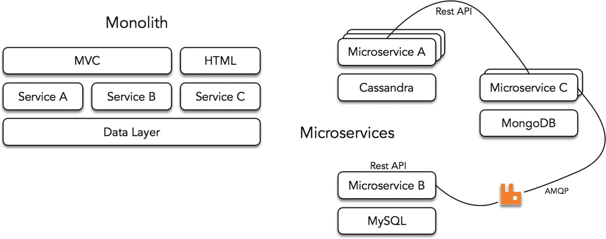

图 5-1。

整体服务与微服务

*   *文化*。你需要远离人员孤岛，创建跨职能团队；他们工作得更好，致力于解决一个业务领域。考虑连续交付，分散决策，寻找团队自治。

*   *组织*。创建跨职能的业务能力团队。这些团队拥有自主决策权。创建跨职能的平台团队运营。

*   *技术*。远离构建整体应用，采用微服务架构。在有限的环境中思考。遵循领域驱动设计的一些原则和实践。开始使用容器化来获得应用的隔离性、可伸缩性和高性能，并寻找服务集成来控制分布(见图 5-1 )。

一开始，在微服务架构中工作可能很有挑战性。并且，它提出了你需要控制的新问题。当其中一个微服务关闭时会发生什么？谁可以恢复服务？这意味着您需要具备弹性。另外，如果您有多个微服务实例在运行，谁来平衡它们呢？如果其中一个实例关闭了，如何发现新的服务或者让系统知道该实例关闭了或者现在正在运行？如果您有 SSL，保存证书或机密并在多个微服务间共享它们的最佳方法是什么？微服务架构还需要处理其他问题，并且应该能够轻松处理这些问题。

在接下来的部分中，我将讨论一些 Spring Cloud 子项目如何帮助应对这些新挑战。

## SpringCloud

Spring Cloud 是一套工具/框架，可以轻松、快速、安全地开发微服务架构。本节涵盖了最常见的 Spring 云服务:Spring Cloud Config、服务注册和断路器。

### Spring 云配置

Spring Cloud Config 为外部配置提供了服务器和客户端支持。这是一种集中式配置，可以在*分布式系统*中使用。配置服务器是一个外部化的应用配置服务，它提供了一个跨环境管理应用外部属性的中心位置(见图 5-2 )。

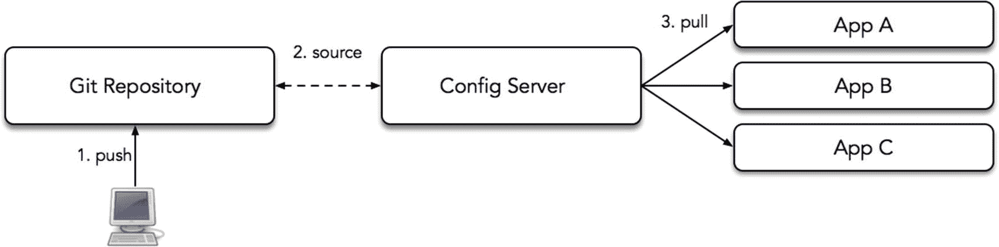

图 5-2。

配置服务器

您可以在开发、QA、生产或管道(继续交付)的任何阶段使用 Config Server，因为您可以集中管理每个环境来访问公共外部配置，而无需重新打包或重新部署。以下是 Spring Cloud Config Server 的一些特性。

*   加密和解密属性值(对称或非对称)

*   基于 HTTP API，允许名称-值对或 YAML 配置

*   一个可嵌入的服务器，很容易在带有`@EnableConfigServer`注释的 Spring Boot 应用中设置

*   连接到任何版本控制(例如 Git ),并允许您基于 Spring 概要文件、分支或标签来配置访问

#### Spring 云配置服务器

让我们创建一个 Spring Cloud Config Server，并了解配置它并让客户机可以访问它需要什么。打开浏览器，进入 [`https://start.spring.io`](https://start.spring.io) 的 Spring Initializr(见图 5-3 )。

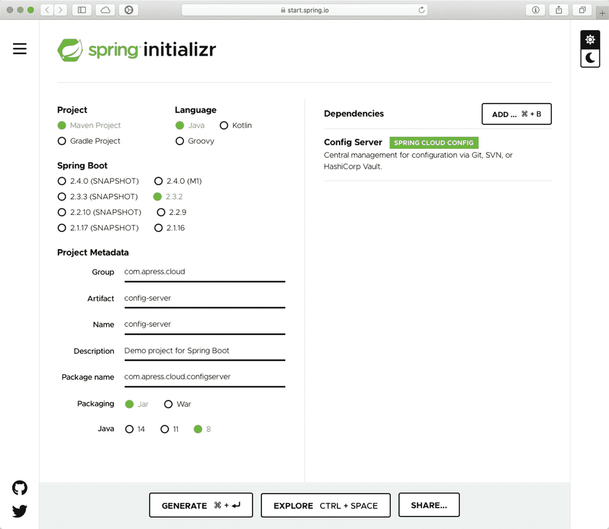

图 5-3。

[`https://start.spring.io`](https://start.spring.io) 报春初一

使用以下数据。

*   组:`com.apress.cloud`

*   神器:`config-server`

*   `Package: com.apress.cloud.configserver`

*   依赖关系:配置服务器

接下来，单击 Generate 按钮保存一个 ZIP 文件。将其解压缩，并在您喜欢的 IDE 中打开该项目。我们来复习一下。打开`pom.xml`文件。为了使用所有的 Spring Cloud 特性，有必要使用依赖管理来提供一个云应用中需要的所有 jar(参见清单 5-1 )。

```java
....
<properties>
        <java.version>1.8</java.version>
        <spring-cloud.version>Hoxton.SR6</spring-cloud.version>
</properties>

....
<dependencyManagement>
        <dependencies>
                <dependency>
                        <groupId>org.springframework.cloud</groupId>
                        <artifactId>spring-cloud-dependencies</artifactId>
                        <version>${spring-cloud.version}</version>
                        <type>pom</type>
                        <scope>import</scope>
                </dependency>
        </dependencies>
</dependencyManagement>
....

Listing 5-1.pom.xml Snippet

```

在撰写本书时，当前版本是 Hoxton.SR7。要保持更新，请访问主 web 项目 [`https://spring.io/projects/spring-cloud-config`](https://spring.io/projects/spring-cloud-config) 。

接下来，打开`ConfigServerApplication`类，用清单 5-2 中的内容完成代码。

```java
package com.apress.cloud.configserver;

import org.springframework.boot.SpringApplication;
import org.springframework.boot.autoconfigure.SpringBootApplication;
import org.springframework.cloud.config.server.EnableConfigServer;

@SpringBootApplication
@EnableConfigServer
public class ConfigServerApplication {

        public static void main(String[] args) {
                SpringApplication.run(ConfigServerApplication.class, args);
        }

}

Listing 5-2.src/main/java/com/apress/cloud/configserver/ConfigServerApplication.java

```

清单 5-2 显示了`ConfigServerApplication`类。尽管我总是建议将任何配置类作为一个单独的类，但这可能是个例外，因为您只需要使用`@EnableConfigServer`注释。这个注释启用了配置服务器，它从配置设置中获取任何新的更改，因此有必要告诉云配置服务器从哪里获取信息。

接下来，打开您的`application.properties`文件并添加以下内容(参见清单 5-3 )。

```java
# Default port
server.port=8888

# Spring Config Server
spring.cloud.config.server.git.uri=https://github.com/<github-username>/your-repo-app-config.git

Listing 5-3.src/main/resources/application.properties

```

清单 5-3 显示了`application.properties`，在这里您定义了配置服务器端口(通常，如果您没有指定一个特定的端口，8888 是默认的；同样，这是在客户端)和 GIT 存储库。确保在 GitHub 或任何其他 Git 服务器中创建一个 repo。

就是这样；你不需要做任何其他事情。一旦设置了 repo(现在可以为空)，就可以运行配置服务器了。您将在接下来的小节中设置 Git 服务器。

#### 云配置客户端

以下是 Spring Cloud Config 客户端的一些特性。

*   加密和解密属性值(对称和非对称)

*   使用云配置服务器用远程属性初始化 Spring 环境

*   提取任何新的更改，并将它们应用到 Spring 容器中，而无需重新启动应用。如果您需要更改日志、任何 ConfigProperties 或任何标有`@RefreshScope`注释的`@Bean`、`@Value`，您会受益。

让我们创建一个例子，您可以使用 Spring Cloud Config Server 和 Spring Cloud Config Client。让我们回顾一下我们在第三章中所做的，但是这一次，您将学习一种编程方法，而不是声明性的 XML。

##### 电影应用

让我们用*电影*和*电影网*微服务重新创建电影应用。这次您将使用 Spring Integration DSL。这两个应用都使用 Spring Cloud Config Server，这意味着您需要添加 Spring Cloud Config 客户端依赖项。

让我们从创建第一个电影项目开始。打开浏览器，进入 [`https://start.spring.io`](https://start.spring.io) 。使用以下信息。

*   组:`com.apress.cloud`

*   神器:`movie`

*   依赖项:配置客户端、Spring Integration、Spring Boot 执行器、Lombok

点击生成按钮创建一个 ZIP 文件。将其解压缩并导入到您喜欢的 IDE 中(参见图 5-4 )。

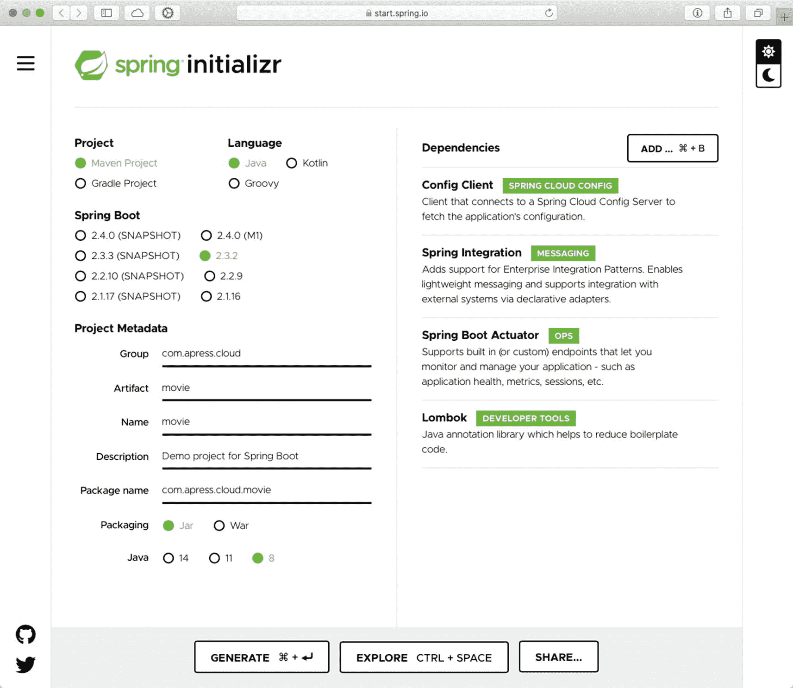

图 5-4。

spring 初始化电影微服务

Spring Boot 执行器和龙目岛是新的依赖。Spring Cloud Config Client 允许应用获取配置中的任何新更改，它可以重新创建 Spring bean(`@Value`、`@Bean`、`@ConfigurationProperties`、日志级别)，而无需重新启动。对于这种行为，您必须让应用知道它需要获取任何新的配置。要触发它，您需要 Spring Boot 执行器，因为它启用了 JMX Bean exporter `refresh`中的一个端点。

Lombok 从主代码中移除样板文件，比如构造函数或 setters 和 getters。如果你想了解更多关于龙目岛的信息，请前往 [`https://projectlombok.org`](https://projectlombok.org) 。

让我们从添加新的依赖项开始(参见清单 5-4 )。

```java
...
<dependency>
        <groupId>org.springframework.integration</groupId>
        <artifactId>spring-integration-file</artifactId>
</dependency>
<dependency>
        <groupId>org.springframework.integration</groupId>
        <artifactId>spring-integration-http</artifactId>
</dependency>
<dependency>
        <groupId>com.fasterxml.jackson.core</groupId>
        <artifactId>jackson-databind</artifactId>
</dependency>
...

Listing 5-4.pom.xml Snippet

```

清单 5-4 显示了其他一些依赖关系。您正在读取一个文件，然后通过 HTTP POST 将它发送到另一个服务。

让我们创建电影类(参见清单 5-5 )。

```java
package com.apress.cloud.movie;

import lombok.AllArgsConstructor;
import lombok.Data;

@AllArgsConstructor
@Data
public class Movie {
    private String title;
    private String actor;
    private int year;
}

Listing 5-5.src/main/java/com/apress/cloud/movie/Movie.java

```

清单 5-5 展示了没有设置器、获取器或构造器的新`Movie`类。Lombok 通过使用`@AllArgsConstructors`和`@Data`(创建 getters、setters、toString、hashCode)注释来提供这一点。

接下来，让我们创建`MovieProperties`类，它保存关于读取文件的路径、文件模式、防止重复、读取路径的固定延迟以及远程服务器的信息(参见清单 5-6 )。

```java
package com.apress.cloud.movie;

import lombok.Data;
import org.springframework.boot.context.properties.ConfigurationProperties;

@Data
@ConfigurationProperties(prefix = "movie")
public class MovieProperties {
    private String directory;
    private String filePattern;
    private Boolean preventDuplicates;
    private Long fixedDelay;

    private String remoteService = "http://localhost:8181/v1/movie";
}

Listing 5-6.src/main/java/com/apress/cloud/movie/MovieProperties.java

```

清单 5-6 展示了当应用启动时到达配置服务器的`MovieProperties`类。它有来自 Git 服务器的值。

接下来，让我们创建`MovieConverter`类，它包含电影文件的每一行。它需要读取一行并将其转换成一个`Movie`实例(参见清单 5-7 )。

```java
package com.apress.cloud.movie;

import lombok.extern.slf4j.Slf4j;
import org.springframework.core.convert.converter.Converter;
import org.springframework.stereotype.Component;

import java.util.List;
import java.util.stream.Collectors;
import java.util.stream.Stream;

@Slf4j
@Component
public class MovieConverter implements Converter<String,Movie> {

    @Override
    public Movie convert(String source) {
        log.debug(source);
        List<String> fields = Stream.of(source.split(",")).map(String::trim).collect(Collectors.toList());
        return new Movie(fields.get(0),fields.get(1),Integer.valueOf(fields.get(2)));
    }
}

Listing 5-7.src/main/java/com/apress/cloud/movie/MovieConverter.java

```

清单 5-7 显示了`MovieConverter`，它获取字符串(来自电影 CSV 文件的一行)，并返回一个`Movie`实例。另外，请注意，我们在该类中将日志记录级别设置为 DEBUG。

接下来，创建使用 Spring Integration DSL(特定于领域的语言)的`MovieIntegrationConfiguration`类，它公开了一个 fluent API 来配置所有的集成流。这与使用前几章的 XML 是一样的(参见清单 5-8 )。

```java
package com.apress.cloud.movie;

import lombok.AllArgsConstructor;
import org.springframework.boot.context.properties.EnableConfigurationProperties;
import org.springframework.context.annotation.Bean;
import org.springframework.context.annotation.Configuration;
import org.springframework.http.HttpMethod;
import org.springframework.integration.dsl.IntegrationFlow;
import org.springframework.integration.dsl.IntegrationFlows;
import org.springframework.integration.dsl.Pollers;
import org.springframework.integration.dsl.Transformers;
import org.springframework.integration.file.dsl.Files;
import org.springframework.integration.file.splitter.FileSplitter;
import org.springframework.integration.http.dsl.Http;

import java.io.File;
import java.net.URI;

@AllArgsConstructor
@EnableConfigurationProperties(MovieProperties.class)
@Configuration
public class MovieIntegrationConfiguration {

    private MovieProperties movieProperties;
    private MovieConverter movieConverter;

    @Bean
    public IntegrationFlow fileFlow() {
        return IntegrationFlows.from(Files
                        .inboundAdapter(new File(this.movieProperties.getDirectory()))
                        .preventDuplicates(true)
                        .patternFilter(this.movieProperties.getFilePattern()),
                e -> e.poller(Pollers.fixedDelay(this.movieProperties.getFixedDelay())))

                .split(Files.splitter().markers())
                .filter(p -> !(p instanceof FileSplitter.FileMarker))
                .transform(Transformers.converter(this.movieConverter))
                .transform(Transformers.toJson())
                .handle(Http
                        .outboundChannelAdapter(URI.create(this.movieProperties.getRemoteService()))
                        .httpMethod(HttpMethod.POST))
                .get();
    }

}

Listing 5-8.src/main/java/com/apress/cloud/movie/MovieIntegrationConfiguration.java

```

清单 5-8 显示了`MovieIntegrationConfiguration`类。我们来分析一下。

*   `IntegrationFlow`。这个类是`IntegrationFlowBuilder`类的一个工厂，它寻找关于通道、处理器、路由器、分离器和 DSL 中定义的任何其他集成模式的任何信息。因此，它创建了整个 Spring Integration 引擎。

*   `File.inboundAdapter`。通常，流总是从入站通道适配器开始。它可能是一个特定的频道。在本例中，我们使用入站文件在指定的目录中查找新文件。入站适配器的一个特性是轮询器，允许您寻找新的传入`MessageSource`消息。

*   `split`。该方法创建一个拆分器，将有效负载设置为`Iterable`、`Interator`、`Array`、`Stream,`或一个反应式`Publisher`，并接受拆分器的一个实现；在这种情况下，我们使用的是`Files.splitter.markers()`，它将文件内容分成几行，并标记文件的开始和结束。

*   `filter`。这个方法过滤我们发送的行。有一个过滤器很重要，因为文件内容的第一行和最后一行是一个标记(`START - END`)。

*   `transform`。我们使用两台变压器。第一个调用了`Transformers.converter`方法，在这里您传递了`movieConverter` bean。这个类具有获取文件行、获取逗号分隔值和创建一个`Movie`实例的逻辑。另一个转换器将`Movie`转换成 JSON 有效载荷。

*   `handle`。该处理程序是服务激活器模式端点。这里我们使用了一个`Http.outboundChannelAdapter`,它为外部服务准备一个请求，并以 JSON 格式发送带有正确头的`Movie`。

你可以说这个 Java DSL 类似于前面章节的声明式 XML，但是你应该选择哪一个呢？这取决于你需要什么，并为你的组织、项目或你自己增加价值。从现在开始，我们将只使用 Spring Integration DSL。

接下来，准备一些文本文件(你可以使用前面章节中的文件)并把它们放在一个已知的文件夹中。运行这个 app 时，可以将这些电影文本文件中的一部分复制到/ `tmp/movies`目录路径中；如果您的系统中没有该路径，您可以创建该文件夹。如果您使用的是 Windows 操作系统，请在`C:\tmp\movies`中创建它。

接下来，用`.yml`扩展名将`application.properties`重命名为`bootstrap`。按照惯例，您必须在您的客户机中使用一个`bootstrap.yml`文件，这一点很重要，因为您的主配置现在驻留在 Git 存储库或您用来集中配置的任何存储中。从现在开始，我们将使用 YAML 文件，它提供了一个简单的层次结构，易于阅读。但是要注意，对于任何新的属性，都需要至少两个空格的缩进。打开文件，添加清单 5-9 中的内容。

```java
spring:
  application:
    name: movies
  jmx:
    enabled: true
  cloud:
    config:
      uri:
        - http://localhost:8888

Listing 5-9.src/main/resources/bootstrap.yml

```

清单 5-9 显示了`bootstrap.yml`文件(显示了 Spring Cloud Config Server 正在运行的`spring.cloud.config.uri`属性)。默认情况下，如果没有指定，Spring Cloud Config Client 总是会查看该地址，所以如果您愿意，可以删除它。此外，`application.yml`正在公开`spring.application.name`属性，这在您有多个微服务来识别应用时非常有用。需要定位其他微服务，因此声明它很重要。另外，请注意，您正在通过`spring.jmx.enabled`属性启用 JMX，这将创建所有 JMX 端点。稍后您将使用刷新端点。

最后，让我们为这个电影微服务创建配置。接下来的步骤基于使用 GitHub ( [`https://github.com`](https://github.com) )，但是您可以使用任何其他 Git 服务器。我假设您对 Git 命令有所了解。使用 GitHub 的一个好处是，你可以动态地创建文件并立即提交。因此，请遵循以下步骤。

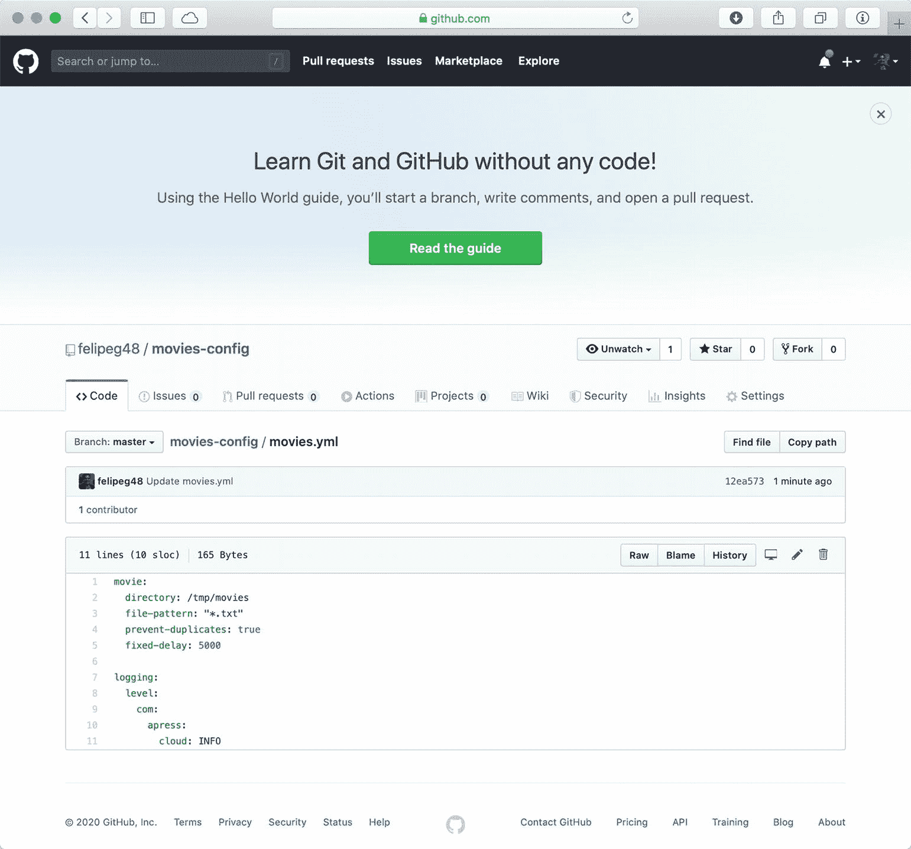

图 5-5。

[`https://github.com`](https://github.com)movies-config/movies . yml

1.  在 [`https://github.com`](https://github.com) 登录你的 GitHub 账号(如果你没有，可以创建一个；它对公共库/项目是免费的)。

2.  创建一个名为`movies-config`的新存储库。

3.  添加/提交包含以下内容的`movies.yml`文件。(在代码页签中有一个**创建新文件**按钮，可以方便地添加新文件。)(见图 5-5 。)

    ```java
    movie:
      directory: /tmp/movies
      file-pattern: "*.txt"
      prevent-duplicates: true
      fixed-delay: 5000
    logging:
      level:
        com:
          apress:
            cloud: INFO

    ```

这些属性在`MovieProperties`类中声明(参见清单 5-6 )。暂时不要运行电影微服务(注意，`movie.directory`属性指向“`/tmp/movies`”)。如果您使用的是 Windows 操作系统，请使用带有转义字符的值`like C:\\tmp\\movies`。`movie.file-pattern`指定查找任何以扩展名`.txt`结尾的文件。稍后您将运行这个微服务。

##### 电影网络应用

让我们来创建电影网络微服务。记住，这个微服务有一个 HTTP POST 端点，允许将 JSON 电影对象保存到数据库中。打开浏览器，在 [`https://start.spring.io`](https://start.spring.io) 进入 Spring 初始化。使用以下信息。

*   组:`com.apress.cloud`

*   神器:`movie-web`

*   包装:`com.apress.cloud.movieweb`

*   依赖项:配置客户端，Spring Integration，Spring Web，Spring Actuator，H2，MySQL，Lombok

点击生成按钮创建一个 ZIP 文件。然后解压缩并导入到你喜欢的 IDE 中(见图 5-6 )。

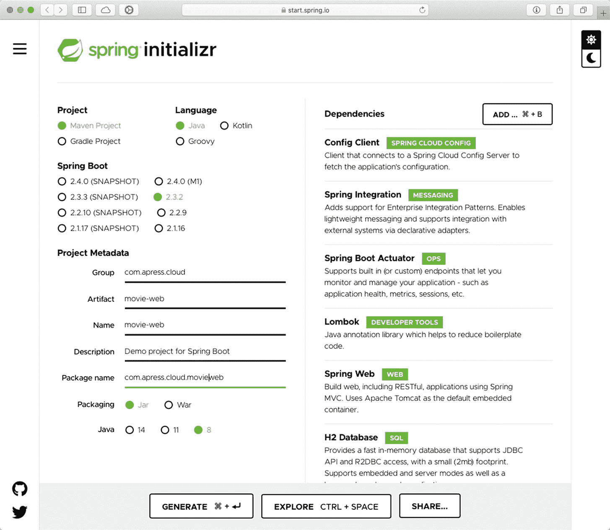

图 5-6。

Spring Initializr 电影-web 微服务

让我们添加新的依赖项(参见清单 5-10 )。

```java
...
<dependency>
        <groupId>org.springframework.integration</groupId>
        <artifactId>spring-integration-jdbc</artifactId>
</dependency>
<dependency>
        <groupId>org.springframework.integration</groupId>
        <artifactId>spring-integration-http</artifactId>
</dependency>
...

Listing 5-10.pom.xml Snippet

```

接下来，让我们创建`MovieWebProperties`类(参见清单 5-11 )。

```java
package com.apress.cloud.movieweb;

import lombok.Data;
import org.springframework.boot.context.properties.ConfigurationProperties;

@Data
@ConfigurationProperties(prefix = "movie-web")
public class MovieWebProperties {

    private String path;
}

Listing 5-11.src/main/java/com/apress/cloud/movieweb/MovieWebProperties.java

```

清单 5-11 显示了这个微服务拥有的唯一属性，为接收 HTTP POST 请求而创建的端点路径。

接下来可以创建`Movie`类，也是一样。唯一的区别是有一个新的 Lombok 注释(见清单 5-12 )。

```java
package com.apress.cloud.movieweb;

import lombok.AllArgsConstructor;
import lombok.Data;
import lombok.NoArgsConstructor;

@NoArgsConstructor
@AllArgsConstructor
@Data
public class Movie {
    private String title;
    private String actor;
    private int year;
}

Listing 5-12.src/main/java/com/apress/cloud/movieweb/Movie.java

```

列表 5-12 显示了`Movie`类，它使用`@NoArgsConstructor annotation`参数创建默认构造函数。

接下来，让我们创建`MovieWebIntegrationConfiguration`类，它包含了与使用 Java DSL 的 Spring Integration 流相关的所有内容(参见清单 5-13 )。

```java
package com.apress.cloud.movieweb;

import lombok.AllArgsConstructor;
import org.springframework.boot.context.properties.EnableConfigurationProperties;
import org.springframework.context.annotation.Bean;
import org.springframework.context.annotation.Configuration;
import org.springframework.http.HttpMethod;
import org.springframework.integration.annotation.ServiceActivator;
import org.springframework.integration.dsl.IntegrationFlow;
import org.springframework.integration.dsl.IntegrationFlows;
import org.springframework.integration.dsl.MessageChannels;
import org.springframework.integration.handler.LoggingHandler;
import org.springframework.integration.http.dsl.Http;
import org.springframework.integration.jdbc.JdbcMessageHandler;
import org.springframework.messaging.MessageHandler;

import javax.sql.DataSource;

@AllArgsConstructor
@EnableConfigurationProperties(MovieWebProperties.class)
@Configuration
public class MovieWebIntegrationConfiguration {

    private MovieWebProperties movieWebProperties;

   @Bean
    public IntegrationFlow httpFlow() {
        return IntegrationFlows.from(Http
                    .inboundChannelAdapter(movieWebProperties.getPath())
                    .requestPayloadType(Movie.class)
                    .requestMapping(m -> m.methods(HttpMethod.POST)))
                .channel(MessageChannels.publishSubscribe("publisher"))
                .get();
    }

    @Bean
    public IntegrationFlow logFlow() {
        return IntegrationFlows.from("publisher")
                .log(LoggingHandler.Level.INFO,"Movie", m -> m)
                .get();
    }

    @Bean
    @ServiceActivator(inputChannel = "publisher")
    public MessageHandler process(DataSource dataSource){
        JdbcMessageHandler jdbcMessageHandler = new JdbcMessageHandler(dataSource,
                "INSERT INTO movies (title,actor,year) VALUES (?, ?, ?)");
        jdbcMessageHandler.setPreparedStatementSetter((ps, message) -> {
            ps.setString(1,((Movie)message.getPayload()).getTitle());
            ps.setString(2,((Movie)message.getPayload()).getActor());
            ps.setInt(3,((Movie)message.getPayload()).getYear());
        });
        jdbcMessageHandler.setOrder(1);
        return jdbcMessageHandler;
    }
}

Listing 5-13.src/main/java/com/apress/cloud/movieweb/MoviewWebIntegrationConfiguration.java

```

清单 5-13 显示了`MovieWebIntegrationConfiguration`类。我们来分析一下。

*   `Http.inboudChannelAdapter`。记住，我们的流必须从一些入站适配器开始，在这种情况下，`Http.inboundChannelAdapter`创建一个接受任何请求的端点。它使用 HTTP POST 方法只接受 JSON 格式的`Movie`类型(默认)。

*   `channel`。收到请求后，它将`Movie`发送到发布/订阅通道。在这里，可以订阅任何其他集成流。

*   `log`。log 方法打印消息，但这应该是发送电子邮件的流。

*   `@ServiceActivator`。这是添加处理程序的另一种方式，一种用`@ServiceActivator`注释标记的方法。我们使用的是`JdbcMessageHandler`，它自动处理`Movie` /JSON 并将其插入数据库引擎——非常简单。它返回一个`MessageHandler`来关闭流程。

清单 5-13 与第三章中的声明性 XML 相同。唯一不同的是，你不是在发邮件；这里，您正在使用`log()`调用。

接下来，您需要创建初始化数据库的`schema.sql`文件(参见清单 5-14 )。

```java
create table IF NOT EXISTS movies(
    id int not null auto_increment,
    title varchar(250),
    actor varchar(100),
    year smallint,
primary key(id));

Listing 5-14.src/main/resources/schema.sql

```

正如你所看到的，清单 5-14 是前几章中的同一个文件。接下来，将应用的扩展名改为`bootstrap.yml`，并添加清单 5-15 中的内容。

```java
server:
  port: 8181
spring:
  application:
    name: movie-web

Listing 5-15.src/main/resources/bootstrap.yml

```

清单 5-15 显示了您正在使用的`bootstrap.yml`，仅仅是应用的名称和`server.port`。记住我们仍然可以使用`spring.cloud.config.uri,`,但是如果没有设置这个属性，它会默认连接。接下来，转到 GitHub(或者你的 Git 服务器)，添加包含以下内容的`movie-web.yml`文件(见图 5-7 )。

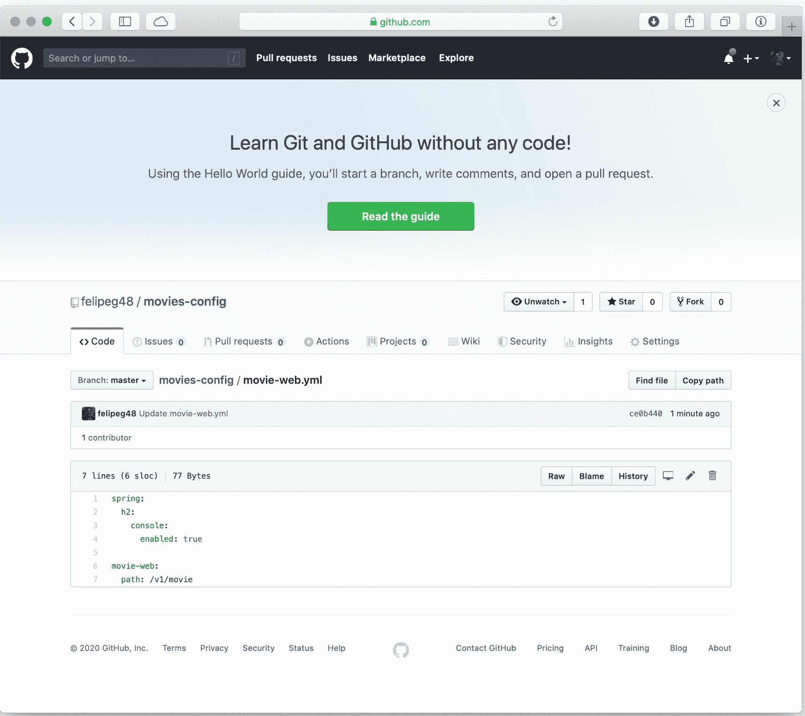

图 5-7。

[`https://github.com`](https://github.com) 电影-配置/电影-web.yml

```java
spring:
  h2:
    console:
      enabled: true
movie-web:
  path: /v1/movie

```

##### 运行配置服务器、电影和电影 Web 微服务

现在是时候运行这些应用了。让我们按这个顺序运行微服务:(1)配置服务器，(2)电影网络，和(3)电影。

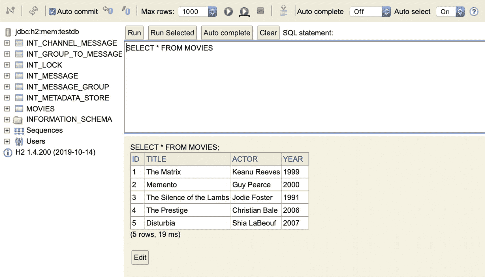

图 5-8。

`http://localhost:8181/h2-console` moview-web 微服务

1.  首先，运行 config-server 微服务。如果您使用的是 Linux，请打开一个终端并使用以下命令运行它。

    ```java
    $ ./mvnw clean spring-boot:run

    ```

    If you are using Windows, run it with the following.

    ```java
    > mvwn.bat clean spring-boot:run

    ```

    这是对运行在端口 8888 的 GitHub 帐户和存储库的`config-server`查找。

2.  接下来，运行电影-网络微服务。它基于在 GitHub 存储库中创建的`movie-web.yml`配置文件，在端口 8181 上运行。您可以使用相同的命令来运行 movie-web 微服务。这个微服务使用 8888 端口的 config-server，它根据 app 的名称拉取配置；因此，在这种情况下，它查找`movie-web.yml`,因为它与在`spring.application.name`属性中设置的应用同名。

    When running the movie-web app, look at the first logs printed. You see something like the following.

    ```java
    Fetching config from server at : http://localhost:8888
    Located environment: name=movie-web, profiles=[default], label=null, version=a55fa1d67ebcc6f4d509f71ba9619f4fc2a116c8, state=null

    ```

    这意味着它成功地连接到了 config-server 微服务，并从 GitHub 服务器加载了 movie-web 配置。它有一个`/v1/movie`端点，在端口 8181 中运行，并允许您在`/h2-console`端点中使用 H2 控制台。

3.  接下来，运行电影微服务。在运行它之前，请确保您已经准备好了电影文本文件。(如果您从 Apress 下载源代码，请注意，我将它们添加到了项目的根目录中，因此您可以轻松地重用它们)。

    运行时，它出现在连接到端口 8888 的配置服务器微服务的日志中。

4.  现在，是时候发送一些电影文件了。如果您使用的文件来自该书的源代码，请将`movies-batch1.txt`复制到`/tmp/movies`文件夹中。这会读取文件并将 JSON 发送到 movie-web 微服务。在 movie-web 微服务中，您可以在日志中看到电影被插入到 H2 数据库中。如果你查看`http://localhost:8181/h2-console`(电影网络微服务)，你应该看到电影已经被插入。JDBC 网址为`jdbc:h2:mem:testdb`(默认值)，用户名为`sa`，密码为空(见图 5-8 )。

恭喜，您刚刚运行了 config-server *、*，它根据您的应用名称查找配置，以及使用 config-server 获取配置的电影和电影网络微服务。

#### 更改日志记录级别

如果您关注电影《微服务》及其配置，您会看到在 GitHub 存储库中日志级别被设置为 INFO。如果你想改变登录级别会发生什么？通常，您会停止应用，将日志记录级别更改为 DEBUG，然后重新运行应用。嗯，Spring Cloud Config Client 允许你在不重启应用的情况下改变日志级别——所以不要停止电影微服务。让我们看看如何在不重启的情况下应用这些更改。

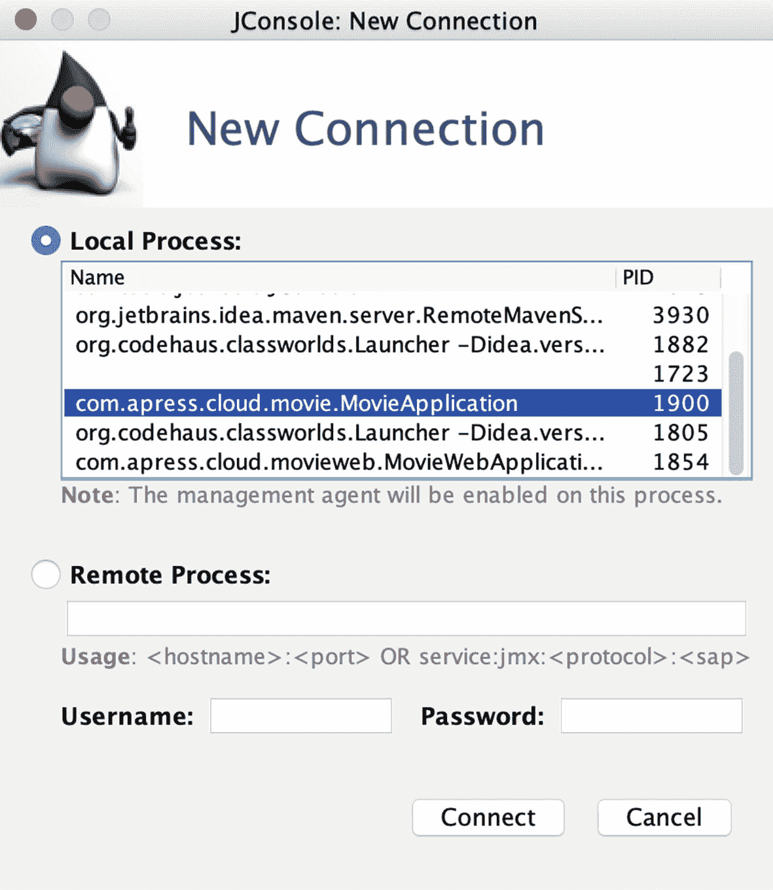

图 5-9。

jconsole . jconsole

1.  修改`movie.yml`文件(来自 GitHub ),并将日志级别从 INFO 改为 DEBUG。GitHub 有一个按钮(铅笔图标)，可以让你在线修改文件。或者，在您的计算机中克隆 repo，并使用 Git 命令来推动这一新的变化。

2.  提交更改后，打开终端并执行`jconsole`命令。这带来了允许您连接到 JMX 协议的 JConsole。从列表中选择`com.apress.cloud.movie.MovieApp`(见图 5-9 )。

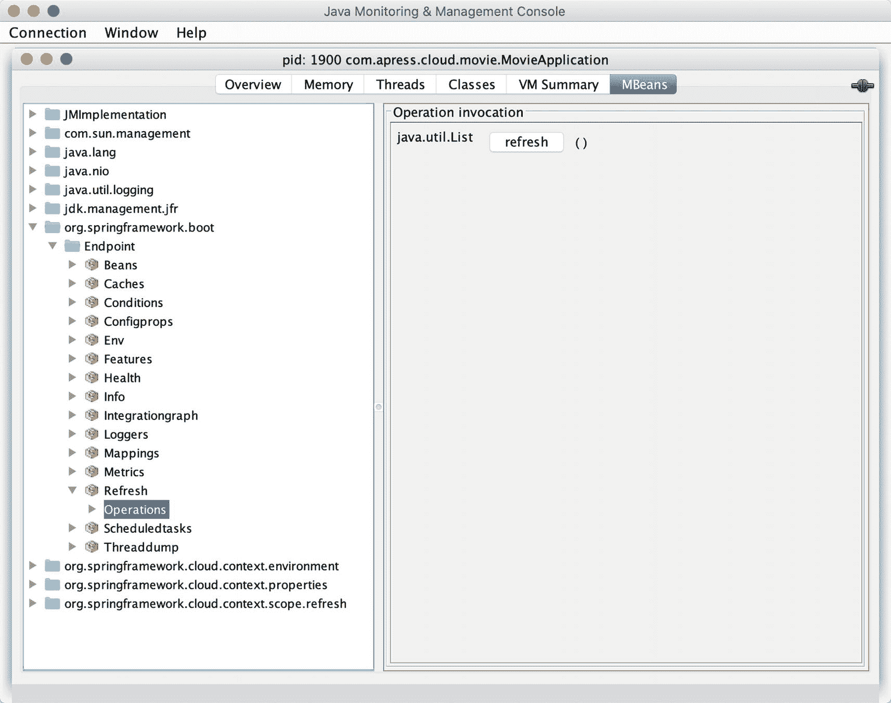

图 5-10。

mbean org . spring framework . boot➤端点➤刷新➤操作

1.  单击不安全连接按钮。接下来，单击 mbeans 选项卡并展开 org.springframework.boot ➤端点。选择操作/刷新图标(参见图 5-10 )。

1.  单击刷新按钮。看来`logging.level.com.apress.cloud`属性发生了变化。在电影微服务日志中，您可以看到关于刷新范围和 beans 的输出。这意味着日志记录级别也发生了变化。

2.  将另一个文件复制到`/tmp/movies`文件夹(例如`movies-batch2.txt`)。现在你看到了电影微服务日志中的调试。

恭喜你！您在没有重启应用的情况下更改了日志记录级别，但是还有更多。您可以更改记录和标记有`@ConfigurationProperties`的类别以及所有标记有`@RefreshScope`的`@Value`或`@Bean`。这告诉 Spring 容器需要在不重启应用的情况下重新创建这些 beans。

当然，这里我们使用了 JMX，但是它也允许您拥有一个 web 端点，因此您可以向`/actuator/refresh`端点发送 POST。要启用 web 端点，您需要三样东西:您的`pom.xml`文件中的 spring-web 和 spring-actuator 依赖项，以及用`management.endpoints.web.exposure.include=*`公开的端点。然后，使用以下命令进行任何更改。

```java
$ curl localhost:8181/actuator/refresh -XPOST -H "Content-Type: application/json"

```

如果 movie-web 微服务宕机会怎么样？一种解决方案是创建几个实例。如果一个坏了，我们就可以访问另一个。但是，要获得可用电影 web 实例的列表，您需要做些什么呢？如果其中一个改变了端口会怎么样？或者，如果有一个人倒下了会发生什么？你如何去下一个可用的？

这些都是新问题。您需要一些东西来记录可用的服务以及如何连接到它们。您需要一个允许您注册服务的解决方案。好消息是有一个解决方案——尤里卡服务注册中心。

## SpringCloud 网飞

SpringCloud 网飞是网飞 OSS ( [`https://netflix.github.io/`](https://netflix.github.io/) )在 Spring Boot apps 内的集成。它支持基于 Spring Framework 生态系统为开发人员提供的相同模式的自动配置和包装类。Spring Cloud 网飞具有创建分布式应用的注释功能。它提供了服务发现、断路器、路由和客户端负载平衡等模式实现。以下是它的一些特点。

*   *尤里卡服务器*是服务发现模式的实现。微服务实例可以注册并被其他微服务发现。Is 还提供了一种添加多个 Eureka 服务器的方法，这些服务器可以在它们之间注册以提供必要的冗余。它提供了支持嵌入式服务发现的`@EnableEurekaServer`。

*   *尤里卡客户端*提供了一个可发现的模式，用于注册尤里卡服务器并提供有用的信息，比如 URL 和端口。它提供了注册微服务的`@EnableDiscoveryClient`注释。

*   *断路器*是一种为您的应用提供容错场景的模式。它提供了`@EnableCircuitBreaker`和`@HistirixCommand`注释，它们是简单的装饰器，具有创建容错微服务的功能。

*   *Eureka Ribbon* 是客户端负载平衡模式的实现。它提供了通常放在`RestTemplate`实例中的`@LoadBalanced`注释；这为在 Eureka Server 中注册的多个微服务创建了所需的客户端负载平衡。

*   网飞·祖尔是创建代理的路由和过滤模式的实现。

*   *外部配置*提供了一种直接与网飞 Archaius 通信的方式，以提供类似于 Spring Cloud Config Server 的 Spring 环境。

### 服务发现:Eureka 服务注册

Eureka service registry 提供了服务发现模式的实现，这是最重要的微服务架构特性之一(参见图 5-11 )。

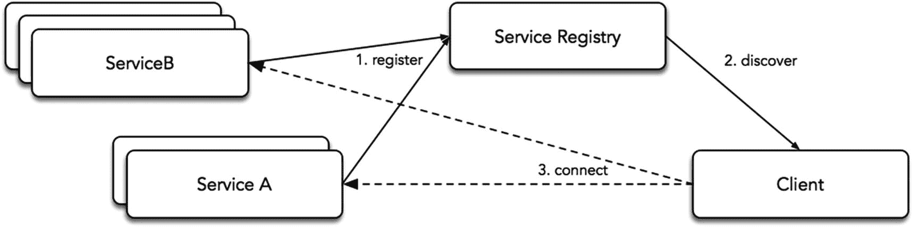

图 5-11。

服务注册中心

当客户机向服务注册中心注册时，它提供关于其主机和端口的元数据；它还向服务注册中心发送心跳。从服务器到客户端，一切都在内存(元数据)中。

#### 尤里卡服务器

让我们创建尤里卡服务器微服务。进入你的浏览器，打开 [`https://start.spring.io`](https://start.spring.io) 。使用以下信息。

*   组:`com.apress.cloud`

*   神器:`eureka-server`

*   `Package: com.apress.cloud.eurekaserver`

*   依赖关系:尤里卡服务器

按“生成”按钮创建并下载一个 ZIP 文件。您可以将其解压缩并导入到您喜欢的 IDE 中(参见图 5-12 )。

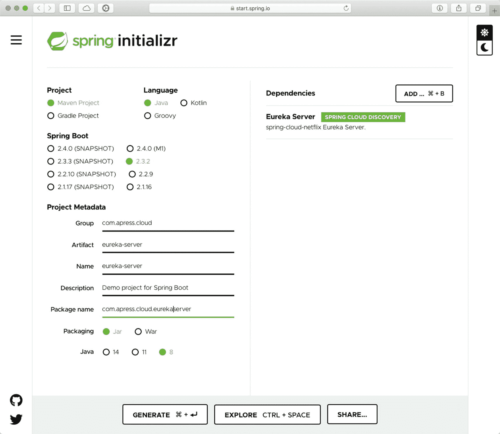

图 5-12。

[`https://start.spring.io`](https://start.spring.io) 尤里卡-服务器

查看`pom.xml`文件。您只有一个依赖项，足以创建一个服务注册解决方案。接下来打开主类，`EurekaServerApplication.java`。添加`@EnableEurekaServer`注释(见清单 5-16 )。

```java
package com.apress.cloud.eurekaserver;

import org.springframework.boot.SpringApplication;
import org.springframework.boot.autoconfigure.SpringBootApplication;
import org.springframework.cloud.netflix.eureka.server.EnableEurekaServer;

@EnableEurekaServer
@SpringBootApplication
public class EurekaServerApplication {

        public static void main(String[] args) {
                SpringApplication.run(EurekaServerApplication.class, args);
        }

}

Listing 5-16.src/main/java/com/apress/cloud/eurekaserver/EurekaServerApplication.java

```

清单 5-16 显示了主类。您唯一需要让 service registry 应用做的事情就是使用@EnableEurekaServer 注释，并且您需要使用`application.properties`文件来配置它。

接下来，将`application.properties`扩展名改为`.yml`并打开。添加清单 5-17 中的内容。

```java
server:
  port: 8761

eureka:
  instance:
    hostname: localhost
  client:
    registerWithEureka: false
    fetchRegistry: false
    serviceUrl:
      defaultZone: http://${eureka.instance.hostname}:${server.port}/eureka/

Listing 5-17.src/main/resources/application.yml

```

现在，您已经准备好运行它了。您可以使用以下命令。

```java
$ ./mvnw clean spring-boot:run

```

打开一个新的浏览器选项卡并转到`http://localhost:8761`(参见图 5-13 )。

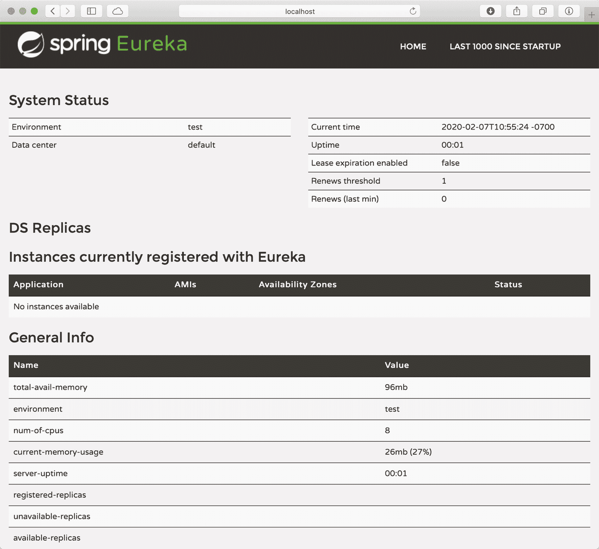

图 5-13。

Eureka 服务器位于 http://localhost:8761

#### 尤里卡客户

既然您已经启动并运行了服务注册中心(Eureka Server ),那么是时候注册它了。首先，添加一个可被发现的依赖项。先说*影网*微服务。

##### 服务可发现:电影 Web 微服务

在你喜欢的 IDE 中打开你的 movie-web 微服务，打开`pom.xml`。添加以下依赖项。

```java
<dependency>
        <groupId>org.springframework.cloud</groupId>
        <artifactId>spring-cloud-starter-netflix-eureka-client</artifactId>
</dependency>

```

接下来，打开`application.yml`，将其重命名为`bootstrap.yml`，并添加以下属性。

```java
eureka:
  client:
    service-url:
      default-zone: http://localhost:8761/eureka/

```

您可以将它们添加到 GitHub(或任何使用 Spring Cloud Config Server 的 Git 服务器)。您可以在 Git 存储库中修改`movie-web.yml`并添加属性。前面的代码告诉 Eureka 客户机在哪里可以找到 Eureka 服务器。

您可以使用以下命令运行 movie-web 微服务。

```java
$ ./mvnw spring-boot:run

```

在终端中，您应该看到类似于以下输出的日志。

```java
com.netflix.discovery.DiscoveryClient    : DiscoveryClient_MOVIE-WEB/10.0.0.2:movie-web:8181 - registration status: 204

```

接下来，您可以在浏览器中刷新 Eureka 服务器。然后，您应该会看到列出了 movie-web 微服务(见图 5-14 )。

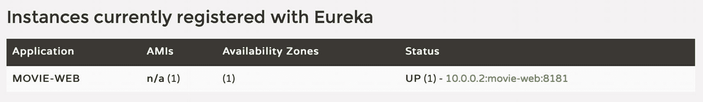

图 5-14。

尤里卡服务器注册的应用

在这种情况下，您希望拥有多个 movie-web 微服务实例。打开一个新的终端窗口，并执行以下命令。

```java
$ ./mvnw spring-boot:run -Dspring-boot.run.jvmArguments="-Dserver.port=8282"

```

前面的命令运行另一个实例，但使用端口 8282。现在，如果您再次刷新 Eureka Server，您会看到两个实例启动并运行，并带有它们的端口(参见图 5-15 )。

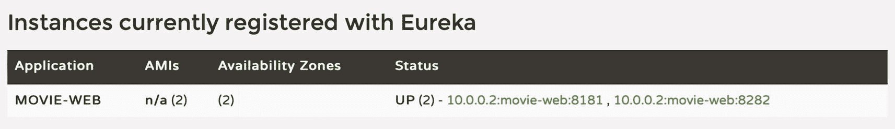

图 5-15

尤里卡服务器注册的应用

如您所见，这对客户来说很容易。您只需要添加 eureka-client 依赖项并指向 Eureka Server。Spring Boot 为您运行所有的自动配置，并在注册服务器中注册。

##### 发现服务:电影微服务

既然我们已经将 movie-web 微服务设置为可被发现，现在是 movie 微服务使用服务实例的时候了。所以，我们来修改一下电影微服务项目。在您最喜欢的 IDE 中打开项目，让我们进行修改。打开`pom.xml`文件并添加以下依赖项。

```java
<dependency>
        <groupId>org.springframework.cloud</groupId>
        <artifactId>spring-cloud-starter-netflix-eureka-client</artifactId>
</dependency>

```

如您所见，这与您添加到 movie-web 微服务的依赖项相同。您需要连接到 Eureka 而无需注册，因为您只需要知道其他实例。所以，我们来修改一下`bootstrap.yml`文件。添加以下属性。

```java
eureka:
  client:
    register-with-eureka: false
    service-url:
      default-zone: http://localhost:8761/eureka/

```

`register-with-eureka`属性是您唯一需要的。您可以省略`service-url`,因为它默认连接到那个 URL，除非您在一个远程服务器和不同的端口上有 Eureka 服务器。

接下来，我们来开`MovieIntegrationConfiguration`课。如果您用清单 5-18 中的内容修改它，这就是版本 2。

```java
package com.apress.cloud.movie;

import com.netflix.appinfo.InstanceInfo;
import com.netflix.discovery.EurekaClient;
import lombok.AllArgsConstructor;
import org.springframework.boot.context.properties.EnableConfigurationProperties;
import org.springframework.context.annotation.Bean;
import org.springframework.context.annotation.Configuration;
import org.springframework.integration.dsl.IntegrationFlow;
import org.springframework.integration.dsl.IntegrationFlows;
import org.springframework.integration.dsl.Pollers;
import org.springframework.integration.dsl.Transformers;
import org.springframework.integration.file.dsl.Files;
import org.springframework.integration.file.splitter.FileSplitter;
import org.springframework.web.client.RestTemplate;

import java.io.File;

// Version 2 - Eureka Client
@AllArgsConstructor
@EnableConfigurationProperties(MovieProperties.class)
@Configuration
public class MovieIntegrationConfiguration {

    private MovieProperties movieProperties;
    private MovieConverter movieConverter;

    @Bean
    public IntegrationFlow fileFlow() {
        return IntegrationFlows.from(Files
                        .inboundAdapter(new File(this.movieProperties.getDirectory()))
                        .preventDuplicates(true)
                        .patternFilter(this.movieProperties.getFilePattern()),
                e -> e.poller(Pollers.fixedDelay(this.movieProperties.getFixedDelay())))
                .split(Files.splitter().markers())
                .filter(p -> !(p instanceof FileSplitter.FileMarker))
                .transform(Transformers.converter(this.movieConverter))
                .handle("movieHandler", "process")
                .get();
    }

    @Bean
    public RestTemplate restTemplate(){
        return new RestTemplate();
    }

    @Bean
    public MovieHandler movieHandler(EurekaClient discoveryClient){
        InstanceInfo instance = discoveryClient.getNextServerFromEureka("MOVIE-WEB", false);
        return new MovieHandler(restTemplate(),instance.getHomePageUrl() + "v1/movie");
    }

}

Listing 5-18.src/main/java/com/apress/cloud/movie/MovieIntegrationConfiguration.java Version 2

```

清单 5-18 显示了`MovieIntegrationConfiguration`类的版本 2。分析它以比较与清单 5-8 的差异。我们来复习一下。

*   `handle`。该方法调用正在声明的`MovieHandler` bean。如果您查看该类，您会看到方法进程作为第二个参数被传递。

*   `RestTemplate`。这个实例对于连接到微服务很有用。

*   `MovieHandler`。这个 bean 使用`EurekaClient`实例来获取下一个可用的实例地址，以便`restTemplate`可以发出请求。

接下来，让我们创建`MovieHandler`类(参见清单 5-19 )。

```java
package com.apress.cloud.movie;

import lombok.AllArgsConstructor;
import lombok.extern.slf4j.Slf4j;
import org.springframework.http.HttpStatus;
import org.springframework.http.ResponseEntity;
import org.springframework.web.client.RestTemplate;

@Slf4j
@AllArgsConstructor
public class MovieHandler {

    private RestTemplate restTemplate;
    private String serviceUrl;

    public void process(Movie movie){
        log.debug("Processing: {}", movie);
        log.debug("ServiceURL: {}", serviceUrl);

        ResponseEntity<Object> response = this.restTemplate.postForEntity(serviceUrl,movie,Object.class);
        if(response.getStatusCode().equals(HttpStatus.OK))
            log.debug("processed");
        else
            log.warn("Take a look of the logs...");
    }
}

Listing 5-19.src/main/java/com/apress/cloud/movie/MovieHandler.java

```

清单 5-19 显示了`MovieHandler`类，它使用`RestTemplate`并将`Movie`作为 JSON 对象从 Eureka 服务器发送到服务 URL。

现在，调用`getNextServerFromEureka`并不理想，因为您需要再次调用它来获得另一个可用的实例。还能更简单吗？

#### Ribbon:客户端负载均衡电影微服务

为了避免直接使用 Eureka Client，Spring Cloud 团队将网飞丝带项目带到了下一个层次。网飞 Ribbon 项目是一个 IPC(进程间通信)库，为他们的服务创建，允许他们使用许多功能进行客户端负载平衡，这些功能可能是硬件负载平衡器难以实现的。

Ribbon 提供*服务发现集成*，意味着如果你想获得所有可用的服务，你需要有 Eureka 服务器；否则，您需要创建一个服务器列表。Ribbon 是*容错*，这意味着它知道服务器何时启动并运行，并且它可以检测哪些服务器关闭。Ribbon 提供了可以扩展的*负载平衡*规则。默认情况下，它提供了一个循环规则、一个可用性过滤规则和一个加权响应时间规则。

要使用 Ribbon，您必须添加`spring-cloud-starter-netflix-ribbon`依赖项，但是因为您已经添加了`spring-cloud-starter-netflix-eureka-client`依赖项，所以这不是必需的。此外，Spring Cloud 团队提供了一个`@LoadBalanced`注释，该注释收集服务器列表并应用(除非配置)循环规则。

让我们修改一下`MovieIntegrationConfiguration`类。这是版本 3(见清单 5-20 )。

```java
package com.apress.cloud.movie;

import lombok.AllArgsConstructor;
import org.springframework.boot.context.properties.EnableConfigurationProperties;
import org.springframework.cloud.client.loadbalancer.LoadBalanced;
import org.springframework.context.annotation.Bean;
import org.springframework.context.annotation.Configuration;
import org.springframework.integration.dsl.IntegrationFlow;
import org.springframework.integration.dsl.IntegrationFlows;
import org.springframework.integration.dsl.Pollers;
import org.springframework.integration.dsl.Transformers;
import org.springframework.integration.file.dsl.Files;
import org.springframework.integration.file.splitter.FileSplitter;
import org.springframework.web.client.RestTemplate;

import java.io.File;

// Version 3 - With Load Balancer - Ribbon

@AllArgsConstructor
@EnableConfigurationProperties(MovieProperties.class)
@Configuration
public class MovieIntegrationConfiguration {

    private MovieProperties movieProperties;
    private MovieConverter movieConverter;

    @Bean
    public IntegrationFlow fileFlow() {
        return IntegrationFlows.from(Files
                        .inboundAdapter(new File(this.movieProperties.getDirectory()))
                        .preventDuplicates(true)
                        .patternFilter(this.movieProperties.getFilePattern()),
                e -> e.poller(Pollers.fixedDelay(this.movieProperties.getFixedDelay())))
                .split(Files.splitter().markers())
                .filter(p -> !(p instanceof FileSplitter.FileMarker))
                .transform(Transformers.converter(this.movieConverter))
                .handle("movieHandler", "process")
                .get();
    }

    @LoadBalanced
    @Bean
    public RestTemplate restTemplate(){
        return new RestTemplate();
    }

    @Bean
    public MovieHandler movieHandler(){
        return new MovieHandler(restTemplate());
    }
}

Listing 5-20.src/main/java/com/apress/cloud/movie/MovieIntegrationConfiguration.java - version 3

```

清单 5-20 显示了`MovieIntegrationConfiguration`类的版本 3。主要的变化是现在`@LoadBalanced`注释在`RestTemplate`实例中，而`MovieHandler`只需要`RestTemplate`。

接下来，让我们修改`MovieHandler`(版本 2)类(参见清单 5-21 )。

```java
package com.apress.cloud.movie;

import lombok.AllArgsConstructor;
import lombok.extern.slf4j.Slf4j;
import org.springframework.http.HttpStatus;
import org.springframework.http.ResponseEntity;
import org.springframework.web.client.RestTemplate;

// Version 2 - Withe Ribbon

@Slf4j
@AllArgsConstructor
public class MovieHandler {

    private RestTemplate restTemplate;

    public void process(Movie movie){
        log.debug("Processing: {}", movie);
        ResponseEntity<Object> response = this.restTemplate.postForEntity("http://movie-web/v1/movie",movie,Object.class);
        if(response.getStatusCode().equals(HttpStatus.OK))
            log.debug("processed");
        else
            log.warn("Take a look of the logs...");
    }
}

Listing 5-21.src/main/java/com/apress/cloud/movie/MovieHandler.java (Version 2)

```

清单 5-21 显示了`MovieHandler`类的版本 2。唯一的区别是它现在只使用了`RestTemplate`，尽管它使用的是硬编码的 URL(这可以在 Config Server/Git Server 中设置)，但它对我们的例子很有用。这解释了很多，但是让我们玩所有的服务。

##### 一起跑步

让我们得到所有的服务。您有需要启动和运行的配置服务器、eureka 服务器、movie-web(两个实例)和电影微服务。您需要打开几个终端，或者如果您使用任何智能 IDE，您可以一起运行它们。

1.  启动配置服务器和 eureka 服务器微服务。您可以在单独的终端窗口中使用以下命令运行它们。

    ```java
    ./mvnw clean spring-boot:run

    ```

2.  启动电影网络微服务实例。运行您添加了网飞尤里卡客户端作为依赖项的版本。您可以使用下面的代码运行第一个实例。

    ```java
    ./mvnw spring-boot:run -Dspring-boot.run.jvmArguments="-Dserver.port=8181"

    ```

    Run the second one with the following in a different terminal window.

    ```java
    ./mvnw spring-boot:run -Dspring-boot.run.jvmArguments="-Dserver.port=8282"

    ```

    等到这两个实例出现在 Eureka 服务器中。在您的浏览器中，转到`http://localhost:8761`(见图 5-15 以确保它们已注册)。

3.  开始电影微服务。使用版本 3 的`MovieIntegrationConfiguration`级(见清单 5-20 )和版本 2 的`MovieHandler`(见清单 5-21 )。

    ```java
    ./mvnw clean spring-boot:run

    ```

4.  您可以将任何电影文本文件(来自源代码)添加到`/tmp/movies`目录中。您应该看到 movie-web 实例 1 接收了一些电影，实例 2 接收了其他电影。

恭喜你！您已经运行了几个具有云原生环境需求的微服务，包括独立部署、多实例、服务注册、服务发现和集中配置。

您是否意识到每个电影 web 实例都有自己的电影数据库？这里您需要添加一个集中式数据库，所以将所有内容保存在一个持久性存储中。

如果所有的电影网络实例都关闭或响应时间过长，会发生什么？你应该记住容错。

### 断路器

这是断路器模式的一种实现，可防止级联故障并提供回退行为，直到故障服务处于正常状态(见图 5-16 )。

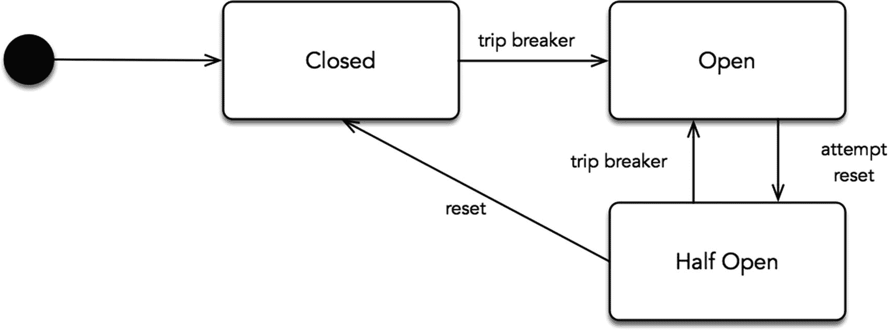

图 5-16。

断路器

当您将断路器应用于服务时，它会监控失败的呼叫。如果这些故障达到一定的阈值(这可以通过编程来设置)，断路器将打开并将呼叫重定向到指定的回退操作。这为故障服务提供了恢复时间。这种模式实现基于网飞的 Hystrix，Spring Cloud 团队通过注释实现了这一点。

#### Hystrix:电影微服务

如果想在电影《微服务》中有容错，就要在`pom.xml`文件中加入正确的依赖关系。

```java
<dependency>
        <groupId>org.springframework.cloud</groupId>
        <artifactId>spring-cloud-starter-netflix-hystrix</artifactId>
</dependency>

```

接下来，您需要将`@EnableCircuitBreaker`添加到`MovieIntegrationConfiguration`类中(参见下面的代码片段)。

```java
@EnableCircuitBreaker
@AllArgsConstructor
@EnableConfigurationProperties(MovieProperties.class)
@Configuration
public class MovieIntegrationConfiguration {

    private MovieProperties movieProperties;
    private MovieConverter movieConverter;

    @Bean
    public IntegrationFlow fileFlow() {

        //....

```

还有另一个版本的`MovieHandler`类(版本 3)(参见清单 5-22 )。

```java
package com.apress.cloud.movie;

import com.netflix.hystrix.contrib.javanica.annotation.HystrixCommand;
import lombok.AllArgsConstructor;
import lombok.extern.slf4j.Slf4j;
import org.springframework.http.HttpStatus;
import org.springframework.http.ResponseEntity;
import org.springframework.web.client.RestTemplate;

// Version 3 - With Circuit Breakers

@Slf4j
@AllArgsConstructor
public class MovieHandler {

    private RestTemplate restTemplate;

    public void process(Movie movie){
        log.debug("Processing: {}", movie);
        if(postMovie(movie))
            log.info("PROCESSED!");
    }

    @HystrixCommand(fallbackMethod = "defaultProcess")
    public boolean postMovie(Movie movie){
        ResponseEntity<Object> response = this.restTemplate.postForEntity("http://movie-web/v1/movie",movie,Object.class);
        if(response.getStatusCode().equals(HttpStatus.OK))
            return true;
        return false;
    }

    public boolean defaultProcess(Movie movie){
        log.error("COULD NOT process: {}, please try later.", movie);
        return false;
    }
}

Listing 5-22.src/main/java/com/apress/cloud/movie/MovieHandler.java Version 3

```

清单 5-22 显示了第 3 版的`MovieHandler`类(注意，我们使用了`@HystrixCommand`注释，并使用了`defaultProcess`方法作为万一出现错误时的后备方法)。如果您尝试使用的服务不可用，它将使用`defaultProcess`方法，直到服务重新启动并运行。在幕后，`@HystrixCommand`注释是一个拦截器，它有一个 try/catch 实现，并创建监控线程来保持对服务的 ping，因此它知道什么时候它再次可用。此外，它还创建了一个度量流，可以用图表来显示行为。要使用这些实时指标，您需要向电影微服务中的`bootstrap.xml`添加以下属性。

```java
management:
  endpoints:
    web:
      exposure:
        include:
          - hystrix.stream
          - health

```

这暴露了`/actuator/hystrix.stream`，它可以基于数据呈现一个图形。在你用这些改变运行电影微服务之前，你需要添加`spring-boot-starter-web`，因为需要一个启动器的配置中缺少了一些东西。因此，将`spring-boot-starter-web`依赖项添加到您的`pom.xml`文件中。如果您想知道是否有一个构建 UI 来查看这些指标——有。它叫做 Hystrix 仪表板。

Hystrix Dashboard 监控并提供大量关于您的服务的指标。您可以创建另一个微服务(在 [`https://start.spring.io`](https://start.spring.io) )，只添加`spring-boot-actuator`和`spring-cloud-starter-hystrix-dashboard`依赖项，并使用`@EnableHystrixDashboard`注释来启用它。运行它，然后访问`/hystrix`。将仪表板指向 Hystrix 客户端应用中的单个实例的`/actuator/hystrix.stream`端点(参见图 5-17 和 5-18 )。

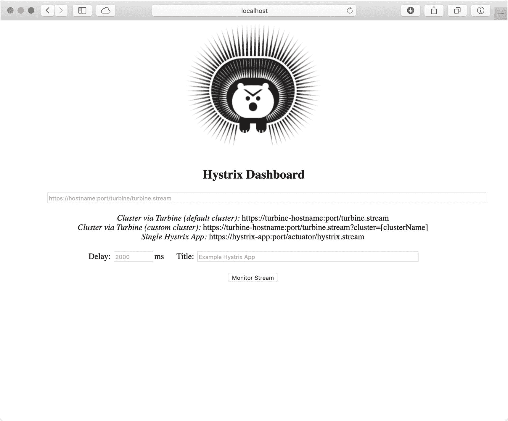

图 5-17。

http://localhost:8000/Hystrix 上的 hystrix 仪表板

在这里，您添加由执行器提供的微服务电影端点，类似于`http://localhost:8080/actuator/hystrix.stream`，并提供一个标题，例如电影。为了让它工作，你需要发送电影标题到`/tmp/movies`文件夹。然后停止 movie-web 实例并重试。你应该会看到类似于图 5-18 的东西。打开断路器。

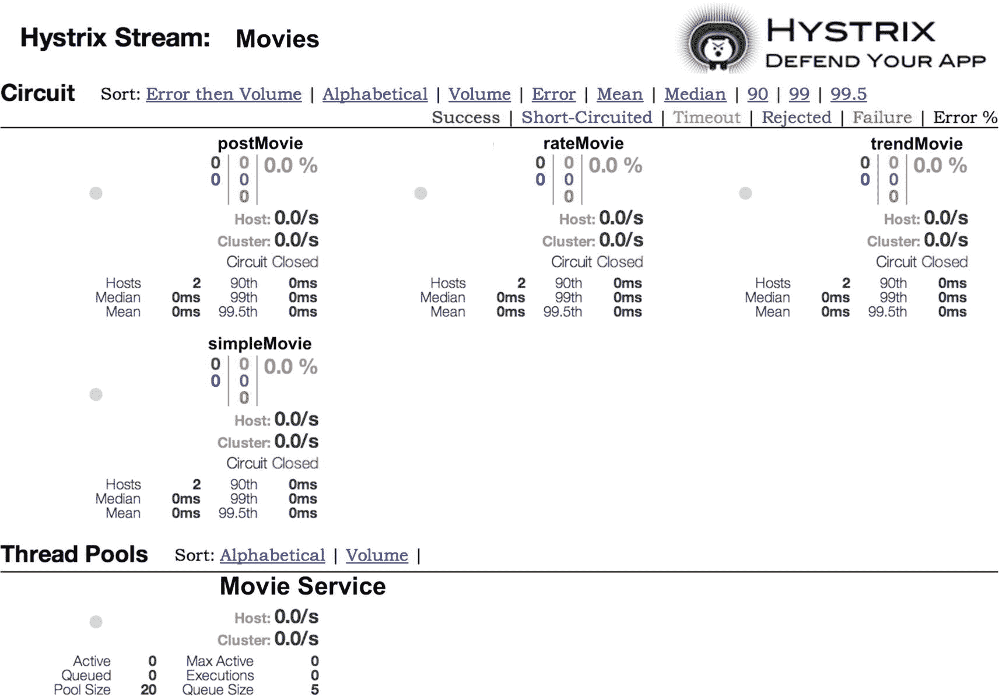

图 5-18。

Hystrix 仪表板

如果您想了解更多关于该仪表板的信息，请访问 [`https://spring.io/projects/spring-cloud`](https://spring.io/projects/spring-cloud) 。

Spring Cloud project 提供其他服务，但那是另一本书的内容。现在，您拥有了创建微服务解决方案的工具。

## 关于反应式编程

我已经向您展示了一些 Spring Cloud 子项目，它们解决了一些 12 因素指导方针，并转向微服务架构，但是反应式编程适合哪里呢？

请记住，微服务的一个重要特性是能够与其他微服务和遗留系统进行通信。想象一下，你的微服务应用需要同时访问几个系统，而你已经有了一个客户端，它发出几个调用来聚合一切。在某些时候，这个应用变得非常健谈(网络延迟、并发、阻塞等)。)，而且你也不是只有一个客户提出这种要求。你会收到数百万个请求。

反应式编程使用一种特殊的模式解决了这个问题:API 网关。

```java
Observable<MarketExchangeRates> details = Observable.zip(
  localService.getExchangeRates("usd"),
  yahooFinancialService.getGlobalRates("mxn","jpy"),
  googleFinancialService.getEuropeExchangeRates(),
  (local, yahoo, google) -> {
        MarketExchangeRates exchangeRates = new
MarketExchangeRates();
        exchangeRates.setLocalMarket(local.getRates());
        exchangeRates.setEurope(google.getRates({"eur","gpb"}));
        exchangeRates.setGlobal(yahoo.getRate());
        return exchangeRates;
   }
);

```

使用这段代码，您可以执行几个并行任务，并避免网络跳跃、延迟、并发和阻塞等资源。还有，像雅虎这样的服务！金融服务使用配置服务，可以将自己注册到服务注册表，并在出现故障时使用默认方法(例如断路器)。

## 摘要

本章讨论了微服务架构以及设计云原生应用的挑战。我向您展示了 Spring Cloud 子项目如何帮助您利用 Spring Boot 的强大功能创建快速简单的云原生应用。这是一项令人敬畏的技术，它使微服务易于开发。