# 十、使用 Spring CloudStream 定制流式应用

在前一章中，我向您展示了 Spring CloudStream 组件，以及它们如何协同工作来创建用于处理数据的流解决方案。我通过指向公开 REST API 的 Spring CloudStream 服务器，向您展示了如何使用简单的 cURL 命令创建流。我向您展示了数据流 shell 如何通过创建、部署和销毁流来工作。我讨论了如何通过使用 Java DSL 创建流定义来以编程方式创建动态解决方案。我说过，你可以在任何云平台上运行相同的流，比如 Kubernetes，并利用高可用性和负载平衡等特性。

本章使用自定义流式应用，并解释如何将它们插入流定义。您正在使用自定义的 NATs 活页夹。首先，我们来复习一些概念。

## 定制流式应用:快速回顾

流被定义为在没有交互或中断的情况下处理数据，这对于接近实时的用例非常有用，例如预测分析、信用卡欺诈检测、垃圾邮件、商业智能，如果您使用机器学习过程插入这些流，那么您就有了一个非常强大的解决方案。

Spring Cloud Stream 提供了一个解决方案，将流作为独立的应用，这些应用通常是事件驱动的，可以通过任何消息中间件连接起来。通过连接这些应用，您可以创建一个由流数据管道组成的运行时环境，它可以是线性的，也可以是非线性的，这取决于您的业务逻辑。有了 Spring Cloud Stream，你可以使用任何适合你的基础设施的中间件；你不需要学习特定的 API 来从一个应用向另一个应用发送或接收消息。你可以使用任何来自社区或者 Spring Cloud Stream 团队支持的绑定器，比如 RabbitMQ 和 Kafka。在本章中，您将使用前几章中的自定义代理。Spring CloudStream 及其组件充当了一个编排器，可以使用任何云平台基础设施创建、部署、更新和销毁复杂的流。

在本章中，您将创建一个自定义流并使用一个自定义绑定器，因此您需要记住创建自定义 Spring CloudStream 应用的一些要点。

*   您需要选择正在创建的流的类型:源、处理器、接收器或任务。(任务应用将在下一章讨论。)

*   您需要选择`spring-cloud-stream`依赖项。如果您使用的是 Spring Cloud Stream 团队支持的代理，您可以添加`spring-cloud-stream-binder-rabbit`(用于 RabbitMQ)或`spring-cloud-stream-binder-kafka-streams`(用于 Kafka 依赖)。

*   您可以选择不同的编程风格。您可以使用`@EnableBinding` ( <stream type="" class:="">`Source`、`Processor`、`Sink`、`@StreamListener`(用于接收消息)、`@SendTo`(用于回复/响应，通常是一个`Processor`利用这一点)，或者您可以进行函数式编程并使用`java.util.function` Java 包中的`Supplier`、`Function`或`Consumer`接口以及带有`Mono`或`Flux`接口的项目反应器。</stream>

*   你需要配置所有的流 app *输入*和*输出*，也就是所谓的*目的地*；以及你需要的任何其他属性。

请记住，Spring Cloud Stream 团队创建了独立和开箱即用的流式应用，您可以使用它们来创建流数据管道解决方案。

现在，您已经回忆起了所有这些，是时候创建自定义流式应用，使用自定义 NATs 绑定器，并使用 Spring CloudStream 仪表板或数据流外壳来编排管道 DSL 了。

## Spring CloudStream 中的自定义流式应用

本节中的所有内容都将 Docker Compose 技术用于本地环境，但是如果您已经在自己的 Kubernetes 集群中运行了 Spring CloudStream 组件，那么无论如何，您都可以使用它来创建、更新和部署您的流数据管道。

让我们定义最终的管道(见图 [10-1](#Fig1) )。

图 [10-1](#Fig1) 说明了我们将要做的事情。当用 DSL 表达时，它看起来像下面这样。


图 10-1。

自定义流管道

```java
movie-web | splitter | movie-imdb | movie-log

```

尽管这是一个简单的流管道，我想向您展示如何使用 GUI 或数据流外壳的自定义应用，以及如何使用自定义绑定器。如果你仔细看看 DSL， *splitter* app starter 结合了三个自定义流式应用。

### 电影网络应用:电影-来源

这个应用公开了一个 REST API，您可以在其中发送一组电影。我们先打开浏览器，进入 Spring Initializr ( [`https://start.spring.io`](https://start.spring.io) )网站。使用以下数据。

*   组:`com.apress.cloud.stream`

*   神器:`movie-source`

*   包名:`com.apress.cloud.stream.movie`

*   依赖:CloudStream，春网，龙目岛

点击生成按钮下载一个 ZIP 文件。将其解压缩，并将项目导入到您喜欢的 IDE 中(参见图 [10-2](#Fig2) )。

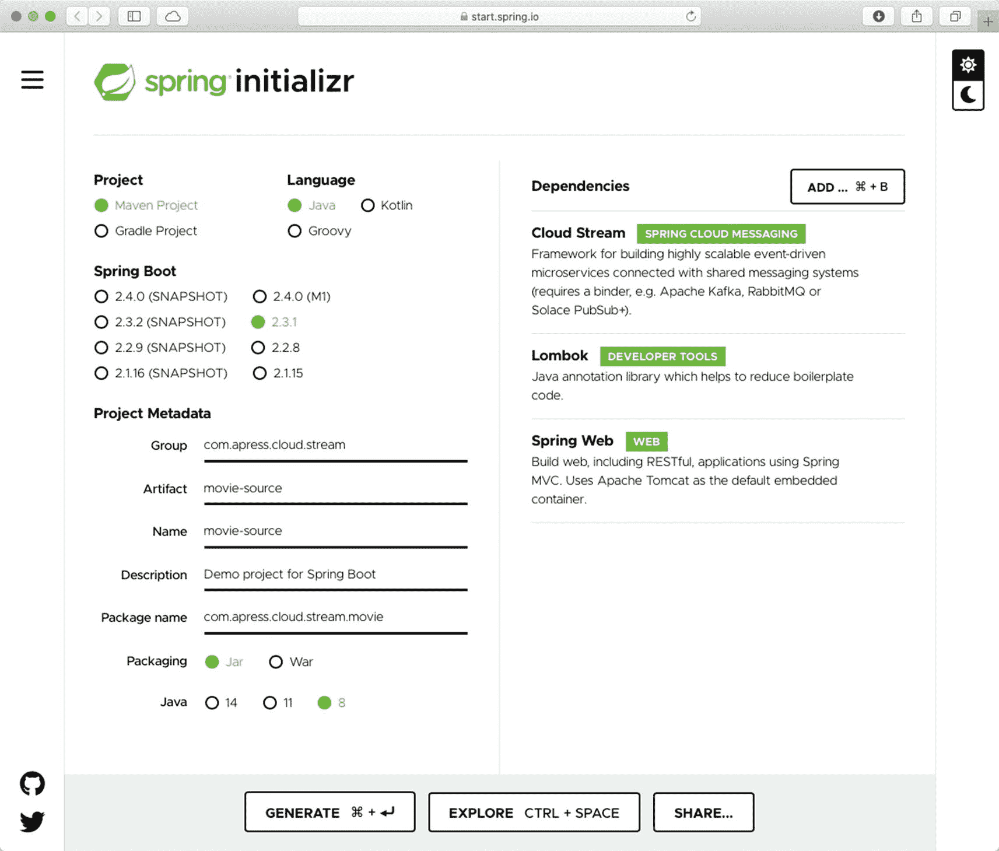

图 10-2。

Spring 初始化电影-来源

接下来，打开`pom.xml`并添加以下依赖项。

```java
<dependency>
        <groupId>org.springframework.cloud</groupId>
        <artifactId>spring-cloud-stream-binder-rabbit</artifactId>
</dependency>
<!-- WebJars -->
<dependency>
        <groupId>org.webjars</groupId>
        <artifactId>bootstrap</artifactId>
        <version>4.5.0</version>
</dependency>
<dependency>
        <groupId>org.webjars</groupId>
        <artifactId>jquery</artifactId>
        <version>3.5.1</version>
</dependency>

```

如果查看依赖项，首先使用 RabbitMQ 绑定器。此外，还包括一个 WebJar 来创建一个`index.html`页面来发送电影，而不是任何 cURL 命令或另一个 REST API 客户端。我希望您看到命令行以外的解决方案。

接下来修改版本，去掉快照工作，所以如下。

```java
<version>0.0.1</version>

```

这对部署很重要(我稍后会解释)。接下来，让我们创建模型。创建`Movie`类(参见清单 [10-1](#PC4) )。

```java
package com.apress.cloud.stream.movie;

import lombok.AllArgsConstructor;
import lombok.Data;
import lombok.NoArgsConstructor;

@AllArgsConstructor
@NoArgsConstructor
@Data
public class Movie {
    private String id;
    private String title;
    private String actor;
    private int year;
    private String genre;
    private int stars;
}

Listing 10-1.src/main/java/com/apress/cloud/stream/movie/Movie.java

```

您已经知道了`Movie`类，所以让我们继续创建`MovieRequest`类(参见清单 [10-2](#PC5) )。

```java
package com.apress.cloud.stream.movie;

import lombok.AllArgsConstructor;
import lombok.Data;
import lombok.NoArgsConstructor;

import java.time.LocalDateTime;

@NoArgsConstructor
@AllArgsConstructor
@Data
public class MovieRequest {
    String action;
    Iterable<Movie> movies;
    LocalDateTime created;
}

Listing 10-2.src/main/java/com/apress/cloud/stream/movie/MovieRequest.java

```

清单 [10-2](#PC5) 显示了`MovieRequest`类。如你所见，这很简单。通常，当您想要公开一个 API 时，作为一种最佳实践，您应该包装您的数据。当使用审计工具时，这有助于查看请求何时发生、谁做的等等。接下来，您需要一个`MovieResponse`类(参见清单 [10-3](#PC6) )。

```java
package com.apress.cloud.stream.movie;

import lombok.AllArgsConstructor;
import lombok.Data;
import lombok.NoArgsConstructor;

import java.time.LocalDateTime;

@NoArgsConstructor
@AllArgsConstructor
@Data
public class MovieResponse {

    Integer code;
    String message;
    LocalDateTime responseTime;

}

Listing 10-3.src/main/java/com/apress/cloud/stream/movie/MovieResponse.java

```

清单 [10-3](#PC6) 显示了`MovieResponse`类。尽管这个类很简单，但您可以使用它来报告对您的业务逻辑有意义的特殊代码，并发送一条暴露任何问题的消息。接下来，让我们创建`MovieController`类(参见清单 [10-4](#PC7) )。

```java
package com.apress.cloud.stream.movie;

import lombok.AllArgsConstructor;
import lombok.extern.log4j.Log4j2;
import org.springframework.cloud.stream.function.StreamBridge;
import org.springframework.http.HttpStatus;
import org.springframework.http.ResponseEntity;
import org.springframework.web.bind.annotation.*;

import java.time.LocalDateTime;
import java.util.Collection;

@Log4j2
@AllArgsConstructor
@RequestMapping("/v1/api")
@RestController
public class MovieController {

    private StreamBridge streamBridge;

    @PostMapping("/movies")
    @ResponseStatus(HttpStatus.ACCEPTED)
    public ResponseEntity<MovieResponse> toMovieBinding(@RequestBody MovieRequest movieRequest) {
        assert  movieRequest != null;
        movieRequest.setCreated(LocalDateTime.now());

        log.debug("Sending: {} ", movieRequest);
        assert streamBridge != null;
        streamBridge.send("movie-out-0", movieRequest);

        return ResponseEntity
                .accepted()
                .body(new MovieResponse(HttpStatus.OK.value(),"Movies processed: " + ((Collection)movieRequest.getMovies()).size(), LocalDateTime.now()) );
    }
}

Listing 10-4.src/main/java/com/apress/cloud/stream/movie/MovieController.java

```

清单 [10-4](#PC7) 显示了`MovieController`类。重要的部分是使用`StreamBridge`类将数据发送到*输出绑定*。`send`方法使用了`movie-out-0`绑定。主 API 端点是`/v1/api`，而`MovieRequest`端点是`/v1/api/movies`。

接下来，让我们创建`index.html`和 JavaScript 来创建一个发送到`/v1/api/movies`端点的主页(参见清单 [10-5](#PC8) 和 [10-6](#PC9) )。

```java
function getMovieRequest(){
    return `{
  "MovieRequest": {
    "action": "create",
    "movies": [
      {
        "id": "tt0133093",
        "title": "The Matrix",
        "actor": "Keanu Reeves",
        "year": 1999,
        "genre": "fiction",
        "stars": 5
      },
      {
        "id": "tt0209144",
        "title": "Memento",
        "actor": "Guy Pearce",
        "year": 2000,
        "genre": "drama",
        "stars": 4
      }
    ]
  }
}
    `;
}

$(function(){
    $('#movieRequest').val(getMovieRequest());
    $('#sendRequest').click(function (){

        $.ajax
        ({
            type: "POST",
            url: '/v1/api/movies',
            dataType: 'json',
            async: false,
            contentType: 'application/json',
            data: $('#movieRequest').val(),
            success: function (data) {
                alert(data.MovieResponse.message);
            }
        })
    });

});

Listing 10-6.src/main/resources/static/js/main.js

```

```java
<!DOCTYPE html>
<html lang="en">
<head>
    <meta charset="UTF-8">
    <script src="/webjars/jquery/3.5.1/jquery.min.js"></script>
    <script src="/webjars/bootstrap/4.5.0/js/bootstrap.min.js"></script>
        <link rel="stylesheet"
          href="/webjars/bootstrap/4.5.0/css/bootstrap.min.css" />
    <title>Title</title>
</head>
<body>
<div class="jumbotron jumbotron-fluid">
    <div class="container">
        <h1 class="display-4">Movie API</h1>
        <p class="lead">This is a Movie API Stream App.</p>
    </div>
</div>
<div class="container">
    <!-- Example row of columns -->
    <div class="row">
        <div class="col-md-6">
            <h2>Movies</h2>
            <p>You can send this JSON movie request, or modify it accordingly.</p>
            <div class="form-group">
                <textarea class="form-control" id="movieRequest" rows="15"></textarea>
            </div>
            <p><a class="btn btn-primary btn-lg" href="#" role="button" id="sendRequest">Send</a></p>
        </div>

    </div>
    <hr>

</div>
<script src="js/main.js"></script>
</body>
</html>

Listing 10-5.src/main/resources/static/index.html

```

正如你从之前的文件中看到的，这些非常简单——没有什么复杂的，只是一个使用`$.ajax`(来自 jQuery)的帖子。注意，您已经用 movies JSON 有效负载填充了文本区域。例如，这可能是一个 SPA(单页应用)。

接下来，我们打开`application.properties`文件。添加清单 [10-7](#PC10) 中的内容。

```java
# Server
server.port=8080

# Jackson Root Properties
spring.jackson.serialization.wrap-root-value=true
spring.jackson.deserialization.unwrap-root-value=true

# Spring Cloud Stream
spring.cloud.stream.source=movie
spring.cloud.stream.bindings.movie-out-0.destination=movie

# Logging
logging.level.com.apress.cloud.stream.movie=DEBUG

Listing 10-7.src/main/resource/application.properties

```

清单 [10-7](#PC10) 显示了`application.properties`文件。注意，您添加了`spring.jackson.*`属性来将`MovieRequest`和`MovieResponse`对象包装到一个 JSON 对象中。此外，要使用`StreamBridge`类，您需要定义源的名称，在本例中是`movie`。此外，有必要创建基于命名约定的绑定，命名约定是`movie-out-0`(您在前面的章节中已经看到了)。

你可以通过连接到`log-app-starter`或`splitter-app-starter`来测试这个流式应用，看看它是如何工作的。

Note

在源代码中，`ch10/app-starters`文件夹包含一个`setup.sh`脚本，用于下载拆分器和日志应用启动器，并设置`application.properties`文件来测试`movie-source`项目。需要 RabbitMQ 来测试。

### 电影 IMDB 应用:电影处理器

这个应用接收 JSON 格式的电影。它使用电影的 ID 去第三方 API 服务( [`https://rapidapi.com`](https://rapidapi.com) )。请记住，您需要登录(RapidAPI 是免费的)并使用 IMDB 服务。您正在使用免费服务( [`https://imdb8.p.rapidapi.com`](https://imdb8.p.rapidapi.com) )和`/title/get-ratings`端点来获取评级。这个流式应用与您在前一章中创建的`groovy-transform`脚本非常相似。这个流式应用使用 NATs 服务器和 RabbitMQ 绑定器。

打开浏览器，进入 Spring Initializr ( [`https://start.spring.io`](https://start.spring.io) )网站。使用以下数据。

*   组:`com.apress.cloud.stream`

*   神器:`movie-processor`

*   包名:`com.apress.cloud.stream.movie`

*   依赖:CloudStream，龙目岛

点击生成按钮下载一个 ZIP 文件。将其解压缩并将项目导入到您喜欢的 IDE 中(参见图 [10-3](#Fig3) )。

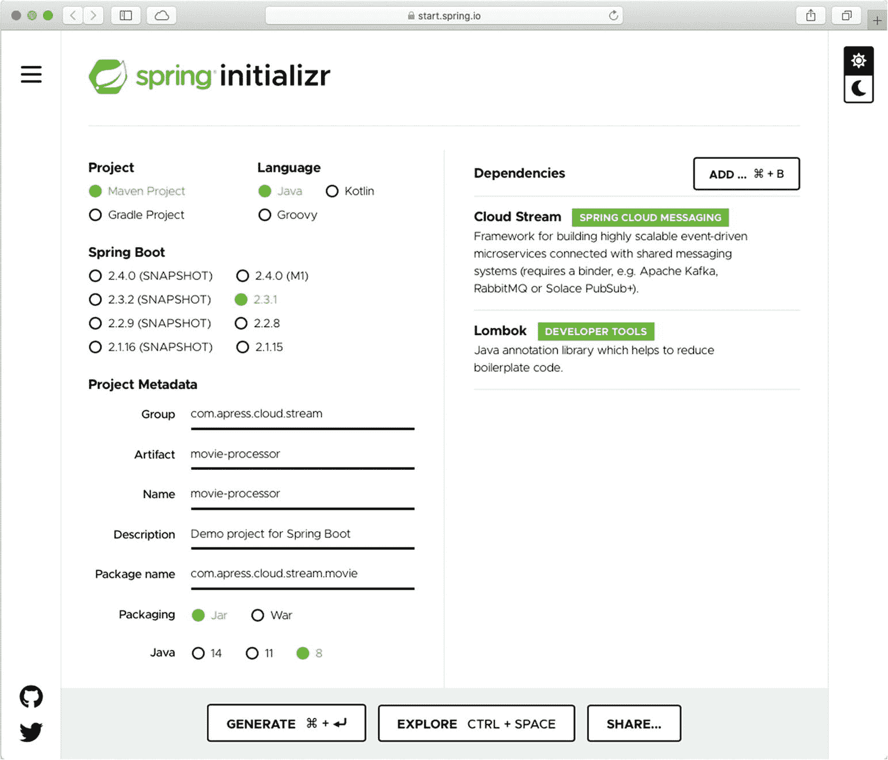

图 10-3。

Spring Initializr 电影处理器

接下来，打开`pom.xml`并添加以下依赖项。

```java
<dependency>
        <groupId>org.springframework.cloud</groupId>
        <artifactId>spring-cloud-stream-binder-rabbit</artifactId>
</dependency>

                <!-- NATs Server -->
<dependency>
        <groupId>com.apress.nats</groupId>
        <artifactId>nats-messaging-binder</artifactId>
        <version>0.0.1-SNAPSHOT</version>
</dependency>

<!-- Apache Commons -->
<dependency>
        <groupId>org.apache.httpcomponents</groupId>
        <artifactId>httpclient</artifactId>
        <version>4.5.12</version>
</dependency>

<dependency>
        <groupId>org.springframework.boot</groupId>
        <artifactId>spring-boot-configuration-processor</artifactId>
        <optional>true</optional>
</dependency>

```

您正在添加 NATs 绑定器依赖项和执行请求的`httpclient`。(您可以使用 Spring Web 提供的`RestClient`,但我想使用一种替代方法)。此外，您正在将`configuration-processor`添加到您自己的属性中。

在同一个`pom.xml`文件的 build/plugins 部分，添加以下插件。

```java
<plugin>
        <groupId>org.springframework.cloud</groupId>
        <artifactId>spring-cloud-app-starter-metadata-maven-plugin</artifactId>
        <version>2.0.0.RELEASE</version>
        <executions>
                <execution>
                        <id>aggregate-metadata</id>
                        <phase>compile</phase>
                        <goals>
                                <goal>aggregate-metadata</goal>
                        </goals>
                </execution>
        </executions>
</plugin>

```

这将创建元数据 JAR，其中包含设置流所需的所有属性信息。接下来，修改版本并删除快照工作，这样它就

```java
<version>0.0.1</version>

```

这对部署很重要。

接下来，您需要创建保存新信息的模型。您正在增强`Movie`对象。创建`Movie`和`MovieImdb`类(参见清单 [10-8](#PC14) 和 [10-9](#PC15) )。

```java
package com.apress.cloud.stream.movie;

import lombok.AllArgsConstructor;
import lombok.Data;
import lombok.NoArgsConstructor;

@NoArgsConstructor
@AllArgsConstructor
@Data
public class MovieImdb {
    Float rating;
    Integer ratingCount;
}

Listing 10-9.src/main/java/com/apress/cloud/stream/movie/MovieImdb.java

```

```java
package com.apress.cloud.stream.movie;

import lombok.AllArgsConstructor;
import lombok.Data;
import lombok.NoArgsConstructor;

@AllArgsConstructor
@NoArgsConstructor
@Data
public class Movie {
    private String id;
    private String title;
    private String actor;
    private int year;
    private String genre;
    private int stars;
    private MovieImdb imdb;
}

Listing 10-8.src/main/java/com/apress/cloud/stream/movie/Movie.java

```

清单 [10-9](#PC15) 显示了`MovieImdb`类。该类保存来自 IMDB 服务的信息。接下来，让我们创建`MovieProperties`类，它保存关于 IMDB 服务的信息，比如主机和调用所需的一些头(参见清单 [10-10](#PC16) )。

```java
package com.apress.cloud.stream.movie;

import lombok.Data;
import org.springframework.boot.context.properties.ConfigurationProperties;

@Data
@ConfigurationProperties(prefix = "movie")
public class MovieProperties {
    String apiServer;
    String headerHost;
    String headerKey;
}

Listing 10-10.src/main/java/com/apress/cloud/stream/movie/MovieProperties.java

```

接下来，让我们创建`MovieStream`类(参见清单 [10-11](#PC17) )。

```java
package com.apress.cloud.stream.movie;

import com.fasterxml.jackson.databind.DeserializationFeature;
import com.fasterxml.jackson.databind.ObjectMapper;
import lombok.extern.log4j.Log4j2;
import org.apache.http.HttpEntity;
import org.apache.http.client.methods.HttpGet;
import org.apache.http.impl.client.CloseableHttpClient;
import org.apache.http.impl.client.HttpClients;
import org.apache.http.util.EntityUtils;
import org.springframework.boot.context.properties.EnableConfigurationProperties;
import org.springframework.context.annotation.Bean;
import org.springframework.context.annotation.Configuration;
import reactor.core.publisher.Flux;

import java.io.IOException;
import java.net.URI;
import java.net.URISyntaxException;
import java.nio.charset.StandardCharsets;
import java.util.function.Function;

@Log4j2
@EnableConfigurationProperties(MovieProperties.class)
@Configuration
public class MovieStream {

    private MovieProperties movieProperties;
    private final CloseableHttpClient httpclient = HttpClients.createDefault();
    private final HttpGet getRequest = new HttpGet();

    public MovieStream(MovieProperties movieProperties) {
        this.movieProperties = movieProperties;
        getRequest.addHeader("Accept", "application/json");
        getRequest.addHeader("x-rapidapi-host", movieProperties.getHeaderHost());
        getRequest.addHeader("x-rapidapi-key", movieProperties.getHeaderKey());
        getRequest.addHeader("Content-Type", "application/json");
    }

    @Bean
    public Function<Flux<Movie>, Flux<Movie>> movieProcessor(ObjectMapper objectMapper) {
        return movieFlux -> movieFlux.map(
                movie -> {
                    try {

                        getRequest.setURI(new URI(movieProperties.getApiServer().replace("ID", movie.getId())));
                        HttpEntity entity = httpclient.execute(getRequest).getEntity();
                        movie.setImdb(objectMapper.readValue(EntityUtils.toString(entity, StandardCharsets.UTF_8), MovieImdb.class));

                    } catch (IOException | URISyntaxException e) {
                        e.printStackTrace();
                    }

                    log.debug("About ot send: {}", movie);
                    return movie;
                });
    }

    @Bean
    public ObjectMapper objectMapper(){
        ObjectMapper objectMapper = new ObjectMapper();
        objectMapper.configure(DeserializationFeature.FAIL_ON_UNKNOWN_PROPERTIES,false);
        return objectMapper;
    }

}

Listing 10-11.src/main/java/com/apress/cloud/stream/movie/MovieStream.java

```

清单 [10-11](#PC17) 显示了`MovieStream`类。我们来分析一下这个类。请注意，您在`movieProcessor method`中使用了`Flux<Movie>`。因为它被声明为 Spring bean，所以它识别处理传入流的主要方法，并将数据发送到正确的绑定。您正在使用`httpclient`实例来调用带有正确数据、电影 ID 和头(如主机和密钥)的服务。看看`entity`的例子。您正在执行请求并让一个实体映射回`MovieImdb`类。映射器忽略响应中缺少的属性来映射类。

接下来，让我们创建一个包含`spring-configuration-metadata.json`文件的`src/main/resources/META-INF`文件夹`,`。这个文件有关于每个属性的有用信息，这有助于其他开发人员重用和配置这个流(参见清单 [10-12](#PC18) )。

```java
{
  "groups": [
    {
      "name": "movie",
      "type": "com.apress.cloud.stream.movie.MovieProperties",
      "sourceType": "com.apress.cloud.stream.movie.MovieProperties"
    },
    {
      "name": "spring.nats",
      "type": "com.apress.nats.NatsProperties",
      "sourceType": "com.apress.nats.NatsProperties"
    }
  ],
  "properties": [
    {
      "name": "spring.nats.host",
      "type": "java.lang.String",
      "description": "This NATs Server host. Default to localhost.",
      "sourceType": "com.apress.nats.NatsProperties",
      "defaultValue": "localhost"
    },
    {
      "name": "spring.nats.port",
      "type": "java.lang.Integer",
      "description": "This NATs Server port. Default to 4222.",
      "sourceType": "com.apress.nats.NatsProperties",
      "defaultValue": 4222
    },
    {
      "name": "movie.api-server",
      "type": "java.lang.String",
      "description": "Default to: https://imdb8.p.rapidapi.com/title/get-ratings?tconst=ID. The ID will be replaced, so it's necessary",
      "sourceType": "com.apress.cloud.stream.movie.MovieProperties",
      "defaultValue": "https://imdb8.p.rapidapi.com/title/get-ratings?tconst=ID"
    },
    {
      "name": "movie.header-host",
      "type": "java.lang.String",
      "description": "Default to: imdb8.p.rapidapi.com.",
      "sourceType": "com.apress.cloud.stream.movie.MovieProperties",
      "defaultValue": "imdb8.p.rapidapi.com

"
    },
    {
      "name": "movie.header-key",
      "type": "java.lang.String",
      "description": "This header-key can be obtain in your https://rapidapi.com/ profile.",
      "sourceType": "com.apress.cloud.stream.movie.MovieProperties"
    }
  ],
  "hints": []
}

Listing 10-12.src/main/resource/META-INF/spring-configuration-metadata.json

```

接下来，在同一个`META-INF/`文件夹中，添加包含用`@ConfigurationProperties`注释标记的类的`spring-configuration-metadata-whitelist.properties`文件。这将生成元数据以获取关于流式应用的信息(参见清单 [10-13](#PC19) )。

```java
configuration-properties.classes=\
  com.apress.nats.NatsProperties,\
  com.apress.cloud.stream.movie.MovieProperties
configuration-properties.names=movie.api-server,movie.header-host,movie.header-key,spring.nats.host,spring.nats.port

Listing 10-13.src/main/resource/META-INF/spring-configuration-metadata-whitelist.json

```

请注意，您正在添加我们的 NATs 属性，因为这些属性对于告知 NATs 代理在哪里是必需的。此外，您将正在使用的属性列入白名单。如果你需要类似`server.port`的东西，这是必要的。对于这个示例，您不需要它们，有了类就足够了，但是为了说明这一点，您可以包含一些其他属性，这些属性已经作为整个 stream 应用的一部分包含在内。

接下来，打开`application.properties`文件并添加清单 [10-14](#PC20) 中的内容。

```java
# Server
server.port=8082

# IMDB API
movie.api-server=https://imdb8.p.rapidapi.com/title/get-ratings?tconst=ID
movie.header-host=imdb8.p.rapidapi.com
movie.header-key=YOUR-KEY

# Binders
spring.cloud.stream.bindings.movieProcessor-in-0.binder=rabbit
spring.cloud.stream.bindings.movieProcessor-out-0.binder=nats

# Bindings - Nats - RabbitMQ
spring.cloud.stream.bindings.movieProcessor-in-0.destination=imdb
spring.cloud.stream.bindings.movieProcessor-out-0.destination=log

# Logging
logging.level.com.apress.cloud.stream.movie=DEBUG

Listing 10-14.src/main/resource/META-INF/application.properties

```

清单 [10-14](#PC20) 显示了`application.properties`。注意，这个文件有`movie.*`属性。有些是违约。还要查看绑定器(用于传入的流；代理使用它们进行流式传输)并注意您需要如何输入输入和输出目的地。记住采用方法名(`movieProcessor`)并添加`-in-0`和`-out-0`终止的命名约定。

### 电影日志应用:电影接收器

这个流式应用记录带有 IMDB 评级的增强的`Movie`对象。一个非常简单的应用。打开浏览器，进入 Spring Initializr 网站( [`https://start.spring.io`](https://start.spring.io) )。使用以下数据。

*   组:`com.apress.cloud.stream`

*   神器:`movie-sink`

*   包名:`com.apress.cloud.stream.movie`

*   依赖:CloudStream，龙目岛

点击生成按钮下载一个 ZIP 文件。将其解压缩，并在您喜欢的 IDE 中导入项目(参见图 [10-4](#Fig4) )。

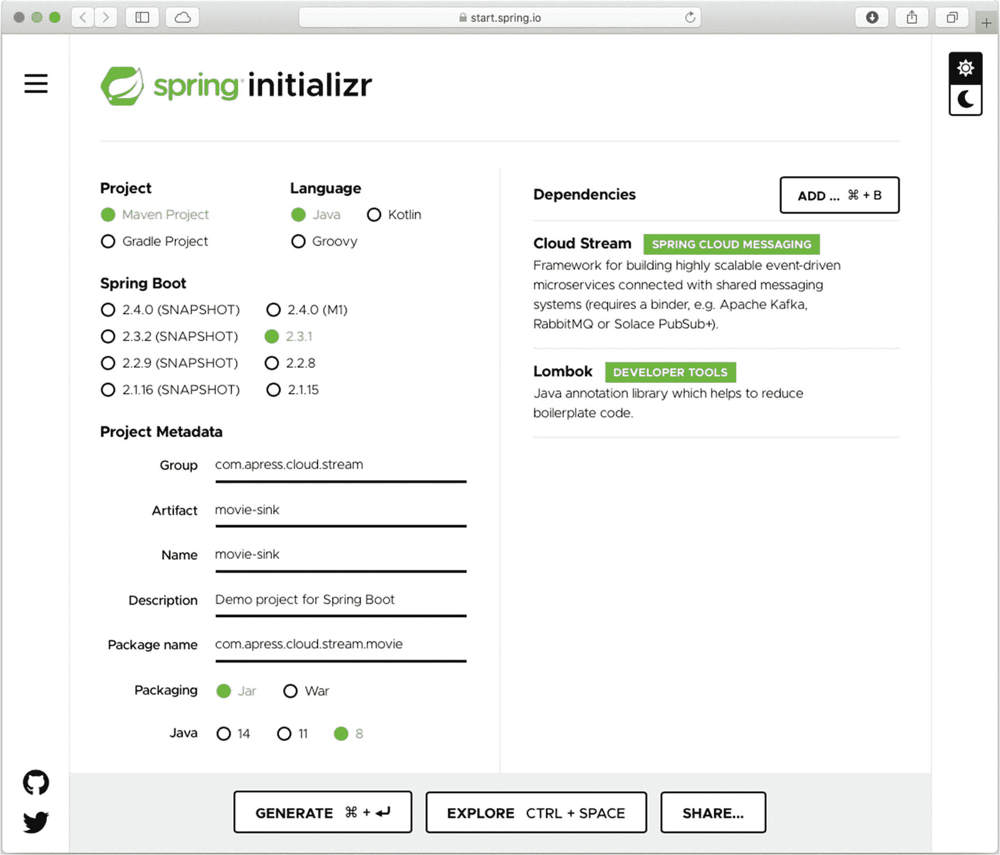

图 10-4。

Spring 初始化电影池

打开`pom.xml`并添加以下依赖项。

```java
<!-- NATs Server -->
<dependency>
        <groupId>com.apress.nats</groupId>
        <artifactId>nats-messaging-binder</artifactId>
        <version>0.0.1-SNAPSHOT</version>
</dependency>

```

这个流式应用使用 NATs 绑定器，所以这是你唯一需要的依赖。接下来，修改版本并删除快照工作，这样它就

```java
<version>0.0.1</version>

```

接下来，复制/粘贴先前的`Movie`和`MovieImdb`类(参见清单 [10-8](#PC14) 和 [10-9](#PC15) )。

接下来，创建`MovieStream`类(参见清单 [10-15](#PC23) )。

```java
package com.apress.cloud.stream.movie;

import lombok.extern.log4j.Log4j2;
import org.springframework.context.annotation.Bean;
import org.springframework.context.annotation.Configuration;
import reactor.core.publisher.Flux;

import java.util.function.Consumer;

@Log4j2
@Configuration
public class MovieStream {
    @Bean
    public Consumer<Flux<Movie>> log() {
        return movie -> movie.subscribe(actual -> log.info(actual));
    }
}

Listing 10-15.src/main/java/com/apress/cloud/stream/movie/MovieStream.java

```

清单 [10-15](#PC23) 显示了`MovieStream`类。如你所见，这很简单；您只需订阅和接收`Movie`对象。

接下来，打开`application.properties`文件，添加清单 [10-16](#PC24) 中的内容。

```java
# Server
server.port=8083

# Bindings
spring.cloud.stream.bindings.log-in-0.destination=log

Listing 10-16.src/main/resources/application.properties

```

### 打包和部署流式应用

现在，你已经准备好使用 Spring CloudStream 来创建一个流管道，但是首先，你需要决定如何打包每一个流 app。最后，您可以拥有优步-JARs 并独立运行它们。但是您需要一些东西来协调管道，而不是手动完成所有事情。对于所有这些，您需要选择您希望 Spring CloudStream 服务器如何使用您的流式应用。Spring CloudStream 服务器可以通过提供 Maven 或 Docker 坐标以及本地 JAR 来使用流式应用(但这应该仅用于开发)。

您在这里使用的是 Maven 坐标，为此，您需要打包和部署您的流式应用。如果您是一名经验丰富的开发人员，并且已经知道如何将 Maven 工件打包并部署到 Maven 存储库中，那么您可以跳过这一节。

要打包您的应用，进入每个项目的根目录并执行以下命令。

```java
./mvnw clean -DskipTests package

```

该命令在`target/`文件夹中生成您需要的文件。如果你看一下`movie-processor`项目的`target/`文件夹，你会发现`movie-processor-0.0.1-metadata.jar`中有`spring-configuration-metadata.*`文件，当你需要关于这个应用的信息时，这些文件很有用。

接下来，有必要将这些工件部署到 Maven 存储库中。让我告诉你，创建 Maven repo 有很多解决方案，比如使用 Docker images 或 Apache Archiva、Nexus 或 JFrog。您还可以将 Git 服务器用作 Maven repo。在本例中，我使用了一个名为 Bintray ( [`https://bintray.com`](https://bintray.com) )的开源 Maven 回购。可以免费报名(见图 [10-5](#Fig5) )。

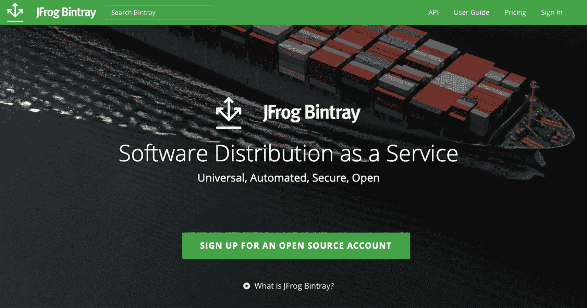

图 10-5。

垃圾箱

设置帐户后，您需要创建一个存储库和一个包来保存您的流式应用。我创建了`scdf`存储库，包名是`movie-streams`。我最终的 Maven 回购网址是 [`https://bintray.com/felipeg48/scdf`](https://bintray.com/felipeg48/scdf) (见图 [10-6](#Fig6) )。

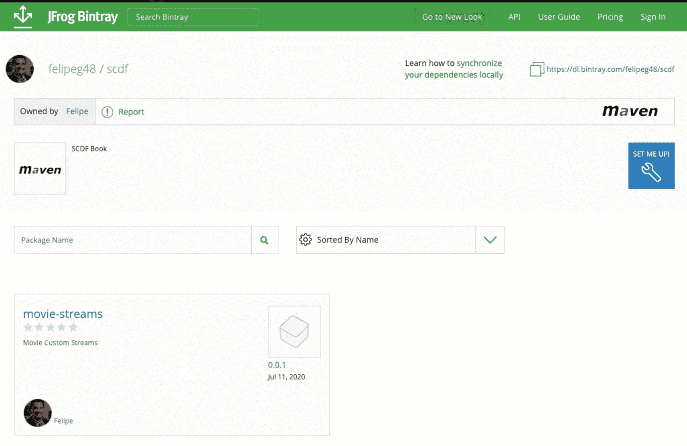

图 10-6。

[T2`https://bintray.com/felipeg48/scdf`](https://bintray.com/felipeg48/scdf)

一旦您完成了 Maven repo 和包名的设置，您需要向`pom.xml`文件添加一些凭证和依赖项，以便您可以进行部署。首先，在 [`https://bintray.com/profile/edit`](https://bintray.com/profile/edit) 进入你的个人资料。从左侧菜单中选择 API 键。请将其复制到安全的地方，因为您稍后会用到它(参见图 [10-7](#Fig7) )。

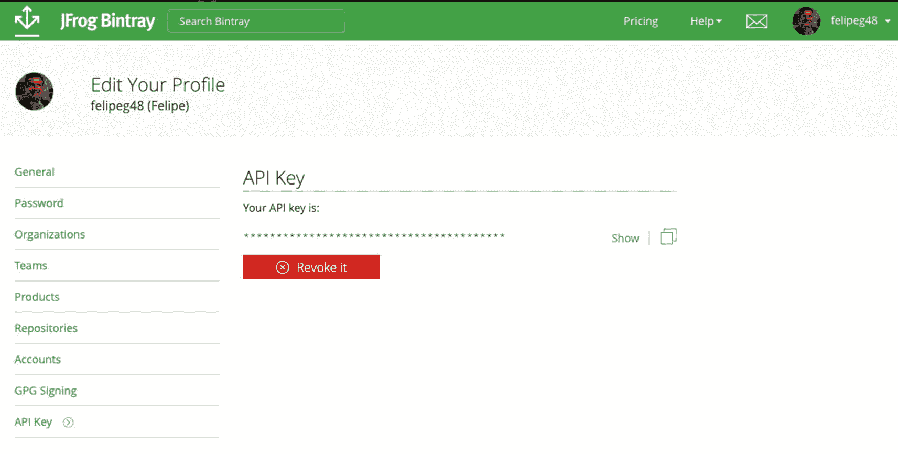

图 10-7。

[T2`https://bintray.com/profile/edit`](https://bintray.com/profile/edit)

在您的主目录中查找`(~/.m2`文件夹。打开或创建`~/.m2/settings.xml`并添加以下内容。

```java
<?xml version='1.0' encoding='UTF-8'?>
<settings xsi:schemaLocation='http://maven.apache.org/SETTINGS/1.0.0 http://maven.apache.org/xsd/settings-1.0.0.xsd'
          xmlns:='http://maven.apache.org/SETTINGS/1.0.0' xmlns:xsi='http://www.w3.org/2001/XMLSchema-instance'>
    <servers>
        <server>
            <id>bintray-USERNAME-scdf</id>
            <username>YOUR_USERNAME</username>
            <password>YOUR_KEY</password>
        </server>
    </servers>
</settings>

```

`<id>`标签应该与下面的配置相同。接下来打开每个项目的`pom.xml`文件，添加以下内容(这是我的个人信息)。

```java
<distributionManagement>
        <repository>
                <id>bintray-felipeg48-scdf</id>
                <name>felipeg48-scdf</name>
                <url>https://api.bintray.com/maven/felipeg48/scdf/movie-streams/;publish=1</url>
        </repository>
</distributionManagement>

```

`<id>` *必须与`settings.xml`中设置的*相同；`<name>`可以是你想要的任何东西。知道 URL 是这种格式的 API 是很重要的。

```java
https://api.bintray.com/maven/<username>/<repository>/<package-name>/;publish=1

```

此外，它*必须*在末尾包含用户名、存储库和包名。我的情况是这样的。

```java
https://api.bintray.com/maven/felipeg48/scdf/movie-streams/;publish=1

```

如果你对此有任何问题，垃圾箱的网页上有一个设置我！按钮(见图 [10-6](#Fig6) )。点击它可以找到更多关于设置 Maven 上传的信息。

现在，您可以通过在每个项目的根目录中执行以下操作来上传应用。

```java
./mvnw -DskipTests deploy

```

该命令上传所有文件。您可以通过查看您的回购/包装来验证这一点(参见图 [10-8](#Fig8) )。

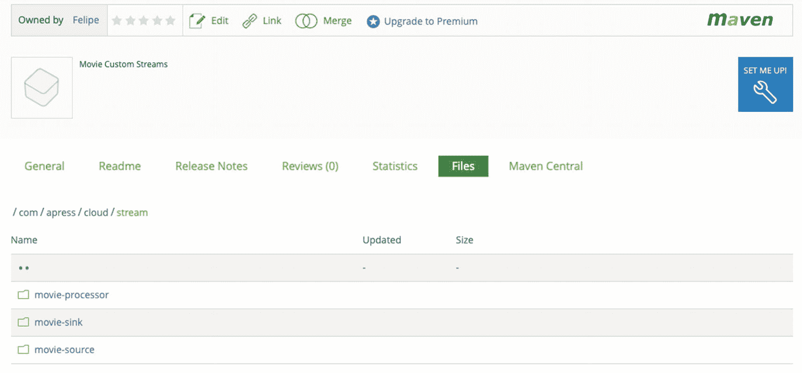

图 10-8。

[T2`https://bintray.com/<username>/scdf/movie-streams#files/com/apress/cloud/stream`](https://bintray.com/%253cusername%253e/scdf/movie-streams%2523files/com/apress/cloud/stream)

你可以检查每个文件夹，看看你的应用在那里。在`movie-processor`应用中，你可以看到元数据罐。现在，您可以在 Spring CloudStream 中使用它们了。要知道这个存储库是个人的，并不对社区开放，所以你需要告诉 Spring CloudStream 服务器如何找到它。您将在下一节看到这一点。

### 注册流式应用

现在您已经做好了一切准备，是时候在 Spring CloudStream 服务器中使用您的应用了。您必须添加 Maven repo 来告诉 Spring CloudStream 服务器在哪里可以找到您的应用。使用以下属性指向您的 Maven 存储库。

```java
maven.remote-repositories.repo1.url=https://dl.bintray.com/felipeg48/scdf

```

这个属性必须在 Spring CloudStream 服务器启动之前设置。如果您正在使用 Kubernetes，您可以将该属性添加到 YAML 文件的`env`部分，在那里设置容器。

```java
...
env:
  - name: maven.remote-repositories.repo1.url
  - value: https://dl.bintray.com/felipeg48/scdf
  ...

```

我从 Bintray 主页的右上角复制了这个 URL(见图 [10-6](#Fig6) )。如果使用 Docker Compose，可以在 environment 部分添加相同的环境变量。

```java
...
environment:
  - maven.remote-repositories.repo1.url=https://dl.bintray.com/felipeg48/scdf
...

```

如果您的公司使用私有 Maven repo，并且需要用户名和密码，请添加以下属性。

```java
maven.remote-repositories.repo1.auth.username=<your-username>
maven.remote-repositories.repo1.auth.password=<your-password>

```

如果您有多个 Maven 回购，请将`repo1`更改为`repo2`..`repoN`。

```java
...
maven.remote-repositories.repo1.url=...
maven.remote-repositories.repo2.url=..
maven.remote-repositories.repo3.url=..
maven.remote-repositories.repo2.auth.username=...
...

```

现在，您可以重启/启动您的服务器。注册应用有几个选项。

*   您可以像在前面章节中一样使用 cURL 命令进行注册。

*   您可以使用 Spring CloudStream shell 来注册它们。

*   可以使用 Spring CloudStream 仪表盘。

*   您可以通过编程方式注册应用。

我将向您展示如何使用 Spring Data 流外壳或仪表板来实现这一点。首先，确保您的 Spring CloudStream 组件已经启动并运行。请记住，Spring Data 流服务器必须从指向您的 Maven repo 的 Maven repo 环境变量开始。注册应用时，了解类型(源、处理器或接收器)、Spring Data 流服务器识别的应用名称以及 Maven 坐标(如下表所示)非常重要。

```java
maven://<groupId>:<artifactId>:<version>

```

如果您创建了`spring-configuration-metadata.json`属性，那么您需要以下面的形式注册您的元数据工件。

```java
maven://<group>:artifactId>:jar:metadata:<version>

```

#### 使用 Spring CloudStream 外壳来注册自定义应用

如果您想使用 Spring CloudStream shell，请确保您的服务器正在运行，然后启动您的 shell。您可以通过多种方式进行连接。如果你有一个优步罐，你可以指向 Spring Data 流服务器，就是这样。

```java
java -jar spring-cloud-dataflow-shell-VERSION.RELEASE.jar  \
  --dataflow.uri=http://my-server:9393  \
  --dataflow.username=my_username  \
  --dataflow.password=my_password   \
  --skip-ssl-validation=true

```

如果你已经在了，你看到了“`server-unknown`”，你可以用`dataflow`关键词连接。

```java
server-unknown:>dataflow config server --uri  http://my-server:9393 --username=my_username

```

接下来，用下面的 shell 命令注册应用。

```java
dataflow:>app register --name movie-imdb --type source --uri maven://com.apress.cloud.stream:movie-source:0.0.1

dataflow:>app register --name movie-imdb --type processor --uri maven://com.apress.cloud.stream:movie-processor:0.0.1 --metadata-uri maven://com.apress.cloud.stream:movie-processor:jar:metadata:0.0.1

dataflow:>app register --name movie-log --type sink --uri maven://com.apress.cloud.stream:movie-sink:0.0.1

```

执行这个 shell 命令后，列出如下应用。

```java
dataflow:>app list

```

您应该会看到您的自定义流被列出。对于您正在创建的管道 DSL，您需要 splitter 应用，因此您可以按如下方式注册。

```java
dataflow:>app register --name splitter --type processor --uri maven://org.springframework.cloud.stream.app:splitter-processor-rabbit:2.1.2.RELEASE --metadata-uri maven://org.springframework.cloud.stream.app:splitter-processor-rabbit:jar:metadata:2.1.2.RELEASE

```

也许你想知道是否有更好的注册方式——不需要一个接一个地添加你的应用。在上一章中，您看到了通过使用 [`https://dataflow.spring.io/rabbitmq-maven-latest`](https://dataflow.spring.io/rabbitmq-maven-latest) URI 可以使用批量选项。如果您下载该文件，您会看到以下格式的坐标。

```java
<type>.<name>[.metadata]=maven://<groupId>:<artifactId>[:jar:metadata]:<version>

```

Note

请记住，您可以使用 Docker 坐标。在这种情况下，您需要从您的自定义流式应用创建一个图像，并将其推送到注册表，可以是像`hub.docker.com`这样的公共注册表，也可以是您的私有注册表。坐标有点像`docker://<your-docker-id>/<your-image>:<version>`。

如果您想要了解您的应用的信息，您可以执行以下命令。

```java
dataflow:>app info --name movie-imdb --type processor

```

使用这个命令，您应该可以看到所有的`movie.*`和`spring.nats.*`属性及其定义。

#### 使用仪表板注册自定义应用

在这一节中，我将通过一个简单的过程向您展示如何使用仪表板。在 h `ttp://<your-server>[:9393]/dashboard`打开您的仪表板。转到应用选项卡，点击 **+添加应用**按钮。选择第三个选项，**批量导入申请**。在作为属性的应用字段中，复制并粘贴以下内容。

```java
source.movie-web=maven://com.apress.cloud.stream:movie-source:0.0.1
processor.movie-imdb=maven://com.apress.cloud.stream:movie-processor:0.0.1
processor.movie-imdb.metadata=maven://com.apress.cloud.stream:movie-processor:jar:metadata:0.0.1
processor.splitter=maven://org.springframework.cloud.stream.app:splitter-processor-rabbit:2.1.2.RELEASE
processor.splitter.metadata=maven://org.springframework.cloud.stream.app:splitter-processor-rabbit:jar:metadata:2.1.2.RELEASE
sink.movie-log=maven://com.apress.cloud.stream:movie-sink:0.0.1

```

请注意，splitter 应用已经包含在内。分析命名约定。您可以拥有一个外部文件并将其导入(参见图 [10-9](#Fig9) )。

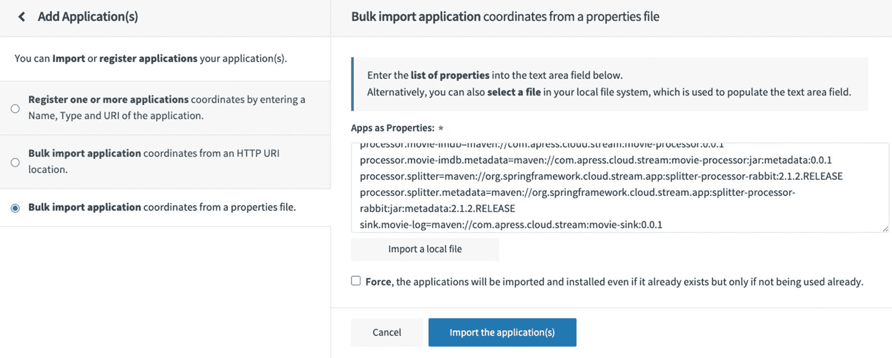

图 10-9。

批量导入申请

点击**导入应用**按钮。您应该会看到列出的应用(参见图 [10-10](#Fig10) )。

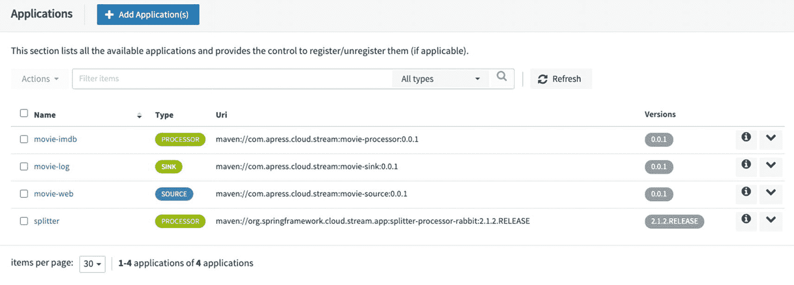

图 10-10。

应用

现在您已经准备好创建和部署您的流管道了。

### 创建和部署自定义流

您正在使用这里的仪表板创建管道 DSL，但是也欢迎您在数据流 shell 中进行同样的操作。转到您的仪表板，单击 Stream(在左侧窗格中)，然后单击 **+ Create stream(s)** 按钮。在文本区添加 DSL(参见图 [10-11](#Fig11) )。

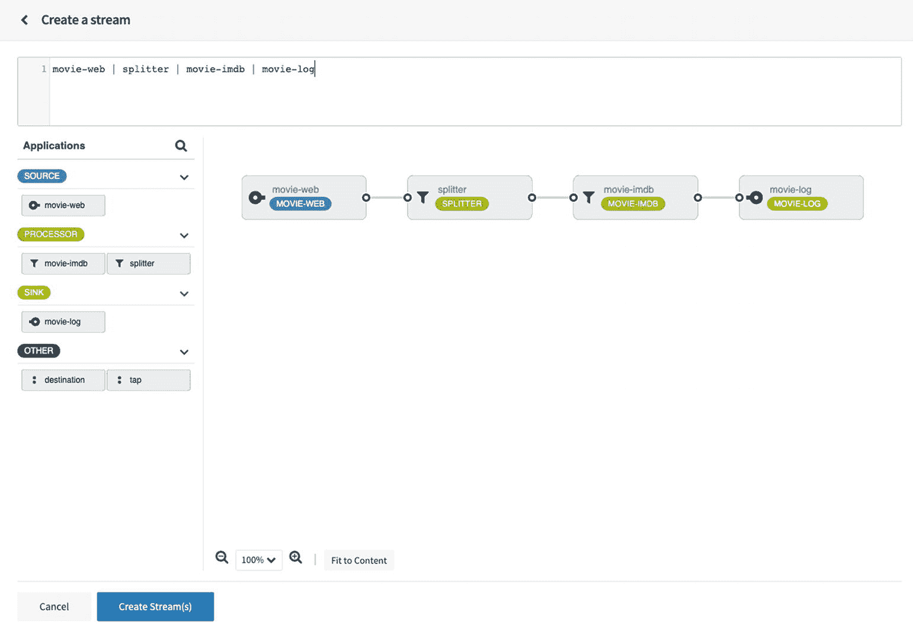

图 10-11。

创建一个流

请注意，您的应用列在左侧窗格中，这意味着它们可以被拖放并连接到您的解决方案中的任何其他流式应用。您可能想知道您是否正在使用某些属性。是的，您是，但是您使用了不同的方法，以便不扰乱流管道。

接下来，单击创建流按钮。将其命名为`movie-stream`并点击**创建流**按钮。这将带您进入流列表页面(参见图 [10-12](#Fig12) )。

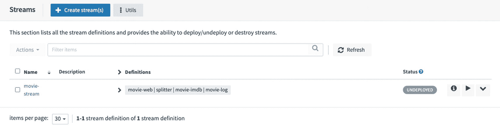

图 10-12。

流

接下来，单击 Play 按钮(>)，这将打开一个部署和属性页面，您可以在其中设置每个应用的功能属性。在此页面的顶部，单击“自由文本”选项卡，然后复制以下内容。

```java
app.movie-web.server.port=8081
app.movie-web.spring.cloud.stream.bindings.output.destination=movie
app.splitter.expression=#jsonPath(payload,'$.MovieRequest.movies')
app.splitter.spring.cloud.stream.bindings.input.destination=movie
app.splitter.spring.cloud.stream.bindings.output.destination=imdb
app.movie-imdb.spring.cloud.stream.bindings.input.binder=rabbit
app.movie-imdb.spring.cloud.stream.bindings.output.binder=nats
app.movie-imdb.spring.cloud.stream.bindings.input.destination=imdb
app.movie-imdb.movie.header-key=YOUR-KEY
app.movie-imdb.spring.nats.host=nats
app.movie-imdb.spring.cloud.stream.bindings.output.destination=log
app.movie-log.spring.cloud.stream.bindings.input.destination=log
app.movie-log.spring.nats.host=nats

```

在继续之前，请分析属性。请注意，您正在为拆分器应用添加表达式。您正在为 NATs 服务器设置主机，并为每个应用命名目标属性。花时间在这里，直到它对你有意义。请注意，您至少需要 IMDB 服务 API 的密钥。您可以相应地进行更改(参见图 [10-13](#Fig13) )。

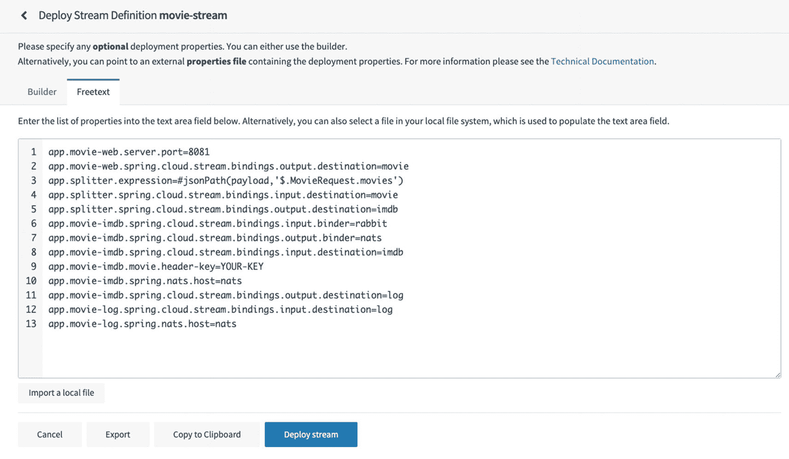

图 10-13。

应用属性

接下来，您可以点击**部署流**按钮。如果一切顺利，您的所有应用都应该已经部署好了。你可以打开浏览器，进入你的电影网络应用。如果您使用 Kubernetes 部署它，您可以将`movie-web-xxx` pod 暴露为`LoadBalancer`并访问它(参见图 [10-14](#Fig14) )。

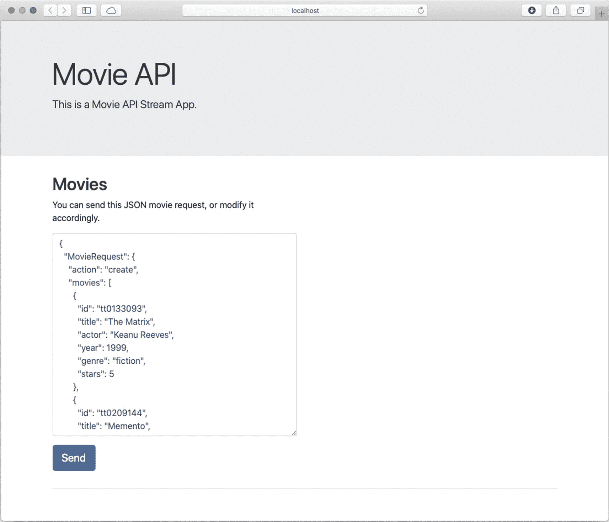

图 10-14。

电影 web 应用

现在您已经准备好发送`MovieRequest` JSON 对象了。按下 Send 按钮，您应该会收到一条消息，说明已经处理了两部电影。如果您查看 movie-log 应用流日志，您应该会看到带有评级的增强的`Movie`对象。

```java
Movie(id=tt0133093, title=The Matrix, actor=Keanu Reeves, year=1999, genre=fiction, stars=5, imdb=MovieImdb(rating=8.7, ratingCount=1620794))
Movie(id=tt0209144, title=Memento, actor=Guy Pearce, year=2000, genre=drama, stars=4, imdb=MovieImdb(rating=8.4, ratingCount=1090922))

```

恭喜您，您已经使用 RabbitMQ 和您的自定义 NATs 绑定器创建了自定义流式应用并部署了流管道。

Note

所有的源代码都在`ch10`文件夹里。大多数子文件夹都有自述文件和脚本，便于设置。

## 摘要

在本章中，我向您展示了如何使用自定义流式应用和自定义绑定器来创建流数据管道。我向您展示了如何使用 Maven 坐标在 Spring CloudStream 服务器中轻松访问。此外，您还了解了如何使用数据流外壳和仪表板。

一旦你熟悉了这些场景，你会发现 Spring CloudStream 很容易使用。请记住，您可以使用 Docker Compose 的本地开发，也可以使用更健壮的解决方案，如 Kubernetes 这样的云基础设施，它可以提供高可用性和其他很酷的云功能。

下一章将介绍 Spring Cloud 任务以及使用 Spring Batch 处理和转换由流触发的大量数据。