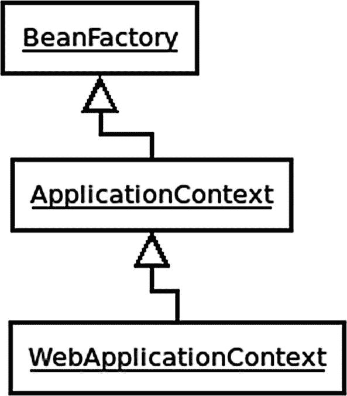
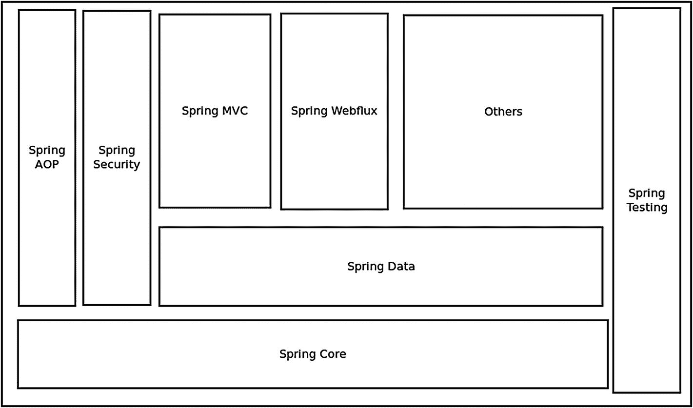

# 二、概览

Spring 最初是作为企业应用(如 J2EE 标准)的一种替代方案而出现的。通过允许配置*POJO*(普通的旧 Java 对象)而不是强制类扩展某个类或实现某个接口，它使得将框架与代码完全分离成为可能。

Spring 随着时间的推移不断成长和发展，是当今构建应用最流行的 Java 框架。

## 核心 Spring

Core Spring 包括 Spring 的依赖注入(DI)框架和配置。DI 设计模式是一种将依赖关系的细节具体化的方式，允许它们被注入。这一点，再加上接口的使用，允许您解耦代码，并使软件更易于管理和扩展。DI 是*反转控制* (IoC)的一个子集，其中应用的流程被反转或颠倒。

Core Spring 提供了 Spring 容器，主要是接口`BeanFactory`及其子接口`ApplicationContext`的实现。`ApplicationContext`有很多种实现方式，使用哪一种取决于应用的类型。大多数时候，你的应用代码不需要知道`BeanFactory`或`ApplicationContext`的具体类型；每个应用只应定义一次。

图 2-1

WebApplicationContext 的简化类图

ApplicationContext 提供了用于访问应用组件的 Bean 工厂方法(从`ListableBeanFactory interface)`继承而来)、以通用方式加载文件资源的能力、向注册的侦听器发布事件的能力(从`ApplicationEventPublisher`接口继承而来)、解析支持国际化的消息的能力(从`MessageSource`接口继承而来)以及从父 ApplicationContext 继承而来的可能性。ApplicationContext 有许多不同的子类，其中一个是 WebApplicationContext，顾名思义，它对 web 应用很有用。

POJO 中的 Beans 可以通过三种方式之一进行配置:XML、在用@ `Configuration`注释的配置 Java 类中用@ `Bean`注释的方法，或者在使用组件扫描时，可以在 POJO 类本身上添加一个注释，如@ `Component`或@ `Service`。最推荐的方法是对基础设施使用一个或多个 Java 配置类，对业务类使用组件扫描。

## Spring 模块

Spring 有许多模块，根据应用的需要，可以包含或不包含这些模块。以下是 Spring 保护伞下的一些模块和项目:

*   面向切面编程(AOP)——通过运行时代码交织实现横切关注点。

*   spring Security——认证和授权，支持一系列标准、协议、工具和实践的可配置安全性。

*   spring Data——使用 Java 数据库连接(JDBC)、对象关系映射(orm)工具、反应式关系数据库连接(R2DBC)和 NoSQL 数据库，在 Java 平台上使用关系数据库管理系统的模板和工具。

*   核心——控制容器的反转、应用组件的配置和 Beans 的生命周期管理。

*   消息传递——注册消息侦听器对象，以实现透明的消息消费，并通过多个传输层(包括 Java 消息服务(JMS)、AMQP、Kafka 等)向/从消息队列发送消息。

*   Spring MVC(模型-视图-控制器)——一个基于 HTTP 和 servlet 的框架，为 web 应用和 RESTful(表述性状态转移)web 服务的扩展和定制提供钩子。

*   事务管理——统一多个事务管理 API，协调支持 JTA 和 JXA 的事务。

*   测试——支持编写单元测试和集成测试的类，比如 Spring MVC Test，它支持测试 Spring MVC 应用的控制器。

*   Spring Boot——简化应用开发的配置框架公约。它包括自动配置，并具有“初始”依赖项，包括许多开源依赖项和每个依赖项的兼容版本。

*   spring web flux——一个使用反应流规范的反应式 web 框架，可以在 Netty、Tomcat 或 Jetty 上运行(使用 Servlet 3.0 异步线程)。

图 2-2

Spring 模块