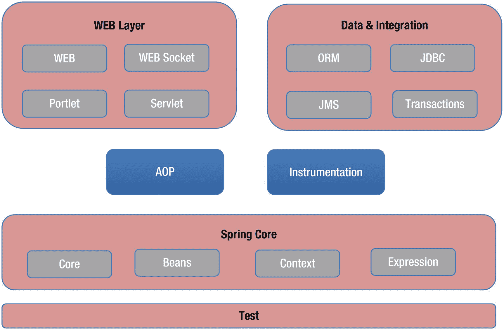
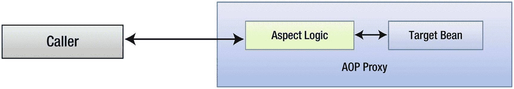
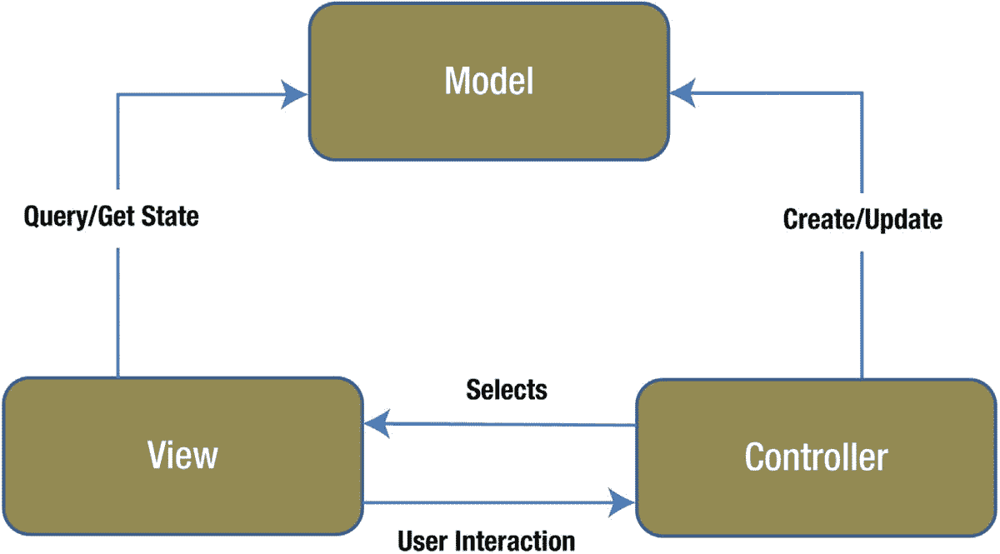
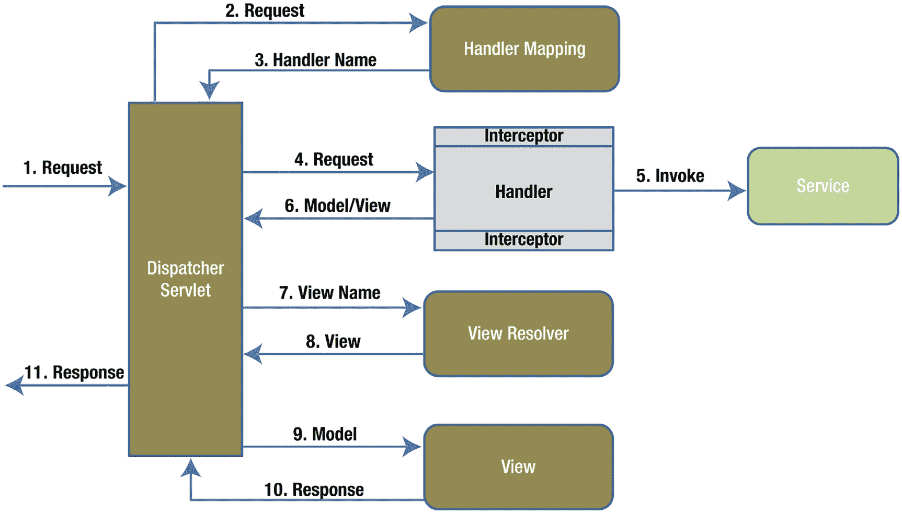

# 二、Spring Web MVC 入门

在本章中，我们将讨论以下内容:

*   Spring及其特征

*   模型视图控制器模式

*   Spring Web MVC 及其组件

Java 生态系统中充满了诸如 Jersey 和 RESTEasy 之类的框架，它们允许您开发 REST 应用。Spring web MVC 就是这样一个流行的 Web 框架，它简化了 Web 和 REST 应用的开发。我们从 Spring 框架的概述开始这一章，并深入探究 Spring Web MVC 及其组件。

Note

这本书没有给出 Spring 和 Spring Web MVC 的全面概述。参考 *Pro Spring* 和 *Pro Spring MVC 和 WebFlux* (均由 Apress 出版)对这些概念的详细处理。

## 春季概览

Spring 框架已经成为构建基于 Java/Java EE 的企业应用的事实标准。Spring 框架最初由 Rod Johnson 在 2002 年编写，是 Pivotal Software Inc .([`http://spring.io`](http://spring.io))拥有和维护的项目套件之一。除此之外，Spring 框架还提供了一个依赖注入模型 <sup>[1](#Fn1)</sup> 来减少应用开发的管道代码，支持面向方面编程(AOP)来实现横切关注点，并使其易于与其他框架和技术集成。Spring 框架由不同的模块组成，这些模块提供数据访问、工具、消息传递、测试和 web 集成等服务。不同的弹簧框架模块及其分组如图 [2-1](#Fig1) 所示。



图 2-1

Spring 框架模块

作为开发人员，您不必被迫使用 Spring 框架提供的所有东西。Spring 框架的模块化允许您根据您的应用需求挑选模块。在本书中，我们将重点介绍用于开发 REST 服务的 web 模块。此外，我们将使用一些其他的 Spring portfolio 项目，比如 Spring Data、Spring Security 和 Spring Boot。这些项目建立在 Spring 框架模块提供的基础设施之上，旨在简化数据访问、认证/授权和 Spring 应用创建。

开发基于 Spring 的应用需要彻底理解两个核心概念——依赖注入和面向方面编程。

### 依赖注入

Spring 框架的核心是依赖注入(DI)。顾名思义，依赖注入允许依赖被*注入*到需要它们的组件中。这使得这些组件不必创建或定位它们的依赖关系，从而允许它们松散耦合。

为了更好地理解 DI，考虑在在线零售店购买产品的场景。完成购买通常是使用一个组件来实现的，比如 OrderService。OrderService 本身将与一个 OrderRepository 交互，这个 order repository 将在数据库中创建订单详细信息，并与一个 NotificationComponent 交互，这个 notification component 将向客户发送订单确认。在传统实现中，OrderService 创建(通常在其构造函数中)OrderRepository 和 NotificationComponent 的实例并使用它们。尽管这种方法没有任何问题，但它会导致难以维护、难以测试和高度耦合的代码。

相反，DI 允许我们在处理依赖关系时采取不同的方法。使用 DI，您可以让 Spring 之类的外部进程创建依赖项，管理依赖项，并将这些依赖项注入到需要它们的对象中。因此，使用 DI，Spring 将创建 OrderRepository 和 NotificationComponent，然后将这些依赖项交给 OrderService。这使得 OrderService 不必处理 order repository/notification component 的创建，从而更容易测试。它允许每个组件独立发展，使得开发和维护更加容易。此外，它使不同的实现交换这些依赖关系或在不同的上下文中使用这些组件变得更加容易。

### 面向方面编程

面向方面编程(AOP)是一种实现横切逻辑或关注点的编程模型。日志、事务、度量和安全性是跨越(横切)应用不同部分的关注点的一些例子。这些关注点不处理业务逻辑，并且经常在应用中重复。AOP 提供了一种被称为*方面*的标准化机制，用于将这样的关注封装在一个单独的位置。然后这些方面被*编织*到其他对象中，这样横切逻辑就会自动应用到整个应用中。

Spring 通过它的 Spring AOP 模块提供了一个纯基于 Java 的 AOP 实现。Spring AOP 不需要任何特殊的编译，也不需要改变类装入器的层次结构。相反，Spring AOP 使用代理在运行时将方面编织到 Spring beans 中。图 [2-2](#Fig2) 展示了这种行为。当目标 bean 上的某个方法被调用时，代理会截获该调用。然后，它应用方面逻辑并调用目标 bean 方法。



图 2-2

Spring AOP 代理

Spring 提供了双代理实现——JDK 动态代理和 CGLIB 代理。如果目标 bean 实现了一个接口，Spring 将使用 JDK 动态代理来创建 AOP 代理。如果这个类没有实现接口，Spring 使用 CGLIB 来创建一个代理。

你可以在官方文档中了解更多关于 JDK 动态代理: [`https://docs.oracle.com/javase/8/docs/technotes/guides/reflection/proxy.html`](https://docs.oracle.com/javase/8/docs/technotes/guides/reflection/proxy.html)

## Spring Web MVC 概述

Spring web MVC 是 Spring 框架的 Web 模块的一部分，是构建基于 Web 的应用的流行技术。它基于模型-视图-控制器架构，并提供了丰富的注释和组件集。多年来，该框架不断演变；它目前提供了一组丰富的配置注释和特性，比如灵活的视图分辨率和强大的数据绑定。

### 模型视图控制器模式

模型视图控制器(MVC)是一种用于构建解耦 web 应用的架构模式。该模式将 UI 层分解为以下三个组件:

*   模型—模型代表数据或状态。在基于 web 的银行应用中，代表帐户、事务和报表的信息是该模型的示例。

*   视图(view )-提供模型的可视化表示。这是用户通过提供输入和查看输出进行交互的内容。在我们的银行应用中，显示账户和事务的网页就是视图的例子。

*   控制器——控制器负责处理用户操作，如按钮点击。然后，它与服务或存储库交互来准备模型，并将准备好的模型交给适当的视图。

每个组件都有特定的职责。它们之间的相互作用如图 [2-3](#Fig3) 所示。交互从控制器准备模型并选择要呈现的适当视图开始。视图使用模型中的数据进行渲染。与视图的进一步交互被发送到控制器，控制器重新开始这个过程。



图 2-3

模型视图控制器交互

### Spring Web MVC 架构

Spring 的 Web MVC 实现围绕 dispatcher servlet——front controller 模式 <sup>[2](#Fn2)</sup> 的一个实现，作为处理请求的入口点。Spring Web MVC 的架构如图 [2-4](#Fig4) 所示。



图 2-4

Spring Web MVC 的架构

图 [2-4](#Fig4) 中的不同组件及其相互作用如下:

1.  交互从 DispatcherServlet 接收来自客户机的请求开始。

2.  DispatcherServlet 查询一个或多个 HandlerMapping，以找出可以为请求提供服务的处理程序。处理程序是对 Spring Web MVC 支持的控制器和其他基于 HTTP 的端点进行寻址的通用方式。

3.  HandlerMapping 组件使用请求路径来确定正确的处理程序，并将其传递给 DispatcherServlet。HandlerMapping 还确定了在处理程序执行之前(前)和之后(后)需要执行的拦截器列表。

4.  然后，DispatcherServlet 执行适当的预处理拦截器，并将控制传递给处理程序。

5.  处理程序与任何需要的服务进行交互，并准备模型。

6.  该处理程序还确定需要在输出中呈现的视图的名称，并将其发送给 DispatcherServlet。然后执行后进程拦截器。

7.  接下来是 DispatcherServlet 将逻辑视图名传递给 ViewResolver，后者确定并传递实际的视图实现。

8.  DispatcherServlet 然后将控制和模型传递给视图，视图生成响应。这个 ViewResolver 和视图抽象允许 DispatcherServlet 从特定的视图实现中分离出来。

9.  DispatcherServlet 将生成的响应返回给客户端。

### Spring Web MVC 组件

在上一节中，向您介绍了 Spring Web MVC 组件，如 HandlerMapping 和 ViewResolver。在这一节中，我们将更深入地了解这些以及其他的 Spring Web MVC 组件。

Note

在本书中，我们将使用 Java 配置来创建 Spring beans。与基于 XML 的配置相反，Java 配置提供了编译时安全性、灵活性和额外的功能/控制。

#### 控制器

Spring Web MVC 中的控制器是使用原型`org.springframework.stereotype.Controller`声明的。Spring 中的原型指定了类或接口的角色或职责。清单 [2-1](#PC1) 显示了一个基本的控制器。

```java
@Controller
public class HomeController {
        @GetMapping("/home.html")
        public String showHomePage() {
                return "home";
        }
}

Listing 2-1HomeController Implementation

```

`@Controller`注释将`HomeController`类指定为 MVC 控制器。@GetMapping 是一个复合注释，充当@ request mapping(method = request method)的快捷方式。获取)。@GetMapping 批注将 web 请求映射到处理程序类和处理程序方法。在这种情况下，@GetMapping 指示当发出对`home.html`的请求时，应该执行`showHomePage`方法。`showHomePage`方法有一个很小的实现，只是返回逻辑视图名`home`。在这个例子中，这个控制器没有准备任何模型。

#### 模型

Spring 提供了`org.springframework.ui.Model`接口，作为模型属性的持有者。清单 [2-2](#PC2) 显示了带有可用方法的`Model`接口。顾名思义，`addAttribute`和`addAttributes`方法可以用来给模型对象添加属性。

```java
public interface Model {

        Model addAttribute(String attributeName, Object attributeValue);

        Model addAttribute(Object attributeValue);

        Model addAllAttributes(Collection<?> attributeValues);

        Model addAllAttributes(Map<String, ?> attributes);

        Model mergeAttributes(Map<String, ?> attributes);

        boolean containsAttribute(String attributeName);

        Map<String, Object> asMap();

        Object getAttribute(String attributeName);

}

Listing 2-2Model Interface

```

控制器处理模型对象最简单的方法是将其声明为方法参数。清单 [2-3](#PC3) 显示了带有模型参数的`showHomePage`方法。在方法实现中，我们向模型对象添加了`currentDate`属性。

```java
@GetMapping("/home.html")
public String showHomePage(Model model) {
        model.addAttribute("currentDate", new Date());
        return "home";
}

Listing 2-3showHomePage with Model Attribute

```

Spring 框架努力将我们的应用从框架的类中分离出来。因此，处理模型对象的一种流行方法是使用清单 [2-4](#PC4) 中所示的`java.util.Map`实例。Spring 将使用传入的 Map 参数实例来丰富暴露给视图的模型。

```java
@GetMapping("/home.html")
public String showHomePage(Map model) {
        model.put("currentDate", new Date());
        return "home";
}

Listing 2-4showHomePage with Map Attribute

```

#### 视角

Spring Web MVC 支持多种视图技术，比如 JSP、Velocity、FreeMarker 和 XSLT。Spring Web MVC 使用`org.springframework.web.servlet.View`接口来完成这个任务。`View`接口有两个方法，如清单 [2-5](#PC5) 所示。

```java
public interface View
{
        String getContentType();

        void render(Map<String, ?> model, HttpServletRequest request, HttpServletResponse response) throws Exception;
}

Listing 2-5View Interface API

```

接口的具体实现负责呈现响应。这是通过覆盖`render`方法来实现的。`getContentType`方法返回生成的视图的内容类型。表 [2-1](#Tab1) 展示了 Spring Web MVC 提供的开箱即用的重要`View`实现。您会注意到所有这些实现都驻留在`org.springframework.web.servlet.view`包中。

表 2-1

Spring Web MVC 视图实现

<colgroup><col class="tcol1 align-left"> <col class="tcol2 align-left"></colgroup> 
| 

类别名

 | 

描述

 |
| --- | --- |
| `org.springframework.web.servlet.view.json.MappingJackson2JsonView` | 查看编码模型属性并返回 JSON 的实现 |
| `org.springframework.web.servlet.view.xslt.XsltView` | 查看执行 XSLT 转换并返回响应的实现 |
| `org.springframework.web.servlet.view.InternalResourceView` | 将请求委托给 web 应用内部的 JSP 页面的视图实现 |
| `org.springframework.web.servlet.view.tiles2.TilesView` | 使用 Apache Tiles 配置进行图块定义和渲染的视图实现 |
| `org.springframework.web.servlet.view.JstlView` | 使用 JSTL 支持 JSP 页面的`InternalResourceView`的专门实现 |
| `org.springframework.web.servlet.view.RedirectView` | 查看重定向到不同(绝对或相对)URL 的实现 |

清单 [2-6](#PC6) 显示了我们之前看到的`HomeController`的重新实现。这里我们创建了一个`JstlView`的实例，并设置了需要呈现的 JSP 页面。

```java
@Controller
public class HomeController {
        @RequestMapping("/home.html")
        public View showHomePage() {
                JstlView view = new JstlView();
                view.setUrl("/WEB-INF/pages/home.jsp");
                return view;
        }
}

Listing 2-6HomeController View Implementation

```

控制器实现通常不处理视图实例。相反，它们返回逻辑视图名，如清单 [2-1](#PC1) 所示，并让视图解析器确定和创建视图实例。这将控制器与特定的视图实现解耦，并使交换视图实现变得容易。此外，控制器不再需要知道错综复杂的情况，如视图的位置。

#### @RequestParam(请求参数)

`@RequestParam`注释用于将 Servlet 请求参数绑定到处理程序/控制器方法参数。使用类型转换将请求参数值自动转换为指定的方法参数类型。清单 [2-7](#PC7) 展示了`@RequestParam`的两种用法。在第一种用法中，Spring 查找名为`query`的请求参数，并将其值映射到方法参数`query`。在第二种用法中，Spring 查找名为`page`的请求参数，将其值转换为整数，并将其映射到`pageNumber`方法参数。

```java
@GetMapping("/search.html")
public String search(@RequestParam String query, @RequestParam("page") int pageNumber) {
        model.put("currentDate", new Date());
        return "home";
}

Listing 2-7RequestParam Usage

```

当使用`@RequestParam`注释方法参数时，指定的请求参数必须在客户机请求中可用。如果参数丢失，Spring 将抛出一个`MissingServletRequestParameterException`异常。解决这个问题的一个方法是将`required`属性设置为`false`，如清单 [2-8](#PC8) 所示。另一个选项是使用`defaultValue`属性来指定一个默认值。

```java
@GetMapping("/search.html")
public String search(@RequestParam String query, @RequestParam(value="page", required=false) int pageNumber, @RequestParam(value="size", defaultValue="10") int pageSize) {
        model.put("currentDate", new Date());
        return "home";
}

Listing 2-8Making a Request Parameter Not Required

```

#### @RequestMapping

正如我们在“控制器”一节中了解到的,`@RequestMapping`注释用于将 web 请求映射到处理程序类或处理程序方法。`@RequestMapping`提供了几个属性，可以用来缩小这些映射的范围。表 [2-2](#Tab2) 显示了不同的元素及其描述。

表 2-2

请求映射元素

<colgroup><col class="tcol1 align-left"> <col class="tcol2 align-left"></colgroup> 
| 

元素名称

 | 

描述

 |
| --- | --- |
| 方法 | 将映射限制为特定的 HTTP 方法，如 GET、POST、HEAD、OPTIONS、PUT、PATCH、DELETE、TRACE |
| 生产 | 将映射缩小到由该方法生成的媒体类型 |
| 消耗 | 将映射缩小到方法使用者的媒体类型 |
| 头球 | 将映射缩小到应该出现的标题 |
| 名字 | 允许您为映射指定名称 |
| 参数 | 将映射限制为所提供的参数名和值 |
| 价值 | 特定处理程序方法的缩小路径(如果没有任何元素，缺省值是 main 元素) |
| 小路 | 特定处理程序方法的缩小路径(值的别名) |

`@RequestMapping`映射的默认 HTTP 方法是 GET。使用清单 [2-9](#PC9) 中所示的`method`元素可以改变这种行为。只有在执行 POST 操作时，Spring 才会调用`saveUser`方法。对`saveUser`的 GET 请求将导致抛出异常。Spring 提供了一个方便的`RequestMethod`枚举，列出了可用的 HTTP 方法。

```java
@RequestMapping(value="/saveuser.html", method=RequestMethod.POST)
public String saveUser(@RequestParam String username, @RequestParam String password) {
        // Save User logic
        return "success";
}

Listing 2-9POST Method Example

```

#### @RequestMapping 快捷方式批注

您可以对@RequestMapping 使用“快捷方式注释”。

它看起来可读性更好，因为您可以使用“快捷方式注释”来代替@RequestMapping。

所有快捷方式批注都从@RequestMapping 继承所有元素，不使用方法，因为方法已经在批注的标题中。

比如@GetMapping 和@RequestMapping(method = `RequestMethod.GET`)完全一样。

表 2-3

@RequestMapping 的快捷批注

<colgroup><col class="tcol1 align-left"> <col class="tcol2 align-left"></colgroup> 
| 

注释

 | 

更换

 |
| --- | --- |
| @GetMapping | @RequestMapping(method = `RequestMethod.GET)` |
| @PostMapping | @RequestMapping(method = `RequestMethod.POST)` |
| @PutMapping | @RequestMapping(method = `RequestMethod.PUT)` |
| @DeleteMapping | @RequestMapping(method = `RequestMethod.DELETE)` |
| @补丁映射 | @RequestMapping(method = `RequestMethod.PATCH)` |

`produces`元素表示映射方法产生的媒体类型，比如 JSON 或 XML 或 HTML。`produces`元素可以将一个或多个媒体类型作为它的值。清单 [2-10](#PC10) 显示了添加了`produces`元素的`search`方法。`MediaType.TEXT_HTML`值表示当在搜索`.html`上执行 GET 请求时，该方法返回一个 HTML 响应。

```java
@GetMapping(value="/search.html", produces="MediaType.TEXT_HTML")
public String search(@RequestParam String query, @RequestParam(value="page", required=false) int pageNumber) {
        model.put("currentDate", new Date());
        return "home";
}

Listing 2-10Produces Element Example

```

客户端可能在`/search.html`上执行 GET 请求，但是发送一个带有值`application/JSON`的`Accept`报头。在这种情况下，Spring 不会调用`search`方法。相反，它将返回 404 错误。`produces`元素提供了一种方便的方式来限制控制器可以服务的内容类型的映射。同样，`consumes`元素用于指示带注释的方法所使用的媒体类型。

Accept and Content-Type Header

正如在第 [1](01.html) 章中所讨论的，REST 资源可以有多种表现形式。REST 客户端通常使用`Accept`和`Content-Type`头来处理这些表示。

REST 客户端使用`Accept`头来表示它们接受的表示。HTTP 规范允许客户端发送不同媒体类型的优先列表，它将接受这些媒体类型作为响应。收到请求后，服务器将发送优先级最高的表示。为了理解这一点，考虑 Firefox 浏览器的默认`Accept`头:

```java
text/html,application/xhtml+xml,application/xml;q=0.9,*/*;q=0.8

```

`q`参数，也称为相对质量参数，表示偏好程度，取值范围从 0 到 1。从字符串中，我们可以推断出 HTML 和 XHTML 的优先级为 1，因为它们没有关联的`q`值。XML 媒体类型的优先级为 0.9，其余表示的优先级为 0.8。在收到这个请求时，服务器会尝试发送一个 HTML/XHTML 表示，因为它具有最高的优先级。

以类似的方式，REST 客户机使用`Content-Type`头来指示发送到服务器的请求的媒体类型。这允许服务器正确地解释请求并正确地解析内容。如果服务器无法解析内容，它将发送 415 不支持的媒体类型错误状态代码。

Spring Web MVC 允许对用`@RequestMapping`注释的方法进行灵活的签名。这包括可变的方法参数和方法返回类型。表 [2-4](#Tab4) 列出了允许的重要参数。关于允许参数的详细列表，请参考 Spring 的 Javadocs at [`http://docs.spring.io/spring/docs/current/javadoc-api/org/springframework/web/bind/annotation/RequestMapping.html`](http://docs.spring.io/spring/docs/current/javadoc-api/org/springframework/web/bind/annotation/RequestMapping.html) 。

表 2-4

方法参数和描述

<colgroup><col class="tcol1 align-left"> <col class="tcol2 align-left"></colgroup> 
| 

方法参数

 | 

描述

 |
| --- | --- |
| `HttpServletRequest/HttpServletResponse` | HTTP Servlet 请求和响应对象。允许原始访问客户端数据，如请求参数和头。 |
| `HttpSession` | 实例，表示用户的 HTTP 会话。 |
| `Command object` | Spring 用用户提交的数据填充/绑定的 POJO 或模型对象。命令对象可以用`@ModelAttribute`注释。 |
| `BindingResult` | 实例，表示命令对象的验证和绑定。此参数必须紧接在命令对象之前。 |
| `HttpEntity<?>` | 表示 HTTP 请求的实例。每个`HttpEntity`由请求体和一组头组成。 |
| `Principal` | 一个代表经过身份验证的用户的`java.security.Principal`实例。 |

表 [2-5](#Tab5) 显示了用`@RequestMapping`标注的方法支持的不同返回类型。

表 2-5

退货类型和说明

<colgroup><col class="tcol1 align-left"> <col class="tcol2 align-left"></colgroup> 
| 

返回类型

 | 

描述

 |
| --- | --- |
| `String` | 表示逻辑视图名称。使用注册的视图解析器来解析物理视图，并生成响应。 |
| `View` | 表示视图的实例。在这种情况下，不执行视图解析，视图对象负责生成响应。例子包括`JstlView`、`VelocityView`、`RedirectView`等等。 |
| `HttpEntity<?>` | 表示 HTTP 响应的实例。每个`HttpEntity`由响应体和一组头组成。 |
| `HttpHeaders` | 实例捕获要返回的标头。响应将有一个空体。 |
| `Pojo` | 被认为是模型属性的 Java 对象。专门的`RequestToViewNameTranslator`用于确定适当的逻辑视图名称。 |

#### 路径变量

`@RequestMapping`注释通过 URI 模板支持动态 URIs。如第 [1](01.html) 章所述，URI 模板是带有占位符或变量的 URIs。`@PathVariable`注释允许您通过方法参数访问和使用这些占位符。清单 [2-11](#PC12) 给出了一个`@PathVariable`的例子。在这个场景中，`getUser`方法被设计为提供与路径变量`{username}`相关的用户信息。客户端将在 URL `/users/jdoe`上执行 GET，以检索与用户名`jdoe`相关联的用户信息。

```java
@RequestMapping("/users/{username}")
public User getUser(@PathVariable("username") String username) {
        User user = null;
        // Code to construct user object using username
        return user;
}

Listing 2-11PathVariable Example

```

#### 解析视图

如前所述，Spring Web MVC 控制器可以返回一个`org.springframework.web.servlet.View`实例或一个逻辑视图名。当返回一个逻辑视图名时，使用一个`ViewResolver`将视图解析为一个`View`实现。如果这个过程由于某种原因失败，就会抛出一个`javax.servlet.ServletException`。`ViewResolver`接口只有一个方法，如清单 [2-12](#PC13) 所示。

```java
public interface ViewResolver
{
        View resolveViewName(String viewName, Locale locale) throws Exception;
}

Listing 2-12ViewResolver Interface

```

表 [2-6](#Tab6) 列出了 Spring Web MVC 提供的一些`ViewResolver`实现。

你可能已经注意到，表 [2-6](#Tab6) 中不同的视图解析器模拟了我们之前看到的不同类型的视图。清单 [2-13](#PC14) 显示了创建`InternalViewResolver`所需的代码。

同样，清单 [2-13](#PC14) 显示了@Bean 注释——简而言之，在由@Configuration 注释的类中，由@Bean 定义的所有方法都将返回对象，这由 Spring Framework 控制，在帮助下，我们可以为一些对象定义行为，并在需要时使用@Inject 或@Autowired 注释调用任何地方的对象。默认情况下，Spring Framework 创建的每个对象都将被定义为一个@Bean。

表 2-6

ViewResolver 实现和描述

<colgroup><col class="tcol1 align-left"> <col class="tcol2 align-left"></colgroup> 
| 

返回类型

 | 

描述

 |
| --- | --- |
| `BeanNameViewResolver` | `ViewResolver`实现，查找 id 与`ApplicationContext`中的逻辑视图名称相匹配的 bean。如果它在`ApplicationContext`中没有找到 bean，则返回一个`null`。 |
| `InternalResourceViewResolver` | 寻找具有逻辑视图名称的内部资源。内部资源的位置通常是通过在逻辑名称前加前缀和后缀路径和扩展名信息来计算的。 |
| `ContentNegotiatingViewResolver` | 将视图解析委托给其他视图解析器。视图解析器的选择基于所请求的媒体类型，而媒体类型本身是使用 Accept 头、文件扩展名或 URL 参数来确定的。 |
| `TilesViewResolver` | `ViewResolver`在瓦片配置中寻找与逻辑视图名称匹配的模板。 |

```java
@Bean
public ViewResolver viewResolver() {
     InternalResourceViewResolver viewResolver = new InternalResourceViewResolver();
     viewResolver.setPrefix("/WEB-INF/jsp/");
     viewResolver.setSuffix(".jsp");
     return viewResolver;
}

Listing 2-13InternalViewResolver Example

```

#### 异常处理程序

异常是任何应用的一部分，Spring 提供了`HandlerExceptionResolver`机制来处理那些意外的异常。`HandlerExceptionResolver`抽象类似于`ViewResolver`,用于解决错误视图的异常。清单 [2-14](#PC15) 显示了`HandlerExceptionResolver` API。

```java
public interface HandlerExceptionResolver {
ModelAndView resolveException(HttpServletRequest request, HttpServletResponse response,
Object handler, Exception ex);
}

Listing 2-14HandlerExceptionResolver API

```

Spring 提供了几个现成的`HandlerExceptionResolver`实现，如表 [2-7](#Tab7) 所示。

表 2-7

HandlerExceptionResolver 实现和描述

<colgroup><col class="tcol1 align-left"> <col class="tcol2 align-left"></colgroup> 
| 

解析器实现

 | 

描述

 |
| --- | --- |
| `org.springframework.web.servlet.handler.SimpleMappingExceptionResolver` | 将异常类名映射到视图名的异常解析器实现。 |
| `org.springframework.web.servlet.mvc.support.DefaultHandlerExceptionResolver` | 异常解析器实现，将标准的 Spring 异常转换为 HTTP 状态代码。 |
| `org.springframework.web.servlet.mvc.annotation.ResponseStatusExceptionResolver` | Spring 应用中的自定义异常可以用`@ResponseStatus`进行注释，它将一个 HTTP 状态代码作为其值。这个异常解析器将异常转换为其映射的 HTTP 状态代码。 |
| `org.springframework.web.servlet.mvc.method.annotation.ExceptionHandlerExceptionResolver` | 使用带注释的`@ExceptionHandler`方法解决异常的异常解决器实现。 |

`SimpleMappingExceptionResolver`已经存在了很长时间。Spring 3 引入了一种使用`@ExceptionHandler`策略处理异常的新方法。这为处理基于 REST 的服务中的错误提供了一种机制，在这种情况下，实际上没有视图可显示，而是返回数据。清单 [2-15](#PC16) 显示了一个带有异常处理程序的控制器。任何现在在`HomeController`中抛出一个`SQLException`的方法都将在`handleSQLException`方法中得到处理。`handleSQLException`只是创建一个`ResponseEntity`实例并返回它。但是，可以执行额外的操作，如日志记录、返回额外的诊断数据等。

```java
@Controller
public class HomeController {
        @ExceptionHandler(SQLException.class)
        public ResponseEntity handleSQLException() {
ResponseEntity responseEntity = new ResponseEntity(HttpStatus.INTERNAL_SERVER_ERROR);
                return responseEntity;
        }

        @GetMapping("/stream")
        public void streamMovie(HttpServletResponse response) throws SQLException {

        }
}

Listing 2-15ExceptionHandler Example

```

带注释的方法只能处理发生在控制器或其子类中的异常。因此，如果我们需要在其他控制器中处理 SQL 异常，那么我们需要在所有这些控制器中复制并粘贴`handleSQLException`方法。这种方法有严重的局限性，因为异常处理确实是一个横切关注点，应该是集中的。

为了解决这个问题，Spring 提供了`@ControllerAdvice`注释。用`@ControllerAdvice`标注的类中的方法应用于所有的`@RequestMapping`方法。清单 [2-16](#PC17) 显示了使用`handleSQLException`方法的`GlobalExceptionHandler`。正如您所看到的，`GlobalExceptionHandler`扩展了 Spring 的`ResponseEntityExceptionHandler`，它将默认的 Spring Web MVC 异常转换为带有 HTTP 状态代码的`ResponseEntity`。

```java
@ControllerAdvice
public class GlobalExceptionHandler extends ResponseEntityExceptionHandler {

        @ExceptionHandler(SQLException.class)
        public ResponseEntity handleSQLException() {
ResponseEntity responseEntity = new ResponseEntity(HttpStatus.INTERNAL_SERVER_ERROR);
                return responseEntity;
        }
}

Listing 2-16GlobalExceptionHandler Example

```

#### 截击机

Spring Web MVC 提供了拦截器的概念来实现横切不同处理程序的关注点。考虑这样一个场景，您希望阻止对一组控制器的未经身份验证的访问。拦截器允许您集中这种访问逻辑，而不必在每个控制器中复制和粘贴代码。顾名思义，拦截器拦截一个请求；他们这样做是基于以下三点:

*   在控制器被执行之前。这允许拦截器决定它是需要继续执行链还是返回一个异常或自定义响应。

*   在控制器执行之后，但在响应发出之前。这允许拦截器向视图提供任何额外的模型对象。

*   在响应发出后，允许任何资源清理。

Note

Spring Web MVC 拦截器类似于 HTTP servlet 过滤器。两者都可以用来拦截请求和执行常见的问题。但是，它们之间有一些值得注意的差异。过滤器能够包装甚至交换`HttpServletRequest`和`HttpServletResponse`对象。拦截器不能修饰或交换那些对象。拦截器是 Spring 管理的 bean，我们可以很容易地在其中注入其他 spring beans。筛选器是容器管理的实例；它们没有提供注入 Spring 管理的 beans 的直接机制。

Spring Web MVC 为实现拦截器提供了`HandlerInterceptor`接口。清单 [2-17](#PC18) 给出了`HandlerInterceptor`接口。如您所见，这三个方法对应于我们刚刚讨论的三个拦截器特性。

```java
public interface HandlerInterceptor{
    void afterCompletion(HttpServletRequest request, HttpServletResponse response, Object handler, Exception ex);
    void postHandle(HttpServletRequest request, HttpServletResponse response, Object handler, ModelAndView modelAndView);
    boolean preHandle(HttpServletRequest request, HttpServletResponse response, Object handler);
}

Listing 2-17HandlerInterceptor API

```

清单 [2-18](#PC19) 给出了一个简单的拦截器实现。如您所见，`SimpleInterceptor`类扩展了`HandlerInterceptorAdapter`。`HandlerInterceptorAdapter`是一个方便的抽象类，它实现了`HandlerInterceptor`接口并提供了其方法的默认实现。

```java
public class SimpleInterceptor extends HandlerInterceptorAdapter {
        private static final Logger logger = Logger.getLogger(SimpleInterceptor.class);

public boolean preHandle(HttpServletRequest request, HttpServletResponse response, Object handler) throws Exception {
        logger.info("Inside the prehandle");

        return false;
    }
}

Listing 2-18Spring Web MVC Interceptor Example

```

拦截器可以使用`InterceptorRegistry`策略在 Spring Web 应用中注册。当使用 Java 配置时，这通常是通过创建一个扩展`WebMvcConfigurerAdapter`的配置类来实现的。Spring Web MVC 的`WebMvcConfigurerAdapter`类提供了用于访问`InterceptorRegistry`的`addInterceptors`方法。清单 [2-19](#PC20) 显示了注册两个拦截器的代码:`LocalInterceptor`，它与 Spring 和我们的`SimpleInterceptor`一起出现。

```java
@Configuration
@EnableWebMvc
@ComponentScan(basePackages = { "com.apress.springrest.web" })
public class WebConfig extends WebMvcConfigurerAdapter {

    @Override
    public void addInterceptors(InterceptorRegistry registry) {
        registry.addInterceptor(new LocaleChangeInterceptor());
        registry.addInterceptor(new SimpleInterceptor()).addPathPatterns("/auth/**");
    }
}

Listing 2-19Example Registering Interceptors

```

当拦截器被添加到拦截器注册中心时，拦截器被应用到所有的处理程序映射。因此，清单 [2-19](#PC20) 中的`LocaleChangeInterceptor`应用于所有的处理程序映射。然而，也可以将拦截器限制在某些 URL 上。这在清单 [2-19](#PC20) 中使用`addPathPatterns`方法进行了演示。这里我们指出`SimpleInterceptor`应该只应用于在`auth`路径下的 URL。

## 摘要

在这一章中，我们已经了解了 Spring 框架的基础和 Spring Web MVC 的不同组件。在下一章，我们将把所有的东西放在一起，看看如何使用 Spring Boot 构建我们的第一个 RESTful 应用。

<aside aria-label="Footnotes" class="FootnoteSection" epub:type="footnotes">Footnotes [1](#Fn1_source)

[T0](http://martinfowler.com/articles/injection.html)T1】

  [2](#Fn2_source)

[T0](http://www.oracle.com/technetwork/java/frontcontroller-135648.html)T1】

 </aside>