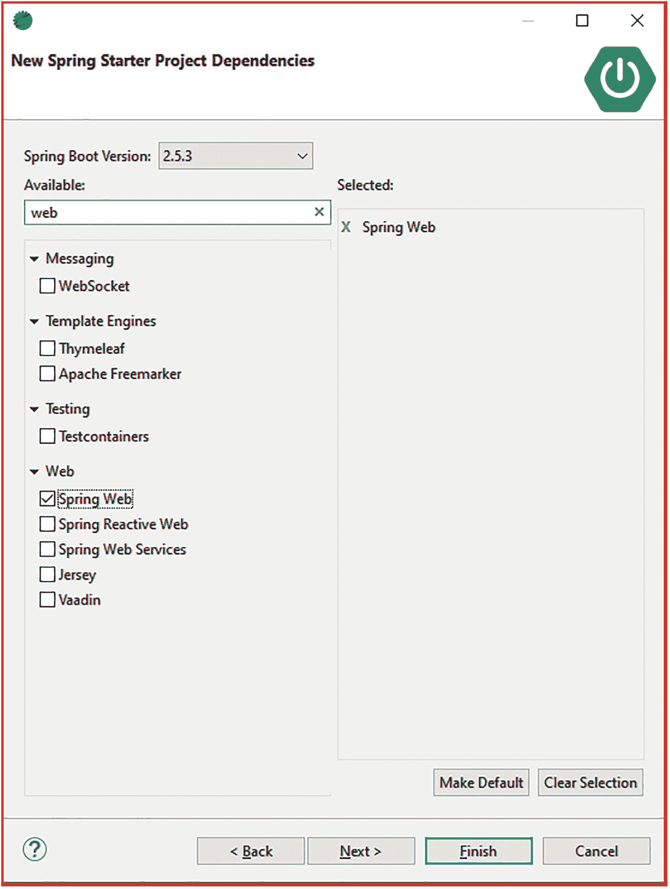

# 三、REST Spring

在本章中，我们将讨论以下内容:

*   Spring Boot 的基本情况

*   构建 Hello World REST 应用

*   访问 REST 应用的工具

Spring 框架的目标之一是减少管道代码，以便开发人员可以集中精力实现核心业务逻辑。然而，随着 Spring 框架的发展，并向其投资组合中添加了几个子项目，开发人员最终花费了相当多的时间来设置项目、寻找项目依赖关系以及编写模板代码和配置。

Spring Boot 是一个 Spring portfolio 项目，旨在通过提供一组 starter 项目模板来简化 Spring 应用的引导。这些将根据项目能力提取所有需要的适当的依赖关系。例如，如果您启用 JPA 功能，它会自动包含所有相关的 JPA、Hibernate 和 Spring JAR 文件。

Spring Boot 还采用了一种固执己见的方法，并提供了默认配置，这大大简化了应用的开发。例如，如果 Spring Boot 在类路径中找到 JPA 和 MySQL JARs，它会自动配置一个 JPA 持久性单元。它还支持使用嵌入式 Jetty/Tomcat 服务器创建独立的 Spring 应用，使它们易于部署在任何只安装了 Java 的机器上。此外，它还提供了生产就绪功能，如指标和运行状况检查。通过这本书，我们将探索和学习 Spring Boot 的这些和其他特点。

Note

Spring Roo 是另一个 Spring portfolio 项目，试图提供快速的 Spring 应用开发。它提供了一个命令行工具，支持简单的项目引导，并为 JPA 实体、web 控制器、测试脚本和必要的配置等组件生成代码。尽管最初对这个项目有很多兴趣，但 Spring Roo 从未真正成为主流。AspectJ 代码生成和陡峭的学习曲线，再加上它试图接管你的项目，是它没有被采用的一些原因。相比之下，Spring Boot 采取了不同的方法；它侧重于启动项目并提供聪明、合理的默认配置。Spring Boot 不会生成任何代码来简化项目管理。

## 生成 Spring Boot 项目

从头开始创建 Spring Boot 项目是可能的。但是，Spring Boot 提供了以下选项来生成新项目:

*   使用 Spring Boot 的入门网站( [`http://start.spring.io`](http://start.spring.io) )。

*   使用 Spring 工具套件(STS) IDE。

*   使用引导命令行界面(CLI)。

我们将在本章探讨所有三种选择。然而，对于本书的其余部分，我们将选择 Boot CLI 来生成新项目。在我们开始项目生成之前，在您的机器上安装 Java 是很重要的。Spring Boot 要求您安装 Java SDK 1.8 或更高版本。在本书中，我们将使用 Java 1.8。

### 安装构建工具

Spring Boot 支持两种最流行的构建系统:Maven 和 Gradle。在本书中，我们将使用 Maven 作为我们的构建工具。Spring Boot 需要 Maven 版本 3.5 或更高版本。这里给出了在 Windows 机器上下载和配置 Maven 的步骤。Mac 和其他操作系统的类似说明可以在 Maven 的安装页面上找到( [`https://maven.apache.org/install.html`](https://maven.apache.org/install.html) ):

1.  从 [`https://maven.apache.org/download.cgi`](https://maven.apache.org/download.cgi) 下载最新的 Maven 二进制。在写这本书的时候，Maven 的当前版本是 3.8.1。对于 Windows，下载`apache-maven-3.8.1-bin.zip`文件。

2.  解压`C:\tools\maven`下 zip 文件的内容。

3.  添加一个值为`C:\tools\maven\apache-maven-3.8.1`的环境变量`M2_HOME`。这告诉 Maven 和其他工具 Maven 安装在哪里。还要确保`JAVA_HOME`变量指向已安装的 JDK。

4.  将值`%M2_HOME%\bin`附加到`Path`环境变量中。这允许您从命令行运行 Maven 命令。

5.  打开一个新命令行，键入以下内容:

```java
mvn - v

```

您应该会看到类似图 3-1 的输出，表明 Maven 已经成功安装。


图 3-1

Maven 安装验证

Note

要了解更多关于 Maven 的信息，请参考 Apress ( [`http://www.apress.com/9781484208427`](http://www.apress.com/9781484208427) )出版的*介绍 Maven* 。

### 使用 start.spring.io 生成项目

Spring Boot 在 [`http://start.spring.io`](http://start.spring.io) 托管一个初始化应用。Initializr 提供了一个 web 界面，允许您输入项目信息并选择项目所需的功能，瞧——它将项目生成为一个 zip 文件。按照以下步骤生成我们的 Hello World REST 应用:


图 3-2

start.spring.io 网站

1.  在浏览器中启动 [`http://start.spring.io`](http://start.spring.io) 网站，输入如图 3-2 所示的信息。

1.  在 Dependencies ➤ Web 下，选择选项“Web ”,并指明您希望 Spring Boot 包含 Web 项目基础结构和依赖项。

2.  然后点击“生成项目”按钮。这将开始下载`hello-rest.zip`文件。

下载完成后，解压缩 zip 文件的内容。您将看到生成的`hello-rest`文件夹。图 3-3 显示生成的文件夹内容。


图 3-3

hello-rest 应用内容

快速浏览一下`hello-rest`的内容，可以看到我们有一个标准的基于 Maven 的 Java 项目布局。我们有`src\main\java`文件夹，存放 Java 源代码；`src\main\resources`，其中包含属性文件；静态内容，如 HTML\CSS\JS 文件；和包含测试用例的`src\test\java`文件夹。在运行 Maven 构建时，这个项目会生成一个 JAR 工件。现在，对于第一次使用 WAR 工件来部署 web 应用的人来说，这可能有点令人困惑。默认情况下，Spring Boot 创建独立的应用，其中所有的东西都打包到一个 JAR 文件中。这些应用将嵌入诸如 Tomcat 之类的 servlet 容器，并使用一种古老的`main()`方法来执行。

Note

Spring Boot 还允许您使用 WAR 工件，其中包含 html、css、js 和其他开发 web 应用所需的文件，这些应用可以部署到外部 Web 和应用容器中。

清单 3-1 给出了`hello-rest`应用的`pom.xml`文件的内容。

```java
<?xml version="1.0" encoding="UTF-8"?>
<project xmlns:="http://maven.apache.org/POM/4.0.0" xmlns:xsi="http://www.w3.org/2001/XMLSchema-instance"
      xsi:schemaLocation="http://maven.apache.org/POM/4.0.0 https://maven.apache.org/xsd/maven-4.0.0.xsd">
      <modelVersion>4.0.0</modelVersion>
      <parent>
            <groupId>org.springframework.boot</groupId>
            <artifactId>spring-boot-starter-parent</artifactId>
            <version>2.5.3</version>
            <relativePath/>
      </parent>
      <groupId>com.appress</groupId>
      <artifactId>hello-rest</artifactId>
      <version>0.0.1-SNAPSHOT</version>
      <name>Hello World REST</name>
      <description>Hello World REST Application Using Spring Boot</description>
      <properties>

            <java.version>1.8</java.version>
      </properties>
      <dependencies>
            <dependency>
                  <groupId>org.springframework.boot</groupId>
                  <artifactId>spring-boot-starter-web</artifactId>
            </dependency>
            <dependency>
                  <groupId>org.springframework.boot</groupId>
                  <artifactId>spring-boot-starter-test</artifactId>
                  <scope>test</scope>
            </dependency>
      </dependencies>
      <build>
            <plugins>
                  <plugin>
                        <groupId>org.springframework.boot</groupId>
                        <artifactId>spring-boot-maven-plugin</artifactId>
                  </plugin>
            </plugins>
      </build>
</project>
      </build>
</project>

Listing 3-1hello-rest pom.xml file Contents

```

`pom.xml`文件中的`groupId`、`artifactId`和`version`元素对应于 Maven 描述我们项目的标准 GAV 坐标。`parent`标签表明我们将从`spring-boot-starter-parent` POM 继承。这确保了我们的项目继承了 Spring Boot 的默认依赖项和版本。元素列出了两个 POM 文件依赖关系:`spring-boot-starter-web`和`spring-boot-starter-test`。Spring Boot 使用术语**starter POM**来描述这样的 POM 文件。

这些 starter POMs 用于提取其他依赖项，实际上不包含任何自己的代码。例如，`spring-boot-starter-web`提取 Spring MVC 依赖项、Tomcat 嵌入式容器依赖项和用于 JSON 处理的 Jackson 依赖项。这些 starter 模块在提供所需的依赖项和将应用的 POM 文件简化为几行代码方面起着重要的作用。表 3-1 列出了一些常用的启动器模块。

表 3-1

Spring Boot 起动机模块

<colgroup><col class="tcol1 align-left"> <col class="tcol2 align-left"></colgroup> 
| 

Starter POM 依赖项

 | 

使用

 |
| --- | --- |
| `spring-boot-starter` | 入门产品，引入了自动配置支持和日志记录等功能所必需的核心依赖项 |
| `spring-boot-starter-aop` | 引入面向方面编程和 AspectJ 支持的入门工具 |
| `spring-boot-starter-test` | Starter 引入了测试所需的依赖项，如 JUnit、Mockito 和`spring-test` |
| `spring-boot-starter-web` | 引入 MVC 依赖关系(`spring-webmvc`)和嵌入式 servlet 容器支持的启动程序 |
| `spring-boot-starter-data-jpa` | Starter 通过引入`spring-data-jpa`、`spring-orm,`和 Hibernate 依赖项来增加 Java 持久性 API 支持 |
| `spring-boot-starter-data-rest` | 引入`spring-data-rest-webmvc`将存储库公开为 REST API 的启动程序 |
| `spring-boot-starter-hateoas` | 为 HATEOAS REST 服务带来`spring-hateoas`依赖性的启动器 |
| `spring-boot-starter-jdbc` | 支持 JDBC 数据库的入门产品 |

最后，`spring-boot-maven-plugin`包含将应用打包成可执行的 JAR/WAR 并运行它的目标。

`HelloWorldRestApplication.java`类是我们应用的主类，包含了`main()`方法。清单 3-2 显示了`HelloWorldRestApplication.java`类的内容。`@SpringBootApplication`注释是一个方便的注释，相当于声明以下三个注释:

*   `@Configuration`—将带注释的类标记为包含一个或多个 Spring bean 声明。Spring 处理这些类来创建 bean 定义和实例。

*   `@ComponentScan`—这个类告诉 Spring 扫描并寻找用`@Component, @Service, @Repository, @Controller, @RestController, and @Configuration`标注的类。默认情况下，Spring 会扫描包中`@ComponentScan`注释类所在的所有类。为了覆盖默认行为，我们可以在 configuration 类中设置这个注释，并将 basePackages 参数定义为包的名称。

*   `@EnableAutoConfiguration`—启用 Spring Boot 的自动配置行为。基于在类路径中找到的依赖项和配置，Spring Boot 智能地猜测并创建 bean 配置。

典型的 Spring Boot 应用总是使用这三种注释。除了在这些场景中提供一个很好的选择外，`@SpringBootApplication`注释正确地表明了类的意图。

```java
package com.apress.hellorest;

import org.springframework.boot.SpringApplication;
import org.springframework.boot.autoconfigure.SpringBootApplication;

@SpringBootApplication
public class HelloWorldRestApplication {

    public static void main(String[] args) {
        SpringApplication.run(HelloWorldRestApplication.class, args);
    }
}

Listing 3-2HelloWorldRestApplication Contents

```

`main()`方法只是将应用引导委托给`SpringApplication`的`run()`方法。`run()`将一个`HelloWorldRestApplication.class`作为它的参数，并指示 Spring 从`HelloWorldRestApplication`读取注释元数据，并从中填充`ApplicationContext`。

现在我们已经查看了生成的项目，让我们创建一个 REST 端点，它只返回“Hello REST”理想情况下，我们应该在一个单独的控制器 Java 类中创建这个端点。然而，为了简单起见，我们将在`HelloWorldRestApplication`中创建端点，如清单 3-3 所示。我们从添加`@RestController`开始，表示`HelloWorldRestApplication`有可能的 REST 端点。然后我们创建了`helloGreeting()`方法，它简单地返回问候“Hello REST”最后，我们使用`RequestMapping`注释将对“`/greet`”路径的 web 请求映射到`helloGreeting()`处理程序方法。

```java
package com.apress.hellorest;

import org.springframework.boot.SpringApplication;
import org.springframework.boot.autoconfigure.SpringBootApplication;
import org.springframework.web.bind.annotation.RestController;
import org.springframework.web.bind.annotation.RequestMapping;

@SpringBootApplication
@RestController
public class HelloWorldRestApplication {

    public static void main(String args) {
        SpringApplication.run(HelloWorldRestApplication.class, args);
    }

    @GetMapping("/greet")
    public String helloGreeting() {
        return "Hello REST";
    }

}

Listing 3-3Hello REST Endpoint

```

下一步是启动并运行我们的应用。为此，打开命令行，导航到`hello-rest`文件夹，并运行以下命令:

```java
mvn spring-boot:run

```

您将看到 Maven 下载必要的插件和依赖项，然后它将启动应用，如下所示:

```java
  .   ____          _            __ _ _
 /\\ / ___'_ __ _ _(_)_ __  __ _ \ \ \ \
( ( )\___ | '_ | '_| | '_ \/ _` | \ \ \ \
 \\/  ___)| |_)| | | | | || (_| |  ) ) ) )
  '  |____| .__|_| |_|_| |_\__, | / / / /
 =========|_|==============|___/=/_/_/_/
[32m :: Spring Boot :: [39m              [2m (v2.5.3)[0;39m

[2m2021-08-12 21:54:43.147[0;39m [32m INFO[0;39m [35m15012[0;39m [2m---[0;39m [2m[         main][0;39m [36mc.a.hellorest.HelloWorldRestApplication [0;39m [2m:[0;39m Starting HelloWorldRestApplication using Java 1.8 on DESKTOP-82GK4GP with PID 15012 (C:\Users\makus\OneDrive\Desktop\hello-rest\target\classes started by makus in C:\Users\makus\OneDrive\Desktop\hello-rest)
[2m2021-08-12 21:54:43.149[0;39m [32m INFO[0;39m [35m15012[0;39m [2m---[0;39m [2m[         main][0;39m [36mc.a.hellorest.HelloWorldRestApplication [0;39m [2m:[0;39m No active profile set, falling back to default profiles: default
[2m2021-08-12 21:54:43.843[0;39m [32m INFO[0;39m [35m15012[0;39m [2m---[0;39m [2m[         main][0;39m [36mo.s.b.w.embedded.tomcat.TomcatWebServer [0;39m [2m:[0;39m Tomcat initialized with port(s): 8080 (http)
[2m2021-08-12 21:54:43.851[0;39m [32m INFO[0;39m [35m15012[0;39m [2m---[0;39m [2m[         main][0;39m [36mo.apache.catalina.core.StandardService  [0;39m [2m:[0;39m Starting service [Tomcat]
[2m2021-08-12 21:54:43.851[0;39m [32m INFO[0;39m [35m15012[0;39m [2m---[0;39m [2m[           main][0;39m [36morg.apache.catalina.core.StandardEngine [0;39m [2m:[0;39m Starting Servlet engine: [Apache Tomcat/9.0.50]
[2m2021-08-12 21:54:43.917[0;39m [32m INFO[0;39m [35m15012[0;39m [2m---[0;39m [2m[           main][0;39m [36mo.a.c.c.C.[Tomcat].[localhost].      [0;39m [2m:[0;39m Initializing Spring embedded WebApplicationContext
[2m2021-08-12 21:54:43.917[0;39m [32m INFO[0;39m [35m15012[0;39m [2m---[0;39m [2m[           main][0;39m [36mw.s.c.ServletWebServerApplicationContext[0;39m [2m:[0;39m Root WebApplicationContext: initialization completed in 734 ms

[2m2021-08-12 21:54:44.286[0;39m [32m INFO[0;39m [35m15012[0;39m [2m---[0;39m [2m[         main][0;39m [36mo.s.b.w.embedded.tomcat.TomcatWebServer [0;39m [2m:[0;39m Tomcat started on port(s): 8080 (http) with context path ''
[2m2021-08-12 21:54:44.297[0;39m [32m INFO[0;39m [35m15012[0;39m [2m---[0;39m [2m[         main]0;39m [36mc.a.hellorest.HelloWorldRestApplication [0;39m [2m:[0;39m Started HelloWorldRestApplication in 1.445 seconds (JVM running for 2.055)

```

为了测试我们正在运行的应用，启动浏览器并导航到`http://localhost:8080/greet`。注意，Spring Boot 作为`Root`上下文而不是`hello-world`上下文启动应用。你应该会看到一个类似于图 [3-4 的屏幕。


图 3-4

你好休息问候

Spring Initializr

位于 [`http://start.spring.io`](http://start.spring.io) 的 Spring Initializr 应用本身就是使用 Spring Boot 构建的。你可以在 GitHub 的 [`https://github.com/spring-io/initializr`](https://github.com/spring-io/initializr) 找到这个应用的源代码。您也可以构建并托管自己的 Initializr 应用实例。

除了提供 web 接口之外，Initializr 还提供了一个 HTTP 端点，该端点提供了类似的项目生成功能。事实上，Spring Boot 的 CLI 和诸如 STS 之类的 ide 在幕后使用这个 HTTP 端点来生成项目。

也可以使用 curl 从命令行调用 HTTP 端点。例如，下面的命令将使用 curl 生成`hello-rest`项目 zip 文件。`–d`选项用于提供作为请求参数传递的数据:

```java
curl https://start.spring.io/starter.zip -d style=web -d name=hello-rest

```

### 使用 STS 生成项目

Spring Tool Suite 或 STS 是一个免费的基于 Eclipse 的开发环境，它为开发基于 Spring 的应用提供了强大的工具支持。您可以从 Pivotal 的网站 [`https://spring.io/tools`](https://spring.io/tools) 下载并安装最新版本的 STS。在写这本书的时候，STS 的当前版本是 4.11.0。

STS 提供了一个类似于 Initializr 的 web 界面的用户界面，用于生成 Boot starter 项目。以下是生成 Spring Boot 项目的步骤:


图 3-5

STS 春季启动项目

1.  如果还没有启动 STS，请启动 STS。进入文件➤新建，点击 Spring Starter 项目，如图 3-5 所示。


图 3-6

起始项目选项

1.  在以下屏幕中，输入如图 3-6 所示的信息。输入 Maven 的 GAV 信息。点击下一个。



图 3-7

起始项目选项

1.  在以下屏幕中，输入如图 3-7 所示的信息。选择 web starter 选项。点击下一个。


图 3-8

起始项目位置

1.  在接下来的屏幕上，更改您想要存储项目的位置。“完整 Url”区域显示 HTTP REST 端点以及您选择的选项(参见图 3-8 )。


图 3-9

STS Spring starter 项目资源

1.  点击 Finish 按钮，您将看到在 STS 中创建了新的项目。项目的内容类似于我们之前创建的项目(参见图 3-9 )。

STS 的 starter 项目向导提供了一种生成新的 Spring Boot 项目的便捷方式。新创建的项目会自动导入到 IDE 中，并且可以立即用于开发。

### 使用 CLI 生成项目

Spring Boot 提供了一个命令行界面(CLI ),用于生成项目、构建原型和运行 Groovy 脚本。在开始使用 CLI 之前，我们需要安装它。以下是在 Windows 计算机上安装引导 CLI 的步骤:


图 3-10

Spring Boot CLI 目录

1.  从 Spring 的网站 [`https://docs.spring.io/spring-boot/docs/current/reference/html/getting-started.html#getting-started.installing.cli`](https://docs.spring.io/spring-boot/docs/current/reference/html/getting-started.html%2523getting-started.installing.cli) 下载最新版本的 CLI ZIP 发行版。在写这本书的时候，CLI 的当前版本是 2.5.3。这个版本可以直接从 [`https://repo.spring.io/release/org/springframework/boot/spring-boot-cli/2.5.3/spring-boot-cli-2.5.3-bin.zip`](https://repo.spring.io/release/org/springframework/boot/spring-boot-cli/2.5.3/spring-boot-cli-2.5.3-bin.zip) 下载。

2.  解压 zip 文件，将其内容(文件夹如`bin`、`lib`)放在`C:\tools\springbootcli`下，如图 3-10 所示。

1.  添加一个值为`c:\tools\springbootcli`的新环境变量`SPRING_HOME`。

2.  编辑`Path`环境变量，并在其末尾添加`%SPRING_HOME%/bin`值。

3.  打开一个新命令行，运行以下命令验证安装:

```java
spring --version

```

您应该会看到类似于图 3-10 所示的输出。


图 3-11

Spring Boot CLI 安装

现在我们已经安装了 Boot CLI，生成新项目只需在命令行运行以下命令:

```java
spring init --dependencies web rest-cli

```

该命令创建一个新的具有 web 功能的`rest-cli`项目。运行该命令的输出如清单 3-4 所示。

```java
C:\test>spring init --dependencies web rest-cli
Using service at https://start.spring.io
Project extracted to 'C:\test\rest-cli'

Listing 3-4Boot CLI Output

```

## 访问 REST 应用

有几个免费的和商业的工具允许您访问和试验 REST API/应用。在这一节中，我们将看看一些流行的工具，它们允许您快速测试请求并检查响应。

### 邮递员

Postman 是一个 Chrome 浏览器扩展，用于发出 HTTP 请求。它提供了大量的特性，使得开发、测试和记录 REST API 变得容易。还提供了一个 Chrome 应用版本的 Postman，它提供了浏览器扩展中不提供的额外功能，如批量上传。

可以从 Chrome 网上商店下载并安装 Postman。要安装 Postman，只需启动 Chrome 浏览器并导航至 [`https://chrome.google.com/webstore/detail/postman/fhbjgbiflinjbdggehcddcbncdddomop`](https://chrome.google.com/webstore/detail/postman/fhbjgbiflinjbdggehcddcbncdddomop) 。你可能会被要求登录你的谷歌浏览器账户，并使用“新应用”安装对话框进行确认。安装完成后，您应该能够使用书签栏中的“应用图标”或通过键入`chrome://apps/shortcut`来定位并启动 Postman。图 3-10 显示了在 Chrome 浏览器中启动的 Postman。

Postman 提供了一个简洁直观的用户界面，用于编写 HTTP 请求、将其发送到服务器以及查看 HTTP 响应。它还会自动保存请求，以便将来运行时使用。图 3-12 显示了向我们的问候服务发出的 HTTP GET 请求及其响应。您还可以在左侧边栏的 History 部分看到保存的请求。


图 3-12

邮递员浏览器扩展

Postman 很容易将相关的 API 调用逻辑分组到**集合**中，如图 3-12 所示。一个集合下可能有请求的子集合。


图 3-13

邮递员收藏

### 剩馀客户端

RESTClient 是一个 Firefox 扩展，用于访问 REST APIs 和应用。与 Postman 不同，RESTClient 没有太多花哨的功能，但它提供了快速测试 REST API 的基本功能。要安装 RESTClient，启动 Firefox 浏览器并导航到 URL [`https://addons.mozilla.org/en-US/firefox/addon/restclient/`](https://addons.mozilla.org/en-US/firefox/addon/restclient/) 。然后点击“+添加到 Firefox”按钮，在下面的“软件安装”对话框中，点击“立即安装”按钮。

安装完成后，您可以使用浏览器右上角的 RESTClient 图标启动 RESTClient。图 3-14 显示了 RESTClient 应用对我们的 Greet 服务的请求以及相应的响应。


图 3-14

剩馀客户端

## 摘要

Spring Boot 提供了一种自以为是的方法来构建基于 Spring 的应用。在这一章中，我们研究了 Spring Boot 的特性，并用它构建了一个 Hello World REST 应用。我们还研究了用于测试和探索 REST API 的 Postman 和 RESTClient 工具。

在下一章，我们将开始开发一个更复杂的 REST 应用，并讨论识别和设计资源的过程。