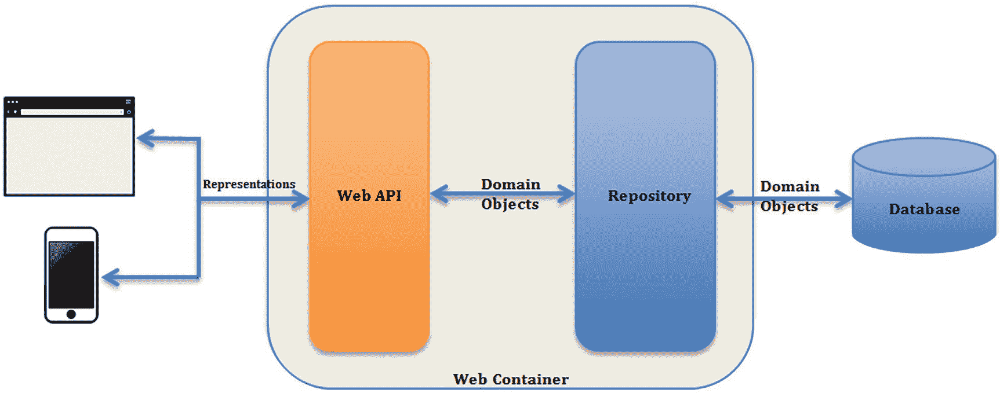
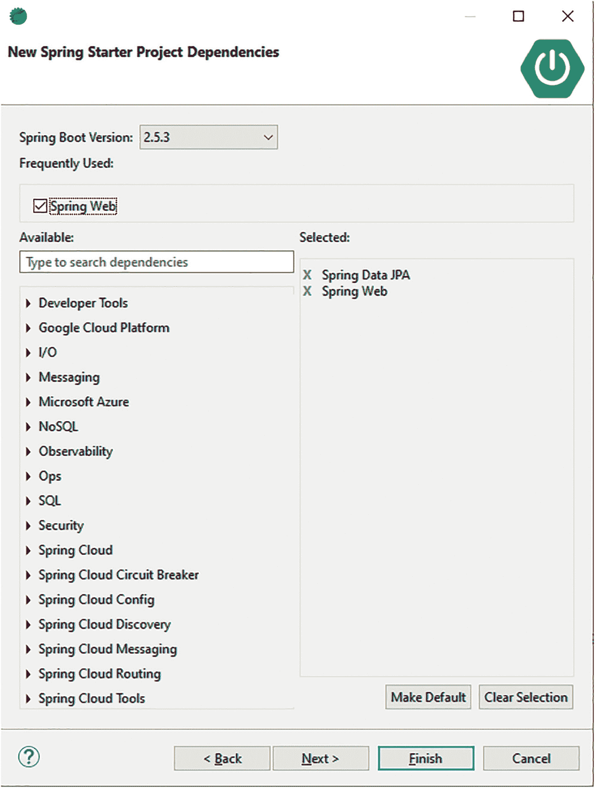
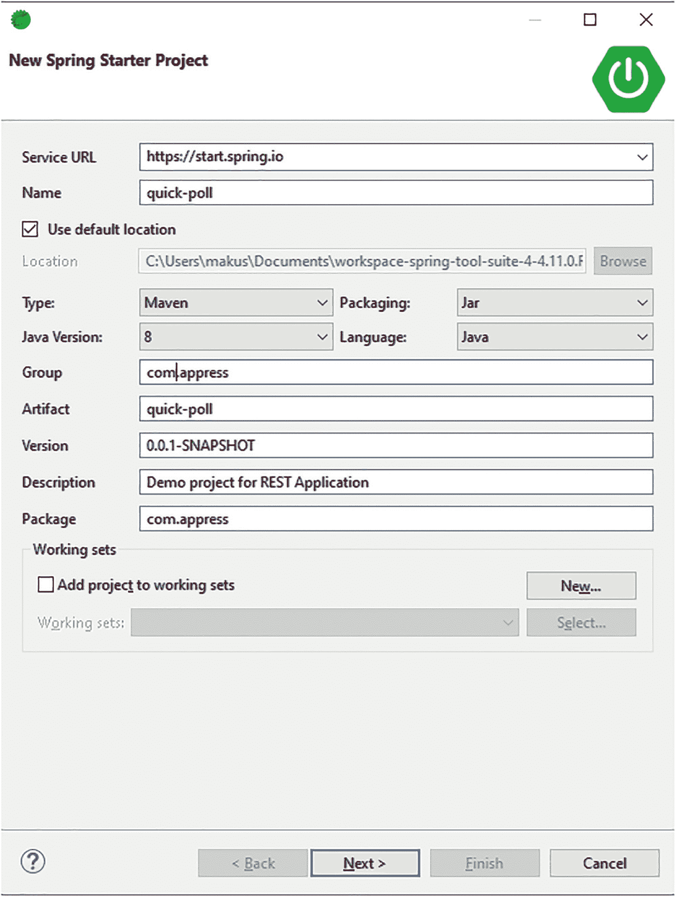
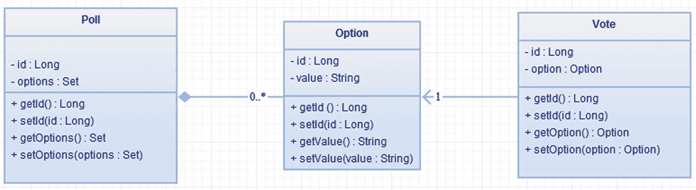
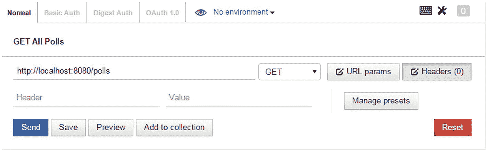
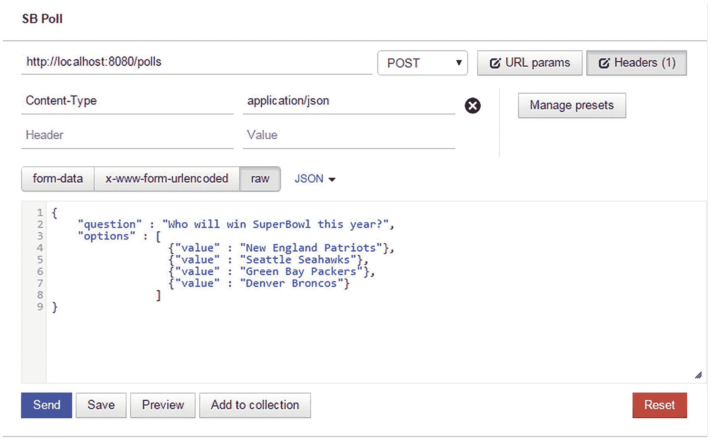
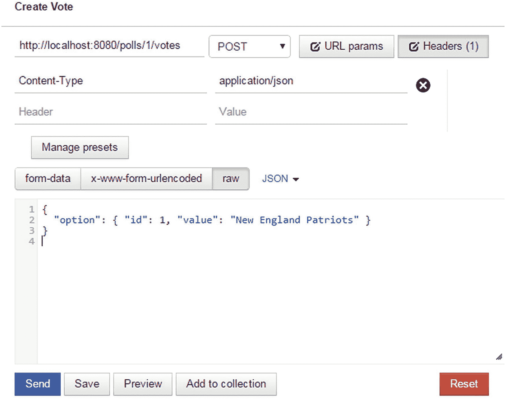
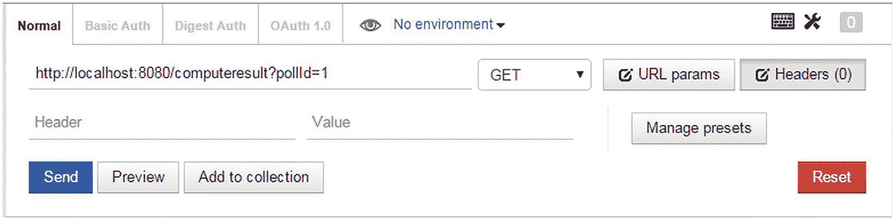

# 4.开始快速投票应用

在本章中，我们将讨论以下内容:

*   分析快速投票的要求

*   识别快速投票资源

*   设计展示

*   实施快速投票

到目前为止，我们已经了解了 REST 的基础知识，并回顾了我们的技术实现选择——Spring MVC。现在是时候开发一个更复杂的应用了。在这一章中，我们将向你介绍一个应用的开端，我们将在整本书中使用它。我们称之为快速投票。我们将经历分析需求、识别资源、设计它们的表示，以及最后提供一个特性子集的实现的过程。在接下来的章节中，我们将通过添加新的特性、文档、安全性和版本来继续我们的设计和实现。

## 快速投票简介

如今，在许多网站上，民意调查已经成为征求社区观点和意见的一个流行选项。在线调查之间有一些差异，但是一个调查通常有一个问题和一个答案列表，如图 [4-1](#Fig1) 所示。


图 4-1

Web 投票示例

参与者通过选择一个或多个答案来投票并表达他们的观点。很多民调还允许参与者查看民调结果，如图 [4-2](#Fig2) 所示。


图 4-2

网络投票结果

想象一下成为 QuickPoll Inc .的一部分，这是一家新兴的软件即服务(或 SaaS)提供商，允许用户创建、操作和投票。我们计划向一小部分受众推出我们的服务，但我们打算成为一家全球性企业。除了网络之外，QuickPoll 还希望瞄准本地 iOS 和 Android 平台。为了实现这些崇高的目标，我们选择使用 REST 原则和 web 技术来实现我们的应用。

我们通过分析和理解需求来开始开发过程。我们的 QuickPoll 应用有以下要求:

*   用户与 QuickPoll 服务交互以创建新的投票。

*   每个投票都包含一组在投票创建过程中提供的选项。

*   投票中的选项可以在以后更新。

*   为了简单起见，QuickPoll 限制了对单一选项的投票。

*   参与者可以投任意数量的票。

*   任何人都可以查看投票结果。

我们从快速投票的一组简单要求开始。与任何其他应用一样，这些需求会不断发展和变化。我们将在接下来的章节中讨论这些变化。

## 设计快速投票

正如第 [1](01.html) 章所讨论的，设计一个 RESTful 应用通常包括以下步骤:

1.  资源标识

2.  资源表示

3.  端点标识

4.  动词/动作识别

### 资源标识

我们通过分析需求和提取*名词*开始资源识别过程。在高层次上，QuickPoll 应用有*用户*，他们创建*投票*并与之交互。从前面的语句中，您可以将 User 和 Poll 标识为名词，并将它们归类为资源。类似地，用户可以对投票进行投票并查看投票结果，从而使投票成为另一种资源。这个资源建模过程类似于数据库建模，因为它用于标识实体或标识域对象的面向对象的设计。

重要的是要记住，并非所有被识别的名词都需要作为资源公开。例如，一个投票包含几个选项，使选项成为另一个候选资源。使轮询选项成为一个资源需要一个客户机发出两个 GET 请求。第一个请求将获得一个投票表示；第二个请求将获得相关的选项表示。然而，这种方法使 API 变得冗长，并可能使服务器过载。另一种方法是在投票表示中包含选项，从而将选项作为资源隐藏起来。这将使 poll 成为粗粒度的资源，但是客户机将在一次调用中获得与 Poll 相关的数据。此外，第二种方法可以实施业务规则，例如要求至少有两个选项才能创建投票。

这种*名词*的方法让我们能够识别馆藏资源。现在，考虑这样一个场景，您想要检索给定投票的所有投票。要处理这个问题，您需要一个“投票”集合资源。您可以执行 GET 请求并获取整个集合。类似地，我们需要一个“投票”集合资源，它允许我们查询投票组并创建新的投票组。

最后，我们需要处理这样一个场景，在这个场景中，我们对一次投票的所有投票进行计数，并将计算结果返回给客户端。这包括循环一次投票的所有投票，根据选项对这些投票进行分组，然后对它们进行计数。这种处理操作通常使用“控制器”资源来实现，我们在第 [1](01.html) 章中介绍过。在这种情况下，我们为执行计数操作的*计算机结果*资源建模。表 [4-1](#Tab1) 显示了已识别的资源及其集合资源对应项。

表 4-1

快速投票应用的资源

<colgroup><col class="tcol1 align-left"> <col class="tcol2 align-left"></colgroup> 
| 

资源

 | 

描述

 |
| --- | --- |
| 用户 | 单一用户资源 |
| 用户 | 集合用户资源 |
| 投票 | 单一轮询资源 |
| 民意调查 | 收集轮询资源 |
| 投票 | 单一投票资源 |
| 投票 | 集合投票资源 |
| 计算机结果 | 计数处理资源 |

### 资源表示

REST API 设计过程的下一步是定义资源表示和表示格式。REST APIs 通常支持多种格式，比如 HTML、JSON 和 XML。格式的选择很大程度上取决于 API 的受众。例如，公司内部的 REST 服务可能只支持 JSON 格式，而公共 REST API 可能支持 XML 和 JSON 格式。在本章和本书的其余部分，JSON 将是我们操作的首选格式。

JSON Format

JavaScript Object Notation(JSON)是一种用于交换信息的轻量级格式。JSON 中的信息是围绕两种结构组织的:对象和数组。

JSON 对象是名称/值对的集合。每个名称/值对由双引号中的字段名、冒号(:)和字段值组成。JSON 支持几种类型的值，如布尔值(true 或 false)、数字(int 或 float)、字符串、null、数组和对象。名称/值对的示例包括

```java
"country" : "US"
"age" : 31
 "isRequired" : true
"email" : null

```

JSON 对象用大括号({})括起来，每个名称/值对用逗号(，)分隔。下面是一个 person JSON 对象的例子:

```java
{ "firstName": "John", "lastName": "Doe", "age" : 26, "active" : true }

```

另一个 JSON 结构是数组，是值的有序集合。每个数组都用方括号([ ])括起来，值之间用逗号分隔。以下是位置数组的示例:

```java
[ "Salt Lake City", "New York", "Las Vegas", "Dallas"]

```

JSON 数组也可以包含对象作为它们的值:

```java
[
         { "firstName": "Jojn", "lastName": "Doe", "age": 26, "active": true },
         { "firstName": "Jane", "lastName": "Doe", "age": 22, "active": true },
         { "firstName": "Jonnie", "lastName": "Doe", "age": 30, "active": false }
]

```

资源由一组属性组成，可以使用类似于面向对象设计的过程来识别这些属性。例如，投票资源有一个包含投票问题的问题属性和一个唯一标识投票的 id 属性。它还包含一组选项；每个选项都由一个值和一个 id 组成。清单 [4-1](#PC5) 显示了一个带有样本数据的投票的表示。

```java
{
        "id": 2,
        "question": "How will win SuperBowl this year?",

"options": [{"id": 45, "value": "New England Patriots"}, {"id": 49,
"value": "Seattle Seahawks"}, {"id": 51, "value": "Green Bay Packers"},
{"id": 54, "value": "Denver Broncos"}]
}

Listing 4-1Poll Representation

```

Note

在本章中，我们有意将用户排除在投票代表之外。在第 [8](08.html) 章中，我们将讨论用户表示及其与投票和投票资源的关联。

轮询集合资源的表示包含单个轮询的集合。清单 [4-2](#PC6) 给出了带有虚拟数据的轮询收集资源的表示。

```java
[
              {
           "id": 5,
           "question": "q1",
           "options": [
{"id": 6, "value": "X"}, {"id": 9, "value": "Y"},
{"id": 10, "value": "Z"}]
         },
         {
        "id": 2,
        "question": "q10",
        "options": [{"id": 15, "value": "Yes"}, {"id": 16, "value": "No"}]
        }
         .......
]

Listing 4-2List of Polls Representation

```

投票资源包含投票的选项和唯一标识符。清单 [4-3](#PC7) 显示了带有虚拟数据的投票资源表示。

```java
{
        "id": 245,
        "option": {"id": 45, "value": "New England Patriots"}
}

Listing 4-3Vote Representation

```

清单 [4-4](#PC8) 给出了带有虚拟数据的投票集合资源表示。

```java
[
            {
            "id": 245,
            "option": {"id": 5, "value": "X"}
         },
         {
            "id": 110,
             "option": {"id": 7, "value": "Y"}
         },
        ............

Listing 4-4List of Votes Representation

```

ComputeResult 资源表示应该包括投票和投票选项的总数，以及与每个选项相关联的投票计数。清单 [4-5](#PC9) 用样本数据展示了这种表示。我们使用 totalVotes 属性保存投票，使用 results 属性保存选项 id 和相关的投票。

```java
{
     totalVotes: 100,
     "results" : [
                { "id" : 1, "count" : 10 },
                { "id" : 2, "count" : 8 },
                { "id" : 3, "count" : 6 },
                { "id" : 4, "count" : 4 }
              ]
}

Listing 4-5ComputeResult Representation

```

既然我们已经定义了我们的资源表示，我们将继续为这些资源识别端点。

### 端点标识

REST 资源使用 URI 端点来标识。设计良好的 REST APIs 应该具有易于理解、直观且易于使用的端点。请记住，我们构建 REST APIs 是为了让消费者使用。因此，我们为端点选择的名称和层次结构对消费者来说应该是明确的。

我们使用行业中广泛使用的最佳实践和惯例为我们的服务设计端点。第一个约定是为我们的 REST 服务使用一个基本 URI。基本 URI 提供了访问 REST API 的入口点。公共 REST API 提供者通常使用子域如 [`http://api.domain.com`](http://api.domain.com) 或 [`http://dev.domain.com`](http://dev.domain.com) 作为他们的基本 URI。流行的例子有 GitHub 的 [`https://api.github.com`](https://api.github.com) 和 Twitter 的 [`https://api.twitter.com`](https://api.twitter.com) 。通过创建单独的子域，您可以防止与网页发生任何可能的域名冲突。它还允许您实施不同于常规网站的安全策略。为了简单起见，在本书中我们将使用`http://localhost:8080`作为我们的基地 URI。

第二个约定是使用复数名词命名资源端点。在我们的 QuickPoll 应用中，这将导致一个端点`http://localhost:8080/polls`用于访问轮询收集资源。将使用诸如`http://localhost:8080/polls/1234`和`http://localhost:8080/polls/3456`之类的 URI 来访问各个投票资源。我们可以使用 URI 模板`http://localhost:8080/polls/{pollId}`来概括对个人投票资源的访问。类似地，端点`http://localhost:8080/users`和`http://localhost:8080/users/{userId}`用于访问集合和个人用户资源。

第三个约定建议使用 URI 层次结构来表示彼此相关的资源。在我们的 QuickPoll 应用中，每个投票资源都与一个投票资源相关。因为我们通常为投票投票，所以建议使用分层端点`http://localhost:8080/polls/{pollId}/votes`来获取或操作与给定投票相关的所有投票。同样，端点`http://localhost:8080/polls/{pollId}/votes/{voteId}`将返回投票的个人投票。

最后，端点`http://localhost:8080/computeresult`可以用来访问 ComputeResult 资源。为了使该资源正常工作并计算投票数，需要一个投票 id。因为`ComputeResult`与`Vote`、`Poll`和`Option`资源一起工作，所以我们不能使用第三种方法来设计本质上是分层的 URI。对于需要数据来执行计算的用例，第四个约定推荐使用查询参数。例如，客户机可以调用端点`http://localhost:8080/computeresult?pollId=1234`来计算 id 为 1234 的投票的所有票数。查询参数是向资源提供附加信息的极好工具。

在本节中，我们已经确定了 QuickPoll 应用中资源的端点。下一步是确定这些资源上允许的操作，以及预期的响应。

### 动作识别

HTTP 动词允许客户端使用其端点进行交互和访问资源。在我们的 QuickPoll 应用中，客户端必须能够对资源(如 Poll 和 Vote)执行一个或多个 CRUD 操作。分析“快速轮询简介”部分的用例，表 [4-2](#Tab2) 显示了轮询/轮询收集资源上允许的操作以及成功和错误响应。注意，在轮询收集资源上，我们允许 GET 和 POST 操作，但拒绝 PUT 和 Delete 操作。集合资源上的 POST 允许客户端创建新的投票。类似地，我们允许对给定的轮询资源执行 GET、PUT 和 Delete 操作，但拒绝 POST 操作。对于不存在的轮询资源上的任何 GET、PUT 和 DELETE 操作，该服务返回 404 状态代码。类似地，任何服务器错误都会导致向客户端发送状态代码 500。

表 4-2

轮询资源上允许的操作

<colgroup><col class="tcol1 align-left"> <col class="tcol2 align-left"> <col class="tcol3 align-left"> <col class="tcol4 align-left"> <col class="tcol5 align-left"> <col class="tcol6 align-left"></colgroup> 
| 

超文本传送协议

方法

 | 

资源

端点

 | 

投入

 | 

成功响应

 | 

错误响应

 | 

描述

 |
| --- | --- | --- | --- | --- | --- |
| 得到 | `/polls` | 主体:空的 | 状态:200正文:投票列表 | 现状:500 | 检索所有可用的投票 |
| 邮政 | `/polls` | 正文:新的民意调查数据 | 现状:201正文:新创建的投票 id | 现状:500 | 创建新的投票 |
| 放 | `/polls` | 不适用的 | 不适用的 | 现状:400 | 禁止动作 |
| 删除 | `/polls` | 不适用的 | 不适用的 | 现状:400 | 禁止动作 |
| 得到 | `/polls/{pollId}` | 主体:空的 | 状态:200正文:民意测验数据 | 状态:404 或 500 | 检索到现有的投票 |
| 邮政 | `/polls/{pollId}` | 不适用的 | 不适用的 | 现状:400 | 被禁止的 |
| 放 | `/polls/{pollId}` | 正文:带更新的轮询数据 | 状态:200主体:空的 | 状态:404 或 500 | 更新现有投票 |
| 删除 | `/polls/{pollId}` | 主体:空的 | 状态:200 | 状态:404 或 500 | 删除现有的投票 |

同样，表 [4-3](#Tab3) 显示了投票/选票收集资源上允许的操作。

表 4-3

投票资源上允许的操作

<colgroup><col class="tcol1 align-left"> <col class="tcol2 align-left"> <col class="tcol3 align-left"> <col class="tcol4 align-left"> <col class="tcol5 align-left"> <col class="tcol6 align-left"></colgroup> 
| 

超文本传送协议

方法

 | 

资源

端点

 | 

投入

 | 

成功响应

 | 

错误响应

 | 

描述

 |
| --- | --- | --- | --- | --- | --- |
| 得到 | `/polls/{pollId}/votes` | 主体:空的 | 状态:200正文:投票列表 | 现状:500 | 检索给定投票的所有可用投票 |
| 邮政 | `/polls/{pollId}/votes` | 正文:新投票 | 现状:201正文:新创建的投票 id | 现状:500 | 创建新投票 |
| 放 | `/polls/{pollId}/votes` | 不适用的 | 不适用的 | 现状:400 | 禁止动作 |
| 删除 | `/polls/{pollId}/votes` | 不适用的 | 不适用的 | 现状:400 | 禁止动作 |
| 得到 | `/polls/{pollId}/votes/{voteId}` | 主体:空的 | 状态:200正文:投票数据 | 状态:404 或 500 | 检索现有投票 |
| 邮政 | `/polls/{pollId}/votes/{voteId}` | 不适用的 | 不适用的 | 现状:400 | 被禁止的 |
| 放 | `/polls/{pollId}/votes/{voteId}` | 不适用的 | 不适用的 | 现状:400 | 禁止投票不能根据我们的要求更新 |
| 删除 | `/polls/{pollId}/votes/{voteId}` | 不适用的 | 不适用的 | 现状:400 | 根据我们的要求，禁止投票不能被删除 |

最后，表 [4-4](#Tab4) 显示了 ComputeResult 资源上允许的操作。

表 4-4

计算机上允许的操作结果资源

<colgroup><col class="tcol1 align-left"> <col class="tcol2 align-left"> <col class="tcol3 align-left"> <col class="tcol4 align-left"> <col class="tcol5 align-left"> <col class="tcol6 align-left"></colgroup> 
| 

超文本传送协议

方法

 | 

资源

端点

 | 

投入

 | 

成功响应

 | 

错误响应

 | 

描述

 |
| --- | --- | --- | --- | --- | --- |
| 得到 | `/computeresult` | 主体:空的参数：pollId | 状态:200正文:投票计数 | 现状:500 | 返回给定投票的投票数 |

QuickPoll REST 服务的设计到此结束。在我们开始实施之前，我们将回顾一下 QuickPoll 的高级架构。

## 快速轮询架构

QuickPoll 应用将由一个 web 或 REST API 层和一个存储库层组成，一个域层(Web API 和存储库之间的层)横切这两个层，如图 [4-3](#Fig3) 所示。分层方法提供了清晰的关注点分离，使得应用易于构建和维护。每一层都使用定义明确的契约与下一层进行交互。只要契约得到维护，就有可能交换底层实现，而不会对整个系统产生任何影响。



图 4-3

快速轮询架构

Web API 层负责接收客户端请求、验证用户输入、与服务或存储库层交互以及生成响应。使用 HTTP 协议，在客户端和 Web API 层之间交换资源表示。这一层包含控制器/处理程序，通常非常轻量级，因为它将大部分工作委托给它下面的层。

领域层被认为是应用的“心脏”。这一层中的域对象包含业务规则和业务数据。这些对象是以系统中的名词为模型的。例如，我们的 QuickPoll 应用中的 Poll 对象将被视为域对象。

存储库或数据访问层负责与数据存储(如数据库、LDAP 或遗留系统)进行交互。它通常提供 CRUD 操作，用于在数据存储中存储和检索对象。

Note

细心的读者会注意到 QuickPoll 架构缺少一个服务层。服务层通常位于 API/表示层和存储库层之间。它包含粗粒度的 API，其方法满足一个或多个用例。它还负责管理事务和其他横切关注点，如安全性。

因为在本书中，我们不会处理 QuickPoll 应用的任何复杂用例，所以我们不会在我们的架构中引入服务层。

## 实施快速投票

我们通过使用 STS 生成一个 Spring Boot 项目来开始 QuickPoll 的实现。按照第 3 章的“使用 STS 生成项目”一节中讨论的步骤，创建一个名为 quick-poll 的项目。图 [4-4](#Fig4) 和 [4-5](#Fig5) 给出了项目生成过程中使用的配置信息。请注意，我们已经选择了“JPA”和“Web”选项。



图 4-5

QuickPoll Spring starter 项目依赖项



图 4-4

QuickPoll 春季启动项目

或者，您可以从本书的下载源代码中将 QuickPoll 项目导入您的 STS IDE。下载的源代码包含多个名为`ChapterX`的文件夹，其中`X`代表对应的章节号。每个`ChapterX`文件夹进一步包含两个子文件夹:一个`starter`文件夹和一个`final`文件夹。`starter`文件夹中有一个 QuickPoll 项目，您可以使用它来跟踪本章中描述的解决方案。

即使每一章都建立在前一章的基础上，starter 项目也允许你在书中跳来跳去。例如，如果您对了解安全性感兴趣，您可以简单地在`Chapter8\starter`文件夹下加载 QuickPoll 应用，并按照第 [8](08.html) 章中描述的解决方案进行操作。

顾名思义，`final`文件夹包含每章的完整解决方案/代码。为了尽量减少本章文本中的代码，我在一些代码清单中省略了 getter/setter 方法、导入和包声明。请参考`final`文件夹下的快速轮询代码，获取完整的代码列表。

默认情况下，Spring Boot 应用在端口 8080 上运行。因此，如果您打算运行两个版本的 QuickPoll，只需使用命令行选项`-Dserver.port`:

```java
mvn spring-boot:run -Dserver.port=8181

```

Note

Java 持久性 API(JPA)是一种基于标准的 API，用于访问、存储和管理 Java 对象和关系数据库之间的数据。像 JDBC 一样，JPA 纯粹是一个规范，许多商业和开源产品如 Hibernate 和 TopLink 都提供 JPA 实现。对 JPA 的正式概述超出了本书的范围。详情请参考 Pro JPA 2 ( [`http://www.apress.com/9781430219569/`](http://www.apress.com/9781430219569/) )了解。

### 域实现

域对象通常充当任何应用的主干。因此，我们实现过程的下一步是创建域对象。图 4-5 显示了一个 UML 类图，它代表了 QuickPoll 应用中的三个域对象以及它们之间的关系。



图 4-6

快速轮询域对象

在 quick-poll 项目中，在`/src/main/java`文件夹下创建一个`com.apress.domain`子包，并创建对应于我们识别的域对象的 Java 类。清单 4-6 给出了`Option`类的实现。如您所见，`Option`类有两个字段:`id`，用于保存身份；和`value`，对应选项值。此外，您将看到我们已经用 JPA 注释对该类进行了注释，例如`@Entity`和`@Id`。这允许使用 JPA 技术轻松持久化和检索`Option`类的实例。

```java
package com.apress.domain;

import javax.persistence.Column;
import javax.persistence.Entity;
import javax.persistence.GeneratedValue;
import javax.persistence.Id;

@Entity
public class Option {

    @Id
    @GeneratedValue
    @Column(name="OPTION_ID")
    private Long id;

    @Column(name="OPTION_VALUE")
    private String value;

    // Getters and Setters omitted for brevity
}

Listing 4-6Option Class

```

接下来，我们创建一个`Poll`类，如清单 [4-7](#PC12) 所示，以及相应的 JPA 注释。`Poll`类有一个问题字段来存储投票问题。`@OneToMany`注释，顾名思义，表示一个`Poll`实例可以包含零个或多个`Option`实例。`CascadeType.All`表示任何数据库操作，比如对一个`Poll`实例的持久化、删除或合并，都需要传播到所有相关的`Option`实例。例如，当一个`Poll`实例被删除时，所有相关的`Option`实例都将从数据库中删除。

```java
package com.apress.domain;

import java.util.Set;
import javax.persistence.CascadeType;
import javax.persistence.Column;
import javax.persistence.Entity;
import javax.persistence.GeneratedValue;
import javax.persistence.Id;
import javax.persistence.JoinColumn;
import javax.persistence.OneToMany;
import javax.persistence.OrderBy ;

@Entity

public class Poll {

        @Id
        @GeneratedValue
        @Column(name="POLL_ID")
        private Long id;

        @Column(name="QUESTION")
        private String question;

        @OneToMany(cascade=CascadeType.ALL)
        @JoinColumn(name="POLL_ID")
        @OrderBy
        private Set<Option> options;

        // Getters and Setters omitted for brevity
}

Listing 4-7Poll Class

```

最后，我们创建了`Vote`类，如清单 [4-8](#PC13) 所示。`@ManyToOne`注释表明一个`Option`实例可以有零个或多个`Vote`实例与之相关联。

```java
package com.apress.domain;

import javax.persistence.Column;
import javax.persistence.Entity;
import javax.persistence.GeneratedValue;
import javax.persistence.Id;
import javax.persistence.JoinColumn;
import javax.persistence.ManyToOne;

@Entity
public class Vote {

        @Id
        @GeneratedValue
        @Column(name="VOTE_ID")
        private Long id;

        @ManyToOne
        @JoinColumn(name="OPTION_ID")
        private Option option;

        // Getters and Setters omitted for brevity
}

Listing 4-8Vote Class

```

### 知识库实现

存储库或数据访问对象(DAO)提供了与数据存储交互的抽象。传统上，存储库包括一个接口，该接口提供一组 finder 方法，例如用于检索数据的`findById`、`findAll`，以及保存和删除数据的方法。存储库还包括一个使用特定于数据存储的技术实现该接口的类。例如，处理数据库的存储库使用 JDBC 或 JPA 等技术，处理 LDAP 的存储库使用 JNDI。通常每个域对象都有一个存储库。

尽管这是一种流行的方法，但是在每个存储库实现中都有许多重复的样板代码。开发人员试图将通用功能抽象成通用接口和通用实现( [http `://www.ibm.com/developerworks/library/j-genericdao/`](http://www.ibm.com/developerworks/library/j-genericdao/) )。然而，他们仍然需要为每个域对象创建一对存储库接口和类。通常这些接口和类是空的，只会导致更多的维护。

Spring Data 项目旨在通过完全消除编写任何存储库实现的需要来解决这个问题。使用 Spring 数据，您需要的只是一个存储库接口，在运行时自动生成它的实现。唯一的要求是应用存储库接口应该扩展许多可用的 Spring 数据标记接口中的一个。因为我们将使用 JPA 将 QuickPoll 域对象持久化到关系数据库中，所以我们将使用 Spring Data JPA 子项目的`org.springframework.data.repository.CrudRepository`标记接口。从清单 [4-9](#PC14) 中可以看出，`CrudRepository`接口将它所操作的域对象的类型和域对象的标识符字段的类型作为其通用参数`T`和`ID`。

```java
public interface CrudRepository<T, ID> extends Repository<T, ID> {
        <S extends T> S save(S var1);

        <S extends T> Iterable<S> saveAll(Iterable<S> var1);

        Optional<T> findById(ID var1);

        Iterable<T> findAll();

        Iterable<T> findAllById(Iterable<ID> var1);

        void deleteById(ID var1);

        void delete(T var1);

        void deleteAllById(Iterable<? extends ID> var1);

        void deleteAll(Iterable<? extends T> var1);

        void deleteAll();

        // Utility Methods
        long count();
        boolean existsById(ID var1);
}

Listing 4-9CrudRepository API

```

我们通过在`src\main\java`文件夹下创建一个`com.apress.repository`包来开始我们的存储库实现。然后，我们创建一个如清单 [4-10](#PC15) 所示的`OptionRepository`接口。如前所述，`OptionRepository`扩展了 Spring Data 的`CrudRepository`，从而继承了它所有的 CRUD 方法。因为`OptionRepository`与`Option`域对象一起工作，所以它将`Option`和`Long`作为通用参数值传递。

```java
package com.apress.repository;

import org.springframework.data.repository.CrudRepository;
import com.apress.domain.Option;

public interface OptionRepository extends CrudRepository<Option, Long> {

}

Listing 4-10OptionRepository Interface

```

采用同样的方法，我们然后创建`PollRepository`和`VoteRepository`接口，如清单 [4-11](#PC16) 和 [4-12](#PC17) 所示。

```java
public interface VoteRepository extends CrudRepository<Vote, Long> {

}

Listing 4-12OptionRepository Interface

```

```java
public interface PollRepository extends CrudRepository<Poll, Long> {

}

Listing 4-11PollRepository Interface

```

### 嵌入式数据库

在上一节中，我们创建了存储库，但是我们需要一个关系数据库来保存数据。关系数据库市场充满了各种选择，从 Oracle 和 SQL Server 等商业数据库到 MySQL 和 PostgreSQL 等开源数据库。为了加快 QuickPoll 应用的开发，我们将使用 HSQLDB，这是一个流行的内存数据库。内存数据库(也称为嵌入式数据库)不需要任何额外的安装，可以简单地作为 JVM 进程运行。它们的快速启动和关闭能力使它们成为原型和集成测试的理想选择。同时，它们通常不提供持久存储，应用需要在每次启动时播种数据库。

Spring Boot 为嵌入 HSQLDB、H2 和 Derby 的数据库提供了出色的支持。唯一的要求是在`pom.xml`文件中包含一个构建依赖项。Spring Boot 负责在部署期间启动数据库，并在应用关闭期间停止数据库。不需要提供任何数据库连接 URL 或用户名和密码。清单 [4-13](#PC18) 显示了需要添加到 QuickPoll 的`pom.xml`文件中的依赖信息。

```java
<dependency>
    <groupId>org.hsqldb</groupId>
    <artifactId>hsqldb</artifactId>
    <scope>runtime</scope>
</dependency>

Listing 4-13HSQLDB POM.XML Dependency

```

### API 实现

在这一节中，我们将创建 Spring MVC 控制器并实现我们的 REST API 端点。我们首先在`src\main\java`下创建`com.apress.controller`包来容纳所有的控制器。

#### PollController 实现

`PollController`提供了所有必要的端点来访问和操作轮询和轮询资源。清单 [4-14](#PC19) 显示了一个基本的`PollController`类。

```java
package com.apress.controller;

import javax.inject.Inject;
import org.springframework.web.bind.annotation.RestController;
import com.apress.repository.PollRepository;

@RestController
public class PollController {

        @Inject
        private PollRepository pollRepository;

}

Listing 4-14PollController Class

```

用一个`@RestController`注释对`PollController`类进行了注释。`@RestController`是一个方便而有意义的注释，与添加`@Controller`和`@ResponseBody`注释具有相同的效果。因为我们需要读取和存储`Poll`实例，所以我们使用`@Inject`注释将一个`PollRepository`实例注入到我们的控制器中。作为 Java EE 6 的一部分引入的`javax.inject.Inject`注释提供了声明依赖关系的标准机制。我们使用这个注释来支持 Spring 专有的`@Autowired`注释，以便更加兼容。为了使用`@Inject`注释，我们需要将清单 [4-15](#PC20) 中所示的依赖项添加到`pom.xml`文件中。

```java
<dependency>
        <groupId>javax.inject</groupId>
        <artifactId>javax.inject</artifactId>
        <version>1</version>

</dependency>

Listing 4-15Inject Dependency in POM File

```

在`/polls`端点上的 GET 请求提供了 QuickPolls 应用中所有可用投票的集合。清单 [4-16](#PC21) 显示了实现该功能的必要代码。`shortcut`注释声明了 URI 和允许的 HTTP 方法。`getAllPolls`方法使用`ResponseEntity`作为其返回类型，表明返回值是完整的 HTTP 响应。`ResponseEntity`让您完全控制 HTTP 响应，包括响应体和响应头。方法实现从使用`PollRepository`读取所有轮询开始。然后我们创建一个`ResponseEntity`的实例，并传入`Poll`数据和`HttpStatus.OK`状态值。`Poll`数据成为响应主体的一部分，OK(代码 200)成为响应状态代码。

```java
@GetMapping("/polls")
public ResponseEntity<Iterable<Poll>> getAllPolls() {
        Iterable<Poll> allPolls = pollRepository.findAll();
        return new ResponseEntity<>(pollRepository.findAll(), HttpStatus.OK);
}

Listing 4-16GET Verb Implementation for /polls

```

让我们通过运行 QuickPoll 应用来快速测试我们的实现。在命令行中，导航到`quick-poll`项目目录并运行以下命令:

```java
mvn spring-boot:run

```

在你的 Chrome 浏览器中启动 Postman 应用，输入网址`http://localhost:8080/polls`，如图 [4-7](#Fig7) 所示，点击发送。因为我们还没有创建任何投票，这个命令将导致一个空的集合。



图 4-7

获取所有投票请求

Note

下载的源代码包含一个导出的 Postman 集合，其中的请求可用于运行本章中的测试。只需将这个集合导入到您的 Postman 应用中，并开始使用它。

我们的下一站是实现向`PollController`添加新轮询的功能。我们通过实现后动词功能来实现这一点，如清单 [4-17](#PC23) 所示。`createPoll`方法接受一个类型为`Poll`的参数。`@RequestBody`注释告诉 Spring 整个请求体需要转换成`Poll`的一个实例。Spring 使用传入的`Content-Type`头来标识一个合适的消息转换器，并将实际的转换委托给它。Spring Boot 附带了支持 JSON 和 XML 资源表示的消息转换器。在方法内部，我们简单地将`Poll`持久性委托给`PollRepository`的`save`方法。然后我们创建一个新的状态为`CREATED` (201)的`ResponseEntity`并返回它。

```java
@PostMapping("/polls")
public ResponseEntity<?> createPoll(@RequestBody Poll poll) {

        poll = pollRepository.save(poll);
        return new ResponseEntity<>(null, HttpStatus.CREATED);
}

Listing 4-17Implementation to Create New Poll

```

虽然这个实现满足了请求，但是客户端无法知道新创建的`Poll`的 URI。例如，如果客户想要将新创建的`Poll`共享到一个社交网站，当前的实现是不够的。最佳实践是使用`Location` HTTP 头将 URI 传递给新创建的资源。构建 URI 需要我们检查`HttpServletRequest`对象，以获得诸如根 URI 和上下文之类的信息。Spring 通过其`ServletUriComponentsBuilder`实用程序类简化了 URI 生成过程:

```java
URI newPollUri = ServletUriComponentsBuilder
                        .fromCurrentRequest()
                        .path("/{id}")
                        .buildAndExpand(poll.getId())
                        .toUri();

```

`fromCurrentRequest`方法通过从`HttpServletRequest`复制主机、模式、端口等信息来准备构建器。`path`方法将传入的路径参数附加到构建器中现有的路径上。在`createPoll`方法的情况下，这将导致`http://localhost:8080/polls/{id}`。`buildAndExpand`方法将构建一个`UriComponents`实例，并用传入的值替换任何路径变量(在我们的例子中是`{id}`)。最后，我们调用`UriComponents`类上的`toUri`方法来生成最终的 URI。清单 [4-18](#PC25) 显示了`createPoll`方法的完整实现。

```java
@PostMapping("/polls")
public ResponseEntity<?> createPoll(@RequestBody Poll poll) {

        poll = pollRepository.save(poll);

        // Set the location header for the newly created resource
        HttpHeaders responseHeaders = new HttpHeaders();
        URI newPollUri = ServletUriComponentsBuilder
                                .fromCurrentRequest()
                                .path("/{id}")
                                .buildAndExpand(poll.getId())
                                .toUri();
        responseHeaders.setLocation(newPollUri);

        return new ResponseEntity<>(null, responseHeaders, HttpStatus.CREATED);
}

Listing 4-18Complete Implementation of Create Poll

```

要测试我们新添加的功能，请启动 QuickPoll 应用。如果您已经运行了应用，您需要终止该进程并重新启动它。如图 [4-8](#Fig8) 所示，在 Postman 中输入信息，点击发送。确保您已经添加了值为`application/json`的`Content-Type`标题。正文中使用的 JSON 如下所示:



图 4-8

创建投票邮递员示例

```java
{
    "question": "Who will win SuperBowl this year?",
    "options": [
                 {"value": "New England Patriots"},
                 {"value": "Seattle Seahawks"},
                 {"value": "Green Bay Packers"},
                 {"value": "Denver Broncos"}]
}

```

请求完成后，您将看到状态 201 创建的消息和标题:

```java
Content-Length ® 0
Date ® Mon, 23 Feb 2015 00:05:11 GMT
Location ® http://localhost:8080/polls/1
Server ® Apache-Coyote/1.1

```

现在让我们将注意力转向访问个人投票。清单 [4-19](#PC28) 给出了必要的代码。`shortcut annotations (@GetMapping, @PostMapping, etc.)`中的值属性采用 URI 模板`/polls/{pollId}`。占位符`{pollId}`和`@PathVarible`注释允许 Spring 检查请求 URI 路径并提取 pollId 参数值。在这个方法中，我们使用`PollRepository`的`findById` finder 方法来读取投票，并将其作为`ResponseEntity`的一部分传递。

```java
@GetMapping("/polls/{pollId}")
public ResponseEntity<?> getPoll(@PathVariable Long pollId) {
        Optional<Poll> poll = pollRepository.findById(pollId);
        if(!poll.isPresent()) {
                throw new Exception("Pool not found");
        }
        return new ResponseEntity<>(poll.get(), HttpStatus.OK);
}

Listing 4-19Retrieving an Individual Poll

```

以同样的方式，我们实现了更新和删除一个`Poll`的功能，如清单 [4-20](#PC29) 所示。

```java
@PutMapping("/polls/{pollId}")
public ResponseEntity<?> updatePoll(@RequestBody Poll poll, @PathVariable Long pollId) {
        // Save the entity
        Poll newPoll = pollRepository.save(poll);
        return new ResponseEntity<>(HttpStatus.OK);
}

@DeleteMapping("/polls/{pollId}")
public ResponseEntity<?> deletePoll(@PathVariable Long pollId) {
        pollRepository.deleteById(pollId);
        return new ResponseEntity<>(HttpStatus.OK);
}

Listing 4-20Update and Delete a Poll

```

一旦将这段代码添加到`PollController`中，重启 QuickPoll 应用并执行 Postman 请求，如图 [4-8](#Fig8) 所示，以创建一个新的投票。然后输入图 [4-9](#Fig9) 中的信息，创建一个新的邮递员请求并更新轮询。请注意，PUT 请求包含整个`Poll`表示以及 id。


图 4-9

更新投票

这就结束了`PostController`的实现。

#### VoteController 实现

遵循用于创建 PollController 的原则，我们实现了`VoteController`类。清单 [4-21](#PC30) 给出了`VoteController`类的代码以及创建投票的功能。`VoteController`使用`VoteRepository`的注入实例在`Vote`实例上执行 CRUD 操作。

```java
@RestController
public class VoteController {
        @Inject
        private VoteRepository voteRepository;

        @PostMapping("/polls/{pollId}/votes")

public ResponseEntity<?> createVote(@PathVariable Long pollId, @RequestBody Vote vote) {
                vote = voteRepository.save(vote);

                // Set the headers for the newly created resource
                HttpHeaders responseHeaders = new HttpHeaders();

responseHeaders.setLocation(ServletUriComponentsBuilder.fromCurrentRequest().path("/{id}").buildAndExpand(vote.getId()).toUri());

                return new ResponseEntity<>(null, responseHeaders, HttpStatus.CREATED);
        }
}

Listing 4-21VoteController Implementation

```

为了测试投票能力，向`/polls/1/votes`端点发送一个新的投票，在请求体中有一个选项，如图 [4-10](#Fig10) 所示。在成功执行请求时，您将看到一个值为`http://localhost:8080/polls/1/votes/1`的`Location`响应头。



图 4-10

投新的一票

接下来，我们看一下实现检索给定投票的所有投票的能力。`VoteRepository`中的`findAll`方法返回数据库中的所有投票。因为这不能满足我们的需求，我们需要向清单 [4-22](#PC31) 所示的`VoteRepository`添加这个功能。

```java
import org.springframework.data.jpa.repository.Query;

public interface VoteRepository extends CrudRepository<Vote, Long> {

@Query(value="select v.* from Option o, Vote v where o.POLL_ID = ?1 and
v.OPTION_ID = o.OPTION_ID", nativeQuery = true)
        public Iterable<Vote> findByPoll(Long pollId);
}

Listing 4-22Modified VoteRepository Implementation

```

自定义查找器方法`findVotesByPoll`将`Poll`的 ID 作为其参数。这个方法上的`@Query`注释接受一个原生 SQL 查询以及设置为`true`的`nativeQuery`标志。在运行时，Spring Data JPA 用传入的`pollId`参数值替换`?1`占位符。接下来，我们在`VoteController`中实现`/polls/{pollId}/votes`端点，如清单 [4-23](#PC32) 所示。

```java
@GetMapping("/polls/{pollId}/votes")
public Iterable<Vote> getAllVotes(@PathVariable Long pollId) {
        return voteRepository. findByPoll(pollId);
}

Listing 4-23GET All Votes Implementation

```

#### ComputeResultController 实现

我们剩下的最后一块工作是实现`ComputeResult`资源。因为我们没有任何域对象可以直接帮助生成这个资源表示，所以我们实现了两个数据传输对象或 dto—`OptionCount`和`VoteResult`。`OptionCount` DTO 包含选项的 ID 和为该选项投票的计数。`VoteResult` DTO 包含总投票数和一组`OptionCount`实例。这两个 dto 是在`com.apress.dto`包下创建的，它们的实现在清单 [4-24](#PC33) 中给出。

```java
package com.apress.dto;
public class OptionCount {
        private Long optionId;
        private int count;
        // Getters and Setters omitted for brevity
}

package com.apress.dto;
import java.util.Collection;

public class VoteResult {
        private int totalVotes;
        private Collection<OptionCount> results;
        // Getters and Setters omitted for brevity
}

Listing 4-24DTOs for ComputeResult Resources

```

遵循创建`PollController`和`VoteController`的原则，我们创建一个新的`ComputeResultController`类，如清单 [4-25](#PC34) 所示。我们将`VoteRepository`的一个实例注入控制器，它用于检索给定投票的投票。`computeResult`方法将`pollId`作为其参数。`@RequestParam`注释指示 Spring 从 HTTP 查询参数中检索`pollId`值。使用新创建的`ResponseEntity`实例将计算结果发送给客户机。

```java
package com.apress.controller;

@RestController
public class ComputeResultController {

        @Inject
        private VoteRepository voteRepository;

        @GetMapping("/computeresult")
        public ResponseEntity<?> computeResult(@RequestParam Long pollId) {
                VoteResult voteResult = new VoteResult();
                Iterable<Vote> allVotes = voteRepository.findByPoll(pollId);
                // Algorithm to count votes

                return new ResponseEntity<VoteResult>(voteResult, HttpStatus.OK);
        }
}

Listing 4-25ComputeResultController implementation

```

有几种方法可以计算与每个选项相关的票数。该代码提供了一个这样的选项:

```java
int totalVotes = 0;
Map<Long, OptionCount> tempMap = new HashMap<Long, OptionCount>();
for(Vote v : allVotes) {
        totalVotes ++;
        // Get the OptionCount corresponding to this Option
        OptionCount optionCount = tempMap.get(v.getOption().getId());
        if(optionCount == null) {
                optionCount = new OptionCount();
                optionCount.setOptionId(v.getOption().getId());
                tempMap.put(v.getOption().getId(), optionCount);
        }
        optionCount.setCount(optionCount.getCount()+1);
}
voteResult.setTotalVotes(totalVotes);
voteResult.setResults(tempMap.values());

```

这就结束了`ComputeResult`控制器的实现。启动/重新启动快速轮询应用。使用先前的 Postman 请求，创建一个投票并对其选项进行投票。然后创建一个新的 Postman 请求，如图 [4-11](#Fig11) 所示，并提交它来测试我们的`/computeresult`端点。



图 4-11

计算机结果终点测试

成功完成后，您将看到类似如下的输出:

```java
{
    "totalVotes": 7,
    "results": [
        {
            "optionId": 1,
            "count": 4
        },
        {
            "optionId": 2,
            "count": 3
        }
    ]
}

```

## 摘要

在本章中，我们学习了为 QuickPoll 应用创建 RESTful 服务。我们在这一章中的大多数例子都假设了一条“幸福之路”,在这条路上一切都按计划进行。然而，这在现实世界中很少发生。在下一章中，我们将着眼于处理错误、验证输入数据以及传达有意义的错误信息。