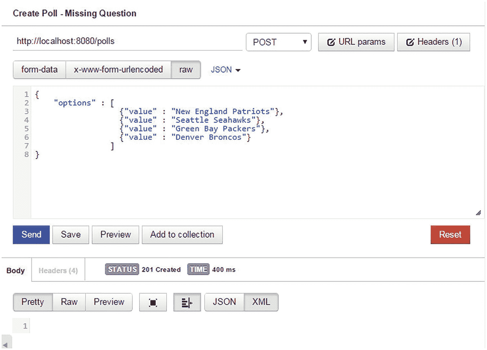

# 五、错误处理

在本章中，我们将讨论以下内容:

*   在 REST API 中处理错误

*   设计有意义的错误响应

*   验证 API 输入

*   外部化错误消息

对于程序员来说，错误处理是最重要的话题之一，但也是容易被忽视的话题。尽管我们怀着良好的意图开发软件，但事情确实会出错，我们必须准备好优雅地处理和交流这些错误。对于使用 REST API 的开发人员来说，通信方面尤其重要。设计良好的错误响应允许开发人员理解问题，并帮助他们正确使用 API。此外，良好的错误处理允许 API 开发人员记录有助于他们调试问题的信息。

## 快速轮询错误处理

在我们的 QuickPoll 应用中，考虑用户试图检索不存在的投票的场景。图 [5-1](#Fig1) 显示了邮递员请求一个 id 为 100 的不存在的轮询。


图 5-1

请求一个不存在的投票

收到请求后，QuickPoll 应用中的`PollController`使用`PollRepository`来检索投票。由于 id 为 100 的 poll 不存在，`PollRepository`的`findById`方法返回一个空选项，`PollController`向客户端发送一个空正文，如图 [5-2](#Fig2) 所示。


图 5-2

对不存在的投票的响应

Note

在本章中，我们将继续使用我们在上一章中构建的 QuickPoll 应用。代码也可以在下载的源代码的`Chapter5\starter`文件夹下找到。完成的解决方案可以在`Chapter5\final`文件夹下找到。由于我们在本章的一些清单中省略了 getter/setter 方法和导入，请参考`final`文件夹下的代码以获得完整的清单。`Chapter5`文件夹还包含一个导出的 Postman 集合，该集合包含与本章相关的 REST API 请求。

这种当前的实现是欺骗性的，因为客户端接收到状态码 200。相反，应该返回状态代码 404，表明请求的资源不存在。为了实现这个正确的行为，我们将在`com.apress.controller.PollController`的`getPoll`方法中验证投票 id，对于不存在的投票，抛出一个`com.apress.exception.ResourceNotFoundException`异常。清单 [5-1](#PC1) 显示了修改后的`getPoll`实现。

```java
@GetMapping("/polls/{pollId}")
public ResponseEntity<?> getPoll(@PathVariable Long pollId) {
        Optional<Poll> poll = pollRepository.findById(pollId);
        if(!poll.isPresent()) {
                throw new ResourceNotFoundException("Poll with id " + pollId + " not found");
        }
        return new ResponseEntity<>(poll.get(), HttpStatus.OK);
}

Listing 5-1getPoll Implementation

```

`ResourceNotFoundException`是一个自定义异常，其实现如清单 [5-2](#PC2) 所示。请注意，在类级别声明了一个`@ResponseStatus`注释。注释指示 Spring MVC，当抛出`ResourceNotFoundException`时，应该在响应中使用`HttpStatus NOT_FOUND` (404 代码)。

```java
package com.apress.exception;

import org.springframework.http.HttpStatus;
import org.springframework.web.bind.annotation.ResponseStatus;

@ResponseStatus(HttpStatus.NOT_FOUND)
public class ResourceNotFoundException extends RuntimeException {

        private static final long serialVersionUID = 1L;

        public ResourceNotFoundException() {}

        public ResourceNotFoundException(String message) {
                super(message);
        }

        public ResourceNotFoundException(String message, Throwable cause) {
                super(message, cause);
        }
}

Listing 5-2ResourceNotFoundException Implementation

```

完成这些修改后，启动 QuickPoll 应用，并运行 Postman 请求，以进行 ID 为 100 的轮询。`PollController`返回正确的状态码，如图 [5-3](#Fig3) 所示。


图 5-3

对不存在的投票的新响应

除了 GET 之外，PUT、DELETE 和 PATCH 等其他 HTTP 方法也作用于现有的轮询资源。因此，我们需要在相应的方法中执行相同的轮询 ID 验证，以便向客户端返回正确的状态代码。清单 [5-3](#PC3) 显示了封装到`PollController`的`verifyPoll`方法中的轮询 id 验证逻辑，以及修改后的`getPoll`、`updatePoll`和`deletePoll`方法。

```java
protected Poll verifyPoll(Long pollId) throws ResourceNotFoundException {
        Optional<Poll> poll = pollRepository.findById(pollId);
        if(!poll.isPresent()) {
                throw new ResourceNotFoundException("Poll with id " + pollId + " not found");
        }
        return poll.get();
}

@GetMapping("/polls/{pollId}")
public ResponseEntity<?> getPoll(@PathVariable Long pollId) {
        return new ResponseEntity<>(verifyPoll(pollId), HttpStatus.OK);
}

@PutMapping("/polls/{pollId}")
public ResponseEntity<?> updatePoll(@RequestBody Poll poll, @PathVariable Long pollId) {
        verifyPoll(pollId);
        pollRepository.save(poll);
        return new ResponseEntity<>(HttpStatus.OK);
}

@DeleteMapping("/polls/{pollId}")
public ResponseEntity<?> deletePoll(@PathVariable Long pollId) {
        pollRepository.deleteById(pollId);
        pollRepository.delete(pollId);
        return new ResponseEntity<>(HttpStatus.OK);
}

Listing 5-3Updated PollController

```

## 错误响应

HTTP 状态代码在 REST APIs 中扮演着重要的角色。API 开发者应该努力返回指示请求状态的正确代码。此外，在响应正文中提供关于错误的有用的、细粒度的详细信息也是一种很好的做法。这些细节将使 API 消费者能够轻松地解决问题，并帮助他们恢复。如图 [5-3](#Fig3) 所示，Spring Boot 遵循这一惯例，并在错误响应主体中包含以下详细信息:

*   时间戳—错误发生的时间，以毫秒为单位。

*   status—与错误相关联的 HTTP 状态代码；这部分是多余的，因为它与响应状态代码相同。

*   错误—与状态代码相关联的描述。

*   exception-导致此错误的异常类的完全限定路径。

*   消息—提供有关错误的更多详细信息的消息。

*   路径-导致异常的 URI。

这些细节是由 Spring Boot 框架生成的。在非引导 Spring MVC 应用中，这个特性不是现成可用的。在本节中，我们将使用通用的 Spring MVC 组件为 QuickPoll 应用实现一个类似的错误响应，以便它在引导和非引导环境中都可以工作。在我们深入研究这个实现之前，让我们来看看两个流行的应用的错误响应细节:GitHub 和 Twilio。图 [5-4](#Fig4) 显示了 GitHub 对包含无效输入的请求的错误响应细节。message 属性给出了错误的简单描述，error 属性列出了输入无效的字段。在本例中，客户端的请求缺少问题资源的标题字段。


图 5-4

GitHub 错误响应

Twilio 提供了一个 API，允许开发人员以编程方式打电话、发送文本和接收文本。图 [5-5](#Fig5) 显示了缺少“收件人”电话号码的 POST 调用的错误响应。“状态”和“消息”字段类似于 Spring Boot 回复中的字段。代码字段包含一个数字代码，可用于查找有关异常的更多信息。more_info 字段包含错误代码文档的 URL。收到该错误时，Twilio API 消费者可以导航到 [https `://www.twilio.com/docs/errors/21201`](https://www.twilio.com/docs/errors/21201) 并获得更多信息来解决该错误。


图 5-5

Twilio 错误响应

很明显，对于错误没有一个标准的响应格式。由 API 和框架实现者决定发送给客户机的细节。然而，标准化响应格式的尝试已经开始，一个被称为 HTTP APIs 问题细节( [`http://tools.ietf.org/html/draft-nottingham-http-problem-06`](http://tools.ietf.org/html/draft-nottingham-http-problem-06) )的 IETF 规范正在获得关注。受“HTTP APIs 的问题细节”规范的启发，清单 [5-4](#PC4) 展示了我们将在 QuickPoll 应用中实现的错误响应格式。

```java
{
        "title" : "",
        "status" : "",
        "detail" : ",
        "timestamp" : "",
        "developerMessage: "",
        "errors": {}
}

Listing 5-4QuickPoll Error Response Format

```

以下是快速轮询错误响应中字段的简要描述:

*   `Title`—`title`字段提供错误情况的简短标题。例如，作为输入验证结果的错误将具有标题“验证失败”同样，“内部服务器错误”将用于内部服务器错误。

*   `Status`—`status`字段包含当前请求的 HTTP 状态代码。尽管在响应体中包含状态代码是多余的，但它允许 API 客户端在一个地方查找进行故障排除所需的所有信息。

*   `Detail`—`detail`字段包含错误的简短描述。该字段中的信息通常是人类可读的，并且可以呈现给最终用户。

*   `Timestamp`—错误发生的时间，以毫秒为单位。

*   `developerMessage`—`developerMessage`包含与开发人员相关的异常类名或堆栈跟踪等信息。

*   错误-错误字段用于报告字段验证错误。

既然我们已经定义了错误响应，我们就可以修改 QuickPoll 应用了。我们首先创建响应细节的 Java 表示，如清单 [5-5](#PC5) 所示。如您所见，`ErrorDetail`类缺少错误字段。我们将在下一节中添加该功能。

```java
package com.apress.dto.error;

public class ErrorDetail {

        private String title;
        private int status;
        private String detail;
        private long timeStamp;
        private String developerMessage;

        // Getters and Setters omitted for brevity
}

Listing 5-5Error Response Details Representation

```

错误处理是一个横切关注点。我们需要一个应用范围的策略，以相同的方式处理所有的错误，并将相关的细节写入响应体。正如我们在第 [2](02.html) 章中讨论的，用`@ControllerAdvice`标注的类可以用来实现这样的横切关注点。清单 [5-6](#PC6) 显示了带有恰当命名的`handleResourceNotFoundException`方法的`RestExceptionHandler`类。多亏了`@ExceptionHandler`注释，每当控制器抛出`ResourceNotFoundException`时，Spring MVC 就会调用`RestExceptionHandler`的`handleResourceNotFoundException`方法。在这个方法中，我们创建了一个`ErrorDetail`的实例，并用错误信息填充它。

```java
package com.apress.handler;

import java.util.Date;
import javax.servlet.http.HttpServletRequest;
import org.springframework.http.HttpStatus;
import org.springframework.http.ResponseEntity;
import org.springframework.web.bind.annotation.ControllerAdvice;
import org.springframework.web.bind.annotation.ExceptionHandler;
import com.apress.dto.error.ErrorDetail;
import com.apress.exception.ResourceNotFoundException;

@ControllerAdvice

public class RestExceptionHandler {

        @ExceptionHandler(ResourceNotFoundException.class)

public ResponseEntity<?> handleResourceNotFoundException(ResourceNotFoundException rnfe, HttpServletRequest request) {

                ErrorDetail errorDetail = new ErrorDetail();
                errorDetail.setTimeStamp(new Date().getTime());
                errorDetail.setStatus(HttpStatus.NOT_FOUND.value());
                errorDetail.setTitle("Resource Not Found");
                errorDetail.setDetail(rnfe.getMessage());
                errorDetail.setDeveloperMessage(rnfe.getClass().getName());

                return new ResponseEntity<>(errorDetail, null, HttpStatus.NOT_FOUND);
        }

}

Listing 5-6RestExceptionHandler Implementation

```

为了验证我们新创建的处理程序是否按预期工作，重新启动 QuickPoll 应用，并向 id 为 100 的不存在的 Poll 提交一个 Postman 请求。您应该会看到如图 [5-6](#Fig6) 所示的错误响应。


图 5-6

ResourceNotFoundException 错误响应

## 输入字段验证

正如一句著名的谚语所说，“垃圾进来，垃圾出去”；输入字段验证应该是每个应用中的另一个重点领域。考虑这样一个场景:一个客户端请求创建一个新的投票，但是请求中不包含投票问题。图 [5-7](#Fig7) 显示了一个缺少问题的邮递员请求和相应的响应。确保在触发 Postman 请求之前将 Content-Type 头设置为“application/json”。从响应中，您可以看到投票仍然被创建。创建缺少问题的投票可能会导致数据不一致和其他错误。



图 5-7

创建带有缺失问题的投票

Spring MVC 提供了两个选项来验证用户输入。在第一个选项中，我们创建了一个实现了`org.springframework.validation.Validator`接口的验证器。然后，我们将这个验证器注入到控制器中，并手动调用验证器的 validate 方法来执行验证。第二种选择是使用 JSR 303 验证，这是一种旨在简化应用任何层中的字段验证的 API。考虑到框架的简单性和声明性，我们将在本书中使用 JSR 303 验证框架。

您可以在 [`https://beanvalidation.org/1.0/spec`](https://beanvalidation.org/1.0/spec) 了解更多 JSR 303。

JSR 303 和 JSR 349 定义了 Bean 验证 API 的规范(分别是版本 1.0 和 1.1)。它们通过一组标准化的验证约束为 JavaBean 验证提供了一个元数据模型。使用这个 API，您可以用诸如`@NotNull`和`@Email`这样的验证约束来注释域对象属性。实现框架在运行时强制执行这些约束。在本书中，我们将使用 Hibernate Validator，这是一个流行的 JSR 303/349 实现框架。表 [5-1](#Tab1) 显示了 Bean 验证 API 提供的一些现成的验证约束。此外，还可以定义自己的自定义约束。

表 5-1

Bean 验证 API 约束

<colgroup><col class="tcol1 align-left"> <col class="tcol2 align-left"></colgroup> 
| 

限制

 | 

描述

 |
| --- | --- |
| `NotNull` | 注释字段不能有空值。 |
| `Null` | 注释字段必须为空。 |
| `Max` | 带注释的字段值必须是小于或等于注释中指定的数字的整数值。 |
| `Min` | 带注释的字段值必须是大于或等于注释中指定的数字的整数值。 |
| `Past` | 带注释的字段必须是过去的日期。 |
| `Future` | 带注释的字段必须是未来的日期。 |
| `Size` | 注释字段必须与注释中指定的最小和最大边界相匹配。对于作为集合的字段，集合的大小与边界相匹配。对于字符串字段，字符串的长度根据边界进行验证。 |
| `Pattern` | 带注释的字段必须与注释中指定的正则表达式匹配。 |

为了给 QuickPoll 添加验证功能，我们从注释 Poll 类开始，如清单 [5-7](#PC7) 所示。因为我们希望确保每个投票都有一个问题，所以我们用一个`@NotEmpty`注释对问题字段进行了注释。`javax.validation.constraints.NotEmpty`注释不是 JSR 303/349 API 的一部分。相反，它是 Hibernate 验证器的一部分；它确保输入字符串不为空，并且其长度大于零。此外，为了简化投票体验，我们将限制每个投票包含不少于两个且不超过六个选项。

```java
@Entity
public class Poll {

        @Id
        @GeneratedValue
        @Column(name="POLL_ID")
        private Long id;

        @Column(name="QUESTION")
        @NotEmpty
        private String question;

        @OneToMany(cascade=CascadeType.ALL)
        @JoinColumn(name="POLL_ID")
        @OrderBy
        @Size(min=2, max = 6)
        private Set<Option> options;

        // Getters and Setters removed for brevity
}

Listing 5-7Poll Class Annotated with JSR 303 Annotations

```

我们现在将注意力转移到`com.apress.controller.PollController`上，并向`createPoll`方法的`Poll`参数添加一个`@Valid`注释，如清单 [5-8](#PC8) 所示。`@Valid`注释指示 Spring 在绑定用户提交的数据后执行数据验证。Spring 将实际的验证委托给一个注册的验证器。随着 Spring Boot 将 JSR 303/JSR 349 和 Hibernate 验证器 jar 添加到类路径中，JSR 303/JSR 349 被自动启用，并将用于执行验证。

```java
@GetMapping(value="/polls")
public ResponseEntity<?> createPoll(@Valid @RequestBody Poll poll) {
        poll = pollRepository.save(poll);

        // Set the location header for the newly created resource
        HttpHeaders responseHeaders = new HttpHeaders();
        URI newPollUri = ServletUriComponentsBuilder
                             .fromCurrentRequest()
                             .path("/{id}")
                             .buildAndExpand(poll.getId())
                             .toUri();
        responseHeaders.setLocation(newPollUri);

        return new ResponseEntity<>(null, responseHeaders, HttpStatus.CREATED);
}

Listing 5-8PollController Annotated with @Valid Annotations

```

像图 [5-7](#Fig7) 中一样，用一个遗漏的问题重复邮递员请求，你会看到操作失败，错误代码为 400，如图 [5-8](#Fig8) 所示。从错误响应中，注意 Spring MVC 完成了对输入的验证。在没有找到必需的问题字段时，它抛出了一个`MethodArgumentNotValidException`异常。


图 5-8

遗漏问题导致错误

尽管 Spring Boot 的错误消息很有帮助，但是为了与我们在清单 [5-4](#PC4) 中设计的快速轮询错误响应保持一致，我们将修改`RestExceptionHandler`，以便我们可以拦截`MethodArgumentNotValidException`异常并返回适当的`ErrorDetail`实例。当我们设计 QuickPoll 错误响应时，我们设计了一个错误字段来保存我们的验证错误。一个字段可能有一个或多个相关联的验证错误。例如，在我们的投票示例中，缺少问题字段将导致“字段不能为空”验证错误。同样，空电子邮件地址可能会导致“字段不能为空”和“字段不是格式良好的电子邮件”验证错误。请记住这些验证约束，清单 [5-9](#PC9) 显示了一个完整的错误响应和验证错误示例。`error`对象包含一个无序的键值错误实例集合。error 键表示存在验证错误的资源馈送的名称。错误值是表示验证错误详细信息的数组。从清单 [5-9](#PC9) 中，我们可以看到字段 1 包含一个验证错误，字段 2 与两个验证错误相关联。每个验证错误本身都由表示违反的约束的代码和包含人类可读错误表示的消息组成。

```java
{
        "title" : "",
        "status" : "",
        "detail" : ",
        "timestamp" : "",
        "path" : "",
        "developerMessage: "",
        "errors": {

                "field1" : [ {
                                "code" : "NotNull",
                                message" : "Field1 may not be null"
                        } ],
                "field2" : [ {
                                "code" : "NotNull",
                                "message" : "Field2 may not be null"
                        },
                        {
                                "code" : "Email",
                                "message" : "Field2 is not a well formed email"
                        }]
                }
}

Listing 5-9Validation Error Format

```

为了在 Java 代码中表示新添加的验证错误特性，我们创建了一个新的`com.apress.dto.error.ValidationError`类。清单 [5-10](#PC10) 显示了`ValidationError`类和更新后的`ErrorDetail`类。为了生成清单 [5-9](#PC9) 中所示的错误响应格式，`ErrorDetail`类中的错误字段被定义为一个`Map`，它接受`String`实例作为键，接受`ValidationError`实例列表作为值。

```java
package com.apress.dto.error;

public class ValidationError {

        private String code;
        private String message;

        // Getters and Setters removed for brevity

}

public class ErrorDetail {

        private String title;
        private int status;
        private String detail;
        private long timeStamp;
        private String path;
        private String developerMessage;

private Map<String, List<ValidationError>> errors = new HashMap<String, List<ValidationError>>();

        // Getters and setters removed for brevity
}

Listing 5-10ValidationError and Updated ErrorDetail Classes

```

下一步是通过添加一个拦截和处理`MethodArgumentNotValidException`异常的方法来修改`RestExceptionHandler`。清单 [5-11](#PC11) 显示了`RestExceptionHandler`中的`handleValidationError`方法实现。我们通过创建一个`ErrorDetail`的实例并填充它来开始方法实现。然后，我们使用传入的异常参数来获取所有字段错误，并遍历列表。我们为每个字段错误创建了一个`ValidationError`实例，并用代码和消息信息填充它。

```java
@ControllerAdvice
public class RestExceptionHandler {

        @ExceptionHandler(MethodArgumentNotValidException.class)

public ResponseEntity<?> handleValidationError(MethodArgumentNotValidException manve, HttpServletRequest request) {

                ErrorDetail errorDetail = new ErrorDetail();
                // Populate errorDetail instance
                errorDetail.setTimeStamp(new Date().getTime());
                errorDetail.setStatus(HttpStatus.BAD_REQUEST.value());

String requestPath = (String) request.getAttribute("javax.servlet.error.request_uri");
                if(requestPath == null) {
                        requestPath = request.getRequestURI();
                }

                errorDetail.setTitle("Validation Failed");
                errorDetail.setDetail("Input validation failed");
                errorDetail.setDeveloperMessage(manve.getClass().getName());

                // Create ValidationError instances
                List<FieldError> fieldErrors =  manve.getBindingResult().getFieldErrors();
                for(FieldError fe : fieldErrors) {

List<ValidationError> validationErrorList = errorDetail.getErrors().get(fe.getField());
                        if(validationErrorList == null) {
                                validationErrorList = new ArrayList<ValidationError>();

errorDetail.getErrors().put(fe.getField(), validationErrorList);
                        }
                        ValidationError validationError = new ValidationError();
                        validationError.setCode(fe.getCode());
                        validationError.setMessage(fe.getDefaultMessage());
                        validationErrorList.add(validationError);
                }

                return new ResponseEntity<>(errorDetail, null, HttpStatus. BAD_REQUEST);
                   }

        /** handleResourceNotFoundException method removed **/

}

Listing 5-11handleValidationError Implementation

```

实施完成后，重新启动 QuickPoll 应用并提交一个缺少问题的投票。这将产生一个带有我们自定义错误响应的状态代码 400，如图 [5-9](#Fig9) 所示。


图 5-9

验证错误响应

## 外部化错误消息

我们已经在输入验证方面取得了相当大的进展，并为客户提供了描述性的错误消息，可以帮助他们进行故障排除并从这些错误中恢复过来。然而，实际的验证错误消息可能不是非常具有描述性，API 开发人员可能想要更改它。如果他们能够从外部属性文件中提取该消息，那就更好了。属性文件方法不仅简化了 Java 代码，还使交换消息变得容易，而无需修改代码。它还为未来的国际化/本地化需求奠定了基础。为此，在`src\main\resources`文件夹下创建一个 messages.properties 文件，并添加以下两条消息:

```java
NotEmpty.poll.question=Question is a required field
Size.poll.options=Options must be greater than {2} and less than {1}

```

如你所见，我们对消息的每个键都遵循了惯例`<<Constraint_Name>>.model_name.field_Name`。`model_name`表示用户提交的数据绑定到的 Spring MVC 模型对象的名称。该名称通常使用`@ModelAttribute`注释来提供。在缺少此注释的情况下，模型名称是使用参数的非限定类名派生的。`PollController`的`createPoll`方法将一个`com.apress.domain.Poll`实例作为其模型对象。因此，在这种情况下，模型名称将被派生为 *poll* 。如果控制器将`com.apress.domain.SomeObject`的一个实例作为其参数，那么派生的模型名称将是 *someObject* 。重要的是要记住，Spring 不会使用方法参数的名称作为模型名称。

下一步是从文件中读取属性，并在创建`ValidationError`实例时使用它们。我们通过在`RestExceptionHandler`类中注入一个`MessageSource`的实例来实现。Spring 的`MessageSource`提供了一个容易解析消息的抽象。清单 [5-12](#PC13) 显示了`handleValidationError`修改后的源代码。注意，我们使用`MessageResource's getMessage`方法来检索消息。

```java
@ControllerAdvice
public class RestExceptionHandler {

        @Inject
        private MessageSource messageSource;

        @ExceptionHandler(MethodArgumentNotValidException.class)
        @ResponseStatus(HttpStatus.BAD_REQUEST)

public @ResponseBody ErrorDetail handleValidationError(MethodArgumentNotValidException manve, HttpServletRequest request) {

                ErrorDetail errorDetail = new ErrorDetail();
                // Populate errorDetail instance
                errorDetail.setTimeStamp(new Date().getTime());
                errorDetail.setStatus(HttpStatus.BAD_REQUEST.value());

String requestPath = (String) request.getAttribute("javax.servlet.error.request_uri");
                if(requestPath == null) {
                        requestPath = request.getRequestURI();
                }

                errorDetail.setTitle("Validation Failed");
                errorDetail.setDetail("Input validation failed");
                errorDetail.setDeveloperMessage(manve.getClass().getName());

                // Create ValidationError instances
                List<FieldError> fieldErrors =  manve.getBindingResult().getFieldErrors();
                for(FieldError fe : fieldErrors) {

List<ValidationError> validationErrorList = errorDetail.getErrors().get(fe.getField());
                        if(validationErrorList == null) {
                                validationErrorList = new ArrayList<ValidationError>();

errorDetail.getErrors().put(fe.getField(), validationErrorList);
                        }
                        ValidationError validationError = new ValidationError();
                        validationError.setCode(fe.getCode());
                        validationError.setMessage(messageSource.getMessage(fe, null));
                        validationErrorList.add(validationError);
                }

                return errorDetail;
        }
}

Listing 5-12Reading Messages from Properties File

```

重新启动 QuickPoll 应用并提交一个缺少问题的投票将导致新的验证错误消息，如图 [5-10](#Fig10) 所示。


图 5-10

新验证错误消息

## 改进 RestExceptionHandler

默认情况下，Spring MVC 通过抛出一组标准异常来处理错误场景，比如无法读取格式错误的请求或者找不到所需的请求参数。然而，Spring MVC 不会将这些标准的异常细节写到响应体中。为了保持 QuickPoll 客户端的一致性，Spring MVC 标准异常也以相同的方式处理，并且我们返回相同的错误响应格式，这一点很重要。一种简单的方法是在 RestExceptionHandler 中为每个异常创建一个处理程序方法。更简单的方法是让`RestExceptionHandler`类扩展 Spring 的`ResponseEntityExceptionHandler`。`ResponseEntityExceptionHandler`类包含一组受保护的方法，这些方法处理标准异常并返回包含错误细节的`ResponseEntity`实例。

扩展`ResponseEntityExceptionHandler`类允许我们覆盖与异常相关联的受保护方法，并返回一个`ErrorDetail`实例。清单 [5-13](#PC14) 显示了一个修改过的`RestExceptionHandler`，它覆盖了`handleHttpMessageNotReadable`方法。方法实现遵循我们之前使用的相同模式——创建并填充一个`ErrorDetail`的实例。因为`ResponseEntityExceptionHandler`已经附带了一个`MethodArgumentNotValidException`的处理程序方法，我们已经将`handleValidationError`方法代码移动到一个被覆盖的`handleMethodArgumentNotValid`方法中。

```java
@ControllerAdvice
public class RestExceptionHandler extends ResponseEntityExceptionHandler  {

        @Override
        protected ResponseEntity<Object> handleHttpMessageNotReadable(
                        HttpMessageNotReadableException ex, HttpHeaders headers,
                        HttpStatus status, WebRequest request) {

                ErrorDetail errorDetail = new ErrorDetail();
                errorDetail.setTimeStamp(new Date().getTime());
                errorDetail.setStatus(status.value());
                errorDetail.setTitle("Message Not Readable");
                errorDetail.setDetail(ex.getMessage());
                errorDetail.setDeveloperMessage(ex.getClass().getName());

                return handleExceptionInternal(ex, errorDetail, headers, status, request);
        }
        @Override

public ResponseEntity<Object> handleMethodArgumentNotValid(MethodArgumentNot
ValidException manve, HttpHeaders headers, HttpStatus status, WebRequest request) {

                     // implementation removed for brevity

              return handleExceptionInternal(manve, errorDetail, headers, status, request);
        }
}

Listing 5-13RestExceptionHandler Handling Malformed Messages

```

让我们通过使用 Postman 提交一个不可读的消息(比如从 JSON 请求体中删除一个“，”来快速验证我们的实现。您应该会看到如图 [5-11](#Fig11) 所示的响应。


图 5-11

不可读消息错误

## 摘要

在这一章中，我们为基于 Spring MVC 的 REST 应用设计并实现了一个错误响应格式。我们还研究了验证用户输入和返回对 API 消费者有意义的错误消息。在下一章，我们将看看使用 Swagger 框架记录 REST 服务的策略。