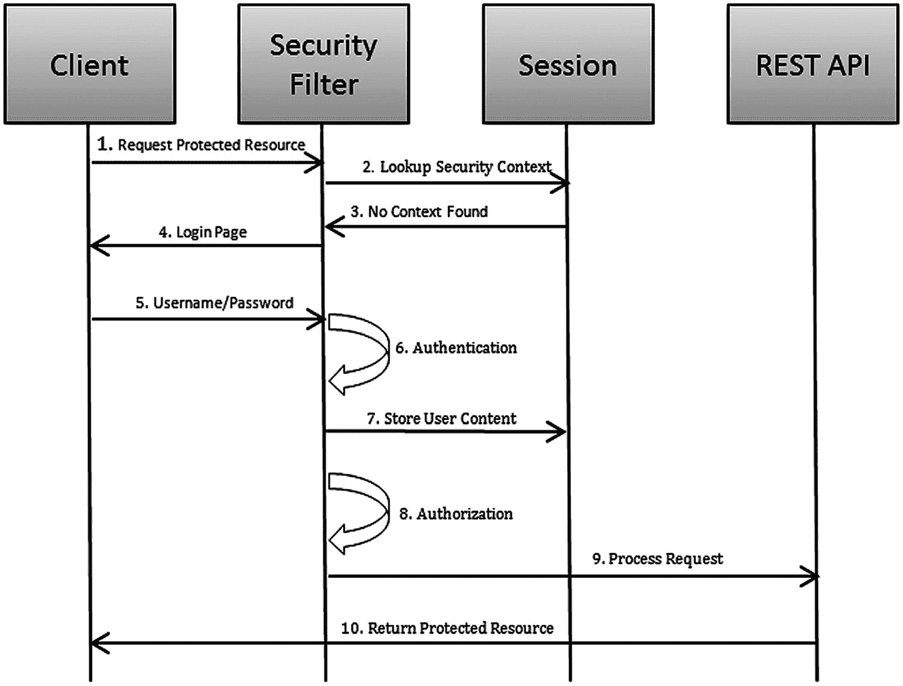
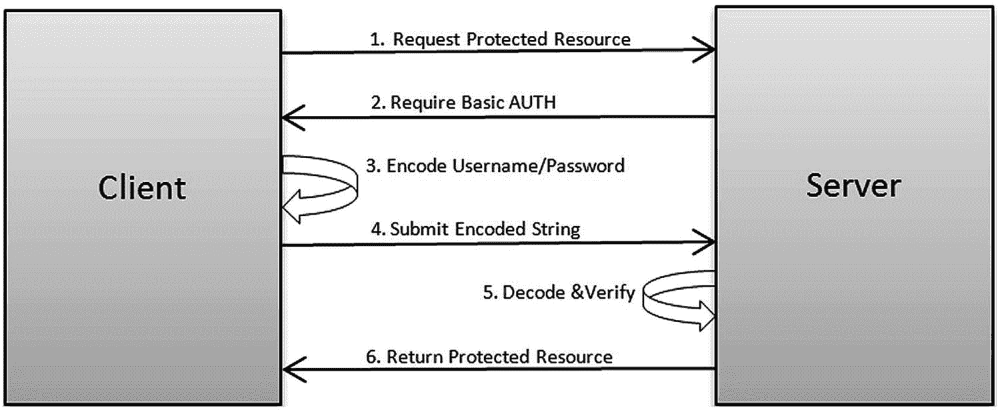
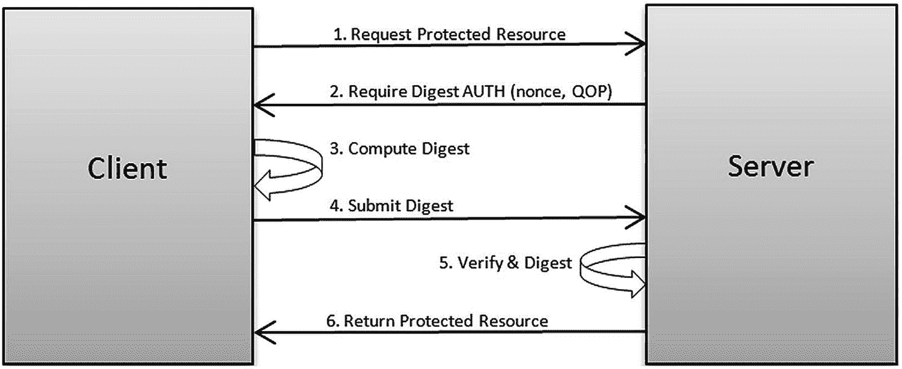
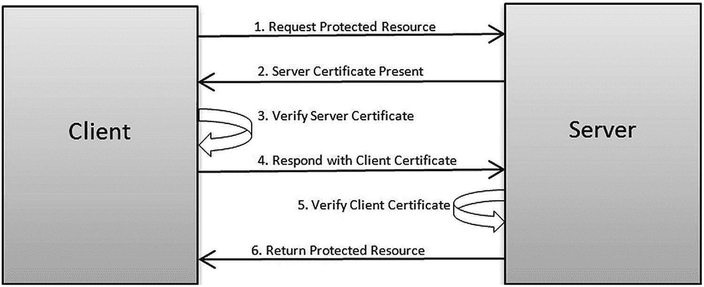
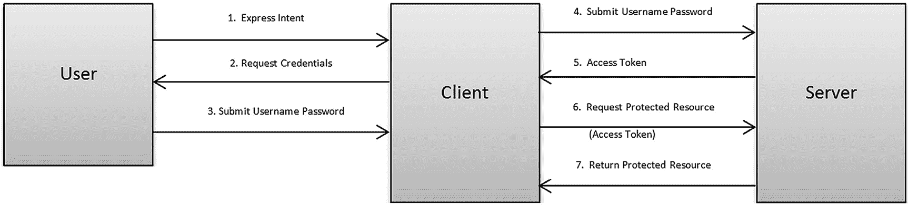
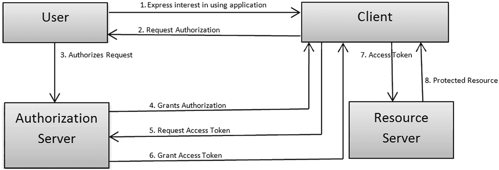
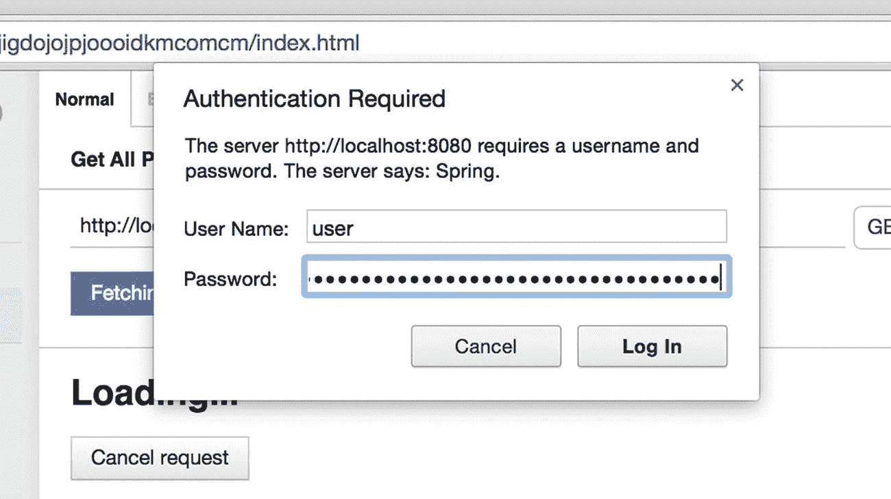
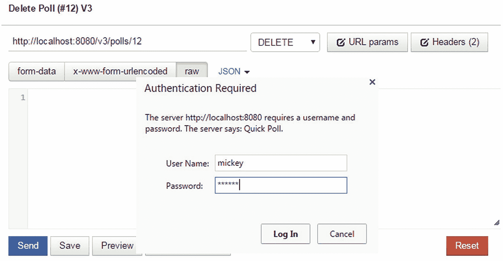
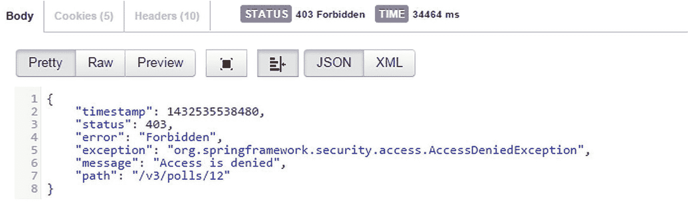
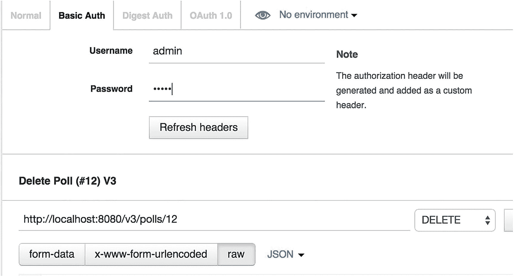

# 8.安全

在本章中，我们将讨论以下内容:

*   保障休息服务的策略

*   OAuth 2.0

*   Spring 安全框架的基础

*   实施快速轮询安全性

要求安全性的传统 web 应用程序通常使用用户名/密码进行身份验证。REST 服务带来了有趣的安全问题，因为它们可以被各种客户端使用，比如浏览器和移动设备。它们也可以被其他服务使用，这种机器对机器的通信可能没有任何人机交互。客户端代表用户消费 REST 服务也并不罕见。在本章中，我们将探索在使用 REST 服务时可以使用的不同的认证/授权方法。然后，我们将研究使用这些方法来保护我们的 QuickPoll 应用程序。

## 保障休息服务

我们首先调查六种用于保护 REST 服务的流行方法:

*   基于会话的安全性

*   HTTP 基本身份验证

*   摘要认证

*   基于证书的安全性

*   扩展验证

*   OAuth

### 基于会话的安全性

基于会话的安全模型依赖于服务器端会话来跨请求保持用户的身份。在典型的 web 应用程序中，当用户试图访问受保护的资源时，会出现一个登录页面。认证成功后，服务器将登录用户的信息存储在 HTTP 会话中。在后续请求中，将查询会话以检索用户信息，并用于执行授权检查。如果用户没有适当的授权，他们的请求将被拒绝。图 [8-1](#Fig1) 是这种方法的图示。



图 8-1

基于会话的安全流

像 Spring Security 这样的框架提供了使用这种安全模型开发应用程序的所有必要的管道。这种方法对于向现有 Spring Web 应用程序添加 REST 服务的开发人员来说非常有吸引力。REST 服务将从会话中检索用户身份，以执行授权检查并相应地提供资源。然而，这种方法违反了无状态 REST 约束。此外，因为服务器保存客户端的状态，所以这种方法是不可伸缩的。理想情况下，客户端应该保存状态，而服务器应该是无状态的。

### HTTP 基本身份验证

当涉及到人工交互时，可以使用登录表单来获取用户名和密码。然而，当我们的服务与其他服务对话时，这可能是不可能的。HTTP 基本身份验证提供了一种机制，允许客户端使用交互和非交互方式发送身份验证信息。

在这种方法中，当客户端向受保护的资源发出请求时，服务器会发送一个 401“未授权”响应代码和一个“`WWW-Authenticate`”头。标头的“`Basic`”部分表示我们将使用基本身份验证，而“`realm`”部分表示服务器上受保护的空间:

```java
GET /protected_resource
401 Unauthorized
WWW-Authenticate: Basic realm="Example Realm"

```

收到响应后，客户端用分号将用户名和密码连接起来，Base64 编码连接起来的字符串。然后，它使用标准的`Authorization`头将信息发送到服务器:

```java
GET /protected_resource
Authorization: Basic bHxpY26U5lkjfdk

```

服务器解码提交的信息并验证提交的凭证。验证成功后，服务器完成请求。整个流程如图 [8-2](#Fig2) 所示。



图 8-2

HTTP 基本认证流程

因为客户端在每个请求中都包含了身份验证信息，所以服务器变成了无状态的。重要的是要记住，客户端只是对信息进行编码，而不是加密。因此，在非 SSL/TLS 连接上，有可能进行中间人攻击并窃取密码。

### 摘要认证

摘要式身份验证方法类似于前面讨论的基本身份验证模型，只是用户凭据是加密发送的。客户端提交对受保护资源的请求，服务器用 401“未授权”响应代码和 WWW-Authenticate 头进行响应。下面是一个服务器响应的示例:

```java
GET /protected_resource
401 Unauthorized
WWW-Authenticate: Digest realm="Example Realm", nonce="P35kl89sdfghERT10Asdfnbvc", qop="auth"

```

注意，`WWW-Authenticate`指定了摘要认证模式以及服务器生成的随机数和 qop。随机数是用于加密目的的任意令牌。qop 或“保护质量”指令可以包含两个值— `"auth"`或`"auth-int"`:

*   qop 值`"auth"`指示摘要用于认证目的。

*   值`"auth-int"`表示摘要将用于认证和请求完整性。

在接收到请求时，如果 qop 值被设置为`"auth,"`，则客户端使用以下公式生成摘要:

```java
hash_value_1 = MD5(username:realm:password)
has_value_2 = MD5(request_method:request_uri)
digest = MD5(hash_value_1:nonce:hash_value_2)

```

如果 qop 值设置为`"auth-int,"`，客户端通过包含请求体来计算摘要:

```java
hash_value_1 = MD5(username:realm:password)
has_value_2 = MD5(request_method:request_uri:MD5(request_body))
digest = MD5(hash_value_1:nonce:hash_value_2)

```

默认情况下，MD5 算法用于计算哈希值。摘要包含在`Authorization`报头中，并发送给服务器。收到请求后，服务器计算摘要并验证用户的身份。验证成功后，服务器完成请求。该方法的完整流程如图 [8-3](#Fig3) 所示。



图 8-3

摘要认证流程

摘要式身份验证方法比基本身份验证更安全，因为密码绝不会以明文形式发送。但是，在非 SSL/TLS 通信中，窥探器仍然可以检索摘要并重放请求。解决这个问题的一个方法是将服务器生成的随机数限制为只能一次性使用。此外，因为服务器必须生成用于验证的摘要，所以它需要能够访问密码的纯文本版本。因此，它不能采用更安全的单向加密算法，如 bcrypt，并且更容易受到服务器端的攻击。

### 基于证书的安全性

基于证书的安全模型依靠证书来验证一方的身份。在基于 SSL/TLS 的通信中，客户端(如浏览器)通常使用证书来验证服务器的身份，以确保服务器是它所声称的那样。此模型可以扩展到执行相互身份验证，其中服务器可以请求客户端证书作为 SSL/TLS 握手的一部分，并验证客户端的身份。

在这种方法中，在接收到对受保护资源的请求时，服务器将其证书提供给客户端。客户端确保可信的证书颁发机构(CA)颁发了服务器的证书，并将其证书发送给服务器。服务器验证客户端的证书，如果验证成功，将授予对受保护资源的访问权限。该流程如图 [8-4](#Fig4) 所示。



图 8-4

基于证书的安全流程

基于证书的安全模型消除了发送共享机密的需要，使其比用户名/密码模型更安全。然而，证书的部署和维护可能非常昂贵，通常用于大型系统。

### 扩展验证

随着 REST APIs 的流行，使用这些 API 的第三方应用程序的数量也显著增加。这些应用程序需要用户名和密码来与 REST 服务交互，并代表用户执行操作。这带来了巨大的安全问题，因为第三方应用程序现在可以访问用户名和密码。第三方应用程序中的安全漏洞可能会危及用户信息。此外，如果用户更改了他的凭证，他需要记得去更新所有这些第三方应用程序。最后，这种机制不允许用户撤销对第三方应用程序的授权。在这种情况下，撤销的唯一选择是更改他的密码。

扩展验证和 OAuth 方案提供了一种代表用户访问受保护资源而无需存储密码的机制。在这种方法中，客户端应用程序通常使用登录表单向用户请求用户名和密码。然后，客户端将用户名和密码发送给服务器。服务器接收用户的凭证并验证它们。验证成功后，将向客户端返回一个令牌。客户端丢弃用户名和密码信息，并将令牌存储在本地。当访问用户的受保护资源时，客户端会在请求中包含令牌。这通常是使用定制的 HTTP 头(如`X-Auth-Token`)来完成的。令牌的寿命取决于实现的服务。令牌可以一直保留，直到服务器将其撤销，或者令牌可以在指定的时间段内过期。该流程如图 [8-5](#Fig5) 所示。



图 8-5

扩展验证安全流程

Twitter 之类的应用程序允许第三方应用程序使用扩展验证方案访问它们的 REST API。然而，即使有了扩展验证，第三方应用程序也需要捕获用户名和密码，这就留下了误用的可能性。考虑到 XAuth 的简单性，当同一个组织同时开发客户端和 REST API 时，它可能是一个不错的选择。

### OAuth 2.0

开放授权(OAuth)是一个框架，用于代表用户访问受保护的资源，而无需存储密码。OAuth 协议于 2007 年首次推出，并被 2010 年推出的 OAuth 2.0 所取代。在本书中，我们将回顾 OAuth 2.0 和一般原则。

OAuth 2.0 定义了以下四个角色:

*   资源所有者—资源所有者是希望授予其部分帐户或资源访问权限的用户。例如，资源所有者可以是 Twitter 或脸书用户。

*   客户端—客户端是希望访问用户资源的应用程序。这可能是一个第三方应用程序，如 Klout ( [`https://klout.com/`](https://klout.com/) )想要访问用户的 Twitter 帐户。

*   授权服务器—授权服务器验证用户的身份，并向客户端授予令牌以访问用户的资源。

*   资源服务器—资源服务器托管受保护的用户资源。例如，这将是 Twitter API 来访问推文和时间线等等。

图 [8-6](#Fig6) 描述了这四个角色之间的相互作用。OAuth 2.0 要求这些交互在 SSL 上进行。



图 8-6

OAuth 2.0 安全流程

在客户端参与图 [8-6](#Fig6) 所示的“OAuth 舞蹈”之前，它必须向授权服务器注册。对于大多数公共 API，如脸书和 Twitter，这涉及到填写申请表和提供有关客户端的信息，如应用程序名称、基本域和网站。注册成功后，客户端将收到一个客户端 ID 和一个客户端密码。客户端 ID 用于唯一标识客户端，并且是公开可用的。这些客户端凭证在 OAuth 交互中起着重要的作用，我们稍后将对此进行讨论。

OAuth 交互始于用户表达对使用第三方应用程序“客户机”的兴趣。客户端代表用户请求访问受保护资源的授权，并将用户/资源所有者重定向到授权服务器。客户端可以将用户重定向到的 URI 示例如下所示:

```java
https://oauth2.example.com/authorize?client_id=CLIENT_ID&response_type=auth_code&call_back=CALL_BACK_URI&scope=read,tweet

```

任何生产 OAuth 2.0 交互都必须使用 HTTPS，因此，URI 以 https 开始。`CLIENT_ID`用于向授权服务器提供客户端的身份。scope 参数提供了客户端需要的一组逗号分隔的作用域/角色。

收到请求后，授权服务器通常会通过登录表单向用户提供身份验证质询。用户提供他的用户名和密码。成功验证用户凭证后，授权服务器使用`CALL_BACK_URI`参数将用户重定向到客户端应用程序。授权服务器还将授权代码附加到`CALL_BACK_URI`参数值上。下面是授权服务器可能生成的 URL 示例:

```java
https://mycoolclient.com/code_callback?auth_code=6F99A74F2D066A267D6D838F88

```

然后，客户端使用授权码向授权服务器请求访问令牌。为此，客户端通常会在 URI 上执行 HTTP POST，如下所示:

```java
https://oauth2.example.com/access_token?client_id=CLIENT_ID&client_secret=CLIENT_SECRET&
auth_code=6F99A74F2D066A267D6D838F88

```

如您所见，客户端在请求中提供了其凭证。授权服务器验证客户端的身份和授权码。验证成功后，它返回一个访问令牌。以下是 JSON 格式的响应示例:

```java
{"access_token"="f292c6912e7710c8"}

```

收到访问令牌后，客户机将向资源服务器请求受保护的资源，并传递它获得的访问令牌。资源服务器验证访问令牌并为受保护的资源提供服务。

#### OAuth 客户端配置文件

OAuth 2.0 的优势之一是它支持各种客户端配置文件，如“web 应用程序”、“本机应用程序”和“用户代理/浏览器应用程序”。前面讨论的授权代码流(通常称为*授权许可类型*)适用于具有基于 web 的用户界面和服务器端后端的“web 应用程序”客户端。这允许客户端将授权代码存储在安全的后端，并在将来的交互中重用它。其他客户端配置文件有自己的流程，这些流程决定了四个 OAuth 2.0 参与者之间的交互。

纯基于 JavaScript 的应用程序或原生应用程序不能安全地存储授权码。因此，对于这样的客户端，来自授权服务器的回调不包含授权代码。取而代之的是，*隐式授权类型*方法被采用，并且访问令牌被直接移交给客户端，然后用于请求受保护的资源。属于此客户端配置文件的应用程序没有客户端密码，只是使用客户端 ID 进行标识。

OAuth 2.0 还支持授权流，称为*密码授权类型*，类似于上一节讨论的扩展验证。在这个流程中，用户直接向客户端应用程序提供他的凭证。他永远不会被重定向到授权服务器。客户端将这些凭证传递给授权服务器，并接收用于请求受保护资源的访问令牌。

OAuth 1.0 引入了几个实现复杂性，尤其是在用客户端凭证签署请求的加密要求方面。OAuth 2.0 简化了这一点，消除了签名，并要求所有交互都使用 HTTPS。然而，由于 OAuth 2 的许多特性是可选的，该规范导致了不可互操作的实现。

#### 刷新令牌与访问令牌

访问令牌的生命周期可能是有限的，客户端应该为令牌不再工作的可能性做好准备。为了防止资源所有者重复认证，OAuth 2.0 规范提供了刷新令牌的概念。当授权服务器生成访问令牌时，它可以选择性地发布刷新令牌。客户端存储该刷新令牌，并且当访问令牌到期时，它联系授权服务器以获得一组新的访问令牌以及刷新令牌。规范允许为授权和密码授予类型的流生成刷新令牌。考虑到“隐式授权类型”缺乏安全性，刷新令牌被禁止用于这种客户端配置文件。

## Spring 安全性概述

为了在 QuickPoll 应用程序中实现安全性，我们将使用另一个流行的 Spring 子项目，即 Spring Security。在我们继续实现之前，让我们了解一下 Spring Security 和组成框架的不同组件。

Spring Security，以前称为 Acegi Security，是一个保护基于 Java 的应用程序的框架。它提供了对各种身份验证系统的现成集成，如 LDAP、Kerberos、OpenID、OAuth 等等。通过最少的配置，它可以很容易地扩展到任何定制的身份验证和授权系统。该框架还实现了安全最佳实践，并内置了一些功能来防范诸如 CSRF、跨站点请求伪造、会话修复等攻击。

Spring Security 提供了一个一致的安全模型，可以用来保护 web URLs 和 Java 方法。下面列出了 Spring 安全认证/授权过程中涉及的高级步骤以及涉及的组件:

1.  这个过程从用户请求一个受 Spring 保护的 web 应用程序上的受保护资源开始。

2.  请求通过一系列被称为“过滤器链”的 Spring 安全过滤器，这些过滤器识别服务请求的`org.springframework.security.web.AuthenticationEntryPoint`。`AuthenticationEntryPoint`将用一个认证请求来响应客户端。例如，这可以通过向用户发送登录页面来实现。

3.  在从用户接收到诸如用户名/密码的认证信息时，创建一个`org.springframework.security.core.Authentication`对象。清单 [8-1](#PC10) 中显示了`Authentication`接口，它的实现在 Spring 安全性中扮演着双重角色。它们代表身份验证请求的令牌或身份验证成功完成后完全通过身份验证的主体。`isAuthenticated`方法可以用来确定一个`Authentication`实例所扮演的当前角色。在用户名/密码认证的情况下，`getPrincipal`方法返回用户名，`getCredentials`返回密码。`getUserDetails`方法包含 IP 地址等附加信息。

1.  作为下一步，认证请求令牌被呈现给`org.springframework.security.authentication.AuthenticationManager`。清单 [8-2](#PC11) 中的`AuthenticationManager,`包含一个 authenticate 方法，该方法接受一个认证请求令牌并返回一个完全填充的`Authentication`实例。Spring 提供了一个名为`ProviderManager`的`AuthenticationManager`的现成实现。

```java
public interface Authentication extends Principal, Serializable {

        Object getPrincipal();
        Object getCredentials();
        Object getDetails();
        Collection<? extends GrantedAuthority> getAuthorities();
        boolean isAuthenticated();

void setAuthenticated(boolean isAuthenticated) throws IllegalArgumentException;
}

Listing 8-1Authentication API

```

1.  为了执行认证，`ProviderManager`需要将提交的用户信息与后端用户存储(如 LDAP 或数据库)进行比较。`ProviderManager`将这一职责委托给一系列`org.springframework.security.authentication.AuthenticationProvider`。这些`AuthenticationProvider`使用一个`org.springframework.security.core.userdetails.UserDetailsService`从后端存储中检索用户信息。清单 [8-3](#PC12) 展示了用户详细信息服务 API。

```java
public interface AuthenticationManager {

Authentication authenticate(Authentication authentication)
throws AuthenticationException;

}

Listing 8-2AuthenticationManager API

```

```java
public interface UserDetailsService {

UserDetails loadUserByUsername(String username)
throws UsernameNotFoundException;
}

Listing 8-3UserDetailsService API

```

`JdbcDaoImpl`和`LdapUserDetailService`等`UserDetailsService`的实现将使用传入的用户名来检索用户信息。这些实现还将创建一组代表用户在系统中的角色/权限的`GrantedAuthority`实例。

1.  `AuthenticationProvider`将提交的凭证与后端系统中的信息进行比较，在成功验证后，`org.springframework.security.core.userdetails.UserDetails`对象用于构建一个完全填充的`Authentication`实例。

2.  然后将`Authentication`实例放入一个`org.springframework.security.core.context.SecurityContextHolder`中。顾名思义，`SecurityContextHolder` `,`只是将登录用户的上下文与当前执行的线程相关联，以便在用户请求或操作中随时可用。在基于 web 的应用程序中，登录用户的上下文通常存储在用户的 HTTP 会话中。

3.  然后，Spring Security 使用一个`org.springframework.security.access.intercept.AbstractSecurityInterceptor`及其实现`org.springframework.security.web.access.intercept.FilterSecurityInterceptor`和`org.springframework.security.access.intercept.aopalliance.MethodSecurityInterceptor`来执行授权检查。`FilterSecurityInterceptor`用于基于 URL 的授权，`MethodSecurityInterceptor`用于方法调用授权。

4.  `AbstractSecurityInterceptor`依靠安全配置和一组`org.springframework.security.access.AccessDecisionManager`来决定用户是否被授权。授权成功后，用户就可以访问受保护的资源。

Note

为了简单起见，我在这些步骤中有意省略了一些 Spring 安全类。关于 Spring 安全和认证/授权步骤的完整回顾，请参考*Pro Spring Security*(a press，2019)。

现在，您已经对 Spring Security 的认证/授权流程及其一些组件有了基本的了解，让我们看看如何将 Spring Security 集成到我们的 QuickPoll 应用程序中。

## 保护快速投票

我们将在 QuickPoll 应用程序中实现安全性，以满足以下两个要求:

*   注册用户可以创建和访问投票。这使我们能够跟踪帐户、使用情况等等。

*   只有具有管理员权限的用户才能删除投票

Note

在本章中，我们将继续建立在前几章中对 QuickPoll 应用程序所做的工作。或者，您可以在下载的源代码的`Chapter8\starter`文件夹中使用一个 starter 项目。在本章中，我们将使用基本认证来保护快速轮询。然后我们将为 QuickPoll 添加 OAuth 2.0 支持。因此，`Chapter8\final`文件夹包含两个文件夹:`quick-poll-ch8-final-basic-auth`和`quick-poll-ch8-final`。`quick-poll-ch8-final-basic-auth`包含在 QuickPoll 中添加了基本认证的解决方案。`quick-poll-ch8-final`包含添加了基本认证和 OAuth 2.0 的完整解决方案。我们知道并非所有项目都需要 OAuth 2.0 支持。因此，将最终的解决方案分成两个项目可以让您检查和使用您需要的特性/代码。请参考`final`文件夹下的解决方案，获取包含 getter/setter 和附加导入的完整列表。下载的`Chapter8`文件夹还包含一个导出的 Postman 集合，其中包含与本章相关的 REST API 请求。

通过要求用户认证，我们将彻底改变 QuickPoll 应用程序的行为。为了允许现有用户继续使用我们的 QuickPoll 应用程序，我们将创建一个新版本(v3)的 API 来实现这些更改。为此，在`src\main\java`下创建一个新的`com.apress.v3.controller`包，并从`com.apress.v2.controller`包中复制控制器。对于新复制的控制器，将`RequestMapping`从`/v2/`更改为`/v3/`，并将控制器名称前缀从`v2`更改为`v3`以反映 API 版本 3。我们通过将清单 [8-4](#PC13) 中所示的 Spring Security starter 依赖项添加到 QuickPoll 项目的`pom.xml`文件中来开始实现。这将把所有与 Spring 安全相关的 JAR 文件引入到项目中。

```java
<dependency>
        <groupId>org.springframework.boot</groupId>
        <artifactId>spring-boot-starter-security</artifactId>
</dependency>

Listing 8-4Spring Starter POM

```

当在类路径中看到 Spring Security 时，Spring Boot 添加了默认的安全配置，该配置使用 HTTP 基本认证来保护所有的 HTTP 端点。启动 QuickPoll 应用程序，并使用 Postman 向`http://localhost:8080/v3/polls`提交一个 GET 请求。Postman 显示一个验证窗口，提示您输入用户名和密码，如图 [8-7](#Fig7) 所示。



图 8-7

邮递员中的基本认证窗口

Spring Boot 的默认安全配置是带有用户名 user 的单个用户。Spring Boot 为用户生成一个随机密码，并在应用程序启动时在`INFO`日志级别打印出来。在您的控制台/日志文件中，您应该会看到如下所示的条目:

```java
Using default security password: 554cc6c2-67e1-4f1e-8c5b-096609e2d0b1

```

将在控制台中找到的用户名和密码输入 Postmaster 登录窗口，然后点击登录。Spring Security 将验证输入的凭证，并允许完成请求。

### 卷曲

到目前为止，我们一直使用 Postman 来测试我们的 QuickPoll 应用程序。在本章中，我们将结合 Postman 使用一个名为 cURL 的命令行工具。cURL 是一个流行的开源工具，用于与服务器交互和使用 URL 语法传输数据。它安装在大多数操作系统发行版中。如果您的系统上没有 cURL，请按照 [`http://curl.haxx.se/download.html`](http://curl.haxx.se/download.html) 中的说明下载并在您的机器上安装 cURL。有关在 Windows 机器上安装 cURL 的说明，请参考附录 A。

要使用 cURL 测试我们的 QuickPoll 基本身份验证，请在命令行运行以下命令:

```java
curl -vu user:554cc6c2-67e1-4f1e-8c5b-096609e2d0b1 http://localhost:8080/v3/polls

```

在这个命令中，`–v`选项请求 cURL 在调试模式(详细)下运行。`–u`选项允许我们指定基本认证所需的用户名和密码。在 [`http://curl.haxx.se/docs/manual.html`](http://curl.haxx.se/docs/manual.html) 可以获得卷曲选项的完整列表。

### 用户基础设施设置

虽然 Spring Boot 已经大大简化了 Spring 安全集成，但是我们希望定制安全行为，以便它使用应用程序用户而不是 Spring Boot 的通用用户。我们还想对 v3 `PollController`应用安全性，让其他端点匿名访问。在我们研究定制 Spring 安全性之前，让我们设置一下创建/更新 QuickPoll 应用程序用户所需的基础设施。

我们首先创建一个如清单 [8-5](#PC16) 所示的`User`域对象来表示快速轮询用户。`User`类包含了`username`、`password`、`firstname`和`lastname`等属性。它还包含一个布尔标志，用于指示用户是否具有管理权限。作为安全最佳实践，我们用`@JsonIgnore`注释了`password`字段。因此，密码字段将不包含在`user`的表示中，从而阻止客户端访问密码值。因为“用户”是 Oracle 等数据库中的一个关键字，所以我们使用了`@Table`注释为与这个`User`实体对应的表命名为“用户”。

```java
package com.apress.domain;

import javax.persistence.Table;
import org.hibernate.annotations.Type;
import com.fasterxml.jackson.annotation.JsonIgnore;
import org.hibernate.annotations.Type;
import javax.validation.constraints.NotEmpty;

@Entity
@Table(name="USERS")
public class User {

        @Id
        @GeneratedValue
        @Column(name="USER_ID")
        private Long id;

        @Column(name="USERNAME")
        @NotEmpty
        private String username;

        @Column(name="PASSWORD")
        @NotEmpty
        @JsonIgnore
        private String password;

        @Column(name="FIRST_NAME")
        @NotEmpty
        private String firstName;

        @Column(name="LAST_NAME")
        @NotEmpty
        private String lastName;

        @Column(name="ADMIN", columnDefinition="char(3)")
        @Type(type="yes_no")
        @NotEmpty
        private boolean admin;

        // Getters and Setters omitted for brevity
}

Listing 8-5User Class

```

我们将在数据库中存储 QuickPoll 用户，因此需要一个`UserRepository`来对用户实体执行 CRUD 操作。清单 [8-6](#PC17) 显示了在`com.apress.repository`包下创建的`UserRepository`接口。除了`CrudRepository`提供的查找器方法外，`UserRepository`还包含一个名为`findByUsername`的自定义查找器方法。Spring Data JPA 将提供一个运行时实现，以便`findByUsername`方法检索与传入的用户名参数相关联的用户。

```java
package com.apress.repository;

import org.springframework.data.repository.CrudRepository;
import com.apress.domain.User;

public interface UserRepository extends CrudRepository<User, Long> {
        public User findByUsername(String username);
}

Listing 8-6UserRepository Interface

```

QuickPoll 等应用程序通常有一个允许新用户注册的界面。为了简化本书，我们生成了一些测试用户，如清单 [8-7](#PC18) 所示。将这些 SQL 语句复制到 QuickPoll 项目的 src\main\resources 文件夹下的`import.sql`文件的末尾。当应用程序被引导时，Hibernate 会将这些测试用户加载到“users”表中，并使它们可供应用程序使用。

```java
insert into users (user_id, username, password, first_name, last_name, admin) values
(1, 'mickey', '$2a$10$kSqU.ek5pDRMMK21tHJlceS1xOc9Kna4F0DD2ZwQH/LAzH0ML0p6.', 'Mickey', 'Mouse', 'no');
insert into users (user_id, username, password, first_name, last_name, admin) values
(2, 'minnie', '$2a$10$MnHcLn.XdLx.iMntXsmdgeO1B4wAW1E5GOy/VrLUmr4aAzabXnGFq', 'Minnie', 'Mouse', 'no');
insert into users (user_id, username, password, first_name, last_name, admin) values
(3, 'donald', '$2a$10$0UCBI04PCXiK0pF/9kI7.uAXiHNQeeHdkv9NhA1/xgmRpfd4qxRMG', 'Donald', 'Duck', 'no');
insert into users (user_id, username, password, first_name, last_name, admin) values
(4, 'daisy', '$2a$10$aNoR88g5b5TzSKb7mQ1nQOkyEwfHVQOxHY0HX7irI8qWINvLDWRyS', 'Daisy', 'Duck', 'no');
insert into users (user_id, username, password, first_name, last_name, admin) values
(5, 'clarabelle', '$2a$10$cuTJd2ayEwXfsPdoF5/hde6gzsPx/gEiv8LZsjPN9VPoN5XVR8cKW', 'Clarabelle', 'Cow', 'no');
insert into users (user_id, username, password, first_name, last_name, admin) values
(6, 'admin', '$2a$10$JQOfG5Tqnf97SbGcKsalz.XpDQbXi1APOf2SHPVW27bWNioi9nI8y', 'Super', 'Admin', 'yes');

Listing 8-7Test User Data

```

注意，生成的测试用户的密码不是纯文本的。遵循良好的安全实践，我使用 BCrypt ( [`http://en.wikipedia.org/wiki/Bcrypt`](http://en.wikipedia.org/wiki/Bcrypt) )自适应散列函数加密了密码值。表 [8-1](#Tab1) 显示了这些测试用户及其密码的纯文本版本。

表 8-1

测试用户信息

<colgroup><col class="tcol1 align-left"> <col class="tcol2 align-left"> <col class="tcol3 align-left"></colgroup> 
| 

用户名

 | 

密码

 | 

是管理员

 |
| --- | --- | --- |
| `Mickey` | 奶酪 | 不 |
| `Minnie` | Red01 | 不 |
| `Donald` | 骗人的 | 不 |
| `Daisy` | 夸克 2 | 不 |
| `Clarabelle` | 牛叫声 | 不 |
| `Admin` | 管理 | 是 |

### UserDetailsService 实现

在 Spring Security introduction 一节中，我们了解到,`UserDetailsService`通常用于检索`user`信息，在身份验证过程中会与用户提交的凭证进行比较。清单 [8-8](#PC19) 显示了我们 QuickPoll 应用程序的`UserDetailsService`实现。

```java
package com.apress.security;

import javax.inject.Inject;
import org.springframework.security.core.GrantedAuthority;
import org.springframework.security.core.authority.AuthorityUtils;
import org.springframework.security.core.userdetails.UserDetails;
import org.springframework.security.core.userdetails.UserDetailsService;
import org.springframework.security.core.userdetails.UsernameNotFoundException;
import org.springframework.stereotype.Component;
import com.apress.domain.User;
import com.apress.repository.UserRepository;

@Component
public class QuickPollUserDetailsService implements UserDetailsService {

        @Inject
        private UserRepository userRepository;

        @Override

public UserDetails loadUserByUsername(String username) throws UsernameNotFoundException {

                User user = userRepository.findByUsername(username);

                if(user == null) {

throw new UsernameNotFoundException(String.format("User with the username %s doesn't exist", username));
                }

                // Create a granted authority based on user's role.

// Can't pass null authorities to user. Hence initialize with an
empty arraylist
                List<GrantedAuthority> authorities = new ArrayList<>();
                if(user.isAdmin()) {
                        authorities = AuthorityUtils.createAuthorityList("ROLE_ADMIN");
                }

                // Create a UserDetails object from the data

UserDetails userDetails = new org.springframework.security.core.userdetails.User(user.getUsername(), user.getPassword(), authorities);

                return userDetails;
        }
}

Listing 8-8UserDetailsService Implementation for QuickPoll

```

`QuickPollUserDetailsService`类利用`UserRepository`从数据库中检索`User`信息。然后，它检查检索到的用户是否具有管理权限，并构造一个 admin `GrantedAuthority`，即`ROLE_ADMIN`。Spring 安全基础设施期望`loadUserByUsername`方法返回类型`UserDetails`的实例。因此，`QuickPollUserDetailsService`类创建了`o.s.s.c.u.User`实例，并用从数据库中检索到的数据填充它。`o.s.s.c.u.User`是`UserDetails`接口的具体实现。如果`QuickPollUserDetailsService`在数据库中找不到传入用户名的用户，它将抛出一个`UsernameNotFoundException`异常。

### 自定义 Spring 安全性

定制 Spring Security 的默认行为包括创建一个用`@EnableWebSecurity`注释的配置类。这个配置类通常扩展了提供帮助方法的`org.springframework.security.config.annotation.web.configuration.WebSecurityConfigurer`类，以简化我们的安全配置。清单 [8-9](#PC20) 显示了`SecurityConfig`类，它将包含 QuickPoll 应用程序的安全相关配置。

```java
package com.apress;

import javax.inject.Inject;
import org.springframework.context.annotation.Configuration;
import org.springframework.security.config.annotation.authentication.builders.AuthenticationManagerBuilder;
import org.springframework.security.config.annotation.web.configuration.EnableWebSecurity;
import org.springframework.security.config.annotation.web.configuration.WebSecurityConfigurerAdapter;
import org.springframework.security.core.userdetails.UserDetailsService;
import org.springframework.security.crypto.bcrypt.BCryptPasswordEncoder;

@Configuration
@EnableWebSecurity
public class SecurityConfig extends WebSecurityConfigurerAdapter {

        @Inject
        private UserDetailsService userDetailsService;

        @Override
        protected void configure(AuthenticationManagerBuilder auth) throws Exception {
                auth.userDetailsService(userDetailsService)
                        .passwordEncoder(new BCryptPasswordEncoder());
        }
}

Listing 8-9Security Configuration for QuickPoll

```

`SecurityConfig`类声明了一个`userDetailsService`属性，该属性在运行时被注入了一个`QuickPollUserDetailsService`实例。它还覆盖了一个超类的`configure`方法，该方法将一个`AuthenticationManagerBuilder`作为参数。`AuthenticationManagerBuilder`是一个助手类，它实现了 Builder 模式，提供了一种组装`AuthenticationManager`的简单方法。在我们的方法实现中，我们使用`AuthenticationManagerBuilder`来添加`UserDetailsService`实例。因为我们已经使用 BCrypt 算法加密了存储在数据库中的密码，所以我们提供了一个`BCryptPasswordEncoder`的实例。authentication manager 框架将使用密码编码器来比较用户提供的普通字符串和数据库中存储的加密哈希。

配置就绪后，重新启动 QuickPoll 应用程序，并在命令行运行以下命令:

```java
curl -u mickey:cheese http://localhost:8080/v2/polls

```

如果您在没有`–u`选项和用户名/密码数据的情况下运行该命令，您将收到来自服务器的 403 错误，如下所示:

```java
{"timestamp":1429998300969,"status":401,"error":"Unauthorized","message":"Full authentication is required to access this resource","path":"/v2/polls"}

```

### 保护 URI

上一节中介绍的`SecurityConfig`类通过配置 HTTP 基本认证来使用 QuickPoll 用户，使我们更进一步。但是，这种配置保护所有端点，并且需要身份验证才能访问资源。为了实现我们只保护 v3 轮询 API 的需求，我们将覆盖另一个`WebSecurityConfigurer`的`config`方法。清单 [8-10](#PC23) 显示了需要添加到`SecurtyConfig`类中的配置方法实现。

```java
import org.springframework.security.config.annotation.web.builders.HttpSecurity;
import org.springframework.security.config.http.SessionCreationPolicy;

@Override
protected void configure(HttpSecurity http) throws Exception {

        http
          .sessionManagement()
             .sessionCreationPolicy(SessionCreationPolicy.STATELESS)
             .and()
          .authorizeRequests()
             .antMatchers("/v1/**", "/v2/**", "/swagger-ui/**", "/api-docs/**").permitAll()
             .antMatchers("/v3/polls/ **").authenticated()
             .and()
          .httpBasic()
             .realmName("Quick Poll")
             .and()
          .csrf()
             .disable();
}

Listing 8-10New Config Method in SecurityConfig

```

清单 [8-10](#PC23) 中传递给 config 方法的`HttpSecurity`参数允许我们指定 URI 应该是安全的还是不安全的。我们通过请求 Spring Security 不创建 HTTP 会话并且不在会话中存储登录用户的`SecurityContext`来开始方法实现。这是通过使用`SessionCreationPolicy.STATELESS`创建策略实现的。然后我们使用`antMatchers`来提供我们不希望 Spring 安全保护的蚂蚁风格的 URI 表达式。使用`permitAll`方法，我们指定 API 版本 1 和 2 以及 Swagger UI 应该是匿名可用的。下一个`antMatchers`和`authenticated`方法指定 Spring Security 应该只允许经过认证的用户访问 V3 Polls API。最后，我们启用 HTTP 基本身份验证，并将领域名称设置为“快速轮询”重新启动 QuickPoll 应用程序，应该只提示您对`/v3/polls`资源进行身份验证。

Note

跨站点请求伪造或 CSRF ( [`http://en.wikipedia.org/wiki/Cross-site_request_forgery`](http://en.wikipedia.org/wiki/Cross-site_request_forgery) )是一种安全漏洞，恶意网站通过这种漏洞迫使最终用户在他们当前已通过身份验证的不同网站上执行不需要的命令。默认情况下，Spring Security 启用 CSRF 保护，并强烈建议用户通过浏览器提交请求时使用它。对于非浏览器客户端使用的服务，可以禁用 CSRF。通过实现自定义的`RequestMatcher`,可以仅对某些 URL 或 HTTP 方法禁用 CSRF。

为了保持本书的简单和易管理，我们禁用了 CSRF 保护。

我们的最后一项安全要求是确保只有具有管理权限的用户才能删除投票。为了实现这个授权需求，我们将在`deletePoll`方法上应用 Spring Security 的方法级安全性。Spring 的方法级安全性可以使用恰当命名的`org.springframework.security.config.annotation.method.configuration. EnableGlobalMethodSecurity`注释来启用。清单 [8-11](#PC24) 显示了添加到`SecurityConfig`类的注释。

```java
package com.apress;
import org.springframework.security.config.annotation.method.configuration.EnableGlobalMethodSecurity;

@Configuration
@EnableWebSecurity
@EnableGlobalMethodSecurity(prePostEnabled = true)
public class SecurityConfig extends WebMvcConfigurer {
        // Content removed for brevity
}

Listing 8-11EnableGlobalMethodSecurity Annotation Added

```

Spring Security 支持丰富的类和方法级授权注释，以及基于标准的 JSR 250 注释安全性。`EnableGlobalMethodSecurity`中的`prePostEnabled`标志请求 Spring Security 启用执行方法调用前后授权检查的注释。下一步是用清单 [8-12](#PC25) 所示的`@PreAuthorize`注释来注释 v3 `PollController`的`deletePoll`方法。

```java
import org.springframework.security.access.prepost.PreAuthorize;

@PreAuthorize("hasAuthority('ROLE_ADMIN')")
public ResponseEntity<Void> deletePoll(@PathVariable Long pollId) {
        // Code removed for brevity
}

Listing 8-12PreAuthorize Annotation Added

```

`@PreAuthorize`注释决定是否可以调用`deletePoll`方法。Spring Security 通过评估作为注释值传入的 Spring-EL 表达式来做出这个决定。在这种情况下，`hasAuthority`检查登录用户是否拥有“ROLE_ADMIN”权限。重启应用程序，并使用 Postman 在端点`http://localhost:8080/v3/polls/12`上执行删除。当提示输入凭证时，输入用户名 mickey 和密码 cheese，然后点击 Log In。图 [8-8](#Fig8) 显示了请求和相关输入。



图 8-8

删除未经授权用户的投票

由于用户 mickey 没有管理权限，您将看到来自服务的未授权响应，如图 [8-9](#Fig9) 所示。



图 8-9

未经授权的删除响应

现在让我们使用具有管理权限的管理员用户重试这个请求。在 Postman 中，点击基本认证选项卡，输入证书 admin/admin，点击“刷新标题”，如图 [8-10](#Fig10) 所示。在提交请求时，您应该看到 ID 为 12 的投票资源被删除了。



图 8-10

邮递员中的基本身份验证管理凭证

要使用 cURL 删除投票，请运行以下命令:

```java
curl -i -u admin:admin  -X DELETE http://localhost:3/v3/polls/13

```

前面提到的命令删除了一个 ID 为 13 的轮询资源。`–i`选项请求 curl 输出响应头。`–X`选项允许我们指定 HTTP 方法名。在我们的例子中，我们指定了 DELETE HTTP 方法。该结果的输出如清单 [8-13](#PC27) 所示。

```java
HTTP/1.1 200 OK
Server: Apache-Coyote/1.1
X-Content-Type-Options: nosniff
X-XSS-Protection: 1; mode=block
Cache-Control: no-cache, no-store, max-age=0, must-revalidate
Pragma: no-cache
Expires: 0
X-Frame-Options: DENY
Content-Length: 0
Date: Sat, 25 Apr 2015 21:50:35 GMT

Listing 8-13Output of cURL Delete

```

## 摘要

安全性是任何企业应用程序的一个重要方面。在本章中，我们回顾了保护 REST 服务的策略。我们还深入研究了 OAuth 2，并回顾了它的不同组件。然后，我们使用 Spring Security 在 QuickPoll 应用程序中实现基本的身份验证。在下一章，我们将使用 Spring 的 RestTemplate 来构建 REST 客户端。我们还将使用 Spring MVC 测试框架在 REST 控制器上执行单元和集成测试。